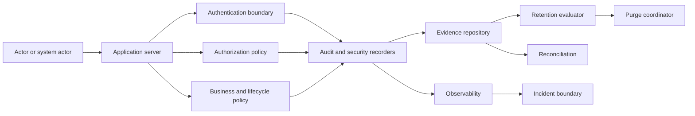
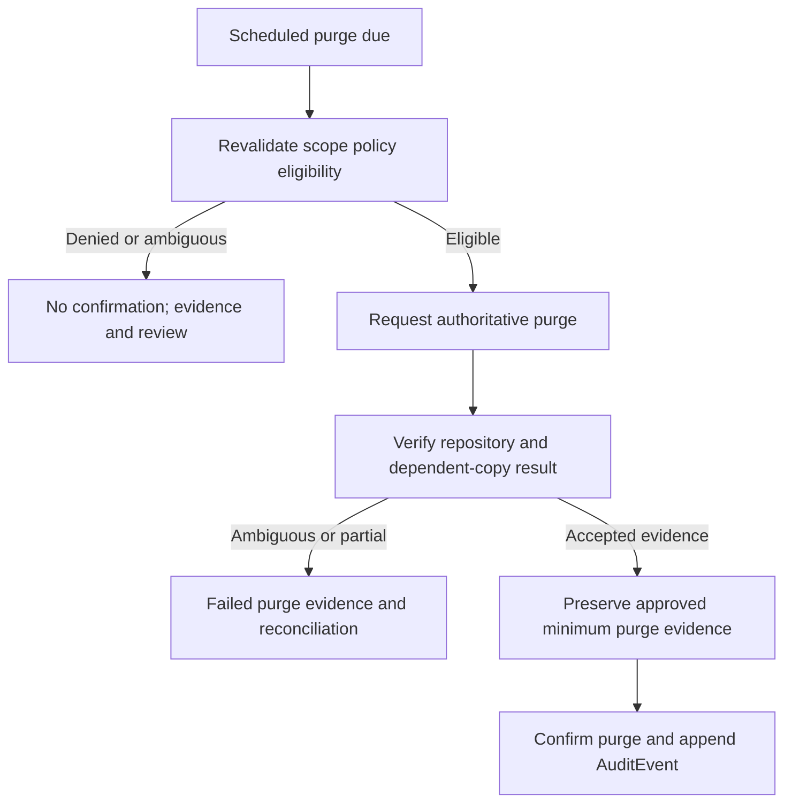

# Foundation V1 Audit and Retention Architecture

## 1. Document status

| Item | Status |
|---|---|
| Document | Technical-discovery document |
| Implementation | **NOT AUTHORIZED** |
| Source branch | `rebuild/foundation-v1` |
| Analysis date | 2026-07-23 |
| Current application | **VERIFIED FACT:** legacy browser-side prototype |
| Authority | Product Owner Decisions 1–10 are authoritative; approved Foundation V1 discovery documents are required inputs |
| Providers | No database, ORM, audit store, log platform, SIEM, storage, archive, backup, queue, scheduler, workflow, identity, payment, encryption, timestamping, OCR, AI, observability, or hosting provider is selected |
| Names | Conceptual events and interfaces are not implementation identifiers |
| Data and release | No real-document or real-customer evidence processing and no Production release are authorized |
| Certification | No legal, compliance, security, privacy, evidentiary, or retention certification is claimed |

## 2. Scope

**APPROVED BASELINE:** This document covers `AuditEvent`, `SecurityEvent`, their relationship to `LifecycleEvent`, identity, session, invitation, membership, authorization, role, permission, scope, ownership, tenant, commercial, plan, licence, seat, entitlement, feature, restriction, document storage, access, lifecycle, deletion, retention, purge, and reconciliation evidence. It defines actor and system-actor attribution, provenance, correlation, temporal integrity, versioned retention policy, pending legal hold and export boundaries, restricted access, redaction, minimization, backup interaction, suspension, deactivation, incident/observability boundaries, idempotency, concurrency, and tests.

Delegation is canonical:

| Concern | Canonical document |
|---|---|
| Authentication, sessions, invitations, identity lifecycle | `FOUNDATION_V1_IDENTITY_AND_ACCESS.md` |
| Roles, permissions, scopes, ownership, tenant isolation | `FOUNDATION_V1_TENANCY_AUTHORIZATION.md` |
| Plans, licences, seats, entitlements, restrictions, commercial states | `FOUNDATION_V1_LICENSING_ENTITLEMENTS.md` |
| Conceptual entities and temporal data | `FOUNDATION_V1_DATA_MODEL.md` |
| Private binary storage and deletion evidence | `FOUNDATION_V1_DOCUMENT_STORAGE.md` |
| Bill/CTE lifecycle and document deletion | `FOUNDATION_V1_DOCUMENT_LIFECYCLE.md` |
| Environments and provider assessment | `FOUNDATION_V1_ENVIRONMENTS_PROVIDERS.md` |
| Test execution and controlled release | `FOUNDATION_V1_TESTING_RELEASE.md` |
| Telemetry, alerts, incident detection, operational security | `FOUNDATION_V1_OBSERVABILITY_SECURITY.md` |
| OCR, AI, PUN, simulation, comparison, reports | `FOUNDATION_V1_FUTURE_BOUNDARIES.md` |
| Implementation sequencing | `FOUNDATION_V1_IMPLEMENTATION_ROADMAP.md` |

## 3. Non-goals

**PROHIBITED:** This document authorizes or finalizes none of: source changes; dependencies; database or audit-store creation; migration; exact tables, fields, serialization, enums, cryptography, signatures, timestamping, immutability, unapproved retention durations, purge schedule, legal-hold/export/incident/backup workflows, transaction mechanism, queue, scheduler, observability platform, document interpretation, OCR, AI, PUN, simulations, comparisons, reports, real data, or Production migration.

## 4. Verified current repository state

| Classification | Current-state statement and evidence |
|---|---|
| **VERIFIED FACT** | The complete tree contains no server route, persistent database model, storage adapter, worker, job, migration, test directory, or audit module. See repository tree, `package.json`, `app/page.tsx`. |
| **VERIFIED FACT** | No persistent `AuditEvent`, `SecurityEvent`, append-only audit history, server audit API, audit authorization, retention policy, purge schedule/confirmation, legal hold, export, reconciliation, audit-specific test, security-event test, or SIEM integration exists. |
| **VERIFIED FACT** | No server-side document-access logging or persistent user, tenant, commercial, licence, or lifecycle evidence exists. |
| **VERIFIED FACT** | `app/page.tsx` is a browser-side prototype using hardcoded values, React memory, browser PDF handling, and client-side deletion behavior. |
| **VERIFIED FACT** | `package.json`, `next.config.ts`, and the tree show no authentication, database, object storage, audit, queue, scheduler, or background-processing integration. |
| **INFERENCE** | Browser refresh or process loss discards current in-memory behavior; it cannot supply durable evidence. |
| **PROPOSAL** | Introduce the conceptual boundaries in this document only after separate implementation authorization. |
| **UNKNOWN** | Hidden GitHub, Vercel, database, logging, backup, SIEM, storage, scheduler, queue, and external-service configuration is not established by repository evidence. |

These statements reconcile `PROJECT_AUDIT.md` sections 2–10 and 14, `FOUNDATION_V1_DISCOVERY_BASELINE.md` sections 3–8, and the current tree without inventing external state.

## 5. Audit and evidence principles

**APPROVED BASELINE / PROPOSAL:** Evidence is server-authoritative; tenant-bound where a tenant exists; and platform-wide only under validated platform scope. Human and system actors remain distinguishable. `AuditEvent`, `SecurityEvent`, and `LifecycleEvent` remain distinct but correlatable. Telemetry and application logs are not automatically audit evidence. Current state never replaces history.

Ordinary flows are append-only; correction adds attributable evidence without silent rewriting. No actor, tenant, time, or authoritative client outcome is invented. Effective and recorded time remain distinct. Provenance and correlation are mandatory. Provenance preserves the attributable origin and chain of relevant actions, decisions, system operations, and evidence without unnecessary document content.

Access is least-privilege and deny-by-default. Purpose limitation, minimization, and redaction prohibit document content, credentials, secrets, tokens, and raw storage URLs. Retention is policy-driven and versioned. A purge request is not confirmation; metadata purge does not prove every provider copy absent; false purge success is prohibited. Accountability survives deactivation and minimum evidence may survive document deletion. Provider neutrality, idempotency, concurrency safety, safe retry, and failure transparency are mandatory.

## 6. Evidence authority boundaries

| Boundary | Responsibility | Trusted inputs | Prohibited assumptions | Allowed evidence influence | Prohibited evidence influence | Safe failure | Audit/security requirement |
|---|---|---|---|---|---|---|---|
| End-user actor | Request permitted action | Validated session/request | Client success, tenant, severity, purge status | Supply untrusted intent | Assert outcome or evidence | Deny safely | Record material result |
| Tenant Admin | Scoped administration | Trusted tenant, permission, purpose | Role implies all access | Initiate authorized tenant actions | Cross-tenant read/write or mutation | Deny | Audit access and action |
| Platform Owner | Approved platform administration | Assignment, purpose, target tenant, permission | Status alone grants access | Purpose-bound administration | Unrestricted evidence/content access | Deny/escalate | Enhanced audit |
| Trusted system actor | Run approved operation | Purpose, tenant/scope, policy/version | Job identity implies authority | Produce attributable evidence | Impersonate human | Stop/retry safely | System actor and correlation |
| Application server | Orchestrate checks/recording | Valid context and policy decisions | Client result authoritative | Coordinate evidence | Invent facts | Fail closed | Correlated result |
| Authentication boundary | Establish identity/session facts | Verified identity/session outcome | Authentication is authorization | Supply authentication evidence | Grant business access | Deny | Redacted auth evidence |
| Authorization policy | Decide access | Trusted actor, tenant, resource, policy | Entitlement/role alone sufficient | Supply decision evidence | Alter history | Deny | Durable high-risk decisions |
| Business policy | Decide business eligibility | Versioned commercial facts | Business eligibility is permission | Supply classification | Purge or access evidence | Deny/indeterminate | Policy version |
| Lifecycle policy | Decide lifecycle eligibility | Trusted state/version | Storage decides lifecycle | Supply lifecycle decision | Rewrite events | Deny | Correlate LifecycleEvent |
| Audit recorder | Append AuditEvent | Validated event envelope | Producer can overwrite | Append/reject | Authorize operation | Reject visibly | Recorder failure evidence |
| Security-event recorder | Append SecurityEvent | Validated detection | Every error is security event | Append/escalate classification | Decide business result | Reject visibly | Security recording failure |
| Evidence repository | Preserve/query evidence | Authorized scoped commands | Repository owns policy | Store/read under policy | Decide access/retention | Fail closed | Audit administrative access |
| Retention-policy evaluator | Evaluate retention | Versioned policy and origin | Missing means zero/forever | Return eligibility evidence | Confirm purge | Indeterminate | Audit evaluation |
| Purge coordinator | Coordinate eligible purge | Trusted scope, eligibility, version | Request equals success | Request/verify/confirm | Bypass hold or evidence | No confirmation | Purge evidence |
| Reconciliation boundary | Detect/correct drift | Scoped evidence | Ambiguity permits deletion | Append findings/corrections | Silent destructive repair | Controlled review | Audit reconciliation |
| Observability boundary | Emit redacted signals | Correlation and outcomes | Telemetry authorizes/succeeds | Detect operational failure | Replace AuditEvent | Missing telemetry preserves failure | Correlated redacted signal |
| Incident-response boundary | Coordinate approved response | Valid incident purpose/scope | Responder role grants content access | Request authorized evidence | Unrestricted access/mutation | Restrict/escalate | Audit investigation access |

Clients cannot assert success or select severity/purge status. Storage adapters cannot decide retention. Observability cannot authorize. Incident responders and Platform Owners gain no unrestricted access. Administrative evidence access is purpose-, permission-, scope-, and tenant-bound and auditable.

## 7. Audit ownership and tenant attribution

Every tenant-scoped AuditEvent has one trusted tenant; every tenant-scoped SecurityEvent has one where determinable. Platform events are explicit. Actor tenant and target tenant are independently validated. A blocked cross-tenant attempt preserves minimized actor and protected-target context without disclosure. Clients never select event tenant. Attribution survives suspension, deactivation, archival, scheduling, and document deletion. Tenant deletion needs future policy. Mixed-tenant batches are prohibited unless each event remains isolated; reassignment is never silent.

## 8. Actor and system-actor attribution

Evidence distinguishes authenticated user, immutable internal user reference, membership, role snapshot, permission decision, Platform Owner assignment, system actor, scheduled-operation actor, reconciliation actor, incident actor, unknown external source, and future delegated/impersonation administration. Email alone is not immutable identity. Deactivation and role changes do not rewrite history. System actors are purpose-limited and never impersonate humans. Display changes do not rewrite internal attribution. Snapshot strategy is pending.

## 9. Evidence taxonomy

| # | Category | Purpose | Scope | Producer | Status | Restrictions | Retention owner | Access | Audit/Security relationship | Pending |
|---:|---|---|---|---|---|---|---|---|---|---|
| 1 | AuditEvent | Accountability | Tenant/platform | Server/recorder | Authoritative | Minimized | Governance | Restricted | Primary audit; correlates security | Taxonomy |
| 2 | SecurityEvent | Detection | Determinable scope | Security recorder | Authoritative detection | No content/secrets | Security/governance | Security | Distinct; may correlate audit | Severity |
| 3 | LifecycleEvent | State history | Tenant | Lifecycle boundary | Authoritative lifecycle | No content | Lifecycle/governance | Restricted | Correlates audit/security | Persistence |
| 4 | AuthorizationDecisionEvidence | Decision proof | Tenant/platform | Authorization | Authoritative decision | No target disclosure | Security | Restricted | Often AuditEvent | Volume |
| 5 | AuthenticationEvidence | Identity/session result | Tenant/platform | Authentication | Authoritative result | No credentials/tokens | Security | Restricted | Audit/security correlation | Sampling |
| 6 | InvitationEvidence | Controlled onboarding | Tenant | Identity | Authoritative | No token | Identity | Restricted | Audit/security correlation | Duration |
| 7 | MembershipEvidence | Tenant access history | Tenant | Membership service | Authoritative | Minimized actor data | Identity | Restricted | AuditEvent | Snapshot |
| 8 | CommercialEvidence | Commercial history | Tenant | Commercial policy | Authoritative | No payment secrets | Commercial | Restricted | AuditEvent | Monetary treatment |
| 9 | EntitlementEvidence | Capability decision | Tenant | Entitlement policy | Authoritative | No confidential internals | Commercial | Restricted | AuditEvent | Volume |
| 10 | DocumentStorageEvidence | Storage operation proof | Tenant | Storage coordinator | Authoritative/supporting | No content/URLs | Storage/governance | Restricted | Audit/security correlation | Minimum set |
| 11 | DocumentAccessEvidence | Access decision/action | Tenant | Access policy | Authoritative | No content/token | Security/governance | Restricted | Audit/security correlation | Successful reads |
| 12 | DeletionEvidence | Deletion proof | Tenant | Deletion coordinator | Authoritative | Minimum only | Governance | Highly restricted | Audit/lifecycle correlation | Duration |
| 13 | PurgeEvidence | Evidence-purge proof | Tenant/platform | Purge coordinator | Authoritative | Cannot reconstruct details | Governance | Highly restricted | Audit/security correlation | Surviving evidence |
| 14 | ReconciliationEvidence | Drift/correction proof | Tenant/platform | Reconciler | Authoritative finding | Minimized | Governance | Restricted | Audit/security correlation | Frequency |
| 15 | OperationalTelemetry | Operations | Tenant-aware/platform | Observability | Supporting only | Redacted | Operations | Operational | Not automatically audit/security | Thresholds |

These are conceptual categories, not tables. One operation may produce correlated categories; categories are not collapsed for storage convenience.

## 10. AuditEvent definition

A conceptual `AuditEvent` contains event identifier/category; trusted tenant or validated platform scope; actor/system actor; target type/identifier; requested and decided action; applicable prior/new state; result; reason classification; effective and recorded time; correlation and causation; applicable idempotency reference; policy version; authorization context; provenance; source; environment classification; redaction classification; retention class; integrity status; and related SecurityEvent reference. It contains no document content, password, session/invitation/storage token, payment secret, provider credential, or uncontrolled free text.

## 11. SecurityEvent definition

A conceptual `SecurityEvent` contains identifier; determinable tenant/platform scope; actor/source; target; detection, severity, confidence, result; effective/recorded time; correlation; related AuditEvent and signal; provenance; redaction; handling/escalation status; and retention class. It is distinct from AuditEvent; not every denial is security-relevant, while suspicious, repeated, manipulated, cross-tenant, destructive, or bypass behavior may require both. Severity and incident workflow are pending. Content and credentials are excluded.

## 12. LifecycleEvent relationship

`LifecycleEvent` records state-change evidence; AuditEvent records attributable operation and decision; SecurityEvent records detection. One transition may produce all three. Logs cannot reconstruct authoritative lifecycle history, current state cannot replace audit history, and content deletion does not automatically erase required evidence. Persistence relationship remains pending. See `FOUNDATION_V1_DOCUMENT_LIFECYCLE.md` sections 29 and 45–47.

## 13. Authentication and session evidence

Conceptual events cover invitation issuance, invitation delivery failure, invitation acceptance, invitation expiry, invitation revocation, invitation replay attempt, invitation supersession, and invitation replacement creation; invalid invitation; account activation, account deactivation, and reactivation attempt; authentication success/failure; session creation/material refresh/revocation/all-session revocation; membership activation/deactivation/revocation/conflict; tenant/commercial access blocks; privileged-access attempts/results; future recovery/reset; email verification requested/verified; email change/change rejected; suspicious identity mismatch or identity linking rejection; and suspicious sessions. Replacement creation produces distinct new invitation evidence while the earlier invitation and verifier remain invalid; replay is distinct from ordinary invalid or expired attempts; account activation is distinct from authentication success; email verification, email change, and identity mismatch/linking rejection remain distinct. Raw credentials, invitation/session tokens, verifier material, passwords, provider tokens, and secrets are prohibited. Public registration is not introduced; no identity or delivery provider is selected; exact delivery and implementation mechanics, volume, and sampling remain pending.

## 14. Authorization-decision evidence

Evidence covers allow, deny, tenant mismatch, absent/inactive membership, role, permission, scope, ownership, entitlement, feature, commercial, lifecycle, stale-version, and policy failure. Denials reveal no protected target or confidential policy internals. Authentication, authorization, and entitlement remain distinct; Platform Owner status alone is insufficient. Allow volume is pending; high-risk/destructive decisions require durable evidence.

## 15. Tenant-administration evidence

Events cover tenant create/activate/suspend/reinstate/restrict/metadata change; admin invitation; membership create/role change/scope change/deactivate/revoke/replace; access block; and future reassignment. Prior/new values are safe and minimized. Suspension/reinstatement do not rewrite evidence; deactivation preserves attribution.

## 16. Commercial, licence, and entitlement evidence

Events cover tenant commercial-account creation; plan assignment/change; contract creation and contract amendment as distinct events; contractual exception add/remove; licence grant/activation, licence block/suspension, licence expiry, and future licence restoration; seat-capacity change, seat allocation/consumption, seat release, seat denial, and seat reconciliation; entitlement grant/removal and feature enable/disable; quantitative-limit change; grace/suspension; payment-evidence recording, payment-evidence confirmation, and payment-evidence rejection as distinguishable manual-review facts; manual payment block/apply/remove; tenant reinstatement; custom restriction/agreement; commercial-state correction; and failed or denied commercial decisions. Tenant reinstatement is distinct from commercial-state correction; correction appends attributable evidence and never silently rewrites prior events. Manual payment remains the approved initial baseline, and payment evidence does not authorize automated processing. No payment provider, card/bank data, payment credential, or unnecessary monetary detail is selected or recorded. Commercial evidence does not replace authorization; exact monetary and payment-data treatment remains pending.

## 17. Document-storage evidence

Aligned with `FOUNDATION_V1_DOCUMENT_STORAGE.md`, evidence covers UploadIntent creation, denial, and expiry; transfer start/complete; finalization request/success/failure; validation failure; integrity mismatch; type mismatch; size mismatch; later quarantine decision where policy is later approved; storage-reference create/future replace; private delivery allow/deny; tokenized delivery issuance without token; object mismatch/missing; storage archive; storage-limit denial; storage-entitlement denial; deletion request/ambiguity/confirmation/failure; reconciliation finding/correction; and provider migration where later approved. Validation failure is distinct from finalization failure and from integrity, type, and size mismatches. UploadIntent expiry is distinct from transfer or finalization failure. Quarantine and provider migration remain conditional pending boundaries and are neither approved nor implemented here; provider migration evidence selects no provider or migration. Storage archival evidence neither decides nor replaces lifecycle archival, and storage evidence never determines business lifecycle. It contains no binary/extracted content, avoidable raw object path, permanent public URL, raw signed URL, provider token, or credential.

## 18. Document-access evidence

Evidence covers metadata read, list access, binary delivery allow/deny, future download, future Platform Owner break-glass/support/bulk access, cross-tenant attempts, and access after suspension/deactivation/archive/scheduling/deletion denial. Durable successful-read policy, sampling, tenant/user-visible histories, support/break-glass, and IP/device/location treatment remain pending. Merely describing support access authorizes none.

## 19. Document-lifecycle evidence

Events cover lifecycle initialization; Bill activation/archive; CTE expiry/archive; retention evaluation; deletion scheduling/attempt/confirmation/failure; future restoration request/denial; future legal-hold request/apply/release; correction; reconciliation finding/correction; and transition denial. Bill content retention remains 60 calendar days after `archived_at`; CTE remains 12 calendar months after `archived_at`. Audit retention is separate. Request is not confirmation; Deleted is not restorable; legal hold remains pending; content is excluded.

## 20. Deletion evidence that survives document deletion

Minimum conceptual evidence may include trusted tenant; document surrogate/type; prior lifecycle state; eligibility classification; retention-policy version; operation identifier; requested, binary-confirmed, and `deleted_at` times; system actor; authorization reference; storage-confirmation classification; result; correlation; provenance; redaction; integrity. It excludes document/file/extracted fields, avoidable raw path, signed URL, credentials, and unnecessary identity. It cannot restore content. Exact minimum and duration remain pending.

## 21. AuditEvent access model

| Class | Purpose | Scope | Permission | Prohibited | Redaction | Audit-of-audit | Pending |
|---|---|---|---|---|---|---|---|
| Tenant self-service | View approved own history | Own tenant/resource | Explicit | Other tenants/content access | Required | Yes | Visibility |
| Tenant administrator | Tenant governance | Own tenant, permitted resources | Admin audit permission | Unscoped bulk access | Required | Yes | Catalog |
| Platform Owner operational | Approved support/operations | Purpose-bound target tenant | Assignment + permission | Status-only access | Enhanced | Yes | Workflow |
| Security investigation | Investigate detection | Approved case/scope | Security permission | General browsing/content | Enhanced | Yes | Case model |
| Legal/compliance future | Approved legal purpose | Approved scope | Future authority | Implied access | Enhanced | Yes | Entire workflow |
| System-only | Policy operations | Explicit scope | System policy | Human reuse | Required | Yes | Catalog |
| Tenant export future | Approved export | Own tenant/approved range | Export permission | Public URL/cross-tenant | Export redaction | Yes | Entire workflow |

Viewing and export are auditable. Evidence access grants no document-content access. Exact permissions remain pending.

## 22. Audit-of-audit

Evidence records audit search/detail read; export request/generation/download; investigation opening/access; retention-policy change; purge request/future approval/attempt/confirmation/failure; future hold apply/release; correction append; and reconciliation correction. Administrators cannot alter silently. Access history has its own policy; recursive depth and volume controls are pending.

## 23. Redaction and data minimization

Ordinary evidence prohibits document binary/text/extracted Bill/CTE fields; passwords/hashes/passkeys/secrets; session/refresh/invitation tokens; API/storage keys; signed URLs; card/bank data; raw bodies; unrestricted headers/query strings; user-visible stack traces; excess personal data; and unapproved special-category data.

Conceptual redaction classes are `no-sensitive-content`, `minimized-identity`, `security-restricted`, `commercial-restricted`, and `prohibited-material-detected`; these labels are proposals, not enums. Redaction occurs before persistence where feasible and fails safely. It preserves the action, result, tenant, actor, correlation, and policy classification needed for accountability. Final catalog is pending.

## 24. Temporal integrity

Occurred/effective, recorded, detected, decision, operation-started/completed, retention-start, `purge_due_at`, purge-requested/confirmed, and future hold effective/release times are distinct. Missing history never defaults to current time, modification time, latest-known time, or recorded time. Corrections preserve originals. Clock/time-zone standards are pending; anomalies create detectable evidence.

## 25. Correlation, causation, and provenance

Correlation groups related evidence; causation identifies the preceding cause. Evidence may represent originating request/event, actor/system chain, retry, reconciliation, correction, and detection relationships. Retries cannot masquerade as unrelated successes; one action may yield multiple events. Identifiers expose no secret or cross-tenant identifier. Format remains pending.

## 26. Integrity and immutability principles

Ordinary flows append; corrections add events. Required ordering, duplicate/missing detection, tamper evidence, integrity verification, restricted mutation, and prohibitions on silent deletion/backdating/actor replacement apply. Cryptographic chaining, signatures, trusted timestamping, write-once/immutable storage, notarization, external anchoring, and verification mechanism remain pending. No legal admissibility or cryptographic immutability is claimed.

## 27. Evidence classification

| Classification | Examples | Scope | Access | Redaction | Retention owner | Export | Environment | Pending |
|---|---|---|---|---|---|---|---|---|
| Public platform metadata | Non-sensitive release label | Platform | Approved public/internal | Review | Platform | Possible | Synthetic-safe | Catalog |
| Internal operational | Job result classification | Tenant-aware/platform | Operations | Required | Operations | Normally no | Isolated | Duration |
| Tenant-confidential | Tenant action metadata | Tenant | Tenant-authorized | Required | Governance | Future | Tenant-isolated | Visibility |
| Security-sensitive | Detection/context | Tenant/platform | Security | Enhanced | Security | Restricted | Protected | Handling |
| Authentication-sensitive | Auth result | Tenant/platform | Identity/security | Enhanced | Security | Restricted | Protected | Duration |
| Commercial-confidential | Licence/plan evidence | Tenant | Commercial-authorized | Required | Commercial | Future | Tenant-isolated | Monetary policy |
| Document-access | Access action/result | Tenant | Restricted | Enhanced | Governance | Future | Synthetic ordinary Preview | Volume |
| Deletion | Minimum deletion proof | Tenant | Highly restricted | Enhanced | Governance | Restricted | Protected | Duration |
| Legal-restricted future | Hold/legal evidence | Approved scope | Future legal | Enhanced | Future governance | Future | Protected | Entire policy |
| Minimized personal data | Stable actor reference | Tenant/platform | Need-to-know | Minimize | Privacy/governance | Controlled | Protected | Minimization |
| Prohibited secret material | Token/credential/content | None | None | Reject/remove safely | Security | Never | None | Remediation |

## 28. Retention-policy model

A conceptual `RetentionPolicy` has identifier/version, evidence category/classification, tenant/platform scope, origin, duration or unresolved marker, future grace and legal-hold interaction, backup interaction, effective date, supersession, approver, reason, and audit reference. No duration, zero, or indefinite default is invented; document retention is not reused automatically. Changes are prospective unless explicitly approved, and events retain applied versions. Representation is pending.

## 29. Retention classes

| # | Class | Purpose | Origin | Minimum evidence | Restrictions | Hold relevance | Purge | Duration approver | Blocking |
|---:|---|---|---|---|---|---|---|---|---|
| 1 | identity and authentication evidence | Access accountability | Pending | Actor/result | No credentials | Pending | After approved term | Product Owner+Security+Privacy | Yes |
| 2 | invitation and membership evidence | Onboarding/access history | Pending | Tenant/actor/change | No tokens | Pending | Policy-driven | Product Owner+Security+Privacy | Yes |
| 3 | authorization evidence | Decision proof | Pending | Scope/result/policy | No target leakage | Pending | Policy-driven | Product Owner+Security | Yes |
| 4 | tenant-administration evidence | Governance | Pending | Prior/new classification | Minimize data | Pending | Policy-driven | Product Owner+Privacy | Yes |
| 5 | commercial and licence evidence | Contract evidence | Pending | Decision/version | No payment secrets | Pending | Policy-driven | Product Owner+Legal+Privacy | Yes |
| 6 | document-storage evidence | Storage accountability | Pending | Operation/result | No content/URL | Pending | Policy-driven | Product Owner+Security+Privacy | Yes |
| 7 | document-access evidence | Access accountability | Pending | Actor/resource/result | No content | Pending | Policy-driven | Product Owner+Security+Privacy | Yes |
| 8 | lifecycle evidence | State history | Pending | Transition/version | No content | Pending | Policy-driven | Product Owner+Security+Privacy | Yes |
| 9 | deletion evidence | Minimum deletion proof | PENDING — no retention origin approved | Minimum proof | Cannot restore | Pending | Policy-driven | Product Owner+Legal+Privacy+Security | Yes |
| 10 | security evidence | Detection/investigation | Pending | Detection/result | Highly restricted | Pending | Policy-driven | Security+Legal+Privacy | Yes |
| 11 | audit-of-audit evidence | Evidence-access accountability | Pending | Actor/action/result | No viewed payload | Pending | Policy-driven | Product Owner+Security+Privacy | Yes |
| 12 | reconciliation evidence | Drift/correction | Pending | Finding/result | Minimized | Pending | Policy-driven | Product Owner+Security | Yes |
| 13 | operational telemetry | Operations | Pending | Redacted signal | Not audit by default | Limited/pending | Policy-driven | Operations+Security+Privacy | Yes |

All final durations remain unresolved unless approved elsewhere; none is approved by this table.

## 30. Retention origin

Possible origins are event effective time, recorded time, membership termination, tenant-contract termination, investigation closure, document deletion confirmation, legal-hold release, policy supersession, or reconciliation closure. Each class needs one approved origin; substitution is prohibited and absence fails safely. Document deletion confirmation is a distinct evidentiary timestamp, not an automatically approved or provisionally preferred retention origin; purge confirmation is not an audit-retention origin. `archived_at`, `deleted_at`, current time, modification time, latest-known time, and other defaults are not audit-retention origins unless explicitly approved where applicable. Origins remain pending.

## 31. Retention-policy versioning

Each version records effective date, approver, rationale, affected classes, prospective or approved retrospective effect, preserved prior version, recalculation rule, purge impact, future hold impact, AuditEvent, and future rollback policy. Silent shortening/extension and retroactive purge are prohibited. Governance remains pending.

## 32. Purge eligibility

The 16 conceptual checks are: (1) trusted system context; (2) trusted tenant/validated platform scope; (3) category; (4) classification; (5) policy version; (6) valid origin; (7) elapsed duration; (8) future hold absent; (9) future investigation preservation absent; (10) not already confirmed; (11) expected evidence version; (12) surviving minimum determined; (13) backup implications evaluated; (14) idempotency validated; (15) authorization/approved system policy; (16) audit correlation. Eligibility is not confirmation. Ambiguity fails safely; clients cannot declare it. Legal/business approval remains pending.

## 33. Purge scheduling

Conceptual `ScheduledPurge` records tenant/platform scope, category, target-set boundary, expected policy version, due time, operation identifier/idempotency, system actor, attempts, result, failure class, correlation, future hold status, and reconciliation status. Destructive mixed-tenant batches are prohibited. Execution revalidates eligibility; duplicates are idempotent. Scheduler, queue, and runner remain pending.

## 34. Purge execution and confirmation

The conceptual sequence is: (1) validate system context; (2) validate scope; (3) validate category; (4) validate policy/eligibility; (5) validate future hold; (6) validate version; (7) determine surviving minimum; (8) request repository purge; (9) verify result; (10) evaluate indexes, replicas, exports, caches; (11) coordinate metadata; (12) record PurgeEvidence; (13) record AuditEvent; (14) record anomalous SecurityEvent; (15) schedule reconciliation if ambiguous; (16) confirm only after accepted evidence.

Request is not confirmation. One-index deletion is incomplete. False success is prohibited; cross-provider atomicity is not guaranteed; transaction/compensation remain pending.

## 35. Surviving purge evidence

May include operation identifier, tenant/platform scope, evidence class, policy version, target period/set fingerprint, requested/confirmed times, result, system actor, correlation, integrity classification, future hold evaluation, reconciliation result, and redaction. It cannot reconstruct purged details and contains no secrets/unnecessary personal data. Exact content/duration remain pending; survival is not indefinite by default.

## 36. Failed purge

Failures include missing scope, tenant/category mismatch, invalid policy/origin, not elapsed, future hold, stale version, repository failure, partial purge, index/replica/export/backup ambiguity, metadata/AuditEvent failure, duplicate, concurrency conflict, and integrity failure. They fail safely without confirmation, use redacted correlated evidence, create AuditEvent and suspicious SecurityEvent, retry only safely, route ambiguity to review, and never correct silently.

## 37. Audit-retention reconciliation

Reconciliation covers evidence missing AuditEvent; orphan AuditEvent; expected SecurityEvent correlation gap; duplicates; missing correlation; tenant/actor mismatch; invalid temporal order; policy drift; due-unscheduled purge; confirmed-but-present evidence; absent-without-confirmation evidence; missing surviving minimum; future hold conflict; unaccounted export; unresolved backup. It is tenant-isolated and evidence-based; corrections append. Ambiguous destructive correction is prohibited and reviewed. Frequency is pending.

## 38. Legal-hold boundary

**PENDING PRODUCT OWNER, LEGAL, PRIVACY, AND SECURITY DECISION.** A future hold may prevent purge but grants neither document nor audit access, changes neither ownership nor category, and preserves retention history. It would require actor, legal basis, reason, scope/classes, effective time, duration/review, audit, release, and reconciliation. Authority, representation, priority, duration, tenant visibility, and workflow remain pending. No implementation is approved.

## 39. Investigation-preservation boundary

**PENDING SECURITY AND GOVERNANCE DECISION.** Narrow security evidence might be preserved temporarily. This is not legal hold and grants no unrestricted document access. Purpose, scope, actor, start, review, end, audit, and minimization would be required. Authority, duration, escalation, and hold interaction remain pending; no incident workflow is approved.

## 40. Tenant suspension effects

Suspension blocks normal access but does not delete/rewrite evidence, erase attribution, or automatically stop/reset retention. Security, retention, purge, and reconciliation remain independently evaluated. Reinstatement cannot restore purged evidence. Tenant-visible audit access during suspension is pending.

## 41. User and membership deactivation effects

Deactivation blocks access; evidence remains tenant-owned and attribution/role/permission history remains. It neither deletes evidence nor resets retention. Seat release is distinct. Reactivation cannot rewrite history. Post-deactivation personal-data minimization is pending.

## 42. Contract and commercial-state effects

Expiry, termination, suspension, licence loss, and entitlement loss do not purge or rewrite evidence. Approved evidence policy governs retention; access may change without ownership change. Offboarding disposition remains pending.

## 43. Backup and replica boundary

**PENDING PROVIDER AND GOVERNANCE DECISION.** Primary purge does not prove backup purge; backup does not authorize restoration; backup retention is separate. Restore cannot silently resurrect purged evidence. Replicas, indexes, exports, caches, and disaster-recovery copies require accounting. Provider, duration, overwrite, restore control, and purge evidence remain pending. Immediate physical erasure is not claimed.

## 44. Export boundary

**PENDING PRODUCT OWNER, LEGAL, PRIVACY, SECURITY, AND TENANT-EXPERIENCE DECISION.** Future tenant, Platform Owner, investigation, legal, machine-readable, and human-readable export would require redaction, encryption, expiry, download authorization, copy retention, and purge accounting. No export is authorized. Exports cannot create permanent public URLs, remain tenant-scoped, and generation/download are auditable. Formats/providers remain pending.

## 45. Audit correction boundary

Events are not edited. A corrective event references the original, preserves it and its time, and records reason/actor. Accidentally persisted sensitive data requires separately approved remediation; emergency redaction is pending. Silent deletion is prohibited.

## 46. Idempotency

| # | Operation | Identity/scope | Duplicate/result reuse | Conflict | Audit behavior |
|---:|---|---|---|---|---|
| 1 | AuditEvent append | Event key + tenant/platform | Return same append result | Reject differing payload | Record duplicate/conflict |
| 2 | SecurityEvent append | Detection key + scope | Reuse outcome | Reject contradiction | Security evidence |
| 3 | LifecycleEvent correlation | Transition + tenant | Reuse link | Flag mismatch | Audit correlation |
| 4 | Authorization decision recording | Decision + scope | Reuse result | Preserve authoritative decision | Audit conflict |
| 5 | Scheduled purge | Operation + scope | One schedule | Reject policy mismatch | Audit |
| 6 | Purge execution | Operation + scope | Reuse verified state | No stale authorization | Audit/security |
| 7 | Purge confirmation | Operation + scope | Reuse accepted proof | Reject inconsistent proof | Audit |
| 8 | Failed-purge retry | Attempt chain + scope | Correlate retry | Stop unsafe conflict | Audit |
| 9 | Reconciliation finding | Run/finding + scope | Deduplicate | Preserve evidence | Audit |
| 10 | Correction event | Correction + scope | Reuse append | Never overwrite | Audit |
| 11 | Future export generation | Export request + scope | Reuse authorized artifact status | Reject changed scope | Audit-of-audit |
| 12 | Future hold application | Hold request + scope | Reuse decision | Reject incompatible status | Audit |
| 13 | Future hold release | Release request + scope | Reuse decision | Reject stale hold | Audit |

Duplicates never create contradictions; idempotency never grants access/purge. Key format is pending.

## 47. Concurrency and race conditions

| # | Race | Risk | Invariant | Safe failure | Evidence | Gate |
|---:|---|---|---|---|---|---|
| 1 | Operation completion/event append | Missing evidence | Outcome correlated | Mark incomplete/reconcile | Audit failure | Coordination design |
| 2 | Duplicate append | Duplicate contradiction | One logical result | Deduplicate/conflict | Duplicate signal | Idempotency design |
| 3 | Actor deactivation mid-operation | Stale authority | Revalidate at decision | Deny/record | Audit | Authorization design |
| 4 | Tenant suspension mid-operation | Invalid access | Revalidate tenant state | Deny safely | Audit | Policy design |
| 5 | Role change mid-operation | Stale permission | Versioned decision | Deny/retry | Audit | Version design |
| 6 | Lifecycle transition/audit | Drift | Correlated evidence | Incomplete/reconcile | Audit failure | Coordination |
| 7 | Deletion confirmation/evidence | False deletion | Proof before terminal claim | Ambiguous failure | Security if suspicious | Storage contract |
| 8 | Policy change/eligibility | Wrong duration | Expected version | Re-evaluate | Audit | Versioning |
| 9 | Future hold/purge | Prohibited purge | Hold recheck | Stop | Audit/security | Hold approval |
| 10 | Investigation preservation/purge | Evidence loss | Preservation recheck | Stop/review | Security | Governance approval |
| 11 | Duplicate purge scheduling | Duplicate work | One logical schedule | Reuse | Audit | Idempotency |
| 12 | Duplicate purge execution | Partial/contradiction | One confirmed outcome | Verify/reconcile | Audit/security | Purge protocol |
| 13 | Purge/export | Unaccounted copy | Export accounting | Stop/review | Audit | Export approval |
| 14 | Purge/reconciliation | Destructive conflict | Evidence version match | Stop | Audit | Concurrency design |
| 15 | Correction/purge | Lost correction | Policy/version ordering | Stop/re-evaluate | Audit | Correction policy |
| 16 | Backup restore/prior purge | Resurrection | Purged evidence stays inactive | Isolate/reconcile | Security | Backup controls |
| 17 | Security escalation/purge | Lost investigation evidence | Preservation policy | Stop if approved | Security | Incident governance |
| 18 | Stale policy version | Wrong eligibility | Current expected version | Reject | Audit | Version mechanism |
| 19 | Mixed-tenant batch | Cross-tenant destruction | Individual tenant isolation | Reject entire unsafe unit | Security | Batch design |

No locking, queue, scheduler, workflow, or transaction mechanism is selected.

## 48. Audit events

These are consolidated event families, not substitutes for the detailed canonical distinctions in sections 13–19. Required families are identity, authentication, session, invitation, membership, tenant administration, authorization, role/permission, scope/ownership, commercial state, licence/seat, entitlement/feature, document storage, document access, lifecycle, retention evaluation, deletion, audit access, future export, policy change, purge, future hold, future investigation preservation, reconciliation, and correction. Each contains tenant/platform scope, actor/system actor, target, requested action, result, reason classification, effective/recorded time, correlation, provenance, policy version, redaction, and retention class.

## 49. Security events

Categories cover authentication abuse, invitation/session replay, cross-tenant access, authorization tampering, escalation, tenant-context/lifecycle/storage-reference manipulation, signed-delivery abuse, early deletion, false deletion confirmation, early purge, purge-result manipulation, suppression/history mutation, actor spoof/system misuse, correlation/policy manipulation, future hold bypass, backup resurrection, future export exfiltration, repeated destructive denials, integrity failure, mixed-tenant batch, and job-context tampering. Severity is pending; ordinary errors are not automatically SecurityEvents. All are minimized/redacted.

## 50. Observability and incident boundary

Signals cover AuditEvent/SecurityEvent append failure, backlog, correlation gap, tenant/actor mismatch, policy drift, purge backlog/failure/ambiguity, reconciliation findings, integrity failure, repeated denials, cross-tenant attempts, future export anomaly, future hold conflict, and backup-resurrection indicators. Telemetry is redacted and contains no content/credentials. It neither replaces AuditEvent nor creates success. Incident workflow is delegated; thresholds/routes remain pending.

## 51. Threat analysis

| ID | Threat/cause | Consequence | Preventive boundary | Detection | Gate | Canonical document |
|---|---|---|---|---|---|---|
| T01 | Client-forged AuditEvent | False history | Server authority | Envelope rejection | Recorder tests | This document |
| T02 | Client-forged success | False outcome | Server decision | Result mismatch | Negative tests | This document |
| T03 | Missing tenant | Unscoped evidence | Trusted scope required | Validation failure | Tenant tests | Tenancy authorization |
| T04 | Forged tenant | Misattribution | Resolve server-side | Context mismatch | Negative tests | Tenancy authorization |
| T05 | Cross-tenant read | Disclosure | Scoped authorization | Denial/security event | Access tests | Tenancy authorization |
| T06 | Cross-tenant write | Corruption | Tenant match | Rejection | Write tests | Tenancy authorization |
| T07 | Unrestricted Platform Owner | Excess privilege | Purpose/permission | Audit-of-audit | Admin tests | Tenancy authorization |
| T08 | Actor spoofing | False attribution | Trusted identity | Actor mismatch | Identity tests | Identity/access |
| T09 | System actor impersonation | Hidden human action | Actor distinction | Provenance anomaly | Actor catalog | This document |
| T10 | Role-history rewrite | Lost context | Immutable history | Version mismatch | History tests | Data model |
| T11 | Deactivation erases evidence | Accountability loss | Surviving attribution | Reconciliation | Deactivation tests | Identity/access |
| T12 | Audit suppression | Missing evidence | Fail-visible recorder | Append-failure signal | Failure policy | Observability/security |
| T13 | Audit mutation | False history | Append-only boundary | Integrity check | Integrity design | This document |
| T14 | Silent correction | Hidden rewrite | New corrective event | History diff | Correction tests | This document |
| T15 | Event replay | Duplicates | Idempotency | Duplicate detection | Key design | This document |
| T16 | Contradictory duplicate | Ambiguous truth | Conflict rejection | Conflict signal | Concurrency tests | This document |
| T17 | Missing correlation | Broken chain | Required correlation | Gap signal | Correlation tests | This document |
| T18 | Cross-tenant correlation leak | Identifier disclosure | Scoped identifiers | Leak test | Identifier design | Tenancy authorization |
| T19 | Effective-time manipulation | False chronology | Trusted time | Temporal anomaly | Temporal tests | Data model |
| T20 | Recorded-time manipulation | False record order | Trusted recorder | Clock anomaly | Clock decision | This document |
| T21 | Backdating | Eligibility abuse | No silent backdating | Temporal checks | Policy tests | This document |
| T22 | Origin substitution | Early/late purge | Approved origin only | Eligibility failure | Origin decisions | This document |
| T23 | Invented duration | Unsupported purge | Unresolved marker | Policy validation | Approval gate | This document |
| T24 | Indefinite default | Excess retention | No default | Policy gap | Governance gate | This document |
| T25 | Zero default | Evidence loss | No default | Policy gap | Governance gate | This document |
| T26 | Policy-version manipulation | Wrong eligibility | Expected version | Drift detection | Version design | Data model |
| T27 | Purge before eligibility | Evidence loss | 16 checks | Denial/security | Purge tests | This document |
| T28 | Client eligibility claim | Unauthorized purge | System evaluator | Rejection | Negative tests | This document |
| T29 | Request treated as confirmation | False purge | Verification boundary | Ambiguity signal | Confirmation tests | This document |
| T30 | Partial purge as success | Residual evidence | Dependent-copy accounting | Reconciliation | Failure tests | This document |
| T31 | Primary purge ignores replicas | Residual copies | Replica evaluation | Drift finding | Provider assessment | Environments/providers |
| T32 | Backup resurrection | Purged data returns | Restore safeguards | Resurrection signal | Backup decision | Environments/providers |
| T33 | Export omitted | Residual copy | Export accounting | Reconciliation | Export approval | This document |
| T34 | Future hold bypass | Improper purge | Hold recheck | Security event | Hold approval | This document |
| T35 | Preservation abuse | Excess retention/access | Narrow governance | Review anomaly | Governance approval | Observability/security |
| T36 | Deletion proof holds content | Privacy exposure | Minimum schema | Content scan | Data review | Storage |
| T37 | Audit holds credentials | Credential exposure | Redaction/reject | Secret detection | Security tests | Observability/security |
| T38 | Signed URL leakage | Unauthorized access | Never persist raw URL | Redaction detection | Storage tests | Storage |
| T39 | Excess personal data | Unnecessary exposure | Minimization | Classification review | Privacy approval | This document |
| T40 | Enumeration via denial | Target disclosure | Minimized denial | Response tests | Authorization tests | Tenancy authorization |
| T41 | Policy internals exposed | Attack insight | Classification only | Payload review | Error design | Tenancy authorization |
| T42 | Telemetry authoritative | False evidence | Separation principle | Correlation mismatch | Observability tests | Observability/security |
| T43 | SIEM/log grants authority | Bypass | No provider authority | Boundary review | Provider ADR | Environments/providers |
| T44 | Repository decides policy | Layer violation | Policy ports | Contract tests | Architecture gate | Target architecture |
| T45 | Mixed-tenant destructive batch | Cross-tenant loss | Batch prohibition | Tenant mismatch | Batch tests | Tenancy authorization |
| T46 | Reconciliation deletes silently | Irrecoverable loss | Controlled review | Correction audit | Reconciliation tests | This document |
| T47 | Integrity failure ignored | Untrusted evidence | Fail/review | Integrity alert | Integrity decision | Observability/security |

## 52. Testing strategy

Exactly 46 conceptual categories are required: (1) trusted tenant attribution; (2) validated platform scope; (3) cross-tenant denial; (4) Platform Owner restriction; (5) attribution after deactivation; (6) role-history preservation; (7) system-actor distinction; (8) AuditEvent/SecurityEvent separation; (9) AuditEvent/LifecycleEvent correlation; (10) forged success rejection; (11) forged tenant rejection; (12) append-only behavior; (13) correction by new event; (14) provenance; (15) effective/recorded separation; (16) no invented times; (17) credential redaction; (18) content redaction; (19) no signed URL; (20) denial minimization; (21) surviving deletion evidence; (22) policy versioning; (23) no invented duration; (24) missing-origin safe failure; (25) purge eligibility; (26) not-due denial; (27) duplicate scheduling; (28) duplicate execution; (29) confirmation; (30) no false success; (31) partial ambiguity; (32) replica ambiguity; (33) backup-resurrection boundary; (34) future hold boundary; (35) future investigation-preservation boundary; (36) audit-access authorization; (37) audit-of-audit; (38) future export boundary; (39) reconciliation drift; (40) destructive-correction prohibition; (41) concurrency conflicts; (42) property-based event invariants; (43) property-based temporal invariants; (44) property-based retention invariants; (45) negative authorization; (46) Local/CI/ordinary Preview synthetic-only.

Core tests use no real database, audit/SIEM/storage/identity/queue/scheduler/backup/OCR/AI provider, document, or customer data.

## 53. Conceptual audit and retention interfaces

Every row separately defines responsibility (R), scope (S), trusted inputs (I), outputs (O), invariants (V), idempotency (D), concurrency (C), failure (F), audit/security behavior (A), and provider-neutral substitute (T).

| # | Interface | R | S | I | O | V | D | C | F | A | T |
|---:|---|---|---|---|---|---|---|---|---|---|---|
| 1 | AuditPolicyPort | Classify evidence | Tenant/platform | Policy context | Classification | No authority invention | Stable decision | Versioned | Indeterminate | Policy audit | In-memory policy |
| 2 | AuditAuthorizationPort | Authorize evidence access | Trusted scope | Actor/resource/purpose | Allow/deny | Deny default | Stable decision | Revalidate | Deny | Decision evidence | Fake authorizer |
| 3 | AuditEventRepository | Append/query audit | Trusted scope | Valid event/query | Append/read result | Append-only | Event key | Reject conflict | Visible failure | Audit-of-audit | Memory append log |
| 4 | SecurityEventRepository | Append security | Determinable scope | Detection | Append result | Distinct category | Detection key | Reject conflict | Visible failure | Security evidence | Memory log |
| 5 | LifecycleEvidencePort | Correlate lifecycle | Tenant | Lifecycle evidence | Correlation | No state authority | Transition key | Version check | Fail/reconcile | Audit | Fake lifecycle log |
| 6 | AuthenticationEvidencePort | Record auth | Tenant/platform | Trusted auth result | Evidence result | No secrets | Attempt key | Ordered | Fail visible | Security where needed | Fake sink |
| 7 | AuthorizationDecisionEvidencePort | Record decision | Trusted scope | Policy decision | Evidence | No protected detail | Decision key | Versioned | Fail visible | Audit/security | Fake sink |
| 8 | TenantAdministrationEvidencePort | Record admin change | Tenant | Authorized change | Evidence | Prior/new safe | Operation key | Versioned | Fail/reconcile | Audit | Fake sink |
| 9 | CommercialEvidencePort | Record commercial | Tenant | Policy change | Evidence | No payment secret | Operation key | Versioned | Fail/reconcile | Audit | Fake sink |
| 10 | DocumentStorageEvidencePort | Record storage | Tenant | Storage result | Evidence | No content/token | Operation key | Reconcile | Ambiguous | Audit/security | Fake storage evidence |
| 11 | DocumentAccessEvidencePort | Record access | Tenant | Access decision | Evidence | No content | Request key | Decision version | Fail visible | Audit/security | Fake sink |
| 12 | DeletionEvidencePort | Record deletion | Tenant | Verified deletion | Evidence | Request≠confirmation | Operation key | Versioned | No false success | Audit/security | Scripted evidence |
| 13 | AuditQueryPort | Query evidence | Tenant/platform | Authorized query | Redacted results | Scope enforced | Query key optional | Snapshot-consistent concept | Deny | Audit-of-audit | Memory query |
| 14 | AuditOfAuditPort | Record evidence access | Trusted scope | Access action | Evidence | Cannot suppress | Operation key | Append-only | Fail closed for high risk | Audit | Fake sink |
| 15 | RedactionPolicyPort | Redact/classify | Scope-aware | Candidate envelope | Safe envelope/reject | Required facts preserved | Deterministic | Versioned | Reject | Security on anomaly | Pure fake policy |
| 16 | RetentionPolicyPort | Resolve policy | Tenant/platform | Class/version/time | Policy/unknown | No defaults | Stable lookup | Versioned | Indeterminate | Policy access audit | In-memory policies |
| 17 | RetentionEligibilityPort | Evaluate due | Trusted scope | Evidence/policy/origin | Eligible/denied/unknown | Eligibility≠purge | Operation key | Expected version | Safe unknown | Audit | Fake clock/policy |
| 18 | PurgeSchedulingPort | Schedule purge | Trusted scope | Eligibility/due | Schedule result | No mixed tenant | Operation key | Deduplicate | Fail | Audit | Memory schedule |
| 19 | PurgeCoordinator | Coordinate purge | Trusted scope | Schedule/current evidence | Outcome | No false success | Operation key | Expected version | Ambiguous/reconcile | Audit/security | Scripted repository |
| 20 | PurgeConfirmationPort | Confirm proof | Trusted scope | Verified result | Confirmation/unknown | Request≠proof | Operation key | One outcome | No confirmation | Audit | Fake verifier |
| 21 | AuditReconciliationPort | Find/correct drift | Tenant/platform | Evidence snapshot | Findings/corrections | No silent destruction | Run/finding key | Versioned | Review | Audit/security | Fixture reconciler |
| 22 | LegalHoldEvidencePolicyPort | Future hold policy | Approved scope | Future decision | Allow/block/unknown | No access grant | Decision key | Versioned | Unknown | Audit | Always-pending stub |
| 23 | InvestigationPreservationPolicyPort | Future preservation | Approved scope | Future decision | Allow/block/unknown | Narrow purpose | Decision key | Versioned | Unknown | Security/audit | Always-pending stub |
| 24 | AuditExportPolicyPort | Future export policy | Tenant/platform | Future request | Allow/deny/unknown | No public URL | Request key | Versioned | Deny | Audit-of-audit | Always-deny stub |
| 25 | AuditIntegrityPort | Verify integrity | Trusted scope | Evidence chain/set | Valid/invalid/unknown | No legal claim | Verification key | Snapshot/version | Unknown/review | Security | Deterministic fake |
| 26 | AuditObservabilityPort | Emit signals | Tenant-aware | Redacted outcomes | Signal result | No authority | Correlation key | Non-authoritative | Missing signal≠success | Operational only | Collecting fake |

LegalHoldEvidencePolicyPort, InvestigationPreservationPolicyPort, and AuditExportPolicyPort are pending future boundaries. No return value alone grants access, retention, purge, or legal authority. No database, provider, SIEM, scheduler, queue, workflow, SDK, or language is selected.

## 54. Conceptual operation boundaries

| # | Coordinated boundary |
|---:|---|
| 1 | Business operation and AuditEvent append |
| 2 | Denied authorization and minimized evidence |
| 3 | Suspicious operation and correlated AuditEvent/SecurityEvent |
| 4 | Identity or membership change and durable evidence |
| 5 | Commercial-state change and durable evidence |
| 6 | Document storage operation and evidence |
| 7 | Document lifecycle transition and correlated evidence |
| 8 | Document deletion and surviving minimum evidence |
| 9 | Retention-policy change and policy-version evidence |
| 10 | Retention eligibility and purge scheduling |
| 11 | Purge execution and confirmation |
| 12 | Failed purge and retry evidence |
| 13 | Audit reconciliation and correction evidence |
| 14 | legal-hold decision and purge blocking where later approved |
| 15 | investigation preservation and purge blocking where later approved |
| 16 | audit export and export-copy accounting where later approved |

Transaction technology is pending; cross-provider atomicity is not guaranteed; compensation is conceptual; no implementation is selected.

## 55. Data requirements delegated to the data model

`FOUNDATION_V1_DATA_MODEL.md` receives conceptual requirements for AuditEvent, SecurityEvent, LifecycleEvent reference, AuthorizationDecisionEvidence, actor snapshot reference, system actor, tenant/platform scope, target reference, effective/recorded time, correlation, causation, provenance, source, environment, redaction/evidence classification, retention class/policy/version/origin, `purge_due_at`, ScheduledPurge, PurgeEvidence/confirmation, future hold/preservation/export reference, ReconciliationRun/Finding, correction evidence, integrity, idempotency, and concurrency version. This document finalizes no table, field, type, enum, constraint, index, partition, or transaction.

## 56. Dependencies and delegated decisions

| Canonical dependency | Delegated questions | Inputs supplied here | Pending decisions | Status |
|---|---|---|---|---|
| `FOUNDATION_V1_IDENTITY_AND_ACCESS.md` | Identity/session truth | Evidence requirements | Snapshot/auth volume | **NOT AUTHORIZED** |
| `FOUNDATION_V1_TENANCY_AUTHORIZATION.md` | Roles/scopes/ownership | Audit-access invariants | Permissions/admin workflow | **NOT AUTHORIZED** |
| `FOUNDATION_V1_LICENSING_ENTITLEMENTS.md` | Commercial policy | Commercial evidence | Monetary handling | **NOT AUTHORIZED** |
| `FOUNDATION_V1_DATA_MODEL.md` | Persistence concepts | Evidence data requirements | Representation/versioning | **NOT AUTHORIZED** |
| `FOUNDATION_V1_DOCUMENT_STORAGE.md` | Binary/deletion proof | Storage evidence catalog | Copy accounting | **NOT AUTHORIZED** |
| `FOUNDATION_V1_DOCUMENT_LIFECYCLE.md` | Lifecycle transitions | Correlated/surviving evidence | Exceptional rules | **NOT AUTHORIZED** |
| `FOUNDATION_V1_ENVIRONMENTS_PROVIDERS.md` | Isolation/provider assessment | Evidence requirements | Providers/backup | **NOT AUTHORIZED** |
| `FOUNDATION_V1_TESTING_RELEASE.md` | Gates/release | Test categories | Tools/checks | **NOT AUTHORIZED** |
| `FOUNDATION_V1_OBSERVABILITY_SECURITY.md` | Signals/incidents | Audit separation/threats | Thresholds/workflow | **NOT AUTHORIZED** |
| `FOUNDATION_V1_FUTURE_BOUNDARIES.md` | Future features | Evidence constraints | Feature approvals | **NOT AUTHORIZED** |
| `FOUNDATION_V1_IMPLEMENTATION_ROADMAP.md` | Sequencing | Gates/interfaces | Implementation authorization | **NOT AUTHORIZED** |

## 57. Open audit and retention decisions

All 70 rows are unresolved; none is silently decided.

| # | Decision | Why | Decide by | Discovery blocking | Implementation blocking | Approver |
|---:|---|---|---|---|---|---|
| 1 | Final AuditEvent taxonomy | Consistency | Before model approval | No | Yes | Product Owner+Security |
| 2 | Final SecurityEvent taxonomy | Detection consistency | Before security design | No | Yes | Security |
| 3 | Actor snapshot strategy | Attribution | Before persistence | No | Yes | Product Owner+Privacy+Technical |
| 4 | System-actor catalog | Accountability | Before jobs | No | Yes | Security+Technical |
| 5 | Platform-scope rules | Isolation | Before platform events | No | Yes | Product Owner+Security |
| 6 | Allow-event volume | Cost/evidence | Before instrumentation | No | Yes | Product Owner+Security |
| 7 | Denied-event volume | Detection/privacy | Before instrumentation | No | Yes | Security+Privacy |
| 8 | Ordinary read audit | Accountability/volume | Before document access | No | Yes | Product Owner+Privacy |
| 9 | Download audit | Accountability | Before downloads | No | Yes | Product Owner+Security |
| 10 | Tenant-visible history | Product scope | Before UI | No | Yes | Product Owner |
| 11 | Platform Owner access workflow | Least privilege | Before admin access | No | Yes | Product Owner+Security |
| 12 | Support-access workflow | Controlled support | Before support | No | Yes | Product Owner+Security+Privacy |
| 13 | Break-glass workflow | Emergency control | Before use | No | Yes | Product Owner+Security |
| 14 | Audit-access permissions | Authorization | Before queries | No | Yes | Product Owner+Security |
| 15 | Audit-of-audit depth | Recursion/volume | Before access | No | Yes | Security |
| 16 | Free-text policy | Leakage | Before event model | No | Yes | Privacy+Security |
| 17 | Redaction catalog | Safety | Before persistence | No | Yes | Privacy+Security |
| 18 | Personal-data minimization | Privacy | Before real data | No | Yes | Privacy |
| 19 | Environment classification | Isolation | Before environments | No | Yes | Security+Operations |
| 20 | Evidence classification catalog | Access/retention | Before policies | No | Yes | Privacy+Security |
| 21 | Integrity mechanism | Trust | Before implementation | No | Yes | Security+Technical |
| 22 | Tamper-evidence mechanism | Detection | Before implementation | No | Yes | Security |
| 23 | Cryptographic chaining | Trade-offs | Before selection | No | No | Security+Technical |
| 24 | Digital signatures | Evidence needs | Before selection | No | No | Legal+Security |
| 25 | Trusted timestamping | Time trust | Before selection | No | No | Legal+Security |
| 26 | Immutable storage | Mutation control | Before selection | No | No | Security+Operations |
| 27 | Retention governance | Change authority | Before policy approval | No | Yes | Product Owner+Legal+Privacy+Security |
| 28 | Duration per class | Law/business/cost | Before purge | No | Yes | Product Owner+Legal+Privacy |
| 29 | Origin per class | Correct eligibility | Before purge | No | Yes | Product Owner+Legal+Privacy |
| 30 | Prospective/retrospective change | Existing evidence | Before policy change | No | Yes | Product Owner+Legal+Privacy |
| 31 | Purge grace | Recovery/risk | Before purge | No | Yes | Product Owner+Legal+Privacy |
| 32 | Purge frequency | Backlog/cost | Before jobs | No | Yes | Operations+Security |
| 33 | Purge batch size | Isolation/load | Before jobs | No | Yes | Security+Operations |
| 34 | Scheduler | Execution | Before jobs | No | Yes | Technical |
| 35 | Queue | Reliability | Before jobs | No | Yes | Technical |
| 36 | Job runner | Execution | Before jobs | No | Yes | Technical |
| 37 | Retry timing | Recovery | Before jobs | No | Yes | Operations |
| 38 | Maximum attempts | Failure control | Before jobs | No | Yes | Operations+Security |
| 39 | Dead-letter handling | Persistent failure | Before jobs | No | Yes | Operations+Security |
| 40 | Confirmation standard | No false success | Before purge | No | Yes | Security+Technical |
| 41 | Replica accounting | Complete purge | Before provider | No | Yes | Security+Operations |
| 42 | Cache accounting | Residual data | Before provider | No | Yes | Security |
| 43 | Index accounting | Residual data | Before provider | No | Yes | Security |
| 44 | Backup retention | Recovery/privacy | Before provider | No | Yes | Product Owner+Legal+Privacy+Operations |
| 45 | Backup purge evidence | Proof | Before purge | No | Yes | Legal+Security+Operations |
| 46 | Backup restoration safeguards | Resurrection | Before restore | No | Yes | Security+Operations |
| 47 | Tenant offboarding policy | Ownership/disposition | Before offboarding | No | Yes | Product Owner+Legal+Privacy |
| 48 | Legal-hold requirement | Legal duty | Before hold/purge exceptions | No | Yes | Product Owner+Legal |
| 49 | Legal-hold authority | Abuse prevention | Before hold | No | Yes | Legal+Security |
| 50 | Legal-hold scope | Minimization | Before hold | No | Yes | Legal+Privacy |
| 51 | Legal-hold duration | Excess retention | Before hold | No | Yes | Legal+Privacy |
| 52 | Legal-hold release | Resume purge | Before hold | No | Yes | Legal+Security |
| 53 | Hold tenant visibility | Transparency/security | Before hold | No | Yes | Product Owner+Legal+Privacy |
| 54 | Investigation authority | Preserve narrowly | Before preservation | No | Yes | Security+Governance |
| 55 | Investigation duration | Minimize retention | Before preservation | No | Yes | Security+Privacy |
| 56 | Incident relationship | Coordination | Before incidents | No | Yes | Security+Operations |
| 57 | Export requirement | Product/legal need | Before export | No | Yes | Product Owner+Legal+Privacy |
| 58 | Export formats | Interoperability | Before export | No | Yes | Product Owner+Technical |
| 59 | Export encryption | Copy protection | Before export | No | Yes | Security |
| 60 | Export expiry | Exposure | Before export | No | Yes | Security+Privacy |
| 61 | Export-copy retention | Residual copies | Before export | No | Yes | Legal+Privacy |
| 62 | Export-copy purge accounting | Complete purge | Before export | No | Yes | Security+Privacy |
| 63 | Correction workflow | Accurate history | Before corrections | No | Yes | Product Owner+Security |
| 64 | Emergency redaction | Secret remediation | Before real evidence | No | Yes | Legal+Privacy+Security |
| 65 | Reconciliation frequency | Drift window | Before operations | No | Yes | Operations+Security |
| 66 | Correction authority | Prevent abuse | Before corrections | No | Yes | Product Owner+Security |
| 67 | SecurityEvent severity | Triage | Before incidents | No | Yes | Security |
| 68 | Observability thresholds | Detection | Before operations | No | Yes | Security+Operations |
| 69 | Protected-pilot controls | Real-data gate | Before pilot | No | Yes | Product Owner+Privacy+Security |
| 70 | Production controls | Release gate | Before Production | No | Yes | Product Owner+Privacy+Security+Operations |

## 58. Acceptance criteria

Approval requires measurable evidence that: evidence is server-authoritative; tenant/platform scope validated; actor/system attribution preserved; AuditEvent and SecurityEvent definitions and separation hold; LifecycleEvent correlation works; provenance/correlation/temporal integrity are explicit; history appends and corrections add events; redaction/minimization pass; audit access and audit-of-audit deny by default; storage/access/lifecycle/deletion evidence is content-free; minimum deletion evidence survives without restoration power; policy versions exist without invented durations; 16 purge checks precede scheduling; 16-step confirmation prevents false success; failures reconcile safely; future hold/investigation/backup/export remain boundaries; 13 idempotent operations and 19 races have safe rules; 47 threats and 46 provider-independent tests are covered; 70 decisions remain transparent; provider neutrality holds; implementation remains **NOT AUTHORIZED**.

## 59. Explicit non-authorizations

**PROHIBITED:** source changes; dependency installation; database, ORM, schema, migration, audit store, log platform, SIEM, storage/archive/backup provider, queue, scheduler, workflow, event bus; audit/SecurityEvent implementation; retention/purge jobs; export; legal hold; investigation preservation; incident implementation; cryptographic-immutability or legal-admissibility claims; compliance certification; real-document evidence, real tenant/customer data; OCR, AI, Bill/CTE extraction, PUN, simulation, comparison, reporting; Pull Request; merge to `main`; Production deployment; GitHub or Vercel configuration.

This document makes no legal, privacy, security, retention, evidentiary, or compliance guarantee. It contains no secrets, credentials, tokens, signed URLs, personal/customer/payment data, real documents, or real identifiers. Implementation remains **NOT AUTHORIZED**.
