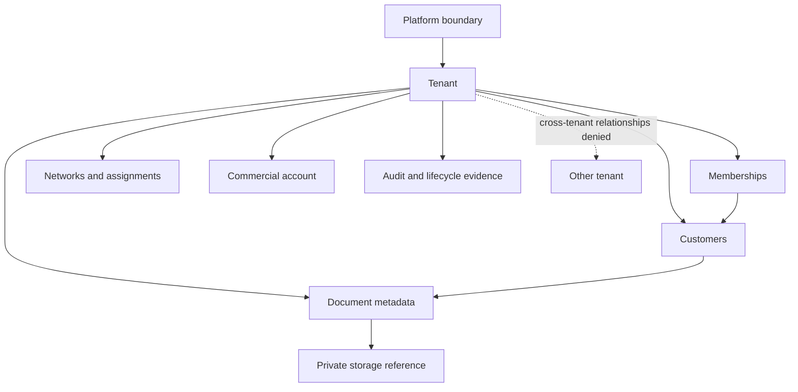
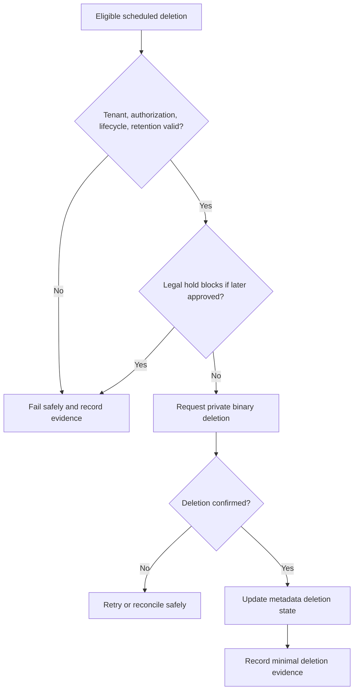

# Foundation V1 Conceptual Data Model

## 1. Document status

| Item | Status |
|---|---|
| Document type | Technical-discovery document |
| Implementation | **NOT AUTHORIZED** |
| Source branch | `rebuild/foundation-v1` |
| Analysis date | 23 July 2026 |
| Current application | Legacy prototype, not a production data system |
| Authority | Product Owner Decisions 1–10 in [`OWNER_DECISIONS_FOUNDATION_V1.md`](./OWNER_DECISIONS_FOUNDATION_V1.md) are authoritative |
| Required inputs | Approved Foundation V1 discovery documents preceding this workstream |
| Technology selection | No database, ORM, schema tool, storage provider, queue, scheduler, cache, or migration framework is selected |
| Naming | Entity and relationship names are conceptual, not implementation identifiers |
| Production release | Not authorized |

Source precedence is: approved Product Owner decisions; verified repository facts; approved audit findings; previously approved Foundation V1 discovery documents; architectural proposals; unresolved business and technical decisions. This is the data-model discovery output assigned by [`FOUNDATION_V1_DISCOVERY_BASELINE.md`](./FOUNDATION_V1_DISCOVERY_BASELINE.md), sections 7 and 8. It does not authorize implementation.

Controlled labels are used as follows: **VERIFIED FACT** for repository evidence, **INFERENCE** for evidence-based conclusions, **APPROVED BASELINE** for traceable Product Owner rules, **PROPOSAL** for conceptual architecture, **PENDING PRODUCT OWNER DECISION** for unresolved behavior, and **PROHIBITED** for disallowed behavior. No statement is a legal, privacy, tax, accounting, security, or compliance guarantee.

## 2. Scope

This model covers internal users, external identities, platform assignments, tenants, memberships, invitations, roles, permissions, resource scopes, sales networks, manager-agent assignments, customers/accounts, ownership, commercial accounts, plans, contracts, licenses, seats, entitlements, feature controls, limits, usage, documents, bills, CTEs, storage references, lifecycle events, scheduled deletion, audit/security events, jobs, reconciliation, provenance, effective dating, state history, retention, permanent deletion, concurrency, idempotency, and versioning.

| Delegated concern | Canonical document |
|---|---|
| Authentication flows and sessions | `FOUNDATION_V1_IDENTITY_AND_ACCESS.md` |
| Authorization policy | `FOUNDATION_V1_TENANCY_AUTHORIZATION.md` |
| Commercial semantics | `FOUNDATION_V1_LICENSING_ENTITLEMENTS.md` |
| Binary storage details | `FOUNDATION_V1_DOCUMENT_STORAGE.md` |
| Document transitions | `FOUNDATION_V1_DOCUMENT_LIFECYCLE.md` |
| Audit retention and purge | `FOUNDATION_V1_AUDIT_RETENTION.md` |
| Providers and environments | `FOUNDATION_V1_ENVIRONMENTS_PROVIDERS.md` |
| Testing and release implementation | `FOUNDATION_V1_TESTING_RELEASE.md` |
| Observability and incidents | `FOUNDATION_V1_OBSERVABILITY_SECURITY.md` |
| Future simulation, PUN, OCR, AI, reporting | `FOUNDATION_V1_FUTURE_BOUNDARIES.md` |
| Implementation sequence | `FOUNDATION_V1_IMPLEMENTATION_ROADMAP.md` |

## 3. Non-goals

This document does not authorize or finalize source-code changes, database creation, migrations, provider or ORM selection, table/field/type/enum/index/foreign-key names or syntax, partitioning, sharding, replication, backup provider, cache, queue, scheduler, event bus, analytics warehouse, OCR extraction, PUN import, simulation/reporting models, public registration, real-user onboarding, real-document storage, real tenant creation, or Production data migration.

It contains no SQL, ORM schema, executable pseudocode, selected dependency, or implementation identifier.

## 4. Verified current repository state

- **VERIFIED FACT:** No database layer, persistence adapter, schema, migration, tenant-isolation constraint, or data-model test is visible in the repository tree.
- **VERIFIED FACT:** No persisted user, external identity, tenant, membership, role, permission, commercial account, license, seat, entitlement, customer, document metadata, lifecycle, audit, or job model is visible in `app/`, `package.json`, or `package-lock.json`.
- **VERIFIED FACT:** No private object-storage integration, scheduled lifecycle operation, reconciliation job, or audit persistence is declared.
- **VERIFIED FACT:** [`app/page.tsx`](./app/page.tsx) is a client component using React state and browser-side PDF handling; its bill and CTE behavior is hardcoded or in memory.
- **VERIFIED FACT:** [`next.config.ts`](./next.config.ts) contains no verified persistence or storage configuration.
- **INFERENCE:** Current browser state cannot establish durable identity, tenant ownership, lifecycle, commercial, authorization, retention, or audit facts.
- **PROPOSAL:** Introduce provider-neutral repository ports and conceptual aggregates only after separate architecture and implementation approval.
- **UNKNOWN:** Hidden GitHub, Vercel, database, storage, or external-service configuration outside the repository is not verified and is not assumed.

These findings align with [`PROJECT_AUDIT.md`](./PROJECT_AUDIT.md), sections 3, 5, 8, and 9, and [`FOUNDATION_V1_DISCOVERY_BASELINE.md`](./FOUNDATION_V1_DISCOVERY_BASELINE.md), section 3.

## 5. Data-model principles

Mandatory principles are tenant isolation by construction; provider-independent internal identifiers; deny-by-default access; append-only history where required; explicit ownership and lifecycle; no invented defaults or silent tenant inference; no client-authoritative identifiers; no destructive cascade without approved policy; auditability; provenance; effective dating; idempotency; concurrency safety; historical preservation; minimization; replaceable providers; metadata/binary separation; operational/history separation; and separation of authentication, membership, commercial, tenant, session, and document states.

The conceptual inventory contains **60 entity or evidence categories**:

| # | Category | # | Category | # | Category |
|---:|---|---:|---|---:|---|
| 1 | InternalUser | 21 | Contract | 41 | PaymentReview |
| 2 | ExternalIdentity | 22 | ContractVersion | 42 | Document |
| 3 | PlatformAssignment | 23 | License | 43 | Bill |
| 4 | Tenant | 24 | SeatCapacity | 44 | CTE |
| 5 | Membership | 25 | SeatAssignment | 45 | LifecycleEvent |
| 6 | Invitation | 26 | SeatEvent | 46 | StorageReference |
| 7 | Role | 27 | SeatReservation candidate | 47 | ScheduledOperation |
| 8 | Permission | 28 | EntitlementDefinition | 48 | BackgroundJob |
| 9 | RolePermission | 29 | EntitlementAssignment | 49 | JobAttempt |
| 10 | MembershipRole | 30 | EntitlementVersion | 50 | ReconciliationRun |
| 11 | ResourceScope | 31 | FeatureControl | 51 | ReconciliationFinding |
| 12 | SalesNetwork | 32 | QuantitativeLimit | 52 | CorrectionAction candidate |
| 13 | Team candidate | 33 | LimitAssignment | 53 | AuditEvent |
| 14 | ManagerAgentAssignment | 34 | UsageEvent | 54 | SecurityEvent |
| 15 | TenantNetworkAssignment | 35 | UsageAggregation | 55 | ProvenanceRecord |
| 16 | CustomerAccount | 36 | UsageCorrection | 56 | StateHistoryRecord |
| 17 | OwnershipAssignment | 37 | CustomRestriction | 57 | RetentionPolicyVersion |
| 18 | TenantCommercialAccount | 38 | CustomCommercialOverride | 58 | DeletionEvidence |
| 19 | Plan | 39 | CommercialAgreement | 59 | ProviderReference candidate |
| 20 | PlanVersion | 40 | PaymentEvidence | 60 | MigrationEvidence |

Candidate categories remain pending and are not approved entities.

## 6. Conceptual identifier strategy

Opaque internal identifier categories are required for InternalUser, ExternalIdentity, Tenant, Membership, Invitation, Role, Permission, CustomerAccount, SalesNetwork, Assignment, Document, Bill, CTE, StorageReference, TenantCommercialAccount, CommercialAgreement, Contract, License, SeatAssignment, EntitlementAssignment, AuditEvent, SecurityEvent, LifecycleEvent, ScheduledOperation, BackgroundJob, and ReconciliationRun.

Client-generated identifiers are not authoritative unless later approved. External identifiers remain adapter references. Identifiers must not disclose tenant sequence, customer count, or sensitive business information. Exact format, generation, encoding, length, and collision strategy remain **PENDING PRODUCT OWNER DECISION** with technical review.

## 7. Tenant ownership model

Every tenant operational entity has explicit trusted tenant ownership. Ownership is never inferred only from user input, is immutable except through a separately approved migration/transfer, and all tenant-scoped relationships must resolve to the same tenant. Cross-tenant relationships are prohibited unless explicitly platform-level. Audit preserves original ownership; suspension, deactivation, archival, and contract termination do not change it; permanent deletion does not rewrite surviving minimal attribution.

## 8. Platform-level versus tenant-level data

| Classification | Examples | Authoritative owner | Access boundary | Tenant-field requirement | Audit expectation | Deletion effect | Pending decisions |
|---|---|---|---|---|---|---|---|
| Platform-level | Platform assignments, feature controls, plan/version definitions, permission proposals, release/maintenance records, platform audit categories, future provider registry | SaaS Operator policy | Explicit platform authorization; classification never grants unrestricted tenant-data access | Not applicable for purely platform records; trusted targeted-tenant context remains mandatory whenever an operation addresses a tenant | Every privileged or tenant-targeting change | Only an approved platform retention/deletion policy; never an implied tenant-data cascade | Platform retention, provider registry, and exact tenant-targeting reference model |
| Tenant-level | Commercial account, memberships, networks, customers, documents, licenses, seats, entitlements, usage, tenant audit, lifecycle operations | One explicitly identified tenant under platform governance | Trusted tenant context plus server authorization | Mandatory trusted tenant reference on every tenant-owned record and relationship | Every accountable change and required protected access | Approved tenant/document lifecycle only; no implicit cascade or ownership rewrite | Exact tenant-isolation constraint strategy, transfer/migration behavior, and category-specific retention |

Whether a category needs both platform and tenant context is resolved explicitly; it is never guessed.

## 9. Internal user and external identity

**InternalUser** conceptually holds stable internal identity, status, primary verified-contact reference, creation/deactivation times, authorization version, audit history, memberships, and platform assignments.

**ExternalIdentity** holds provider-neutral subject reference, isolated provider reference, verification state, contact-claim reference, link status, creation/last-seen times, disablement, and provenance.

ExternalIdentity is not InternalUser; email is not immutable identity; silent linking is prohibited; provider claims are not permissions; provider-specific fields remain in the adapter boundary.

## 10. Platform assignment

**PlatformAssignment** relates InternalUser to a conceptual platform role with status, effective period, privilege version, creator, reason, deactivation, audit, and security-review evidence.

It creates no automatic tenant-document access. Customer-data access requires separate policy, narrow scope, purpose, and audit. Impersonation is unapproved; technical-support access remains pending.

## 11. Tenant

**Tenant** conceptually has opaque identity, display/legal-name references, operational state, commercial-account relationship, creation/suspension/reinstatement times, a later-approved termination/closure marker, retention reference, platform-created provenance, and audit.

Exact legal/commercial fields remain pending. Creation is Platform Owner controlled. Tenant state does not overwrite membership or document state. Tenant deletion is not authorized.

Tenant reinstatement restores only the Tenant's eligible operational state after complete server-side validation. It never reactivates Deactivated, Revoked, or Replaced Memberships; recreates a released SeatAssignment automatically; restores an invalid Role or ResourceScope; revives a stale Session; bypasses a License or Entitlement block; or reverses membership deactivation or revocation. Membership reactivation and membership replacement remain separate **PENDING PRODUCT OWNER DECISIONS**. Exact persistence, transaction, and state-transition behavior remains delegated and unimplemented.

## 12. Tenant membership

**Membership** relates one InternalUser to one Tenant, role, conceptual state, resource scope, seat relationship, effective period, invitation provenance, deactivation/revocation, later-approved replacement provenance, authorization version, and audit history.

One Membership belongs to one Tenant. Multi-tenant user membership remains pending. Active authorization still requires eligible user, membership, tenant, commercial facts, role, permission, scope, ownership, and lifecycle. Deactivated, Revoked, BlockedTenant, BlockedLicense, and conceptual Replaced remain distinct. Reactivation and replacement remain pending; duplicate active replacement relationships and duplicate seat consumption are prohibited.

Tenant reinstatement can restore only the eligible Tenant operational state. It cannot change a Deactivated, Revoked, or Replaced Membership to Active, reverse membership deactivation/revocation, recreate released seat consumption, restore invalid role/scope assignments, bypass commercial blocks, or validate a stale session. Any future membership reactivation or replacement requires its own Product Owner decision, validation, seat/session policy, persistence design, and implementation authorization; no operational membership-reactivation transition is introduced here.

## 13. Invitation

**Invitation** has tenant, intended role/contact, issuer, lifecycle state, issued/expiry/revocation/acceptance times, delivery status, token-verifier reference, previous/replacement provenance, later-approved seat-reservation relationship, and audit.

Accepted, Expired, Revoked, Failed, and Superseded are immutable terminal records. Retry, resend, correction, replacement, or supersession creates a new Invitation record while the prior Invitation remains immutable and its prior token remains permanently invalid and cannot be re-enabled. The new Invitation uses a new token-verifier reference, and acceptance eligibility belongs only to that new record. Supersession/replacement provenance never transfers token validity. Old-token replay is denied and auditable. Exact token representation remains outside this document; raw tokens remain neither stored nor logged. Seat-reservation timing remains pending.

## 14. Roles and permissions

Conceptual **Role**, **Permission**, **RolePermission**, and when needed **MembershipRole** support permission version/status, scope requirement, and audit requirement.

The catalog remains a proposal and identifiers remain pending. Role is not unlimited access; permission does not replace scope, ownership, lifecycle, entitlement, or tenant-state checks. Changes require versioning and session/policy reevaluation.

## 15. Authorization and resource-scope references

**ResourceScope** may reference Platform, Tenant, AssignedNetwork, AssignedTeam, AssignedAgent, AssignedCustomer, OwnedDocument, AuthorizedSharedResource, Self, or Public scope. Exact generic versus specialized representation remains pending. Free-form client scope is never authoritative. Sharing and delegation remain pending; expansion requires server validation and audit.

## 16. Sales network

Conceptual **SalesNetwork**, later-approved **Team**, **ManagerAgentAssignment**, and **TenantNetworkAssignment** include tenant, status, effective period, and reassignment history. Hierarchy depth, multiple managers, descendant visibility, delegation, shared teams, matrix reporting, and bulk reassignment remain pending. Reassignment never rewrites historical actor attribution.

## 17. Customer or account

**CustomerAccount** conceptually includes tenant ownership, responsible agent/manager, assignment history, status, minimized contact references, later service-point references, document relationships, creator, later-approved archive time, and audit.

Exact identity/contact fields, sharing, joint ownership, cross-tenant transfer, merge, and duplicate detection remain pending.

## 18. Resource ownership and assignment history

**OwnershipAssignment** records tenant owner, operational and prior assignees, effective time, actor, reason, scope, audit, and history. Reassignment never changes creator attribution; deactivation cannot orphan records; suspension preserves ownership; reassignment cannot reactivate membership/session; cross-tenant reassignment is prohibited outside an approved migration.

## 19. Tenant commercial account

**TenantCommercialAccount** links one Tenant to conceptual state, current agreement, suspension/reinstatement evidence, manual-payment review, restrictions, commercial version, effective time, and audit. Commercial state is not authorization and never overwrites ownership or document lifecycle. Grace, Restricted, Closed, and Terminated semantics remain pending; no automatic transition is finalized.

Commercial reinstatement evidence may support a controlled Tenant reinstatement decision only after complete server validation and reconciliation. It does not reactivate Deactivated, Revoked, or Replaced Memberships, recreate released seats, restore invalid roles/scopes, revive stale sessions, or bypass License/Entitlement blocks. Membership reactivation and replacement remain separate pending workflows.

## 20. Plans and plan versions

**Plan** and **PlanVersion** conceptually hold status, effective period, seat capacity, entitlement bundle, limit references, override capability, retirement/migration relationship, and provenance. Historical agreements retain their version; edits never rewrite them. Names, pricing, currency, tax, and public catalog remain pending.

## 21. Contracts and agreements

**CommercialAgreement**, **Contract**, and **ContractVersion** conceptually capture tenant/operator parties, effective period, plan version, custom terms, capacity, entitlements, limits, restrictions, payment-evidence relationship, status, amendment/supersession provenance, and audit.

Legal fields and signature process are outside scope. Expiry and termination do not delete data. Automatic renewal is not approved.

## 22. Licenses

**License** relates tenant, agreement, plan/custom terms, effective period, status, capacity, entitlement/limit assignments, suspension/expiry effects, amendment/supersession, provenance, and audit. Status enum, expiry transitions, renewal, restoration, and identifier format remain pending.

## 23. Seats and seat assignments

**SeatCapacity**, **SeatAssignment**, **SeatEvent**, and a later-approved **SeatReservation** reference tenant, license, membership, status, effective period, consumption/release, deactivation, suspension, later replacement/reactivation effects, idempotency, concurrency version, and audit.

All thirteen invariants in [`FOUNDATION_V1_LICENSING_ENTITLEMENTS.md`](./FOUNDATION_V1_LICENSING_ENTITLEMENTS.md), section 17, apply: nonnegative capacity/consumption; no unapproved excess; one equivalent seat per qualifying membership and tenant/license; no double counting; no terminal-invitation reservation; idempotent release; retry safety; tenant context; audit; attribution; drift detection; no client authority. Invitation-time reservation is not approved.

## 24. Entitlements

**EntitlementDefinition**, **EntitlementAssignment**, and **EntitlementVersion** conceptually carry source, tenant, agreement/license, capability, effective period, status, limit reference, restriction, suspension effect, audit, and provenance.

Entitlement is a commercial prerequisite, not authorization. Missing/indeterminate blocks the capability; default-enabled is prohibited; catalog remains pending.

## 25. Feature controls

**FeatureControl** conceptually has platform/environment scope, capability, status, purpose, effective period, maintenance/incident reason, pilot relevance, actor, and audit. It is not entitlement. Disabled means safely unavailable without rewriting rights. Environment behavior is delegated; client flags are not authoritative.

## 26. Quantitative limits and usage events

**QuantitativeLimit**, **LimitAssignment**, **UsageEvent**, **UsageAggregation**, and **UsageCorrection** include reset reference, unit, tenant, applicable actor, idempotency, provenance, and audit. Client counters are untrusted; missing usage is not zero; usage is not an invoice. Reset, hard/soft, warnings, and overage remain pending.

## 27. Custom restrictions and agreements

**CustomRestriction** and **CustomCommercialOverride** have tenant, effective period, target, precedence, reason, actor, expiry, audit, and provenance. They require Platform Owner authority, cannot be hidden/permanent, and cannot override isolation, authorization, ownership, retention, legal hold, or security. Precedence remains pending.

## 28. Manual payment evidence

**PaymentEvidence** and **PaymentReview** conceptually include result, separate commercial-action reference, tenant, recorder/uploader, reviewer, receipt/review times, supersession, dispute status, classification, later storage reference, and audit.

Evidence is not confirmed payment and cannot activate/reinstate. Full card data and payment credentials are prohibited. Real evidence is unauthorized in discovery and ordinary Preview. Storage/retention remain pending.

## 29. Document aggregate

**Document** is tenant-owned and conceptually contains customer/account reference, type, lifecycle state, metadata, separate binary StorageReference, untrusted original filename, media type, size, integrity reference, uploader, creation/archive/scheduled-deletion/deletion times, retention-policy reference, later legal-hold reference, provenance, and audit relationship.

Metadata and binary remain separate. Storage identifiers are not authorization tokens; permanent public URLs are prohibited; audit contains no document content; real storage is not authorized.

## 30. Bill document specialization

**Bill** is a conceptual Document type with tenant, customer, document reference, reliably known billing-period reference, state, provenance, uploader, archive time, scheduled deletion, and deletion status.

OCR, consumption/meter/tariff extraction, PUN matching, simulation input, and invented defaults are prohibited. Later extracted facts require confidence/provenance or remain absent.

## 31. CTE document specialization

**CTE** is a conceptual Document type with tenant, later-approved customer/commercial context, document reference, reliably known contract effective/expiry dates, lifecycle/active-expired status, archive/deletion scheduling, provenance, and audit.

Only Active CTEs are eligible for future simulations. Approved contractual expiry causes controlled Expired/Archived behavior; archived CTEs are permanently deleted twelve calendar months after `archived_at`. Extraction/interpretation remain outside Foundation V1.

## 32. Document lifecycle states

Approved Bill states are Uploaded, Active, Archived, Scheduled for deletion, and Deleted. Approved CTE states are Active, Expired, Archived, Scheduled for deletion, and Deleted.

Each needs current state, state version, entered time, actor/system actor, reason, prior state, audit correlation, retention consequence, and allowed-operation consequence. Transition details remain delegated to `FOUNDATION_V1_DOCUMENT_LIFECYCLE.md`.

## 33. Lifecycle event history

Append-only conceptual **LifecycleEvent** has tenant, document/type, prior/new state, actor/system actor, reason, effective time, correlation, idempotency, source, redaction, and provenance. Current state never replaces history; ordinary flows cannot edit it; representation remains pending.

## 34. Storage reference

**StorageReference** relates tenant and document to a provider-neutral object reference, later storage class, media type, size, integrity, encryption classification, creation time, deletion status/confirmation, isolated adapter provider reference, and audit correlation.

No provider/public access is selected. Object reference is not authorization; key format remains pending; binary and metadata deletion are coordinated but separately evidenced.

## 35. Scheduled operations

**ScheduledOperation** supports archive follow-up, permanent deletion, CTE expiry, retention evaluation, reconciliation, and later provider synchronization. It includes tenant, type, target, due time, status, attempts, idempotency key, actor/initiator, correlation, redacted error classification, completion, and audit.

Client authority and cross-tenant payload mixing are prohibited. Eligibility is rechecked at execution; retry is safe; scheduler/queue remain pending.

## 36. Background jobs and reconciliation runs

**BackgroundJob**, **JobAttempt**, **ReconciliationRun**, **ReconciliationFinding**, and later **CorrectionAction** carry tenant/platform scope, system/initiating actor, operation, effective period, status, idempotency, retry/result, drift/correction evidence, and audit correlation.

Unscoped platform customer-data jobs and silent corrections are prohibited. Alerting is delegated. Implementation is **NOT AUTHORIZED**.

## 37. Audit event

Append-only-in-principle **AuditEvent** includes tenant/platform context, actor/type, action, target type/reference, prior/new-state references, reason, result, effective time, correlation, request/job context, provenance, and redaction classification.

Ordinary users cannot alter evidence. Raw tokens, credentials, document content, full payment data, and unnecessary personal data are prohibited. Schema/retention are delegated.

## 38. Security event

**SecurityEvent** is separate from AuditEvent and includes tenant/platform scope, known/unknown actor, category, proposed severity, target, result, detection source, time, correlation, redacted context, and later investigation status. It does not replace audit; taxonomy/workflow remain pending.

## 39. Provenance model

**ProvenanceRecord** supports source document, manual entry, external event, derived state, user/admin action, migration, correction, supersession, and later import. It requires source type/reference, actor, effective and observed times, later confidence, transformation version, reason, and correlation. Invented values and silent substitution are prohibited; derived values remain traceable; OCR/AI provenance is future scope.

## 40. Effective dating and temporal facts

Created, recorded, effective-from/until, observed, modified, archived, deletion-due, deleted, contract effective/expiry, entitlement period, and assignment period are distinct concepts. Effective time is never silently replaced by modification time. History remains; corrections create evidence rather than rewrite it where required. Temporal storage mechanism remains pending.

## 41. State history and versioning

Conceptual versions cover membership authorization, role-permission, tenant commercial state, plan, contract, license, entitlement, document state, StorageReference, and audit correlation. Optimistic or equivalent concurrency protection is required in principle; stale changes fail/reconcile; mechanism is pending; historical versions remain attributable.

## 42. Idempotency

| Operation | Identity and tenant context | Duplicate/result behavior | Conflict behavior | Audit behavior |
|---|---|---|---|---|
| Invitation acceptance | Invitation + tenant + operation identity; eligibility belongs only to the current invitation record | Return established outcome only for the same valid invitation; never transfer validity | Deny and audit old-token, superseded-token, or incompatible replay | Attempt/result, including denied replay |
| Membership activation | Membership + tenant | No duplicate activation | Fail safely | Lifecycle evidence |
| Seat consumption/release | Assignment + tenant/license | No double consume/release | Capacity/version conflict | Every mutation |
| Tenant suspension/reinstatement | Tenant + command identity and fully revalidated membership/commercial facts | Reuse completed tenant-state result only; never reuse membership/session eligibility | Reject stale intent and any attempt to reactivate Deactivated, Revoked, or Replaced memberships, recreate seats, or bypass commercial blocks | Attempt/result and post-action verification |
| Document archive | Document + tenant | Same state/result | Lifecycle conflict | Lifecycle event |
| Scheduled/permanent deletion | Document + tenant + policy version | No duplicate destructive effect | Eligibility conflict | Attempt/result |
| Storage deletion | StorageReference + tenant | Confirm prior result | Mismatch fails | Separate evidence |
| Reconciliation | Tenant + run identity | Stable run result | Overlap controlled | Run/findings |
| Audit generation | Correlation + event identity | No duplicate evidence | Inconsistent duplicate fails | Intrinsic |
| Future external event | Adapter reference + tenant | Replay-safe | Conflicting payload quarantined | Receipt/result |

Exact key format remains pending.

## 43. Concurrency and race conditions

| Race | Risk | Required invariant | Safe failure | Audit | Implementation gate |
|---|---|---|---|---|---|
| Duplicate invitation acceptance or old-token replay | Duplicate membership/seat or acceptance through a superseded record | One terminal acceptance/result; prior token permanently invalid; only new-record verifier eligible | Conflict/deny, no partial state | Attempts and denied replay | Concurrency/replay suite |
| Seat consume/release | Excess or wrong capacity | Section 23 invariants | No partial mutation | Ledger events | Seat race suite |
| Membership replacement/reactivation or tenant-reinstatement confusion | Unauthorized overlap or revival of an ineligible membership | Pending workflow; no duplicates; tenant reinstatement changes no Deactivated, Revoked, or Replaced membership | Deny | Attempts | Later-approved lifecycle/reinstatement suite |
| Customer reassignment | Lost/dual assignment | Versioned history | Conflict | Reassignment event | Assignment tests |
| Archive versus access | Stale access | Current lifecycle check | Deny stale operation | Decision/event | Lifecycle tests |
| Archive versus scheduling | Wrong due time | One coherent state/version | Reconcile | Lifecycle/job evidence | State tests |
| Restoration versus deletion | Data resurrection/loss | Restoration pending; deletion eligibility current | Deny conflict | Attempts | Lifecycle decision |
| Legal hold versus deletion | Prohibited purge | Hold checked if approved | Deny deletion | Evidence | Legal-hold decision |
| Suspension versus operation | Post-suspension action | Tenant state rechecked | Deny | Security/audit | Suspension tests |
| Contract/entitlement change | Stale commercial right | Effective version checked | Deny/retry safely | Version event | Commercial tests |
| Reconciliation overlap | Conflicting correction | One effective run/correction | Drift retained | Run evidence | Job tests |
| Duplicate job | Repeated mutation | Idempotent target operation | Stable result | Attempt evidence | Fault tests |

## 44. Retention and deletion boundaries

**APPROVED BASELINE:** Archived Bills are permanently deleted 60 calendar days after `archived_at`; archived CTEs are deleted 12 calendar months after `archived_at`.

Conceptual support includes archive time, deletion due time, ScheduledOperation, attempt, confirmation, metadata/binary status, minimal audit, retry/failure, and RetentionPolicyVersion. Deactivation, suspension, and contract termination do not trigger deletion. Legal hold, restoration window, backup purge, and failed-deletion procedure remain pending. Audit retains no sensitive content.

## 45. Permanent deletion coordination

Permanent deletion coordinates metadata and binary resources after authorization, tenant/lifecycle/retention validation, later legal-hold evaluation, and idempotency. It records storage request/confirmation, metadata update, audit, retries, failures, and never reports false success. Exact order/transaction remains pending; public access is prohibited; evidence contains no document content.

## 46. Soft deletion, archival, and terminal deletion

Operational deactivation, archival, scheduled deletion, permanent deletion, logical concealment, provider binary deletion, and a later tombstone are distinct. Soft delete cannot replace approved states ambiguously. Tombstone behavior is pending. Deleted never means merely hidden; permanent deletion requires confirmed binary and metadata handling.

## 47. Data classification

| Class | Examples | Access expectation | Logging/redaction | Retention consideration | Environment restriction |
|---|---|---|---|---|---|
| Public | Deliberately public non-tenant content | Explicitly approved public route only | Safe metadata only | Approved public-content policy | Synthetic public fixtures in Local, CI, and ordinary Preview; real published content only in an explicitly authorized environment |
| Internal | Maintenance/release metadata | Authorized platform staff | Minimized and redacted | Documented business need | Synthetic fixtures in Local/CI/ordinary Preview; real internal operational records only in authorized protected pilot or Production contexts |
| Tenant confidential | Customers, assignments, commercial metadata | Trusted tenant context and server authorization | Redact identifiers and commercial detail | Tenant-specific approved retention | Synthetic only in Local, CI, and ordinary Preview; real tenant data only in separately authorized protected pilot or Production |
| Personal data | Contact/document metadata | Narrow approved purpose and authorization | Minimize and redact | Qualified retention decision required | Synthetic only in Local, CI, and ordinary Preview; real personal data only in separately authorized protected pilot or Production |
| Authentication-sensitive | Identity links, verifier references | Identity/security boundary | Prohibited from logs; never raw tokens or secrets | Approved security retention | Synthetic substitutes in Local/CI/ordinary Preview; real values only in environment-isolated authorized operational environments |
| Authorization-sensitive | Roles, scopes, authorization versions | Server policy boundary | Restricted and redacted | Preserve required historical evidence | Synthetic policy fixtures in Local/CI/ordinary Preview; real assignments only in separately authorized protected pilot or Production |
| Commercial confidential | Contracts, limits, payment-review metadata | Privileged commercial policy | No sensitive contractual/payment detail | Agreement and approved commercial retention | Synthetic only in Local, CI, and ordinary Preview; real commercial records only in separately authorized protected pilot or Production |
| Document content | Bills and CTEs | Protected mediated access only | Prohibited from logs and audit events | Approved document lifecycle | Synthetic PDFs only in Local, CI, and ordinary Preview; real documents only in separately authorized protected pilot or Production after required controls |
| Payment-sensitive | Minimized payment-evidence metadata | Authorized Platform Owner review | No credentials or full card data | Pending approved evidence policy | Synthetic only in Local, CI, and ordinary Preview; real minimized evidence only in a separately authorized operational environment; full card data/payment credentials prohibited everywhere |
| Audit evidence | Actor, action, target, result | Separately authorized audit access | Redacted; no document content/tokens/credentials | Delegated audit retention | Synthetic audit fixtures in Local/CI/ordinary Preview; real evidence only in its authorized source environment with controlled export |
| Security telemetry | Suspicious events and redacted context | Security/incident boundary | Redacted and minimized | Delegated security retention | Synthetic telemetry in Local/CI/ordinary Preview; real telemetry only in environment-isolated authorized operational environments |
| Secrets | Credentials and cryptographic material | Dedicated environment secret boundary only | Never logged or modeled as business records | Secret-rotation/deletion policy, not business retention | Strictly isolated per environment; never copied across environments or embedded in synthetic datasets |

Real documents are prohibited in ordinary Preview; full card data/payment credentials are prohibited. Secrets are not business records.

## 48. Data minimization and redaction

Store minimum necessary fields; avoid purposeless duplication; never persist raw tokens or log credentials; exclude document content/full payment data from audit; avoid unnecessary email duplication; do not persist provider payloads without approved purpose; redact operational logs; return user-safe errors; retain correlation identifiers.

## 49. Environment data boundaries

Local, CI, and ordinary Vercel Preview use synthetic data only. Real documents require separately authorized protected pilot or Production controls. Production data is not copied downward without approved minimization/transformation and authorization. Environment IDs are not tenant IDs. Provider accounts/secrets remain isolated. Final design belongs to `FOUNDATION_V1_ENVIRONMENTS_PROVIDERS.md`.

## 50. Backup, restore, and disaster-recovery data boundary

Conceptual requirements cover scope, tenant isolation, encryption, retention, restore tests, deletion propagation, later legal hold, possible point-in-time recovery, restoration audit, environment restrictions, and provider exit. Backup purge after deletion is pending; restore must not resurrect prohibited deleted data. RPO, RTO, provider, schedule, and retention remain pending.

## 51. Migration readiness

Requirements are versioned evolution, reversible/compensating changes, prevalidation, tenant-scoped backfill, synthetic tests, idempotent steps, migration audit, rollback, no direct uncontrolled Production mutation, rollout compatibility, and data-quality checks. No migration file is created.

## 52. Data-quality invariants

1. Every tenant-owned record has valid trusted tenant context.
2. Memberships reference valid users and tenants.
3. Active memberships comply with approved seat rules.
4. Invitations cannot be accepted twice.
5. Terminal invitations are immutable; prior/superseded tokens remain permanently invalid, cannot be re-enabled, and old-token replay is denied and auditable.
6. Permissions never grant cross-tenant access.
7. Every Document has one tenant owner.
8. StorageReference tenant and Document tenant match.
9. Lifecycle state and timestamps are coherent.
10. Deletion due time follows the approved retention version.
11. Deleted documents are not operationally selectable or accessible.
12. Only Active CTEs are eligible for future simulations.
13. Suspended tenants retain ownership/history; tenant reinstatement changes only eligible tenant operational state and cannot reactivate Deactivated, Revoked, or Replaced memberships, recreate released seats automatically, restore invalid roles/scopes, bypass commercial blocks, or revive stale sessions.
14. Deactivation preserves ownership/audit.
15. Effective periods do not overlap where prohibited.
16. Current versions reference valid history.
17. Missing usage is not defaulted.
18. Audit events identify actor or system actor.
19. Scheduled operations carry trusted tenant context.
20. Binary identifiers never grant public authorization.

## 53. Data-model threat analysis

| Threat | Cause | Consequence | Preventive invariant | Detection | Implementation gate | Canonical document |
|---|---|---|---|---|---|---|
| Missing tenant filter | Unscoped query | Data leakage | Mandatory tenant context | Isolation telemetry | Negative suite | `FOUNDATION_V1_TENANCY_AUTHORIZATION.md` |
| Cross-tenant relationship | Mismatched ownership | Leakage/corruption | Same-tenant validation | Integrity scan | Relationship tests | `FOUNDATION_V1_TENANCY_AUTHORIZATION.md` |
| IDOR | Identifier treated as authority | Foreign access | Ownership authorization | Denial events | IDOR tests | `FOUNDATION_V1_TENANCY_AUTHORIZATION.md` |
| Client ownership | Client claim trusted | Takeover | Server resolution | Mismatch events | Tamper tests | `FOUNDATION_V1_TENANCY_AUTHORIZATION.md` |
| Identity collision | External subjects conflated | Account takeover | Internal identity/link uniqueness | Collision alerts | Identity tests | `FOUNDATION_V1_IDENTITY_AND_ACCESS.md` |
| Unsafe linking | Email/provider claim auto-links | Account takeover | Controlled linking | Link events | Recovery tests | `FOUNDATION_V1_IDENTITY_AND_ACCESS.md` |
| Duplicate membership | Race/weak uniqueness | Excess access | Compatibility/uniqueness | Reconciliation | Concurrency tests | `FOUNDATION_V1_TENANCY_AUTHORIZATION.md` |
| Duplicate acceptance or old-token replay | Replay/race or validity incorrectly transferred to a replacement | Duplicate membership/seat or unauthorized acceptance | Terminal invitation, permanently invalid prior token, new verifier per replacement, idempotency | Conflict and denied-replay events | Acceptance/replacement/replay tests | `FOUNDATION_V1_IDENTITY_AND_ACCESS.md` |
| Seat over-consumption | Concurrent activation | License breach | Thirteen invariants | Seat drift | Seat suite | `FOUNDATION_V1_LICENSING_ENTITLEMENTS.md` |
| Stale authorization version | Old policy facts | Excess access | Version check | Stale denials | Session tests | `FOUNDATION_V1_IDENTITY_AND_ACCESS.md` |
| Stale commercial version | Old agreement facts | Wrong availability | Effective version | Drift | Commercial tests | `FOUNDATION_V1_LICENSING_ENTITLEMENTS.md` |
| Metadata/binary mismatch | Different tenant/reference | Exposure | Same tenant/document | Storage reconciliation | Storage tests | `FOUNDATION_V1_DOCUMENT_STORAGE.md` |
| Orphan binary | Failed metadata registration/delete | Unmanaged content | Registration/deletion reconciliation | Orphan scan | Fault tests | `FOUNDATION_V1_DOCUMENT_STORAGE.md` |
| Orphan metadata | Missing binary | False availability | Integrity state | Missing-object scan | Storage tests | `FOUNDATION_V1_DOCUMENT_STORAGE.md` |
| False deletion success | Unconfirmed deletion | Retained content | Confirmation required | Reconciliation | Deletion tests | `FOUNDATION_V1_DOCUMENT_STORAGE.md` |
| Lifecycle corruption | Invalid transition/update | Retention/access error | Versioned transition policy | History checks | Lifecycle suite | `FOUNDATION_V1_DOCUMENT_LIFECYCLE.md` |
| Archive-time manipulation | Untrusted timestamp | Early/late deletion | Trusted transition time | Timing audit | Boundary tests | `FOUNDATION_V1_DOCUMENT_LIFECYCLE.md` |
| Retention bypass | Job ignores policy | Premature deletion | Version/eligibility check | Job reconciliation | Retention tests | `FOUNDATION_V1_AUDIT_RETENTION.md` |
| Legal-hold bypass | Hold omitted if approved | Prohibited deletion | Explicit hold check | Deletion denial | Future hold tests | `FOUNDATION_V1_AUDIT_RETENTION.md` |
| Audit mutation | Editable evidence | Lost accountability | Append-only principle | Integrity review | Audit tests | `FOUNDATION_V1_AUDIT_RETENTION.md` |
| Raw-token persistence | Token stored/logged | Credential theft | Verifier only/redaction | Secret scanning | Token tests | `FOUNDATION_V1_IDENTITY_AND_ACCESS.md` |
| Sensitive logs | Payload/detail logging | Data exposure | Classification/redaction | Log scanning | Redaction suite | `FOUNDATION_V1_OBSERVABILITY_SECURITY.md` |
| Provider overcollection | Raw payload retained | Privacy/coupling | Minimized adapter mapping | Inventory review | Adapter tests | `FOUNDATION_V1_ENVIRONMENTS_PROVIDERS.md` |
| Effective-date corruption | Wrong clock/date | Wrong access/retention | Trusted temporal facts | Boundary monitoring | Time tests | `FOUNDATION_V1_TESTING_RELEASE.md` |
| History rewriting | In-place overwrite | Lost provenance | Version/history records | Immutability checks | History tests | `FOUNDATION_V1_AUDIT_RETENTION.md` |
| Reconciliation drift | Divergent facts | Wrong decisions | Drift detection/no silent fix | Findings | Reconciliation tests | `FOUNDATION_V1_LICENSING_ENTITLEMENTS.md` |
| Duplicate job | At-least-once delivery | Repeated mutation | Idempotency | Attempt correlation | Fault tests | `FOUNDATION_V1_AUDIT_RETENTION.md` |
| Backup resurrection | Restore revives deletion | Policy breach | Deletion-aware restore | Restore comparison | DR tests | `FOUNDATION_V1_ENVIRONMENTS_PROVIDERS.md` |
| Migration contamination | Unscoped backfill | Cross-tenant corruption | Tenant-scoped validation | Pre/post checks | Migration rehearsal | `FOUNDATION_V1_TESTING_RELEASE.md` |
| Invented defaults | Missing facts guessed | Incorrect business action | Unknown/absent preserved | Data-quality checks | Missing-data tests | `FOUNDATION_V1_FUTURE_BOUNDARIES.md` |

## 54. Testing strategy

Provider-independent tests cover:

1. tenant ownership;
2. cross-tenant relationships;
3. user/external-identity separation;
4. terminal invitation immutability, permanent prior-token invalidity, and no validity transfer through supersession;
5. one-time acceptance plus audited denial of old-token and superseded-token replay;
6. membership uniqueness;
7. membership deactivation;
8. tenant suspension and controlled reinstatement that cannot reactivate Deactivated, Revoked, or Replaced memberships, recreate released seats automatically, restore invalid roles/scopes, bypass commercial blocks, or revive stale sessions;
9. all seat invariants;
10. entitlement/authorization separation;
11. plan/contract versioning;
12. document ownership;
13. document/storage tenant match;
14. lifecycle timestamps;
15. Bill retention calculation;
16. CTE retention calculation;
17. scheduled deletion;
18. deletion idempotency;
19. binary/metadata coordination;
20. audit append-only behavior;
21. security/audit separation;
22. provenance completeness;
23. effective dating;
24. stale-version rejection;
25. concurrent seat use;
26. concurrent invitation acceptance;
27. concurrent archive/deletion;
28. job tenant isolation;
29. reconciliation drift;
30. synthetic environment isolation;
31. backup/restore safeguards;
32. migration idempotency;
33. property-based tenant isolation;
34. negative authorization/data-integrity cases.

Core tests use no real database, storage, identity/payment provider, or real documents.

## 55. Conceptual repository interfaces

| Interface | Responsibility | Tenant requirement | Input categories | Output categories | Expected invariants | Concurrency expectation | Failure behavior | Audit behavior | Provider-neutral test substitute |
|---|---|---|---|---|---|---|---|---|---|
| User repository | Persist and resolve InternalUser lifecycle facts | Tenant context not applicable to the platform-level user record; targeted tenant context is required when resolving memberships | Trusted internal-user reference, status command, authorization version, actor | User facts, updated version, typed not-found/conflict | External identity remains separate; no client ownership authority; history attributable | Reject stale status/version changes | Explicit typed failure; never invent user facts | Audit creation, deactivation, status, and authorization-version changes | In-memory versioned user repository |
| External-identity repository | Persist provider-neutral identity links | Tenant context not applicable to the identity link; targeted tenant context required only for a later membership operation | Internal-user reference, adapter subject reference, verification/link command, actor | Link facts, verification state, typed mismatch/conflict | No silent linking; provider fields isolated; subject/link uniqueness | Serialize or reject competing link changes | Fail closed on collision or ambiguity | Audit link, unlink, verification, disablement, and denied collision | Deterministic identity-link fake |
| Platform-assignment repository | Persist privileged platform assignments | Tenant context not applicable to assignment itself; trusted targeted-tenant context required for any tenant-targeting action | Internal-user reference, platform role/status, effective period, actor/reason | Assignment facts, privilege version, typed denial/conflict | No implicit tenant-document access; effective history preserved | Reject stale privilege versions and overlapping prohibited assignments | Fail closed on missing/invalid assignment | Audit every create/change/deactivate and targeted privileged action | Versioned platform-assignment fake |
| Tenant repository | Persist Tenant identity and operational state | Trusted target-tenant context mandatory for tenant reads/changes after creation | Platform actor, tenant reference, state command, effective time, reason | Tenant facts, state version, typed conflict/not-found | Ownership stable; tenant state separate from membership/commercial/document state | Reject stale state commands; idempotent suspension/reinstatement | Fail safely without partial state or membership revival | Audit creation, suspension, reinstatement, and denied/stale commands | In-memory tenant state machine |
| Membership repository | Persist user-to-tenant Membership facts | Trusted tenant context mandatory; input tenant is resolved server-side, never client authority | Tenant, internal user, role/scope references, lifecycle command, version, actor | Membership facts, authorization version, typed incompatibility/conflict | One tenant per membership; distinct states; no reinstatement-driven reactivation/replacement | Enforce compatibility/version checks and deny duplicate active relationships | Deny mismatch, stale state, and unauthorized transition | Audit lifecycle, role/scope, version, and denied transitions | Versioned membership fake |
| Invitation repository | Persist controlled Invitation lifecycle and verifier references | Trusted invitation tenant mandatory | Tenant, issuer, intended role/contact, lifecycle command, verifier reference, operation identity | Invitation facts, terminal result, typed replay/conflict | Terminal immutability; prior token permanently invalid; new record/new verifier; no validity transfer | One acceptance outcome; reject concurrent acceptance and old-token replay | Deny replay/conflict without partial membership/seat result | Audit issue, delivery, terminal change, replacement, and denied replay | In-memory invitation lifecycle fake |
| Role/permission repository | Persist conceptual policy catalog and assignments | Platform context for catalog; trusted tenant context for tenant-specific assignment | Role/permission/version references, assignment command, actor | Catalog/assignment facts, policy version, typed denial | No role shortcut; exact proposal status preserved; scope/ownership still required | Reject stale policy/assignment versions | No default permission; fail closed on ambiguity | Audit catalog and assignment changes | Fixed versioned policy fixture |
| Network/assignment repository | Persist tenant sales graph and assignment history | Trusted tenant context mandatory | Tenant, network/agent/manager references, effective command, actor/reason | Graph facts, assignment history/version, typed conflict | Same-tenant relationships; immutable historical attribution | Reject concurrent conflicting reassignment | Fail safely without orphaning or cross-tenant relation | Audit assignment, reassignment, and denial | In-memory versioned graph repository |
| Customer repository | Persist CustomerAccount ownership and assignment | Trusted tenant context mandatory | Tenant, customer reference, minimized facts, assignment/status command, actor | Customer facts, assignment history/version, typed concealed failure | One tenant owner; no client ownership authority; history preserved | Reject stale customer/assignment updates | Conceal foreign/not-found targets and avoid partial reassignment | Audit creation, status, assignment, archive proposal, and denial | Tenant-scoped customer fake |
| Commercial-account repository | Persist tenant commercial state/version | Trusted tenant context mandatory | Tenant, authorized commercial command, agreement reference, version, actor/reason | Commercial facts/version, typed ambiguity/conflict | Commercial state not authorization; reinstatement cannot revive memberships/sessions/seats | Reject stale state/version and overlapping commands | Ambiguous/missing state blocks protected use | Audit commercial creation, suspension, reinstatement, correction | Versioned commercial-account fake |
| Plan repository | Persist platform Plan and PlanVersion history | Tenant context not applicable to definitions; trusted tenant context required when resolving an assigned plan | Plan/version reference, effective period, platform actor, retirement command | Plan/version facts, typed unavailable/conflict | Historical versions immutable and attributable; no pricing defaults | Reject conflicting effective versions/retirement changes | Missing version explicit; never choose latest implicitly | Audit plan-version creation, retirement, migration proposal | Fixed plan-version fixture |
| Agreement/contract repository | Persist tenant agreement and contract versions | Trusted tenant context mandatory | Tenant, agreement/contract reference, version/effective facts, actor/reason | Applicable agreement/version facts, typed none/ambiguous/conflict | Tenant binding and immutable historical versions | Reject stale amendment or overlapping prohibited effective versions | Ambiguous/no applicable agreement is explicit | Audit create, amend, supersede, expire, terminate proposal | Effective-dated contract fake |
| License repository | Persist tenant License facts and history | Trusted tenant context mandatory | Tenant, agreement/license/version reference, status/effective command, actor | License facts/version, typed invalid/expired/unknown/conflict | Tenant/agreement binding; entitlement and permission remain separate | Reject stale amendments/status changes | Unknown/inactive/expired blocks prerequisite | Audit activation, suspension, expiry, amendment | Versioned license fake |
| Seat repository | Persist capacity, assignments, events, and later reservations | Trusted tenant and license context mandatory | Tenant, license, membership, seat command, idempotency identity, version | Capacity/assignment/result, typed exhausted/conflict | All thirteen seat invariants; no automatic recreation on reinstatement | Atomic-or-equivalent capacity check; reject races/stale versions | No partial/double consume/release; explicit exhaustion | Audit every mutation, conflict, and reconciliation | Concurrency-aware seat-ledger fake |
| Entitlement repository | Persist entitlement definitions, assignments, and versions | Platform context for definitions; trusted tenant context for assignments/evaluation | Tenant, capability, agreement/license, effective version, actor command | Entitlement facts, present/missing/unknown, typed conflict | Entitlement never grants authorization; no default enabled | Reject stale assignment/version changes | Missing/unknown blocks protected capability | Audit grants, removals, version changes, required denials | Effective-dated entitlement fixture |
| Feature-control repository | Persist operational feature controls | Platform/environment context; trusted targeted tenant context for tenant-specific control | Environment/platform/tenant target, capability, state/effective command, actor/reason | Control facts/version, enabled/disabled/unknown | Control is not entitlement; commercial rights unchanged | Reject stale or conflicting control changes | Unknown is safely unavailable | Audit every privileged activation/disablement | Deterministic feature-control fake |
| Limit/usage repository | Persist limits, usage, aggregation, and corrections | Trusted tenant context mandatory | Tenant, limit/version, server usage event, quantity/unit, idempotency, correction actor | Limit/usage facts, aggregate/version, within/exceeded/unknown | No client counters; missing usage not zero; usage not invoice | Idempotent event intake; serialize/reconcile corrections and resets | Unknown/inconsistent facts fail safely and remain visible | Audit limit changes, accountable denials, corrections, drift | In-memory meter/limit fake |
| Document repository | Persist Document metadata and lifecycle pointer | Trusted tenant context mandatory | Tenant, document/customer reference, metadata command, lifecycle version, actor | Document facts/version, typed concealed conflict/not-found | One tenant owner; metadata separate from binary; no public authority | Reject stale lifecycle/metadata changes and access/delete races | Conceal foreign target; no false storage/deletion state | Audit metadata and lifecycle-affecting changes | Tenant-scoped document fake |
| Lifecycle-event repository | Append document lifecycle history | Trusted tenant and document context mandatory | Tenant, document, prior/new state, actor/system actor, correlation/idempotency | Appended event or typed duplicate/conflict | Append-only principle; current state never replaces history | One event per operation identity/state version | Fail safely on invalid transition or inconsistent duplicate | Event is itself lifecycle evidence and audit-correlated | Capturing append-only lifecycle sink |
| Storage-reference repository | Persist provider-neutral object metadata and deletion evidence | Trusted tenant and document context mandatory | Tenant, document, object adapter reference, integrity/status/deletion confirmation command, version | StorageReference facts/version, typed mismatch/conflict | Same tenant/document; object identifier not authorization; binary evidence separate | Reject stale status and competing deletion/registration changes | Mismatch/unknown confirmation fails; no false success | Audit registration, integrity/status, deletion request/confirmation | In-memory storage-reference fake |
| Audit repository | Append accountable AuditEvent evidence | Trusted tenant or explicit platform context mandatory according to event | Actor/system actor, context, action, target, states, result, correlation, redaction | Recorded event identity or typed required-write failure | Append-only principle; no raw tokens/content/credentials/payment data | Deduplicate only by event identity; preserve distinct attempts | Required evidence failure causes accountable operation to fail safely | Repository writes are the audit evidence; failures are separately surfaced | Capturing redaction-aware audit sink |
| Security-event repository | Append SecurityEvent telemetry separately from audit | Trusted tenant/platform context when known; unknown actor/context explicitly represented | Detection source, category, proposed severity, target/result, correlation, redacted context | Recorded security event or typed failure | Never substitutes for AuditEvent; minimized/redacted context | Correlate duplicates without erasing distinct detections | Safe telemetry failure path without granting access | Record detection and handling status where later approved | Capturing security-event sink |
| Scheduled-operation repository | Persist due operations, claims, attempts, and results | Trusted tenant context mandatory for tenant work; explicit platform scope only for approved platform work | Tenant/platform scope, operation, target, due time, claim/idempotency, actor/context | Scheduled/claimed/completed/failed facts, typed conflict | No client authority; eligibility rechecked; no mixed-tenant payload | Single effective claim or equivalent; duplicate execution safe | Retry-safe typed failure; retain due work and evidence | Audit schedule, claim, attempt, completion, failure | Deterministic scheduled-operation fake |
| Job repository | Persist BackgroundJob and JobAttempt facts | Trusted tenant context or explicit approved platform scope mandatory | Job/operation context, tenant, system/initiating actor, attempt identity, result/error | Job and attempt facts, typed retry/conflict | Tenant isolation; idempotent target behavior; no unscoped customer-data job | Coordinate duplicate attempts and stale claims | Safe failure/retry without cross-tenant or duplicate mutation | Audit attempts, results, retry, terminal failure | In-memory job/attempt fake |
| Reconciliation repository | Persist reconciliation runs, findings, and approved corrections | Trusted tenant context mandatory; explicit platform scope only for isolated orchestration | Tenant, run identity, compared versions/facts, system actor, correction authorization | Run/findings/correction evidence, typed overlap/conflict | Drift visible; no silent correction; evidence preserved | Prevent overlapping effective corrections and stale findings | Retain drift on failure; correction requires separate authorization | Audit run, finding, proposed/applied correction, failure | Deterministic reconciliation fake |

No repository library or persistence mechanism is selected.

## 56. Conceptual transaction boundaries

Thirteen conceptual atomic boundaries are:

1. invitation acceptance plus membership result;
2. membership activation plus seat consumption;
3. membership deactivation plus seat release;
4. tenant suspension plus authorization invalidation;
5. tenant reinstatement plus commercial/seat/membership reconciliation, limited to eligible tenant operational state and explicitly excluding membership reactivation/replacement, automatic seat recreation, invalid role/scope restoration, commercial-block bypass, and stale-session revival;
6. customer reassignment plus immutable history;
7. document upload metadata plus storage registration;
8. document archival plus LifecycleEvent;
9. deletion scheduling plus policy/version evidence;
10. permanent binary and metadata deletion coordination;
11. contract amendment plus version activation;
12. entitlement change plus version/invalidation;
13. reconciliation correction plus audit.

Exact transaction technology remains pending. Cross-provider work requires a later-approved compensating or saga-like design; no mechanism is selected.

## 57. Dependency and canonical-document mapping

| Canonical document | Questions delegated | Inputs supplied here | Pending decisions | Implementation |
|---|---|---|---|---|
| `FOUNDATION_V1_IDENTITY_AND_ACCESS.md` | Sessions, tokens, linking, invitations | Identity/membership records and versions | Provider, token/session mechanisms | **NOT AUTHORIZED** |
| `FOUNDATION_V1_TENANCY_AUTHORIZATION.md` | Permission/scope policy | Ownership and policy references | Scope/sharing/support | **NOT AUTHORIZED** |
| `FOUNDATION_V1_LICENSING_ENTITLEMENTS.md` | Commercial semantics | Version/seat/entity foundations | Catalogs/states/limits | **NOT AUTHORIZED** |
| `FOUNDATION_V1_DOCUMENT_STORAGE.md` | Binary access/integrity/deletion | StorageReference and coordination | Provider/key/access | **NOT AUTHORIZED** |
| `FOUNDATION_V1_DOCUMENT_LIFECYCLE.md` | Transitions/restore/legal hold | State/history/retention facts | Restore/exception rules | **NOT AUTHORIZED** |
| `FOUNDATION_V1_AUDIT_RETENTION.md` | Retention, event durability, jobs | Event/job/deletion evidence | Storage/retention/scheduler | **NOT AUTHORIZED** |
| `FOUNDATION_V1_ENVIRONMENTS_PROVIDERS.md` | Providers, regions, backups | Required capabilities/classification | Every provider/environment | **NOT AUTHORIZED** |
| `FOUNDATION_V1_TESTING_RELEASE.md` | Tools, migrations, release gates | Invariants/tests/readiness | Tooling/gates | **NOT AUTHORIZED** |
| `FOUNDATION_V1_OBSERVABILITY_SECURITY.md` | Telemetry/incidents/redaction | Threats/security events | Provider/taxonomy/alerts | **NOT AUTHORIZED** |
| `FOUNDATION_V1_FUTURE_BOUNDARIES.md` | PUN/OCR/AI/simulation/reporting | Provenance and extension points | Future models/workflows | **NOT AUTHORIZED** |
| `FOUNDATION_V1_IMPLEMENTATION_ROADMAP.md` | Sequence and approvals | Blocking decisions/criteria | Implementation authorization | **NOT AUTHORIZED** |

## 58. Open data-model decisions

All items remain unresolved.

| Decision | Why it matters | Decide by | Blocks discovery? | Blocks implementation? | Approver |
|---|---|---|---|---|---|
| Database category | Capability boundary | Before persistence design | No | Yes | Product Owner + technical review |
| Database provider | Operational/data-location choice | Before integration | No | Yes | Product Owner + required reviews |
| ORM/query layer | Access pattern/coupling | Before repository implementation | No | Yes | Technical reviewer |
| Schema/migration tooling | Evolution mechanism | Before schema work | No | Yes | Technical reviewer |
| Identifier format | Privacy/uniqueness | Before schema/contracts | No | Yes | Technical reviewer |
| Entity names | Domain vocabulary | Before implementation | No | Yes | Product Owner + technical review |
| Table names | Physical design | Before schema | No | Yes | Technical reviewer |
| Field names | Physical/API design | Before schema | No | Yes | Technical reviewer |
| Data types | Precision/compatibility | Before schema | No | Yes | Technical reviewer |
| Enum representation | Evolution safety | Before schema | No | Yes | Technical reviewer |
| Foreign-key strategy | Integrity | Before schema | No | Yes | Technical reviewer |
| Uniqueness constraints | Race/integrity safety | Before schema | No | Yes | Technical reviewer |
| Tenant-isolation constraints | Leakage prevention | Before persistence | No | Yes | Technical/security review |
| Row-level security applicability | Defense in depth | Before database selection | No | Yes if used | Technical/security review |
| Authorization-version representation | Stale-access control | Before session/policy persistence | No | Yes | Technical/security review |
| State-history representation | Traceability | Before lifecycle schema | No | Yes | Technical review |
| Audit storage pattern | Evidence durability | Before audit implementation | No | Yes | Technical/security review |
| Security-event storage | Monitoring separation | Before observability | No | Yes | Security/technical review |
| Soft-delete/tombstone policy | Lifecycle clarity | Before deletion schema | No | Yes | Product Owner + technical review |
| Legal-hold representation | Deletion safety | Before hold support | No | Yes if included | Product Owner + qualified review |
| Backup purge | Deletion completeness | Before operational deletion | No | Yes | Product Owner + technical/privacy review |
| Restore behavior | Resurrection safety | Before DR | No | Yes | Product Owner + technical review |
| Storage-reference key strategy | Isolation/portability | Before storage integration | No | Yes | Technical/security review |
| Metadata/binary deletion order | Failure correctness | Before deletion implementation | No | Yes | Technical review |
| Transaction strategy | Atomicity | Before writes | No | Yes | Technical reviewer |
| Cross-provider compensation | Partial failure | Before multi-resource operations | No | Yes | Technical reviewer |
| Idempotency-key representation | Replay safety | Before commands/jobs | No | Yes | Technical reviewer |
| Optimistic-locking mechanism | Concurrency | Before mutable records | No | Yes | Technical reviewer |
| Effective-dating representation | Temporal correctness | Before schema | No | Yes | Technical reviewer |
| Temporal-history strategy | Historical queries | Before versioning | No | Yes | Technical reviewer |
| Role-permission representation | Policy evolution | Before authorization schema | No | Yes | Product Owner + technical review |
| Generic/specialized scopes | Policy/query complexity | Before scope schema | No | Yes | Product Owner + technical review |
| Multi-tenant membership | Identity/seat model | Before membership schema | No | Yes if included | Product Owner |
| Customer sharing | Ownership/privacy | Before customer schema | No | Yes if included | Product Owner |
| Joint ownership | Conflict/write rules | Before customer schema | No | Yes if included | Product Owner |
| Membership replacement representation | Provenance/concurrency; remains separate from tenant reinstatement | Before replacement design | No | Yes if included | Product Owner + technical review |
| Membership reactivation representation | State/session/seat; remains separate from tenant reinstatement, which cannot reverse deactivation/revocation | Before reactivation design | No | Yes if included | Product Owner + technical/security review |
| Seat reservation representation | Capacity/races | Before reservation | No | Yes if used | Product Owner + technical review |
| Seat concurrency strategy | Capacity integrity | Before activation | No | Yes | Technical reviewer |
| Plan/contract versioning | Commercial history | Before commercial schema | No | Yes | Product Owner + technical review |
| Entitlement versioning | Effective rights | Before entitlement schema | No | Yes | Product Owner + technical review |
| Limit/usage aggregation | Accuracy/performance | Before metering | No | Yes if included | Product Owner + technical review |
| Payment-evidence metadata | Minimization/review | Before real evidence | No | Yes | Product Owner + qualified review |
| Document specialization | Query/evolution model | Before document schema | No | Yes | Technical reviewer |
| Bill/CTE metadata fields | Product facts/minimization | Before document schema | No | Yes | Product Owner + technical review |
| Lifecycle-event representation | History consistency | Before lifecycle schema | No | Yes | Technical reviewer |
| Scheduled-operation representation | Retry/eligibility | Before jobs | No | Yes | Technical reviewer |
| Job/attempt representation | Reliability | Before jobs | No | Yes | Technical reviewer |
| Reconciliation finding representation | Drift evidence | Before reconciliation | No | Yes | Technical reviewer |
| Deletion tombstone behavior | Evidence/access | Before permanent deletion | No | Yes | Product Owner + technical/privacy review |
| Environment seeding | Safe setup | Before environments | No | Yes | Technical reviewer |
| Synthetic-data generation | Test isolation | Before test implementation | No | Yes | Technical/security review |
| Migration rollout strategy | Compatibility/risk | Before first migration | No | Yes | Technical/operations review |
| Retention-policy versioning | Correct deletion clock | Before retention automation | No | Yes | Product Owner + technical review |
| Archive/deletion clock source | Temporal correctness | Before lifecycle jobs | No | Yes | Technical reviewer |
| Time-zone standard | Boundary consistency | Before temporal schema | No | Yes | Technical reviewer |
| Backup RPO/RTO | Recovery expectations | Before Production | No | Yes | Product Owner + operations review |
| DR provider | Operational recovery | Before Production | No | Yes | Product Owner + required reviews |
| Provider-exit data format | Portability | Before provider approval | No | Yes | Product Owner + technical/privacy review |

## 59. Acceptance criteria

Architecture approval requires:

1. provider-neutral, complete conceptual inventory;
2. explicit tenant ownership and cross-tenant denial;
3. internal/external identity separation;
4. membership, policy, commercial, and lifecycle relationships remain distinct; tenant reinstatement restores only eligible tenant state and cannot reactivate Deactivated, Revoked, or Replaced memberships, recreate seats, restore invalid roles/scopes, bypass commercial blocks, or revive stale sessions;
5. all commercial/version/seat invariants preserved;
6. document ownership and metadata/binary separation;
7. approved lifecycle and retention represented without redefining transitions;
8. provenance and effective dating prevent invented facts/history rewrite;
9. audit and security events remain separate;
10. jobs carry tenant, actor, idempotency, and evidence; invitation replacement preserves permanent old-token invalidity and auditable replay denial;
11. permanent deletion coordinates binary/metadata without false success;
12. concurrency/idempotency gates cover every sensitive mutation;
13. classifications, minimization, environment isolation, backup, and migration boundaries are explicit;
14. all 20 quality invariants and 30 threats are testable;
15. core tests require no real providers or documents;
16. all open decisions remain visible;
17. no database, ORM, provider, identifier, schema, transaction, or migration mechanism is selected;
18. implementation remains **NOT AUTHORIZED**.

## 60. Explicit non-authorizations

This document does not authorize source-code or dependency changes; database selection/creation; schema creation; migrations; ORM/persistence library; storage, queue, scheduler, cache, event-bus, or backup provider; real tenants, users, memberships, invitations, contracts, licenses, payment evidence, or documents; OCR; PUN import; simulation/report implementation; Production migration; Pull Request; merge to `main`; Production deployment; GitHub configuration; or Vercel configuration.

No implementation action was performed. Decisions 9 and 10 require separate architecture review, Product Owner approval, resolution/deferral of blocking decisions, and explicit implementation authorization.
