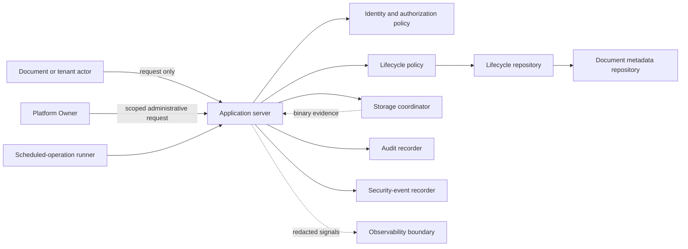
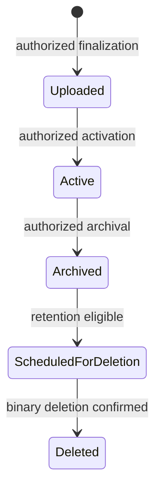
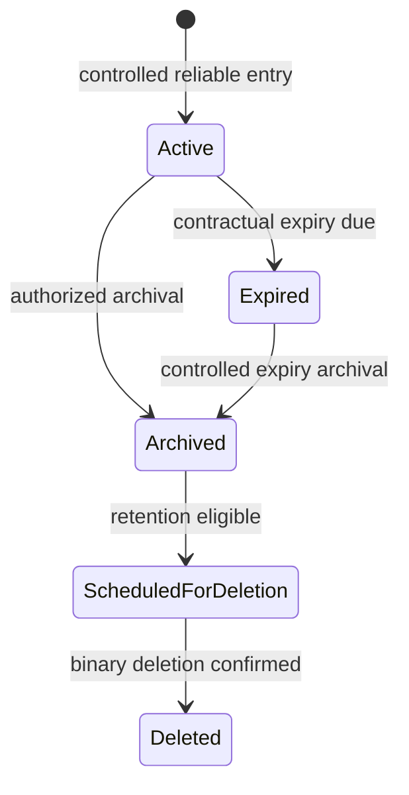
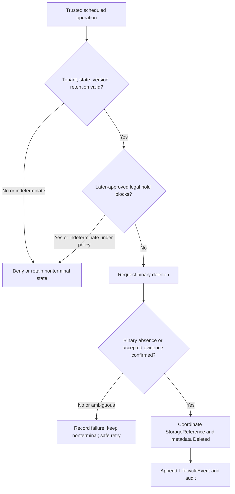

# Foundation V1 Document Lifecycle Architecture

## 1. Document status

| Item | Status |
|---|---|
| Document type | Technical-discovery document |
| Implementation | **NOT AUTHORIZED** |
| Source branch | `rebuild/foundation-v1` |
| Analysis date | 23 July 2026 |
| Current application | Legacy prototype, not a production lifecycle system |
| Authority | Product Owner Decisions 1–10 in [`OWNER_DECISIONS_FOUNDATION_V1.md`](./OWNER_DECISIONS_FOUNDATION_V1.md) are authoritative |
| Required inputs | Approved Foundation V1 discovery documents |
| Provider selection | No database, ORM, storage, queue, scheduler, workflow, OCR, AI, identity, payment, hosting, PDF-parser, date-library, or other implementation provider or dependency is selected |
| Naming | Lifecycle names and conceptual interfaces are domain-discovery terms, not implementation identifiers |
| Real documents | Real-document processing is not authorized |
| Production | No Production release is authorized |

Source precedence is: approved Product Owner decisions; verified repository facts; approved audit findings; approved Foundation V1 discovery documents; architectural proposals; unresolved business and technical decisions. **VERIFIED FACT**, **INFERENCE**, **PROPOSAL**, **APPROVED BASELINE**, **PROHIBITED**, and **PENDING PRODUCT OWNER DECISION** identify statement status where useful. This document makes no legal, privacy, security, retention, or compliance guarantee.

## 2. Scope

This document covers Bill and CTE lifecycle ownership, state inventories, history, transitions, authorization, timestamps, archival, reliable contractual expiry, retention, deletion scheduling and eligibility, permanent deletion and confirmation, failure, restoration and legal-hold boundaries, suspension/deactivation/commercial effects, scheduled operations, reconciliation, audit, security events, observability, concurrency, idempotency, and provider-independent tests.

| Delegated concern | Canonical document |
|---|---|
| Authentication and sessions | `FOUNDATION_V1_IDENTITY_AND_ACCESS.md` |
| Roles, permissions, scopes, ownership, tenant isolation | `FOUNDATION_V1_TENANCY_AUTHORIZATION.md` |
| Commercial states and entitlements | `FOUNDATION_V1_LICENSING_ENTITLEMENTS.md` |
| Conceptual entities and temporal data | `FOUNDATION_V1_DATA_MODEL.md` |
| Binary storage and deletion confirmation | `FOUNDATION_V1_DOCUMENT_STORAGE.md` |
| Audit retention and purge | `FOUNDATION_V1_AUDIT_RETENTION.md` |
| Environments and provider selection | `FOUNDATION_V1_ENVIRONMENTS_PROVIDERS.md` |
| Testing and release controls | `FOUNDATION_V1_TESTING_RELEASE.md` |
| Monitoring and incident handling | `FOUNDATION_V1_OBSERVABILITY_SECURITY.md` |
| OCR, AI, PUN, simulation, comparison, reporting | `FOUNDATION_V1_FUTURE_BOUNDARIES.md` |
| Implementation sequencing | `FOUNDATION_V1_IMPLEMENTATION_ROADMAP.md` |

## 3. Non-goals

**PROHIBITED:** This document does not authorize or finalize source-code changes, dependency installation, database creation, schema migration, exact tables or fields, enum representation, transaction mechanism, job runner, scheduler, queue, retry timing, time-zone implementation, legal-hold implementation, restoration implementation, document interpretation, OCR, CTE or Bill extraction, PUN matching, simulation inputs, comparisons, reporting, public document access, real-document processing, real tenant activation, or Production migration.

It selects no database, ORM, schema language, storage provider, queue, scheduler, cache, event bus, workflow engine, job runner, identity or payment provider, OCR or AI provider, PDF parser, date library, SDK, or implementation dependency.

## 4. Verified current repository state

| Classification | Current-state statement | Evidence |
|---|---|---|
| VERIFIED FACT | There is no persistent document lifecycle state or lifecycle history. | Repository tree; `app/page.tsx`; `package.json` |
| VERIFIED FACT | There are no server-side lifecycle, archival, CTE-expiry, scheduled-deletion, or permanent-deletion APIs or jobs. | Repository tree; `app/`; `package.json` |
| VERIFIED FACT | There is no deletion-confirmation or lifecycle-reconciliation implementation. | Repository tree; `app/page.tsx` |
| VERIFIED FACT | There is no lifecycle audit persistence or lifecycle test suite. | Repository tree; `package.json` |
| VERIFIED FACT | The current application is a client-side prototype with hardcoded and in-memory state. | `app/page.tsx`; `PROJECT_AUDIT.md` §§1–4 |
| VERIFIED FACT | PDF text handling occurs in the browser through a dynamically loaded PDF.js CDN script. | `app/page.tsx`; `PROJECT_AUDIT.md` §§1, 5 |
| INFERENCE | Browser removal from an in-memory CTE array is not durable archival or confirmed deletion. | `app/page.tsx`; approved Decision 6 |
| PROPOSAL | Foundation V1 should introduce the conceptual boundaries in this document only after separate authorization. | This document |
| UNKNOWN | Hidden external Vercel, GitHub, database, storage, scheduler, queue, backup, or provider configuration was not evidenced by inspected repository files. | Repository evidence cannot establish external state |

No hidden infrastructure or external-service configuration is invented.

## 5. Lifecycle principles

**APPROVED BASELINE / mandatory architecture:** lifecycle state is server-authoritative and tenant-bound; transitions deny by default; client-supplied state is never authoritative; document type and lifecycle state differ; Bill and CTE lifecycles differ; current state never replaces history; transitions are attributable, auditable, and effective-dated; missing dates and lifecycle values are not invented or defaulted; modification time never substitutes for a lifecycle timestamp; destructive transitions are explicit; lifecycle and retention eligibility precede deletion; deletion request is not confirmation; metadata deletion is not binary deletion; permanent deletion is not “hidden”; archival creates no public access; tenant ownership survives every non-deletion transition.

Attribution, auditability, provenance, historical preservation, data minimization, idempotency, concurrency safety, safe retry, least privilege, and provider neutrality are mandatory. Provenance conceptually preserves the attributable origin and chain of lifecycle-relevant actions and evidence without storing document content. No client claim, filename, storage reference, URL, entitlement, or role independently authorizes a lifecycle operation.

## 6. Lifecycle authority boundaries

| Boundary | Responsibility | Trusted inputs | Prohibited assumptions | Allowed lifecycle influence | Prohibited lifecycle influence | Safe failure | Audit requirement |
|---|---|---|---|---|---|---|---|
| Document actor | Request permitted action | Validated session context, server-resolved tenant | Client state, tenant, date, or document reference is authoritative | Submit a request and reason | Directly mutate state or history | Deny and expose no tenant/document detail | Record attributable request/denial where required |
| Tenant actor | Act within validated tenant role/scope | Valid membership, permission, ownership | Tenant role grants platform or cross-tenant power | Request policy-permitted transitions | Bypass lifecycle, retention, storage, or commercial checks | Deny safely | Tenant-scoped transition evidence |
| Platform Owner | Perform separately authorized administration | Active assignment, purpose, validated target tenant | Platform status grants unrestricted content or transitions | Only permission-, purpose-, tenant-, and audit-bound action | Unscoped customer-content access or arbitrary mutation | Deny absent every prerequisite | Privileged audit and security context |
| Application server | Coordinate trusted decisions | Validated identity/system actor and server facts | Client success proves transition | Execute approved pipeline | Invent state, date, tenant, or policy | Preserve prior state on uncertainty | Correlated decision and result |
| Authorization policy | Evaluate actor, tenant, scope, ownership | Trusted policy inputs and versions | Entitlement or role alone authorizes | Allow/deny transition request | Persist state or access content | Deny on missing/indeterminate facts | Decision evidence without content |
| Lifecycle policy | Validate type/state transition and temporal rules | Trusted current state, history, policy versions | Storage state decides business lifecycle | Return conceptual eligibility decision | Mutate repository or invent dates | Deny ambiguous/prohibited transition | Policy/version/result evidence |
| Lifecycle repository | Coordinate current state and version | Trusted tenant, document, accepted decision | Stored current state may overwrite history | Persist approved state/version outcome | Authorize action or edit history silently | Reject stale/mismatched writes | Mutation outcome and correlation |
| Document metadata repository | Provide trusted document facts | Trusted tenant/document/type/ownership | Metadata presence grants access | Supply/coordinate metadata state | Decide transition or binary deletion | Fail closed on mismatch | Read/mutation evidence as required |
| Storage coordinator | Request and confirm binary effects | Authorized lifecycle command and matched tenant reference | Delete request equals confirmation | Supply storage evidence | Decide lifecycle or mark Deleted alone | Return ambiguous/failure; no false success | Request, evidence, failure; no content |
| Scheduled-operation runner | Execute due tenant-scoped work | Trusted operation, tenant, expected versions | Due time alone proves eligibility | Re-evaluate and request eligible transition | Mix tenants or force stale transition | No-op/deny stale or ambiguous work | Attempt/result/retry evidence |
| Audit recorder | Preserve accountable evidence | Redacted correlated event | Audit state is operational state | Record evidence only | Authorize or mutate lifecycle | Protected operation follows later audit-failure policy; never fabricate success | Recorder/configuration failures surfaced |
| Security-event recorder | Record suspicious lifecycle activity | Redacted anomaly context | Every denial is an incident | Record security evidence | Authorize or change lifecycle | Preserve safe denial if recorder degrades | Recorder/configuration failures surfaced |
| Observability boundary | Expose redacted health and trends | Correlation, metrics, classified outcomes | Missing telemetry means success | Observe only | Authorize or mutate transitions | Missing telemetry cannot make failure successful; protected operations fail safely when required evidence is unavailable | Administrative changes and telemetry gaps auditable where applicable |

The client never selects lifecycle state. The storage adapter never decides business lifecycle. Platform Owner status alone never grants unrestricted content access. Administrative authority remains permission-bound, purpose-bound, tenant-scoped, and auditable.

## 7. Document lifecycle ownership

Every lifecycle record has one trusted tenant; every LifecycleEvent has one document; document tenant and event tenant must match. Transitions, customer reassignment, archival, and scheduling preserve tenant ownership. User or membership deactivation does not orphan history; tenant suspension does not rewrite it. Surviving deletion evidence retains tenant attribution without document content. Cross-tenant lifecycle transitions are **PROHIBITED**.

## 8. Common lifecycle concepts

Current lifecycle state, LifecycleEvent, TransitionRequest, TransitionDecision, effective transition time, recorded time, `archived_at`, contractual expiry date, `expired_at` if later approved, `deletion_due_at`, deletion-requested time, binary-deletion-confirmed time, `deleted_at`, retention-policy version, later legal-hold reference, later restoration eligibility, lifecycle version, and audit correlation are distinct conceptual facts.

None is interchangeable. Exact persistence representation is **PENDING** and delegated to `FOUNDATION_V1_DATA_MODEL.md`.

## 9. Bill lifecycle inventory

| State | Meaning | Entry conditions | Exit conditions | Access effect | Storage effect | Retention effect | Selection effect | Background-job effect | Audit | Terminal | Pending decisions |
|---|---|---|---|---|---|---|---|---|---|---|---|
| Uploaded | Authorized finalized Bill exists | Required finalization, validation, ownership, initial history | Controlled activation; later-approved direct archive | Private, policy-authorized | Valid private binary/reference | No archive clock | Not automatically eligible for business use | Cleanup/reconciliation only as applicable | Initialization required | No | Activation trigger; direct archive |
| Active | Normally available operational Bill | Authorized Uploaded-to-Active decision | Authorized archival | Normal access still requires all checks | Remains private | No archive clock | Business-use rules delegated | Reconciliation only as applicable | Activation required | No | Exact selection/use rules |
| Archived | Removed from new ordinary operational use | Authorized archive, trusted clock/history | Retention eligibility to scheduling; restoration only if later approved | Download policy pending | Binary remains private | 60-calendar-day clock begins | Not used in new operational processes absent approved restoration | Retention evaluation | Archive and policy version required | No | Access, restoration, bulk archive |
| Scheduled for deletion | Eligible deletion is scheduled, not completed | Archived, due, revalidated, not blocked | Confirmed deletion only; cancellation only if later approved | Pending lifecycle policy | Binary may exist | Eligibility rechecked | Not selectable | Deletion execution/retry | Scheduling/attempt required | No | Access and cancellation |
| Deleted | Permanent deletion satisfied | Required binary evidence and coordinated metadata | None | Inaccessible | Binary confirmed absent/accepted evidence | Completed; minimal evidence only | Never selectable | Reconciliation may verify evidence | Confirmation required | Yes | Tombstone/evidence representation |

No additional operational Bill lifecycle state is approved. Bill interpretation and extracted business status remain outside Foundation V1.

## 10. Bill lifecycle transitions

**APPROVED operational inventory:** authorized finalization enters Uploaded; Uploaded → Active; Active → Archived; Archived → Scheduled for deletion after eligibility; Scheduled for deletion → Deleted only after confirmed permanent deletion. Uploaded → Archived is **PENDING PRODUCT OWNER DECISION** and permitted only by later approved policy. Every other transition is prohibited or pending.

Every transition is server-authorized and revalidates tenant, permission, ownership, lifecycle version, and applicable commercial/feature controls. Automatic versus manual responsibility for Uploaded → Active, restoration from Archived, and cancellation/restoration from Scheduled for deletion remain pending. Deleted has no outgoing transition.

The diagram intentionally omits pending restoration and direct Uploaded → Archived paths.

## 11. Bill Uploaded state

Uploaded means finalized binary and metadata exist, required upload validation completed, tenant ownership is established, and lifecycle history is initialized. The document stays private and non-interpretive. Incomplete/unfinalized upload and UploadIntent cannot enter Uploaded. The activation trigger remains pending; scanning/quarantine restrictions are conditional future boundaries.

## 12. Bill Active state

Active means normal authorized operational availability, never unrestricted access. Lifecycle, ownership, tenant, authorization, commercial, and storage checks remain mandatory. Storage entitlement is not authorization. Archival is controlled. Active does not mean interpreted, verified, or simulated; selection and business-use rules are delegated.

## 13. Bill archival

Archival requires an authorized server transition, trusted tenant, current-state and ownership validation, permission/scope and lifecycle-version validation, trusted-clock `archived_at`, preserved prior state, an appended attributable LifecycleEvent, audit, retention-policy version, and policy-derived `deletion_due_at`. It separately preserves creator provenance, uploader provenance, prior lifecycle-actor attribution, and original upload/finalization provenance. Archival does not rewrite or replace creator or uploader provenance, does not rewrite original upload or finalization evidence, does not make the archiving actor appear to be the creator or uploader, and does not alter tenant ownership. The binary remains private. Archival is not deletion or publication and never uses modification time as its clock.

**PENDING PRODUCT OWNER DECISION:** archival authority, reason requirement, bulk archival, Archived Bill download access, and restoration.

## 14. Bill retention clock

**APPROVED BASELINE:** Archived Bills are permanently deleted **60 calendar days after `archived_at`**. `archived_at` is the sole approved clock origin; `deletion_due_at` derives from it and a versioned policy. Sixty calendar days is not business days. Created, upload, and modified times cannot substitute.

Suspension, deactivation, contract expiry, and contract termination do not stop or reset this clock automatically. Clock source and time-zone standard remain pending.

## 15. Bill scheduled-for-deletion state

Retention eligibility has been established and deletion is scheduled or eligible, but deletion is not confirmed. Binary content may still exist; metadata cannot claim Deleted. Execution rechecks eligibility and later-approved legal hold. Access, restoration, and cancellation remain pending. Duplicate scheduling is idempotent. Scheduled for deletion is not a terminal success state.

## 16. Bill Deleted state

Deleted requires satisfied permanent-deletion requirements, binary-deletion evidence, coordinated terminal metadata, and `deleted_at`. The document is inaccessible and unselectable; object references grant no access. Minimum permitted history/audit may remain without content. Deleted means permanently handled, not hidden. No restoration or ordinary transition out is approved.

## 17. CTE lifecycle inventory

| State | Meaning | Entry conditions | Exit conditions | Access effect | Storage effect | Retention effect | Simulation selection | Background-job effect | Audit | Terminal | Pending decisions |
|---|---|---|---|---|---|---|---|---|---|---|---|
| Active | Reliably eligible operational CTE | Controlled initial entry with reliable eligibility | Due expiry and controlled archival; authorized earlier archive | All access checks still apply | Private binary | No archive clock | Only Active CTEs may be selected later | Expiry evaluation | Initial/transition evidence | No | Initial outcome if dates unavailable |
| Expired | Contractual expiry reliably established | Active, trusted evidence, due clock | Controlled archival required by approved outcome | Policy-controlled, not automatically public | Private binary | No clock until archival | Not selectable | Archival coordination/reconciliation | Expiry evidence required | No | Coordination timing/atomicity |
| Archived | Controlled archival completed | Active authorized archive or expiry-controlled archive | Retention eligibility; restoration only if approved | Access pending | Private binary | 12-calendar-month clock begins | Not selectable | Retention evaluation | Archive/policy evidence | No | Access, restoration, bulk archive |
| Scheduled for deletion | Archived CTE is due and scheduled | Due, revalidated, no later block | Confirmed deletion only; cancellation only if approved | Policy-controlled | Binary may exist | Eligibility rechecked | Not selectable | Deletion execution/retry | Scheduling/attempt evidence | No | Cancellation/access |
| Deleted | Permanent deletion satisfied | Required binary evidence and coordinated metadata | None | Inaccessible | Confirmed absent/accepted evidence | Completed; minimum evidence only | Never selectable | Reconciliation may verify | Confirmation required | Yes | Tombstone/evidence representation |

No Uploaded CTE operational state is approved. Finalization must establish a valid initial outcome under later design without inventing dates. CTE extraction is outside Foundation V1.

## 18. CTE lifecycle transitions

**APPROVED operational inventory:** controlled initial entry → Active where reliable eligibility exists; Active → Expired when reliable contractual expiry is due; Active → Archived by authorized action; Expired → Archived through the approved controlled server process; Archived → Scheduled for deletion after eligibility; Scheduled for deletion → Deleted only after confirmed deletion.

Product Owner Decision 6 requires a CTE reaching contractual expiry to become Expired and Archived through a controlled server-side process. The exact coordination timing, whether the two recorded transitions share one coordinated operation, retry behavior, and initial outcome when reliable dates are unavailable remain pending; these questions cannot remove the approved Expired-and-Archived outcome. No guessed or filename-derived date or client claim may trigger expiry. Restoration is pending; Deleted has no outgoing transition.

Pending restoration paths are intentionally absent.

## 19. CTE Active state

Active is operationally active under trusted lifecycle policy. Only Active CTEs are selectable for future simulations, whose implementation is outside Foundation V1. Active does not prove extracted-content correctness and grants no access by itself. Contractual dates exist only when reliable; authorization, ownership, entitlement, feature, and lifecycle checks remain separate.

## 20. CTE contractual expiry

Expiry uses reliable contractual evidence and a trusted clock. Expiry date differs from modification time, archival time, and `deletion_due_at`. It is never inferred solely from filename; missing dates are not replaced by current, latest-known, or default dates. OCR/AI extraction is unauthorized. The authoritative source remains pending. Evaluation is idempotent, rejects/reconciles stale lifecycle versions, and is audited.

## 21. CTE Expired state

Expired means contractual expiry was reliably established. It is not selectable for future simulations and is not Deleted. Under approved Decision 6, expiry must be followed by controlled server-side archival; Expired does not itself start retention, and `archived_at` remains absent until the actual archival transition. Access is policy-controlled. Exact coordination timing, retry, and operational responsibility remain pending.

## 22. CTE archival

Archival requires trusted tenant, authorized transition, current-state/lifecycle-version validation, reliable prior state, trusted-clock `archived_at`, appended LifecycleEvent, retention-policy version, derived `deletion_due_at`, and audit. Binary content stays private. Expiry and archival are distinct events even when coordinated. Archival is not deletion, uses no modification time, and invents no contractual date.

Automatic controlled archival after contractual expiry is an approved outcome. Its coordination timing and failure recovery, any delay policy, manual archival authority, bulk archival, restoration, and Archived access remain pending.

## 23. CTE retention clock

**APPROVED BASELINE:** Archived CTEs are permanently deleted **12 calendar months after `archived_at`**. `archived_at` is the clock origin; `deletion_due_at` derives from it and the retention-policy version. Twelve calendar months is never silently converted to 365 days. Month-end and leap-year rules require explicit later design. Modification and contractual-expiry times cannot substitute.

Suspension, deactivation, contract termination, and commercial suspension do not stop or reset the clock automatically. Clock source and time-zone standard remain pending.

## 24. CTE scheduled-for-deletion state

Twelve-calendar-month eligibility is established, but permanent deletion is unconfirmed and binary content may remain. The document is unselectable; metadata cannot claim Deleted. Execution rechecks eligibility and later legal hold. Cancellation/restoration remains pending. Duplicate scheduling is idempotent.

## 25. CTE Deleted state

Deleted requires binary-deletion confirmation or accepted evidence, coordinated terminal metadata, and `deleted_at`. Minimum permitted history/audit remains without content. The document is inaccessible and unselectable. No ordinary restoration exists. Deleted is not Expired, Archived, hidden, or Scheduled for deletion.

## 26. Common transition authorization pipeline

The server-side sequence is:

1. validate session or trusted system context;
2. validate internal user or system actor;
3. resolve tenant from trusted context;
4. validate tenant ownership;
5. validate tenant operational and commercial state where applicable;
6. validate membership or approved platform assignment;
7. validate role and permission;
8. validate scope and ownership;
9. validate document type;
10. validate current lifecycle state;
11. validate lifecycle version;
12. validate requested transition;
13. validate retention and later legal-hold conditions where applicable;
14. validate storage state where applicable;
15. apply or coordinate the transition;
16. append lifecycle history;
17. record audit and security context;
18. update authorization-sensitive or job state where required.

Client-provided prior state is untrusted. Commercial entitlement alone does not authorize. Platform Owner alone has no unrestricted transition authority. Exact transaction technology is pending.

## 27. Lifecycle transition request

A conceptual TransitionRequest carries trusted tenant/document references, actor/system actor, requested transition, untrusted stated reason, expected current state/version, requested effective time where applicable, correlation, idempotency reference, provenance, and authorization context. It is not proof of occurrence. Exact request persistence remains pending.

## 28. Lifecycle transition decision

A conceptual TransitionDecision records allowed/denied, validated tenant, current and target states, policy version, actor, reason classification, effective time, result, correlation, denial category, and audit requirement. Denial changes no lifecycle state. Errors expose no sensitive internals. The exact policy engine remains pending.

## 29. Lifecycle event history

Append-only conceptual LifecycleEvent data includes tenant, document, type, prior/new state, actor/system actor, reason, effective/recorded times, lifecycle/policy versions, correlation, idempotency, source, provenance, and redaction.

Ordinary product flows cannot edit history. Corrections append evidence rather than rewrite events. Current state remains consistent with history. Events contain no document content. Exact event-storage pattern is pending.

## 30. Temporal integrity

`created_at`, uploaded/finalized time, effective-transition time, recorded time, modified time, contractual effective/expiry dates, later `expired_at`, `archived_at`, `deletion_due_at`, deletion-requested time, binary-deletion-confirmed time, and `deleted_at` are distinct.

No fact substitutes silently for another. Modified time is never the retention origin; contractual expiry is not `archived_at`; recorded time does not replace effective time; corrections preserve prior evidence. Clock source and time-zone standard remain pending.

## 31. Lifecycle versioning

Conceptual versions cover document lifecycle, transition policy, retention policy, state history, relevant authorization, and relevant StorageReference. Stale transitions fail or reconcile safely; concurrent transitions cannot silently both succeed; history remains attributable. Optimistic locking or any equivalent mechanism is pending.

## 32. Idempotency

| Operation | Operation identity | Tenant | Duplicate behavior | Result reuse | Conflict behavior | Audit behavior |
|---|---|---|---|---|---|---|
| Initial Bill finalization | Finalization operation | Trusted required | Same validated result, no second Bill | Reuse prior outcome | Deny mismatched payload/state | Record duplicate/outcome |
| Bill activation | Activation operation | Trusted required | No duplicate transition/event | Reuse existing result | Reject stale/different target | Audit attempt/result |
| Bill archival | Archive operation | Trusted required | Preserve first archive time | Reuse archive result | Reject different state/version | Audit duplicate/conflict |
| CTE expiry | Expiry-evaluation operation | Trusted required | One effective expiry transition | Reuse decision | Reconcile stale evidence/version | Audit evidence/result |
| CTE archival | Archive operation | Trusted required | One archive transition/clock | Reuse result | Reject incompatible state | Audit |
| Deletion scheduling | Schedule operation | Trusted required | One effective schedule | Reuse schedule reference | Reject incompatible due/policy | Audit |
| Permanent deletion request | Deletion operation | Trusted required | No duplicate destructive effect | Reuse known request/result | Preserve ambiguity, reverify | Audit every attempt |
| Deletion confirmation | Confirmation operation | Trusted required | One terminal confirmation | Reuse verified evidence | Reject mismatched evidence | Audit |
| Lifecycle-event append | Transition correlation | Trusted required | No duplicate logical event | Return existing event reference | Reject conflicting event | Audit anomaly |
| Failed-operation retry | Original operation + attempt | Trusted required | Safe repeated attempt | Reuse confirmed result | Stop on changed eligibility | Audit attempt |
| Reconciliation correction | Finding/correction identity | Trusted required | One attributable correction | Reuse correction result | Controlled review on conflict | Audit evidence |

Duplicates never create duplicate transitions. Idempotency never permits stale or unauthorized transitions. Key format is pending.

## 33. Concurrency and race conditions

| Race | Risk | Required invariant | Safe failure | Audit | Implementation gate |
|---|---|---|---|---|---|
| Bill activation vs archival | Conflicting state | One transition from one version | Reject/re-evaluate loser | Both attempts | Version/transaction design |
| Duplicate archival | Multiple clocks/events | One effective archive | Reuse first result | Duplicate detected | Idempotency design |
| CTE expiry vs manual archival | Lost expiry evidence | Approved outcome/history preserved | Re-evaluate and coordinate | Evidence/order | CTE coordination design |
| Transition vs tenant suspension | Stale authority | Revalidate at commit | Deny stale actor path | Conflict | Authorization invalidation |
| Transition vs membership deactivation | Former actor mutates | Actor valid at decision | Deny | Security/audit | Session/version design |
| Access vs archival | Post-archive exposure | Access uses current lifecycle | Deny/re-evaluate | Correlation | Access policy |
| Access vs deletion scheduling | Access policy ambiguity | Current policy decides | Deny if indeterminate | Correlation | Scheduled-state access decision |
| Restoration vs deletion execution | Irreversible conflict | No restoration without approved authority | Deletion/restoration pauses safely | Both attempts | Restoration decision |
| Legal hold vs deletion | Prohibited deletion | Later-approved hold wins before request | Do not delete if indeterminate | Security/audit | Legal-hold decision |
| Duplicate scheduling | Duplicate jobs | One effective operation | Reuse | Duplicate | Idempotency |
| Duplicate permanent deletion | Repeated destructive call | No duplicate effect/false success | Verify evidence | Every attempt | Storage adapter contract |
| Binary deletion vs metadata update | State drift | Metadata Deleted only after evidence | Remain nonterminal/failed | Failure | Coordination design |
| Reconciliation vs transition | Correction overwrites valid work | Version/evidence required | Abort stale correction | Finding/conflict | Reconciliation policy |
| Stale job | Wrong state transition | Expected state/version matches | No-op/deny | Stale job | Job contract |
| Duplicate job | Repeated state/effect | Idempotent operation | Reuse/deny | Duplicate | Runner contract |

No concurrency or transaction technology is selected.

## 34. Tenant suspension effects

Suspension blocks normal tenant access but changes neither ownership nor lifecycle/history. It does not automatically archive/delete documents or stop/reset retention. Security, audit, retention, and eligible scheduled deletion remain separately evaluated. Reinstatement neither restores Deleted documents nor automatically reverses valid archival or expiry. Tenant-visible access during suspension is delegated.

## 35. User and membership deactivation effects

Deactivation blocks actor access while tenant ownership, uploader attribution, and history remain. Documents are not orphaned, archived, or deleted automatically; retention is not reset; scheduled deletion remains policy-controlled. Reassignment is separate. Membership reactivation is pending and cannot automatically reverse lifecycle state.

## 36. Commercial-state and contract effects

Commercial suspension, license loss, entitlement loss, contract expiry, and contract termination do not rewrite, archive, or delete documents automatically. They may affect normal access under authorization policy. Retention continues under lifecycle policy. Restricted/read-only behavior and future downgrade effects remain pending/delegated.

## 37. Restoration boundary

Restoration is a **PENDING PRODUCT OWNER DECISION**. Separate questions cover Archived restoration, cancellation of Scheduled for deletion, action after deletion request but before confirmation, action after confirmed deletion, backup recovery, and erroneous transitions.

Every possible restoration or cancellation request must conceptually revalidate:

1. trusted tenant context;
2. document tenant ownership;
3. current lifecycle state;
4. lifecycle version;
5. requested restoration or cancellation eligibility;
6. role and permission;
7. scope and resource ownership;
8. tenant operational and commercial state where applicable;
9. retention eligibility and retention-policy version;
10. legal-hold conditions where later approved;
11. current storage state;
12. StorageReference tenant match;
13. whether binary deletion has not started, is in progress, is ambiguous, or is confirmed;
14. deletion-operation and deletion-confirmation evidence;
15. security restrictions;
16. audit and provenance requirements.

Restoration is not authorized merely because a binary still exists, and backup presence grants no restoration authority. An Archived document cannot be restored without an approved policy; cancellation of Scheduled for deletion is not automatically permitted; and a deletion request does not prove restoration is possible. Ambiguous deletion progress must fail safely and require controlled review. Confirmed Deleted documents cannot be restored, no restoration transition from Deleted is approved, and none appears in the state diagrams.

Restoration cannot bypass tenant isolation, authorization, lifecycle, retention, storage, later-approved legal-hold, commercial, or security rules. Any future restoration must append attributable evidence rather than rewrite lifecycle history. The restoration window, authorized actor, reason catalog, required evidence, cancellation deadline, treatment after a deletion request but before confirmation, treatment of ambiguous provider results, erroneous-transition correction, backup-recovery behavior, and exact transaction and compensation mechanism remain pending. No restoration workflow is approved here.

## 38. Legal-hold boundary

Legal hold is a **PENDING PRODUCT OWNER, LEGAL, AND SECURITY DECISION**. If later approved, it may block scheduling/deletion but grants no access, changes no tenant ownership/type, creates no public path, and erases no history. It would require authorized actor, reason, scope, effective period, audit, and release. Legal basis, representation, priority, duration, tenant visibility, and release workflow remain pending. No workflow is approved here.

## 39. Scheduled operations

Conceptual categories are CTE expiry evaluation; controlled CTE expiry-to-archive coordination implementing the already approved Expired and Archived outcomes; Bill retention eligibility; CTE retention eligibility; deletion scheduling; permanent-deletion execution; failed-deletion retry; and lifecycle reconciliation.

Reliable contractual expiry evidence is mandatory. When expiry is reliably established and due, the controlled server-side lifecycle produces the approved Expired and Archived outcomes as distinct recorded LifecycleEvents. The approved outcome itself is not pending. No expiry date is invented or inferred from a filename, modification time, current date, latest-known date, or client claim, and no OCR or AI extraction is authorized.

Every operation has trusted tenant, target document, expected state/version, due time, operation type, policy version, idempotency, system actor, correlation, attempts, result, failure classification, and audit. Execution rechecks eligibility; clients cannot schedule arbitrary work; cross-tenant batch mixing is prohibited. Queue, scheduler, runner, frequency, and retry mechanism remain pending.

Only the authoritative expiry-date source, evaluation frequency, coordination timing, whether the two transitions use one coordinated operation, delay mechanics, retry behavior, maximum attempts, scheduler, queue, job runner, transaction shape, failure recovery, manual archival authority, bulk archival, Archived access, and restoration remain pending.

## 40. CTE expiry-evaluation operation

Evaluation requires trusted CTE and tenant, current Active state, reliable contractual expiry, trusted clock, lifecycle-version validation, idempotency, due-only transition, audit, and safe handling of missing/ambiguous dates. Missing does not become today; ambiguity does not expire; modified time and filename are not authoritative. OCR/AI is unauthorized. Frequency is pending.

## 41. Retention-eligibility operation

| Type | Required state | Required origin | Approved elapsed period | Other requirements |
|---|---|---|---|---|
| Bill | Archived | Valid `archived_at` | 60 calendar days | Correct policy version; no later-approved block |
| CTE | Archived | Valid `archived_at` | 12 calendar months, never 365 days | Correct policy version; no later-approved block |

Not-due records remain untouched. Missing `archived_at` or invalid temporal order fails safely. Eligibility is auditable and does not prove deletion.

## 42. Permanent-deletion coordination

Aligned with `FOUNDATION_V1_DOCUMENT_STORAGE.md`, coordination requires:

1. trusted system context;
2. tenant validation;
3. document/StorageReference tenant match;
4. lifecycle validation;
5. retention eligibility;
6. later-approved legal-hold evaluation;
7. lifecycle-version validation;
8. idempotency;
9. binary-deletion request;
10. result verification;
11. binary absence or accepted deletion evidence;
12. StorageReference update;
13. metadata terminal-state coordination;
14. LifecycleEvent;
15. audit;
16. failure/SecurityEvent where applicable.

Deletion request is not confirmation. Metadata cannot claim Deleted before required binary evidence. Cross-provider transaction design remains pending. False success is prohibited.

## 43. Failed lifecycle operations

Failure categories include missing trusted tenant, invalid actor, missing permission, ownership/type/state mismatch, stale version, prohibited transition, missing `archived_at`, invalid expiry, retention not due, later legal hold, storage mismatch, ambiguous deletion, metadata update failure, audit failure, scheduler/job failure, duplicate execution, and concurrency conflict.

All fail safely without tenant enumeration or content disclosure. Errors are user-safe, logs redacted, correlation retained, audit/security evidence generated where required, retry allowed only when safe, and silent state correction prohibited.

## 44. Lifecycle reconciliation

Reconciliation detects current-state/history disagreement; Deleted metadata with binary present; binary absent with non-deleted metadata; Scheduled state without operation; completed operation without event; invalid `archived_at`/`deletion_due_at`; Expired CTE without reliable evidence; duplicate event; stale version; cross-tenant mismatch; and retention-policy drift.

It is tenant-isolated and evidence-driven. Destructive correction is never silent; ambiguity requires controlled review; correction is attributable. Frequency remains pending.

## 45. Audit events

Required categories are lifecycle initialized, Bill activated/archived, CTE expired/archived, deletion eligibility evaluated, deletion scheduled/attempted/confirmed/failed, later restoration requested/denied, later legal hold applied/released, lifecycle correction, reconciliation finding/correction, and transition denied.

Every category carries tenant, actor/system actor, document, type, prior state, requested/new state, reason, result, effective and recorded times, correlation, provenance, and redaction. Audit excludes document content, raw credentials, and storage access tokens. Schema, retention, access, and purge are delegated.

## 46. Security events

Conceptual categories are manipulated/client-supplied lifecycle state, cross-tenant attempt, stale replay, duplicate destructive request, deletion-before-retention, later legal-hold bypass, unauthorized restoration, history mutation, suspicious CTE-expiry manipulation, object/metadata mismatch, repeated denial, audit suppression, and job-context tampering.

SecurityEvent remains distinct from AuditEvent. Severity and incident workflow are pending; infrastructure and document detail are redacted.

## 47. Observability requirements

Signals include transition requests/denials/latency, archival volume, CTE-expiry backlog, retention backlog, deletion backlog/attempts/failures/ambiguity, reconciliation drift, stale-version conflicts, duplicate jobs, later legal-hold conflicts, lifecycle-audit failures, and cross-tenant attempts.

Telemetry is tenant-aware, correlated, and redacted, with no content or credentials. Observability authorizes nothing; missing telemetry cannot turn failure into success. Alert thresholds remain pending.

## 48. Threat analysis

| # | Threat | Cause | Consequence | Preventive boundary | Detection | Implementation gate | Canonical document |
|---:|---|---|---|---|---|---|---|
| 1 | Client-selected lifecycle state | Client claim trusted | Unauthorized state | Server authority | Tamper denial | Transition API design | `FOUNDATION_V1_TENANCY_AUTHORIZATION.md` |
| 2 | Cross-tenant mutation | Tenant filter/context absent | Data breach/corruption | Trusted tenant match | SecurityEvent | Tenant isolation | `FOUNDATION_V1_TENANCY_AUTHORIZATION.md` |
| 3 | Insecure document reference | Reference treated as authority | Unauthorized mutation | Ownership revalidation | Access anomaly | Resource policy | `FOUNDATION_V1_TENANCY_AUTHORIZATION.md` |
| 4 | Unauthorized archival | Permission/scope skipped | Operational loss | Authorization pipeline | Denial/audit review | Permission catalog | `FOUNDATION_V1_TENANCY_AUTHORIZATION.md` |
| 5 | Unauthorized activation | Role assumed sufficient | Invalid use | Full transition checks | Denial | Activation authority | `FOUNDATION_V1_DOCUMENT_LIFECYCLE.md` |
| 6 | Unauthorized expiry | Actor/client forces expiry | CTE unavailable | Reliable evidence/system policy | Expiry anomaly | Expiry authority | `FOUNDATION_V1_DOCUMENT_LIFECYCLE.md` |
| 7 | Guessed CTE expiry | Missing date invented | Wrong transition | No invented dates | Provenance validation | Date-source decision | `FOUNDATION_V1_DATA_MODEL.md` |
| 8 | Filename-derived expiry | Filename trusted | Wrong transition | Filename untrusted | Evidence mismatch | Inspection boundary | `FOUNDATION_V1_DOCUMENT_STORAGE.md` |
| 9 | Modified-time substitution | Temporal facts conflated | Wrong retention | Temporal integrity | Invariant check | Temporal model | `FOUNDATION_V1_DATA_MODEL.md` |
| 10 | Current-date default | Missing date defaulted | Premature expiry | Fail missing date | Missing-evidence signal | Policy validation | `FOUNDATION_V1_DOCUMENT_LIFECYCLE.md` |
| 11 | Duplicate archival | Retry not idempotent | Multiple clocks/events | Idempotency/version | Duplicate event | Idempotency design | `FOUNDATION_V1_DATA_MODEL.md` |
| 12 | Stale lifecycle version | Concurrent write accepted | Lost transition | Version check | Conflict metric | Concurrency design | `FOUNDATION_V1_DATA_MODEL.md` |
| 13 | Transition replay | Old request reused | Duplicate/invalid change | Tenant-bound idempotency | Replay event | Request contract | `FOUNDATION_V1_DOCUMENT_LIFECYCLE.md` |
| 14 | History rewriting | Mutable history | Evidence loss | Append-only events | Integrity/reconciliation | Persistence design | `FOUNDATION_V1_DATA_MODEL.md` |
| 15 | Missing audit event | Recorder/coordination failure | Unaccountable action | Audit gate/policy | Audit-gap signal | Audit consistency | `FOUNDATION_V1_AUDIT_RETENTION.md` |
| 16 | Audit suppression | Privileged tampering | Concealed abuse | Separate protected recorder | SecurityEvent | Audit controls | `FOUNDATION_V1_AUDIT_RETENTION.md` |
| 17 | Retention-clock manipulation | Origin/policy changed | Early/late deletion | Versioned `archived_at` policy | Temporal reconciliation | Retention design | `FOUNDATION_V1_DATA_MODEL.md` |
| 18 | `archived_at` manipulation | Untrusted clock/input | Wrong due date | Trusted clock/history | Invariant check | Clock design | `FOUNDATION_V1_DOCUMENT_LIFECYCLE.md` |
| 19 | `deletion_due_at` manipulation | Client/manual override | Wrong deletion | Derived/versioned value | Recalculation | Policy design | `FOUNDATION_V1_DATA_MODEL.md` |
| 20 | 12 months converted to 365 days | Incorrect date math | Policy breach | Calendar-month invariant | Boundary tests | Date rules | `FOUNDATION_V1_DOCUMENT_LIFECYCLE.md` |
| 21 | Deletion before eligibility | Due check skipped | Premature loss | Execution revalidation | Denial/audit | Deletion coordinator | `FOUNDATION_V1_DOCUMENT_STORAGE.md` |
| 22 | Deletion without tenant validation | Job context untrusted | Cross-tenant loss | Tenant-bound job | SecurityEvent | Job contract | `FOUNDATION_V1_TENANCY_AUTHORIZATION.md` |
| 23 | Request treated as success | Provider response overtrusted | False deletion | Confirmation evidence | Ambiguity backlog | Storage adapter | `FOUNDATION_V1_DOCUMENT_STORAGE.md` |
| 24 | Metadata Deleted, binary present | Coordination failure | Retained hidden content | Evidence before terminal state | Reconciliation | Operation boundary | `FOUNDATION_V1_DOCUMENT_STORAGE.md` |
| 25 | Binary deleted, metadata Active | Partial failure | Broken access/history | Coordinated non-false state | Reconciliation | Operation boundary | `FOUNDATION_V1_DOCUMENT_STORAGE.md` |
| 26 | Restoration after confirmed deletion | Backup/operator bypass | Policy reversal | No Deleted restoration | Restore attempt event | Restoration decision | `FOUNDATION_V1_DOCUMENT_LIFECYCLE.md` |
| 27 | Backup resurrection | Restore ignores deletion | Deleted content returns | Deletion-policy validation | Restore test/audit | Backup policy | `FOUNDATION_V1_DOCUMENT_STORAGE.md` |
| 28 | Legal-hold bypass | Future hold not checked | Improper deletion | Later policy gate | Conflict event | Legal decision | `FOUNDATION_V1_AUDIT_RETENTION.md` |
| 29 | Suspension stops retention | States conflated | Indefinite retention | Separate tenant/lifecycle state | Clock test | Policy implementation | `FOUNDATION_V1_TENANCY_AUTHORIZATION.md` |
| 30 | Deactivation triggers deletion | Actor ownership conflated | Data loss | Tenant owns document | Deactivation test | Ownership design | `FOUNDATION_V1_DATA_MODEL.md` |
| 31 | Contract termination deletes | Commercial/lifecycle conflated | Data loss | State separation | Contract test | Commercial policy | `FOUNDATION_V1_LICENSING_ENTITLEMENTS.md` |
| 32 | Expired CTE becomes Deleted | States collapsed | Premature loss | Required archival/retention path | State invariant | Lifecycle design | `FOUNDATION_V1_DOCUMENT_LIFECYCLE.md` |
| 33 | Cross-tenant batch job | Mixed payload | Broad corruption | One trusted tenant per operation | Batch validation | Runner design | `FOUNDATION_V1_TENANCY_AUTHORIZATION.md` |
| 34 | Duplicate scheduled job | At-least-once execution | Duplicate effects | Idempotency | Duplicate metric | Job design | `FOUNDATION_V1_AUDIT_RETENTION.md` |
| 35 | Destructive reconciliation | Ambiguity auto-corrected | Irreversible loss | Evidence/control review | Correction audit | Reconciliation policy | `FOUNDATION_V1_DATA_MODEL.md` |
| 36 | Lifecycle/storage drift | Partial operation | Wrong access/deletion state | Coordination/reconciliation | Drift signal | Storage lifecycle contract | `FOUNDATION_V1_DOCUMENT_STORAGE.md` |
| 37 | Platform Owner unrestricted transition | Platform role treated as blanket access | Privilege abuse | Purpose/tenant/permission checks | Privileged audit | Support-access decision | `FOUNDATION_V1_TENANCY_AUTHORIZATION.md` |
| 38 | Entitlement treated as authorization | Commercial fact overtrusted | Unauthorized transition | Independent checks | Policy denial | Authorization composition | `FOUNDATION_V1_LICENSING_ENTITLEMENTS.md` |
| 39 | Content in audit/telemetry | Overcollection | Sensitive disclosure | Redaction/minimization | Payload checks | Audit/observability design | `FOUNDATION_V1_OBSERVABILITY_SECURITY.md` |

No preventive boundary selects a provider or implementation dependency.

## 49. Testing strategy

Provider-independent conceptual test categories are:

1. trusted tenant lifecycle ownership;
2. cross-tenant transition denial;
3. Platform Owner transition restriction;
4. client-state tampering;
5. Bill initial Uploaded lifecycle;
6. Bill activation;
7. Bill archival;
8. duplicate Bill archival idempotency;
9. Bill 60-calendar-day retention;
10. Bill not-due deletion denial;
11. CTE Active-only future-selection rule;
12. CTE reliable expiry;
13. CTE missing-expiry safe failure;
14. CTE ambiguous-expiry safe failure;
15. CTE Expired not becoming Deleted;
16. controlled CTE expiry-to-archive outcome;
17. CTE archival;
18. CTE 12-calendar-month retention;
19. no 365-day substitution;
20. modified time not used as `archived_at`;
21. suspension not resetting retention;
22. deactivation not triggering deletion;
23. contract termination not triggering deletion;
24. scheduled deletion idempotency;
25. permanent deletion confirmation;
26. false-deletion-success prevention;
27. metadata/binary coordination;
28. stale lifecycle version rejection;
29. concurrent-transition conflict;
30. duplicate-job execution;
31. append-only lifecycle history;
32. transition audit;
33. SecurityEvent/AuditEvent separation;
34. reconciliation drift;
35. destructive-correction prohibition;
36. legal-hold future boundary;
37. restoration future boundary and no Deleted restoration;
38. ordinary Preview synthetic-only;
39. property-based state-transition invariants;
40. property-based temporal invariants;
41. negative authorization tests.

Core tests require no real database, storage or identity provider, queue/scheduler, OCR/AI provider, document, or customer data.

## 50. Conceptual lifecycle interfaces

| Interface | Responsibility | Tenant requirement | Trusted inputs | Outputs | Invariants | Idempotency | Concurrency | Failure behavior | Audit/security behavior | Provider-neutral test substitute |
|---|---|---|---|---|---|---|---|---|---|---|
| LifecyclePolicyPort | Evaluate state/temporal policy | Trusted tenant for document | Type, state, versions, trusted times | Eligibility/denial | Approved inventories only | Same inputs same decision context | Reject stale policy/version | Deny indeterminate | Decision evidence | Deterministic policy fake |
| LifecycleAuthorizationPort | Evaluate actor authority | Trusted target tenant | Identity, membership, permission, scope, ownership | Allow/deny | Entitlement/role alone insufficient | Duplicate evaluation no mutation | Current auth version | Deny missing facts | Denial/privilege events | Authorization fake |
| LifecycleStateRepository | Coordinate current state/version | Trusted tenant required | Authorized decision, expected version | State/version result | Tenant/history consistency | No duplicate transition | Reject stale write | Preserve prior state | Mutation evidence | In-memory versioned fake |
| LifecycleEventRepository | Append history | Trusted tenant required | Accepted transition/event facts | Event reference | Append-only, no content | No duplicate logical event | Ordered/versioned append | Reject conflict | Gap/tamper signal | Append-only fake |
| TransitionRequestPort | Accept normalized request | Trusted tenant resolved server-side | Actor/system context, target, intent | Validated request/refusal | Client state untrusted | Request identity bounded | Duplicate/replay safe | Reject malformed/untrusted | Request/denial audit | Request harness |
| TransitionDecisionPort | Produce decision record | Trusted tenant required | Validated request, policy/auth results | Allowed/denied decision | Denial changes nothing | Reuse same decision context | Reject stale facts | Deny ambiguity | Decision audit | Decision fake |
| BillLifecyclePort | Coordinate Bill transitions | Trusted Bill tenant | Bill state/version, decision | Bill outcome | Exact Bill inventory | Duplicate safe | One transition/version | Deny prohibited state | Bill event/audit | Bill state-machine fake |
| CteLifecyclePort | Coordinate CTE transitions | Trusted CTE tenant | CTE state/version/evidence | CTE outcome | Exact CTE inventory/outcome | Duplicate safe | One transition/version | Deny missing evidence | CTE event/audit | CTE state-machine fake |
| CteExpiryEvaluationPort | Evaluate reliable expiry | Trusted CTE tenant | Active CTE, reliable date, clock/version | Due/not due/indeterminate | No guessed dates | Repeat evaluation safe | Reject stale version | Indeterminate does not expire | Evidence/result audit | Fixed-clock fake |
| ArchivalPort | Coordinate archive/clock | Trusted tenant required | Authorized document, state/version, clock/policy | Archive outcome | One `archived_at`; private binary | Preserve first success | Reject races | No partial false success | Archive audit | Archive coordinator fake |
| RetentionEligibilityPort | Evaluate due status | Trusted tenant required | Archived state/time, type, policy | Eligible/not due/invalid | 60 days / 12 months exactly | Repeat safe | Policy/version consistent | Invalid/missing time denies | Evaluation audit | Calendar-boundary fake |
| DeletionSchedulingPort | Schedule eligible deletion | Trusted tenant required | Eligibility, document/version | Schedule result | No client arbitrary deletion | One effective schedule | Reject changed state | No scheduling if unclear | Schedule audit | Schedule repository fake |
| PermanentDeletionCoordinator | Coordinate confirmed deletion | Trusted tenant required | Authorized operation, matched storage ref | Confirmed/failed/ambiguous | Evidence before Deleted | No duplicate destructive effect | Serialize/reconcile race | Ambiguity stays nonterminal | Attempt/result/security | Storage deletion fake |
| DeletionConfirmationPort | Validate binary evidence | Trusted tenant required | Provider-neutral deletion evidence | Confirmed/not confirmed | Request is not confirmation | Reuse verified evidence | Reject conflicting evidence | Not confirmed on ambiguity | Confirmation audit | Evidence verifier fake |
| LifecycleReconciliationPort | Find/correct drift | Trusted tenant required | State/history/storage/operation evidence | Finding/proposed correction | No silent destruction | Correction identity | Abort stale correction | Ambiguity requires review | Finding/correction audit | Drift-fixture fake |
| LegalHoldPolicyPort | Future hold decision boundary | Trusted tenant required | Later-approved authority/scope/evidence | Block/release decision if approved | Grants no access | Repeat decision safe | Current hold version | Indeterminate blocks only per later policy | Privileged audit | Pending-policy fake |
| RestorationPolicyPort | Future restoration decision boundary | Trusted tenant required | Later-approved request/evidence/state | Allow/deny if approved | No Deleted restoration approved | Duplicate safe | Race with deletion denied/paused | Deny absent approval | Attempt/denial audit | Pending-policy fake |
| ScheduledLifecycleOperationRepository | Store conceptual operations | Trusted tenant required | Target/version/due/policy/idempotency | Operation/attempt state | No tenant mixing | One operation identity | Safe claim/version | Stale work no-ops/denies | Attempt audit | In-memory job fake |
| LifecycleAuditPort | Record lifecycle audit | Tenant/platform context explicit | Redacted event facts | Record result/reference | No content/credentials | Duplicate policy explicit | Ordered where required | Surface required-record failure | Audit only, no authority | Capturing audit fake |
| LifecycleSecurityEventPort | Record security anomaly | Tenant/platform context explicit | Redacted anomaly facts | Event result/reference | Distinct from audit | Duplicate aggregation explicit | No lifecycle mutation | Never turn denial into allow | Security record | Capturing security fake |
| LifecycleObservabilityPort | Emit redacted signals | Tenant context when tenant data | Metrics/outcomes/correlation | Signal result | No content; no authority | Duplicate-tolerant signals | No state mutation | Missing signal never means success | Telemetry gaps surfaced | Capturing telemetry fake |

LegalHoldPolicyPort and RestorationPolicyPort are pending future boundaries. No interface authorizes a transition merely by returning a state. No database, ORM, queue, scheduler, workflow engine, provider, SDK, or language is selected.

## 51. Conceptual operation boundaries

Exactly twelve coordinated conceptual boundaries are:

1. authorized upload finalization and initial lifecycle state;
2. Bill activation and LifecycleEvent append;
3. Bill archival and retention-clock initialization;
4. CTE expiry evaluation and Expired transition;
5. CTE archival and retention-clock initialization;
6. retention eligibility and deletion scheduling;
7. deletion execution and binary confirmation;
8. metadata Deleted transition and LifecycleEvent append;
9. failed deletion and retry evidence;
10. lifecycle reconciliation and correction evidence;
11. legal-hold decision and deletion blocking where later approved;
12. restoration decision and lifecycle coordination where later approved.

Transaction technology is pending; cross-provider atomicity is not guaranteed; compensation is only a conceptual future possibility. No implementation mechanism is selected.

## 52. Data requirements delegated to the data model

`FOUNDATION_V1_DATA_MODEL.md` owns conceptual requirements for Document, Bill and CTE specializations, current lifecycle state/version, LifecycleEvent, TransitionRequest, TransitionDecision, contractual-expiry evidence, `archived_at`, `deletion_due_at`, deletion attempt/confirmation, `deleted_at`, retention-policy version, later legal-hold reference, later restoration evidence, ScheduledOperation, ReconciliationRun/Finding, AuditEvent, SecurityEvent, provenance, idempotency, and concurrency version.

This document finalizes no tables, fields, types, enums, constraints, indexes, transactions, or persistence representation.

## 53. Dependencies and delegated decisions

| Canonical dependency | Questions delegated | Inputs supplied by this document | Pending decisions | Implementation |
|---|---|---|---|---|
| `FOUNDATION_V1_IDENTITY_AND_ACCESS.md` | Sessions, actor validity | Transition entry checks | Session invalidation/revalidation mechanics | **NOT AUTHORIZED** |
| `FOUNDATION_V1_TENANCY_AUTHORIZATION.md` | Roles, permissions, scopes, ownership | Lifecycle resources and denial points | Transition permission catalog, privileged access | **NOT AUTHORIZED** |
| `FOUNDATION_V1_LICENSING_ENTITLEMENTS.md` | Commercial/access restrictions | Separation from lifecycle/retention | Restricted/read-only/downgrade behavior | **NOT AUTHORIZED** |
| `FOUNDATION_V1_DATA_MODEL.md` | Entities, temporal facts, concurrency | State/history/evidence requirements | Persistence, versions, constraints | **NOT AUTHORIZED** |
| `FOUNDATION_V1_DOCUMENT_STORAGE.md` | Binary access/deletion evidence | Lifecycle eligibility and terminal coordination | Deletion/order/restore mechanics | **NOT AUTHORIZED** |
| `FOUNDATION_V1_AUDIT_RETENTION.md` | Audit retention/purge, deletion jobs | Event categories and job evidence | Audit retention, legal hold, job policy | **NOT AUTHORIZED** |
| `FOUNDATION_V1_ENVIRONMENTS_PROVIDERS.md` | Providers, regions, environments | Required isolation/capabilities | All provider/environment choices | **NOT AUTHORIZED** |
| `FOUNDATION_V1_TESTING_RELEASE.md` | Tools, fixtures, gates | Provider-neutral tests/acceptance | Exact mandatory gates | **NOT AUTHORIZED** |
| `FOUNDATION_V1_OBSERVABILITY_SECURITY.md` | Alerts, incidents, telemetry retention | Threats, events, required signals | Thresholds, severity, workflows | **NOT AUTHORIZED** |
| `FOUNDATION_V1_FUTURE_BOUNDARIES.md` | OCR/AI/PUN/simulation/reporting | Non-interpretive lifecycle boundary | Every future workflow | **NOT AUTHORIZED** |
| `FOUNDATION_V1_IMPLEMENTATION_ROADMAP.md` | Sequencing and approvals | Blocking decisions/criteria | Implementation authorization/order | **NOT AUTHORIZED** |

## 54. Open document-lifecycle decisions

| # | Decision | Why it matters | Decide by | Discovery blocking | Implementation blocking | Required approver |
|---:|---|---|---|---|---|---|
| 1 | Bill Uploaded-to-Active trigger | Defines operational entry | Before activation design | No | Yes | Product Owner |
| 2 | Bill activation authority | Controls availability | Before permission matrix | No | Yes | Product Owner + Security |
| 3 | Direct Uploaded-to-Archived policy | Determines optional path | Before Bill state implementation | No | Yes if included | Product Owner |
| 4 | Bill archival authority | Prevents unauthorized removal | Before permission matrix | No | Yes | Product Owner + Security |
| 5 | Bill bulk archival | Expands blast radius | Before bulk workflow | No | Yes if included | Product Owner + Security |
| 6 | Archived Bill access | Defines visibility/download | Before access implementation | No | Yes | Product Owner + Security |
| 7 | Bill restoration | Determines whether path exists | Before restoration design | No | Yes if included | Product Owner |
| 8 | Bill scheduled-deletion cancellation | Affects due operations | Before cancellation design | No | Yes if included | Product Owner |
| 9 | Initial CTE state when dates unavailable | Avoids invented eligibility | Before CTE finalization | No | Yes | Product Owner |
| 10 | Authoritative CTE expiry source | Establishes reliable evidence | Before expiry automation | No | Yes | Product Owner + domain review |
| 11 | CTE expiry evaluation frequency | Sets timeliness/load | Before jobs | No | Yes | Product Owner + Technical |
| 12 | Automatic CTE expiry mechanics | Implements approved due outcome | Before expiry implementation | No | Yes | Product Owner + Technical |
| 13 | Expiry-to-archive coordination model | Preserves approved outcome safely | Before expiry/archive implementation | No | Yes | Product Owner + Technical |
| 14 | CTE expiry-to-archive delay | Defines controlled timing | Before expiry/archive implementation | No | Yes | Product Owner |
| 15 | CTE archival authority | Controls manual/archive actions | Before permission matrix | No | Yes | Product Owner + Security |
| 16 | CTE bulk archival | Expands blast radius | Before bulk workflow | No | Yes if included | Product Owner + Security |
| 17 | Archived CTE access | Defines visibility/download | Before access implementation | No | Yes | Product Owner + Security |
| 18 | CTE restoration | Determines whether path exists | Before restoration design | No | Yes if included | Product Owner |
| 19 | CTE scheduled-deletion cancellation | Affects due operations | Before cancellation design | No | Yes if included | Product Owner |
| 20 | Restoration window | Bounds reversible period | Before restoration design | No | Yes if included | Product Owner |
| 21 | Restoration actor | Controls authority | Before restoration design | No | Yes if included | Product Owner + Security |
| 22 | Restoration evidence | Enables accountability | Before restoration design | No | Yes if included | Product Owner + qualified review |
| 23 | Restoration after deletion request | Resolves race before confirmation | Before deletion/restoration | No | Yes if included | Product Owner + Technical |
| 24 | Erroneous-transition correction | Preserves history safely | Before correction workflow | No | Yes | Product Owner + Technical |
| 25 | Legal-hold requirement | Determines whether hold exists | Before deletion automation/real data | No | Yes for real data | Product Owner + Legal + Security |
| 26 | Legal-hold authority | Controls high-impact action | Before hold design | No | Yes if included | Product Owner + Legal + Security |
| 27 | Legal-hold priority | Resolves retention/deletion conflicts | Before hold design | No | Yes if included | Product Owner + Legal |
| 28 | Legal-hold duration | Prevents indefinite ambiguity | Before hold design | No | Yes if included | Product Owner + Legal |
| 29 | Legal-hold release | Controls resumed deletion | Before hold design | No | Yes if included | Product Owner + Legal + Security |
| 30 | Legal-hold tenant visibility | Affects disclosure/UI | Before hold UI/API | No | Yes if included | Product Owner + Legal |
| 31 | Transition-reason catalog | Standardizes evidence | Before audit/schema | No | Yes | Product Owner |
| 32 | Lifecycle permission catalog | Enables granular enforcement | Before authorization implementation | No | Yes | Product Owner + Security |
| 33 | Lifecycle version mechanism | Prevents stale writes | Before persistence | No | Yes | Technical approval |
| 34 | State-history representation | Controls durability/query | Before persistence | No | Yes | Technical approval |
| 35 | TransitionRequest persistence | Determines replay/evidence | Before API/persistence | No | Yes | Technical + Security |
| 36 | Effective-time representation | Preserves temporal meaning | Before persistence | No | Yes | Technical approval |
| 37 | Clock source | Establishes trusted time | Before implementation | No | Yes | Technical + Security |
| 38 | Time-zone standard | Prevents boundary ambiguity | Before retention jobs | No | Yes | Product Owner + Technical |
| 39 | Month-end calculation | Defines 12-month deadline | Before CTE retention | No | Yes | Product Owner + Technical |
| 40 | Leap-year calculation | Defines calendar behavior | Before CTE retention | No | Yes | Product Owner + Technical |
| 41 | Job scheduler | Operational execution | Before jobs | No | Yes | Technical approval |
| 42 | Queue | Retry/ordering semantics | Before queued work | No | Yes if used | Technical approval |
| 43 | Job frequency | Controls timeliness/load | Before jobs | No | Yes | Product Owner + Technical |
| 44 | Retry schedule | Controls recovery/load | Before jobs | No | Yes | Technical + Operations |
| 45 | Maximum attempts | Controls terminal failure | Before jobs | No | Yes | Technical + Operations |
| 46 | Dead-letter handling | Controls exhausted work | Before jobs | No | Yes | Technical + Operations |
| 47 | Deletion reconciliation frequency | Controls drift duration | Before deletion operations | No | Yes | Technical + Operations |
| 48 | Correction authority | Prevents silent/destructive fixes | Before reconciliation correction | No | Yes | Product Owner + Security |
| 49 | Audit visibility | Governs evidence access | Before audit UI/API | No | Yes | Product Owner + Security |
| 50 | Security severity | Drives incident handling | Before monitoring | No | Yes | Security |
| 51 | Observability thresholds | Defines alerts | Before operations | No | Yes | Technical + Operations |
| 52 | LifecycleEvent retention | Preserves state evidence | Before persistence/purge | No | Yes | Product Owner + Legal/Security |
| 53 | AuditEvent retention | Preserves accountability | Before audit storage | No | Yes | Product Owner + Legal/Security |
| 54 | Backup interaction | Prevents resurrection/drift | Before backup/restore | No | Yes | Product Owner + Technical |
| 55 | Backup purge after deletion | Completes deletion policy | Before real data | No | Yes | Product Owner + qualified review |
| 56 | Protected-pilot lifecycle controls | Gates real pilot data | Before pilot | No | Yes | Product Owner + Security |
| 57 | Production lifecycle controls | Gates Production | Before Production | No | Yes | Product Owner + Security + Technical |

No row is silently resolved elsewhere. Approved automatic CTE Expired-and-Archived outcomes remain authoritative; rows 12–14 concern mechanics, coordination, and timing only.

## 55. Acceptance criteria

Approval requires measurable evidence that:

1. Bill and CTE lifecycles are separate and use only their exact five-state inventories;
2. server authority, trusted tenant ownership, deny-by-default transitions, granular authorization, and append-only history are explicit;
3. temporal facts remain distinct and missing dates are never invented;
4. Bill archival starts exactly a 60-calendar-day clock at `archived_at`;
5. reliable CTE expiry produces controlled Expired-and-Archived outcomes, and only Active CTEs are selectable for future simulations;
6. CTE archival starts exactly a 12-calendar-month clock at `archived_at`, never 365 days;
7. Scheduled for deletion is not Deleted, and confirmation evidence precedes terminal metadata;
8. suspension, deactivation, contract, and commercial effects do not silently rewrite lifecycle or retention;
9. restoration and legal hold remain explicitly pending and no Deleted restoration exists;
10. idempotency, races, jobs, reconciliation, audit, security events, observability, and safe failure have testable boundaries;
11. all threats have prevention, detection, implementation gate, and canonical ownership;
12. provider-independent tests require no real providers, documents, or customer data;
13. all 21 conceptual interfaces and 12 operation boundaries remain provider-neutral;
14. all open decisions remain transparent; and
15. implementation remains **NOT AUTHORIZED**.

## 56. Explicit non-authorizations

This document does **not** authorize source-code changes; dependency installation; database or ORM selection/creation; schema migration; storage-provider selection; queue, scheduler, cache, event bus, workflow-engine, job-runner, date-library, PDF-parser, SDK, identity, payment, OCR, AI, or hosting selection; lifecycle/job/archive/expiry/deletion automation; legal-hold or restoration implementation; real-document lifecycle processing; real tenant/customer data; OCR; AI processing; CTE or Bill extraction; PUN import; simulation; comparison; reporting; Production migration/deployment; Pull Request creation; merge to `main`; or GitHub/Vercel configuration.

No real documents, identifiers, secrets, credentials, tokens, personal data, customer data, or payment data are present. No Product Owner decision is weakened. No implementation action is authorized by this technical-discovery document.
