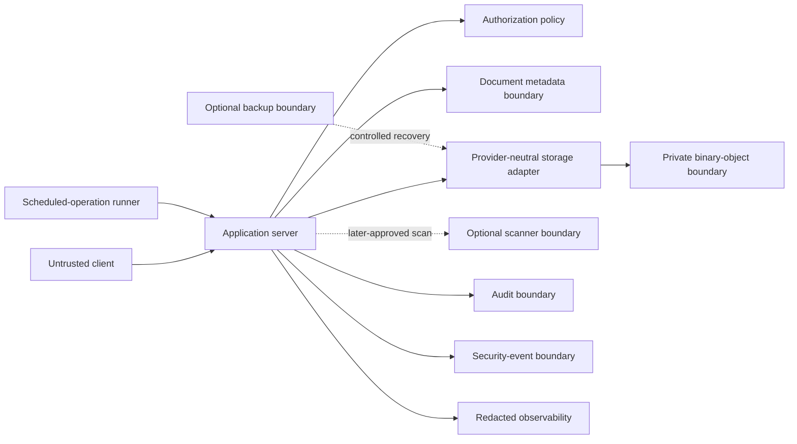
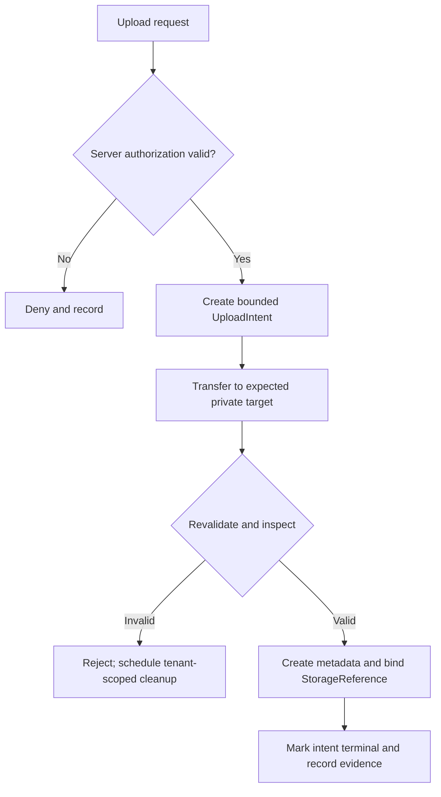
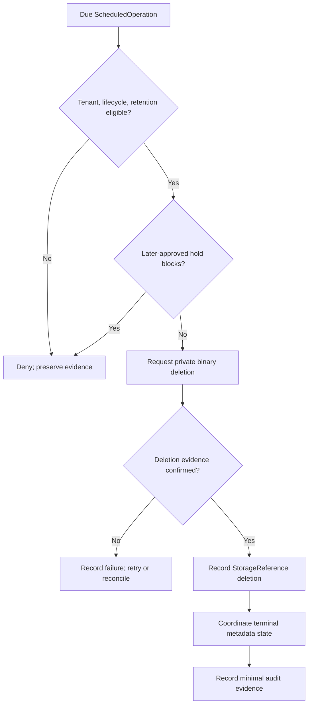

# Foundation V1 Private Document Storage Architecture

## 1. Document status

| Item | Status |
|---|---|
| Document type | Technical-discovery document |
| Implementation | **NOT AUTHORIZED** |
| Source branch | `rebuild/foundation-v1` |
| Analysis date | 23 July 2026 |
| Current application | Legacy prototype, not a production document system |
| Authority | Product Owner Decisions 1–10 in [`OWNER_DECISIONS_FOUNDATION_V1.md`](./OWNER_DECISIONS_FOUNDATION_V1.md) are authoritative |
| Required inputs | Previously approved Foundation V1 discovery documents |
| Provider selection | No storage, database, malware-scanning, encryption-key, queue, scheduler, cache, CDN, identity, hosting, OCR, or AI provider is selected |
| Naming | Storage concepts and interface names are conceptual, not implementation identifiers |
| Real documents | Not authorized for storage by this document |
| Production release | Not authorized |

Source precedence is: approved Product Owner decisions; verified repository facts; approved audit findings; previously approved Foundation V1 discovery documents; architectural proposals; unresolved business and technical decisions. **VERIFIED FACT**, **INFERENCE**, **PROPOSAL**, **APPROVED BASELINE**, **PROHIBITED**, and **PENDING PRODUCT OWNER DECISION** identify the status of statements where needed. This document makes no legal, privacy, security, or compliance guarantee.

## 2. Scope

This document covers private Bill and CTE binaries; metadata relationships and StorageReferences; tenant ownership; upload initiation, transfer, finalization, integrity, media-type and size validation; temporary access and download authorization; archival and lifecycle integration; scheduled permanent deletion, binary deletion, confirmation, failure, and reconciliation; usage and limits; audit and security events; encryption; environments; backup/restore; provider outage, replacement, exit; and provider-independent tests.

| Delegated concern | Canonical document |
|---|---|
| Authentication and sessions | `FOUNDATION_V1_IDENTITY_AND_ACCESS.md` |
| Authorization, scopes, ownership, tenant isolation | `FOUNDATION_V1_TENANCY_AUTHORIZATION.md` |
| Licensing, storage entitlement, quantitative limits | `FOUNDATION_V1_LICENSING_ENTITLEMENTS.md` |
| Conceptual entities and metadata relationships | `FOUNDATION_V1_DATA_MODEL.md` |
| Document transitions and retention clocks | `FOUNDATION_V1_DOCUMENT_LIFECYCLE.md` |
| Audit retention and purge | `FOUNDATION_V1_AUDIT_RETENTION.md` |
| Environments and provider assessment | `FOUNDATION_V1_ENVIRONMENTS_PROVIDERS.md` |
| Testing and release controls | `FOUNDATION_V1_TESTING_RELEASE.md` |
| Observability and incident response | `FOUNDATION_V1_OBSERVABILITY_SECURITY.md` |
| OCR, AI, PUN, simulations, comparisons, reports | `FOUNDATION_V1_FUTURE_BOUNDARIES.md` |
| Implementation sequencing | `FOUNDATION_V1_IMPLEMENTATION_ROADMAP.md` |

## 3. Non-goals

This document does not authorize or finalize source-code changes, dependencies, storage accounts, buckets/containers, databases, migrations, object keys, upload protocols, direct/proxy/multipart/resumable upload, CDN/public hosting, permanent public URLs, signed-access mechanisms, access-token formats, antivirus or malware-scanning providers, quarantine or content-disarm implementation, OCR, AI, PDF extraction, PUN import, simulations, comparisons, reports, real tenant documents, real payment evidence, backup integration, or Production migration.

It contains no provider API example, executable pseudocode, real object key, raw URL, secret, credential, token, personal/customer/payment data, real document, or real identifier.

## 4. Verified current repository state

- **VERIFIED FACT:** No private object store, storage adapter, persisted document metadata, upload/download API, signed temporary-access implementation, storage reconciliation, binary-deletion job, storage audit, or storage test is visible in the repository tree, `package.json`, or `package-lock.json`.
- **VERIFIED FACT:** No server-side identity, tenant, permission, entitlement, file-size, integrity, trusted media-type, malware-scan, or quarantine enforcement is visible in `app/`.
- **VERIFIED FACT:** [`app/page.tsx`](./app/page.tsx) is a client component whose PDF work occurs in browser state; selected PDFs are handled locally and prototype document facts are hardcoded or in memory.
- **VERIFIED FACT:** The prototype loads PDF.js from a public CDN URL in [`app/page.tsx`](./app/page.tsx); this is legacy client behavior, not an approved Foundation V1 storage or delivery architecture.
- **VERIFIED FACT:** [`next.config.ts`](./next.config.ts) contains no visible private-storage, encryption, backup, or storage-access configuration.
- **INFERENCE:** Browser-local state cannot establish durable tenant ownership, private-object isolation, trusted integrity, lifecycle, retention, deletion confirmation, or audit evidence.
- **PROPOSAL:** Introduce only the provider-neutral boundaries described here after separate architecture and implementation approval.
- **UNKNOWN:** Hidden GitHub, Vercel, storage, database, CDN, encryption, backup, or external-service configuration is neither verified nor assumed.

These findings align with [`PROJECT_AUDIT.md`](./PROJECT_AUDIT.md), sections 3, 5, 8, and 9; [`FOUNDATION_V1_DISCOVERY_BASELINE.md`](./FOUNDATION_V1_DISCOVERY_BASELINE.md), section 3; and [`FOUNDATION_V1_DATA_MODEL.md`](./FOUNDATION_V1_DATA_MODEL.md), section 4.

## 5. Storage principles

Mandatory principles are private by default; deny by default; tenant isolation by construction; trusted server-side authorization; no permanent public access path; object references are not authority; metadata/binary separation; adapter-isolated provider identifiers; no filename-derived authority; no client-authoritative tenant, media type, size, or checksum; explicit upload and deletion lifecycles; separate binary/metadata evidence; no false deletion success; idempotency; concurrency safety; least privilege; minimization; provenance; auditability; provider replaceability; environment isolation; synthetic-only Local, CI, and ordinary Preview; and no invented document values.

Encryption, checksums, MIME labels, filenames, URLs, object-key possession, or provider success messages never replace authorization, lifecycle validation, or deletion evidence.

## 6. Storage trust boundaries

| Boundary | Trusted inputs | Untrusted inputs | Outputs | Prohibited assumptions | Safe failure | Audit requirement |
|---|---|---|---|---|---|---|
| Client application | Bounded, validated server results | Client-supplied tenant, object reference, filename, MIME, size, checksum, completion, and authorization claims | Intent, transfer, access, cancellation, and status requests | Client state proves tenant ownership, authorization, object validity, or completion | Reject invalid or ambiguous requests without creating metadata, granting access, or exposing another tenant | Audit accountable initiation, denial, replay, mismatch, cancellation, and completion claims without content or credentials |
| Application server | Validated identity, membership/platform assignment, tenant, authorization, commercial, lifecycle, and version facts | Client payloads and raw adapter/provider payloads until normalized and validated | Tenant-bound commands, bounded access decisions, and user-safe results | Authentication, server mediation, or a successful adapter response alone authorizes storage or proves completion | Fail closed on missing, stale, ambiguous, or inconsistent facts; create no partial Active document and grant no fallback access | Audit accountable authorization, upload, access, lifecycle, deletion, reconciliation, and administrative outcomes with tenant and correlation |
| Authorization policy | Trusted user, membership/platform assignment, tenant, commercial, permission, scope, ownership, lifecycle, entitlement, and security facts | Client roles, scopes, ownership, tenant, feature, entitlement, and object claims | Explicit allow/deny outcome with bounded constraints and reason category | Role, Platform Owner status, entitlement, seat, object possession, or one prior decision alone grants access | Deny ambiguity, missing prerequisites, stale versions, and concealed cross-tenant targets | Audit required allow/deny decisions, privileged actions, policy-version conflicts, and suspicious tampering without sensitive content |
| Document metadata repository | Trusted tenant- and document-bound commands, validated metadata, lifecycle version, and operation identity | Client ownership, lifecycle, type, size, integrity, and deletion claims | Conceptual metadata facts, versions, typed conflicts, and persistence results | Metadata proves binary existence, integrity, tenant match, access, or deletion | Return typed failure and preserve prior valid state on tenant mismatch, stale version, ambiguity, or persistence failure | Audit metadata creation, binding, lifecycle mutation, terminal update, conflict, and denied mutation without document content |
| Storage adapter | Validated tenant-bound operation, opaque adapter reference, expected target, and bounded authority | Raw provider status, identifiers, errors, checksums, and policy claims until normalized | Provider-neutral object facts, operation results, and typed unavailable/ambiguous outcomes | A provider reference, checksum, success text, or object existence is authorization or deletion confirmation | Fail explicitly with no public fallback, no invented success, and no metadata completion when normalization or verification is unavailable | Audit adapter operation category, tenant, target reference, normalized result, failure class, and correlation; exclude raw credentials and uncontrolled provider payloads |
| Private binary-object store | Narrow adapter authority bound to tenant, target, object, and operation | Ordinary-client authority, arbitrary object paths, public policy, wildcard scope, and unvalidated metadata | Private object transfer, presence, metadata, retrieval, and deletion results | An object is public, listable, self-authorizing, correctly tenanted, valid, or deleted merely because it exists or accepts a command | Deny unauthorized scope and remain private; ambiguous transfer, retrieval, or deletion never becomes successful finalization or deletion confirmation | Audit through the adapter boundary for accountable transfer, access, deletion, failure, and reconciliation outcomes without binary content |
| Optional future malware scanner | Later-approved tenant-bound scan request, expected object, integrity/version facts, and approved scanning policy | File safety assumptions, client scan claims, raw provider payloads, and unapproved release instructions | Provider-neutral pending scan result such as clean, suspicious, malicious, failed, unavailable, or indeterminate | PDF means safe; missing, unavailable, failed, or indeterminate means Clean; a scan result alone grants access | Unavailable, failed, or indeterminate never silently becomes Clean; ordinary access remains blocked whenever a later-approved policy requires a conclusive result; the exact requirement remains a **PENDING PRODUCT OWNER AND SECURITY DECISION** | Where later approved, audit tenant-scoped and correlation-linked scan requests, results, failures, unavailable/indeterminate outcomes, quarantine decisions, and release/rejection decisions; exclude content, raw credentials, purposeless provider payloads, and sensitive infrastructure details; this does not approve mandatory scanning, a provider, quarantine implementation, or transmission to an unapproved provider |
| Scheduled-operation runner | Trusted tenant, system actor, operation identity, due facts, lifecycle/retention version, and current eligibility | Client scheduling authority, stale due time, mixed-tenant payload, and prior success claims | Tenant-scoped attempt, result, retry, failure, and reconciliation trigger | Due time, queue delivery, retry count, or system-actor label alone proves current eligibility | Recheck tenant, lifecycle, retention, hold, and idempotency at execution; deny or retain work safely on mismatch without cross-tenant or duplicate destructive effect | Audit scheduling, claim, eligibility denial, attempt, retry, completion, failure, and reconciliation correlation |
| Audit recorder | Redacted accountable tenant/platform context, actor, action, target, result, reason, provenance, and correlation | Document content, raw credentials, permanent URLs, uncontrolled provider payloads, and mutable operational-state claims | Append-oriented audit evidence or explicit required-write failure | Audit evidence is operational state, authorization, document content storage, or an editable substitute for source facts | Required audit failure is explicit and causes the accountable operation to fail safely where evidence is mandatory; never fabricate evidence | Record append-oriented evidence and audit-recorder administrative/configuration changes under delegated policy; preserve tenant context, correlation, minimization, and redaction |
| Security-event recorder | Redacted detection category, tenant/platform context where known, actor or unknown actor, target, result, source, and correlation | Raw sensitive payloads, content, credentials, and unverified infrastructure detail | Separate SecurityEvent evidence or explicit telemetry-write failure | Security events replace AuditEvents, authorize access, prove guilt, or permit sensitive payload retention | Failure never grants access or suppresses required audit; surface or retry safely through a later-approved mechanism without losing the protected-operation denial | Record security detections, delivery failures, configuration/administrative changes, and handling status where later approved; remain distinct from audit and exclude sensitive content |
| Observability boundary | Redacted tenant-aware metrics, operation status, correlation, and approved signal configuration | Document content, raw credentials, permanent URLs, uncontrolled provider payloads, client authority, and sensitive infrastructure dumps | Redacted signals, health state, delivery outcome, and later alerts | Logs or metrics are authorization, audit evidence, document storage, deletion confirmation, or proof that an incomplete upload is valid | Observability failure never bypasses authorization, isolation, validation, quarantine, lifecycle, retention, or deletion confirmation; missing telemetry never validates an incomplete upload or ambiguous deletion; protected operations fail safely when required evidence is unavailable, and degradation is surfaced independently where later designed | Where applicable, audit configuration changes, disabled signals, missing required telemetry, delivery failure, suspicious gaps, and administrative actions; telemetry remains distinct from audit and audit excludes content, raw credentials, permanent URLs, and uncontrolled provider payloads |
| Optional backup system | Approved backup/restore scope, trusted tenant/platform recovery context, deletion policy, integrity facts, and authorized actor | Ordinary-user access, cross-environment copy requests, stale backup state, and restore instructions lacking deletion-policy validation | Protected backup/recovery evidence and controlled restore result | Backup is product access, current authorization, a public fallback, or permission to resurrect deleted data | Deny ordinary access and conflicting restore; never restore across tenant/environment boundaries or resurrect permanently deleted content contrary to policy | Audit backup/restore authorization, scope, attempt, result, deletion propagation, conflict, failure, and provider-exit handling without document content |

No arrow grants authority by itself; each protected operation requires current server validation.

## 7. Metadata and binary separation

**Document metadata** conceptually includes internal document identifier, trusted tenant, customer/account relationship, document type, lifecycle state, uploader, trusted media type and size, integrity reference, StorageReference relationship, created/archived/deletion-due/deleted times, retention-policy reference, provenance, and audit correlation.

**Binary object** conceptually includes encrypted binary content, an opaque provider-neutral object reference, integrity evidence, adapter-isolated provider reference, deletion state, and deletion confirmation.

Metadata never embeds document content; audit never contains binary content. Binary identifiers are not credentials. Metadata deletion does not prove binary deletion, binary deletion does not complete the metadata lifecycle automatically, and exact persistence remains pending.

## 8. Tenant ownership and object isolation

Every Document and StorageReference has explicit trusted tenant ownership, and their tenants must match. Every storage operation carries server-resolved tenant context. A namespace or equivalent isolation boundary must prevent collisions without becoming the only isolation control. Client-supplied object references are never authoritative.

Cross-tenant copy, move, link, or reassignment is **PROHIBITED** unless separately approved as a migration. Platform Owner status grants no unrestricted content access. Suspension, user/membership deactivation, and archival preserve ownership. Minimal deletion evidence preserves tenant attribution without content.

## 9. Object-reference strategy

StorageReference identifiers are opaque and internal. Provider references remain inside adapters. References expose no customer/email/tax identifier, POD/PDR, filename, tenant name, sequential business count, credential, or public URL; possession never authorizes access.

Rotation, remapping, provider migration, and exit must be possible without changing the internal Document identifier. Exact key format and mapping representation remain pending.

## 10. Supported document categories

Foundation V1 storage scope contains only Bill and CTE documents. Storage accepts binaries without interpreting business content. An authorized workflow supplies classification; filename alone never does. Unsupported or ambiguous categories fail safely.

Future categories require discovery and authorization. OCR, extraction, PUN matching, simulation, comparison, and reporting remain outside Foundation V1 implementation.

## 11. Upload authorization

The server must:

1. validate session and InternalUser;
2. validate tenant Membership or PlatformAssignment;
3. resolve tenant from trusted context;
4. validate tenant operational and commercial state;
5. validate role, permission, scope, and ownership;
6. validate storage entitlement;
7. validate applicable quantitative limits;
8. validate allowed document category;
9. validate target CustomerAccount relationship where applicable;
10. create an authorized UploadIntent;
11. record audit and security context.

The client cannot choose arbitrary tenant authority, self-grant entitlement, or bypass suspension. Initiation is not completion, and finalization rechecks authorization.

## 12. Upload intent

Conceptual **UploadIntent** includes tenant, actor, target CustomerAccount, proposed document category, untrusted filename/MIME/size, expiry, status, bounded-use semantics, storage target reference, authorization/commercial versions, correlation, idempotency, and audit.

It is neither a Document nor final authorization after expiry or state change. Token, credential, duration, and transfer mechanism remain pending. Raw transfer credentials are not logged or unnecessarily persisted.

## 13. Upload transfer models

| Model | Advantages | Risks | Tenant-isolation implications | Integrity implications | File-size and quantitative-limit implications | Retry and idempotency implications | Audit requirements | Provider-neutral test substitute | Decisions still pending |
|---|---|---|---|---|---|---|---|---|---|
| Application-server-mediated upload | Central request-time enforcement, one controlled data path, and opportunity for server-side measurement or isolated inspection | Server resource exhaustion, denial of service, stream interruption, partial transfer, response leakage, and mistaken reliance on mediation itself | Trusted tenant context, actor, UploadIntent, target, permission, and ownership are validated before bytes are accepted; mediation alone never proves tenant safety | Integrity evidence is obtained or verified before metadata activation; interruption, substitution, and partial content remain invalid until finalization succeeds | Transferred bytes are measured from trusted server/adapter facts and checked against entitlement and quantitative limits before acceptance and during finalization | Request interruption and retries use an operation identity, cannot duplicate finalized metadata or objects, and return or reconcile one terminal result | Audit initiation, authorization/rejection, transfer outcome or interruption, finalization, cleanup, and correlated failure without document content | Tenant-aware in-memory byte-stream adapter with interruption, size, integrity, retry, and duplicate-finalization fixtures | Whether server mediation is supported; buffering/streaming behavior, resource limits, timeout, retry, and protocol remain pending; no proxy model, SDK, or provider is selected |
| Direct private-object-store upload using temporary bounded authorization | Reduces application-server binary traffic while retaining server initiation and finalization gates | Target-path manipulation, replay, leaked temporary authority, excessive scope, abandoned objects, provider ambiguity, and finalization bypass | Temporary authority is bound to trusted tenant, UploadIntent, exact private target, operation, and expiry; no client-selected public policy, wildcard, list, or unrelated overwrite scope | Post-transfer integrity and object-location evidence are obtained through the trusted adapter and verified at finalization; client checksum or provider success alone is insufficient | Quantitative limits and proposed size are checked before temporary authority is issued, and trusted post-transfer size/usage is checked again during finalization | Retry cannot reuse authority after expiry or finalization, cannot target another object, and cannot produce duplicate Document/StorageReference results; abandoned retries remain cleanup candidates | Audit UploadIntent creation, temporary authority issuance, rejection, expiry, transfer outcome where observable, finalization, replay, and tenant-scoped cleanup | Expiring private-object fake that models target scope, replay, leaked authority, trusted size/integrity facts, abandoned objects, and idempotent finalization | Direct-versus-proxy choice, temporary-access mechanism/duration, provider capability, upload protocol, retry, and cleanup remain pending; no direct model, SDK, or provider is selected |
| Multipart or resumable upload | Supports large-file resilience, interrupted-transfer continuation, and bounded part retry | Part substitution, session hijacking, stale/duplicate parts, ordering errors, duplicate completion, incomplete assembly, abandoned sessions, and excess aggregate size | Every session and part remains bound to the same trusted tenant, UploadIntent, private target, actor/authority, and authorization version; no part crosses tenant or intent | Integrity is verified for the completed assembled object, not merely from individual client claims; substituted, missing, stale, or reordered parts prevent finalization | Total trusted assembled size and usage are validated against limits; per-part acceptance cannot bypass aggregate size or entitlement checks | Part retries/replays and completion are idempotent, yield one assembled outcome, and cannot create duplicate finalized documents; incomplete sessions receive tenant-scoped cleanup | Audit session creation, observable part activity, retry/conflict, completion, abort, expiry, finalization, and cleanup without part content | Multipart/resumable state-machine fake with tenant-bound parts, reordering, duplication, interruption, aggregate-limit, integrity, and cleanup cases | Whether multipart or resumable behavior exists, part/session limits, expiry, abort, cleanup, provider capability, and protocol remain pending; neither model is selected |
| Hybrid upload | Can route different authorized operational cases through separately bounded transfer paths | Complexity, path switching, policy drift, inconsistent validation/evidence, double finalization, and partial failure across paths | Every selected path uses the same trusted tenant, UploadIntent, authorization policy, target ownership, and isolation requirements; switching paths never widens tenant scope or weakens checks | Differing integrity or object-location evidence across paths is reconciled before metadata activation; path switching cannot bypass final integrity verification | Each path enforces the same trusted size, entitlement, and quantitative-limit checks, and conflicting measurements block finalization pending reconciliation | Retries or transitions across paths share operation/idempotency identity, cannot reuse expired authority, and cannot double-transfer or double-finalize; partial path changes require safe cleanup/compensation | Audit the actual path, every path transition, authorization, transfer outcome, evidence reconciliation, rejection, finalization, and cleanup | Composite multi-path fake with policy-drift, path-switch, conflicting evidence, retry, cleanup, and double-finalization fixtures | Whether hybrid behavior exists, eligible routes, transition rules, precedence, compensation, protocols, SDKs, and providers remain pending; no hybrid model is selected |

No model is selected.

## 14. Upload transfer security

Transfer requires encrypted transport; short-lived, narrowly scoped, tenant-bound authorization; one intent per transfer context unless later approved; no wildcard/list permission; no unrelated overwrite; no client-selected access policy or public-read setting; no credential logging; no reuse after expiry/finalization; replay detection where applicable; and safe cancellation.

## 15. Upload finalization

The server must:

1. revalidate session or trusted system context;
2. revalidate tenant;
3. revalidate Membership and authorization;
4. revalidate tenant commercial state;
5. revalidate entitlement and limits;
6. resolve UploadIntent;
7. verify it is active and unused;
8. verify the object exists in the expected private location;
9. obtain trusted object size;
10. obtain trusted media-type evidence;
11. verify integrity evidence;
12. verify object ownership and tenant relationship;
13. apply later-approved scanning/quarantine policy;
14. create or activate Document metadata;
15. bind StorageReference;
16. mark UploadIntent terminal;
17. record audit/security events;
18. schedule cleanup of abandoned or invalid objects.

Client success is not storage proof. Metadata cannot become Active before required validation. Exact transaction technology remains pending.

## 16. File-size validation

Client size is untrusted. Trusted size comes from server measurement or verified adapter facts and is checked before and after transfer where possible. Entitlement and limits remain server-controlled. Zero-byte or mismatched objects fail safely unless a later explicit approval says otherwise. Minimum, maximum, units, and numeric limits remain pending.

## 17. Media-type and file-format validation

Filename extension and client MIME are untrusted. Server-side or isolated inspection compares declared and observed type; unsupported or ambiguous results fail safely. PDF support never means every PDF is safe. Accepted MIME catalog and structural validation remain pending; no library or provider is selected.

## 18. Content-integrity verification

Conceptual integrity evidence supports a cryptographic digest, trustworthy adapter checksum where applicable, later independent calculation, mismatch/duplicate/corruption detection, retrieval verification, and deletion correlation.

Client checksum alone is not authoritative. Algorithm remains pending. A checksum is neither malware verdict nor authorization and must not disclose content.

## 19. Duplicate-content boundary

Duplicate handling must consider identical digests, same-tenant detection, cross-tenant privacy leakage, ownership, accounting, retention, and deletion. Cross-tenant deduplication and automatic same-tenant deduplication are not approved. Detection must reveal nothing about another tenant. Policy and representation remain pending.

## 20. Malware scanning and quarantine boundary

The future boundary can represent request, Clean, Suspicious, Malicious, Failed, Unavailable, Indeterminate, Quarantine, Release, Deletion, and Rescan concepts. These are a **PROPOSAL**, not an approved operational state machine.

No scanner is selected. PDF is not presumed safe; missing/indeterminate never silently becomes Clean; ordinary access to quarantined content is blocked under any later-approved policy. Quarantine is neither archival nor deletion. Whether scanning is required is a **PENDING PRODUCT OWNER AND SECURITY DECISION**; timing, timeout, rescan, review, false positives, release, and retention remain pending. Real documents cannot go to an unapproved scanner.

## 21. Abandoned, partial, and failed uploads

The failure inventory includes expired intent, never-started, partial/interrupted transfer, object without successful finalization, metadata whose object validation failed, duplicate finalization, cleanup failure, disconnect, and provider timeout.

No orphan or incomplete object becomes Active. Cleanup is tenant-scoped and idempotent; retries are safe and failures audited. Exact abandonment timeout and cleanup frequency remain pending.

## 22. Document access authorization

Before read/download, the server must:

1. validate session and user;
2. resolve trusted tenant;
3. validate Membership or approved PlatformAssignment;
4. validate tenant operational/commercial state;
5. validate permission and scope;
6. validate ownership;
7. validate lifecycle state;
8. validate feature and entitlement where applicable;
9. validate quarantine/security restrictions;
10. create bounded access authorization;
11. record required audit/security evidence.

StorageReference, filename, or URL possession is insufficient. Platform Owner role alone does not authorize customer-document content. Suspended tenants are blocked from normal access; Deleted documents are inaccessible. Scheduled-for-deletion access remains delegated to lifecycle policy.

## 23. Temporary document access

Temporary access is private, short-lived, single-object or narrowly scoped, tenant- and operation-bound, non-public, non-indexable, non-listing, non-wildcard, expiring, replay-aware, and audit-correlated.

It is never stored as a permanent product URL. Signed URL, proxy stream, token, session, revocation, and duration remain pending. Client-cache policy remains pending. Temporary access cannot override authorization/lifecycle, and expiry never replaces server checks.

## 24. Download and streaming models

| Model | Security implications | Tenant-isolation implications | Audit implications | Revocation implications | Browser or client caching implications | Performance implications | Provider-neutral test substitute | Decisions still pending |
|---|---|---|---|---|---|---|---|---|
| Application-server proxy streaming | Every request and permitted range is server-authorized; server load, stream interruption, response leakage, and partial-response handling are risks; Platform Owner status alone is insufficient, lifecycle/quarantine restrictions remain enforced, and no permanent product URL is created | The server resolves trusted tenant, Document, StorageReference, ownership, and range context before delivery; no client-selected tenant/object or cross-tenant stream is accepted | Audit authorization, denial, stream start, permitted range where applicable, completion or interruption, result, tenant, and correlation without content | Revocation or changed policy affects later requests/ranges but cannot retract bytes already delivered | Explicit response/cache headers are required under a later policy; browser/intermediary caching remains pending; ordinary Preview stays synthetic-only | Adds application bandwidth, connection, backpressure, and scaling load but centralizes the data path | Authorized stream fake with tenant mismatch, range, interruption, policy-change, caching-header, and denial cases | Whether proxy streaming exists, buffering, range handling, timeout, headers, and capacity remain pending; no proxy model is selected |
| Temporary direct private-object access | Access is tenant-, object-, operation-, and expiry-bound, short-lived, narrow, non-public, and non-listing; leaked access may remain usable until expiry depending on the future mechanism; Platform Owner alone is insufficient, lifecycle/quarantine restrictions apply, and no permanent product URL exists | Server authorization binds the exact trusted tenant, Document, StorageReference, operation, and object before the adapter creates access; no wildcard or client-selected object authority | Audit server authorization, denial, temporary-access creation, expiry constraints, and correlation; provider-level use visibility remains an adapter/provider-assessment decision | Immediate revocation may be limited after issuance; changed policy blocks new grants but cannot retract bytes already delivered, and future mechanism-specific revocation remains pending | Browser and intermediary caching can outlive the grant; cache-control and client handling remain pending; ordinary Preview stays synthetic-only | Reduces application binary traffic but depends on bounded-access creation and provider delivery behavior | Expiring-access fake with scope, tenant, object, expiry, leakage, replay, cache, and changed-policy cases | Exact signed-access or equivalent mechanism, duration, revocation, provider visibility, headers, and delivery semantics remain pending; no direct model is selected |
| Controlled range requests | Every range is authorized and tenant-bound; ranges cannot bypass access, lifecycle, quarantine, or ownership checks; repeated/overlapping ranges create reconstruction, abuse, and excessive-download risk; Platform Owner alone is insufficient and no permanent product URL is created | Each range resolves the same trusted tenant, Document, StorageReference, operation, and current authorization; cross-tenant or client-substituted targets are denied | Audit requested range metadata, authorization result, denial, delivery result, tenant, and correlation without logging document content | Revocation or changed state affects later range requests but cannot retract ranges already delivered | Partial-content browser/intermediary caching and reconstruction behavior remain pending; ordinary Preview stays synthetic-only | Supports seeking and large-file efficiency but increases request count, coordination, and abuse-monitoring needs | Range-policy fake with overlap, replay, excessive ranges, tenant mismatch, lifecycle change, cache, and denial cases | Whether ranges are supported, permitted patterns, limits, abuse controls, cache headers, and delivery mechanism remain pending |
| Full download | Complete current authorization is required before delivery; Platform Owner alone is insufficient, lifecycle/quarantine restrictions cannot be bypassed, and no permanent product URL is created | The download binds trusted tenant, Document, StorageReference, ownership, and operation; client-selected tenant or object references remain untrusted | Audit authorization, denial, delivery start and outcome where observable, tenant, actor, target, and correlation without content | The product cannot revoke or erase a copy already saved to a user-controlled device; policy changes affect only later product requests | Browser, operating-system, shared-device, recent-file, and local-file persistence risks remain; cache and content-disposition policy are pending; ordinary Preview stays synthetic-only | Simple transfer semantics but potentially high bandwidth and full-object latency | Download-result fake with tenant mismatch, interrupted delivery, saved-copy limitation, cache/content-disposition, and denial cases | Whether full download is offered, content-disposition, cache headers, size limits, and device guidance remain pending; no full-download model is selected |
| Inline browser viewing | Inline display remains a fully authorized document-delivery operation and never makes content public; Platform Owner alone is insufficient, lifecycle/quarantine restrictions apply, and no permanent product URL exists | Viewer delivery binds trusted tenant, Document, StorageReference, ownership, and operation; the browser/viewer cannot choose another tenant or object | Audit authorization, denial, delivery start and outcome where observable, viewer operation, tenant, and correlation without content | Revocation cannot retract bytes already rendered, printed, saved, cached, or passed to a viewer; changed policy affects later requests | Browser cache, PDF viewer, WebView, print, save, extensions, recent-files, and shared-device risks remain; ordinary Preview stays synthetic-only | Improves viewing usability but adds browser/viewer compatibility, partial-delivery, rendering, and caching considerations | Viewer-response fake with cache, print/save boundary, viewer failure, tenant mismatch, changed lifecycle, and denial cases | Inline versus forced download, viewer behavior, cache headers, print/save policy, range support, and client compatibility remain pending; no inline model is selected |

No delivery model or CDN is selected.

## 25. Browser and client caching boundary

Risks include browser, service-worker, mobile WebView, thumbnail and OS recent-file caches, downloaded files, and shared devices. Private responses need a later cache-control policy. Service workers cannot persist real documents without approval. Logout cannot guarantee deletion of downloaded copies, and the product cannot promise complete device revocation. Offline access remains pending; ordinary Preview remains synthetic-only.

## 26. Lifecycle integration

Approved conceptual states remain:

- Bills: Uploaded, Active, Archived, Scheduled for deletion, Deleted.
- CTEs: Active, Expired, Archived, Scheduled for deletion, Deleted.

Storage follows trusted lifecycle eligibility and never invents business state. The adapter does not decide lifecycle. Transitions are audited; binaries remain private in every non-Deleted state. Archival never makes content public, and expiry never automatically deletes it.

## 27. Retention clocks

**APPROVED BASELINE:** Archived Bills are permanently deleted 60 calendar days after `archived_at`; archived CTEs are permanently deleted 12 calendar months after `archived_at`.

`archived_at` is the clock origin and `deletion_due_at` derives from the approved policy. Twelve calendar months is never silently converted to 365 days. Modification time is not a substitute. Suspension, deactivation, and contract termination do not stop, reset, or alter retention automatically. Clock source and time-zone standard remain pending.

## 28. Scheduled deletion

Conceptual ScheduledOperation includes trusted tenant, Document, StorageReference, lifecycle state, retention-policy version, `archived_at`, `deletion_due_at`, operation identity, due time, attempt count, idempotency, system actor, correlation, result, failure classification, and audit.

Execution rechecks eligibility and later legal hold. Clients cannot schedule arbitrary deletion; not-yet-due objects are retained; cross-tenant batch mixing is prohibited. Scheduler and queue remain pending.

## 29. Permanent binary deletion

The controlled sequence is:

1. validate trusted system context;
2. validate tenant;
3. validate Document/StorageReference tenant match;
4. validate lifecycle state;
5. validate retention eligibility;
6. validate later-approved legal hold;
7. establish idempotency;
8. request binary deletion;
9. verify normalized provider result;
10. confirm absence or accepted deletion evidence;
11. update StorageReference deletion status;
12. coordinate Document terminal metadata;
13. record audit;
14. record required failure/security evidence;
15. schedule safe retry.

A request is not confirmation. Provider success text may require verification. Metadata never claims completion before required binary evidence. Order/transaction remain pending; false success is prohibited.

## 30. Failed deletion

Failures include provider unavailable, object not found, authorization failure, tenant mismatch, retention not due, lifecycle mismatch, later legal hold, timeout, ambiguous response, metadata failure, duplicate execution, and reconciliation mismatch.

Retry is safe and idempotent; completion is never fabricated. Attempts are audited, suspicious mismatch emits a SecurityEvent, and alerting is delegated. User messages expose no object reference or infrastructure detail. Retry schedule remains pending.

## 31. Deletion reconciliation

Reconciliation detects metadata-present/object-missing, metadata-deleted/object-present, request-without-confirmation, orphan object/metadata, tenant/size/integrity mismatch, duplicate StorageReference, and expired intent with surviving object.

Runs are tenant-isolated. Corrections require evidence; silent destructive correction is prohibited. Ambiguity remains open for controlled review, and every correction is audited. Frequency remains pending.

## 32. Storage usage and limits

Conceptual measures are stored objects/bytes; Active, Archived, pending-deletion and later-quarantined counts; incomplete-transfer bytes; tenant and category aggregates; and later measurement-period aggregates.

Client counters are untrusted; missing usage is not zero; temporary bytes differ from finalized usage. Deleted-but-unconfirmed accounting remains pending. Units, reset, hard/soft limits, warnings, and overage remain pending. Usage is not an invoice.

## 33. Storage entitlement enforcement

Enforcement requires server-resolved tenant-bound entitlement and effective period, commercial/feature/limit/custom-restriction checks, and independent role, permission, scope, and ownership validation.

Entitlement alone grants no access; permission alone grants no entitlement; feature enablement grants no commercial right. Missing or indeterminate entitlement blocks the capability. Catalog remains pending.

## 34. Encryption boundaries

Transport and at-rest encryption are required conceptually. Provider-managed versus customer-managed keys remain unselected. Key references should remain outside business metadata where appropriate. Encryption cannot replace tenancy, authorization, retention, or deletion.

Rotation must preserve controlled accessibility. Key destruction is not automatically approved document deletion. Algorithm, key provider, ownership, separation, rotation, backup, and recovery remain pending.

## 35. Secrets and credentials

Storage credentials are environment-isolated. Ordinary clients never receive broad credentials; any temporary credential is narrow and short-lived. Raw credentials are not logged, stored as document metadata, or committed. Rotation remains conceptually supported; provider credentials stay adapter concerns. Secret-management provider remains pending.

## 36. Data location and provider assessment

**APPROVED BASELINE:** Real documents cannot be sent to an unapproved provider. Assessment must cover storage/processing location, retention, training/secondary use, subprocessors, encryption/access controls, deletion/export, operational resilience, and provider exit, consistent with [`OWNER_DECISIONS_FOUNDATION_V1.md`](./OWNER_DECISIONS_FOUNDATION_V1.md), Decision 8.

Final assessment is delegated. No provider or location is selected, and no legal/privacy/security/compliance guarantee is made.

## 37. Environment boundaries

| Environment | Document rule | Storage boundary |
|---|---|---|
| Local | Synthetic files only; no customer documents | Provider-neutral fake/local test double |
| CI | Deterministic synthetic fixtures only | No external Production account |
| Ordinary Vercel Preview | Synthetic only; no real documents/customer data | No permanent public access |
| Protected pilot | Not approved | Requires explicit authorization and completed controls |
| Production | Not authorized here | Requires approved provider, secrets, access, audit, monitoring, retention, deletion, backup, incident procedures |

Environment name is not tenant identity. Accounts and secrets remain isolated. Production data cannot be copied downward without approved transformation and authorization.

## 38. Backup and restore boundary

Conceptual requirements cover binary/metadata scope, encryption, tenant isolation, retention, restore authorization/audit/testing, deletion propagation, future legal hold, outage, exit, and cross-environment prohibition.

Restore must not resurrect permanently deleted documents contrary to policy. Backup purge after deletion and point-in-time recovery remain pending. Provider, schedule, retention, RPO, and RTO remain pending. Backups never become ordinary-user access.

## 39. Provider outage and degradation

Outage cases cover unavailable upload/finalization/download/deletion/checksum/scanner/metadata, partial response, and stale provider status. There is no public fallback, authorization bypass, silent incomplete acceptance, or false deletion success. Return safe errors and correlations, retry only safely, and record required evidence. Degraded mode requires later explicit design/approval.

## 40. Provider replacement and exit

Portability requires exportable binaries and mappings, integrity checks, tenant-preserving migration, reference remapping, migration audit/retry/rollback or compensation, cross-tenant prevention, policy continuity, old-provider deletion evidence, and historical provider-reference preservation.

Dual-read/write possibilities and migration mechanism remain pending. Internal Document identifiers remain stable. No provider is selected.

## 41. Audit events

Required categories are UploadIntent created/expired; observable transfer start; finalized/rejected upload; integrity/type/size mismatch; later quarantine decision; access allowed/denied; temporary access created; archive; deletion scheduled/attempted/confirmed/failed; reconciliation finding/correction; storage-limit or entitlement denial; and provider migration.

Every category records tenant, actor/system actor, target, action, result, reason, time, correlation, provenance, and redaction. Audit contains no document content, raw credentials, or permanent public URL. Schema and retention remain delegated.

## 42. Security events

Conceptual categories are cross-tenant attempt, manipulated reference, UploadIntent replay, detectable temporary-access replay, tenant mismatch, unsupported type, later malicious/suspicious file, repeated integrity mismatch, abnormal/bulk download, deletion tampering, credential exposure, provider anomaly, and suspicious reconciliation drift.

SecurityEvent remains distinct from AuditEvent. Severity and incident workflow remain pending; infrastructure details are redacted.

## 43. Observability requirements

Required redacted signals cover intent creation/expiry; transfer/finalization failures; size/integrity mismatches; access denials; temporary-access failures; provider latency/availability; download failures; deletion backlog/failure; reconciliation drift; orphan count; usage; entitlement/limit denials; cross-tenant attempts; and later backup/restore failures.

Telemetry is tenant-aware but minimized, correlated, and contains no document content, credential, or uncontrolled provider payload. Thresholds and retention remain pending and delegated.

## 44. Failure model

| Category | Safe outcome |
|---|---|
| Missing trusted tenant; invalid Membership; suspended tenant | Deny without enumeration |
| Missing permission/entitlement; storage limit | Deny with user-safe category |
| Unsupported type; size violation | Reject without activation |
| Expired/reused/mismatched UploadIntent | Deny, audit replay/mismatch |
| Missing/wrong-location/tenant-mismatched object | Fail finalization and reconcile |
| Size/integrity mismatch | Reject/quarantine only under later policy |
| Indeterminate scan or quarantine | No ordinary access under later-approved scanning policy |
| Metadata or provider failure | No partial Active state |
| Temporary-access failure | No public fallback |
| Lifecycle mismatch; retention not due | Deny operation |
| Ambiguous/failed deletion | No terminal success; retry/reconcile |
| Reconciliation drift | Preserve evidence; no silent destructive correction |
| Backup/restore conflict | Block resurrection pending controlled review |

Every failure is deny-safe, non-enumerating, redacted, correlated, and audited/security-recorded where required. Object keys and infrastructure internals are concealed; retries occur only where valid.

## 45. Threat analysis

| # | Threat | Cause | Consequence | Preventive boundary | Detection | Implementation gate | Canonical document |
|---:|---|---|---|---|---|---|---|
| 1 | Client-selected tenant | Client claim trusted | Cross-tenant write | Server tenant resolution | Mismatch event | Upload authorization tests | `FOUNDATION_V1_TENANCY_AUTHORIZATION.md` |
| 2 | IDOR | Identifier treated as authority | Foreign content access | Ownership authorization | Denial telemetry | Negative access suite | `FOUNDATION_V1_TENANCY_AUTHORIZATION.md` |
| 3 | Cross-tenant object reference | Tenant/reference mismatch | Disclosure/corruption | Same-tenant invariant | Reconciliation | Relationship tests | `FOUNDATION_V1_DATA_MODEL.md` |
| 4 | Predictable object key | Business data in key | Enumeration/privacy leak | Opaque reference | Pattern review | Reference design review | `FOUNDATION_V1_DATA_MODEL.md` |
| 5 | Filename authorization | Filename trusted | Wrong access/type | Metadata untrusted | Validation denial | Upload tests | `FOUNDATION_V1_DOCUMENT_STORAGE.md` |
| 6 | Public object exposure | Public policy/misconfiguration | Uncontrolled disclosure | Private-by-default boundary | Exposure scan | Provider assessment | `FOUNDATION_V1_ENVIRONMENTS_PROVIDERS.md` |
| 7 | Permanent URL leakage | Durable bearer path | Long-lived disclosure | Bounded access only | URL/log scan | Access tests | `FOUNDATION_V1_TENANCY_AUTHORIZATION.md` |
| 8 | UploadIntent replay | Reusable/expired intent | Unauthorized object | Expiry/use/idempotency | Replay event | Intent tests | `FOUNDATION_V1_DOCUMENT_STORAGE.md` |
| 9 | Unauthorized path upload | Overbroad target | Collision/injection | Tenant-bound target | Target mismatch | Adapter contract | `FOUNDATION_V1_DOCUMENT_STORAGE.md` |
| 10 | Wildcard credential | Excess scope | Bulk compromise | Least-privilege grant | Credential audit | Security review | `FOUNDATION_V1_ENVIRONMENTS_PROVIDERS.md` |
| 11 | Finalization bypass | Client completion trusted | Invalid Active metadata | Eighteen-step revalidation | Finalization failure | Finalization suite | `FOUNDATION_V1_DOCUMENT_STORAGE.md` |
| 12 | MIME spoofing | Client MIME trusted | Unsafe format | Trusted inspection | Type mismatch | Format suite | `FOUNDATION_V1_DOCUMENT_STORAGE.md` |
| 13 | Extension spoofing | Filename trusted | Unsafe format | Content inspection | Mismatch | Format suite | `FOUNDATION_V1_DOCUMENT_STORAGE.md` |
| 14 | Size spoofing | Client size trusted | Limit bypass | Trusted measurement | Size mismatch | Limit suite | `FOUNDATION_V1_LICENSING_ENTITLEMENTS.md` |
| 15 | Checksum spoofing | Client digest trusted | Corruption substitution | Trusted integrity evidence | Digest mismatch | Integrity suite | `FOUNDATION_V1_DOCUMENT_STORAGE.md` |
| 16 | Object substitution | Expected target not bound | Wrong content | Intent/object binding | Integrity/location mismatch | Finalization suite | `FOUNDATION_V1_DATA_MODEL.md` |
| 17 | Duplicate finalization | Retry race | Duplicate metadata/accounting | Idempotent terminal intent | Conflict event | Concurrency suite | `FOUNDATION_V1_DATA_MODEL.md` |
| 18 | Partial upload accepted | Completeness not verified | Corrupt document | Finalization validation | Size/integrity failure | Fault suite | `FOUNDATION_V1_DOCUMENT_STORAGE.md` |
| 19 | Orphan binary | Metadata/finalization failure | Unmanaged sensitive data | Cleanup/reconciliation | Orphan count | Fault suite | `FOUNDATION_V1_DATA_MODEL.md` |
| 20 | Orphan metadata | Missing object | False availability | Object verification | Missing-object finding | Reconciliation suite | `FOUNDATION_V1_DATA_MODEL.md` |
| 21 | Malicious PDF | PDF presumed safe | Client/system compromise | Pending scan/inspection policy | Security event | Product/security decision | `FOUNDATION_V1_OBSERVABILITY_SECURITY.md` |
| 22 | Scanner bypass | Missing scan treated clean | Unsafe access | Indeterminate not Clean | Scan-status drift | Later scanner tests | `FOUNDATION_V1_OBSERVABILITY_SECURITY.md` |
| 23 | Quarantine bypass | Access ignores restriction | Unsafe disclosure | Access policy restriction | Denied-access event | Later quarantine tests | `FOUNDATION_V1_TENANCY_AUTHORIZATION.md` |
| 24 | Stale authorization after suspension | Cached decision | Continued access | Request-time state check | Stale denial | Session/access tests | `FOUNDATION_V1_IDENTITY_AND_ACCESS.md` |
| 25 | Stale entitlement | Cached commercial state | Excess capability | Current entitlement/version | Stale denial | Commercial tests | `FOUNDATION_V1_LICENSING_ENTITLEMENTS.md` |
| 26 | Excessive download | Missing scope/rate controls | Bulk exfiltration | Narrow policy and monitoring | Anomaly signal | Product/security decision | `FOUNDATION_V1_OBSERVABILITY_SECURITY.md` |
| 27 | Client cache retention | Browser/device copy | Residual exposure | Cache/offline policy | Limited detection | Client policy gate | `FOUNDATION_V1_TESTING_RELEASE.md` |
| 28 | Premature deletion | Clock/lifecycle bypass | Data loss | Trusted retention recheck | Deletion denial | Retention suite | `FOUNDATION_V1_DOCUMENT_LIFECYCLE.md` |
| 29 | False deletion success | Request treated as confirmation | Retained content | Required evidence | Reconciliation | Deletion suite | `FOUNDATION_V1_DATA_MODEL.md` |
| 30 | Metadata/binary mismatch | Partial coordination | Wrong state/exposure | Separate evidence | Drift finding | Fault suite | `FOUNDATION_V1_DATA_MODEL.md` |
| 31 | Legal-hold bypass | Future hold omitted | Prohibited deletion | Later explicit check | Denial/audit | Hold decision | `FOUNDATION_V1_AUDIT_RETENTION.md` |
| 32 | Cross-tenant reconciliation | Mixed batch/context | Corruption/disclosure | Tenant-isolated run | Mismatch finding | Job isolation suite | `FOUNDATION_V1_TENANCY_AUTHORIZATION.md` |
| 33 | Usage manipulation | Client counter trusted | Limit/billing error | Server measurement | Drift | Metering tests | `FOUNDATION_V1_LICENSING_ENTITLEMENTS.md` |
| 34 | Backup resurrection | Restore ignores deletion | Deleted content returns | Deletion propagation | Restore reconciliation | DR tests | `FOUNDATION_V1_DATA_MODEL.md` |
| 35 | Migration corruption | Mapping/integrity failure | Loss/mix-up | Tenant mapping/digest checks | Migration drift | Exit tests | `FOUNDATION_V1_ENVIRONMENTS_PROVIDERS.md` |
| 36 | Credential leakage | Log/source/client exposure | Storage compromise | Secret isolation/redaction | Secret scanning | Security gate | `FOUNDATION_V1_OBSERVABILITY_SECURITY.md` |
| 37 | Audit suppression | Required evidence omitted | Lost accountability | Accountable operation gate | Audit-write failure | Audit tests | `FOUNDATION_V1_AUDIT_RETENTION.md` |
| 38 | Unsafe outage fallback | Availability favored over policy | Public/invalid access | No public or auth bypass | Degraded-mode event | Resilience tests | `FOUNDATION_V1_ENVIRONMENTS_PROVIDERS.md` |

## 46. Testing strategy

Provider-independent conceptual test categories are:

1. trusted tenant ownership;
2. cross-tenant upload denial;
3. cross-tenant download denial;
4. Platform Owner content restriction;
5. suspended-tenant upload denial;
6. suspended-tenant download denial;
7. missing entitlement;
8. missing permission;
9. storage-limit denial;
10. UploadIntent expiry;
11. UploadIntent replay;
12. UploadIntent tenant mismatch;
13. finalization reauthorization;
14. unsupported type;
15. MIME mismatch;
16. size mismatch;
17. integrity mismatch;
18. zero-byte rejection;
19. duplicate finalization;
20. partial upload;
21. orphan cleanup;
22. object-location mismatch;
23. Document/StorageReference tenant mismatch;
24. temporary-access expiry;
25. temporary-access scope;
26. no permanent public URL;
27. lifecycle access restrictions;
28. Bill 60-calendar-day retention;
29. CTE 12-calendar-month retention;
30. no 365-day substitution;
31. not-yet-due deletion denial;
32. deletion idempotency;
33. ambiguous provider deletion;
34. false-success prevention;
35. metadata/binary coordination;
36. failed-deletion retry;
37. reconciliation drift;
38. storage-usage calculation;
39. client-counter rejection;
40. environment isolation;
41. ordinary-Preview real-document prohibition;
42. restore cannot resurrect deleted data;
43. provider-adapter contracts;
44. property-based tenant isolation;
45. negative security cases.

Core tests use no real storage/database/identity/payment provider, malware scanner, document, or customer data.

## 47. Conceptual storage interfaces

| Interface | Responsibility | Tenant requirement | Trusted inputs | Outputs | Invariants | Idempotency | Concurrency | Failure | Audit/security | Test substitute |
|---|---|---|---|---|---|---|---|---|---|---|
| UploadAuthorizationPort | Decide upload initiation | Trusted target tenant mandatory | Identity, membership, tenant, commercial, policy facts | Allow/deny and constraints | No client authority; no single signal grants | Same request yields compatible decision for same versions | Reject stale versions | Deny ambiguity | Audit decision; security on tamper | Fixed policy fake |
| UploadIntentRepository | Persist conceptual intent lifecycle | Trusted tenant mandatory | Authorized constraints, actor, expiry, versions, identity | Intent facts/terminal result | One tenant; bounded use; no raw credential | One creation/result per operation identity | Reject reuse/races | Typed expired/replay/conflict | Audit lifecycle/replay | In-memory intent state machine |
| BinaryTransferPort | Transfer bytes privately | Trusted tenant/intent target | Intent-bound bytes and limits | Transfer result/reference | Private target; no wildcard/overwrite | Retry does not create uncontrolled duplicate | Coordinate partial/multipart result | Explicit partial/timeout | Audit observable result | Byte-transfer fake |
| UploadFinalizationService | Revalidate and finalize | Trusted tenant mandatory | Current policy, intent, object facts | Bound metadata/result | No Active before validation | Duplicate finalization returns same valid outcome | One terminal outcome | No partial activation | Audit result; security mismatch | Finalization harness |
| FileInspectionPort | Derive trusted type/size evidence | Trusted tenant/object context | Isolated binary/object facts | Observed type/size/status | Client claims untrusted | Repeat inspection is stable for same content | Detect object change | Ambiguous fails | Record mismatch safely | Deterministic inspector |
| IntegrityVerificationPort | Validate content integrity | Trusted tenant/object context | Object bytes/facts, trusted evidence | Match/mismatch/unknown | Checksum not auth/malware verdict | Repeat verification stable | Detect replacement/version change | Unknown blocks finalization | Security on repeated mismatch | Digest fixture fake |
| MalwareScanningPort | Future scan boundary | Trusted tenant/object context | Approved bounded scan request | Pending conceptual scan result | Missing not Clean; no provider implied | Repeat tied to content/version | Stale scan rejected | Unavailable/unknown explicit | Security/audit result | Scanner-state fake |
| QuarantinePort | Future access restriction boundary | Trusted tenant/object context | Approved scan/review facts | Restrict/release proposal | Not archive/delete; no ordinary access | Repeated restriction safe | Versioned review decision | Ambiguity remains restricted | Audit/security decision | Quarantine-policy fake |
| DocumentMetadataRepository | Persist Document metadata | Trusted tenant mandatory | Validated metadata, lifecycle/version | Document facts/result | No binary content; one tenant | Operation identity prevents duplicate creation | Reject stale lifecycle | No invented state | Audit mutation | In-memory metadata repo |
| StorageReferenceRepository | Persist object reference/evidence | Trusted tenant/document mandatory | Adapter reference, integrity/deletion facts | StorageReference/result | Tenant match; identifier not authority | Duplicate same evidence stable | Reject competing status/version | No false state | Audit registration/deletion | In-memory reference repo |
| PrivateObjectStoragePort | Private object operations | Trusted tenant-bound command | Opaque adapter reference and bounded operation | Present/metadata/delete result | Private only; no list/public fallback | Safe put/delete semantics defined per command | Detect overwrite/delete races | Typed unavailable/ambiguous | Adapter correlation | Private-store fake |
| TemporaryAccessPort | Create bounded delivery authority | Trusted tenant and access decision | Document/object, operation, expiry constraints | Temporary access result | Non-public, narrow, no permanent URL | Duplicate issuance policy explicit | Current policy/version required | No fallback | Audit issuance/failure | Expiring-access fake |
| DocumentAccessPolicyPort | Authorize read/download | Trusted tenant mandatory | Identity, membership, ownership, lifecycle, commercial/security facts | Allow/deny constraints | Role/reference alone insufficient | Same versions give stable result | Reject stale versions | Deny/conceal | Audit/security decision | Access-matrix fake |
| StorageUsagePort | Measure/reconcile usage | Trusted tenant mandatory | Server object/metadata events | Usage facts/unknown/drift | Client counters untrusted; missing not zero | Event identity prevents duplicate count | Coordinate aggregates/corrections | Drift explicit | Audit correction | In-memory meter |
| StorageLimitPolicyPort | Evaluate storage limits | Trusted tenant mandatory | Entitlement, limits, trusted usage | Allow/deny/unknown | No invented limit/default | Same facts stable | Version-aware decision | Unknown denies mutation | Audit accountable denial | Limit-policy fake |
| LifecycleStorageCoordinator | Coordinate lifecycle/storage | Trusted tenant/document mandatory | Trusted lifecycle transition and storage facts | Coordinated result | Adapter never decides lifecycle | Repeated command no duplicate effect | Reject state races | No false lifecycle completion | Lifecycle/audit correlation | Coordinator fake |
| ScheduledDeletionRepository | Persist due deletion operations | Trusted tenant mandatory | Document/reference, due/policy/idempotency facts | Scheduled/claimed/result | No client authority; eligibility rechecked | One operation identity | Single effective claim | Preserve due work | Audit schedule/attempt | Deterministic scheduler repo fake |
| BinaryDeletionPort | Request binary deletion | Trusted tenant/reference mandatory | Validated deletion command | Request result, not confirmation | Request is not completion | Repeat cannot multiply effects | Coordinate competing deletion | Ambiguous explicit | Audit attempt | Deletion adapter fake |
| DeletionConfirmationPort | Confirm deletion evidence | Trusted tenant/reference mandatory | Request/result and verification facts | Confirmed/not/unknown | No provider text-only false success | Repeat confirmation stable | Detect reappearance/version mismatch | Unknown remains incomplete | Audit confirmation/security anomaly | Confirmation fake |
| StorageReconciliationPort | Detect storage/metadata drift | Trusted tenant mandatory | Metadata/object/intent/deletion facts | Findings/proposed correction | No silent destructive correction | Run/finding identity stable | Isolate overlapping corrections | Preserve ambiguity | Audit runs/corrections | Drift fixture |
| BackupRestorePort | Future protected recovery | Trusted tenant/platform recovery context | Approved scope, backup facts, deletion policy | Restore evidence/result | No ordinary access/resurrection | Restore command replay-safe | Coordinate concurrent deletion/restore | Conflict blocks | Audit restore/security anomaly | Backup catalog fake |
| ProviderMigrationPort | Future provider exit/migration | Trusted tenant/migration context | Mapping, object, integrity, policy facts | Remap/migration evidence | Tenant/identifier/history preserved | Retry same object safely | Prevent dual-write/map races | Rollback/compensate conceptually | Audit migration/deletion | Two-adapter migration fake |
| StorageAuditPort | Record storage AuditEvent | Trusted tenant/platform context | Redacted actor/action/result/provenance | Evidence or required failure | No content/credentials/public URL | Event identity avoids duplicates | Preserve distinct attempts | Required failure explicit | Intrinsic audit behavior | Capturing audit sink |
| StorageSecurityEventPort | Record storage SecurityEvent | Trusted context where known | Redacted detection/category/correlation | Evidence/result | Distinct from audit; minimized | Correlate without erasing events | Preserve distinct detections | No access granted on failure | Intrinsic security behavior | Capturing security sink |
| StorageObservabilityPort | Emit redacted signals | Trusted context/correlation | Metrics/status without content | Signal/result | No content/credentials/provider dump | Metric/event identity as applicable | Handle concurrent signals | Telemetry failure never grants access | Alerting delegated | Capturing metrics sink |

MalwareScanningPort and QuarantinePort are future boundaries, not provider selection or mandatory implementation. BackupRestorePort and ProviderMigrationPort remain conceptual. No interface grants access by returning an object reference. No language, provider, SDK, database, queue, scheduler, or cache is selected.

## 48. Conceptual operation boundaries

Exactly twelve conceptual coordinated boundaries are:

1. upload authorization plus UploadIntent creation;
2. upload finalization plus Document metadata creation;
3. Document metadata plus StorageReference binding;
4. later quarantine decision plus access restriction;
5. archive LifecycleEvent plus storage-state validation;
6. deletion scheduling plus policy evidence;
7. binary deletion request plus confirmation;
8. metadata terminal-state update plus confirmed binary evidence;
9. deletion reconciliation plus correction evidence;
10. storage-usage event plus aggregate update;
11. provider migration plus reference remapping;
12. backup restore plus deletion-policy validation.

Exact transaction technology remains pending. Cross-provider atomicity is not guaranteed. Compensation or saga-like coordination is only a future architectural possibility; no mechanism is selected.

## 49. Data requirements delegated to the data model

Conceptual requirements cover Document, Bill, CTE, StorageReference, UploadIntent, FileValidationResult, IntegrityEvidence, later ScanResult/QuarantineStatus, temporary-access audit reference, StorageUsageMeasurement, ScheduledOperation, DeletionAttempt, DeletionConfirmation, ReconciliationRun/Finding, ProviderMigrationMapping, BackupRestoreEvidence, AuditEvent, SecurityEvent, effective time, provenance, idempotency, and concurrency version.

Exact tables, fields, types, enums, indexes, constraints, and transactions belong to [`FOUNDATION_V1_DATA_MODEL.md`](./FOUNDATION_V1_DATA_MODEL.md) and remain **NOT AUTHORIZED**.

## 50. Dependencies and delegated decisions

| Canonical document | Questions delegated | Inputs supplied here | Pending decisions | Implementation |
|---|---|---|---|---|
| `FOUNDATION_V1_IDENTITY_AND_ACCESS.md` | Sessions and user validity | Storage entry/finalization checks | Session/access mechanism | **NOT AUTHORIZED** |
| `FOUNDATION_V1_TENANCY_AUTHORIZATION.md` | Permissions, scope, ownership, Platform access | Storage resources and denial points | Granular access/restoration | **NOT AUTHORIZED** |
| `FOUNDATION_V1_LICENSING_ENTITLEMENTS.md` | Entitlement, limits, accounting | Trusted usage/enforcement boundary | Catalog and numeric limits | **NOT AUTHORIZED** |
| `FOUNDATION_V1_DATA_MODEL.md` | Entities, history, transaction representation | StorageReference, intent, evidence needs | Schema and persistence | **NOT AUTHORIZED** |
| `FOUNDATION_V1_DOCUMENT_LIFECYCLE.md` | Transitions, restore, due-state access | Storage effects and deletion evidence | Transition authorities/exceptions | **NOT AUTHORIZED** |
| `FOUNDATION_V1_AUDIT_RETENTION.md` | Evidence retention, jobs, purge | Required event/deletion categories | Retention, legal hold, job policy | **NOT AUTHORIZED** |
| `FOUNDATION_V1_ENVIRONMENTS_PROVIDERS.md` | Provider, region, keys, backups, exit | Required capabilities/assessment criteria | Every provider/environment choice | **NOT AUTHORIZED** |
| `FOUNDATION_V1_TESTING_RELEASE.md` | Tools, fixtures, gates | Provider-neutral test inventory | Exact mandatory gates | **NOT AUTHORIZED** |
| `FOUNDATION_V1_OBSERVABILITY_SECURITY.md` | Alerts, incidents, telemetry retention | Threats, events, required signals | Thresholds/workflows/provider | **NOT AUTHORIZED** |
| `FOUNDATION_V1_FUTURE_BOUNDARIES.md` | OCR/AI/PUN/simulation/reporting | Non-interpretive private document boundary | Every future workflow | **NOT AUTHORIZED** |
| `FOUNDATION_V1_IMPLEMENTATION_ROADMAP.md` | Sequence and approval gates | Blocking decisions/criteria | Implementation authorization | **NOT AUTHORIZED** |

## 51. Open document-storage decisions

All items are unresolved.

| # | Decision | Why it matters | Decide by | Discovery blocking? | Implementation blocking? | Approver |
|---:|---|---|---|---|---|---|
| 1 | Storage provider category | Capability/operating model | Before provider assessment | No | Yes | Product Owner + technical/privacy/security review |
| 2 | Storage provider | Operational/data location | Before integration | No | Yes | Product Owner + required reviews |
| 3 | Storage region | Residency/latency | Before real data | No | Yes | Product Owner + privacy/technical review |
| 4 | Data-residency requirements | Provider eligibility | Before approval | No | Yes | Product Owner + qualified review |
| 5 | Object namespace strategy | Isolation/migration | Before adapter design | No | Yes | Technical/security review |
| 6 | Exact object-key format | Privacy/portability | Before implementation | No | Yes | Technical/security review |
| 7 | Upload transfer model | Security/performance | Before upload design | No | Yes | Product Owner + technical review |
| 8 | Direct versus proxy upload | Trust/data path | Before upload design | No | Yes | Technical/security review |
| 9 | Multipart upload | Resilience/complexity | Before large-file support | No | Yes if used | Product Owner + technical review |
| 10 | Resumable upload | Recovery/partial data | Before upload design | No | Yes if used | Product Owner + technical review |
| 11 | UploadIntent duration | Replay/usability | Before intent implementation | No | Yes | Product Owner + security review |
| 12 | UploadIntent use count | Replay/concurrency | Before intent implementation | No | Yes | Product Owner + security review |
| 13 | Upload cancellation | Orphan cleanup | Before upload implementation | No | Yes | Product Owner + technical review |
| 14 | Abandoned-upload timeout | Retention/cost | Before cleanup automation | No | Yes | Product Owner + technical/privacy review |
| 15 | Maximum file size | Limits/operations | Before upload implementation | No | Yes | Product Owner |
| 16 | Minimum file size | Invalid content | Before upload implementation | No | Yes | Product Owner |
| 17 | Accepted media types | Attack/product scope | Before validation | No | Yes | Product Owner + security review |
| 18 | PDF structural validation | Safety/compatibility | Before validation | No | Yes | Technical/security review |
| 19 | Integrity algorithm | Corruption evidence | Before storage integration | No | Yes | Technical/security review |
| 20 | Duplicate-content policy | UX/accounting/privacy | Before duplicate handling | No | Yes if included | Product Owner |
| 21 | Same-tenant deduplication | Ownership/retention | Before deduplication | No | Yes if included | Product Owner + privacy/technical review |
| 22 | Cross-tenant deduplication prohibition implementation | Leakage/isolation | Before storage design | No | Yes | Security/technical review |
| 23 | Malware scanning requirement | Security scope | Before operational real documents | No | Yes | Product Owner + security review |
| 24 | Malware-scanning provider | Data transfer/safety | Before scan integration | No | Yes if scanning | Product Owner + required reviews |
| 25 | Scan timing | Access/finalization | Before scan workflow | No | Yes if scanning | Product Owner + security review |
| 26 | Scan timeout | Availability/safety | Before scan workflow | No | Yes if scanning | Product Owner + security review |
| 27 | Quarantine semantics | Access/lifecycle | Before quarantine | No | Yes if included | Product Owner + security review |
| 28 | Quarantine retention | Data/cost/risk | Before quarantine | No | Yes if included | Product Owner + privacy/security review |
| 29 | Manual-review workflow | False positives/authority | Before quarantine release | No | Yes if included | Product Owner + security review |
| 30 | Temporary-access model | Delivery/revocation | Before download implementation | No | Yes | Technical/security review |
| 31 | Temporary-access duration | Exposure/usability | Before delivery | No | Yes | Product Owner + security review |
| 32 | Proxy versus signed access | Trust/performance | Before delivery | No | Yes | Technical/security review |
| 33 | Range requests | Viewer/performance | Before streaming | No | Yes if included | Product Owner + technical review |
| 34 | Inline viewing | UX/cache risk | Before delivery | No | Yes if included | Product Owner + security review |
| 35 | Forced download | UX/cache behavior | Before delivery | No | Yes if included | Product Owner |
| 36 | Browser cache controls | Residual exposure | Before real-document delivery | No | Yes | Security/technical review |
| 37 | Service-worker policy | Offline persistence | Before client implementation | No | Yes | Product Owner + security review |
| 38 | Offline access | Device exposure | Before offline design | No | Yes if included | Product Owner + security/privacy review |
| 39 | Preview generation | Derived sensitive content | Before previews | No | Yes if included | Product Owner + security review |
| 40 | Thumbnail storage | Derived data lifecycle | Before thumbnails | No | Yes if included | Product Owner + privacy review |
| 41 | Storage-entitlement catalog | Commercial availability | Before enforcement | No | Yes | Product Owner |
| 42 | Storage quantitative limits | Capacity/product policy | Before enforcement | No | Yes | Product Owner |
| 43 | Warning behavior | UX/operations | Before limits | No | Yes | Product Owner |
| 44 | Hard versus soft limits | Enforcement | Before limits | No | Yes | Product Owner |
| 45 | Overage behavior | Commercial/access policy | Before limits | No | Yes | Product Owner |
| 46 | Usage measurement timing | Accuracy/races | Before metering | No | Yes | Product Owner + technical review |
| 47 | Deleted-but-unconfirmed accounting | Correct usage/deletion | Before deletion accounting | No | Yes | Product Owner + technical review |
| 48 | Archive storage class | Cost/access | Before archival storage design | No | Yes if used | Product Owner + technical review |
| 49 | Storage-class transition | Availability/integrity | Before archival automation | No | Yes if used | Technical review |
| 50 | Deletion confirmation method | No false success | Before deletion implementation | No | Yes | Technical/security review |
| 51 | Deletion retry schedule | Reliability/load | Before jobs | No | Yes | Technical/operations review |
| 52 | Reconciliation frequency | Drift exposure | Before operations | No | Yes | Technical/operations review |
| 53 | Legal-hold storage behavior | Deletion safety | Before legal hold | No | Yes if included | Product Owner + qualified review |
| 54 | Restoration window | Lifecycle/access | Before restoration design | No | Yes if included | Product Owner |
| 55 | Metadata tombstone | Evidence/privacy | Before terminal schema | No | Yes | Product Owner + privacy/technical review |
| 56 | Backup provider | Recovery/data location | Before backup integration | No | Yes | Product Owner + required reviews |
| 57 | Backup retention | Recovery/deletion | Before backup | No | Yes | Product Owner + privacy/operations review |
| 58 | Backup purge | Deletion completeness | Before permanent deletion operations | No | Yes | Product Owner + privacy/technical review |
| 59 | Restore authorization | Resurrection/access | Before restore | No | Yes | Product Owner + security review |
| 60 | RPO | Recovery expectation | Before Production | No | Yes | Product Owner + operations review |
| 61 | RTO | Recovery expectation | Before Production | No | Yes | Product Owner + operations review |
| 62 | Encryption-key ownership | Control/exit | Before encryption design | No | Yes | Product Owner + security review |
| 63 | Key rotation | Availability/security | Before operational storage | No | Yes | Security/technical review |
| 64 | Customer-managed keys | Complexity/contract | Before key model | No | Yes if included | Product Owner + security review |
| 65 | Secrets provider | Credential operations | Before integration | No | Yes | Technical/security review |
| 66 | Protected-pilot controls | Real-document eligibility | Before pilot | No | Yes | Product Owner + required reviews |
| 67 | Production storage controls | Operational approval | Before Production | No | Yes | Product Owner + required reviews |
| 68 | Provider-outage behavior | Safe degradation | Before operations | No | Yes | Product Owner + technical review |
| 69 | Provider migration approach | Continuity/portability | Before provider exit | No | Yes | Product Owner + technical review |
| 70 | Provider-exit format | Exportability | Before provider approval | No | Yes | Product Owner + technical/privacy review |
| 71 | Old-provider deletion evidence | Exit/deletion proof | Before migration | No | Yes | Product Owner + technical/privacy review |
| 72 | Audit visibility | Evidence/privacy | Before audit UI/export | No | Yes | Product Owner + security/privacy review |
| 73 | Security alert thresholds | Detection/noise | Before monitoring | No | Yes | Security/operations review |
| 74 | Observability retention | Privacy/operations | Before monitoring | No | Yes | Product Owner + security/privacy review |

No row approves its subject.

## 52. Acceptance criteria

Architecture approval requires measurable evidence that:

1. storage is private and deny-by-default;
2. providers remain replaceable and unselected;
3. metadata and binary content/evidence remain separate;
4. every object operation is tenant-isolated;
5. object references are opaque and never authority;
6. upload initiation applies the eleven checks;
7. UploadIntent is expiring, bounded, tenant-bound, replay-safe, and audited;
8. transfer grants are narrow and never public;
9. finalization applies all eighteen revalidation/inspection steps;
10. trusted size and type validation reject mismatch/ambiguity;
11. integrity is verified without becoming authorization;
12. partial, abandoned, duplicate, and orphan cases fail safely;
13. scanning/quarantine remain explicit pending boundaries;
14. document access requires complete server authorization;
15. temporary access is narrow, expiring, and non-permanent;
16. storage follows canonical lifecycle states;
17. Bill and CTE retention clocks remain exact;
18. scheduled deletion rechecks current eligibility;
19. binary deletion request and confirmation remain distinct;
20. metadata never claims deletion before binary evidence;
21. reconciliation is tenant-isolated and non-destructive by default;
22. usage comes from trusted facts and missing is not zero;
23. entitlement never replaces authorization;
24. encryption/key destruction never replaces deletion;
25. Local, CI, and ordinary Preview remain synthetic-only;
26. backup/restore cannot silently resurrect deleted data;
27. outage has no public or authorization-bypass fallback;
28. provider exit preserves tenants, integrity, history, and deletion policy;
29. audit/security events are separated and redacted;
30. observability contains no content or credential;
31. all 38 threats have preventive/detection/implementation gates;
32. all 45 core tests can run with fakes and synthetic data;
33. all 25 interfaces have provider-neutral substitutes;
34. all 74 open decisions remain unresolved and visible;
35. implementation remains explicitly **NOT AUTHORIZED**.

## 53. Explicit non-authorizations

This document does not authorize source-code changes; dependency installation; storage-provider selection; storage account, container, or bucket creation; database selection/creation; migration; upload SDK; direct, proxy, multipart, or resumable upload; CDN; permanent public URLs or public object access; malware-scanning provider or antivirus integration; quarantine implementation; encryption-key provider; queue, scheduler, cache, or backup provider; real tenant documents, customer data, or payment evidence; OCR, AI, PUN import, simulation, comparison, or reporting; Production data migration; Pull Request; merge to `main`; Production deployment; GitHub configuration; or Vercel configuration.

No implementation action is authorized by this technical-discovery document.
