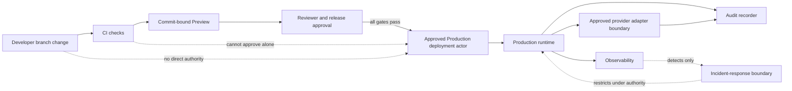
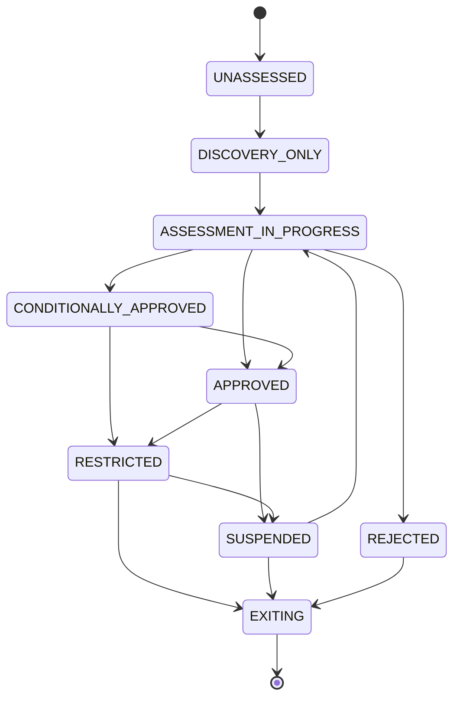

# Foundation V1 Environments and Provider Governance Architecture

## 1. Document status

| Field | Status |
|---|---|
| Title | Foundation V1 Environments and Provider Governance Architecture |
| Analysis date | 24 July 2026 |
| Repository baseline | Branch `rebuild/foundation-v1`; HEAD `ef68b790c371548ef7f23ea4aa54928b1ca8514e` |
| Document type | Technical discovery and architecture |
| Provider posture | Provider-neutral |
| Implementation | **NOT AUTHORIZED** |
| Assurance | No legal, privacy, security, provider, residency, operational, Production, disaster-recovery, or contractual certification is claimed |
| Authority | Approved Product Owner Decisions 1–10 are authoritative; repository facts and approved Foundation V1 documents are required inputs |

No provider is approved, no real data or real document is authorized, and no Production release is authorized by this document.

## 2. Scope

This document defines conceptual boundaries for Local, CI, Preview, and Production; isolation; synthetic and real data; secrets and configuration; release, rollback, teardown, provider governance, location, retention, deletion, access, subprocessors, outage, backup, external processing, and Production real-data gates. Foundation V1 remains foundations and non-interpretive document lifecycle only.

## 3. Non-goals

This document does not choose technology, providers, regions, contracts, retention durations, recovery objectives, implementation identifiers, or operational procedures. It does not implement or authorize OCR, AI, extraction, simulation, comparison, reporting, real-data tests, provider accounts, infrastructure, deployment, or Production.

## 4. Verified current repository state

| Subject | Classification | Repository evidence | Architectural significance | Unresolved question |
|---|---|---|---|---|
| Application | VERIFIED FACT | Next.js 16.2.4, React 19.2.4, TypeScript, App Router; `app/page.tsx` is a client prototype | Current application is a legacy prototype, not the target architecture | Replacement sequencing |
| Browser FileReader | VERIFIED FACT | `app/page.tsx:85-103`, specifically `new FileReader()` at line 87, reads an uploaded file inside the client component | File reading currently occurs inside the browser/client boundary rather than through an approved server-side ingestion boundary | Future controlled upload, validation, private storage, and server-side processing architecture remains PENDING and NOT AUTHORIZED |
| React-only in-memory state | VERIFIED FACT | `app/page.tsx:60-67` declares operational values with React `useState`; `app/page.tsx:196` and `203-207` update that component state | Current operational state exists only in browser memory and has no durable persistence, tenant-safe persistence, server authority, transactional guarantee, or cross-session continuity | Future server-authoritative persistence, tenancy, authorization, retention, audit, and recovery remain PENDING and NOT AUTHORIZED |
| Hardcoded or simulated operational/customer-like data | VERIFIED FACT | `app/page.tsx:205-240` locally constructs fixed bill-like values after a timer and `app/page.tsx:284-290` defines a fixed PUN history; corroborated by `PROJECT_AUDIT.md:12-14`, `134-164`, and `280-285` | Displayed or processed values must not be interpreted as authoritative customer, billing, contractual, OCR, provider, or business data | Future real-data sourcing, validation, provenance, provider assessment, tenant authority, and Production activation remain PENDING and NOT AUTHORIZED |
| Client-side deletion by array filtering | VERIFIED FACT | `app/page.tsx:77-80` removes an item by applying `filter` to the React `archivioCTE` array and clearing selected component state | This is a UI-memory mutation only and does not prove durable deletion, storage deletion, lifecycle transition, purge, retention enforcement, audit evidence, backup deletion, or provider deletion | Future server-authoritative document lifecycle, deletion orchestration, confirmation, reconciliation, retention, audit, backup treatment, and provider evidence remain PENDING and NOT AUTHORIZED |
| Scripts | VERIFIED FACT | `dev`, `build`, `start`, `lint`; no test or deploy script | No repository-defined release pipeline | Required checks |
| Dependencies | VERIFIED FACT | Framework and styling/tooling dependencies only | No target provider SDK is selected | Future dependencies |
| Source control | VERIFIED FACT | `origin` is a GitHub HTTPS repository | GitHub is observed repository tooling only | Organization and protection settings |
| Vercel references | VERIFIED FACT | README/template asset and `.vercel` ignore entry; no `vercel.json` or tracked `.vercel` | References do not prove deployment or approval | Hidden linkage and settings are UNKNOWN |
| External browser script | VERIFIED FACT | `app/page.tsx` loads PDF.js 3.11.174 from cdnjs | Legacy browser processing is not an approved Foundation V1 provider boundary | Removal/replacement |
| Environment variables | VERIFIED FACT | No application environment-variable reference found | No typed configuration boundary exists | Variables and ownership |
| CI/build/deploy files | VERIFIED FACT | No `.github` workflow or provider deployment configuration found | CI and deployments are not repository-defined | Platform configuration is UNKNOWN |
| Database and tenant persistence | VERIFIED FACT | No database, schema, migration, repository, or tenant persistence | Durable isolation is absent | Provider and implementation pending |
| Authentication and authorization | VERIFIED FACT | No server authentication, session, or authorization implementation | Real-data access is not safe | Provider and implementation pending |
| Private document storage | VERIFIED FACT | Browser file handling only; no persistent private storage | Real documents are prohibited | Provider and implementation pending |
| Audit persistence | VERIFIED FACT | No durable AuditEvent or SecurityEvent store | Required accountability is absent | Store and mechanism pending |
| Jobs, queues, schedulers | VERIFIED FACT | No worker, queue, scheduler, or job runner | No background operations exist | Mechanisms pending |
| Backup and restoration | VERIFIED FACT | No repository-visible configuration | No recovery claim is possible | All settings UNKNOWN |
| Monitoring and alerting | VERIFIED FACT | No integration or configuration | No operational readiness claim | Provider and routes pending |
| OCR and AI | VERIFIED FACT | Named OCR behavior is simulated; PDF.js extracts browser text; no AI integration | No approved external processing | Future boundary pending |
| Real-data protections | VERIFIED FACT | No server controls proving real-data readiness | Real data remains prohibited | Gates must be approved and implemented |
| Hidden settings | UNKNOWN | Repository cannot prove account, billing, secrets, regions, logs, retention, support access, protection, or deployments | Existing linkage cannot imply approval | External verification requires separate authority |

Repository inspection establishes facts only. GitHub and Vercel references do not approve Foundation V1 real-data use.

## 5. Environment and provider-governance principles

Evidence and policy MUST be server-authoritative; environment, tenant, artifact, configuration, provider, and actor scope MUST be trusted. Least data, least privilege, deny by default, tenant isolation, purpose limitation, redaction, auditability, provenance, idempotency, safe retry, failure transparency, portability, and provider neutrality apply. Missing or ambiguous approval fails closed. No provider controls business, authorization, lifecycle, retention, deletion, purge, or release policy.

## 6. Runtime environment taxonomy

Exactly four runtime environments are recognized.

| # | Environment | Purpose | Permitted data | Prohibited data | Expected users or actors | Authentication expectation | Tenant expectation | Secrets expectation | Network expectation | Provider-access expectation | Persistence expectation | Lifecycle | Destruction or teardown expectation | Audit expectation | Implementation status |
|---:|---|---|---|---|---|---|---|---|---|---|---|---|---|---|---|
| 1 | Local | Developer feedback | Synthetic data only | Real tenant, customer, document, credential, and Production data | Developer and synthetic test actors | Synthetic authentication fixtures only; no Production identity | Synthetic tenants only; tenant isolation fixtures required | Local non-real, environment-scoped references only | Restricted development egress; unknown destinations blocked | Provider-neutral substitutes preferred; no Production-provider access | Disposable local state only | Created and refreshed by the developer for bounded work | Deterministic teardown and synthetic-data destruction | Synthetic test and security evidence only | PROPOSAL; NOT AUTHORIZED |
| 2 | CI | Automated checks for an exact commit | Synthetic data only | Real tenant, customer, document, credential, and Production data | CI system actor and automated test actors | CI-scoped synthetic system identity only | Synthetic tenants only; isolation tests required | Short-lived CI-scoped references only | Restricted automated egress; unknown destinations blocked | Provider-neutral substitutes required unless a separately approved synthetic-only assessment permits access | Ephemeral check state and controlled artifacts only | Created for a check run and expires with its approved artifact policy | Teardown after the run; artifact and evidence destruction follow a PENDING policy | Commit-bound check, security, and release evidence | PROPOSAL; NOT AUTHORIZED |
| 3 | Preview | Review an exact commit and artifact | Ordinary Preview synthetic data only | Real tenant, customer, document, credential, and Production data | Authorized reviewers, approved stakeholders, and automated test actors | Preview-specific authentication; no Production-session reuse | Synthetic Preview tenants only; no Production tenant identity reuse | Preview-only references; no Production secrets | Restricted Preview egress to assessed synthetic-only destinations | Preview-approved substitutes or condition-bound providers only; no Production resources | Time-limited Preview state; no Production or permanent document persistence | Commit-bound creation, review, stale detection, and teardown | Teardown revokes access and secrets and accounts for artifacts | Deployment, access, teardown, and security evidence where required | PROPOSAL; NOT AUTHORIZED |
| 4 | Production | Future approved operational runtime | Real data only after all 26 gates pass; currently no real data permitted | Any data or operation outside approved purpose, class, tenant, provider, or gate scope | Approved end users, Tenant Admins, Platform Owners, system actors, and release operators within policy | Approved server-side authentication required | Trusted tenant or validated platform scope required | Production-only least-privilege references | Approved Production destinations only; unknown egress blocked | Only providers in an approved lifecycle state and documented scope | Durable state only under approved application and provider policies | Controlled release, operation, rollback, restriction, and retirement | Teardown or retirement requires approved evidence-preserving procedure; exact process PENDING | Durable minimized audit and security evidence under approved policy | PENDING; Production real data and deployment NOT AUTHORIZED |

No additional runtime environment is approved by this taxonomy.

## 7. Environment authority boundaries

| Boundary | Responsibility | Trusted inputs | Prohibited assumptions | Allowed influence | Prohibited influence | Safe failure / evidence |
|---|---|---|---|---|---|---|
| Developer | Propose code | Reviewed repository state | Production authority | Branch change | Direct Production/provider approval | Block; attributable change evidence |
| Reviewer | Review commit and Preview | Exact commit/artifact | Preview proves Production readiness | Review decision | Runtime policy override | Withhold approval; review evidence |
| Approved release operator | Execute approved release | Gate and artifact evidence | Operator may bypass policy | Deployment request | Change artifact or tenant data | Stop; deployment/security evidence |
| Platform Owner | Platform governance | Purpose, permission, scope | Status grants unrestricted access | Approved platform actions | Tenant/content bypass | Deny; audit access |
| Tenant Admin | Tenant administration | Trusted membership and tenant | May approve platform providers | Tenant-scoped policy use | Cross-tenant/provider approval | Deny; AuditEvent |
| End user | Authorized product use | Server session and policy | Client selects environment/provider | Request operation | Assert success or scope | Deny; minimized evidence |
| CI system actor | Run checks | Commit and CI configuration | Checks approve Production alone | Produce check evidence | Release approval | Fail closed; CI evidence |
| Preview deployment actor | Create/teardown Preview | Approved trigger and commit | Preview allows real data | Preview operations | Production credentials/data | Block; deployment evidence |
| Production deployment actor | Deploy exact approved artifact | Complete release authorization | Deployment proves application success | Production deployment | Alter approval | Fail/rollback; deployment evidence |
| Application runtime | Enforce server policy | Trusted environment/configuration | Client claims are authoritative | Call approved adapters | Select providers dynamically | Fail closed; Audit/SecurityEvent |
| Provider adapter | Constrain external call | Approved provider record/purpose | Provider decides domain policy | Translate approved operation | Expand data/purpose | Reject; provider evidence |
| Secret-management boundary | Issue/revoke references | Environment, actor, purpose | Secret presence grants authority | Least-privilege credential control | Expose values | Deny/revoke; security evidence |
| Audit recorder | Record attributable evidence | Trusted server facts | Logs equal audit | Append evidence | Authorize operation | Fail transparently |
| Observability boundary | Detect health and drift | Redacted signals | Telemetry authorizes | Alert | Approve/rewrite | Alert without granting access |
| Incident-response boundary | Contain approved scope | Incident and authority | Incident grants unrestricted access | Restrict/suspend | Silent access or policy bypass | Contain; audit-of-audit |

## 8. Environment comparison matrix

| Dimension | Local | CI | Preview | Production |
|---|---|---|---|---|
| Purpose/data | Development; synthetic | Checks; synthetic | Review; synthetic | Operations; real data only after gates |
| Persistence/teardown | Disposable | Ephemeral | Time-limited and torn down | Policy-controlled |
| Authentication/authorization | Fixtures | System actor | Preview-specific | Server-side required |
| Tenant isolation | Adversarial fixtures | Tested | Isolated synthetic tenants | Mandatory durable isolation |
| Secrets | Local non-real | CI-scoped | Preview-scoped | Production-scoped |
| Network/providers | Restricted/substitutes | Restricted/substitutes | Approved Preview destinations only | Approved Production destinations only |
| Logging/audit | Redacted synthetic | Check evidence | Redacted deployment/access evidence | Durable approved evidence |
| Monitoring/backups/retention | No readiness claim | No backup | No Production backup | Decisions and readiness gates required |
| Release gate | None | Input only | Review input only | All approvals and gates |
| Real documents/status | Prohibited; NOT AUTHORIZED | Prohibited; NOT AUTHORIZED | Prohibited; NOT AUTHORIZED | Currently NOT AUTHORIZED |

## 9. Local environment

Local MUST be disposable and synthetic-only, use non-real tenant identities and secrets, avoid Production connectivity, and fail when environment identity is absent. It MAY use deterministic substitutes. Local results do not certify Production security, privacy, correctness, or provider behavior.

## 10. CI environment

CI MUST bind checks to a commit, use synthetic fixtures and least-privilege short-lived credentials, restrict artifacts and logs, and never reach Production data or credentials. A CI result is evidence for review, not authority to release.

## 11. Preview environment

Ordinary Preview MUST be commit-bound, isolated, access-controlled, synthetic-only, separately configured, auditable where required, and safely torn down. It MUST NOT reuse Production sessions, credentials, persistence, document storage, or real data.

## 12. Production environment

Production is the future approved operational environment. It requires server authentication, authorization, tenant isolation, private storage, audit, retention, observability, incident, deletion, provider, release, and real-data gates. No Production release or real-data activation is authorized.

## 13. Environment data policy

Data admission is determined by trusted environment identity plus classification and purpose. Local, CI, and ordinary Preview reject real data. Production rejects real data until all gates pass. Copying data to a less controlled environment, log, screenshot, support system, fixture, or personal device is prohibited.

## 14. Data-classification inventory

| # | Data class | Examples | Sensitivity | Tenant scope | Allowed environments | Prohibited environments | Provider restrictions | Persistence restrictions | Logging restrictions | Export restrictions | Retention owner | Pending decisions |
|---:|---|---|---|---|---|---|---|---|---|---|---|---|
| 1 | public source and public documentation | Published source and approved public documentation | Public, subject to integrity and licence | Platform or explicitly public | Local, CI, Preview, Production when purpose permits | None by sensitivity; policy may still prohibit use | Source and licence provenance required; provider use grants no approval | Persist only with provenance and integrity controls | No secrets or non-public context may be added | Export only within licence and provenance constraints | Content owner | PENDING — provenance representation and retention policy |
| 2 | synthetic test data | Invented tenants, identities, metadata, and document-like fixtures | Controlled; may exercise sensitive shapes without real facts | Explicit synthetic tenant or platform scope | Local, CI, ordinary Preview; Production only by separate approval | Any environment where it could be mistaken for real customer data | Provider-neutral substitutes required; external provider use requires separate synthetic-only assessment | Marked, isolated, disposable, and never derived from real customer material | Log only minimized synthetic values | Export only as marked reviewed fixtures | Test owner | PENDING — fixture storage, refresh, and retention policy; no duration or origin approved |
| 3 | tenant configuration metadata | Tenant settings and feature configuration | Tenant-confidential | One trusted tenant | Production after all gates; synthetic equivalents elsewhere | Real values in Local, CI, and ordinary Preview | Approved purpose/provider and tenant isolation required | Only under an approved configuration policy | Redact personal or sensitive settings | Tenant-scoped and authorized export only | Product Owner with Privacy and Security governance | PENDING — origin, duration, provider behavior, and export policy |
| 4 | identity and membership data | User identifiers, membership status, and role context | Personal and security-sensitive | Tenant or validated platform scope | Production after all gates; synthetic equivalents elsewhere | Real values in Local, CI, and ordinary Preview | Approved identity boundary; least data; no credential material | Durable only under approved identity and audit policies | No credentials, tokens, verifiers, or excessive personal data | Purpose-, tenant-, and permission-bound export only | Privacy and Security policy owners | PENDING — origin, duration, provider behavior, and export policy |
| 5 | commercial, licence, and entitlement data | Contract state, licence state, entitlements, and quantitative limits | Commercial-confidential | One trusted tenant or validated platform scope | Production after all gates; synthetic equivalents elsewhere | Real values in Local, CI, and ordinary Preview | Approved purpose/provider; no payment credential or unnecessary monetary detail | Durable only under approved commercial and audit policies | Minimized state and reason classifications only | Authorized commercial/legal export only | Product Owner, Commercial, and Legal policy owners | PENDING — origin, duration, provider behavior, and monetary-data treatment |
| 6 | document metadata | Document identifier, type, lifecycle state, and ownership | Tenant-confidential | One trusted tenant | Production after all gates; synthetic equivalents elsewhere | Real metadata in Local, CI, and ordinary Preview | Approved storage boundary; provider cannot decide lifecycle | Persist only under approved storage and lifecycle policies | Minimized identifiers and classifications; no content | Tenant-, purpose-, and lifecycle-authorized export only | Document lifecycle policy owner | PENDING — origin, duration, provider behavior, and export policy |
| 7 | document binary and document content | Real files, pages, text, and extracted content | Highest sensitivity | One trusted tenant | Production only after every real-data gate | Local, CI, ordinary Preview, source control, logs, and audit evidence | Approved private provider and purpose only; no permanent public URL; OCR/AI prohibited | Private persistence only under approved storage/lifecycle policy | Prohibited in ordinary logs, telemetry, and audit evidence | No export until separately authorized; never by permanent public URL | Product Owner, Legal, Privacy, and Security | PENDING — provider, location, origin, duration, deletion, backup, and export policy |
| 8 | audit and security evidence | Attributable AuditEvent and SecurityEvent facts | Sensitive accountability evidence | Trusted tenant or validated platform scope | Production after readiness gates; synthetic evidence elsewhere | Real evidence in Local, CI, and ordinary Preview | Approved evidence boundary; provider has no retention or purge authority | Append-only ordinary flow under approved versioned retention policy | Evidence is not duplicated into uncontrolled logs | Purpose-, permission-, scope-, tenant-, redaction-, and audit-bound | Audit-retention governance owners | PENDING — origin, duration, provider behavior, access, and export policy |
| 9 | secrets, credentials, tokens, and verifier material | Passwords, session tokens, provider credentials, signing material, and verifiers | Critical secret | Environment-, actor-, tenant-, or platform-scoped as applicable | Only the authorized secret boundary for the applicable environment; references elsewhere | Source control, client bundles, logs, audit evidence, screenshots, fixtures, and support exports | No provider until assessed; least privilege and environment separation required | Values never stored as ordinary application data; opaque references only | Values never logged | Values never exported through ordinary product/support paths | Security owner | PENDING — provider, expiry, rotation, revocation, emergency access, and retention behavior |
| 10 | operational telemetry | Redacted health, latency, failure, and drift signals | Sensitivity varies; minimized | Tenant where determinable or validated platform scope | All environments when redaction and policy permit | Any environment if content, secrets, or unapproved real data would be exposed | Assessed observability boundary only; no authorization authority | Persist only under a future approved telemetry policy | Redacted signals only; not automatically AuditEvent | Export only under approved operational purpose and redaction | Operations and Security policy owners | PENDING — sampling, access, origin, duration, provider behavior, and export policy |

## 15. Synthetic-data policy

Local, CI, and ordinary Preview are synthetic-only. Fixtures MUST NOT be copied, transformed, pseudonymized, or sampled from customer documents; contain real tokens, credentials, or customer addresses; or be mistaken for real data. Controlled email use remains separately pending. Synthetic data SHOULD be visibly marked, generated from reviewed specifications, deterministic where useful, refreshed under ownership, and destroyed with its environment. It MUST cover tenant isolation, adversarial inputs, retention, deletion, failure, and race cases. Synthetic success does not prove Production security.

## 16. Real-data policy

Real data is prohibited in Local, CI, ordinary Preview, source control, fixtures, screenshots, logs, errors, test artifacts, personal systems, and unapproved debugging/support systems. Real documents cannot enter any provider before Production gates are approved and implemented. Ordinary audit evidence excludes content. A controlled exception process is **PENDING PRODUCT OWNER, LEGAL, PRIVACY, AND SECURITY DECISION** and is not authorized.

## 17. Environment isolation

Environment identity, credentials, configuration, network access, providers, persistence, domains, sessions, logs, audit, and teardown MUST be separated. Missing identity or cross-environment reference fails closed and produces minimized security evidence.

## 18. Tenant isolation across environments

Tenant attribution is server-derived and independently validated from actor and resource scope. Synthetic tenants remain isolated in non-Production; Production requires durable enforcement. No mixed-tenant destructive operation, cross-environment tenant copy, or silent reassignment is permitted.

## 19. Identity and authentication by environment

Local and CI use synthetic actors; Preview uses non-Production identities under pending access policy; Production requires approved server-side authentication. Sessions, invitations, credentials, and verifiers are environment-specific and cannot be replayed across environments. No identity provider is selected.

## 20. Authorization and feature activation by environment

Authorization is server-side, deny-by-default, tenant- and scope-bound, and distinct from entitlement. Environment or feature activation cannot bypass permission, lifecycle, commercial, provider, or real-data gates. Platform Owner status alone grants no unrestricted access.

## 21. Secrets and credential boundary

Secrets MUST NOT be committed, embedded in source/client bundles, logged, audited, screenshotted, or placed in support exports. Environment-specific references require least privilege, ownership, expiry, rotation, revocation, versioning, scanning, and auditable issuance. Developer, CI, Preview, Production, emergency, and break-glass access are separately governed; break-glass remains pending. Provider, signing, storage, identity, payment, OCR, and AI credentials remain prohibited until their purposes and providers are approved. No secrets provider is selected.

## 22. Configuration boundary

Configuration MUST be environment-scoped, validated, versioned, attributable, fail-fast, and bound to the artifact and release. Defaults cannot silently enable providers, real data, external processing, public access, or Production. Values, ownership, representation, and delivery mechanisms remain pending.

## 23. Branch, build, and deployment mapping

The approved conceptual sequence is **branch → push → Pull Request → Preview → checks → approval → merge → Production → verification**. Evidence binds branch source, commit, immutable artifact identity, target environment, approval, deployment, rollback reference, configuration version, and provider version where applicable. Direct Production changes and force-based bypass are prohibited. Repository-visible branch/deployment protections are absent; hidden GitHub and Vercel settings are UNKNOWN and pending.

## 24. Preview creation and lifecycle

Preview creation requires an approved trigger and commit binding, synthetic-only data, Preview configuration, restricted access, time limit, teardown, stale detection, secret revocation, controlled artifact/log retention, and audit evidence. Fork/untrusted-contributor secrets fail closed. Preview cannot use Production credentials, database, storage, permanent document persistence, or confer Production approval.

## 25. Preview access control

| Class | Conceptual boundary |
|---|---|
| Repository contributor | Access only if approved for the Preview; no real data or Production session |
| Reviewer | Commit-scoped review; no provider or release authority |
| Approved stakeholder | Purpose- and time-bound access |
| Platform Owner | No automatic or unrestricted access |
| Tenant Admin | No Production tenant/session reuse and no real document |
| Unauthenticated public user | Denied unless a separately approved public policy exists |
| Automated test actor | Synthetic, least privilege, commit-bound |

Ordinary Preview is not assumed public. Access policy, audit depth, lifetime, and exposure controls remain pending.

## 26. Production release boundary

A future release requires an approved commit, successful required checks, approved Preview, exact artifact, approved configuration/providers, secrets readiness, database/private-storage/migration readiness where selected, rollback, audit, observability, incident and backup decisions, real-data gates, release approver, deployment evidence, and post-release verification. Missing evidence blocks release. **No Production release is authorized.**

## 27. Rollback boundary

Application, configuration, and provider rollback require authority, artifact/configuration identity, compatibility analysis, tenant-impact control, and audit/incident evidence. Database rollback versus forward-fix remains pending. Revoked secrets cannot be restored. Rollback MUST NOT restore deleted documents or purged evidence, cross tenants, or be treated as data restoration.

## 28. Disaster-recovery boundary

Disaster-recovery architecture, objectives, topology, provider, authorization, and testing remain pending. Any future restore must preserve tenant isolation, audit and lifecycle continuity, rotate compromised secrets, address provider/region outage, and prevent resurrection of deleted data or purged evidence. No readiness claim is made.

## 29. Provider-governance principles

Provider neutrality, least data/privilege, explicit purpose, tenant isolation, location and subprocessor awareness, retention transparency, deletion capability, no unapproved training, controlled support access, auditability, portability, exit capability, failure transparency, and contractual/legal/privacy/security/technical assessment are mandatory. Convenience is not approval; real data precedes no approval; permanent public document URLs are prohibited; providers receive no domain-policy authority.

## 30. Provider capability categories

| # | Category | Purpose | Data classes | Tenant impact | Authority limitations | Required assessment | Environment applicability | Real-data eligibility | Support-access risk | Retention risk | Deletion risk | Portability risk | Pending decisions | Implementation status |
|---:|---|---|---|---|---|---|---|---|---|---|---|---|---|---|
| 1 | source-control and repository hosting | Host source and review metadata | Public source, configuration metadata, synthetic artifacts; secrets prohibited | Platform-wide; tenant/customer data prohibited | Cannot approve releases, providers, or real data | Governance, access, security, retention, export, and legal assessment as applicable | Repository and CI support only; not an approved runtime environment | Not eligible for real documents or customer data | Contributor, maintainer, and provider-support access | Commit, artifact, and log retention may exceed project intent | Forks, caches, and provider copies may persist | Repository/history export and exit must be assessed | PENDING — organization, permissions, protection, retention, support, and exit | NOT AUTHORIZED |
| 2 | CI and build automation | Execute automated checks and produce artifacts | Public source, synthetic test data, configuration references, redacted telemetry | Platform-wide synthetic tenant tests | Cannot approve Production or access real tenants | Secret, fork, artifact, log, egress, isolation, retention, and deletion assessment | CI only | Not eligible for real documents or customer data | Runner and provider operator access | Logs and artifacts may persist | Caches, artifacts, and logs may remain | Check and artifact portability must be assessed | PENDING — provider, runner, checks, retention, deletion, and access | NOT AUTHORIZED |
| 3 | application hosting and runtime | Execute the approved server application | Approved tenant, identity, commercial, document metadata/content, audit, and telemetry classes | Direct tenant isolation and availability impact | Cannot define authorization, lifecycle, retention, provider approval, or real-data policy | Full 24-dimension provider assessment plus release and incident readiness | Preview only under synthetic conditions; Production only after approval | Eligible only after provider approval and all 26 gates | Runtime operator and support access to metadata/content | Runtime, log, cache, and temporary-copy retention | Ephemeral copies and caches may resist deletion | Application, configuration, and data exit risk | PENDING — provider, location, support, retention, deletion, portability, and approval | NOT AUTHORIZED |
| 4 | network edge, CDN, and DNS | Route approved traffic and protect endpoints | Request metadata, public assets, and potentially tenant-confidential metadata | Routing or cache failure may cross tenant/environment boundaries | Cannot authenticate, authorize, select tenant, or approve provider use | Location, cache, log, support, security, egress, retention, and deletion assessment | Separately assessed per environment | Real metadata only after approval; document content only if explicitly approved | Edge and network operators may access traffic metadata | Edge logs and caches may outlive requests | Distributed caches and logs complicate deletion | DNS, certificate, and routing migration risk | PENDING — provider, cache policy, locations, logs, support, and exit | NOT AUTHORIZED |
| 5 | identity and authentication | Establish server-trusted identity and sessions | Identity and membership data; secret material within approved boundary | Authentication affects every tenant but grants no membership automatically | Cannot grant tenant permission, entitlement, or Platform Owner authority | Identity, session, support, location, subprocessor, retention, deletion, and security assessment | Synthetic substitutes outside Production; approved service only in authorized environments | Eligible only after identity/provider and Production gates | Provider support could expose identity/session metadata | Identity and session logs may persist | Account/session/provider copies require evidence | Identity and session export/transition risk | PENDING — provider, session model, location, retention, support, and exit | NOT AUTHORIZED |
| 6 | primary data persistence | Persist authoritative application records | Tenant configuration, identity, commercial, document metadata, and evidence classes | Highest durable tenant-isolation impact | Cannot decide business, authorization, lifecycle, retention, or purge policy | Isolation, location, backup, encryption, access, retention, deletion, migration, and exit assessment | Provider-neutral substitutes outside Production; approved persistence only where authorized | Eligible only after approval and applicable gates | Administrative and support access to durable tenant data | Provider/backup/log retention may conflict with policy | Replicas, backups, indexes, and caches require separate evidence | Schema/data export and migration risk | PENDING — provider, region, model, backup, retention, deletion, and exit | NOT AUTHORIZED |
| 7 | object and document storage | Store and deliver private document objects | Document binary/content and document metadata | Direct confidentiality and tenant-isolation impact | Cannot authorize access or determine lifecycle, retention, or deletion eligibility | Private access, location, encryption, support, retention, deletion, backup, migration, and exit assessment | Synthetic substitutes outside Production; approved private storage only in Production | Eligible only after all document and real-data gates | Operators could access objects or metadata | Object versions, logs, replicas, and backups may persist | Deletion must account for all copies and ambiguous results | Object/metadata portability and source deletion risk | PENDING — provider, location, access, retention, deletion, backup, and migration | NOT AUTHORIZED |
| 8 | email and notification delivery | Deliver approved transactional messages | Identity/membership contact data and minimized notification metadata | Misdelivery may expose tenant or identity context | Cannot activate accounts, accept invitations, or determine authorization | Delivery, location, subprocessor, support, log, retention, deletion, and security assessment | Synthetic/local substitute outside approved delivery boundary | Eligible for approved real addresses only after separate approval | Support may inspect recipient or message metadata | Delivery logs and message copies may persist | Provider and subprocessor copies require evidence | Template, suppression, and delivery-history portability risk | PENDING — provider, address testing, content, retention, deletion, and support | NOT AUTHORIZED |
| 9 | payment and commercial processing | Future approved payment or commercial evidence processing | Commercial, licence, entitlement, and potentially payment-sensitive data | Tenant commercial state may be affected | Cannot grant permission or entitlement and cannot replace manual-payment policy | Legal, privacy, security, financial-data, support, retention, deletion, and exit assessment | Not operational in Foundation V1 unless separately approved | Not eligible under the current manual-payment baseline | Provider staff may access payment/commercial metadata | Financial and transaction retention may differ from application policy | Statutory/provider copies may not delete on request | Transaction and account portability risk | PENDING — provider, scope, monetary data, retention, support, and approval | NOT AUTHORIZED |
| 10 | queue, scheduler, and background execution | Coordinate future asynchronous or timed operations | Minimized operation metadata and approved references | Incorrect scoping may affect multiple tenants | Cannot authorize business operations or infer tenant/provider policy | Isolation, retry, idempotency, support, retention, deletion, outage, and portability assessment | No implementation selected in any environment | Not eligible for real data until mechanism/provider and relevant gates pass | Operators may inspect payload metadata | Messages, retries, dead letters, and logs may persist | Duplicates and failed-operation artifacts require deletion evidence | Pending-work and schedule export/migration risk | PENDING — mechanism, provider, payload, retention, deletion, and operations | NOT AUTHORIZED |
| 11 | audit, security logging, and SIEM | Preserve/query approved evidence and detect security conditions | Audit and security evidence; redacted operational telemetry | Evidence remains tenant- or platform-scoped | Cannot authorize operations, rewrite evidence, or decide retention/purge | Access, integrity, location, support, retention, deletion, export, and incident assessment | Synthetic substitutes outside Production; approved boundary only where authorized | Eligible only after evidence and real-data gates | Investigators/provider operators may access sensitive evidence | Evidence and indexes may have divergent retention | Copies, indexes, exports, and backups require confirmation | Evidence export and provider-exit risk | PENDING — provider, SIEM use, access, origin, duration, deletion, and export | NOT AUTHORIZED |
| 12 | observability and incident tooling | Detect health, drift, failure, and incident signals | Redacted operational telemetry and minimized identifiers | Signals may be tenant-scoped but cannot expose cross-tenant context | Cannot authorize, create success, or replace AuditEvent | Redaction, location, access, support, retention, deletion, alerting, and exit assessment | Potentially all environments after separate approval | Real telemetry only after approval and minimization gates | Provider/support staff may access diagnostic metadata | Logs, traces, and samples may persist | Distributed telemetry copies may be difficult to delete | Dashboard, rule, and telemetry export risk | PENDING — provider, signals, sampling, access, retention, deletion, and routes | NOT AUTHORIZED |
| 13 | backup and disaster recovery | Preserve approved recoverable copies and support authorized restoration | Approved persistent data classes and evidence | Restore can affect entire tenants and resurrect deleted data | Cannot grant restoration authority or override deletion/purge policy | Scope, location, encryption, isolation, support, retention, deletion, restore, and exit assessment | Production only after an approved decision; no assumption for other environments | Eligible only after backup/restoration gate | Provider operators may access backup metadata or content | Backup cycles may outlive primary retention | Primary deletion does not prove backup deletion | Backup format and restoration portability risk | PENDING — provider, scope, location, retention, deletion, authority, and tests | NOT AUTHORIZED |
| 14 | OCR, AI, and external content processing | Future external content processing only if separately approved | Document content, metadata, prompts, outputs, and extracted data | Direct high-sensitivity tenant impact | Cannot determine product truth, lifecycle, authorization, or approved use | Full provider, training, human-review, retention, deletion, accuracy, security, legal, and privacy assessment | Not operational in Foundation V1 | Not eligible for real data in Foundation V1 | Provider personnel may review content | Inputs, outputs, prompts, and evaluation copies may persist | Training/evaluation copies may resist deletion | Models, prompts, output formats, and corpus exit risk | PENDING — future scope, provider, no-training evidence, retention, review, and exit | NOT AUTHORIZED |
| 15 | secrets and key management | Protect environment credentials and future key material | Secrets, credentials, tokens, verifiers, and key references | Compromise may cross tenants or environments | Possession grants no business, tenant, provider, or release authority | Access, ownership, separation, rotation, revocation, backup, support, location, and exit assessment | Separately isolated per environment after approval | Eligible for Production secrets only after security and provider approval | Administrators/support may access metadata or material | Versions, audit records, and backups may persist | Revoked material and backups require controlled accounting | Secret/key export and provider-exit risk | PENDING — provider, ownership, key model, access, rotation, backup, and exit | NOT AUTHORIZED |

Every category requires purpose, data-class, tenant, authority, environment, support, retention, deletion, portability, and approval assessment; none selects a provider.

## 31. Provider lifecycle states

| # | State | Meaning | Allowed data | Allowed environments | Allowed operations | Prohibited operations | Required approver | Evidence | Transition prerequisites | Safe failure | Implementation status |
|---:|---|---|---|---|---|---|---|---|---|---|---|
| 1 | UNASSESSED | Provider has not been assessed | Public provider-identification and discovery metadata only | Discovery documentation only; no runtime environment | Register identity and collect public discovery references | Accounts, integration, provider calls, secrets, real data, and real documents | Governance owner may register; no operational approver exists | Attributable inventory entry and source references | Provider identity recorded before transition to DISCOVERY_ONLY | Block all provider use and record attempted bypass | NOT AUTHORIZED |
| 2 | DISCOVERY_ONLY | Candidate is being researched without operational use | Public documentation and non-sensitive assessment notes only | Discovery documentation only; no Local, CI, Preview, or Production provider access | Compare capabilities and collect public evidence | Accounts, integration, secrets, operational data, real data, and real documents | Technical Architecture may propose assessment; cannot approve use | Sourced discovery record and proposed purpose | Defined purpose and assigned assessment owners before ASSESSMENT_IN_PROGRESS | Remain discovery-only and block calls/data | NOT AUTHORIZED |
| 3 | ASSESSMENT_IN_PROGRESS | Required evidence and reviews are incomplete | Assessment metadata and separately approved synthetic evidence only | Controlled assessment boundary; no approved application runtime use | Collect evidence and perform authorized non-real-data assessment | Operational service use, real data, real documents, and self-approval | Assigned Legal, Privacy, Security, Product, Technical, and Operations participants as applicable | Versioned assessment with gaps and owners | All 24 dimensions completed and required decisions recorded | Block operational use until an authorized transition | NOT AUTHORIZED |
| 4 | CONDITIONALLY_APPROVED | Provider is approved only within recorded conditions | Only data classes explicitly listed in the conditions | Only environments explicitly listed in the conditions | Only documented purpose, operations, tenant scope, and limits | Any unlisted data, environment, purpose, tenant, operation, support access, or subprocessor | Product Owner plus every required Legal, Privacy, Security, and governance approver | Versioned conditional approval, assessment, restrictions, and audit reference | Complete assessment and explicit conditions; reassessment for expansion | Deny outside conditions; restrict or suspend on drift | Conceptual future state; no current provider assigned |
| 5 | APPROVED | Future state for a fully assessed provider within a recorded scope | Only approved data classes | Only approved environments | Only recorded purposes and operations | Any unapproved scope, data, environment, support access, training, or downstream use | Product Owner plus all required Legal, Privacy, Security, Technical, and Operations authorities | Versioned approval linked to assessment, conditions, locations, subprocessors, and audit evidence | All required assessments, approvals, and implementation gates completed | Fail closed on missing, stale, or conflicting evidence | Conceptual future state; no current provider assigned |
| 6 | RESTRICTED | Previously permitted scope has been narrowed | Only data necessary for explicitly permitted containment or continuing restricted service | Only environments explicitly retained by the restriction | Recorded restricted operations, containment, export, or deletion | Every operation, environment, purpose, or data class outside the restriction | Authorized governance and incident authorities according to pending policy | Restriction reason, scope, effective time, approvals, and access changes | Risk/change evidence and recorded restriction decision | Block disallowed activity; preserve evidence; do not silently delete | Conceptual future state; no automatic reapproval |
| 7 | SUSPENDED | Operational use is paused pending review, containment, or exit | No new operational data; existing data only for authorized containment, evidence, export, or deletion | No new runtime use; controlled incident/exit boundary only | Revoke access, contain, preserve evidence, and perform authorized exit actions | New processing, new real data, ordinary provider calls, or automatic restart | Authorized Security, Product, Operations, Legal, or Privacy authority as required by pending policy | Suspension cause, scope, time, credentials revoked, data state, and audit evidence | Incident/risk decision; reassessment required for any later transition | Deny use, revoke credentials, and preserve attributable evidence | Conceptual future state; no automatic return to APPROVED |
| 8 | REJECTED | Provider is unsuitable for the proposed use | Public decision metadata and minimum rejection evidence only | No application runtime environment | Preserve rejection evidence and, if necessary, authorized cleanup | Operational use, accounts for service use, secrets, real data, and real documents | Required assessment authorities record rejection; provider cannot self-change state | Versioned rejection reason, unresolved risks, and audit reference | Completed assessment or disqualifying evidence | Fail closed and prevent provider selection | Conceptual governance state; operational use prohibited |
| 9 | EXITING | Provider is undergoing controlled portability, migration, access revocation, and deletion accounting | Existing scoped data required for authorized exit only; no new ordinary data | Controlled exit/migration boundary only | Authorized export, migration, verification, revocation, deletion request, and reconciliation | New ordinary processing, expanded scope, false completion, or automatic reapproval | Exit authority plus all required source/target, Legal, Privacy, Security, Product, and Operations approvers | Exit plan, migration evidence, deletion requests/results, unresolved copies, and audit reference | Approved exit plan; target approval where applicable; source deletion only after accepted migration evidence | Keep exit unconfirmed while any migration or deletion evidence is incomplete | Conceptual future state; EXITING is not deletion confirmation |

Current use does not approve any provider for Foundation V1 real-document processing. `APPROVED` is conceptual; `CONDITIONALLY_APPROVED` never exceeds recorded conditions.

## 32. Provider inventory model

Conceptual `ProviderRecord` includes provider identifier, legal entity, service, capability category, lifecycle state, environments, approved/prohibited purposes, data classes, tenant scope, processing/storage/backup/support/subprocessor locations, subprocessors, retention, deletion, backup behavior, support access, training/model-improvement use, security controls, contractual references, assessment version, approval, restrictions, suspension reason, exit and migration status, and audit reference. It is not a schema or implementation identifier.

## 33. Provider assessment model

| # | Dimension | Evidence required | Acceptable / unacceptable | Decision owner | Gate |
|---:|---|---|---|---|---|
| 1 | provider identity and legal entity | Verified entity records | Identified / ambiguous | Legal | Blocks approval |
| 2 | service and capability | Service specification | Bounded / unclear scope | Architecture | Blocks integration |
| 3 | intended purpose | Purpose record | Necessary / unrelated use | Product Owner | Blocks use |
| 4 | data classes | Data-flow inventory | Minimized / undeclared | Privacy | Blocks data |
| 5 | tenant scope and isolation | Isolation evidence | Enforced / cross-tenant risk | Security | Blocks real data |
| 6 | environments | Environment matrix | Restricted / uncontrolled | Operations | Blocks activation |
| 7 | data-location and transfer model | Locations/transfers | Approved / unknown | Legal/Privacy | Blocks data |
| 8 | subprocessors | Complete chain | Assessed / undisclosed | Legal/Privacy/Security | Blocks approval |
| 9 | retention | Provider rules | Compatible/transparent / unknown | Legal/Privacy | Blocks data |
| 10 | deletion capability | Verified process/evidence | Confirmable / false or ambiguous | Privacy/Security | Blocks data |
| 11 | backup behavior | Scope/location/cycle | Accounted / unknown resurrection | Security/Operations | Blocks Production |
| 12 | training and model-improvement use | Binding settings/terms | Prohibited as required / used without approval | Product/Legal/Privacy | Blocks content |
| 13 | provider support access | Access controls/logs | Purpose-bound / unrestricted | Security/Privacy | Blocks data |
| 14 | authentication and administrative access | Admin-control evidence | Least privilege / shared or weak | Security | Blocks integration |
| 15 | encryption in transit | Technical evidence | Approved control / absent | Security | Blocks data |
| 16 | encryption at rest | Technical evidence | Approved control / absent | Security | Blocks persistence |
| 17 | key-management boundary | Ownership/access/rotation | Controlled / unclear | Security | Blocks Production |
| 18 | audit and security evidence | Event capabilities | Sufficient/minimized / opaque | Security/Governance | Blocks operation |
| 19 | incident notification | Terms/process | Timely/usable / absent | Legal/Security | Blocks Production |
| 20 | availability and failure behavior | Reliability/failure evidence | Safe/degraded / false success | Operations | Blocks release |
| 21 | portability and export | Tested formats/process | Usable / lock-in without exit | Architecture/Product | Blocks approval |
| 22 | migration and exit | Exit plan | Reconciled / destructive ambiguity | Governance | Blocks adoption |
| 23 | contractual, legal, privacy, and security review | Recorded reviews | Complete / missing authority | Respective authorities | Blocks approval |
| 24 | unresolved risks and approval conditions | Risk register | Explicit/accepted / hidden | All required approvers | Blocks outside conditions |

## 34. Provider approval authority

| # | Role | Propose | Assess | Approve | Condition | Restrict | Suspend | Reject | Not approve alone |
|---:|---|---|---|---|---|---|---|---|---|
| 1 | Product Owner | May propose purpose and candidate | Assesses product need and scope | May approve product purpose and participate in provider approval | May condition product scope | May require narrower product use | May request or authorize suspension within pending governance | May reject product fit | Cannot alone replace required Legal, Privacy, Security, Technical, or Operations approval |
| 2 | Legal | May propose contractual or transfer requirements | Assesses entity, contract, obligations, transfers, and legal risk | Participates in approval where legal review is required | May impose legal and contractual conditions | May require restriction for legal risk | May require suspension for unresolved legal risk under pending governance | May reject legal or contractual suitability | Cannot alone approve product purpose, privacy, security, or technical readiness |
| 3 | Privacy | May propose minimization, rights, location, retention, and deletion requirements | Assesses data flows, purposes, locations, subprocessors, retention, and rights | Participates in approval where personal-data review is required | May impose privacy conditions | May require restriction for privacy risk | May require suspension for unresolved privacy risk under pending governance | May reject privacy suitability | Cannot alone approve product purpose, legal, security, or technical readiness |
| 4 | Security | May propose control, access, evidence, and incident requirements | Assesses technical controls, administrative access, incidents, and failure behavior | Participates in approval where security review is required | May impose security conditions | May require or authorize security restriction under pending governance | May require or authorize suspension for security risk under pending governance | May reject security suitability | Cannot alone approve product purpose, legal, privacy, or contractual suitability |
| 5 | Platform Operations | May propose operability, support, outage, restriction, suspension, and exit requirements | Assesses availability, deployment, support, recovery, and operational burden | Participates in operational-readiness approval; cannot approve provider alone | May recommend operational conditions | May execute an authorized restriction within recorded scope | May execute an authorized suspension within recorded scope | May recommend operational rejection | Cannot alone approve provider, real data, legal, privacy, security, or product purpose |
| 6 | Technical Architecture | May propose provider-neutral capability and portability criteria | Assesses technical fit, interfaces, isolation, portability, migration, and exit | Participates in technical approval; compatibility is not provider approval | May recommend architectural conditions | May recommend restriction for architectural incompatibility | May recommend suspension; execution requires authorized governance | May recommend technical rejection | Cannot alone approve provider, real data, product purpose, Legal, Privacy, or Security sufficiency |
| 7 | Tenant Admin | May propose tenant needs or report provider impact | May provide tenant-scoped operational feedback only | Prohibited from approving platform providers | May not impose platform-provider conditions; may apply approved tenant settings only | May not restrict a platform provider; may stop tenant use where an approved product control permits | May not suspend a platform provider | May not reject a platform provider; may decline an optional tenant feature | Cannot approve providers, provider states, real data, Production, or cross-tenant scope |
| 8 | provider representative | May propose its service and supply evidence | May explain provider evidence; self-assessment is advisory only | Prohibited from approving itself or the platform decision | May offer contractual/service conditions; cannot impose platform approval conditions | May execute restrictions requested under contract; cannot authorize platform policy | May suspend its service operationally but cannot approve platform governance state | May decline service; cannot determine platform rejection authority | Cannot approve any Foundation V1 provider state, purpose, data, environment, or gate |

Technical compatibility or implementation never implies approval.

## 35. Data location and residency

Assessment covers processing, storage, backup, log, audit, support, subprocessor, transfer, failover, and migration locations; tenant commitments; region configuration; verification and drift. Unknown location fails closed for restricted data. No region, jurisdiction, transfer mechanism, or residency compliance is selected or claimed.

## 36. Subprocessors and downstream services

The provider chain records each subprocessor’s identity, purpose, data classes, location, retention, support/human access, training, deletion, and change notification. A new or undisclosed subprocessor triggers assessment and may restrict or suspend use. Primary-provider approval does not automatically approve downstream processors.

## 37. Provider retention and deletion

Provider, application, document-lifecycle, audit, legal-policy, backup, log, temporary-processing, cache, export, support-copy, and failed-operation-artifact retention remain distinct. Provider retention cannot override application, document-lifecycle, audit, or legal-policy authority. No zero-retention default is established, no indefinite-retention default is established, and no retention duration or origin is invented.

A provider deletion request is distinct from provider deletion confirmation. Primary-provider deletion confirmation does not prove subprocessor deletion, backup deletion, replica deletion, cache deletion, export-copy deletion, support-copy deletion, or failed-operation-artifact deletion. Every relevant downstream deletion result requires separate evidence or remains unconfirmed. Ambiguous, partial, missing, or inconsistent deletion evidence is not success and requires reconciliation. No immediate physical-erasure guarantee is claimed.

## 38. Provider training and model-improvement restrictions

OCR, AI, and external processors MUST NOT use content or metadata for training, model improvement, evaluation, human review, or unrelated purposes unless explicitly assessed and approved. No-retention/no-training claims require verifiable evidence; marketing language is insufficient, and zero-retention claims require assessment. Prompts, files, extracted content, metadata, and outputs remain protected. OCR and AI are NOT AUTHORIZED in Foundation V1.

## 39. Provider support and operator access

Support access requires recorded purpose, named/role actor, approval, tenant and resource scope, time limit, least privilege, metadata/content distinction, impersonation controls, notification where required, recording, audit-of-audit, and revocation. Break-glass, cross-border, and subcontractor access remain pending. No unrestricted provider support or automatic Platform Owner access is allowed.

## 40. Encryption and key-management boundaries

Future controls must address encryption in transit/at rest, ownership, access, separation by environment, rotation, revocation, compromise, backup keys, provider-managed/customer-managed/tenant-specific alternatives, application-level encryption, and signing material. No mechanism or key model is selected and no certification is claimed.

## 41. Network and outbound-egress boundary

Outbound destinations, allowlisting, DNS/endpoint integrity, environment restrictions, webhooks/callbacks, metadata-service exposure, SSRF, redirects, document/secret exfiltration, blocking unknown providers, and evidence require policy. Local/CI/Preview/Production have separate allowlists. Exact enforcement is pending.

## 42. Portability, export, and exit

Exit planning covers data, configuration, audit, document and metadata export; schema portability; provider identifiers; replacement; migration validation; source/subprocessor deletion; export retention/encryption; and tenant isolation. Permanent public URLs are prohibited. No export or exit implementation is authorized.

## 43. Provider failure and outage

Timeout, partial/ambiguous result, retry, idempotency, conceptual isolation/circuit behavior, fallback, degraded mode, fail-closed behavior, tenant/cross-tenant impact, evidence, monitoring, escalation, consistency, lifecycle, and recovery require definition. Fallback cannot silently change provider or purpose; no false success is permitted.

## 44. Provider restriction, suspension, rejection, and exit

Triggers and authorized actors determine allowed/blocked operations, real-data containment, access/credential revocation, retention, deletion, evidence, tenant impact, migration, and emergency action. State change is attributable and never silent; reapproval requires reassessment.

## 45. Provider migration

Migration remains pending and requires approved source/target, assessment, authority, tenant isolation, object/metadata integrity, lifecycle and retention preservation, audit continuity, source and backup accounting, rollback, idempotency, ambiguity handling, and reconciliation. No provider or migration is authorized.

## 46. Backup and restoration

Scope, environments, classes, encryption, location, retention, deletion/purge interaction, document/audit deletion, authorization, tests, integrity, provider/subprocessor access, incident evidence, and resurrection prevention remain pending. Backup presence grants no restoration authority; primary deletion does not prove backup deletion.

## 47. Environment and provider observability

Signals cover deployment; environment/configuration drift; secret/authentication failures; authorization denial; cross-tenant attempts; provider latency/failure/retention/deletion ambiguity; backup failure; restore attempts; Preview exposure; real-data violations; unexpected egress; provider-state drift; subprocessor change; and audit failure. Telemetry is redacted, contains no secrets/content, is not automatically AuditEvent, cannot authorize, and cannot create success by absence.

## 48. Provider and environment incident boundary

Future incident handling covers detection, classification, tenant/provider/data scope, containment, credential revocation, provider restriction/suspension, Preview shutdown, Production rollback, evidence preservation, investigation boundaries, Legal/Privacy escalation, provider/tenant notification, recovery, and review. No unrestricted responder access is granted; the exact process remains pending.

## 49. Production real-data activation gates

| # | Gate | Required evidence | Approver | Blocking condition / safe failure | Status |
|---:|---|---|---|---|---|
| 1 | Product Owner approval | Recorded scope decision | Product Owner | Missing/ambiguous: block | NOT AUTHORIZED |
| 2 | Legal assessment | Completed legal review | Legal | Missing issue resolution: block | Pending |
| 3 | Privacy assessment | Data-flow/privacy review | Privacy | Missing/ambiguous: block | Pending |
| 4 | Security assessment | Threat/control review | Security | Unresolved critical risk: block | Pending |
| 5 | approved purpose | Versioned purpose | Product Owner | Purpose mismatch: reject | Pending |
| 6 | approved data classes | Classification decision | Product/Privacy/Security | Unlisted class: reject | Pending |
| 7 | approved provider inventory | Complete records | Governance | Missing provider: block | Pending |
| 8 | approved provider lifecycle state | Versioned state/conditions | Required authorities | State/condition mismatch: block | Pending |
| 9 | approved data location | Verified location/transfer | Legal/Privacy | Unknown/drift: block | Pending |
| 10 | assessed subprocessors | Complete chain | Legal/Privacy/Security | Unknown processor: block | Pending |
| 11 | approved provider retention and deletion | Rules and verified evidence | Legal/Privacy/Security | Ambiguous deletion: block | Pending |
| 12 | verified no-training and no-unapproved-human-review conditions where applicable | Binding evidence | Product/Legal/Privacy/Security | Unverified use: block | Pending |
| 13 | server-side authentication readiness | Test/evidence | Security/Product | Client-only or incomplete: block | Pending |
| 14 | server-side authorization readiness | Negative tests/evidence | Security/Product | Bypass/ambiguity: block | Pending |
| 15 | tenant-isolation readiness | Isolation tests/evidence | Security | Cross-tenant risk: block | Pending |
| 16 | entitlement and feature-gate readiness | Policy tests | Product Owner | Gate bypass: block | Pending |
| 17 | secrets and credential readiness | Rotation/access evidence | Security/Operations | Exposure or missing controls: block | Pending |
| 18 | private document-storage readiness | Private access/deletion evidence | Security/Privacy/Product | Public/ambiguous: block | Pending |
| 19 | document-lifecycle readiness | Transition/retention tests | Product Owner | Invalid transition: block | Pending |
| 20 | audit and retention readiness | Durable minimized evidence | Governance/Security/Privacy | Missing/invented policy: block | Pending |
| 21 | observability and incident readiness | Signals/routes/exercises | Security/Operations | Blind or unowned failure: block | Pending |
| 22 | backup and restoration decision | Approved scope/authority | Product/Legal/Privacy/Security/Operations | Missing decision: block | Pending |
| 23 | deletion and purge verification readiness | Request/confirmation/reconciliation tests | Privacy/Security/Product | False success risk: block | Pending |
| 24 | controlled release and rollback readiness | Artifact/gate/rollback evidence | Release authority | Mismatch or no rollback: block | Pending |
| 25 | synthetic test and security-check completion | Required check results | Reviewer/Security | Failed/stale checks: block | Pending |
| 26 | explicit Production activation decision and recorded evidence | Final decision linked to all gates | Product Owner and all required authorities | Any missing evidence: block | NOT AUTHORIZED |

All 26 gates MUST pass. No client or tenant may self-activate real data; this document satisfies none by itself.

## 50. Environment invariants

1. Environment identity is trusted and immutable per operation.
2. Data policy is evaluated before admission or transfer.
3. Tenant isolation applies within and across environments.
4. Secrets are isolated by environment.
5. Provider access is isolated by approved environment and purpose.
6. Deployed artifact identity matches approved commit.
7. Configuration identity is versioned and attributable.
8. Local contains no real data.
9. CI contains no real data.
10. Ordinary Preview contains no real data.
11. Production accepts no real data before all gates pass.
12. Direct Production change is prohibited.
13. Preview never receives Production credentials.
14. Preview never uses Production persistence.
15. Sessions are not reused across environments.
16. Missing or ambiguous evidence cannot create success.
17. Release and rollback are auditable.
18. Teardown revokes access and safely accounts for retained artifacts.

## 51. Secrets and configuration invariants

1. No secret is committed.
2. No secret enters a client bundle.
3. No secret enters logs.
4. No secret enters audit evidence.
5. Secrets and configuration are environment-separated.
6. Access uses least privilege.
7. Credentials have an approved expiry policy.
8. Rotation is attributable and safe.
9. Revocation blocks future use.
10. Every secret/configuration has an owner.
11. Configuration and references are versioned.
12. Configuration provenance is preserved.
13. Configuration is validated before use.
14. Drift is detectable and evidenced.
15. No silent fallback weakens policy.
16. Production secrets are never reused outside Production.

## 52. Idempotent environment and provider operations

| # | Operation | Identity / scope | Duplicate and result reuse | Conflict behavior | Audit behavior | Gate |
|---:|---|---|---|---|---|---|
| 1 | environment registration | environment key/platform | Reuse same record | Reject mismatch | Append evidence | Mechanism pending |
| 2 | Preview creation | commit+Preview scope | Reuse deployment | Reject different artifact | Deployment evidence | Pending |
| 3 | Preview teardown | Preview identifier | Reuse confirmed result | Reconcile active review | Teardown evidence | Pending |
| 4 | deployment-record creation | deployment id/environment | Reuse exact record | Reject mutation | Append-only | Pending |
| 5 | release-evidence append | release id/version | Deduplicate event | Preserve conflict | AuditEvent | Pending |
| 6 | rollback request | target release/request id | Reuse decision | Reject target mismatch | Request/result distinct | Pending |
| 7 | secret rotation request | secret ref+rotation id | Reuse result | Reject version conflict | Security evidence | Pending |
| 8 | secret revocation request | secret ref+revocation id | Reuse confirmation | Revocation wins safely | Security evidence | Pending |
| 9 | provider registration | provider id/version | Reuse record | Reject identity conflict | Governance evidence | Pending |
| 10 | provider assessment submission | provider+assessment version | Reuse assessment | Preserve competing version | Attributable evidence | Pending |
| 11 | provider-state transition | provider+expected state+request | Reuse transition | Reject stale state | State evidence | Pending |
| 12 | real-data activation request | environment+decision version | Reuse denial/decision | Reject gate drift | Activation evidence | Pending |
| 13 | provider migration request | source+target+request | Reuse plan/result | Reject scope conflict | Migration evidence | Pending |
| 14 | backup-restore request | backup+target+request | Reuse decision/result | Reject tenant/version conflict | Restore evidence | Pending |

## 53. Concurrency and race conditions

| # | Race | Risk | Invariant | Safe failure | Evidence | Gate |
|---:|---|---|---|---|---|---|
| 1 | Two Preview creations for one commit | Duplicate resources | One logical Preview identity | Reuse/reconcile | Deployment evidence | Pending |
| 2 | Preview teardown during active review | Broken review | Review lease respected | Delay/deny teardown | Access/teardown evidence | Pending |
| 3 | Two Production releases | Artifact conflict | Serialized approved target | Stop one/both | Release evidence | Pending |
| 4 | Release during rollback | State divergence | One active transition | Block release | Incident/release evidence | Pending |
| 5 | Configuration update during deployment | Mixed version | Bound configuration version | Abort mismatch | Drift evidence | Pending |
| 6 | Secret rotation during deployment | Invalid credential | Version-aware handoff | Fail closed/retry safely | Security evidence | Pending |
| 7 | Secret revocation during active request | Continued access | Revocation dominates | Deny completion if unsafe | Security evidence | Pending |
| 8 | Provider approval during suspension | Unsafe reactivation | Suspension blocks approval use | Require reassessment | Governance evidence | Pending |
| 9 | Provider migration during deletion | Copy resurrection | Deletion state preserved | Pause/reconcile | Migration/deletion evidence | Pending |
| 10 | Provider exit during restore | Uncontrolled copy | Exit and restore authority align | Block restore | Restore/exit evidence | Pending |
| 11 | Real-data activation during failed gate | Unauthorized data | All current gates pass | Deny | Activation security evidence | Pending |
| 12 | Subprocessor change during assessment | Stale approval | Exact chain version | Restart assessment | Drift evidence | Pending |
| 13 | Retention change during provider deletion | Wrong deletion | Applied policy version preserved | Pause/re-evaluate | Policy evidence | Pending |
| 14 | Backup during purge | Resurrection | Backup accounting before confirmation | Withhold success | Purge/backup evidence | Pending |
| 15 | Restore during purge | Resurrection | Purge state blocks restore | Deny/reconcile | Restore/security evidence | Pending |
| 16 | Incident suspension during release | Risk continuation | Suspension wins | Halt/contain | Incident evidence | Pending |
| 17 | Environment teardown during log export | Partial disclosure | Export scope/version fixed | Abort/reconcile | Export evidence | Pending |
| 18 | Artifact mismatch | Unauthorized code | Digest equals approval | Reject deployment | Security/release evidence | Pending |
| 19 | Branch updated after approval | Stale approval | Approval binds commit | Require new review | Review evidence | Pending |
| 20 | Deployment confirmation delayed or duplicated | False status | Request distinct from confirmation | Pending/reconcile | Deployment evidence | Pending |

## 54. Coordinated operation boundaries

| # | Boundary | Authority | Trusted inputs | Preconditions | Operation | Result | Failure | Idempotency | Concurrency | Audit or security evidence | Unresolved implementation mechanism |
|---:|---|---|---|---|---|---|---|---|---|---|---|
| 1 | code change and CI execution | Developer proposes; CI actor executes | Branch, commit, and CI policy | Allowed branch and synthetic-only context | Execute checks | Commit-bound check result | Fail closed | Commit plus check-suite version | Concurrent runs remain distinct | Actor, commit, execution, result, and failure evidence | PENDING — CI provider, runner, and orchestration |
| 2 | branch commit and Preview creation | Authorized Preview deployment actor | Commit, check policy, Preview policy, and data classification | Authorized trigger; synthetic-only resources | Request and create Preview | Preview bound to commit, artifact, configuration, and expiry | Deny or leave pending; no false success | Commit, policy version, and request identity | Competing requests reuse or reconcile one logical Preview | Request, deployment, configuration, and failure evidence | PENDING — deployment, trigger, transaction, and locking |
| 3 | Preview access and audit evidence | Authorized reviewer, stakeholder, or automated actor | Preview identity, actor/session, purpose, and policy | Preview active; actor permitted; synthetic-only boundary intact | Evaluate access | Scoped grant or denial | Deny ambiguity | Request identity reuses unchanged decision | Concurrent decisions cannot expand scope or bypass revocation | Actor, Preview, purpose, decision, and security evidence | PENDING — authentication, access-control, and evidence mechanisms |
| 4 | Preview teardown and secret revocation | Authorized teardown system actor | Preview state, expiry/review status, secret references, and artifact inventory | Teardown authorized; active review handled | Request teardown, revoke secrets, account for artifacts | Confirmation only after accepted component evidence | Partial result remains unconfirmed and reconciled | Preview plus teardown-request identity | Teardown racing access/review/revocation fails safely | Request/results, revocations, artifacts, and anomalies | PENDING — teardown, revocation, compensation, and reconciliation |
| 5 | release approval and immutable artifact selection | Required reviewers and release authority | Commit, checks, Preview evidence, artifact, configuration, and approvals | Checks/reviews current; no drift | Record approval and select artifact | Approval bound to exact artifact/configuration | Reject stale, missing, or conflicting approval | Candidate plus approval version | Concurrent approvals cannot select different artifacts | Reviewer, decision, checks, artifact, configuration, and conflict evidence | PENDING — protection, approval, artifact, and locking |
| 6 | Production deployment and deployment evidence | Approved Production deployment actor | Release, artifact, configuration, providers, gates, and environment | Deployment separately authorized; applicable gates pass | Request deployment and verify runtime | Confirmation bound to exact artifact/configuration; no real-data authority implied | Halt, fail closed, or separately authorize rollback | Deployment request identity | Competing releases conflict and block | Request, provider/environment results, verification, and AuditEvent | PENDING — deployment, transaction, locking, rollback, and compensation |
| 7 | rollback request and rollback confirmation | Approved release or incident authority | Current deployment, target, compatibility, tenant impact, and request | Rollback authorized; target exact; no deleted/purged-data restoration | Request, execute, and verify rollback | Confirmation distinct from request | Ambiguous/incompatible rollback remains unconfirmed | Request plus target identity | Rollback racing release/configuration blocks conflict | Request, target, result, verification, incident, and audit evidence | PENDING — rollback, forward-fix, transaction, and locking |
| 8 | secret issuance, rotation, and revocation | Authorized secret-management and Security authority | Reference, environment, owner, purpose, version, expiry, and request | Purpose/provider/environment approved; least privilege validated | Issue, rotate, or revoke reference | Attributable result; revocation prevents future use | Fail closed; never expose value | Request plus expected version | Expected-version control; revocation wins | Actor, reference, version, action, and result; never secret value | PENDING — provider, rotation, revocation, locking, and propagation |
| 9 | provider registration and assessment | Governance and assigned assessors | Provider identity, purpose, category, evidence, version, and owners | No operational use; identity conflict resolved; no real data | Register and assess all 24 dimensions | Versioned record and assessment with gaps | Reject conflict/incompleteness; block use | Provider identifier plus assessment version | Concurrent assessments require attributable supersession | Sources, reviewers, assessment, gaps, and decisions | PENDING — registry, evidence store, assessment workflow, and versioning |
| 10 | provider approval and environment/data restrictions | Product Owner and every required review authority | Assessment, provider version, purpose, environments, data classes, conditions, and risks | All approvals present; self-approval excluded | Record state and restrictions | Versioned state within recorded scope | Missing, stale, or conflicting authority blocks transition | Provider, assessment version, and transition request | Expected state prevents silent concurrent broadening | Approvers, conditions, restrictions, time, and audit reference | PENDING — governance workflow, state store, transaction, and locking |
| 11 | provider restriction or suspension and access revocation | Authorized governance or incident authority | State/version, risk evidence, environments/data, and credentials | Scope and containment authority validated | Restrict/suspend and revoke access | New state, blocked operations, revocation results, and unresolved data handling | Fail closed; partial revocation remains visible | Transition request plus expected state | Containment wins over release/approval | State, reason, actor, credentials, data scope, and security evidence | PENDING — enforcement, revocation, propagation, and compensation |
| 12 | provider exit or migration and source deletion | Approved exit/migration authority | Source/target, tenant scope, objects, lifecycle, retention, plan, and versions | Target approved where needed; source deletion follows accepted migration evidence | Export/migrate, verify, reconcile, and request source deletion | Exit pending until migration and each deletion result are accepted | Ambiguity is not success; preserve source when required | Request plus source/target/scope identity | Migration racing deletion/restore/state change blocks or reconciles | Integrity, tenant, migration, deletion, backup, and audit evidence | PENDING — transfer, transaction, compensation, locking, and deletion |
| 13 | real-data activation and gate evidence | Product Owner and all required gate approvers | Production environment, purpose/data/providers, and 26 gate records | Every gate current/passed; explicit decision recorded | Evaluate and record exact activation scope | Versioned activation decision; no self-activation | Any missing, stale, ambiguous, or failed evidence blocks | Environment, scope, and gate-version set | Gate/provider/configuration change invalidates racing activation | Gates, approvers, scope, decision, time, and bypass evidence | PENDING — evaluator, approval workflow, transaction, and locking |
| 14 | backup request and backup confirmation | Approved backup system authority | Environment, tenant/data scope, policy, provider state, request, and location decisions | Policy/provider approved; eligibility and purge/deletion effects evaluated | Request backup and verify evidence | Confirmation distinct from request and scoped to verified copy | Missing/ambiguous result remains unconfirmed | Request plus scope/policy version | Backup racing purge/deletion/retention withholds confirmation | Request, scope, result, location, policy, and backup evidence | PENDING — provider, scheduling, execution, transaction, and locking |
| 15 | restoration request and restoration confirmation | Explicit restore authority | Backup, target environment/tenant, authorization, integrity, deletion/purge state, and request | Restore approved; target isolated; resurrection checks pass | Request restore, validate, and reconcile | Confirmation distinct from request and limited to scope | Deny or remain unconfirmed on ambiguity, integrity failure, or resurrection risk | Request plus backup/target identity | Restore racing purge/deletion/exit/incident blocks or reconciles | Request, approver, backup, target, integrity, exclusions, and result | PENDING — provider, execution, transaction, locking, and reconciliation |
| 16 | incident response and provider/environment restriction | Authorized incident-response and governance authority | Incident, tenant/provider/environment/data scope, evidence, and states | Authority and least-privilege containment scope validated | Contain, revoke, restrict, suspend, shut down Preview, or request rollback | Recorded containment without rewriting prior evidence | Fail closed; no unrestricted access | Incident action identity plus expected state | Containment wins over release/activation; concurrent actions reconcile | Incident, actor, scope, access, states, and audit-of-audit evidence | PENDING — workflow, propagation, transaction, locking, and compensation |

No cross-provider atomicity is claimed; transaction and compensation mechanisms remain unresolved.

## 55. Conceptual interfaces

| # | Interface | Responsibility | Environment or platform scope | Trusted inputs | Outputs | Invariants | Idempotency | Concurrency | Failure behavior | Audit or security behavior | Provider-neutral test substitute |
|---:|---|---|---|---|---|---|---|---|---|---|---|
| 1 | EnvironmentPolicyPort | Evaluate environment policy | Platform and all environments | Trusted environment context, action, data class, and policy version | Policy decision evidence; never authority by itself | Environment is server-authoritative; missing policy denies | Same context/action/version reuses decision | Policy change invalidates racing evaluation | Deny unknown or inconsistent context | Record decision/failure without secrets | In-memory versioned policy |
| 2 | EnvironmentContextPort | Resolve trusted environment context | One runtime environment and platform | Server runtime facts and validated configuration | Trusted environment identity and provenance | Client cannot select or assert environment | Same runtime/configuration version resolves identically | Configuration drift blocks or versions concurrent resolution | Fail closed when identity is absent or conflicting | Emit minimized security evidence for spoof/drift | Fixed environment fixture |
| 3 | EnvironmentAuthorizationPort | Authorize environment-scoped action | Environment, platform, and tenant where applicable | Actor, environment, tenant/resource scope, action, and policy | Grant/deny decision evidence; no operation result | Authorization remains separate from provider and entitlement | Request identity reuses decision while inputs remain current | Permission/configuration change invalidates racing decision | Deny by default | Audit decision; SecurityEvent for suspicious bypass | Deterministic rule fake |
| 4 | DataClassificationPort | Classify conceptual data | Platform or one trusted tenant | Data descriptor, provenance, purpose, and classification policy | Data class and restrictions | No content leakage; unknown classification blocks | Same descriptor/policy version reuses classification | Policy drift requires reevaluation | Reject unknown, conflicting, or excessive data | Record classification failure without content | Fixture classifier |
| 5 | SyntheticDataPolicyPort | Enforce synthetic-data provenance | Local, CI, Preview, and platform test scope | Fixture provenance, data class, environment, and review evidence | Accept/deny decision and reason | No copied, transformed, pseudonymized, or disguised customer data | Fixture identity plus policy version deduplicates review | Refresh racing review requires new version | Reject ambiguous or real-derived fixture | Record synthetic-policy violation | Deterministic synthetic-data fake |
| 6 | RealDataGatePort | Evaluate Production real-data gates | Production platform scope | Exact 26 gate records, environment, purpose, data classes, and versions | Activation eligibility evidence; no activation authority | All gates current and passed | Scope plus gate-version set identifies evaluation | Any gate/provider/config change invalidates result | Deny missing, failed, stale, or ambiguous evidence | Record gate decision and bypass attempt | Complete gate-matrix fake |
| 7 | TenantIsolationEnvironmentPort | Validate tenant and environment isolation | One environment and tenant or validated platform scope | Actor tenant, resource tenant, environment, and operation | Isolation decision and minimized mismatch evidence | Actor/resource tenants validated independently | Same scoped request reuses stable decision | Membership/resource change invalidates racing decision | Deny mismatch without exposing protected data | SecurityEvent for cross-tenant/environment attempt | Multi-tenant isolation fake |
| 8 | SecretPolicyPort | Evaluate secret-reference use | One environment and approved platform purpose | Opaque reference, owner, purpose, environment, version, and action | Allow/deny evidence; never secret value | Reference grants no business authority; Production separation mandatory | Reference/action/version identifies evaluation | Revocation wins over rotation or active use | Deny unknown, revoked, mismatched, or exposed reference | Security evidence without secret value | Opaque synthetic references |
| 9 | ConfigurationPolicyPort | Validate versioned configuration | One environment and platform | Configuration version, provenance, approval, environment, and schema-free rules | Validation result and approved reference | Fail-fast; no silent fallback or default Production | Configuration digest/version deduplicates validation | Drift/change invalidates concurrent deployment decision | Stop startup/deployment on invalid configuration | Record drift and validation failure without secrets | Static fixture configuration |
| 10 | DeploymentMetadataPort | Record deployment metadata and result | Preview or Production platform scope | Commit, artifact, configuration, environment, request, and provider versions | Append-only deployment record and status | Request distinct from confirmation; exact artifact binding | Deployment request identity deduplicates append | Competing deployment versions remain distinct and conflict visibly | Leave ambiguous result pending and reconcile | Deployment AuditEvent and anomaly SecurityEvent | In-memory append-only ledger |
| 11 | PreviewPolicyPort | Govern Preview creation, access, and teardown | Preview and platform | Commit, actor, synthetic-data evidence, configuration, state, and expiry | Lifecycle/access/teardown decision evidence | Synthetic-only; no Production resources or authority | Preview/request identity deduplicates actions | Teardown/access/review races fail safely | Deny or leave unconfirmed on ambiguity | Preview deployment, access, teardown, and violation evidence | Ephemeral Preview model |
| 12 | ProductionReleasePolicyPort | Evaluate controlled Production release | Production platform | Approval, checks, Preview, artifact, configuration, providers, rollback, and gates | Release decision evidence; no deployment authority itself | Exact binding; direct Production change prohibited | Release candidate/version identifies decision | New commit/config/provider state invalidates decision | Deny incomplete, stale, or conflicting release | Release approval/denial and bypass evidence | Deterministic release-policy fake |
| 13 | RollbackPolicyPort | Evaluate rollback safety and authority | Production platform and affected tenants | Current/target releases, compatibility, authority, tenant impact, deletion/purge facts | Rollback decision evidence | Rollback is not restoration and cannot resurrect deleted/purged data | Request plus target release identifies decision | Release/configuration/incident races block conflict | Deny unsafe or ambiguous rollback | Rollback request, decision, result, and incident evidence | Versioned deployment-state model |
| 14 | ProviderRegistryPort | Maintain conceptual provider inventory | Platform | Provider identity, legal entity, category, state version, and provenance | Versioned ProviderRecord | Unique identity; registration is not approval | Provider identifier plus record version deduplicates write intent | Expected version prevents silent overwrite | Reject identity/version conflict | Governance AuditEvent | In-memory provider registry |
| 15 | ProviderAssessmentPort | Evaluate all 24 assessment dimensions | Platform and approved assessment scope | Provider record, evidence set, intended purpose, data, environments, and version | Versioned assessment with gaps and conditions | Every dimension explicit; self-attestation insufficient | Provider plus assessment version identifies submission | Concurrent assessments require attributable supersession | Incomplete assessment blocks approval | Assessment submission/review evidence | Complete assessment fixture |
| 16 | ProviderApprovalPort | Evaluate provider-state transition authority | Platform | Assessment, current state, approvals, conditions, restrictions, and expected version | State-transition decision evidence; never operational authority alone | All required authorities; no self-approval | Transition request plus expected state deduplicates | Conflicting state/restriction changes block | Deny missing, stale, or conflicting approval | Governance decision and actor evidence | Provider-state-machine fake |
| 17 | ProviderDataLocationPort | Evaluate location and transfer eligibility | Platform and tenant commitments where applicable | Processing/storage/backup/log/support/subprocessor/failover locations and policy | Location decision and unresolved-location evidence | Unknown or drifted location blocks restricted data | Location-set plus policy version identifies result | Location/subprocessor drift invalidates decision | Deny unknown or unapproved location | Location verification/drift security evidence | Location-policy fixture |
| 18 | SubprocessorPolicyPort | Evaluate downstream provider chain | Platform | Provider, chain version, identities, purposes, data, locations, retention, and deletion | Chain eligibility decision and gaps | Primary approval never implicitly approves downstream processor | Provider plus chain version deduplicates evaluation | Chain change invalidates concurrent approval/use | Restrict or suspend on unknown/unapproved processor | Subprocessor change and decision evidence | Deterministic chain fake |
| 19 | ProviderRetentionDeletionPort | Evaluate provider retention and deletion evidence | Platform and tenant/data scope | Application policy, provider rule, request, primary/downstream results, and versions | Eligibility, request, confirmation, ambiguity, and reconciliation evidence | Request differs from confirmation; provider cannot override policy | Request identity plus target/policy version deduplicates | Retention/deletion/backup/migration races withhold confirmation | Ambiguous or partial result is not success | Deletion, downstream-copy, and reconciliation evidence | Multi-copy deletion simulator |
| 20 | ProviderTrainingUsePolicyPort | Evaluate external training and use restrictions | Platform and tenant/data scope | Terms, settings, purpose, data classes, human-review and retention evidence | Allow/deny evidence; no provider invocation authority | No unapproved training, improvement, evaluation, review, or unrelated use | Provider/purpose/terms version identifies evaluation | Terms/settings change invalidates result | Deny absent or unverifiable safeguards | Security/privacy decision evidence | No-training policy fake |
| 21 | ProviderSupportAccessPort | Evaluate provider support/operator access | Platform and one tenant/resource scope where applicable | Actor, role, purpose, tenant/resource scope, duration, approval, and location | Scoped access decision and expiry | Least privilege; no automatic Platform Owner or content access | Access-request identity deduplicates decision | Revocation/incident/provider-state change invalidates access | Deny ambiguity or excessive scope | Audit-of-audit and SecurityEvent where suspicious | Time-bound support-access fake |
| 22 | ProviderSecurityControlPort | Assess provider security controls | Platform | Versioned control evidence, scope, provider state, risks, and assessment policy | Control assessment and gaps | Evidence-based; no certification or provider selection | Provider/control-set version identifies assessment | Control drift invalidates concurrent approval | Block use when required control evidence is missing | Security assessment and drift evidence | Control-evidence fixture |
| 23 | ProviderExitPort | Evaluate and record exit/migration | Platform and affected tenant scopes | Source/target, plan, approvals, data inventory, integrity, retention, and deletion results | Migration, reconciliation, deletion, and exit-status evidence | No false completion; EXITING is not deletion confirmation | Exit request plus source/target/scope identifies operation | Migration/deletion/restore/state races block or reconcile | Remain EXITING on ambiguous result | Migration, deletion, integrity, and audit evidence | Multi-provider migration simulator |
| 24 | ProviderIncidentPort | Evaluate provider incident restrictions | Platform and affected environments/tenants | Incident, provider state, scope, evidence, authority, and current access | Restriction/suspension/containment decision evidence | Containment wins; no unrestricted responder access | Incident-action identity deduplicates | Release/activation/access races yield to containment | Fail closed and preserve evidence | Incident, state-change, access, and audit-of-audit evidence | Incident-state fake |
| 25 | BackupRestorePolicyPort | Evaluate backup and restore requests/results | Production platform and trusted tenant/data scope | Backup/restore authority, policy, versions, target, integrity, deletion/purge state | Request, eligibility, confirmation, ambiguity, and exclusion evidence | Request differs from confirmation; prevent resurrection | Request plus backup/target/policy identifies operation | Purge/deletion/exit/incident races block or reconcile | Deny or remain unconfirmed on risk/ambiguity | Backup/restore, integrity, authorization, and security evidence | Snapshot-state simulator |
| 26 | EnvironmentObservabilityPort | Accept redacted environment/provider signals | Platform, environment, and tenant where determinable | Redacted signal, provenance, environment/provider state, correlation, and time | Alert or telemetry acknowledgement; never authorization | No content/secrets; telemetry not automatically AuditEvent | Signal identity deduplicates acknowledgement | Concurrent signals remain attributable and cannot create success | Missing/rejected telemetry cannot imply operation success | Alert evidence; AuditEvent only through separate authority | In-memory redacted signal sink |

These are conceptual names, not finalized identifiers. Outputs are evidence for an authorized caller and grant no authority by themselves.

## 56. Threat model

| ID | Cause or threat | Consequence | Preventive boundary | Detection | Implementation gate | Canonical document |
|---|---|---|---|---|---|---|
| T01 | Real data in Local | Exposure | Data policy | Classification alert | Real-data gate | This document |
| T02 | Real data in CI | Artifact/log exposure | CI synthetic-only | CI scan | CI gate | This document |
| T03 | Real data in Preview | Public/support exposure | Preview synthetic-only | Preview signal | Preview gate | Owner Decisions |
| T04 | Customer file copied into fixtures | Persistent leakage | Synthetic provenance | Repository scan | Test-data review | This document |
| T05 | Secret committed | Credential compromise | Secret boundary | Secret scan | Security readiness | This document |
| T06 | Secret in client bundle | Public compromise | Build/config boundary | Bundle test | Release gate | Target Architecture |
| T07 | Preview uses Production credentials | Cross-environment access | Secret isolation | Access anomaly | Preview gate | This document |
| T08 | Preview uses Production database | Real-data exposure | Provider/environment isolation | Connection evidence | Real-data gate | This document |
| T09 | Public Preview exposure | Unauthorized access | Preview access control | Exposure monitor | Preview policy | This document |
| T10 | Stale Preview | Lingering attack surface | Lifecycle/teardown | Age signal | Teardown readiness | This document |
| T11 | Abandoned Preview secrets | Credential misuse | Revocation invariant | Secret inventory drift | Secret readiness | This document |
| T12 | Untrusted fork deployment | Secret exfiltration | Trigger policy | Fork detection | CI/Preview gate | This document |
| T13 | Artifact substitution | Unauthorized code | Artifact binding | Digest mismatch | Release gate | Owner Decisions |
| T14 | Branch update after approval | Stale approval | Commit-bound approval | Commit drift | Release gate | Owner Decisions |
| T15 | Direct Production deployment | Review bypass | Release authority | Deployment audit | Production gate | Owner Decisions |
| T16 | Configuration drift | Policy bypass | Version/provenance | Drift signal | Config readiness | This document |
| T17 | Provider selected without assessment | Uncontrolled processing | Lifecycle state | Registry mismatch | Provider gate | Owner Decisions |
| T18 | Provider state bypass | Restricted service use | Adapter enforcement | State drift | Provider gate | This document |
| T19 | Unapproved data location | Transfer/residency risk | Location policy | Location verification | Legal/Privacy gates | Owner Decisions |
| T20 | Unapproved subprocessor | Undisclosed access | Chain assessment | Change signal | Subprocessor gate | This document |
| T21 | Provider training use | Unauthorized reuse | Training policy | Terms/settings review | No-training gate | Owner Decisions |
| T22 | Provider human review | Uncontrolled content access | Support/training policy | Access evidence | Privacy/Security gate | This document |
| T23 | Provider support overreach | Excess access | Purpose/time scope | Audit-of-audit | Support gate | Audit Retention |
| T24 | Cross-tenant provider access | Tenant breach | Tenant isolation | Cross-tenant signal | Isolation gate | Tenancy Authorization |
| T25 | Provider retention mismatch | Excess/early retention | Versioned policy | Retention reconciliation | Retention gate | Audit Retention |
| T26 | Provider deletion ambiguity | Undeleted data | Confirmation boundary | Reconciliation | Deletion gate | Audit Retention |
| T27 | False deletion success | Misrepresentation | Request ≠ confirmation | Missing evidence | Deletion gate | Audit Retention |
| T28 | Provider outage | Unavailability/data risk | Safe failure | Health signal | Incident readiness | This document |
| T29 | Ambiguous provider success | Duplicate/inconsistent state | Idempotency | Reconciliation | Provider readiness | This document |
| T30 | Retry duplication | Duplicate operation | Idempotency key | Duplicate detection | Operation gate | This document |
| T31 | Provider migration corruption | Data/lifecycle loss | Integrity/reconciliation | Migration checks | Migration approval | Storage Architecture |
| T32 | Source deletion before migration confirmation | Data loss | Ordered boundary | Missing confirmation | Migration gate | This document |
| T33 | Backup resurrects deleted documents | Privacy/lifecycle breach | Restore policy | Post-restore reconciliation | Backup gate | Lifecycle Architecture |
| T34 | Backup resurrects purged evidence | Retention breach | Purge/restore accounting | Integrity check | Backup gate | Audit Retention |
| T35 | Restore without authorization | Data exposure | Restore authority | Restore audit | Restore gate | This document |
| T36 | Missing audit evidence | Unaccountable action | Audit readiness | Missing-event detection | Audit gate | Audit Retention |
| T37 | Secret rotation race | Outage/bypass | Versioned rotation | Auth failures | Secret gate | This document |
| T38 | Secret revocation race | Continued misuse | Revocation dominance | Post-revoke use | Secret gate | This document |
| T39 | Outbound exfiltration | Data loss | Egress policy | Destination alert | Network gate | This document |
| T40 | SSRF | Internal/secret access | Endpoint validation | Egress anomaly | Security gate | Target Architecture |
| T41 | Permanent public URL | Document disclosure | Private storage | URL/access tests | Storage gate | Document Storage |
| T42 | Signed URL leakage | Temporary unauthorized access | Redaction/scope/expiry | Access anomaly | Storage gate | Document Storage |
| T43 | Incident-response overreach | Excess data access | Scoped authority | Audit-of-audit | Incident gate | Audit Retention |
| T44 | Provider exit without portability | Lock-in/data loss | Exit plan | Exit test | Provider approval | This document |
| T45 | Hidden Production activation | Unauthorized real data | Explicit gate decision | Environment/data signal | Final activation | This document |

## 57. Conceptual test strategy

Exactly 48 conceptual categories are required:

1. Local synthetic-only.
2. CI synthetic-only.
3. Preview synthetic-only.
4. Real-data rejection.
5. Environment identity.
6. Tenant isolation.
7. Secret isolation.
8. No client-bundle secret.
9. No logged secret.
10. Preview access denial.
11. Stale Preview teardown.
12. Preview Production-resource denial.
13. Deployment artifact identity.
14. Branch/commit binding.
15. Direct Production denial.
16. Release-gate denial.
17. Rollback identity.
18. Rollback authorization.
19. Provider-state enforcement.
20. Unassessed-provider denial.
21. Restricted-provider denial.
22. Suspended-provider denial.
23. Rejected-provider denial.
24. Data-location enforcement.
25. Subprocessor enforcement.
26. Provider retention.
27. Provider deletion.
28. Deletion ambiguity.
29. No-training policy.
30. Support-access controls.
31. Provider migration.
32. Migration reconciliation.
33. Provider outage.
34. Idempotent retry.
35. Concurrent release.
36. Concurrent rollback.
37. Secret rotation.
38. Secret revocation.
39. Backup authorization.
40. Restore authorization.
41. Deleted-data resurrection prevention.
42. Purged-evidence resurrection prevention.
43. Incident restriction.
44. Audit evidence.
45. Negative authorization.
46. Property-based environment invariants.
47. Property-based provider-state invariants.
48. Property-based real-data-gate invariants.

Core tests use synthetic data and provider-neutral substitutes, requiring no real provider, document, tenant, customer data, or Production execution. This document authorizes no Production test.

## 58. Conceptual data requirements

| # | Conceptual record | Tenant or platform scope | Authority | Lifecycle | Audit relationship | Retention relationship | Pending schema decisions | Implementation status |
|---:|---|---|---|---|---|---|---|---|
| 1 | environment record | Platform and one named runtime environment | Environment governance authority | Register, restrict, retire | Environment creation/change/retirement is auditable | PENDING — retention owner, origin, and duration not approved | Representation, identifiers, versions, and relationships PENDING | NOT AUTHORIZED |
| 2 | deployment record | Platform and target Preview or Production environment | Approved deployment authority | Requested, started, deployed, verified, failed, rolled back | Correlates deployment, release, configuration, provider, and failure evidence | Governed by the future approved audit-retention policy; origin and duration PENDING | Representation, identifiers, status, and links PENDING | NOT AUTHORIZED |
| 3 | Preview record | Platform and one Preview environment | Preview lifecycle authority | Create, active review, stale, teardown requested, teardown confirmed | Correlates creation, access, teardown, secrets, and artifact evidence | PENDING — retention owner, origin, duration, artifact, and log treatment not approved | Representation, commit binding, expiry, and teardown fields PENDING | NOT AUTHORIZED |
| 4 | configuration version | One environment and platform governance scope | Configuration owner and required release authority | Draft, validate, approve, apply, supersede, reject | Preserves configuration provenance, approval, drift, and release correlation without secrets | Governed by the future approved audit/configuration policy; origin and duration PENDING | Representation, validation metadata, and secret-reference separation PENDING | NOT AUTHORIZED |
| 5 | secret reference | One environment and approved actor/provider purpose; tenant where applicable | Security and secret-management authority | Issue, rotate, revoke, expire | Audits reference, actor, purpose, version, and result; never secret value | PENDING — security-evidence owner, origin, duration, and revoked-reference treatment not approved | Opaque-reference representation and ownership fields PENDING | NOT AUTHORIZED |
| 6 | provider record | Platform | Provider governance authority | UNASSESSED through EXITING according to the nine-state model | Correlates registration, assessments, approvals, restrictions, incidents, and exit | PENDING — governance retention owner, origin, and duration not approved | Representation, identity, versioning, and state history PENDING | NOT AUTHORIZED |
| 7 | provider assessment | Platform and assessed provider/purpose | Assigned Legal, Privacy, Security, Product, Technical, and Operations assessors | Draft, in progress, complete, superseded, rejected | Preserves sources, reviewers, 24 dimensions, gaps, conditions, and decisions | PENDING — assessment-evidence owner, origin, and duration not approved | Representation, evidence references, versions, and completeness rules PENDING | NOT AUTHORIZED |
| 8 | provider approval | Platform and exact provider purpose/environment/data scope | Product Owner plus all required approval authorities | Requested, conditional, future approved, denied, restricted, superseded | Preserves approvers, scope, conditions, effective time, and provider-state transition | Governed by a future approved governance/audit-retention policy; origin and duration PENDING | Representation, approval composition, conditions, and supersession PENDING | NOT AUTHORIZED |
| 9 | provider restriction | Platform and affected environments/tenants/data scopes | Authorized governance or incident authority | Proposed, active, reviewed, lifted, superseded by suspension/exit | Produces provider-state, access-revocation, incident, and audit-of-audit evidence | PENDING — security/governance retention owner, origin, and duration not approved | Representation, scope, effective time, and enforcement links PENDING | NOT AUTHORIZED |
| 10 | provider data location | Platform; tenant commitments where applicable | Legal, Privacy, Security, and provider-governance authority | Discovered, verified, approved within scope, drifted, rejected, superseded | Preserves location sources, verification, transfer, drift, and decision evidence | PENDING — location-evidence owner, origin, duration, and historical-version treatment not approved | Representation for processing/storage/backup/log/support/failover locations PENDING | NOT AUTHORIZED |
| 11 | subprocessor record | Platform and affected provider/data/tenant scope | Provider governance with Legal, Privacy, and Security authority | Discovered, assessed, conditionally permitted, restricted, removed, superseded | Preserves chain, purpose, location, data, changes, approvals, and suspension evidence | PENDING — subprocessor-evidence owner, origin, and duration not approved | Representation, chain version, notification, and provider linkage PENDING | NOT AUTHORIZED |
| 12 | provider retention rule | Platform, provider, data class, environment, and tenant scope where applicable | Application retention governance; provider has no policy authority | Proposed, assessed, approved, effective, superseded, rejected | Correlates policy version, provider evidence, approvers, application policy, and deletion outcomes | Retained only under a future approved provider/audit policy; no zero, indefinite, provider-derived, or document-derived default; origin and duration PENDING | Representation, precedence, versioning, and downstream-copy fields PENDING | NOT AUTHORIZED |
| 13 | provider deletion evidence | Platform and exact tenant/data/provider/downstream-copy scope | Trusted deletion coordinator under approved application policy | Requested, result received, confirmed, ambiguous, partial, reconciled | Distinguishes request, primary confirmation, downstream results, ambiguity, and reconciliation | Deletion evidence survives only under a future approved minimum-evidence policy; origin and duration PENDING | Representation, copy inventory, results, correlation, and confirmation rules PENDING | NOT AUTHORIZED |
| 14 | provider incident | Platform and affected environments, providers, tenants, and data scopes | Authorized incident-response and governance authority | Detected, classified, contained, recovered, reviewed, closed | Correlates detection, access, restriction/suspension, notifications, recovery, and audit-of-audit | Governed by a future approved incident/audit-retention policy; origin and duration PENDING | Representation, severity, scope, notification, and status PENDING | NOT AUTHORIZED |
| 15 | provider migration | Platform and each affected tenant/source/target scope | Approved migration and provider-governance authority | Planned, approved, copying, verifying, reconciling, source deletion requested, completed/unconfirmed | Preserves object/metadata integrity, lifecycle, retention, tenant, deletion, and exit evidence | Governed by future approved provider, document, and audit policies; origin and duration PENDING | Representation, checkpoints, versions, reconciliation, and source-copy accounting PENDING | NOT AUTHORIZED |
| 16 | backup record | Platform and exact environment/tenant/data scope | Approved backup system authority under future policy | Requested, created, verified, expired, deletion requested, deletion confirmed/unconfirmed | Correlates request, provider result, location, encryption classification, retention, deletion, and incident evidence | Retained only under a future approved backup policy; origin and duration PENDING; provider rule cannot override application policy | Representation, copy identity, policy version, location, integrity, and deletion status PENDING | NOT AUTHORIZED |
| 17 | restore record | Platform and exact target environment/tenant/data scope | Explicit restore authority under future approved policy | Requested, approved/denied, started, verified, failed, reconciled | Preserves authority, backup, target, exclusions, integrity, resurrection checks, and result evidence | Governed by a future approved restore/audit-retention policy; origin and duration PENDING | Representation, target, exclusions, integrity, and confirmation PENDING | NOT AUTHORIZED |
| 18 | real-data activation decision | Production platform and exact purpose/data/provider scope | Product Owner and every required gate approver | Requested, denied, approved in future, revoked, superseded | Correlates all 26 gates, versions, approvers, scope, effective time, and bypass attempts | Governed by the future approved audit-retention policy; origin and duration PENDING | Representation, gate references, approval composition, scope, and versioning PENDING | NOT AUTHORIZED |
| 19 | release evidence | Platform and target Production environment | Approved reviewers and release authority | Appended, verified, superseded by later release/rollback evidence | Correlates commit, artifact, checks, Preview, approvals, configuration, providers, deployment, and verification | Governed by the future approved audit-retention policy; origin and duration PENDING | Representation, correlation, artifact/configuration identity, and status PENDING | NOT AUTHORIZED |
| 20 | rollback evidence | Platform and affected Production tenants/resources | Approved release or incident authority | Requested, approved/denied, executed, verified, failed, reconciled | Correlates target/current release, authority, compatibility, tenant impact, incident, and result | Governed by the future approved audit-retention policy; origin and duration PENDING | Representation, target, compatibility, exclusions, and confirmation PENDING | NOT AUTHORIZED |

## 59. Canonical dependency mapping

| # | Canonical document | Delegated questions | Inputs supplied | Inputs consumed | Pending decisions | Status |
|---:|---|---|---|---|---|---|
| 1 | FOUNDATION_V1_TARGET_ARCHITECTURE.md | Runtime/adapters | Environment/provider boundaries | Layering and authority | Mechanisms | NOT AUTHORIZED |
| 2 | FOUNDATION_V1_IDENTITY_AND_ACCESS.md | Identity/session provider | Environment identity controls | Actor/session rules | Provider/access | NOT AUTHORIZED |
| 3 | FOUNDATION_V1_TENANCY_AUTHORIZATION.md | Tenant enforcement | Cross-environment isolation | Roles/scopes | Permission mechanics | NOT AUTHORIZED |
| 4 | FOUNDATION_V1_LICENSING_ENTITLEMENTS.md | Commercial providers | Provider authority limits | Entitlement distinctions | Payment/provider | NOT AUTHORIZED |
| 5 | FOUNDATION_V1_DATA_MODEL.md | Conceptual records | Environment/provider concepts | Entity/tenant invariants | Representation | NOT AUTHORIZED |
| 6 | FOUNDATION_V1_DOCUMENT_STORAGE.md | Storage provider/location | Storage/provider gates | Private storage invariants | Provider/region | NOT AUTHORIZED |
| 7 | FOUNDATION_V1_DOCUMENT_LIFECYCLE.md | Lifecycle across outage/restore | Restore/migration constraints | State/deletion rules | Operational mechanisms | NOT AUTHORIZED |
| 8 | FOUNDATION_V1_AUDIT_RETENTION.md | Evidence/retention | Release/provider evidence needs | Audit/purge principles | Durations/origins | NOT AUTHORIZED |
| 9 | FOUNDATION_V1_TESTING_RELEASE.md | Exact checks/release tests | Gates, environments, races | Future test strategy | Tooling/protections | NOT AUTHORIZED |
| 10 | FOUNDATION_V1_OBSERVABILITY_SECURITY.md | Signals/incidents | Provider/environment signals | Future security controls | Vendors/routes | NOT AUTHORIZED |
| 11 | FOUNDATION_V1_FUTURE_BOUNDARIES.md | OCR/AI/external processing | No-training/provider gates | Future scope decisions | Provider/use cases | NOT AUTHORIZED |
| 12 | FOUNDATION_V1_IMPLEMENTATION_ROADMAP.md | Sequencing | Blocking gates/decisions | Approved future decisions | All implementation | NOT AUTHORIZED |

## 60. Open environment and provider decisions

| # | Decision | Why / when | Discovery blocking | Implementation blocking | Required approver |
|---:|---|---|---|---|---|
| 1 | GitHub organization and repository governance | Ownership; before controlled delivery | No | Yes | Product Owner/Security/Operations |
| 2 | Branch protection | Prevent bypass; before release | No | Yes | Product Owner/Operations |
| 3 | Required checks | Release evidence; before merge | No | Yes | Product Owner/Technical/Security |
| 4 | Vercel or alternative hosting assessment | Runtime choice; before deployment | No | Yes | Product Owner/Legal/Privacy/Security/Operations |
| 5 | Preview access | Exposure; before Preview use | No | Yes | Product Owner/Security |
| 6 | Preview lifetime | Attack surface; before automation | No | Yes | Operations/Security |
| 7 | Preview logs | Data leakage; before Preview use | No | Yes | Privacy/Security/Operations |
| 8 | Production region | Location; before real data | No | Yes | Product Owner/Legal/Privacy/Security |
| 9 | Data residency | Obligations; before provider approval | No | Yes | Legal/Privacy/Product Owner |
| 10 | Database provider | Persistence; before implementation | No | Yes | Required provider approvers |
| 11 | Storage provider | Real documents; before storage | No | Yes | Required provider approvers |
| 12 | Identity provider | Authentication; before implementation | No | Yes | Required provider approvers |
| 13 | Email provider | Invitation delivery; before implementation | No | Yes | Product/Legal/Privacy/Security |
| 14 | Payment provider | Commercial scope; before automation | No | Yes | Product/Legal/Privacy/Security |
| 15 | Queue and scheduler | Background safety; before jobs | No | Yes | Technical/Security/Operations |
| 16 | Audit store | Durable evidence; before Production | No | Yes | Product/Legal/Privacy/Security |
| 17 | SIEM | Security operations; before selection | No | Yes | Security/Privacy/Operations |
| 18 | Observability | Detection; before Production | No | Yes | Security/Privacy/Operations |
| 19 | Secrets management | Credential safety; before integration | No | Yes | Security/Operations |
| 20 | Key management | Encryption authority; before real data | No | Yes | Security/Legal/Privacy |
| 21 | Backup provider | Recovery; before backup | No | Yes | Required provider approvers |
| 22 | Backup retention | Deletion/resurrection; before backup | No | Yes | Product/Legal/Privacy/Security |
| 23 | Recovery objectives | Design; before DR | No | Yes | Product Owner/Operations |
| 24 | Restore authority | Prevent exposure; before restore | No | Yes | Product/Security/Operations |
| 25 | Provider assessment owner | Accountability; before assessment | No | Yes | Product Owner |
| 26 | Provider approval workflow | Authority; before approval | No | Yes | Product/Legal/Privacy/Security |
| 27 | Subprocessor policy | Downstream risk; before approval | No | Yes | Legal/Privacy/Security |
| 28 | Provider support access | Operator risk; before real data | No | Yes | Product/Legal/Privacy/Security |
| 29 | No-training verification | External reuse; before content processing | No | Yes | Product/Legal/Privacy/Security |
| 30 | OCR provider | Future processing; after Foundation V1 | No | Yes | Required provider approvers |
| 31 | AI provider | Future processing; after Foundation V1 | No | Yes | Required provider approvers |
| 32 | Network egress | Exfiltration; before provider calls | No | Yes | Security/Operations |
| 33 | Incident process | Containment; before Production | No | Yes | Product/Legal/Privacy/Security/Operations |
| 34 | Provider suspension | Emergency authority; before use | No | Yes | Product/Security/Operations |
| 35 | Provider exit | Portability; before approval | No | Yes | Product/Legal/Privacy/Security/Operations |
| 36 | Migration | Safe replacement; before migration | No | Yes | Required provider approvers |
| 37 | Real-data activation | Final admission; before any real data | No | Yes | All gate approvers |
| 38 | Controlled test exceptions | Non-synthetic risk; before exception | No | Yes | Product/Legal/Privacy/Security |
| 39 | Legal review | Obligations; before real data | No | Yes | Legal |
| 40 | Privacy review | Data safeguards; before real data | No | Yes | Privacy |
| 41 | Security review | Technical risk; before real data | No | Yes | Security |
| 42 | Production approval | Operational authority; before release | No | Yes | Product Owner and required authorities |

No decision is resolved by its inclusion.

## 61. Acceptance criteria

Acceptance requires exactly four environments, ten data classes, fifteen provider categories, nine provider states, twenty-four assessment dimensions, twenty-six Production real-data gates, eighteen environment invariants, sixteen secret/configuration invariants, fourteen idempotent operations, at least twenty races, sixteen coordinated boundaries, twenty-six interfaces, at least forty-five threats, at least forty-eight tests, twelve dependency mappings, and two balanced Mermaid diagrams. Local, CI, and ordinary Preview are synthetic-only. The result must remain provider-neutral, select no provider or mechanism, authorize no implementation or Production, preserve all pending decisions, and leave only this untracked file with empty staging.

## 62. Explicit non-authorizations

This document does **NOT AUTHORIZE** source-code changes; dependency installation; database; ORM; SQL; schema; migration; identity, email, payment, object-storage, document-storage, audit-store, SIEM, observability, secrets, backup, OCR, AI, or other provider; encryption or key-management mechanism; queue; scheduler; worker; workflow engine; event bus; disaster recovery; external content processing; real documents; real tenant/customer data; Preview or Production real data; legal hold; investigation or support access; provider migration; data export; Pull Request; merge into `main`; Production deployment; GitHub or Vercel configuration; provider-account access; or implementation work.

Direct Production changes are prohibited. Provider discovery language is not approval, and this document creates no legal, privacy, security, residency, provider, contractual, operational, disaster-recovery, or Production-readiness claim. **Implementation remains NOT AUTHORIZED.**
