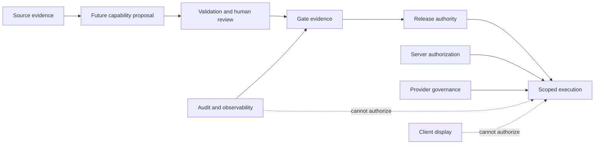
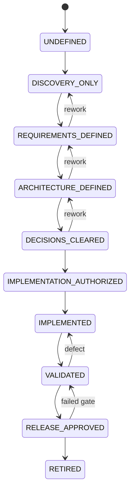

# Foundation V1 Future Capability Boundaries

## 1. Document status

- Title: Foundation V1 Future Capability Boundaries.
- Analysis date: 2026-07-25; branch: `rebuild/foundation-v1`; HEAD: `5ec4854622a6590d9bd23d08c6df43990f20cec0`; upstream: synchronized (behind 0/ahead 0).
- Classification: APPROVED OWNER BASELINE plus PROPOSAL for future discovery; provider-neutral; framework/SDK-neutral; technical-discovery only.
- Product Owner Decisions 1–10 are authoritative. Implementation is **NOT AUTHORIZED**.
- No provider, framework, SDK, OCR engine, AI model, data source, formula engine, workflow, integration, mobile framework, calculation mechanism, Production, or real-data use is approved. No legal, regulatory, commercial, accuracy, security, compliance, suitability, or readiness claim is made.

## 2. Purpose

This document separates Foundation V1 foundations from later interpretive, analytical, automated, integrated, AI, and user-experience capabilities. It records prerequisites, authority, evidence, data boundaries, and unresolved decisions without authorizing implementation.

## 3. Scope

Scope is architectural discovery for future boundaries, including source provenance, extraction, reference data, calculations, simulations, comparisons, recommendations, reports, AI, automation, integrations, batch/background work, notifications, analytics/search, mobile/offline, privacy, security, release, and retention boundaries.

## 4. Non-goals

No capability, provider, source, model, formula, schema, route, service, queue, scheduler, workflow, configuration, secret, test, integration, Production activity, real document, or customer data is implemented or authorized. Documentation is not approval.

## 5. Verified current repository state

| subject | classification | repository evidence | current result | boundary significance | unresolved question |
|---|---|---|---|---|---|
| application runtime | VERIFIED FACT | `package.json`, `app/` | Next.js/React/TypeScript prototype | browser prototype is not an authority boundary | later runtime decisions PENDING |
| package scripts/dependencies/lockfile | VERIFIED FACT | `package.json`, `package-lock.json` | repository-visible scripts and dependencies only | no future capability mechanism is proved | tooling policy PENDING |
| application structure | VERIFIED FACT | complete tree, `app/page.tsx` | client component UI | no server authority is proved | backend boundary PENDING |
| FileReader | VERIFIED FACT | `app/page.tsx` | browser reads selected files | input is not durable source evidence | future acquisition PENDING |
| browser PDF.js | VERIFIED FACT | `app/page.tsx` | PDF.js loaded from cdnjs | external script is not an approved provider | provider/security review PENDING |
| regular-expression extraction | VERIFIED FACT | `app/page.tsx` | CTE text processing uses browser PDF.js and regex | parsed text is not authoritative | extraction design PENDING |
| browser-memory state/archive | VERIFIED FACT | `app/page.tsx` | React state and archive are in memory; reload loses state | no durable lifecycle or tenant boundary | persistence PENDING |
| client-side deletion | VERIFIED FACT | `app/page.tsx` | deletion filters an in-memory array | not deletion evidence | deletion architecture PENDING |
| hardcoded/simulated/PUN/calculation values | VERIFIED FACT | `app/page.tsx` | operational/customer-like values and PUN are locally constructed | not official data or authoritative calculation | source and formula decisions PENDING |
| current simulation/comparison/recommendation/reports/exports | VERIFIED FACT | `app/page.tsx` and tree | no governed architecture is proved | displayed output is not approved future capability | requirements PENDING |
| OCR/AI/integrations | VERIFIED FACT | complete tree and dependencies | no real OCR, AI, or external integration exists | no provider approval is implied | provider and governance PENDING |
| API routes/background/scheduled jobs/notifications/search/analytics/mobile | VERIFIED FACT | complete tree | none repository-visible | no automation or native authority exists | mechanisms PENDING |
| authentication/authorization/tenancy/licensing | VERIFIED FACT | source tree and Foundation docs | no durable implementation is present | client values cannot authorize | later implementation NOT AUTHORIZED |
| persistence/private storage/audit evidence | VERIFIED FACT | source tree | none durable | no source, audit, or retention proof | storage and evidence PENDING |
| providers/provider governance | UNKNOWN | repository-visible files only | no future provider is approved | hidden settings are not evidence | assessment PENDING |
| testing/release controls | VERIFIED FACT | `FOUNDATION_V1_TESTING_RELEASE.md`, tree | architecture documentation only | no implementation gate exists | controls PENDING |
| observability/security controls | VERIFIED FACT | `FOUNDATION_V1_OBSERVABILITY_SECURITY.md`, tree | architecture documentation only | no controls are implemented | mechanisms PENDING |
| CI/workflow configuration | VERIFIED FACT for repository-visible evidence; UNKNOWN for hidden platform settings | complete current repository tree and repository-visible configuration files | no committed repository-visible CI configuration, GitHub Actions workflow, or other workflow file was found | no repository-visible automated test, telemetry, security, release, deployment, or quality gate is proved | CI provider, workflow design, required checks, branch protection, hidden GitHub/Vercel settings, permissions, and operational policy remain PENDING or UNKNOWN as appropriate |
| Current browser calculation behavior | VERIFIED FACT for repository-visible browser behavior | `app/page.tsx` and the current client-side prototype logic | The current application performs browser-side arithmetic, derived-value construction, or display calculations using client-side code and hardcoded, mocked, simulated, locally parsed, or locally constructed inputs | This is prototype behavior only; it is not a server-authoritative calculation engine, approved formula catalog, regulatory-rule implementation, tariff engine, simulation engine, calculation correctness, regulatory correctness, commercial suitability, or reproducible governed evidence | Formula authority, versions, input provenance, units, effective dates, tax assumptions, regulatory rules, rounding, precision, evidence, validation, provider requirements, and implementation remain PENDING and NOT AUTHORIZED |

## 6. Authoritative Foundation V1 baseline

Foundation V1 covers foundations and non-interpretive document lifecycle: identity, invitations, memberships, tenant isolation, authorization, licensing foundations, conceptual data model, private storage, lifecycle, audit/retention, environments/providers, testing/release, observability/security, future boundaries, and roadmap documentation. OCR, extraction, PUN import, calculations, simulations, comparisons, recommendations, reports, AI, autonomous actions, integrations, batch/background work, notifications, analytics/search, and mobile/offline remain outside.

## 7. Future-boundary principles

Foundation before interpretation; authority before automation; provenance before derived output; official source before official-data claim; never invent missing values; server authority before client display; tenant isolation before processing; provider approval before provider use; data approval before real data; evidence before success; validation before release; human review where required; append-only correction; deterministic rules where appropriate; model output is a proposal; version calculations and assumptions; reversible activation; controlled pilots; no autonomous contractual action; documentation never authorizes implementation.

## 8. Terminology

“Source” is original evidence; “derived” is transformed output; “authority” is the approved decision boundary; “provider” is a service category candidate; “synthetic” is non-customer test data; “PENDING” is unresolved; “NOT AUTHORIZED” prohibits implementation or execution.

## 9. Capabilities included in Foundation V1

Included documentation boundaries: modular architecture; identity and controlled invitations; memberships/roles; tenant isolation and authorization; licensing, seats, entitlements and feature foundations; conceptual data model; private-document storage; non-interpretive lifecycle; audit/retention; environments/provider governance; testing/controlled release; observability/operational security; future boundaries; implementation-roadmap documentation. Inclusion in documentation does not prove implementation.

## 10. Capabilities excluded from Foundation V1

OCR; text recognition; Bill/CTE structured extraction; confidence; automated correction; human-review workflow implementation; PUN/tariff/reference ingestion; normalization; calculations/formulas; simulations/scenarios; comparisons/rankings; recommendations/commercial advice; reports/exports; AI/generative AI/agents; automated contractual actions; integrations/public APIs; batch/scheduled processing; notifications; analytics/search; mobile/native/offline/biometric features; Production; real data.

**Decisione 11 synchronization:** A future graphical validation package may be synthetic-only and presentation-only; functional comparison/PDF behavior remains separately unauthorized. OCR, extraction, calculations, comparisons, reports, PDF export, real data, and Production remain NOT AUTHORIZED.
## 11. Future capability-family inventory

Each family is a proposal only. For every row: source authority and execution authority remain separately approved; tenant, role, entitlement, provider, evidence, human review, security/privacy, prerequisites, and release gates are required; current status and implementation status are NOT AUTHORIZED.

The following independently labelled blocks preserve the same 20 families and make every required dimension attributable to its specific family:

### Family 1: OCR and text acquisition
- **Business purpose:** PENDING; scope and applicability remain unresolved for this family.
- **Intended users:** PENDING; scope and applicability remain unresolved for this family.
- **Inputs:** PENDING; scope and applicability remain unresolved for this family.
- **Outputs:** PENDING; scope and applicability remain unresolved for this family.
- **Source authority:** PENDING; scope and applicability remain unresolved for this family.
- **Execution authority:** PENDING; scope and applicability remain unresolved for this family.
- **Tenant scope:** PENDING; scope and applicability remain unresolved for this family.
- **Role and permission scope:** PENDING; scope and applicability remain unresolved for this family.
- **Licence, entitlement, and feature scope:** PENDING; scope and applicability remain unresolved for this family.
- **Data classes:** PENDING; scope and applicability remain unresolved for this family.
- **Provider dependency:** PENDING; scope and applicability remain unresolved for this family.
- **Environment boundary:** PENDING; scope and applicability remain unresolved for this family.
- **Evidence requirement:** PENDING; scope and applicability remain unresolved for this family.
- **Human-review requirement:** PENDING; scope and applicability remain unresolved for this family.
- **Security and privacy boundary:** PENDING; scope and applicability remain unresolved for this family.
- **Prerequisites:** PENDING; scope and applicability remain unresolved for this family.
- **Principal risks:** PENDING; scope and applicability remain unresolved for this family.
- **Current status:** DISCOVERY_ONLY proposal
- **Implementation status:** NOT AUTHORIZED

### Family 2: Bill structured extraction
- **Business purpose:** PENDING; scope and applicability remain unresolved for this family.
- **Intended users:** PENDING; scope and applicability remain unresolved for this family.
- **Inputs:** PENDING; scope and applicability remain unresolved for this family.
- **Outputs:** PENDING; scope and applicability remain unresolved for this family.
- **Source authority:** PENDING; scope and applicability remain unresolved for this family.
- **Execution authority:** PENDING; scope and applicability remain unresolved for this family.
- **Tenant scope:** PENDING; scope and applicability remain unresolved for this family.
- **Role and permission scope:** PENDING; scope and applicability remain unresolved for this family.
- **Licence, entitlement, and feature scope:** PENDING; scope and applicability remain unresolved for this family.
- **Data classes:** PENDING; scope and applicability remain unresolved for this family.
- **Provider dependency:** PENDING; scope and applicability remain unresolved for this family.
- **Environment boundary:** PENDING; scope and applicability remain unresolved for this family.
- **Evidence requirement:** PENDING; scope and applicability remain unresolved for this family.
- **Human-review requirement:** PENDING; scope and applicability remain unresolved for this family.
- **Security and privacy boundary:** PENDING; scope and applicability remain unresolved for this family.
- **Prerequisites:** PENDING; scope and applicability remain unresolved for this family.
- **Principal risks:** PENDING; scope and applicability remain unresolved for this family.
- **Current status:** DISCOVERY_ONLY proposal
- **Implementation status:** NOT AUTHORIZED

### Family 3: CTE structured extraction
- **Business purpose:** PENDING; scope and applicability remain unresolved for this family.
- **Intended users:** PENDING; scope and applicability remain unresolved for this family.
- **Inputs:** PENDING; scope and applicability remain unresolved for this family.
- **Outputs:** PENDING; scope and applicability remain unresolved for this family.
- **Source authority:** PENDING; scope and applicability remain unresolved for this family.
- **Execution authority:** PENDING; scope and applicability remain unresolved for this family.
- **Tenant scope:** PENDING; scope and applicability remain unresolved for this family.
- **Role and permission scope:** PENDING; scope and applicability remain unresolved for this family.
- **Licence, entitlement, and feature scope:** PENDING; scope and applicability remain unresolved for this family.
- **Data classes:** PENDING; scope and applicability remain unresolved for this family.
- **Provider dependency:** PENDING; scope and applicability remain unresolved for this family.
- **Environment boundary:** PENDING; scope and applicability remain unresolved for this family.
- **Evidence requirement:** PENDING; scope and applicability remain unresolved for this family.
- **Human-review requirement:** PENDING; scope and applicability remain unresolved for this family.
- **Security and privacy boundary:** PENDING; scope and applicability remain unresolved for this family.
- **Prerequisites:** PENDING; scope and applicability remain unresolved for this family.
- **Principal risks:** PENDING; scope and applicability remain unresolved for this family.
- **Current status:** DISCOVERY_ONLY proposal
- **Implementation status:** NOT AUTHORIZED

### Family 4: Human review and correction
- **Business purpose:** PENDING; scope and applicability remain unresolved for this family.
- **Intended users:** PENDING; scope and applicability remain unresolved for this family.
- **Inputs:** PENDING; scope and applicability remain unresolved for this family.
- **Outputs:** PENDING; scope and applicability remain unresolved for this family.
- **Source authority:** PENDING; scope and applicability remain unresolved for this family.
- **Execution authority:** PENDING; scope and applicability remain unresolved for this family.
- **Tenant scope:** PENDING; scope and applicability remain unresolved for this family.
- **Role and permission scope:** PENDING; scope and applicability remain unresolved for this family.
- **Licence, entitlement, and feature scope:** PENDING; scope and applicability remain unresolved for this family.
- **Data classes:** PENDING; scope and applicability remain unresolved for this family.
- **Provider dependency:** PENDING; scope and applicability remain unresolved for this family.
- **Environment boundary:** PENDING; scope and applicability remain unresolved for this family.
- **Evidence requirement:** PENDING; scope and applicability remain unresolved for this family.
- **Human-review requirement:** PENDING; scope and applicability remain unresolved for this family.
- **Security and privacy boundary:** PENDING; scope and applicability remain unresolved for this family.
- **Prerequisites:** PENDING; scope and applicability remain unresolved for this family.
- **Principal risks:** PENDING; scope and applicability remain unresolved for this family.
- **Current status:** DISCOVERY_ONLY proposal
- **Implementation status:** NOT AUTHORIZED

### Family 5: Confidence, provenance, and data quality
- **Business purpose:** PENDING; scope and applicability remain unresolved for this family.
- **Intended users:** PENDING; scope and applicability remain unresolved for this family.
- **Inputs:** PENDING; scope and applicability remain unresolved for this family.
- **Outputs:** PENDING; scope and applicability remain unresolved for this family.
- **Source authority:** PENDING; scope and applicability remain unresolved for this family.
- **Execution authority:** PENDING; scope and applicability remain unresolved for this family.
- **Tenant scope:** PENDING; scope and applicability remain unresolved for this family.
- **Role and permission scope:** PENDING; scope and applicability remain unresolved for this family.
- **Licence, entitlement, and feature scope:** PENDING; scope and applicability remain unresolved for this family.
- **Data classes:** PENDING; scope and applicability remain unresolved for this family.
- **Provider dependency:** PENDING; scope and applicability remain unresolved for this family.
- **Environment boundary:** PENDING; scope and applicability remain unresolved for this family.
- **Evidence requirement:** PENDING; scope and applicability remain unresolved for this family.
- **Human-review requirement:** PENDING; scope and applicability remain unresolved for this family.
- **Security and privacy boundary:** PENDING; scope and applicability remain unresolved for this family.
- **Prerequisites:** PENDING; scope and applicability remain unresolved for this family.
- **Principal risks:** PENDING; scope and applicability remain unresolved for this family.
- **Current status:** DISCOVERY_ONLY proposal
- **Implementation status:** NOT AUTHORIZED

### Family 6: Official PUN ingestion
- **Business purpose:** PENDING; scope and applicability remain unresolved for this family.
- **Intended users:** PENDING; scope and applicability remain unresolved for this family.
- **Inputs:** PENDING; scope and applicability remain unresolved for this family.
- **Outputs:** PENDING; scope and applicability remain unresolved for this family.
- **Source authority:** PENDING; scope and applicability remain unresolved for this family.
- **Execution authority:** PENDING; scope and applicability remain unresolved for this family.
- **Tenant scope:** PENDING; scope and applicability remain unresolved for this family.
- **Role and permission scope:** PENDING; scope and applicability remain unresolved for this family.
- **Licence, entitlement, and feature scope:** PENDING; scope and applicability remain unresolved for this family.
- **Data classes:** PENDING; scope and applicability remain unresolved for this family.
- **Provider dependency:** PENDING; scope and applicability remain unresolved for this family.
- **Environment boundary:** PENDING; scope and applicability remain unresolved for this family.
- **Evidence requirement:** PENDING; scope and applicability remain unresolved for this family.
- **Human-review requirement:** PENDING; scope and applicability remain unresolved for this family.
- **Security and privacy boundary:** PENDING; scope and applicability remain unresolved for this family.
- **Prerequisites:** PENDING; scope and applicability remain unresolved for this family.
- **Principal risks:** PENDING; scope and applicability remain unresolved for this family.
- **Current status:** DISCOVERY_ONLY proposal
- **Implementation status:** NOT AUTHORIZED

### Family 7: Tariff and reference-data ingestion
- **Business purpose:** PENDING; scope and applicability remain unresolved for this family.
- **Intended users:** PENDING; scope and applicability remain unresolved for this family.
- **Inputs:** PENDING; scope and applicability remain unresolved for this family.
- **Outputs:** PENDING; scope and applicability remain unresolved for this family.
- **Source authority:** PENDING; scope and applicability remain unresolved for this family.
- **Execution authority:** PENDING; scope and applicability remain unresolved for this family.
- **Tenant scope:** PENDING; scope and applicability remain unresolved for this family.
- **Role and permission scope:** PENDING; scope and applicability remain unresolved for this family.
- **Licence, entitlement, and feature scope:** PENDING; scope and applicability remain unresolved for this family.
- **Data classes:** PENDING; scope and applicability remain unresolved for this family.
- **Provider dependency:** PENDING; scope and applicability remain unresolved for this family.
- **Environment boundary:** PENDING; scope and applicability remain unresolved for this family.
- **Evidence requirement:** PENDING; scope and applicability remain unresolved for this family.
- **Human-review requirement:** PENDING; scope and applicability remain unresolved for this family.
- **Security and privacy boundary:** PENDING; scope and applicability remain unresolved for this family.
- **Prerequisites:** PENDING; scope and applicability remain unresolved for this family.
- **Principal risks:** PENDING; scope and applicability remain unresolved for this family.
- **Current status:** DISCOVERY_ONLY proposal
- **Implementation status:** NOT AUTHORIZED

### Family 8: Normalization and validation
- **Business purpose:** PENDING; scope and applicability remain unresolved for this family.
- **Intended users:** PENDING; scope and applicability remain unresolved for this family.
- **Inputs:** PENDING; scope and applicability remain unresolved for this family.
- **Outputs:** PENDING; scope and applicability remain unresolved for this family.
- **Source authority:** PENDING; scope and applicability remain unresolved for this family.
- **Execution authority:** PENDING; scope and applicability remain unresolved for this family.
- **Tenant scope:** PENDING; scope and applicability remain unresolved for this family.
- **Role and permission scope:** PENDING; scope and applicability remain unresolved for this family.
- **Licence, entitlement, and feature scope:** PENDING; scope and applicability remain unresolved for this family.
- **Data classes:** PENDING; scope and applicability remain unresolved for this family.
- **Provider dependency:** PENDING; scope and applicability remain unresolved for this family.
- **Environment boundary:** PENDING; scope and applicability remain unresolved for this family.
- **Evidence requirement:** PENDING; scope and applicability remain unresolved for this family.
- **Human-review requirement:** PENDING; scope and applicability remain unresolved for this family.
- **Security and privacy boundary:** PENDING; scope and applicability remain unresolved for this family.
- **Prerequisites:** PENDING; scope and applicability remain unresolved for this family.
- **Principal risks:** PENDING; scope and applicability remain unresolved for this family.
- **Current status:** DISCOVERY_ONLY proposal
- **Implementation status:** NOT AUTHORIZED

### Family 9: Calculation engine
- **Business purpose:** PENDING; scope and applicability remain unresolved for this family.
- **Intended users:** PENDING; scope and applicability remain unresolved for this family.
- **Inputs:** PENDING; scope and applicability remain unresolved for this family.
- **Outputs:** PENDING; scope and applicability remain unresolved for this family.
- **Source authority:** PENDING; scope and applicability remain unresolved for this family.
- **Execution authority:** PENDING; scope and applicability remain unresolved for this family.
- **Tenant scope:** PENDING; scope and applicability remain unresolved for this family.
- **Role and permission scope:** PENDING; scope and applicability remain unresolved for this family.
- **Licence, entitlement, and feature scope:** PENDING; scope and applicability remain unresolved for this family.
- **Data classes:** PENDING; scope and applicability remain unresolved for this family.
- **Provider dependency:** PENDING; scope and applicability remain unresolved for this family.
- **Environment boundary:** PENDING; scope and applicability remain unresolved for this family.
- **Evidence requirement:** PENDING; scope and applicability remain unresolved for this family.
- **Human-review requirement:** PENDING; scope and applicability remain unresolved for this family.
- **Security and privacy boundary:** PENDING; scope and applicability remain unresolved for this family.
- **Prerequisites:** PENDING; scope and applicability remain unresolved for this family.
- **Principal risks:** PENDING; scope and applicability remain unresolved for this family.
- **Current status:** DISCOVERY_ONLY proposal
- **Implementation status:** NOT AUTHORIZED

### Family 10: Simulation and scenarios
- **Business purpose:** PENDING; scope and applicability remain unresolved for this family.
- **Intended users:** PENDING; scope and applicability remain unresolved for this family.
- **Inputs:** PENDING; scope and applicability remain unresolved for this family.
- **Outputs:** PENDING; scope and applicability remain unresolved for this family.
- **Source authority:** PENDING; scope and applicability remain unresolved for this family.
- **Execution authority:** PENDING; scope and applicability remain unresolved for this family.
- **Tenant scope:** PENDING; scope and applicability remain unresolved for this family.
- **Role and permission scope:** PENDING; scope and applicability remain unresolved for this family.
- **Licence, entitlement, and feature scope:** PENDING; scope and applicability remain unresolved for this family.
- **Data classes:** PENDING; scope and applicability remain unresolved for this family.
- **Provider dependency:** PENDING; scope and applicability remain unresolved for this family.
- **Environment boundary:** PENDING; scope and applicability remain unresolved for this family.
- **Evidence requirement:** PENDING; scope and applicability remain unresolved for this family.
- **Human-review requirement:** PENDING; scope and applicability remain unresolved for this family.
- **Security and privacy boundary:** PENDING; scope and applicability remain unresolved for this family.
- **Prerequisites:** PENDING; scope and applicability remain unresolved for this family.
- **Principal risks:** PENDING; scope and applicability remain unresolved for this family.
- **Current status:** DISCOVERY_ONLY proposal
- **Implementation status:** NOT AUTHORIZED

### Family 11: Comparisons
- **Business purpose:** PENDING; scope and applicability remain unresolved for this family.
- **Intended users:** PENDING; scope and applicability remain unresolved for this family.
- **Inputs:** PENDING; scope and applicability remain unresolved for this family.
- **Outputs:** PENDING; scope and applicability remain unresolved for this family.
- **Source authority:** PENDING; scope and applicability remain unresolved for this family.
- **Execution authority:** PENDING; scope and applicability remain unresolved for this family.
- **Tenant scope:** PENDING; scope and applicability remain unresolved for this family.
- **Role and permission scope:** PENDING; scope and applicability remain unresolved for this family.
- **Licence, entitlement, and feature scope:** PENDING; scope and applicability remain unresolved for this family.
- **Data classes:** PENDING; scope and applicability remain unresolved for this family.
- **Provider dependency:** PENDING; scope and applicability remain unresolved for this family.
- **Environment boundary:** PENDING; scope and applicability remain unresolved for this family.
- **Evidence requirement:** PENDING; scope and applicability remain unresolved for this family.
- **Human-review requirement:** PENDING; scope and applicability remain unresolved for this family.
- **Security and privacy boundary:** PENDING; scope and applicability remain unresolved for this family.
- **Prerequisites:** PENDING; scope and applicability remain unresolved for this family.
- **Principal risks:** PENDING; scope and applicability remain unresolved for this family.
- **Current status:** DISCOVERY_ONLY proposal
- **Implementation status:** NOT AUTHORIZED

### Family 12: Recommendations and decision support
- **Business purpose:** PENDING; scope and applicability remain unresolved for this family.
- **Intended users:** PENDING; scope and applicability remain unresolved for this family.
- **Inputs:** PENDING; scope and applicability remain unresolved for this family.
- **Outputs:** PENDING; scope and applicability remain unresolved for this family.
- **Source authority:** PENDING; scope and applicability remain unresolved for this family.
- **Execution authority:** PENDING; scope and applicability remain unresolved for this family.
- **Tenant scope:** PENDING; scope and applicability remain unresolved for this family.
- **Role and permission scope:** PENDING; scope and applicability remain unresolved for this family.
- **Licence, entitlement, and feature scope:** PENDING; scope and applicability remain unresolved for this family.
- **Data classes:** PENDING; scope and applicability remain unresolved for this family.
- **Provider dependency:** PENDING; scope and applicability remain unresolved for this family.
- **Environment boundary:** PENDING; scope and applicability remain unresolved for this family.
- **Evidence requirement:** PENDING; scope and applicability remain unresolved for this family.
- **Human-review requirement:** PENDING; scope and applicability remain unresolved for this family.
- **Security and privacy boundary:** PENDING; scope and applicability remain unresolved for this family.
- **Prerequisites:** PENDING; scope and applicability remain unresolved for this family.
- **Principal risks:** PENDING; scope and applicability remain unresolved for this family.
- **Current status:** DISCOVERY_ONLY proposal
- **Implementation status:** NOT AUTHORIZED

### Family 13: Reports and exports
- **Business purpose:** PENDING; scope and applicability remain unresolved for this family.
- **Intended users:** PENDING; scope and applicability remain unresolved for this family.
- **Inputs:** PENDING; scope and applicability remain unresolved for this family.
- **Outputs:** PENDING; scope and applicability remain unresolved for this family.
- **Source authority:** PENDING; scope and applicability remain unresolved for this family.
- **Execution authority:** PENDING; scope and applicability remain unresolved for this family.
- **Tenant scope:** PENDING; scope and applicability remain unresolved for this family.
- **Role and permission scope:** PENDING; scope and applicability remain unresolved for this family.
- **Licence, entitlement, and feature scope:** PENDING; scope and applicability remain unresolved for this family.
- **Data classes:** PENDING; scope and applicability remain unresolved for this family.
- **Provider dependency:** PENDING; scope and applicability remain unresolved for this family.
- **Environment boundary:** PENDING; scope and applicability remain unresolved for this family.
- **Evidence requirement:** PENDING; scope and applicability remain unresolved for this family.
- **Human-review requirement:** PENDING; scope and applicability remain unresolved for this family.
- **Security and privacy boundary:** PENDING; scope and applicability remain unresolved for this family.
- **Prerequisites:** PENDING; scope and applicability remain unresolved for this family.
- **Principal risks:** PENDING; scope and applicability remain unresolved for this family.
- **Current status:** DISCOVERY_ONLY proposal
- **Implementation status:** NOT AUTHORIZED

### Family 14: AI assistant
- **Business purpose:** PENDING; scope and applicability remain unresolved for this family.
- **Intended users:** PENDING; scope and applicability remain unresolved for this family.
- **Inputs:** PENDING; scope and applicability remain unresolved for this family.
- **Outputs:** PENDING; scope and applicability remain unresolved for this family.
- **Source authority:** PENDING; scope and applicability remain unresolved for this family.
- **Execution authority:** PENDING; scope and applicability remain unresolved for this family.
- **Tenant scope:** PENDING; scope and applicability remain unresolved for this family.
- **Role and permission scope:** PENDING; scope and applicability remain unresolved for this family.
- **Licence, entitlement, and feature scope:** PENDING; scope and applicability remain unresolved for this family.
- **Data classes:** PENDING; scope and applicability remain unresolved for this family.
- **Provider dependency:** PENDING; scope and applicability remain unresolved for this family.
- **Environment boundary:** PENDING; scope and applicability remain unresolved for this family.
- **Evidence requirement:** PENDING; scope and applicability remain unresolved for this family.
- **Human-review requirement:** PENDING; scope and applicability remain unresolved for this family.
- **Security and privacy boundary:** PENDING; scope and applicability remain unresolved for this family.
- **Prerequisites:** PENDING; scope and applicability remain unresolved for this family.
- **Principal risks:** PENDING; scope and applicability remain unresolved for this family.
- **Current status:** DISCOVERY_ONLY proposal
- **Implementation status:** NOT AUTHORIZED

### Family 15: Automated and agentic actions
- **Business purpose:** PENDING; scope and applicability remain unresolved for this family.
- **Intended users:** PENDING; scope and applicability remain unresolved for this family.
- **Inputs:** PENDING; scope and applicability remain unresolved for this family.
- **Outputs:** PENDING; scope and applicability remain unresolved for this family.
- **Source authority:** PENDING; scope and applicability remain unresolved for this family.
- **Execution authority:** PENDING; scope and applicability remain unresolved for this family.
- **Tenant scope:** PENDING; scope and applicability remain unresolved for this family.
- **Role and permission scope:** PENDING; scope and applicability remain unresolved for this family.
- **Licence, entitlement, and feature scope:** PENDING; scope and applicability remain unresolved for this family.
- **Data classes:** PENDING; scope and applicability remain unresolved for this family.
- **Provider dependency:** PENDING; scope and applicability remain unresolved for this family.
- **Environment boundary:** PENDING; scope and applicability remain unresolved for this family.
- **Evidence requirement:** PENDING; scope and applicability remain unresolved for this family.
- **Human-review requirement:** PENDING; scope and applicability remain unresolved for this family.
- **Security and privacy boundary:** PENDING; scope and applicability remain unresolved for this family.
- **Prerequisites:** PENDING; scope and applicability remain unresolved for this family.
- **Principal risks:** PENDING; scope and applicability remain unresolved for this family.
- **Current status:** DISCOVERY_ONLY proposal
- **Implementation status:** NOT AUTHORIZED

### Family 16: External integrations and APIs
- **Business purpose:** PENDING; scope and applicability remain unresolved for this family.
- **Intended users:** PENDING; scope and applicability remain unresolved for this family.
- **Inputs:** PENDING; scope and applicability remain unresolved for this family.
- **Outputs:** PENDING; scope and applicability remain unresolved for this family.
- **Source authority:** PENDING; scope and applicability remain unresolved for this family.
- **Execution authority:** PENDING; scope and applicability remain unresolved for this family.
- **Tenant scope:** PENDING; scope and applicability remain unresolved for this family.
- **Role and permission scope:** PENDING; scope and applicability remain unresolved for this family.
- **Licence, entitlement, and feature scope:** PENDING; scope and applicability remain unresolved for this family.
- **Data classes:** PENDING; scope and applicability remain unresolved for this family.
- **Provider dependency:** PENDING; scope and applicability remain unresolved for this family.
- **Environment boundary:** PENDING; scope and applicability remain unresolved for this family.
- **Evidence requirement:** PENDING; scope and applicability remain unresolved for this family.
- **Human-review requirement:** PENDING; scope and applicability remain unresolved for this family.
- **Security and privacy boundary:** PENDING; scope and applicability remain unresolved for this family.
- **Prerequisites:** PENDING; scope and applicability remain unresolved for this family.
- **Principal risks:** PENDING; scope and applicability remain unresolved for this family.
- **Current status:** DISCOVERY_ONLY proposal
- **Implementation status:** NOT AUTHORIZED

### Family 17: Bulk, batch, and background processing
- **Business purpose:** PENDING; scope and applicability remain unresolved for this family.
- **Intended users:** PENDING; scope and applicability remain unresolved for this family.
- **Inputs:** PENDING; scope and applicability remain unresolved for this family.
- **Outputs:** PENDING; scope and applicability remain unresolved for this family.
- **Source authority:** PENDING; scope and applicability remain unresolved for this family.
- **Execution authority:** PENDING; scope and applicability remain unresolved for this family.
- **Tenant scope:** PENDING; scope and applicability remain unresolved for this family.
- **Role and permission scope:** PENDING; scope and applicability remain unresolved for this family.
- **Licence, entitlement, and feature scope:** PENDING; scope and applicability remain unresolved for this family.
- **Data classes:** PENDING; scope and applicability remain unresolved for this family.
- **Provider dependency:** PENDING; scope and applicability remain unresolved for this family.
- **Environment boundary:** PENDING; scope and applicability remain unresolved for this family.
- **Evidence requirement:** PENDING; scope and applicability remain unresolved for this family.
- **Human-review requirement:** PENDING; scope and applicability remain unresolved for this family.
- **Security and privacy boundary:** PENDING; scope and applicability remain unresolved for this family.
- **Prerequisites:** PENDING; scope and applicability remain unresolved for this family.
- **Principal risks:** PENDING; scope and applicability remain unresolved for this family.
- **Current status:** DISCOVERY_ONLY proposal
- **Implementation status:** NOT AUTHORIZED

### Family 18: Notifications and collaboration
- **Business purpose:** PENDING; scope and applicability remain unresolved for this family.
- **Intended users:** PENDING; scope and applicability remain unresolved for this family.
- **Inputs:** PENDING; scope and applicability remain unresolved for this family.
- **Outputs:** PENDING; scope and applicability remain unresolved for this family.
- **Source authority:** PENDING; scope and applicability remain unresolved for this family.
- **Execution authority:** PENDING; scope and applicability remain unresolved for this family.
- **Tenant scope:** PENDING; scope and applicability remain unresolved for this family.
- **Role and permission scope:** PENDING; scope and applicability remain unresolved for this family.
- **Licence, entitlement, and feature scope:** PENDING; scope and applicability remain unresolved for this family.
- **Data classes:** PENDING; scope and applicability remain unresolved for this family.
- **Provider dependency:** PENDING; scope and applicability remain unresolved for this family.
- **Environment boundary:** PENDING; scope and applicability remain unresolved for this family.
- **Evidence requirement:** PENDING; scope and applicability remain unresolved for this family.
- **Human-review requirement:** PENDING; scope and applicability remain unresolved for this family.
- **Security and privacy boundary:** PENDING; scope and applicability remain unresolved for this family.
- **Prerequisites:** PENDING; scope and applicability remain unresolved for this family.
- **Principal risks:** PENDING; scope and applicability remain unresolved for this family.
- **Current status:** DISCOVERY_ONLY proposal
- **Implementation status:** NOT AUTHORIZED

### Family 19: Analytics and search
- **Business purpose:** PENDING; scope and applicability remain unresolved for this family.
- **Intended users:** PENDING; scope and applicability remain unresolved for this family.
- **Inputs:** PENDING; scope and applicability remain unresolved for this family.
- **Outputs:** PENDING; scope and applicability remain unresolved for this family.
- **Source authority:** PENDING; scope and applicability remain unresolved for this family.
- **Execution authority:** PENDING; scope and applicability remain unresolved for this family.
- **Tenant scope:** PENDING; scope and applicability remain unresolved for this family.
- **Role and permission scope:** PENDING; scope and applicability remain unresolved for this family.
- **Licence, entitlement, and feature scope:** PENDING; scope and applicability remain unresolved for this family.
- **Data classes:** PENDING; scope and applicability remain unresolved for this family.
- **Provider dependency:** PENDING; scope and applicability remain unresolved for this family.
- **Environment boundary:** PENDING; scope and applicability remain unresolved for this family.
- **Evidence requirement:** PENDING; scope and applicability remain unresolved for this family.
- **Human-review requirement:** PENDING; scope and applicability remain unresolved for this family.
- **Security and privacy boundary:** PENDING; scope and applicability remain unresolved for this family.
- **Prerequisites:** PENDING; scope and applicability remain unresolved for this family.
- **Principal risks:** PENDING; scope and applicability remain unresolved for this family.
- **Current status:** DISCOVERY_ONLY proposal
- **Implementation status:** NOT AUTHORIZED

### Family 20: Mobile, offline, and native extensions
- **Business purpose:** PENDING; scope and applicability remain unresolved for this family.
- **Intended users:** PENDING; scope and applicability remain unresolved for this family.
- **Inputs:** PENDING; scope and applicability remain unresolved for this family.
- **Outputs:** PENDING; scope and applicability remain unresolved for this family.
- **Source authority:** PENDING; scope and applicability remain unresolved for this family.
- **Execution authority:** PENDING; scope and applicability remain unresolved for this family.
- **Tenant scope:** PENDING; scope and applicability remain unresolved for this family.
- **Role and permission scope:** PENDING; scope and applicability remain unresolved for this family.
- **Licence, entitlement, and feature scope:** PENDING; scope and applicability remain unresolved for this family.
- **Data classes:** PENDING; scope and applicability remain unresolved for this family.
- **Provider dependency:** PENDING; scope and applicability remain unresolved for this family.
- **Environment boundary:** PENDING; scope and applicability remain unresolved for this family.
- **Evidence requirement:** PENDING; scope and applicability remain unresolved for this family.
- **Human-review requirement:** PENDING; scope and applicability remain unresolved for this family.
- **Security and privacy boundary:** PENDING; scope and applicability remain unresolved for this family.
- **Prerequisites:** PENDING; scope and applicability remain unresolved for this family.
- **Principal risks:** PENDING; scope and applicability remain unresolved for this family.
- **Current status:** DISCOVERY_ONLY proposal
- **Implementation status:** NOT AUTHORIZED

| # | family | purpose / users | inputs → outputs | authority / tenant / rights | data/provider/environment | evidence, review, prerequisites, risks |
|---:|---|---|---|---|---|---|
|1|OCR and text acquisition|acquire text / operators|document → proposed text|source authority; tenant-scoped|document content; OCR provider PENDING; synthetic only|page provenance, review; quality/privacy risk|
|2|Bill structured extraction|field proposal / reviewers|text → fields|human/server validation|document metadata/content; provider PENDING|field evidence and correction|
|3|CTE structured extraction|offer field proposal / reviewers|text → fields|validation authority|document data; provider PENDING|source references; legal interpretation risk|
|4|Human review and correction|validate proposals / reviewers|proposal → corrected value|review authority, scoped tenant|source/derived data; no unrestricted access|append-only evidence; overreach risk|
|5|Confidence, provenance, and data quality|explain uncertainty / users|signals → assessments|policy authority|metadata; mechanism PENDING|thresholds and provenance; false certainty risk|
|6|Official PUN ingestion|official reference / analysts|GME publication → monthly values|official-source authority|reference data; provider PENDING|four complete months; stale source risk|
|7|Tariff and reference-data ingestion|reference catalog / analysts|publication → version|source authority|commercial/reference; provider PENDING|effective dates; mismatch risk|
|8|Normalization and validation|consistent values / operators|raw → normalized|rules authority|derived metadata; mechanism PENDING|units/version evidence; destructive overwrite risk|
|9|Calculation engine|reproducible calculations / authorized users|validated inputs → result|calculation-rules authority|derived/commercial; engine PENDING|formula/version evidence; regulatory risk|
|10|Simulation and scenarios|what-if analysis / users|baseline+assumptions → scenario|server authority|synthetic/derived; mechanism PENDING|assumption disclosure; guarantee risk|
|11|Comparisons|comparable outputs / users|aligned results → comparison|policy authority|derived; engine PENDING|comparability evidence; bias risk|
|12|Recommendations and decision support|decision support / users|facts/comparison → proposal|human decision authority|commercial; mechanism PENDING|explainability; suitability risk|
|13|Reports and exports|communicate derived results / users|evidence+results → artifact|delivery authority|derived/document metadata; provider PENDING|redaction/private delivery; disclosure risk|
|14|AI assistant|answer questions / users|authorized context → proposal|human/server authority|data classes restricted; model PENDING|citations/no training; hallucination risk|
|15|Automated and agentic actions|draft or execute actions / operators|approved request → action|separate action authority|tenant data; agent PENDING|confirmation/idempotency; autonomy risk|
|16|External integrations and APIs|exchange data / systems|authorized request ↔ provider|integration authority|approved classes; provider PENDING|credentials/idempotency; leakage risk|
|17|Bulk, batch, and background processing|scale work / operators|manifest → per-item results|tenant-scoped scheduler authority|synthetic only; mechanism PENDING|partial results; amplification risk|
|18|Notifications and collaboration|notify / users|event → redacted message|recipient authority|metadata; channel PENDING|delivery evidence; sensitive leak risk|
|19|Analytics and search|find/aggregate / users|authorized index → view|query authority|tenant-scoped; engine PENDING|deletion propagation; leakage risk|
|20|Mobile, offline, and native extensions|device experience / users|authorized data ↔ device|device/server authority|no real offline data; framework PENDING|revocation; device-loss risk|

## 12. Capability maturity states

| # | state | meaning / entry | permitted / prohibited | evidence / authority / exit |
|---:|---|---|---|---|
|1|UNDEFINED|idea only; no prerequisites|discovery only; no interpretation|owner records idea; define scope|
|2|DISCOVERY_ONLY|bounded discovery exists|synthetic analysis; no implementation|discovery evidence; requirements next|
|3|REQUIREMENTS_DEFINED|requirements reviewed|architecture discussion; no code|approved requirements; architecture next|
|4|ARCHITECTURE_DEFINED|boundaries documented|decision clearing; no build|architecture evidence; decisions next|
|5|DECISIONS_CLEARED|required decisions approved|implementation may be considered, not implied|approvals; explicit authorization next|
|6|IMPLEMENTATION_AUTHORIZED|separate authorization exists|only approved implementation scope|authorization evidence; implementation|
|7|IMPLEMENTED|authorized capability exists|validation only|test evidence; validation|
|8|VALIDATED|evidence meets approved tests|release review|validation evidence; release|
|9|RELEASE_APPROVED|release gate approved|controlled release only; no real-data implication|release evidence; operation|
|10|RETIRED|capability withdrawn|no use; deletion/purge still separately governed|retirement evidence; no automatic purge|

These are conceptual future states. No current future capability is assigned beyond DISCOVERY_ONLY unless separately approved. Documentation does not move states; implementation does not create validation; validation does not create release approval; release approval does not authorize real data.

### State 1: UNDEFINED
- **Meaning:** Defined only for governed future discovery; no state transition is authorized.
- **Entry prerequisites:** Defined only for governed future discovery; no state transition is authorized.
- **Permitted activity:** Defined only for governed future discovery; no state transition is authorized.
- **Prohibited interpretation:** Defined only for governed future discovery; no state transition is authorized.
- **Evidence:** Defined only for governed future discovery; no state transition is authorized.
- **Approval authority:** Separate Product Owner and applicable Legal, Privacy, Security, regulatory, commercial, or release authority remains PENDING.
- **Exit criteria:** Defined only for governed future discovery; no state transition is authorized.
- **Implementation significance:** Conceptual only; implementation remains NOT AUTHORIZED.

### State 2: DISCOVERY_ONLY
- **Meaning:** Defined only for governed future discovery; no state transition is authorized.
- **Entry prerequisites:** Defined only for governed future discovery; no state transition is authorized.
- **Permitted activity:** Defined only for governed future discovery; no state transition is authorized.
- **Prohibited interpretation:** Defined only for governed future discovery; no state transition is authorized.
- **Evidence:** Defined only for governed future discovery; no state transition is authorized.
- **Approval authority:** Separate Product Owner and applicable Legal, Privacy, Security, regulatory, commercial, or release authority remains PENDING.
- **Exit criteria:** Defined only for governed future discovery; no state transition is authorized.
- **Implementation significance:** Conceptual only; implementation remains NOT AUTHORIZED.

### State 3: REQUIREMENTS_DEFINED
- **Meaning:** Defined only for governed future discovery; no state transition is authorized.
- **Entry prerequisites:** Defined only for governed future discovery; no state transition is authorized.
- **Permitted activity:** Defined only for governed future discovery; no state transition is authorized.
- **Prohibited interpretation:** Defined only for governed future discovery; no state transition is authorized.
- **Evidence:** Defined only for governed future discovery; no state transition is authorized.
- **Approval authority:** Separate Product Owner and applicable Legal, Privacy, Security, regulatory, commercial, or release authority remains PENDING.
- **Exit criteria:** Defined only for governed future discovery; no state transition is authorized.
- **Implementation significance:** Conceptual only; implementation remains NOT AUTHORIZED.

### State 4: ARCHITECTURE_DEFINED
- **Meaning:** Defined only for governed future discovery; no state transition is authorized.
- **Entry prerequisites:** Defined only for governed future discovery; no state transition is authorized.
- **Permitted activity:** Defined only for governed future discovery; no state transition is authorized.
- **Prohibited interpretation:** Defined only for governed future discovery; no state transition is authorized.
- **Evidence:** Defined only for governed future discovery; no state transition is authorized.
- **Approval authority:** Separate Product Owner and applicable Legal, Privacy, Security, regulatory, commercial, or release authority remains PENDING.
- **Exit criteria:** Defined only for governed future discovery; no state transition is authorized.
- **Implementation significance:** Conceptual only; implementation remains NOT AUTHORIZED.

### State 5: DECISIONS_CLEARED
- **Meaning:** Defined only for governed future discovery; no state transition is authorized.
- **Entry prerequisites:** Defined only for governed future discovery; no state transition is authorized.
- **Permitted activity:** Defined only for governed future discovery; no state transition is authorized.
- **Prohibited interpretation:** Defined only for governed future discovery; no state transition is authorized.
- **Evidence:** Defined only for governed future discovery; no state transition is authorized.
- **Approval authority:** Separate Product Owner and applicable Legal, Privacy, Security, regulatory, commercial, or release authority remains PENDING.
- **Exit criteria:** Defined only for governed future discovery; no state transition is authorized.
- **Implementation significance:** Conceptual only; implementation remains NOT AUTHORIZED.

### State 6: IMPLEMENTATION_AUTHORIZED
- **Meaning:** Defined only for governed future discovery; no state transition is authorized.
- **Entry prerequisites:** Defined only for governed future discovery; no state transition is authorized.
- **Permitted activity:** Defined only for governed future discovery; no state transition is authorized.
- **Prohibited interpretation:** Defined only for governed future discovery; no state transition is authorized.
- **Evidence:** Defined only for governed future discovery; no state transition is authorized.
- **Approval authority:** Separate Product Owner and applicable Legal, Privacy, Security, regulatory, commercial, or release authority remains PENDING.
- **Exit criteria:** Defined only for governed future discovery; no state transition is authorized.
- **Implementation significance:** Conceptual only; implementation remains NOT AUTHORIZED.

### State 7: IMPLEMENTED
- **Meaning:** Defined only for governed future discovery; no state transition is authorized.
- **Entry prerequisites:** Defined only for governed future discovery; no state transition is authorized.
- **Permitted activity:** Defined only for governed future discovery; no state transition is authorized.
- **Prohibited interpretation:** Defined only for governed future discovery; no state transition is authorized.
- **Evidence:** Defined only for governed future discovery; no state transition is authorized.
- **Approval authority:** Separate Product Owner and applicable Legal, Privacy, Security, regulatory, commercial, or release authority remains PENDING.
- **Exit criteria:** Defined only for governed future discovery; no state transition is authorized.
- **Implementation significance:** Conceptual only; implementation remains NOT AUTHORIZED.

### State 8: VALIDATED
- **Meaning:** Defined only for governed future discovery; no state transition is authorized.
- **Entry prerequisites:** Defined only for governed future discovery; no state transition is authorized.
- **Permitted activity:** Defined only for governed future discovery; no state transition is authorized.
- **Prohibited interpretation:** Defined only for governed future discovery; no state transition is authorized.
- **Evidence:** Defined only for governed future discovery; no state transition is authorized.
- **Approval authority:** Separate Product Owner and applicable Legal, Privacy, Security, regulatory, commercial, or release authority remains PENDING.
- **Exit criteria:** Defined only for governed future discovery; no state transition is authorized.
- **Implementation significance:** Conceptual only; implementation remains NOT AUTHORIZED.

### State 9: RELEASE_APPROVED
- **Meaning:** Defined only for governed future discovery; no state transition is authorized.
- **Entry prerequisites:** Defined only for governed future discovery; no state transition is authorized.
- **Permitted activity:** Defined only for governed future discovery; no state transition is authorized.
- **Prohibited interpretation:** Defined only for governed future discovery; no state transition is authorized.
- **Evidence:** Defined only for governed future discovery; no state transition is authorized.
- **Approval authority:** Separate Product Owner and applicable Legal, Privacy, Security, regulatory, commercial, or release authority remains PENDING.
- **Exit criteria:** Defined only for governed future discovery; no state transition is authorized.
- **Implementation significance:** Conceptual only; implementation remains NOT AUTHORIZED.

### State 10: RETIRED
- **Meaning:** Defined only for governed future discovery; no state transition is authorized.
- **Entry prerequisites:** Defined only for governed future discovery; no state transition is authorized.
- **Permitted activity:** Defined only for governed future discovery; no state transition is authorized.
- **Prohibited interpretation:** Defined only for governed future discovery; no state transition is authorized.
- **Evidence:** Defined only for governed future discovery; no state transition is authorized.
- **Approval authority:** Separate Product Owner and applicable Legal, Privacy, Security, regulatory, commercial, or release authority remains PENDING.
- **Exit criteria:** Defined only for governed future discovery; no state transition is authorized.
- **Implementation significance:** Conceptual only; implementation remains NOT AUTHORIZED.

## 13. Authority boundaries

|#|boundary|responsibility / trusted inputs|allowed / prohibited influence|approval / data boundary|safe failure / evidence|
|---:|---|---|---|---|---|
|1|Product Owner|scope decisions / approved baseline|approve product scope; cannot self-approve technical execution|product scope only|pending decision recorded|
|2|Platform Owner|platform governance|govern platform; no unrestricted tenant/document/Production access|platform scope|deny excess; decision evidence|
|3|Tenant Admin|tenant administration|manage tenant scope; no platform/provider authority|tenant only|deny cross-tenant; membership evidence|
|4|Sales Manager or Coordinator|commercial workflow|propose assigned work; no calculation authority|assigned tenant scope|deny unassigned; actor evidence|
|5|Agent or Sales Operator|authorized operations|execute permitted tasks; no approval escalation|assigned records|deny excess; operation evidence|
|6|application runtime|server execution|enforce approved rules; cannot invent authority|request scope|fail closed; runtime evidence|
|7|identity boundary|identity material|verify identity; cannot grant roles|identity scope|reject invalid; identity evidence|
|8|authorization boundary|policy decisions|grant/deny scoped operation; client cannot select|tenant/role scope|deny ambiguity; decision evidence|
|9|licensing and entitlement boundary|commercial rights|grant/deny feature; cannot approve provider|commercial scope|deny missing evidence; licence evidence|
|10|provider-governance boundary|provider state/scope|approve scoped provider use; provider cannot self-approve|provider scope|deny unknown state; state evidence|
|11|source-provenance boundary|source identity/version|validate origin; cannot create missing source|source scope|reject ambiguity; provenance evidence|
|12|calculation-rules authority|formula/rule policy|approve rules; cannot use unvalidated inputs|calculation scope|deny mismatch; version evidence|
|13|official-data-source authority|official publication|confirm official source; cannot authorize unrelated feature|reference scope|reject stale/conflict; publication evidence|
|14|human-review authority|review/correction|validate within scope; no silent overwrite|assigned tenant/document|deny overreach; correction evidence|
|15|release authority|controlled release|approve release sequence; no real-data approval|release scope|stop stale evidence; release evidence|
|16|audit and evidence recorder|record outcomes|record only; cannot grant approval|evidence scope|missing evidence is failure; append-only record|

No actor self-approves. Engines, providers, clients, reports, alerts, audit records, or test results cannot authorize operations.

### Boundary 1: Product Owner
- **Responsibility:** Scoped to Product Owner; no unrestricted authority.
- **Trusted inputs:** Scoped to Product Owner; no unrestricted authority.
- **Allowed influence:** Scoped to Product Owner; no unrestricted authority.
- **Prohibited influence:** Scoped to Product Owner; no unrestricted authority.
- **Approval authority:** No self-approval; applicable approval remains PENDING.
- **Data-access boundary:** Scoped to Product Owner; no unrestricted authority.
- **Safe failure:** Ambiguous, missing, conflicting, or unauthorized input fails closed.
- **Evidence:** Attributable decision evidence is required; recording does not grant authority.

### Boundary 2: Platform Owner
- **Responsibility:** Scoped to Platform Owner; no unrestricted authority.
- **Trusted inputs:** Scoped to Platform Owner; no unrestricted authority.
- **Allowed influence:** Scoped to Platform Owner; no unrestricted authority.
- **Prohibited influence:** Scoped to Platform Owner; no unrestricted authority.
- **Approval authority:** No self-approval; applicable approval remains PENDING.
- **Data-access boundary:** Scoped to Platform Owner; no unrestricted authority.
- **Safe failure:** Ambiguous, missing, conflicting, or unauthorized input fails closed.
- **Evidence:** Attributable decision evidence is required; recording does not grant authority.

### Boundary 3: Tenant Admin
- **Responsibility:** Scoped to Tenant Admin; no unrestricted authority.
- **Trusted inputs:** Scoped to Tenant Admin; no unrestricted authority.
- **Allowed influence:** Scoped to Tenant Admin; no unrestricted authority.
- **Prohibited influence:** Scoped to Tenant Admin; no unrestricted authority.
- **Approval authority:** No self-approval; applicable approval remains PENDING.
- **Data-access boundary:** Scoped to Tenant Admin; no unrestricted authority.
- **Safe failure:** Ambiguous, missing, conflicting, or unauthorized input fails closed.
- **Evidence:** Attributable decision evidence is required; recording does not grant authority.

### Boundary 4: Sales Manager or Coordinator
- **Responsibility:** Scoped to Sales Manager or Coordinator; no unrestricted authority.
- **Trusted inputs:** Scoped to Sales Manager or Coordinator; no unrestricted authority.
- **Allowed influence:** Scoped to Sales Manager or Coordinator; no unrestricted authority.
- **Prohibited influence:** Scoped to Sales Manager or Coordinator; no unrestricted authority.
- **Approval authority:** No self-approval; applicable approval remains PENDING.
- **Data-access boundary:** Scoped to Sales Manager or Coordinator; no unrestricted authority.
- **Safe failure:** Ambiguous, missing, conflicting, or unauthorized input fails closed.
- **Evidence:** Attributable decision evidence is required; recording does not grant authority.

### Boundary 5: Agent or Sales Operator
- **Responsibility:** Scoped to Agent or Sales Operator; no unrestricted authority.
- **Trusted inputs:** Scoped to Agent or Sales Operator; no unrestricted authority.
- **Allowed influence:** Scoped to Agent or Sales Operator; no unrestricted authority.
- **Prohibited influence:** Scoped to Agent or Sales Operator; no unrestricted authority.
- **Approval authority:** No self-approval; applicable approval remains PENDING.
- **Data-access boundary:** Scoped to Agent or Sales Operator; no unrestricted authority.
- **Safe failure:** Ambiguous, missing, conflicting, or unauthorized input fails closed.
- **Evidence:** Attributable decision evidence is required; recording does not grant authority.

### Boundary 6: application runtime
- **Responsibility:** Scoped to application runtime; no unrestricted authority.
- **Trusted inputs:** Scoped to application runtime; no unrestricted authority.
- **Allowed influence:** Scoped to application runtime; no unrestricted authority.
- **Prohibited influence:** Scoped to application runtime; no unrestricted authority.
- **Approval authority:** No self-approval; applicable approval remains PENDING.
- **Data-access boundary:** Scoped to application runtime; no unrestricted authority.
- **Safe failure:** Ambiguous, missing, conflicting, or unauthorized input fails closed.
- **Evidence:** Attributable decision evidence is required; recording does not grant authority.

### Boundary 7: identity boundary
- **Responsibility:** Scoped to identity boundary; no unrestricted authority.
- **Trusted inputs:** Scoped to identity boundary; no unrestricted authority.
- **Allowed influence:** Scoped to identity boundary; no unrestricted authority.
- **Prohibited influence:** Scoped to identity boundary; no unrestricted authority.
- **Approval authority:** No self-approval; applicable approval remains PENDING.
- **Data-access boundary:** Scoped to identity boundary; no unrestricted authority.
- **Safe failure:** Ambiguous, missing, conflicting, or unauthorized input fails closed.
- **Evidence:** Attributable decision evidence is required; recording does not grant authority.

### Boundary 8: authorization boundary
- **Responsibility:** Scoped to authorization boundary; no unrestricted authority.
- **Trusted inputs:** Scoped to authorization boundary; no unrestricted authority.
- **Allowed influence:** Scoped to authorization boundary; no unrestricted authority.
- **Prohibited influence:** Scoped to authorization boundary; no unrestricted authority.
- **Approval authority:** No self-approval; applicable approval remains PENDING.
- **Data-access boundary:** Scoped to authorization boundary; no unrestricted authority.
- **Safe failure:** Ambiguous, missing, conflicting, or unauthorized input fails closed.
- **Evidence:** Attributable decision evidence is required; recording does not grant authority.

### Boundary 9: licensing and entitlement boundary
- **Responsibility:** Scoped to licensing and entitlement boundary; no unrestricted authority.
- **Trusted inputs:** Scoped to licensing and entitlement boundary; no unrestricted authority.
- **Allowed influence:** Scoped to licensing and entitlement boundary; no unrestricted authority.
- **Prohibited influence:** Scoped to licensing and entitlement boundary; no unrestricted authority.
- **Approval authority:** No self-approval; applicable approval remains PENDING.
- **Data-access boundary:** Scoped to licensing and entitlement boundary; no unrestricted authority.
- **Safe failure:** Ambiguous, missing, conflicting, or unauthorized input fails closed.
- **Evidence:** Attributable decision evidence is required; recording does not grant authority.

### Boundary 10: provider-governance boundary
- **Responsibility:** Scoped to provider-governance boundary; no unrestricted authority.
- **Trusted inputs:** Scoped to provider-governance boundary; no unrestricted authority.
- **Allowed influence:** Scoped to provider-governance boundary; no unrestricted authority.
- **Prohibited influence:** Scoped to provider-governance boundary; no unrestricted authority.
- **Approval authority:** No self-approval; applicable approval remains PENDING.
- **Data-access boundary:** Scoped to provider-governance boundary; no unrestricted authority.
- **Safe failure:** Ambiguous, missing, conflicting, or unauthorized input fails closed.
- **Evidence:** Attributable decision evidence is required; recording does not grant authority.

### Boundary 11: source-provenance boundary
- **Responsibility:** Scoped to source-provenance boundary; no unrestricted authority.
- **Trusted inputs:** Scoped to source-provenance boundary; no unrestricted authority.
- **Allowed influence:** Scoped to source-provenance boundary; no unrestricted authority.
- **Prohibited influence:** Scoped to source-provenance boundary; no unrestricted authority.
- **Approval authority:** No self-approval; applicable approval remains PENDING.
- **Data-access boundary:** Scoped to source-provenance boundary; no unrestricted authority.
- **Safe failure:** Ambiguous, missing, conflicting, or unauthorized input fails closed.
- **Evidence:** Attributable decision evidence is required; recording does not grant authority.

### Boundary 12: calculation-rules authority
- **Responsibility:** Scoped to calculation-rules authority; no unrestricted authority.
- **Trusted inputs:** Scoped to calculation-rules authority; no unrestricted authority.
- **Allowed influence:** Scoped to calculation-rules authority; no unrestricted authority.
- **Prohibited influence:** Scoped to calculation-rules authority; no unrestricted authority.
- **Approval authority:** No self-approval; applicable approval remains PENDING.
- **Data-access boundary:** Scoped to calculation-rules authority; no unrestricted authority.
- **Safe failure:** Ambiguous, missing, conflicting, or unauthorized input fails closed.
- **Evidence:** Attributable decision evidence is required; recording does not grant authority.

### Boundary 13: official-data-source authority
- **Responsibility:** Scoped to official-data-source authority; no unrestricted authority.
- **Trusted inputs:** Scoped to official-data-source authority; no unrestricted authority.
- **Allowed influence:** Scoped to official-data-source authority; no unrestricted authority.
- **Prohibited influence:** Scoped to official-data-source authority; no unrestricted authority.
- **Approval authority:** No self-approval; applicable approval remains PENDING.
- **Data-access boundary:** Scoped to official-data-source authority; no unrestricted authority.
- **Safe failure:** Ambiguous, missing, conflicting, or unauthorized input fails closed.
- **Evidence:** Attributable decision evidence is required; recording does not grant authority.

### Boundary 14: human-review authority
- **Responsibility:** Scoped to human-review authority; no unrestricted authority.
- **Trusted inputs:** Scoped to human-review authority; no unrestricted authority.
- **Allowed influence:** Scoped to human-review authority; no unrestricted authority.
- **Prohibited influence:** Scoped to human-review authority; no unrestricted authority.
- **Approval authority:** No self-approval; applicable approval remains PENDING.
- **Data-access boundary:** Scoped to human-review authority; no unrestricted authority.
- **Safe failure:** Ambiguous, missing, conflicting, or unauthorized input fails closed.
- **Evidence:** Attributable decision evidence is required; recording does not grant authority.

### Boundary 15: release authority
- **Responsibility:** Scoped to release authority; no unrestricted authority.
- **Trusted inputs:** Scoped to release authority; no unrestricted authority.
- **Allowed influence:** Scoped to release authority; no unrestricted authority.
- **Prohibited influence:** Scoped to release authority; no unrestricted authority.
- **Approval authority:** No self-approval; applicable approval remains PENDING.
- **Data-access boundary:** Scoped to release authority; no unrestricted authority.
- **Safe failure:** Ambiguous, missing, conflicting, or unauthorized input fails closed.
- **Evidence:** Attributable decision evidence is required; recording does not grant authority.

### Boundary 16: audit and evidence recorder
- **Responsibility:** Scoped to audit and evidence recorder; no unrestricted authority.
- **Trusted inputs:** Scoped to audit and evidence recorder; no unrestricted authority.
- **Allowed influence:** Scoped to audit and evidence recorder; no unrestricted authority.
- **Prohibited influence:** Scoped to audit and evidence recorder; no unrestricted authority.
- **Approval authority:** No self-approval; applicable approval remains PENDING.
- **Data-access boundary:** Scoped to audit and evidence recorder; no unrestricted authority.
- **Safe failure:** Ambiguous, missing, conflicting, or unauthorized input fails closed.
- **Evidence:** Attributable decision evidence is required; recording does not grant authority.

Signals, audit, providers, clients, and release evidence support decisions but do not grant authority.

## 14. Tenant, role, and permission boundary

Tenant identity must be server-derived. Role, permission, customer/document/operation assignment, extraction, calculation, simulation, report/export, AI, integration, bulk, notification, and mobile/offline access require separate scoped checks. Cross-tenant reads/writes/deletes/exports, mixed-tenant batches, background operations, and provider calls fail closed. No client-selected tenant, role, entitlement, feature, source, result, confidence, provider, environment, or approval is authoritative.

## 15. Licensing, entitlement, and feature boundary

Plan, commercial contract, manual payment evidence, licence, seat, entitlement, quantitative limit, feature flag, maturity, provider approval, environment approval, release approval, and real-data approval remain distinct. Manual payment is the approved initial baseline; payment evidence does not automatically activate future capability. Entitlement does not authorize implementation or provider use; feature visibility does not prove execution; all rights require server-authoritative checks.

## 16. Data-class and document boundary

Source document, source text, extracted field, normalized field, human-corrected field, official/imported reference data, assumed value, derived value, calculation, simulation, comparison, recommendation, report, export, and AI-generated content are distinct classes. Each requires authority, provenance, mutability, validation, tenant scope, permitted/prohibited interpretation, evidence, retention relationship, and NOT AUTHORIZED implementation. Derived data never overwrites source; missing values are never invented; pseudonymized real data is not automatically synthetic.

**Decisione 11 synchronization:** Logo assets, source documents, pages, extracted facts, calculations, assumptions, and unavailable data require distinct future data classes and provenance. Real documents/data remain NOT AUTHORIZED; graphical validation uses fixed synthetic fixtures only.
## 17. Environment boundary

|environment|permitted future activity|permitted/prohibited data|providers and capability state|testing/evidence|teardown/status|
|---|---|---|---|---|---|
|Local|discovery with synthetic fixtures|synthetic only; no real documents/customer data|provider-neutral substitutes; DISCOVERY_ONLY at most|local evidence only|disposable; NOT AUTHORIZED|
|CI|synthetic validation|synthetic only; no real data|no provider required; test states only|repeatable evidence|ephemeral; NOT AUTHORIZED|
|Preview|ordinary synthetic review|synthetic only; no real data|no real provider unless separately approved|release evidence only|teardown governed; NOT AUTHORIZED|
|Production|none authorized|real data prohibited|no future execution or observation|no Production evidence|NOT AUTHORIZED|

No environment name grants authority; no fallback to Production; real-provider testing is NOT AUTHORIZED unless separately approved.

### Environment 1: Local
- **Permitted future-boundary activity:** Provider-neutral, synthetic-only future discovery; scope remains PENDING.
- **Permitted data:** Synthetic fixtures only.
- **Prohibited data:** Real documents and customer data.
- **Permitted providers:** Provider-neutral, synthetic-only future discovery; scope remains PENDING.
- **Prohibited providers:** Provider-neutral, synthetic-only future discovery; scope remains PENDING.
- **Permitted capability state:** DISCOVERY_ONLY at most.
- **Testing scope:** Provider-neutral, synthetic-only future discovery; scope remains PENDING.
- **Evidence scope:** Provider-neutral, synthetic-only future discovery; scope remains PENDING.
- **Teardown:** Provider-neutral, synthetic-only future discovery; scope remains PENDING.
- **Implementation status:** NOT AUTHORIZED

### Environment 2: CI
- **Permitted future-boundary activity:** Provider-neutral, synthetic-only future discovery; scope remains PENDING.
- **Permitted data:** Synthetic fixtures only.
- **Prohibited data:** Real documents and customer data.
- **Permitted providers:** Provider-neutral, synthetic-only future discovery; scope remains PENDING.
- **Prohibited providers:** Provider-neutral, synthetic-only future discovery; scope remains PENDING.
- **Permitted capability state:** DISCOVERY_ONLY at most.
- **Testing scope:** Provider-neutral, synthetic-only future discovery; scope remains PENDING.
- **Evidence scope:** Provider-neutral, synthetic-only future discovery; scope remains PENDING.
- **Teardown:** Provider-neutral, synthetic-only future discovery; scope remains PENDING.
- **Implementation status:** NOT AUTHORIZED

### Environment 3: Preview
- **Permitted future-boundary activity:** Provider-neutral, synthetic-only future discovery; scope remains PENDING.
- **Permitted data:** Synthetic fixtures only.
- **Prohibited data:** Real documents and customer data.
- **Permitted providers:** Provider-neutral, synthetic-only future discovery; scope remains PENDING.
- **Prohibited providers:** Provider-neutral, synthetic-only future discovery; scope remains PENDING.
- **Permitted capability state:** DISCOVERY_ONLY at most.
- **Testing scope:** Provider-neutral, synthetic-only future discovery; scope remains PENDING.
- **Evidence scope:** Provider-neutral, synthetic-only future discovery; scope remains PENDING.
- **Teardown:** Provider-neutral, synthetic-only future discovery; scope remains PENDING.
- **Implementation status:** NOT AUTHORIZED

### Environment 4: Production
- **Permitted future-boundary activity:** Provider-neutral, synthetic-only future discovery; scope remains PENDING.
- **Permitted data:** None; real data is NOT AUTHORIZED.
- **Prohibited data:** Real documents and customer data.
- **Permitted providers:** Provider-neutral, synthetic-only future discovery; scope remains PENDING.
- **Prohibited providers:** Provider-neutral, synthetic-only future discovery; scope remains PENDING.
- **Permitted capability state:** None.
- **Testing scope:** Provider-neutral, synthetic-only future discovery; scope remains PENDING.
- **Evidence scope:** Provider-neutral, synthetic-only future discovery; scope remains PENDING.
- **Teardown:** Provider-neutral, synthetic-only future discovery; scope remains PENDING.
- **Implementation status:** NOT AUTHORIZED

## 18. Provider-governance boundary

Provider states, in order: UNASSESSED; DISCOVERY_ONLY; ASSESSMENT_IN_PROGRESS; CONDITIONALLY_APPROVED; APPROVED; RESTRICTED; SUSPENDED; REJECTED; EXITING. They apply per service category and scope (OCR, AI, reference data, notification, integration, analytics, search, mobile, background, export/report). No current future provider is APPROVED. Approval does not authorize all data, Production, or real data. Training, model improvement, human review, retention, location, subprocessor, and support conflicts prohibit use; ambiguity fails closed.

## 19. Release and real-data boundary

The sequence remains `branch → push → Pull Request → Preview → checks → approval → merge → Production → verification`. No direct Production or force bypass. Capability release approval is distinct from provider, entitlement, real-data, tenant, calculation-rule, official-source, Legal, Privacy, Security, commercial, and Product Owner approval. No Production or real-data execution is authorized.

**Decisione 11 synchronization:** Graphical approval precedes any functional package, release, real-document, or real-data consideration; neither graphical evidence nor PDF preview grants authority.
## 20. Evidence, audit, and provenance boundary

Source, extraction, confidence, correction, official-source, calculation, simulation, comparison, recommendation, report, AI-generation, provider, release, audit, and operational telemetry evidence are distinct. Telemetry is not automatically audit evidence; audit evidence is not source truth; recording cannot grant authority; missing evidence is not success; correction preserves prior evidence; derived output requires traceable input/version provenance.

## 21. OCR and text-acquisition boundary

**Objective:** future native-text/OCR acquisition with page provenance. **Included:** proposed text, document/page identity, regions, orientation, language, confidence. **Excluded:** invention, interpretation, real documents, OCR implementation. **Trusted inputs:** authorized source document. **Proposed outputs:** text proposal. **Authoritative source:** source document. **Execution authority:** separately approved server process. **Tenant scope:** source tenant only. **Permission/entitlement scope:** approved feature. **Provider boundary:** no OCR provider selected. **Evidence/provenance:** page and source references. **Validation:** unreadable/partial/duplicate/provider failures fail closed. **Failure behavior:** no silent success. **Human-review boundary:** required where defined. **Security/privacy:** no document content in ordinary telemetry. **Release prerequisites:** gates 1–24. **Unresolved decisions:** formats, languages, limits, quality. **Current status:** DISCOVERY_ONLY proposal. **Implementation status:** NOT AUTHORIZED. OCR output is proposed text, not authoritative business data.

**Decisione 11 synchronization:** Expiry must reproduce the bill value with document/page evidence and never be inferred. Missing, unreadable, or ambiguous values use the exact required fallback message. OCR/text acquisition remains future and NOT AUTHORIZED.

The exact missing/ambiguous expiry fallback is: `Data di scadenza: non rilevata nel documento — verifica necessaria`. This is a future requirement only.
## 22. Bill structured-extraction boundary

**Objective:** propose supplier, customer, POD/PDR, address, period, consumption, power, tariff, taxes, charges, totals, payment status, dates, page/text references, confidence, ambiguity, missing fields, and correction. **Excluded:** final schema, legal/commercial truth, implementation. **Trusted inputs:** source document/text. **Proposed outputs:** versioned fields. **Authoritative source:** source evidence plus approved validation. **Execution authority:** server-authorized process. **Tenant scope:** one tenant. **Permission/entitlement scope:** separately approved. **Provider boundary:** none selected. **Evidence/provenance:** source-page/text links and correction history. **Validation:** missing/conflict fails closed. **Failure behavior:** no invented field. **Human-review boundary:** approved reviewer. **Security/privacy:** least privilege. **Release prerequisites:** source, schema, tests, gates. **Unresolved decisions:** field catalog and rules. **Current status:** DISCOVERY_ONLY. **Implementation status:** NOT AUTHORIZED.

**Decisione 11 synchronization:** Bill expiry provenance and fallback behavior are future requirements only; no extraction or interpretation is authorized.
## 23. CTE structured-extraction boundary

**Objective:** propose version, supplier, offer, commodity, customer type, market, validity, prices, indexation, spreads, fees, discounts, duration, renewal, withdrawal, payment, guarantees, page/text references, confidence, ambiguity, correction. **Excluded:** legal interpretation and authoritative offer. **Trusted inputs:** source text/document. **Proposed outputs:** versioned fields. **Authoritative source:** source evidence and approved rules. **Execution authority:** server-authorized. **Tenant scope:** source tenant. **Permission/entitlement scope:** approved feature. **Provider boundary:** no extractor selected. **Evidence/provenance:** page/text and versions. **Validation:** regex matches are not authority; stale/missing/conflict fails. **Failure behavior:** no silent success. **Human-review boundary:** required where policy says. **Security/privacy:** no content in telemetry. **Release prerequisites:** approved field catalog/tests. **Unresolved decisions:** schema and interpretation. **Current status:** DISCOVERY_ONLY. **Implementation status:** NOT AUTHORIZED.

**Decisione 11 synchronization:** CTE extraction and structured interpretation remain outside Foundation V1; graphical validation may show only fixed synthetic fields.
## 24. Human review and correction boundary

**Objective:** governed review. **Included:** assignment, reviewer, original/proposed/corrected values, reason, source, timestamps, tenant, actor, version, conflict, approval/rejection/escalation. **Excluded:** unrestricted access and silent overwrite. **Trusted inputs:** source and proposed evidence. **Proposed outputs:** append-only correction. **Authoritative source:** approved review authority. **Execution authority:** scoped reviewer/server. **Tenant scope:** assigned tenant/document. **Permission/entitlement scope:** review permission. **Provider boundary:** none selected. **Evidence/provenance:** prior values retained. **Validation:** conflicts require resolution. **Failure behavior:** deny ambiguous correction. **Human-review boundary:** this section. **Security/privacy:** least privilege. **Release prerequisites:** authorization and audit. **Unresolved decisions:** reviewer roles. **Current status:** DISCOVERY_ONLY. **Implementation status:** NOT AUTHORIZED.

**Decisione 11 synchronization:** Human review, correction, and ambiguity handling remain future decisions; no graphical preview authorizes correction or extraction.
## 25. Confidence, quality, and provenance boundary

Model/rule confidence, source quality, completeness, consistency, validation, human review, official-source status, calculation confidence, uncertainty, and unknown remain distinct. Confidence is not legal/commercial correctness; thresholds are PENDING; client-provided confidence is not authoritative; low confidence cannot become success. All dimensions above apply; implementation NOT AUTHORIZED.

**Decisione 11 synchronization:** Verified fact, calculated result, assumption, and unavailable-data classes must remain distinct in any future PDF contract.
## 26. Official PUN ingestion boundary

Official GME data is the future authoritative source, matched month-to-month across the approved four complete months. Publication identity/date/month/revision, duplicate/corrected/missing/conflicting publications, provenance, and validation are required. Hardcoded values are never official. No endpoint, format, authentication, timing, fallback, storage, provider, or implementation is selected; implementation NOT AUTHORIZED.

## 27. Official-source and reference-data validation

Validate source authority/identity/status, publication/effective dates, revision, supersession, integrity concept, ingestion evidence, correction, withdrawal, conflict, unavailable/stale source, fallback prohibition, and human confirmation where required. Missing or conflicting evidence fails closed; all mechanisms PENDING and NOT AUTHORIZED.

## 28. Tariff, price, and reference-catalog boundary

Future catalogs require source, supplier, commodity, segment, geography, effective period, units, tax/regulatory/commercial components, version, supersession, corrections, missing/conflicting values. No catalog is invented and no provider selected. Tenant, authority, provenance, validation, security/privacy, release, and NOT AUTHORIZED boundaries apply.

**Decisione 11 synchronization:** Future comparison/PDF content may display fixed synthetic tariff fields only; no tariff source or calculation mechanism is selected.
## 29. Normalization and validation boundary

Preserve source and normalized values, units, locale, date, decimal, currency, commodity, identifiers, ranges, required/optional status, contradiction, duplicate, correction, provenance, and versioned rules. No destructive overwrite; missing/conflicting input fails closed; rules and mechanism PENDING; implementation NOT AUTHORIZED.

## 30. Calculation-engine boundary

Future calculation must preserve formula/rule/regulatory identity and versions, inputs/provenance, units, currency, tax assumptions, period/effective dates, rounding/precision, missing/invalid inputs, derived output, timestamp, tenant, actor/system, reproducibility, and evidence. Current browser formulas are not authoritative; no engine selected; no guaranteed savings or contractual truth; implementation NOT AUTHORIZED.

**Decisione 11 synchronization:** Functional comparison calculations require a separately approved formula contract; graphical validation performs no calculation.
## 31. Simulation and scenario boundary

Baseline, scenario, assumption, forecast, official/user/synthetic/derived values, uncertainty, sensitivity, horizon, period, version, reproducibility, deletion, and report inclusion are distinct. Simulation is not prediction, guarantee, quote, offer, or contract. Authority, tenant, evidence, release, and NOT AUTHORIZED boundaries apply.

## 32. Comparison boundary

Comparisons require same commodity/customer class/period/consumption/tax/regulatory assumptions, units, calculation version, exclusions, incomplete-data handling, ties, ordering, explainability, provenance, and human review. Ranking is not automatically recommendation or suitability; implementation NOT AUTHORIZED.

**Decisione 11 synchronization:** Comparison output and euro/percentage differences remain future functionality; graphical validation is presentation-only.
## 33. Recommendation and decision-support boundary

Factual, calculated, compared, ranked, recommended, commercial/regulated advice, preference, suitability, disclaimer, and human decision remain distinct. No autonomous contract, supplier switch, offer acceptance, guaranteed saving, or unreviewed advice. Legal, Privacy, Security, commercial, regulatory, and Product decisions PENDING; implementation NOT AUTHORIZED.

## 34. Report and export boundary

Reports/exports require type, audience, tenant, source/derived data, assumptions, version, time, creator, redaction, access, expiry, revocation, private delivery, audit evidence, correction, and deletion. No permanent public URL; format/provider pending. Derived artifacts are not source truth; implementation NOT AUTHORIZED.

**Decisione 11 synchronization:** PDF export/download and professional layout remain future functionality; no PDF engine or mechanism is selected.
## 35. AI-assistant boundary

Question, conversation, tenant, retrieved context, tools, model input/output, provenance, citations, uncertainty, refusal, human confirmation, minimization, retention, training/model-improvement and human-review prohibitions remain explicit. No model/provider/tool or autonomous authority selected; implementation NOT AUTHORIZED.

## 36. Prompt, model, and generated-output boundary

Prompt/system/template/model/context/tool/output/safety/refusal/correction/replay/audit/retention/change/evaluation versions must be recorded conceptually. Fluent output is not authority. No prompt execution, model, provider, or implementation is authorized.

## 37. Automated and agentic-action boundary

Suggestion, draft, confirmation request, approved/external/reversible/irreversible/contractual/financial/data-disclosure/deletion/export/provider action are distinct. Autonomous external actions are NOT AUTHORIZED; no self-approval; server authorization, scope, expiry, idempotency, evidence, revocation, and human confirmation are prerequisites; no agent framework selected.

## 38. External integration and API boundary

Integration identity, tenant, purpose, provider, credentials, permissions, data classes, inbound/outbound, webhook/polling, retry/idempotency/duplicate, timeout/ambiguity, rate limits, support, location, retention, deletion, and exit require separate approval. API/webhook implementation NOT AUTHORIZED.

## 39. Bulk and batch-processing boundary

Batch identity, tenant, item count/scope, mixed-tenant prohibition, manifest, per-item result, partial success, retry, duplicate, cancellation, rate limit, provider restriction, audit, report, deletion, and no aggregate success hiding item failure are required. No batch mechanism; implementation NOT AUTHORIZED.

## 40. Scheduled and background-operation boundary

Operation identity, schedule authority, trigger, tenant, capability, provider, input snapshot, configuration/rule version, start/completion, timeout, retry, duplicate, cancellation, suspension, and evidence are required. No scheduler/queue selected; implementation NOT AUTHORIZED.

## 41. Notification and collaboration boundary

Event, recipient, tenant, channel, purpose, template, localization, redaction, sensitive-data prohibition, delivery/failure/retry/duplicate, preference, support, provider, retention, and non-authorizing notification are required. No channel provider selected; implementation NOT AUTHORIZED.

## 42. Analytics and search boundary

Searchable classes, tenant/index scope, query authority, filters, result authorization, ranking, aggregation, dimensions, export, stale index, deletion propagation, retention, cross-tenant leakage, and provider boundary are required. No engine selected; implementation NOT AUTHORIZED.

## 43. Mobile, offline, and native-extension boundary

Mobile web/PWA/native shell/bridge, offline/local/document/secret storage, authentication, biometrics/passkeys, device binding, synchronization/conflict/revocation/loss, screenshots, notifications, and background operations require approval. No real-data offline storage or native framework is authorized.

## 44. Accessibility, localization, and presentation boundary

Standards remain PENDING. Screen reader, keyboard, focus, contrast, zoom, mobile, locale/language, dates/decimal/currency/units, terminology, errors, uncertainty, source/provenance presentation are future concerns; presentation cannot change authoritative data; implementation NOT AUTHORIZED.

### Domain definition 21: OCR and text acquisition
- **Objective:** Future OCR and text acquisition boundary remains conceptual and provider-neutral.
- **Included future behavior:** Future OCR and text acquisition boundary remains conceptual and provider-neutral.
- **Excluded behavior:** Future OCR and text acquisition boundary remains conceptual and provider-neutral.
- **Trusted inputs:** Future OCR and text acquisition boundary remains conceptual and provider-neutral.
- **Proposed outputs:** Future OCR and text acquisition boundary remains conceptual and provider-neutral.
- **Authoritative source:** Future OCR and text acquisition boundary remains conceptual and provider-neutral.
- **Execution authority:** Future OCR and text acquisition boundary remains conceptual and provider-neutral.
- **Tenant scope:** Future OCR and text acquisition boundary remains conceptual and provider-neutral.
- **Permission and entitlement scope:** Future OCR and text acquisition boundary remains conceptual and provider-neutral.
- **Provider boundary:** Future OCR and text acquisition boundary remains conceptual and provider-neutral.
- **Evidence and provenance:** Future OCR and text acquisition boundary remains conceptual and provider-neutral.
- **Validation:** Future OCR and text acquisition boundary remains conceptual and provider-neutral.
- **Failure behavior:** Missing, ambiguous, stale, conflicting, unauthorized, or incomplete evidence fails closed; no false success.
- **Human-review boundary:** Future OCR and text acquisition boundary remains conceptual and provider-neutral.
- **Security and privacy:** Least privilege, tenant isolation, minimization, redaction, and no real-data use apply.
- **Release prerequisites:** Applicable activation gates, synthetic evidence, controlled release, and separate approval are required.
- **Unresolved decisions:** Requirements, providers, data, Legal, Privacy, Security, regulatory, commercial, and technical mechanisms remain PENDING.
- **Current status:** DISCOVERY_ONLY proposal; no capability is approved beyond discovery.
- **Implementation status:** NOT AUTHORIZED

### Domain definition 22: Bill structured extraction
- **Objective:** Future Bill structured extraction boundary remains conceptual and provider-neutral.
- **Included future behavior:** Future Bill structured extraction boundary remains conceptual and provider-neutral.
- **Excluded behavior:** Future Bill structured extraction boundary remains conceptual and provider-neutral.
- **Trusted inputs:** Future Bill structured extraction boundary remains conceptual and provider-neutral.
- **Proposed outputs:** Future Bill structured extraction boundary remains conceptual and provider-neutral.
- **Authoritative source:** Future Bill structured extraction boundary remains conceptual and provider-neutral.
- **Execution authority:** Future Bill structured extraction boundary remains conceptual and provider-neutral.
- **Tenant scope:** Future Bill structured extraction boundary remains conceptual and provider-neutral.
- **Permission and entitlement scope:** Future Bill structured extraction boundary remains conceptual and provider-neutral.
- **Provider boundary:** Future Bill structured extraction boundary remains conceptual and provider-neutral.
- **Evidence and provenance:** Future Bill structured extraction boundary remains conceptual and provider-neutral.
- **Validation:** Future Bill structured extraction boundary remains conceptual and provider-neutral.
- **Failure behavior:** Missing, ambiguous, stale, conflicting, unauthorized, or incomplete evidence fails closed; no false success.
- **Human-review boundary:** Future Bill structured extraction boundary remains conceptual and provider-neutral.
- **Security and privacy:** Least privilege, tenant isolation, minimization, redaction, and no real-data use apply.
- **Release prerequisites:** Applicable activation gates, synthetic evidence, controlled release, and separate approval are required.
- **Unresolved decisions:** Requirements, providers, data, Legal, Privacy, Security, regulatory, commercial, and technical mechanisms remain PENDING.
- **Current status:** DISCOVERY_ONLY proposal; no capability is approved beyond discovery.
- **Implementation status:** NOT AUTHORIZED

### Domain definition 23: CTE structured extraction
- **Objective:** Future CTE structured extraction boundary remains conceptual and provider-neutral.
- **Included future behavior:** Future CTE structured extraction boundary remains conceptual and provider-neutral.
- **Excluded behavior:** Future CTE structured extraction boundary remains conceptual and provider-neutral.
- **Trusted inputs:** Future CTE structured extraction boundary remains conceptual and provider-neutral.
- **Proposed outputs:** Future CTE structured extraction boundary remains conceptual and provider-neutral.
- **Authoritative source:** Future CTE structured extraction boundary remains conceptual and provider-neutral.
- **Execution authority:** Future CTE structured extraction boundary remains conceptual and provider-neutral.
- **Tenant scope:** Future CTE structured extraction boundary remains conceptual and provider-neutral.
- **Permission and entitlement scope:** Future CTE structured extraction boundary remains conceptual and provider-neutral.
- **Provider boundary:** Future CTE structured extraction boundary remains conceptual and provider-neutral.
- **Evidence and provenance:** Future CTE structured extraction boundary remains conceptual and provider-neutral.
- **Validation:** Future CTE structured extraction boundary remains conceptual and provider-neutral.
- **Failure behavior:** Missing, ambiguous, stale, conflicting, unauthorized, or incomplete evidence fails closed; no false success.
- **Human-review boundary:** Future CTE structured extraction boundary remains conceptual and provider-neutral.
- **Security and privacy:** Least privilege, tenant isolation, minimization, redaction, and no real-data use apply.
- **Release prerequisites:** Applicable activation gates, synthetic evidence, controlled release, and separate approval are required.
- **Unresolved decisions:** Requirements, providers, data, Legal, Privacy, Security, regulatory, commercial, and technical mechanisms remain PENDING.
- **Current status:** DISCOVERY_ONLY proposal; no capability is approved beyond discovery.
- **Implementation status:** NOT AUTHORIZED

### Domain definition 24: Human review and correction
- **Objective:** Future Human review and correction boundary remains conceptual and provider-neutral.
- **Included future behavior:** Future Human review and correction boundary remains conceptual and provider-neutral.
- **Excluded behavior:** Future Human review and correction boundary remains conceptual and provider-neutral.
- **Trusted inputs:** Future Human review and correction boundary remains conceptual and provider-neutral.
- **Proposed outputs:** Future Human review and correction boundary remains conceptual and provider-neutral.
- **Authoritative source:** Future Human review and correction boundary remains conceptual and provider-neutral.
- **Execution authority:** Future Human review and correction boundary remains conceptual and provider-neutral.
- **Tenant scope:** Future Human review and correction boundary remains conceptual and provider-neutral.
- **Permission and entitlement scope:** Future Human review and correction boundary remains conceptual and provider-neutral.
- **Provider boundary:** Future Human review and correction boundary remains conceptual and provider-neutral.
- **Evidence and provenance:** Future Human review and correction boundary remains conceptual and provider-neutral.
- **Validation:** Future Human review and correction boundary remains conceptual and provider-neutral.
- **Failure behavior:** Missing, ambiguous, stale, conflicting, unauthorized, or incomplete evidence fails closed; no false success.
- **Human-review boundary:** Future Human review and correction boundary remains conceptual and provider-neutral.
- **Security and privacy:** Least privilege, tenant isolation, minimization, redaction, and no real-data use apply.
- **Release prerequisites:** Applicable activation gates, synthetic evidence, controlled release, and separate approval are required.
- **Unresolved decisions:** Requirements, providers, data, Legal, Privacy, Security, regulatory, commercial, and technical mechanisms remain PENDING.
- **Current status:** DISCOVERY_ONLY proposal; no capability is approved beyond discovery.
- **Implementation status:** NOT AUTHORIZED

### Domain definition 25: Confidence, quality, and provenance
- **Objective:** Future Confidence, quality, and provenance boundary remains conceptual and provider-neutral.
- **Included future behavior:** Future Confidence, quality, and provenance boundary remains conceptual and provider-neutral.
- **Excluded behavior:** Future Confidence, quality, and provenance boundary remains conceptual and provider-neutral.
- **Trusted inputs:** Future Confidence, quality, and provenance boundary remains conceptual and provider-neutral.
- **Proposed outputs:** Future Confidence, quality, and provenance boundary remains conceptual and provider-neutral.
- **Authoritative source:** Future Confidence, quality, and provenance boundary remains conceptual and provider-neutral.
- **Execution authority:** Future Confidence, quality, and provenance boundary remains conceptual and provider-neutral.
- **Tenant scope:** Future Confidence, quality, and provenance boundary remains conceptual and provider-neutral.
- **Permission and entitlement scope:** Future Confidence, quality, and provenance boundary remains conceptual and provider-neutral.
- **Provider boundary:** Future Confidence, quality, and provenance boundary remains conceptual and provider-neutral.
- **Evidence and provenance:** Future Confidence, quality, and provenance boundary remains conceptual and provider-neutral.
- **Validation:** Future Confidence, quality, and provenance boundary remains conceptual and provider-neutral.
- **Failure behavior:** Missing, ambiguous, stale, conflicting, unauthorized, or incomplete evidence fails closed; no false success.
- **Human-review boundary:** Future Confidence, quality, and provenance boundary remains conceptual and provider-neutral.
- **Security and privacy:** Least privilege, tenant isolation, minimization, redaction, and no real-data use apply.
- **Release prerequisites:** Applicable activation gates, synthetic evidence, controlled release, and separate approval are required.
- **Unresolved decisions:** Requirements, providers, data, Legal, Privacy, Security, regulatory, commercial, and technical mechanisms remain PENDING.
- **Current status:** DISCOVERY_ONLY proposal; no capability is approved beyond discovery.
- **Implementation status:** NOT AUTHORIZED

### Domain definition 26: Official PUN ingestion
- **Objective:** Future Official PUN ingestion boundary remains conceptual and provider-neutral.
- **Included future behavior:** Future Official PUN ingestion boundary remains conceptual and provider-neutral.
- **Excluded behavior:** Future Official PUN ingestion boundary remains conceptual and provider-neutral.
- **Trusted inputs:** Future Official PUN ingestion boundary remains conceptual and provider-neutral.
- **Proposed outputs:** Future Official PUN ingestion boundary remains conceptual and provider-neutral.
- **Authoritative source:** Future Official PUN ingestion boundary remains conceptual and provider-neutral.
- **Execution authority:** Future Official PUN ingestion boundary remains conceptual and provider-neutral.
- **Tenant scope:** Future Official PUN ingestion boundary remains conceptual and provider-neutral.
- **Permission and entitlement scope:** Future Official PUN ingestion boundary remains conceptual and provider-neutral.
- **Provider boundary:** Future Official PUN ingestion boundary remains conceptual and provider-neutral.
- **Evidence and provenance:** Future Official PUN ingestion boundary remains conceptual and provider-neutral.
- **Validation:** Future Official PUN ingestion boundary remains conceptual and provider-neutral.
- **Failure behavior:** Missing, ambiguous, stale, conflicting, unauthorized, or incomplete evidence fails closed; no false success.
- **Human-review boundary:** Future Official PUN ingestion boundary remains conceptual and provider-neutral.
- **Security and privacy:** Least privilege, tenant isolation, minimization, redaction, and no real-data use apply.
- **Release prerequisites:** Applicable activation gates, synthetic evidence, controlled release, and separate approval are required.
- **Unresolved decisions:** Requirements, providers, data, Legal, Privacy, Security, regulatory, commercial, and technical mechanisms remain PENDING.
- **Current status:** DISCOVERY_ONLY proposal; no capability is approved beyond discovery.
- **Implementation status:** NOT AUTHORIZED

### Domain definition 27: Official-source and reference-data validation
- **Objective:** Future Official-source and reference-data validation boundary remains conceptual and provider-neutral.
- **Included future behavior:** Future Official-source and reference-data validation boundary remains conceptual and provider-neutral.
- **Excluded behavior:** Future Official-source and reference-data validation boundary remains conceptual and provider-neutral.
- **Trusted inputs:** Future Official-source and reference-data validation boundary remains conceptual and provider-neutral.
- **Proposed outputs:** Future Official-source and reference-data validation boundary remains conceptual and provider-neutral.
- **Authoritative source:** Future Official-source and reference-data validation boundary remains conceptual and provider-neutral.
- **Execution authority:** Future Official-source and reference-data validation boundary remains conceptual and provider-neutral.
- **Tenant scope:** Future Official-source and reference-data validation boundary remains conceptual and provider-neutral.
- **Permission and entitlement scope:** Future Official-source and reference-data validation boundary remains conceptual and provider-neutral.
- **Provider boundary:** Future Official-source and reference-data validation boundary remains conceptual and provider-neutral.
- **Evidence and provenance:** Future Official-source and reference-data validation boundary remains conceptual and provider-neutral.
- **Validation:** Future Official-source and reference-data validation boundary remains conceptual and provider-neutral.
- **Failure behavior:** Missing, ambiguous, stale, conflicting, unauthorized, or incomplete evidence fails closed; no false success.
- **Human-review boundary:** Future Official-source and reference-data validation boundary remains conceptual and provider-neutral.
- **Security and privacy:** Least privilege, tenant isolation, minimization, redaction, and no real-data use apply.
- **Release prerequisites:** Applicable activation gates, synthetic evidence, controlled release, and separate approval are required.
- **Unresolved decisions:** Requirements, providers, data, Legal, Privacy, Security, regulatory, commercial, and technical mechanisms remain PENDING.
- **Current status:** DISCOVERY_ONLY proposal; no capability is approved beyond discovery.
- **Implementation status:** NOT AUTHORIZED

### Domain definition 28: Tariff, price, and reference catalog
- **Objective:** Future Tariff, price, and reference catalog boundary remains conceptual and provider-neutral.
- **Included future behavior:** Future Tariff, price, and reference catalog boundary remains conceptual and provider-neutral.
- **Excluded behavior:** Future Tariff, price, and reference catalog boundary remains conceptual and provider-neutral.
- **Trusted inputs:** Future Tariff, price, and reference catalog boundary remains conceptual and provider-neutral.
- **Proposed outputs:** Future Tariff, price, and reference catalog boundary remains conceptual and provider-neutral.
- **Authoritative source:** Future Tariff, price, and reference catalog boundary remains conceptual and provider-neutral.
- **Execution authority:** Future Tariff, price, and reference catalog boundary remains conceptual and provider-neutral.
- **Tenant scope:** Future Tariff, price, and reference catalog boundary remains conceptual and provider-neutral.
- **Permission and entitlement scope:** Future Tariff, price, and reference catalog boundary remains conceptual and provider-neutral.
- **Provider boundary:** Future Tariff, price, and reference catalog boundary remains conceptual and provider-neutral.
- **Evidence and provenance:** Future Tariff, price, and reference catalog boundary remains conceptual and provider-neutral.
- **Validation:** Future Tariff, price, and reference catalog boundary remains conceptual and provider-neutral.
- **Failure behavior:** Missing, ambiguous, stale, conflicting, unauthorized, or incomplete evidence fails closed; no false success.
- **Human-review boundary:** Future Tariff, price, and reference catalog boundary remains conceptual and provider-neutral.
- **Security and privacy:** Least privilege, tenant isolation, minimization, redaction, and no real-data use apply.
- **Release prerequisites:** Applicable activation gates, synthetic evidence, controlled release, and separate approval are required.
- **Unresolved decisions:** Requirements, providers, data, Legal, Privacy, Security, regulatory, commercial, and technical mechanisms remain PENDING.
- **Current status:** DISCOVERY_ONLY proposal; no capability is approved beyond discovery.
- **Implementation status:** NOT AUTHORIZED

### Domain definition 29: Normalization and validation
- **Objective:** Future Normalization and validation boundary remains conceptual and provider-neutral.
- **Included future behavior:** Future Normalization and validation boundary remains conceptual and provider-neutral.
- **Excluded behavior:** Future Normalization and validation boundary remains conceptual and provider-neutral.
- **Trusted inputs:** Future Normalization and validation boundary remains conceptual and provider-neutral.
- **Proposed outputs:** Future Normalization and validation boundary remains conceptual and provider-neutral.
- **Authoritative source:** Future Normalization and validation boundary remains conceptual and provider-neutral.
- **Execution authority:** Future Normalization and validation boundary remains conceptual and provider-neutral.
- **Tenant scope:** Future Normalization and validation boundary remains conceptual and provider-neutral.
- **Permission and entitlement scope:** Future Normalization and validation boundary remains conceptual and provider-neutral.
- **Provider boundary:** Future Normalization and validation boundary remains conceptual and provider-neutral.
- **Evidence and provenance:** Future Normalization and validation boundary remains conceptual and provider-neutral.
- **Validation:** Future Normalization and validation boundary remains conceptual and provider-neutral.
- **Failure behavior:** Missing, ambiguous, stale, conflicting, unauthorized, or incomplete evidence fails closed; no false success.
- **Human-review boundary:** Future Normalization and validation boundary remains conceptual and provider-neutral.
- **Security and privacy:** Least privilege, tenant isolation, minimization, redaction, and no real-data use apply.
- **Release prerequisites:** Applicable activation gates, synthetic evidence, controlled release, and separate approval are required.
- **Unresolved decisions:** Requirements, providers, data, Legal, Privacy, Security, regulatory, commercial, and technical mechanisms remain PENDING.
- **Current status:** DISCOVERY_ONLY proposal; no capability is approved beyond discovery.
- **Implementation status:** NOT AUTHORIZED

### Domain definition 30: Calculation engine
- **Objective:** Future Calculation engine boundary remains conceptual and provider-neutral.
- **Included future behavior:** Future Calculation engine boundary remains conceptual and provider-neutral.
- **Excluded behavior:** Future Calculation engine boundary remains conceptual and provider-neutral.
- **Trusted inputs:** Future Calculation engine boundary remains conceptual and provider-neutral.
- **Proposed outputs:** Future Calculation engine boundary remains conceptual and provider-neutral.
- **Authoritative source:** Future Calculation engine boundary remains conceptual and provider-neutral.
- **Execution authority:** Future Calculation engine boundary remains conceptual and provider-neutral.
- **Tenant scope:** Future Calculation engine boundary remains conceptual and provider-neutral.
- **Permission and entitlement scope:** Future Calculation engine boundary remains conceptual and provider-neutral.
- **Provider boundary:** Future Calculation engine boundary remains conceptual and provider-neutral.
- **Evidence and provenance:** Future Calculation engine boundary remains conceptual and provider-neutral.
- **Validation:** Future Calculation engine boundary remains conceptual and provider-neutral.
- **Failure behavior:** Missing, ambiguous, stale, conflicting, unauthorized, or incomplete evidence fails closed; no false success.
- **Human-review boundary:** Future Calculation engine boundary remains conceptual and provider-neutral.
- **Security and privacy:** Least privilege, tenant isolation, minimization, redaction, and no real-data use apply.
- **Release prerequisites:** Applicable activation gates, synthetic evidence, controlled release, and separate approval are required.
- **Unresolved decisions:** Requirements, providers, data, Legal, Privacy, Security, regulatory, commercial, and technical mechanisms remain PENDING.
- **Current status:** DISCOVERY_ONLY proposal; no capability is approved beyond discovery.
- **Implementation status:** NOT AUTHORIZED

### Domain definition 31: Simulation and scenarios
- **Objective:** Future Simulation and scenarios boundary remains conceptual and provider-neutral.
- **Included future behavior:** Future Simulation and scenarios boundary remains conceptual and provider-neutral.
- **Excluded behavior:** Future Simulation and scenarios boundary remains conceptual and provider-neutral.
- **Trusted inputs:** Future Simulation and scenarios boundary remains conceptual and provider-neutral.
- **Proposed outputs:** Future Simulation and scenarios boundary remains conceptual and provider-neutral.
- **Authoritative source:** Future Simulation and scenarios boundary remains conceptual and provider-neutral.
- **Execution authority:** Future Simulation and scenarios boundary remains conceptual and provider-neutral.
- **Tenant scope:** Future Simulation and scenarios boundary remains conceptual and provider-neutral.
- **Permission and entitlement scope:** Future Simulation and scenarios boundary remains conceptual and provider-neutral.
- **Provider boundary:** Future Simulation and scenarios boundary remains conceptual and provider-neutral.
- **Evidence and provenance:** Future Simulation and scenarios boundary remains conceptual and provider-neutral.
- **Validation:** Future Simulation and scenarios boundary remains conceptual and provider-neutral.
- **Failure behavior:** Missing, ambiguous, stale, conflicting, unauthorized, or incomplete evidence fails closed; no false success.
- **Human-review boundary:** Future Simulation and scenarios boundary remains conceptual and provider-neutral.
- **Security and privacy:** Least privilege, tenant isolation, minimization, redaction, and no real-data use apply.
- **Release prerequisites:** Applicable activation gates, synthetic evidence, controlled release, and separate approval are required.
- **Unresolved decisions:** Requirements, providers, data, Legal, Privacy, Security, regulatory, commercial, and technical mechanisms remain PENDING.
- **Current status:** DISCOVERY_ONLY proposal; no capability is approved beyond discovery.
- **Implementation status:** NOT AUTHORIZED

### Domain definition 32: Comparison
- **Objective:** Future Comparison boundary remains conceptual and provider-neutral.
- **Included future behavior:** Future Comparison boundary remains conceptual and provider-neutral.
- **Excluded behavior:** Future Comparison boundary remains conceptual and provider-neutral.
- **Trusted inputs:** Future Comparison boundary remains conceptual and provider-neutral.
- **Proposed outputs:** Future Comparison boundary remains conceptual and provider-neutral.
- **Authoritative source:** Future Comparison boundary remains conceptual and provider-neutral.
- **Execution authority:** Future Comparison boundary remains conceptual and provider-neutral.
- **Tenant scope:** Future Comparison boundary remains conceptual and provider-neutral.
- **Permission and entitlement scope:** Future Comparison boundary remains conceptual and provider-neutral.
- **Provider boundary:** Future Comparison boundary remains conceptual and provider-neutral.
- **Evidence and provenance:** Future Comparison boundary remains conceptual and provider-neutral.
- **Validation:** Future Comparison boundary remains conceptual and provider-neutral.
- **Failure behavior:** Missing, ambiguous, stale, conflicting, unauthorized, or incomplete evidence fails closed; no false success.
- **Human-review boundary:** Future Comparison boundary remains conceptual and provider-neutral.
- **Security and privacy:** Least privilege, tenant isolation, minimization, redaction, and no real-data use apply.
- **Release prerequisites:** Applicable activation gates, synthetic evidence, controlled release, and separate approval are required.
- **Unresolved decisions:** Requirements, providers, data, Legal, Privacy, Security, regulatory, commercial, and technical mechanisms remain PENDING.
- **Current status:** DISCOVERY_ONLY proposal; no capability is approved beyond discovery.
- **Implementation status:** NOT AUTHORIZED

### Domain definition 33: Recommendation and decision support
- **Objective:** Future Recommendation and decision support boundary remains conceptual and provider-neutral.
- **Included future behavior:** Future Recommendation and decision support boundary remains conceptual and provider-neutral.
- **Excluded behavior:** Future Recommendation and decision support boundary remains conceptual and provider-neutral.
- **Trusted inputs:** Future Recommendation and decision support boundary remains conceptual and provider-neutral.
- **Proposed outputs:** Future Recommendation and decision support boundary remains conceptual and provider-neutral.
- **Authoritative source:** Future Recommendation and decision support boundary remains conceptual and provider-neutral.
- **Execution authority:** Future Recommendation and decision support boundary remains conceptual and provider-neutral.
- **Tenant scope:** Future Recommendation and decision support boundary remains conceptual and provider-neutral.
- **Permission and entitlement scope:** Future Recommendation and decision support boundary remains conceptual and provider-neutral.
- **Provider boundary:** Future Recommendation and decision support boundary remains conceptual and provider-neutral.
- **Evidence and provenance:** Future Recommendation and decision support boundary remains conceptual and provider-neutral.
- **Validation:** Future Recommendation and decision support boundary remains conceptual and provider-neutral.
- **Failure behavior:** Missing, ambiguous, stale, conflicting, unauthorized, or incomplete evidence fails closed; no false success.
- **Human-review boundary:** Future Recommendation and decision support boundary remains conceptual and provider-neutral.
- **Security and privacy:** Least privilege, tenant isolation, minimization, redaction, and no real-data use apply.
- **Release prerequisites:** Applicable activation gates, synthetic evidence, controlled release, and separate approval are required.
- **Unresolved decisions:** Requirements, providers, data, Legal, Privacy, Security, regulatory, commercial, and technical mechanisms remain PENDING.
- **Current status:** DISCOVERY_ONLY proposal; no capability is approved beyond discovery.
- **Implementation status:** NOT AUTHORIZED

### Domain definition 34: Report and export
- **Objective:** Future Report and export boundary remains conceptual and provider-neutral.
- **Included future behavior:** Future Report and export boundary remains conceptual and provider-neutral.
- **Excluded behavior:** Future Report and export boundary remains conceptual and provider-neutral.
- **Trusted inputs:** Future Report and export boundary remains conceptual and provider-neutral.
- **Proposed outputs:** Future Report and export boundary remains conceptual and provider-neutral.
- **Authoritative source:** Future Report and export boundary remains conceptual and provider-neutral.
- **Execution authority:** Future Report and export boundary remains conceptual and provider-neutral.
- **Tenant scope:** Future Report and export boundary remains conceptual and provider-neutral.
- **Permission and entitlement scope:** Future Report and export boundary remains conceptual and provider-neutral.
- **Provider boundary:** Future Report and export boundary remains conceptual and provider-neutral.
- **Evidence and provenance:** Future Report and export boundary remains conceptual and provider-neutral.
- **Validation:** Future Report and export boundary remains conceptual and provider-neutral.
- **Failure behavior:** Missing, ambiguous, stale, conflicting, unauthorized, or incomplete evidence fails closed; no false success.
- **Human-review boundary:** Future Report and export boundary remains conceptual and provider-neutral.
- **Security and privacy:** Least privilege, tenant isolation, minimization, redaction, and no real-data use apply.
- **Release prerequisites:** Applicable activation gates, synthetic evidence, controlled release, and separate approval are required.
- **Unresolved decisions:** Requirements, providers, data, Legal, Privacy, Security, regulatory, commercial, and technical mechanisms remain PENDING.
- **Current status:** DISCOVERY_ONLY proposal; no capability is approved beyond discovery.
- **Implementation status:** NOT AUTHORIZED

### Domain definition 35: AI assistant
- **Objective:** Future AI assistant boundary remains conceptual and provider-neutral.
- **Included future behavior:** Future AI assistant boundary remains conceptual and provider-neutral.
- **Excluded behavior:** Future AI assistant boundary remains conceptual and provider-neutral.
- **Trusted inputs:** Future AI assistant boundary remains conceptual and provider-neutral.
- **Proposed outputs:** Future AI assistant boundary remains conceptual and provider-neutral.
- **Authoritative source:** Future AI assistant boundary remains conceptual and provider-neutral.
- **Execution authority:** Future AI assistant boundary remains conceptual and provider-neutral.
- **Tenant scope:** Future AI assistant boundary remains conceptual and provider-neutral.
- **Permission and entitlement scope:** Future AI assistant boundary remains conceptual and provider-neutral.
- **Provider boundary:** Future AI assistant boundary remains conceptual and provider-neutral.
- **Evidence and provenance:** Future AI assistant boundary remains conceptual and provider-neutral.
- **Validation:** Future AI assistant boundary remains conceptual and provider-neutral.
- **Failure behavior:** Missing, ambiguous, stale, conflicting, unauthorized, or incomplete evidence fails closed; no false success.
- **Human-review boundary:** Future AI assistant boundary remains conceptual and provider-neutral.
- **Security and privacy:** Least privilege, tenant isolation, minimization, redaction, and no real-data use apply.
- **Release prerequisites:** Applicable activation gates, synthetic evidence, controlled release, and separate approval are required.
- **Unresolved decisions:** Requirements, providers, data, Legal, Privacy, Security, regulatory, commercial, and technical mechanisms remain PENDING.
- **Current status:** DISCOVERY_ONLY proposal; no capability is approved beyond discovery.
- **Implementation status:** NOT AUTHORIZED

### Domain definition 36: Prompt, model, and generated output
- **Objective:** Future Prompt, model, and generated output boundary remains conceptual and provider-neutral.
- **Included future behavior:** Future Prompt, model, and generated output boundary remains conceptual and provider-neutral.
- **Excluded behavior:** Future Prompt, model, and generated output boundary remains conceptual and provider-neutral.
- **Trusted inputs:** Future Prompt, model, and generated output boundary remains conceptual and provider-neutral.
- **Proposed outputs:** Future Prompt, model, and generated output boundary remains conceptual and provider-neutral.
- **Authoritative source:** Future Prompt, model, and generated output boundary remains conceptual and provider-neutral.
- **Execution authority:** Future Prompt, model, and generated output boundary remains conceptual and provider-neutral.
- **Tenant scope:** Future Prompt, model, and generated output boundary remains conceptual and provider-neutral.
- **Permission and entitlement scope:** Future Prompt, model, and generated output boundary remains conceptual and provider-neutral.
- **Provider boundary:** Future Prompt, model, and generated output boundary remains conceptual and provider-neutral.
- **Evidence and provenance:** Future Prompt, model, and generated output boundary remains conceptual and provider-neutral.
- **Validation:** Future Prompt, model, and generated output boundary remains conceptual and provider-neutral.
- **Failure behavior:** Missing, ambiguous, stale, conflicting, unauthorized, or incomplete evidence fails closed; no false success.
- **Human-review boundary:** Future Prompt, model, and generated output boundary remains conceptual and provider-neutral.
- **Security and privacy:** Least privilege, tenant isolation, minimization, redaction, and no real-data use apply.
- **Release prerequisites:** Applicable activation gates, synthetic evidence, controlled release, and separate approval are required.
- **Unresolved decisions:** Requirements, providers, data, Legal, Privacy, Security, regulatory, commercial, and technical mechanisms remain PENDING.
- **Current status:** DISCOVERY_ONLY proposal; no capability is approved beyond discovery.
- **Implementation status:** NOT AUTHORIZED

### Domain definition 37: Automated and agentic actions
- **Objective:** Future Automated and agentic actions boundary remains conceptual and provider-neutral.
- **Included future behavior:** Future Automated and agentic actions boundary remains conceptual and provider-neutral.
- **Excluded behavior:** Future Automated and agentic actions boundary remains conceptual and provider-neutral.
- **Trusted inputs:** Future Automated and agentic actions boundary remains conceptual and provider-neutral.
- **Proposed outputs:** Future Automated and agentic actions boundary remains conceptual and provider-neutral.
- **Authoritative source:** Future Automated and agentic actions boundary remains conceptual and provider-neutral.
- **Execution authority:** Future Automated and agentic actions boundary remains conceptual and provider-neutral.
- **Tenant scope:** Future Automated and agentic actions boundary remains conceptual and provider-neutral.
- **Permission and entitlement scope:** Future Automated and agentic actions boundary remains conceptual and provider-neutral.
- **Provider boundary:** Future Automated and agentic actions boundary remains conceptual and provider-neutral.
- **Evidence and provenance:** Future Automated and agentic actions boundary remains conceptual and provider-neutral.
- **Validation:** Future Automated and agentic actions boundary remains conceptual and provider-neutral.
- **Failure behavior:** Missing, ambiguous, stale, conflicting, unauthorized, or incomplete evidence fails closed; no false success.
- **Human-review boundary:** Future Automated and agentic actions boundary remains conceptual and provider-neutral.
- **Security and privacy:** Least privilege, tenant isolation, minimization, redaction, and no real-data use apply.
- **Release prerequisites:** Applicable activation gates, synthetic evidence, controlled release, and separate approval are required.
- **Unresolved decisions:** Requirements, providers, data, Legal, Privacy, Security, regulatory, commercial, and technical mechanisms remain PENDING.
- **Current status:** DISCOVERY_ONLY proposal; no capability is approved beyond discovery.
- **Implementation status:** NOT AUTHORIZED

### Domain definition 38: External integrations and APIs
- **Objective:** Future External integrations and APIs boundary remains conceptual and provider-neutral.
- **Included future behavior:** Future External integrations and APIs boundary remains conceptual and provider-neutral.
- **Excluded behavior:** Future External integrations and APIs boundary remains conceptual and provider-neutral.
- **Trusted inputs:** Future External integrations and APIs boundary remains conceptual and provider-neutral.
- **Proposed outputs:** Future External integrations and APIs boundary remains conceptual and provider-neutral.
- **Authoritative source:** Future External integrations and APIs boundary remains conceptual and provider-neutral.
- **Execution authority:** Future External integrations and APIs boundary remains conceptual and provider-neutral.
- **Tenant scope:** Future External integrations and APIs boundary remains conceptual and provider-neutral.
- **Permission and entitlement scope:** Future External integrations and APIs boundary remains conceptual and provider-neutral.
- **Provider boundary:** Future External integrations and APIs boundary remains conceptual and provider-neutral.
- **Evidence and provenance:** Future External integrations and APIs boundary remains conceptual and provider-neutral.
- **Validation:** Future External integrations and APIs boundary remains conceptual and provider-neutral.
- **Failure behavior:** Missing, ambiguous, stale, conflicting, unauthorized, or incomplete evidence fails closed; no false success.
- **Human-review boundary:** Future External integrations and APIs boundary remains conceptual and provider-neutral.
- **Security and privacy:** Least privilege, tenant isolation, minimization, redaction, and no real-data use apply.
- **Release prerequisites:** Applicable activation gates, synthetic evidence, controlled release, and separate approval are required.
- **Unresolved decisions:** Requirements, providers, data, Legal, Privacy, Security, regulatory, commercial, and technical mechanisms remain PENDING.
- **Current status:** DISCOVERY_ONLY proposal; no capability is approved beyond discovery.
- **Implementation status:** NOT AUTHORIZED

### Domain definition 39: Bulk and batch processing
- **Objective:** Future Bulk and batch processing boundary remains conceptual and provider-neutral.
- **Included future behavior:** Future Bulk and batch processing boundary remains conceptual and provider-neutral.
- **Excluded behavior:** Future Bulk and batch processing boundary remains conceptual and provider-neutral.
- **Trusted inputs:** Future Bulk and batch processing boundary remains conceptual and provider-neutral.
- **Proposed outputs:** Future Bulk and batch processing boundary remains conceptual and provider-neutral.
- **Authoritative source:** Future Bulk and batch processing boundary remains conceptual and provider-neutral.
- **Execution authority:** Future Bulk and batch processing boundary remains conceptual and provider-neutral.
- **Tenant scope:** Future Bulk and batch processing boundary remains conceptual and provider-neutral.
- **Permission and entitlement scope:** Future Bulk and batch processing boundary remains conceptual and provider-neutral.
- **Provider boundary:** Future Bulk and batch processing boundary remains conceptual and provider-neutral.
- **Evidence and provenance:** Future Bulk and batch processing boundary remains conceptual and provider-neutral.
- **Validation:** Future Bulk and batch processing boundary remains conceptual and provider-neutral.
- **Failure behavior:** Missing, ambiguous, stale, conflicting, unauthorized, or incomplete evidence fails closed; no false success.
- **Human-review boundary:** Future Bulk and batch processing boundary remains conceptual and provider-neutral.
- **Security and privacy:** Least privilege, tenant isolation, minimization, redaction, and no real-data use apply.
- **Release prerequisites:** Applicable activation gates, synthetic evidence, controlled release, and separate approval are required.
- **Unresolved decisions:** Requirements, providers, data, Legal, Privacy, Security, regulatory, commercial, and technical mechanisms remain PENDING.
- **Current status:** DISCOVERY_ONLY proposal; no capability is approved beyond discovery.
- **Implementation status:** NOT AUTHORIZED

### Domain definition 40: Scheduled and background operations
- **Objective:** Future Scheduled and background operations boundary remains conceptual and provider-neutral.
- **Included future behavior:** Future Scheduled and background operations boundary remains conceptual and provider-neutral.
- **Excluded behavior:** Future Scheduled and background operations boundary remains conceptual and provider-neutral.
- **Trusted inputs:** Future Scheduled and background operations boundary remains conceptual and provider-neutral.
- **Proposed outputs:** Future Scheduled and background operations boundary remains conceptual and provider-neutral.
- **Authoritative source:** Future Scheduled and background operations boundary remains conceptual and provider-neutral.
- **Execution authority:** Future Scheduled and background operations boundary remains conceptual and provider-neutral.
- **Tenant scope:** Future Scheduled and background operations boundary remains conceptual and provider-neutral.
- **Permission and entitlement scope:** Future Scheduled and background operations boundary remains conceptual and provider-neutral.
- **Provider boundary:** Future Scheduled and background operations boundary remains conceptual and provider-neutral.
- **Evidence and provenance:** Future Scheduled and background operations boundary remains conceptual and provider-neutral.
- **Validation:** Future Scheduled and background operations boundary remains conceptual and provider-neutral.
- **Failure behavior:** Missing, ambiguous, stale, conflicting, unauthorized, or incomplete evidence fails closed; no false success.
- **Human-review boundary:** Future Scheduled and background operations boundary remains conceptual and provider-neutral.
- **Security and privacy:** Least privilege, tenant isolation, minimization, redaction, and no real-data use apply.
- **Release prerequisites:** Applicable activation gates, synthetic evidence, controlled release, and separate approval are required.
- **Unresolved decisions:** Requirements, providers, data, Legal, Privacy, Security, regulatory, commercial, and technical mechanisms remain PENDING.
- **Current status:** DISCOVERY_ONLY proposal; no capability is approved beyond discovery.
- **Implementation status:** NOT AUTHORIZED

### Domain definition 41: Notification and collaboration
- **Objective:** Future Notification and collaboration boundary remains conceptual and provider-neutral.
- **Included future behavior:** Future Notification and collaboration boundary remains conceptual and provider-neutral.
- **Excluded behavior:** Future Notification and collaboration boundary remains conceptual and provider-neutral.
- **Trusted inputs:** Future Notification and collaboration boundary remains conceptual and provider-neutral.
- **Proposed outputs:** Future Notification and collaboration boundary remains conceptual and provider-neutral.
- **Authoritative source:** Future Notification and collaboration boundary remains conceptual and provider-neutral.
- **Execution authority:** Future Notification and collaboration boundary remains conceptual and provider-neutral.
- **Tenant scope:** Future Notification and collaboration boundary remains conceptual and provider-neutral.
- **Permission and entitlement scope:** Future Notification and collaboration boundary remains conceptual and provider-neutral.
- **Provider boundary:** Future Notification and collaboration boundary remains conceptual and provider-neutral.
- **Evidence and provenance:** Future Notification and collaboration boundary remains conceptual and provider-neutral.
- **Validation:** Future Notification and collaboration boundary remains conceptual and provider-neutral.
- **Failure behavior:** Missing, ambiguous, stale, conflicting, unauthorized, or incomplete evidence fails closed; no false success.
- **Human-review boundary:** Future Notification and collaboration boundary remains conceptual and provider-neutral.
- **Security and privacy:** Least privilege, tenant isolation, minimization, redaction, and no real-data use apply.
- **Release prerequisites:** Applicable activation gates, synthetic evidence, controlled release, and separate approval are required.
- **Unresolved decisions:** Requirements, providers, data, Legal, Privacy, Security, regulatory, commercial, and technical mechanisms remain PENDING.
- **Current status:** DISCOVERY_ONLY proposal; no capability is approved beyond discovery.
- **Implementation status:** NOT AUTHORIZED

### Domain definition 42: Analytics and search
- **Objective:** Future Analytics and search boundary remains conceptual and provider-neutral.
- **Included future behavior:** Future Analytics and search boundary remains conceptual and provider-neutral.
- **Excluded behavior:** Future Analytics and search boundary remains conceptual and provider-neutral.
- **Trusted inputs:** Future Analytics and search boundary remains conceptual and provider-neutral.
- **Proposed outputs:** Future Analytics and search boundary remains conceptual and provider-neutral.
- **Authoritative source:** Future Analytics and search boundary remains conceptual and provider-neutral.
- **Execution authority:** Future Analytics and search boundary remains conceptual and provider-neutral.
- **Tenant scope:** Future Analytics and search boundary remains conceptual and provider-neutral.
- **Permission and entitlement scope:** Future Analytics and search boundary remains conceptual and provider-neutral.
- **Provider boundary:** Future Analytics and search boundary remains conceptual and provider-neutral.
- **Evidence and provenance:** Future Analytics and search boundary remains conceptual and provider-neutral.
- **Validation:** Future Analytics and search boundary remains conceptual and provider-neutral.
- **Failure behavior:** Missing, ambiguous, stale, conflicting, unauthorized, or incomplete evidence fails closed; no false success.
- **Human-review boundary:** Future Analytics and search boundary remains conceptual and provider-neutral.
- **Security and privacy:** Least privilege, tenant isolation, minimization, redaction, and no real-data use apply.
- **Release prerequisites:** Applicable activation gates, synthetic evidence, controlled release, and separate approval are required.
- **Unresolved decisions:** Requirements, providers, data, Legal, Privacy, Security, regulatory, commercial, and technical mechanisms remain PENDING.
- **Current status:** DISCOVERY_ONLY proposal; no capability is approved beyond discovery.
- **Implementation status:** NOT AUTHORIZED

### Domain definition 43: Mobile, offline, and native extensions
- **Objective:** Future Mobile, offline, and native extensions boundary remains conceptual and provider-neutral.
- **Included future behavior:** Future Mobile, offline, and native extensions boundary remains conceptual and provider-neutral.
- **Excluded behavior:** Future Mobile, offline, and native extensions boundary remains conceptual and provider-neutral.
- **Trusted inputs:** Future Mobile, offline, and native extensions boundary remains conceptual and provider-neutral.
- **Proposed outputs:** Future Mobile, offline, and native extensions boundary remains conceptual and provider-neutral.
- **Authoritative source:** Future Mobile, offline, and native extensions boundary remains conceptual and provider-neutral.
- **Execution authority:** Future Mobile, offline, and native extensions boundary remains conceptual and provider-neutral.
- **Tenant scope:** Future Mobile, offline, and native extensions boundary remains conceptual and provider-neutral.
- **Permission and entitlement scope:** Future Mobile, offline, and native extensions boundary remains conceptual and provider-neutral.
- **Provider boundary:** Future Mobile, offline, and native extensions boundary remains conceptual and provider-neutral.
- **Evidence and provenance:** Future Mobile, offline, and native extensions boundary remains conceptual and provider-neutral.
- **Validation:** Future Mobile, offline, and native extensions boundary remains conceptual and provider-neutral.
- **Failure behavior:** Missing, ambiguous, stale, conflicting, unauthorized, or incomplete evidence fails closed; no false success.
- **Human-review boundary:** Future Mobile, offline, and native extensions boundary remains conceptual and provider-neutral.
- **Security and privacy:** Least privilege, tenant isolation, minimization, redaction, and no real-data use apply.
- **Release prerequisites:** Applicable activation gates, synthetic evidence, controlled release, and separate approval are required.
- **Unresolved decisions:** Requirements, providers, data, Legal, Privacy, Security, regulatory, commercial, and technical mechanisms remain PENDING.
- **Current status:** DISCOVERY_ONLY proposal; no capability is approved beyond discovery.
- **Implementation status:** NOT AUTHORIZED

### Domain definition 44: Accessibility, localization, and presentation
- **Objective:** Future Accessibility, localization, and presentation boundary remains conceptual and provider-neutral.
- **Included future behavior:** Future Accessibility, localization, and presentation boundary remains conceptual and provider-neutral.
- **Excluded behavior:** Future Accessibility, localization, and presentation boundary remains conceptual and provider-neutral.
- **Trusted inputs:** Future Accessibility, localization, and presentation boundary remains conceptual and provider-neutral.
- **Proposed outputs:** Future Accessibility, localization, and presentation boundary remains conceptual and provider-neutral.
- **Authoritative source:** Future Accessibility, localization, and presentation boundary remains conceptual and provider-neutral.
- **Execution authority:** Future Accessibility, localization, and presentation boundary remains conceptual and provider-neutral.
- **Tenant scope:** Future Accessibility, localization, and presentation boundary remains conceptual and provider-neutral.
- **Permission and entitlement scope:** Future Accessibility, localization, and presentation boundary remains conceptual and provider-neutral.
- **Provider boundary:** Future Accessibility, localization, and presentation boundary remains conceptual and provider-neutral.
- **Evidence and provenance:** Future Accessibility, localization, and presentation boundary remains conceptual and provider-neutral.
- **Validation:** Future Accessibility, localization, and presentation boundary remains conceptual and provider-neutral.
- **Failure behavior:** Missing, ambiguous, stale, conflicting, unauthorized, or incomplete evidence fails closed; no false success.
- **Human-review boundary:** Future Accessibility, localization, and presentation boundary remains conceptual and provider-neutral.
- **Security and privacy:** Least privilege, tenant isolation, minimization, redaction, and no real-data use apply.
- **Release prerequisites:** Applicable activation gates, synthetic evidence, controlled release, and separate approval are required.
- **Unresolved decisions:** Requirements, providers, data, Legal, Privacy, Security, regulatory, commercial, and technical mechanisms remain PENDING.
- **Current status:** DISCOVERY_ONLY proposal; no capability is approved beyond discovery.
- **Implementation status:** NOT AUTHORIZED

**Decisione 11 synchronization:** Logo placement, typography, hierarchy, tables, page breaks, warnings, print readability, and desktop/mobile presentation are graphical validation concerns using synthetic fixtures only.
## 45. Privacy, Legal, and regulatory boundary

Purpose, lawful basis, minimization, transparency, retention/deletion/export, automated decision/profiling, explanation/intervention, energy regulation, consumer protection, recommendation, AI governance, contracts, subprocessors, and locations require Legal/Privacy/regulatory decisions. No compliance claim.

## 46. Security and observability boundary

All future capabilities inherit server authorization, tenant isolation, trusted environment/provider state, redaction, no document/secrets in telemetry, structured evidence, correlation/causation, alerts/incidents, support/emergency restriction, no observability authority, and missing-evidence-is-not-success. Implementation NOT AUTHORIZED.

## 47. Retention, deletion, and derived-artifact boundary

Source, extracted, corrected, official, calculation, simulation, comparison, recommendation, report, export, AI conversation, provider, backup, audit, and telemetry retention remain distinct. Requests, confirmations, purge, dependent copies, and resurrection prevention are distinct. No retention values invented.

**Decisione 11 synchronization:** Derived comparison PDFs, logo assets, source/page evidence, and expiry evidence require future retention/deletion decisions; no storage or retention mechanism is selected.
## 48. Migration, backfill, and reprocessing boundary

Source/target versions, eligibility, authority, tenant/provider, rule/model/calculation versions, original evidence, reprocessed result, comparison, correction, failure/partial result, rollback, audit, and no silent historical rewrite are required. No migration or reprocessing implementation authorized.

## 49. Feature flags, pilots, and controlled activation

Maturity, flag, entitlement, tenant/user pilot, environment/provider, synthetic/real pilot, release, rollback, suspension, expiry, and evidence remain distinct. Feature flags cannot bypass authorization; real-data pilots are NOT AUTHORIZED; no feature-flag provider selected.

## 50. Capability dependencies

|#|future family|Foundation prerequisites|Product/Legal/Privacy/Security/regulatory/commercial|provider/data approvals|tests/release|current blocker|
|---:|---|---|---|---|---|---|
|1|OCR and text acquisition|identity, tenant, storage|Product/Legal/Privacy/Security PENDING|source and OCR provider/data approval PENDING|synthetic provenance tests|quality and privacy blocker|
|2|Bill structured extraction|identity, tenant, storage|Product/Legal/Privacy/Security PENDING|document field approval PENDING|synthetic field tests|schema blocker|
|3|CTE structured extraction|identity, tenant, storage|Product/Legal/Privacy/Security PENDING|document field approval PENDING|synthetic field tests|interpretation blocker|
|4|Human review and correction|identity, tenant, audit|Product/Privacy/Security PENDING|review authority PENDING|append-only tests|overreach blocker|
|5|Confidence, provenance, quality|identity, tenant, observability|Product/Privacy/Security PENDING|policy approval PENDING|quality tests|false-certainty blocker|
|6|Official PUN ingestion|identity, tenant, data model|Product/Legal/Security PENDING|GME/source approval PENDING|month/window tests|official-source blocker|
|7|Tariff/reference ingestion|identity, tenant, data model|Product/Legal/Commercial PENDING|catalog provider PENDING|version tests|source blocker|
|8|Normalization/validation|data model, audit|Product/Security PENDING|rules approval PENDING|unit/date tests|rule blocker|
|9|Calculation engine|data model, licensing, audit|Product/Legal/Regulatory/Commercial PENDING|formula/provider approval PENDING|reproducibility tests|authority blocker|
|10|Simulation/scenarios|tenant, licensing, audit|Product/Legal/Commercial PENDING|assumption policy PENDING|uncertainty tests|misrepresentation blocker|
|11|Comparisons|tenant, calculations, audit|Product/Legal/Commercial PENDING|comparability policy PENDING|same-scope tests|fairness blocker|
|12|Recommendations|tenant, calculations, comparisons|Product/Legal/Privacy/Regulatory/Commercial PENDING|suitability policy PENDING|human-decision tests|advice blocker|
|13|Reports/exports|storage, authorization, audit|Product/Privacy/Legal PENDING|delivery provider PENDING|redaction/private tests|disclosure blocker|
|14|AI assistant|identity, tenant, observability|Product/Legal/Privacy/Security PENDING|model/provider PENDING|context/refusal tests|AI-governance blocker|
|15|Automated/agentic actions|identity, authorization, licensing|Product/Legal/Security/Commercial PENDING|action provider PENDING|confirmation/idempotency tests|autonomy blocker|
|16|Integrations/APIs|identity, tenant, secrets, audit|Product/Privacy/Security/Legal PENDING|integration provider PENDING|duplicate/timeout tests|credential blocker|
|17|Bulk/batch/background|tenant, licensing, observability|Product/Security PENDING|queue/scheduler PENDING|per-item tests|amplification blocker|
|18|Notifications/collaboration|identity, tenant, privacy|Product/Privacy/Security PENDING|channel provider PENDING|redaction/delivery tests|leakage blocker|
|19|Analytics/search|tenant, authorization, retention|Product/Privacy/Security PENDING|engine provider PENDING|isolation/deletion tests|leakage blocker|
|20|Mobile/offline/native|identity, tenant, storage|Product/Privacy/Security PENDING|mobile provider/framework PENDING|revocation/device tests|device-data blocker|

All twenty rows are proposals; every implementation status is NOT AUTHORIZED.

### Dependency 1: OCR and text acquisition
- **Required Foundation V1 foundations:** PENDING; applicability and evidence must be decided before implementation authorization.
- **Required Product Owner decisions:** PENDING; applicability and evidence must be decided before implementation authorization.
- **Required Legal decisions:** PENDING; applicability and evidence must be decided before implementation authorization.
- **Required Privacy decisions:** PENDING; applicability and evidence must be decided before implementation authorization.
- **Required Security decisions:** PENDING; applicability and evidence must be decided before implementation authorization.
- **Required regulatory decisions:** PENDING; applicability and evidence must be decided before implementation authorization.
- **Required commercial decisions:** PENDING; applicability and evidence must be decided before implementation authorization.
- **Required provider approvals:** PENDING; applicability and evidence must be decided before implementation authorization.
- **Required data approvals:** PENDING; applicability and evidence must be decided before implementation authorization.
- **Required test evidence:** PENDING; applicability and evidence must be decided before implementation authorization.
- **Required release gates:** PENDING; applicability and evidence must be decided before implementation authorization.
- **Current blockers:** All implementation remains NOT AUTHORIZED; unresolved approvals block activation.

### Dependency 2: Bill structured extraction
- **Required Foundation V1 foundations:** PENDING; applicability and evidence must be decided before implementation authorization.
- **Required Product Owner decisions:** PENDING; applicability and evidence must be decided before implementation authorization.
- **Required Legal decisions:** PENDING; applicability and evidence must be decided before implementation authorization.
- **Required Privacy decisions:** PENDING; applicability and evidence must be decided before implementation authorization.
- **Required Security decisions:** PENDING; applicability and evidence must be decided before implementation authorization.
- **Required regulatory decisions:** PENDING; applicability and evidence must be decided before implementation authorization.
- **Required commercial decisions:** PENDING; applicability and evidence must be decided before implementation authorization.
- **Required provider approvals:** PENDING; applicability and evidence must be decided before implementation authorization.
- **Required data approvals:** PENDING; applicability and evidence must be decided before implementation authorization.
- **Required test evidence:** PENDING; applicability and evidence must be decided before implementation authorization.
- **Required release gates:** PENDING; applicability and evidence must be decided before implementation authorization.
- **Current blockers:** All implementation remains NOT AUTHORIZED; unresolved approvals block activation.

### Dependency 3: CTE structured extraction
- **Required Foundation V1 foundations:** PENDING; applicability and evidence must be decided before implementation authorization.
- **Required Product Owner decisions:** PENDING; applicability and evidence must be decided before implementation authorization.
- **Required Legal decisions:** PENDING; applicability and evidence must be decided before implementation authorization.
- **Required Privacy decisions:** PENDING; applicability and evidence must be decided before implementation authorization.
- **Required Security decisions:** PENDING; applicability and evidence must be decided before implementation authorization.
- **Required regulatory decisions:** PENDING; applicability and evidence must be decided before implementation authorization.
- **Required commercial decisions:** PENDING; applicability and evidence must be decided before implementation authorization.
- **Required provider approvals:** PENDING; applicability and evidence must be decided before implementation authorization.
- **Required data approvals:** PENDING; applicability and evidence must be decided before implementation authorization.
- **Required test evidence:** PENDING; applicability and evidence must be decided before implementation authorization.
- **Required release gates:** PENDING; applicability and evidence must be decided before implementation authorization.
- **Current blockers:** All implementation remains NOT AUTHORIZED; unresolved approvals block activation.

### Dependency 4: Human review and correction
- **Required Foundation V1 foundations:** PENDING; applicability and evidence must be decided before implementation authorization.
- **Required Product Owner decisions:** PENDING; applicability and evidence must be decided before implementation authorization.
- **Required Legal decisions:** PENDING; applicability and evidence must be decided before implementation authorization.
- **Required Privacy decisions:** PENDING; applicability and evidence must be decided before implementation authorization.
- **Required Security decisions:** PENDING; applicability and evidence must be decided before implementation authorization.
- **Required regulatory decisions:** PENDING; applicability and evidence must be decided before implementation authorization.
- **Required commercial decisions:** PENDING; applicability and evidence must be decided before implementation authorization.
- **Required provider approvals:** PENDING; applicability and evidence must be decided before implementation authorization.
- **Required data approvals:** PENDING; applicability and evidence must be decided before implementation authorization.
- **Required test evidence:** PENDING; applicability and evidence must be decided before implementation authorization.
- **Required release gates:** PENDING; applicability and evidence must be decided before implementation authorization.
- **Current blockers:** All implementation remains NOT AUTHORIZED; unresolved approvals block activation.

### Dependency 5: Confidence, provenance, and data quality
- **Required Foundation V1 foundations:** PENDING; applicability and evidence must be decided before implementation authorization.
- **Required Product Owner decisions:** PENDING; applicability and evidence must be decided before implementation authorization.
- **Required Legal decisions:** PENDING; applicability and evidence must be decided before implementation authorization.
- **Required Privacy decisions:** PENDING; applicability and evidence must be decided before implementation authorization.
- **Required Security decisions:** PENDING; applicability and evidence must be decided before implementation authorization.
- **Required regulatory decisions:** PENDING; applicability and evidence must be decided before implementation authorization.
- **Required commercial decisions:** PENDING; applicability and evidence must be decided before implementation authorization.
- **Required provider approvals:** PENDING; applicability and evidence must be decided before implementation authorization.
- **Required data approvals:** PENDING; applicability and evidence must be decided before implementation authorization.
- **Required test evidence:** PENDING; applicability and evidence must be decided before implementation authorization.
- **Required release gates:** PENDING; applicability and evidence must be decided before implementation authorization.
- **Current blockers:** All implementation remains NOT AUTHORIZED; unresolved approvals block activation.

### Dependency 6: Official PUN ingestion
- **Required Foundation V1 foundations:** PENDING; applicability and evidence must be decided before implementation authorization.
- **Required Product Owner decisions:** PENDING; applicability and evidence must be decided before implementation authorization.
- **Required Legal decisions:** PENDING; applicability and evidence must be decided before implementation authorization.
- **Required Privacy decisions:** PENDING; applicability and evidence must be decided before implementation authorization.
- **Required Security decisions:** PENDING; applicability and evidence must be decided before implementation authorization.
- **Required regulatory decisions:** PENDING; applicability and evidence must be decided before implementation authorization.
- **Required commercial decisions:** PENDING; applicability and evidence must be decided before implementation authorization.
- **Required provider approvals:** PENDING; applicability and evidence must be decided before implementation authorization.
- **Required data approvals:** PENDING; applicability and evidence must be decided before implementation authorization.
- **Required test evidence:** PENDING; applicability and evidence must be decided before implementation authorization.
- **Required release gates:** PENDING; applicability and evidence must be decided before implementation authorization.
- **Current blockers:** All implementation remains NOT AUTHORIZED; unresolved approvals block activation.

### Dependency 7: Tariff and reference-data ingestion
- **Required Foundation V1 foundations:** PENDING; applicability and evidence must be decided before implementation authorization.
- **Required Product Owner decisions:** PENDING; applicability and evidence must be decided before implementation authorization.
- **Required Legal decisions:** PENDING; applicability and evidence must be decided before implementation authorization.
- **Required Privacy decisions:** PENDING; applicability and evidence must be decided before implementation authorization.
- **Required Security decisions:** PENDING; applicability and evidence must be decided before implementation authorization.
- **Required regulatory decisions:** PENDING; applicability and evidence must be decided before implementation authorization.
- **Required commercial decisions:** PENDING; applicability and evidence must be decided before implementation authorization.
- **Required provider approvals:** PENDING; applicability and evidence must be decided before implementation authorization.
- **Required data approvals:** PENDING; applicability and evidence must be decided before implementation authorization.
- **Required test evidence:** PENDING; applicability and evidence must be decided before implementation authorization.
- **Required release gates:** PENDING; applicability and evidence must be decided before implementation authorization.
- **Current blockers:** All implementation remains NOT AUTHORIZED; unresolved approvals block activation.

### Dependency 8: Normalization and validation
- **Required Foundation V1 foundations:** PENDING; applicability and evidence must be decided before implementation authorization.
- **Required Product Owner decisions:** PENDING; applicability and evidence must be decided before implementation authorization.
- **Required Legal decisions:** PENDING; applicability and evidence must be decided before implementation authorization.
- **Required Privacy decisions:** PENDING; applicability and evidence must be decided before implementation authorization.
- **Required Security decisions:** PENDING; applicability and evidence must be decided before implementation authorization.
- **Required regulatory decisions:** PENDING; applicability and evidence must be decided before implementation authorization.
- **Required commercial decisions:** PENDING; applicability and evidence must be decided before implementation authorization.
- **Required provider approvals:** PENDING; applicability and evidence must be decided before implementation authorization.
- **Required data approvals:** PENDING; applicability and evidence must be decided before implementation authorization.
- **Required test evidence:** PENDING; applicability and evidence must be decided before implementation authorization.
- **Required release gates:** PENDING; applicability and evidence must be decided before implementation authorization.
- **Current blockers:** All implementation remains NOT AUTHORIZED; unresolved approvals block activation.

### Dependency 9: Calculation engine
- **Required Foundation V1 foundations:** PENDING; applicability and evidence must be decided before implementation authorization.
- **Required Product Owner decisions:** PENDING; applicability and evidence must be decided before implementation authorization.
- **Required Legal decisions:** PENDING; applicability and evidence must be decided before implementation authorization.
- **Required Privacy decisions:** PENDING; applicability and evidence must be decided before implementation authorization.
- **Required Security decisions:** PENDING; applicability and evidence must be decided before implementation authorization.
- **Required regulatory decisions:** PENDING; applicability and evidence must be decided before implementation authorization.
- **Required commercial decisions:** PENDING; applicability and evidence must be decided before implementation authorization.
- **Required provider approvals:** PENDING; applicability and evidence must be decided before implementation authorization.
- **Required data approvals:** PENDING; applicability and evidence must be decided before implementation authorization.
- **Required test evidence:** PENDING; applicability and evidence must be decided before implementation authorization.
- **Required release gates:** PENDING; applicability and evidence must be decided before implementation authorization.
- **Current blockers:** All implementation remains NOT AUTHORIZED; unresolved approvals block activation.

### Dependency 10: Simulation and scenarios
- **Required Foundation V1 foundations:** PENDING; applicability and evidence must be decided before implementation authorization.
- **Required Product Owner decisions:** PENDING; applicability and evidence must be decided before implementation authorization.
- **Required Legal decisions:** PENDING; applicability and evidence must be decided before implementation authorization.
- **Required Privacy decisions:** PENDING; applicability and evidence must be decided before implementation authorization.
- **Required Security decisions:** PENDING; applicability and evidence must be decided before implementation authorization.
- **Required regulatory decisions:** PENDING; applicability and evidence must be decided before implementation authorization.
- **Required commercial decisions:** PENDING; applicability and evidence must be decided before implementation authorization.
- **Required provider approvals:** PENDING; applicability and evidence must be decided before implementation authorization.
- **Required data approvals:** PENDING; applicability and evidence must be decided before implementation authorization.
- **Required test evidence:** PENDING; applicability and evidence must be decided before implementation authorization.
- **Required release gates:** PENDING; applicability and evidence must be decided before implementation authorization.
- **Current blockers:** All implementation remains NOT AUTHORIZED; unresolved approvals block activation.

### Dependency 11: Comparisons
- **Required Foundation V1 foundations:** PENDING; applicability and evidence must be decided before implementation authorization.
- **Required Product Owner decisions:** PENDING; applicability and evidence must be decided before implementation authorization.
- **Required Legal decisions:** PENDING; applicability and evidence must be decided before implementation authorization.
- **Required Privacy decisions:** PENDING; applicability and evidence must be decided before implementation authorization.
- **Required Security decisions:** PENDING; applicability and evidence must be decided before implementation authorization.
- **Required regulatory decisions:** PENDING; applicability and evidence must be decided before implementation authorization.
- **Required commercial decisions:** PENDING; applicability and evidence must be decided before implementation authorization.
- **Required provider approvals:** PENDING; applicability and evidence must be decided before implementation authorization.
- **Required data approvals:** PENDING; applicability and evidence must be decided before implementation authorization.
- **Required test evidence:** PENDING; applicability and evidence must be decided before implementation authorization.
- **Required release gates:** PENDING; applicability and evidence must be decided before implementation authorization.
- **Current blockers:** All implementation remains NOT AUTHORIZED; unresolved approvals block activation.

### Dependency 12: Recommendations and decision support
- **Required Foundation V1 foundations:** PENDING; applicability and evidence must be decided before implementation authorization.
- **Required Product Owner decisions:** PENDING; applicability and evidence must be decided before implementation authorization.
- **Required Legal decisions:** PENDING; applicability and evidence must be decided before implementation authorization.
- **Required Privacy decisions:** PENDING; applicability and evidence must be decided before implementation authorization.
- **Required Security decisions:** PENDING; applicability and evidence must be decided before implementation authorization.
- **Required regulatory decisions:** PENDING; applicability and evidence must be decided before implementation authorization.
- **Required commercial decisions:** PENDING; applicability and evidence must be decided before implementation authorization.
- **Required provider approvals:** PENDING; applicability and evidence must be decided before implementation authorization.
- **Required data approvals:** PENDING; applicability and evidence must be decided before implementation authorization.
- **Required test evidence:** PENDING; applicability and evidence must be decided before implementation authorization.
- **Required release gates:** PENDING; applicability and evidence must be decided before implementation authorization.
- **Current blockers:** All implementation remains NOT AUTHORIZED; unresolved approvals block activation.

### Dependency 13: Reports and exports
- **Required Foundation V1 foundations:** PENDING; applicability and evidence must be decided before implementation authorization.
- **Required Product Owner decisions:** PENDING; applicability and evidence must be decided before implementation authorization.
- **Required Legal decisions:** PENDING; applicability and evidence must be decided before implementation authorization.
- **Required Privacy decisions:** PENDING; applicability and evidence must be decided before implementation authorization.
- **Required Security decisions:** PENDING; applicability and evidence must be decided before implementation authorization.
- **Required regulatory decisions:** PENDING; applicability and evidence must be decided before implementation authorization.
- **Required commercial decisions:** PENDING; applicability and evidence must be decided before implementation authorization.
- **Required provider approvals:** PENDING; applicability and evidence must be decided before implementation authorization.
- **Required data approvals:** PENDING; applicability and evidence must be decided before implementation authorization.
- **Required test evidence:** PENDING; applicability and evidence must be decided before implementation authorization.
- **Required release gates:** PENDING; applicability and evidence must be decided before implementation authorization.
- **Current blockers:** All implementation remains NOT AUTHORIZED; unresolved approvals block activation.

### Dependency 14: AI assistant
- **Required Foundation V1 foundations:** PENDING; applicability and evidence must be decided before implementation authorization.
- **Required Product Owner decisions:** PENDING; applicability and evidence must be decided before implementation authorization.
- **Required Legal decisions:** PENDING; applicability and evidence must be decided before implementation authorization.
- **Required Privacy decisions:** PENDING; applicability and evidence must be decided before implementation authorization.
- **Required Security decisions:** PENDING; applicability and evidence must be decided before implementation authorization.
- **Required regulatory decisions:** PENDING; applicability and evidence must be decided before implementation authorization.
- **Required commercial decisions:** PENDING; applicability and evidence must be decided before implementation authorization.
- **Required provider approvals:** PENDING; applicability and evidence must be decided before implementation authorization.
- **Required data approvals:** PENDING; applicability and evidence must be decided before implementation authorization.
- **Required test evidence:** PENDING; applicability and evidence must be decided before implementation authorization.
- **Required release gates:** PENDING; applicability and evidence must be decided before implementation authorization.
- **Current blockers:** All implementation remains NOT AUTHORIZED; unresolved approvals block activation.

### Dependency 15: Automated and agentic actions
- **Required Foundation V1 foundations:** PENDING; applicability and evidence must be decided before implementation authorization.
- **Required Product Owner decisions:** PENDING; applicability and evidence must be decided before implementation authorization.
- **Required Legal decisions:** PENDING; applicability and evidence must be decided before implementation authorization.
- **Required Privacy decisions:** PENDING; applicability and evidence must be decided before implementation authorization.
- **Required Security decisions:** PENDING; applicability and evidence must be decided before implementation authorization.
- **Required regulatory decisions:** PENDING; applicability and evidence must be decided before implementation authorization.
- **Required commercial decisions:** PENDING; applicability and evidence must be decided before implementation authorization.
- **Required provider approvals:** PENDING; applicability and evidence must be decided before implementation authorization.
- **Required data approvals:** PENDING; applicability and evidence must be decided before implementation authorization.
- **Required test evidence:** PENDING; applicability and evidence must be decided before implementation authorization.
- **Required release gates:** PENDING; applicability and evidence must be decided before implementation authorization.
- **Current blockers:** All implementation remains NOT AUTHORIZED; unresolved approvals block activation.

### Dependency 16: External integrations and APIs
- **Required Foundation V1 foundations:** PENDING; applicability and evidence must be decided before implementation authorization.
- **Required Product Owner decisions:** PENDING; applicability and evidence must be decided before implementation authorization.
- **Required Legal decisions:** PENDING; applicability and evidence must be decided before implementation authorization.
- **Required Privacy decisions:** PENDING; applicability and evidence must be decided before implementation authorization.
- **Required Security decisions:** PENDING; applicability and evidence must be decided before implementation authorization.
- **Required regulatory decisions:** PENDING; applicability and evidence must be decided before implementation authorization.
- **Required commercial decisions:** PENDING; applicability and evidence must be decided before implementation authorization.
- **Required provider approvals:** PENDING; applicability and evidence must be decided before implementation authorization.
- **Required data approvals:** PENDING; applicability and evidence must be decided before implementation authorization.
- **Required test evidence:** PENDING; applicability and evidence must be decided before implementation authorization.
- **Required release gates:** PENDING; applicability and evidence must be decided before implementation authorization.
- **Current blockers:** All implementation remains NOT AUTHORIZED; unresolved approvals block activation.

### Dependency 17: Bulk, batch, and background processing
- **Required Foundation V1 foundations:** PENDING; applicability and evidence must be decided before implementation authorization.
- **Required Product Owner decisions:** PENDING; applicability and evidence must be decided before implementation authorization.
- **Required Legal decisions:** PENDING; applicability and evidence must be decided before implementation authorization.
- **Required Privacy decisions:** PENDING; applicability and evidence must be decided before implementation authorization.
- **Required Security decisions:** PENDING; applicability and evidence must be decided before implementation authorization.
- **Required regulatory decisions:** PENDING; applicability and evidence must be decided before implementation authorization.
- **Required commercial decisions:** PENDING; applicability and evidence must be decided before implementation authorization.
- **Required provider approvals:** PENDING; applicability and evidence must be decided before implementation authorization.
- **Required data approvals:** PENDING; applicability and evidence must be decided before implementation authorization.
- **Required test evidence:** PENDING; applicability and evidence must be decided before implementation authorization.
- **Required release gates:** PENDING; applicability and evidence must be decided before implementation authorization.
- **Current blockers:** All implementation remains NOT AUTHORIZED; unresolved approvals block activation.

### Dependency 18: Notifications and collaboration
- **Required Foundation V1 foundations:** PENDING; applicability and evidence must be decided before implementation authorization.
- **Required Product Owner decisions:** PENDING; applicability and evidence must be decided before implementation authorization.
- **Required Legal decisions:** PENDING; applicability and evidence must be decided before implementation authorization.
- **Required Privacy decisions:** PENDING; applicability and evidence must be decided before implementation authorization.
- **Required Security decisions:** PENDING; applicability and evidence must be decided before implementation authorization.
- **Required regulatory decisions:** PENDING; applicability and evidence must be decided before implementation authorization.
- **Required commercial decisions:** PENDING; applicability and evidence must be decided before implementation authorization.
- **Required provider approvals:** PENDING; applicability and evidence must be decided before implementation authorization.
- **Required data approvals:** PENDING; applicability and evidence must be decided before implementation authorization.
- **Required test evidence:** PENDING; applicability and evidence must be decided before implementation authorization.
- **Required release gates:** PENDING; applicability and evidence must be decided before implementation authorization.
- **Current blockers:** All implementation remains NOT AUTHORIZED; unresolved approvals block activation.

### Dependency 19: Analytics and search
- **Required Foundation V1 foundations:** PENDING; applicability and evidence must be decided before implementation authorization.
- **Required Product Owner decisions:** PENDING; applicability and evidence must be decided before implementation authorization.
- **Required Legal decisions:** PENDING; applicability and evidence must be decided before implementation authorization.
- **Required Privacy decisions:** PENDING; applicability and evidence must be decided before implementation authorization.
- **Required Security decisions:** PENDING; applicability and evidence must be decided before implementation authorization.
- **Required regulatory decisions:** PENDING; applicability and evidence must be decided before implementation authorization.
- **Required commercial decisions:** PENDING; applicability and evidence must be decided before implementation authorization.
- **Required provider approvals:** PENDING; applicability and evidence must be decided before implementation authorization.
- **Required data approvals:** PENDING; applicability and evidence must be decided before implementation authorization.
- **Required test evidence:** PENDING; applicability and evidence must be decided before implementation authorization.
- **Required release gates:** PENDING; applicability and evidence must be decided before implementation authorization.
- **Current blockers:** All implementation remains NOT AUTHORIZED; unresolved approvals block activation.

### Dependency 20: Mobile, offline, and native extensions
- **Required Foundation V1 foundations:** PENDING; applicability and evidence must be decided before implementation authorization.
- **Required Product Owner decisions:** PENDING; applicability and evidence must be decided before implementation authorization.
- **Required Legal decisions:** PENDING; applicability and evidence must be decided before implementation authorization.
- **Required Privacy decisions:** PENDING; applicability and evidence must be decided before implementation authorization.
- **Required Security decisions:** PENDING; applicability and evidence must be decided before implementation authorization.
- **Required regulatory decisions:** PENDING; applicability and evidence must be decided before implementation authorization.
- **Required commercial decisions:** PENDING; applicability and evidence must be decided before implementation authorization.
- **Required provider approvals:** PENDING; applicability and evidence must be decided before implementation authorization.
- **Required data approvals:** PENDING; applicability and evidence must be decided before implementation authorization.
- **Required test evidence:** PENDING; applicability and evidence must be decided before implementation authorization.
- **Required release gates:** PENDING; applicability and evidence must be decided before implementation authorization.
- **Current blockers:** All implementation remains NOT AUTHORIZED; unresolved approvals block activation.

## 51. Capability activation gates

|#|gate|purpose/evidence|authority|failure/prohibited bypass|status|
|---:|---|---|---|---|---|
|1|business purpose approved|recorded purpose|Product Owner|fail closed; no self-approval|NOT AUTHORIZED|
|2|scope approved|bounded scope|Product Owner|no scope drift|NOT AUTHORIZED|
|3|accountable owner assigned|named owner|Product Owner|no anonymous execution|NOT AUTHORIZED|
|4|authoritative source approved|source evidence|source authority|no invented source|NOT AUTHORIZED|
|5|data classes approved|classification|Privacy/Security|no unapproved data|NOT AUTHORIZED|
|6|tenant scope approved|tenant boundary|authorization|no cross-tenant|NOT AUTHORIZED|
|7|role and permission model approved|policy evidence|authorization|no client bypass|NOT AUTHORIZED|
|8|licensing and entitlement model approved|commercial evidence|commercial authority|no payment-only activation|NOT AUTHORIZED|
|9|provider category approved|service scope|provider governance|no unapproved provider|NOT AUTHORIZED|
|10|provider assessment completed|assessment evidence|Security/Product|no inferred suitability|NOT AUTHORIZED|
|11|provider state permits use|state evidence|provider governance|unknown fails closed|NOT AUTHORIZED|
|12|location and subprocessors approved|location evidence|Legal/Privacy|no unknown location|NOT AUTHORIZED|
|13|retention and deletion approved|policy evidence|Legal/Privacy|no invented duration|NOT AUTHORIZED|
|14|Legal review completed|legal evidence|Legal|no legal inference|NOT AUTHORIZED|
|15|Privacy review completed|privacy evidence|Privacy|no compliance claim|NOT AUTHORIZED|
|16|Security review completed|security evidence|Security|no security inference|NOT AUTHORIZED|
|17|regulatory review completed where applicable|regulatory evidence|Regulatory authority|no regulated action|NOT AUTHORIZED|
|18|commercial review completed where applicable|commercial evidence|Commercial authority|no advice inference|NOT AUTHORIZED|
|19|synthetic tests passed|test evidence|release authority|no real data|NOT AUTHORIZED|
|20|provenance and evidence validated|traceable evidence|audit/source authority|missing evidence fails|NOT AUTHORIZED|
|21|human-review boundary approved where required|review policy|review authority|no silent correction|NOT AUTHORIZED|
|22|release gates passed|controlled sequence|release authority|no bypass|NOT AUTHORIZED|
|23|explicit release approval recorded|approval evidence|release authority|recording is not granting|NOT AUTHORIZED|
|24|separate real-data approval recorded where applicable|explicit approval|Product/Legal/Privacy/Security|no automatic real data|NOT AUTHORIZED|

This document satisfies none of these gates.

### Gate 1: business purpose approved
- **Purpose:** The business purpose approved boundary must be explicitly satisfied.
- **Evidence:** Separate attributable evidence is required.
- **Authority:** The applicable Product Owner, Legal, Privacy, Security, regulatory, commercial, provider, source, review, or release authority remains PENDING.
- **Failure behavior:** Missing, conflicting, stale, or untrusted evidence fails closed.
- **Prohibited bypass:** No earlier gate, technical success, client value, provider response, or documentation substitutes for this gate.
- **Implementation status:** NOT AUTHORIZED

### Gate 2: scope approved
- **Purpose:** The scope approved boundary must be explicitly satisfied.
- **Evidence:** Separate attributable evidence is required.
- **Authority:** The applicable Product Owner, Legal, Privacy, Security, regulatory, commercial, provider, source, review, or release authority remains PENDING.
- **Failure behavior:** Missing, conflicting, stale, or untrusted evidence fails closed.
- **Prohibited bypass:** No earlier gate, technical success, client value, provider response, or documentation substitutes for this gate.
- **Implementation status:** NOT AUTHORIZED

### Gate 3: accountable owner assigned
- **Purpose:** The accountable owner assigned boundary must be explicitly satisfied.
- **Evidence:** Separate attributable evidence is required.
- **Authority:** The applicable Product Owner, Legal, Privacy, Security, regulatory, commercial, provider, source, review, or release authority remains PENDING.
- **Failure behavior:** Missing, conflicting, stale, or untrusted evidence fails closed.
- **Prohibited bypass:** No earlier gate, technical success, client value, provider response, or documentation substitutes for this gate.
- **Implementation status:** NOT AUTHORIZED

### Gate 4: authoritative source approved
- **Purpose:** The authoritative source approved boundary must be explicitly satisfied.
- **Evidence:** Separate attributable evidence is required.
- **Authority:** The applicable Product Owner, Legal, Privacy, Security, regulatory, commercial, provider, source, review, or release authority remains PENDING.
- **Failure behavior:** Missing, conflicting, stale, or untrusted evidence fails closed.
- **Prohibited bypass:** No earlier gate, technical success, client value, provider response, or documentation substitutes for this gate.
- **Implementation status:** NOT AUTHORIZED

### Gate 5: data classes approved
- **Purpose:** The data classes approved boundary must be explicitly satisfied.
- **Evidence:** Separate attributable evidence is required.
- **Authority:** The applicable Product Owner, Legal, Privacy, Security, regulatory, commercial, provider, source, review, or release authority remains PENDING.
- **Failure behavior:** Missing, conflicting, stale, or untrusted evidence fails closed.
- **Prohibited bypass:** No earlier gate, technical success, client value, provider response, or documentation substitutes for this gate.
- **Implementation status:** NOT AUTHORIZED

### Gate 6: tenant scope approved
- **Purpose:** The tenant scope approved boundary must be explicitly satisfied.
- **Evidence:** Separate attributable evidence is required.
- **Authority:** The applicable Product Owner, Legal, Privacy, Security, regulatory, commercial, provider, source, review, or release authority remains PENDING.
- **Failure behavior:** Missing, conflicting, stale, or untrusted evidence fails closed.
- **Prohibited bypass:** No earlier gate, technical success, client value, provider response, or documentation substitutes for this gate.
- **Implementation status:** NOT AUTHORIZED

### Gate 7: role and permission model approved
- **Purpose:** The role and permission model approved boundary must be explicitly satisfied.
- **Evidence:** Separate attributable evidence is required.
- **Authority:** The applicable Product Owner, Legal, Privacy, Security, regulatory, commercial, provider, source, review, or release authority remains PENDING.
- **Failure behavior:** Missing, conflicting, stale, or untrusted evidence fails closed.
- **Prohibited bypass:** No earlier gate, technical success, client value, provider response, or documentation substitutes for this gate.
- **Implementation status:** NOT AUTHORIZED

### Gate 8: licensing and entitlement model approved
- **Purpose:** The licensing and entitlement model approved boundary must be explicitly satisfied.
- **Evidence:** Separate attributable evidence is required.
- **Authority:** The applicable Product Owner, Legal, Privacy, Security, regulatory, commercial, provider, source, review, or release authority remains PENDING.
- **Failure behavior:** Missing, conflicting, stale, or untrusted evidence fails closed.
- **Prohibited bypass:** No earlier gate, technical success, client value, provider response, or documentation substitutes for this gate.
- **Implementation status:** NOT AUTHORIZED

### Gate 9: provider category approved
- **Purpose:** The provider category approved boundary must be explicitly satisfied.
- **Evidence:** Separate attributable evidence is required.
- **Authority:** The applicable Product Owner, Legal, Privacy, Security, regulatory, commercial, provider, source, review, or release authority remains PENDING.
- **Failure behavior:** Missing, conflicting, stale, or untrusted evidence fails closed.
- **Prohibited bypass:** No earlier gate, technical success, client value, provider response, or documentation substitutes for this gate.
- **Implementation status:** NOT AUTHORIZED

### Gate 10: provider assessment completed
- **Purpose:** The provider assessment completed boundary must be explicitly satisfied.
- **Evidence:** Separate attributable evidence is required.
- **Authority:** The applicable Product Owner, Legal, Privacy, Security, regulatory, commercial, provider, source, review, or release authority remains PENDING.
- **Failure behavior:** Missing, conflicting, stale, or untrusted evidence fails closed.
- **Prohibited bypass:** No earlier gate, technical success, client value, provider response, or documentation substitutes for this gate.
- **Implementation status:** NOT AUTHORIZED

### Gate 11: provider state permits use
- **Purpose:** The provider state permits use boundary must be explicitly satisfied.
- **Evidence:** Separate attributable evidence is required.
- **Authority:** The applicable Product Owner, Legal, Privacy, Security, regulatory, commercial, provider, source, review, or release authority remains PENDING.
- **Failure behavior:** Missing, conflicting, stale, or untrusted evidence fails closed.
- **Prohibited bypass:** No earlier gate, technical success, client value, provider response, or documentation substitutes for this gate.
- **Implementation status:** NOT AUTHORIZED

### Gate 12: location and subprocessors approved
- **Purpose:** The location and subprocessors approved boundary must be explicitly satisfied.
- **Evidence:** Separate attributable evidence is required.
- **Authority:** The applicable Product Owner, Legal, Privacy, Security, regulatory, commercial, provider, source, review, or release authority remains PENDING.
- **Failure behavior:** Missing, conflicting, stale, or untrusted evidence fails closed.
- **Prohibited bypass:** No earlier gate, technical success, client value, provider response, or documentation substitutes for this gate.
- **Implementation status:** NOT AUTHORIZED

### Gate 13: retention and deletion approved
- **Purpose:** The retention and deletion approved boundary must be explicitly satisfied.
- **Evidence:** Separate attributable evidence is required.
- **Authority:** The applicable Product Owner, Legal, Privacy, Security, regulatory, commercial, provider, source, review, or release authority remains PENDING.
- **Failure behavior:** Missing, conflicting, stale, or untrusted evidence fails closed.
- **Prohibited bypass:** No earlier gate, technical success, client value, provider response, or documentation substitutes for this gate.
- **Implementation status:** NOT AUTHORIZED

### Gate 14: Legal review completed
- **Purpose:** The Legal review completed boundary must be explicitly satisfied.
- **Evidence:** Separate attributable evidence is required.
- **Authority:** The applicable Product Owner, Legal, Privacy, Security, regulatory, commercial, provider, source, review, or release authority remains PENDING.
- **Failure behavior:** Missing, conflicting, stale, or untrusted evidence fails closed.
- **Prohibited bypass:** No earlier gate, technical success, client value, provider response, or documentation substitutes for this gate.
- **Implementation status:** NOT AUTHORIZED

### Gate 15: Privacy review completed
- **Purpose:** The Privacy review completed boundary must be explicitly satisfied.
- **Evidence:** Separate attributable evidence is required.
- **Authority:** The applicable Product Owner, Legal, Privacy, Security, regulatory, commercial, provider, source, review, or release authority remains PENDING.
- **Failure behavior:** Missing, conflicting, stale, or untrusted evidence fails closed.
- **Prohibited bypass:** No earlier gate, technical success, client value, provider response, or documentation substitutes for this gate.
- **Implementation status:** NOT AUTHORIZED

### Gate 16: Security review completed
- **Purpose:** The Security review completed boundary must be explicitly satisfied.
- **Evidence:** Separate attributable evidence is required.
- **Authority:** The applicable Product Owner, Legal, Privacy, Security, regulatory, commercial, provider, source, review, or release authority remains PENDING.
- **Failure behavior:** Missing, conflicting, stale, or untrusted evidence fails closed.
- **Prohibited bypass:** No earlier gate, technical success, client value, provider response, or documentation substitutes for this gate.
- **Implementation status:** NOT AUTHORIZED

### Gate 17: regulatory review completed where applicable
- **Purpose:** The regulatory review completed where applicable boundary must be explicitly satisfied.
- **Evidence:** Separate attributable evidence is required.
- **Authority:** The applicable Product Owner, Legal, Privacy, Security, regulatory, commercial, provider, source, review, or release authority remains PENDING.
- **Failure behavior:** Missing, conflicting, stale, or untrusted evidence fails closed.
- **Prohibited bypass:** No earlier gate, technical success, client value, provider response, or documentation substitutes for this gate.
- **Implementation status:** NOT AUTHORIZED

### Gate 18: commercial review completed where applicable
- **Purpose:** The commercial review completed where applicable boundary must be explicitly satisfied.
- **Evidence:** Separate attributable evidence is required.
- **Authority:** The applicable Product Owner, Legal, Privacy, Security, regulatory, commercial, provider, source, review, or release authority remains PENDING.
- **Failure behavior:** Missing, conflicting, stale, or untrusted evidence fails closed.
- **Prohibited bypass:** No earlier gate, technical success, client value, provider response, or documentation substitutes for this gate.
- **Implementation status:** NOT AUTHORIZED

### Gate 19: synthetic tests passed
- **Purpose:** The synthetic tests passed boundary must be explicitly satisfied.
- **Evidence:** Separate attributable evidence is required.
- **Authority:** The applicable Product Owner, Legal, Privacy, Security, regulatory, commercial, provider, source, review, or release authority remains PENDING.
- **Failure behavior:** Missing, conflicting, stale, or untrusted evidence fails closed.
- **Prohibited bypass:** No earlier gate, technical success, client value, provider response, or documentation substitutes for this gate.
- **Implementation status:** NOT AUTHORIZED

### Gate 20: provenance and evidence validated
- **Purpose:** The provenance and evidence validated boundary must be explicitly satisfied.
- **Evidence:** Separate attributable evidence is required.
- **Authority:** The applicable Product Owner, Legal, Privacy, Security, regulatory, commercial, provider, source, review, or release authority remains PENDING.
- **Failure behavior:** Missing, conflicting, stale, or untrusted evidence fails closed.
- **Prohibited bypass:** No earlier gate, technical success, client value, provider response, or documentation substitutes for this gate.
- **Implementation status:** NOT AUTHORIZED

### Gate 21: human-review boundary approved where required
- **Purpose:** The human-review boundary approved where required boundary must be explicitly satisfied.
- **Evidence:** Separate attributable evidence is required.
- **Authority:** The applicable Product Owner, Legal, Privacy, Security, regulatory, commercial, provider, source, review, or release authority remains PENDING.
- **Failure behavior:** Missing, conflicting, stale, or untrusted evidence fails closed.
- **Prohibited bypass:** No earlier gate, technical success, client value, provider response, or documentation substitutes for this gate.
- **Implementation status:** NOT AUTHORIZED

### Gate 22: release gates passed
- **Purpose:** The release gates passed boundary must be explicitly satisfied.
- **Evidence:** Separate attributable evidence is required.
- **Authority:** The applicable Product Owner, Legal, Privacy, Security, regulatory, commercial, provider, source, review, or release authority remains PENDING.
- **Failure behavior:** Missing, conflicting, stale, or untrusted evidence fails closed.
- **Prohibited bypass:** No earlier gate, technical success, client value, provider response, or documentation substitutes for this gate.
- **Implementation status:** NOT AUTHORIZED

### Gate 23: explicit release approval recorded
- **Purpose:** The explicit release approval recorded boundary must be explicitly satisfied.
- **Evidence:** Separate attributable evidence is required.
- **Authority:** The applicable Product Owner, Legal, Privacy, Security, regulatory, commercial, provider, source, review, or release authority remains PENDING.
- **Failure behavior:** Missing, conflicting, stale, or untrusted evidence fails closed.
- **Prohibited bypass:** No earlier gate, technical success, client value, provider response, or documentation substitutes for this gate.
- **Implementation status:** NOT AUTHORIZED

### Gate 24: separate real-data approval recorded where applicable
- **Purpose:** The separate real-data approval recorded where applicable boundary must be explicitly satisfied.
- **Evidence:** Separate attributable evidence is required.
- **Authority:** The applicable Product Owner, Legal, Privacy, Security, regulatory, commercial, provider, source, review, or release authority remains PENDING.
- **Failure behavior:** Missing, conflicting, stale, or untrusted evidence fails closed.
- **Prohibited bypass:** No earlier gate, technical success, client value, provider response, or documentation substitutes for this gate.
- **Implementation status:** NOT AUTHORIZED

## 52. Capability-state transitions

Conceptual forward/rework transitions only; real-data approval is separate and not a maturity state.

No direct UNDEFINED→IMPLEMENTATION_AUTHORIZED, DISCOVERY_ONLY→IMPLEMENTED, ARCHITECTURE_DEFINED→RELEASE_APPROVED, IMPLEMENTED→RELEASE_APPROVED, or VALIDATED→real-data approval path exists.

## 53. Conceptual interfaces

|#|interface|responsibility / scope / trusted inputs|outputs / authority / provenance|idempotency/concurrency/failure|substitute/status|
|---:|---|---|---|---|---|
|1|SourceDocumentPort|source intake, tenant-scoped|document reference, no authority|duplicate identity; fail closed|synthetic fixture; NOT AUTHORIZED|
|2|TextAcquisitionPort|text proposal|text+provenance|partial failure preserved|provider-neutral; NOT AUTHORIZED|
|3|BillExtractionPort|Bill fields|proposed fields|duplicate/version safe|synthetic; NOT AUTHORIZED|
|4|CTEExtractionPort|CTE fields|proposed fields|ambiguity preserved|synthetic; NOT AUTHORIZED|
|5|HumanReviewPort|review assignment|decision evidence|concurrent conflict|manual conceptual; NOT AUTHORIZED|
|6|CorrectionEvidencePort|append correction|prior+new value|no overwrite|append-only substitute; NOT AUTHORIZED|
|7|ConfidencePolicyPort|confidence rules|assessment|bounded values|policy substitute; NOT AUTHORIZED|
|8|ProvenancePort|source links|traceable references|duplicate-safe|record substitute; NOT AUTHORIZED|
|9|OfficialPUNSourcePort|official GME publication|reference data|revision-aware|synthetic publication; NOT AUTHORIZED|
|10|ReferenceDataPort|catalog versions|versioned data|supersession-safe|fixture; NOT AUTHORIZED|
|11|NormalizationPort|raw values|normalized values|rule version|pure conceptual rule; NOT AUTHORIZED|
|12|ValidationPort|constraints|validation result|conflict-safe|fixture validation; NOT AUTHORIZED|
|13|CalculationRulesPort|formula policy|approved rule identity|version conflict|documented rule; NOT AUTHORIZED|
|14|CalculationExecutionPort|validated inputs|reproducible result|idempotency identity|synthetic execution; NOT AUTHORIZED|
|15|SimulationPort|assumptions|scenario result|repeatable identity|synthetic scenario; NOT AUTHORIZED|
|16|ComparisonPort|comparable results|comparison|stable ordering|fixture; NOT AUTHORIZED|
|17|RecommendationPort|comparison/facts|proposal|human decision boundary|human-readable substitute; NOT AUTHORIZED|
|18|ReportGenerationPort|approved evidence|derived report|versioned generation|synthetic report; NOT AUTHORIZED|
|19|ExportDeliveryPort|private artifact|delivery result|duplicate-safe|local substitute; NOT AUTHORIZED|
|20|AIAssistantPort|authorized context|proposal|replay/version|no-model substitute; NOT AUTHORIZED|
|21|AgentActionPolicyPort|action policy|approval request|idempotent request|manual approval substitute; NOT AUTHORIZED|
|22|ExternalIntegrationPort|approved exchange|result|ambiguous result retained|stub substitute; NOT AUTHORIZED|
|23|BackgroundOperationPort|operation manifest|per-item result|retry-safe|foreground fixture; NOT AUTHORIZED|
|24|NotificationPort|redacted event|delivery observation|duplicate-safe|local message; NOT AUTHORIZED|
|25|AnalyticsSearchPort|authorized query|scoped view|stale/index failure|in-memory fixture; NOT AUTHORIZED|
|26|FutureCapabilityAuthorizationPort|capability gates|allow/deny decision|fail closed|policy evaluation substitute; NOT AUTHORIZED|

No interface output grants authority by itself.

### Interface 1: SourceDocumentPort
- **Responsibility:** Conceptual SourceDocumentPort boundary; value remains PENDING.
- **Scope:** Conceptual SourceDocumentPort boundary; value remains PENDING.
- **Trusted inputs:** Conceptual SourceDocumentPort boundary; value remains PENDING.
- **Outputs:** Conceptual output only; output does not grant authority by itself.
- **Tenant boundary:** Conceptual SourceDocumentPort boundary; value remains PENDING.
- **Authority:** Scoped server-authoritative decision remains separately approved; this interface cannot self-authorize.
- **Provenance:** Conceptual SourceDocumentPort boundary; value remains PENDING.
- **Idempotency:** Conceptual SourceDocumentPort boundary; value remains PENDING.
- **Concurrency:** Conceptual SourceDocumentPort boundary; value remains PENDING.
- **Failure behavior:** Missing, ambiguous, conflicting, stale, or unauthorized input fails closed.
- **Provider-neutral substitute:** Manual or synthetic fixture substitute; no provider or technology selected.
- **Implementation status:** NOT AUTHORIZED

### Interface 2: TextAcquisitionPort
- **Responsibility:** Conceptual TextAcquisitionPort boundary; value remains PENDING.
- **Scope:** Conceptual TextAcquisitionPort boundary; value remains PENDING.
- **Trusted inputs:** Conceptual TextAcquisitionPort boundary; value remains PENDING.
- **Outputs:** Conceptual output only; output does not grant authority by itself.
- **Tenant boundary:** Conceptual TextAcquisitionPort boundary; value remains PENDING.
- **Authority:** Scoped server-authoritative decision remains separately approved; this interface cannot self-authorize.
- **Provenance:** Conceptual TextAcquisitionPort boundary; value remains PENDING.
- **Idempotency:** Conceptual TextAcquisitionPort boundary; value remains PENDING.
- **Concurrency:** Conceptual TextAcquisitionPort boundary; value remains PENDING.
- **Failure behavior:** Missing, ambiguous, conflicting, stale, or unauthorized input fails closed.
- **Provider-neutral substitute:** Manual or synthetic fixture substitute; no provider or technology selected.
- **Implementation status:** NOT AUTHORIZED

### Interface 3: BillExtractionPort
- **Responsibility:** Conceptual BillExtractionPort boundary; value remains PENDING.
- **Scope:** Conceptual BillExtractionPort boundary; value remains PENDING.
- **Trusted inputs:** Conceptual BillExtractionPort boundary; value remains PENDING.
- **Outputs:** Conceptual output only; output does not grant authority by itself.
- **Tenant boundary:** Conceptual BillExtractionPort boundary; value remains PENDING.
- **Authority:** Scoped server-authoritative decision remains separately approved; this interface cannot self-authorize.
- **Provenance:** Conceptual BillExtractionPort boundary; value remains PENDING.
- **Idempotency:** Conceptual BillExtractionPort boundary; value remains PENDING.
- **Concurrency:** Conceptual BillExtractionPort boundary; value remains PENDING.
- **Failure behavior:** Missing, ambiguous, conflicting, stale, or unauthorized input fails closed.
- **Provider-neutral substitute:** Manual or synthetic fixture substitute; no provider or technology selected.
- **Implementation status:** NOT AUTHORIZED

### Interface 4: CTEExtractionPort
- **Responsibility:** Conceptual CTEExtractionPort boundary; value remains PENDING.
- **Scope:** Conceptual CTEExtractionPort boundary; value remains PENDING.
- **Trusted inputs:** Conceptual CTEExtractionPort boundary; value remains PENDING.
- **Outputs:** Conceptual output only; output does not grant authority by itself.
- **Tenant boundary:** Conceptual CTEExtractionPort boundary; value remains PENDING.
- **Authority:** Scoped server-authoritative decision remains separately approved; this interface cannot self-authorize.
- **Provenance:** Conceptual CTEExtractionPort boundary; value remains PENDING.
- **Idempotency:** Conceptual CTEExtractionPort boundary; value remains PENDING.
- **Concurrency:** Conceptual CTEExtractionPort boundary; value remains PENDING.
- **Failure behavior:** Missing, ambiguous, conflicting, stale, or unauthorized input fails closed.
- **Provider-neutral substitute:** Manual or synthetic fixture substitute; no provider or technology selected.
- **Implementation status:** NOT AUTHORIZED

### Interface 5: HumanReviewPort
- **Responsibility:** Conceptual HumanReviewPort boundary; value remains PENDING.
- **Scope:** Conceptual HumanReviewPort boundary; value remains PENDING.
- **Trusted inputs:** Conceptual HumanReviewPort boundary; value remains PENDING.
- **Outputs:** Conceptual output only; output does not grant authority by itself.
- **Tenant boundary:** Conceptual HumanReviewPort boundary; value remains PENDING.
- **Authority:** Scoped server-authoritative decision remains separately approved; this interface cannot self-authorize.
- **Provenance:** Conceptual HumanReviewPort boundary; value remains PENDING.
- **Idempotency:** Conceptual HumanReviewPort boundary; value remains PENDING.
- **Concurrency:** Conceptual HumanReviewPort boundary; value remains PENDING.
- **Failure behavior:** Missing, ambiguous, conflicting, stale, or unauthorized input fails closed.
- **Provider-neutral substitute:** Manual or synthetic fixture substitute; no provider or technology selected.
- **Implementation status:** NOT AUTHORIZED

### Interface 6: CorrectionEvidencePort
- **Responsibility:** Conceptual CorrectionEvidencePort boundary; value remains PENDING.
- **Scope:** Conceptual CorrectionEvidencePort boundary; value remains PENDING.
- **Trusted inputs:** Conceptual CorrectionEvidencePort boundary; value remains PENDING.
- **Outputs:** Conceptual output only; output does not grant authority by itself.
- **Tenant boundary:** Conceptual CorrectionEvidencePort boundary; value remains PENDING.
- **Authority:** Scoped server-authoritative decision remains separately approved; this interface cannot self-authorize.
- **Provenance:** Conceptual CorrectionEvidencePort boundary; value remains PENDING.
- **Idempotency:** Conceptual CorrectionEvidencePort boundary; value remains PENDING.
- **Concurrency:** Conceptual CorrectionEvidencePort boundary; value remains PENDING.
- **Failure behavior:** Missing, ambiguous, conflicting, stale, or unauthorized input fails closed.
- **Provider-neutral substitute:** Manual or synthetic fixture substitute; no provider or technology selected.
- **Implementation status:** NOT AUTHORIZED

### Interface 7: ConfidencePolicyPort
- **Responsibility:** Conceptual ConfidencePolicyPort boundary; value remains PENDING.
- **Scope:** Conceptual ConfidencePolicyPort boundary; value remains PENDING.
- **Trusted inputs:** Conceptual ConfidencePolicyPort boundary; value remains PENDING.
- **Outputs:** Conceptual output only; output does not grant authority by itself.
- **Tenant boundary:** Conceptual ConfidencePolicyPort boundary; value remains PENDING.
- **Authority:** Scoped server-authoritative decision remains separately approved; this interface cannot self-authorize.
- **Provenance:** Conceptual ConfidencePolicyPort boundary; value remains PENDING.
- **Idempotency:** Conceptual ConfidencePolicyPort boundary; value remains PENDING.
- **Concurrency:** Conceptual ConfidencePolicyPort boundary; value remains PENDING.
- **Failure behavior:** Missing, ambiguous, conflicting, stale, or unauthorized input fails closed.
- **Provider-neutral substitute:** Manual or synthetic fixture substitute; no provider or technology selected.
- **Implementation status:** NOT AUTHORIZED

### Interface 8: ProvenancePort
- **Responsibility:** Conceptual ProvenancePort boundary; value remains PENDING.
- **Scope:** Conceptual ProvenancePort boundary; value remains PENDING.
- **Trusted inputs:** Conceptual ProvenancePort boundary; value remains PENDING.
- **Outputs:** Conceptual output only; output does not grant authority by itself.
- **Tenant boundary:** Conceptual ProvenancePort boundary; value remains PENDING.
- **Authority:** Scoped server-authoritative decision remains separately approved; this interface cannot self-authorize.
- **Provenance:** Conceptual ProvenancePort boundary; value remains PENDING.
- **Idempotency:** Conceptual ProvenancePort boundary; value remains PENDING.
- **Concurrency:** Conceptual ProvenancePort boundary; value remains PENDING.
- **Failure behavior:** Missing, ambiguous, conflicting, stale, or unauthorized input fails closed.
- **Provider-neutral substitute:** Manual or synthetic fixture substitute; no provider or technology selected.
- **Implementation status:** NOT AUTHORIZED

### Interface 9: OfficialPUNSourcePort
- **Responsibility:** Conceptual OfficialPUNSourcePort boundary; value remains PENDING.
- **Scope:** Conceptual OfficialPUNSourcePort boundary; value remains PENDING.
- **Trusted inputs:** Conceptual OfficialPUNSourcePort boundary; value remains PENDING.
- **Outputs:** Conceptual output only; output does not grant authority by itself.
- **Tenant boundary:** Conceptual OfficialPUNSourcePort boundary; value remains PENDING.
- **Authority:** Scoped server-authoritative decision remains separately approved; this interface cannot self-authorize.
- **Provenance:** Conceptual OfficialPUNSourcePort boundary; value remains PENDING.
- **Idempotency:** Conceptual OfficialPUNSourcePort boundary; value remains PENDING.
- **Concurrency:** Conceptual OfficialPUNSourcePort boundary; value remains PENDING.
- **Failure behavior:** Missing, ambiguous, conflicting, stale, or unauthorized input fails closed.
- **Provider-neutral substitute:** Manual or synthetic fixture substitute; no provider or technology selected.
- **Implementation status:** NOT AUTHORIZED

### Interface 10: ReferenceDataPort
- **Responsibility:** Conceptual ReferenceDataPort boundary; value remains PENDING.
- **Scope:** Conceptual ReferenceDataPort boundary; value remains PENDING.
- **Trusted inputs:** Conceptual ReferenceDataPort boundary; value remains PENDING.
- **Outputs:** Conceptual output only; output does not grant authority by itself.
- **Tenant boundary:** Conceptual ReferenceDataPort boundary; value remains PENDING.
- **Authority:** Scoped server-authoritative decision remains separately approved; this interface cannot self-authorize.
- **Provenance:** Conceptual ReferenceDataPort boundary; value remains PENDING.
- **Idempotency:** Conceptual ReferenceDataPort boundary; value remains PENDING.
- **Concurrency:** Conceptual ReferenceDataPort boundary; value remains PENDING.
- **Failure behavior:** Missing, ambiguous, conflicting, stale, or unauthorized input fails closed.
- **Provider-neutral substitute:** Manual or synthetic fixture substitute; no provider or technology selected.
- **Implementation status:** NOT AUTHORIZED

### Interface 11: NormalizationPort
- **Responsibility:** Conceptual NormalizationPort boundary; value remains PENDING.
- **Scope:** Conceptual NormalizationPort boundary; value remains PENDING.
- **Trusted inputs:** Conceptual NormalizationPort boundary; value remains PENDING.
- **Outputs:** Conceptual output only; output does not grant authority by itself.
- **Tenant boundary:** Conceptual NormalizationPort boundary; value remains PENDING.
- **Authority:** Scoped server-authoritative decision remains separately approved; this interface cannot self-authorize.
- **Provenance:** Conceptual NormalizationPort boundary; value remains PENDING.
- **Idempotency:** Conceptual NormalizationPort boundary; value remains PENDING.
- **Concurrency:** Conceptual NormalizationPort boundary; value remains PENDING.
- **Failure behavior:** Missing, ambiguous, conflicting, stale, or unauthorized input fails closed.
- **Provider-neutral substitute:** Manual or synthetic fixture substitute; no provider or technology selected.
- **Implementation status:** NOT AUTHORIZED

### Interface 12: ValidationPort
- **Responsibility:** Conceptual ValidationPort boundary; value remains PENDING.
- **Scope:** Conceptual ValidationPort boundary; value remains PENDING.
- **Trusted inputs:** Conceptual ValidationPort boundary; value remains PENDING.
- **Outputs:** Conceptual output only; output does not grant authority by itself.
- **Tenant boundary:** Conceptual ValidationPort boundary; value remains PENDING.
- **Authority:** Scoped server-authoritative decision remains separately approved; this interface cannot self-authorize.
- **Provenance:** Conceptual ValidationPort boundary; value remains PENDING.
- **Idempotency:** Conceptual ValidationPort boundary; value remains PENDING.
- **Concurrency:** Conceptual ValidationPort boundary; value remains PENDING.
- **Failure behavior:** Missing, ambiguous, conflicting, stale, or unauthorized input fails closed.
- **Provider-neutral substitute:** Manual or synthetic fixture substitute; no provider or technology selected.
- **Implementation status:** NOT AUTHORIZED

### Interface 13: CalculationRulesPort
- **Responsibility:** Conceptual CalculationRulesPort boundary; value remains PENDING.
- **Scope:** Conceptual CalculationRulesPort boundary; value remains PENDING.
- **Trusted inputs:** Conceptual CalculationRulesPort boundary; value remains PENDING.
- **Outputs:** Conceptual output only; output does not grant authority by itself.
- **Tenant boundary:** Conceptual CalculationRulesPort boundary; value remains PENDING.
- **Authority:** Scoped server-authoritative decision remains separately approved; this interface cannot self-authorize.
- **Provenance:** Conceptual CalculationRulesPort boundary; value remains PENDING.
- **Idempotency:** Conceptual CalculationRulesPort boundary; value remains PENDING.
- **Concurrency:** Conceptual CalculationRulesPort boundary; value remains PENDING.
- **Failure behavior:** Missing, ambiguous, conflicting, stale, or unauthorized input fails closed.
- **Provider-neutral substitute:** Manual or synthetic fixture substitute; no provider or technology selected.
- **Implementation status:** NOT AUTHORIZED

### Interface 14: CalculationExecutionPort
- **Responsibility:** Conceptual CalculationExecutionPort boundary; value remains PENDING.
- **Scope:** Conceptual CalculationExecutionPort boundary; value remains PENDING.
- **Trusted inputs:** Conceptual CalculationExecutionPort boundary; value remains PENDING.
- **Outputs:** Conceptual output only; output does not grant authority by itself.
- **Tenant boundary:** Conceptual CalculationExecutionPort boundary; value remains PENDING.
- **Authority:** Scoped server-authoritative decision remains separately approved; this interface cannot self-authorize.
- **Provenance:** Conceptual CalculationExecutionPort boundary; value remains PENDING.
- **Idempotency:** Conceptual CalculationExecutionPort boundary; value remains PENDING.
- **Concurrency:** Conceptual CalculationExecutionPort boundary; value remains PENDING.
- **Failure behavior:** Missing, ambiguous, conflicting, stale, or unauthorized input fails closed.
- **Provider-neutral substitute:** Manual or synthetic fixture substitute; no provider or technology selected.
- **Implementation status:** NOT AUTHORIZED

### Interface 15: SimulationPort
- **Responsibility:** Conceptual SimulationPort boundary; value remains PENDING.
- **Scope:** Conceptual SimulationPort boundary; value remains PENDING.
- **Trusted inputs:** Conceptual SimulationPort boundary; value remains PENDING.
- **Outputs:** Conceptual output only; output does not grant authority by itself.
- **Tenant boundary:** Conceptual SimulationPort boundary; value remains PENDING.
- **Authority:** Scoped server-authoritative decision remains separately approved; this interface cannot self-authorize.
- **Provenance:** Conceptual SimulationPort boundary; value remains PENDING.
- **Idempotency:** Conceptual SimulationPort boundary; value remains PENDING.
- **Concurrency:** Conceptual SimulationPort boundary; value remains PENDING.
- **Failure behavior:** Missing, ambiguous, conflicting, stale, or unauthorized input fails closed.
- **Provider-neutral substitute:** Manual or synthetic fixture substitute; no provider or technology selected.
- **Implementation status:** NOT AUTHORIZED

### Interface 16: ComparisonPort
- **Responsibility:** Conceptual ComparisonPort boundary; value remains PENDING.
- **Scope:** Conceptual ComparisonPort boundary; value remains PENDING.
- **Trusted inputs:** Conceptual ComparisonPort boundary; value remains PENDING.
- **Outputs:** Conceptual output only; output does not grant authority by itself.
- **Tenant boundary:** Conceptual ComparisonPort boundary; value remains PENDING.
- **Authority:** Scoped server-authoritative decision remains separately approved; this interface cannot self-authorize.
- **Provenance:** Conceptual ComparisonPort boundary; value remains PENDING.
- **Idempotency:** Conceptual ComparisonPort boundary; value remains PENDING.
- **Concurrency:** Conceptual ComparisonPort boundary; value remains PENDING.
- **Failure behavior:** Missing, ambiguous, conflicting, stale, or unauthorized input fails closed.
- **Provider-neutral substitute:** Manual or synthetic fixture substitute; no provider or technology selected.
- **Implementation status:** NOT AUTHORIZED

### Interface 17: RecommendationPort
- **Responsibility:** Conceptual RecommendationPort boundary; value remains PENDING.
- **Scope:** Conceptual RecommendationPort boundary; value remains PENDING.
- **Trusted inputs:** Conceptual RecommendationPort boundary; value remains PENDING.
- **Outputs:** Conceptual output only; output does not grant authority by itself.
- **Tenant boundary:** Conceptual RecommendationPort boundary; value remains PENDING.
- **Authority:** Scoped server-authoritative decision remains separately approved; this interface cannot self-authorize.
- **Provenance:** Conceptual RecommendationPort boundary; value remains PENDING.
- **Idempotency:** Conceptual RecommendationPort boundary; value remains PENDING.
- **Concurrency:** Conceptual RecommendationPort boundary; value remains PENDING.
- **Failure behavior:** Missing, ambiguous, conflicting, stale, or unauthorized input fails closed.
- **Provider-neutral substitute:** Manual or synthetic fixture substitute; no provider or technology selected.
- **Implementation status:** NOT AUTHORIZED

### Interface 18: ReportGenerationPort
- **Responsibility:** Conceptual ReportGenerationPort boundary; value remains PENDING.
- **Scope:** Conceptual ReportGenerationPort boundary; value remains PENDING.
- **Trusted inputs:** Conceptual ReportGenerationPort boundary; value remains PENDING.
- **Outputs:** Conceptual output only; output does not grant authority by itself.
- **Tenant boundary:** Conceptual ReportGenerationPort boundary; value remains PENDING.
- **Authority:** Scoped server-authoritative decision remains separately approved; this interface cannot self-authorize.
- **Provenance:** Conceptual ReportGenerationPort boundary; value remains PENDING.
- **Idempotency:** Conceptual ReportGenerationPort boundary; value remains PENDING.
- **Concurrency:** Conceptual ReportGenerationPort boundary; value remains PENDING.
- **Failure behavior:** Missing, ambiguous, conflicting, stale, or unauthorized input fails closed.
- **Provider-neutral substitute:** Manual or synthetic fixture substitute; no provider or technology selected.
- **Implementation status:** NOT AUTHORIZED

### Interface 19: ExportDeliveryPort
- **Responsibility:** Conceptual ExportDeliveryPort boundary; value remains PENDING.
- **Scope:** Conceptual ExportDeliveryPort boundary; value remains PENDING.
- **Trusted inputs:** Conceptual ExportDeliveryPort boundary; value remains PENDING.
- **Outputs:** Conceptual output only; output does not grant authority by itself.
- **Tenant boundary:** Conceptual ExportDeliveryPort boundary; value remains PENDING.
- **Authority:** Scoped server-authoritative decision remains separately approved; this interface cannot self-authorize.
- **Provenance:** Conceptual ExportDeliveryPort boundary; value remains PENDING.
- **Idempotency:** Conceptual ExportDeliveryPort boundary; value remains PENDING.
- **Concurrency:** Conceptual ExportDeliveryPort boundary; value remains PENDING.
- **Failure behavior:** Missing, ambiguous, conflicting, stale, or unauthorized input fails closed.
- **Provider-neutral substitute:** Manual or synthetic fixture substitute; no provider or technology selected.
- **Implementation status:** NOT AUTHORIZED

### Interface 20: AIAssistantPort
- **Responsibility:** Conceptual AIAssistantPort boundary; value remains PENDING.
- **Scope:** Conceptual AIAssistantPort boundary; value remains PENDING.
- **Trusted inputs:** Conceptual AIAssistantPort boundary; value remains PENDING.
- **Outputs:** Conceptual output only; output does not grant authority by itself.
- **Tenant boundary:** Conceptual AIAssistantPort boundary; value remains PENDING.
- **Authority:** Scoped server-authoritative decision remains separately approved; this interface cannot self-authorize.
- **Provenance:** Conceptual AIAssistantPort boundary; value remains PENDING.
- **Idempotency:** Conceptual AIAssistantPort boundary; value remains PENDING.
- **Concurrency:** Conceptual AIAssistantPort boundary; value remains PENDING.
- **Failure behavior:** Missing, ambiguous, conflicting, stale, or unauthorized input fails closed.
- **Provider-neutral substitute:** Manual or synthetic fixture substitute; no provider or technology selected.
- **Implementation status:** NOT AUTHORIZED

### Interface 21: AgentActionPolicyPort
- **Responsibility:** Conceptual AgentActionPolicyPort boundary; value remains PENDING.
- **Scope:** Conceptual AgentActionPolicyPort boundary; value remains PENDING.
- **Trusted inputs:** Conceptual AgentActionPolicyPort boundary; value remains PENDING.
- **Outputs:** Conceptual output only; output does not grant authority by itself.
- **Tenant boundary:** Conceptual AgentActionPolicyPort boundary; value remains PENDING.
- **Authority:** Scoped server-authoritative decision remains separately approved; this interface cannot self-authorize.
- **Provenance:** Conceptual AgentActionPolicyPort boundary; value remains PENDING.
- **Idempotency:** Conceptual AgentActionPolicyPort boundary; value remains PENDING.
- **Concurrency:** Conceptual AgentActionPolicyPort boundary; value remains PENDING.
- **Failure behavior:** Missing, ambiguous, conflicting, stale, or unauthorized input fails closed.
- **Provider-neutral substitute:** Manual or synthetic fixture substitute; no provider or technology selected.
- **Implementation status:** NOT AUTHORIZED

### Interface 22: ExternalIntegrationPort
- **Responsibility:** Conceptual ExternalIntegrationPort boundary; value remains PENDING.
- **Scope:** Conceptual ExternalIntegrationPort boundary; value remains PENDING.
- **Trusted inputs:** Conceptual ExternalIntegrationPort boundary; value remains PENDING.
- **Outputs:** Conceptual output only; output does not grant authority by itself.
- **Tenant boundary:** Conceptual ExternalIntegrationPort boundary; value remains PENDING.
- **Authority:** Scoped server-authoritative decision remains separately approved; this interface cannot self-authorize.
- **Provenance:** Conceptual ExternalIntegrationPort boundary; value remains PENDING.
- **Idempotency:** Conceptual ExternalIntegrationPort boundary; value remains PENDING.
- **Concurrency:** Conceptual ExternalIntegrationPort boundary; value remains PENDING.
- **Failure behavior:** Missing, ambiguous, conflicting, stale, or unauthorized input fails closed.
- **Provider-neutral substitute:** Manual or synthetic fixture substitute; no provider or technology selected.
- **Implementation status:** NOT AUTHORIZED

### Interface 23: BackgroundOperationPort
- **Responsibility:** Conceptual BackgroundOperationPort boundary; value remains PENDING.
- **Scope:** Conceptual BackgroundOperationPort boundary; value remains PENDING.
- **Trusted inputs:** Conceptual BackgroundOperationPort boundary; value remains PENDING.
- **Outputs:** Conceptual output only; output does not grant authority by itself.
- **Tenant boundary:** Conceptual BackgroundOperationPort boundary; value remains PENDING.
- **Authority:** Scoped server-authoritative decision remains separately approved; this interface cannot self-authorize.
- **Provenance:** Conceptual BackgroundOperationPort boundary; value remains PENDING.
- **Idempotency:** Conceptual BackgroundOperationPort boundary; value remains PENDING.
- **Concurrency:** Conceptual BackgroundOperationPort boundary; value remains PENDING.
- **Failure behavior:** Missing, ambiguous, conflicting, stale, or unauthorized input fails closed.
- **Provider-neutral substitute:** Manual or synthetic fixture substitute; no provider or technology selected.
- **Implementation status:** NOT AUTHORIZED

### Interface 24: NotificationPort
- **Responsibility:** Conceptual NotificationPort boundary; value remains PENDING.
- **Scope:** Conceptual NotificationPort boundary; value remains PENDING.
- **Trusted inputs:** Conceptual NotificationPort boundary; value remains PENDING.
- **Outputs:** Conceptual output only; output does not grant authority by itself.
- **Tenant boundary:** Conceptual NotificationPort boundary; value remains PENDING.
- **Authority:** Scoped server-authoritative decision remains separately approved; this interface cannot self-authorize.
- **Provenance:** Conceptual NotificationPort boundary; value remains PENDING.
- **Idempotency:** Conceptual NotificationPort boundary; value remains PENDING.
- **Concurrency:** Conceptual NotificationPort boundary; value remains PENDING.
- **Failure behavior:** Missing, ambiguous, conflicting, stale, or unauthorized input fails closed.
- **Provider-neutral substitute:** Manual or synthetic fixture substitute; no provider or technology selected.
- **Implementation status:** NOT AUTHORIZED

### Interface 25: AnalyticsSearchPort
- **Responsibility:** Conceptual AnalyticsSearchPort boundary; value remains PENDING.
- **Scope:** Conceptual AnalyticsSearchPort boundary; value remains PENDING.
- **Trusted inputs:** Conceptual AnalyticsSearchPort boundary; value remains PENDING.
- **Outputs:** Conceptual output only; output does not grant authority by itself.
- **Tenant boundary:** Conceptual AnalyticsSearchPort boundary; value remains PENDING.
- **Authority:** Scoped server-authoritative decision remains separately approved; this interface cannot self-authorize.
- **Provenance:** Conceptual AnalyticsSearchPort boundary; value remains PENDING.
- **Idempotency:** Conceptual AnalyticsSearchPort boundary; value remains PENDING.
- **Concurrency:** Conceptual AnalyticsSearchPort boundary; value remains PENDING.
- **Failure behavior:** Missing, ambiguous, conflicting, stale, or unauthorized input fails closed.
- **Provider-neutral substitute:** Manual or synthetic fixture substitute; no provider or technology selected.
- **Implementation status:** NOT AUTHORIZED

### Interface 26: FutureCapabilityAuthorizationPort
- **Responsibility:** Conceptual FutureCapabilityAuthorizationPort boundary; value remains PENDING.
- **Scope:** Conceptual FutureCapabilityAuthorizationPort boundary; value remains PENDING.
- **Trusted inputs:** Conceptual FutureCapabilityAuthorizationPort boundary; value remains PENDING.
- **Outputs:** Conceptual output only; output does not grant authority by itself.
- **Tenant boundary:** Conceptual FutureCapabilityAuthorizationPort boundary; value remains PENDING.
- **Authority:** Scoped server-authoritative decision remains separately approved; this interface cannot self-authorize.
- **Provenance:** Conceptual FutureCapabilityAuthorizationPort boundary; value remains PENDING.
- **Idempotency:** Conceptual FutureCapabilityAuthorizationPort boundary; value remains PENDING.
- **Concurrency:** Conceptual FutureCapabilityAuthorizationPort boundary; value remains PENDING.
- **Failure behavior:** Missing, ambiguous, conflicting, stale, or unauthorized input fails closed.
- **Provider-neutral substitute:** Manual or synthetic fixture substitute; no provider or technology selected.
- **Implementation status:** NOT AUTHORIZED

## 54. Threat model

|ID|threat|cause/consequence|preventive boundary|detection|gate|canonical document|
|---|---|---|---|---|---|---|
|T01|invented missing value|missing source becomes false fact|no-invention|provenance check|4|FOUNDATION_V1_DATA_MODEL.md|
|T02|incorrect OCR text|bad text misleads fields|validation/review|quality test|19|FOUNDATION_V1_FUTURE_BOUNDARIES.md|
|T03|wrong page provenance|evidence points elsewhere|page identity|provenance audit|20|FOUNDATION_V1_FUTURE_BOUNDARIES.md|
|T04|cross-document extraction|tenant mix|tenant scope|isolation test|6|FOUNDATION_V1_TENANCY_AUTHORIZATION.md|
|T05|cross-tenant extraction|unauthorized disclosure|server auth|denial evidence|6|FOUNDATION_V1_TENANCY_AUTHORIZATION.md|
|T06|stale extraction|old text used|version checks|freshness test|20|FOUNDATION_V1_FUTURE_BOUNDARIES.md|
|T07|parser false positive|wrong field|validation|fixture test|19|FOUNDATION_V1_FUTURE_BOUNDARIES.md|
|T08|parser false negative|missing field|completeness|fixture test|19|FOUNDATION_V1_FUTURE_BOUNDARIES.md|
|T09|confidence misrepresentation|uncertainty hidden|confidence boundary|review|20|FOUNDATION_V1_FUTURE_BOUNDARIES.md|
|T10|correction without evidence|history lost|append-only|audit check|20|FOUNDATION_V1_AUDIT_RETENTION.md|
|T11|correction overwrites history|non-reproducible result|versioning|history check|20|FOUNDATION_V1_AUDIT_RETENTION.md|
|T12|reviewer overreach|unassigned data access|least privilege|access test|6|FOUNDATION_V1_IDENTITY_AND_ACCESS.md|
|T13|unofficial PUN source|wrong reference|official-source gate|source validation|4|FOUNDATION_V1_FUTURE_BOUNDARIES.md|
|T14|wrong reference month|wrong PUN window|month matching|date test|4|FOUNDATION_V1_FUTURE_BOUNDARIES.md|
|T15|incomplete four-month window|biased calculation|window rule|completeness|19|FOUNDATION_V1_FUTURE_BOUNDARIES.md|
|T16|stale official data|obsolete value|revision checks|freshness|20|FOUNDATION_V1_FUTURE_BOUNDARIES.md|
|T17|source revision ignored|old publication|supersession|revision test|20|FOUNDATION_V1_FUTURE_BOUNDARIES.md|
|T18|tariff version mismatch|wrong price|version/effective date|catalog test|20|FOUNDATION_V1_FUTURE_BOUNDARIES.md|
|T19|unit mismatch|wrong magnitude|normalization|unit test|20|FOUNDATION_V1_FUTURE_BOUNDARIES.md|
|T20|decimal/locale error|wrong number|locale rules|validation|20|FOUNDATION_V1_FUTURE_BOUNDARIES.md|
|T21|currency error|wrong commercial result|currency boundary|validation|20|FOUNDATION_V1_FUTURE_BOUNDARIES.md|
|T22|effective-date mismatch|wrong period|date gate|date test|20|FOUNDATION_V1_FUTURE_BOUNDARIES.md|
|T23|formula version mismatch|irreproducible result|formula version|replay test|20|FOUNDATION_V1_FUTURE_BOUNDARIES.md|
|T24|regulatory-rule mismatch|noncompliant advice|rule authority|review|17|FOUNDATION_V1_FUTURE_BOUNDARIES.md|
|T25|rounding error|material difference|precision policy|calculation test|20|FOUNDATION_V1_FUTURE_BOUNDARIES.md|
|T26|missing assumption|false certainty|assumption record|input check|20|FOUNDATION_V1_FUTURE_BOUNDARIES.md|
|T27|hidden assumption|unreviewed bias|explicit assumptions|review|20|FOUNDATION_V1_FUTURE_BOUNDARIES.md|
|T28|simulation as forecast|misleading output|label boundary|presentation test|19|FOUNDATION_V1_FUTURE_BOUNDARIES.md|
|T29|simulation as guarantee|commercial harm|non-guarantee|review|18|FOUNDATION_V1_FUTURE_BOUNDARIES.md|
|T30|incomparable ranking|unfair choice|comparability|comparison test|19|FOUNDATION_V1_FUTURE_BOUNDARIES.md|
|T31|incomplete comparison|hidden omission|completeness|comparison test|19|FOUNDATION_V1_FUTURE_BOUNDARIES.md|
|T32|biased recommendation|unsuitable advice|human decision|review|18|FOUNDATION_V1_FUTURE_BOUNDARIES.md|
|T33|unsuitable recommendation|consumer harm|scope/legal review|review|18|FOUNDATION_V1_FUTURE_BOUNDARIES.md|
|T34|report as source truth|derived output misread|labelling|provenance|20|FOUNDATION_V1_FUTURE_BOUNDARIES.md|
|T35|unauthorized export|disclosure|private delivery|access test|6|FOUNDATION_V1_DOCUMENT_STORAGE.md|
|T36|public report URL|uncontrolled access|URL prohibition|scan|6|FOUNDATION_V1_DOCUMENT_STORAGE.md|
|T37|AI hallucination|false answer|citations/refusal|evaluation|19|FOUNDATION_V1_FUTURE_BOUNDARIES.md|
|T38|AI output without provenance|untraceable claim|context/version|audit|20|FOUNDATION_V1_FUTURE_BOUNDARIES.md|
|T39|prompt injection|instruction override|context isolation|security test|16|FOUNDATION_V1_FUTURE_BOUNDARIES.md|
|T40|unauthorized context retrieval|tenant leak|authorization|denial evidence|6|FOUNDATION_V1_TENANCY_AUTHORIZATION.md|
|T41|model training on customer data|privacy breach|no-training policy|provider evidence|15|FOUNDATION_V1_FUTURE_BOUNDARIES.md|
|T42|model improvement on customer data|purpose breach|policy/provider gate|assessment|15|FOUNDATION_V1_FUTURE_BOUNDARIES.md|
|T43|unapproved provider human review|disclosure|provider restriction|audit|12|FOUNDATION_V1_FUTURE_BOUNDARIES.md|
|T44|autonomous contractual action|binding action|human/server approval|action test|23|FOUNDATION_V1_FUTURE_BOUNDARIES.md|
|T45|autonomous financial action|financial harm|separate approval|action test|23|FOUNDATION_V1_FUTURE_BOUNDARIES.md|
|T46|autonomous deletion|evidence loss|deletion authority|deletion test|20|FOUNDATION_V1_DOCUMENT_LIFECYCLE.md|
|T47|autonomous export|disclosure|export approval|access test|6|FOUNDATION_V1_DOCUMENT_STORAGE.md|
|T48|integration credential leakage|secret exposure|redaction|secret scan|15|FOUNDATION_V1_OBSERVABILITY_SECURITY.md|
|T49|webhook spoofing|false event|authenticity|signature test|16|FOUNDATION_V1_FUTURE_BOUNDARIES.md|
|T50|duplicate external action|repeat side effect|idempotency|race test|20|FOUNDATION_V1_FUTURE_BOUNDARIES.md|
|T51|ambiguous provider completion|false success|fail closed|reconciliation|20|FOUNDATION_V1_FUTURE_BOUNDARIES.md|
|T52|mixed-tenant batch|cross-tenant work|tenant gate|batch test|6|FOUNDATION_V1_TENANCY_AUTHORIZATION.md|
|T53|batch partial failure hidden|false aggregate success|per-item result|batch test|19|FOUNDATION_V1_FUTURE_BOUNDARIES.md|
|T54|background retry amplification|duplicate work|retry identity|race test|19|FOUNDATION_V1_FUTURE_BOUNDARIES.md|
|T55|notification sensitive-data leak|privacy breach|redaction|notification test|15|FOUNDATION_V1_OBSERVABILITY_SECURITY.md|
|T56|analytics cross-tenant leakage|disclosure|query scope|isolation test|6|FOUNDATION_V1_TENANCY_AUTHORIZATION.md|
|T57|search index deletion lag|deleted data visible|deletion propagation|reconciliation|13|FOUNDATION_V1_DOCUMENT_LIFECYCLE.md|
|T58|offline real-data leakage|device exposure|synthetic-only|device test|19|FOUNDATION_V1_ENVIRONMENTS_PROVIDERS.md|
|T59|lost-device exposure|credential/data leak|revocation|security test|16|FOUNDATION_V1_IDENTITY_AND_ACCESS.md|
|T60|feature-flag bypass|unauthorized capability|server check|negative test|7|FOUNDATION_V1_LICENSING_ENTITLEMENTS.md|
|T61|pilot treated as Production|real-data misuse|pilot boundary|release gate|24|FOUNDATION_V1_TESTING_RELEASE.md|
|T62|migration rewriting history|evidence loss|append-only|migration test|20|FOUNDATION_V1_AUDIT_RETENTION.md|
|T63|reprocessing loses provenance|untraceable result|version links|provenance test|20|FOUNDATION_V1_FUTURE_BOUNDARIES.md|
|T64|missing evidence treated as success|false approval|evidence gate|negative test|20|FOUNDATION_V1_AUDIT_RETENTION.md|
|T65|provider approval inferred from technical success|unapproved use|governance gate|state check|9|FOUNDATION_V1_ENVIRONMENTS_PROVIDERS.md|
|T66|release approval inferred as real-data approval|unsafe activation|separate gate|release test|24|FOUNDATION_V1_TESTING_RELEASE.md|
|T67|source content in telemetry|sensitive disclosure|redaction|telemetry test|5|FOUNDATION_V1_OBSERVABILITY_SECURITY.md|
|T68|secret in prompt|credential disclosure|secret prohibition|scan|15|FOUNDATION_V1_FUTURE_BOUNDARIES.md|
|T69|unbounded tenant cardinality|telemetry leak/cost|bounded dimensions|metric test|20|FOUNDATION_V1_OBSERVABILITY_SECURITY.md|
|T70|permanent public export|uncontrolled disclosure|private delivery|URL test|6|FOUNDATION_V1_DOCUMENT_STORAGE.md|

## 55. Conceptual data requirements

|#|record|scope/authority/lifecycle|source/tenant/actor/environment/provider|evidence/retention/redaction|status|
|---:|---|---|---|---|---|
|1|FutureCapability record|platform; Product Owner; proposed lifecycle|source and tenant relationships|gate evidence; pending retention; redacted|NOT AUTHORIZED|
|2|CapabilityMaturity record|platform; governance; state lifecycle|capability/actor/environment|transition evidence; pending retention; redacted|NOT AUTHORIZED|
|3|CapabilityApproval record|platform; approver; approval lifecycle|decision/source/actor|approval evidence; pending retention; redacted|NOT AUTHORIZED|
|4|SourceEvidence record|tenant; source authority|document/page/actor/environment|immutable reference; pending retention; content restricted|NOT AUTHORIZED|
|5|ExtractedField record|tenant; extraction authority|source/actor/provider|provenance/correction; pending retention; redacted|NOT AUTHORIZED|
|6|HumanCorrection record|tenant; reviewer authority|prior/new/actor|append-only evidence; pending retention; redacted|NOT AUTHORIZED|
|7|ConfidenceAssessment record|tenant; policy authority|field/model/rule|assessment evidence; pending retention; redacted|NOT AUTHORIZED|
|8|ProvenanceReference record|tenant/platform; source authority|source/derived links|traceability; pending retention; redacted|NOT AUTHORIZED|
|9|OfficialSourcePublication record|platform; official-source authority|publication/provider/version|publication evidence; pending retention; redacted|NOT AUTHORIZED|
|10|ReferenceDataVersion record|platform/tenant; source authority|catalog/version/provider|version evidence; pending retention; redacted|NOT AUTHORIZED|
|11|NormalizedValue record|tenant; rules authority|source/value/version|normalization evidence; pending retention; redacted|NOT AUTHORIZED|
|12|CalculationExecution record|tenant; calculation authority|inputs/formula/actor/environment|reproducibility; pending retention; redacted|NOT AUTHORIZED|
|13|SimulationScenario record|tenant; scenario authority|assumptions/actor|assumption evidence; pending retention; redacted|NOT AUTHORIZED|
|14|ComparisonExecution record|tenant; comparison authority|inputs/version/actor|comparability evidence; pending retention; redacted|NOT AUTHORIZED|
|15|RecommendationEvidence record|tenant; human authority|comparison/decision/actor|decision evidence; pending retention; redacted|NOT AUTHORIZED|
|16|GeneratedReport record|tenant; report authority|source/derived/actor|provenance/access; pending retention; redacted|NOT AUTHORIZED|
|17|AIInteraction record|tenant; AI policy authority|prompt/context/model/actor|citation/audit; pending retention; redacted|NOT AUTHORIZED|
|18|ExternalActionRequest record|tenant; action authority|approval/provider/actor|idempotency/evidence; pending retention; redacted|NOT AUTHORIZED|
|19|BackgroundOperation record|tenant/platform; scheduler authority|manifest/config/provider|per-item evidence; pending retention; redacted|NOT AUTHORIZED|
|20|CapabilityActivationEvidence record|platform/tenant; release authority|gates/actor/environment|gate evidence; pending retention; redacted|NOT AUTHORIZED|

No schema, table, ORM, SQL, migration, or storage implementation is created.

## 56. Conceptual test categories

|#|category|objective / levels / environment / fixtures|expected result / blocking / evidence|status|
|---:|---|---|---|---|
|1|Foundation V1 scope enforcement|scope tests; Local synthetic|future work denied; blocker evidence|NOT AUTHORIZED|
|2|future-capability non-authorization|negative tests; all synthetic|deny execution; blocker evidence|NOT AUTHORIZED|
|3|capability maturity transition|state tests; CI|only governed transition; evidence|NOT AUTHORIZED|
|4|capability activation gates|gate tests; CI|all gates required; blocker|NOT AUTHORIZED|
|5|tenant derivation|auth tests; CI|server tenant; blocker|NOT AUTHORIZED|
|6|role and permission enforcement|auth tests; CI|deny excess; blocker|NOT AUTHORIZED|
|7|licence and entitlement enforcement|commercial tests; CI|separate decisions; blocker|NOT AUTHORIZED|
|8|feature-flag non-bypass|negative tests; CI|flag cannot authorize|NOT AUTHORIZED|
|9|environment identity|environment tests; all synthetic|trusted identity|NOT AUTHORIZED|
|10|synthetic-only Local|data policy; Local|real data denied|NOT AUTHORIZED|
|11|synthetic-only CI|data policy; CI|real data denied|NOT AUTHORIZED|
|12|synthetic-only Preview|data policy; Preview|real data denied|NOT AUTHORIZED|
|13|Production non-authorization|negative tests; Production prohibited|no execution|NOT AUTHORIZED|
|14|provider-state enforcement|governance tests; CI|unknown fails closed|NOT AUTHORIZED|
|15|real-data non-authorization|negative tests; all|deny|NOT AUTHORIZED|
|16|source-document provenance|provenance; CI|trace source|NOT AUTHORIZED|
|17|text-acquisition provenance|provenance; CI|trace pages|NOT AUTHORIZED|
|18|OCR partial failure|failure; CI|not success|NOT AUTHORIZED|
|19|OCR ambiguity|failure; CI|review/deny|NOT AUTHORIZED|
|20|Bill extraction completeness|field tests; CI|missing explicit|NOT AUTHORIZED|
|21|Bill extraction provenance|evidence; CI|references retained|NOT AUTHORIZED|
|22|CTE extraction completeness|field tests; CI|missing explicit|NOT AUTHORIZED|
|23|CTE extraction provenance|evidence; CI|references retained|NOT AUTHORIZED|
|24|parser false-positive handling|negative; CI|reject false positive|NOT AUTHORIZED|
|25|parser false-negative handling|negative; CI|surface missing|NOT AUTHORIZED|
|26|human review authority|access; CI|scope enforced|NOT AUTHORIZED|
|27|correction append-only behavior|integrity; CI|history preserved|NOT AUTHORIZED|
|28|confidence representation|quality; CI|uncertainty explicit|NOT AUTHORIZED|
|29|missing-value non-invention|negative; CI|fail closed|NOT AUTHORIZED|
|30|official PUN source validation|source; CI|official identity required|NOT AUTHORIZED|
|31|PUN month matching|source; CI|matching month|NOT AUTHORIZED|
|32|four-complete-month window|source; CI|window complete|NOT AUTHORIZED|
|33|official-source revision|source; CI|revision handled|NOT AUTHORIZED|
|34|reference-data versioning|data; CI|version retained|NOT AUTHORIZED|
|35|normalization rules|rules; CI|versioned normalization|NOT AUTHORIZED|
|36|unit validation|validation; CI|mismatch denied|NOT AUTHORIZED|
|37|date and effective-period validation|validation; CI|boundary enforced|NOT AUTHORIZED|
|38|formula versioning|calculation; CI|version retained|NOT AUTHORIZED|
|39|calculation reproducibility|calculation; CI|replay matches|NOT AUTHORIZED|
|40|calculation rounding|calculation; CI|precision explicit|NOT AUTHORIZED|
|41|missing calculation input|negative; CI|no result|NOT AUTHORIZED|
|42|simulation-assumption disclosure|simulation; CI|assumptions shown|NOT AUTHORIZED|
|43|simulation uncertainty|simulation; CI|not guarantee|NOT AUTHORIZED|
|44|comparison comparability|comparison; CI|scope aligned|NOT AUTHORIZED|
|45|comparison explainability|comparison; CI|inputs explainable|NOT AUTHORIZED|
|46|recommendation non-autonomy|negative; CI|proposal only|NOT AUTHORIZED|
|47|recommendation human decision|review; CI|human decision|NOT AUTHORIZED|
|48|report provenance|report; CI|source links|NOT AUTHORIZED|
|49|export authorization|access; CI|deny excess|NOT AUTHORIZED|
|50|private report delivery|delivery; Preview synthetic|no public URL|NOT AUTHORIZED|
|51|AI context authorization|AI; CI|tenant scope|NOT AUTHORIZED|
|52|AI hallucination handling|AI; CI|refuse/flag|NOT AUTHORIZED|
|53|prompt and model versioning|AI; CI|versions retained|NOT AUTHORIZED|
|54|no-training and no-model-improvement|provider; CI|prohibited|NOT AUTHORIZED|
|55|agent-action confirmation|action; CI|human/server approval|NOT AUTHORIZED|
|56|external-integration idempotency|integration; CI|duplicate safe|NOT AUTHORIZED|
|57|ambiguous external completion|integration; CI|not success|NOT AUTHORIZED|
|58|mixed-tenant batch denial|batch; CI|deny|NOT AUTHORIZED|
|59|background-operation retry safety|background; CI|no amplification|NOT AUTHORIZED|
|60|notification redaction|notification; CI|sensitive data absent|NOT AUTHORIZED|
|61|analytics and search tenant isolation|search; CI|scope enforced|NOT AUTHORIZED|
|62|mobile and offline data protection|mobile; Local synthetic|no real offline|NOT AUTHORIZED|
|63|migration and reprocessing provenance|migration; CI|history retained|NOT AUTHORIZED|
|64|provider-neutral substitutes|all levels; synthetic|no provider required|NOT AUTHORIZED|

### Test 1: Foundation V1 scope enforcement
- **Objective:** The Foundation V1 scope enforcement requirement is tested conceptually at an appropriate level.
- **Applicable test levels:** The Foundation V1 scope enforcement requirement is tested conceptually at an appropriate level.
- **Environment:** CI synthetic-only; Local/Preview synthetic-only where applicable.
- **Synthetic fixtures:** Provider-neutral synthetic fixtures only; no real documents or customer data.
- **Expected result:** Required boundary is explicit and unauthorized behavior fails closed.
- **Blocking significance:** Failure blocks the applicable conceptual gate.
- **Evidence:** The Foundation V1 scope enforcement requirement is tested conceptually at an appropriate level.
- **Implementation status:** NOT AUTHORIZED

### Test 2: future-capability non-authorization
- **Objective:** The future-capability non-authorization requirement is tested conceptually at an appropriate level.
- **Applicable test levels:** The future-capability non-authorization requirement is tested conceptually at an appropriate level.
- **Environment:** CI synthetic-only; Local/Preview synthetic-only where applicable.
- **Synthetic fixtures:** Provider-neutral synthetic fixtures only; no real documents or customer data.
- **Expected result:** Required boundary is explicit and unauthorized behavior fails closed.
- **Blocking significance:** Failure blocks the applicable conceptual gate.
- **Evidence:** The future-capability non-authorization requirement is tested conceptually at an appropriate level.
- **Implementation status:** NOT AUTHORIZED

### Test 3: capability maturity transition
- **Objective:** The capability maturity transition requirement is tested conceptually at an appropriate level.
- **Applicable test levels:** The capability maturity transition requirement is tested conceptually at an appropriate level.
- **Environment:** CI synthetic-only; Local/Preview synthetic-only where applicable.
- **Synthetic fixtures:** Provider-neutral synthetic fixtures only; no real documents or customer data.
- **Expected result:** Required boundary is explicit and unauthorized behavior fails closed.
- **Blocking significance:** Failure blocks the applicable conceptual gate.
- **Evidence:** The capability maturity transition requirement is tested conceptually at an appropriate level.
- **Implementation status:** NOT AUTHORIZED

### Test 4: capability activation gates
- **Objective:** The capability activation gates requirement is tested conceptually at an appropriate level.
- **Applicable test levels:** The capability activation gates requirement is tested conceptually at an appropriate level.
- **Environment:** CI synthetic-only; Local/Preview synthetic-only where applicable.
- **Synthetic fixtures:** Provider-neutral synthetic fixtures only; no real documents or customer data.
- **Expected result:** Required boundary is explicit and unauthorized behavior fails closed.
- **Blocking significance:** Failure blocks the applicable conceptual gate.
- **Evidence:** The capability activation gates requirement is tested conceptually at an appropriate level.
- **Implementation status:** NOT AUTHORIZED

### Test 5: tenant derivation
- **Objective:** The tenant derivation requirement is tested conceptually at an appropriate level.
- **Applicable test levels:** The tenant derivation requirement is tested conceptually at an appropriate level.
- **Environment:** CI synthetic-only; Local/Preview synthetic-only where applicable.
- **Synthetic fixtures:** Provider-neutral synthetic fixtures only; no real documents or customer data.
- **Expected result:** Required boundary is explicit and unauthorized behavior fails closed.
- **Blocking significance:** Failure blocks the applicable conceptual gate.
- **Evidence:** The tenant derivation requirement is tested conceptually at an appropriate level.
- **Implementation status:** NOT AUTHORIZED

### Test 6: role and permission enforcement
- **Objective:** The role and permission enforcement requirement is tested conceptually at an appropriate level.
- **Applicable test levels:** The role and permission enforcement requirement is tested conceptually at an appropriate level.
- **Environment:** CI synthetic-only; Local/Preview synthetic-only where applicable.
- **Synthetic fixtures:** Provider-neutral synthetic fixtures only; no real documents or customer data.
- **Expected result:** Required boundary is explicit and unauthorized behavior fails closed.
- **Blocking significance:** Failure blocks the applicable conceptual gate.
- **Evidence:** The role and permission enforcement requirement is tested conceptually at an appropriate level.
- **Implementation status:** NOT AUTHORIZED

### Test 7: licence and entitlement enforcement
- **Objective:** The licence and entitlement enforcement requirement is tested conceptually at an appropriate level.
- **Applicable test levels:** The licence and entitlement enforcement requirement is tested conceptually at an appropriate level.
- **Environment:** CI synthetic-only; Local/Preview synthetic-only where applicable.
- **Synthetic fixtures:** Provider-neutral synthetic fixtures only; no real documents or customer data.
- **Expected result:** Required boundary is explicit and unauthorized behavior fails closed.
- **Blocking significance:** Failure blocks the applicable conceptual gate.
- **Evidence:** The licence and entitlement enforcement requirement is tested conceptually at an appropriate level.
- **Implementation status:** NOT AUTHORIZED

### Test 8: feature-flag non-bypass
- **Objective:** The feature-flag non-bypass requirement is tested conceptually at an appropriate level.
- **Applicable test levels:** The feature-flag non-bypass requirement is tested conceptually at an appropriate level.
- **Environment:** CI synthetic-only; Local/Preview synthetic-only where applicable.
- **Synthetic fixtures:** Provider-neutral synthetic fixtures only; no real documents or customer data.
- **Expected result:** Required boundary is explicit and unauthorized behavior fails closed.
- **Blocking significance:** Failure blocks the applicable conceptual gate.
- **Evidence:** The feature-flag non-bypass requirement is tested conceptually at an appropriate level.
- **Implementation status:** NOT AUTHORIZED

### Test 9: environment identity
- **Objective:** The environment identity requirement is tested conceptually at an appropriate level.
- **Applicable test levels:** The environment identity requirement is tested conceptually at an appropriate level.
- **Environment:** CI synthetic-only; Local/Preview synthetic-only where applicable.
- **Synthetic fixtures:** Provider-neutral synthetic fixtures only; no real documents or customer data.
- **Expected result:** Required boundary is explicit and unauthorized behavior fails closed.
- **Blocking significance:** Failure blocks the applicable conceptual gate.
- **Evidence:** The environment identity requirement is tested conceptually at an appropriate level.
- **Implementation status:** NOT AUTHORIZED

### Test 10: synthetic-only Local
- **Objective:** The synthetic-only Local requirement is tested conceptually at an appropriate level.
- **Applicable test levels:** The synthetic-only Local requirement is tested conceptually at an appropriate level.
- **Environment:** CI synthetic-only; Local/Preview synthetic-only where applicable.
- **Synthetic fixtures:** Provider-neutral synthetic fixtures only; no real documents or customer data.
- **Expected result:** Required boundary is explicit and unauthorized behavior fails closed.
- **Blocking significance:** Failure blocks the applicable conceptual gate.
- **Evidence:** The synthetic-only Local requirement is tested conceptually at an appropriate level.
- **Implementation status:** NOT AUTHORIZED

### Test 11: synthetic-only CI
- **Objective:** The synthetic-only CI requirement is tested conceptually at an appropriate level.
- **Applicable test levels:** The synthetic-only CI requirement is tested conceptually at an appropriate level.
- **Environment:** CI synthetic-only; Local/Preview synthetic-only where applicable.
- **Synthetic fixtures:** Provider-neutral synthetic fixtures only; no real documents or customer data.
- **Expected result:** Required boundary is explicit and unauthorized behavior fails closed.
- **Blocking significance:** Failure blocks the applicable conceptual gate.
- **Evidence:** The synthetic-only CI requirement is tested conceptually at an appropriate level.
- **Implementation status:** NOT AUTHORIZED

### Test 12: synthetic-only Preview
- **Objective:** The synthetic-only Preview requirement is tested conceptually at an appropriate level.
- **Applicable test levels:** The synthetic-only Preview requirement is tested conceptually at an appropriate level.
- **Environment:** CI synthetic-only; Local/Preview synthetic-only where applicable.
- **Synthetic fixtures:** Provider-neutral synthetic fixtures only; no real documents or customer data.
- **Expected result:** Required boundary is explicit and unauthorized behavior fails closed.
- **Blocking significance:** Failure blocks the applicable conceptual gate.
- **Evidence:** The synthetic-only Preview requirement is tested conceptually at an appropriate level.
- **Implementation status:** NOT AUTHORIZED

### Test 13: Production non-authorization
- **Objective:** The Production non-authorization requirement is tested conceptually at an appropriate level.
- **Applicable test levels:** The Production non-authorization requirement is tested conceptually at an appropriate level.
- **Environment:** Production NOT AUTHORIZED
- **Synthetic fixtures:** Provider-neutral synthetic fixtures only; no real documents or customer data.
- **Expected result:** Required boundary is explicit and unauthorized behavior fails closed.
- **Blocking significance:** Failure blocks the applicable conceptual gate.
- **Evidence:** The Production non-authorization requirement is tested conceptually at an appropriate level.
- **Implementation status:** NOT AUTHORIZED

### Test 14: provider-state enforcement
- **Objective:** The provider-state enforcement requirement is tested conceptually at an appropriate level.
- **Applicable test levels:** The provider-state enforcement requirement is tested conceptually at an appropriate level.
- **Environment:** CI synthetic-only; Local/Preview synthetic-only where applicable.
- **Synthetic fixtures:** Provider-neutral synthetic fixtures only; no real documents or customer data.
- **Expected result:** Required boundary is explicit and unauthorized behavior fails closed.
- **Blocking significance:** Failure blocks the applicable conceptual gate.
- **Evidence:** The provider-state enforcement requirement is tested conceptually at an appropriate level.
- **Implementation status:** NOT AUTHORIZED

### Test 15: real-data non-authorization
- **Objective:** The real-data non-authorization requirement is tested conceptually at an appropriate level.
- **Applicable test levels:** The real-data non-authorization requirement is tested conceptually at an appropriate level.
- **Environment:** CI synthetic-only; Local/Preview synthetic-only where applicable.
- **Synthetic fixtures:** Provider-neutral synthetic fixtures only; no real documents or customer data.
- **Expected result:** Required boundary is explicit and unauthorized behavior fails closed.
- **Blocking significance:** Failure blocks the applicable conceptual gate.
- **Evidence:** The real-data non-authorization requirement is tested conceptually at an appropriate level.
- **Implementation status:** NOT AUTHORIZED

### Test 16: source-document provenance
- **Objective:** The source-document provenance requirement is tested conceptually at an appropriate level.
- **Applicable test levels:** The source-document provenance requirement is tested conceptually at an appropriate level.
- **Environment:** CI synthetic-only; Local/Preview synthetic-only where applicable.
- **Synthetic fixtures:** Provider-neutral synthetic fixtures only; no real documents or customer data.
- **Expected result:** Required boundary is explicit and unauthorized behavior fails closed.
- **Blocking significance:** Failure blocks the applicable conceptual gate.
- **Evidence:** The source-document provenance requirement is tested conceptually at an appropriate level.
- **Implementation status:** NOT AUTHORIZED

### Test 17: text-acquisition provenance
- **Objective:** The text-acquisition provenance requirement is tested conceptually at an appropriate level.
- **Applicable test levels:** The text-acquisition provenance requirement is tested conceptually at an appropriate level.
- **Environment:** CI synthetic-only; Local/Preview synthetic-only where applicable.
- **Synthetic fixtures:** Provider-neutral synthetic fixtures only; no real documents or customer data.
- **Expected result:** Required boundary is explicit and unauthorized behavior fails closed.
- **Blocking significance:** Failure blocks the applicable conceptual gate.
- **Evidence:** The text-acquisition provenance requirement is tested conceptually at an appropriate level.
- **Implementation status:** NOT AUTHORIZED

### Test 18: OCR partial failure
- **Objective:** The OCR partial failure requirement is tested conceptually at an appropriate level.
- **Applicable test levels:** The OCR partial failure requirement is tested conceptually at an appropriate level.
- **Environment:** CI synthetic-only; Local/Preview synthetic-only where applicable.
- **Synthetic fixtures:** Provider-neutral synthetic fixtures only; no real documents or customer data.
- **Expected result:** Required boundary is explicit and unauthorized behavior fails closed.
- **Blocking significance:** Failure blocks the applicable conceptual gate.
- **Evidence:** The OCR partial failure requirement is tested conceptually at an appropriate level.
- **Implementation status:** NOT AUTHORIZED

### Test 19: OCR ambiguity
- **Objective:** The OCR ambiguity requirement is tested conceptually at an appropriate level.
- **Applicable test levels:** The OCR ambiguity requirement is tested conceptually at an appropriate level.
- **Environment:** CI synthetic-only; Local/Preview synthetic-only where applicable.
- **Synthetic fixtures:** Provider-neutral synthetic fixtures only; no real documents or customer data.
- **Expected result:** Required boundary is explicit and unauthorized behavior fails closed.
- **Blocking significance:** Failure blocks the applicable conceptual gate.
- **Evidence:** The OCR ambiguity requirement is tested conceptually at an appropriate level.
- **Implementation status:** NOT AUTHORIZED

### Test 20: Bill extraction completeness
- **Objective:** The Bill extraction completeness requirement is tested conceptually at an appropriate level.
- **Applicable test levels:** The Bill extraction completeness requirement is tested conceptually at an appropriate level.
- **Environment:** CI synthetic-only; Local/Preview synthetic-only where applicable.
- **Synthetic fixtures:** Provider-neutral synthetic fixtures only; no real documents or customer data.
- **Expected result:** Required boundary is explicit and unauthorized behavior fails closed.
- **Blocking significance:** Failure blocks the applicable conceptual gate.
- **Evidence:** The Bill extraction completeness requirement is tested conceptually at an appropriate level.
- **Implementation status:** NOT AUTHORIZED

### Test 21: Bill extraction provenance
- **Objective:** The Bill extraction provenance requirement is tested conceptually at an appropriate level.
- **Applicable test levels:** The Bill extraction provenance requirement is tested conceptually at an appropriate level.
- **Environment:** CI synthetic-only; Local/Preview synthetic-only where applicable.
- **Synthetic fixtures:** Provider-neutral synthetic fixtures only; no real documents or customer data.
- **Expected result:** Required boundary is explicit and unauthorized behavior fails closed.
- **Blocking significance:** Failure blocks the applicable conceptual gate.
- **Evidence:** The Bill extraction provenance requirement is tested conceptually at an appropriate level.
- **Implementation status:** NOT AUTHORIZED

### Test 22: CTE extraction completeness
- **Objective:** The CTE extraction completeness requirement is tested conceptually at an appropriate level.
- **Applicable test levels:** The CTE extraction completeness requirement is tested conceptually at an appropriate level.
- **Environment:** CI synthetic-only; Local/Preview synthetic-only where applicable.
- **Synthetic fixtures:** Provider-neutral synthetic fixtures only; no real documents or customer data.
- **Expected result:** Required boundary is explicit and unauthorized behavior fails closed.
- **Blocking significance:** Failure blocks the applicable conceptual gate.
- **Evidence:** The CTE extraction completeness requirement is tested conceptually at an appropriate level.
- **Implementation status:** NOT AUTHORIZED

### Test 23: CTE extraction provenance
- **Objective:** The CTE extraction provenance requirement is tested conceptually at an appropriate level.
- **Applicable test levels:** The CTE extraction provenance requirement is tested conceptually at an appropriate level.
- **Environment:** CI synthetic-only; Local/Preview synthetic-only where applicable.
- **Synthetic fixtures:** Provider-neutral synthetic fixtures only; no real documents or customer data.
- **Expected result:** Required boundary is explicit and unauthorized behavior fails closed.
- **Blocking significance:** Failure blocks the applicable conceptual gate.
- **Evidence:** The CTE extraction provenance requirement is tested conceptually at an appropriate level.
- **Implementation status:** NOT AUTHORIZED

### Test 24: parser false-positive handling
- **Objective:** The parser false-positive handling requirement is tested conceptually at an appropriate level.
- **Applicable test levels:** The parser false-positive handling requirement is tested conceptually at an appropriate level.
- **Environment:** CI synthetic-only; Local/Preview synthetic-only where applicable.
- **Synthetic fixtures:** Provider-neutral synthetic fixtures only; no real documents or customer data.
- **Expected result:** Required boundary is explicit and unauthorized behavior fails closed.
- **Blocking significance:** Failure blocks the applicable conceptual gate.
- **Evidence:** The parser false-positive handling requirement is tested conceptually at an appropriate level.
- **Implementation status:** NOT AUTHORIZED

### Test 25: parser false-negative handling
- **Objective:** The parser false-negative handling requirement is tested conceptually at an appropriate level.
- **Applicable test levels:** The parser false-negative handling requirement is tested conceptually at an appropriate level.
- **Environment:** CI synthetic-only; Local/Preview synthetic-only where applicable.
- **Synthetic fixtures:** Provider-neutral synthetic fixtures only; no real documents or customer data.
- **Expected result:** Required boundary is explicit and unauthorized behavior fails closed.
- **Blocking significance:** Failure blocks the applicable conceptual gate.
- **Evidence:** The parser false-negative handling requirement is tested conceptually at an appropriate level.
- **Implementation status:** NOT AUTHORIZED

### Test 26: human review authority
- **Objective:** The human review authority requirement is tested conceptually at an appropriate level.
- **Applicable test levels:** The human review authority requirement is tested conceptually at an appropriate level.
- **Environment:** CI synthetic-only; Local/Preview synthetic-only where applicable.
- **Synthetic fixtures:** Provider-neutral synthetic fixtures only; no real documents or customer data.
- **Expected result:** Required boundary is explicit and unauthorized behavior fails closed.
- **Blocking significance:** Failure blocks the applicable conceptual gate.
- **Evidence:** The human review authority requirement is tested conceptually at an appropriate level.
- **Implementation status:** NOT AUTHORIZED

### Test 27: correction append-only behavior
- **Objective:** The correction append-only behavior requirement is tested conceptually at an appropriate level.
- **Applicable test levels:** The correction append-only behavior requirement is tested conceptually at an appropriate level.
- **Environment:** CI synthetic-only; Local/Preview synthetic-only where applicable.
- **Synthetic fixtures:** Provider-neutral synthetic fixtures only; no real documents or customer data.
- **Expected result:** Required boundary is explicit and unauthorized behavior fails closed.
- **Blocking significance:** Failure blocks the applicable conceptual gate.
- **Evidence:** The correction append-only behavior requirement is tested conceptually at an appropriate level.
- **Implementation status:** NOT AUTHORIZED

### Test 28: confidence representation
- **Objective:** The confidence representation requirement is tested conceptually at an appropriate level.
- **Applicable test levels:** The confidence representation requirement is tested conceptually at an appropriate level.
- **Environment:** CI synthetic-only; Local/Preview synthetic-only where applicable.
- **Synthetic fixtures:** Provider-neutral synthetic fixtures only; no real documents or customer data.
- **Expected result:** Required boundary is explicit and unauthorized behavior fails closed.
- **Blocking significance:** Failure blocks the applicable conceptual gate.
- **Evidence:** The confidence representation requirement is tested conceptually at an appropriate level.
- **Implementation status:** NOT AUTHORIZED

### Test 29: missing-value non-invention
- **Objective:** The missing-value non-invention requirement is tested conceptually at an appropriate level.
- **Applicable test levels:** The missing-value non-invention requirement is tested conceptually at an appropriate level.
- **Environment:** CI synthetic-only; Local/Preview synthetic-only where applicable.
- **Synthetic fixtures:** Provider-neutral synthetic fixtures only; no real documents or customer data.
- **Expected result:** Required boundary is explicit and unauthorized behavior fails closed.
- **Blocking significance:** Failure blocks the applicable conceptual gate.
- **Evidence:** The missing-value non-invention requirement is tested conceptually at an appropriate level.
- **Implementation status:** NOT AUTHORIZED

### Test 30: official PUN source validation
- **Objective:** The official PUN source validation requirement is tested conceptually at an appropriate level.
- **Applicable test levels:** The official PUN source validation requirement is tested conceptually at an appropriate level.
- **Environment:** CI synthetic-only; Local/Preview synthetic-only where applicable.
- **Synthetic fixtures:** Provider-neutral synthetic fixtures only; no real documents or customer data.
- **Expected result:** Required boundary is explicit and unauthorized behavior fails closed.
- **Blocking significance:** Failure blocks the applicable conceptual gate.
- **Evidence:** The official PUN source validation requirement is tested conceptually at an appropriate level.
- **Implementation status:** NOT AUTHORIZED

### Test 31: PUN month matching
- **Objective:** The PUN month matching requirement is tested conceptually at an appropriate level.
- **Applicable test levels:** The PUN month matching requirement is tested conceptually at an appropriate level.
- **Environment:** CI synthetic-only; Local/Preview synthetic-only where applicable.
- **Synthetic fixtures:** Provider-neutral synthetic fixtures only; no real documents or customer data.
- **Expected result:** Required boundary is explicit and unauthorized behavior fails closed.
- **Blocking significance:** Failure blocks the applicable conceptual gate.
- **Evidence:** The PUN month matching requirement is tested conceptually at an appropriate level.
- **Implementation status:** NOT AUTHORIZED

### Test 32: four-complete-month window
- **Objective:** The four-complete-month window requirement is tested conceptually at an appropriate level.
- **Applicable test levels:** The four-complete-month window requirement is tested conceptually at an appropriate level.
- **Environment:** CI synthetic-only; Local/Preview synthetic-only where applicable.
- **Synthetic fixtures:** Provider-neutral synthetic fixtures only; no real documents or customer data.
- **Expected result:** Required boundary is explicit and unauthorized behavior fails closed.
- **Blocking significance:** Failure blocks the applicable conceptual gate.
- **Evidence:** The four-complete-month window requirement is tested conceptually at an appropriate level.
- **Implementation status:** NOT AUTHORIZED

### Test 33: official-source revision
- **Objective:** The official-source revision requirement is tested conceptually at an appropriate level.
- **Applicable test levels:** The official-source revision requirement is tested conceptually at an appropriate level.
- **Environment:** CI synthetic-only; Local/Preview synthetic-only where applicable.
- **Synthetic fixtures:** Provider-neutral synthetic fixtures only; no real documents or customer data.
- **Expected result:** Required boundary is explicit and unauthorized behavior fails closed.
- **Blocking significance:** Failure blocks the applicable conceptual gate.
- **Evidence:** The official-source revision requirement is tested conceptually at an appropriate level.
- **Implementation status:** NOT AUTHORIZED

### Test 34: reference-data versioning
- **Objective:** The reference-data versioning requirement is tested conceptually at an appropriate level.
- **Applicable test levels:** The reference-data versioning requirement is tested conceptually at an appropriate level.
- **Environment:** CI synthetic-only; Local/Preview synthetic-only where applicable.
- **Synthetic fixtures:** Provider-neutral synthetic fixtures only; no real documents or customer data.
- **Expected result:** Required boundary is explicit and unauthorized behavior fails closed.
- **Blocking significance:** Failure blocks the applicable conceptual gate.
- **Evidence:** The reference-data versioning requirement is tested conceptually at an appropriate level.
- **Implementation status:** NOT AUTHORIZED

### Test 35: normalization rules
- **Objective:** The normalization rules requirement is tested conceptually at an appropriate level.
- **Applicable test levels:** The normalization rules requirement is tested conceptually at an appropriate level.
- **Environment:** CI synthetic-only; Local/Preview synthetic-only where applicable.
- **Synthetic fixtures:** Provider-neutral synthetic fixtures only; no real documents or customer data.
- **Expected result:** Required boundary is explicit and unauthorized behavior fails closed.
- **Blocking significance:** Failure blocks the applicable conceptual gate.
- **Evidence:** The normalization rules requirement is tested conceptually at an appropriate level.
- **Implementation status:** NOT AUTHORIZED

### Test 36: unit validation
- **Objective:** The unit validation requirement is tested conceptually at an appropriate level.
- **Applicable test levels:** The unit validation requirement is tested conceptually at an appropriate level.
- **Environment:** CI synthetic-only; Local/Preview synthetic-only where applicable.
- **Synthetic fixtures:** Provider-neutral synthetic fixtures only; no real documents or customer data.
- **Expected result:** Required boundary is explicit and unauthorized behavior fails closed.
- **Blocking significance:** Failure blocks the applicable conceptual gate.
- **Evidence:** The unit validation requirement is tested conceptually at an appropriate level.
- **Implementation status:** NOT AUTHORIZED

### Test 37: date and effective-period validation
- **Objective:** The date and effective-period validation requirement is tested conceptually at an appropriate level.
- **Applicable test levels:** The date and effective-period validation requirement is tested conceptually at an appropriate level.
- **Environment:** CI synthetic-only; Local/Preview synthetic-only where applicable.
- **Synthetic fixtures:** Provider-neutral synthetic fixtures only; no real documents or customer data.
- **Expected result:** Required boundary is explicit and unauthorized behavior fails closed.
- **Blocking significance:** Failure blocks the applicable conceptual gate.
- **Evidence:** The date and effective-period validation requirement is tested conceptually at an appropriate level.
- **Implementation status:** NOT AUTHORIZED

### Test 38: formula versioning
- **Objective:** The formula versioning requirement is tested conceptually at an appropriate level.
- **Applicable test levels:** The formula versioning requirement is tested conceptually at an appropriate level.
- **Environment:** CI synthetic-only; Local/Preview synthetic-only where applicable.
- **Synthetic fixtures:** Provider-neutral synthetic fixtures only; no real documents or customer data.
- **Expected result:** Required boundary is explicit and unauthorized behavior fails closed.
- **Blocking significance:** Failure blocks the applicable conceptual gate.
- **Evidence:** The formula versioning requirement is tested conceptually at an appropriate level.
- **Implementation status:** NOT AUTHORIZED

### Test 39: calculation reproducibility
- **Objective:** The calculation reproducibility requirement is tested conceptually at an appropriate level.
- **Applicable test levels:** The calculation reproducibility requirement is tested conceptually at an appropriate level.
- **Environment:** CI synthetic-only; Local/Preview synthetic-only where applicable.
- **Synthetic fixtures:** Provider-neutral synthetic fixtures only; no real documents or customer data.
- **Expected result:** Required boundary is explicit and unauthorized behavior fails closed.
- **Blocking significance:** Failure blocks the applicable conceptual gate.
- **Evidence:** The calculation reproducibility requirement is tested conceptually at an appropriate level.
- **Implementation status:** NOT AUTHORIZED

### Test 40: calculation rounding
- **Objective:** The calculation rounding requirement is tested conceptually at an appropriate level.
- **Applicable test levels:** The calculation rounding requirement is tested conceptually at an appropriate level.
- **Environment:** CI synthetic-only; Local/Preview synthetic-only where applicable.
- **Synthetic fixtures:** Provider-neutral synthetic fixtures only; no real documents or customer data.
- **Expected result:** Required boundary is explicit and unauthorized behavior fails closed.
- **Blocking significance:** Failure blocks the applicable conceptual gate.
- **Evidence:** The calculation rounding requirement is tested conceptually at an appropriate level.
- **Implementation status:** NOT AUTHORIZED

### Test 41: missing calculation input
- **Objective:** The missing calculation input requirement is tested conceptually at an appropriate level.
- **Applicable test levels:** The missing calculation input requirement is tested conceptually at an appropriate level.
- **Environment:** CI synthetic-only; Local/Preview synthetic-only where applicable.
- **Synthetic fixtures:** Provider-neutral synthetic fixtures only; no real documents or customer data.
- **Expected result:** Required boundary is explicit and unauthorized behavior fails closed.
- **Blocking significance:** Failure blocks the applicable conceptual gate.
- **Evidence:** The missing calculation input requirement is tested conceptually at an appropriate level.
- **Implementation status:** NOT AUTHORIZED

### Test 42: simulation-assumption disclosure
- **Objective:** The simulation-assumption disclosure requirement is tested conceptually at an appropriate level.
- **Applicable test levels:** The simulation-assumption disclosure requirement is tested conceptually at an appropriate level.
- **Environment:** CI synthetic-only; Local/Preview synthetic-only where applicable.
- **Synthetic fixtures:** Provider-neutral synthetic fixtures only; no real documents or customer data.
- **Expected result:** Required boundary is explicit and unauthorized behavior fails closed.
- **Blocking significance:** Failure blocks the applicable conceptual gate.
- **Evidence:** The simulation-assumption disclosure requirement is tested conceptually at an appropriate level.
- **Implementation status:** NOT AUTHORIZED

### Test 43: simulation uncertainty
- **Objective:** The simulation uncertainty requirement is tested conceptually at an appropriate level.
- **Applicable test levels:** The simulation uncertainty requirement is tested conceptually at an appropriate level.
- **Environment:** CI synthetic-only; Local/Preview synthetic-only where applicable.
- **Synthetic fixtures:** Provider-neutral synthetic fixtures only; no real documents or customer data.
- **Expected result:** Required boundary is explicit and unauthorized behavior fails closed.
- **Blocking significance:** Failure blocks the applicable conceptual gate.
- **Evidence:** The simulation uncertainty requirement is tested conceptually at an appropriate level.
- **Implementation status:** NOT AUTHORIZED

### Test 44: comparison comparability
- **Objective:** The comparison comparability requirement is tested conceptually at an appropriate level.
- **Applicable test levels:** The comparison comparability requirement is tested conceptually at an appropriate level.
- **Environment:** CI synthetic-only; Local/Preview synthetic-only where applicable.
- **Synthetic fixtures:** Provider-neutral synthetic fixtures only; no real documents or customer data.
- **Expected result:** Required boundary is explicit and unauthorized behavior fails closed.
- **Blocking significance:** Failure blocks the applicable conceptual gate.
- **Evidence:** The comparison comparability requirement is tested conceptually at an appropriate level.
- **Implementation status:** NOT AUTHORIZED

### Test 45: comparison explainability
- **Objective:** The comparison explainability requirement is tested conceptually at an appropriate level.
- **Applicable test levels:** The comparison explainability requirement is tested conceptually at an appropriate level.
- **Environment:** CI synthetic-only; Local/Preview synthetic-only where applicable.
- **Synthetic fixtures:** Provider-neutral synthetic fixtures only; no real documents or customer data.
- **Expected result:** Required boundary is explicit and unauthorized behavior fails closed.
- **Blocking significance:** Failure blocks the applicable conceptual gate.
- **Evidence:** The comparison explainability requirement is tested conceptually at an appropriate level.
- **Implementation status:** NOT AUTHORIZED

### Test 46: recommendation non-autonomy
- **Objective:** The recommendation non-autonomy requirement is tested conceptually at an appropriate level.
- **Applicable test levels:** The recommendation non-autonomy requirement is tested conceptually at an appropriate level.
- **Environment:** CI synthetic-only; Local/Preview synthetic-only where applicable.
- **Synthetic fixtures:** Provider-neutral synthetic fixtures only; no real documents or customer data.
- **Expected result:** Required boundary is explicit and unauthorized behavior fails closed.
- **Blocking significance:** Failure blocks the applicable conceptual gate.
- **Evidence:** The recommendation non-autonomy requirement is tested conceptually at an appropriate level.
- **Implementation status:** NOT AUTHORIZED

### Test 47: recommendation human decision
- **Objective:** The recommendation human decision requirement is tested conceptually at an appropriate level.
- **Applicable test levels:** The recommendation human decision requirement is tested conceptually at an appropriate level.
- **Environment:** CI synthetic-only; Local/Preview synthetic-only where applicable.
- **Synthetic fixtures:** Provider-neutral synthetic fixtures only; no real documents or customer data.
- **Expected result:** Required boundary is explicit and unauthorized behavior fails closed.
- **Blocking significance:** Failure blocks the applicable conceptual gate.
- **Evidence:** The recommendation human decision requirement is tested conceptually at an appropriate level.
- **Implementation status:** NOT AUTHORIZED

### Test 48: report provenance
- **Objective:** The report provenance requirement is tested conceptually at an appropriate level.
- **Applicable test levels:** The report provenance requirement is tested conceptually at an appropriate level.
- **Environment:** CI synthetic-only; Local/Preview synthetic-only where applicable.
- **Synthetic fixtures:** Provider-neutral synthetic fixtures only; no real documents or customer data.
- **Expected result:** Required boundary is explicit and unauthorized behavior fails closed.
- **Blocking significance:** Failure blocks the applicable conceptual gate.
- **Evidence:** The report provenance requirement is tested conceptually at an appropriate level.
- **Implementation status:** NOT AUTHORIZED

### Test 49: export authorization
- **Objective:** The export authorization requirement is tested conceptually at an appropriate level.
- **Applicable test levels:** The export authorization requirement is tested conceptually at an appropriate level.
- **Environment:** CI synthetic-only; Local/Preview synthetic-only where applicable.
- **Synthetic fixtures:** Provider-neutral synthetic fixtures only; no real documents or customer data.
- **Expected result:** Required boundary is explicit and unauthorized behavior fails closed.
- **Blocking significance:** Failure blocks the applicable conceptual gate.
- **Evidence:** The export authorization requirement is tested conceptually at an appropriate level.
- **Implementation status:** NOT AUTHORIZED

### Test 50: private report delivery
- **Objective:** The private report delivery requirement is tested conceptually at an appropriate level.
- **Applicable test levels:** The private report delivery requirement is tested conceptually at an appropriate level.
- **Environment:** CI synthetic-only; Local/Preview synthetic-only where applicable.
- **Synthetic fixtures:** Provider-neutral synthetic fixtures only; no real documents or customer data.
- **Expected result:** Required boundary is explicit and unauthorized behavior fails closed.
- **Blocking significance:** Failure blocks the applicable conceptual gate.
- **Evidence:** The private report delivery requirement is tested conceptually at an appropriate level.
- **Implementation status:** NOT AUTHORIZED

### Test 51: AI context authorization
- **Objective:** The AI context authorization requirement is tested conceptually at an appropriate level.
- **Applicable test levels:** The AI context authorization requirement is tested conceptually at an appropriate level.
- **Environment:** CI synthetic-only; Local/Preview synthetic-only where applicable.
- **Synthetic fixtures:** Provider-neutral synthetic fixtures only; no real documents or customer data.
- **Expected result:** Required boundary is explicit and unauthorized behavior fails closed.
- **Blocking significance:** Failure blocks the applicable conceptual gate.
- **Evidence:** The AI context authorization requirement is tested conceptually at an appropriate level.
- **Implementation status:** NOT AUTHORIZED

### Test 52: AI hallucination handling
- **Objective:** The AI hallucination handling requirement is tested conceptually at an appropriate level.
- **Applicable test levels:** The AI hallucination handling requirement is tested conceptually at an appropriate level.
- **Environment:** CI synthetic-only; Local/Preview synthetic-only where applicable.
- **Synthetic fixtures:** Provider-neutral synthetic fixtures only; no real documents or customer data.
- **Expected result:** Required boundary is explicit and unauthorized behavior fails closed.
- **Blocking significance:** Failure blocks the applicable conceptual gate.
- **Evidence:** The AI hallucination handling requirement is tested conceptually at an appropriate level.
- **Implementation status:** NOT AUTHORIZED

### Test 53: prompt and model versioning
- **Objective:** The prompt and model versioning requirement is tested conceptually at an appropriate level.
- **Applicable test levels:** The prompt and model versioning requirement is tested conceptually at an appropriate level.
- **Environment:** CI synthetic-only; Local/Preview synthetic-only where applicable.
- **Synthetic fixtures:** Provider-neutral synthetic fixtures only; no real documents or customer data.
- **Expected result:** Required boundary is explicit and unauthorized behavior fails closed.
- **Blocking significance:** Failure blocks the applicable conceptual gate.
- **Evidence:** The prompt and model versioning requirement is tested conceptually at an appropriate level.
- **Implementation status:** NOT AUTHORIZED

### Test 54: no-training and no-model-improvement
- **Objective:** The no-training and no-model-improvement requirement is tested conceptually at an appropriate level.
- **Applicable test levels:** The no-training and no-model-improvement requirement is tested conceptually at an appropriate level.
- **Environment:** CI synthetic-only; Local/Preview synthetic-only where applicable.
- **Synthetic fixtures:** Provider-neutral synthetic fixtures only; no real documents or customer data.
- **Expected result:** Required boundary is explicit and unauthorized behavior fails closed.
- **Blocking significance:** Failure blocks the applicable conceptual gate.
- **Evidence:** The no-training and no-model-improvement requirement is tested conceptually at an appropriate level.
- **Implementation status:** NOT AUTHORIZED

### Test 55: agent-action confirmation
- **Objective:** The agent-action confirmation requirement is tested conceptually at an appropriate level.
- **Applicable test levels:** The agent-action confirmation requirement is tested conceptually at an appropriate level.
- **Environment:** CI synthetic-only; Local/Preview synthetic-only where applicable.
- **Synthetic fixtures:** Provider-neutral synthetic fixtures only; no real documents or customer data.
- **Expected result:** Required boundary is explicit and unauthorized behavior fails closed.
- **Blocking significance:** Failure blocks the applicable conceptual gate.
- **Evidence:** The agent-action confirmation requirement is tested conceptually at an appropriate level.
- **Implementation status:** NOT AUTHORIZED

### Test 56: external-integration idempotency
- **Objective:** The external-integration idempotency requirement is tested conceptually at an appropriate level.
- **Applicable test levels:** The external-integration idempotency requirement is tested conceptually at an appropriate level.
- **Environment:** CI synthetic-only; Local/Preview synthetic-only where applicable.
- **Synthetic fixtures:** Provider-neutral synthetic fixtures only; no real documents or customer data.
- **Expected result:** Required boundary is explicit and unauthorized behavior fails closed.
- **Blocking significance:** Failure blocks the applicable conceptual gate.
- **Evidence:** The external-integration idempotency requirement is tested conceptually at an appropriate level.
- **Implementation status:** NOT AUTHORIZED

### Test 57: ambiguous external completion
- **Objective:** The ambiguous external completion requirement is tested conceptually at an appropriate level.
- **Applicable test levels:** The ambiguous external completion requirement is tested conceptually at an appropriate level.
- **Environment:** CI synthetic-only; Local/Preview synthetic-only where applicable.
- **Synthetic fixtures:** Provider-neutral synthetic fixtures only; no real documents or customer data.
- **Expected result:** Required boundary is explicit and unauthorized behavior fails closed.
- **Blocking significance:** Failure blocks the applicable conceptual gate.
- **Evidence:** The ambiguous external completion requirement is tested conceptually at an appropriate level.
- **Implementation status:** NOT AUTHORIZED

### Test 58: mixed-tenant batch denial
- **Objective:** The mixed-tenant batch denial requirement is tested conceptually at an appropriate level.
- **Applicable test levels:** The mixed-tenant batch denial requirement is tested conceptually at an appropriate level.
- **Environment:** CI synthetic-only; Local/Preview synthetic-only where applicable.
- **Synthetic fixtures:** Provider-neutral synthetic fixtures only; no real documents or customer data.
- **Expected result:** Required boundary is explicit and unauthorized behavior fails closed.
- **Blocking significance:** Failure blocks the applicable conceptual gate.
- **Evidence:** The mixed-tenant batch denial requirement is tested conceptually at an appropriate level.
- **Implementation status:** NOT AUTHORIZED

### Test 59: background-operation retry safety
- **Objective:** The background-operation retry safety requirement is tested conceptually at an appropriate level.
- **Applicable test levels:** The background-operation retry safety requirement is tested conceptually at an appropriate level.
- **Environment:** CI synthetic-only; Local/Preview synthetic-only where applicable.
- **Synthetic fixtures:** Provider-neutral synthetic fixtures only; no real documents or customer data.
- **Expected result:** Required boundary is explicit and unauthorized behavior fails closed.
- **Blocking significance:** Failure blocks the applicable conceptual gate.
- **Evidence:** The background-operation retry safety requirement is tested conceptually at an appropriate level.
- **Implementation status:** NOT AUTHORIZED

### Test 60: notification redaction
- **Objective:** The notification redaction requirement is tested conceptually at an appropriate level.
- **Applicable test levels:** The notification redaction requirement is tested conceptually at an appropriate level.
- **Environment:** CI synthetic-only; Local/Preview synthetic-only where applicable.
- **Synthetic fixtures:** Provider-neutral synthetic fixtures only; no real documents or customer data.
- **Expected result:** Required boundary is explicit and unauthorized behavior fails closed.
- **Blocking significance:** Failure blocks the applicable conceptual gate.
- **Evidence:** The notification redaction requirement is tested conceptually at an appropriate level.
- **Implementation status:** NOT AUTHORIZED

### Test 61: analytics and search tenant isolation
- **Objective:** The analytics and search tenant isolation requirement is tested conceptually at an appropriate level.
- **Applicable test levels:** The analytics and search tenant isolation requirement is tested conceptually at an appropriate level.
- **Environment:** CI synthetic-only; Local/Preview synthetic-only where applicable.
- **Synthetic fixtures:** Provider-neutral synthetic fixtures only; no real documents or customer data.
- **Expected result:** Required boundary is explicit and unauthorized behavior fails closed.
- **Blocking significance:** Failure blocks the applicable conceptual gate.
- **Evidence:** The analytics and search tenant isolation requirement is tested conceptually at an appropriate level.
- **Implementation status:** NOT AUTHORIZED

### Test 62: mobile and offline data protection
- **Objective:** The mobile and offline data protection requirement is tested conceptually at an appropriate level.
- **Applicable test levels:** The mobile and offline data protection requirement is tested conceptually at an appropriate level.
- **Environment:** CI synthetic-only; Local/Preview synthetic-only where applicable.
- **Synthetic fixtures:** Provider-neutral synthetic fixtures only; no real documents or customer data.
- **Expected result:** Required boundary is explicit and unauthorized behavior fails closed.
- **Blocking significance:** Failure blocks the applicable conceptual gate.
- **Evidence:** The mobile and offline data protection requirement is tested conceptually at an appropriate level.
- **Implementation status:** NOT AUTHORIZED

### Test 63: migration and reprocessing provenance
- **Objective:** The migration and reprocessing provenance requirement is tested conceptually at an appropriate level.
- **Applicable test levels:** The migration and reprocessing provenance requirement is tested conceptually at an appropriate level.
- **Environment:** CI synthetic-only; Local/Preview synthetic-only where applicable.
- **Synthetic fixtures:** Provider-neutral synthetic fixtures only; no real documents or customer data.
- **Expected result:** Required boundary is explicit and unauthorized behavior fails closed.
- **Blocking significance:** Failure blocks the applicable conceptual gate.
- **Evidence:** The migration and reprocessing provenance requirement is tested conceptually at an appropriate level.
- **Implementation status:** NOT AUTHORIZED

### Test 64: provider-neutral substitutes
- **Objective:** The provider-neutral substitutes requirement is tested conceptually at an appropriate level.
- **Applicable test levels:** The provider-neutral substitutes requirement is tested conceptually at an appropriate level.
- **Environment:** CI synthetic-only; Local/Preview synthetic-only where applicable.
- **Synthetic fixtures:** Provider-neutral synthetic fixtures only; no real documents or customer data.
- **Expected result:** Required boundary is explicit and unauthorized behavior fails closed.
- **Blocking significance:** Failure blocks the applicable conceptual gate.
- **Evidence:** The provider-neutral substitutes requirement is tested conceptually at an appropriate level.
- **Implementation status:** NOT AUTHORIZED

## 57. Evidence and dependency relationships

1. **Source document to source evidence** — purpose: preserve origin; authority: source boundary; tenant/timestamps/version required; retention/deletion linked; ambiguity fails; NOT AUTHORIZED.
2. **Source page to acquired text** — purpose: page provenance; authority: acquisition boundary; tenant/timestamps/version required; retention/deletion linked; ambiguity fails; NOT AUTHORIZED.
3. **Acquired text to extracted field** — purpose: field traceability; authority: extraction policy; tenant/timestamps/version required; retention/deletion linked; ambiguity fails; NOT AUTHORIZED.
4. **Extracted field to confidence assessment** — purpose: uncertainty; authority: confidence policy; tenant/timestamps/version required; retention/deletion linked; ambiguity fails; NOT AUTHORIZED.
5. **Extracted field to human correction** — purpose: correction lineage; authority: reviewer; tenant/timestamps/version required; retention/deletion linked; ambiguity fails; NOT AUTHORIZED.
6. **Correction to prior value** — purpose: append history; authority: correction boundary; tenant/timestamps/version required; retention/deletion linked; ambiguity fails; NOT AUTHORIZED.
7. **Official publication to imported reference** — purpose: official provenance; authority: source authority; tenant/timestamps/version required; retention/deletion linked; ambiguity fails; NOT AUTHORIZED.
8. **PUN publication to reference month** — purpose: month matching; authority: GME source policy; tenant/timestamps/version required; retention/deletion linked; ambiguity fails; NOT AUTHORIZED.
9. **Reference data to normalization rule** — purpose: deterministic transformation; authority: rules authority; tenant/timestamps/version required; retention/deletion linked; ambiguity fails; NOT AUTHORIZED.
10. **Normalized value to calculation input** — purpose: input lineage; authority: calculation authority; tenant/timestamps/version required; retention/deletion linked; ambiguity fails; NOT AUTHORIZED.
11. **Formula version to calculation result** — purpose: reproducibility; authority: formula authority; tenant/timestamps/version required; retention/deletion linked; ambiguity fails; NOT AUTHORIZED.
12. **Assumptions to simulation result** — purpose: scenario transparency; authority: scenario authority; tenant/timestamps/version required; retention/deletion linked; ambiguity fails; NOT AUTHORIZED.
13. **Calculation results to comparison** — purpose: comparability; authority: comparison policy; tenant/timestamps/version required; retention/deletion linked; ambiguity fails; NOT AUTHORIZED.
14. **Comparison to recommendation** — purpose: decision trace; authority: human decision boundary; tenant/timestamps/version required; retention/deletion linked; ambiguity fails; NOT AUTHORIZED.
15. **Recommendation to human decision** — purpose: preserve decision; authority: human authority; tenant/timestamps/version required; retention/deletion linked; ambiguity fails; NOT AUTHORIZED.
16. **Source and derived data to report** — purpose: report provenance; authority: report authority; tenant/timestamps/version required; retention/deletion linked; ambiguity fails; NOT AUTHORIZED.
17. **Report to export delivery** — purpose: delivery evidence; authority: export authority; tenant/timestamps/version required; retention/deletion linked; ambiguity fails; NOT AUTHORIZED.
18. **AI output to context and model version** — purpose: generated-output trace; authority: AI policy; tenant/timestamps/version required; retention/deletion linked; ambiguity fails; NOT AUTHORIZED.
19. **External action to approval evidence** — purpose: non-autonomous authorization; authority: action authority; tenant/timestamps/version required; retention/deletion linked; ambiguity fails; NOT AUTHORIZED.
20. **Capability activation to gate evidence** — purpose: gate traceability; authority: release authority; tenant/timestamps/version required; retention/deletion linked; ambiguity fails; NOT AUTHORIZED.

### Relationship 1: source document to source evidence
- **Purpose:** The source document to source evidence relationship remains conceptual and attributable; value is PENDING.
- **Authority:** The source document to source evidence relationship remains conceptual and attributable; value is PENDING.
- **Tenant scope:** The source document to source evidence relationship remains conceptual and attributable; value is PENDING.
- **Timestamps:** The source document to source evidence relationship remains conceptual and attributable; value is PENDING.
- **Version relationship:** The source document to source evidence relationship remains conceptual and attributable; value is PENDING.
- **Retention relationship:** Retention duration: PENDING; no value invented.
- **Deletion interaction:** The source document to source evidence relationship remains conceptual and attributable; value is PENDING.
- **Ambiguity handling:** Missing, conflicting, stale, or ambiguous linkage fails closed.
- **Implementation status:** NOT AUTHORIZED

### Relationship 2: source page to acquired text
- **Purpose:** The source page to acquired text relationship remains conceptual and attributable; value is PENDING.
- **Authority:** The source page to acquired text relationship remains conceptual and attributable; value is PENDING.
- **Tenant scope:** The source page to acquired text relationship remains conceptual and attributable; value is PENDING.
- **Timestamps:** The source page to acquired text relationship remains conceptual and attributable; value is PENDING.
- **Version relationship:** The source page to acquired text relationship remains conceptual and attributable; value is PENDING.
- **Retention relationship:** Retention duration: PENDING; no value invented.
- **Deletion interaction:** The source page to acquired text relationship remains conceptual and attributable; value is PENDING.
- **Ambiguity handling:** Missing, conflicting, stale, or ambiguous linkage fails closed.
- **Implementation status:** NOT AUTHORIZED

### Relationship 3: acquired text to extracted field
- **Purpose:** The acquired text to extracted field relationship remains conceptual and attributable; value is PENDING.
- **Authority:** The acquired text to extracted field relationship remains conceptual and attributable; value is PENDING.
- **Tenant scope:** The acquired text to extracted field relationship remains conceptual and attributable; value is PENDING.
- **Timestamps:** The acquired text to extracted field relationship remains conceptual and attributable; value is PENDING.
- **Version relationship:** The acquired text to extracted field relationship remains conceptual and attributable; value is PENDING.
- **Retention relationship:** Retention duration: PENDING; no value invented.
- **Deletion interaction:** The acquired text to extracted field relationship remains conceptual and attributable; value is PENDING.
- **Ambiguity handling:** Missing, conflicting, stale, or ambiguous linkage fails closed.
- **Implementation status:** NOT AUTHORIZED

### Relationship 4: extracted field to confidence assessment
- **Purpose:** The extracted field to confidence assessment relationship remains conceptual and attributable; value is PENDING.
- **Authority:** The extracted field to confidence assessment relationship remains conceptual and attributable; value is PENDING.
- **Tenant scope:** The extracted field to confidence assessment relationship remains conceptual and attributable; value is PENDING.
- **Timestamps:** The extracted field to confidence assessment relationship remains conceptual and attributable; value is PENDING.
- **Version relationship:** The extracted field to confidence assessment relationship remains conceptual and attributable; value is PENDING.
- **Retention relationship:** Retention duration: PENDING; no value invented.
- **Deletion interaction:** The extracted field to confidence assessment relationship remains conceptual and attributable; value is PENDING.
- **Ambiguity handling:** Missing, conflicting, stale, or ambiguous linkage fails closed.
- **Implementation status:** NOT AUTHORIZED

### Relationship 5: extracted field to human correction
- **Purpose:** The extracted field to human correction relationship remains conceptual and attributable; value is PENDING.
- **Authority:** The extracted field to human correction relationship remains conceptual and attributable; value is PENDING.
- **Tenant scope:** The extracted field to human correction relationship remains conceptual and attributable; value is PENDING.
- **Timestamps:** The extracted field to human correction relationship remains conceptual and attributable; value is PENDING.
- **Version relationship:** The extracted field to human correction relationship remains conceptual and attributable; value is PENDING.
- **Retention relationship:** Retention duration: PENDING; no value invented.
- **Deletion interaction:** The extracted field to human correction relationship remains conceptual and attributable; value is PENDING.
- **Ambiguity handling:** Missing, conflicting, stale, or ambiguous linkage fails closed.
- **Implementation status:** NOT AUTHORIZED

### Relationship 6: correction to prior value
- **Purpose:** The correction to prior value relationship remains conceptual and attributable; value is PENDING.
- **Authority:** The correction to prior value relationship remains conceptual and attributable; value is PENDING.
- **Tenant scope:** The correction to prior value relationship remains conceptual and attributable; value is PENDING.
- **Timestamps:** The correction to prior value relationship remains conceptual and attributable; value is PENDING.
- **Version relationship:** The correction to prior value relationship remains conceptual and attributable; value is PENDING.
- **Retention relationship:** Retention duration: PENDING; no value invented.
- **Deletion interaction:** The correction to prior value relationship remains conceptual and attributable; value is PENDING.
- **Ambiguity handling:** Missing, conflicting, stale, or ambiguous linkage fails closed.
- **Implementation status:** NOT AUTHORIZED

### Relationship 7: official publication to imported reference
- **Purpose:** The official publication to imported reference relationship remains conceptual and attributable; value is PENDING.
- **Authority:** The official publication to imported reference relationship remains conceptual and attributable; value is PENDING.
- **Tenant scope:** The official publication to imported reference relationship remains conceptual and attributable; value is PENDING.
- **Timestamps:** The official publication to imported reference relationship remains conceptual and attributable; value is PENDING.
- **Version relationship:** The official publication to imported reference relationship remains conceptual and attributable; value is PENDING.
- **Retention relationship:** Retention duration: PENDING; no value invented.
- **Deletion interaction:** The official publication to imported reference relationship remains conceptual and attributable; value is PENDING.
- **Ambiguity handling:** Missing, conflicting, stale, or ambiguous linkage fails closed.
- **Implementation status:** NOT AUTHORIZED

### Relationship 8: PUN publication to reference month
- **Purpose:** The PUN publication to reference month relationship remains conceptual and attributable; value is PENDING.
- **Authority:** The PUN publication to reference month relationship remains conceptual and attributable; value is PENDING.
- **Tenant scope:** The PUN publication to reference month relationship remains conceptual and attributable; value is PENDING.
- **Timestamps:** The PUN publication to reference month relationship remains conceptual and attributable; value is PENDING.
- **Version relationship:** The PUN publication to reference month relationship remains conceptual and attributable; value is PENDING.
- **Retention relationship:** Retention duration: PENDING; no value invented.
- **Deletion interaction:** The PUN publication to reference month relationship remains conceptual and attributable; value is PENDING.
- **Ambiguity handling:** Missing, conflicting, stale, or ambiguous linkage fails closed.
- **Implementation status:** NOT AUTHORIZED

### Relationship 9: reference data to normalization rule
- **Purpose:** The reference data to normalization rule relationship remains conceptual and attributable; value is PENDING.
- **Authority:** The reference data to normalization rule relationship remains conceptual and attributable; value is PENDING.
- **Tenant scope:** The reference data to normalization rule relationship remains conceptual and attributable; value is PENDING.
- **Timestamps:** The reference data to normalization rule relationship remains conceptual and attributable; value is PENDING.
- **Version relationship:** The reference data to normalization rule relationship remains conceptual and attributable; value is PENDING.
- **Retention relationship:** Retention duration: PENDING; no value invented.
- **Deletion interaction:** The reference data to normalization rule relationship remains conceptual and attributable; value is PENDING.
- **Ambiguity handling:** Missing, conflicting, stale, or ambiguous linkage fails closed.
- **Implementation status:** NOT AUTHORIZED

### Relationship 10: normalized value to calculation input
- **Purpose:** The normalized value to calculation input relationship remains conceptual and attributable; value is PENDING.
- **Authority:** The normalized value to calculation input relationship remains conceptual and attributable; value is PENDING.
- **Tenant scope:** The normalized value to calculation input relationship remains conceptual and attributable; value is PENDING.
- **Timestamps:** The normalized value to calculation input relationship remains conceptual and attributable; value is PENDING.
- **Version relationship:** The normalized value to calculation input relationship remains conceptual and attributable; value is PENDING.
- **Retention relationship:** Retention duration: PENDING; no value invented.
- **Deletion interaction:** The normalized value to calculation input relationship remains conceptual and attributable; value is PENDING.
- **Ambiguity handling:** Missing, conflicting, stale, or ambiguous linkage fails closed.
- **Implementation status:** NOT AUTHORIZED

### Relationship 11: formula version to calculation result
- **Purpose:** The formula version to calculation result relationship remains conceptual and attributable; value is PENDING.
- **Authority:** The formula version to calculation result relationship remains conceptual and attributable; value is PENDING.
- **Tenant scope:** The formula version to calculation result relationship remains conceptual and attributable; value is PENDING.
- **Timestamps:** The formula version to calculation result relationship remains conceptual and attributable; value is PENDING.
- **Version relationship:** The formula version to calculation result relationship remains conceptual and attributable; value is PENDING.
- **Retention relationship:** Retention duration: PENDING; no value invented.
- **Deletion interaction:** The formula version to calculation result relationship remains conceptual and attributable; value is PENDING.
- **Ambiguity handling:** Missing, conflicting, stale, or ambiguous linkage fails closed.
- **Implementation status:** NOT AUTHORIZED

### Relationship 12: assumptions to simulation result
- **Purpose:** The assumptions to simulation result relationship remains conceptual and attributable; value is PENDING.
- **Authority:** The assumptions to simulation result relationship remains conceptual and attributable; value is PENDING.
- **Tenant scope:** The assumptions to simulation result relationship remains conceptual and attributable; value is PENDING.
- **Timestamps:** The assumptions to simulation result relationship remains conceptual and attributable; value is PENDING.
- **Version relationship:** The assumptions to simulation result relationship remains conceptual and attributable; value is PENDING.
- **Retention relationship:** Retention duration: PENDING; no value invented.
- **Deletion interaction:** The assumptions to simulation result relationship remains conceptual and attributable; value is PENDING.
- **Ambiguity handling:** Missing, conflicting, stale, or ambiguous linkage fails closed.
- **Implementation status:** NOT AUTHORIZED

### Relationship 13: calculation results to comparison
- **Purpose:** The calculation results to comparison relationship remains conceptual and attributable; value is PENDING.
- **Authority:** The calculation results to comparison relationship remains conceptual and attributable; value is PENDING.
- **Tenant scope:** The calculation results to comparison relationship remains conceptual and attributable; value is PENDING.
- **Timestamps:** The calculation results to comparison relationship remains conceptual and attributable; value is PENDING.
- **Version relationship:** The calculation results to comparison relationship remains conceptual and attributable; value is PENDING.
- **Retention relationship:** Retention duration: PENDING; no value invented.
- **Deletion interaction:** The calculation results to comparison relationship remains conceptual and attributable; value is PENDING.
- **Ambiguity handling:** Missing, conflicting, stale, or ambiguous linkage fails closed.
- **Implementation status:** NOT AUTHORIZED

### Relationship 14: comparison to recommendation
- **Purpose:** The comparison to recommendation relationship remains conceptual and attributable; value is PENDING.
- **Authority:** The comparison to recommendation relationship remains conceptual and attributable; value is PENDING.
- **Tenant scope:** The comparison to recommendation relationship remains conceptual and attributable; value is PENDING.
- **Timestamps:** The comparison to recommendation relationship remains conceptual and attributable; value is PENDING.
- **Version relationship:** The comparison to recommendation relationship remains conceptual and attributable; value is PENDING.
- **Retention relationship:** Retention duration: PENDING; no value invented.
- **Deletion interaction:** The comparison to recommendation relationship remains conceptual and attributable; value is PENDING.
- **Ambiguity handling:** Missing, conflicting, stale, or ambiguous linkage fails closed.
- **Implementation status:** NOT AUTHORIZED

### Relationship 15: recommendation to human decision
- **Purpose:** The recommendation to human decision relationship remains conceptual and attributable; value is PENDING.
- **Authority:** The recommendation to human decision relationship remains conceptual and attributable; value is PENDING.
- **Tenant scope:** The recommendation to human decision relationship remains conceptual and attributable; value is PENDING.
- **Timestamps:** The recommendation to human decision relationship remains conceptual and attributable; value is PENDING.
- **Version relationship:** The recommendation to human decision relationship remains conceptual and attributable; value is PENDING.
- **Retention relationship:** Retention duration: PENDING; no value invented.
- **Deletion interaction:** The recommendation to human decision relationship remains conceptual and attributable; value is PENDING.
- **Ambiguity handling:** Missing, conflicting, stale, or ambiguous linkage fails closed.
- **Implementation status:** NOT AUTHORIZED

### Relationship 16: source and derived data to report
- **Purpose:** The source and derived data to report relationship remains conceptual and attributable; value is PENDING.
- **Authority:** The source and derived data to report relationship remains conceptual and attributable; value is PENDING.
- **Tenant scope:** The source and derived data to report relationship remains conceptual and attributable; value is PENDING.
- **Timestamps:** The source and derived data to report relationship remains conceptual and attributable; value is PENDING.
- **Version relationship:** The source and derived data to report relationship remains conceptual and attributable; value is PENDING.
- **Retention relationship:** Retention duration: PENDING; no value invented.
- **Deletion interaction:** The source and derived data to report relationship remains conceptual and attributable; value is PENDING.
- **Ambiguity handling:** Missing, conflicting, stale, or ambiguous linkage fails closed.
- **Implementation status:** NOT AUTHORIZED

### Relationship 17: report to export delivery
- **Purpose:** The report to export delivery relationship remains conceptual and attributable; value is PENDING.
- **Authority:** The report to export delivery relationship remains conceptual and attributable; value is PENDING.
- **Tenant scope:** The report to export delivery relationship remains conceptual and attributable; value is PENDING.
- **Timestamps:** The report to export delivery relationship remains conceptual and attributable; value is PENDING.
- **Version relationship:** The report to export delivery relationship remains conceptual and attributable; value is PENDING.
- **Retention relationship:** Retention duration: PENDING; no value invented.
- **Deletion interaction:** The report to export delivery relationship remains conceptual and attributable; value is PENDING.
- **Ambiguity handling:** Missing, conflicting, stale, or ambiguous linkage fails closed.
- **Implementation status:** NOT AUTHORIZED

### Relationship 18: AI output to context and model version
- **Purpose:** The AI output to context and model version relationship remains conceptual and attributable; value is PENDING.
- **Authority:** The AI output to context and model version relationship remains conceptual and attributable; value is PENDING.
- **Tenant scope:** The AI output to context and model version relationship remains conceptual and attributable; value is PENDING.
- **Timestamps:** The AI output to context and model version relationship remains conceptual and attributable; value is PENDING.
- **Version relationship:** The AI output to context and model version relationship remains conceptual and attributable; value is PENDING.
- **Retention relationship:** Retention duration: PENDING; no value invented.
- **Deletion interaction:** The AI output to context and model version relationship remains conceptual and attributable; value is PENDING.
- **Ambiguity handling:** Missing, conflicting, stale, or ambiguous linkage fails closed.
- **Implementation status:** NOT AUTHORIZED

### Relationship 19: external action to approval evidence
- **Purpose:** The external action to approval evidence relationship remains conceptual and attributable; value is PENDING.
- **Authority:** The external action to approval evidence relationship remains conceptual and attributable; value is PENDING.
- **Tenant scope:** The external action to approval evidence relationship remains conceptual and attributable; value is PENDING.
- **Timestamps:** The external action to approval evidence relationship remains conceptual and attributable; value is PENDING.
- **Version relationship:** The external action to approval evidence relationship remains conceptual and attributable; value is PENDING.
- **Retention relationship:** Retention duration: PENDING; no value invented.
- **Deletion interaction:** The external action to approval evidence relationship remains conceptual and attributable; value is PENDING.
- **Ambiguity handling:** Missing, conflicting, stale, or ambiguous linkage fails closed.
- **Implementation status:** NOT AUTHORIZED

### Relationship 20: capability activation to gate evidence
- **Purpose:** The capability activation to gate evidence relationship remains conceptual and attributable; value is PENDING.
- **Authority:** The capability activation to gate evidence relationship remains conceptual and attributable; value is PENDING.
- **Tenant scope:** The capability activation to gate evidence relationship remains conceptual and attributable; value is PENDING.
- **Timestamps:** The capability activation to gate evidence relationship remains conceptual and attributable; value is PENDING.
- **Version relationship:** The capability activation to gate evidence relationship remains conceptual and attributable; value is PENDING.
- **Retention relationship:** Retention duration: PENDING; no value invented.
- **Deletion interaction:** The capability activation to gate evidence relationship remains conceptual and attributable; value is PENDING.
- **Ambiguity handling:** Missing, conflicting, stale, or ambiguous linkage fails closed.
- **Implementation status:** NOT AUTHORIZED

## 58. Open future-capability decisions

At least 70 decisions remain PENDING. Each item has the same required fields: why it matters; when it must be decided; discovery-blocking status; implementation-blocking status; required approver. None is resolved here.

1. OCR approach — PENDING; discovery-blocking; Product Owner/Security approver.
2. Native text versus OCR policy — PENDING; discovery-blocking; Product Owner/Security approver.
3. OCR provider — PENDING; implementation-blocking; Security/Product approver.
4. OCR accuracy evaluation — PENDING; implementation-blocking; Product Owner/Security approver.
5. Supported languages — PENDING; discovery-blocking; Product Owner approver.
6. Document formats — PENDING; discovery-blocking; Product Owner approver.
7. File-size limits — PENDING; implementation-blocking; Security approver.
8. Page limits — PENDING; implementation-blocking; Security approver.
9. Bill field catalog — PENDING; discovery-blocking; Product Owner approver.
10. CTE field catalog — PENDING; discovery-blocking; Product Owner approver.
11. Extraction confidence — PENDING; implementation-blocking; Product Owner/Security approver.
12. Confidence thresholds — PENDING; implementation-blocking; Product Owner/Security approver.
13. Human-review triggers — PENDING; implementation-blocking; Product Owner approver.
14. Reviewer roles — PENDING; implementation-blocking; Product Owner/Security approver.
15. Correction approval — PENDING; implementation-blocking; Product Owner approver.
16. Correction conflicts — PENDING; implementation-blocking; Product Owner/Security approver.
17. GME acquisition mechanism — PENDING; discovery-blocking; Product Owner/Security approver.
18. PUN publication verification — PENDING; implementation-blocking; Product Owner/Security approver.
19. PUN revision handling — PENDING; implementation-blocking; Product Owner approver.
20. Four-month window refresh — PENDING; implementation-blocking; Product Owner approver.
21. Tariff sources — PENDING; discovery-blocking; Product Owner/Commercial approver.
22. Reference-data sources — PENDING; discovery-blocking; Product Owner/Commercial approver.
23. Normalization rules — PENDING; implementation-blocking; Product Owner/Security approver.
24. Unit rules — PENDING; implementation-blocking; Product Owner/Regulatory approver.
25. Date rules — PENDING; implementation-blocking; Product Owner/Regulatory approver.
26. Decimal and locale rules — PENDING; implementation-blocking; Product Owner approver.
27. Calculation formulas — PENDING; implementation-blocking; Product Owner/Regulatory approver.
28. Calculation authority — PENDING; implementation-blocking; Product Owner/Regulatory approver.
29. Tax rules — PENDING; implementation-blocking; Legal/Regulatory approver.
30. Regulatory rules — PENDING; implementation-blocking; Regulatory approver.
31. Rounding — PENDING; implementation-blocking; Product Owner/Regulatory approver.
32. Precision — PENDING; implementation-blocking; Product Owner/Regulatory approver.
33. Calculation versioning — PENDING; implementation-blocking; Security/Product approver.
34. Scenario definitions — PENDING; discovery-blocking; Product Owner approver.
35. Simulation assumptions — PENDING; implementation-blocking; Product Owner/Commercial approver.
36. Uncertainty presentation — PENDING; implementation-blocking; Product Owner/Privacy approver.
37. Comparison eligibility — PENDING; implementation-blocking; Product Owner/Commercial approver.
38. Comparison ranking — PENDING; implementation-blocking; Product Owner/Commercial approver.
39. Recommendation scope — PENDING; discovery-blocking; Product Owner/Legal approver.
40. Recommendation suitability — PENDING; implementation-blocking; Legal/Commercial approver.
41. Consumer-protection review — PENDING; implementation-blocking; Legal/Regulatory approver.
42. Commercial review — PENDING; implementation-blocking; Commercial approver.
43. Report types — PENDING; discovery-blocking; Product Owner approver.
44. Export formats — PENDING; implementation-blocking; Product Owner/Privacy approver.
45. Private delivery — PENDING; implementation-blocking; Security/Privacy approver.
46. Report expiry — PENDING; implementation-blocking; Legal/Privacy approver.
47. AI use cases — PENDING; discovery-blocking; Product Owner/Privacy/Security approver.
48. AI provider — PENDING; implementation-blocking; Security/Privacy approver.
49. Model selection — PENDING; implementation-blocking; Security/Privacy approver.
50. Prompt governance — PENDING; implementation-blocking; Security approver.
51. Retrieval governance — PENDING; implementation-blocking; Privacy/Security approver.
52. Citations — PENDING; implementation-blocking; Product Owner/Security approver.
53. Hallucination handling — PENDING; implementation-blocking; Security/Product approver.
54. AI retention — PENDING; implementation-blocking; Legal/Privacy approver.
55. No-training evidence — PENDING; implementation-blocking; Privacy/Security approver.
56. Model-improvement evidence — PENDING; implementation-blocking; Privacy/Security approver.
57. Provider human review — PENDING; implementation-blocking; Privacy/Security approver.
58. Automated-action scope — PENDING; discovery-blocking; Product Owner/Legal approver.
59. Human confirmation — PENDING; implementation-blocking; Product Owner/Security approver.
60. Irreversible actions — PENDING; implementation-blocking; Legal/Security approver.
61. Integrations — PENDING; discovery-blocking; Product Owner/Security approver.
62. APIs — PENDING; implementation-blocking; Security/Product approver.
63. Webhooks — PENDING; implementation-blocking; Security approver.
64. Credentials — PENDING; implementation-blocking; Security approver.
65. Batch limits — PENDING; implementation-blocking; Security/Product approver.
66. Scheduler — PENDING; implementation-blocking; Security/Product approver.
67. Retry policies — PENDING; implementation-blocking; Security approver.
68. Notification channels — PENDING; implementation-blocking; Privacy/Product approver.
69. Analytics — PENDING; discovery-blocking; Privacy/Product approver.
70. Search — PENDING; discovery-blocking; Privacy/Product approver.
71. Mobile — PENDING; discovery-blocking; Product Owner/Security approver.
72. Offline behavior — PENDING; implementation-blocking; Security/Privacy approver.
73. Native security — PENDING; implementation-blocking; Security approver.
74. Accessibility — PENDING; discovery-blocking; Product Owner approver.
75. Localization — PENDING; discovery-blocking; Product Owner approver.
76. Retention — PENDING; implementation-blocking; Legal/Privacy approver.
77. Reprocessing — PENDING; implementation-blocking; Security/Product approver.
78. Migration — PENDING; implementation-blocking; Security/Product approver.
79. Feature flags — PENDING; implementation-blocking; Product Owner/Security approver.
80. Pilot policy — PENDING; discovery-blocking; Product Owner/Legal approver.
81. Real-data pilot policy — PENDING; implementation-blocking; Product/Legal/Privacy/Security approver.
82. Legal review — PENDING; implementation-blocking; Legal approver.
83. Privacy review — PENDING; implementation-blocking; Privacy approver.
84. Security review — PENDING; implementation-blocking; Security approver.
85. Regulatory review — PENDING; implementation-blocking; Regulatory approver.
86. Product Owner approval — PENDING; implementation-blocking; Product Owner approver.

### Decision 1
- **Why it matters:** Decision 1 constrains future capability scope, authority, evidence, data, provider, or implementation safety.
- **When it must be decided:** Before the applicable requirements, architecture, provider assessment, synthetic validation, release approval, or real-data approval boundary.
- **Discovery-blocking status:** CONDITIONAL.
- **Implementation-blocking status:** YES.
- **Required approver:** Applicable Product Owner, Legal, Privacy, Security, regulatory, commercial, provider-governance, source, calculation-rules, human-review, or release authority; approval remains PENDING.

### Decision 2
- **Why it matters:** Decision 2 constrains future capability scope, authority, evidence, data, provider, or implementation safety.
- **When it must be decided:** Before the applicable requirements, architecture, provider assessment, synthetic validation, release approval, or real-data approval boundary.
- **Discovery-blocking status:** CONDITIONAL.
- **Implementation-blocking status:** YES.
- **Required approver:** Applicable Product Owner, Legal, Privacy, Security, regulatory, commercial, provider-governance, source, calculation-rules, human-review, or release authority; approval remains PENDING.

### Decision 3
- **Why it matters:** Decision 3 constrains future capability scope, authority, evidence, data, provider, or implementation safety.
- **When it must be decided:** Before the applicable requirements, architecture, provider assessment, synthetic validation, release approval, or real-data approval boundary.
- **Discovery-blocking status:** CONDITIONAL.
- **Implementation-blocking status:** YES.
- **Required approver:** Applicable Product Owner, Legal, Privacy, Security, regulatory, commercial, provider-governance, source, calculation-rules, human-review, or release authority; approval remains PENDING.

### Decision 4
- **Why it matters:** Decision 4 constrains future capability scope, authority, evidence, data, provider, or implementation safety.
- **When it must be decided:** Before the applicable requirements, architecture, provider assessment, synthetic validation, release approval, or real-data approval boundary.
- **Discovery-blocking status:** CONDITIONAL.
- **Implementation-blocking status:** YES.
- **Required approver:** Applicable Product Owner, Legal, Privacy, Security, regulatory, commercial, provider-governance, source, calculation-rules, human-review, or release authority; approval remains PENDING.

### Decision 5
- **Why it matters:** Decision 5 constrains future capability scope, authority, evidence, data, provider, or implementation safety.
- **When it must be decided:** Before the applicable requirements, architecture, provider assessment, synthetic validation, release approval, or real-data approval boundary.
- **Discovery-blocking status:** CONDITIONAL.
- **Implementation-blocking status:** YES.
- **Required approver:** Applicable Product Owner, Legal, Privacy, Security, regulatory, commercial, provider-governance, source, calculation-rules, human-review, or release authority; approval remains PENDING.

### Decision 6
- **Why it matters:** Decision 6 constrains future capability scope, authority, evidence, data, provider, or implementation safety.
- **When it must be decided:** Before the applicable requirements, architecture, provider assessment, synthetic validation, release approval, or real-data approval boundary.
- **Discovery-blocking status:** CONDITIONAL.
- **Implementation-blocking status:** YES.
- **Required approver:** Applicable Product Owner, Legal, Privacy, Security, regulatory, commercial, provider-governance, source, calculation-rules, human-review, or release authority; approval remains PENDING.

### Decision 7
- **Why it matters:** Decision 7 constrains future capability scope, authority, evidence, data, provider, or implementation safety.
- **When it must be decided:** Before the applicable requirements, architecture, provider assessment, synthetic validation, release approval, or real-data approval boundary.
- **Discovery-blocking status:** CONDITIONAL.
- **Implementation-blocking status:** YES.
- **Required approver:** Applicable Product Owner, Legal, Privacy, Security, regulatory, commercial, provider-governance, source, calculation-rules, human-review, or release authority; approval remains PENDING.

### Decision 8
- **Why it matters:** Decision 8 constrains future capability scope, authority, evidence, data, provider, or implementation safety.
- **When it must be decided:** Before the applicable requirements, architecture, provider assessment, synthetic validation, release approval, or real-data approval boundary.
- **Discovery-blocking status:** CONDITIONAL.
- **Implementation-blocking status:** YES.
- **Required approver:** Applicable Product Owner, Legal, Privacy, Security, regulatory, commercial, provider-governance, source, calculation-rules, human-review, or release authority; approval remains PENDING.

### Decision 9
- **Why it matters:** Decision 9 constrains future capability scope, authority, evidence, data, provider, or implementation safety.
- **When it must be decided:** Before the applicable requirements, architecture, provider assessment, synthetic validation, release approval, or real-data approval boundary.
- **Discovery-blocking status:** CONDITIONAL.
- **Implementation-blocking status:** YES.
- **Required approver:** Applicable Product Owner, Legal, Privacy, Security, regulatory, commercial, provider-governance, source, calculation-rules, human-review, or release authority; approval remains PENDING.

### Decision 10
- **Why it matters:** Decision 10 constrains future capability scope, authority, evidence, data, provider, or implementation safety.
- **When it must be decided:** Before the applicable requirements, architecture, provider assessment, synthetic validation, release approval, or real-data approval boundary.
- **Discovery-blocking status:** CONDITIONAL.
- **Implementation-blocking status:** YES.
- **Required approver:** Applicable Product Owner, Legal, Privacy, Security, regulatory, commercial, provider-governance, source, calculation-rules, human-review, or release authority; approval remains PENDING.

### Decision 11
- **Why it matters:** Decision 11 constrains future capability scope, authority, evidence, data, provider, or implementation safety.
- **When it must be decided:** Before the applicable requirements, architecture, provider assessment, synthetic validation, release approval, or real-data approval boundary.
- **Discovery-blocking status:** CONDITIONAL.
- **Implementation-blocking status:** YES.
- **Required approver:** Applicable Product Owner, Legal, Privacy, Security, regulatory, commercial, provider-governance, source, calculation-rules, human-review, or release authority; approval remains PENDING.

### Decision 12
- **Why it matters:** Decision 12 constrains future capability scope, authority, evidence, data, provider, or implementation safety.
- **When it must be decided:** Before the applicable requirements, architecture, provider assessment, synthetic validation, release approval, or real-data approval boundary.
- **Discovery-blocking status:** CONDITIONAL.
- **Implementation-blocking status:** YES.
- **Required approver:** Applicable Product Owner, Legal, Privacy, Security, regulatory, commercial, provider-governance, source, calculation-rules, human-review, or release authority; approval remains PENDING.

### Decision 13
- **Why it matters:** Decision 13 constrains future capability scope, authority, evidence, data, provider, or implementation safety.
- **When it must be decided:** Before the applicable requirements, architecture, provider assessment, synthetic validation, release approval, or real-data approval boundary.
- **Discovery-blocking status:** CONDITIONAL.
- **Implementation-blocking status:** YES.
- **Required approver:** Applicable Product Owner, Legal, Privacy, Security, regulatory, commercial, provider-governance, source, calculation-rules, human-review, or release authority; approval remains PENDING.

### Decision 14
- **Why it matters:** Decision 14 constrains future capability scope, authority, evidence, data, provider, or implementation safety.
- **When it must be decided:** Before the applicable requirements, architecture, provider assessment, synthetic validation, release approval, or real-data approval boundary.
- **Discovery-blocking status:** CONDITIONAL.
- **Implementation-blocking status:** YES.
- **Required approver:** Applicable Product Owner, Legal, Privacy, Security, regulatory, commercial, provider-governance, source, calculation-rules, human-review, or release authority; approval remains PENDING.

### Decision 15
- **Why it matters:** Decision 15 constrains future capability scope, authority, evidence, data, provider, or implementation safety.
- **When it must be decided:** Before the applicable requirements, architecture, provider assessment, synthetic validation, release approval, or real-data approval boundary.
- **Discovery-blocking status:** CONDITIONAL.
- **Implementation-blocking status:** YES.
- **Required approver:** Applicable Product Owner, Legal, Privacy, Security, regulatory, commercial, provider-governance, source, calculation-rules, human-review, or release authority; approval remains PENDING.

### Decision 16
- **Why it matters:** Decision 16 constrains future capability scope, authority, evidence, data, provider, or implementation safety.
- **When it must be decided:** Before the applicable requirements, architecture, provider assessment, synthetic validation, release approval, or real-data approval boundary.
- **Discovery-blocking status:** CONDITIONAL.
- **Implementation-blocking status:** YES.
- **Required approver:** Applicable Product Owner, Legal, Privacy, Security, regulatory, commercial, provider-governance, source, calculation-rules, human-review, or release authority; approval remains PENDING.

### Decision 17
- **Why it matters:** Decision 17 constrains future capability scope, authority, evidence, data, provider, or implementation safety.
- **When it must be decided:** Before the applicable requirements, architecture, provider assessment, synthetic validation, release approval, or real-data approval boundary.
- **Discovery-blocking status:** CONDITIONAL.
- **Implementation-blocking status:** YES.
- **Required approver:** Applicable Product Owner, Legal, Privacy, Security, regulatory, commercial, provider-governance, source, calculation-rules, human-review, or release authority; approval remains PENDING.

### Decision 18
- **Why it matters:** Decision 18 constrains future capability scope, authority, evidence, data, provider, or implementation safety.
- **When it must be decided:** Before the applicable requirements, architecture, provider assessment, synthetic validation, release approval, or real-data approval boundary.
- **Discovery-blocking status:** CONDITIONAL.
- **Implementation-blocking status:** YES.
- **Required approver:** Applicable Product Owner, Legal, Privacy, Security, regulatory, commercial, provider-governance, source, calculation-rules, human-review, or release authority; approval remains PENDING.

### Decision 19
- **Why it matters:** Decision 19 constrains future capability scope, authority, evidence, data, provider, or implementation safety.
- **When it must be decided:** Before the applicable requirements, architecture, provider assessment, synthetic validation, release approval, or real-data approval boundary.
- **Discovery-blocking status:** CONDITIONAL.
- **Implementation-blocking status:** YES.
- **Required approver:** Applicable Product Owner, Legal, Privacy, Security, regulatory, commercial, provider-governance, source, calculation-rules, human-review, or release authority; approval remains PENDING.

### Decision 20
- **Why it matters:** Decision 20 constrains future capability scope, authority, evidence, data, provider, or implementation safety.
- **When it must be decided:** Before the applicable requirements, architecture, provider assessment, synthetic validation, release approval, or real-data approval boundary.
- **Discovery-blocking status:** CONDITIONAL.
- **Implementation-blocking status:** YES.
- **Required approver:** Applicable Product Owner, Legal, Privacy, Security, regulatory, commercial, provider-governance, source, calculation-rules, human-review, or release authority; approval remains PENDING.

### Decision 21
- **Why it matters:** Decision 21 constrains future capability scope, authority, evidence, data, provider, or implementation safety.
- **When it must be decided:** Before the applicable requirements, architecture, provider assessment, synthetic validation, release approval, or real-data approval boundary.
- **Discovery-blocking status:** CONDITIONAL.
- **Implementation-blocking status:** YES.
- **Required approver:** Applicable Product Owner, Legal, Privacy, Security, regulatory, commercial, provider-governance, source, calculation-rules, human-review, or release authority; approval remains PENDING.

### Decision 22
- **Why it matters:** Decision 22 constrains future capability scope, authority, evidence, data, provider, or implementation safety.
- **When it must be decided:** Before the applicable requirements, architecture, provider assessment, synthetic validation, release approval, or real-data approval boundary.
- **Discovery-blocking status:** CONDITIONAL.
- **Implementation-blocking status:** YES.
- **Required approver:** Applicable Product Owner, Legal, Privacy, Security, regulatory, commercial, provider-governance, source, calculation-rules, human-review, or release authority; approval remains PENDING.

### Decision 23
- **Why it matters:** Decision 23 constrains future capability scope, authority, evidence, data, provider, or implementation safety.
- **When it must be decided:** Before the applicable requirements, architecture, provider assessment, synthetic validation, release approval, or real-data approval boundary.
- **Discovery-blocking status:** CONDITIONAL.
- **Implementation-blocking status:** YES.
- **Required approver:** Applicable Product Owner, Legal, Privacy, Security, regulatory, commercial, provider-governance, source, calculation-rules, human-review, or release authority; approval remains PENDING.

### Decision 24
- **Why it matters:** Decision 24 constrains future capability scope, authority, evidence, data, provider, or implementation safety.
- **When it must be decided:** Before the applicable requirements, architecture, provider assessment, synthetic validation, release approval, or real-data approval boundary.
- **Discovery-blocking status:** CONDITIONAL.
- **Implementation-blocking status:** YES.
- **Required approver:** Applicable Product Owner, Legal, Privacy, Security, regulatory, commercial, provider-governance, source, calculation-rules, human-review, or release authority; approval remains PENDING.

### Decision 25
- **Why it matters:** Decision 25 constrains future capability scope, authority, evidence, data, provider, or implementation safety.
- **When it must be decided:** Before the applicable requirements, architecture, provider assessment, synthetic validation, release approval, or real-data approval boundary.
- **Discovery-blocking status:** CONDITIONAL.
- **Implementation-blocking status:** YES.
- **Required approver:** Applicable Product Owner, Legal, Privacy, Security, regulatory, commercial, provider-governance, source, calculation-rules, human-review, or release authority; approval remains PENDING.

### Decision 26
- **Why it matters:** Decision 26 constrains future capability scope, authority, evidence, data, provider, or implementation safety.
- **When it must be decided:** Before the applicable requirements, architecture, provider assessment, synthetic validation, release approval, or real-data approval boundary.
- **Discovery-blocking status:** CONDITIONAL.
- **Implementation-blocking status:** YES.
- **Required approver:** Applicable Product Owner, Legal, Privacy, Security, regulatory, commercial, provider-governance, source, calculation-rules, human-review, or release authority; approval remains PENDING.

### Decision 27
- **Why it matters:** Decision 27 constrains future capability scope, authority, evidence, data, provider, or implementation safety.
- **When it must be decided:** Before the applicable requirements, architecture, provider assessment, synthetic validation, release approval, or real-data approval boundary.
- **Discovery-blocking status:** CONDITIONAL.
- **Implementation-blocking status:** YES.
- **Required approver:** Applicable Product Owner, Legal, Privacy, Security, regulatory, commercial, provider-governance, source, calculation-rules, human-review, or release authority; approval remains PENDING.

### Decision 28
- **Why it matters:** Decision 28 constrains future capability scope, authority, evidence, data, provider, or implementation safety.
- **When it must be decided:** Before the applicable requirements, architecture, provider assessment, synthetic validation, release approval, or real-data approval boundary.
- **Discovery-blocking status:** CONDITIONAL.
- **Implementation-blocking status:** YES.
- **Required approver:** Applicable Product Owner, Legal, Privacy, Security, regulatory, commercial, provider-governance, source, calculation-rules, human-review, or release authority; approval remains PENDING.

### Decision 29
- **Why it matters:** Decision 29 constrains future capability scope, authority, evidence, data, provider, or implementation safety.
- **When it must be decided:** Before the applicable requirements, architecture, provider assessment, synthetic validation, release approval, or real-data approval boundary.
- **Discovery-blocking status:** CONDITIONAL.
- **Implementation-blocking status:** YES.
- **Required approver:** Applicable Product Owner, Legal, Privacy, Security, regulatory, commercial, provider-governance, source, calculation-rules, human-review, or release authority; approval remains PENDING.

### Decision 30
- **Why it matters:** Decision 30 constrains future capability scope, authority, evidence, data, provider, or implementation safety.
- **When it must be decided:** Before the applicable requirements, architecture, provider assessment, synthetic validation, release approval, or real-data approval boundary.
- **Discovery-blocking status:** CONDITIONAL.
- **Implementation-blocking status:** YES.
- **Required approver:** Applicable Product Owner, Legal, Privacy, Security, regulatory, commercial, provider-governance, source, calculation-rules, human-review, or release authority; approval remains PENDING.

### Decision 31
- **Why it matters:** Decision 31 constrains future capability scope, authority, evidence, data, provider, or implementation safety.
- **When it must be decided:** Before the applicable requirements, architecture, provider assessment, synthetic validation, release approval, or real-data approval boundary.
- **Discovery-blocking status:** CONDITIONAL.
- **Implementation-blocking status:** YES.
- **Required approver:** Applicable Product Owner, Legal, Privacy, Security, regulatory, commercial, provider-governance, source, calculation-rules, human-review, or release authority; approval remains PENDING.

### Decision 32
- **Why it matters:** Decision 32 constrains future capability scope, authority, evidence, data, provider, or implementation safety.
- **When it must be decided:** Before the applicable requirements, architecture, provider assessment, synthetic validation, release approval, or real-data approval boundary.
- **Discovery-blocking status:** CONDITIONAL.
- **Implementation-blocking status:** YES.
- **Required approver:** Applicable Product Owner, Legal, Privacy, Security, regulatory, commercial, provider-governance, source, calculation-rules, human-review, or release authority; approval remains PENDING.

### Decision 33
- **Why it matters:** Decision 33 constrains future capability scope, authority, evidence, data, provider, or implementation safety.
- **When it must be decided:** Before the applicable requirements, architecture, provider assessment, synthetic validation, release approval, or real-data approval boundary.
- **Discovery-blocking status:** CONDITIONAL.
- **Implementation-blocking status:** YES.
- **Required approver:** Applicable Product Owner, Legal, Privacy, Security, regulatory, commercial, provider-governance, source, calculation-rules, human-review, or release authority; approval remains PENDING.

### Decision 34
- **Why it matters:** Decision 34 constrains future capability scope, authority, evidence, data, provider, or implementation safety.
- **When it must be decided:** Before the applicable requirements, architecture, provider assessment, synthetic validation, release approval, or real-data approval boundary.
- **Discovery-blocking status:** CONDITIONAL.
- **Implementation-blocking status:** YES.
- **Required approver:** Applicable Product Owner, Legal, Privacy, Security, regulatory, commercial, provider-governance, source, calculation-rules, human-review, or release authority; approval remains PENDING.

### Decision 35
- **Why it matters:** Decision 35 constrains future capability scope, authority, evidence, data, provider, or implementation safety.
- **When it must be decided:** Before the applicable requirements, architecture, provider assessment, synthetic validation, release approval, or real-data approval boundary.
- **Discovery-blocking status:** CONDITIONAL.
- **Implementation-blocking status:** YES.
- **Required approver:** Applicable Product Owner, Legal, Privacy, Security, regulatory, commercial, provider-governance, source, calculation-rules, human-review, or release authority; approval remains PENDING.

### Decision 36
- **Why it matters:** Decision 36 constrains future capability scope, authority, evidence, data, provider, or implementation safety.
- **When it must be decided:** Before the applicable requirements, architecture, provider assessment, synthetic validation, release approval, or real-data approval boundary.
- **Discovery-blocking status:** CONDITIONAL.
- **Implementation-blocking status:** YES.
- **Required approver:** Applicable Product Owner, Legal, Privacy, Security, regulatory, commercial, provider-governance, source, calculation-rules, human-review, or release authority; approval remains PENDING.

### Decision 37
- **Why it matters:** Decision 37 constrains future capability scope, authority, evidence, data, provider, or implementation safety.
- **When it must be decided:** Before the applicable requirements, architecture, provider assessment, synthetic validation, release approval, or real-data approval boundary.
- **Discovery-blocking status:** CONDITIONAL.
- **Implementation-blocking status:** YES.
- **Required approver:** Applicable Product Owner, Legal, Privacy, Security, regulatory, commercial, provider-governance, source, calculation-rules, human-review, or release authority; approval remains PENDING.

### Decision 38
- **Why it matters:** Decision 38 constrains future capability scope, authority, evidence, data, provider, or implementation safety.
- **When it must be decided:** Before the applicable requirements, architecture, provider assessment, synthetic validation, release approval, or real-data approval boundary.
- **Discovery-blocking status:** CONDITIONAL.
- **Implementation-blocking status:** YES.
- **Required approver:** Applicable Product Owner, Legal, Privacy, Security, regulatory, commercial, provider-governance, source, calculation-rules, human-review, or release authority; approval remains PENDING.

### Decision 39
- **Why it matters:** Decision 39 constrains future capability scope, authority, evidence, data, provider, or implementation safety.
- **When it must be decided:** Before the applicable requirements, architecture, provider assessment, synthetic validation, release approval, or real-data approval boundary.
- **Discovery-blocking status:** CONDITIONAL.
- **Implementation-blocking status:** YES.
- **Required approver:** Applicable Product Owner, Legal, Privacy, Security, regulatory, commercial, provider-governance, source, calculation-rules, human-review, or release authority; approval remains PENDING.

### Decision 40
- **Why it matters:** Decision 40 constrains future capability scope, authority, evidence, data, provider, or implementation safety.
- **When it must be decided:** Before the applicable requirements, architecture, provider assessment, synthetic validation, release approval, or real-data approval boundary.
- **Discovery-blocking status:** CONDITIONAL.
- **Implementation-blocking status:** YES.
- **Required approver:** Applicable Product Owner, Legal, Privacy, Security, regulatory, commercial, provider-governance, source, calculation-rules, human-review, or release authority; approval remains PENDING.

### Decision 41
- **Why it matters:** Decision 41 constrains future capability scope, authority, evidence, data, provider, or implementation safety.
- **When it must be decided:** Before the applicable requirements, architecture, provider assessment, synthetic validation, release approval, or real-data approval boundary.
- **Discovery-blocking status:** CONDITIONAL.
- **Implementation-blocking status:** YES.
- **Required approver:** Applicable Product Owner, Legal, Privacy, Security, regulatory, commercial, provider-governance, source, calculation-rules, human-review, or release authority; approval remains PENDING.

### Decision 42
- **Why it matters:** Decision 42 constrains future capability scope, authority, evidence, data, provider, or implementation safety.
- **When it must be decided:** Before the applicable requirements, architecture, provider assessment, synthetic validation, release approval, or real-data approval boundary.
- **Discovery-blocking status:** CONDITIONAL.
- **Implementation-blocking status:** YES.
- **Required approver:** Applicable Product Owner, Legal, Privacy, Security, regulatory, commercial, provider-governance, source, calculation-rules, human-review, or release authority; approval remains PENDING.

### Decision 43
- **Why it matters:** Decision 43 constrains future capability scope, authority, evidence, data, provider, or implementation safety.
- **When it must be decided:** Before the applicable requirements, architecture, provider assessment, synthetic validation, release approval, or real-data approval boundary.
- **Discovery-blocking status:** CONDITIONAL.
- **Implementation-blocking status:** YES.
- **Required approver:** Applicable Product Owner, Legal, Privacy, Security, regulatory, commercial, provider-governance, source, calculation-rules, human-review, or release authority; approval remains PENDING.

### Decision 44
- **Why it matters:** Decision 44 constrains future capability scope, authority, evidence, data, provider, or implementation safety.
- **When it must be decided:** Before the applicable requirements, architecture, provider assessment, synthetic validation, release approval, or real-data approval boundary.
- **Discovery-blocking status:** CONDITIONAL.
- **Implementation-blocking status:** YES.
- **Required approver:** Applicable Product Owner, Legal, Privacy, Security, regulatory, commercial, provider-governance, source, calculation-rules, human-review, or release authority; approval remains PENDING.

### Decision 45
- **Why it matters:** Decision 45 constrains future capability scope, authority, evidence, data, provider, or implementation safety.
- **When it must be decided:** Before the applicable requirements, architecture, provider assessment, synthetic validation, release approval, or real-data approval boundary.
- **Discovery-blocking status:** CONDITIONAL.
- **Implementation-blocking status:** YES.
- **Required approver:** Applicable Product Owner, Legal, Privacy, Security, regulatory, commercial, provider-governance, source, calculation-rules, human-review, or release authority; approval remains PENDING.

### Decision 46
- **Why it matters:** Decision 46 constrains future capability scope, authority, evidence, data, provider, or implementation safety.
- **When it must be decided:** Before the applicable requirements, architecture, provider assessment, synthetic validation, release approval, or real-data approval boundary.
- **Discovery-blocking status:** CONDITIONAL.
- **Implementation-blocking status:** YES.
- **Required approver:** Applicable Product Owner, Legal, Privacy, Security, regulatory, commercial, provider-governance, source, calculation-rules, human-review, or release authority; approval remains PENDING.

### Decision 47
- **Why it matters:** Decision 47 constrains future capability scope, authority, evidence, data, provider, or implementation safety.
- **When it must be decided:** Before the applicable requirements, architecture, provider assessment, synthetic validation, release approval, or real-data approval boundary.
- **Discovery-blocking status:** CONDITIONAL.
- **Implementation-blocking status:** YES.
- **Required approver:** Applicable Product Owner, Legal, Privacy, Security, regulatory, commercial, provider-governance, source, calculation-rules, human-review, or release authority; approval remains PENDING.

### Decision 48
- **Why it matters:** Decision 48 constrains future capability scope, authority, evidence, data, provider, or implementation safety.
- **When it must be decided:** Before the applicable requirements, architecture, provider assessment, synthetic validation, release approval, or real-data approval boundary.
- **Discovery-blocking status:** CONDITIONAL.
- **Implementation-blocking status:** YES.
- **Required approver:** Applicable Product Owner, Legal, Privacy, Security, regulatory, commercial, provider-governance, source, calculation-rules, human-review, or release authority; approval remains PENDING.

### Decision 49
- **Why it matters:** Decision 49 constrains future capability scope, authority, evidence, data, provider, or implementation safety.
- **When it must be decided:** Before the applicable requirements, architecture, provider assessment, synthetic validation, release approval, or real-data approval boundary.
- **Discovery-blocking status:** CONDITIONAL.
- **Implementation-blocking status:** YES.
- **Required approver:** Applicable Product Owner, Legal, Privacy, Security, regulatory, commercial, provider-governance, source, calculation-rules, human-review, or release authority; approval remains PENDING.

### Decision 50
- **Why it matters:** Decision 50 constrains future capability scope, authority, evidence, data, provider, or implementation safety.
- **When it must be decided:** Before the applicable requirements, architecture, provider assessment, synthetic validation, release approval, or real-data approval boundary.
- **Discovery-blocking status:** CONDITIONAL.
- **Implementation-blocking status:** YES.
- **Required approver:** Applicable Product Owner, Legal, Privacy, Security, regulatory, commercial, provider-governance, source, calculation-rules, human-review, or release authority; approval remains PENDING.

### Decision 51
- **Why it matters:** Decision 51 constrains future capability scope, authority, evidence, data, provider, or implementation safety.
- **When it must be decided:** Before the applicable requirements, architecture, provider assessment, synthetic validation, release approval, or real-data approval boundary.
- **Discovery-blocking status:** CONDITIONAL.
- **Implementation-blocking status:** YES.
- **Required approver:** Applicable Product Owner, Legal, Privacy, Security, regulatory, commercial, provider-governance, source, calculation-rules, human-review, or release authority; approval remains PENDING.

### Decision 52
- **Why it matters:** Decision 52 constrains future capability scope, authority, evidence, data, provider, or implementation safety.
- **When it must be decided:** Before the applicable requirements, architecture, provider assessment, synthetic validation, release approval, or real-data approval boundary.
- **Discovery-blocking status:** CONDITIONAL.
- **Implementation-blocking status:** YES.
- **Required approver:** Applicable Product Owner, Legal, Privacy, Security, regulatory, commercial, provider-governance, source, calculation-rules, human-review, or release authority; approval remains PENDING.

### Decision 53
- **Why it matters:** Decision 53 constrains future capability scope, authority, evidence, data, provider, or implementation safety.
- **When it must be decided:** Before the applicable requirements, architecture, provider assessment, synthetic validation, release approval, or real-data approval boundary.
- **Discovery-blocking status:** CONDITIONAL.
- **Implementation-blocking status:** YES.
- **Required approver:** Applicable Product Owner, Legal, Privacy, Security, regulatory, commercial, provider-governance, source, calculation-rules, human-review, or release authority; approval remains PENDING.

### Decision 54
- **Why it matters:** Decision 54 constrains future capability scope, authority, evidence, data, provider, or implementation safety.
- **When it must be decided:** Before the applicable requirements, architecture, provider assessment, synthetic validation, release approval, or real-data approval boundary.
- **Discovery-blocking status:** CONDITIONAL.
- **Implementation-blocking status:** YES.
- **Required approver:** Applicable Product Owner, Legal, Privacy, Security, regulatory, commercial, provider-governance, source, calculation-rules, human-review, or release authority; approval remains PENDING.

### Decision 55
- **Why it matters:** Decision 55 constrains future capability scope, authority, evidence, data, provider, or implementation safety.
- **When it must be decided:** Before the applicable requirements, architecture, provider assessment, synthetic validation, release approval, or real-data approval boundary.
- **Discovery-blocking status:** CONDITIONAL.
- **Implementation-blocking status:** YES.
- **Required approver:** Applicable Product Owner, Legal, Privacy, Security, regulatory, commercial, provider-governance, source, calculation-rules, human-review, or release authority; approval remains PENDING.

### Decision 56
- **Why it matters:** Decision 56 constrains future capability scope, authority, evidence, data, provider, or implementation safety.
- **When it must be decided:** Before the applicable requirements, architecture, provider assessment, synthetic validation, release approval, or real-data approval boundary.
- **Discovery-blocking status:** CONDITIONAL.
- **Implementation-blocking status:** YES.
- **Required approver:** Applicable Product Owner, Legal, Privacy, Security, regulatory, commercial, provider-governance, source, calculation-rules, human-review, or release authority; approval remains PENDING.

### Decision 57
- **Why it matters:** Decision 57 constrains future capability scope, authority, evidence, data, provider, or implementation safety.
- **When it must be decided:** Before the applicable requirements, architecture, provider assessment, synthetic validation, release approval, or real-data approval boundary.
- **Discovery-blocking status:** CONDITIONAL.
- **Implementation-blocking status:** YES.
- **Required approver:** Applicable Product Owner, Legal, Privacy, Security, regulatory, commercial, provider-governance, source, calculation-rules, human-review, or release authority; approval remains PENDING.

### Decision 58
- **Why it matters:** Decision 58 constrains future capability scope, authority, evidence, data, provider, or implementation safety.
- **When it must be decided:** Before the applicable requirements, architecture, provider assessment, synthetic validation, release approval, or real-data approval boundary.
- **Discovery-blocking status:** CONDITIONAL.
- **Implementation-blocking status:** YES.
- **Required approver:** Applicable Product Owner, Legal, Privacy, Security, regulatory, commercial, provider-governance, source, calculation-rules, human-review, or release authority; approval remains PENDING.

### Decision 59
- **Why it matters:** Decision 59 constrains future capability scope, authority, evidence, data, provider, or implementation safety.
- **When it must be decided:** Before the applicable requirements, architecture, provider assessment, synthetic validation, release approval, or real-data approval boundary.
- **Discovery-blocking status:** CONDITIONAL.
- **Implementation-blocking status:** YES.
- **Required approver:** Applicable Product Owner, Legal, Privacy, Security, regulatory, commercial, provider-governance, source, calculation-rules, human-review, or release authority; approval remains PENDING.

### Decision 60
- **Why it matters:** Decision 60 constrains future capability scope, authority, evidence, data, provider, or implementation safety.
- **When it must be decided:** Before the applicable requirements, architecture, provider assessment, synthetic validation, release approval, or real-data approval boundary.
- **Discovery-blocking status:** CONDITIONAL.
- **Implementation-blocking status:** YES.
- **Required approver:** Applicable Product Owner, Legal, Privacy, Security, regulatory, commercial, provider-governance, source, calculation-rules, human-review, or release authority; approval remains PENDING.

### Decision 61
- **Why it matters:** Decision 61 constrains future capability scope, authority, evidence, data, provider, or implementation safety.
- **When it must be decided:** Before the applicable requirements, architecture, provider assessment, synthetic validation, release approval, or real-data approval boundary.
- **Discovery-blocking status:** CONDITIONAL.
- **Implementation-blocking status:** YES.
- **Required approver:** Applicable Product Owner, Legal, Privacy, Security, regulatory, commercial, provider-governance, source, calculation-rules, human-review, or release authority; approval remains PENDING.

### Decision 62
- **Why it matters:** Decision 62 constrains future capability scope, authority, evidence, data, provider, or implementation safety.
- **When it must be decided:** Before the applicable requirements, architecture, provider assessment, synthetic validation, release approval, or real-data approval boundary.
- **Discovery-blocking status:** CONDITIONAL.
- **Implementation-blocking status:** YES.
- **Required approver:** Applicable Product Owner, Legal, Privacy, Security, regulatory, commercial, provider-governance, source, calculation-rules, human-review, or release authority; approval remains PENDING.

### Decision 63
- **Why it matters:** Decision 63 constrains future capability scope, authority, evidence, data, provider, or implementation safety.
- **When it must be decided:** Before the applicable requirements, architecture, provider assessment, synthetic validation, release approval, or real-data approval boundary.
- **Discovery-blocking status:** CONDITIONAL.
- **Implementation-blocking status:** YES.
- **Required approver:** Applicable Product Owner, Legal, Privacy, Security, regulatory, commercial, provider-governance, source, calculation-rules, human-review, or release authority; approval remains PENDING.

### Decision 64
- **Why it matters:** Decision 64 constrains future capability scope, authority, evidence, data, provider, or implementation safety.
- **When it must be decided:** Before the applicable requirements, architecture, provider assessment, synthetic validation, release approval, or real-data approval boundary.
- **Discovery-blocking status:** CONDITIONAL.
- **Implementation-blocking status:** YES.
- **Required approver:** Applicable Product Owner, Legal, Privacy, Security, regulatory, commercial, provider-governance, source, calculation-rules, human-review, or release authority; approval remains PENDING.

### Decision 65
- **Why it matters:** Decision 65 constrains future capability scope, authority, evidence, data, provider, or implementation safety.
- **When it must be decided:** Before the applicable requirements, architecture, provider assessment, synthetic validation, release approval, or real-data approval boundary.
- **Discovery-blocking status:** CONDITIONAL.
- **Implementation-blocking status:** YES.
- **Required approver:** Applicable Product Owner, Legal, Privacy, Security, regulatory, commercial, provider-governance, source, calculation-rules, human-review, or release authority; approval remains PENDING.

### Decision 66
- **Why it matters:** Decision 66 constrains future capability scope, authority, evidence, data, provider, or implementation safety.
- **When it must be decided:** Before the applicable requirements, architecture, provider assessment, synthetic validation, release approval, or real-data approval boundary.
- **Discovery-blocking status:** CONDITIONAL.
- **Implementation-blocking status:** YES.
- **Required approver:** Applicable Product Owner, Legal, Privacy, Security, regulatory, commercial, provider-governance, source, calculation-rules, human-review, or release authority; approval remains PENDING.

### Decision 67
- **Why it matters:** Decision 67 constrains future capability scope, authority, evidence, data, provider, or implementation safety.
- **When it must be decided:** Before the applicable requirements, architecture, provider assessment, synthetic validation, release approval, or real-data approval boundary.
- **Discovery-blocking status:** CONDITIONAL.
- **Implementation-blocking status:** YES.
- **Required approver:** Applicable Product Owner, Legal, Privacy, Security, regulatory, commercial, provider-governance, source, calculation-rules, human-review, or release authority; approval remains PENDING.

### Decision 68
- **Why it matters:** Decision 68 constrains future capability scope, authority, evidence, data, provider, or implementation safety.
- **When it must be decided:** Before the applicable requirements, architecture, provider assessment, synthetic validation, release approval, or real-data approval boundary.
- **Discovery-blocking status:** CONDITIONAL.
- **Implementation-blocking status:** YES.
- **Required approver:** Applicable Product Owner, Legal, Privacy, Security, regulatory, commercial, provider-governance, source, calculation-rules, human-review, or release authority; approval remains PENDING.

### Decision 69
- **Why it matters:** Decision 69 constrains future capability scope, authority, evidence, data, provider, or implementation safety.
- **When it must be decided:** Before the applicable requirements, architecture, provider assessment, synthetic validation, release approval, or real-data approval boundary.
- **Discovery-blocking status:** CONDITIONAL.
- **Implementation-blocking status:** YES.
- **Required approver:** Applicable Product Owner, Legal, Privacy, Security, regulatory, commercial, provider-governance, source, calculation-rules, human-review, or release authority; approval remains PENDING.

### Decision 70
- **Why it matters:** Decision 70 constrains future capability scope, authority, evidence, data, provider, or implementation safety.
- **When it must be decided:** Before the applicable requirements, architecture, provider assessment, synthetic validation, release approval, or real-data approval boundary.
- **Discovery-blocking status:** CONDITIONAL.
- **Implementation-blocking status:** YES.
- **Required approver:** Applicable Product Owner, Legal, Privacy, Security, regulatory, commercial, provider-governance, source, calculation-rules, human-review, or release authority; approval remains PENDING.

### Decision 71
- **Why it matters:** Decision 71 constrains future capability scope, authority, evidence, data, provider, or implementation safety.
- **When it must be decided:** Before the applicable requirements, architecture, provider assessment, synthetic validation, release approval, or real-data approval boundary.
- **Discovery-blocking status:** CONDITIONAL.
- **Implementation-blocking status:** YES.
- **Required approver:** Applicable Product Owner, Legal, Privacy, Security, regulatory, commercial, provider-governance, source, calculation-rules, human-review, or release authority; approval remains PENDING.

### Decision 72
- **Why it matters:** Decision 72 constrains future capability scope, authority, evidence, data, provider, or implementation safety.
- **When it must be decided:** Before the applicable requirements, architecture, provider assessment, synthetic validation, release approval, or real-data approval boundary.
- **Discovery-blocking status:** CONDITIONAL.
- **Implementation-blocking status:** YES.
- **Required approver:** Applicable Product Owner, Legal, Privacy, Security, regulatory, commercial, provider-governance, source, calculation-rules, human-review, or release authority; approval remains PENDING.

### Decision 73
- **Why it matters:** Decision 73 constrains future capability scope, authority, evidence, data, provider, or implementation safety.
- **When it must be decided:** Before the applicable requirements, architecture, provider assessment, synthetic validation, release approval, or real-data approval boundary.
- **Discovery-blocking status:** CONDITIONAL.
- **Implementation-blocking status:** YES.
- **Required approver:** Applicable Product Owner, Legal, Privacy, Security, regulatory, commercial, provider-governance, source, calculation-rules, human-review, or release authority; approval remains PENDING.

### Decision 74
- **Why it matters:** Decision 74 constrains future capability scope, authority, evidence, data, provider, or implementation safety.
- **When it must be decided:** Before the applicable requirements, architecture, provider assessment, synthetic validation, release approval, or real-data approval boundary.
- **Discovery-blocking status:** CONDITIONAL.
- **Implementation-blocking status:** YES.
- **Required approver:** Applicable Product Owner, Legal, Privacy, Security, regulatory, commercial, provider-governance, source, calculation-rules, human-review, or release authority; approval remains PENDING.

### Decision 75
- **Why it matters:** Decision 75 constrains future capability scope, authority, evidence, data, provider, or implementation safety.
- **When it must be decided:** Before the applicable requirements, architecture, provider assessment, synthetic validation, release approval, or real-data approval boundary.
- **Discovery-blocking status:** CONDITIONAL.
- **Implementation-blocking status:** YES.
- **Required approver:** Applicable Product Owner, Legal, Privacy, Security, regulatory, commercial, provider-governance, source, calculation-rules, human-review, or release authority; approval remains PENDING.

### Decision 76
- **Why it matters:** Decision 76 constrains future capability scope, authority, evidence, data, provider, or implementation safety.
- **When it must be decided:** Before the applicable requirements, architecture, provider assessment, synthetic validation, release approval, or real-data approval boundary.
- **Discovery-blocking status:** CONDITIONAL.
- **Implementation-blocking status:** YES.
- **Required approver:** Applicable Product Owner, Legal, Privacy, Security, regulatory, commercial, provider-governance, source, calculation-rules, human-review, or release authority; approval remains PENDING.

### Decision 77
- **Why it matters:** Decision 77 constrains future capability scope, authority, evidence, data, provider, or implementation safety.
- **When it must be decided:** Before the applicable requirements, architecture, provider assessment, synthetic validation, release approval, or real-data approval boundary.
- **Discovery-blocking status:** CONDITIONAL.
- **Implementation-blocking status:** YES.
- **Required approver:** Applicable Product Owner, Legal, Privacy, Security, regulatory, commercial, provider-governance, source, calculation-rules, human-review, or release authority; approval remains PENDING.

### Decision 78
- **Why it matters:** Decision 78 constrains future capability scope, authority, evidence, data, provider, or implementation safety.
- **When it must be decided:** Before the applicable requirements, architecture, provider assessment, synthetic validation, release approval, or real-data approval boundary.
- **Discovery-blocking status:** CONDITIONAL.
- **Implementation-blocking status:** YES.
- **Required approver:** Applicable Product Owner, Legal, Privacy, Security, regulatory, commercial, provider-governance, source, calculation-rules, human-review, or release authority; approval remains PENDING.

### Decision 79
- **Why it matters:** Decision 79 constrains future capability scope, authority, evidence, data, provider, or implementation safety.
- **When it must be decided:** Before the applicable requirements, architecture, provider assessment, synthetic validation, release approval, or real-data approval boundary.
- **Discovery-blocking status:** CONDITIONAL.
- **Implementation-blocking status:** YES.
- **Required approver:** Applicable Product Owner, Legal, Privacy, Security, regulatory, commercial, provider-governance, source, calculation-rules, human-review, or release authority; approval remains PENDING.

### Decision 80
- **Why it matters:** Decision 80 constrains future capability scope, authority, evidence, data, provider, or implementation safety.
- **When it must be decided:** Before the applicable requirements, architecture, provider assessment, synthetic validation, release approval, or real-data approval boundary.
- **Discovery-blocking status:** CONDITIONAL.
- **Implementation-blocking status:** YES.
- **Required approver:** Applicable Product Owner, Legal, Privacy, Security, regulatory, commercial, provider-governance, source, calculation-rules, human-review, or release authority; approval remains PENDING.

### Decision 81
- **Why it matters:** Decision 81 constrains future capability scope, authority, evidence, data, provider, or implementation safety.
- **When it must be decided:** Before the applicable requirements, architecture, provider assessment, synthetic validation, release approval, or real-data approval boundary.
- **Discovery-blocking status:** CONDITIONAL.
- **Implementation-blocking status:** YES.
- **Required approver:** Applicable Product Owner, Legal, Privacy, Security, regulatory, commercial, provider-governance, source, calculation-rules, human-review, or release authority; approval remains PENDING.

### Decision 82
- **Why it matters:** Decision 82 constrains future capability scope, authority, evidence, data, provider, or implementation safety.
- **When it must be decided:** Before the applicable requirements, architecture, provider assessment, synthetic validation, release approval, or real-data approval boundary.
- **Discovery-blocking status:** CONDITIONAL.
- **Implementation-blocking status:** YES.
- **Required approver:** Applicable Product Owner, Legal, Privacy, Security, regulatory, commercial, provider-governance, source, calculation-rules, human-review, or release authority; approval remains PENDING.

### Decision 83
- **Why it matters:** Decision 83 constrains future capability scope, authority, evidence, data, provider, or implementation safety.
- **When it must be decided:** Before the applicable requirements, architecture, provider assessment, synthetic validation, release approval, or real-data approval boundary.
- **Discovery-blocking status:** CONDITIONAL.
- **Implementation-blocking status:** YES.
- **Required approver:** Applicable Product Owner, Legal, Privacy, Security, regulatory, commercial, provider-governance, source, calculation-rules, human-review, or release authority; approval remains PENDING.

### Decision 84
- **Why it matters:** Decision 84 constrains future capability scope, authority, evidence, data, provider, or implementation safety.
- **When it must be decided:** Before the applicable requirements, architecture, provider assessment, synthetic validation, release approval, or real-data approval boundary.
- **Discovery-blocking status:** CONDITIONAL.
- **Implementation-blocking status:** YES.
- **Required approver:** Applicable Product Owner, Legal, Privacy, Security, regulatory, commercial, provider-governance, source, calculation-rules, human-review, or release authority; approval remains PENDING.

### Decision 85
- **Why it matters:** Decision 85 constrains future capability scope, authority, evidence, data, provider, or implementation safety.
- **When it must be decided:** Before the applicable requirements, architecture, provider assessment, synthetic validation, release approval, or real-data approval boundary.
- **Discovery-blocking status:** CONDITIONAL.
- **Implementation-blocking status:** YES.
- **Required approver:** Applicable Product Owner, Legal, Privacy, Security, regulatory, commercial, provider-governance, source, calculation-rules, human-review, or release authority; approval remains PENDING.

### Decision 86
- **Why it matters:** Decision 86 constrains future capability scope, authority, evidence, data, provider, or implementation safety.
- **When it must be decided:** Before the applicable requirements, architecture, provider assessment, synthetic validation, release approval, or real-data approval boundary.
- **Discovery-blocking status:** CONDITIONAL.
- **Implementation-blocking status:** YES.
- **Required approver:** Applicable Product Owner, Legal, Privacy, Security, regulatory, commercial, provider-governance, source, calculation-rules, human-review, or release authority; approval remains PENDING.

**Decisione 11 synchronization:** Existing open decisions must cover logo ownership/formats/storage/scope/replacement, PDF layout/content, formula inputs, provenance, expiry labels/error behavior, retention, access control, and testing. Decision 11 remains documentation-only and unresolved implementation mechanisms stay pending.
## 59. Acceptance criteria

Documentation acceptance requires exactly 62 sections, 20 families, 10 states, 16 authority boundaries, 4 environments, nine provider states, 20 dependencies, 24 gates, 26 interfaces, at least 60 threats, 20 records, 64 categories, 20 relationships, at least 70 decisions, and exactly 2 Mermaid diagrams. It must preserve Foundation inclusion/exclusion, synthetic-only Local/CI/Preview, Production and real-data NOT AUTHORIZED, no provider/framework/source/formula/retention/region/jurisdiction/threshold/mechanism invention, no autonomous action, no implementation, and Git cleanliness. Documentation does not prove controls, accuracy, compliance, suitability, or readiness.

## 60. Implementation sequencing boundary

Prerequisites are conceptual only: Foundation implementation complete; identity/tenant verified; licensing/feature authorization; provider governance; storage/lifecycle; audit/observability; approved sources/data; requirements; providers; provenance; validation; human review; Legal/Privacy/Security/regulatory/commercial/Product decisions; synthetic tests; release gates; rollback; separate real-data authorization. This is not an implementation roadmap, authorizes no code, approves no order, and delegates sequencing to `FOUNDATION_V1_IMPLEMENTATION_ROADMAP.md`. Implementation remains NOT AUTHORIZED.

## 61. Relationship to the implementation roadmap

This document supplies boundaries, prerequisites, dependencies, gates, threats, tests, and unresolved decisions to the roadmap. The roadmap must preserve authority, tenant, provider, evidence, environment, release, retention, and non-authorization boundaries; it cannot invent decisions or bypass gates. Documentation and implementation phases, maturity and implementation phases, and Product Owner implementation authorization remain distinct. No roadmap content automatically authorizes Production or real data.

## 62. Explicit non-authorizations

This document authorizes none of the following: source-code/dependency/package-script/environment/secrets changes; schemas, databases, ORM, SQL, migrations, storage, routes, services; OCR, Bill/CTE extraction, human review implementation, confidence, PUN/GME/tariff/reference imports, normalization, validation, calculations/formulas, simulations, comparisons/rankings, recommendations, reports/exports; AI/model/prompt/retrieval/agents/autonomous/contractual/financial actions; integrations/APIs/webhooks; batch/queue/scheduler/worker/workflow; notifications, analytics, search, mobile/PWA/native/offline/biometrics/passkeys; feature flags/pilots/real-data pilots; provider selection or real providers; real documents/tenant/customer data; GitHub Actions/configuration/branch protection/checks; Vercel configuration; Preview/PR/review/merge; Production deployment/rollback/hotfix/Production data; legal hold, investigation, support or incident access; or any implementation work. Local, CI, and ordinary Preview remain synthetic-only; Production remains NOT AUTHORIZED.

**Decisione 11 synchronization:** This document does not authorize either graphical or functional implementation; the graphical-first sequence and synthetic-only package are proposals pending separate execution authorization.

### Decision 14 synchronization

Decision 14 supersedes the listed exclusions only for the explicitly bounded first real-data package: real PDF upload, secure storage, OCR, AI-assisted structured extraction, confidence scoring, manual validation, lifecycle, and audit may now be implemented under tenant, security, privacy, legal, provider, and rollback controls. Comparison, savings calculations, rankings, reports, PDF generation, automatic Production, live migration, and irreversible operations remain outside the authorization.
