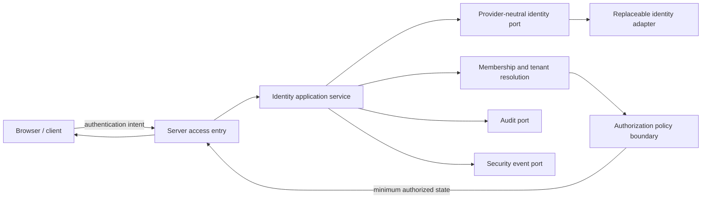
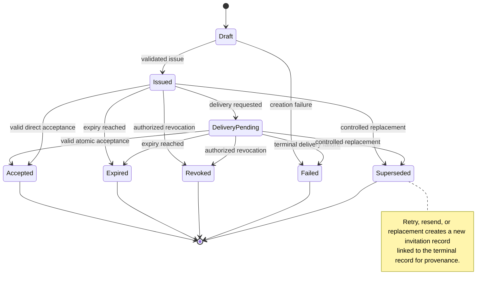

# Foundation V1 Identity and Access Architecture

## 1. Document status

| Item | Status |
|---|---|
| Document type | Technical-discovery document |
| Implementation | **NOT AUTHORIZED** |
| Source branch | `rebuild/foundation-v1` |
| Analysis date | 22 July 2026 |
| Current application | Legacy prototype, not a production identity system |
| Authority | Product Owner Decisions 1–10 in [`OWNER_DECISIONS_FOUNDATION_V1.md`](./OWNER_DECISIONS_FOUNDATION_V1.md) are authoritative |
| Provider selection | No identity, email, database, or hosting provider has been selected or approved |
| Registration | Public self-registration is not authorized |
| Production release | Not authorized |

This is the identity/access discovery output delegated by [`FOUNDATION_V1_DISCOVERY_BASELINE.md`](./FOUNDATION_V1_DISCOVERY_BASELINE.md), sections 7, 8, and 12, and bounded by [`FOUNDATION_V1_TARGET_ARCHITECTURE.md`](./FOUNDATION_V1_TARGET_ARCHITECTURE.md), especially sections 5–11, 14, and 25. It does not authorize implementation.

## 2. Scope

This document defines provider-neutral architecture for:

- internal application user identity;
- external authentication identity;
- sign-in and sign-out;
- session creation, validation, expiration, renewal, and revocation;
- controlled invitations and invitation acceptance;
- first-account activation;
- password or credential recovery architecture;
- email-address verification;
- user and membership deactivation at the access boundary;
- tenant-suspension enforcement at access entry;
- privileged-access safeguards;
- security events and audit linkage;
- a replaceable identity port and adapter.

The following details are explicitly delegated:

| Delegated concern | Canonical document |
|---|---|
| Detailed tenant permission matrix, resource ownership, and policy composition | `FOUNDATION_V1_TENANCY_AUTHORIZATION.md` |
| Licensing, seat accounting/reservations, and entitlement semantics | `FOUNDATION_V1_LICENSING_ENTITLEMENTS.md` |
| Exact entities, fields, indexes, constraints, and migrations | `FOUNDATION_V1_DATA_MODEL.md` |
| Identity/email providers, regions, assessment, configuration, and exit | `FOUNDATION_V1_ENVIRONMENTS_PROVIDERS.md` |
| Threat monitoring, redaction, alerts, and incident boundaries | `FOUNDATION_V1_OBSERVABILITY_SECURITY.md` |

## 3. Non-goals

This document does not authorize or finalize:

- public self-registration;
- autonomous tenant creation;
- automatic checkout or payment collection;
- social login;
- passwordless login;
- passkeys or biometrics;
- enterprise SSO or identity federation;
- impersonation or delegated support login;
- final MFA policy;
- final password policy;
- final idle or absolute session duration;
- final identity provider;
- final email provider;
- final database schema;
- application-code changes.

Some items may remain future capabilities; others require explicit Product Owner approval before detailed design or implementation. Their inclusion as open decisions is not approval.

## 4. Verified current state

- **VERIFIED FACT:** No authentication dependency is declared in [`package.json`](./package.json) or as a direct dependency in [`package-lock.json`](./package-lock.json).
- **VERIFIED FACT:** No sign-in, sign-out, session validation, cookie/session handling, or provider identity integration is visible in `app/`.
- **VERIFIED FACT:** No internal user account model or persisted user state is visible.
- **VERIFIED FACT:** No invitation issue, delivery, acceptance, expiry, revocation, or recovery flow is visible.
- **VERIFIED FACT:** No tenant membership model is visible.
- **VERIFIED FACT:** No access middleware, protected Route Handler, Server Action authorization boundary, or protected route is visible.
- **VERIFIED FACT:** No password/credential recovery or email-verification flow is visible.
- **VERIFIED FACT:** No security or identity audit event implementation is visible.
- **VERIFIED FACT:** [`app/page.tsx`](./app/page.tsx) is a client-only prototype page whose tabs and operations are accessible without repository-visible identity or access checks.
- **INFERENCE:** Existing UI state cannot establish authenticated identity, membership, tenant, role, or permission authority.
- **PROPOSAL:** Introduce identity through the provider-neutral server boundary defined here only after separate implementation authorization.
- **UNKNOWN:** External Vercel settings, untracked identity services, linked accounts, credentials, and external access controls cannot be established from the repository.
- **UNKNOWN:** Authentication method, identity provider, session mechanism/store, email provider, MFA posture, and recovery mechanism remain pending.

These findings are consistent with [`PROJECT_AUDIT.md`](./PROJECT_AUDIT.md), sections 3, 8, and 9, and the verified baseline in [`FOUNDATION_V1_DISCOVERY_BASELINE.md`](./FOUNDATION_V1_DISCOVERY_BASELINE.md), section 3. No hidden infrastructure is assumed.

## 5. Identity principles

1. Authentication is distinct from authorization.
2. An external authenticated identity does not automatically receive application or tenant access.
3. An authenticated person must resolve to an active internal application user for protected access.
4. Tenant access requires an active compatible membership and server-resolved tenant context.
5. Public self-registration is denied.
6. Tenant selection from the client is untrusted and must be server-validated.
7. Role selection is never controlled by the invitee during acceptance.
8. Invitations are tenant-bound, role-bound, single-use, expiring, revocable, and auditable.
9. Credentials, raw tokens, and recovery secrets never enter operational logs or audit payloads.
10. Every protected request requires server-side session validation.
11. Missing or invalid identity/access facts result in denial by default.
12. Account or membership deactivation revokes the corresponding access.
13. Tenant suspension blocks normal tenant access while preserving authorized Platform Owner control.
14. Audit history, ownership references, documents, and operational history survive deactivation.
15. External provider identifiers never replace internal domain identifiers.
16. Provider-specific claims are normalized at the identity adapter boundary.
17. Users, sessions, adapters, and administrators operate with least privilege.
18. Failure states are explicit and safe.
19. Account linking never occurs silently.

## 6. Identity entities and boundaries

The following are conceptual entities, not schema or table definitions.

| Concept | Purpose | Authoritative owner | Lifecycle | Tenant scope | Sensitivity | Prohibited use |
|---|---|---|---|---|---|---|
| External authentication identity | Represent a verified identity at the approved identity boundary. | Identity adapter/provider boundary. | Linked, changed, disabled, unlinked under approved policy. | Not inherently tenant-scoped. | High. | Acting as membership, role, or tenant authorization. |
| Internal application user | Stable application subject independent of provider. | Application identity domain. | Pending/active/inactive under approved model. | Platform-level identity; tenant access comes from memberships. | High. | Using email/provider ID as its immutable domain identity. |
| Verified email address | Record email ownership assurance and change history. | Application with identity/email ports. | Unverified, verified, changed, re-verification required. | User-associated; invitation is tenant-bound separately. | Personal/security data. | Sole authority for silent account linking. |
| Tenant | Define isolated customer-company access scope. | Tenancy domain. | Approved tenant status lifecycle. | It is the scope root. | Commercial/security-sensitive. | Client-selected authority or authentication credential. |
| Tenant membership | Bind a user to one tenant with status and role assignment references. | Membership/tenancy domain. | Pending, active, deactivated, revoked; exact states delegated. | Exactly one tenant per membership. | High. | Authentication credential or provider organization claim. |
| Platform role assignment | Grant approved platform-administration responsibility. | Platform authorization domain. | Assigned, changed, revoked with audit. | Platform scope with explicit target tenant for tenant actions. | Privileged. | Uncontrolled bypass of policy, tenancy, or audit. |
| Tenant role assignment | Associate approved tenant role intent/assignment. | Tenant authorization domain. | Assigned, changed, revoked. | One tenant context. | Privileged. | Replacing granular permission evaluation. |
| Invitation | Authorize one controlled onboarding attempt for one tenant and role. | Invitation domain. | State machine in section 11. | Exactly one tenant. | High. | Public signup, reusable onboarding, or invitee-chosen role. |
| Session | Represent a validated authentication continuity context. | Application plus identity/session port. | Created, renewed/rotated, expired, revoked, terminated. | Tenant context is selected/resolved separately. | Critical. | Permanent authorization cache or storage of raw credentials. |
| Session revocation record | Deny a session or authorization version before natural expiry. | Application security boundary. | Active until enforcement horizon expires. | User/platform/tenant scope as applicable. | High. | Audit replacement or unrestricted tracking. |
| Security event | Record operational identity/security outcome for detection. | Security/observability boundary. | Append/retain under pending policy. | Tenant context where safely known. | Controlled. | Full credential/token/provider payload. |
| Audit event | Preserve accountable business/privileged identity action. | Audit domain. | Append-oriented under approved retention/access policy. | Explicit tenant or platform scope. | Controlled evidence. | Debug log, mutable identity state, or raw secret storage. |

## 7. Provider-neutral identity architecture

### Identity-port capabilities

The identity port defines capabilities to initiate authentication, validate an authentication result, resolve an external identity, obtain verified identity attributes, terminate a session, request revocation where supported, trigger approved recovery, verify email ownership, and report provider-neutral authentication outcomes.

### Boundary responsibilities

- **Application responsibilities:** resolve internal user and membership, enforce status/policy, control invitations, establish application session context, record required events, and deny invalid access.
- **Adapter responsibilities:** translate approved provider protocols/claims into normalized results; handle provider session/revocation/recovery capabilities; classify provider failures; expose no more attributes than required.
- **Prohibited leakage:** provider SDK types, raw provider tokens, provider organization/role semantics, provider-specific error payloads, and provider identifiers as internal primary identity.
- **Testing substitute:** deterministic fake adapter capable of success, denial, expiry, mismatch, outage, and revocation scenarios.
- **Replacement requirement:** application/domain contracts and internal identifiers remain stable when the adapter changes.
- **Provider exit:** identity links must be exportable/mappable under an approved migration; transition must prevent duplicate or silently linked accounts; verified deletion and credential/session handling require a later runbook.

No provider, authentication protocol, token format, SDK, session store, or hosting mechanism is selected.

## 8. Controlled access-entry flow

The normal access sequence is:

1. the user presents authentication credentials to the approved identity boundary;
2. the server validates the authentication result through the identity port;
3. the server resolves the external identity to an internal application user;
4. the server confirms that the internal user is active;
5. the server resolves platform assignment and available tenant memberships;
6. for tenant access, the server validates tenant status;
7. the server validates membership status;
8. the server establishes a minimal authorized session context;
9. the server records required security and audit events;
10. the client receives only minimum safe authorized state.

Successful authentication alone is insufficient for protected application access. A user without an active internal user record and required platform assignment or tenant membership is denied.

## 9. Platform Owner provisioning flow

An authorized Platform Owner / Super Admin may:

1. create or provision the customer tenant through a server use case;
2. establish its initial approved status;
3. record approved contract, licensing, seat-limit, and entitlement foundations;
4. invite or provision the first Tenant Admin;
5. bind the invitation to exactly one tenant and the approved Tenant Admin role;
6. record initiating actor, target, reason/context, time, and result;
7. use an expiring one-time invitation or separately approved provisioning path;
8. activate the Tenant Admin membership only after valid acceptance/provisioning validation;
9. preserve security and audit evidence.

Validation failures include unauthorized Platform Owner action, invalid tenant state, missing approved contractual foundation, incompatible identity/membership, invalid email, duplicate active invitation, invalid role, expired/revoked token, and concurrent acceptance. Failure is explicit and does not create partial membership or consume a seat incorrectly.

This flow implements no subscription checkout, payment collection, or autonomous tenant creation.

## 10. Tenant Admin invitation flow

A Tenant Admin may invite only authorized Sales Manager / Coordinator and Agent / Sales Operator users within the same tenant.

Before issuing an invitation, the server verifies:

- inviter identity and active internal user;
- active inviter membership;
- active/eligible tenant status;
- inviter permission for the requested action and role;
- applicable contract/license state;
- available licensed seat or approved reservation policy;
- requested role eligibility;
- syntactically and operationally valid email under the approved validation policy;
- absence of incompatible existing membership;
- absence or controlled supersession of duplicate active invitation;
- tenant-specific restrictions;
- relevant feature or entitlement restrictions.

The invitee cannot choose another tenant or role, increase privilege, bypass seat limits, reactivate a suspended tenant, or accept an expired, revoked, already-used, failed, or superseded invitation.

## 11. Invitation lifecycle state machine

`Draft` is conceptual and optional: it is useful only if the application persists an invitation before issuance. The exact enum and persistence representation remain delegated.

Accepted, Expired, Revoked, Failed, and Superseded are terminal for the individual invitation record. A terminal record remains immutable and is never reopened, returned to Issued, or moved into another operational state. Retry, resend, correction, or replacement creates a separately validated and audited invitation record with a new token, beginning its own normal creation and issuance lifecycle. The new record preserves conceptual provenance to the earlier record (for example, replaces, retries, supersedes, or originating invitation), but the exact persistence relationship is delegated to `FOUNDATION_V1_DATA_MODEL.md`. The old token remains invalid. Seat reservation is recalculated or explicitly transferred only under a later authorized transactional rule, and concurrency protection prevents duplicate active replacements for the same tenant, email, and intended role unless a later approved rule permits them.

| State | Allowed transitions | Initiating actor/process | Required server validation | Audit event | Terminal? | Seat effect | Retry behavior |
|---|---|---|---|---|---|---|---|
| Draft / Pending Creation | Issued, Failed | Authorized Platform Owner/Tenant Admin use case | Actor, tenant, role, email, membership, contract, entitlement, seat policy | Draft persistence only if approved; issuance attempt recorded | No | No seat consumption unless later reservation policy says otherwise | Correction/retry abandons or fails this attempt and creates a separately validated/audited invitation record |
| Issued | Delivery Pending, Accepted, Expired, Revoked, Superseded, Failed | Issuance service/system time/admin | Token verifier, tenant/role binding, validity window, current eligibility | InvitationIssued | No | Pending decision: none or reservation | Idempotent delivery/acceptance checks |
| Delivery Pending / Delivered | Accepted, Expired, Revoked, Superseded, Failed | Email adapter/system/user acceptance | Invitation still valid and bound; delivery result does not grant access | InvitationDelivered or DeliveryFailed | No | Preserve approved reservation semantics | Retry/resend creates a separately validated/audited invitation record and new token; idempotent status checks do not create another attempt |
| Accepted | None | Invitee through server acceptance | All section 13 checks and atomic membership result | InvitationAccepted | Yes | Seat becomes active/consumed as approved | No retry; replay is rejected and any later invitation requires a new record |
| Expired | None | Server time-based process or validation | Current time beyond approved expiry | InvitationExpired | Yes | Release reservation if applicable under the approved transactional rule | Resend creates a separately validated/audited invitation record and new token; this record remains Expired |
| Revoked | None | Authorized administrator/system policy | Revocation permission and current nonterminal status | InvitationRevoked | Yes | Release reservation if applicable under the approved transactional rule | Replacement creates a separately validated/audited invitation record and new token; this record remains Revoked |
| Failed | None | Application/adapter | Failure classification, no partial membership, eligibility recheck | InvitationFailed | Yes | Release or explicitly reconcile reservation under the approved transactional rule | Retry creates a separately validated/audited invitation record and new token; this record remains Failed |
| Superseded | None | Authorized resend/correction/replacement workflow while the prior invitation is nonterminal | A separate replacement invitation is created, uniqueness is enforced, provenance is linked, and the prior token is invalidated | InvitationSuperseded and replacement-creation audit evidence | Yes | Recalculate or atomically transfer reservation; never reserve twice | Only the separately created replacement record may proceed; this record remains Superseded |

## 12. Invitation token security

Invitation tokens require:

- cryptographically strong generation by an approved server-side mechanism;
- one-time use and atomic invalidation;
- approved expiration and server-side time validation;
- revocation before acceptance;
- binding to one invitation, tenant, email intent, and approved role;
- no trust in client tenant/role parameters;
- no raw-token storage where avoidable;
- hashed or otherwise safely verifiable server representation;
- replay detection and rejection;
- non-enumerable identifiers and responses;
- safe errors that do not disclose account or invitation existence unnecessarily;
- audit/security events without token material;
- invalidation on acceptance;
- invalidation or supersession after email or role change;
- bounded, auditable resend behavior;
- invalidation of prior tokens when superseded;
- a new invitation record and new token for every retry, resend, correction, or replacement;
- immutable terminal invitation records and retained cross-record provenance;
- separate validation and audit of replacement creation;
- concurrency control preventing duplicate active replacements for the same tenant, email, and intended role;
- explicit seat-reservation recalculation or authorized transactional transfer without double reservation.

No cryptographic library, algorithm implementation, token format, encoding, or delivery mechanism is prescribed here.

## 13. Invitation acceptance

The server-controlled sequence is:

1. receive and safely parse the token without logging it;
2. resolve and verify the token representation;
3. validate invitation status, expiry, revocation, replay, and supersession;
4. verify intended email ownership through the approved identity boundary;
5. load the invitation-bound tenant and role; ignore client alternatives;
6. recheck tenant status, contract/license state, restrictions, and entitlements;
7. recheck seat availability or the validity of an approved reservation;
8. resolve the authenticated external identity and internal user;
9. apply the approved account-linking policy; reject ambiguity or mismatch;
10. create/activate the compatible membership and role assignment;
11. mark the invitation accepted in the same atomic consistency boundary;
12. consume/reserve the seat consistently;
13. emit security and audit events;
14. establish a fresh authenticated session or require reauthentication under the approved policy.

Concurrent acceptance and seat allocation must have uniqueness/concurrency protection. A successful membership cannot coexist with a reusable invitation. Partial failures must roll back or enter an explicit recoverable state. The exact transaction, records, constraints, and storage are delegated to `FOUNDATION_V1_DATA_MODEL.md`.

## 14. Existing-user invitation cases

| Case | Expected decision | Automatic linking? | Required server validation | Audit | Pending Product Owner decision |
|---|---|---|---|---|---|
| Active user invited to another tenant | Block unless future multi-tenant membership is explicitly approved; do not assume compatibility. | No | Identity match, existing memberships, approved multi-tenant policy, tenant/role/seat checks | Attempt and outcome | Future multi-tenant membership support |
| User already in same tenant | Reject duplicate or route to an approved role-change workflow. | No new membership | Membership status, requested role, inviter permission | Duplicate/role-change attempt | Exact role-change-before-acceptance behavior |
| Inactive internal user | Do not reactivate silently; require approved reactivation/recovery path. | No | User status, reason, identity assurance, admin authority | Attempt and disposition | Reactivation authority/workflow |
| Conflicting membership | Reject pending explicit resolution. | No | Conflict definition, tenant, assignment and role policy | Conflict event | Exact incompatibility rules |
| Existing Platform Owner account | Do not create tenant membership automatically. | No | Platform assignment, separation-of-duties policy | Privileged mismatch event | Whether dual platform/tenant roles are ever allowed |
| Email matches a different external identity | Reject automatic linking and escalate through approved recovery. | No | Verified email, identity-link history, assurance, compromise indicators | IdentityMismatch | Account-linking and identity-proofing policy |
| Duplicate invitation | Reject, or create a separately validated replacement and mark the still-nonterminal prior record Superseded through the controlled resend policy. Terminal records are never reopened. | No | Active invitation/replacement uniqueness, inviter permission, role/email equality, old-token invalidation, seat reconciliation | Duplicate attempt, InvitationSuperseded, and replacement creation | Resend limits, provenance, and supersession rules |
| Tenant suspended before acceptance | Block acceptance without deleting invitation/history; later behavior pending. | No | Current tenant status | TenantAccessBlocked | Whether invitation remains pending or is revoked/superseded |
| Seat limit reached before acceptance | Block acceptance; no default overage. | No | Current seat/reservation state and concurrency guard | SeatUnavailable | Reservation timing and wait/retry policy |

## 15. Membership activation boundary

Invitation acceptance proves a valid controlled onboarding action; it does not by itself define all tenant authorization.

Conceptual outcomes are:

- authenticated user with no valid membership: no tenant access;
- membership pending: no normal tenant access;
- membership active: eligible for policy evaluation, not automatic permission;
- membership deactivated: access blocked and seat released where applicable;
- membership suspended by tenant state: normal access blocked while data/membership is preserved;
- membership blocked by license or seat state: access denied under approved policy;
- membership revoked: access denied and relevant sessions invalidated/re-evaluated.

Exact membership states, transitions, roles, permissions, resource assignments, and policy effects are finalized in `FOUNDATION_V1_TENANCY_AUTHORIZATION.md`, not here.

## 16. Session architecture

Provider-neutral sessions require:

- validation on the server for every protected request;
- opaque or protected session identifier handling;
- secure cookie or equivalent protected transport appropriate to the approved architecture;
- explicit expiration;
- idle versus absolute expiration as a pending decision;
- controlled renewal and rotation;
- server/application revocation capability;
- ordinary sign-out;
- logout from all devices as a pending capability;
- invalidation/re-evaluation after user or membership deactivation;
- tenant-suspension checks at request entry, not only session creation;
- privilege-change versioning or re-evaluation;
- fresh-session or reauthentication behavior after invitation acceptance as pending policy;
- protected-route checks;
- CSRF defenses where ambient credentials or equivalent request conditions require them;
- replay resistance;
- correlation with redacted security/audit events.

No token format, cookie library, identity/session provider, session store, persistence model, or duration is selected.

## 17. Session context

The minimum conceptual trusted server-side context may include:

- internal user identifier;
- normalized external identity reference;
- authentication time;
- session identifier/reference;
- current internal-user active status or revocation version;
- platform assignment references;
- available active tenant membership references;
- selected operational tenant only after explicit validation;
- authorization version/revocation marker;
- security assurance level when available from an approved normalized boundary.

Client-supplied role and tenant claims are untrusted. Permissions and ownership must be resolved or validated server-side. Sensitive authorization data is not exposed unnecessarily. Tenant switching, if allowed by a future approved multi-tenant model, requires explicit server validation of membership, tenant state, entitlement, and session policy. Token contents are not finalized here.

## 18. Sign-out and revocation

| Trigger | Revocation scope | Enforcement | Audit event | Security event | Recovery path |
|---|---|---|---|---|---|
| Ordinary sign-out | Current application session | Immediate application-side invalidation where possible | SignOut | SessionTerminated | New sign-in |
| Natural expiration | Expired session | Immediate at next validation; no renewal beyond policy | Optional aggregate/required where policy says | SessionExpired | New sign-in |
| Administrator-forced revocation | Selected user/session set | Immediate application revocation; provider revocation where supported | SessionRevokedByAdmin | PrivilegedRevocation | Approved reauthentication/reactivation |
| User deactivation | All application access for user | Immediate policy denial and session invalidation/re-evaluation | AccountDeactivated | AccessRevoked | Approved reactivation |
| Membership deactivation | That tenant membership/session context | Immediate tenant denial | MembershipDeactivated | TenantAccessRevoked | Approved membership activation |
| Tenant suspension | Normal access for all tenant memberships | Immediate at access entry and next request | TenantSuspended reference | TenantAccessBlocked | Platform Owner reinstatement under policy |
| Credential compromise | Affected/all user sessions | Immediate revocation, provider action if supported | CredentialCompromiseAction | CompromiseDetected | Approved recovery and fresh authentication |
| Role/privilege reduction | Affected authorization contexts | Immediate version/policy re-evaluation | RoleOrPermissionChanged | StalePrivilegeRejected | Continue with reduced privilege or reauthenticate |
| Provider-side revocation | Provider session/credential scope | Adapter detects/validates; application denies | ProviderRevocationObserved where required | AuthenticationRevoked | Approved sign-in/recovery |
| Application-only revocation | Internal session independent of provider | Immediate on server | ApplicationSessionRevoked | SessionRejected | New approved session |

## 19. Account deactivation

Approved consequences of deactivation are:

- access is blocked;
- an active licensed seat is released where applicable;
- audit history and ownership references remain;
- documents, activities, and operational history are not deleted;
- documents are not automatically archived or deleted.

State boundaries remain distinct:

- **User deactivation:** disables the internal application user across applicable access scopes.
- **Membership deactivation:** disables access to one tenant while preserving the internal user and history.
- **External identity disablement:** prevents or invalidates provider authentication but is not the application membership record.
- **Tenant suspension:** blocks normal access for tenant users without deleting users, memberships, or tenant data.

No state silently implies another; orchestration must record explicit transitions and revocation effects.

## 20. Tenant suspension at access entry

| Status | Architectural treatment |
|---|---|
| Active | **APPROVED concept:** normal access remains subject to active user, membership, permission, license, seat, entitlement, and ownership checks. |
| Grace | **PROPOSAL:** named commercial status only; semantics remain pending and cannot grant access by assumption. |
| Restricted | **PROPOSAL:** named restricted status only; allowed actions remain pending and deny-by-default applies. |
| Suspended | **APPROVED:** normal tenant use is blocked; data, users, and memberships remain; Platform Owner control remains policy-controlled and audited. |
| Reinstated | **APPROVED transition:** access may resume after server-side state change and full policy/session re-evaluation. |

Sessions must re-evaluate tenant status at protected entry, not rely on stale client/session claims. Suspension never creates client-side bypass, destroys memberships, deletes users, or deletes documents. Detailed contract/payment/grace/restriction semantics belong to `FOUNDATION_V1_LICENSING_ENTITLEMENTS.md` and require Product Owner approval.

## 21. Recovery and credential-reset architecture

Provider-neutral recovery requires:

- server-controlled initiation through the identity boundary;
- verification of email ownership or another separately approved assurance method;
- strong, one-time, expiring, revocable recovery link/token or equivalent mechanism;
- no raw recovery-token logging or avoidable raw storage;
- safe responses that prevent account enumeration;
- invalidation/re-evaluation of existing sessions after credential reset under approved policy;
- security-event recording for initiation, completion, rejection, and suspicious activity;
- stronger controls and review for privileged accounts;
- an escalation path for suspected compromise without uncontrolled support impersonation.

**PENDING DECISION:** final mechanism, token duration, support-assisted recovery, identity-proofing requirements, provider capability, privileged recovery, and logout-all behavior remain unresolved.

## 22. Email-address handling

- Normalize email for comparison according to a documented, conservative policy without rewriting addresses beyond justified rules.
- Require verified ownership before binding an invitation or identity where the approved flow requires it.
- Treat case behavior and provider-specific mailbox equivalence conservatively; do not assume all domains behave identically.
- Global versus tenant-scoped uniqueness is pending.
- Email change requires authenticated/authorized initiation, verification of the new address, security notification/event, and audit where accountable.
- Pending invitations bound to an old email are invalidated or, while still nonterminal, marked Superseded under an approved rule; any corrected invitation is a new record with a new token and provenance to the prior record.
- Email change never silently links a different external identity.
- Internal user identity remains stable independently of email.

Exact normalization, uniqueness, change, and linking rules are delegated to `FOUNDATION_V1_DATA_MODEL.md` and require Product Owner/security review where they affect access behavior.

## 23. Multi-factor authentication boundary

No final MFA mechanism or requirement is selected. Stronger authentication may later be required for:

- Platform Owner access;
- privileged Tenant Admin user-management operations;
- provider or region changes;
- sensitive entitlement/contract changes;
- sensitive document access;
- account/security recovery;
- Production administrative operations.

Pending decisions include which actors/actions require MFA, enrollment/recovery requirements, assurance levels, enforcement timing, emergency fallback, and provider support. This document does not implement or select authenticator apps, SMS, email OTP, passkeys, biometrics, or hardware keys.

## 24. Privileged access safeguards

Platform Owner, Tenant Admin, any future technical-support access, and emergency access require:

- explicit server authorization;
- least privilege and purpose limitation;
- explicit platform/tenant target scope;
- audit and security events;
- no invisible bypass;
- no uncontrolled impersonation;
- session revalidation or stronger authentication for sensitive actions when later approved;
- separation between platform administration and customer-data access;
- bounded duration and review for any future emergency capability.

Platform Owner access is not an authorization, tenancy, privacy, or audit bypass. Impersonation, delegated support login, and technical-support customer access remain unapproved.

## 25. Route and API protection model

| Category | Authentication | Membership | Tenant state | Permission | Request integrity | Audit | Safe failure |
|---|---|---|---|---|---|---|---|
| Public routes | None, but only explicitly approved content | None | None | None | Input/rate/redirect safety | Security events where relevant | Do not disclose accounts/resources |
| Invitation routes | Authentication may be required by phase; token is not full access | Resolved/created only after acceptance | Rechecked | Invitation action policy | Token/replay/CSRF controls as applicable | Issue/accept/revoke outcomes | Generic invalid/expired response |
| Authentication routes | Identity-boundary controls | None for authentication itself | Checked before tenant entry | None until app resolution | CSRF/open-redirect/replay controls | Security event; audit for accountable changes | Non-enumerating response |
| Authenticated routes | Valid server session | Not always, unless tenant content | If tenant-bound | Required for protected action | CSRF/request validation as applicable | Privileged changes | Explicit denial |
| Tenant-protected routes | Valid server session | Active compatible membership | Eligible current status | Granular policy and ownership | CSRF/request validation | Required protected actions | Deny without cross-tenant disclosure |
| Platform-administration routes | Valid privileged session | Platform assignment, not implicit tenant membership | Target tenant resolved explicitly | Platform permission | Strong request/revalidation controls | Always for privileged actions | Explicit audited denial |
| Server-only internal operations | Service/job identity or trusted invocation | Tenant context where applicable | Rechecked before mutation | Capability-specific policy | Signed/controlled invocation and replay resistance | Required effects | No public diagnostic leakage |
| Background-job entry points | No browser authority; trusted job claim | Explicit tenant/resource context | Rechecked | Job capability | Idempotency and invocation integrity | Job and business events | Redacted retry/permanent failure |

Framework middleware, Route Handler, Server Action, cookie, and API implementation choices are not specified.

## 26. Security and audit events

| Event category | Events | Security log | Audit | Context and redaction requirements |
|---|---|---|---|---|
| Authentication | Succeeded, Failed | Required with controlled reason/outcome | Audit only where accountable policy requires | Actor/identity reference, result, correlation; no credentials/provider token |
| Session | Created, Renewed, Revoked, Expired, Sign-out | Required | Revocation/admin actions audited | Session reference, actor, scope, result; no raw session identifier if unsafe |
| Invitation | Issued, DeliveryFailed, Accepted, Expired, Revoked, ReplayAttempted, Superseded, ReplacementCreated | Required | Required for state-changing/accountable events, including separately created replacements | Tenant, actor, target reference, approved role intent, result, and cross-record provenance; no raw token |
| Account | Activated, Deactivated, ReactivationAttempted | Required | Required | Actor, target user, platform/tenant scope, result; minimize email |
| Membership | Activated, Deactivated, Revoked, ConflictDetected | Required | Required | Tenant, actor, user/membership, role reference, result |
| Tenant access | AccessBlocked, SuspensionObserved, ReinstatementObserved | Required | State change audited; denial per approved policy | Tenant, actor, reason category; no sensitive resource details |
| Privileged access | Attempted, Allowed, Denied, Revalidated | Required | Required | Privileged actor, target scope, purpose/result; no invisible access |
| Recovery | Initiated, Completed, Failed, AbuseSuspected | Required | Account-changing completion/privileged action audited | Actor/target reference, result; non-enumerating and token-free |
| Email | VerificationRequested, Verified, Changed, ChangeRejected | Required | Email change audited | User/actor, result; redact/minimize address according to policy |
| Identity mismatch | SuspiciousIdentityMismatch, LinkingRejected | Required and alertable | Audit when linked to accountable workflow | Internal/external references, assurance/result; no provider diagnostics |

Exact event names, schema, retention, severity, and audit inclusion are delegated to `FOUNDATION_V1_OBSERVABILITY_SECURITY.md` and `FOUNDATION_V1_AUDIT_RETENTION.md`.

## 27. Error model

| Category | Safe outcome |
|---|---|
| Invalid authentication | Generic authentication failure; no account existence disclosure. |
| Inactive user | Access denied with safe support guidance if approved. |
| No membership | No tenant access; avoid disclosing tenant/resource details. |
| Suspended tenant | Normal access blocked with approved safe status message. |
| Invalid invitation | Generic unusable-invitation response. |
| Expired invitation | Safe expiry response and approved new-invitation path. |
| Revoked invitation | Generic unusable-invitation response. |
| Already accepted invitation | Reject replay; direct authenticated user to valid access only if authorized. |
| Seat unavailable | Deny acceptance without revealing unnecessary commercial details. |
| Incompatible membership | Deny and route to authorized administration. |
| Identity mismatch | Deny linking/acceptance and invoke recovery/security path. |
| Recovery failure | Generic response preventing enumeration. |
| Session expired | Require fresh authentication; do not preserve stale privilege. |
| Insufficient privilege | Explicit denial without protected resource leakage. |
| Infrastructure failure | Safe temporary failure with retry category where applicable. |

Every error has a correlation identifier, user-safe message, and redacted operational detail. No error exposes raw tokens, account existence unnecessarily, provider diagnostics, credentials, stack traces, tenant-confidential data, or internal policy detail.

## 28. Identity threats and mitigations

| Threat | Cause | Consequence | Preventive control | Detection | Implementation gate | Related discovery document |
|---|---|---|---|---|---|---|
| Account enumeration | Different public responses/timing | User discovery and targeted attack | Uniform safe responses, rate controls, minimized timing differences | Failure-pattern metrics | Enumeration tests pass | `FOUNDATION_V1_OBSERVABILITY_SECURITY.md` |
| Invitation-token theft | Token leakage in logs/referrers/storage | Unauthorized onboarding | Secret handling, short approved lifetime, one-time use, safe delivery | Replay/location/anomaly events | Token leakage review and acceptance tests | `FOUNDATION_V1_TESTING_RELEASE.md` |
| Invitation replay | Non-atomic or reusable acceptance | Duplicate/unauthorized membership | Atomic consumption, unique acceptance, replay rejection | InvitationReplayAttempted | Concurrent replay tests pass | `FOUNDATION_V1_DATA_MODEL.md` |
| Invitation privilege escalation | Client changes tenant/role | Excess privilege/cross-tenant access | Server-bound invitation facts and role eligibility | Tampering security event | Role/tenant tampering tests pass | `FOUNDATION_V1_TENANCY_AUTHORIZATION.md` |
| Tenant substitution | Client-selected tenant trusted | Cross-tenant access | Membership-based server resolution and explicit switch validation | Cross-tenant denial telemetry | Isolation suite passes | `FOUNDATION_V1_TENANCY_AUTHORIZATION.md` |
| Unsafe account linking | Email/provider match treated as sufficient | Account takeover | Explicit linking policy, identity assurance, no silent linking | IdentityMismatch events | Conflict cases pass | `FOUNDATION_V1_DATA_MODEL.md` |
| Session fixation | Session not rotated at privilege/auth change | Attacker retains session | Rotation/fresh session at approved transitions | Session anomaly detection | Fixation tests pass | `FOUNDATION_V1_TESTING_RELEASE.md` |
| Session theft | Cookie/token exposure | Unauthorized access | Protected transport, least exposure, revocation, replay controls | Session anomaly/revocation events | Session security tests pass | `FOUNDATION_V1_OBSERVABILITY_SECURITY.md` |
| Stale privilege | Role/permission change not re-evaluated | Continued excessive access | Authorization version or server policy re-resolution | Rejected stale-context event | Privilege-change tests pass | `FOUNDATION_V1_TENANCY_AUTHORIZATION.md` |
| Access after deactivation | Session remains trusted | Unauthorized continued use | Immediate application revocation/status validation | Post-deactivation denial monitoring | Deactivation tests pass | `FOUNDATION_V1_TESTING_RELEASE.md` |
| Access after suspension | Tenant state cached/stale | Suspended tenant use | Access-entry tenant-state validation and cache invalidation | TenantAccessBlocked events | Suspension suite passes | `FOUNDATION_V1_LICENSING_ENTITLEMENTS.md` |
| CSRF | Ambient session used by attacker | Unauthorized action | Request-integrity controls appropriate to session architecture | Invalid-origin/token events | CSRF tests for affected routes | `FOUNDATION_V1_TESTING_RELEASE.md` |
| Open redirect | Unvalidated return destination | Credential phishing/token leakage | Allowlisted/internal destinations | Rejected redirect events | Redirect tests pass | `FOUNDATION_V1_OBSERVABILITY_SECURITY.md` |
| Brute force | Unbounded authentication/recovery attempts | Account compromise/outage | Adapter/provider-neutral throttling capability and alerting | Attempt-rate monitoring | Abuse-control tests pass | `FOUNDATION_V1_OBSERVABILITY_SECURITY.md` |
| Recovery abuse | Weak proof or reusable recovery token | Account takeover | One-time expiry, safe proof, revocation, privileged controls | RecoveryAbuseSuspected | Recovery adversarial tests pass | `FOUNDATION_V1_TESTING_RELEASE.md` |
| Provider outage | External identity boundary unavailable | Sign-in/recovery disruption | Explicit failure state, bounded retries, operational runbook | Availability/error monitoring | Failure-mode tests and runbook approved | `FOUNDATION_V1_ENVIRONMENTS_PROVIDERS.md` |
| Audit omission | Event path bypasses audit | Untraceable privileged action | Central use cases and required-event contract | Audit reconciliation/coverage tests | Required-event suite passes | `FOUNDATION_V1_AUDIT_RETENTION.md` |
| Privileged-access abuse | Broad/unlogged admin capability | Tenant data misuse | Least privilege, explicit target/purpose, revalidation, audit | Privileged access monitoring | Privileged policy tests pass | `FOUNDATION_V1_OBSERVABILITY_SECURITY.md` |

## 29. Testing strategy

Required tests include:

- access without authentication;
- successful authentication without an internal application user;
- inactive user denial;
- authenticated user without membership;
- cross-tenant denial;
- tenant suspension and reinstatement re-evaluation;
- invitation issuance validation;
- invitation expiration and revocation;
- one-time acceptance and replay rejection;
- concurrent duplicate acceptance;
- role and tenant parameter tampering;
- concurrent seat race;
- duplicate invitation and supersession;
- terminal invitation immutability and creation of a new record/token for retry, resend, correction, or replacement;
- preservation of replacement provenance and rejection of the old token;
- concurrency protection against duplicate active replacements and double seat reservation;
- account-linking conflicts and identity mismatch;
- session expiration, renewal, rotation, and revocation;
- deactivation and privilege reduction;
- recovery enumeration protection and token reuse rejection;
- safe error/redaction behavior;
- required audit/security event generation;
- identity-adapter contract behavior;
- provider outage, timeout, failure classification, and retry behavior.

Core domain, invitation, access-entry, session-policy, error, audit-event, and threat tests must execute against deterministic substitutes without a real external identity or email provider. Exact tools and release gates belong to `FOUNDATION_V1_TESTING_RELEASE.md`.

## 30. Data requirements delegated to the data model

Conceptual persistence requirements include:

- internal user;
- external identity link and normalized provider reference;
- verified email and verification/change facts;
- invitation and invitation state;
- safely verifiable invitation-token representation;
- conceptual provenance between a replacement invitation and its originating terminal or superseded record, without finalizing the relationship name;
- session and revocation marker/version;
- tenant membership;
- platform/tenant role assignment references;
- user and membership status;
- security event and audit event references;
- creation, update, expiry, acceptance, revocation, deactivation, and security timestamps;
- initiating actor and target;
- explicit tenant/platform context;
- idempotency/concurrency facts for acceptance and seat coordination.

No table, field, enum, index, constraint syntax, or storage engine is finalized. `FOUNDATION_V1_DATA_MODEL.md` owns the exact model.

## 31. Dependencies and delegated decisions

| Canonical document | Questions delegated | Inputs supplied here | Decisions still pending | Implementation status |
|---|---|---|---|---|
| `FOUNDATION_V1_TENANCY_AUTHORIZATION.md` | Permission matrix, ownership, role changes, tenant switching, privileged policy. | Identity/member/session boundaries, invitation role intent, denial rules. | Exact permissions, assignments, multi-tenant behavior. | **NOT AUTHORIZED** |
| `FOUNDATION_V1_LICENSING_ENTITLEMENTS.md` | Seat reservation/release, commercial states, grace/restriction/suspension semantics. | Access-entry and acceptance enforcement points. | Reservation timing, status effects, limits. | **NOT AUTHORIZED** |
| `FOUNDATION_V1_DATA_MODEL.md` | Exact identity, link, invitation, membership, session, event schema and constraints. | Conceptual entities, lifecycle, atomicity, uniqueness, concurrency needs. | Schema, database/access technology, email uniqueness. | **NOT AUTHORIZED** |
| `FOUNDATION_V1_ENVIRONMENTS_PROVIDERS.md` | Provider/region/configuration/assessment/exit for identity and email. | Required port capabilities, isolation, test substitute, exit concerns. | Providers, regions, transfer and operational approval. | **NOT AUTHORIZED** |
| `FOUNDATION_V1_TESTING_RELEASE.md` | Test tools, fixtures, CI gates, Preview/Production verification. | Identity test inventory, adapter contracts, implementation gates. | Exact tools/checks/reviewers. | **NOT AUTHORIZED** |
| `FOUNDATION_V1_OBSERVABILITY_SECURITY.md` | Threat model detail, redaction, alerts, incident/recovery monitoring. | Events, errors, threats, privileged boundaries. | Provider, retention, severity, incident workflow. | **NOT AUTHORIZED** |
| `FOUNDATION_V1_IMPLEMENTATION_ROADMAP.md` | Sequencing, commits, acceptance gates, first PR. | Approved-candidate identity boundaries and blocking decisions. | Architecture approval and code-change authorization. | **NOT AUTHORIZED** |

## 32. Open identity and access decisions

| Pending decision | Why it matters | Decision deadline | Blocks discovery? | Blocks implementation? | Required approver |
|---|---|---|---|---|---|
| Identity provider | Determines adapter capabilities, regions, sessions, recovery, and exit. | Before adapter/integration implementation | No | Yes | Product Owner with technical/security/privacy review |
| Authentication methods | Defines supported credential/assurance flows. | Before identity flow implementation | No | Yes | Product Owner with security review |
| MFA policy | Defines actors/actions requiring stronger assurance. | Before privileged operational access | No | Yes for affected access | Product Owner with security review |
| Session duration | Controls usability and exposure window. | Before session implementation | No | Yes | Product Owner with security/technical review |
| Session storage/mechanism | Determines revocation, scale, and failure behavior. | Before session implementation | No | Yes | Technical reviewer; Product Owner if provider decision |
| Logout-all-devices capability | Determines compromise response. | Before recovery/session acceptance | No | Partly | Product Owner with security review |
| Email uniqueness scope | Affects linking, invitations, and multi-tenant identity. | Before exact data model | Partly | Yes | Product Owner with technical/security review |
| Multi-tenant user membership | Controls whether one user can join multiple tenants. | Before membership matrix/schema | Partly | Yes | Product Owner |
| Account-linking policy | Prevents takeover and duplicate users. | Before invitation acceptance implementation | Partly | Yes | Product Owner with security review |
| Support-assisted recovery | Defines support authority and identity proof. | Before operational recovery | No | Yes if offered | Product Owner with security/privacy review |
| Privileged-account recovery | Controls high-impact recovery. | Before Platform Owner Production access | No | Yes | Product Owner with security review |
| Invitation duration | Controls token exposure and user experience. | Before invitation implementation | No | Yes | Product Owner with security/technical review |
| Seat reservation timing | Controls invitation races and license capacity. | Before acceptance/data model | Partly | Yes | Product Owner |
| Invitation resend/supersession | Controls limits, new-record retry/resend, provenance, replacement validation, and seat handling while preserving the approved invariant that terminal records never reopen. | Before invitation implementation | No | Yes | Product Owner with technical review |
| Role change before acceptance | Determines whether invitation must be replaced. | Before invitation state model | Partly | Yes | Product Owner |
| Protected-route enforcement mechanism | Determines consistent server entry controls. | Before first protected route | No | Yes | Technical reviewer |
| Technical-support access | Defines whether any support access exists. | Before support tooling/operations | No | Yes if introduced | Product Owner with security/privacy review |
| Impersonation | High-risk capability currently unapproved. | Only before any future proposal/implementation | No | Yes if introduced | Product Owner with security/privacy review |
| Enterprise SSO/federation | Future authentication scope and tenant linking. | Deferred until product approval | No | No for Foundation V1 unless introduced | Product Owner |
| Passkeys/biometrics | Future authentication methods currently excluded. | Deferred until product approval | No | No for Foundation V1 | Product Owner with security review |

No pending matter is decided by this document.

## 33. Acceptance criteria

This document is ready for Product Owner architecture review when:

1. public registration and autonomous tenant creation are explicitly denied;
2. Platform Owner and Tenant Admin invitation flows are controlled and server-authoritative;
3. authentication results are validated at the server identity boundary;
4. authentication, internal user, membership, and authorization are distinct;
5. invitation tenant, email, and role bindings cannot be changed by the client;
6. token generation, verification, expiry, revocation, one-time use, replay, resend, replacement provenance, terminal immutability, and redaction requirements are explicit;
7. account linking defaults to denial on ambiguity and requires approved policy;
8. session validation, rotation/renewal, expiry, revocation, logout, and stale-privilege handling are defined;
9. deactivation immediately blocks relevant access while preserving history/ownership;
10. tenant suspension is rechecked at access entry and cannot be bypassed by stale session/client state;
11. recovery prevents enumeration, uses expiring one-time proof, records events, and protects privileged accounts;
12. errors/logs expose no credentials, raw tokens, provider diagnostics, or unnecessary account/tenant facts;
13. required security and audit event categories cover every privileged and lifecycle flow;
14. all provider-facing capabilities remain behind replaceable ports and no provider is selected;
15. core flows and threats are testable without external identity/email providers;
16. every unresolved decision has timing, blocking status, and approver;
17. implementation remains explicitly **NOT AUTHORIZED**.

Meeting these criteria supports review only and does not approve implementation.

## 34. Explicit non-authorizations

This document does not authorize:

- source-code changes;
- dependency installation or update;
- identity-provider selection or configuration;
- email-provider selection or configuration;
- database creation;
- schema migration;
- public registration;
- social login;
- enterprise SSO or identity federation;
- MFA activation;
- passkeys;
- biometrics;
- impersonation;
- delegated or technical-support access;
- real-user onboarding;
- real-document access or processing;
- Pull Request creation;
- merge into `main`;
- Production deployment or Production use;
- GitHub configuration;
- Vercel configuration.

No implementation action was performed while creating this document. Any code, dependency, provider, account, schema, configuration, onboarding, or deployment action requires separate authorization under Decision 10 and the controlled release workflow in Decision 9.
