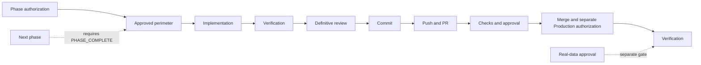
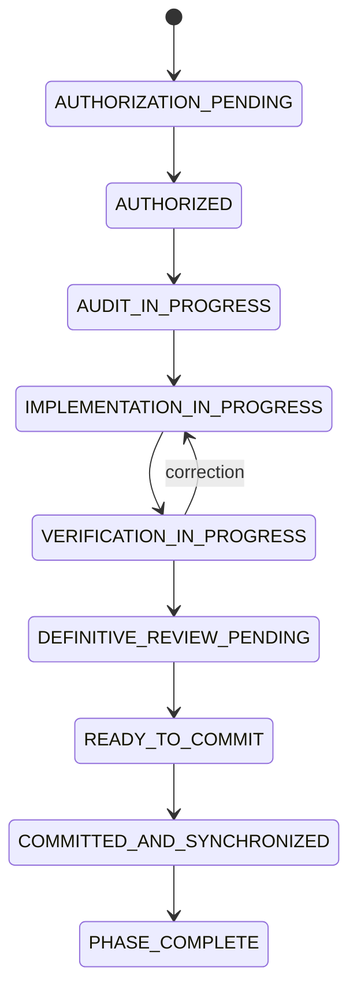

# Foundation V1 Implementation Roadmap

## 1. Document status

Title: Foundation V1 Implementation Roadmap. Analysis date: 2026-07-25. Branch `rebuild/foundation-v1`; HEAD `c72840961b28cba362e14b7d7b6649feb87b8043`; upstream synchronized behind 0/ahead 0; working tree clean; staging empty. Technical discovery and roadmap proposal only. Product Owner Decisions 1–10 are authoritative. Implementation, Production, real data, providers, frameworks, SDKs, schemas, migrations, services, routes, tests, workflows, and configuration are NOT AUTHORIZED.

## 2. Purpose

Define a complete, evidence-based possible implementation sequence for Foundation V1 without authorizing execution.

## 3. Scope

Sequencing identity, tenancy, authorization, licensing foundations, persistence, private storage, lifecycle, audit, retention, providers, testing, release, observability, operational security, migration readiness, and controlled release.

Decision 11 adds a future graphical validation sequence before functional comparison/PDF work; this remains outside Foundation V1 implementation.
## 4. Non-goals

No implementation, future interpretive capability, provider selection, code, dependency, configuration, schema, migration, test, workflow, environment, account, Preview, Production, real document, or customer data.

Logo/PDF comparison, extraction, calculations, reports, and real-document behavior remain non-goals and NOT AUTHORIZED.
## 5. Verified current repository state

| Subject | Classification | Repository evidence | Current result | Roadmap significance | Unresolved question |
|---|---|---|---|---|---|
| runtime stack | VERIFIED FACT | package.json, package-lock.json, and repository configuration | Repository evidence records the current prototype or absence of durable runtime stack implementation. | Runtime stack is a roadmap boundary only; it does not authorize implementation, Production, or real data. | Future runtime stack authority, mechanism, evidence, and approval remain pending. |
| package scripts | VERIFIED FACT | package.json, package-lock.json, and repository configuration | Repository evidence records the current prototype or absence of durable package scripts implementation. | Package scripts is a roadmap boundary only; it does not authorize implementation, Production, or real data. | Future package scripts authority, mechanism, evidence, and approval remain pending. |
| production dependencies | VERIFIED FACT | package.json, package-lock.json, and repository configuration | Repository evidence records the current prototype or absence of durable production dependencies implementation. | Production dependencies is a roadmap boundary only; it does not authorize implementation, Production, or real data. | Future production dependencies authority, mechanism, evidence, and approval remain pending. |
| development dependencies | VERIFIED FACT | package.json, package-lock.json, and repository configuration | Repository evidence records the current prototype or absence of durable development dependencies implementation. | Development dependencies is a roadmap boundary only; it does not authorize implementation, Production, or real data. | Future development dependencies authority, mechanism, evidence, and approval remain pending. |
| package lockfile | VERIFIED FACT | package.json, package-lock.json, and repository configuration | Repository evidence records the current prototype or absence of durable package lockfile implementation. | Package lockfile is a roadmap boundary only; it does not authorize implementation, Production, or real data. | Future package lockfile authority, mechanism, evidence, and approval remain pending. |
| application directory structure | VERIFIED FACT | app/page.tsx and repository tree | Repository evidence records the current prototype or absence of durable application directory structure implementation. | Application directory structure is a roadmap boundary only; it does not authorize implementation, Production, or real data. | Future application directory structure authority, mechanism, evidence, and approval remain pending. |
| app/page.tsx client component | VERIFIED FACT | app/page.tsx and repository tree | Repository evidence records the current prototype or absence of durable app/page.tsx client component implementation. | App/page.tsx client component is a roadmap boundary only; it does not authorize implementation, Production, or real data. | Future app/page.tsx client component authority, mechanism, evidence, and approval remain pending. |
| browser FileReader | VERIFIED FACT | app/page.tsx and repository tree | Repository evidence records the current prototype or absence of durable browser FileReader implementation. | Browser filereader is a roadmap boundary only; it does not authorize implementation, Production, or real data. | Future browser FileReader authority, mechanism, evidence, and approval remain pending. |
| browser PDF.js from cdnjs | VERIFIED FACT | app/page.tsx and repository tree | Repository evidence records the current prototype or absence of durable browser PDF.js from cdnjs implementation. | Browser pdf.js from cdnjs is a roadmap boundary only; it does not authorize implementation, Production, or real data. | Future browser PDF.js from cdnjs authority, mechanism, evidence, and approval remain pending. |
| regular-expression CTE processing | VERIFIED FACT | app/page.tsx and repository tree | Repository evidence records the current prototype or absence of durable regular-expression CTE processing implementation. | Regular-expression cte processing is a roadmap boundary only; it does not authorize implementation, Production, or real data. | Future regular-expression CTE processing authority, mechanism, evidence, and approval remain pending. |
| current browser calculations | VERIFIED FACT | app/page.tsx and client prototype logic | The application performs client-side arithmetic and derived display calculations using hardcoded, mocked, simulated, parsed, or locally constructed inputs. | This is not a server-authoritative calculation engine, approved formula catalog, regulatory-rule implementation, tariff engine, simulation engine, correctness claim, commercial suitability claim, or governed reproducible evidence. | Formula authority, versions, provenance, units, effective dates, tax assumptions, regulatory rules, rounding, precision, evidence, validation, providers, and implementation remain PENDING and NOT AUTHORIZED. |
| hardcoded values | VERIFIED FACT | app/page.tsx and repository tree | Repository evidence records the current prototype or absence of durable hardcoded values implementation. | Hardcoded values is a roadmap boundary only; it does not authorize implementation, Production, or real data. | Future hardcoded values authority, mechanism, evidence, and approval remain pending. |
| mocked values | VERIFIED FACT | app/page.tsx and repository tree | Repository evidence records the current prototype or absence of durable mocked values implementation. | Mocked values is a roadmap boundary only; it does not authorize implementation, Production, or real data. | Future mocked values authority, mechanism, evidence, and approval remain pending. |
| simulated values | VERIFIED FACT | app/page.tsx and repository tree | Repository evidence records the current prototype or absence of durable simulated values implementation. | Simulated values is a roadmap boundary only; it does not authorize implementation, Production, or real data. | Future simulated values authority, mechanism, evidence, and approval remain pending. |
| locally parsed or constructed values | VERIFIED FACT | app/page.tsx and repository tree | Repository evidence records the current prototype or absence of durable locally parsed or constructed values implementation. | Locally parsed or constructed values is a roadmap boundary only; it does not authorize implementation, Production, or real data. | Future locally parsed or constructed values authority, mechanism, evidence, and approval remain pending. |
| hardcoded PUN values | VERIFIED FACT | app/page.tsx and repository tree | Repository evidence records the current prototype or absence of durable hardcoded PUN values implementation. | Hardcoded pun values is a roadmap boundary only; it does not authorize implementation, Production, or real data. | Future hardcoded PUN values authority, mechanism, evidence, and approval remain pending. |
| React browser-memory archive | VERIFIED FACT | app/page.tsx and repository tree | Repository evidence records the current prototype or absence of durable React browser-memory archive implementation. | React browser-memory archive is a roadmap boundary only; it does not authorize implementation, Production, or real data. | Future React browser-memory archive authority, mechanism, evidence, and approval remain pending. |
| client-side deletion | VERIFIED FACT | app/page.tsx and repository tree | Repository evidence records the current prototype or absence of durable client-side deletion implementation. | Client-side deletion is a roadmap boundary only; it does not authorize implementation, Production, or real data. | Future client-side deletion authority, mechanism, evidence, and approval remain pending. |
| reload data loss | VERIFIED FACT | app/page.tsx and repository tree | Repository evidence records the current prototype or absence of durable reload data loss implementation. | Reload data loss is a roadmap boundary only; it does not authorize implementation, Production, or real data. | Future reload data loss authority, mechanism, evidence, and approval remain pending. |
| authentication | VERIFIED FACT | app/page.tsx and repository tree | Repository evidence records the current prototype or absence of durable authentication implementation. | Authentication is a roadmap boundary only; it does not authorize implementation, Production, or real data. | Future authentication authority, mechanism, evidence, and approval remain pending. |
| server-authoritative session enforcement | VERIFIED FACT | app/page.tsx and repository tree | Repository evidence records the current prototype or absence of durable server-authoritative session enforcement implementation. | Server-authoritative session enforcement is a roadmap boundary only; it does not authorize implementation, Production, or real data. | Future server-authoritative session enforcement authority, mechanism, evidence, and approval remain pending. |
| tenants | VERIFIED FACT | app/page.tsx and repository tree | Repository evidence records the current prototype or absence of durable tenants implementation. | Tenants is a roadmap boundary only; it does not authorize implementation, Production, or real data. | Future tenants authority, mechanism, evidence, and approval remain pending. |
| memberships | VERIFIED FACT | app/page.tsx and repository tree | Repository evidence records the current prototype or absence of durable memberships implementation. | Memberships is a roadmap boundary only; it does not authorize implementation, Production, or real data. | Future memberships authority, mechanism, evidence, and approval remain pending. |
| roles | VERIFIED FACT | app/page.tsx and repository tree | Repository evidence records the current prototype or absence of durable roles implementation. | Roles is a roadmap boundary only; it does not authorize implementation, Production, or real data. | Future roles authority, mechanism, evidence, and approval remain pending. |
| permissions | VERIFIED FACT | app/page.tsx and repository tree | Repository evidence records the current prototype or absence of durable permissions implementation. | Permissions is a roadmap boundary only; it does not authorize implementation, Production, or real data. | Future permissions authority, mechanism, evidence, and approval remain pending. |
| customer assignments | VERIFIED FACT | app/page.tsx and repository tree | Repository evidence records the current prototype or absence of durable customer assignments implementation. | Customer assignments is a roadmap boundary only; it does not authorize implementation, Production, or real data. | Future customer assignments authority, mechanism, evidence, and approval remain pending. |
| document assignments | VERIFIED FACT | app/page.tsx and repository tree | Repository evidence records the current prototype or absence of durable document assignments implementation. | Document assignments is a roadmap boundary only; it does not authorize implementation, Production, or real data. | Future document assignments authority, mechanism, evidence, and approval remain pending. |
| licensing | VERIFIED FACT | app/page.tsx and repository tree | Repository evidence records the current prototype or absence of durable licensing implementation. | Licensing is a roadmap boundary only; it does not authorize implementation, Production, or real data. | Future licensing authority, mechanism, evidence, and approval remain pending. |
| seats | VERIFIED FACT | app/page.tsx and repository tree | Repository evidence records the current prototype or absence of durable seats implementation. | Seats is a roadmap boundary only; it does not authorize implementation, Production, or real data. | Future seats authority, mechanism, evidence, and approval remain pending. |
| entitlements | VERIFIED FACT | app/page.tsx and repository tree | Repository evidence records the current prototype or absence of durable entitlements implementation. | Entitlements is a roadmap boundary only; it does not authorize implementation, Production, or real data. | Future entitlements authority, mechanism, evidence, and approval remain pending. |
| feature authorization | VERIFIED FACT | app/page.tsx and repository tree | Repository evidence records the current prototype or absence of durable feature authorization implementation. | Feature authorization is a roadmap boundary only; it does not authorize implementation, Production, or real data. | Future feature authorization authority, mechanism, evidence, and approval remain pending. |
| persistence | VERIFIED FACT | app/page.tsx and repository tree | Repository evidence records the current prototype or absence of durable persistence implementation. | Persistence is a roadmap boundary only; it does not authorize implementation, Production, or real data. | Future persistence authority, mechanism, evidence, and approval remain pending. |
| database | UNKNOWN | Repository-visible files and configuration; hidden settings remain UNKNOWN. | No repository-visible implementation is proved; hidden settings remain UNKNOWN. | Database is a roadmap boundary only; it does not authorize implementation, Production, or real data. | Future database authority, mechanism, evidence, and approval remain pending. |
| private document storage | VERIFIED FACT | app/page.tsx and repository tree | Repository evidence records the current prototype or absence of durable private document storage implementation. | Private document storage is a roadmap boundary only; it does not authorize implementation, Production, or real data. | Future private document storage authority, mechanism, evidence, and approval remain pending. |
| non-interpretive document lifecycle | VERIFIED FACT | app/page.tsx and repository tree | Repository evidence records the current prototype or absence of durable non-interpretive document lifecycle implementation. | Non-interpretive document lifecycle is a roadmap boundary only; it does not authorize implementation, Production, or real data. | Future non-interpretive document lifecycle authority, mechanism, evidence, and approval remain pending. |
| durable audit evidence | VERIFIED FACT | app/page.tsx and repository tree | Repository evidence records the current prototype or absence of durable durable audit evidence implementation. | Durable audit evidence is a roadmap boundary only; it does not authorize implementation, Production, or real data. | Future durable audit evidence authority, mechanism, evidence, and approval remain pending. |
| retention jobs | VERIFIED FACT | app/page.tsx and repository tree | Repository evidence records the current prototype or absence of durable retention jobs implementation. | Retention jobs is a roadmap boundary only; it does not authorize implementation, Production, or real data. | Future retention jobs authority, mechanism, evidence, and approval remain pending. |
| deletion jobs | VERIFIED FACT | app/page.tsx and repository tree | Repository evidence records the current prototype or absence of durable deletion jobs implementation. | Deletion jobs is a roadmap boundary only; it does not authorize implementation, Production, or real data. | Future deletion jobs authority, mechanism, evidence, and approval remain pending. |
| provider governance | VERIFIED FACT | app/page.tsx and repository tree | Repository evidence records the current prototype or absence of durable provider governance implementation. | Provider governance is a roadmap boundary only; it does not authorize implementation, Production, or real data. | Future provider governance authority, mechanism, evidence, and approval remain pending. |
| provider-neutral adapters | VERIFIED FACT | app/page.tsx and repository tree | Repository evidence records the current prototype or absence of durable provider-neutral adapters implementation. | Provider-neutral adapters is a roadmap boundary only; it does not authorize implementation, Production, or real data. | Future provider-neutral adapters authority, mechanism, evidence, and approval remain pending. |
| CI configuration | UNKNOWN | Repository-visible files and configuration; hidden settings remain UNKNOWN. | No repository-visible implementation is proved; hidden settings remain UNKNOWN. | Ci configuration is a roadmap boundary only; it does not authorize implementation, Production, or real data. | Future CI configuration authority, mechanism, evidence, and approval remain pending. |
| repository-visible workflows | VERIFIED FACT | app/page.tsx and repository tree | Repository evidence records the current prototype or absence of durable repository-visible workflows implementation. | Repository-visible workflows is a roadmap boundary only; it does not authorize implementation, Production, or real data. | Future repository-visible workflows authority, mechanism, evidence, and approval remain pending. |
| branch protection | UNKNOWN | Repository-visible files and configuration; hidden settings remain UNKNOWN. | No repository-visible implementation is proved; hidden settings remain UNKNOWN. | Branch protection is a roadmap boundary only; it does not authorize implementation, Production, or real data. | Future branch protection authority, mechanism, evidence, and approval remain pending. |
| required checks | UNKNOWN | Repository-visible files and configuration; hidden settings remain UNKNOWN. | No repository-visible implementation is proved; hidden settings remain UNKNOWN. | Required checks is a roadmap boundary only; it does not authorize implementation, Production, or real data. | Future required checks authority, mechanism, evidence, and approval remain pending. |
| Preview controls | UNKNOWN | Repository-visible files and configuration; hidden settings remain UNKNOWN. | No repository-visible implementation is proved; hidden settings remain UNKNOWN. | Preview controls is a roadmap boundary only; it does not authorize implementation, Production, or real data. | Future Preview controls authority, mechanism, evidence, and approval remain pending. |
| release controls | VERIFIED FACT | app/page.tsx and repository tree | Repository evidence records the current prototype or absence of durable release controls implementation. | Release controls is a roadmap boundary only; it does not authorize implementation, Production, or real data. | Future release controls authority, mechanism, evidence, and approval remain pending. |
| Production controls | UNKNOWN | Repository-visible files and configuration; hidden settings remain UNKNOWN. | No repository-visible implementation is proved; hidden settings remain UNKNOWN. | Production controls is a roadmap boundary only; it does not authorize implementation, Production, or real data. | Future Production controls authority, mechanism, evidence, and approval remain pending. |
| observability | VERIFIED FACT | app/page.tsx and repository tree | Repository evidence records the current prototype or absence of durable observability implementation. | Observability is a roadmap boundary only; it does not authorize implementation, Production, or real data. | Future observability authority, mechanism, evidence, and approval remain pending. |
| operational security | VERIFIED FACT | app/page.tsx and repository tree | Repository evidence records the current prototype or absence of durable operational security implementation. | Operational security is a roadmap boundary only; it does not authorize implementation, Production, or real data. | Future operational security authority, mechanism, evidence, and approval remain pending. |
| support access | UNKNOWN | Repository-visible files and configuration; hidden settings remain UNKNOWN. | No repository-visible implementation is proved; hidden settings remain UNKNOWN. | Support access is a roadmap boundary only; it does not authorize implementation, Production, or real data. | Future support access authority, mechanism, evidence, and approval remain pending. |
| emergency access | UNKNOWN | Repository-visible files and configuration; hidden settings remain UNKNOWN. | No repository-visible implementation is proved; hidden settings remain UNKNOWN. | Emergency access is a roadmap boundary only; it does not authorize implementation, Production, or real data. | Future emergency access authority, mechanism, evidence, and approval remain pending. |
| backups | UNKNOWN | Repository-visible files and configuration; hidden settings remain UNKNOWN. | No repository-visible implementation is proved; hidden settings remain UNKNOWN. | Backups is a roadmap boundary only; it does not authorize implementation, Production, or real data. | Future backups authority, mechanism, evidence, and approval remain pending. |
| recovery and restore | UNKNOWN | Repository-visible files and configuration; hidden settings remain UNKNOWN. | No repository-visible implementation is proved; hidden settings remain UNKNOWN. | Recovery and restore is a roadmap boundary only; it does not authorize implementation, Production, or real data. | Future recovery and restore authority, mechanism, evidence, and approval remain pending. |
| schema migrations | VERIFIED FACT | app/page.tsx and repository tree | Repository evidence records the current prototype or absence of durable schema migrations implementation. | Schema migrations is a roadmap boundary only; it does not authorize implementation, Production, or real data. | Future schema migrations authority, mechanism, evidence, and approval remain pending. |
| data migrations | VERIFIED FACT | app/page.tsx and repository tree | Repository evidence records the current prototype or absence of durable data migrations implementation. | Data migrations is a roadmap boundary only; it does not authorize implementation, Production, or real data. | Future data migrations authority, mechanism, evidence, and approval remain pending. |
| seed data | VERIFIED FACT | app/page.tsx and repository tree | Repository evidence records the current prototype or absence of durable seed data implementation. | Seed data is a roadmap boundary only; it does not authorize implementation, Production, or real data. | Future seed data authority, mechanism, evidence, and approval remain pending. |
| synthetic fixtures | VERIFIED FACT | app/page.tsx and repository tree | Repository evidence records the current prototype or absence of durable synthetic fixtures implementation. | Synthetic fixtures is a roadmap boundary only; it does not authorize implementation, Production, or real data. | Future synthetic fixtures authority, mechanism, evidence, and approval remain pending. |

## 6. Authoritative Foundation V1 baseline

Foundation V1 is foundations and non-interpretive document lifecycle only. OCR, Bill/CTE extraction, PUN import, calculations, simulations, comparisons, recommendations, reports, AI, agents, integrations, jobs, notifications, analytics, search, mobile, offline, biometrics, and passkeys are outside.

## 7. Roadmap principles

Authorization before implementation; explicit perimeter; complete phase before next; no partial phase, hidden TODO, or temporary exclusion; server authority; tenant isolation; provider/environment approval; synthetic validation; evidence before success; runtime verification; documentation synchronization; definitive review; commit before push; controlled release; rollback prepared; no autonomous next phase; documentation never authorizes.

## 8. Terminology

PENDING means unresolved. NOT AUTHORIZED prohibits execution. PHASE_COMPLETE requires every phase obligation and gate.

## 9. Roadmap status model

### 1. UNDEFINED
- **Meaning:** No controlled phase artifact or accepted discovery definition exists.
- **Entry prerequisites:** Entry requires evidence appropriate to UNDEFINED and the preceding state.
- **Allowed activity:** Only clarification and discovery scoping are permitted.
- **Prohibited interpretation:** It cannot be interpreted as approved scope or authorization.
- **Evidence:** Evidence for UNDEFINED: define the authorized scope, accountable authority, required evidence, and fail-closed result for this specific entry; unresolved mechanism decisions remain pending.
- **Approval authority:** No implementation authority exists.
- **Exit criteria:** An accepted discovery artifact exists.
- **Rollback or return state:** Failure returns the phase to the prior safe state from UNDEFINED.
- **Implementation significance:** UNDEFINED has no implementation significance beyond its stated perimeter.

### 2. DISCOVERY_DOCUMENTED
- **Meaning:** The phase concept, boundaries, dependencies, risks, and decisions are documented.
- **Entry prerequisites:** Entry requires evidence appropriate to DISCOVERY_DOCUMENTED and the preceding state.
- **Allowed activity:** Documentation and review may continue.
- **Prohibited interpretation:** No implementation audit or patch is authorized.
- **Evidence:** Evidence for DISCOVERY_DOCUMENTED: define the authorized scope, accountable authority, required evidence, and fail-closed result for this specific entry; unresolved mechanism decisions remain pending.
- **Approval authority:** Authority for DISCOVERY_DOCUMENTED is separately recorded by the applicable Product Owner or specialist authority.
- **Exit criteria:** Unresolved decisions and authorization prerequisites are identified.
- **Rollback or return state:** Failure returns the phase to the prior safe state from DISCOVERY_DOCUMENTED.
- **Implementation significance:** DISCOVERY_DOCUMENTED has no implementation significance beyond its stated perimeter.

### 3. DECISIONS_PENDING
- **Meaning:** Required Product Owner, Legal, Privacy, Security, regulatory, commercial, provider, environment, data, release, or technical decisions remain unresolved.
- **Entry prerequisites:** Entry requires evidence appropriate to DECISIONS_PENDING and the preceding state.
- **Allowed activity:** Decision analysis and evidence gathering may continue.
- **Prohibited interpretation:** Implementation and provider use remain prohibited.
- **Evidence:** Evidence for DECISIONS_PENDING: define the authorized scope, accountable authority, required evidence, and fail-closed result for this specific entry; unresolved mechanism decisions remain pending.
- **Approval authority:** Authority for DECISIONS_PENDING is separately recorded by the applicable Product Owner or specialist authority.
- **Exit criteria:** Every implementation-blocking decision is cleared by its proper authority.
- **Rollback or return state:** Failure returns the phase to the prior safe state from DECISIONS_PENDING.
- **Implementation significance:** DECISIONS_PENDING has no implementation significance beyond its stated perimeter.

### 4. AUTHORIZATION_PENDING
- **Meaning:** Documentation and blocking decisions may be developed, but no explicit phase authorization has been granted.
- **Entry prerequisites:** Entry requires evidence appropriate to AUTHORIZATION_PENDING and the preceding state.
- **Allowed activity:** Prepare the authorization package, perimeter, branch, baseline, files, exclusions, tests, evidence, and rollback.
- **Prohibited interpretation:** Repository modification, dependency/configuration change, provider use, and implementation remain prohibited.
- **Evidence:** Evidence for AUTHORIZATION_PENDING: define the authorized scope, accountable authority, required evidence, and fail-closed result for this specific entry; unresolved mechanism decisions remain pending.
- **Approval authority:** Authority for AUTHORIZATION_PENDING is separately recorded by the applicable Product Owner or specialist authority.
- **Exit criteria:** Product Owner authorization names phase, perimeter, branch, baseline, files, exclusions, tests, evidence, and rollback.
- **Rollback or return state:** Failure returns the phase to the prior safe state from AUTHORIZATION_PENDING.
- **Implementation significance:** AUTHORIZATION_PENDING has no implementation significance beyond its stated perimeter.

### 5. AUTHORIZED
- **Meaning:** Explicit Product Owner authorization exists for one named phase and exact perimeter.
- **Entry prerequisites:** Entry requires evidence appropriate to AUTHORIZED and the preceding state.
- **Allowed activity:** Only the authorized initial audit and expressly permitted preparation may begin.
- **Prohibited interpretation:** Authorization does not extend to unrelated files, later phases, Production, real data, providers, or future capabilities.
- **Evidence:** Evidence for AUTHORIZED: define the authorized scope, accountable authority, required evidence, and fail-closed result for this specific entry; unresolved mechanism decisions remain pending.
- **Approval authority:** Authority for AUTHORIZED is separately recorded by the applicable Product Owner or specialist authority.
- **Exit criteria:** Verified starting conditions permit transition to AUDIT_IN_PROGRESS.
- **Rollback or return state:** Failure returns the phase to the prior safe state from AUTHORIZED.
- **Implementation significance:** AUTHORIZED has no implementation significance beyond its stated perimeter.

### 6. AUDIT_IN_PROGRESS
- **Meaning:** The complete initial audit of the authorized perimeter is being performed.
- **Entry prerequisites:** Entry requires evidence appropriate to AUDIT_IN_PROGRESS and the preceding state.
- **Allowed activity:** Repository inspection and evidence collection inside the approved scope.
- **Prohibited interpretation:** Implementation changes are prohibited until audit reconciliation.
- **Evidence:** Evidence for AUDIT_IN_PROGRESS: define the authorized scope, accountable authority, required evidence, and fail-closed result for this specific entry; unresolved mechanism decisions remain pending.
- **Approval authority:** Authority for AUDIT_IN_PROGRESS is separately recorded by the applicable Product Owner or specialist authority.
- **Exit criteria:** Audit, affected-file inventory, exclusions, risks, and implementation plan are complete.
- **Rollback or return state:** Failure returns the phase to the prior safe state from AUDIT_IN_PROGRESS.
- **Implementation significance:** AUDIT_IN_PROGRESS has no implementation significance beyond its stated perimeter.

### 7. IMPLEMENTATION_IN_PROGRESS
- **Meaning:** The authorized patch is being completed within the exact approved perimeter.
- **Entry prerequisites:** Entry requires evidence appropriate to IMPLEMENTATION_IN_PROGRESS and the preceding state.
- **Allowed activity:** Only approved file, dependency, configuration, schema, migration, provider, and test changes.
- **Prohibited interpretation:** Unrelated work, temporary exclusions, unresolved TODOs, and future-phase work.
- **Evidence:** Evidence for IMPLEMENTATION_IN_PROGRESS: define the authorized scope, accountable authority, required evidence, and fail-closed result for this specific entry; unresolved mechanism decisions remain pending.
- **Approval authority:** Authority for IMPLEMENTATION_IN_PROGRESS is separately recorded by the applicable Product Owner or specialist authority.
- **Exit criteria:** Full perimeter implementation is complete and ready for verification.
- **Rollback or return state:** Failure returns the phase to the prior safe state from IMPLEMENTATION_IN_PROGRESS.
- **Implementation significance:** IMPLEMENTATION_IN_PROGRESS has no implementation significance beyond its stated perimeter.

### 8. VERIFICATION_IN_PROGRESS
- **Meaning:** Static, automated, runtime, tenancy, authorization, security, failure-path, concurrency, idempotency, rollback, and documentation verification is performed where applicable.
- **Entry prerequisites:** Entry requires evidence appropriate to VERIFICATION_IN_PROGRESS and the preceding state.
- **Allowed activity:** Only authorized verification and correction inside the perimeter.
- **Prohibited interpretation:** Feature expansion and next-phase work.
- **Evidence:** Evidence for VERIFICATION_IN_PROGRESS: define the authorized scope, accountable authority, required evidence, and fail-closed result for this specific entry; unresolved mechanism decisions remain pending.
- **Approval authority:** Authority for VERIFICATION_IN_PROGRESS is separately recorded by the applicable Product Owner or specialist authority.
- **Exit criteria:** All required verification passes and evidence is complete.
- **Rollback or return state:** Failure returns the phase to the prior safe state from VERIFICATION_IN_PROGRESS.
- **Implementation significance:** VERIFICATION_IN_PROGRESS has no implementation significance beyond its stated perimeter.

### 9. DEFINITIVE_REVIEW_PENDING
- **Meaning:** Implementation and corrections have stopped and an independent final review is required.
- **Entry prerequisites:** Entry requires evidence appropriate to DEFINITIVE_REVIEW_PENDING and the preceding state.
- **Allowed activity:** Read-only review and evidence inspection.
- **Prohibited interpretation:** Commit, push, next phase, Production, and real-data actions.
- **Evidence:** Evidence for DEFINITIVE_REVIEW_PENDING: define the authorized scope, accountable authority, required evidence, and fail-closed result for this specific entry; unresolved mechanism decisions remain pending.
- **Approval authority:** Authority for DEFINITIVE_REVIEW_PENDING is separately recorded by the applicable Product Owner or specialist authority.
- **Exit criteria:** Review passes with no unresolved perimeter finding.
- **Rollback or return state:** Failure returns the phase to the prior safe state from DEFINITIVE_REVIEW_PENDING.
- **Implementation significance:** DEFINITIVE_REVIEW_PENDING has no implementation significance beyond its stated perimeter.

### 10. READY_TO_COMMIT
- **Meaning:** Definitive review passed with no unresolved finding inside the phase perimeter.
- **Entry prerequisites:** Entry requires evidence appropriate to READY_TO_COMMIT and the preceding state.
- **Allowed activity:** Creation of one isolated commit may be separately performed.
- **Prohibited interpretation:** Push, Pull Request, merge, Production, real data, and another phase.
- **Evidence:** Evidence for READY_TO_COMMIT: define the authorized scope, accountable authority, required evidence, and fail-closed result for this specific entry; unresolved mechanism decisions remain pending.
- **Approval authority:** Authority for READY_TO_COMMIT is separately recorded by the applicable Product Owner or specialist authority.
- **Exit criteria:** Commit completes without scope or whitespace failure.
- **Rollback or return state:** Failure returns the phase to the prior safe state from READY_TO_COMMIT.
- **Implementation significance:** READY_TO_COMMIT has no implementation significance beyond its stated perimeter.

### 11. COMMITTED_AND_SYNCHRONIZED
- **Meaning:** The isolated commit exists locally and remotely and local/upstream divergence is zero.
- **Entry prerequisites:** Entry requires evidence appropriate to COMMITTED_AND_SYNCHRONIZED and the preceding state.
- **Allowed activity:** Remote verification and acceptance preparation.
- **Prohibited interpretation:** Synchronization does not prove phase acceptance or authorize another phase.
- **Evidence:** Evidence for COMMITTED_AND_SYNCHRONIZED: define the authorized scope, accountable authority, required evidence, and fail-closed result for this specific entry; unresolved mechanism decisions remain pending.
- **Approval authority:** Authority for COMMITTED_AND_SYNCHRONIZED is separately recorded by the applicable Product Owner or specialist authority.
- **Exit criteria:** Acceptance evidence is complete and phase closure is explicit.
- **Rollback or return state:** Failure returns the phase to the prior safe state from COMMITTED_AND_SYNCHRONIZED.
- **Implementation significance:** COMMITTED_AND_SYNCHRONIZED has no implementation significance beyond its stated perimeter.

### 12. PHASE_COMPLETE
- **Meaning:** All 30 completion requirements, applicable exit gates, evidence, documentation, commit, push, remote verification, and explicit acceptance are complete.
- **Entry prerequisites:** Entry requires evidence appropriate to PHASE_COMPLETE and the preceding state.
- **Allowed activity:** Archival, reporting, and separately authorized later activity only.
- **Prohibited interpretation:** It is not authorization of the next phase, Production, or real data.
- **Evidence:** Evidence for PHASE_COMPLETE: define the authorized scope, accountable authority, required evidence, and fail-closed result for this specific entry; unresolved mechanism decisions remain pending.
- **Approval authority:** Authority for PHASE_COMPLETE is separately recorded by the applicable Product Owner or specialist authority.
- **Exit criteria:** Every closure item is accepted and recorded.
- **Rollback or return state:** Failure returns the phase to the prior safe state from PHASE_COMPLETE.
- **Implementation significance:** PHASE_COMPLETE has no implementation significance beyond its stated perimeter.

All proposed phases remain AUTHORIZATION_PENDING or earlier. This document moves no phase to AUTHORIZED. No transition is automatic.

## 10. Global implementation-authorization boundary

### 1. discovery authorization
- **Meaning:** Discovery authorization is a distinct authority boundary.
- **Granting authority:** Applicable named authority; no client, provider, test, alert, telemetry, or audit record grants it.
- **Prerequisites:** Current authoritative documents, approved scope, required specialist review, and attributable evidence.
- **Exact scope:** Only the named discovery authorization, phase, environment, tenant, data class, and operation.
- **Required evidence:** Decision, actor, scope, baseline, timestamp, conditions, and expiry evidence.
- **Expiry or revocation boundary:** Expires or is revoked on scope change, evidence invalidation, policy failure, or explicit withdrawal.
- **What it does not authorize:** No other authority category, provider, Production, real-data, or next-phase permission.
- **Fail-closed behavior:** Missing, stale, conflicting, or ambiguous authority denies the affected activity.
- **Current status:** NOT GRANTED BY THIS DOCUMENT

### 2. implementation authorization
- **Meaning:** Implementation authorization is a distinct authority boundary.
- **Granting authority:** Applicable named authority; no client, provider, test, alert, telemetry, or audit record grants it.
- **Prerequisites:** Current authoritative documents, approved scope, required specialist review, and attributable evidence.
- **Exact scope:** Only the named implementation authorization, phase, environment, tenant, data class, and operation.
- **Required evidence:** Decision, actor, scope, baseline, timestamp, conditions, and expiry evidence.
- **Expiry or revocation boundary:** Expires or is revoked on scope change, evidence invalidation, policy failure, or explicit withdrawal.
- **What it does not authorize:** No other authority category, provider, Production, real-data, or next-phase permission.
- **Fail-closed behavior:** Missing, stale, conflicting, or ambiguous authority denies the affected activity.
- **Current status:** NOT GRANTED BY THIS DOCUMENT

### 3. phase authorization
- **Meaning:** Phase authorization is a distinct authority boundary.
- **Granting authority:** Applicable named authority; no client, provider, test, alert, telemetry, or audit record grants it.
- **Prerequisites:** Current authoritative documents, approved scope, required specialist review, and attributable evidence.
- **Exact scope:** Only the named phase authorization, phase, environment, tenant, data class, and operation.
- **Required evidence:** Decision, actor, scope, baseline, timestamp, conditions, and expiry evidence.
- **Expiry or revocation boundary:** Expires or is revoked on scope change, evidence invalidation, policy failure, or explicit withdrawal.
- **What it does not authorize:** No other authority category, provider, Production, real-data, or next-phase permission.
- **Fail-closed behavior:** Missing, stale, conflicting, or ambiguous authority denies the affected activity.
- **Current status:** NOT GRANTED BY THIS DOCUMENT

### 4. provider authorization
- **Meaning:** Provider authorization is a distinct authority boundary.
- **Granting authority:** Applicable named authority; no client, provider, test, alert, telemetry, or audit record grants it.
- **Prerequisites:** Current authoritative documents, approved scope, required specialist review, and attributable evidence.
- **Exact scope:** Only the named provider authorization, phase, environment, tenant, data class, and operation.
- **Required evidence:** Decision, actor, scope, baseline, timestamp, conditions, and expiry evidence.
- **Expiry or revocation boundary:** Expires or is revoked on scope change, evidence invalidation, policy failure, or explicit withdrawal.
- **What it does not authorize:** No other authority category, provider, Production, real-data, or next-phase permission.
- **Fail-closed behavior:** Missing, stale, conflicting, or ambiguous authority denies the affected activity.
- **Current status:** NOT GRANTED BY THIS DOCUMENT

### 5. environment authorization
- **Meaning:** Environment authorization is a distinct authority boundary.
- **Granting authority:** Applicable named authority; no client, provider, test, alert, telemetry, or audit record grants it.
- **Prerequisites:** Current authoritative documents, approved scope, required specialist review, and attributable evidence.
- **Exact scope:** Only the named environment authorization, phase, environment, tenant, data class, and operation.
- **Required evidence:** Decision, actor, scope, baseline, timestamp, conditions, and expiry evidence.
- **Expiry or revocation boundary:** Expires or is revoked on scope change, evidence invalidation, policy failure, or explicit withdrawal.
- **What it does not authorize:** No other authority category, provider, Production, real-data, or next-phase permission.
- **Fail-closed behavior:** Missing, stale, conflicting, or ambiguous authority denies the affected activity.
- **Current status:** NOT GRANTED BY THIS DOCUMENT

### 6. data authorization
- **Meaning:** Data authorization is a distinct authority boundary.
- **Granting authority:** Applicable named authority; no client, provider, test, alert, telemetry, or audit record grants it.
- **Prerequisites:** Current authoritative documents, approved scope, required specialist review, and attributable evidence.
- **Exact scope:** Only the named data authorization, phase, environment, tenant, data class, and operation.
- **Required evidence:** Decision, actor, scope, baseline, timestamp, conditions, and expiry evidence.
- **Expiry or revocation boundary:** Expires or is revoked on scope change, evidence invalidation, policy failure, or explicit withdrawal.
- **What it does not authorize:** No other authority category, provider, Production, real-data, or next-phase permission.
- **Fail-closed behavior:** Missing, stale, conflicting, or ambiguous authority denies the affected activity.
- **Current status:** NOT GRANTED BY THIS DOCUMENT

### 7. real-data authorization
- **Meaning:** Real-data authorization is a distinct authority boundary.
- **Granting authority:** Applicable named authority; no client, provider, test, alert, telemetry, or audit record grants it.
- **Prerequisites:** Current authoritative documents, approved scope, required specialist review, and attributable evidence.
- **Exact scope:** Only the named real-data authorization, phase, environment, tenant, data class, and operation.
- **Required evidence:** Decision, actor, scope, baseline, timestamp, conditions, and expiry evidence.
- **Expiry or revocation boundary:** Expires or is revoked on scope change, evidence invalidation, policy failure, or explicit withdrawal.
- **What it does not authorize:** No other authority category, provider, Production, real-data, or next-phase permission.
- **Fail-closed behavior:** Missing, stale, conflicting, or ambiguous authority denies the affected activity.
- **Current status:** NOT GRANTED BY THIS DOCUMENT

### 8. release authorization
- **Meaning:** Release authorization is a distinct authority boundary.
- **Granting authority:** Applicable named authority; no client, provider, test, alert, telemetry, or audit record grants it.
- **Prerequisites:** Current authoritative documents, approved scope, required specialist review, and attributable evidence.
- **Exact scope:** Only the named release authorization, phase, environment, tenant, data class, and operation.
- **Required evidence:** Decision, actor, scope, baseline, timestamp, conditions, and expiry evidence.
- **Expiry or revocation boundary:** Expires or is revoked on scope change, evidence invalidation, policy failure, or explicit withdrawal.
- **What it does not authorize:** No other authority category, provider, Production, real-data, or next-phase permission.
- **Fail-closed behavior:** Missing, stale, conflicting, or ambiguous authority denies the affected activity.
- **Current status:** NOT GRANTED BY THIS DOCUMENT

### 9. Production authorization
- **Meaning:** Production authorization is a distinct authority boundary.
- **Granting authority:** Applicable named authority; no client, provider, test, alert, telemetry, or audit record grants it.
- **Prerequisites:** Current authoritative documents, approved scope, required specialist review, and attributable evidence.
- **Exact scope:** Only the named Production authorization, phase, environment, tenant, data class, and operation.
- **Required evidence:** Decision, actor, scope, baseline, timestamp, conditions, and expiry evidence.
- **Expiry or revocation boundary:** Expires or is revoked on scope change, evidence invalidation, policy failure, or explicit withdrawal.
- **What it does not authorize:** No other authority category, provider, Production, real-data, or next-phase permission.
- **Fail-closed behavior:** Missing, stale, conflicting, or ambiguous authority denies the affected activity.
- **Current status:** NOT GRANTED BY THIS DOCUMENT

### 10. rollback authorization
- **Meaning:** Rollback authorization is a distinct authority boundary.
- **Granting authority:** Applicable named authority; no client, provider, test, alert, telemetry, or audit record grants it.
- **Prerequisites:** Current authoritative documents, approved scope, required specialist review, and attributable evidence.
- **Exact scope:** Only the named rollback authorization, phase, environment, tenant, data class, and operation.
- **Required evidence:** Decision, actor, scope, baseline, timestamp, conditions, and expiry evidence.
- **Expiry or revocation boundary:** Expires or is revoked on scope change, evidence invalidation, policy failure, or explicit withdrawal.
- **What it does not authorize:** No other authority category, provider, Production, real-data, or next-phase permission.
- **Fail-closed behavior:** Missing, stale, conflicting, or ambiguous authority denies the affected activity.
- **Current status:** NOT GRANTED BY THIS DOCUMENT

### 11. emergency authorization
- **Meaning:** Emergency authorization is a distinct authority boundary.
- **Granting authority:** Applicable named authority; no client, provider, test, alert, telemetry, or audit record grants it.
- **Prerequisites:** Current authoritative documents, approved scope, required specialist review, and attributable evidence.
- **Exact scope:** Only the named emergency authorization, phase, environment, tenant, data class, and operation.
- **Required evidence:** Decision, actor, scope, baseline, timestamp, conditions, and expiry evidence.
- **Expiry or revocation boundary:** Expires or is revoked on scope change, evidence invalidation, policy failure, or explicit withdrawal.
- **What it does not authorize:** No other authority category, provider, Production, real-data, or next-phase permission.
- **Fail-closed behavior:** Missing, stale, conflicting, or ambiguous authority denies the affected activity.
- **Current status:** NOT GRANTED BY THIS DOCUMENT

No authority may be inferred from another authority.

## 11. Global change control

Every change requires request origin, scope, baseline commit, permitted files, exclusions, dependency/configuration/schema/migration/provider/secret/environment/test/documentation treatment, stop condition, escalation, evidence, review, commit, push, and closure. No implementation is authorized.

## 12. Phase-completion standard

1. Required: explicit perimeter; branch/HEAD/upstream verification; clean tree; audit; authoritative review; affected files; exclusions; complete implementation; no TODO or temporary exclusion; static/runtime/tenant/security/failure/idempotency/concurrency/rollback verification; documentation; rigorous and definitive review; isolated commit; push; remote verification; acceptance; closure.
2. Required: explicit perimeter; branch/HEAD/upstream verification; clean tree; audit; authoritative review; affected files; exclusions; complete implementation; no TODO or temporary exclusion; static/runtime/tenant/security/failure/idempotency/concurrency/rollback verification; documentation; rigorous and definitive review; isolated commit; push; remote verification; acceptance; closure.
3. Required: explicit perimeter; branch/HEAD/upstream verification; clean tree; audit; authoritative review; affected files; exclusions; complete implementation; no TODO or temporary exclusion; static/runtime/tenant/security/failure/idempotency/concurrency/rollback verification; documentation; rigorous and definitive review; isolated commit; push; remote verification; acceptance; closure.
4. Required: explicit perimeter; branch/HEAD/upstream verification; clean tree; audit; authoritative review; affected files; exclusions; complete implementation; no TODO or temporary exclusion; static/runtime/tenant/security/failure/idempotency/concurrency/rollback verification; documentation; rigorous and definitive review; isolated commit; push; remote verification; acceptance; closure.
5. Required: explicit perimeter; branch/HEAD/upstream verification; clean tree; audit; authoritative review; affected files; exclusions; complete implementation; no TODO or temporary exclusion; static/runtime/tenant/security/failure/idempotency/concurrency/rollback verification; documentation; rigorous and definitive review; isolated commit; push; remote verification; acceptance; closure.
6. Required: explicit perimeter; branch/HEAD/upstream verification; clean tree; audit; authoritative review; affected files; exclusions; complete implementation; no TODO or temporary exclusion; static/runtime/tenant/security/failure/idempotency/concurrency/rollback verification; documentation; rigorous and definitive review; isolated commit; push; remote verification; acceptance; closure.
7. Required: explicit perimeter; branch/HEAD/upstream verification; clean tree; audit; authoritative review; affected files; exclusions; complete implementation; no TODO or temporary exclusion; static/runtime/tenant/security/failure/idempotency/concurrency/rollback verification; documentation; rigorous and definitive review; isolated commit; push; remote verification; acceptance; closure.
8. Required: explicit perimeter; branch/HEAD/upstream verification; clean tree; audit; authoritative review; affected files; exclusions; complete implementation; no TODO or temporary exclusion; static/runtime/tenant/security/failure/idempotency/concurrency/rollback verification; documentation; rigorous and definitive review; isolated commit; push; remote verification; acceptance; closure.
9. Required: explicit perimeter; branch/HEAD/upstream verification; clean tree; audit; authoritative review; affected files; exclusions; complete implementation; no TODO or temporary exclusion; static/runtime/tenant/security/failure/idempotency/concurrency/rollback verification; documentation; rigorous and definitive review; isolated commit; push; remote verification; acceptance; closure.
10. Required: explicit perimeter; branch/HEAD/upstream verification; clean tree; audit; authoritative review; affected files; exclusions; complete implementation; no TODO or temporary exclusion; static/runtime/tenant/security/failure/idempotency/concurrency/rollback verification; documentation; rigorous and definitive review; isolated commit; push; remote verification; acceptance; closure.
11. Required: explicit perimeter; branch/HEAD/upstream verification; clean tree; audit; authoritative review; affected files; exclusions; complete implementation; no TODO or temporary exclusion; static/runtime/tenant/security/failure/idempotency/concurrency/rollback verification; documentation; rigorous and definitive review; isolated commit; push; remote verification; acceptance; closure.
12. Required: explicit perimeter; branch/HEAD/upstream verification; clean tree; audit; authoritative review; affected files; exclusions; complete implementation; no TODO or temporary exclusion; static/runtime/tenant/security/failure/idempotency/concurrency/rollback verification; documentation; rigorous and definitive review; isolated commit; push; remote verification; acceptance; closure.
13. Required: explicit perimeter; branch/HEAD/upstream verification; clean tree; audit; authoritative review; affected files; exclusions; complete implementation; no TODO or temporary exclusion; static/runtime/tenant/security/failure/idempotency/concurrency/rollback verification; documentation; rigorous and definitive review; isolated commit; push; remote verification; acceptance; closure.
14. Required: explicit perimeter; branch/HEAD/upstream verification; clean tree; audit; authoritative review; affected files; exclusions; complete implementation; no TODO or temporary exclusion; static/runtime/tenant/security/failure/idempotency/concurrency/rollback verification; documentation; rigorous and definitive review; isolated commit; push; remote verification; acceptance; closure.
15. Required: explicit perimeter; branch/HEAD/upstream verification; clean tree; audit; authoritative review; affected files; exclusions; complete implementation; no TODO or temporary exclusion; static/runtime/tenant/security/failure/idempotency/concurrency/rollback verification; documentation; rigorous and definitive review; isolated commit; push; remote verification; acceptance; closure.
16. Required: explicit perimeter; branch/HEAD/upstream verification; clean tree; audit; authoritative review; affected files; exclusions; complete implementation; no TODO or temporary exclusion; static/runtime/tenant/security/failure/idempotency/concurrency/rollback verification; documentation; rigorous and definitive review; isolated commit; push; remote verification; acceptance; closure.
17. Required: explicit perimeter; branch/HEAD/upstream verification; clean tree; audit; authoritative review; affected files; exclusions; complete implementation; no TODO or temporary exclusion; static/runtime/tenant/security/failure/idempotency/concurrency/rollback verification; documentation; rigorous and definitive review; isolated commit; push; remote verification; acceptance; closure.
18. Required: explicit perimeter; branch/HEAD/upstream verification; clean tree; audit; authoritative review; affected files; exclusions; complete implementation; no TODO or temporary exclusion; static/runtime/tenant/security/failure/idempotency/concurrency/rollback verification; documentation; rigorous and definitive review; isolated commit; push; remote verification; acceptance; closure.
19. Required: explicit perimeter; branch/HEAD/upstream verification; clean tree; audit; authoritative review; affected files; exclusions; complete implementation; no TODO or temporary exclusion; static/runtime/tenant/security/failure/idempotency/concurrency/rollback verification; documentation; rigorous and definitive review; isolated commit; push; remote verification; acceptance; closure.
20. Required: explicit perimeter; branch/HEAD/upstream verification; clean tree; audit; authoritative review; affected files; exclusions; complete implementation; no TODO or temporary exclusion; static/runtime/tenant/security/failure/idempotency/concurrency/rollback verification; documentation; rigorous and definitive review; isolated commit; push; remote verification; acceptance; closure.
21. Required: explicit perimeter; branch/HEAD/upstream verification; clean tree; audit; authoritative review; affected files; exclusions; complete implementation; no TODO or temporary exclusion; static/runtime/tenant/security/failure/idempotency/concurrency/rollback verification; documentation; rigorous and definitive review; isolated commit; push; remote verification; acceptance; closure.
22. Required: explicit perimeter; branch/HEAD/upstream verification; clean tree; audit; authoritative review; affected files; exclusions; complete implementation; no TODO or temporary exclusion; static/runtime/tenant/security/failure/idempotency/concurrency/rollback verification; documentation; rigorous and definitive review; isolated commit; push; remote verification; acceptance; closure.
23. Required: explicit perimeter; branch/HEAD/upstream verification; clean tree; audit; authoritative review; affected files; exclusions; complete implementation; no TODO or temporary exclusion; static/runtime/tenant/security/failure/idempotency/concurrency/rollback verification; documentation; rigorous and definitive review; isolated commit; push; remote verification; acceptance; closure.
24. Required: explicit perimeter; branch/HEAD/upstream verification; clean tree; audit; authoritative review; affected files; exclusions; complete implementation; no TODO or temporary exclusion; static/runtime/tenant/security/failure/idempotency/concurrency/rollback verification; documentation; rigorous and definitive review; isolated commit; push; remote verification; acceptance; closure.
25. Required: explicit perimeter; branch/HEAD/upstream verification; clean tree; audit; authoritative review; affected files; exclusions; complete implementation; no TODO or temporary exclusion; static/runtime/tenant/security/failure/idempotency/concurrency/rollback verification; documentation; rigorous and definitive review; isolated commit; push; remote verification; acceptance; closure.
26. Required: explicit perimeter; branch/HEAD/upstream verification; clean tree; audit; authoritative review; affected files; exclusions; complete implementation; no TODO or temporary exclusion; static/runtime/tenant/security/failure/idempotency/concurrency/rollback verification; documentation; rigorous and definitive review; isolated commit; push; remote verification; acceptance; closure.
27. Required: explicit perimeter; branch/HEAD/upstream verification; clean tree; audit; authoritative review; affected files; exclusions; complete implementation; no TODO or temporary exclusion; static/runtime/tenant/security/failure/idempotency/concurrency/rollback verification; documentation; rigorous and definitive review; isolated commit; push; remote verification; acceptance; closure.
28. Required: explicit perimeter; branch/HEAD/upstream verification; clean tree; audit; authoritative review; affected files; exclusions; complete implementation; no TODO or temporary exclusion; static/runtime/tenant/security/failure/idempotency/concurrency/rollback verification; documentation; rigorous and definitive review; isolated commit; push; remote verification; acceptance; closure.
29. Required: explicit perimeter; branch/HEAD/upstream verification; clean tree; audit; authoritative review; affected files; exclusions; complete implementation; no TODO or temporary exclusion; static/runtime/tenant/security/failure/idempotency/concurrency/rollback verification; documentation; rigorous and definitive review; isolated commit; push; remote verification; acceptance; closure.
30. Required: explicit perimeter; branch/HEAD/upstream verification; clean tree; audit; authoritative review; affected files; exclusions; complete implementation; no TODO or temporary exclusion; static/runtime/tenant/security/failure/idempotency/concurrency/rollback verification; documentation; rigorous and definitive review; isolated commit; push; remote verification; acceptance; closure. Failure prevents PHASE_COMPLETE.

## 13. Repository and branch-safety boundary

Branch-specific work; no main changes, force push, history rewrite, unrelated files, unapproved tags, PR, merge, Preview, Production, or operational action.

## 14. Environment and configuration preconditions

### Local
- **Identity:** Identity for Local: define the authorized scope, accountable authority, required evidence, and fail-closed result for this specific entry; unresolved mechanism decisions remain pending.
- **Trusted source:** Trusted source for Local: define the authorized scope, accountable authority, required evidence, and fail-closed result for this specific entry; unresolved mechanism decisions remain pending.
- **Permitted data:** Permitted data for Local: define the authorized scope, accountable authority, required evidence, and fail-closed result for this specific entry; unresolved mechanism decisions remain pending.
- **Prohibited data:** Prohibited data for Local: define the authorized scope, accountable authority, required evidence, and fail-closed result for this specific entry; unresolved mechanism decisions remain pending.
- **Permitted providers:** Permitted providers for Local: define the authorized scope, accountable authority, required evidence, and fail-closed result for this specific entry; unresolved mechanism decisions remain pending.
- **Configuration authority:** Configuration authority for Local: define the authorized scope, accountable authority, required evidence, and fail-closed result for this specific entry; unresolved mechanism decisions remain pending.
- **Secret authority:** Secret authority for Local: define the authorized scope, accountable authority, required evidence, and fail-closed result for this specific entry; unresolved mechanism decisions remain pending.
- **Teardown:** Teardown for Local: define the authorized scope, accountable authority, required evidence, and fail-closed result for this specific entry; unresolved mechanism decisions remain pending.
- **Evidence:** Evidence for Local: define the authorized scope, accountable authority, required evidence, and fail-closed result for this specific entry; unresolved mechanism decisions remain pending.
- **Authorization status:** Authorization status for Local: define the authorized scope, accountable authority, required evidence, and fail-closed result for this specific entry; unresolved mechanism decisions remain pending.

### CI
- **Identity:** Identity for CI: define the authorized scope, accountable authority, required evidence, and fail-closed result for this specific entry; unresolved mechanism decisions remain pending.
- **Trusted source:** Trusted source for CI: define the authorized scope, accountable authority, required evidence, and fail-closed result for this specific entry; unresolved mechanism decisions remain pending.
- **Permitted data:** Permitted data for CI: define the authorized scope, accountable authority, required evidence, and fail-closed result for this specific entry; unresolved mechanism decisions remain pending.
- **Prohibited data:** Prohibited data for CI: define the authorized scope, accountable authority, required evidence, and fail-closed result for this specific entry; unresolved mechanism decisions remain pending.
- **Permitted providers:** Permitted providers for CI: define the authorized scope, accountable authority, required evidence, and fail-closed result for this specific entry; unresolved mechanism decisions remain pending.
- **Configuration authority:** Configuration authority for CI: define the authorized scope, accountable authority, required evidence, and fail-closed result for this specific entry; unresolved mechanism decisions remain pending.
- **Secret authority:** Secret authority for CI: define the authorized scope, accountable authority, required evidence, and fail-closed result for this specific entry; unresolved mechanism decisions remain pending.
- **Teardown:** Teardown for CI: define the authorized scope, accountable authority, required evidence, and fail-closed result for this specific entry; unresolved mechanism decisions remain pending.
- **Evidence:** Evidence for CI: define the authorized scope, accountable authority, required evidence, and fail-closed result for this specific entry; unresolved mechanism decisions remain pending.
- **Authorization status:** Authorization status for CI: define the authorized scope, accountable authority, required evidence, and fail-closed result for this specific entry; unresolved mechanism decisions remain pending.

### Preview
- **Identity:** Identity for Preview: define the authorized scope, accountable authority, required evidence, and fail-closed result for this specific entry; unresolved mechanism decisions remain pending.
- **Trusted source:** Trusted source for Preview: define the authorized scope, accountable authority, required evidence, and fail-closed result for this specific entry; unresolved mechanism decisions remain pending.
- **Permitted data:** Permitted data for Preview: define the authorized scope, accountable authority, required evidence, and fail-closed result for this specific entry; unresolved mechanism decisions remain pending.
- **Prohibited data:** Prohibited data for Preview: define the authorized scope, accountable authority, required evidence, and fail-closed result for this specific entry; unresolved mechanism decisions remain pending.
- **Permitted providers:** Permitted providers for Preview: define the authorized scope, accountable authority, required evidence, and fail-closed result for this specific entry; unresolved mechanism decisions remain pending.
- **Configuration authority:** Configuration authority for Preview: define the authorized scope, accountable authority, required evidence, and fail-closed result for this specific entry; unresolved mechanism decisions remain pending.
- **Secret authority:** Secret authority for Preview: define the authorized scope, accountable authority, required evidence, and fail-closed result for this specific entry; unresolved mechanism decisions remain pending.
- **Teardown:** Teardown for Preview: define the authorized scope, accountable authority, required evidence, and fail-closed result for this specific entry; unresolved mechanism decisions remain pending.
- **Evidence:** Evidence for Preview: define the authorized scope, accountable authority, required evidence, and fail-closed result for this specific entry; unresolved mechanism decisions remain pending.
- **Authorization status:** Authorization status for Preview: define the authorized scope, accountable authority, required evidence, and fail-closed result for this specific entry; unresolved mechanism decisions remain pending.

### Production
- **Identity:** Identity for Production: define the authorized scope, accountable authority, required evidence, and fail-closed result for this specific entry; unresolved mechanism decisions remain pending.
- **Trusted source:** Trusted source for Production: define the authorized scope, accountable authority, required evidence, and fail-closed result for this specific entry; unresolved mechanism decisions remain pending.
- **Permitted data:** Permitted data for Production: define the authorized scope, accountable authority, required evidence, and fail-closed result for this specific entry; unresolved mechanism decisions remain pending.
- **Prohibited data:** Prohibited data for Production: define the authorized scope, accountable authority, required evidence, and fail-closed result for this specific entry; unresolved mechanism decisions remain pending.
- **Permitted providers:** Permitted providers for Production: define the authorized scope, accountable authority, required evidence, and fail-closed result for this specific entry; unresolved mechanism decisions remain pending.
- **Configuration authority:** Configuration authority for Production: define the authorized scope, accountable authority, required evidence, and fail-closed result for this specific entry; unresolved mechanism decisions remain pending.
- **Secret authority:** Secret authority for Production: define the authorized scope, accountable authority, required evidence, and fail-closed result for this specific entry; unresolved mechanism decisions remain pending.
- **Teardown:** Teardown for Production: define the authorized scope, accountable authority, required evidence, and fail-closed result for this specific entry; unresolved mechanism decisions remain pending.
- **Evidence:** Evidence for Production: define the authorized scope, accountable authority, required evidence, and fail-closed result for this specific entry; unresolved mechanism decisions remain pending.
- **Authorization status:** Authorization status for Production: define the authorized scope, accountable authority, required evidence, and fail-closed result for this specific entry; unresolved mechanism decisions remain pending.

Local, CI, and ordinary Preview are synthetic-only; Production is NOT AUTHORIZED.

## 15. Provider-decision preconditions

Provider states are UNASSESSED, DISCOVERY_ONLY, ASSESSMENT_IN_PROGRESS, CONDITIONALLY_APPROVED, APPROVED, RESTRICTED, SUSPENDED, REJECTED, EXITING. No current provider is APPROVED; approval is category/scope specific.

## 16. Data and real-data preconditions

Synthetic, fixture, generated, anonymized, pseudonymized, real tenant, real customer, real document, metadata, audit, and telemetry remain distinct. Pseudonymized real data is not automatically synthetic. Real data NOT AUTHORIZED.

Decision 11 requires synthetic-only fixtures for graphical validation; logo/source/page data classes and real-data approval remain pending.
## 17. Security and Privacy preconditions

### A. Security preconditions

Each security precondition below is independently assessed; a missing control or evidence fails closed. Blocking values are YES, NO, or CONDITIONAL.

### security ownership
- **Scope:** Foundation V1 security accountability and escalation.
- **Required decision or control:** Product Owner records a Security authority before implementation.
- **Required evidence:** Named authority record and review decision.
- **Responsible authority:** Security authority, with Product Owner escalation where scope changes.
- **Applicable phase or phases:** Phases 0 through 18 as applicable.
- **Implementation-blocking effect:** YES.
- **Release-blocking effect:** CONDITIONAL.
- **Failure behavior:** Stop the phase until an accountable Security authority is recorded.
- **Current status:** PENDING SECURITY DECISION.

### threat-model applicability
- **Scope:** Threats affecting the authorized perimeter.
- **Required decision or control:** Security authority confirms applicable threats and exclusions.
- **Required evidence:** Threat-model review mapped to the phase perimeter.
- **Responsible authority:** Security authority, with Product Owner escalation where scope changes.
- **Applicable phase or phases:** Phases 0 through 18 as applicable.
- **Implementation-blocking effect:** YES.
- **Release-blocking effect:** CONDITIONAL.
- **Failure behavior:** Fail closed when applicable threats are not assessed.
- **Current status:** PENDING SECURITY DECISION.

### trusted server authority
- **Scope:** Server-side authority for identity, tenant, role, permission, and operation decisions.
- **Required decision or control:** Approve authoritative server boundary before tenant data.
- **Required evidence:** Architecture and verification evidence proving client input is non-authoritative.
- **Responsible authority:** Security authority, with Product Owner escalation where scope changes.
- **Applicable phase or phases:** Phases 3?8.
- **Implementation-blocking effect:** YES.
- **Release-blocking effect:** YES.
- **Failure behavior:** Deny operations lacking trusted server evidence.
- **Current status:** NOT AUTHORIZED.

### authentication security
- **Scope:** Identity proofing and authentication controls.
- **Required decision or control:** Security authority approves the controlled authentication design.
- **Required evidence:** Authentication threat review and negative-test evidence.
- **Responsible authority:** Security authority, with Product Owner escalation where scope changes.
- **Applicable phase or phases:** Phase 5.
- **Implementation-blocking effect:** YES.
- **Release-blocking effect:** YES.
- **Failure behavior:** Deny unauthenticated or ambiguous requests.
- **Current status:** PENDING SECURITY DECISION.

### session security
- **Scope:** Session creation, validation, expiry, rotation, revocation, and stolen-session response.
- **Required decision or control:** Approve session-security requirements and failure handling.
- **Required evidence:** Session-security review and synthetic evidence.
- **Responsible authority:** Security authority, with Product Owner escalation where scope changes.
- **Applicable phase or phases:** Phase 5.
- **Implementation-blocking effect:** YES.
- **Release-blocking effect:** YES.
- **Failure behavior:** Revoke or deny when session evidence is missing.
- **Current status:** PENDING SECURITY DECISION.

### tenant isolation
- **Scope:** Prevention of cross-tenant access.
- **Required decision or control:** Security authority accepts tenant-isolation model before tenant data.
- **Required evidence:** Isolation review and denial evidence.
- **Responsible authority:** Security authority, with Product Owner escalation where scope changes.
- **Applicable phase or phases:** Phase 6 onward.
- **Implementation-blocking effect:** YES.
- **Release-blocking effect:** YES.
- **Failure behavior:** Fail closed on ambiguous tenant context.
- **Current status:** PENDING SECURITY DECISION.

### authorization enforcement
- **Scope:** Server enforcement of roles, permissions, assignments, licensing, and entitlements.
- **Required decision or control:** Approve authorization policy and denial behavior.
- **Required evidence:** Authorization matrix and synthetic denial evidence.
- **Responsible authority:** Security authority, with Product Owner escalation where scope changes.
- **Applicable phase or phases:** Phases 7?8.
- **Implementation-blocking effect:** YES.
- **Release-blocking effect:** YES.
- **Failure behavior:** Deny when role, permission, assignment, or entitlement evidence is absent.
- **Current status:** PENDING SECURITY DECISION.

### invitation security
- **Scope:** Controlled invitation issue, expiry, revocation, tenant binding, and replay prevention.
- **Required decision or control:** Approve invitation threat controls.
- **Required evidence:** Invitation lifecycle evidence and replay-denial evidence.
- **Responsible authority:** Security authority, with Product Owner escalation where scope changes.
- **Applicable phase or phases:** Phase 4.
- **Implementation-blocking effect:** YES.
- **Release-blocking effect:** YES.
- **Failure behavior:** Reject expired, revoked, replayed, or tenant-ambiguous invitations.
- **Current status:** PENDING SECURITY DECISION.

### licensing and entitlement enforcement
- **Scope:** Server-side enforcement of plan, licence, seats, limits, and feature authorization.
- **Required decision or control:** Approve security implications of entitlement checks.
- **Required evidence:** Entitlement denial and race-condition evidence.
- **Responsible authority:** Security authority, with Product Owner escalation where scope changes.
- **Applicable phase or phases:** Phase 8.
- **Implementation-blocking effect:** YES.
- **Release-blocking effect:** CONDITIONAL.
- **Failure behavior:** Deny feature use when entitlement evidence is incomplete.
- **Current status:** PENDING SECURITY DECISION.

### configuration validation
- **Scope:** Fail-closed validation of environment and security configuration.
- **Required decision or control:** Approve required configuration invariants.
- **Required evidence:** Configuration review and invalid-startup evidence.
- **Responsible authority:** Security authority, with Product Owner escalation where scope changes.
- **Applicable phase or phases:** Phase 2.
- **Implementation-blocking effect:** YES.
- **Release-blocking effect:** YES.
- **Failure behavior:** Stop startup or phase on invalid configuration.
- **Current status:** PENDING SECURITY DECISION.

### secret handling
- **Scope:** Protection and access boundaries for secrets.
- **Required decision or control:** Approve secret authority, exposure prevention, and rotation expectations.
- **Required evidence:** Secret-handling review without exposing values.
- **Responsible authority:** Security authority, with Product Owner escalation where scope changes.
- **Applicable phase or phases:** Phases 2,15,16.
- **Implementation-blocking effect:** YES.
- **Release-blocking effect:** YES.
- **Failure behavior:** Stop on secret exposure or unknown secret authority.
- **Current status:** PENDING SECURITY DECISION.

### private storage security
- **Scope:** Private document storage and opaque access boundary.
- **Required decision or control:** Approve private-storage security requirements without selecting provider.
- **Required evidence:** Access-control review and synthetic object evidence.
- **Responsible authority:** Security authority, with Product Owner escalation where scope changes.
- **Applicable phase or phases:** Phase 10.
- **Implementation-blocking effect:** YES.
- **Release-blocking effect:** YES.
- **Failure behavior:** Deny public or unauthorized object access.
- **Current status:** PENDING SECURITY DECISION.

### document-access security
- **Scope:** Authorization for document upload, download, lifecycle, and deletion.
- **Required decision or control:** Approve document access matrix.
- **Required evidence:** Synthetic authorization and denial evidence.
- **Responsible authority:** Security authority, with Product Owner escalation where scope changes.
- **Applicable phase or phases:** Phases 10?13.
- **Implementation-blocking effect:** YES.
- **Release-blocking effect:** YES.
- **Failure behavior:** Deny ambiguous actor, tenant, or document scope.
- **Current status:** PENDING SECURITY DECISION.

### audit-evidence security
- **Scope:** Integrity, redaction, append-only handling, and access control for evidence.
- **Required decision or control:** Approve evidence-security requirements.
- **Required evidence:** Audit integrity and redaction review.
- **Responsible authority:** Security authority, with Product Owner escalation where scope changes.
- **Applicable phase or phases:** Phase 12.
- **Implementation-blocking effect:** YES.
- **Release-blocking effect:** CONDITIONAL.
- **Failure behavior:** Reject or quarantine evidence that exposes secrets or content.
- **Current status:** PENDING SECURITY DECISION.

### log and telemetry redaction
- **Scope:** No document content or secrets in ordinary telemetry.
- **Required decision or control:** Approve redaction rules and negative cases.
- **Required evidence:** Redaction test evidence and sample review.
- **Responsible authority:** Security authority, with Product Owner escalation where scope changes.
- **Applicable phase or phases:** Phase 16.
- **Implementation-blocking effect:** YES.
- **Release-blocking effect:** YES.
- **Failure behavior:** Stop release on prohibited content leakage.
- **Current status:** PENDING SECURITY DECISION.

### provider-security assessment
- **Scope:** Security assessment for each provider category and scope.
- **Required decision or control:** Security authority reviews provider evidence separately from provider approval.
- **Required evidence:** Category, environment, data-class, location, subprocessor, and exit evidence.
- **Responsible authority:** Security authority, with Product Owner escalation where scope changes.
- **Applicable phase or phases:** Phase 14.
- **Implementation-blocking effect:** YES.
- **Release-blocking effect:** CONDITIONAL.
- **Failure behavior:** Do not use an unassessed or out-of-scope provider.
- **Current status:** PENDING SECURITY DECISION.

### support-access restrictions
- **Scope:** Least-privilege, scoped, evidenced support access.
- **Required decision or control:** Approve support access boundaries.
- **Required evidence:** Support-access review and denial evidence.
- **Responsible authority:** Security authority, with Product Owner escalation where scope changes.
- **Applicable phase or phases:** Phases 7,14,16.
- **Implementation-blocking effect:** YES.
- **Release-blocking effect:** CONDITIONAL.
- **Failure behavior:** Deny unrestricted or unaudited support access.
- **Current status:** PENDING SECURITY DECISION.

### emergency-access restrictions
- **Scope:** Time-bounded, approved, evidenced emergency access.
- **Required decision or control:** Approve emergency procedure and limits.
- **Required evidence:** Emergency-access review and synthetic exercise evidence.
- **Responsible authority:** Security authority, with Product Owner escalation where scope changes.
- **Applicable phase or phases:** Phases 16?18.
- **Implementation-blocking effect:** YES.
- **Release-blocking effect:** CONDITIONAL.
- **Failure behavior:** Fail closed when emergency authority or scope is unclear.
- **Current status:** PENDING SECURITY DECISION.

### incident handling
- **Scope:** Security incident detection, escalation, preservation, and closure.
- **Required decision or control:** Approve incident roles and stop conditions.
- **Required evidence:** Incident procedure and preservation evidence.
- **Responsible authority:** Security authority, with Product Owner escalation where scope changes.
- **Applicable phase or phases:** Phases 16?18.
- **Implementation-blocking effect:** YES.
- **Release-blocking effect:** CONDITIONAL.
- **Failure behavior:** Stop affected activity and escalate unresolved incidents.
- **Current status:** PENDING SECURITY DECISION.

### backup and restore security
- **Scope:** Confidentiality, integrity, access, and restore verification for backups.
- **Required decision or control:** Approve backup security requirements without selecting provider.
- **Required evidence:** Backup access review and restore evidence.
- **Responsible authority:** Security authority, with Product Owner escalation where scope changes.
- **Applicable phase or phases:** Phases 13,17.
- **Implementation-blocking effect:** YES.
- **Release-blocking effect:** CONDITIONAL.
- **Failure behavior:** Stop when backup authority or restore integrity is unknown.
- **Current status:** PENDING SECURITY DECISION.

### rollback security
- **Scope:** Security of code, configuration, schema, data, and provider rollback.
- **Required decision or control:** Approve rollback access and evidence boundaries.
- **Required evidence:** Rollback rehearsal and authorization evidence.
- **Responsible authority:** Security authority, with Product Owner escalation where scope changes.
- **Applicable phase or phases:** Phases 17?18.
- **Implementation-blocking effect:** YES.
- **Release-blocking effect:** CONDITIONAL.
- **Failure behavior:** Stop release if rollback could bypass authorization or isolation.
- **Current status:** PENDING SECURITY DECISION.

### security-test plan
- **Scope:** Security tests mapped to applicable conceptual categories.
- **Required decision or control:** Security authority approves test scope and blocking behavior.
- **Required evidence:** Approved test plan using synthetic fixtures.
- **Responsible authority:** Security authority, with Product Owner escalation where scope changes.
- **Applicable phase or phases:** Phases 15?18.
- **Implementation-blocking effect:** YES.
- **Release-blocking effect:** CONDITIONAL.
- **Failure behavior:** Fail the phase when blocking security tests are absent or fail.
- **Current status:** PENDING SECURITY DECISION.

### security evidence
- **Scope:** Authoritative evidence for security decisions and results.
- **Required decision or control:** Approve evidence format, authority, and retention relationship.
- **Required evidence:** Signed or attributable review records.
- **Responsible authority:** Security authority, with Product Owner escalation where scope changes.
- **Applicable phase or phases:** Phases 0 through 18.
- **Implementation-blocking effect:** YES.
- **Release-blocking effect:** CONDITIONAL.
- **Failure behavior:** Do not treat tests, alerts, incidents, or evidence as authority.
- **Current status:** PENDING SECURITY DECISION.

### release-blocking security approval
- **Scope:** Separate Security approval before any authorized release step.
- **Required decision or control:** Security authority records approval for the exact release perimeter.
- **Required evidence:** Release security review and decision record.
- **Responsible authority:** Security authority, with Product Owner escalation where scope changes.
- **Applicable phase or phases:** Phase 18.
- **Implementation-blocking effect:** YES.
- **Release-blocking effect:** YES.
- **Failure behavior:** Block release when approval is absent, expired, or scoped differently.
- **Current status:** NOT GRANTED BY THIS DOCUMENT.

### B. Privacy preconditions

Each privacy precondition is separately assessed; lawful basis, purpose, role, location, provider processing, retention, and rights decisions remain unresolved unless explicitly approved.

### Privacy ownership
- **Scope:** Privacy accountability and escalation.
- **Required decision:** Privacy authority records ownership before data scope is expanded.
- **Required evidence:** Ownership record and review decision.
- **Responsible authority:** Privacy authority.
- **Applicable phase or phases:** Phases 0 through 18.
- **Implementation-blocking effect:** YES.
- **Release-blocking effect:** CONDITIONAL.
- **Failure behavior:** Stop on absent ownership.
- **Current status:** PENDING PRIVACY DECISION.

### data-class inventory
- **Scope:** All data classes and their handling boundaries.
- **Required decision:** Privacy-approved inventory distinguishing synthetic, fixture, anonymized, pseudonymized, real, audit, and telemetry data.
- **Required evidence:** Data-class register and classification evidence.
- **Responsible authority:** Privacy authority.
- **Applicable phase or phases:** Phases 0 through 18.
- **Implementation-blocking effect:** YES.
- **Release-blocking effect:** YES.
- **Failure behavior:** Fail closed on unknown classification.
- **Current status:** PENDING PRIVACY DECISION.

### purpose limitation
- **Scope:** Permitted purpose for each data class.
- **Required decision:** Purpose is documented and limited to approved Foundation V1 lifecycle activity.
- **Required evidence:** Purpose record and review evidence.
- **Responsible authority:** Privacy authority.
- **Applicable phase or phases:** Phases 0 through 18.
- **Implementation-blocking effect:** YES.
- **Release-blocking effect:** YES.
- **Failure behavior:** Reject use outside documented purpose.
- **Current status:** PENDING PRIVACY DECISION.

### data minimization
- **Scope:** Minimum necessary data for each operation.
- **Required decision:** Only necessary data is proposed for an approved operation.
- **Required evidence:** Minimization assessment.
- **Responsible authority:** Privacy authority.
- **Applicable phase or phases:** Phases 9?13.
- **Implementation-blocking effect:** YES.
- **Release-blocking effect:** CONDITIONAL.
- **Failure behavior:** Stop when minimization cannot be shown.
- **Current status:** PENDING PRIVACY DECISION.

### lawful-basis decision
- **Scope:** Lawful basis for processing.
- **Required decision:** Applicable lawful basis is selected by the proper authority; it remains PENDING.
- **Required evidence:** Legal/privacy decision record.
- **Responsible authority:** Privacy and Legal authorities.
- **Applicable phase or phases:** Before any real-data consideration.
- **Implementation-blocking effect:** YES.
- **Release-blocking effect:** YES.
- **Failure behavior:** No real-data processing without a cleared basis.
- **Current status:** PENDING.

### tenant and controller/processor-role assessment
- **Scope:** Tenant and controller/processor roles.
- **Required decision:** Roles and responsibilities for tenant data are determined.
- **Required evidence:** Role assessment and contractual evidence.
- **Responsible authority:** Privacy and Legal authorities.
- **Applicable phase or phases:** Phases 6,14,18.
- **Implementation-blocking effect:** YES.
- **Release-blocking effect:** YES.
- **Failure behavior:** Fail closed on ambiguous role allocation.
- **Current status:** PENDING PRIVACY DECISION.

### real-document authorization
- **Scope:** Whether real documents may be processed.
- **Required decision:** Separate authorization is required for real documents.
- **Required evidence:** Explicit real-document decision and evidence.
- **Responsible authority:** Privacy authority and Product Owner.
- **Applicable phase or phases:** Phase 18 or later.
- **Implementation-blocking effect:** YES.
- **Release-blocking effect:** YES.
- **Failure behavior:** Keep real documents prohibited.
- **Current status:** NOT AUTHORIZED.

### real-customer-data authorization
- **Scope:** Whether real customer data may be processed.
- **Required decision:** Separate real-data authorization is required.
- **Required evidence:** Explicit data-authorization record.
- **Responsible authority:** Privacy authority and Product Owner.
- **Applicable phase or phases:** Phase 18 or later.
- **Implementation-blocking effect:** YES.
- **Release-blocking effect:** YES.
- **Failure behavior:** Keep real customer data prohibited.
- **Current status:** NOT AUTHORIZED.

### pseudonymization classification
- **Scope:** Classification of pseudonymized data.
- **Required decision:** Pseudonymized real data remains classified as real data.
- **Required evidence:** Pseudonymization assessment proving treatment.
- **Responsible authority:** Privacy authority.
- **Applicable phase or phases:** Phases 2,14,18.
- **Implementation-blocking effect:** YES.
- **Release-blocking effect:** YES.
- **Failure behavior:** Treat ambiguity as real data and prohibit use.
- **Current status:** PENDING PRIVACY DECISION.

### anonymization proof
- **Scope:** Proof that data is anonymized.
- **Required decision:** Anonymization is demonstrated rather than assumed.
- **Required evidence:** Anonymization assessment and evidence.
- **Responsible authority:** Privacy authority.
- **Applicable phase or phases:** Before anonymized-data exception.
- **Implementation-blocking effect:** YES.
- **Release-blocking effect:** CONDITIONAL.
- **Failure behavior:** Treat unproved data as real data.
- **Current status:** PENDING PRIVACY DECISION.

### provider-data processing
- **Scope:** Provider processing of data classes.
- **Required decision:** Each provider processing purpose and permitted data class is assessed.
- **Required evidence:** Provider processing assessment.
- **Responsible authority:** Privacy and provider-governance authorities.
- **Applicable phase or phases:** Phase 14.
- **Implementation-blocking effect:** YES.
- **Release-blocking effect:** YES.
- **Failure behavior:** Do not send data to unassessed provider.
- **Current status:** PENDING PRIVACY DECISION.

### location and transfer assessment
- **Scope:** Location and transfer controls.
- **Required decision:** Processing locations and transfers are identified and approved.
- **Required evidence:** Location/transfer assessment.
- **Responsible authority:** Privacy and Legal authorities.
- **Applicable phase or phases:** Phase 14.
- **Implementation-blocking effect:** YES.
- **Release-blocking effect:** YES.
- **Failure behavior:** Stop on unknown location or transfer basis.
- **Current status:** PENDING PRIVACY DECISION.

### subprocessor assessment
- **Scope:** Subprocessor transparency and approval.
- **Required decision:** Subprocessors are identified and assessed.
- **Required evidence:** Subprocessor register and review evidence.
- **Responsible authority:** Privacy and provider-governance authorities.
- **Applicable phase or phases:** Phase 14.
- **Implementation-blocking effect:** YES.
- **Release-blocking effect:** CONDITIONAL.
- **Failure behavior:** Do not use provider with unknown material subprocessor scope.
- **Current status:** PENDING PRIVACY DECISION.

### support and provider human access
- **Scope:** Human support or provider access to data.
- **Required decision:** Human access is scoped, approved, logged, and limited.
- **Required evidence:** Access procedure and review evidence.
- **Responsible authority:** Privacy and Security authorities.
- **Applicable phase or phases:** Phases 14,16.
- **Implementation-blocking effect:** YES.
- **Release-blocking effect:** CONDITIONAL.
- **Failure behavior:** Deny unrestricted human access.
- **Current status:** PENDING PRIVACY DECISION.

### training prohibition
- **Scope:** Provider training on submitted data.
- **Required decision:** Training use is prohibited unless separately approved.
- **Required evidence:** Provider terms and explicit approval.
- **Responsible authority:** Privacy and Legal authorities.
- **Applicable phase or phases:** Phase 14.
- **Implementation-blocking effect:** YES.
- **Release-blocking effect:** YES.
- **Failure behavior:** Do not use a provider with unapproved training use.
- **Current status:** NOT AUTHORIZED.

### model-improvement prohibition
- **Scope:** Provider model improvement on submitted data.
- **Required decision:** Model-improvement use is prohibited unless separately approved.
- **Required evidence:** Provider terms and explicit approval.
- **Responsible authority:** Privacy and Legal authorities.
- **Applicable phase or phases:** Phase 14.
- **Implementation-blocking effect:** YES.
- **Release-blocking effect:** YES.
- **Failure behavior:** Do not use unapproved model-improvement processing.
- **Current status:** NOT AUTHORIZED.

### retention decision
- **Scope:** Retention period and purpose.
- **Required decision:** Retention is decided per data/evidence class without inventing duration.
- **Required evidence:** Retention decision and evidence.
- **Responsible authority:** Privacy, Legal, and Product Owner authorities.
- **Applicable phase or phases:** Phases 13,18.
- **Implementation-blocking effect:** YES.
- **Release-blocking effect:** YES.
- **Failure behavior:** Keep retention unresolved and fail closed.
- **Current status:** PENDING PRIVACY DECISION.

### deletion and purge relationship
- **Scope:** Deletion and purge relationship.
- **Required decision:** Deletion eligibility, confirmation, audit, and legal hold are coordinated.
- **Required evidence:** Lifecycle/deletion privacy review.
- **Responsible authority:** Privacy and Legal authorities.
- **Applicable phase or phases:** Phase 13.
- **Implementation-blocking effect:** YES.
- **Release-blocking effect:** YES.
- **Failure behavior:** Do not delete or purge on ambiguous evidence.
- **Current status:** PENDING PRIVACY DECISION.

### backup interaction
- **Scope:** Backup copies and deletion interaction.
- **Required decision:** Backup copies, restore, and deletion obligations are separately assessed.
- **Required evidence:** Backup/deletion assessment.
- **Responsible authority:** Privacy, Security, and provider authorities.
- **Applicable phase or phases:** Phases 13,17.
- **Implementation-blocking effect:** YES.
- **Release-blocking effect:** CONDITIONAL.
- **Failure behavior:** Stop when deletion interaction is unknown.
- **Current status:** PENDING PRIVACY DECISION.

### applicable data-rights process
- **Scope:** Applicable data-rights process.
- **Required decision:** Applicable rights, request verification, response, and evidence are defined.
- **Required evidence:** Rights-process decision and procedure.
- **Responsible authority:** Privacy and Legal authorities.
- **Applicable phase or phases:** Phases 12?18.
- **Implementation-blocking effect:** YES.
- **Release-blocking effect:** CONDITIONAL.
- **Failure behavior:** Escalate and fail closed on an unhandled request.
- **Current status:** PENDING PRIVACY DECISION.

### incident and breach handling
- **Scope:** Privacy incident and breach handling.
- **Required decision:** Privacy incidents are detected, preserved, escalated, and communicated under approved rules.
- **Required evidence:** Incident procedure and evidence.
- **Responsible authority:** Privacy, Security, and Legal authorities.
- **Applicable phase or phases:** Phases 16?18.
- **Implementation-blocking effect:** YES.
- **Release-blocking effect:** CONDITIONAL.
- **Failure behavior:** Stop affected processing and escalate.
- **Current status:** PENDING PRIVACY DECISION.

### Privacy test evidence
- **Scope:** Privacy test evidence.
- **Required decision:** Privacy tests use synthetic fixtures and have attributable evidence.
- **Required evidence:** Approved privacy test plan and results.
- **Responsible authority:** Privacy authority.
- **Applicable phase or phases:** Phases 15?18.
- **Implementation-blocking effect:** YES.
- **Release-blocking effect:** CONDITIONAL.
- **Failure behavior:** Fail applicable gate when evidence is absent.
- **Current status:** PENDING PRIVACY DECISION.

### Privacy approval
- **Scope:** Privacy approval.
- **Required decision:** Separate Privacy approval is recorded for the exact scope.
- **Required evidence:** Approval record with scope and expiry.
- **Responsible authority:** Privacy authority.
- **Applicable phase or phases:** Phase 18.
- **Implementation-blocking effect:** YES.
- **Release-blocking effect:** YES.
- **Failure behavior:** Block release without scoped approval.
- **Current status:** NOT GRANTED BY THIS DOCUMENT.

### release and real-data blocking boundary
- **Scope:** Release and real-data boundary.
- **Required decision:** Release approval and real-data approval remain separate decisions.
- **Required evidence:** Release/data authorization records.
- **Responsible authority:** Product Owner, Privacy, and release authorities.
- **Applicable phase or phases:** Phase 18.
- **Implementation-blocking effect:** YES.
- **Release-blocking effect:** YES.
- **Failure behavior:** Keep Production and real data prohibited.
- **Current status:** NOT AUTHORIZED.

Security/Privacy review must separately address logo access, source/page provenance, PDF contents, expiry evidence, retention, and real-data boundaries.
## 18. Legal, regulatory, commercial, and consumer-protection preconditions

Each entry below is independently assessed. Blocking values are YES, NO, or CONDITIONAL; unresolved applicable matters remain PENDING and fail closed.

### A. Legal preconditions

#### Legal ownership
- **Scope:** Legal ownership for Foundation V1 foundations and non-interpretive document lifecycle.
- **Required decision:** Legal ownership must be decided for the authorized perimeter.
- **Required evidence:** Legal ownership decision record and supporting review evidence.
- **Responsible authority:** Legal authority and Product Owner.
- **Applicable phases:** Phases 0 through 18 as applicable.
- **Implementation-blocking effect:** YES.
- **Release-blocking effect:** CONDITIONAL.
- **Failure behavior:** Stop the phase and do not release when the legal position is absent or ambiguous.
- **Current status:** PENDING LEGAL DECISION.

#### contractual authority
- **Scope:** contractual authority for Foundation V1 foundations and non-interpretive document lifecycle.
- **Required decision:** contractual authority must be decided for the authorized perimeter.
- **Required evidence:** contractual authority decision record and supporting review evidence.
- **Responsible authority:** Legal authority and Product Owner.
- **Applicable phases:** Phases 0 through 18 as applicable.
- **Implementation-blocking effect:** YES.
- **Release-blocking effect:** CONDITIONAL.
- **Failure behavior:** Stop the phase and do not release when the legal position is absent or ambiguous.
- **Current status:** PENDING LEGAL DECISION.

#### provider-contract review
- **Scope:** provider-contract review for Foundation V1 foundations and non-interpretive document lifecycle.
- **Required decision:** provider-contract review must be decided for the authorized perimeter.
- **Required evidence:** provider-contract review decision record and supporting review evidence.
- **Responsible authority:** Legal authority and Product Owner.
- **Applicable phases:** Phases 0 through 18 as applicable.
- **Implementation-blocking effect:** YES.
- **Release-blocking effect:** CONDITIONAL.
- **Failure behavior:** Stop the phase and do not release when the legal position is absent or ambiguous.
- **Current status:** PENDING LEGAL DECISION.

#### terms and policy requirements
- **Scope:** terms and policy requirements for Foundation V1 foundations and non-interpretive document lifecycle.
- **Required decision:** terms and policy requirements must be decided for the authorized perimeter.
- **Required evidence:** terms and policy requirements decision record and supporting review evidence.
- **Responsible authority:** Legal authority and Product Owner.
- **Applicable phases:** Phases 0 through 18 as applicable.
- **Implementation-blocking effect:** YES.
- **Release-blocking effect:** CONDITIONAL.
- **Failure behavior:** Stop the phase and do not release when the legal position is absent or ambiguous.
- **Current status:** PENDING LEGAL DECISION.

#### document-handling authority
- **Scope:** document-handling authority for Foundation V1 foundations and non-interpretive document lifecycle.
- **Required decision:** document-handling authority must be decided for the authorized perimeter.
- **Required evidence:** document-handling authority decision record and supporting review evidence.
- **Responsible authority:** Legal authority and Product Owner.
- **Applicable phases:** Phases 0 through 18 as applicable.
- **Implementation-blocking effect:** YES.
- **Release-blocking effect:** CONDITIONAL.
- **Failure behavior:** Stop the phase and do not release when the legal position is absent or ambiguous.
- **Current status:** PENDING LEGAL DECISION.

#### retention and deletion obligations
- **Scope:** retention and deletion obligations for Foundation V1 foundations and non-interpretive document lifecycle.
- **Required decision:** retention and deletion obligations must be decided for the authorized perimeter.
- **Required evidence:** retention and deletion obligations decision record and supporting review evidence.
- **Responsible authority:** Legal authority and Product Owner.
- **Applicable phases:** Phases 0 through 18 as applicable.
- **Implementation-blocking effect:** YES.
- **Release-blocking effect:** CONDITIONAL.
- **Failure behavior:** Stop the phase and do not release when the legal position is absent or ambiguous.
- **Current status:** PENDING LEGAL DECISION.

#### legal-hold decision
- **Scope:** legal-hold decision for Foundation V1 foundations and non-interpretive document lifecycle.
- **Required decision:** legal-hold decision must be decided for the authorized perimeter.
- **Required evidence:** legal-hold decision decision record and supporting review evidence.
- **Responsible authority:** Legal authority and Product Owner.
- **Applicable phases:** Phases 0 through 18 as applicable.
- **Implementation-blocking effect:** YES.
- **Release-blocking effect:** CONDITIONAL.
- **Failure behavior:** Stop the phase and do not release when the legal position is absent or ambiguous.
- **Current status:** PENDING LEGAL DECISION.

#### support and emergency-access terms
- **Scope:** support and emergency-access terms for Foundation V1 foundations and non-interpretive document lifecycle.
- **Required decision:** support and emergency-access terms must be decided for the authorized perimeter.
- **Required evidence:** support and emergency-access terms decision record and supporting review evidence.
- **Responsible authority:** Legal authority and Product Owner.
- **Applicable phases:** Phases 0 through 18 as applicable.
- **Implementation-blocking effect:** YES.
- **Release-blocking effect:** CONDITIONAL.
- **Failure behavior:** Stop the phase and do not release when the legal position is absent or ambiguous.
- **Current status:** PENDING LEGAL DECISION.

#### intellectual-property and licence review
- **Scope:** intellectual-property and licence review for Foundation V1 foundations and non-interpretive document lifecycle.
- **Required decision:** intellectual-property and licence review must be decided for the authorized perimeter.
- **Required evidence:** intellectual-property and licence review decision record and supporting review evidence.
- **Responsible authority:** Legal authority and Product Owner.
- **Applicable phases:** Phases 0 through 18 as applicable.
- **Implementation-blocking effect:** YES.
- **Release-blocking effect:** CONDITIONAL.
- **Failure behavior:** Stop the phase and do not release when the legal position is absent or ambiguous.
- **Current status:** PENDING LEGAL DECISION.

#### liability allocation
- **Scope:** liability allocation for Foundation V1 foundations and non-interpretive document lifecycle.
- **Required decision:** liability allocation must be decided for the authorized perimeter.
- **Required evidence:** liability allocation decision record and supporting review evidence.
- **Responsible authority:** Legal authority and Product Owner.
- **Applicable phases:** Phases 0 through 18 as applicable.
- **Implementation-blocking effect:** YES.
- **Release-blocking effect:** CONDITIONAL.
- **Failure behavior:** Stop the phase and do not release when the legal position is absent or ambiguous.
- **Current status:** PENDING LEGAL DECISION.

#### incident-preservation requirements
- **Scope:** incident-preservation requirements for Foundation V1 foundations and non-interpretive document lifecycle.
- **Required decision:** incident-preservation requirements must be decided for the authorized perimeter.
- **Required evidence:** incident-preservation requirements decision record and supporting review evidence.
- **Responsible authority:** Legal authority and Product Owner.
- **Applicable phases:** Phases 0 through 18 as applicable.
- **Implementation-blocking effect:** YES.
- **Release-blocking effect:** CONDITIONAL.
- **Failure behavior:** Stop the phase and do not release when the legal position is absent or ambiguous.
- **Current status:** PENDING LEGAL DECISION.

#### release-blocking Legal approval
- **Scope:** release-blocking Legal approval for Foundation V1 foundations and non-interpretive document lifecycle.
- **Required decision:** release-blocking Legal approval must be decided for the authorized perimeter.
- **Required evidence:** release-blocking Legal approval decision record and supporting review evidence.
- **Responsible authority:** Legal authority and Product Owner.
- **Applicable phases:** Phases 0 through 18 as applicable.
- **Implementation-blocking effect:** YES.
- **Release-blocking effect:** CONDITIONAL.
- **Failure behavior:** Stop the phase and do not release when the legal position is absent or ambiguous.
- **Current status:** PENDING LEGAL DECISION.

### B. Regulatory preconditions

#### regulatory ownership
- **Scope:** regulatory ownership applicability to the authorized Foundation V1 perimeter.
- **Required decision:** regulatory ownership applicability and obligations must be determined.
- **Required evidence:** regulatory ownership assessment and evidence.
- **Responsible authority:** Regulatory authority with Legal and Product Owner escalation.
- **Applicable phases:** Phases 0 through 18 as applicable.
- **Implementation-blocking effect:** CONDITIONAL.
- **Release-blocking effect:** CONDITIONAL.
- **Failure behavior:** Fail closed and escalate when applicability or obligation is unresolved.
- **Current status:** PENDING REGULATORY DECISION.

#### applicable-regulation identification
- **Scope:** applicable-regulation identification applicability to the authorized Foundation V1 perimeter.
- **Required decision:** applicable-regulation identification applicability and obligations must be determined.
- **Required evidence:** applicable-regulation identification assessment and evidence.
- **Responsible authority:** Regulatory authority with Legal and Product Owner escalation.
- **Applicable phases:** Phases 0 through 18 as applicable.
- **Implementation-blocking effect:** CONDITIONAL.
- **Release-blocking effect:** CONDITIONAL.
- **Failure behavior:** Fail closed and escalate when applicability or obligation is unresolved.
- **Current status:** PENDING REGULATORY DECISION.

#### energy-sector applicability
- **Scope:** energy-sector applicability applicability to the authorized Foundation V1 perimeter.
- **Required decision:** energy-sector applicability applicability and obligations must be determined.
- **Required evidence:** energy-sector applicability assessment and evidence.
- **Responsible authority:** Regulatory authority with Legal and Product Owner escalation.
- **Applicable phases:** Phases 0 through 18 as applicable.
- **Implementation-blocking effect:** CONDITIONAL.
- **Release-blocking effect:** CONDITIONAL.
- **Failure behavior:** Fail closed and escalate when applicability or obligation is unresolved.
- **Current status:** PENDING REGULATORY DECISION.

#### data-processing applicability
- **Scope:** data-processing applicability applicability to the authorized Foundation V1 perimeter.
- **Required decision:** data-processing applicability applicability and obligations must be determined.
- **Required evidence:** data-processing applicability assessment and evidence.
- **Responsible authority:** Regulatory authority with Legal and Product Owner escalation.
- **Applicable phases:** Phases 0 through 18 as applicable.
- **Implementation-blocking effect:** CONDITIONAL.
- **Release-blocking effect:** CONDITIONAL.
- **Failure behavior:** Fail closed and escalate when applicability or obligation is unresolved.
- **Current status:** PENDING REGULATORY DECISION.

#### cybersecurity applicability
- **Scope:** cybersecurity applicability applicability to the authorized Foundation V1 perimeter.
- **Required decision:** cybersecurity applicability applicability and obligations must be determined.
- **Required evidence:** cybersecurity applicability assessment and evidence.
- **Responsible authority:** Regulatory authority with Legal and Product Owner escalation.
- **Applicable phases:** Phases 0 through 18 as applicable.
- **Implementation-blocking effect:** CONDITIONAL.
- **Release-blocking effect:** CONDITIONAL.
- **Failure behavior:** Fail closed and escalate when applicability or obligation is unresolved.
- **Current status:** PENDING REGULATORY DECISION.

#### automated-decision applicability
- **Scope:** automated-decision applicability applicability to the authorized Foundation V1 perimeter.
- **Required decision:** automated-decision applicability applicability and obligations must be determined.
- **Required evidence:** automated-decision applicability assessment and evidence.
- **Responsible authority:** Regulatory authority with Legal and Product Owner escalation.
- **Applicable phases:** Phases 0 through 18 as applicable.
- **Implementation-blocking effect:** CONDITIONAL.
- **Release-blocking effect:** CONDITIONAL.
- **Failure behavior:** Fail closed and escalate when applicability or obligation is unresolved.
- **Current status:** PENDING REGULATORY DECISION.

#### profiling applicability
- **Scope:** profiling applicability applicability to the authorized Foundation V1 perimeter.
- **Required decision:** profiling applicability applicability and obligations must be determined.
- **Required evidence:** profiling applicability assessment and evidence.
- **Responsible authority:** Regulatory authority with Legal and Product Owner escalation.
- **Applicable phases:** Phases 0 through 18 as applicable.
- **Implementation-blocking effect:** CONDITIONAL.
- **Release-blocking effect:** CONDITIONAL.
- **Failure behavior:** Fail closed and escalate when applicability or obligation is unresolved.
- **Current status:** PENDING REGULATORY DECISION.

#### audit and evidence requirements
- **Scope:** audit and evidence requirements applicability to the authorized Foundation V1 perimeter.
- **Required decision:** audit and evidence requirements applicability and obligations must be determined.
- **Required evidence:** audit and evidence requirements assessment and evidence.
- **Responsible authority:** Regulatory authority with Legal and Product Owner escalation.
- **Applicable phases:** Phases 0 through 18 as applicable.
- **Implementation-blocking effect:** CONDITIONAL.
- **Release-blocking effect:** CONDITIONAL.
- **Failure behavior:** Fail closed and escalate when applicability or obligation is unresolved.
- **Current status:** PENDING REGULATORY DECISION.

#### record-retention requirements
- **Scope:** record-retention requirements applicability to the authorized Foundation V1 perimeter.
- **Required decision:** record-retention requirements applicability and obligations must be determined.
- **Required evidence:** record-retention requirements assessment and evidence.
- **Responsible authority:** Regulatory authority with Legal and Product Owner escalation.
- **Applicable phases:** Phases 0 through 18 as applicable.
- **Implementation-blocking effect:** CONDITIONAL.
- **Release-blocking effect:** CONDITIONAL.
- **Failure behavior:** Fail closed and escalate when applicability or obligation is unresolved.
- **Current status:** PENDING REGULATORY DECISION.

#### regulatory-reporting requirements
- **Scope:** regulatory-reporting requirements applicability to the authorized Foundation V1 perimeter.
- **Required decision:** regulatory-reporting requirements applicability and obligations must be determined.
- **Required evidence:** regulatory-reporting requirements assessment and evidence.
- **Responsible authority:** Regulatory authority with Legal and Product Owner escalation.
- **Applicable phases:** Phases 0 through 18 as applicable.
- **Implementation-blocking effect:** CONDITIONAL.
- **Release-blocking effect:** CONDITIONAL.
- **Failure behavior:** Fail closed and escalate when applicability or obligation is unresolved.
- **Current status:** PENDING REGULATORY DECISION.

#### regulatory-change process
- **Scope:** regulatory-change process applicability to the authorized Foundation V1 perimeter.
- **Required decision:** regulatory-change process applicability and obligations must be determined.
- **Required evidence:** regulatory-change process assessment and evidence.
- **Responsible authority:** Regulatory authority with Legal and Product Owner escalation.
- **Applicable phases:** Phases 0 through 18 as applicable.
- **Implementation-blocking effect:** CONDITIONAL.
- **Release-blocking effect:** CONDITIONAL.
- **Failure behavior:** Fail closed and escalate when applicability or obligation is unresolved.
- **Current status:** PENDING REGULATORY DECISION.

#### release-blocking regulatory approval where applicable
- **Scope:** release-blocking regulatory approval where applicable applicability to the authorized Foundation V1 perimeter.
- **Required decision:** release-blocking regulatory approval where applicable applicability and obligations must be determined.
- **Required evidence:** release-blocking regulatory approval where applicable assessment and evidence.
- **Responsible authority:** Regulatory authority with Legal and Product Owner escalation.
- **Applicable phases:** Phases 0 through 18 as applicable.
- **Implementation-blocking effect:** CONDITIONAL.
- **Release-blocking effect:** CONDITIONAL.
- **Failure behavior:** Fail closed and escalate when applicability or obligation is unresolved.
- **Current status:** PENDING REGULATORY DECISION.

### C. Commercial preconditions

#### commercial ownership
- **Scope:** commercial ownership for manual-payment Foundation V1 commercial baseline.
- **Required decision:** commercial ownership must be defined without inferring implementation authority.
- **Required evidence:** commercial ownership decision record and commercial evidence.
- **Responsible authority:** Product Owner and commercial authority.
- **Applicable phases:** Phases 0 through 18 as applicable.
- **Implementation-blocking effect:** CONDITIONAL.
- **Release-blocking effect:** CONDITIONAL.
- **Failure behavior:** Stop the affected phase when the commercial rule is missing or ambiguous.
- **Current status:** PENDING COMMERCIAL DECISION.

#### manual-payment baseline
- **Scope:** manual-payment baseline for manual-payment Foundation V1 commercial baseline.
- **Required decision:** manual-payment baseline must be defined without inferring implementation authority.
- **Required evidence:** manual-payment baseline decision record and commercial evidence.
- **Responsible authority:** Product Owner and commercial authority.
- **Applicable phases:** Phases 0 through 18 as applicable.
- **Implementation-blocking effect:** CONDITIONAL.
- **Release-blocking effect:** CONDITIONAL.
- **Failure behavior:** Stop the affected phase when the commercial rule is missing or ambiguous.
- **Current status:** PENDING COMMERCIAL DECISION.

#### plan definition
- **Scope:** plan definition for manual-payment Foundation V1 commercial baseline.
- **Required decision:** plan definition must be defined without inferring implementation authority.
- **Required evidence:** plan definition decision record and commercial evidence.
- **Responsible authority:** Product Owner and commercial authority.
- **Applicable phases:** Phases 0 through 18 as applicable.
- **Implementation-blocking effect:** CONDITIONAL.
- **Release-blocking effect:** CONDITIONAL.
- **Failure behavior:** Stop the affected phase when the commercial rule is missing or ambiguous.
- **Current status:** PENDING COMMERCIAL DECISION.

#### licence definition
- **Scope:** licence definition for manual-payment Foundation V1 commercial baseline.
- **Required decision:** licence definition must be defined without inferring implementation authority.
- **Required evidence:** licence definition decision record and commercial evidence.
- **Responsible authority:** Product Owner and commercial authority.
- **Applicable phases:** Phases 0 through 18 as applicable.
- **Implementation-blocking effect:** CONDITIONAL.
- **Release-blocking effect:** CONDITIONAL.
- **Failure behavior:** Stop the affected phase when the commercial rule is missing or ambiguous.
- **Current status:** PENDING COMMERCIAL DECISION.

#### seat definition
- **Scope:** seat definition for manual-payment Foundation V1 commercial baseline.
- **Required decision:** seat definition must be defined without inferring implementation authority.
- **Required evidence:** seat definition decision record and commercial evidence.
- **Responsible authority:** Product Owner and commercial authority.
- **Applicable phases:** Phases 0 through 18 as applicable.
- **Implementation-blocking effect:** CONDITIONAL.
- **Release-blocking effect:** CONDITIONAL.
- **Failure behavior:** Stop the affected phase when the commercial rule is missing or ambiguous.
- **Current status:** PENDING COMMERCIAL DECISION.

#### entitlement definition
- **Scope:** entitlement definition for manual-payment Foundation V1 commercial baseline.
- **Required decision:** entitlement definition must be defined without inferring implementation authority.
- **Required evidence:** entitlement definition decision record and commercial evidence.
- **Responsible authority:** Product Owner and commercial authority.
- **Applicable phases:** Phases 0 through 18 as applicable.
- **Implementation-blocking effect:** CONDITIONAL.
- **Release-blocking effect:** CONDITIONAL.
- **Failure behavior:** Stop the affected phase when the commercial rule is missing or ambiguous.
- **Current status:** PENDING COMMERCIAL DECISION.

#### quantitative limits
- **Scope:** quantitative limits for manual-payment Foundation V1 commercial baseline.
- **Required decision:** quantitative limits must be defined without inferring implementation authority.
- **Required evidence:** quantitative limits decision record and commercial evidence.
- **Responsible authority:** Product Owner and commercial authority.
- **Applicable phases:** Phases 0 through 18 as applicable.
- **Implementation-blocking effect:** CONDITIONAL.
- **Release-blocking effect:** CONDITIONAL.
- **Failure behavior:** Stop the affected phase when the commercial rule is missing or ambiguous.
- **Current status:** PENDING COMMERCIAL DECISION.

#### feature-authorization boundary
- **Scope:** feature-authorization boundary for manual-payment Foundation V1 commercial baseline.
- **Required decision:** feature-authorization boundary must be defined without inferring implementation authority.
- **Required evidence:** feature-authorization boundary decision record and commercial evidence.
- **Responsible authority:** Product Owner and commercial authority.
- **Applicable phases:** Phases 0 through 18 as applicable.
- **Implementation-blocking effect:** CONDITIONAL.
- **Release-blocking effect:** CONDITIONAL.
- **Failure behavior:** Stop the affected phase when the commercial rule is missing or ambiguous.
- **Current status:** PENDING COMMERCIAL DECISION.

#### suspension
- **Scope:** suspension for manual-payment Foundation V1 commercial baseline.
- **Required decision:** suspension must be defined without inferring implementation authority.
- **Required evidence:** suspension decision record and commercial evidence.
- **Responsible authority:** Product Owner and commercial authority.
- **Applicable phases:** Phases 0 through 18 as applicable.
- **Implementation-blocking effect:** CONDITIONAL.
- **Release-blocking effect:** CONDITIONAL.
- **Failure behavior:** Stop the affected phase when the commercial rule is missing or ambiguous.
- **Current status:** PENDING COMMERCIAL DECISION.

#### revocation
- **Scope:** revocation for manual-payment Foundation V1 commercial baseline.
- **Required decision:** revocation must be defined without inferring implementation authority.
- **Required evidence:** revocation decision record and commercial evidence.
- **Responsible authority:** Product Owner and commercial authority.
- **Applicable phases:** Phases 0 through 18 as applicable.
- **Implementation-blocking effect:** CONDITIONAL.
- **Release-blocking effect:** CONDITIONAL.
- **Failure behavior:** Stop the affected phase when the commercial rule is missing or ambiguous.
- **Current status:** PENDING COMMERCIAL DECISION.

#### expiry
- **Scope:** expiry for manual-payment Foundation V1 commercial baseline.
- **Required decision:** expiry must be defined without inferring implementation authority.
- **Required evidence:** expiry decision record and commercial evidence.
- **Responsible authority:** Product Owner and commercial authority.
- **Applicable phases:** Phases 0 through 18 as applicable.
- **Implementation-blocking effect:** CONDITIONAL.
- **Release-blocking effect:** CONDITIONAL.
- **Failure behavior:** Stop the affected phase when the commercial rule is missing or ambiguous.
- **Current status:** PENDING COMMERCIAL DECISION.

#### payment-evidence handling
- **Scope:** payment-evidence handling for manual-payment Foundation V1 commercial baseline.
- **Required decision:** payment-evidence handling must be defined without inferring implementation authority.
- **Required evidence:** payment-evidence handling decision record and commercial evidence.
- **Responsible authority:** Product Owner and commercial authority.
- **Applicable phases:** Phases 0 through 18 as applicable.
- **Implementation-blocking effect:** CONDITIONAL.
- **Release-blocking effect:** CONDITIONAL.
- **Failure behavior:** Stop the affected phase when the commercial rule is missing or ambiguous.
- **Current status:** PENDING COMMERCIAL DECISION.

#### support commitments
- **Scope:** support commitments for manual-payment Foundation V1 commercial baseline.
- **Required decision:** support commitments must be defined without inferring implementation authority.
- **Required evidence:** support commitments decision record and commercial evidence.
- **Responsible authority:** Product Owner and commercial authority.
- **Applicable phases:** Phases 0 through 18 as applicable.
- **Implementation-blocking effect:** CONDITIONAL.
- **Release-blocking effect:** CONDITIONAL.
- **Failure behavior:** Stop the affected phase when the commercial rule is missing or ambiguous.
- **Current status:** PENDING COMMERCIAL DECISION.

#### provider-cost implications
- **Scope:** provider-cost implications for manual-payment Foundation V1 commercial baseline.
- **Required decision:** provider-cost implications must be defined without inferring implementation authority.
- **Required evidence:** provider-cost implications decision record and commercial evidence.
- **Responsible authority:** Product Owner and commercial authority.
- **Applicable phases:** Phases 0 through 18 as applicable.
- **Implementation-blocking effect:** CONDITIONAL.
- **Release-blocking effect:** CONDITIONAL.
- **Failure behavior:** Stop the affected phase when the commercial rule is missing or ambiguous.
- **Current status:** PENDING COMMERCIAL DECISION.

#### commercial rollout approval
- **Scope:** commercial rollout approval for manual-payment Foundation V1 commercial baseline.
- **Required decision:** commercial rollout approval must be defined without inferring implementation authority.
- **Required evidence:** commercial rollout approval decision record and commercial evidence.
- **Responsible authority:** Product Owner and commercial authority.
- **Applicable phases:** Phases 0 through 18 as applicable.
- **Implementation-blocking effect:** CONDITIONAL.
- **Release-blocking effect:** CONDITIONAL.
- **Failure behavior:** Stop the affected phase when the commercial rule is missing or ambiguous.
- **Current status:** PENDING COMMERCIAL DECISION.

#### release-blocking commercial approval where applicable
- **Scope:** release-blocking commercial approval where applicable for manual-payment Foundation V1 commercial baseline.
- **Required decision:** release-blocking commercial approval where applicable must be defined without inferring implementation authority.
- **Required evidence:** release-blocking commercial approval where applicable decision record and commercial evidence.
- **Responsible authority:** Product Owner and commercial authority.
- **Applicable phases:** Phases 0 through 18 as applicable.
- **Implementation-blocking effect:** CONDITIONAL.
- **Release-blocking effect:** CONDITIONAL.
- **Failure behavior:** Stop the affected phase when the commercial rule is missing or ambiguous.
- **Current status:** PENDING COMMERCIAL DECISION.

### D. Consumer-protection preconditions

#### consumer-protection ownership
- **Scope:** consumer-protection ownership for customer-facing Foundation V1 behavior.
- **Required decision:** consumer-protection ownership must be assessed and approved where applicable.
- **Required evidence:** consumer-protection ownership assessment and attributable review evidence.
- **Responsible authority:** Product Owner, Legal, and Privacy authorities.
- **Applicable phases:** Phases 0 through 18 as applicable.
- **Implementation-blocking effect:** CONDITIONAL.
- **Release-blocking effect:** CONDITIONAL.
- **Failure behavior:** Stop or fail closed when customer-protection treatment is unresolved.
- **Current status:** PENDING COMMERCIAL DECISION.

#### customer transparency
- **Scope:** customer transparency for customer-facing Foundation V1 behavior.
- **Required decision:** customer transparency must be assessed and approved where applicable.
- **Required evidence:** customer transparency assessment and attributable review evidence.
- **Responsible authority:** Product Owner, Legal, and Privacy authorities.
- **Applicable phases:** Phases 0 through 18 as applicable.
- **Implementation-blocking effect:** CONDITIONAL.
- **Release-blocking effect:** CONDITIONAL.
- **Failure behavior:** Stop or fail closed when customer-protection treatment is unresolved.
- **Current status:** PENDING COMMERCIAL DECISION.

#### non-misleading presentation
- **Scope:** non-misleading presentation for customer-facing Foundation V1 behavior.
- **Required decision:** non-misleading presentation must be assessed and approved where applicable.
- **Required evidence:** non-misleading presentation assessment and attributable review evidence.
- **Responsible authority:** Product Owner, Legal, and Privacy authorities.
- **Applicable phases:** Phases 0 through 18 as applicable.
- **Implementation-blocking effect:** CONDITIONAL.
- **Release-blocking effect:** CONDITIONAL.
- **Failure behavior:** Stop or fail closed when customer-protection treatment is unresolved.
- **Current status:** PENDING COMMERCIAL DECISION.

#### distinction between fact and derived result
- **Scope:** distinction between fact and derived result for customer-facing Foundation V1 behavior.
- **Required decision:** distinction between fact and derived result must be assessed and approved where applicable.
- **Required evidence:** distinction between fact and derived result assessment and attributable review evidence.
- **Responsible authority:** Product Owner, Legal, and Privacy authorities.
- **Applicable phases:** Phases 0 through 18 as applicable.
- **Implementation-blocking effect:** CONDITIONAL.
- **Release-blocking effect:** CONDITIONAL.
- **Failure behavior:** Stop or fail closed when customer-protection treatment is unresolved.
- **Current status:** PENDING COMMERCIAL DECISION.

#### no guarantee or promise
- **Scope:** no guarantee or promise for customer-facing Foundation V1 behavior.
- **Required decision:** no guarantee or promise must be assessed and approved where applicable.
- **Required evidence:** no guarantee or promise assessment and attributable review evidence.
- **Responsible authority:** Product Owner, Legal, and Privacy authorities.
- **Applicable phases:** Phases 0 through 18 as applicable.
- **Implementation-blocking effect:** CONDITIONAL.
- **Release-blocking effect:** CONDITIONAL.
- **Failure behavior:** Stop or fail closed when customer-protection treatment is unresolved.
- **Current status:** PENDING COMMERCIAL DECISION.

#### complaint and correction process
- **Scope:** complaint and correction process for customer-facing Foundation V1 behavior.
- **Required decision:** complaint and correction process must be assessed and approved where applicable.
- **Required evidence:** complaint and correction process assessment and attributable review evidence.
- **Responsible authority:** Product Owner, Legal, and Privacy authorities.
- **Applicable phases:** Phases 0 through 18 as applicable.
- **Implementation-blocking effect:** CONDITIONAL.
- **Release-blocking effect:** CONDITIONAL.
- **Failure behavior:** Stop or fail closed when customer-protection treatment is unresolved.
- **Current status:** PENDING COMMERCIAL DECISION.

#### customer-data access boundary
- **Scope:** customer-data access boundary for customer-facing Foundation V1 behavior.
- **Required decision:** customer-data access boundary must be assessed and approved where applicable.
- **Required evidence:** customer-data access boundary assessment and attributable review evidence.
- **Responsible authority:** Product Owner, Legal, and Privacy authorities.
- **Applicable phases:** Phases 0 through 18 as applicable.
- **Implementation-blocking effect:** CONDITIONAL.
- **Release-blocking effect:** CONDITIONAL.
- **Failure behavior:** Stop or fail closed when customer-protection treatment is unresolved.
- **Current status:** PENDING COMMERCIAL DECISION.

#### deletion and retention communication
- **Scope:** deletion and retention communication for customer-facing Foundation V1 behavior.
- **Required decision:** deletion and retention communication must be assessed and approved where applicable.
- **Required evidence:** deletion and retention communication assessment and attributable review evidence.
- **Responsible authority:** Product Owner, Legal, and Privacy authorities.
- **Applicable phases:** Phases 0 through 18 as applicable.
- **Implementation-blocking effect:** CONDITIONAL.
- **Release-blocking effect:** CONDITIONAL.
- **Failure behavior:** Stop or fail closed when customer-protection treatment is unresolved.
- **Current status:** PENDING COMMERCIAL DECISION.

#### service-suspension communication
- **Scope:** service-suspension communication for customer-facing Foundation V1 behavior.
- **Required decision:** service-suspension communication must be assessed and approved where applicable.
- **Required evidence:** service-suspension communication assessment and attributable review evidence.
- **Responsible authority:** Product Owner, Legal, and Privacy authorities.
- **Applicable phases:** Phases 0 through 18 as applicable.
- **Implementation-blocking effect:** CONDITIONAL.
- **Release-blocking effect:** CONDITIONAL.
- **Failure behavior:** Stop or fail closed when customer-protection treatment is unresolved.
- **Current status:** PENDING COMMERCIAL DECISION.

#### commercial-feature transparency
- **Scope:** commercial-feature transparency for customer-facing Foundation V1 behavior.
- **Required decision:** commercial-feature transparency must be assessed and approved where applicable.
- **Required evidence:** commercial-feature transparency assessment and attributable review evidence.
- **Responsible authority:** Product Owner, Legal, and Privacy authorities.
- **Applicable phases:** Phases 0 through 18 as applicable.
- **Implementation-blocking effect:** CONDITIONAL.
- **Release-blocking effect:** CONDITIONAL.
- **Failure behavior:** Stop or fail closed when customer-protection treatment is unresolved.
- **Current status:** PENDING COMMERCIAL DECISION.

#### human-decision boundary
- **Scope:** human-decision boundary for customer-facing Foundation V1 behavior.
- **Required decision:** human-decision boundary must be assessed and approved where applicable.
- **Required evidence:** human-decision boundary assessment and attributable review evidence.
- **Responsible authority:** Product Owner, Legal, and Privacy authorities.
- **Applicable phases:** Phases 0 through 18 as applicable.
- **Implementation-blocking effect:** CONDITIONAL.
- **Release-blocking effect:** CONDITIONAL.
- **Failure behavior:** Stop or fail closed when customer-protection treatment is unresolved.
- **Current status:** PENDING COMMERCIAL DECISION.

#### consumer-protection approval where applicable
- **Scope:** consumer-protection approval where applicable for customer-facing Foundation V1 behavior.
- **Required decision:** consumer-protection approval where applicable must be assessed and approved where applicable.
- **Required evidence:** consumer-protection approval where applicable assessment and attributable review evidence.
- **Responsible authority:** Product Owner, Legal, and Privacy authorities.
- **Applicable phases:** Phases 0 through 18 as applicable.
- **Implementation-blocking effect:** CONDITIONAL.
- **Release-blocking effect:** CONDITIONAL.
- **Failure behavior:** Stop or fail closed when customer-protection treatment is unresolved.
- **Current status:** PENDING COMMERCIAL DECISION.

No Legal approval, regulatory conformity, commercial approval, consumer-protection compliance, Production readiness, or real-data readiness is claimed by this roadmap.

Legal/regulatory/commercial review remains pending for logo rights, estimate warnings, PDF claims, formula contract, and customer-facing comparison content.
## 19. Testing and evidence preconditions

### 1. DRAFT
- **Test-category name:** DRAFT
- **Required test level:** Branch/commit identity
- **Applicable roadmap phase or phases:** Conceptual mapping for the Foundation V1 phase related to DRAFT.
- **Environment:** Edit/test/propose PR; Production testing NOT AUTHORIZED.
- **Fixture type:** Release/merge; synthetic-only.
- **Blocking significance:** Failure blocks the applicable gate.
- **Expected evidence:** Commit evidence with attributable run evidence.
- **Evidence authority:** Applicable reviewer/release authority; test output cannot grant authority.
- **Retry boundary:** Retry preserves prior evidence and operation identity.
- **Failure treatment:** Failure stops the phase and is never silently converted to success.
- **Retention relationship:** Retention remains PENDING; no duration is invented.
- **Implementation status:** NOT AUTHORIZED

### 2. PR_OPEN
- **Test-category name:** PR_OPEN
- **Required test level:** PR identity/current commit
- **Applicable roadmap phase or phases:** Conceptual mapping for the Foundation V1 phase related to PR_OPEN.
- **Environment:** Review/check/Preview; Production testing NOT AUTHORIZED.
- **Fixture type:** Production; synthetic-only.
- **Blocking significance:** Failure blocks the applicable gate.
- **Expected evidence:** PR evidence with attributable run evidence.
- **Evidence authority:** Applicable reviewer/release authority; test output cannot grant authority.
- **Retry boundary:** Retry preserves prior evidence and operation identity.
- **Failure treatment:** Failure stops the phase and is never silently converted to success.
- **Retention relationship:** Retention remains PENDING; no duration is invented.
- **Implementation status:** NOT AUTHORIZED

### 3. CHECKS_RUNNING
- **Test-category name:** CHECKS_RUNNING
- **Required test level:** Bound commit/config
- **Applicable roadmap phase or phases:** Conceptual mapping for the Foundation V1 phase related to CHECKS_RUNNING.
- **Environment:** Record results; Production testing NOT AUTHORIZED.
- **Fixture type:** Approval as complete; synthetic-only.
- **Blocking significance:** Failure blocks the applicable gate.
- **Expected evidence:** Run evidence with attributable run evidence.
- **Evidence authority:** Applicable reviewer/release authority; test output cannot grant authority.
- **Retry boundary:** Retry preserves prior evidence and operation identity.
- **Failure treatment:** Failure stops the phase and is never silently converted to success.
- **Retention relationship:** Retention remains PENDING; no duration is invented.
- **Implementation status:** NOT AUTHORIZED

### 4. CHECKS_FAILED
- **Test-category name:** CHECKS_FAILED
- **Required test level:** Valid failure
- **Applicable roadmap phase or phases:** Conceptual mapping for the Foundation V1 phase related to CHECKS_FAILED.
- **Environment:** Fix/new commit/retry by policy; Production testing NOT AUTHORIZED.
- **Fixture type:** Approve/merge/release; synthetic-only.
- **Blocking significance:** Failure blocks the applicable gate.
- **Expected evidence:** Failure chain with attributable run evidence.
- **Evidence authority:** Applicable reviewer/release authority; test output cannot grant authority.
- **Retry boundary:** Retry preserves prior evidence and operation identity.
- **Failure treatment:** Failure stops the phase and is never silently converted to success.
- **Retention relationship:** Retention remains PENDING; no duration is invented.
- **Implementation status:** NOT AUTHORIZED

### 5. READY_FOR_APPROVAL
- **Test-category name:** READY_FOR_APPROVAL
- **Required test level:** Current checks/Preview
- **Applicable roadmap phase or phases:** Conceptual mapping for the Foundation V1 phase related to READY_FOR_APPROVAL.
- **Environment:** Scoped review; Production testing NOT AUTHORIZED.
- **Fixture type:** Self-approval/bypass; synthetic-only.
- **Blocking significance:** Failure blocks the applicable gate.
- **Expected evidence:** Evidence bundle with attributable run evidence.
- **Evidence authority:** Applicable reviewer/release authority; test output cannot grant authority.
- **Retry boundary:** Retry preserves prior evidence and operation identity.
- **Failure treatment:** Failure stops the phase and is never silently converted to success.
- **Retention relationship:** Retention remains PENDING; no duration is invented.
- **Implementation status:** NOT AUTHORIZED

### 6. APPROVED
- **Test-category name:** APPROVED
- **Required test level:** Current evidence and authorities
- **Applicable roadmap phase or phases:** Conceptual mapping for the Foundation V1 phase related to APPROVED.
- **Environment:** Merge under policy; Production testing NOT AUTHORIZED.
- **Fixture type:** Real-data activation; synthetic-only.
- **Blocking significance:** Failure blocks the applicable gate.
- **Expected evidence:** Approval evidence with attributable run evidence.
- **Evidence authority:** Applicable reviewer/release authority; test output cannot grant authority.
- **Retry boundary:** Retry preserves prior evidence and operation identity.
- **Failure treatment:** Failure stops the phase and is never silently converted to success.
- **Retention relationship:** Retention remains PENDING; no duration is invented.
- **Implementation status:** NOT AUTHORIZED

### 7. MERGED
- **Test-category name:** MERGED
- **Required test level:** Merge evidence
- **Applicable roadmap phase or phases:** Conceptual mapping for the Foundation V1 phase related to MERGED.
- **Environment:** Select exact artifact; Production testing NOT AUTHORIZED.
- **Fixture type:** Assume deployment; synthetic-only.
- **Blocking significance:** Failure blocks the applicable gate.
- **Expected evidence:** Merge/commit evidence with attributable run evidence.
- **Evidence authority:** Applicable reviewer/release authority; test output cannot grant authority.
- **Retry boundary:** Retry preserves prior evidence and operation identity.
- **Failure treatment:** Failure stops the phase and is never silently converted to success.
- **Retention relationship:** Retention remains PENDING; no duration is invented.
- **Implementation status:** NOT AUTHORIZED

### 8. DEPLOYING
- **Test-category name:** DEPLOYING
- **Required test level:** Release decision/gates
- **Applicable roadmap phase or phases:** Conceptual mapping for the Foundation V1 phase related to DEPLOYING.
- **Environment:** Deploy/observe; Production testing NOT AUTHORIZED.
- **Fixture type:** Claim success early; synthetic-only.
- **Blocking significance:** Failure blocks the applicable gate.
- **Expected evidence:** Request/artifact/config with attributable run evidence.
- **Evidence authority:** Applicable reviewer/release authority; test output cannot grant authority.
- **Retry boundary:** Retry preserves prior evidence and operation identity.
- **Failure treatment:** Failure stops the phase and is never silently converted to success.
- **Retention relationship:** Retention remains PENDING; no duration is invented.
- **Implementation status:** NOT AUTHORIZED

### 9. VERIFIED
- **Test-category name:** VERIFIED
- **Required test level:** Deployment and post-check evidence
- **Applicable roadmap phase or phases:** Conceptual mapping for the Foundation V1 phase related to VERIFIED.
- **Environment:** Close release/monitor; Production testing NOT AUTHORIZED.
- **Fixture type:** Infer real-data approval; synthetic-only.
- **Blocking significance:** Failure blocks the applicable gate.
- **Expected evidence:** Verification evidence with attributable run evidence.
- **Evidence authority:** Applicable reviewer/release authority; test output cannot grant authority.
- **Retry boundary:** Retry preserves prior evidence and operation identity.
- **Failure treatment:** Failure stops the phase and is never silently converted to success.
- **Retention relationship:** Retention remains PENDING; no duration is invented.
- **Implementation status:** NOT AUTHORIZED

### 10. ROLLED_BACK
- **Test-category name:** ROLLED_BACK
- **Required test level:** Rollback request/result
- **Applicable roadmap phase or phases:** Conceptual mapping for the Foundation V1 phase related to ROLLED_BACK.
- **Environment:** Verify target; Production testing NOT AUTHORIZED.
- **Fixture type:** Treat as data restoration; synthetic-only.
- **Blocking significance:** Failure blocks the applicable gate.
- **Expected evidence:** Rollback evidence with attributable run evidence.
- **Evidence authority:** Applicable reviewer/release authority; test output cannot grant authority.
- **Retry boundary:** Retry preserves prior evidence and operation identity.
- **Failure treatment:** Failure stops the phase and is never silently converted to success.
- **Retention relationship:** Retention remains PENDING; no duration is invented.
- **Implementation status:** NOT AUTHORIZED

### 11. invitation one-use enforcement
- **Test-category name:** invitation one-use enforcement
- **Required test level:** Property, security
- **Applicable roadmap phase or phases:** Conceptual mapping for the Foundation V1 phase related to invitation one-use enforcement.
- **Environment:** CI; Production testing NOT AUTHORIZED.
- **Fixture type:** Invitation verifier; synthetic-only.
- **Blocking significance:** Failure blocks the applicable gate.
- **Expected evidence:** Second use denied with attributable run evidence.
- **Evidence authority:** Applicable reviewer/release authority; test output cannot grant authority.
- **Retry boundary:** Retry preserves prior evidence and operation identity.
- **Failure treatment:** Failure stops the phase and is never silently converted to success.
- **Retention relationship:** Retention remains PENDING; no duration is invented.
- **Implementation status:** NOT AUTHORIZED

### 12. invitation expiry, revocation, and replay
- **Test-category name:** invitation expiry, revocation, and replay
- **Required test level:** Unit, security
- **Applicable roadmap phase or phases:** Conceptual mapping for the Foundation V1 phase related to invitation expiry, revocation, and replay.
- **Environment:** CI; Production testing NOT AUTHORIZED.
- **Fixture type:** Invitation states; synthetic-only.
- **Blocking significance:** Failure blocks the applicable gate.
- **Expected evidence:** Correct separate denial with attributable run evidence.
- **Evidence authority:** Applicable reviewer/release authority; test output cannot grant authority.
- **Retry boundary:** Retry preserves prior evidence and operation identity.
- **Failure treatment:** Failure stops the phase and is never silently converted to success.
- **Retention relationship:** Retention remains PENDING; no duration is invented.
- **Implementation status:** NOT AUTHORIZED

### 13. membership activation and deactivation
- **Test-category name:** membership activation and deactivation
- **Required test level:** Integration
- **Applicable roadmap phase or phases:** Conceptual mapping for the Foundation V1 phase related to membership activation and deactivation.
- **Environment:** CI; Production testing NOT AUTHORIZED.
- **Fixture type:** Membership history; synthetic-only.
- **Blocking significance:** Failure blocks the applicable gate.
- **Expected evidence:** Access tracks state with attributable run evidence.
- **Evidence authority:** Applicable reviewer/release authority; test output cannot grant authority.
- **Retry boundary:** Retry preserves prior evidence and operation identity.
- **Failure treatment:** Failure stops the phase and is never silently converted to success.
- **Retention relationship:** Retention remains PENDING; no duration is invented.
- **Implementation status:** NOT AUTHORIZED

### 14. client tenant-selection rejection
- **Test-category name:** client tenant-selection rejection
- **Required test level:** Security
- **Applicable roadmap phase or phases:** Conceptual mapping for the Foundation V1 phase related to client tenant-selection rejection.
- **Environment:** CI/Preview; Production testing NOT AUTHORIZED.
- **Fixture type:** Forged tenant; synthetic-only.
- **Blocking significance:** Failure blocks the applicable gate.
- **Expected evidence:** Denied with attributable run evidence.
- **Evidence authority:** Applicable reviewer/release authority; test output cannot grant authority.
- **Retry boundary:** Retry preserves prior evidence and operation identity.
- **Failure treatment:** Failure stops the phase and is never silently converted to success.
- **Retention relationship:** Retention remains PENDING; no duration is invented.
- **Implementation status:** NOT AUTHORIZED

### 15. cross-tenant read denial
- **Test-category name:** cross-tenant read denial
- **Required test level:** Security
- **Applicable roadmap phase or phases:** Conceptual mapping for the Foundation V1 phase related to cross-tenant read denial.
- **Environment:** CI; Production testing NOT AUTHORIZED.
- **Fixture type:** Two tenants; synthetic-only.
- **Blocking significance:** Failure blocks the applicable gate.
- **Expected evidence:** Denied with attributable run evidence.
- **Evidence authority:** Applicable reviewer/release authority; test output cannot grant authority.
- **Retry boundary:** Retry preserves prior evidence and operation identity.
- **Failure treatment:** Failure stops the phase and is never silently converted to success.
- **Retention relationship:** Retention remains PENDING; no duration is invented.
- **Implementation status:** NOT AUTHORIZED

### 16. cross-tenant write denial
- **Test-category name:** cross-tenant write denial
- **Required test level:** Security
- **Applicable roadmap phase or phases:** Conceptual mapping for the Foundation V1 phase related to cross-tenant write denial.
- **Environment:** CI; Production testing NOT AUTHORIZED.
- **Fixture type:** Two tenants; synthetic-only.
- **Blocking significance:** Failure blocks the applicable gate.
- **Expected evidence:** Denied with attributable run evidence.
- **Evidence authority:** Applicable reviewer/release authority; test output cannot grant authority.
- **Retry boundary:** Retry preserves prior evidence and operation identity.
- **Failure treatment:** Failure stops the phase and is never silently converted to success.
- **Retention relationship:** Retention remains PENDING; no duration is invented.
- **Implementation status:** NOT AUTHORIZED

### 17. mixed-tenant batch denial
- **Test-category name:** mixed-tenant batch denial
- **Required test level:** Security
- **Applicable roadmap phase or phases:** Conceptual mapping for the Foundation V1 phase related to mixed-tenant batch denial.
- **Environment:** CI; Production testing NOT AUTHORIZED.
- **Fixture type:** Mixed batch; synthetic-only.
- **Blocking significance:** Failure blocks the applicable gate.
- **Expected evidence:** Entire unsafe batch denied with attributable run evidence.
- **Evidence authority:** Applicable reviewer/release authority; test output cannot grant authority.
- **Retry boundary:** Retry preserves prior evidence and operation identity.
- **Failure treatment:** Failure stops the phase and is never silently converted to success.
- **Retention relationship:** Retention remains PENDING; no duration is invented.
- **Implementation status:** NOT AUTHORIZED

### 18. purpose-bound Platform Owner access
- **Test-category name:** purpose-bound Platform Owner access
- **Required test level:** Security
- **Applicable roadmap phase or phases:** Conceptual mapping for the Foundation V1 phase related to purpose-bound Platform Owner access.
- **Environment:** CI; Production testing NOT AUTHORIZED.
- **Fixture type:** Purpose/scope; synthetic-only.
- **Blocking significance:** Failure blocks the applicable gate.
- **Expected evidence:** Only explicit scope allowed with attributable run evidence.
- **Evidence authority:** Applicable reviewer/release authority; test output cannot grant authority.
- **Retry boundary:** Retry preserves prior evidence and operation identity.
- **Failure treatment:** Failure stops the phase and is never silently converted to success.
- **Retention relationship:** Retention remains PENDING; no duration is invented.
- **Implementation status:** NOT AUTHORIZED

### 19. Tenant Admin boundary
- **Test-category name:** Tenant Admin boundary
- **Required test level:** Security
- **Applicable roadmap phase or phases:** Conceptual mapping for the Foundation V1 phase related to Tenant Admin boundary.
- **Environment:** CI; Production testing NOT AUTHORIZED.
- **Fixture type:** Tenant admin; synthetic-only.
- **Blocking significance:** Failure blocks the applicable gate.
- **Expected evidence:** Platform actions denied with attributable run evidence.
- **Evidence authority:** Applicable reviewer/release authority; test output cannot grant authority.
- **Retry boundary:** Retry preserves prior evidence and operation identity.
- **Failure treatment:** Failure stops the phase and is never silently converted to success.
- **Retention relationship:** Retention remains PENDING; no duration is invented.
- **Implementation status:** NOT AUTHORIZED

### 20. permission denial
- **Test-category name:** permission denial
- **Required test level:** Unit, security
- **Applicable roadmap phase or phases:** Conceptual mapping for the Foundation V1 phase related to permission denial.
- **Environment:** CI; Production testing NOT AUTHORIZED.
- **Fixture type:** Missing permission; synthetic-only.
- **Blocking significance:** Failure blocks the applicable gate.
- **Expected evidence:** Denied with attributable run evidence.
- **Evidence authority:** Applicable reviewer/release authority; test output cannot grant authority.
- **Retry boundary:** Retry preserves prior evidence and operation identity.
- **Failure treatment:** Failure stops the phase and is never silently converted to success.
- **Retention relationship:** Retention remains PENDING; no duration is invented.
- **Implementation status:** NOT AUTHORIZED

### 21. entitlement grant and denial
- **Test-category name:** entitlement grant and denial
- **Required test level:** Unit, integration
- **Applicable roadmap phase or phases:** Conceptual mapping for the Foundation V1 phase related to entitlement grant and denial.
- **Environment:** CI; Production testing NOT AUTHORIZED.
- **Fixture type:** Entitlement states; synthetic-only.
- **Blocking significance:** Failure blocks the applicable gate.
- **Expected evidence:** Correct grant/deny with attributable run evidence.
- **Evidence authority:** Applicable reviewer/release authority; test output cannot grant authority.
- **Retry boundary:** Retry preserves prior evidence and operation identity.
- **Failure treatment:** Failure stops the phase and is never silently converted to success.
- **Retention relationship:** Retention remains PENDING; no duration is invented.
- **Implementation status:** NOT AUTHORIZED

### 22. seat-capacity enforcement
- **Test-category name:** seat-capacity enforcement
- **Required test level:** Property, concurrency
- **Applicable roadmap phase or phases:** Conceptual mapping for the Foundation V1 phase related to seat-capacity enforcement.
- **Environment:** CI; Production testing NOT AUTHORIZED.
- **Fixture type:** Capacity edges; synthetic-only.
- **Blocking significance:** Failure blocks the applicable gate.
- **Expected evidence:** Over-capacity denied with attributable run evidence.
- **Evidence authority:** Applicable reviewer/release authority; test output cannot grant authority.
- **Retry boundary:** Retry preserves prior evidence and operation identity.
- **Failure treatment:** Failure stops the phase and is never silently converted to success.
- **Retention relationship:** Retention remains PENDING; no duration is invented.
- **Implementation status:** NOT AUTHORIZED

### 23. feature activation
- **Test-category name:** feature activation
- **Required test level:** Integration
- **Applicable roadmap phase or phases:** Conceptual mapping for the Foundation V1 phase related to feature activation.
- **Environment:** CI; Production testing NOT AUTHORIZED.
- **Fixture type:** Feature states; synthetic-only.
- **Blocking significance:** Failure blocks the applicable gate.
- **Expected evidence:** Correct enable/deny with attributable run evidence.
- **Evidence authority:** Applicable reviewer/release authority; test output cannot grant authority.
- **Retry boundary:** Retry preserves prior evidence and operation identity.
- **Failure treatment:** Failure stops the phase and is never silently converted to success.
- **Retention relationship:** Retention remains PENDING; no duration is invented.
- **Implementation status:** NOT AUTHORIZED

### 24. grace, suspension, and manual-payment blocking
- **Test-category name:** grace, suspension, and manual-payment blocking
- **Required test level:** Unit, integration
- **Applicable roadmap phase or phases:** Conceptual mapping for the Foundation V1 phase related to grace, suspension, and manual-payment blocking.
- **Environment:** CI; Production testing NOT AUTHORIZED.
- **Fixture type:** Commercial states; synthetic-only.
- **Blocking significance:** Failure blocks the applicable gate.
- **Expected evidence:** Correct independent effects with attributable run evidence.
- **Evidence authority:** Applicable reviewer/release authority; test output cannot grant authority.
- **Retry boundary:** Retry preserves prior evidence and operation identity.
- **Failure treatment:** Failure stops the phase and is never silently converted to success.
- **Retention relationship:** Retention remains PENDING; no duration is invented.
- **Implementation status:** NOT AUTHORIZED

### 25. data-model integrity
- **Test-category name:** data-model integrity
- **Required test level:** Unit, property
- **Applicable roadmap phase or phases:** Conceptual mapping for the Foundation V1 phase related to data-model integrity.
- **Environment:** Local/CI; Production testing NOT AUTHORIZED.
- **Fixture type:** Model graphs; synthetic-only.
- **Blocking significance:** Failure blocks the applicable gate.
- **Expected evidence:** Invalid rejected with attributable run evidence.
- **Evidence authority:** Applicable reviewer/release authority; test output cannot grant authority.
- **Retry boundary:** Retry preserves prior evidence and operation identity.
- **Failure treatment:** Failure stops the phase and is never silently converted to success.
- **Retention relationship:** Retention remains PENDING; no duration is invented.
- **Implementation status:** NOT AUTHORIZED

### 26. tenant-scoped persistence boundary
- **Test-category name:** tenant-scoped persistence boundary
- **Required test level:** Integration, security
- **Applicable roadmap phase or phases:** Conceptual mapping for the Foundation V1 phase related to tenant-scoped persistence boundary.
- **Environment:** CI; Production testing NOT AUTHORIZED.
- **Fixture type:** Tenant records; synthetic-only.
- **Blocking significance:** Failure blocks the applicable gate.
- **Expected evidence:** No cross-scope access with attributable run evidence.
- **Evidence authority:** Applicable reviewer/release authority; test output cannot grant authority.
- **Retry boundary:** Retry preserves prior evidence and operation identity.
- **Failure treatment:** Failure stops the phase and is never silently converted to success.
- **Retention relationship:** Retention remains PENDING; no duration is invented.
- **Implementation status:** NOT AUTHORIZED

### 27. idempotency identity
- **Test-category name:** idempotency identity
- **Required test level:** Property, integration
- **Applicable roadmap phase or phases:** Conceptual mapping for the Foundation V1 phase related to idempotency identity.
- **Environment:** CI; Production testing NOT AUTHORIZED.
- **Fixture type:** Duplicate commands; synthetic-only.
- **Blocking significance:** Failure blocks the applicable gate.
- **Expected evidence:** Same result/no duplicate effect with attributable run evidence.
- **Evidence authority:** Applicable reviewer/release authority; test output cannot grant authority.
- **Retry boundary:** Retry preserves prior evidence and operation identity.
- **Failure treatment:** Failure stops the phase and is never silently converted to success.
- **Retention relationship:** Retention remains PENDING; no duration is invented.
- **Implementation status:** NOT AUTHORIZED

### 28. UploadIntent creation, denial, and expiry
- **Test-category name:** UploadIntent creation, denial, and expiry
- **Required test level:** Integration
- **Applicable roadmap phase or phases:** Conceptual mapping for the Foundation V1 phase related to UploadIntent creation, denial, and expiry.
- **Environment:** CI; Production testing NOT AUTHORIZED.
- **Fixture type:** Intent states; synthetic-only.
- **Blocking significance:** Failure blocks the applicable gate.
- **Expected evidence:** Correct outcome with attributable run evidence.
- **Evidence authority:** Applicable reviewer/release authority; test output cannot grant authority.
- **Retry boundary:** Retry preserves prior evidence and operation identity.
- **Failure treatment:** Failure stops the phase and is never silently converted to success.
- **Retention relationship:** Retention remains PENDING; no duration is invented.
- **Implementation status:** NOT AUTHORIZED

### 29. finalization and validation
- **Test-category name:** finalization and validation
- **Required test level:** Integration
- **Applicable roadmap phase or phases:** Conceptual mapping for the Foundation V1 phase related to finalization and validation.
- **Environment:** CI; Production testing NOT AUTHORIZED.
- **Fixture type:** Upload states; synthetic-only.
- **Blocking significance:** Failure blocks the applicable gate.
- **Expected evidence:** Independent results with attributable run evidence.
- **Evidence authority:** Applicable reviewer/release authority; test output cannot grant authority.
- **Retry boundary:** Retry preserves prior evidence and operation identity.
- **Failure treatment:** Failure stops the phase and is never silently converted to success.
- **Retention relationship:** Retention remains PENDING; no duration is invented.
- **Implementation status:** NOT AUTHORIZED

### 30. integrity, type, and size mismatch
- **Test-category name:** integrity, type, and size mismatch
- **Required test level:** Unit, security
- **Applicable roadmap phase or phases:** Conceptual mapping for the Foundation V1 phase related to integrity, type, and size mismatch.
- **Environment:** CI; Production testing NOT AUTHORIZED.
- **Fixture type:** Malformed files; synthetic-only.
- **Blocking significance:** Failure blocks the applicable gate.
- **Expected evidence:** Correct mismatch denial with attributable run evidence.
- **Evidence authority:** Applicable reviewer/release authority; test output cannot grant authority.
- **Retry boundary:** Retry preserves prior evidence and operation identity.
- **Failure treatment:** Failure stops the phase and is never silently converted to success.
- **Retention relationship:** Retention remains PENDING; no duration is invented.
- **Implementation status:** NOT AUTHORIZED

### 31. private document delivery
- **Test-category name:** private document delivery
- **Required test level:** Security, E2E
- **Applicable roadmap phase or phases:** Conceptual mapping for the Foundation V1 phase related to private document delivery.
- **Environment:** CI/Preview; Production testing NOT AUTHORIZED.
- **Fixture type:** Storage fake; synthetic-only.
- **Blocking significance:** Failure blocks the applicable gate.
- **Expected evidence:** Authorized delivery only with attributable run evidence.
- **Evidence authority:** Applicable reviewer/release authority; test output cannot grant authority.
- **Retry boundary:** Retry preserves prior evidence and operation identity.
- **Failure treatment:** Failure stops the phase and is never silently converted to success.
- **Retention relationship:** Retention remains PENDING; no duration is invented.
- **Implementation status:** NOT AUTHORIZED

### 32. permanent public URL prohibition
- **Test-category name:** permanent public URL prohibition
- **Required test level:** Security
- **Applicable roadmap phase or phases:** Conceptual mapping for the Foundation V1 phase related to permanent public URL prohibition.
- **Environment:** CI/Preview; Production testing NOT AUTHORIZED.
- **Fixture type:** Delivery results; synthetic-only.
- **Blocking significance:** Failure blocks the applicable gate.
- **Expected evidence:** No permanent public URL with attributable run evidence.
- **Evidence authority:** Applicable reviewer/release authority; test output cannot grant authority.
- **Retry boundary:** Retry preserves prior evidence and operation identity.
- **Failure treatment:** Failure stops the phase and is never silently converted to success.
- **Retention relationship:** Retention remains PENDING; no duration is invented.
- **Implementation status:** NOT AUTHORIZED

### 33. document-lifecycle transitions
- **Test-category name:** document-lifecycle transitions
- **Required test level:** Unit, property
- **Applicable roadmap phase or phases:** Conceptual mapping for the Foundation V1 phase related to document-lifecycle transitions.
- **Environment:** CI; Production testing NOT AUTHORIZED.
- **Fixture type:** Bill/CTE states; synthetic-only.
- **Blocking significance:** Failure blocks the applicable gate.
- **Expected evidence:** Only valid transitions with attributable run evidence.
- **Evidence authority:** Applicable reviewer/release authority; test output cannot grant authority.
- **Retry boundary:** Retry preserves prior evidence and operation identity.
- **Failure treatment:** Failure stops the phase and is never silently converted to success.
- **Retention relationship:** Retention remains PENDING; no duration is invented.
- **Implementation status:** NOT AUTHORIZED

### 34. archive authority and timing
- **Test-category name:** archive authority and timing
- **Required test level:** Unit, integration
- **Applicable roadmap phase or phases:** Conceptual mapping for the Foundation V1 phase related to archive authority and timing.
- **Environment:** CI; Production testing NOT AUTHORIZED.
- **Fixture type:** Actors/times; synthetic-only.
- **Blocking significance:** Failure blocks the applicable gate.
- **Expected evidence:** Authorized archive only with attributable run evidence.
- **Evidence authority:** Applicable reviewer/release authority; test output cannot grant authority.
- **Retry boundary:** Retry preserves prior evidence and operation identity.
- **Failure treatment:** Failure stops the phase and is never silently converted to success.
- **Retention relationship:** Retention remains PENDING; no duration is invented.
- **Implementation status:** NOT AUTHORIZED

### 35. Bill 60-day deletion eligibility
- **Test-category name:** Bill 60-day deletion eligibility
- **Required test level:** Unit, property
- **Applicable roadmap phase or phases:** Conceptual mapping for the Foundation V1 phase related to Bill 60-day deletion eligibility.
- **Environment:** CI; Production testing NOT AUTHORIZED.
- **Fixture type:** Boundary clock; synthetic-only.
- **Blocking significance:** Failure blocks the applicable gate.
- **Expected evidence:** Correct eligibility with attributable run evidence.
- **Evidence authority:** Applicable reviewer/release authority; test output cannot grant authority.
- **Retry boundary:** Retry preserves prior evidence and operation identity.
- **Failure treatment:** Failure stops the phase and is never silently converted to success.
- **Retention relationship:** Retention remains PENDING; no duration is invented.
- **Implementation status:** NOT AUTHORIZED

### 36. CTE 12-month deletion eligibility
- **Test-category name:** CTE 12-month deletion eligibility
- **Required test level:** Unit, property
- **Applicable roadmap phase or phases:** Conceptual mapping for the Foundation V1 phase related to CTE 12-month deletion eligibility.
- **Environment:** CI; Production testing NOT AUTHORIZED.
- **Fixture type:** Boundary clock; synthetic-only.
- **Blocking significance:** Failure blocks the applicable gate.
- **Expected evidence:** Correct eligibility with attributable run evidence.
- **Evidence authority:** Applicable reviewer/release authority; test output cannot grant authority.
- **Retry boundary:** Retry preserves prior evidence and operation identity.
- **Failure treatment:** Failure stops the phase and is never silently converted to success.
- **Retention relationship:** Retention remains PENDING; no duration is invented.
- **Implementation status:** NOT AUTHORIZED

### 37. CTE contractual-expiry transition
- **Test-category name:** CTE contractual-expiry transition
- **Required test level:** Unit, integration
- **Applicable roadmap phase or phases:** Conceptual mapping for the Foundation V1 phase related to CTE contractual-expiry transition.
- **Environment:** CI; Production testing NOT AUTHORIZED.
- **Fixture type:** Reliable/pending facts; synthetic-only.
- **Blocking significance:** Failure blocks the applicable gate.
- **Expected evidence:** Only approved reliable transition with attributable run evidence.
- **Evidence authority:** Applicable reviewer/release authority; test output cannot grant authority.
- **Retry boundary:** Retry preserves prior evidence and operation identity.
- **Failure treatment:** Failure stops the phase and is never silently converted to success.
- **Retention relationship:** Retention remains PENDING; no duration is invented.
- **Implementation status:** NOT AUTHORIZED

### 38. deletion request, confirmation, and reconciliation
- **Test-category name:** deletion request, confirmation, and reconciliation
- **Required test level:** Integration, resilience
- **Applicable roadmap phase or phases:** Conceptual mapping for the Foundation V1 phase related to deletion request, confirmation, and reconciliation.
- **Environment:** CI; Production testing NOT AUTHORIZED.
- **Fixture type:** Ambiguous deletes; synthetic-only.
- **Blocking significance:** Failure blocks the applicable gate.
- **Expected evidence:** No false success with attributable run evidence.
- **Evidence authority:** Applicable reviewer/release authority; test output cannot grant authority.
- **Retry boundary:** Retry preserves prior evidence and operation identity.
- **Failure treatment:** Failure stops the phase and is never silently converted to success.
- **Retention relationship:** Retention remains PENDING; no duration is invented.
- **Implementation status:** NOT AUTHORIZED

### 39. append-only audit evidence
- **Test-category name:** append-only audit evidence
- **Required test level:** Property, integration
- **Applicable roadmap phase or phases:** Conceptual mapping for the Foundation V1 phase related to append-only audit evidence.
- **Environment:** CI; Production testing NOT AUTHORIZED.
- **Fixture type:** Event history; synthetic-only.
- **Blocking significance:** Failure blocks the applicable gate.
- **Expected evidence:** Append only with attributable run evidence.
- **Evidence authority:** Applicable reviewer/release authority; test output cannot grant authority.
- **Retry boundary:** Retry preserves prior evidence and operation identity.
- **Failure treatment:** Failure stops the phase and is never silently converted to success.
- **Retention relationship:** Retention remains PENDING; no duration is invented.
- **Implementation status:** NOT AUTHORIZED

### 40. attributable audit correction
- **Test-category name:** attributable audit correction
- **Required test level:** Unit, integration
- **Applicable roadmap phase or phases:** Conceptual mapping for the Foundation V1 phase related to attributable audit correction.
- **Environment:** CI; Production testing NOT AUTHORIZED.
- **Fixture type:** Incorrect event; synthetic-only.
- **Blocking significance:** Failure blocks the applicable gate.
- **Expected evidence:** New attributed correction with attributable run evidence.
- **Evidence authority:** Applicable reviewer/release authority; test output cannot grant authority.
- **Retry boundary:** Retry preserves prior evidence and operation identity.
- **Failure treatment:** Failure stops the phase and is never silently converted to success.
- **Retention relationship:** Retention remains PENDING; no duration is invented.
- **Implementation status:** NOT AUTHORIZED

### 41. audit access, redaction, and minimization
- **Test-category name:** audit access, redaction, and minimization
- **Required test level:** Security
- **Applicable roadmap phase or phases:** Conceptual mapping for the Foundation V1 phase related to audit access, redaction, and minimization.
- **Environment:** CI; Production testing NOT AUTHORIZED.
- **Fixture type:** Roles/payloads; synthetic-only.
- **Blocking significance:** Failure blocks the applicable gate.
- **Expected evidence:** Scoped redacted result with attributable run evidence.
- **Evidence authority:** Applicable reviewer/release authority; test output cannot grant authority.
- **Retry boundary:** Retry preserves prior evidence and operation identity.
- **Failure treatment:** Failure stops the phase and is never silently converted to success.
- **Retention relationship:** Retention remains PENDING; no duration is invented.
- **Implementation status:** NOT AUTHORIZED

### 42. Cross-phase dependency matrix

### Phase 0
- **Required predecessor phases:** None for Phase 0.
- **Forbidden parallel phases:** No implementation phase overlapping the Phase 0 perimeter.
- **Optional parallel discovery work:** Provider-neutral discovery only; no implementation or authority transition.
- **Provider decisions:** Provider decisions for Phase 0: define the authorized scope, accountable authority, required evidence, and fail-closed result for this specific entry; unresolved mechanism decisions remain pending.
- **Data decisions:** Data decisions for Phase 0: define the authorized scope, accountable authority, required evidence, and fail-closed result for this specific entry; unresolved mechanism decisions remain pending.
- **Legal decisions:** Legal decisions for Phase 0: define the authorized scope, accountable authority, required evidence, and fail-closed result for this specific entry; unresolved mechanism decisions remain pending.
- **Privacy decisions:** Privacy decisions for Phase 0: define the authorized scope, accountable authority, required evidence, and fail-closed result for this specific entry; unresolved mechanism decisions remain pending.
- **Security decisions:** Security decisions for Phase 0: define the authorized scope, accountable authority, required evidence, and fail-closed result for this specific entry; unresolved mechanism decisions remain pending.
- **Testing prerequisites:** Synthetic test plan and evidence categories for Phase 0 approved before work.
- **Release prerequisites:** Applicable exit gates, definitive review, isolated commit, normal push, and remote verification.
- **Rollback prerequisites:** Documented, reversible rollback boundary and evidence before authorization.
- **Current blockers:** Documented, reversible rollback boundary and evidence before authorization.

### Phase 1
- **Required predecessor phases:** Phase 0 must be explicitly PHASE_COMPLETE; a commit alone is insufficient.
- **Forbidden parallel phases:** No implementation phase overlapping the Phase 1 perimeter.
- **Optional parallel discovery work:** Provider-neutral discovery only; no implementation or authority transition.
- **Provider decisions:** Provider decisions for Phase 1: define the authorized scope, accountable authority, required evidence, and fail-closed result for this specific entry; unresolved mechanism decisions remain pending.
- **Data decisions:** Data decisions for Phase 1: define the authorized scope, accountable authority, required evidence, and fail-closed result for this specific entry; unresolved mechanism decisions remain pending.
- **Legal decisions:** Legal decisions for Phase 1: define the authorized scope, accountable authority, required evidence, and fail-closed result for this specific entry; unresolved mechanism decisions remain pending.
- **Privacy decisions:** Privacy decisions for Phase 1: define the authorized scope, accountable authority, required evidence, and fail-closed result for this specific entry; unresolved mechanism decisions remain pending.
- **Security decisions:** Security decisions for Phase 1: define the authorized scope, accountable authority, required evidence, and fail-closed result for this specific entry; unresolved mechanism decisions remain pending.
- **Testing prerequisites:** Synthetic test plan and evidence categories for Phase 1 approved before work.
- **Release prerequisites:** Applicable exit gates, definitive review, isolated commit, normal push, and remote verification.
- **Rollback prerequisites:** Documented, reversible rollback boundary and evidence before authorization.
- **Current blockers:** Documented, reversible rollback boundary and evidence before authorization.

### Phase 2
- **Required predecessor phases:** Phase 1 must be explicitly PHASE_COMPLETE; a commit alone is insufficient.
- **Forbidden parallel phases:** No implementation phase overlapping the Phase 2 perimeter.
- **Optional parallel discovery work:** Provider-neutral discovery only; no implementation or authority transition.
- **Provider decisions:** Provider decisions for Phase 2: define the authorized scope, accountable authority, required evidence, and fail-closed result for this specific entry; unresolved mechanism decisions remain pending.
- **Data decisions:** Data decisions for Phase 2: define the authorized scope, accountable authority, required evidence, and fail-closed result for this specific entry; unresolved mechanism decisions remain pending.
- **Legal decisions:** Legal decisions for Phase 2: define the authorized scope, accountable authority, required evidence, and fail-closed result for this specific entry; unresolved mechanism decisions remain pending.
- **Privacy decisions:** Privacy decisions for Phase 2: define the authorized scope, accountable authority, required evidence, and fail-closed result for this specific entry; unresolved mechanism decisions remain pending.
- **Security decisions:** Security decisions for Phase 2: define the authorized scope, accountable authority, required evidence, and fail-closed result for this specific entry; unresolved mechanism decisions remain pending.
- **Testing prerequisites:** Synthetic test plan and evidence categories for Phase 2 approved before work.
- **Release prerequisites:** Applicable exit gates, definitive review, isolated commit, normal push, and remote verification.
- **Rollback prerequisites:** Documented, reversible rollback boundary and evidence before authorization.
- **Current blockers:** Documented, reversible rollback boundary and evidence before authorization.

### Phase 3
- **Required predecessor phases:** Phase 2 must be explicitly PHASE_COMPLETE; a commit alone is insufficient.
- **Forbidden parallel phases:** No implementation phase overlapping the Phase 3 perimeter.
- **Optional parallel discovery work:** Provider-neutral discovery only; no implementation or authority transition.
- **Provider decisions:** Provider decisions for Phase 3: define the authorized scope, accountable authority, required evidence, and fail-closed result for this specific entry; unresolved mechanism decisions remain pending.
- **Data decisions:** Data decisions for Phase 3: define the authorized scope, accountable authority, required evidence, and fail-closed result for this specific entry; unresolved mechanism decisions remain pending.
- **Legal decisions:** Legal decisions for Phase 3: define the authorized scope, accountable authority, required evidence, and fail-closed result for this specific entry; unresolved mechanism decisions remain pending.
- **Privacy decisions:** Privacy decisions for Phase 3: define the authorized scope, accountable authority, required evidence, and fail-closed result for this specific entry; unresolved mechanism decisions remain pending.
- **Security decisions:** Security decisions for Phase 3: define the authorized scope, accountable authority, required evidence, and fail-closed result for this specific entry; unresolved mechanism decisions remain pending.
- **Testing prerequisites:** Synthetic test plan and evidence categories for Phase 3 approved before work.
- **Release prerequisites:** Applicable exit gates, definitive review, isolated commit, normal push, and remote verification.
- **Rollback prerequisites:** Documented, reversible rollback boundary and evidence before authorization.
- **Current blockers:** Documented, reversible rollback boundary and evidence before authorization.

### Phase 4
- **Required predecessor phases:** Phase 3 must be explicitly PHASE_COMPLETE; a commit alone is insufficient.
- **Forbidden parallel phases:** No implementation phase overlapping the Phase 4 perimeter.
- **Optional parallel discovery work:** Provider-neutral discovery only; no implementation or authority transition.
- **Provider decisions:** Provider decisions for Phase 4: define the authorized scope, accountable authority, required evidence, and fail-closed result for this specific entry; unresolved mechanism decisions remain pending.
- **Data decisions:** Data decisions for Phase 4: define the authorized scope, accountable authority, required evidence, and fail-closed result for this specific entry; unresolved mechanism decisions remain pending.
- **Legal decisions:** Legal decisions for Phase 4: define the authorized scope, accountable authority, required evidence, and fail-closed result for this specific entry; unresolved mechanism decisions remain pending.
- **Privacy decisions:** Privacy decisions for Phase 4: define the authorized scope, accountable authority, required evidence, and fail-closed result for this specific entry; unresolved mechanism decisions remain pending.
- **Security decisions:** Security decisions for Phase 4: define the authorized scope, accountable authority, required evidence, and fail-closed result for this specific entry; unresolved mechanism decisions remain pending.
- **Testing prerequisites:** Synthetic test plan and evidence categories for Phase 4 approved before work.
- **Release prerequisites:** Applicable exit gates, definitive review, isolated commit, normal push, and remote verification.
- **Rollback prerequisites:** Documented, reversible rollback boundary and evidence before authorization.
- **Current blockers:** Documented, reversible rollback boundary and evidence before authorization.

### Phase 5
- **Required predecessor phases:** Phase 4 must be explicitly PHASE_COMPLETE; a commit alone is insufficient.
- **Forbidden parallel phases:** No implementation phase overlapping the Phase 5 perimeter.
- **Optional parallel discovery work:** Provider-neutral discovery only; no implementation or authority transition.
- **Provider decisions:** Provider decisions for Phase 5: define the authorized scope, accountable authority, required evidence, and fail-closed result for this specific entry; unresolved mechanism decisions remain pending.
- **Data decisions:** Data decisions for Phase 5: define the authorized scope, accountable authority, required evidence, and fail-closed result for this specific entry; unresolved mechanism decisions remain pending.
- **Legal decisions:** Legal decisions for Phase 5: define the authorized scope, accountable authority, required evidence, and fail-closed result for this specific entry; unresolved mechanism decisions remain pending.
- **Privacy decisions:** Privacy decisions for Phase 5: define the authorized scope, accountable authority, required evidence, and fail-closed result for this specific entry; unresolved mechanism decisions remain pending.
- **Security decisions:** Security decisions for Phase 5: define the authorized scope, accountable authority, required evidence, and fail-closed result for this specific entry; unresolved mechanism decisions remain pending.
- **Testing prerequisites:** Synthetic test plan and evidence categories for Phase 5 approved before work.
- **Release prerequisites:** Applicable exit gates, definitive review, isolated commit, normal push, and remote verification.
- **Rollback prerequisites:** Documented, reversible rollback boundary and evidence before authorization.
- **Current blockers:** Documented, reversible rollback boundary and evidence before authorization.

### Phase 6
- **Required predecessor phases:** Phase 5 must be explicitly PHASE_COMPLETE; a commit alone is insufficient.
- **Forbidden parallel phases:** No implementation phase overlapping the Phase 6 perimeter.
- **Optional parallel discovery work:** Provider-neutral discovery only; no implementation or authority transition.
- **Provider decisions:** Provider decisions for Phase 6: define the authorized scope, accountable authority, required evidence, and fail-closed result for this specific entry; unresolved mechanism decisions remain pending.
- **Data decisions:** Data decisions for Phase 6: define the authorized scope, accountable authority, required evidence, and fail-closed result for this specific entry; unresolved mechanism decisions remain pending.
- **Legal decisions:** Legal decisions for Phase 6: define the authorized scope, accountable authority, required evidence, and fail-closed result for this specific entry; unresolved mechanism decisions remain pending.
- **Privacy decisions:** Privacy decisions for Phase 6: define the authorized scope, accountable authority, required evidence, and fail-closed result for this specific entry; unresolved mechanism decisions remain pending.
- **Security decisions:** Security decisions for Phase 6: define the authorized scope, accountable authority, required evidence, and fail-closed result for this specific entry; unresolved mechanism decisions remain pending.
- **Testing prerequisites:** Synthetic test plan and evidence categories for Phase 6 approved before work.
- **Release prerequisites:** Applicable exit gates, definitive review, isolated commit, normal push, and remote verification.
- **Rollback prerequisites:** Documented, reversible rollback boundary and evidence before authorization.
- **Current blockers:** Documented, reversible rollback boundary and evidence before authorization.

### Phase 7
- **Required predecessor phases:** Phase 6 must be explicitly PHASE_COMPLETE; a commit alone is insufficient.
- **Forbidden parallel phases:** No implementation phase overlapping the Phase 7 perimeter.
- **Optional parallel discovery work:** Provider-neutral discovery only; no implementation or authority transition.
- **Provider decisions:** Provider decisions for Phase 7: define the authorized scope, accountable authority, required evidence, and fail-closed result for this specific entry; unresolved mechanism decisions remain pending.
- **Data decisions:** Data decisions for Phase 7: define the authorized scope, accountable authority, required evidence, and fail-closed result for this specific entry; unresolved mechanism decisions remain pending.
- **Legal decisions:** Legal decisions for Phase 7: define the authorized scope, accountable authority, required evidence, and fail-closed result for this specific entry; unresolved mechanism decisions remain pending.
- **Privacy decisions:** Privacy decisions for Phase 7: define the authorized scope, accountable authority, required evidence, and fail-closed result for this specific entry; unresolved mechanism decisions remain pending.
- **Security decisions:** Security decisions for Phase 7: define the authorized scope, accountable authority, required evidence, and fail-closed result for this specific entry; unresolved mechanism decisions remain pending.
- **Testing prerequisites:** Synthetic test plan and evidence categories for Phase 7 approved before work.
- **Release prerequisites:** Applicable exit gates, definitive review, isolated commit, normal push, and remote verification.
- **Rollback prerequisites:** Documented, reversible rollback boundary and evidence before authorization.
- **Current blockers:** Documented, reversible rollback boundary and evidence before authorization.

### Phase 8
- **Required predecessor phases:** Phase 7 must be explicitly PHASE_COMPLETE; a commit alone is insufficient.
- **Forbidden parallel phases:** No implementation phase overlapping the Phase 8 perimeter.
- **Optional parallel discovery work:** Provider-neutral discovery only; no implementation or authority transition.
- **Provider decisions:** Provider decisions for Phase 8: define the authorized scope, accountable authority, required evidence, and fail-closed result for this specific entry; unresolved mechanism decisions remain pending.
- **Data decisions:** Data decisions for Phase 8: define the authorized scope, accountable authority, required evidence, and fail-closed result for this specific entry; unresolved mechanism decisions remain pending.
- **Legal decisions:** Legal decisions for Phase 8: define the authorized scope, accountable authority, required evidence, and fail-closed result for this specific entry; unresolved mechanism decisions remain pending.
- **Privacy decisions:** Privacy decisions for Phase 8: define the authorized scope, accountable authority, required evidence, and fail-closed result for this specific entry; unresolved mechanism decisions remain pending.
- **Security decisions:** Security decisions for Phase 8: define the authorized scope, accountable authority, required evidence, and fail-closed result for this specific entry; unresolved mechanism decisions remain pending.
- **Testing prerequisites:** Synthetic test plan and evidence categories for Phase 8 approved before work.
- **Release prerequisites:** Applicable exit gates, definitive review, isolated commit, normal push, and remote verification.
- **Rollback prerequisites:** Documented, reversible rollback boundary and evidence before authorization.
- **Current blockers:** Documented, reversible rollback boundary and evidence before authorization.

### Phase 9
- **Required predecessor phases:** Phase 8 must be explicitly PHASE_COMPLETE; a commit alone is insufficient.
- **Forbidden parallel phases:** No implementation phase overlapping the Phase 9 perimeter.
- **Optional parallel discovery work:** Provider-neutral discovery only; no implementation or authority transition.
- **Provider decisions:** Provider decisions for Phase 9: define the authorized scope, accountable authority, required evidence, and fail-closed result for this specific entry; unresolved mechanism decisions remain pending.
- **Data decisions:** Data decisions for Phase 9: define the authorized scope, accountable authority, required evidence, and fail-closed result for this specific entry; unresolved mechanism decisions remain pending.
- **Legal decisions:** Legal decisions for Phase 9: define the authorized scope, accountable authority, required evidence, and fail-closed result for this specific entry; unresolved mechanism decisions remain pending.
- **Privacy decisions:** Privacy decisions for Phase 9: define the authorized scope, accountable authority, required evidence, and fail-closed result for this specific entry; unresolved mechanism decisions remain pending.
- **Security decisions:** Security decisions for Phase 9: define the authorized scope, accountable authority, required evidence, and fail-closed result for this specific entry; unresolved mechanism decisions remain pending.
- **Testing prerequisites:** Synthetic test plan and evidence categories for Phase 9 approved before work.
- **Release prerequisites:** Applicable exit gates, definitive review, isolated commit, normal push, and remote verification.
- **Rollback prerequisites:** Documented, reversible rollback boundary and evidence before authorization.
- **Current blockers:** Documented, reversible rollback boundary and evidence before authorization.

### Phase 10
- **Required predecessor phases:** Phase 9 must be explicitly PHASE_COMPLETE; a commit alone is insufficient.
- **Forbidden parallel phases:** No implementation phase overlapping the Phase 10 perimeter.
- **Optional parallel discovery work:** Provider-neutral discovery only; no implementation or authority transition.
- **Provider decisions:** Provider decisions for Phase 10: define the authorized scope, accountable authority, required evidence, and fail-closed result for this specific entry; unresolved mechanism decisions remain pending.
- **Data decisions:** Data decisions for Phase 10: define the authorized scope, accountable authority, required evidence, and fail-closed result for this specific entry; unresolved mechanism decisions remain pending.
- **Legal decisions:** Legal decisions for Phase 10: define the authorized scope, accountable authority, required evidence, and fail-closed result for this specific entry; unresolved mechanism decisions remain pending.
- **Privacy decisions:** Privacy decisions for Phase 10: define the authorized scope, accountable authority, required evidence, and fail-closed result for this specific entry; unresolved mechanism decisions remain pending.
- **Security decisions:** Security decisions for Phase 10: define the authorized scope, accountable authority, required evidence, and fail-closed result for this specific entry; unresolved mechanism decisions remain pending.
- **Testing prerequisites:** Synthetic test plan and evidence categories for Phase 10 approved before work.
- **Release prerequisites:** Applicable exit gates, definitive review, isolated commit, normal push, and remote verification.
- **Rollback prerequisites:** Documented, reversible rollback boundary and evidence before authorization.
- **Current blockers:** Documented, reversible rollback boundary and evidence before authorization.

### Phase 11
- **Required predecessor phases:** Phase 10 must be explicitly PHASE_COMPLETE; a commit alone is insufficient.
- **Forbidden parallel phases:** No implementation phase overlapping the Phase 11 perimeter.
- **Optional parallel discovery work:** Provider-neutral discovery only; no implementation or authority transition.
- **Provider decisions:** Provider decisions for Phase 11: define the authorized scope, accountable authority, required evidence, and fail-closed result for this specific entry; unresolved mechanism decisions remain pending.
- **Data decisions:** Data decisions for Phase 11: define the authorized scope, accountable authority, required evidence, and fail-closed result for this specific entry; unresolved mechanism decisions remain pending.
- **Legal decisions:** Legal decisions for Phase 11: define the authorized scope, accountable authority, required evidence, and fail-closed result for this specific entry; unresolved mechanism decisions remain pending.
- **Privacy decisions:** Privacy decisions for Phase 11: define the authorized scope, accountable authority, required evidence, and fail-closed result for this specific entry; unresolved mechanism decisions remain pending.
- **Security decisions:** Security decisions for Phase 11: define the authorized scope, accountable authority, required evidence, and fail-closed result for this specific entry; unresolved mechanism decisions remain pending.
- **Testing prerequisites:** Synthetic test plan and evidence categories for Phase 11 approved before work.
- **Release prerequisites:** Applicable exit gates, definitive review, isolated commit, normal push, and remote verification.
- **Rollback prerequisites:** Documented, reversible rollback boundary and evidence before authorization.
- **Current blockers:** Documented, reversible rollback boundary and evidence before authorization.

### Phase 12
- **Required predecessor phases:** Phase 11 must be explicitly PHASE_COMPLETE; a commit alone is insufficient.
- **Forbidden parallel phases:** No implementation phase overlapping the Phase 12 perimeter.
- **Optional parallel discovery work:** Provider-neutral discovery only; no implementation or authority transition.
- **Provider decisions:** Provider decisions for Phase 12: define the authorized scope, accountable authority, required evidence, and fail-closed result for this specific entry; unresolved mechanism decisions remain pending.
- **Data decisions:** Data decisions for Phase 12: define the authorized scope, accountable authority, required evidence, and fail-closed result for this specific entry; unresolved mechanism decisions remain pending.
- **Legal decisions:** Legal decisions for Phase 12: define the authorized scope, accountable authority, required evidence, and fail-closed result for this specific entry; unresolved mechanism decisions remain pending.
- **Privacy decisions:** Privacy decisions for Phase 12: define the authorized scope, accountable authority, required evidence, and fail-closed result for this specific entry; unresolved mechanism decisions remain pending.
- **Security decisions:** Security decisions for Phase 12: define the authorized scope, accountable authority, required evidence, and fail-closed result for this specific entry; unresolved mechanism decisions remain pending.
- **Testing prerequisites:** Synthetic test plan and evidence categories for Phase 12 approved before work.
- **Release prerequisites:** Applicable exit gates, definitive review, isolated commit, normal push, and remote verification.
- **Rollback prerequisites:** Documented, reversible rollback boundary and evidence before authorization.
- **Current blockers:** Documented, reversible rollback boundary and evidence before authorization.

### Phase 13
- **Required predecessor phases:** Phase 12 must be explicitly PHASE_COMPLETE; a commit alone is insufficient.
- **Forbidden parallel phases:** No implementation phase overlapping the Phase 13 perimeter.
- **Optional parallel discovery work:** Provider-neutral discovery only; no implementation or authority transition.
- **Provider decisions:** Provider decisions for Phase 13: define the authorized scope, accountable authority, required evidence, and fail-closed result for this specific entry; unresolved mechanism decisions remain pending.
- **Data decisions:** Data decisions for Phase 13: define the authorized scope, accountable authority, required evidence, and fail-closed result for this specific entry; unresolved mechanism decisions remain pending.
- **Legal decisions:** Legal decisions for Phase 13: define the authorized scope, accountable authority, required evidence, and fail-closed result for this specific entry; unresolved mechanism decisions remain pending.
- **Privacy decisions:** Privacy decisions for Phase 13: define the authorized scope, accountable authority, required evidence, and fail-closed result for this specific entry; unresolved mechanism decisions remain pending.
- **Security decisions:** Security decisions for Phase 13: define the authorized scope, accountable authority, required evidence, and fail-closed result for this specific entry; unresolved mechanism decisions remain pending.
- **Testing prerequisites:** Synthetic test plan and evidence categories for Phase 13 approved before work.
- **Release prerequisites:** Applicable exit gates, definitive review, isolated commit, normal push, and remote verification.
- **Rollback prerequisites:** Documented, reversible rollback boundary and evidence before authorization.
- **Current blockers:** Documented, reversible rollback boundary and evidence before authorization.

### Phase 14
- **Required predecessor phases:** Phase 13 must be explicitly PHASE_COMPLETE; a commit alone is insufficient.
- **Forbidden parallel phases:** No implementation phase overlapping the Phase 14 perimeter.
- **Optional parallel discovery work:** Provider-neutral discovery only; no implementation or authority transition.
- **Provider decisions:** Provider decisions for Phase 14: define the authorized scope, accountable authority, required evidence, and fail-closed result for this specific entry; unresolved mechanism decisions remain pending.
- **Data decisions:** Data decisions for Phase 14: define the authorized scope, accountable authority, required evidence, and fail-closed result for this specific entry; unresolved mechanism decisions remain pending.
- **Legal decisions:** Legal decisions for Phase 14: define the authorized scope, accountable authority, required evidence, and fail-closed result for this specific entry; unresolved mechanism decisions remain pending.
- **Privacy decisions:** Privacy decisions for Phase 14: define the authorized scope, accountable authority, required evidence, and fail-closed result for this specific entry; unresolved mechanism decisions remain pending.
- **Security decisions:** Security decisions for Phase 14: define the authorized scope, accountable authority, required evidence, and fail-closed result for this specific entry; unresolved mechanism decisions remain pending.
- **Testing prerequisites:** Synthetic test plan and evidence categories for Phase 14 approved before work.
- **Release prerequisites:** Applicable exit gates, definitive review, isolated commit, normal push, and remote verification.
- **Rollback prerequisites:** Documented, reversible rollback boundary and evidence before authorization.
- **Current blockers:** Documented, reversible rollback boundary and evidence before authorization.

### Phase 15
- **Required predecessor phases:** Phase 14 must be explicitly PHASE_COMPLETE; a commit alone is insufficient.
- **Forbidden parallel phases:** No implementation phase overlapping the Phase 15 perimeter.
- **Optional parallel discovery work:** Provider-neutral discovery only; no implementation or authority transition.
- **Provider decisions:** Provider decisions for Phase 15: define the authorized scope, accountable authority, required evidence, and fail-closed result for this specific entry; unresolved mechanism decisions remain pending.
- **Data decisions:** Data decisions for Phase 15: define the authorized scope, accountable authority, required evidence, and fail-closed result for this specific entry; unresolved mechanism decisions remain pending.
- **Legal decisions:** Legal decisions for Phase 15: define the authorized scope, accountable authority, required evidence, and fail-closed result for this specific entry; unresolved mechanism decisions remain pending.
- **Privacy decisions:** Privacy decisions for Phase 15: define the authorized scope, accountable authority, required evidence, and fail-closed result for this specific entry; unresolved mechanism decisions remain pending.
- **Security decisions:** Security decisions for Phase 15: define the authorized scope, accountable authority, required evidence, and fail-closed result for this specific entry; unresolved mechanism decisions remain pending.
- **Testing prerequisites:** Synthetic test plan and evidence categories for Phase 15 approved before work.
- **Release prerequisites:** Applicable exit gates, definitive review, isolated commit, normal push, and remote verification.
- **Rollback prerequisites:** Documented, reversible rollback boundary and evidence before authorization.
- **Current blockers:** Documented, reversible rollback boundary and evidence before authorization.

### Phase 16
- **Required predecessor phases:** Phase 15 must be explicitly PHASE_COMPLETE; a commit alone is insufficient.
- **Forbidden parallel phases:** No implementation phase overlapping the Phase 16 perimeter.
- **Optional parallel discovery work:** Provider-neutral discovery only; no implementation or authority transition.
- **Provider decisions:** Provider decisions for Phase 16: define the authorized scope, accountable authority, required evidence, and fail-closed result for this specific entry; unresolved mechanism decisions remain pending.
- **Data decisions:** Data decisions for Phase 16: define the authorized scope, accountable authority, required evidence, and fail-closed result for this specific entry; unresolved mechanism decisions remain pending.
- **Legal decisions:** Legal decisions for Phase 16: define the authorized scope, accountable authority, required evidence, and fail-closed result for this specific entry; unresolved mechanism decisions remain pending.
- **Privacy decisions:** Privacy decisions for Phase 16: define the authorized scope, accountable authority, required evidence, and fail-closed result for this specific entry; unresolved mechanism decisions remain pending.
- **Security decisions:** Security decisions for Phase 16: define the authorized scope, accountable authority, required evidence, and fail-closed result for this specific entry; unresolved mechanism decisions remain pending.
- **Testing prerequisites:** Synthetic test plan and evidence categories for Phase 16 approved before work.
- **Release prerequisites:** Applicable exit gates, definitive review, isolated commit, normal push, and remote verification.
- **Rollback prerequisites:** Documented, reversible rollback boundary and evidence before authorization.
- **Current blockers:** Documented, reversible rollback boundary and evidence before authorization.

### Phase 17
- **Required predecessor phases:** Phase 16 must be explicitly PHASE_COMPLETE; a commit alone is insufficient.
- **Forbidden parallel phases:** No implementation phase overlapping the Phase 17 perimeter.
- **Optional parallel discovery work:** Provider-neutral discovery only; no implementation or authority transition.
- **Provider decisions:** Provider decisions for Phase 17: define the authorized scope, accountable authority, required evidence, and fail-closed result for this specific entry; unresolved mechanism decisions remain pending.
- **Data decisions:** Data decisions for Phase 17: define the authorized scope, accountable authority, required evidence, and fail-closed result for this specific entry; unresolved mechanism decisions remain pending.
- **Legal decisions:** Legal decisions for Phase 17: define the authorized scope, accountable authority, required evidence, and fail-closed result for this specific entry; unresolved mechanism decisions remain pending.
- **Privacy decisions:** Privacy decisions for Phase 17: define the authorized scope, accountable authority, required evidence, and fail-closed result for this specific entry; unresolved mechanism decisions remain pending.
- **Security decisions:** Security decisions for Phase 17: define the authorized scope, accountable authority, required evidence, and fail-closed result for this specific entry; unresolved mechanism decisions remain pending.
- **Testing prerequisites:** Synthetic test plan and evidence categories for Phase 17 approved before work.
- **Release prerequisites:** Applicable exit gates, definitive review, isolated commit, normal push, and remote verification.
- **Rollback prerequisites:** Documented, reversible rollback boundary and evidence before authorization.
- **Current blockers:** Documented, reversible rollback boundary and evidence before authorization.

### Phase 18
- **Required predecessor phases:** Phase 17 must be explicitly PHASE_COMPLETE; a commit alone is insufficient.
- **Forbidden parallel phases:** No implementation phase overlapping the Phase 18 perimeter.
- **Optional parallel discovery work:** Provider-neutral discovery only; no implementation or authority transition.
- **Provider decisions:** Provider decisions for Phase 18: define the authorized scope, accountable authority, required evidence, and fail-closed result for this specific entry; unresolved mechanism decisions remain pending.
- **Data decisions:** Data decisions for Phase 18: define the authorized scope, accountable authority, required evidence, and fail-closed result for this specific entry; unresolved mechanism decisions remain pending.
- **Legal decisions:** Legal decisions for Phase 18: define the authorized scope, accountable authority, required evidence, and fail-closed result for this specific entry; unresolved mechanism decisions remain pending.
- **Privacy decisions:** Privacy decisions for Phase 18: define the authorized scope, accountable authority, required evidence, and fail-closed result for this specific entry; unresolved mechanism decisions remain pending.
- **Security decisions:** Security decisions for Phase 18: define the authorized scope, accountable authority, required evidence, and fail-closed result for this specific entry; unresolved mechanism decisions remain pending.
- **Testing prerequisites:** Synthetic test plan and evidence categories for Phase 18 approved before work.
- **Release prerequisites:** Applicable exit gates, definitive review, isolated commit, normal push, and remote verification.
- **Rollback prerequisites:** Documented, reversible rollback boundary and evidence before authorization.
- **Current blockers:** Documented, reversible rollback boundary and evidence before authorization.

A predecessor commit is insufficient; PHASE_COMPLETE is required. No automatic transition occurs.
### 43. purge eligibility and dependent-copy accounting
- **Test-category name:** purge eligibility and dependent-copy accounting
- **Required test level:** Integration, resilience
- **Applicable roadmap phase or phases:** Conceptual mapping for the Foundation V1 phase related to purge eligibility and dependent-copy accounting.
- **Environment:** CI; Production testing NOT AUTHORIZED.
- **Fixture type:** Stores/backups fakes; synthetic-only.
- **Blocking significance:** Failure blocks the applicable gate.
- **Expected evidence:** Confirm only complete evidence with attributable run evidence.
- **Evidence authority:** Applicable reviewer/release authority; test output cannot grant authority.
- **Retry boundary:** Retry preserves prior evidence and operation identity.
- **Failure treatment:** Failure stops the phase and is never silently converted to success.
- **Retention relationship:** Retention remains PENDING; no duration is invented.
- **Implementation status:** NOT AUTHORIZED

### 44. provider-state enforcement
- **Test-category name:** provider-state enforcement
- **Required test level:** Contract, security
- **Applicable roadmap phase or phases:** Conceptual mapping for the Foundation V1 phase related to provider-state enforcement.
- **Environment:** CI; Production testing NOT AUTHORIZED.
- **Fixture type:** Nine states; synthetic-only.
- **Blocking significance:** Failure blocks the applicable gate.
- **Expected evidence:** Only permitted operation with attributable run evidence.
- **Evidence authority:** Applicable reviewer/release authority; test output cannot grant authority.
- **Retry boundary:** Retry preserves prior evidence and operation identity.
- **Failure treatment:** Failure stops the phase and is never silently converted to success.
- **Retention relationship:** Retention remains PENDING; no duration is invented.
- **Implementation status:** NOT AUTHORIZED

### 45. unapproved-provider denial
- **Test-category name:** unapproved-provider denial
- **Required test level:** Security
- **Applicable roadmap phase or phases:** Conceptual mapping for the Foundation V1 phase related to unapproved-provider denial.
- **Environment:** CI; Production testing NOT AUTHORIZED.
- **Fixture type:** Unapproved adapter; synthetic-only.
- **Blocking significance:** Failure blocks the applicable gate.
- **Expected evidence:** Denied with attributable run evidence.
- **Evidence authority:** Applicable reviewer/release authority; test output cannot grant authority.
- **Retry boundary:** Retry preserves prior evidence and operation identity.
- **Failure treatment:** Failure stops the phase and is never silently converted to success.
- **Retention relationship:** Retention remains PENDING; no duration is invented.
- **Implementation status:** NOT AUTHORIZED

The roadmap workstreams must preserve graphical validation as a synthetic presentation package and keep functional comparison/PDF capabilities outside Foundation V1.

Decision 11 sequence: graphical validation precedes functional validation; the graphical package is synthetic-only and presentation-only; no implementation is authorized.

Private document identity, source/page evidence, logo access, and future PDF artifacts require separate storage and access decisions; real documents remain NOT AUTHORIZED.

Lifecycle treatment of logo assets, source documents, and derived PDFs remains a future retention/deletion decision; no mechanism is selected.

Any future graphical or functional release requires separate release, Production, and real-data authorization; this roadmap authorizes none.

The future expiry fallback must be exactly `Data di scadenza: non rilevata nel documento — verifica necessaria`; this roadmap authorizes no extraction or implementation.
## 20. Documentation-synchronization rule

Every verified fact, decision, provider/environment state, migration, test, defect, correction, release, and acceptance updates its canonical document; documentation may not be deferred.

## 21. Foundation V1 implementation-workstream inventory

### Workstream 1: repository and branch controls
- **Purpose:** Purpose for repository and branch controls: define the authorized scope, accountable authority, required evidence, and fail-closed result for this specific entry; unresolved mechanism decisions remain pending.
- **Authoritative documents:** Authoritative documents for repository and branch controls: define the authorized scope, accountable authority, required evidence, and fail-closed result for this specific entry; unresolved mechanism decisions remain pending.
- **Prerequisites:** Prerequisites for repository and branch controls: define the authorized scope, accountable authority, required evidence, and fail-closed result for this specific entry; unresolved mechanism decisions remain pending.
- **Scope:** Scope for repository and branch controls: define the authorized scope, accountable authority, required evidence, and fail-closed result for this specific entry; unresolved mechanism decisions remain pending.
- **Exclusions:** Exclusions for repository and branch controls: define the authorized scope, accountable authority, required evidence, and fail-closed result for this specific entry; unresolved mechanism decisions remain pending.
- **Deliverables:** Deliverables for repository and branch controls: define the authorized scope, accountable authority, required evidence, and fail-closed result for this specific entry; unresolved mechanism decisions remain pending.
- **Dependencies:** Dependencies for repository and branch controls: define the authorized scope, accountable authority, required evidence, and fail-closed result for this specific entry; unresolved mechanism decisions remain pending.
- **Security impact:** Security impact for repository and branch controls: define the authorized scope, accountable authority, required evidence, and fail-closed result for this specific entry; unresolved mechanism decisions remain pending.
- **Tenant impact:** Tenant impact for repository and branch controls: define the authorized scope, accountable authority, required evidence, and fail-closed result for this specific entry; unresolved mechanism decisions remain pending.
- **Data impact:** Data impact for repository and branch controls: define the authorized scope, accountable authority, required evidence, and fail-closed result for this specific entry; unresolved mechanism decisions remain pending.
- **Provider impact:** Provider impact for repository and branch controls: define the authorized scope, accountable authority, required evidence, and fail-closed result for this specific entry; unresolved mechanism decisions remain pending.
- **Test evidence:** Test evidence for repository and branch controls: define the authorized scope, accountable authority, required evidence, and fail-closed result for this specific entry; unresolved mechanism decisions remain pending.
- **Release impact:** Release impact for repository and branch controls: define the authorized scope, accountable authority, required evidence, and fail-closed result for this specific entry; unresolved mechanism decisions remain pending.
- **Blockers:** Blockers for repository and branch controls: define the authorized scope, accountable authority, required evidence, and fail-closed result for this specific entry; unresolved mechanism decisions remain pending.
- **Current status:** AUTHORIZATION_PENDING
- **Implementation status:** NOT AUTHORIZED

### Workstream 2: application modularization
- **Purpose:** Purpose for application modularization: define the authorized scope, accountable authority, required evidence, and fail-closed result for this specific entry; unresolved mechanism decisions remain pending.
- **Authoritative documents:** Authoritative documents for application modularization: define the authorized scope, accountable authority, required evidence, and fail-closed result for this specific entry; unresolved mechanism decisions remain pending.
- **Prerequisites:** Prerequisites for application modularization: define the authorized scope, accountable authority, required evidence, and fail-closed result for this specific entry; unresolved mechanism decisions remain pending.
- **Scope:** Scope for application modularization: define the authorized scope, accountable authority, required evidence, and fail-closed result for this specific entry; unresolved mechanism decisions remain pending.
- **Exclusions:** Exclusions for application modularization: define the authorized scope, accountable authority, required evidence, and fail-closed result for this specific entry; unresolved mechanism decisions remain pending.
- **Deliverables:** Deliverables for application modularization: define the authorized scope, accountable authority, required evidence, and fail-closed result for this specific entry; unresolved mechanism decisions remain pending.
- **Dependencies:** Dependencies for application modularization: define the authorized scope, accountable authority, required evidence, and fail-closed result for this specific entry; unresolved mechanism decisions remain pending.
- **Security impact:** Security impact for application modularization: define the authorized scope, accountable authority, required evidence, and fail-closed result for this specific entry; unresolved mechanism decisions remain pending.
- **Tenant impact:** Tenant impact for application modularization: define the authorized scope, accountable authority, required evidence, and fail-closed result for this specific entry; unresolved mechanism decisions remain pending.
- **Data impact:** Data impact for application modularization: define the authorized scope, accountable authority, required evidence, and fail-closed result for this specific entry; unresolved mechanism decisions remain pending.
- **Provider impact:** Provider impact for application modularization: define the authorized scope, accountable authority, required evidence, and fail-closed result for this specific entry; unresolved mechanism decisions remain pending.
- **Test evidence:** Test evidence for application modularization: define the authorized scope, accountable authority, required evidence, and fail-closed result for this specific entry; unresolved mechanism decisions remain pending.
- **Release impact:** Release impact for application modularization: define the authorized scope, accountable authority, required evidence, and fail-closed result for this specific entry; unresolved mechanism decisions remain pending.
- **Blockers:** Blockers for application modularization: define the authorized scope, accountable authority, required evidence, and fail-closed result for this specific entry; unresolved mechanism decisions remain pending.
- **Current status:** AUTHORIZATION_PENDING
- **Implementation status:** NOT AUTHORIZED

### Workstream 3: trusted server-runtime boundary
- **Purpose:** Purpose for trusted server-runtime boundary: define the authorized scope, accountable authority, required evidence, and fail-closed result for this specific entry; unresolved mechanism decisions remain pending.
- **Authoritative documents:** Authoritative documents for trusted server-runtime boundary: define the authorized scope, accountable authority, required evidence, and fail-closed result for this specific entry; unresolved mechanism decisions remain pending.
- **Prerequisites:** Prerequisites for trusted server-runtime boundary: define the authorized scope, accountable authority, required evidence, and fail-closed result for this specific entry; unresolved mechanism decisions remain pending.
- **Scope:** Scope for trusted server-runtime boundary: define the authorized scope, accountable authority, required evidence, and fail-closed result for this specific entry; unresolved mechanism decisions remain pending.
- **Exclusions:** Exclusions for trusted server-runtime boundary: define the authorized scope, accountable authority, required evidence, and fail-closed result for this specific entry; unresolved mechanism decisions remain pending.
- **Deliverables:** Deliverables for trusted server-runtime boundary: define the authorized scope, accountable authority, required evidence, and fail-closed result for this specific entry; unresolved mechanism decisions remain pending.
- **Dependencies:** Dependencies for trusted server-runtime boundary: define the authorized scope, accountable authority, required evidence, and fail-closed result for this specific entry; unresolved mechanism decisions remain pending.
- **Security impact:** Security impact for trusted server-runtime boundary: define the authorized scope, accountable authority, required evidence, and fail-closed result for this specific entry; unresolved mechanism decisions remain pending.
- **Tenant impact:** Tenant impact for trusted server-runtime boundary: define the authorized scope, accountable authority, required evidence, and fail-closed result for this specific entry; unresolved mechanism decisions remain pending.
- **Data impact:** Data impact for trusted server-runtime boundary: define the authorized scope, accountable authority, required evidence, and fail-closed result for this specific entry; unresolved mechanism decisions remain pending.
- **Provider impact:** Provider impact for trusted server-runtime boundary: define the authorized scope, accountable authority, required evidence, and fail-closed result for this specific entry; unresolved mechanism decisions remain pending.
- **Test evidence:** Test evidence for trusted server-runtime boundary: define the authorized scope, accountable authority, required evidence, and fail-closed result for this specific entry; unresolved mechanism decisions remain pending.
- **Release impact:** Release impact for trusted server-runtime boundary: define the authorized scope, accountable authority, required evidence, and fail-closed result for this specific entry; unresolved mechanism decisions remain pending.
- **Blockers:** Blockers for trusted server-runtime boundary: define the authorized scope, accountable authority, required evidence, and fail-closed result for this specific entry; unresolved mechanism decisions remain pending.
- **Current status:** AUTHORIZATION_PENDING
- **Implementation status:** NOT AUTHORIZED

### Workstream 4: environment identity and configuration
- **Purpose:** Purpose for environment identity and configuration: define the authorized scope, accountable authority, required evidence, and fail-closed result for this specific entry; unresolved mechanism decisions remain pending.
- **Authoritative documents:** Authoritative documents for environment identity and configuration: define the authorized scope, accountable authority, required evidence, and fail-closed result for this specific entry; unresolved mechanism decisions remain pending.
- **Prerequisites:** Prerequisites for environment identity and configuration: define the authorized scope, accountable authority, required evidence, and fail-closed result for this specific entry; unresolved mechanism decisions remain pending.
- **Scope:** Scope for environment identity and configuration: define the authorized scope, accountable authority, required evidence, and fail-closed result for this specific entry; unresolved mechanism decisions remain pending.
- **Exclusions:** Exclusions for environment identity and configuration: define the authorized scope, accountable authority, required evidence, and fail-closed result for this specific entry; unresolved mechanism decisions remain pending.
- **Deliverables:** Deliverables for environment identity and configuration: define the authorized scope, accountable authority, required evidence, and fail-closed result for this specific entry; unresolved mechanism decisions remain pending.
- **Dependencies:** Dependencies for environment identity and configuration: define the authorized scope, accountable authority, required evidence, and fail-closed result for this specific entry; unresolved mechanism decisions remain pending.
- **Security impact:** Security impact for environment identity and configuration: define the authorized scope, accountable authority, required evidence, and fail-closed result for this specific entry; unresolved mechanism decisions remain pending.
- **Tenant impact:** Tenant impact for environment identity and configuration: define the authorized scope, accountable authority, required evidence, and fail-closed result for this specific entry; unresolved mechanism decisions remain pending.
- **Data impact:** Data impact for environment identity and configuration: define the authorized scope, accountable authority, required evidence, and fail-closed result for this specific entry; unresolved mechanism decisions remain pending.
- **Provider impact:** Provider impact for environment identity and configuration: define the authorized scope, accountable authority, required evidence, and fail-closed result for this specific entry; unresolved mechanism decisions remain pending.
- **Test evidence:** Test evidence for environment identity and configuration: define the authorized scope, accountable authority, required evidence, and fail-closed result for this specific entry; unresolved mechanism decisions remain pending.
- **Release impact:** Release impact for environment identity and configuration: define the authorized scope, accountable authority, required evidence, and fail-closed result for this specific entry; unresolved mechanism decisions remain pending.
- **Blockers:** Blockers for environment identity and configuration: define the authorized scope, accountable authority, required evidence, and fail-closed result for this specific entry; unresolved mechanism decisions remain pending.
- **Current status:** AUTHORIZATION_PENDING
- **Implementation status:** NOT AUTHORIZED

### Workstream 5: identity and controlled invitations
- **Purpose:** Purpose for identity and controlled invitations: define the authorized scope, accountable authority, required evidence, and fail-closed result for this specific entry; unresolved mechanism decisions remain pending.
- **Authoritative documents:** Authoritative documents for identity and controlled invitations: define the authorized scope, accountable authority, required evidence, and fail-closed result for this specific entry; unresolved mechanism decisions remain pending.
- **Prerequisites:** Prerequisites for identity and controlled invitations: define the authorized scope, accountable authority, required evidence, and fail-closed result for this specific entry; unresolved mechanism decisions remain pending.
- **Scope:** Scope for identity and controlled invitations: define the authorized scope, accountable authority, required evidence, and fail-closed result for this specific entry; unresolved mechanism decisions remain pending.
- **Exclusions:** Exclusions for identity and controlled invitations: define the authorized scope, accountable authority, required evidence, and fail-closed result for this specific entry; unresolved mechanism decisions remain pending.
- **Deliverables:** Deliverables for identity and controlled invitations: define the authorized scope, accountable authority, required evidence, and fail-closed result for this specific entry; unresolved mechanism decisions remain pending.
- **Dependencies:** Dependencies for identity and controlled invitations: define the authorized scope, accountable authority, required evidence, and fail-closed result for this specific entry; unresolved mechanism decisions remain pending.
- **Security impact:** Security impact for identity and controlled invitations: define the authorized scope, accountable authority, required evidence, and fail-closed result for this specific entry; unresolved mechanism decisions remain pending.
- **Tenant impact:** Tenant impact for identity and controlled invitations: define the authorized scope, accountable authority, required evidence, and fail-closed result for this specific entry; unresolved mechanism decisions remain pending.
- **Data impact:** Data impact for identity and controlled invitations: define the authorized scope, accountable authority, required evidence, and fail-closed result for this specific entry; unresolved mechanism decisions remain pending.
- **Provider impact:** Provider impact for identity and controlled invitations: define the authorized scope, accountable authority, required evidence, and fail-closed result for this specific entry; unresolved mechanism decisions remain pending.
- **Test evidence:** Test evidence for identity and controlled invitations: define the authorized scope, accountable authority, required evidence, and fail-closed result for this specific entry; unresolved mechanism decisions remain pending.
- **Release impact:** Release impact for identity and controlled invitations: define the authorized scope, accountable authority, required evidence, and fail-closed result for this specific entry; unresolved mechanism decisions remain pending.
- **Blockers:** Blockers for identity and controlled invitations: define the authorized scope, accountable authority, required evidence, and fail-closed result for this specific entry; unresolved mechanism decisions remain pending.
- **Current status:** AUTHORIZATION_PENDING
- **Implementation status:** NOT AUTHORIZED

### Workstream 6: sessions and authentication
- **Purpose:** Purpose for sessions and authentication: define the authorized scope, accountable authority, required evidence, and fail-closed result for this specific entry; unresolved mechanism decisions remain pending.
- **Authoritative documents:** Authoritative documents for sessions and authentication: define the authorized scope, accountable authority, required evidence, and fail-closed result for this specific entry; unresolved mechanism decisions remain pending.
- **Prerequisites:** Prerequisites for sessions and authentication: define the authorized scope, accountable authority, required evidence, and fail-closed result for this specific entry; unresolved mechanism decisions remain pending.
- **Scope:** Scope for sessions and authentication: define the authorized scope, accountable authority, required evidence, and fail-closed result for this specific entry; unresolved mechanism decisions remain pending.
- **Exclusions:** Exclusions for sessions and authentication: define the authorized scope, accountable authority, required evidence, and fail-closed result for this specific entry; unresolved mechanism decisions remain pending.
- **Deliverables:** Deliverables for sessions and authentication: define the authorized scope, accountable authority, required evidence, and fail-closed result for this specific entry; unresolved mechanism decisions remain pending.
- **Dependencies:** Dependencies for sessions and authentication: define the authorized scope, accountable authority, required evidence, and fail-closed result for this specific entry; unresolved mechanism decisions remain pending.
- **Security impact:** Security impact for sessions and authentication: define the authorized scope, accountable authority, required evidence, and fail-closed result for this specific entry; unresolved mechanism decisions remain pending.
- **Tenant impact:** Tenant impact for sessions and authentication: define the authorized scope, accountable authority, required evidence, and fail-closed result for this specific entry; unresolved mechanism decisions remain pending.
- **Data impact:** Data impact for sessions and authentication: define the authorized scope, accountable authority, required evidence, and fail-closed result for this specific entry; unresolved mechanism decisions remain pending.
- **Provider impact:** Provider impact for sessions and authentication: define the authorized scope, accountable authority, required evidence, and fail-closed result for this specific entry; unresolved mechanism decisions remain pending.
- **Test evidence:** Test evidence for sessions and authentication: define the authorized scope, accountable authority, required evidence, and fail-closed result for this specific entry; unresolved mechanism decisions remain pending.
- **Release impact:** Release impact for sessions and authentication: define the authorized scope, accountable authority, required evidence, and fail-closed result for this specific entry; unresolved mechanism decisions remain pending.
- **Blockers:** Blockers for sessions and authentication: define the authorized scope, accountable authority, required evidence, and fail-closed result for this specific entry; unresolved mechanism decisions remain pending.
- **Current status:** AUTHORIZATION_PENDING
- **Implementation status:** NOT AUTHORIZED

### Workstream 7: tenants and memberships
- **Purpose:** Purpose for tenants and memberships: define the authorized scope, accountable authority, required evidence, and fail-closed result for this specific entry; unresolved mechanism decisions remain pending.
- **Authoritative documents:** Authoritative documents for tenants and memberships: define the authorized scope, accountable authority, required evidence, and fail-closed result for this specific entry; unresolved mechanism decisions remain pending.
- **Prerequisites:** Prerequisites for tenants and memberships: define the authorized scope, accountable authority, required evidence, and fail-closed result for this specific entry; unresolved mechanism decisions remain pending.
- **Scope:** Scope for tenants and memberships: define the authorized scope, accountable authority, required evidence, and fail-closed result for this specific entry; unresolved mechanism decisions remain pending.
- **Exclusions:** Exclusions for tenants and memberships: define the authorized scope, accountable authority, required evidence, and fail-closed result for this specific entry; unresolved mechanism decisions remain pending.
- **Deliverables:** Deliverables for tenants and memberships: define the authorized scope, accountable authority, required evidence, and fail-closed result for this specific entry; unresolved mechanism decisions remain pending.
- **Dependencies:** Dependencies for tenants and memberships: define the authorized scope, accountable authority, required evidence, and fail-closed result for this specific entry; unresolved mechanism decisions remain pending.
- **Security impact:** Security impact for tenants and memberships: define the authorized scope, accountable authority, required evidence, and fail-closed result for this specific entry; unresolved mechanism decisions remain pending.
- **Tenant impact:** Tenant impact for tenants and memberships: define the authorized scope, accountable authority, required evidence, and fail-closed result for this specific entry; unresolved mechanism decisions remain pending.
- **Data impact:** Data impact for tenants and memberships: define the authorized scope, accountable authority, required evidence, and fail-closed result for this specific entry; unresolved mechanism decisions remain pending.
- **Provider impact:** Provider impact for tenants and memberships: define the authorized scope, accountable authority, required evidence, and fail-closed result for this specific entry; unresolved mechanism decisions remain pending.
- **Test evidence:** Test evidence for tenants and memberships: define the authorized scope, accountable authority, required evidence, and fail-closed result for this specific entry; unresolved mechanism decisions remain pending.
- **Release impact:** Release impact for tenants and memberships: define the authorized scope, accountable authority, required evidence, and fail-closed result for this specific entry; unresolved mechanism decisions remain pending.
- **Blockers:** Blockers for tenants and memberships: define the authorized scope, accountable authority, required evidence, and fail-closed result for this specific entry; unresolved mechanism decisions remain pending.
- **Current status:** AUTHORIZATION_PENDING
- **Implementation status:** NOT AUTHORIZED

### Workstream 8: roles, permissions, and assignments
- **Purpose:** Purpose for roles, permissions, and assignments: define the authorized scope, accountable authority, required evidence, and fail-closed result for this specific entry; unresolved mechanism decisions remain pending.
- **Authoritative documents:** Authoritative documents for roles, permissions, and assignments: define the authorized scope, accountable authority, required evidence, and fail-closed result for this specific entry; unresolved mechanism decisions remain pending.
- **Prerequisites:** Prerequisites for roles, permissions, and assignments: define the authorized scope, accountable authority, required evidence, and fail-closed result for this specific entry; unresolved mechanism decisions remain pending.
- **Scope:** Scope for roles, permissions, and assignments: define the authorized scope, accountable authority, required evidence, and fail-closed result for this specific entry; unresolved mechanism decisions remain pending.
- **Exclusions:** Exclusions for roles, permissions, and assignments: define the authorized scope, accountable authority, required evidence, and fail-closed result for this specific entry; unresolved mechanism decisions remain pending.
- **Deliverables:** Deliverables for roles, permissions, and assignments: define the authorized scope, accountable authority, required evidence, and fail-closed result for this specific entry; unresolved mechanism decisions remain pending.
- **Dependencies:** Dependencies for roles, permissions, and assignments: define the authorized scope, accountable authority, required evidence, and fail-closed result for this specific entry; unresolved mechanism decisions remain pending.
- **Security impact:** Security impact for roles, permissions, and assignments: define the authorized scope, accountable authority, required evidence, and fail-closed result for this specific entry; unresolved mechanism decisions remain pending.
- **Tenant impact:** Tenant impact for roles, permissions, and assignments: define the authorized scope, accountable authority, required evidence, and fail-closed result for this specific entry; unresolved mechanism decisions remain pending.
- **Data impact:** Data impact for roles, permissions, and assignments: define the authorized scope, accountable authority, required evidence, and fail-closed result for this specific entry; unresolved mechanism decisions remain pending.
- **Provider impact:** Provider impact for roles, permissions, and assignments: define the authorized scope, accountable authority, required evidence, and fail-closed result for this specific entry; unresolved mechanism decisions remain pending.
- **Test evidence:** Test evidence for roles, permissions, and assignments: define the authorized scope, accountable authority, required evidence, and fail-closed result for this specific entry; unresolved mechanism decisions remain pending.
- **Release impact:** Release impact for roles, permissions, and assignments: define the authorized scope, accountable authority, required evidence, and fail-closed result for this specific entry; unresolved mechanism decisions remain pending.
- **Blockers:** Blockers for roles, permissions, and assignments: define the authorized scope, accountable authority, required evidence, and fail-closed result for this specific entry; unresolved mechanism decisions remain pending.
- **Current status:** AUTHORIZATION_PENDING
- **Implementation status:** NOT AUTHORIZED

### Workstream 9: licensing, seats, entitlements, and features
- **Purpose:** Purpose for licensing, seats, entitlements, and features: define the authorized scope, accountable authority, required evidence, and fail-closed result for this specific entry; unresolved mechanism decisions remain pending.
- **Authoritative documents:** Authoritative documents for licensing, seats, entitlements, and features: define the authorized scope, accountable authority, required evidence, and fail-closed result for this specific entry; unresolved mechanism decisions remain pending.
- **Prerequisites:** Prerequisites for licensing, seats, entitlements, and features: define the authorized scope, accountable authority, required evidence, and fail-closed result for this specific entry; unresolved mechanism decisions remain pending.
- **Scope:** Scope for licensing, seats, entitlements, and features: define the authorized scope, accountable authority, required evidence, and fail-closed result for this specific entry; unresolved mechanism decisions remain pending.
- **Exclusions:** Exclusions for licensing, seats, entitlements, and features: define the authorized scope, accountable authority, required evidence, and fail-closed result for this specific entry; unresolved mechanism decisions remain pending.
- **Deliverables:** Deliverables for licensing, seats, entitlements, and features: define the authorized scope, accountable authority, required evidence, and fail-closed result for this specific entry; unresolved mechanism decisions remain pending.
- **Dependencies:** Dependencies for licensing, seats, entitlements, and features: define the authorized scope, accountable authority, required evidence, and fail-closed result for this specific entry; unresolved mechanism decisions remain pending.
- **Security impact:** Security impact for licensing, seats, entitlements, and features: define the authorized scope, accountable authority, required evidence, and fail-closed result for this specific entry; unresolved mechanism decisions remain pending.
- **Tenant impact:** Tenant impact for licensing, seats, entitlements, and features: define the authorized scope, accountable authority, required evidence, and fail-closed result for this specific entry; unresolved mechanism decisions remain pending.
- **Data impact:** Data impact for licensing, seats, entitlements, and features: define the authorized scope, accountable authority, required evidence, and fail-closed result for this specific entry; unresolved mechanism decisions remain pending.
- **Provider impact:** Provider impact for licensing, seats, entitlements, and features: define the authorized scope, accountable authority, required evidence, and fail-closed result for this specific entry; unresolved mechanism decisions remain pending.
- **Test evidence:** Test evidence for licensing, seats, entitlements, and features: define the authorized scope, accountable authority, required evidence, and fail-closed result for this specific entry; unresolved mechanism decisions remain pending.
- **Release impact:** Release impact for licensing, seats, entitlements, and features: define the authorized scope, accountable authority, required evidence, and fail-closed result for this specific entry; unresolved mechanism decisions remain pending.
- **Blockers:** Blockers for licensing, seats, entitlements, and features: define the authorized scope, accountable authority, required evidence, and fail-closed result for this specific entry; unresolved mechanism decisions remain pending.
- **Current status:** AUTHORIZATION_PENDING
- **Implementation status:** NOT AUTHORIZED

### Workstream 10: core persistence and data model
- **Purpose:** Purpose for core persistence and data model: define the authorized scope, accountable authority, required evidence, and fail-closed result for this specific entry; unresolved mechanism decisions remain pending.
- **Authoritative documents:** Authoritative documents for core persistence and data model: define the authorized scope, accountable authority, required evidence, and fail-closed result for this specific entry; unresolved mechanism decisions remain pending.
- **Prerequisites:** Prerequisites for core persistence and data model: define the authorized scope, accountable authority, required evidence, and fail-closed result for this specific entry; unresolved mechanism decisions remain pending.
- **Scope:** Scope for core persistence and data model: define the authorized scope, accountable authority, required evidence, and fail-closed result for this specific entry; unresolved mechanism decisions remain pending.
- **Exclusions:** Exclusions for core persistence and data model: define the authorized scope, accountable authority, required evidence, and fail-closed result for this specific entry; unresolved mechanism decisions remain pending.
- **Deliverables:** Deliverables for core persistence and data model: define the authorized scope, accountable authority, required evidence, and fail-closed result for this specific entry; unresolved mechanism decisions remain pending.
- **Dependencies:** Dependencies for core persistence and data model: define the authorized scope, accountable authority, required evidence, and fail-closed result for this specific entry; unresolved mechanism decisions remain pending.
- **Security impact:** Security impact for core persistence and data model: define the authorized scope, accountable authority, required evidence, and fail-closed result for this specific entry; unresolved mechanism decisions remain pending.
- **Tenant impact:** Tenant impact for core persistence and data model: define the authorized scope, accountable authority, required evidence, and fail-closed result for this specific entry; unresolved mechanism decisions remain pending.
- **Data impact:** Data impact for core persistence and data model: define the authorized scope, accountable authority, required evidence, and fail-closed result for this specific entry; unresolved mechanism decisions remain pending.
- **Provider impact:** Provider impact for core persistence and data model: define the authorized scope, accountable authority, required evidence, and fail-closed result for this specific entry; unresolved mechanism decisions remain pending.
- **Test evidence:** Test evidence for core persistence and data model: define the authorized scope, accountable authority, required evidence, and fail-closed result for this specific entry; unresolved mechanism decisions remain pending.
- **Release impact:** Release impact for core persistence and data model: define the authorized scope, accountable authority, required evidence, and fail-closed result for this specific entry; unresolved mechanism decisions remain pending.
- **Blockers:** Blockers for core persistence and data model: define the authorized scope, accountable authority, required evidence, and fail-closed result for this specific entry; unresolved mechanism decisions remain pending.
- **Current status:** AUTHORIZATION_PENDING
- **Implementation status:** NOT AUTHORIZED

### Workstream 11: private document storage
- **Purpose:** Purpose for private document storage: define the authorized scope, accountable authority, required evidence, and fail-closed result for this specific entry; unresolved mechanism decisions remain pending.
- **Authoritative documents:** Authoritative documents for private document storage: define the authorized scope, accountable authority, required evidence, and fail-closed result for this specific entry; unresolved mechanism decisions remain pending.
- **Prerequisites:** Prerequisites for private document storage: define the authorized scope, accountable authority, required evidence, and fail-closed result for this specific entry; unresolved mechanism decisions remain pending.
- **Scope:** Scope for private document storage: define the authorized scope, accountable authority, required evidence, and fail-closed result for this specific entry; unresolved mechanism decisions remain pending.
- **Exclusions:** Exclusions for private document storage: define the authorized scope, accountable authority, required evidence, and fail-closed result for this specific entry; unresolved mechanism decisions remain pending.
- **Deliverables:** Deliverables for private document storage: define the authorized scope, accountable authority, required evidence, and fail-closed result for this specific entry; unresolved mechanism decisions remain pending.
- **Dependencies:** Dependencies for private document storage: define the authorized scope, accountable authority, required evidence, and fail-closed result for this specific entry; unresolved mechanism decisions remain pending.
- **Security impact:** Security impact for private document storage: define the authorized scope, accountable authority, required evidence, and fail-closed result for this specific entry; unresolved mechanism decisions remain pending.
- **Tenant impact:** Tenant impact for private document storage: define the authorized scope, accountable authority, required evidence, and fail-closed result for this specific entry; unresolved mechanism decisions remain pending.
- **Data impact:** Data impact for private document storage: define the authorized scope, accountable authority, required evidence, and fail-closed result for this specific entry; unresolved mechanism decisions remain pending.
- **Provider impact:** Provider impact for private document storage: define the authorized scope, accountable authority, required evidence, and fail-closed result for this specific entry; unresolved mechanism decisions remain pending.
- **Test evidence:** Test evidence for private document storage: define the authorized scope, accountable authority, required evidence, and fail-closed result for this specific entry; unresolved mechanism decisions remain pending.
- **Release impact:** Release impact for private document storage: define the authorized scope, accountable authority, required evidence, and fail-closed result for this specific entry; unresolved mechanism decisions remain pending.
- **Blockers:** Blockers for private document storage: define the authorized scope, accountable authority, required evidence, and fail-closed result for this specific entry; unresolved mechanism decisions remain pending.
- **Current status:** AUTHORIZATION_PENDING
- **Implementation status:** NOT AUTHORIZED

### Workstream 12: non-interpretive document lifecycle
- **Purpose:** Purpose for non-interpretive document lifecycle: define the authorized scope, accountable authority, required evidence, and fail-closed result for this specific entry; unresolved mechanism decisions remain pending.
- **Authoritative documents:** Authoritative documents for non-interpretive document lifecycle: define the authorized scope, accountable authority, required evidence, and fail-closed result for this specific entry; unresolved mechanism decisions remain pending.
- **Prerequisites:** Prerequisites for non-interpretive document lifecycle: define the authorized scope, accountable authority, required evidence, and fail-closed result for this specific entry; unresolved mechanism decisions remain pending.
- **Scope:** Scope for non-interpretive document lifecycle: define the authorized scope, accountable authority, required evidence, and fail-closed result for this specific entry; unresolved mechanism decisions remain pending.
- **Exclusions:** Exclusions for non-interpretive document lifecycle: define the authorized scope, accountable authority, required evidence, and fail-closed result for this specific entry; unresolved mechanism decisions remain pending.
- **Deliverables:** Deliverables for non-interpretive document lifecycle: define the authorized scope, accountable authority, required evidence, and fail-closed result for this specific entry; unresolved mechanism decisions remain pending.
- **Dependencies:** Dependencies for non-interpretive document lifecycle: define the authorized scope, accountable authority, required evidence, and fail-closed result for this specific entry; unresolved mechanism decisions remain pending.
- **Security impact:** Security impact for non-interpretive document lifecycle: define the authorized scope, accountable authority, required evidence, and fail-closed result for this specific entry; unresolved mechanism decisions remain pending.
- **Tenant impact:** Tenant impact for non-interpretive document lifecycle: define the authorized scope, accountable authority, required evidence, and fail-closed result for this specific entry; unresolved mechanism decisions remain pending.
- **Data impact:** Data impact for non-interpretive document lifecycle: define the authorized scope, accountable authority, required evidence, and fail-closed result for this specific entry; unresolved mechanism decisions remain pending.
- **Provider impact:** Provider impact for non-interpretive document lifecycle: define the authorized scope, accountable authority, required evidence, and fail-closed result for this specific entry; unresolved mechanism decisions remain pending.
- **Test evidence:** Test evidence for non-interpretive document lifecycle: define the authorized scope, accountable authority, required evidence, and fail-closed result for this specific entry; unresolved mechanism decisions remain pending.
- **Release impact:** Release impact for non-interpretive document lifecycle: define the authorized scope, accountable authority, required evidence, and fail-closed result for this specific entry; unresolved mechanism decisions remain pending.
- **Blockers:** Blockers for non-interpretive document lifecycle: define the authorized scope, accountable authority, required evidence, and fail-closed result for this specific entry; unresolved mechanism decisions remain pending.
- **Current status:** AUTHORIZATION_PENDING
- **Implementation status:** NOT AUTHORIZED

### Workstream 13: audit evidence
- **Purpose:** Purpose for audit evidence: define the authorized scope, accountable authority, required evidence, and fail-closed result for this specific entry; unresolved mechanism decisions remain pending.
- **Authoritative documents:** Authoritative documents for audit evidence: define the authorized scope, accountable authority, required evidence, and fail-closed result for this specific entry; unresolved mechanism decisions remain pending.
- **Prerequisites:** Prerequisites for audit evidence: define the authorized scope, accountable authority, required evidence, and fail-closed result for this specific entry; unresolved mechanism decisions remain pending.
- **Scope:** Scope for audit evidence: define the authorized scope, accountable authority, required evidence, and fail-closed result for this specific entry; unresolved mechanism decisions remain pending.
- **Exclusions:** Exclusions for audit evidence: define the authorized scope, accountable authority, required evidence, and fail-closed result for this specific entry; unresolved mechanism decisions remain pending.
- **Deliverables:** Deliverables for audit evidence: define the authorized scope, accountable authority, required evidence, and fail-closed result for this specific entry; unresolved mechanism decisions remain pending.
- **Dependencies:** Dependencies for audit evidence: define the authorized scope, accountable authority, required evidence, and fail-closed result for this specific entry; unresolved mechanism decisions remain pending.
- **Security impact:** Security impact for audit evidence: define the authorized scope, accountable authority, required evidence, and fail-closed result for this specific entry; unresolved mechanism decisions remain pending.
- **Tenant impact:** Tenant impact for audit evidence: define the authorized scope, accountable authority, required evidence, and fail-closed result for this specific entry; unresolved mechanism decisions remain pending.
- **Data impact:** Data impact for audit evidence: define the authorized scope, accountable authority, required evidence, and fail-closed result for this specific entry; unresolved mechanism decisions remain pending.
- **Provider impact:** Provider impact for audit evidence: define the authorized scope, accountable authority, required evidence, and fail-closed result for this specific entry; unresolved mechanism decisions remain pending.
- **Test evidence:** Test evidence for audit evidence: define the authorized scope, accountable authority, required evidence, and fail-closed result for this specific entry; unresolved mechanism decisions remain pending.
- **Release impact:** Release impact for audit evidence: define the authorized scope, accountable authority, required evidence, and fail-closed result for this specific entry; unresolved mechanism decisions remain pending.
- **Blockers:** Blockers for audit evidence: define the authorized scope, accountable authority, required evidence, and fail-closed result for this specific entry; unresolved mechanism decisions remain pending.
- **Current status:** AUTHORIZATION_PENDING
- **Implementation status:** NOT AUTHORIZED

### Workstream 14: retention, deletion, and purge coordination
- **Purpose:** Purpose for retention, deletion, and purge coordination: define the authorized scope, accountable authority, required evidence, and fail-closed result for this specific entry; unresolved mechanism decisions remain pending.
- **Authoritative documents:** Authoritative documents for retention, deletion, and purge coordination: define the authorized scope, accountable authority, required evidence, and fail-closed result for this specific entry; unresolved mechanism decisions remain pending.
- **Prerequisites:** Prerequisites for retention, deletion, and purge coordination: define the authorized scope, accountable authority, required evidence, and fail-closed result for this specific entry; unresolved mechanism decisions remain pending.
- **Scope:** Scope for retention, deletion, and purge coordination: define the authorized scope, accountable authority, required evidence, and fail-closed result for this specific entry; unresolved mechanism decisions remain pending.
- **Exclusions:** Exclusions for retention, deletion, and purge coordination: define the authorized scope, accountable authority, required evidence, and fail-closed result for this specific entry; unresolved mechanism decisions remain pending.
- **Deliverables:** Deliverables for retention, deletion, and purge coordination: define the authorized scope, accountable authority, required evidence, and fail-closed result for this specific entry; unresolved mechanism decisions remain pending.
- **Dependencies:** Dependencies for retention, deletion, and purge coordination: define the authorized scope, accountable authority, required evidence, and fail-closed result for this specific entry; unresolved mechanism decisions remain pending.
- **Security impact:** Security impact for retention, deletion, and purge coordination: define the authorized scope, accountable authority, required evidence, and fail-closed result for this specific entry; unresolved mechanism decisions remain pending.
- **Tenant impact:** Tenant impact for retention, deletion, and purge coordination: define the authorized scope, accountable authority, required evidence, and fail-closed result for this specific entry; unresolved mechanism decisions remain pending.
- **Data impact:** Data impact for retention, deletion, and purge coordination: define the authorized scope, accountable authority, required evidence, and fail-closed result for this specific entry; unresolved mechanism decisions remain pending.
- **Provider impact:** Provider impact for retention, deletion, and purge coordination: define the authorized scope, accountable authority, required evidence, and fail-closed result for this specific entry; unresolved mechanism decisions remain pending.
- **Test evidence:** Test evidence for retention, deletion, and purge coordination: define the authorized scope, accountable authority, required evidence, and fail-closed result for this specific entry; unresolved mechanism decisions remain pending.
- **Release impact:** Release impact for retention, deletion, and purge coordination: define the authorized scope, accountable authority, required evidence, and fail-closed result for this specific entry; unresolved mechanism decisions remain pending.
- **Blockers:** Blockers for retention, deletion, and purge coordination: define the authorized scope, accountable authority, required evidence, and fail-closed result for this specific entry; unresolved mechanism decisions remain pending.
- **Current status:** AUTHORIZATION_PENDING
- **Implementation status:** NOT AUTHORIZED

### Workstream 15: provider governance and adapters
- **Purpose:** Purpose for provider governance and adapters: define the authorized scope, accountable authority, required evidence, and fail-closed result for this specific entry; unresolved mechanism decisions remain pending.
- **Authoritative documents:** Authoritative documents for provider governance and adapters: define the authorized scope, accountable authority, required evidence, and fail-closed result for this specific entry; unresolved mechanism decisions remain pending.
- **Prerequisites:** Prerequisites for provider governance and adapters: define the authorized scope, accountable authority, required evidence, and fail-closed result for this specific entry; unresolved mechanism decisions remain pending.
- **Scope:** Scope for provider governance and adapters: define the authorized scope, accountable authority, required evidence, and fail-closed result for this specific entry; unresolved mechanism decisions remain pending.
- **Exclusions:** Exclusions for provider governance and adapters: define the authorized scope, accountable authority, required evidence, and fail-closed result for this specific entry; unresolved mechanism decisions remain pending.
- **Deliverables:** Deliverables for provider governance and adapters: define the authorized scope, accountable authority, required evidence, and fail-closed result for this specific entry; unresolved mechanism decisions remain pending.
- **Dependencies:** Dependencies for provider governance and adapters: define the authorized scope, accountable authority, required evidence, and fail-closed result for this specific entry; unresolved mechanism decisions remain pending.
- **Security impact:** Security impact for provider governance and adapters: define the authorized scope, accountable authority, required evidence, and fail-closed result for this specific entry; unresolved mechanism decisions remain pending.
- **Tenant impact:** Tenant impact for provider governance and adapters: define the authorized scope, accountable authority, required evidence, and fail-closed result for this specific entry; unresolved mechanism decisions remain pending.
- **Data impact:** Data impact for provider governance and adapters: define the authorized scope, accountable authority, required evidence, and fail-closed result for this specific entry; unresolved mechanism decisions remain pending.
- **Provider impact:** Provider impact for provider governance and adapters: define the authorized scope, accountable authority, required evidence, and fail-closed result for this specific entry; unresolved mechanism decisions remain pending.
- **Test evidence:** Test evidence for provider governance and adapters: define the authorized scope, accountable authority, required evidence, and fail-closed result for this specific entry; unresolved mechanism decisions remain pending.
- **Release impact:** Release impact for provider governance and adapters: define the authorized scope, accountable authority, required evidence, and fail-closed result for this specific entry; unresolved mechanism decisions remain pending.
- **Blockers:** Blockers for provider governance and adapters: define the authorized scope, accountable authority, required evidence, and fail-closed result for this specific entry; unresolved mechanism decisions remain pending.
- **Current status:** AUTHORIZATION_PENDING
- **Implementation status:** NOT AUTHORIZED

### Workstream 16: testing and CI
- **Purpose:** Purpose for testing and CI: define the authorized scope, accountable authority, required evidence, and fail-closed result for this specific entry; unresolved mechanism decisions remain pending.
- **Authoritative documents:** Authoritative documents for testing and CI: define the authorized scope, accountable authority, required evidence, and fail-closed result for this specific entry; unresolved mechanism decisions remain pending.
- **Prerequisites:** Prerequisites for testing and CI: define the authorized scope, accountable authority, required evidence, and fail-closed result for this specific entry; unresolved mechanism decisions remain pending.
- **Scope:** Scope for testing and CI: define the authorized scope, accountable authority, required evidence, and fail-closed result for this specific entry; unresolved mechanism decisions remain pending.
- **Exclusions:** Exclusions for testing and CI: define the authorized scope, accountable authority, required evidence, and fail-closed result for this specific entry; unresolved mechanism decisions remain pending.
- **Deliverables:** Deliverables for testing and CI: define the authorized scope, accountable authority, required evidence, and fail-closed result for this specific entry; unresolved mechanism decisions remain pending.
- **Dependencies:** Dependencies for testing and CI: define the authorized scope, accountable authority, required evidence, and fail-closed result for this specific entry; unresolved mechanism decisions remain pending.
- **Security impact:** Security impact for testing and CI: define the authorized scope, accountable authority, required evidence, and fail-closed result for this specific entry; unresolved mechanism decisions remain pending.
- **Tenant impact:** Tenant impact for testing and CI: define the authorized scope, accountable authority, required evidence, and fail-closed result for this specific entry; unresolved mechanism decisions remain pending.
- **Data impact:** Data impact for testing and CI: define the authorized scope, accountable authority, required evidence, and fail-closed result for this specific entry; unresolved mechanism decisions remain pending.
- **Provider impact:** Provider impact for testing and CI: define the authorized scope, accountable authority, required evidence, and fail-closed result for this specific entry; unresolved mechanism decisions remain pending.
- **Test evidence:** Test evidence for testing and CI: define the authorized scope, accountable authority, required evidence, and fail-closed result for this specific entry; unresolved mechanism decisions remain pending.
- **Release impact:** Release impact for testing and CI: define the authorized scope, accountable authority, required evidence, and fail-closed result for this specific entry; unresolved mechanism decisions remain pending.
- **Blockers:** Blockers for testing and CI: define the authorized scope, accountable authority, required evidence, and fail-closed result for this specific entry; unresolved mechanism decisions remain pending.
- **Current status:** AUTHORIZATION_PENDING
- **Implementation status:** NOT AUTHORIZED

### Workstream 17: controlled release
- **Purpose:** Purpose for controlled release: define the authorized scope, accountable authority, required evidence, and fail-closed result for this specific entry; unresolved mechanism decisions remain pending.
- **Authoritative documents:** Authoritative documents for controlled release: define the authorized scope, accountable authority, required evidence, and fail-closed result for this specific entry; unresolved mechanism decisions remain pending.
- **Prerequisites:** Prerequisites for controlled release: define the authorized scope, accountable authority, required evidence, and fail-closed result for this specific entry; unresolved mechanism decisions remain pending.
- **Scope:** Scope for controlled release: define the authorized scope, accountable authority, required evidence, and fail-closed result for this specific entry; unresolved mechanism decisions remain pending.
- **Exclusions:** Exclusions for controlled release: define the authorized scope, accountable authority, required evidence, and fail-closed result for this specific entry; unresolved mechanism decisions remain pending.
- **Deliverables:** Deliverables for controlled release: define the authorized scope, accountable authority, required evidence, and fail-closed result for this specific entry; unresolved mechanism decisions remain pending.
- **Dependencies:** Dependencies for controlled release: define the authorized scope, accountable authority, required evidence, and fail-closed result for this specific entry; unresolved mechanism decisions remain pending.
- **Security impact:** Security impact for controlled release: define the authorized scope, accountable authority, required evidence, and fail-closed result for this specific entry; unresolved mechanism decisions remain pending.
- **Tenant impact:** Tenant impact for controlled release: define the authorized scope, accountable authority, required evidence, and fail-closed result for this specific entry; unresolved mechanism decisions remain pending.
- **Data impact:** Data impact for controlled release: define the authorized scope, accountable authority, required evidence, and fail-closed result for this specific entry; unresolved mechanism decisions remain pending.
- **Provider impact:** Provider impact for controlled release: define the authorized scope, accountable authority, required evidence, and fail-closed result for this specific entry; unresolved mechanism decisions remain pending.
- **Test evidence:** Test evidence for controlled release: define the authorized scope, accountable authority, required evidence, and fail-closed result for this specific entry; unresolved mechanism decisions remain pending.
- **Release impact:** Release impact for controlled release: define the authorized scope, accountable authority, required evidence, and fail-closed result for this specific entry; unresolved mechanism decisions remain pending.
- **Blockers:** Blockers for controlled release: define the authorized scope, accountable authority, required evidence, and fail-closed result for this specific entry; unresolved mechanism decisions remain pending.
- **Current status:** AUTHORIZATION_PENDING
- **Implementation status:** NOT AUTHORIZED

### Workstream 18: observability
- **Purpose:** Purpose for observability: define the authorized scope, accountable authority, required evidence, and fail-closed result for this specific entry; unresolved mechanism decisions remain pending.
- **Authoritative documents:** Authoritative documents for observability: define the authorized scope, accountable authority, required evidence, and fail-closed result for this specific entry; unresolved mechanism decisions remain pending.
- **Prerequisites:** Prerequisites for observability: define the authorized scope, accountable authority, required evidence, and fail-closed result for this specific entry; unresolved mechanism decisions remain pending.
- **Scope:** Scope for observability: define the authorized scope, accountable authority, required evidence, and fail-closed result for this specific entry; unresolved mechanism decisions remain pending.
- **Exclusions:** Exclusions for observability: define the authorized scope, accountable authority, required evidence, and fail-closed result for this specific entry; unresolved mechanism decisions remain pending.
- **Deliverables:** Deliverables for observability: define the authorized scope, accountable authority, required evidence, and fail-closed result for this specific entry; unresolved mechanism decisions remain pending.
- **Dependencies:** Dependencies for observability: define the authorized scope, accountable authority, required evidence, and fail-closed result for this specific entry; unresolved mechanism decisions remain pending.
- **Security impact:** Security impact for observability: define the authorized scope, accountable authority, required evidence, and fail-closed result for this specific entry; unresolved mechanism decisions remain pending.
- **Tenant impact:** Tenant impact for observability: define the authorized scope, accountable authority, required evidence, and fail-closed result for this specific entry; unresolved mechanism decisions remain pending.
- **Data impact:** Data impact for observability: define the authorized scope, accountable authority, required evidence, and fail-closed result for this specific entry; unresolved mechanism decisions remain pending.
- **Provider impact:** Provider impact for observability: define the authorized scope, accountable authority, required evidence, and fail-closed result for this specific entry; unresolved mechanism decisions remain pending.
- **Test evidence:** Test evidence for observability: define the authorized scope, accountable authority, required evidence, and fail-closed result for this specific entry; unresolved mechanism decisions remain pending.
- **Release impact:** Release impact for observability: define the authorized scope, accountable authority, required evidence, and fail-closed result for this specific entry; unresolved mechanism decisions remain pending.
- **Blockers:** Blockers for observability: define the authorized scope, accountable authority, required evidence, and fail-closed result for this specific entry; unresolved mechanism decisions remain pending.
- **Current status:** AUTHORIZATION_PENDING
- **Implementation status:** NOT AUTHORIZED

### Workstream 19: operational security
- **Purpose:** Purpose for operational security: define the authorized scope, accountable authority, required evidence, and fail-closed result for this specific entry; unresolved mechanism decisions remain pending.
- **Authoritative documents:** Authoritative documents for operational security: define the authorized scope, accountable authority, required evidence, and fail-closed result for this specific entry; unresolved mechanism decisions remain pending.
- **Prerequisites:** Prerequisites for operational security: define the authorized scope, accountable authority, required evidence, and fail-closed result for this specific entry; unresolved mechanism decisions remain pending.
- **Scope:** Scope for operational security: define the authorized scope, accountable authority, required evidence, and fail-closed result for this specific entry; unresolved mechanism decisions remain pending.
- **Exclusions:** Exclusions for operational security: define the authorized scope, accountable authority, required evidence, and fail-closed result for this specific entry; unresolved mechanism decisions remain pending.
- **Deliverables:** Deliverables for operational security: define the authorized scope, accountable authority, required evidence, and fail-closed result for this specific entry; unresolved mechanism decisions remain pending.
- **Dependencies:** Dependencies for operational security: define the authorized scope, accountable authority, required evidence, and fail-closed result for this specific entry; unresolved mechanism decisions remain pending.
- **Security impact:** Security impact for operational security: define the authorized scope, accountable authority, required evidence, and fail-closed result for this specific entry; unresolved mechanism decisions remain pending.
- **Tenant impact:** Tenant impact for operational security: define the authorized scope, accountable authority, required evidence, and fail-closed result for this specific entry; unresolved mechanism decisions remain pending.
- **Data impact:** Data impact for operational security: define the authorized scope, accountable authority, required evidence, and fail-closed result for this specific entry; unresolved mechanism decisions remain pending.
- **Provider impact:** Provider impact for operational security: define the authorized scope, accountable authority, required evidence, and fail-closed result for this specific entry; unresolved mechanism decisions remain pending.
- **Test evidence:** Test evidence for operational security: define the authorized scope, accountable authority, required evidence, and fail-closed result for this specific entry; unresolved mechanism decisions remain pending.
- **Release impact:** Release impact for operational security: define the authorized scope, accountable authority, required evidence, and fail-closed result for this specific entry; unresolved mechanism decisions remain pending.
- **Blockers:** Blockers for operational security: define the authorized scope, accountable authority, required evidence, and fail-closed result for this specific entry; unresolved mechanism decisions remain pending.
- **Current status:** AUTHORIZATION_PENDING
- **Implementation status:** NOT AUTHORIZED

### Workstream 20: migration, rollout, support, and recovery readiness
- **Purpose:** Purpose for migration, rollout, support, and recovery readiness: define the authorized scope, accountable authority, required evidence, and fail-closed result for this specific entry; unresolved mechanism decisions remain pending.
- **Authoritative documents:** Authoritative documents for migration, rollout, support, and recovery readiness: define the authorized scope, accountable authority, required evidence, and fail-closed result for this specific entry; unresolved mechanism decisions remain pending.
- **Prerequisites:** Prerequisites for migration, rollout, support, and recovery readiness: define the authorized scope, accountable authority, required evidence, and fail-closed result for this specific entry; unresolved mechanism decisions remain pending.
- **Scope:** Scope for migration, rollout, support, and recovery readiness: define the authorized scope, accountable authority, required evidence, and fail-closed result for this specific entry; unresolved mechanism decisions remain pending.
- **Exclusions:** Exclusions for migration, rollout, support, and recovery readiness: define the authorized scope, accountable authority, required evidence, and fail-closed result for this specific entry; unresolved mechanism decisions remain pending.
- **Deliverables:** Deliverables for migration, rollout, support, and recovery readiness: define the authorized scope, accountable authority, required evidence, and fail-closed result for this specific entry; unresolved mechanism decisions remain pending.
- **Dependencies:** Dependencies for migration, rollout, support, and recovery readiness: define the authorized scope, accountable authority, required evidence, and fail-closed result for this specific entry; unresolved mechanism decisions remain pending.
- **Security impact:** Security impact for migration, rollout, support, and recovery readiness: define the authorized scope, accountable authority, required evidence, and fail-closed result for this specific entry; unresolved mechanism decisions remain pending.
- **Tenant impact:** Tenant impact for migration, rollout, support, and recovery readiness: define the authorized scope, accountable authority, required evidence, and fail-closed result for this specific entry; unresolved mechanism decisions remain pending.
- **Data impact:** Data impact for migration, rollout, support, and recovery readiness: define the authorized scope, accountable authority, required evidence, and fail-closed result for this specific entry; unresolved mechanism decisions remain pending.
- **Provider impact:** Provider impact for migration, rollout, support, and recovery readiness: define the authorized scope, accountable authority, required evidence, and fail-closed result for this specific entry; unresolved mechanism decisions remain pending.
- **Test evidence:** Test evidence for migration, rollout, support, and recovery readiness: define the authorized scope, accountable authority, required evidence, and fail-closed result for this specific entry; unresolved mechanism decisions remain pending.
- **Release impact:** Release impact for migration, rollout, support, and recovery readiness: define the authorized scope, accountable authority, required evidence, and fail-closed result for this specific entry; unresolved mechanism decisions remain pending.
- **Blockers:** Blockers for migration, rollout, support, and recovery readiness: define the authorized scope, accountable authority, required evidence, and fail-closed result for this specific entry; unresolved mechanism decisions remain pending.
- **Current status:** AUTHORIZATION_PENDING
- **Implementation status:** NOT AUTHORIZED

## 22. Proposed implementation-phase inventory

These summaries are proposals only. Each phase requires explicit authorization, complete perimeter closure, and `PHASE_COMPLETE` before a dependent successor begins; a predecessor commit alone is insufficient. Documentation does not authorize implementation; implementation does not prove validation; validation does not create release approval; release approval does not create Production or real-data authorization. Local, CI, and ordinary Preview remain synthetic-only, Production and real documents/data remain NOT AUTHORIZED, no provider/framework/SDK/mechanism is selected, and no transition is autonomous.

### Phase 0: Implementation authorization and baseline freeze
- **Phase number:** 0
- **Phase name:** Implementation authorization and baseline freeze
- **Objective:** Create explicit authority and immutable baseline evidence before implementation.
- **Authoritative sources:** OWNER_DECISIONS_FOUNDATION_V1.md; FOUNDATION_V1_PLAN.md; current repository state; phase-specific authority remains subject to unresolved decisions.
- **Prerequisites:** Canonical documents current; Product Owner Decisions 1?10; clean branch; verified HEAD; synchronized upstream; proposed perimeter and unresolved-decision register.
- **Entry gates:** Product Owner phase authorization; predecessor `PHASE_COMPLETE`; clean branch/tree and empty staging; approved perimeter, exclusions, dependencies, environment/data scope, tests, evidence, and rollback. Phase-specific gate: baseline SHA/files and authorization record.
- **Explicit perimeter:** Authorization record, baseline verification, phase scope, file scope, exclusions, evidence plan, and rollback scope only.
- **Explicit exclusions:** OCR, text recognition, Bill/CTE structured extraction, PUN or tariff ingestion, normalization, calculations, simulations, scenarios, comparisons, rankings, recommendations, commercial advice, reports, exports, AI, agents, autonomous contractual/financial actions, external integrations, notifications, analytics, search, native mobile, offline, biometrics, and passkeys are excluded; see Section 10 of FOUNDATION_V1_FUTURE_BOUNDARIES.md.
- **Affected conceptual modules:** authorization record and repository baseline.
- **Deliverables:** authorization record, frozen SHA, affected-file inventory, exclusions, test/rollback/evidence plans.
- **Data or migration impact:** No data processing is authorized; baseline metadata only.
- **Tenant and authorization impact:** No tenant operation.
- **Security and Privacy impact:** Baseline authority only; no implementation security decision.
- **Provider and configuration impact:** No provider use; decisions remain pending.
- **Required tests:** Repository-state and authorization-record checks only.
- **Runtime verification:** None; baseline is read-only.
- **Required evidence:** Phase authorization, starting branch/HEAD/upstream evidence, perimeter audit, implementation diff where authorized, test/runtime/security evidence, documentation update, definitive review, isolated commit, push, remote verification, and phase acceptance specific to Implementation authorization and baseline freeze.
- **Documentation updates:** Update applicable canonical documents with facts, decisions, defects, corrections, evidence, and acceptance inside this phase before closure; no deferred generic update.
- **Rollback boundary:** Revoke/expire authorization without repository modification.
- **Exit criteria:** All gates approved/recorded; no implementation started. Every requirement and applicable exit gate is complete; only then may this phase become `PHASE_COMPLETE`.
- **Known blockers:** Any unresolved authority, scope, provider, environment, data, file, test, or rollback decision.
- **Current status:** AUTHORIZATION_PENDING
- **Implementation status:** NOT AUTHORIZED

### Phase 1: Repository safety and architectural decomposition
- **Phase number:** 1
- **Phase name:** Repository safety and architectural decomposition
- **Objective:** Create approved modular decomposition while preserving documented prototype behavior.
- **Authoritative sources:** OWNER_DECISIONS_FOUNDATION_V1.md; FOUNDATION_V1_PLAN.md; current repository state; phase-specific authority remains subject to unresolved decisions.
- **Prerequisites:** Phase 0 PHASE_COMPLETE; approved architectural perimeter, affected files, and behavior-preservation criteria.
- **Entry gates:** Product Owner phase authorization; predecessor `PHASE_COMPLETE`; clean branch/tree and empty staging; approved perimeter, exclusions, dependencies, environment/data scope, tests, evidence, and rollback. Phase-specific gate: affected-file inventory and behavior-preservation criteria.
- **Explicit perimeter:** Repository/branch controls, module boundaries, client/server responsibility separation, and provider-neutral conceptual ports.
- **Explicit exclusions:** OCR, text recognition, Bill/CTE structured extraction, PUN or tariff ingestion, normalization, calculations, simulations, scenarios, comparisons, rankings, recommendations, commercial advice, reports, exports, AI, agents, autonomous contractual/financial actions, external integrations, notifications, analytics, search, native mobile, offline, biometrics, and passkeys are excluded; see Section 10 of FOUNDATION_V1_FUTURE_BOUNDARIES.md.
- **Affected conceptual modules:** browser UI and future server-runtime boundary.
- **Deliverables:** module map, dependency direction, interface boundaries, preservation evidence.
- **Data or migration impact:** No migration or real data; behavior fixtures only.
- **Tenant and authorization impact:** No tenant functionality.
- **Security and Privacy impact:** Preserve client non-authority and provider neutrality.
- **Provider and configuration impact:** No provider selection.
- **Required tests:** Static/build and behavior-preservation checks where authorized.
- **Runtime verification:** Approved prototype paths remain documented and behavior-preserved.
- **Required evidence:** Phase authorization, starting branch/HEAD/upstream evidence, perimeter audit, implementation diff where authorized, test/runtime/security evidence, documentation update, definitive review, isolated commit, push, remote verification, and phase acceptance specific to Repository safety and architectural decomposition.
- **Documentation updates:** Update applicable canonical documents with facts, decisions, defects, corrections, evidence, and acceptance inside this phase before closure; no deferred generic update.
- **Rollback boundary:** Revert isolated decomposition commit.
- **Exit criteria:** Perimeter complete, no unfinished moves or temporary exclusions. Every requirement and applicable exit gate is complete; only then may this phase become `PHASE_COMPLETE`.
- **Known blockers:** Unapproved file movement, behavior regression, or module boundary conflict.
- **Current status:** AUTHORIZATION_PENDING
- **Implementation status:** NOT AUTHORIZED

### Phase 2: Environment identity and configuration boundaries
- **Phase number:** 2
- **Phase name:** Environment identity and configuration boundaries
- **Objective:** Establish trusted fail-closed identity and configuration boundaries for each environment.
- **Authoritative sources:** OWNER_DECISIONS_FOUNDATION_V1.md; FOUNDATION_V1_PLAN.md; current repository state; phase-specific authority remains subject to unresolved decisions.
- **Prerequisites:** Phase 1 PHASE_COMPLETE; environment authority; configuration and secret decisions.
- **Entry gates:** Product Owner phase authorization; predecessor `PHASE_COMPLETE`; clean branch/tree and empty staging; approved perimeter, exclusions, dependencies, environment/data scope, tests, evidence, and rollback. Phase-specific gate: trusted environment identity and configuration contract.
- **Explicit perimeter:** Local, CI, Preview, and Production identity boundaries; configuration validation; secret access; fail-closed startup.
- **Explicit exclusions:** OCR, text recognition, Bill/CTE structured extraction, PUN or tariff ingestion, normalization, calculations, simulations, scenarios, comparisons, rankings, recommendations, commercial advice, reports, exports, AI, agents, autonomous contractual/financial actions, external integrations, notifications, analytics, search, native mobile, offline, biometrics, and passkeys are excluded; see Section 10 of FOUNDATION_V1_FUTURE_BOUNDARIES.md.
- **Affected conceptual modules:** environment contract and configuration boundary.
- **Deliverables:** environment contract, configuration rules, fail-closed validation, teardown evidence.
- **Data or migration impact:** Synthetic fixtures only in Local, CI, and ordinary Preview.
- **Tenant and authorization impact:** No real tenant context.
- **Security and Privacy impact:** Missing environment/secret evidence fails closed.
- **Provider and configuration impact:** No provider calls; environment approval remains separate.
- **Required tests:** Invalid configuration, environment mismatch, fallback, secret-redaction, synthetic-only checks.
- **Runtime verification:** Invalid environment state prevents startup/request processing.
- **Required evidence:** Phase authorization, starting branch/HEAD/upstream evidence, perimeter audit, implementation diff where authorized, test/runtime/security evidence, documentation update, definitive review, isolated commit, push, remote verification, and phase acceptance specific to Environment identity and configuration boundaries.
- **Documentation updates:** Update applicable canonical documents with facts, decisions, defects, corrections, evidence, and acceptance inside this phase before closure; no deferred generic update.
- **Rollback boundary:** Restore approved configuration boundary without fallback.
- **Exit criteria:** Identity/config validation complete and fail-closed evidence recorded. Every requirement and applicable exit gate is complete; only then may this phase become `PHASE_COMPLETE`.
- **Known blockers:** Unknown environment identity, secret scope, or configuration rule.
- **Current status:** AUTHORIZATION_PENDING
- **Implementation status:** NOT AUTHORIZED

### Phase 3: Trusted server-runtime foundation
- **Phase number:** 3
- **Phase name:** Trusted server-runtime foundation
- **Objective:** Create server-authoritative command, query, validation, error, correlation, and causation boundaries.
- **Authoritative sources:** OWNER_DECISIONS_FOUNDATION_V1.md; FOUNDATION_V1_PLAN.md; current repository state; phase-specific authority remains subject to unresolved decisions.
- **Prerequisites:** Phase 2 PHASE_COMPLETE; approved server-runtime design, request validation, and error contracts.
- **Entry gates:** Product Owner phase authorization; predecessor `PHASE_COMPLETE`; clean branch/tree and empty staging; approved perimeter, exclusions, dependencies, environment/data scope, tests, evidence, and rollback. Phase-specific gate: server authority and error contracts.
- **Explicit perimeter:** Trusted server entry, command/query boundaries, input validation, derived context, correlation, causation, and errors.
- **Explicit exclusions:** OCR, text recognition, Bill/CTE structured extraction, PUN or tariff ingestion, normalization, calculations, simulations, scenarios, comparisons, rankings, recommendations, commercial advice, reports, exports, AI, agents, autonomous contractual/financial actions, external integrations, notifications, analytics, search, native mobile, offline, biometrics, and passkeys are excluded; see Section 10 of FOUNDATION_V1_FUTURE_BOUNDARIES.md.
- **Affected conceptual modules:** trusted server runtime and request contracts.
- **Deliverables:** server-runtime boundary, validation/error contracts, correlation/causation evidence.
- **Data or migration impact:** No business or tenant data; request-contract fixtures only.
- **Tenant and authorization impact:** Client-selected tenant is never authoritative.
- **Security and Privacy impact:** Untrusted input cannot grant authority; errors are redacted.
- **Provider and configuration impact:** No runtime provider selected by this summary.
- **Required tests:** Invalid command/query, authority rejection, correlation, causation, and error-redaction checks.
- **Runtime verification:** Server rejects untrusted authority and emits governed evidence.
- **Required evidence:** Phase authorization, starting branch/HEAD/upstream evidence, perimeter audit, implementation diff where authorized, test/runtime/security evidence, documentation update, definitive review, isolated commit, push, remote verification, and phase acceptance specific to Trusted server-runtime foundation.
- **Documentation updates:** Update applicable canonical documents with facts, decisions, defects, corrections, evidence, and acceptance inside this phase before closure; no deferred generic update.
- **Rollback boundary:** Remove runtime package without enabling client authority.
- **Exit criteria:** Server authority and contracts verified within perimeter. Every requirement and applicable exit gate is complete; only then may this phase become `PHASE_COMPLETE`.
- **Known blockers:** Unresolved runtime/error contract or authority boundary.
- **Current status:** AUTHORIZATION_PENDING
- **Implementation status:** NOT AUTHORIZED

### Phase 4: Identity and controlled invitations
- **Phase number:** 4
- **Phase name:** Identity and controlled invitations
- **Objective:** Establish controlled identity and invitation lifecycle without public registration.
- **Authoritative sources:** OWNER_DECISIONS_FOUNDATION_V1.md; FOUNDATION_V1_PLAN.md; current repository state; phase-specific authority remains subject to unresolved decisions.
- **Prerequisites:** Phase 3 PHASE_COMPLETE; identity-provider decision and tenant-aware invitation rules.
- **Entry gates:** Product Owner phase authorization; predecessor `PHASE_COMPLETE`; clean branch/tree and empty staging; approved perimeter, exclusions, dependencies, environment/data scope, tests, evidence, and rollback. Phase-specific gate: identity and invitation rules.
- **Explicit perimeter:** Identity reference, invitation issue/acceptance, tenant binding, role proposal, expiry, revocation, replay prevention, and evidence.
- **Explicit exclusions:** OCR, text recognition, Bill/CTE structured extraction, PUN or tariff ingestion, normalization, calculations, simulations, scenarios, comparisons, rankings, recommendations, commercial advice, reports, exports, AI, agents, autonomous contractual/financial actions, external integrations, notifications, analytics, search, native mobile, offline, biometrics, and passkeys are excluded; see Section 10 of FOUNDATION_V1_FUTURE_BOUNDARIES.md.
- **Affected conceptual modules:** identity and invitation modules.
- **Deliverables:** invitation lifecycle, binding, expiry/revocation, replay-denial evidence.
- **Data or migration impact:** Synthetic identity and invitation metadata only.
- **Tenant and authorization impact:** Invitation cannot create cross-tenant membership.
- **Security and Privacy impact:** Wrong recipient, tenant, expiry, revocation, or replay fails closed.
- **Provider and configuration impact:** Provider remains unselected; approval is prerequisite.
- **Required tests:** Invitation validity, expiry, revocation, replay, recipient, tenant, and provider-failure checks.
- **Runtime verification:** Acceptance creates only the separately authorized identity/membership transition.
- **Required evidence:** Phase authorization, starting branch/HEAD/upstream evidence, perimeter audit, implementation diff where authorized, test/runtime/security evidence, documentation update, definitive review, isolated commit, push, remote verification, and phase acceptance specific to Identity and controlled invitations.
- **Documentation updates:** Update applicable canonical documents with facts, decisions, defects, corrections, evidence, and acceptance inside this phase before closure; no deferred generic update.
- **Rollback boundary:** Revoke outstanding invitations and restore approved identity state.
- **Exit criteria:** Invitation lifecycle and evidence complete with no replay gap. Every requirement and applicable exit gate is complete; only then may this phase become `PHASE_COMPLETE`.
- **Known blockers:** Provider or invitation rule unresolved; recipient/tenant ambiguity.
- **Current status:** AUTHORIZATION_PENDING
- **Implementation status:** NOT AUTHORIZED

### Phase 5: Sessions and authentication enforcement
- **Phase number:** 5
- **Phase name:** Sessions and authentication enforcement
- **Objective:** Enforce server-authoritative authentication session lifecycle and stolen-session response.
- **Authoritative sources:** OWNER_DECISIONS_FOUNDATION_V1.md; FOUNDATION_V1_PLAN.md; current repository state; phase-specific authority remains subject to unresolved decisions.
- **Prerequisites:** Phase 4 PHASE_COMPLETE; approved session mechanism, expiry, rotation, revocation, and stolen-session rules.
- **Entry gates:** Product Owner phase authorization; predecessor `PHASE_COMPLETE`; clean branch/tree and empty staging; approved perimeter, exclusions, dependencies, environment/data scope, tests, evidence, and rollback. Phase-specific gate: session rules and revocation evidence.
- **Explicit perimeter:** Session creation, validation, expiry, rotation, revocation, logout, stolen-session handling, and evidence.
- **Explicit exclusions:** OCR, text recognition, Bill/CTE structured extraction, PUN or tariff ingestion, normalization, calculations, simulations, scenarios, comparisons, rankings, recommendations, commercial advice, reports, exports, AI, agents, autonomous contractual/financial actions, external integrations, notifications, analytics, search, native mobile, offline, biometrics, and passkeys are excluded; see Section 10 of FOUNDATION_V1_FUTURE_BOUNDARIES.md.
- **Affected conceptual modules:** session and authentication boundary.
- **Deliverables:** session lifecycle, revocation/rotation, logout, stolen-session evidence.
- **Data or migration impact:** Synthetic sessions only; no real identities.
- **Tenant and authorization impact:** Authentication does not establish membership or authorization.
- **Security and Privacy impact:** Missing/invalid/expired/revoked sessions are denied.
- **Provider and configuration impact:** Provider remains unselected; session mechanism is pending.
- **Required tests:** Session validity, expiry, revocation, rotation, logout, theft, malformed input, and provider ambiguity checks.
- **Runtime verification:** Protected server boundaries deny invalid sessions.
- **Required evidence:** Phase authorization, starting branch/HEAD/upstream evidence, perimeter audit, implementation diff where authorized, test/runtime/security evidence, documentation update, definitive review, isolated commit, push, remote verification, and phase acceptance specific to Sessions and authentication enforcement.
- **Documentation updates:** Update applicable canonical documents with facts, decisions, defects, corrections, evidence, and acceptance inside this phase before closure; no deferred generic update.
- **Rollback boundary:** Invalidate new session paths and restore approved authentication boundary.
- **Exit criteria:** Session lifecycle and enforcement complete with denial evidence. Every requirement and applicable exit gate is complete; only then may this phase become `PHASE_COMPLETE`.
- **Known blockers:** Session mechanism, revocation, or stolen-session response unresolved.
- **Current status:** AUTHORIZATION_PENDING
- **Implementation status:** NOT AUTHORIZED

### Phase 6: Tenants and memberships
- **Phase number:** 6
- **Phase name:** Tenants and memberships
- **Objective:** Create tenant and membership foundations with trusted context and cross-tenant denial.
- **Authoritative sources:** OWNER_DECISIONS_FOUNDATION_V1.md; FOUNDATION_V1_PLAN.md; current repository state; phase-specific authority remains subject to unresolved decisions.
- **Prerequisites:** Phase 5 PHASE_COMPLETE; approved tenant and membership records and state rules.
- **Entry gates:** Product Owner phase authorization; predecessor `PHASE_COMPLETE`; clean branch/tree and empty staging; approved perimeter, exclusions, dependencies, environment/data scope, tests, evidence, and rollback. Phase-specific gate: tenant context and membership rules.
- **Explicit perimeter:** tenant creation, memberships, status transitions, trusted context, suspension, deactivation, restoration, and denial evidence.
- **Explicit exclusions:** OCR, text recognition, Bill/CTE structured extraction, PUN or tariff ingestion, normalization, calculations, simulations, scenarios, comparisons, rankings, recommendations, commercial advice, reports, exports, AI, agents, autonomous contractual/financial actions, external integrations, notifications, analytics, search, native mobile, offline, biometrics, and passkeys are excluded; see Section 10 of FOUNDATION_V1_FUTURE_BOUNDARIES.md.
- **Affected conceptual modules:** tenant and membership modules.
- **Deliverables:** tenant/membership records, context derivation, state transitions, denial evidence.
- **Data or migration impact:** Synthetic tenants and memberships only; no customer data.
- **Tenant and authorization impact:** Trusted session membership derives tenant context; mixed-tenant operations fail closed.
- **Security and Privacy impact:** Missing tenant or membership evidence fails closed.
- **Provider and configuration impact:** No tenant provider selected.
- **Required tests:** Membership, tenant denial, suspension, deactivation, restoration, and mixed-tenant checks.
- **Runtime verification:** Server derives tenant from trusted session and membership evidence.
- **Required evidence:** Phase authorization, starting branch/HEAD/upstream evidence, perimeter audit, implementation diff where authorized, test/runtime/security evidence, documentation update, definitive review, isolated commit, push, remote verification, and phase acceptance specific to Tenants and memberships.
- **Documentation updates:** Update applicable canonical documents with facts, decisions, defects, corrections, evidence, and acceptance inside this phase before closure; no deferred generic update.
- **Rollback boundary:** Disable tenant path without deleting tenant data.
- **Exit criteria:** Tenant/membership context and isolation complete. Every requirement and applicable exit gate is complete; only then may this phase become `PHASE_COMPLETE`.
- **Known blockers:** Tenant schema, membership states, or isolation ambiguity.
- **Current status:** AUTHORIZATION_PENDING
- **Implementation status:** NOT AUTHORIZED

### Phase 7: Roles, permissions, and assignment boundaries
- **Phase number:** 7
- **Phase name:** Roles, permissions, and assignment boundaries
- **Objective:** Enforce the approved role, permission, customer-assignment, and document-assignment boundaries.
- **Authoritative sources:** OWNER_DECISIONS_FOUNDATION_V1.md; FOUNDATION_V1_PLAN.md; current repository state; phase-specific authority remains subject to unresolved decisions.
- **Prerequisites:** Phase 6 PHASE_COMPLETE; exact role matrix, granular permissions, and assignment rules.
- **Entry gates:** Product Owner phase authorization; predecessor `PHASE_COMPLETE`; clean branch/tree and empty staging; approved perimeter, exclusions, dependencies, environment/data scope, tests, evidence, and rollback. Phase-specific gate: role and assignment matrix.
- **Explicit perimeter:** Product Owner, Platform Owner, Tenant Admin, Sales Manager or Coordinator, Agent or Sales Operator, permissions, and assignments.
- **Explicit exclusions:** OCR, text recognition, Bill/CTE structured extraction, PUN or tariff ingestion, normalization, calculations, simulations, scenarios, comparisons, rankings, recommendations, commercial advice, reports, exports, AI, agents, autonomous contractual/financial actions, external integrations, notifications, analytics, search, native mobile, offline, biometrics, and passkeys are excluded; see Section 10 of FOUNDATION_V1_FUTURE_BOUNDARIES.md.
- **Affected conceptual modules:** authorization and assignment evaluator.
- **Deliverables:** role catalog, permission matrix, assignment model, authorization denials.
- **Data or migration impact:** Synthetic role, permission, and assignment fixtures only.
- **Tenant and authorization impact:** Every check is tenant- and assignment-scoped; Platform Owner/Tenant Admin limits apply.
- **Security and Privacy impact:** Missing role, permission, or assignment evidence is denied.
- **Provider and configuration impact:** No authorization provider selected.
- **Required tests:** Role/permission, assignment, forged-client, support, and mixed-authority denial checks.
- **Runtime verification:** Server denies actions without role, permission, and assignment evidence.
- **Required evidence:** Phase authorization, starting branch/HEAD/upstream evidence, perimeter audit, implementation diff where authorized, test/runtime/security evidence, documentation update, definitive review, isolated commit, push, remote verification, and phase acceptance specific to Roles, permissions, and assignment boundaries.
- **Documentation updates:** Update applicable canonical documents with facts, decisions, defects, corrections, evidence, and acceptance inside this phase before closure; no deferred generic update.
- **Rollback boundary:** Rollback without broadening access.
- **Exit criteria:** Role/permission/assignment enforcement complete. Every requirement and applicable exit gate is complete; only then may this phase become `PHASE_COMPLETE`.
- **Known blockers:** Role matrix, assignment, or support boundary unresolved.
- **Current status:** AUTHORIZATION_PENDING
- **Implementation status:** NOT AUTHORIZED

### Phase 8: Licensing, seats, entitlements, and feature authorization
- **Phase number:** 8
- **Phase name:** Licensing, seats, entitlements, and feature authorization
- **Objective:** Create manual-payment-compatible, server-evaluated licensing, seat, entitlement, limit, and feature foundations.
- **Authoritative sources:** OWNER_DECISIONS_FOUNDATION_V1.md; FOUNDATION_V1_PLAN.md; current repository state; phase-specific authority remains subject to unresolved decisions.
- **Prerequisites:** Phase 7 PHASE_COMPLETE; approved plan, licence, seat, entitlement, limit, feature, and manual-payment rules.
- **Entry gates:** Product Owner phase authorization; predecessor `PHASE_COMPLETE`; clean branch/tree and empty staging; approved perimeter, exclusions, dependencies, environment/data scope, tests, evidence, and rollback. Phase-specific gate: commercial definitions and manual-payment evidence.
- **Explicit perimeter:** Plan, manual payment evidence, licence, seats, entitlements, quantitative limits, feature authorization, expiry, suspension, and revocation.
- **Explicit exclusions:** OCR, text recognition, Bill/CTE structured extraction, PUN or tariff ingestion, normalization, calculations, simulations, scenarios, comparisons, rankings, recommendations, commercial advice, reports, exports, AI, agents, autonomous contractual/financial actions, external integrations, notifications, analytics, search, native mobile, offline, biometrics, and passkeys are excluded; see Section 10 of FOUNDATION_V1_FUTURE_BOUNDARIES.md.
- **Affected conceptual modules:** licensing and entitlement evaluator.
- **Deliverables:** commercial records, seat accounting, entitlement result, limit and suspension evidence.
- **Data or migration impact:** Synthetic commercial records and manual-payment evidence only.
- **Tenant and authorization impact:** Licensing is tenant-scoped and membership-dependent.
- **Security and Privacy impact:** Payment evidence never automatically activates access.
- **Provider and configuration impact:** No payment or feature provider selected.
- **Required tests:** Licence, seat, entitlement, limit, expiry, suspension, revocation, and payment-evidence checks.
- **Runtime verification:** Server denies features without current licence, seat, entitlement, and permission evidence.
- **Required evidence:** Phase authorization, starting branch/HEAD/upstream evidence, perimeter audit, implementation diff where authorized, test/runtime/security evidence, documentation update, definitive review, isolated commit, push, remote verification, and phase acceptance specific to Licensing, seats, entitlements, and feature authorization.
- **Documentation updates:** Update applicable canonical documents with facts, decisions, defects, corrections, evidence, and acceptance inside this phase before closure; no deferred generic update.
- **Rollback boundary:** Suspend commercial path without deleting tenant data.
- **Exit criteria:** Commercial access evaluation and limits complete. Every requirement and applicable exit gate is complete; only then may this phase become `PHASE_COMPLETE`.
- **Known blockers:** Plan, seat, entitlement, limit, or manual-payment ambiguity.
- **Current status:** AUTHORIZATION_PENDING
- **Implementation status:** NOT AUTHORIZED

### Phase 9: Core persistence and domain-data foundation
- **Phase number:** 9
- **Phase name:** Core persistence and domain-data foundation
- **Objective:** Create approved tenant-scoped persistence boundaries for conceptual Foundation V1 records.
- **Authoritative sources:** OWNER_DECISIONS_FOUNDATION_V1.md; FOUNDATION_V1_PLAN.md; current repository state; phase-specific authority remains subject to unresolved decisions.
- **Prerequisites:** Phase 8 PHASE_COMPLETE; database, data-access, schema, migration, transaction, and concurrency decisions.
- **Entry gates:** Product Owner phase authorization; predecessor `PHASE_COMPLETE`; clean branch/tree and empty staging; approved perimeter, exclusions, dependencies, environment/data scope, tests, evidence, and rollback. Phase-specific gate: persistence and migration decisions.
- **Explicit perimeter:** Conceptual records, tenant keys, uniqueness, integrity, timestamps, versions, transactions, concurrency, and migration evidence.
- **Explicit exclusions:** OCR, text recognition, Bill/CTE structured extraction, PUN or tariff ingestion, normalization, calculations, simulations, scenarios, comparisons, rankings, recommendations, commercial advice, reports, exports, AI, agents, autonomous contractual/financial actions, external integrations, notifications, analytics, search, native mobile, offline, biometrics, and passkeys are excluded; see Section 10 of FOUNDATION_V1_FUTURE_BOUNDARIES.md.
- **Affected conceptual modules:** persistence and data-access boundary.
- **Deliverables:** persistence model, integrity/concurrency boundaries, migration evidence.
- **Data or migration impact:** Synthetic records only; no real-data migration.
- **Tenant and authorization impact:** Every record requires authoritative tenant identity.
- **Security and Privacy impact:** Missing tenant/integrity/version evidence fails closed.
- **Provider and configuration impact:** No database, ORM, schema, or migration mechanism selected.
- **Required tests:** Tenant keys, uniqueness, integrity, version conflict, transaction, concurrency, and rollback checks.
- **Runtime verification:** Persistence rejects missing/conflicting tenant or integrity evidence.
- **Required evidence:** Phase authorization, starting branch/HEAD/upstream evidence, perimeter audit, implementation diff where authorized, test/runtime/security evidence, documentation update, definitive review, isolated commit, push, remote verification, and phase acceptance specific to Core persistence and domain-data foundation.
- **Documentation updates:** Update applicable canonical documents with facts, decisions, defects, corrections, evidence, and acceptance inside this phase before closure; no deferred generic update.
- **Rollback boundary:** Use approved reversible migration/data boundary.
- **Exit criteria:** Persistence integrity/concurrency and migration evidence complete. Every requirement and applicable exit gate is complete; only then may this phase become `PHASE_COMPLETE`.
- **Known blockers:** Database/ORM/schema/migration/concurrency decision unresolved.
- **Current status:** AUTHORIZATION_PENDING
- **Implementation status:** NOT AUTHORIZED

### Phase 10: Private document-storage foundation
- **Phase number:** 10
- **Phase name:** Private document-storage foundation
- **Objective:** Create private tenant-scoped document storage with opaque identity and integrity evidence.
- **Authoritative sources:** OWNER_DECISIONS_FOUNDATION_V1.md; FOUNDATION_V1_PLAN.md; current repository state; phase-specific authority remains subject to unresolved decisions.
- **Prerequisites:** Phase 9 PHASE_COMPLETE; storage approval, region, retention, support, subprocessor, deletion, and real-document status.
- **Entry gates:** Product Owner phase authorization; predecessor `PHASE_COMPLETE`; clean branch/tree and empty staging; approved perimeter, exclusions, dependencies, environment/data scope, tests, evidence, and rollback. Phase-specific gate: private storage approval and real-document status.
- **Explicit perimeter:** Private document identity, tenant scope, opaque key, metadata, checksum, upload/retrieval authorization, and provider evidence.
- **Explicit exclusions:** OCR, text recognition, Bill/CTE structured extraction, PUN or tariff ingestion, normalization, calculations, simulations, scenarios, comparisons, rankings, recommendations, commercial advice, reports, exports, AI, agents, autonomous contractual/financial actions, external integrations, notifications, analytics, search, native mobile, offline, biometrics, and passkeys are excluded; see Section 10 of FOUNDATION_V1_FUTURE_BOUNDARIES.md.
- **Affected conceptual modules:** private document-storage port.
- **Deliverables:** private storage port, metadata/integrity evidence, access denials.
- **Data or migration impact:** Synthetic document metadata/objects only; real documents unauthorized.
- **Tenant and authorization impact:** Storage and access are tenant/assignment scoped.
- **Security and Privacy impact:** Unauthorized/public access and integrity mismatch fail closed.
- **Provider and configuration impact:** No storage provider selected; approval is prerequisite.
- **Required tests:** Upload/retrieval authorization, wrong tenant, assignment, expiry, integrity, provider ambiguity, and public-URL checks.
- **Runtime verification:** Only authorized server paths can access private documents.
- **Required evidence:** Phase authorization, starting branch/HEAD/upstream evidence, perimeter audit, implementation diff where authorized, test/runtime/security evidence, documentation update, definitive review, isolated commit, push, remote verification, and phase acceptance specific to Private document-storage foundation.
- **Documentation updates:** Update applicable canonical documents with facts, decisions, defects, corrections, evidence, and acceptance inside this phase before closure; no deferred generic update.
- **Rollback boundary:** Revoke access paths without exposing documents.
- **Exit criteria:** Private storage access/integrity evidence complete. Every requirement and applicable exit gate is complete; only then may this phase become `PHASE_COMPLETE`.
- **Known blockers:** Storage provider, region, retention, or real-document status unresolved.
- **Current status:** AUTHORIZATION_PENDING
- **Implementation status:** NOT AUTHORIZED

### Phase 11: Non-interpretive document lifecycle
- **Phase number:** 11
- **Phase name:** Non-interpretive document lifecycle
- **Objective:** Implement only approved non-interpretive document lifecycle states and transitions.
- **Authoritative sources:** OWNER_DECISIONS_FOUNDATION_V1.md; FOUNDATION_V1_PLAN.md; current repository state; phase-specific authority remains subject to unresolved decisions.
- **Prerequisites:** Phase 10 PHASE_COMPLETE; lifecycle state machine and actor/authority rules.
- **Entry gates:** Product Owner phase authorization; predecessor `PHASE_COMPLETE`; clean branch/tree and empty staging; approved perimeter, exclusions, dependencies, environment/data scope, tests, evidence, and rollback. Phase-specific gate: lifecycle transition authority.
- **Explicit perimeter:** Upload, stored, active, archived, expired where approved, deletion eligible/pending/deleted, failed, retry, and lifecycle evidence.
- **Explicit exclusions:** OCR, text recognition, Bill/CTE structured extraction, PUN or tariff ingestion, normalization, calculations, simulations, scenarios, comparisons, rankings, recommendations, commercial advice, reports, exports, AI, agents, autonomous contractual/financial actions, external integrations, notifications, analytics, search, native mobile, offline, biometrics, and passkeys are excluded; see Section 10 of FOUNDATION_V1_FUTURE_BOUNDARIES.md.
- **Affected conceptual modules:** lifecycle state machine.
- **Deliverables:** lifecycle state machine, transition evidence, retry/failure handling.
- **Data or migration impact:** Synthetic lifecycle records only; no interpretation.
- **Tenant and authorization impact:** Every transition is tenant-scoped.
- **Security and Privacy impact:** Invalid or ambiguous transitions fail closed.
- **Provider and configuration impact:** No lifecycle job, queue, or scheduler selected.
- **Required tests:** Valid/invalid/repeated/concurrent transitions, missing evidence, retry, and failure checks.
- **Runtime verification:** Invalid/ambiguous lifecycle transitions fail closed.
- **Required evidence:** Phase authorization, starting branch/HEAD/upstream evidence, perimeter audit, implementation diff where authorized, test/runtime/security evidence, documentation update, definitive review, isolated commit, push, remote verification, and phase acceptance specific to Non-interpretive document lifecycle.
- **Documentation updates:** Update applicable canonical documents with facts, decisions, defects, corrections, evidence, and acceptance inside this phase before closure; no deferred generic update.
- **Rollback boundary:** Return to last confirmed state without rewriting history.
- **Exit criteria:** Lifecycle states/transitions/retry evidence complete. Every requirement and applicable exit gate is complete; only then may this phase become `PHASE_COMPLETE`.
- **Known blockers:** Lifecycle authority or invalid-transition rule unresolved.
- **Current status:** AUTHORIZATION_PENDING
- **Implementation status:** NOT AUTHORIZED

### Phase 12: Audit evidence
- **Phase number:** 12
- **Phase name:** Audit evidence
- **Objective:** Create durable protected evidence for authorized Foundation V1 operations.
- **Authoritative sources:** OWNER_DECISIONS_FOUNDATION_V1.md; FOUNDATION_V1_PLAN.md; current repository state; phase-specific authority remains subject to unresolved decisions.
- **Prerequisites:** Phase 11 PHASE_COMPLETE; audit persistence, retention, and redaction decisions.
- **Entry gates:** Product Owner phase authorization; predecessor `PHASE_COMPLETE`; clean branch/tree and empty staging; approved perimeter, exclusions, dependencies, environment/data scope, tests, evidence, and rollback. Phase-specific gate: audit and redaction rules.
- **Explicit perimeter:** AuditEvent, SecurityEvent, LifecycleEvent, actor, tenant, operation, target, result, correlation, causation, redaction, and recording outcome.
- **Explicit exclusions:** OCR, text recognition, Bill/CTE structured extraction, PUN or tariff ingestion, normalization, calculations, simulations, scenarios, comparisons, rankings, recommendations, commercial advice, reports, exports, AI, agents, autonomous contractual/financial actions, external integrations, notifications, analytics, search, native mobile, offline, biometrics, and passkeys are excluded; see Section 10 of FOUNDATION_V1_FUTURE_BOUNDARIES.md.
- **Affected conceptual modules:** audit event writers and evidence store.
- **Deliverables:** event categories, redaction, append-only evidence and failure handling.
- **Data or migration impact:** Synthetic event evidence only; no document content or secrets.
- **Tenant and authorization impact:** Evidence records preserve tenant context where applicable.
- **Security and Privacy impact:** Evidence never authorizes an operation; redaction is mandatory.
- **Provider and configuration impact:** No audit provider or mechanism selected.
- **Required tests:** Success/denial/failure events, redaction, isolation, correlation, causation, append-only, and recording-failure checks.
- **Runtime verification:** Required evidence is recorded or success is blocked.
- **Required evidence:** Phase authorization, starting branch/HEAD/upstream evidence, perimeter audit, implementation diff where authorized, test/runtime/security evidence, documentation update, definitive review, isolated commit, push, remote verification, and phase acceptance specific to Audit evidence.
- **Documentation updates:** Update applicable canonical documents with facts, decisions, defects, corrections, evidence, and acceptance inside this phase before closure; no deferred generic update.
- **Rollback boundary:** Disable defective writers without deleting evidence.
- **Exit criteria:** Audit event, redaction, and integrity evidence complete. Every requirement and applicable exit gate is complete; only then may this phase become `PHASE_COMPLETE`.
- **Known blockers:** Audit persistence, redaction, or retention decision unresolved.
- **Current status:** AUTHORIZATION_PENDING
- **Implementation status:** NOT AUTHORIZED

### Phase 13: Retention, deletion, and purge coordination
- **Phase number:** 13
- **Phase name:** Retention, deletion, and purge coordination
- **Objective:** Coordinate approved eligibility, deletion request, confirmation, retry, purge, and resurrection-prevention rules.
- **Authoritative sources:** OWNER_DECISIONS_FOUNDATION_V1.md; FOUNDATION_V1_PLAN.md; current repository state; phase-specific authority remains subject to unresolved decisions.
- **Prerequisites:** Phase 12 PHASE_COMPLETE; provider deletion, backup interaction, and legal-hold decisions.
- **Entry gates:** Product Owner phase authorization; predecessor `PHASE_COMPLETE`; clean branch/tree and empty staging; approved perimeter, exclusions, dependencies, environment/data scope, tests, evidence, and rollback. Phase-specific gate: retention/deletion and backup decisions.
- **Explicit perimeter:** Bill/CTE eligibility origins, deletion request/confirmation, idempotency, retry, ambiguity, backup interaction, and resurrection prevention.
- **Explicit exclusions:** OCR, text recognition, Bill/CTE structured extraction, PUN or tariff ingestion, normalization, calculations, simulations, scenarios, comparisons, rankings, recommendations, commercial advice, reports, exports, AI, agents, autonomous contractual/financial actions, external integrations, notifications, analytics, search, native mobile, offline, biometrics, and passkeys are excluded; see Section 10 of FOUNDATION_V1_FUTURE_BOUNDARIES.md.
- **Affected conceptual modules:** retention and deletion coordinator.
- **Deliverables:** eligibility evaluator, deletion coordinator, confirmation/retry and purge evidence.
- **Data or migration impact:** Synthetic lifecycle/deletion fixtures; no real purge.
- **Tenant and authorization impact:** Deletion eligibility is tenant/document scoped and does not follow suspension alone.
- **Security and Privacy impact:** Wrong deletion origin, ambiguity, or missing confirmation blocks deletion.
- **Provider and configuration impact:** No purge provider, queue, scheduler, or backup mechanism selected.
- **Required tests:** Eligibility boundaries, duplicate/ambiguous confirmation, retries, backup, legal hold, and resurrection checks.
- **Runtime verification:** Deletion requires eligibility and confirmed completion evidence.
- **Required evidence:** Phase authorization, starting branch/HEAD/upstream evidence, perimeter audit, implementation diff where authorized, test/runtime/security evidence, documentation update, definitive review, isolated commit, push, remote verification, and phase acceptance specific to Retention, deletion, and purge coordination.
- **Documentation updates:** Update applicable canonical documents with facts, decisions, defects, corrections, evidence, and acceptance inside this phase before closure; no deferred generic update.
- **Rollback boundary:** Suspend deletion; never resurrect confirmed deletions.
- **Exit criteria:** Eligibility/deletion/confirmation/retry evidence complete. Every requirement and applicable exit gate is complete; only then may this phase become `PHASE_COMPLETE`.
- **Known blockers:** Deletion origin, provider confirmation, backup, or legal hold unresolved.
- **Current status:** AUTHORIZATION_PENDING
- **Implementation status:** NOT AUTHORIZED

### Phase 14: Provider governance and provider-neutral adapters
- **Phase number:** 14
- **Phase name:** Provider governance and provider-neutral adapters
- **Objective:** Govern provider states and provider-neutral adapters without selecting a provider.
- **Authoritative sources:** OWNER_DECISIONS_FOUNDATION_V1.md; FOUNDATION_V1_PLAN.md; current repository state; phase-specific authority remains subject to unresolved decisions.
- **Prerequisites:** Phase 13 PHASE_COMPLETE; provider-governance authority and assessment process.
- **Entry gates:** Product Owner phase authorization; predecessor `PHASE_COMPLETE`; clean branch/tree and empty staging; approved perimeter, exclusions, dependencies, environment/data scope, tests, evidence, and rollback. Phase-specific gate: provider assessment authority.
- **Explicit perimeter:** Provider registry, nine states, category/environment/data-class scope, location, subprocessors, support, training, model improvement, retention, deletion, and exit.
- **Explicit exclusions:** OCR, text recognition, Bill/CTE structured extraction, PUN or tariff ingestion, normalization, calculations, simulations, scenarios, comparisons, rankings, recommendations, commercial advice, reports, exports, AI, agents, autonomous contractual/financial actions, external integrations, notifications, analytics, search, native mobile, offline, biometrics, and passkeys are excluded; see Section 10 of FOUNDATION_V1_FUTURE_BOUNDARIES.md.
- **Affected conceptual modules:** provider registry and adapter ports.
- **Deliverables:** provider registry, state transitions, scope assessments, adapter contracts.
- **Data or migration impact:** Assessment records and synthetic adapter calls only.
- **Tenant and authorization impact:** Provider scope includes tenant/data-class boundary; adapter output grants no authority.
- **Security and Privacy impact:** Provider state/category/environment/data-class mismatch fails closed.
- **Provider and configuration impact:** No provider assigned APPROVED; adapter is conceptual.
- **Required tests:** All nine provider-state restrictions, scope mismatch, suspension, rejection, exit, and missing-evidence checks.
- **Runtime verification:** Provider operations require permitted state and scope.
- **Required evidence:** Phase authorization, starting branch/HEAD/upstream evidence, perimeter audit, implementation diff where authorized, test/runtime/security evidence, documentation update, definitive review, isolated commit, push, remote verification, and phase acceptance specific to Provider governance and provider-neutral adapters.
- **Documentation updates:** Update applicable canonical documents with facts, decisions, defects, corrections, evidence, and acceptance inside this phase before closure; no deferred generic update.
- **Rollback boundary:** Suspend provider and use approved substitute/stop condition.
- **Exit criteria:** Registry/state/scope/adapter evidence complete without provider selection. Every requirement and applicable exit gate is complete; only then may this phase become `PHASE_COMPLETE`.
- **Known blockers:** Provider assessment or category/environment/data-class scope unresolved.
- **Current status:** AUTHORIZATION_PENDING
- **Implementation status:** NOT AUTHORIZED

### Phase 15: Testing, CI, and controlled-release foundation
- **Phase number:** 15
- **Phase name:** Testing, CI, and controlled-release foundation
- **Objective:** Create synthetic testing, CI, Pull Request, Preview, and controlled-release evidence foundations.
- **Authoritative sources:** OWNER_DECISIONS_FOUNDATION_V1.md; FOUNDATION_V1_PLAN.md; current repository state; phase-specific authority remains subject to unresolved decisions.
- **Prerequisites:** Phase 14 PHASE_COMPLETE; test/CI decisions and separately authorized GitHub/Vercel settings where applicable.
- **Entry gates:** Product Owner phase authorization; predecessor `PHASE_COMPLETE`; clean branch/tree and empty staging; approved perimeter, exclusions, dependencies, environment/data scope, tests, evidence, and rollback. Phase-specific gate: test/CI and release-control authority.
- **Explicit perimeter:** Test levels, synthetic fixtures, CI execution, required checks, Pull Request, Preview, review, and release evidence.
- **Explicit exclusions:** OCR, text recognition, Bill/CTE structured extraction, PUN or tariff ingestion, normalization, calculations, simulations, scenarios, comparisons, rankings, recommendations, commercial advice, reports, exports, AI, agents, autonomous contractual/financial actions, external integrations, notifications, analytics, search, native mobile, offline, biometrics, and passkeys are excluded; see Section 10 of FOUNDATION_V1_FUTURE_BOUNDARIES.md.
- **Affected conceptual modules:** test, CI, PR, and Preview controls.
- **Deliverables:** synthetic fixture policy, CI/check/PR/Preview evidence.
- **Data or migration impact:** Synthetic tests; Local/CI/Preview only; no Production testing.
- **Tenant and authorization impact:** Tests remain synthetic and tenant-isolation checks are blocking.
- **Security and Privacy impact:** Tests and checks provide evidence but cannot authorize.
- **Provider and configuration impact:** No CI provider, framework, GitHub, or Vercel setting selected.
- **Required tests:** Canonical test categories, synthetic fixtures, required checks, PR, Preview, and release-gate checks.
- **Runtime verification:** Preview is synthetic-only and has no Production fallback.
- **Required evidence:** Phase authorization, starting branch/HEAD/upstream evidence, perimeter audit, implementation diff where authorized, test/runtime/security evidence, documentation update, definitive review, isolated commit, push, remote verification, and phase acceptance specific to Testing, CI, and controlled-release foundation.
- **Documentation updates:** Update applicable canonical documents with facts, decisions, defects, corrections, evidence, and acceptance inside this phase before closure; no deferred generic update.
- **Rollback boundary:** Disable defective controls without bypassing checks.
- **Exit criteria:** Synthetic test/CI/PR/Preview evidence complete. Every requirement and applicable exit gate is complete; only then may this phase become `PHASE_COMPLETE`.
- **Known blockers:** Test/CI/required-check or PR/Preview authority unresolved.
- **Current status:** AUTHORIZATION_PENDING
- **Implementation status:** NOT AUTHORIZED

### Phase 16: Observability and operational-security foundation
- **Phase number:** 16
- **Phase name:** Observability and operational-security foundation
- **Objective:** Create governed logs, security events, metrics, traces, alerts, incidents, redaction, and operational restrictions.
- **Authoritative sources:** OWNER_DECISIONS_FOUNDATION_V1.md; FOUNDATION_V1_PLAN.md; current repository state; phase-specific authority remains subject to unresolved decisions.
- **Prerequisites:** Phase 15 PHASE_COMPLETE; provider/mechanism, redaction, cardinality, sampling, retention, alert, and incident decisions.
- **Entry gates:** Product Owner phase authorization; predecessor `PHASE_COMPLETE`; clean branch/tree and empty staging; approved perimeter, exclusions, dependencies, environment/data scope, tests, evidence, and rollback. Phase-specific gate: observability and incident rules.
- **Explicit perimeter:** Logs, security events, metrics, traces, errors, alerts, incidents, correlation, causation, redaction, cardinality, sampling, provider health, support, and emergency boundaries.
- **Explicit exclusions:** OCR, text recognition, Bill/CTE structured extraction, PUN or tariff ingestion, normalization, calculations, simulations, scenarios, comparisons, rankings, recommendations, commercial advice, reports, exports, AI, agents, autonomous contractual/financial actions, external integrations, notifications, analytics, search, native mobile, offline, biometrics, and passkeys are excluded; see Section 10 of FOUNDATION_V1_FUTURE_BOUNDARIES.md.
- **Affected conceptual modules:** observability and operational-security boundary.
- **Deliverables:** observability contracts, redaction, alert/incident and support restrictions.
- **Data or migration impact:** Synthetic telemetry; no document content or secrets.
- **Tenant and authorization impact:** Telemetry minimizes tenant identifiers and never grants authority.
- **Security and Privacy impact:** Alerts/incidents/telemetry cannot authorize; prohibited content is blocked.
- **Provider and configuration impact:** No observability/security provider or mechanism selected.
- **Required tests:** Redaction, secrets, cardinality, sampling, alert, incident, provider-failure, support, and emergency checks.
- **Runtime verification:** Required security evidence is not sampled away and prohibited content is absent.
- **Required evidence:** Phase authorization, starting branch/HEAD/upstream evidence, perimeter audit, implementation diff where authorized, test/runtime/security evidence, documentation update, definitive review, isolated commit, push, remote verification, and phase acceptance specific to Observability and operational-security foundation.
- **Documentation updates:** Update applicable canonical documents with facts, decisions, defects, corrections, evidence, and acceptance inside this phase before closure; no deferred generic update.
- **Rollback boundary:** Disable defective signals without losing required security evidence.
- **Exit criteria:** Observability and operational-security evidence complete. Every requirement and applicable exit gate is complete; only then may this phase become `PHASE_COMPLETE`.
- **Known blockers:** Redaction, sampling, incident, support, or observability decision unresolved.
- **Current status:** AUTHORIZATION_PENDING
- **Implementation status:** NOT AUTHORIZED

### Phase 17: Migration, rollout-readiness, and operational preparation
- **Phase number:** 17
- **Phase name:** Migration, rollout-readiness, and operational preparation
- **Objective:** Prepare reversible migrations, synthetic seeds, reconciliation, restore, rollback, support, and ownership evidence.
- **Authoritative sources:** OWNER_DECISIONS_FOUNDATION_V1.md; FOUNDATION_V1_PLAN.md; current repository state; phase-specific authority remains subject to unresolved decisions.
- **Prerequisites:** Phase 16 PHASE_COMPLETE; migration, rollback, backup/restore decisions and operational owners.
- **Entry gates:** Product Owner phase authorization; predecessor `PHASE_COMPLETE`; clean branch/tree and empty staging; approved perimeter, exclusions, dependencies, environment/data scope, tests, evidence, and rollback. Phase-specific gate: migration/restore ownership.
- **Explicit perimeter:** Migration plan, synthetic seed, deterministic fixture, backfill, reconciliation, rollback, recovery, restore, support procedure, ownership, and readiness evidence.
- **Explicit exclusions:** OCR, text recognition, Bill/CTE structured extraction, PUN or tariff ingestion, normalization, calculations, simulations, scenarios, comparisons, rankings, recommendations, commercial advice, reports, exports, AI, agents, autonomous contractual/financial actions, external integrations, notifications, analytics, search, native mobile, offline, biometrics, and passkeys are excluded; see Section 10 of FOUNDATION_V1_FUTURE_BOUNDARIES.md.
- **Affected conceptual modules:** migration, restore, support, and recovery modules.
- **Deliverables:** migration/rollback plan, reconciliation, restore and support evidence.
- **Data or migration impact:** Synthetic seeds, backfills, and restore rehearsals only.
- **Tenant and authorization impact:** Migration and restore plans preserve tenant keys and isolation.
- **Security and Privacy impact:** Rollback and restore cannot bypass authorization or isolation.
- **Provider and configuration impact:** No migration, backup, restore, or scheduler mechanism selected.
- **Required tests:** Reversible migration, failure, rollback, reconciliation, restore, support, and repeatable fixture checks.
- **Runtime verification:** Synthetic operational rehearsal verifies rollback/restore boundaries.
- **Required evidence:** Phase authorization, starting branch/HEAD/upstream evidence, perimeter audit, implementation diff where authorized, test/runtime/security evidence, documentation update, definitive review, isolated commit, push, remote verification, and phase acceptance specific to Migration, rollout-readiness, and operational preparation.
- **Documentation updates:** Update applicable canonical documents with facts, decisions, defects, corrections, evidence, and acceptance inside this phase before closure; no deferred generic update.
- **Rollback boundary:** Execute approved migration rollback/restore using synthetic evidence.
- **Exit criteria:** Migration/recovery/support readiness evidence complete. Every requirement and applicable exit gate is complete; only then may this phase become `PHASE_COMPLETE`.
- **Known blockers:** Migration, restore, ownership, or rollback decision unresolved.
- **Current status:** AUTHORIZATION_PENDING
- **Implementation status:** NOT AUTHORIZED

### Phase 18: Controlled release and post-release verification
- **Phase number:** 18
- **Phase name:** Controlled release and post-release verification
- **Objective:** Apply the controlled release sequence only after separate release, Production, and real-data decisions.
- **Authoritative sources:** OWNER_DECISIONS_FOUNDATION_V1.md; FOUNDATION_V1_PLAN.md; current repository state; phase-specific authority remains subject to unresolved decisions.
- **Prerequisites:** Phase 17 PHASE_COMPLETE; release authority, Production decision, rollback readiness, incident readiness, and separate real-data status.
- **Entry gates:** Product Owner phase authorization; predecessor `PHASE_COMPLETE`; clean branch/tree and empty staging; approved perimeter, exclusions, dependencies, environment/data scope, tests, evidence, and rollback. Phase-specific gate: separate release, Production, rollback, and real-data decisions.
- **Explicit perimeter:** Branch, implementation, verification, definitive review, commit, push, Pull Request, Preview, checks, approval, merge, Production authorization, deployment, verification, rollback, and incident evidence.
- **Explicit exclusions:** OCR, text recognition, Bill/CTE structured extraction, PUN or tariff ingestion, normalization, calculations, simulations, scenarios, comparisons, rankings, recommendations, commercial advice, reports, exports, AI, agents, autonomous contractual/financial actions, external integrations, notifications, analytics, search, native mobile, offline, biometrics, and passkeys are excluded; see Section 10 of FOUNDATION_V1_FUTURE_BOUNDARIES.md.
- **Affected conceptual modules:** release evidence and post-release verification.
- **Deliverables:** release evidence chain, approvals, deployment/post-release and rollback evidence.
- **Data or migration impact:** Only separately authorized environment/data class may be verified.
- **Tenant and authorization impact:** Release evidence does not create tenant or real-data authority.
- **Security and Privacy impact:** Production and real-data actions remain separately governed and unauthorized here.
- **Provider and configuration impact:** No deployment or hosting mechanism selected; separate approvals required.
- **Required tests:** All blocking release, security, tenancy, lifecycle, rollback, and operational checks.
- **Runtime verification:** Only separately authorized environment/data classification is verified.
- **Required evidence:** Phase authorization, starting branch/HEAD/upstream evidence, perimeter audit, implementation diff where authorized, test/runtime/security evidence, documentation update, definitive review, isolated commit, push, remote verification, and phase acceptance specific to Controlled release and post-release verification.
- **Documentation updates:** Update applicable canonical documents with facts, decisions, defects, corrections, evidence, and acceptance inside this phase before closure; no deferred generic update.
- **Rollback boundary:** Execute approved release rollback; no automatic Production action.
- **Exit criteria:** Release chain, verification, rollback, and acceptance evidence complete. Every requirement and applicable exit gate is complete; only then may this phase become `PHASE_COMPLETE`.
- **Known blockers:** Release, Production, deployment, rollback, incident, or real-data authority unresolved.
- **Current status:** AUTHORIZATION_PENDING
- **Implementation status:** NOT AUTHORIZED

Section 22 summaries and Sections 23?41 detailed specifications are semantically aligned; this alignment does not authorize implementation; every phase remains AUTHORIZATION_PENDING.

## 23. Phase 0 ? Implementation authorization and baseline freeze

This detailed specification is subordinate to the corrected Phase 0 summary in Section 22 and adds executable evidence expectations without authorizing implementation.

- **Phase number:** 0
- **Phase name:** Implementation authorization and baseline freeze
- **Objective:** Establish and verify authorization record, frozen baseline SHA, exact files, exclusions and rollback within a single coherent Foundation V1 perimeter.
- **Authoritative sources:** OWNER_DECISIONS_FOUNDATION_V1.md; FOUNDATION_V1_TARGET_ARCHITECTURE.md; applicable canonical Foundation V1 documents; Section 22 Phase 0 summary; repository evidence where applicable.
- **Prerequisites:** Sections 1?22 current; Decisions 1?10; clean branch; verified HEAD/upstream; unresolved register.
- **Entry gates:** Product Owner authorization for this named phase; predecessor `PHASE_COMPLETE`; clean working tree and empty staging; approved files, exclusions, dependencies, environment/data scope, tests, evidence, and rollback boundary.
- **Explicit perimeter:** Detailed verification and, only after authorization, implementation of authorization record, frozen baseline SHA, exact files, exclusions and rollback; affected files, interfaces, evidence, and rollback are enumerated before work begins.
- **Explicit exclusions:** No repository change, dependency, provider, environment, data, or implementation action before explicit authorization. Future capabilities remain excluded under FOUNDATION_V1_FUTURE_BOUNDARIES.md.
- **Affected conceptual modules:** authorization record and baseline evidence.
- **Deliverables:** Phase-specific design/patch evidence for authorization record, frozen baseline SHA, exact files, exclusions and rollback; affected-file inventory; verification report; synchronized documentation; isolated commit and remote verification when separately authorized.
- **Data or migration impact:** Synthetic fixtures only in Local, CI, and ordinary Preview; no real tenant/customer data or real documents; phase-specific impact is limited to authorization record, frozen baseline SHA, exact files, exclusions and rollback.
- **Tenant and authorization impact:** Server authority remains authoritative; client-selected tenant, role, permission, entitlement, provider, environment, or result cannot grant authority. Phase-specific boundary: authorization record, frozen baseline SHA, exact files, exclusions and rollback.
- **Security and Privacy impact:** Missing identity, tenant, permission, provider, environment, evidence, or privacy decision fails closed; no secrets or document content in ordinary telemetry; no readiness claim.
- **Provider and configuration impact:** Provider, framework, SDK, database, ORM, storage, queue, scheduler, worker, workflow, test, security, observability, and backup mechanisms remain unselected; any required decision is separately pending and scoped.
- **Required tests:** Synthetic, phase-specific checks for authorization record, frozen baseline SHA, exact files, exclusions and rollback, including denial, failure, isolation, idempotency or concurrency cases where applicable; tests cannot authorize.
- **Runtime verification:** Verify only the authorized perimeter in an approved synthetic environment; expected result is safe failure for missing or ambiguous authority and no Production fallback.
- **Required evidence:** Authorization record, starting branch/HEAD/upstream proof, audit, affected-file inventory, phase-specific test/runtime/security evidence, review verdict, documentation update, rollback evidence, and acceptance record.
- **Documentation updates:** Update each affected canonical document with verified facts, decisions, defects, corrections, evidence, and acceptance before definitive closure; no deferred update.
- **Rollback boundary:** Revert or disable only the authorized authorization record, frozen baseline SHA, exact files, exclusions and rollback perimeter using an approved reversible boundary; do not broaden access, resurrect deleted data, bypass checks, or trigger automatic Production action.
- **Exit criteria:** Every item inside this phase perimeter is complete, verified, evidenced, documented, reviewed, and accepted; only then may the phase become `PHASE_COMPLETE`.
- **Known blockers:** Unresolved Product Owner, Legal, Privacy, Security, regulatory, commercial, provider, environment, data, release, technical, rollback, or evidence decision applicable to authorization record, frozen baseline SHA, exact files, exclusions and rollback; any failed verification stops the phase.
- **Current status:** AUTHORIZATION_PENDING
- **Implementation status:** NOT AUTHORIZED

## 24. Phase 1 ? Repository safety and architectural decomposition

This detailed specification is subordinate to the corrected Phase 1 summary in Section 22 and adds executable evidence expectations without authorizing implementation.

- **Phase number:** 1
- **Phase name:** Repository safety and architectural decomposition
- **Objective:** Establish and verify module graph, dependency direction and browser/server responsibility within a single coherent Foundation V1 perimeter.
- **Authoritative sources:** OWNER_DECISIONS_FOUNDATION_V1.md; FOUNDATION_V1_TARGET_ARCHITECTURE.md; applicable canonical Foundation V1 documents; Section 22 Phase 1 summary; repository evidence where applicable.
- **Prerequisites:** Phase 0 PHASE_COMPLETE; approved files, architecture perimeter and preservation criteria.
- **Entry gates:** Product Owner authorization for this named phase; predecessor `PHASE_COMPLETE`; clean working tree and empty staging; approved files, exclusions, dependencies, environment/data scope, tests, evidence, and rollback boundary.
- **Explicit perimeter:** Detailed verification and, only after authorization, implementation of module graph, dependency direction and browser/server responsibility; affected files, interfaces, evidence, and rollback are enumerated before work begins.
- **Explicit exclusions:** No business feature expansion, identity, persistence, storage, or future capability. Future capabilities remain excluded under FOUNDATION_V1_FUTURE_BOUNDARIES.md.
- **Affected conceptual modules:** browser UI, module graph and server boundary.
- **Deliverables:** Phase-specific design/patch evidence for module graph, dependency direction and browser/server responsibility; affected-file inventory; verification report; synchronized documentation; isolated commit and remote verification when separately authorized.
- **Data or migration impact:** Synthetic fixtures only in Local, CI, and ordinary Preview; no real tenant/customer data or real documents; phase-specific impact is limited to module graph, dependency direction and browser/server responsibility.
- **Tenant and authorization impact:** Server authority remains authoritative; client-selected tenant, role, permission, entitlement, provider, environment, or result cannot grant authority. Phase-specific boundary: module graph, dependency direction and browser/server responsibility.
- **Security and Privacy impact:** Missing identity, tenant, permission, provider, environment, evidence, or privacy decision fails closed; no secrets or document content in ordinary telemetry; no readiness claim.
- **Provider and configuration impact:** Provider, framework, SDK, database, ORM, storage, queue, scheduler, worker, workflow, test, security, observability, and backup mechanisms remain unselected; any required decision is separately pending and scoped.
- **Required tests:** Synthetic, phase-specific checks for module graph, dependency direction and browser/server responsibility, including denial, failure, isolation, idempotency or concurrency cases where applicable; tests cannot authorize.
- **Runtime verification:** Verify only the authorized perimeter in an approved synthetic environment; expected result is safe failure for missing or ambiguous authority and no Production fallback.
- **Required evidence:** Authorization record, starting branch/HEAD/upstream proof, audit, affected-file inventory, phase-specific test/runtime/security evidence, review verdict, documentation update, rollback evidence, and acceptance record.
- **Documentation updates:** Update each affected canonical document with verified facts, decisions, defects, corrections, evidence, and acceptance before definitive closure; no deferred update.
- **Rollback boundary:** Revert or disable only the authorized module graph, dependency direction and browser/server responsibility perimeter using an approved reversible boundary; do not broaden access, resurrect deleted data, bypass checks, or trigger automatic Production action.
- **Exit criteria:** Every item inside this phase perimeter is complete, verified, evidenced, documented, reviewed, and accepted; only then may the phase become `PHASE_COMPLETE`.
- **Known blockers:** Unresolved Product Owner, Legal, Privacy, Security, regulatory, commercial, provider, environment, data, release, technical, rollback, or evidence decision applicable to module graph, dependency direction and browser/server responsibility; any failed verification stops the phase.
- **Current status:** AUTHORIZATION_PENDING
- **Implementation status:** NOT AUTHORIZED

## 25. Phase 2 ? Environment identity and configuration boundaries

This detailed specification is subordinate to the corrected Phase 2 summary in Section 22 and adds executable evidence expectations without authorizing implementation.

- **Phase number:** 2
- **Phase name:** Environment identity and configuration boundaries
- **Objective:** Establish and verify environment identity, configuration classes and fail-closed startup within a single coherent Foundation V1 perimeter.
- **Authoritative sources:** OWNER_DECISIONS_FOUNDATION_V1.md; FOUNDATION_V1_TARGET_ARCHITECTURE.md; applicable canonical Foundation V1 documents; Section 22 Phase 2 summary; repository evidence where applicable.
- **Prerequisites:** Phase 1 PHASE_COMPLETE; environment authority and configuration/secret decisions.
- **Entry gates:** Product Owner authorization for this named phase; predecessor `PHASE_COMPLETE`; clean working tree and empty staging; approved files, exclusions, dependencies, environment/data scope, tests, evidence, and rollback boundary.
- **Explicit perimeter:** Detailed verification and, only after authorization, implementation of environment identity, configuration classes and fail-closed startup; affected files, interfaces, evidence, and rollback are enumerated before work begins.
- **Explicit exclusions:** No Production activation, real provider calls, real data, or fallback. Future capabilities remain excluded under FOUNDATION_V1_FUTURE_BOUNDARIES.md.
- **Affected conceptual modules:** Local/CI/Preview/Production configuration boundary.
- **Deliverables:** Phase-specific design/patch evidence for environment identity, configuration classes and fail-closed startup; affected-file inventory; verification report; synchronized documentation; isolated commit and remote verification when separately authorized.
- **Data or migration impact:** Synthetic fixtures only in Local, CI, and ordinary Preview; no real tenant/customer data or real documents; phase-specific impact is limited to environment identity, configuration classes and fail-closed startup.
- **Tenant and authorization impact:** Server authority remains authoritative; client-selected tenant, role, permission, entitlement, provider, environment, or result cannot grant authority. Phase-specific boundary: environment identity, configuration classes and fail-closed startup.
- **Security and Privacy impact:** Missing identity, tenant, permission, provider, environment, evidence, or privacy decision fails closed; no secrets or document content in ordinary telemetry; no readiness claim.
- **Provider and configuration impact:** Provider, framework, SDK, database, ORM, storage, queue, scheduler, worker, workflow, test, security, observability, and backup mechanisms remain unselected; any required decision is separately pending and scoped.
- **Required tests:** Synthetic, phase-specific checks for environment identity, configuration classes and fail-closed startup, including denial, failure, isolation, idempotency or concurrency cases where applicable; tests cannot authorize.
- **Runtime verification:** Verify only the authorized perimeter in an approved synthetic environment; expected result is safe failure for missing or ambiguous authority and no Production fallback.
- **Required evidence:** Authorization record, starting branch/HEAD/upstream proof, audit, affected-file inventory, phase-specific test/runtime/security evidence, review verdict, documentation update, rollback evidence, and acceptance record.
- **Documentation updates:** Update each affected canonical document with verified facts, decisions, defects, corrections, evidence, and acceptance before definitive closure; no deferred update.
- **Rollback boundary:** Revert or disable only the authorized environment identity, configuration classes and fail-closed startup perimeter using an approved reversible boundary; do not broaden access, resurrect deleted data, bypass checks, or trigger automatic Production action.
- **Exit criteria:** Every item inside this phase perimeter is complete, verified, evidenced, documented, reviewed, and accepted; only then may the phase become `PHASE_COMPLETE`.
- **Known blockers:** Unresolved Product Owner, Legal, Privacy, Security, regulatory, commercial, provider, environment, data, release, technical, rollback, or evidence decision applicable to environment identity, configuration classes and fail-closed startup; any failed verification stops the phase.
- **Current status:** AUTHORIZATION_PENDING
- **Implementation status:** NOT AUTHORIZED

## 26. Phase 3 ? Trusted server-runtime foundation

This detailed specification is subordinate to the corrected Phase 3 summary in Section 22 and adds executable evidence expectations without authorizing implementation.

- **Phase number:** 3
- **Phase name:** Trusted server-runtime foundation
- **Objective:** Establish and verify trusted commands, queries, validation, errors, correlation and causation within a single coherent Foundation V1 perimeter.
- **Authoritative sources:** OWNER_DECISIONS_FOUNDATION_V1.md; FOUNDATION_V1_TARGET_ARCHITECTURE.md; applicable canonical Foundation V1 documents; Section 22 Phase 3 summary; repository evidence where applicable.
- **Prerequisites:** Phase 2 PHASE_COMPLETE; approved runtime, validation and error contracts.
- **Entry gates:** Product Owner authorization for this named phase; predecessor `PHASE_COMPLETE`; clean working tree and empty staging; approved files, exclusions, dependencies, environment/data scope, tests, evidence, and rollback boundary.
- **Explicit perimeter:** Detailed verification and, only after authorization, implementation of trusted commands, queries, validation, errors, correlation and causation; affected files, interfaces, evidence, and rollback are enumerated before work begins.
- **Explicit exclusions:** No authentication, extraction, calculation, simulation, or business interpretation. Future capabilities remain excluded under FOUNDATION_V1_FUTURE_BOUNDARIES.md.
- **Affected conceptual modules:** server runtime, command/query and error contracts.
- **Deliverables:** Phase-specific design/patch evidence for trusted commands, queries, validation, errors, correlation and causation; affected-file inventory; verification report; synchronized documentation; isolated commit and remote verification when separately authorized.
- **Data or migration impact:** Synthetic fixtures only in Local, CI, and ordinary Preview; no real tenant/customer data or real documents; phase-specific impact is limited to trusted commands, queries, validation, errors, correlation and causation.
- **Tenant and authorization impact:** Server authority remains authoritative; client-selected tenant, role, permission, entitlement, provider, environment, or result cannot grant authority. Phase-specific boundary: trusted commands, queries, validation, errors, correlation and causation.
- **Security and Privacy impact:** Missing identity, tenant, permission, provider, environment, evidence, or privacy decision fails closed; no secrets or document content in ordinary telemetry; no readiness claim.
- **Provider and configuration impact:** Provider, framework, SDK, database, ORM, storage, queue, scheduler, worker, workflow, test, security, observability, and backup mechanisms remain unselected; any required decision is separately pending and scoped.
- **Required tests:** Synthetic, phase-specific checks for trusted commands, queries, validation, errors, correlation and causation, including denial, failure, isolation, idempotency or concurrency cases where applicable; tests cannot authorize.
- **Runtime verification:** Verify only the authorized perimeter in an approved synthetic environment; expected result is safe failure for missing or ambiguous authority and no Production fallback.
- **Required evidence:** Authorization record, starting branch/HEAD/upstream proof, audit, affected-file inventory, phase-specific test/runtime/security evidence, review verdict, documentation update, rollback evidence, and acceptance record.
- **Documentation updates:** Update each affected canonical document with verified facts, decisions, defects, corrections, evidence, and acceptance before definitive closure; no deferred update.
- **Rollback boundary:** Revert or disable only the authorized trusted commands, queries, validation, errors, correlation and causation perimeter using an approved reversible boundary; do not broaden access, resurrect deleted data, bypass checks, or trigger automatic Production action.
- **Exit criteria:** Every item inside this phase perimeter is complete, verified, evidenced, documented, reviewed, and accepted; only then may the phase become `PHASE_COMPLETE`.
- **Known blockers:** Unresolved Product Owner, Legal, Privacy, Security, regulatory, commercial, provider, environment, data, release, technical, rollback, or evidence decision applicable to trusted commands, queries, validation, errors, correlation and causation; any failed verification stops the phase.
- **Current status:** AUTHORIZATION_PENDING
- **Implementation status:** NOT AUTHORIZED

## 27. Phase 4 ? Identity and controlled invitations

This detailed specification is subordinate to the corrected Phase 4 summary in Section 22 and adds executable evidence expectations without authorizing implementation.

- **Phase number:** 4
- **Phase name:** Identity and controlled invitations
- **Objective:** Establish and verify invitation issue, tenant binding, expiry, revocation and replay prevention within a single coherent Foundation V1 perimeter.
- **Authoritative sources:** OWNER_DECISIONS_FOUNDATION_V1.md; FOUNDATION_V1_TARGET_ARCHITECTURE.md; applicable canonical Foundation V1 documents; Section 22 Phase 4 summary; repository evidence where applicable.
- **Prerequisites:** Phase 3 PHASE_COMPLETE; identity and invitation decisions.
- **Entry gates:** Product Owner authorization for this named phase; predecessor `PHASE_COMPLETE`; clean working tree and empty staging; approved files, exclusions, dependencies, environment/data scope, tests, evidence, and rollback boundary.
- **Explicit perimeter:** Detailed verification and, only after authorization, implementation of invitation issue, tenant binding, expiry, revocation and replay prevention; affected files, interfaces, evidence, and rollback are enumerated before work begins.
- **Explicit exclusions:** No public registration, unrestricted account creation, or unapproved provider. Future capabilities remain excluded under FOUNDATION_V1_FUTURE_BOUNDARIES.md.
- **Affected conceptual modules:** identity and invitation lifecycle.
- **Deliverables:** Phase-specific design/patch evidence for invitation issue, tenant binding, expiry, revocation and replay prevention; affected-file inventory; verification report; synchronized documentation; isolated commit and remote verification when separately authorized.
- **Data or migration impact:** Synthetic fixtures only in Local, CI, and ordinary Preview; no real tenant/customer data or real documents; phase-specific impact is limited to invitation issue, tenant binding, expiry, revocation and replay prevention.
- **Tenant and authorization impact:** Server authority remains authoritative; client-selected tenant, role, permission, entitlement, provider, environment, or result cannot grant authority. Phase-specific boundary: invitation issue, tenant binding, expiry, revocation and replay prevention.
- **Security and Privacy impact:** Missing identity, tenant, permission, provider, environment, evidence, or privacy decision fails closed; no secrets or document content in ordinary telemetry; no readiness claim.
- **Provider and configuration impact:** Provider, framework, SDK, database, ORM, storage, queue, scheduler, worker, workflow, test, security, observability, and backup mechanisms remain unselected; any required decision is separately pending and scoped.
- **Required tests:** Synthetic, phase-specific checks for invitation issue, tenant binding, expiry, revocation and replay prevention, including denial, failure, isolation, idempotency or concurrency cases where applicable; tests cannot authorize.
- **Runtime verification:** Verify only the authorized perimeter in an approved synthetic environment; expected result is safe failure for missing or ambiguous authority and no Production fallback.
- **Required evidence:** Authorization record, starting branch/HEAD/upstream proof, audit, affected-file inventory, phase-specific test/runtime/security evidence, review verdict, documentation update, rollback evidence, and acceptance record.
- **Documentation updates:** Update each affected canonical document with verified facts, decisions, defects, corrections, evidence, and acceptance before definitive closure; no deferred update.
- **Rollback boundary:** Revert or disable only the authorized invitation issue, tenant binding, expiry, revocation and replay prevention perimeter using an approved reversible boundary; do not broaden access, resurrect deleted data, bypass checks, or trigger automatic Production action.
- **Exit criteria:** Every item inside this phase perimeter is complete, verified, evidenced, documented, reviewed, and accepted; only then may the phase become `PHASE_COMPLETE`.
- **Known blockers:** Unresolved Product Owner, Legal, Privacy, Security, regulatory, commercial, provider, environment, data, release, technical, rollback, or evidence decision applicable to invitation issue, tenant binding, expiry, revocation and replay prevention; any failed verification stops the phase.
- **Current status:** AUTHORIZATION_PENDING
- **Implementation status:** NOT AUTHORIZED

## 28. Phase 5 ? Sessions and authentication enforcement

This detailed specification is subordinate to the corrected Phase 5 summary in Section 22 and adds executable evidence expectations without authorizing implementation.

- **Phase number:** 5
- **Phase name:** Sessions and authentication enforcement
- **Objective:** Establish and verify session creation, validation, expiry, rotation, revocation and theft response within a single coherent Foundation V1 perimeter.
- **Authoritative sources:** OWNER_DECISIONS_FOUNDATION_V1.md; FOUNDATION_V1_TARGET_ARCHITECTURE.md; applicable canonical Foundation V1 documents; Section 22 Phase 5 summary; repository evidence where applicable.
- **Prerequisites:** Phase 4 PHASE_COMPLETE; session, expiry, rotation and revocation decisions.
- **Entry gates:** Product Owner authorization for this named phase; predecessor `PHASE_COMPLETE`; clean working tree and empty staging; approved files, exclusions, dependencies, environment/data scope, tests, evidence, and rollback boundary.
- **Explicit perimeter:** Detailed verification and, only after authorization, implementation of session creation, validation, expiry, rotation, revocation and theft response; affected files, interfaces, evidence, and rollback are enumerated before work begins.
- **Explicit exclusions:** No client-trusted session claims or unrestricted impersonation. Future capabilities remain excluded under FOUNDATION_V1_FUTURE_BOUNDARIES.md.
- **Affected conceptual modules:** authentication and session boundary.
- **Deliverables:** Phase-specific design/patch evidence for session creation, validation, expiry, rotation, revocation and theft response; affected-file inventory; verification report; synchronized documentation; isolated commit and remote verification when separately authorized.
- **Data or migration impact:** Synthetic fixtures only in Local, CI, and ordinary Preview; no real tenant/customer data or real documents; phase-specific impact is limited to session creation, validation, expiry, rotation, revocation and theft response.
- **Tenant and authorization impact:** Server authority remains authoritative; client-selected tenant, role, permission, entitlement, provider, environment, or result cannot grant authority. Phase-specific boundary: session creation, validation, expiry, rotation, revocation and theft response.
- **Security and Privacy impact:** Missing identity, tenant, permission, provider, environment, evidence, or privacy decision fails closed; no secrets or document content in ordinary telemetry; no readiness claim.
- **Provider and configuration impact:** Provider, framework, SDK, database, ORM, storage, queue, scheduler, worker, workflow, test, security, observability, and backup mechanisms remain unselected; any required decision is separately pending and scoped.
- **Required tests:** Synthetic, phase-specific checks for session creation, validation, expiry, rotation, revocation and theft response, including denial, failure, isolation, idempotency or concurrency cases where applicable; tests cannot authorize.
- **Runtime verification:** Verify only the authorized perimeter in an approved synthetic environment; expected result is safe failure for missing or ambiguous authority and no Production fallback.
- **Required evidence:** Authorization record, starting branch/HEAD/upstream proof, audit, affected-file inventory, phase-specific test/runtime/security evidence, review verdict, documentation update, rollback evidence, and acceptance record.
- **Documentation updates:** Update each affected canonical document with verified facts, decisions, defects, corrections, evidence, and acceptance before definitive closure; no deferred update.
- **Rollback boundary:** Revert or disable only the authorized session creation, validation, expiry, rotation, revocation and theft response perimeter using an approved reversible boundary; do not broaden access, resurrect deleted data, bypass checks, or trigger automatic Production action.
- **Exit criteria:** Every item inside this phase perimeter is complete, verified, evidenced, documented, reviewed, and accepted; only then may the phase become `PHASE_COMPLETE`.
- **Known blockers:** Unresolved Product Owner, Legal, Privacy, Security, regulatory, commercial, provider, environment, data, release, technical, rollback, or evidence decision applicable to session creation, validation, expiry, rotation, revocation and theft response; any failed verification stops the phase.
- **Current status:** AUTHORIZATION_PENDING
- **Implementation status:** NOT AUTHORIZED

## 29. Phase 6 ? Tenants and memberships

This detailed specification is subordinate to the corrected Phase 6 summary in Section 22 and adds executable evidence expectations without authorizing implementation.

- **Phase number:** 6
- **Phase name:** Tenants and memberships
- **Objective:** Establish and verify tenant context, membership states and cross-tenant denial within a single coherent Foundation V1 perimeter.
- **Authoritative sources:** OWNER_DECISIONS_FOUNDATION_V1.md; FOUNDATION_V1_TARGET_ARCHITECTURE.md; applicable canonical Foundation V1 documents; Section 22 Phase 6 summary; repository evidence where applicable.
- **Prerequisites:** Phase 5 PHASE_COMPLETE; tenant and membership records and state rules.
- **Entry gates:** Product Owner authorization for this named phase; predecessor `PHASE_COMPLETE`; clean working tree and empty staging; approved files, exclusions, dependencies, environment/data scope, tests, evidence, and rollback boundary.
- **Explicit perimeter:** Detailed verification and, only after authorization, implementation of tenant context, membership states and cross-tenant denial; affected files, interfaces, evidence, and rollback are enumerated before work begins.
- **Explicit exclusions:** No client-selected tenant authority or automatic deletion on suspension. Future capabilities remain excluded under FOUNDATION_V1_FUTURE_BOUNDARIES.md.
- **Affected conceptual modules:** tenant and membership context.
- **Deliverables:** Phase-specific design/patch evidence for tenant context, membership states and cross-tenant denial; affected-file inventory; verification report; synchronized documentation; isolated commit and remote verification when separately authorized.
- **Data or migration impact:** Synthetic fixtures only in Local, CI, and ordinary Preview; no real tenant/customer data or real documents; phase-specific impact is limited to tenant context, membership states and cross-tenant denial.
- **Tenant and authorization impact:** Server authority remains authoritative; client-selected tenant, role, permission, entitlement, provider, environment, or result cannot grant authority. Phase-specific boundary: tenant context, membership states and cross-tenant denial.
- **Security and Privacy impact:** Missing identity, tenant, permission, provider, environment, evidence, or privacy decision fails closed; no secrets or document content in ordinary telemetry; no readiness claim.
- **Provider and configuration impact:** Provider, framework, SDK, database, ORM, storage, queue, scheduler, worker, workflow, test, security, observability, and backup mechanisms remain unselected; any required decision is separately pending and scoped.
- **Required tests:** Synthetic, phase-specific checks for tenant context, membership states and cross-tenant denial, including denial, failure, isolation, idempotency or concurrency cases where applicable; tests cannot authorize.
- **Runtime verification:** Verify only the authorized perimeter in an approved synthetic environment; expected result is safe failure for missing or ambiguous authority and no Production fallback.
- **Required evidence:** Authorization record, starting branch/HEAD/upstream proof, audit, affected-file inventory, phase-specific test/runtime/security evidence, review verdict, documentation update, rollback evidence, and acceptance record.
- **Documentation updates:** Update each affected canonical document with verified facts, decisions, defects, corrections, evidence, and acceptance before definitive closure; no deferred update.
- **Rollback boundary:** Revert or disable only the authorized tenant context, membership states and cross-tenant denial perimeter using an approved reversible boundary; do not broaden access, resurrect deleted data, bypass checks, or trigger automatic Production action.
- **Exit criteria:** Every item inside this phase perimeter is complete, verified, evidenced, documented, reviewed, and accepted; only then may the phase become `PHASE_COMPLETE`.
- **Known blockers:** Unresolved Product Owner, Legal, Privacy, Security, regulatory, commercial, provider, environment, data, release, technical, rollback, or evidence decision applicable to tenant context, membership states and cross-tenant denial; any failed verification stops the phase.
- **Current status:** AUTHORIZATION_PENDING
- **Implementation status:** NOT AUTHORIZED

## 30. Phase 7 ? Roles, permissions, and assignment boundaries

This detailed specification is subordinate to the corrected Phase 7 summary in Section 22 and adds executable evidence expectations without authorizing implementation.

- **Phase number:** 7
- **Phase name:** Roles, permissions, and assignment boundaries
- **Objective:** Establish and verify role/permission evaluation and customer/document assignment within a single coherent Foundation V1 perimeter.
- **Authoritative sources:** OWNER_DECISIONS_FOUNDATION_V1.md; FOUNDATION_V1_TARGET_ARCHITECTURE.md; applicable canonical Foundation V1 documents; Section 22 Phase 7 summary; repository evidence where applicable.
- **Prerequisites:** Phase 6 PHASE_COMPLETE; exact roles, permissions and assignment matrix.
- **Entry gates:** Product Owner authorization for this named phase; predecessor `PHASE_COMPLETE`; clean working tree and empty staging; approved files, exclusions, dependencies, environment/data scope, tests, evidence, and rollback boundary.
- **Explicit perimeter:** Detailed verification and, only after authorization, implementation of role/permission evaluation and customer/document assignment; affected files, interfaces, evidence, and rollback are enumerated before work begins.
- **Explicit exclusions:** No unrestricted Platform Owner/Tenant Admin/support access or client-selected permissions. Future capabilities remain excluded under FOUNDATION_V1_FUTURE_BOUNDARIES.md.
- **Affected conceptual modules:** roles, permissions and assignment evaluator.
- **Deliverables:** Phase-specific design/patch evidence for role/permission evaluation and customer/document assignment; affected-file inventory; verification report; synchronized documentation; isolated commit and remote verification when separately authorized.
- **Data or migration impact:** Synthetic fixtures only in Local, CI, and ordinary Preview; no real tenant/customer data or real documents; phase-specific impact is limited to role/permission evaluation and customer/document assignment.
- **Tenant and authorization impact:** Server authority remains authoritative; client-selected tenant, role, permission, entitlement, provider, environment, or result cannot grant authority. Phase-specific boundary: role/permission evaluation and customer/document assignment.
- **Security and Privacy impact:** Missing identity, tenant, permission, provider, environment, evidence, or privacy decision fails closed; no secrets or document content in ordinary telemetry; no readiness claim.
- **Provider and configuration impact:** Provider, framework, SDK, database, ORM, storage, queue, scheduler, worker, workflow, test, security, observability, and backup mechanisms remain unselected; any required decision is separately pending and scoped.
- **Required tests:** Synthetic, phase-specific checks for role/permission evaluation and customer/document assignment, including denial, failure, isolation, idempotency or concurrency cases where applicable; tests cannot authorize.
- **Runtime verification:** Verify only the authorized perimeter in an approved synthetic environment; expected result is safe failure for missing or ambiguous authority and no Production fallback.
- **Required evidence:** Authorization record, starting branch/HEAD/upstream proof, audit, affected-file inventory, phase-specific test/runtime/security evidence, review verdict, documentation update, rollback evidence, and acceptance record.
- **Documentation updates:** Update each affected canonical document with verified facts, decisions, defects, corrections, evidence, and acceptance before definitive closure; no deferred update.
- **Rollback boundary:** Revert or disable only the authorized role/permission evaluation and customer/document assignment perimeter using an approved reversible boundary; do not broaden access, resurrect deleted data, bypass checks, or trigger automatic Production action.
- **Exit criteria:** Every item inside this phase perimeter is complete, verified, evidenced, documented, reviewed, and accepted; only then may the phase become `PHASE_COMPLETE`.
- **Known blockers:** Unresolved Product Owner, Legal, Privacy, Security, regulatory, commercial, provider, environment, data, release, technical, rollback, or evidence decision applicable to role/permission evaluation and customer/document assignment; any failed verification stops the phase.
- **Current status:** AUTHORIZATION_PENDING
- **Implementation status:** NOT AUTHORIZED

## 31. Phase 8 ? Licensing, seats, entitlements, and feature authorization

This detailed specification is subordinate to the corrected Phase 8 summary in Section 22 and adds executable evidence expectations without authorizing implementation.

- **Phase number:** 8
- **Phase name:** Licensing, seats, entitlements, and feature authorization
- **Objective:** Establish and verify manual-payment evidence, seats, entitlements, limits and feature checks within a single coherent Foundation V1 perimeter.
- **Authoritative sources:** OWNER_DECISIONS_FOUNDATION_V1.md; FOUNDATION_V1_TARGET_ARCHITECTURE.md; applicable canonical Foundation V1 documents; Section 22 Phase 8 summary; repository evidence where applicable.
- **Prerequisites:** Phase 7 PHASE_COMPLETE; manual-payment, plan, licence, seat and entitlement definitions.
- **Entry gates:** Product Owner authorization for this named phase; predecessor `PHASE_COMPLETE`; clean working tree and empty staging; approved files, exclusions, dependencies, environment/data scope, tests, evidence, and rollback boundary.
- **Explicit perimeter:** Detailed verification and, only after authorization, implementation of manual-payment evidence, seats, entitlements, limits and feature checks; affected files, interfaces, evidence, and rollback are enumerated before work begins.
- **Explicit exclusions:** No automatic payment integration or payment evidence inferring access. Future capabilities remain excluded under FOUNDATION_V1_FUTURE_BOUNDARIES.md.
- **Affected conceptual modules:** licensing and entitlement evaluator.
- **Deliverables:** Phase-specific design/patch evidence for manual-payment evidence, seats, entitlements, limits and feature checks; affected-file inventory; verification report; synchronized documentation; isolated commit and remote verification when separately authorized.
- **Data or migration impact:** Synthetic fixtures only in Local, CI, and ordinary Preview; no real tenant/customer data or real documents; phase-specific impact is limited to manual-payment evidence, seats, entitlements, limits and feature checks.
- **Tenant and authorization impact:** Server authority remains authoritative; client-selected tenant, role, permission, entitlement, provider, environment, or result cannot grant authority. Phase-specific boundary: manual-payment evidence, seats, entitlements, limits and feature checks.
- **Security and Privacy impact:** Missing identity, tenant, permission, provider, environment, evidence, or privacy decision fails closed; no secrets or document content in ordinary telemetry; no readiness claim.
- **Provider and configuration impact:** Provider, framework, SDK, database, ORM, storage, queue, scheduler, worker, workflow, test, security, observability, and backup mechanisms remain unselected; any required decision is separately pending and scoped.
- **Required tests:** Synthetic, phase-specific checks for manual-payment evidence, seats, entitlements, limits and feature checks, including denial, failure, isolation, idempotency or concurrency cases where applicable; tests cannot authorize.
- **Runtime verification:** Verify only the authorized perimeter in an approved synthetic environment; expected result is safe failure for missing or ambiguous authority and no Production fallback.
- **Required evidence:** Authorization record, starting branch/HEAD/upstream proof, audit, affected-file inventory, phase-specific test/runtime/security evidence, review verdict, documentation update, rollback evidence, and acceptance record.
- **Documentation updates:** Update each affected canonical document with verified facts, decisions, defects, corrections, evidence, and acceptance before definitive closure; no deferred update.
- **Rollback boundary:** Revert or disable only the authorized manual-payment evidence, seats, entitlements, limits and feature checks perimeter using an approved reversible boundary; do not broaden access, resurrect deleted data, bypass checks, or trigger automatic Production action.
- **Exit criteria:** Every item inside this phase perimeter is complete, verified, evidenced, documented, reviewed, and accepted; only then may the phase become `PHASE_COMPLETE`.
- **Known blockers:** Unresolved Product Owner, Legal, Privacy, Security, regulatory, commercial, provider, environment, data, release, technical, rollback, or evidence decision applicable to manual-payment evidence, seats, entitlements, limits and feature checks; any failed verification stops the phase.
- **Current status:** AUTHORIZATION_PENDING
- **Implementation status:** NOT AUTHORIZED

## 32. Phase 9 ? Core persistence and domain-data foundation

This detailed specification is subordinate to the corrected Phase 9 summary in Section 22 and adds executable evidence expectations without authorizing implementation.

- **Phase number:** 9
- **Phase name:** Core persistence and domain-data foundation
- **Objective:** Establish and verify tenant keys, integrity, versions, transactions and concurrency within a single coherent Foundation V1 perimeter.
- **Authoritative sources:** OWNER_DECISIONS_FOUNDATION_V1.md; FOUNDATION_V1_TARGET_ARCHITECTURE.md; applicable canonical Foundation V1 documents; Section 22 Phase 9 summary; repository evidence where applicable.
- **Prerequisites:** Phase 8 PHASE_COMPLETE; persistence, schema, transaction, migration and concurrency decisions.
- **Entry gates:** Product Owner authorization for this named phase; predecessor `PHASE_COMPLETE`; clean working tree and empty staging; approved files, exclusions, dependencies, environment/data scope, tests, evidence, and rollback boundary.
- **Explicit perimeter:** Detailed verification and, only after authorization, implementation of tenant keys, integrity, versions, transactions and concurrency; affected files, interfaces, evidence, and rollback are enumerated before work begins.
- **Explicit exclusions:** No selected database, ORM, schema tool, migration tool, or real-data migration. Future capabilities remain excluded under FOUNDATION_V1_FUTURE_BOUNDARIES.md.
- **Affected conceptual modules:** persistence and data-access boundary.
- **Deliverables:** Phase-specific design/patch evidence for tenant keys, integrity, versions, transactions and concurrency; affected-file inventory; verification report; synchronized documentation; isolated commit and remote verification when separately authorized.
- **Data or migration impact:** Synthetic fixtures only in Local, CI, and ordinary Preview; no real tenant/customer data or real documents; phase-specific impact is limited to tenant keys, integrity, versions, transactions and concurrency.
- **Tenant and authorization impact:** Server authority remains authoritative; client-selected tenant, role, permission, entitlement, provider, environment, or result cannot grant authority. Phase-specific boundary: tenant keys, integrity, versions, transactions and concurrency.
- **Security and Privacy impact:** Missing identity, tenant, permission, provider, environment, evidence, or privacy decision fails closed; no secrets or document content in ordinary telemetry; no readiness claim.
- **Provider and configuration impact:** Provider, framework, SDK, database, ORM, storage, queue, scheduler, worker, workflow, test, security, observability, and backup mechanisms remain unselected; any required decision is separately pending and scoped.
- **Required tests:** Synthetic, phase-specific checks for tenant keys, integrity, versions, transactions and concurrency, including denial, failure, isolation, idempotency or concurrency cases where applicable; tests cannot authorize.
- **Runtime verification:** Verify only the authorized perimeter in an approved synthetic environment; expected result is safe failure for missing or ambiguous authority and no Production fallback.
- **Required evidence:** Authorization record, starting branch/HEAD/upstream proof, audit, affected-file inventory, phase-specific test/runtime/security evidence, review verdict, documentation update, rollback evidence, and acceptance record.
- **Documentation updates:** Update each affected canonical document with verified facts, decisions, defects, corrections, evidence, and acceptance before definitive closure; no deferred update.
- **Rollback boundary:** Revert or disable only the authorized tenant keys, integrity, versions, transactions and concurrency perimeter using an approved reversible boundary; do not broaden access, resurrect deleted data, bypass checks, or trigger automatic Production action.
- **Exit criteria:** Every item inside this phase perimeter is complete, verified, evidenced, documented, reviewed, and accepted; only then may the phase become `PHASE_COMPLETE`.
- **Known blockers:** Unresolved Product Owner, Legal, Privacy, Security, regulatory, commercial, provider, environment, data, release, technical, rollback, or evidence decision applicable to tenant keys, integrity, versions, transactions and concurrency; any failed verification stops the phase.
- **Current status:** AUTHORIZATION_PENDING
- **Implementation status:** NOT AUTHORIZED

## 33. Phase 10 ? Private document-storage foundation

This detailed specification is subordinate to the corrected Phase 10 summary in Section 22 and adds executable evidence expectations without authorizing implementation.

- **Phase number:** 10
- **Phase name:** Private document-storage foundation
- **Objective:** Establish and verify opaque private document keys, metadata, checksum and access authorization within a single coherent Foundation V1 perimeter.
- **Authoritative sources:** OWNER_DECISIONS_FOUNDATION_V1.md; FOUNDATION_V1_TARGET_ARCHITECTURE.md; applicable canonical Foundation V1 documents; Section 22 Phase 10 summary; repository evidence where applicable.
- **Prerequisites:** Phase 9 PHASE_COMPLETE; storage assessment and real-document status.
- **Entry gates:** Product Owner authorization for this named phase; predecessor `PHASE_COMPLETE`; clean working tree and empty staging; approved files, exclusions, dependencies, environment/data scope, tests, evidence, and rollback boundary.
- **Explicit perimeter:** Detailed verification and, only after authorization, implementation of opaque private document keys, metadata, checksum and access authorization; affected files, interfaces, evidence, and rollback are enumerated before work begins.
- **Explicit exclusions:** No public URL, real documents, OCR, extraction, or interpretation. Future capabilities remain excluded under FOUNDATION_V1_FUTURE_BOUNDARIES.md.
- **Affected conceptual modules:** private storage port and document metadata.
- **Deliverables:** Phase-specific design/patch evidence for opaque private document keys, metadata, checksum and access authorization; affected-file inventory; verification report; synchronized documentation; isolated commit and remote verification when separately authorized.
- **Data or migration impact:** Synthetic fixtures only in Local, CI, and ordinary Preview; no real tenant/customer data or real documents; phase-specific impact is limited to opaque private document keys, metadata, checksum and access authorization.
- **Tenant and authorization impact:** Server authority remains authoritative; client-selected tenant, role, permission, entitlement, provider, environment, or result cannot grant authority. Phase-specific boundary: opaque private document keys, metadata, checksum and access authorization.
- **Security and Privacy impact:** Missing identity, tenant, permission, provider, environment, evidence, or privacy decision fails closed; no secrets or document content in ordinary telemetry; no readiness claim.
- **Provider and configuration impact:** Provider, framework, SDK, database, ORM, storage, queue, scheduler, worker, workflow, test, security, observability, and backup mechanisms remain unselected; any required decision is separately pending and scoped.
- **Required tests:** Synthetic, phase-specific checks for opaque private document keys, metadata, checksum and access authorization, including denial, failure, isolation, idempotency or concurrency cases where applicable; tests cannot authorize.
- **Runtime verification:** Verify only the authorized perimeter in an approved synthetic environment; expected result is safe failure for missing or ambiguous authority and no Production fallback.
- **Required evidence:** Authorization record, starting branch/HEAD/upstream proof, audit, affected-file inventory, phase-specific test/runtime/security evidence, review verdict, documentation update, rollback evidence, and acceptance record.
- **Documentation updates:** Update each affected canonical document with verified facts, decisions, defects, corrections, evidence, and acceptance before definitive closure; no deferred update.
- **Rollback boundary:** Revert or disable only the authorized opaque private document keys, metadata, checksum and access authorization perimeter using an approved reversible boundary; do not broaden access, resurrect deleted data, bypass checks, or trigger automatic Production action.
- **Exit criteria:** Every item inside this phase perimeter is complete, verified, evidenced, documented, reviewed, and accepted; only then may the phase become `PHASE_COMPLETE`.
- **Known blockers:** Unresolved Product Owner, Legal, Privacy, Security, regulatory, commercial, provider, environment, data, release, technical, rollback, or evidence decision applicable to opaque private document keys, metadata, checksum and access authorization; any failed verification stops the phase.
- **Current status:** AUTHORIZATION_PENDING
- **Implementation status:** NOT AUTHORIZED

## 34. Phase 11 ? Non-interpretive document lifecycle

This detailed specification is subordinate to the corrected Phase 11 summary in Section 22 and adds executable evidence expectations without authorizing implementation.

- **Phase number:** 11
- **Phase name:** Non-interpretive document lifecycle
- **Objective:** Establish and verify non-interpretive lifecycle transitions, retries and failures within a single coherent Foundation V1 perimeter.
- **Authoritative sources:** OWNER_DECISIONS_FOUNDATION_V1.md; FOUNDATION_V1_TARGET_ARCHITECTURE.md; applicable canonical Foundation V1 documents; Section 22 Phase 11 summary; repository evidence where applicable.
- **Prerequisites:** Phase 10 PHASE_COMPLETE; lifecycle state machine and transition authority.
- **Entry gates:** Product Owner authorization for this named phase; predecessor `PHASE_COMPLETE`; clean working tree and empty staging; approved files, exclusions, dependencies, environment/data scope, tests, evidence, and rollback boundary.
- **Explicit perimeter:** Detailed verification and, only after authorization, implementation of non-interpretive lifecycle transitions, retries and failures; affected files, interfaces, evidence, and rollback are enumerated before work begins.
- **Explicit exclusions:** No OCR, extraction, calculations, recommendations, or contractual interpretation. Future capabilities remain excluded under FOUNDATION_V1_FUTURE_BOUNDARIES.md.
- **Affected conceptual modules:** document lifecycle state machine.
- **Deliverables:** Phase-specific design/patch evidence for non-interpretive lifecycle transitions, retries and failures; affected-file inventory; verification report; synchronized documentation; isolated commit and remote verification when separately authorized.
- **Data or migration impact:** Synthetic fixtures only in Local, CI, and ordinary Preview; no real tenant/customer data or real documents; phase-specific impact is limited to non-interpretive lifecycle transitions, retries and failures.
- **Tenant and authorization impact:** Server authority remains authoritative; client-selected tenant, role, permission, entitlement, provider, environment, or result cannot grant authority. Phase-specific boundary: non-interpretive lifecycle transitions, retries and failures.
- **Security and Privacy impact:** Missing identity, tenant, permission, provider, environment, evidence, or privacy decision fails closed; no secrets or document content in ordinary telemetry; no readiness claim.
- **Provider and configuration impact:** Provider, framework, SDK, database, ORM, storage, queue, scheduler, worker, workflow, test, security, observability, and backup mechanisms remain unselected; any required decision is separately pending and scoped.
- **Required tests:** Synthetic, phase-specific checks for non-interpretive lifecycle transitions, retries and failures, including denial, failure, isolation, idempotency or concurrency cases where applicable; tests cannot authorize.
- **Runtime verification:** Verify only the authorized perimeter in an approved synthetic environment; expected result is safe failure for missing or ambiguous authority and no Production fallback.
- **Required evidence:** Authorization record, starting branch/HEAD/upstream proof, audit, affected-file inventory, phase-specific test/runtime/security evidence, review verdict, documentation update, rollback evidence, and acceptance record.
- **Documentation updates:** Update each affected canonical document with verified facts, decisions, defects, corrections, evidence, and acceptance before definitive closure; no deferred update.
- **Rollback boundary:** Revert or disable only the authorized non-interpretive lifecycle transitions, retries and failures perimeter using an approved reversible boundary; do not broaden access, resurrect deleted data, bypass checks, or trigger automatic Production action.
- **Exit criteria:** Every item inside this phase perimeter is complete, verified, evidenced, documented, reviewed, and accepted; only then may the phase become `PHASE_COMPLETE`.
- **Known blockers:** Unresolved Product Owner, Legal, Privacy, Security, regulatory, commercial, provider, environment, data, release, technical, rollback, or evidence decision applicable to non-interpretive lifecycle transitions, retries and failures; any failed verification stops the phase.
- **Current status:** AUTHORIZATION_PENDING
- **Implementation status:** NOT AUTHORIZED

## 35. Phase 12 ? Audit evidence

This detailed specification is subordinate to the corrected Phase 12 summary in Section 22 and adds executable evidence expectations without authorizing implementation.

- **Phase number:** 12
- **Phase name:** Audit evidence
- **Objective:** Establish and verify append-only AuditEvent, SecurityEvent and LifecycleEvent evidence within a single coherent Foundation V1 perimeter.
- **Authoritative sources:** OWNER_DECISIONS_FOUNDATION_V1.md; FOUNDATION_V1_TARGET_ARCHITECTURE.md; applicable canonical Foundation V1 documents; Section 22 Phase 12 summary; repository evidence where applicable.
- **Prerequisites:** Phase 11 PHASE_COMPLETE; audit persistence, redaction and retention decisions.
- **Entry gates:** Product Owner authorization for this named phase; predecessor `PHASE_COMPLETE`; clean working tree and empty staging; approved files, exclusions, dependencies, environment/data scope, tests, evidence, and rollback boundary.
- **Explicit perimeter:** Detailed verification and, only after authorization, implementation of append-only AuditEvent, SecurityEvent and LifecycleEvent evidence; affected files, interfaces, evidence, and rollback are enumerated before work begins.
- **Explicit exclusions:** No document content/secrets in ordinary evidence and no evidence-based authorization. Future capabilities remain excluded under FOUNDATION_V1_FUTURE_BOUNDARIES.md.
- **Affected conceptual modules:** audit event writers and evidence boundary.
- **Deliverables:** Phase-specific design/patch evidence for append-only AuditEvent, SecurityEvent and LifecycleEvent evidence; affected-file inventory; verification report; synchronized documentation; isolated commit and remote verification when separately authorized.
- **Data or migration impact:** Synthetic fixtures only in Local, CI, and ordinary Preview; no real tenant/customer data or real documents; phase-specific impact is limited to append-only AuditEvent, SecurityEvent and LifecycleEvent evidence.
- **Tenant and authorization impact:** Server authority remains authoritative; client-selected tenant, role, permission, entitlement, provider, environment, or result cannot grant authority. Phase-specific boundary: append-only AuditEvent, SecurityEvent and LifecycleEvent evidence.
- **Security and Privacy impact:** Missing identity, tenant, permission, provider, environment, evidence, or privacy decision fails closed; no secrets or document content in ordinary telemetry; no readiness claim.
- **Provider and configuration impact:** Provider, framework, SDK, database, ORM, storage, queue, scheduler, worker, workflow, test, security, observability, and backup mechanisms remain unselected; any required decision is separately pending and scoped.
- **Required tests:** Synthetic, phase-specific checks for append-only AuditEvent, SecurityEvent and LifecycleEvent evidence, including denial, failure, isolation, idempotency or concurrency cases where applicable; tests cannot authorize.
- **Runtime verification:** Verify only the authorized perimeter in an approved synthetic environment; expected result is safe failure for missing or ambiguous authority and no Production fallback.
- **Required evidence:** Authorization record, starting branch/HEAD/upstream proof, audit, affected-file inventory, phase-specific test/runtime/security evidence, review verdict, documentation update, rollback evidence, and acceptance record.
- **Documentation updates:** Update each affected canonical document with verified facts, decisions, defects, corrections, evidence, and acceptance before definitive closure; no deferred update.
- **Rollback boundary:** Revert or disable only the authorized append-only AuditEvent, SecurityEvent and LifecycleEvent evidence perimeter using an approved reversible boundary; do not broaden access, resurrect deleted data, bypass checks, or trigger automatic Production action.
- **Exit criteria:** Every item inside this phase perimeter is complete, verified, evidenced, documented, reviewed, and accepted; only then may the phase become `PHASE_COMPLETE`.
- **Known blockers:** Unresolved Product Owner, Legal, Privacy, Security, regulatory, commercial, provider, environment, data, release, technical, rollback, or evidence decision applicable to append-only AuditEvent, SecurityEvent and LifecycleEvent evidence; any failed verification stops the phase.
- **Current status:** AUTHORIZATION_PENDING
- **Implementation status:** NOT AUTHORIZED

## 36. Phase 13 ? Retention, deletion, and purge coordination

This detailed specification is subordinate to the corrected Phase 13 summary in Section 22 and adds executable evidence expectations without authorizing implementation.

- **Phase number:** 13
- **Phase name:** Retention, deletion, and purge coordination
- **Objective:** Establish and verify Bill/CTE deletion eligibility, confirmation, retries and resurrection prevention within a single coherent Foundation V1 perimeter.
- **Authoritative sources:** OWNER_DECISIONS_FOUNDATION_V1.md; FOUNDATION_V1_TARGET_ARCHITECTURE.md; applicable canonical Foundation V1 documents; Section 22 Phase 13 summary; repository evidence where applicable.
- **Prerequisites:** Phase 12 PHASE_COMPLETE; deletion, backup and legal-hold decisions.
- **Entry gates:** Product Owner authorization for this named phase; predecessor `PHASE_COMPLETE`; clean working tree and empty staging; approved files, exclusions, dependencies, environment/data scope, tests, evidence, and rollback boundary.
- **Explicit perimeter:** Detailed verification and, only after authorization, implementation of Bill/CTE deletion eligibility, confirmation, retries and resurrection prevention; affected files, interfaces, evidence, and rollback are enumerated before work begins.
- **Explicit exclusions:** No deletion from suspension, wrong origin, invented hold, or retention inference. Future capabilities remain excluded under FOUNDATION_V1_FUTURE_BOUNDARIES.md.
- **Affected conceptual modules:** retention/deletion coordinator and backup boundary.
- **Deliverables:** Phase-specific design/patch evidence for Bill/CTE deletion eligibility, confirmation, retries and resurrection prevention; affected-file inventory; verification report; synchronized documentation; isolated commit and remote verification when separately authorized.
- **Data or migration impact:** Synthetic fixtures only in Local, CI, and ordinary Preview; no real tenant/customer data or real documents; phase-specific impact is limited to Bill/CTE deletion eligibility, confirmation, retries and resurrection prevention.
- **Tenant and authorization impact:** Server authority remains authoritative; client-selected tenant, role, permission, entitlement, provider, environment, or result cannot grant authority. Phase-specific boundary: Bill/CTE deletion eligibility, confirmation, retries and resurrection prevention.
- **Security and Privacy impact:** Missing identity, tenant, permission, provider, environment, evidence, or privacy decision fails closed; no secrets or document content in ordinary telemetry; no readiness claim.
- **Provider and configuration impact:** Provider, framework, SDK, database, ORM, storage, queue, scheduler, worker, workflow, test, security, observability, and backup mechanisms remain unselected; any required decision is separately pending and scoped.
- **Required tests:** Synthetic, phase-specific checks for Bill/CTE deletion eligibility, confirmation, retries and resurrection prevention, including denial, failure, isolation, idempotency or concurrency cases where applicable; tests cannot authorize.
- **Runtime verification:** Verify only the authorized perimeter in an approved synthetic environment; expected result is safe failure for missing or ambiguous authority and no Production fallback.
- **Required evidence:** Authorization record, starting branch/HEAD/upstream proof, audit, affected-file inventory, phase-specific test/runtime/security evidence, review verdict, documentation update, rollback evidence, and acceptance record.
- **Documentation updates:** Update each affected canonical document with verified facts, decisions, defects, corrections, evidence, and acceptance before definitive closure; no deferred update.
- **Rollback boundary:** Revert or disable only the authorized Bill/CTE deletion eligibility, confirmation, retries and resurrection prevention perimeter using an approved reversible boundary; do not broaden access, resurrect deleted data, bypass checks, or trigger automatic Production action.
- **Exit criteria:** Every item inside this phase perimeter is complete, verified, evidenced, documented, reviewed, and accepted; only then may the phase become `PHASE_COMPLETE`.
- **Known blockers:** Unresolved Product Owner, Legal, Privacy, Security, regulatory, commercial, provider, environment, data, release, technical, rollback, or evidence decision applicable to Bill/CTE deletion eligibility, confirmation, retries and resurrection prevention; any failed verification stops the phase.
- **Current status:** AUTHORIZATION_PENDING
- **Implementation status:** NOT AUTHORIZED

## 37. Phase 14 ? Provider governance and provider-neutral adapters

This detailed specification is subordinate to the corrected Phase 14 summary in Section 22 and adds executable evidence expectations without authorizing implementation.

- **Phase number:** 14
- **Phase name:** Provider governance and provider-neutral adapters
- **Objective:** Establish and verify provider registry, state/scope assessment and neutral adapters within a single coherent Foundation V1 perimeter.
- **Authoritative sources:** OWNER_DECISIONS_FOUNDATION_V1.md; FOUNDATION_V1_TARGET_ARCHITECTURE.md; applicable canonical Foundation V1 documents; Section 22 Phase 14 summary; repository evidence where applicable.
- **Prerequisites:** Phase 13 PHASE_COMPLETE; provider-governance authority and assessment process.
- **Entry gates:** Product Owner authorization for this named phase; predecessor `PHASE_COMPLETE`; clean working tree and empty staging; approved files, exclusions, dependencies, environment/data scope, tests, evidence, and rollback boundary.
- **Explicit perimeter:** Detailed verification and, only after authorization, implementation of provider registry, state/scope assessment and neutral adapters; affected files, interfaces, evidence, and rollback are enumerated before work begins.
- **Explicit exclusions:** No provider assigned APPROVED, used out of scope, or selected by roadmap. Future capabilities remain excluded under FOUNDATION_V1_FUTURE_BOUNDARIES.md.
- **Affected conceptual modules:** provider registry and adapter contracts.
- **Deliverables:** Phase-specific design/patch evidence for provider registry, state/scope assessment and neutral adapters; affected-file inventory; verification report; synchronized documentation; isolated commit and remote verification when separately authorized.
- **Data or migration impact:** Synthetic fixtures only in Local, CI, and ordinary Preview; no real tenant/customer data or real documents; phase-specific impact is limited to provider registry, state/scope assessment and neutral adapters.
- **Tenant and authorization impact:** Server authority remains authoritative; client-selected tenant, role, permission, entitlement, provider, environment, or result cannot grant authority. Phase-specific boundary: provider registry, state/scope assessment and neutral adapters.
- **Security and Privacy impact:** Missing identity, tenant, permission, provider, environment, evidence, or privacy decision fails closed; no secrets or document content in ordinary telemetry; no readiness claim.
- **Provider and configuration impact:** Provider, framework, SDK, database, ORM, storage, queue, scheduler, worker, workflow, test, security, observability, and backup mechanisms remain unselected; any required decision is separately pending and scoped.
- **Required tests:** Synthetic, phase-specific checks for provider registry, state/scope assessment and neutral adapters, including denial, failure, isolation, idempotency or concurrency cases where applicable; tests cannot authorize.
- **Runtime verification:** Verify only the authorized perimeter in an approved synthetic environment; expected result is safe failure for missing or ambiguous authority and no Production fallback.
- **Required evidence:** Authorization record, starting branch/HEAD/upstream proof, audit, affected-file inventory, phase-specific test/runtime/security evidence, review verdict, documentation update, rollback evidence, and acceptance record.
- **Documentation updates:** Update each affected canonical document with verified facts, decisions, defects, corrections, evidence, and acceptance before definitive closure; no deferred update.
- **Rollback boundary:** Revert or disable only the authorized provider registry, state/scope assessment and neutral adapters perimeter using an approved reversible boundary; do not broaden access, resurrect deleted data, bypass checks, or trigger automatic Production action.
- **Exit criteria:** Every item inside this phase perimeter is complete, verified, evidenced, documented, reviewed, and accepted; only then may the phase become `PHASE_COMPLETE`.
- **Known blockers:** Unresolved Product Owner, Legal, Privacy, Security, regulatory, commercial, provider, environment, data, release, technical, rollback, or evidence decision applicable to provider registry, state/scope assessment and neutral adapters; any failed verification stops the phase.
- **Current status:** AUTHORIZATION_PENDING
- **Implementation status:** NOT AUTHORIZED

## 38. Phase 15 ? Testing, CI, and controlled-release foundation

This detailed specification is subordinate to the corrected Phase 15 summary in Section 22 and adds executable evidence expectations without authorizing implementation.

- **Phase number:** 15
- **Phase name:** Testing, CI, and controlled-release foundation
- **Objective:** Establish and verify synthetic tests, CI checks, Pull Request, Preview and release evidence within a single coherent Foundation V1 perimeter.
- **Authoritative sources:** OWNER_DECISIONS_FOUNDATION_V1.md; FOUNDATION_V1_TARGET_ARCHITECTURE.md; applicable canonical Foundation V1 documents; Section 22 Phase 15 summary; repository evidence where applicable.
- **Prerequisites:** Phase 14 PHASE_COMPLETE; test/CI and release-control decisions.
- **Entry gates:** Product Owner authorization for this named phase; predecessor `PHASE_COMPLETE`; clean working tree and empty staging; approved files, exclusions, dependencies, environment/data scope, tests, evidence, and rollback boundary.
- **Explicit perimeter:** Detailed verification and, only after authorization, implementation of synthetic tests, CI checks, Pull Request, Preview and release evidence; affected files, interfaces, evidence, and rollback are enumerated before work begins.
- **Explicit exclusions:** No GitHub/Vercel setting change, Production deployment, real data, or test-based authority. Future capabilities remain excluded under FOUNDATION_V1_FUTURE_BOUNDARIES.md.
- **Affected conceptual modules:** test/CI/PR/Preview controls.
- **Deliverables:** Phase-specific design/patch evidence for synthetic tests, CI checks, Pull Request, Preview and release evidence; affected-file inventory; verification report; synchronized documentation; isolated commit and remote verification when separately authorized.
- **Data or migration impact:** Synthetic fixtures only in Local, CI, and ordinary Preview; no real tenant/customer data or real documents; phase-specific impact is limited to synthetic tests, CI checks, Pull Request, Preview and release evidence.
- **Tenant and authorization impact:** Server authority remains authoritative; client-selected tenant, role, permission, entitlement, provider, environment, or result cannot grant authority. Phase-specific boundary: synthetic tests, CI checks, Pull Request, Preview and release evidence.
- **Security and Privacy impact:** Missing identity, tenant, permission, provider, environment, evidence, or privacy decision fails closed; no secrets or document content in ordinary telemetry; no readiness claim.
- **Provider and configuration impact:** Provider, framework, SDK, database, ORM, storage, queue, scheduler, worker, workflow, test, security, observability, and backup mechanisms remain unselected; any required decision is separately pending and scoped.
- **Required tests:** Synthetic, phase-specific checks for synthetic tests, CI checks, Pull Request, Preview and release evidence, including denial, failure, isolation, idempotency or concurrency cases where applicable; tests cannot authorize.
- **Runtime verification:** Verify only the authorized perimeter in an approved synthetic environment; expected result is safe failure for missing or ambiguous authority and no Production fallback.
- **Required evidence:** Authorization record, starting branch/HEAD/upstream proof, audit, affected-file inventory, phase-specific test/runtime/security evidence, review verdict, documentation update, rollback evidence, and acceptance record.
- **Documentation updates:** Update each affected canonical document with verified facts, decisions, defects, corrections, evidence, and acceptance before definitive closure; no deferred update.
- **Rollback boundary:** Revert or disable only the authorized synthetic tests, CI checks, Pull Request, Preview and release evidence perimeter using an approved reversible boundary; do not broaden access, resurrect deleted data, bypass checks, or trigger automatic Production action.
- **Exit criteria:** Every item inside this phase perimeter is complete, verified, evidenced, documented, reviewed, and accepted; only then may the phase become `PHASE_COMPLETE`.
- **Known blockers:** Unresolved Product Owner, Legal, Privacy, Security, regulatory, commercial, provider, environment, data, release, technical, rollback, or evidence decision applicable to synthetic tests, CI checks, Pull Request, Preview and release evidence; any failed verification stops the phase.
- **Current status:** AUTHORIZATION_PENDING
- **Implementation status:** NOT AUTHORIZED

## 39. Phase 16 ? Observability and operational-security foundation

This detailed specification is subordinate to the corrected Phase 16 summary in Section 22 and adds executable evidence expectations without authorizing implementation.

- **Phase number:** 16
- **Phase name:** Observability and operational-security foundation
- **Objective:** Establish and verify redacted telemetry, security events, alerts, incidents and support boundaries within a single coherent Foundation V1 perimeter.
- **Authoritative sources:** OWNER_DECISIONS_FOUNDATION_V1.md; FOUNDATION_V1_TARGET_ARCHITECTURE.md; applicable canonical Foundation V1 documents; Section 22 Phase 16 summary; repository evidence where applicable.
- **Prerequisites:** Phase 15 PHASE_COMPLETE; observability, redaction, incident and support rules.
- **Entry gates:** Product Owner authorization for this named phase; predecessor `PHASE_COMPLETE`; clean working tree and empty staging; approved files, exclusions, dependencies, environment/data scope, tests, evidence, and rollback boundary.
- **Explicit perimeter:** Detailed verification and, only after authorization, implementation of redacted telemetry, security events, alerts, incidents and support boundaries; affected files, interfaces, evidence, and rollback are enumerated before work begins.
- **Explicit exclusions:** No document content/secrets, authority-by-alert, or unauthorized Production observation. Future capabilities remain excluded under FOUNDATION_V1_FUTURE_BOUNDARIES.md.
- **Affected conceptual modules:** observability and operational-security boundary.
- **Deliverables:** Phase-specific design/patch evidence for redacted telemetry, security events, alerts, incidents and support boundaries; affected-file inventory; verification report; synchronized documentation; isolated commit and remote verification when separately authorized.
- **Data or migration impact:** Synthetic fixtures only in Local, CI, and ordinary Preview; no real tenant/customer data or real documents; phase-specific impact is limited to redacted telemetry, security events, alerts, incidents and support boundaries.
- **Tenant and authorization impact:** Server authority remains authoritative; client-selected tenant, role, permission, entitlement, provider, environment, or result cannot grant authority. Phase-specific boundary: redacted telemetry, security events, alerts, incidents and support boundaries.
- **Security and Privacy impact:** Missing identity, tenant, permission, provider, environment, evidence, or privacy decision fails closed; no secrets or document content in ordinary telemetry; no readiness claim.
- **Provider and configuration impact:** Provider, framework, SDK, database, ORM, storage, queue, scheduler, worker, workflow, test, security, observability, and backup mechanisms remain unselected; any required decision is separately pending and scoped.
- **Required tests:** Synthetic, phase-specific checks for redacted telemetry, security events, alerts, incidents and support boundaries, including denial, failure, isolation, idempotency or concurrency cases where applicable; tests cannot authorize.
- **Runtime verification:** Verify only the authorized perimeter in an approved synthetic environment; expected result is safe failure for missing or ambiguous authority and no Production fallback.
- **Required evidence:** Authorization record, starting branch/HEAD/upstream proof, audit, affected-file inventory, phase-specific test/runtime/security evidence, review verdict, documentation update, rollback evidence, and acceptance record.
- **Documentation updates:** Update each affected canonical document with verified facts, decisions, defects, corrections, evidence, and acceptance before definitive closure; no deferred update.
- **Rollback boundary:** Revert or disable only the authorized redacted telemetry, security events, alerts, incidents and support boundaries perimeter using an approved reversible boundary; do not broaden access, resurrect deleted data, bypass checks, or trigger automatic Production action.
- **Exit criteria:** Every item inside this phase perimeter is complete, verified, evidenced, documented, reviewed, and accepted; only then may the phase become `PHASE_COMPLETE`.
- **Known blockers:** Unresolved Product Owner, Legal, Privacy, Security, regulatory, commercial, provider, environment, data, release, technical, rollback, or evidence decision applicable to redacted telemetry, security events, alerts, incidents and support boundaries; any failed verification stops the phase.
- **Current status:** AUTHORIZATION_PENDING
- **Implementation status:** NOT AUTHORIZED

## 40. Phase 17 ? Migration, rollout-readiness, and operational preparation

This detailed specification is subordinate to the corrected Phase 17 summary in Section 22 and adds executable evidence expectations without authorizing implementation.

- **Phase number:** 17
- **Phase name:** Migration, rollout-readiness, and operational preparation
- **Objective:** Establish and verify reversible migration, synthetic seed, reconciliation, restore and support readiness within a single coherent Foundation V1 perimeter.
- **Authoritative sources:** OWNER_DECISIONS_FOUNDATION_V1.md; FOUNDATION_V1_TARGET_ARCHITECTURE.md; applicable canonical Foundation V1 documents; Section 22 Phase 17 summary; repository evidence where applicable.
- **Prerequisites:** Phase 16 PHASE_COMPLETE; migration, restore, rollback and operational ownership.
- **Entry gates:** Product Owner authorization for this named phase; predecessor `PHASE_COMPLETE`; clean working tree and empty staging; approved files, exclusions, dependencies, environment/data scope, tests, evidence, and rollback boundary.
- **Explicit perimeter:** Detailed verification and, only after authorization, implementation of reversible migration, synthetic seed, reconciliation, restore and support readiness; affected files, interfaces, evidence, and rollback are enumerated before work begins.
- **Explicit exclusions:** No real-data migration, destructive unrollbackable change, or readiness claim. Future capabilities remain excluded under FOUNDATION_V1_FUTURE_BOUNDARIES.md.
- **Affected conceptual modules:** migration/recovery/support modules.
- **Deliverables:** Phase-specific design/patch evidence for reversible migration, synthetic seed, reconciliation, restore and support readiness; affected-file inventory; verification report; synchronized documentation; isolated commit and remote verification when separately authorized.
- **Data or migration impact:** Synthetic fixtures only in Local, CI, and ordinary Preview; no real tenant/customer data or real documents; phase-specific impact is limited to reversible migration, synthetic seed, reconciliation, restore and support readiness.
- **Tenant and authorization impact:** Server authority remains authoritative; client-selected tenant, role, permission, entitlement, provider, environment, or result cannot grant authority. Phase-specific boundary: reversible migration, synthetic seed, reconciliation, restore and support readiness.
- **Security and Privacy impact:** Missing identity, tenant, permission, provider, environment, evidence, or privacy decision fails closed; no secrets or document content in ordinary telemetry; no readiness claim.
- **Provider and configuration impact:** Provider, framework, SDK, database, ORM, storage, queue, scheduler, worker, workflow, test, security, observability, and backup mechanisms remain unselected; any required decision is separately pending and scoped.
- **Required tests:** Synthetic, phase-specific checks for reversible migration, synthetic seed, reconciliation, restore and support readiness, including denial, failure, isolation, idempotency or concurrency cases where applicable; tests cannot authorize.
- **Runtime verification:** Verify only the authorized perimeter in an approved synthetic environment; expected result is safe failure for missing or ambiguous authority and no Production fallback.
- **Required evidence:** Authorization record, starting branch/HEAD/upstream proof, audit, affected-file inventory, phase-specific test/runtime/security evidence, review verdict, documentation update, rollback evidence, and acceptance record.
- **Documentation updates:** Update each affected canonical document with verified facts, decisions, defects, corrections, evidence, and acceptance before definitive closure; no deferred update.
- **Rollback boundary:** Revert or disable only the authorized reversible migration, synthetic seed, reconciliation, restore and support readiness perimeter using an approved reversible boundary; do not broaden access, resurrect deleted data, bypass checks, or trigger automatic Production action.
- **Exit criteria:** Every item inside this phase perimeter is complete, verified, evidenced, documented, reviewed, and accepted; only then may the phase become `PHASE_COMPLETE`.
- **Known blockers:** Unresolved Product Owner, Legal, Privacy, Security, regulatory, commercial, provider, environment, data, release, technical, rollback, or evidence decision applicable to reversible migration, synthetic seed, reconciliation, restore and support readiness; any failed verification stops the phase.
- **Current status:** AUTHORIZATION_PENDING
- **Implementation status:** NOT AUTHORIZED

## 41. Phase 18 ? Controlled release and post-release verification

This detailed specification is subordinate to the corrected Phase 18 summary in Section 22 and adds executable evidence expectations without authorizing implementation.

- **Phase number:** 18
- **Phase name:** Controlled release and post-release verification
- **Objective:** Establish and verify branch-to-verification release chain, rollback and post-release evidence within a single coherent Foundation V1 perimeter.
- **Authoritative sources:** OWNER_DECISIONS_FOUNDATION_V1.md; FOUNDATION_V1_TARGET_ARCHITECTURE.md; applicable canonical Foundation V1 documents; Section 22 Phase 18 summary; repository evidence where applicable.
- **Prerequisites:** Phase 17 PHASE_COMPLETE; release, Production, rollback, incident and real-data decisions.
- **Entry gates:** Product Owner authorization for this named phase; predecessor `PHASE_COMPLETE`; clean working tree and empty staging; approved files, exclusions, dependencies, environment/data scope, tests, evidence, and rollback boundary.
- **Explicit perimeter:** Detailed verification and, only after authorization, implementation of branch-to-verification release chain, rollback and post-release evidence; affected files, interfaces, evidence, and rollback are enumerated before work begins.
- **Explicit exclusions:** No direct main/Production, force push, automatic merge, or automatic real-data activation. Future capabilities remain excluded under FOUNDATION_V1_FUTURE_BOUNDARIES.md.
- **Affected conceptual modules:** release evidence and verification boundary.
- **Deliverables:** Phase-specific design/patch evidence for branch-to-verification release chain, rollback and post-release evidence; affected-file inventory; verification report; synchronized documentation; isolated commit and remote verification when separately authorized.
- **Data or migration impact:** Synthetic fixtures only in Local, CI, and ordinary Preview; no real tenant/customer data or real documents; phase-specific impact is limited to branch-to-verification release chain, rollback and post-release evidence.
- **Tenant and authorization impact:** Server authority remains authoritative; client-selected tenant, role, permission, entitlement, provider, environment, or result cannot grant authority. Phase-specific boundary: branch-to-verification release chain, rollback and post-release evidence.
- **Security and Privacy impact:** Missing identity, tenant, permission, provider, environment, evidence, or privacy decision fails closed; no secrets or document content in ordinary telemetry; no readiness claim.
- **Provider and configuration impact:** Provider, framework, SDK, database, ORM, storage, queue, scheduler, worker, workflow, test, security, observability, and backup mechanisms remain unselected; any required decision is separately pending and scoped.
- **Required tests:** Synthetic, phase-specific checks for branch-to-verification release chain, rollback and post-release evidence, including denial, failure, isolation, idempotency or concurrency cases where applicable; tests cannot authorize.
- **Runtime verification:** Verify only the authorized perimeter in an approved synthetic environment; expected result is safe failure for missing or ambiguous authority and no Production fallback.
- **Required evidence:** Authorization record, starting branch/HEAD/upstream proof, audit, affected-file inventory, phase-specific test/runtime/security evidence, review verdict, documentation update, rollback evidence, and acceptance record.
- **Documentation updates:** Update each affected canonical document with verified facts, decisions, defects, corrections, evidence, and acceptance before definitive closure; no deferred update.
- **Rollback boundary:** Revert or disable only the authorized branch-to-verification release chain, rollback and post-release evidence perimeter using an approved reversible boundary; do not broaden access, resurrect deleted data, bypass checks, or trigger automatic Production action.
- **Exit criteria:** Every item inside this phase perimeter is complete, verified, evidenced, documented, reviewed, and accepted; only then may the phase become `PHASE_COMPLETE`.
- **Known blockers:** Unresolved Product Owner, Legal, Privacy, Security, regulatory, commercial, provider, environment, data, release, technical, rollback, or evidence decision applicable to branch-to-verification release chain, rollback and post-release evidence; any failed verification stops the phase.
- **Current status:** AUTHORIZATION_PENDING
- **Implementation status:** NOT AUTHORIZED

## 42. Cross-phase dependency matrix

Each phase requires predecessor PHASE_COMPLETE, not merely a commit. Provider, data, Legal, Privacy, Security, testing, release, and rollback prerequisites remain PENDING; prohibited parallelism includes overlapping implementation perimeters.

## 43. Global phase-entry gates

### 1. Product Owner phase authorization recorded
- **Current status:** NOT SATISFIED BY THIS DOCUMENT
- **Purpose:** Purpose for Product Owner phase authorization recorded: define the authorized scope, accountable authority, required evidence, and fail-closed result for this specific entry; unresolved mechanism decisions remain pending.
- **Evidence:** Evidence for Product Owner phase authorization recorded: define the authorized scope, accountable authority, required evidence, and fail-closed result for this specific entry; unresolved mechanism decisions remain pending.
- **Authority:** Authority for Product Owner phase authorization recorded: define the authorized scope, accountable authority, required evidence, and fail-closed result for this specific entry; unresolved mechanism decisions remain pending.
- **Failure behavior:** Failure behavior for Product Owner phase authorization recorded: define the authorized scope, accountable authority, required evidence, and fail-closed result for this specific entry; unresolved mechanism decisions remain pending.
- **Prohibited bypass:** Prohibited bypass for Product Owner phase authorization recorded: define the authorized scope, accountable authority, required evidence, and fail-closed result for this specific entry; unresolved mechanism decisions remain pending.

### 2. phase perimeter approved
- **Current status:** NOT SATISFIED BY THIS DOCUMENT
- **Purpose:** Purpose for phase perimeter approved: define the authorized scope, accountable authority, required evidence, and fail-closed result for this specific entry; unresolved mechanism decisions remain pending.
- **Evidence:** Evidence for phase perimeter approved: define the authorized scope, accountable authority, required evidence, and fail-closed result for this specific entry; unresolved mechanism decisions remain pending.
- **Authority:** Authority for phase perimeter approved: define the authorized scope, accountable authority, required evidence, and fail-closed result for this specific entry; unresolved mechanism decisions remain pending.
- **Failure behavior:** Failure behavior for phase perimeter approved: define the authorized scope, accountable authority, required evidence, and fail-closed result for this specific entry; unresolved mechanism decisions remain pending.
- **Prohibited bypass:** Prohibited bypass for phase perimeter approved: define the authorized scope, accountable authority, required evidence, and fail-closed result for this specific entry; unresolved mechanism decisions remain pending.

### 3. authoritative documents current
- **Current status:** NOT SATISFIED BY THIS DOCUMENT
- **Purpose:** Purpose for authoritative documents current: define the authorized scope, accountable authority, required evidence, and fail-closed result for this specific entry; unresolved mechanism decisions remain pending.
- **Evidence:** Evidence for authoritative documents current: define the authorized scope, accountable authority, required evidence, and fail-closed result for this specific entry; unresolved mechanism decisions remain pending.
- **Authority:** Authority for authoritative documents current: define the authorized scope, accountable authority, required evidence, and fail-closed result for this specific entry; unresolved mechanism decisions remain pending.
- **Failure behavior:** Failure behavior for authoritative documents current: define the authorized scope, accountable authority, required evidence, and fail-closed result for this specific entry; unresolved mechanism decisions remain pending.
- **Prohibited bypass:** Prohibited bypass for authoritative documents current: define the authorized scope, accountable authority, required evidence, and fail-closed result for this specific entry; unresolved mechanism decisions remain pending.

### 4. starting branch verified
- **Current status:** NOT SATISFIED BY THIS DOCUMENT
- **Purpose:** Purpose for starting branch verified: define the authorized scope, accountable authority, required evidence, and fail-closed result for this specific entry; unresolved mechanism decisions remain pending.
- **Evidence:** Evidence for starting branch verified: define the authorized scope, accountable authority, required evidence, and fail-closed result for this specific entry; unresolved mechanism decisions remain pending.
- **Authority:** Authority for starting branch verified: define the authorized scope, accountable authority, required evidence, and fail-closed result for this specific entry; unresolved mechanism decisions remain pending.
- **Failure behavior:** Failure behavior for starting branch verified: define the authorized scope, accountable authority, required evidence, and fail-closed result for this specific entry; unresolved mechanism decisions remain pending.
- **Prohibited bypass:** Prohibited bypass for starting branch verified: define the authorized scope, accountable authority, required evidence, and fail-closed result for this specific entry; unresolved mechanism decisions remain pending.

### 5. starting HEAD verified
- **Current status:** NOT SATISFIED BY THIS DOCUMENT
- **Purpose:** Purpose for starting HEAD verified: define the authorized scope, accountable authority, required evidence, and fail-closed result for this specific entry; unresolved mechanism decisions remain pending.
- **Evidence:** Evidence for starting HEAD verified: define the authorized scope, accountable authority, required evidence, and fail-closed result for this specific entry; unresolved mechanism decisions remain pending.
- **Authority:** Authority for starting HEAD verified: define the authorized scope, accountable authority, required evidence, and fail-closed result for this specific entry; unresolved mechanism decisions remain pending.
- **Failure behavior:** Failure behavior for starting HEAD verified: define the authorized scope, accountable authority, required evidence, and fail-closed result for this specific entry; unresolved mechanism decisions remain pending.
- **Prohibited bypass:** Prohibited bypass for starting HEAD verified: define the authorized scope, accountable authority, required evidence, and fail-closed result for this specific entry; unresolved mechanism decisions remain pending.

### 6. upstream synchronization verified
- **Current status:** NOT SATISFIED BY THIS DOCUMENT
- **Purpose:** Purpose for upstream synchronization verified: define the authorized scope, accountable authority, required evidence, and fail-closed result for this specific entry; unresolved mechanism decisions remain pending.
- **Evidence:** Evidence for upstream synchronization verified: define the authorized scope, accountable authority, required evidence, and fail-closed result for this specific entry; unresolved mechanism decisions remain pending.
- **Authority:** Authority for upstream synchronization verified: define the authorized scope, accountable authority, required evidence, and fail-closed result for this specific entry; unresolved mechanism decisions remain pending.
- **Failure behavior:** Failure behavior for upstream synchronization verified: define the authorized scope, accountable authority, required evidence, and fail-closed result for this specific entry; unresolved mechanism decisions remain pending.
- **Prohibited bypass:** Prohibited bypass for upstream synchronization verified: define the authorized scope, accountable authority, required evidence, and fail-closed result for this specific entry; unresolved mechanism decisions remain pending.

### 7. working tree clean
- **Current status:** NOT SATISFIED BY THIS DOCUMENT
- **Purpose:** Purpose for working tree clean: define the authorized scope, accountable authority, required evidence, and fail-closed result for this specific entry; unresolved mechanism decisions remain pending.
- **Evidence:** Evidence for working tree clean: define the authorized scope, accountable authority, required evidence, and fail-closed result for this specific entry; unresolved mechanism decisions remain pending.
- **Authority:** Authority for working tree clean: define the authorized scope, accountable authority, required evidence, and fail-closed result for this specific entry; unresolved mechanism decisions remain pending.
- **Failure behavior:** Failure behavior for working tree clean: define the authorized scope, accountable authority, required evidence, and fail-closed result for this specific entry; unresolved mechanism decisions remain pending.
- **Prohibited bypass:** Prohibited bypass for working tree clean: define the authorized scope, accountable authority, required evidence, and fail-closed result for this specific entry; unresolved mechanism decisions remain pending.

### 8. staging empty
- **Current status:** NOT SATISFIED BY THIS DOCUMENT
- **Purpose:** Purpose for staging empty: define the authorized scope, accountable authority, required evidence, and fail-closed result for this specific entry; unresolved mechanism decisions remain pending.
- **Evidence:** Evidence for staging empty: define the authorized scope, accountable authority, required evidence, and fail-closed result for this specific entry; unresolved mechanism decisions remain pending.
- **Authority:** Authority for staging empty: define the authorized scope, accountable authority, required evidence, and fail-closed result for this specific entry; unresolved mechanism decisions remain pending.
- **Failure behavior:** Failure behavior for staging empty: define the authorized scope, accountable authority, required evidence, and fail-closed result for this specific entry; unresolved mechanism decisions remain pending.
- **Prohibited bypass:** Prohibited bypass for staging empty: define the authorized scope, accountable authority, required evidence, and fail-closed result for this specific entry; unresolved mechanism decisions remain pending.

### 9. affected files approved
- **Current status:** NOT SATISFIED BY THIS DOCUMENT
- **Purpose:** Purpose for affected files approved: define the authorized scope, accountable authority, required evidence, and fail-closed result for this specific entry; unresolved mechanism decisions remain pending.
- **Evidence:** Evidence for affected files approved: define the authorized scope, accountable authority, required evidence, and fail-closed result for this specific entry; unresolved mechanism decisions remain pending.
- **Authority:** Authority for affected files approved: define the authorized scope, accountable authority, required evidence, and fail-closed result for this specific entry; unresolved mechanism decisions remain pending.
- **Failure behavior:** Failure behavior for affected files approved: define the authorized scope, accountable authority, required evidence, and fail-closed result for this specific entry; unresolved mechanism decisions remain pending.
- **Prohibited bypass:** Prohibited bypass for affected files approved: define the authorized scope, accountable authority, required evidence, and fail-closed result for this specific entry; unresolved mechanism decisions remain pending.

### 10. exclusions approved
- **Current status:** NOT SATISFIED BY THIS DOCUMENT
- **Purpose:** Purpose for exclusions approved: define the authorized scope, accountable authority, required evidence, and fail-closed result for this specific entry; unresolved mechanism decisions remain pending.
- **Evidence:** Evidence for exclusions approved: define the authorized scope, accountable authority, required evidence, and fail-closed result for this specific entry; unresolved mechanism decisions remain pending.
- **Authority:** Authority for exclusions approved: define the authorized scope, accountable authority, required evidence, and fail-closed result for this specific entry; unresolved mechanism decisions remain pending.
- **Failure behavior:** Failure behavior for exclusions approved: define the authorized scope, accountable authority, required evidence, and fail-closed result for this specific entry; unresolved mechanism decisions remain pending.
- **Prohibited bypass:** Prohibited bypass for exclusions approved: define the authorized scope, accountable authority, required evidence, and fail-closed result for this specific entry; unresolved mechanism decisions remain pending.

### 11. dependencies approved
- **Current status:** NOT SATISFIED BY THIS DOCUMENT
- **Purpose:** Purpose for dependencies approved: define the authorized scope, accountable authority, required evidence, and fail-closed result for this specific entry; unresolved mechanism decisions remain pending.
- **Evidence:** Evidence for dependencies approved: define the authorized scope, accountable authority, required evidence, and fail-closed result for this specific entry; unresolved mechanism decisions remain pending.
- **Authority:** Authority for dependencies approved: define the authorized scope, accountable authority, required evidence, and fail-closed result for this specific entry; unresolved mechanism decisions remain pending.
- **Failure behavior:** Failure behavior for dependencies approved: define the authorized scope, accountable authority, required evidence, and fail-closed result for this specific entry; unresolved mechanism decisions remain pending.
- **Prohibited bypass:** Prohibited bypass for dependencies approved: define the authorized scope, accountable authority, required evidence, and fail-closed result for this specific entry; unresolved mechanism decisions remain pending.

### 12. provider decisions cleared where required
- **Current status:** NOT SATISFIED BY THIS DOCUMENT
- **Purpose:** Purpose for provider decisions cleared where required: define the authorized scope, accountable authority, required evidence, and fail-closed result for this specific entry; unresolved mechanism decisions remain pending.
- **Evidence:** Evidence for provider decisions cleared where required: define the authorized scope, accountable authority, required evidence, and fail-closed result for this specific entry; unresolved mechanism decisions remain pending.
- **Authority:** Authority for provider decisions cleared where required: define the authorized scope, accountable authority, required evidence, and fail-closed result for this specific entry; unresolved mechanism decisions remain pending.
- **Failure behavior:** Failure behavior for provider decisions cleared where required: define the authorized scope, accountable authority, required evidence, and fail-closed result for this specific entry; unresolved mechanism decisions remain pending.
- **Prohibited bypass:** Prohibited bypass for provider decisions cleared where required: define the authorized scope, accountable authority, required evidence, and fail-closed result for this specific entry; unresolved mechanism decisions remain pending.

### 13. environment scope approved
- **Current status:** NOT SATISFIED BY THIS DOCUMENT
- **Purpose:** Purpose for environment scope approved: define the authorized scope, accountable authority, required evidence, and fail-closed result for this specific entry; unresolved mechanism decisions remain pending.
- **Evidence:** Evidence for environment scope approved: define the authorized scope, accountable authority, required evidence, and fail-closed result for this specific entry; unresolved mechanism decisions remain pending.
- **Authority:** Authority for environment scope approved: define the authorized scope, accountable authority, required evidence, and fail-closed result for this specific entry; unresolved mechanism decisions remain pending.
- **Failure behavior:** Failure behavior for environment scope approved: define the authorized scope, accountable authority, required evidence, and fail-closed result for this specific entry; unresolved mechanism decisions remain pending.
- **Prohibited bypass:** Prohibited bypass for environment scope approved: define the authorized scope, accountable authority, required evidence, and fail-closed result for this specific entry; unresolved mechanism decisions remain pending.

### 14. data classes approved
- **Current status:** NOT SATISFIED BY THIS DOCUMENT
- **Purpose:** Purpose for data classes approved: define the authorized scope, accountable authority, required evidence, and fail-closed result for this specific entry; unresolved mechanism decisions remain pending.
- **Evidence:** Evidence for data classes approved: define the authorized scope, accountable authority, required evidence, and fail-closed result for this specific entry; unresolved mechanism decisions remain pending.
- **Authority:** Authority for data classes approved: define the authorized scope, accountable authority, required evidence, and fail-closed result for this specific entry; unresolved mechanism decisions remain pending.
- **Failure behavior:** Failure behavior for data classes approved: define the authorized scope, accountable authority, required evidence, and fail-closed result for this specific entry; unresolved mechanism decisions remain pending.
- **Prohibited bypass:** Prohibited bypass for data classes approved: define the authorized scope, accountable authority, required evidence, and fail-closed result for this specific entry; unresolved mechanism decisions remain pending.

### 15. real-data status explicitly recorded
- **Current status:** NOT SATISFIED BY THIS DOCUMENT
- **Purpose:** Purpose for real-data status explicitly recorded: define the authorized scope, accountable authority, required evidence, and fail-closed result for this specific entry; unresolved mechanism decisions remain pending.
- **Evidence:** Evidence for real-data status explicitly recorded: define the authorized scope, accountable authority, required evidence, and fail-closed result for this specific entry; unresolved mechanism decisions remain pending.
- **Authority:** Authority for real-data status explicitly recorded: define the authorized scope, accountable authority, required evidence, and fail-closed result for this specific entry; unresolved mechanism decisions remain pending.
- **Failure behavior:** Failure behavior for real-data status explicitly recorded: define the authorized scope, accountable authority, required evidence, and fail-closed result for this specific entry; unresolved mechanism decisions remain pending.
- **Prohibited bypass:** Prohibited bypass for real-data status explicitly recorded: define the authorized scope, accountable authority, required evidence, and fail-closed result for this specific entry; unresolved mechanism decisions remain pending.

### 16. tenant and authorization impact approved
- **Current status:** NOT SATISFIED BY THIS DOCUMENT
- **Purpose:** Purpose for tenant and authorization impact approved: define the authorized scope, accountable authority, required evidence, and fail-closed result for this specific entry; unresolved mechanism decisions remain pending.
- **Evidence:** Evidence for tenant and authorization impact approved: define the authorized scope, accountable authority, required evidence, and fail-closed result for this specific entry; unresolved mechanism decisions remain pending.
- **Authority:** Authority for tenant and authorization impact approved: define the authorized scope, accountable authority, required evidence, and fail-closed result for this specific entry; unresolved mechanism decisions remain pending.
- **Failure behavior:** Failure behavior for tenant and authorization impact approved: define the authorized scope, accountable authority, required evidence, and fail-closed result for this specific entry; unresolved mechanism decisions remain pending.
- **Prohibited bypass:** Prohibited bypass for tenant and authorization impact approved: define the authorized scope, accountable authority, required evidence, and fail-closed result for this specific entry; unresolved mechanism decisions remain pending.

### 17. Legal review completed where required
- **Current status:** NOT SATISFIED BY THIS DOCUMENT
- **Purpose:** Purpose for Legal review completed where required: define the authorized scope, accountable authority, required evidence, and fail-closed result for this specific entry; unresolved mechanism decisions remain pending.
- **Evidence:** Evidence for Legal review completed where required: define the authorized scope, accountable authority, required evidence, and fail-closed result for this specific entry; unresolved mechanism decisions remain pending.
- **Authority:** Authority for Legal review completed where required: define the authorized scope, accountable authority, required evidence, and fail-closed result for this specific entry; unresolved mechanism decisions remain pending.
- **Failure behavior:** Failure behavior for Legal review completed where required: define the authorized scope, accountable authority, required evidence, and fail-closed result for this specific entry; unresolved mechanism decisions remain pending.
- **Prohibited bypass:** Prohibited bypass for Legal review completed where required: define the authorized scope, accountable authority, required evidence, and fail-closed result for this specific entry; unresolved mechanism decisions remain pending.

### 18. Privacy review completed where required
- **Current status:** NOT SATISFIED BY THIS DOCUMENT
- **Purpose:** Purpose for Privacy review completed where required: define the authorized scope, accountable authority, required evidence, and fail-closed result for this specific entry; unresolved mechanism decisions remain pending.
- **Evidence:** Evidence for Privacy review completed where required: define the authorized scope, accountable authority, required evidence, and fail-closed result for this specific entry; unresolved mechanism decisions remain pending.
- **Authority:** Authority for Privacy review completed where required: define the authorized scope, accountable authority, required evidence, and fail-closed result for this specific entry; unresolved mechanism decisions remain pending.
- **Failure behavior:** Failure behavior for Privacy review completed where required: define the authorized scope, accountable authority, required evidence, and fail-closed result for this specific entry; unresolved mechanism decisions remain pending.
- **Prohibited bypass:** Prohibited bypass for Privacy review completed where required: define the authorized scope, accountable authority, required evidence, and fail-closed result for this specific entry; unresolved mechanism decisions remain pending.

### 19. Security review completed where required
- **Current status:** NOT SATISFIED BY THIS DOCUMENT
- **Purpose:** Purpose for Security review completed where required: define the authorized scope, accountable authority, required evidence, and fail-closed result for this specific entry; unresolved mechanism decisions remain pending.
- **Evidence:** Evidence for Security review completed where required: define the authorized scope, accountable authority, required evidence, and fail-closed result for this specific entry; unresolved mechanism decisions remain pending.
- **Authority:** Authority for Security review completed where required: define the authorized scope, accountable authority, required evidence, and fail-closed result for this specific entry; unresolved mechanism decisions remain pending.
- **Failure behavior:** Failure behavior for Security review completed where required: define the authorized scope, accountable authority, required evidence, and fail-closed result for this specific entry; unresolved mechanism decisions remain pending.
- **Prohibited bypass:** Prohibited bypass for Security review completed where required: define the authorized scope, accountable authority, required evidence, and fail-closed result for this specific entry; unresolved mechanism decisions remain pending.

### 20. regulatory review completed where required
- **Current status:** NOT SATISFIED BY THIS DOCUMENT
- **Purpose:** Purpose for regulatory review completed where required: define the authorized scope, accountable authority, required evidence, and fail-closed result for this specific entry; unresolved mechanism decisions remain pending.
- **Evidence:** Evidence for regulatory review completed where required: define the authorized scope, accountable authority, required evidence, and fail-closed result for this specific entry; unresolved mechanism decisions remain pending.
- **Authority:** Authority for regulatory review completed where required: define the authorized scope, accountable authority, required evidence, and fail-closed result for this specific entry; unresolved mechanism decisions remain pending.
- **Failure behavior:** Failure behavior for regulatory review completed where required: define the authorized scope, accountable authority, required evidence, and fail-closed result for this specific entry; unresolved mechanism decisions remain pending.
- **Prohibited bypass:** Prohibited bypass for regulatory review completed where required: define the authorized scope, accountable authority, required evidence, and fail-closed result for this specific entry; unresolved mechanism decisions remain pending.

### 21. commercial review completed where required
- **Current status:** NOT SATISFIED BY THIS DOCUMENT
- **Purpose:** Purpose for commercial review completed where required: define the authorized scope, accountable authority, required evidence, and fail-closed result for this specific entry; unresolved mechanism decisions remain pending.
- **Evidence:** Evidence for commercial review completed where required: define the authorized scope, accountable authority, required evidence, and fail-closed result for this specific entry; unresolved mechanism decisions remain pending.
- **Authority:** Authority for commercial review completed where required: define the authorized scope, accountable authority, required evidence, and fail-closed result for this specific entry; unresolved mechanism decisions remain pending.
- **Failure behavior:** Failure behavior for commercial review completed where required: define the authorized scope, accountable authority, required evidence, and fail-closed result for this specific entry; unresolved mechanism decisions remain pending.
- **Prohibited bypass:** Prohibited bypass for commercial review completed where required: define the authorized scope, accountable authority, required evidence, and fail-closed result for this specific entry; unresolved mechanism decisions remain pending.

### 22. test plan approved
- **Current status:** NOT SATISFIED BY THIS DOCUMENT
- **Purpose:** Purpose for test plan approved: define the authorized scope, accountable authority, required evidence, and fail-closed result for this specific entry; unresolved mechanism decisions remain pending.
- **Evidence:** Evidence for test plan approved: define the authorized scope, accountable authority, required evidence, and fail-closed result for this specific entry; unresolved mechanism decisions remain pending.
- **Authority:** Authority for test plan approved: define the authorized scope, accountable authority, required evidence, and fail-closed result for this specific entry; unresolved mechanism decisions remain pending.
- **Failure behavior:** Failure behavior for test plan approved: define the authorized scope, accountable authority, required evidence, and fail-closed result for this specific entry; unresolved mechanism decisions remain pending.
- **Prohibited bypass:** Prohibited bypass for test plan approved: define the authorized scope, accountable authority, required evidence, and fail-closed result for this specific entry; unresolved mechanism decisions remain pending.

### 23. rollback plan approved
- **Current status:** NOT SATISFIED BY THIS DOCUMENT
- **Purpose:** Purpose for rollback plan approved: define the authorized scope, accountable authority, required evidence, and fail-closed result for this specific entry; unresolved mechanism decisions remain pending.
- **Evidence:** Evidence for rollback plan approved: define the authorized scope, accountable authority, required evidence, and fail-closed result for this specific entry; unresolved mechanism decisions remain pending.
- **Authority:** Authority for rollback plan approved: define the authorized scope, accountable authority, required evidence, and fail-closed result for this specific entry; unresolved mechanism decisions remain pending.
- **Failure behavior:** Failure behavior for rollback plan approved: define the authorized scope, accountable authority, required evidence, and fail-closed result for this specific entry; unresolved mechanism decisions remain pending.
- **Prohibited bypass:** Prohibited bypass for rollback plan approved: define the authorized scope, accountable authority, required evidence, and fail-closed result for this specific entry; unresolved mechanism decisions remain pending.

### 24. documentation-update plan approved
- **Current status:** NOT SATISFIED BY THIS DOCUMENT
- **Purpose:** Purpose for documentation-update plan approved: define the authorized scope, accountable authority, required evidence, and fail-closed result for this specific entry; unresolved mechanism decisions remain pending.
- **Evidence:** Evidence for documentation-update plan approved: define the authorized scope, accountable authority, required evidence, and fail-closed result for this specific entry; unresolved mechanism decisions remain pending.
- **Authority:** Authority for documentation-update plan approved: define the authorized scope, accountable authority, required evidence, and fail-closed result for this specific entry; unresolved mechanism decisions remain pending.
- **Failure behavior:** Failure behavior for documentation-update plan approved: define the authorized scope, accountable authority, required evidence, and fail-closed result for this specific entry; unresolved mechanism decisions remain pending.
- **Prohibited bypass:** Prohibited bypass for documentation-update plan approved: define the authorized scope, accountable authority, required evidence, and fail-closed result for this specific entry; unresolved mechanism decisions remain pending.

Every current status is NOT SATISFIED BY THIS DOCUMENT.

## 44. Global phase-exit gates

### 1. authorized perimeter fully implemented
- **Current status:** NOT SATISFIED BY THIS DOCUMENT
- **Purpose:** Purpose for authorized perimeter fully implemented: define the authorized scope, accountable authority, required evidence, and fail-closed result for this specific entry; unresolved mechanism decisions remain pending.
- **Evidence:** Evidence for authorized perimeter fully implemented: define the authorized scope, accountable authority, required evidence, and fail-closed result for this specific entry; unresolved mechanism decisions remain pending.
- **Authority:** Authority for authorized perimeter fully implemented: define the authorized scope, accountable authority, required evidence, and fail-closed result for this specific entry; unresolved mechanism decisions remain pending.
- **Failure behavior:** Failure behavior for authorized perimeter fully implemented: define the authorized scope, accountable authority, required evidence, and fail-closed result for this specific entry; unresolved mechanism decisions remain pending.
- **Prohibited bypass:** Prohibited bypass for authorized perimeter fully implemented: define the authorized scope, accountable authority, required evidence, and fail-closed result for this specific entry; unresolved mechanism decisions remain pending.

### 2. no unrelated file changed
- **Current status:** NOT SATISFIED BY THIS DOCUMENT
- **Purpose:** Purpose for no unrelated file changed: define the authorized scope, accountable authority, required evidence, and fail-closed result for this specific entry; unresolved mechanism decisions remain pending.
- **Evidence:** Evidence for no unrelated file changed: define the authorized scope, accountable authority, required evidence, and fail-closed result for this specific entry; unresolved mechanism decisions remain pending.
- **Authority:** Authority for no unrelated file changed: define the authorized scope, accountable authority, required evidence, and fail-closed result for this specific entry; unresolved mechanism decisions remain pending.
- **Failure behavior:** Failure behavior for no unrelated file changed: define the authorized scope, accountable authority, required evidence, and fail-closed result for this specific entry; unresolved mechanism decisions remain pending.
- **Prohibited bypass:** Prohibited bypass for no unrelated file changed: define the authorized scope, accountable authority, required evidence, and fail-closed result for this specific entry; unresolved mechanism decisions remain pending.

### 3. no unresolved TODO in perimeter
- **Current status:** NOT SATISFIED BY THIS DOCUMENT
- **Purpose:** Purpose for no unresolved TODO in perimeter: define the authorized scope, accountable authority, required evidence, and fail-closed result for this specific entry; unresolved mechanism decisions remain pending.
- **Evidence:** Evidence for no unresolved TODO in perimeter: define the authorized scope, accountable authority, required evidence, and fail-closed result for this specific entry; unresolved mechanism decisions remain pending.
- **Authority:** Authority for no unresolved TODO in perimeter: define the authorized scope, accountable authority, required evidence, and fail-closed result for this specific entry; unresolved mechanism decisions remain pending.
- **Failure behavior:** Failure behavior for no unresolved TODO in perimeter: define the authorized scope, accountable authority, required evidence, and fail-closed result for this specific entry; unresolved mechanism decisions remain pending.
- **Prohibited bypass:** Prohibited bypass for no unresolved TODO in perimeter: define the authorized scope, accountable authority, required evidence, and fail-closed result for this specific entry; unresolved mechanism decisions remain pending.

### 4. no temporary exclusion in perimeter
- **Current status:** NOT SATISFIED BY THIS DOCUMENT
- **Purpose:** Purpose for no temporary exclusion in perimeter: define the authorized scope, accountable authority, required evidence, and fail-closed result for this specific entry; unresolved mechanism decisions remain pending.
- **Evidence:** Evidence for no temporary exclusion in perimeter: define the authorized scope, accountable authority, required evidence, and fail-closed result for this specific entry; unresolved mechanism decisions remain pending.
- **Authority:** Authority for no temporary exclusion in perimeter: define the authorized scope, accountable authority, required evidence, and fail-closed result for this specific entry; unresolved mechanism decisions remain pending.
- **Failure behavior:** Failure behavior for no temporary exclusion in perimeter: define the authorized scope, accountable authority, required evidence, and fail-closed result for this specific entry; unresolved mechanism decisions remain pending.
- **Prohibited bypass:** Prohibited bypass for no temporary exclusion in perimeter: define the authorized scope, accountable authority, required evidence, and fail-closed result for this specific entry; unresolved mechanism decisions remain pending.

### 5. static verification passed
- **Current status:** NOT SATISFIED BY THIS DOCUMENT
- **Purpose:** Purpose for static verification passed: define the authorized scope, accountable authority, required evidence, and fail-closed result for this specific entry; unresolved mechanism decisions remain pending.
- **Evidence:** Evidence for static verification passed: define the authorized scope, accountable authority, required evidence, and fail-closed result for this specific entry; unresolved mechanism decisions remain pending.
- **Authority:** Authority for static verification passed: define the authorized scope, accountable authority, required evidence, and fail-closed result for this specific entry; unresolved mechanism decisions remain pending.
- **Failure behavior:** Failure behavior for static verification passed: define the authorized scope, accountable authority, required evidence, and fail-closed result for this specific entry; unresolved mechanism decisions remain pending.
- **Prohibited bypass:** Prohibited bypass for static verification passed: define the authorized scope, accountable authority, required evidence, and fail-closed result for this specific entry; unresolved mechanism decisions remain pending.

### 6. authorized automated tests passed
- **Current status:** NOT SATISFIED BY THIS DOCUMENT
- **Purpose:** Purpose for authorized automated tests passed: define the authorized scope, accountable authority, required evidence, and fail-closed result for this specific entry; unresolved mechanism decisions remain pending.
- **Evidence:** Evidence for authorized automated tests passed: define the authorized scope, accountable authority, required evidence, and fail-closed result for this specific entry; unresolved mechanism decisions remain pending.
- **Authority:** Authority for authorized automated tests passed: define the authorized scope, accountable authority, required evidence, and fail-closed result for this specific entry; unresolved mechanism decisions remain pending.
- **Failure behavior:** Failure behavior for authorized automated tests passed: define the authorized scope, accountable authority, required evidence, and fail-closed result for this specific entry; unresolved mechanism decisions remain pending.
- **Prohibited bypass:** Prohibited bypass for authorized automated tests passed: define the authorized scope, accountable authority, required evidence, and fail-closed result for this specific entry; unresolved mechanism decisions remain pending.

### 7. runtime verification passed where applicable
- **Current status:** NOT SATISFIED BY THIS DOCUMENT
- **Purpose:** Purpose for runtime verification passed where applicable: define the authorized scope, accountable authority, required evidence, and fail-closed result for this specific entry; unresolved mechanism decisions remain pending.
- **Evidence:** Evidence for runtime verification passed where applicable: define the authorized scope, accountable authority, required evidence, and fail-closed result for this specific entry; unresolved mechanism decisions remain pending.
- **Authority:** Authority for runtime verification passed where applicable: define the authorized scope, accountable authority, required evidence, and fail-closed result for this specific entry; unresolved mechanism decisions remain pending.
- **Failure behavior:** Failure behavior for runtime verification passed where applicable: define the authorized scope, accountable authority, required evidence, and fail-closed result for this specific entry; unresolved mechanism decisions remain pending.
- **Prohibited bypass:** Prohibited bypass for runtime verification passed where applicable: define the authorized scope, accountable authority, required evidence, and fail-closed result for this specific entry; unresolved mechanism decisions remain pending.

### 8. tenant isolation verified
- **Current status:** NOT SATISFIED BY THIS DOCUMENT
- **Purpose:** Purpose for tenant isolation verified: define the authorized scope, accountable authority, required evidence, and fail-closed result for this specific entry; unresolved mechanism decisions remain pending.
- **Evidence:** Evidence for tenant isolation verified: define the authorized scope, accountable authority, required evidence, and fail-closed result for this specific entry; unresolved mechanism decisions remain pending.
- **Authority:** Authority for tenant isolation verified: define the authorized scope, accountable authority, required evidence, and fail-closed result for this specific entry; unresolved mechanism decisions remain pending.
- **Failure behavior:** Failure behavior for tenant isolation verified: define the authorized scope, accountable authority, required evidence, and fail-closed result for this specific entry; unresolved mechanism decisions remain pending.
- **Prohibited bypass:** Prohibited bypass for tenant isolation verified: define the authorized scope, accountable authority, required evidence, and fail-closed result for this specific entry; unresolved mechanism decisions remain pending.

### 9. authorization verified
- **Current status:** NOT SATISFIED BY THIS DOCUMENT
- **Purpose:** Purpose for authorization verified: define the authorized scope, accountable authority, required evidence, and fail-closed result for this specific entry; unresolved mechanism decisions remain pending.
- **Evidence:** Evidence for authorization verified: define the authorized scope, accountable authority, required evidence, and fail-closed result for this specific entry; unresolved mechanism decisions remain pending.
- **Authority:** Authority for authorization verified: define the authorized scope, accountable authority, required evidence, and fail-closed result for this specific entry; unresolved mechanism decisions remain pending.
- **Failure behavior:** Failure behavior for authorization verified: define the authorized scope, accountable authority, required evidence, and fail-closed result for this specific entry; unresolved mechanism decisions remain pending.
- **Prohibited bypass:** Prohibited bypass for authorization verified: define the authorized scope, accountable authority, required evidence, and fail-closed result for this specific entry; unresolved mechanism decisions remain pending.

### 10. failure paths verified
- **Current status:** NOT SATISFIED BY THIS DOCUMENT
- **Purpose:** Purpose for failure paths verified: define the authorized scope, accountable authority, required evidence, and fail-closed result for this specific entry; unresolved mechanism decisions remain pending.
- **Evidence:** Evidence for failure paths verified: define the authorized scope, accountable authority, required evidence, and fail-closed result for this specific entry; unresolved mechanism decisions remain pending.
- **Authority:** Authority for failure paths verified: define the authorized scope, accountable authority, required evidence, and fail-closed result for this specific entry; unresolved mechanism decisions remain pending.
- **Failure behavior:** Failure behavior for failure paths verified: define the authorized scope, accountable authority, required evidence, and fail-closed result for this specific entry; unresolved mechanism decisions remain pending.
- **Prohibited bypass:** Prohibited bypass for failure paths verified: define the authorized scope, accountable authority, required evidence, and fail-closed result for this specific entry; unresolved mechanism decisions remain pending.

### 11. idempotency verified where applicable
- **Current status:** NOT SATISFIED BY THIS DOCUMENT
- **Purpose:** Purpose for idempotency verified where applicable: define the authorized scope, accountable authority, required evidence, and fail-closed result for this specific entry; unresolved mechanism decisions remain pending.
- **Evidence:** Evidence for idempotency verified where applicable: define the authorized scope, accountable authority, required evidence, and fail-closed result for this specific entry; unresolved mechanism decisions remain pending.
- **Authority:** Authority for idempotency verified where applicable: define the authorized scope, accountable authority, required evidence, and fail-closed result for this specific entry; unresolved mechanism decisions remain pending.
- **Failure behavior:** Failure behavior for idempotency verified where applicable: define the authorized scope, accountable authority, required evidence, and fail-closed result for this specific entry; unresolved mechanism decisions remain pending.
- **Prohibited bypass:** Prohibited bypass for idempotency verified where applicable: define the authorized scope, accountable authority, required evidence, and fail-closed result for this specific entry; unresolved mechanism decisions remain pending.

### 12. concurrency behavior verified where applicable
- **Current status:** NOT SATISFIED BY THIS DOCUMENT
- **Purpose:** Purpose for concurrency behavior verified where applicable: define the authorized scope, accountable authority, required evidence, and fail-closed result for this specific entry; unresolved mechanism decisions remain pending.
- **Evidence:** Evidence for concurrency behavior verified where applicable: define the authorized scope, accountable authority, required evidence, and fail-closed result for this specific entry; unresolved mechanism decisions remain pending.
- **Authority:** Authority for concurrency behavior verified where applicable: define the authorized scope, accountable authority, required evidence, and fail-closed result for this specific entry; unresolved mechanism decisions remain pending.
- **Failure behavior:** Failure behavior for concurrency behavior verified where applicable: define the authorized scope, accountable authority, required evidence, and fail-closed result for this specific entry; unresolved mechanism decisions remain pending.
- **Prohibited bypass:** Prohibited bypass for concurrency behavior verified where applicable: define the authorized scope, accountable authority, required evidence, and fail-closed result for this specific entry; unresolved mechanism decisions remain pending.

### 13. security verification passed
- **Current status:** NOT SATISFIED BY THIS DOCUMENT
- **Purpose:** Purpose for security verification passed: define the authorized scope, accountable authority, required evidence, and fail-closed result for this specific entry; unresolved mechanism decisions remain pending.
- **Evidence:** Evidence for security verification passed: define the authorized scope, accountable authority, required evidence, and fail-closed result for this specific entry; unresolved mechanism decisions remain pending.
- **Authority:** Authority for security verification passed: define the authorized scope, accountable authority, required evidence, and fail-closed result for this specific entry; unresolved mechanism decisions remain pending.
- **Failure behavior:** Failure behavior for security verification passed: define the authorized scope, accountable authority, required evidence, and fail-closed result for this specific entry; unresolved mechanism decisions remain pending.
- **Prohibited bypass:** Prohibited bypass for security verification passed: define the authorized scope, accountable authority, required evidence, and fail-closed result for this specific entry; unresolved mechanism decisions remain pending.

### 14. redaction verified
- **Current status:** NOT SATISFIED BY THIS DOCUMENT
- **Purpose:** Purpose for redaction verified: define the authorized scope, accountable authority, required evidence, and fail-closed result for this specific entry; unresolved mechanism decisions remain pending.
- **Evidence:** Evidence for redaction verified: define the authorized scope, accountable authority, required evidence, and fail-closed result for this specific entry; unresolved mechanism decisions remain pending.
- **Authority:** Authority for redaction verified: define the authorized scope, accountable authority, required evidence, and fail-closed result for this specific entry; unresolved mechanism decisions remain pending.
- **Failure behavior:** Failure behavior for redaction verified: define the authorized scope, accountable authority, required evidence, and fail-closed result for this specific entry; unresolved mechanism decisions remain pending.
- **Prohibited bypass:** Prohibited bypass for redaction verified: define the authorized scope, accountable authority, required evidence, and fail-closed result for this specific entry; unresolved mechanism decisions remain pending.

### 15. rollback verified
- **Current status:** NOT SATISFIED BY THIS DOCUMENT
- **Purpose:** Purpose for rollback verified: define the authorized scope, accountable authority, required evidence, and fail-closed result for this specific entry; unresolved mechanism decisions remain pending.
- **Evidence:** Evidence for rollback verified: define the authorized scope, accountable authority, required evidence, and fail-closed result for this specific entry; unresolved mechanism decisions remain pending.
- **Authority:** Authority for rollback verified: define the authorized scope, accountable authority, required evidence, and fail-closed result for this specific entry; unresolved mechanism decisions remain pending.
- **Failure behavior:** Failure behavior for rollback verified: define the authorized scope, accountable authority, required evidence, and fail-closed result for this specific entry; unresolved mechanism decisions remain pending.
- **Prohibited bypass:** Prohibited bypass for rollback verified: define the authorized scope, accountable authority, required evidence, and fail-closed result for this specific entry; unresolved mechanism decisions remain pending.

### 16. evidence complete
- **Current status:** NOT SATISFIED BY THIS DOCUMENT
- **Purpose:** Purpose for evidence complete: define the authorized scope, accountable authority, required evidence, and fail-closed result for this specific entry; unresolved mechanism decisions remain pending.
- **Evidence:** Evidence for evidence complete: define the authorized scope, accountable authority, required evidence, and fail-closed result for this specific entry; unresolved mechanism decisions remain pending.
- **Authority:** Authority for evidence complete: define the authorized scope, accountable authority, required evidence, and fail-closed result for this specific entry; unresolved mechanism decisions remain pending.
- **Failure behavior:** Failure behavior for evidence complete: define the authorized scope, accountable authority, required evidence, and fail-closed result for this specific entry; unresolved mechanism decisions remain pending.
- **Prohibited bypass:** Prohibited bypass for evidence complete: define the authorized scope, accountable authority, required evidence, and fail-closed result for this specific entry; unresolved mechanism decisions remain pending.

### 17. canonical documentation updated
- **Current status:** NOT SATISFIED BY THIS DOCUMENT
- **Purpose:** Purpose for canonical documentation updated: define the authorized scope, accountable authority, required evidence, and fail-closed result for this specific entry; unresolved mechanism decisions remain pending.
- **Evidence:** Evidence for canonical documentation updated: define the authorized scope, accountable authority, required evidence, and fail-closed result for this specific entry; unresolved mechanism decisions remain pending.
- **Authority:** Authority for canonical documentation updated: define the authorized scope, accountable authority, required evidence, and fail-closed result for this specific entry; unresolved mechanism decisions remain pending.
- **Failure behavior:** Failure behavior for canonical documentation updated: define the authorized scope, accountable authority, required evidence, and fail-closed result for this specific entry; unresolved mechanism decisions remain pending.
- **Prohibited bypass:** Prohibited bypass for canonical documentation updated: define the authorized scope, accountable authority, required evidence, and fail-closed result for this specific entry; unresolved mechanism decisions remain pending.

### 18. rigorous review completed
- **Current status:** NOT SATISFIED BY THIS DOCUMENT
- **Purpose:** Purpose for rigorous review completed: define the authorized scope, accountable authority, required evidence, and fail-closed result for this specific entry; unresolved mechanism decisions remain pending.
- **Evidence:** Evidence for rigorous review completed: define the authorized scope, accountable authority, required evidence, and fail-closed result for this specific entry; unresolved mechanism decisions remain pending.
- **Authority:** Authority for rigorous review completed: define the authorized scope, accountable authority, required evidence, and fail-closed result for this specific entry; unresolved mechanism decisions remain pending.
- **Failure behavior:** Failure behavior for rigorous review completed: define the authorized scope, accountable authority, required evidence, and fail-closed result for this specific entry; unresolved mechanism decisions remain pending.
- **Prohibited bypass:** Prohibited bypass for rigorous review completed: define the authorized scope, accountable authority, required evidence, and fail-closed result for this specific entry; unresolved mechanism decisions remain pending.

### 19. all findings corrected
- **Current status:** NOT SATISFIED BY THIS DOCUMENT
- **Purpose:** Purpose for all findings corrected: define the authorized scope, accountable authority, required evidence, and fail-closed result for this specific entry; unresolved mechanism decisions remain pending.
- **Evidence:** Evidence for all findings corrected: define the authorized scope, accountable authority, required evidence, and fail-closed result for this specific entry; unresolved mechanism decisions remain pending.
- **Authority:** Authority for all findings corrected: define the authorized scope, accountable authority, required evidence, and fail-closed result for this specific entry; unresolved mechanism decisions remain pending.
- **Failure behavior:** Failure behavior for all findings corrected: define the authorized scope, accountable authority, required evidence, and fail-closed result for this specific entry; unresolved mechanism decisions remain pending.
- **Prohibited bypass:** Prohibited bypass for all findings corrected: define the authorized scope, accountable authority, required evidence, and fail-closed result for this specific entry; unresolved mechanism decisions remain pending.

### 20. definitive review passed
- **Current status:** NOT SATISFIED BY THIS DOCUMENT
- **Purpose:** Purpose for definitive review passed: define the authorized scope, accountable authority, required evidence, and fail-closed result for this specific entry; unresolved mechanism decisions remain pending.
- **Evidence:** Evidence for definitive review passed: define the authorized scope, accountable authority, required evidence, and fail-closed result for this specific entry; unresolved mechanism decisions remain pending.
- **Authority:** Authority for definitive review passed: define the authorized scope, accountable authority, required evidence, and fail-closed result for this specific entry; unresolved mechanism decisions remain pending.
- **Failure behavior:** Failure behavior for definitive review passed: define the authorized scope, accountable authority, required evidence, and fail-closed result for this specific entry; unresolved mechanism decisions remain pending.
- **Prohibited bypass:** Prohibited bypass for definitive review passed: define the authorized scope, accountable authority, required evidence, and fail-closed result for this specific entry; unresolved mechanism decisions remain pending.

### 21. isolated commit created
- **Current status:** NOT SATISFIED BY THIS DOCUMENT
- **Purpose:** Purpose for isolated commit created: define the authorized scope, accountable authority, required evidence, and fail-closed result for this specific entry; unresolved mechanism decisions remain pending.
- **Evidence:** Evidence for isolated commit created: define the authorized scope, accountable authority, required evidence, and fail-closed result for this specific entry; unresolved mechanism decisions remain pending.
- **Authority:** Authority for isolated commit created: define the authorized scope, accountable authority, required evidence, and fail-closed result for this specific entry; unresolved mechanism decisions remain pending.
- **Failure behavior:** Failure behavior for isolated commit created: define the authorized scope, accountable authority, required evidence, and fail-closed result for this specific entry; unresolved mechanism decisions remain pending.
- **Prohibited bypass:** Prohibited bypass for isolated commit created: define the authorized scope, accountable authority, required evidence, and fail-closed result for this specific entry; unresolved mechanism decisions remain pending.

### 22. normal push completed
- **Current status:** NOT SATISFIED BY THIS DOCUMENT
- **Purpose:** Purpose for normal push completed: define the authorized scope, accountable authority, required evidence, and fail-closed result for this specific entry; unresolved mechanism decisions remain pending.
- **Evidence:** Evidence for normal push completed: define the authorized scope, accountable authority, required evidence, and fail-closed result for this specific entry; unresolved mechanism decisions remain pending.
- **Authority:** Authority for normal push completed: define the authorized scope, accountable authority, required evidence, and fail-closed result for this specific entry; unresolved mechanism decisions remain pending.
- **Failure behavior:** Failure behavior for normal push completed: define the authorized scope, accountable authority, required evidence, and fail-closed result for this specific entry; unresolved mechanism decisions remain pending.
- **Prohibited bypass:** Prohibited bypass for normal push completed: define the authorized scope, accountable authority, required evidence, and fail-closed result for this specific entry; unresolved mechanism decisions remain pending.

### 23. remote commit verified
- **Current status:** NOT SATISFIED BY THIS DOCUMENT
- **Purpose:** Purpose for remote commit verified: define the authorized scope, accountable authority, required evidence, and fail-closed result for this specific entry; unresolved mechanism decisions remain pending.
- **Evidence:** Evidence for remote commit verified: define the authorized scope, accountable authority, required evidence, and fail-closed result for this specific entry; unresolved mechanism decisions remain pending.
- **Authority:** Authority for remote commit verified: define the authorized scope, accountable authority, required evidence, and fail-closed result for this specific entry; unresolved mechanism decisions remain pending.
- **Failure behavior:** Failure behavior for remote commit verified: define the authorized scope, accountable authority, required evidence, and fail-closed result for this specific entry; unresolved mechanism decisions remain pending.
- **Prohibited bypass:** Prohibited bypass for remote commit verified: define the authorized scope, accountable authority, required evidence, and fail-closed result for this specific entry; unresolved mechanism decisions remain pending.

### 24. explicit phase acceptance recorded
- **Current status:** NOT SATISFIED BY THIS DOCUMENT
- **Purpose:** Purpose for explicit phase acceptance recorded: define the authorized scope, accountable authority, required evidence, and fail-closed result for this specific entry; unresolved mechanism decisions remain pending.
- **Evidence:** Evidence for explicit phase acceptance recorded: define the authorized scope, accountable authority, required evidence, and fail-closed result for this specific entry; unresolved mechanism decisions remain pending.
- **Authority:** Authority for explicit phase acceptance recorded: define the authorized scope, accountable authority, required evidence, and fail-closed result for this specific entry; unresolved mechanism decisions remain pending.
- **Failure behavior:** Failure behavior for explicit phase acceptance recorded: define the authorized scope, accountable authority, required evidence, and fail-closed result for this specific entry; unresolved mechanism decisions remain pending.
- **Prohibited bypass:** Prohibited bypass for explicit phase acceptance recorded: define the authorized scope, accountable authority, required evidence, and fail-closed result for this specific entry; unresolved mechanism decisions remain pending.

Every current status is NOT SATISFIED BY THIS DOCUMENT.

## 45. Foundation V1 deliverable inventory

### 1. authorization record
- **Purpose:** Purpose for authorization record: define the authorized scope, accountable authority, required evidence, and fail-closed result for this specific entry; unresolved mechanism decisions remain pending.
- **Owner:** Owner for authorization record: define the authorized scope, accountable authority, required evidence, and fail-closed result for this specific entry; unresolved mechanism decisions remain pending.
- **Phase applicability:** Phase applicability for authorization record: define the authorized scope, accountable authority, required evidence, and fail-closed result for this specific entry; unresolved mechanism decisions remain pending.
- **Minimum contents:** Minimum contents for authorization record: define the authorized scope, accountable authority, required evidence, and fail-closed result for this specific entry; unresolved mechanism decisions remain pending.
- **Evidence:** Evidence for authorization record: define the authorized scope, accountable authority, required evidence, and fail-closed result for this specific entry; unresolved mechanism decisions remain pending.
- **Retention relationship:** Retention relationship for authorization record: define the authorized scope, accountable authority, required evidence, and fail-closed result for this specific entry; unresolved mechanism decisions remain pending.
- **Authority:** Authority for authorization record: define the authorized scope, accountable authority, required evidence, and fail-closed result for this specific entry; unresolved mechanism decisions remain pending.
- **Current status:** AUTHORIZATION_PENDING
- **Implementation status:** NOT AUTHORIZED

### 2. repository audit
- **Purpose:** Purpose for repository audit: define the authorized scope, accountable authority, required evidence, and fail-closed result for this specific entry; unresolved mechanism decisions remain pending.
- **Owner:** Owner for repository audit: define the authorized scope, accountable authority, required evidence, and fail-closed result for this specific entry; unresolved mechanism decisions remain pending.
- **Phase applicability:** Phase applicability for repository audit: define the authorized scope, accountable authority, required evidence, and fail-closed result for this specific entry; unresolved mechanism decisions remain pending.
- **Minimum contents:** Minimum contents for repository audit: define the authorized scope, accountable authority, required evidence, and fail-closed result for this specific entry; unresolved mechanism decisions remain pending.
- **Evidence:** Evidence for repository audit: define the authorized scope, accountable authority, required evidence, and fail-closed result for this specific entry; unresolved mechanism decisions remain pending.
- **Retention relationship:** Retention relationship for repository audit: define the authorized scope, accountable authority, required evidence, and fail-closed result for this specific entry; unresolved mechanism decisions remain pending.
- **Authority:** Authority for repository audit: define the authorized scope, accountable authority, required evidence, and fail-closed result for this specific entry; unresolved mechanism decisions remain pending.
- **Current status:** AUTHORIZATION_PENDING
- **Implementation status:** NOT AUTHORIZED

### 3. approved perimeter
- **Purpose:** Purpose for approved perimeter: define the authorized scope, accountable authority, required evidence, and fail-closed result for this specific entry; unresolved mechanism decisions remain pending.
- **Owner:** Owner for approved perimeter: define the authorized scope, accountable authority, required evidence, and fail-closed result for this specific entry; unresolved mechanism decisions remain pending.
- **Phase applicability:** Phase applicability for approved perimeter: define the authorized scope, accountable authority, required evidence, and fail-closed result for this specific entry; unresolved mechanism decisions remain pending.
- **Minimum contents:** Minimum contents for approved perimeter: define the authorized scope, accountable authority, required evidence, and fail-closed result for this specific entry; unresolved mechanism decisions remain pending.
- **Evidence:** Evidence for approved perimeter: define the authorized scope, accountable authority, required evidence, and fail-closed result for this specific entry; unresolved mechanism decisions remain pending.
- **Retention relationship:** Retention relationship for approved perimeter: define the authorized scope, accountable authority, required evidence, and fail-closed result for this specific entry; unresolved mechanism decisions remain pending.
- **Authority:** Authority for approved perimeter: define the authorized scope, accountable authority, required evidence, and fail-closed result for this specific entry; unresolved mechanism decisions remain pending.
- **Current status:** AUTHORIZATION_PENDING
- **Implementation status:** NOT AUTHORIZED

### 4. architecture decision record
- **Purpose:** Purpose for architecture decision record: define the authorized scope, accountable authority, required evidence, and fail-closed result for this specific entry; unresolved mechanism decisions remain pending.
- **Owner:** Owner for architecture decision record: define the authorized scope, accountable authority, required evidence, and fail-closed result for this specific entry; unresolved mechanism decisions remain pending.
- **Phase applicability:** Phase applicability for architecture decision record: define the authorized scope, accountable authority, required evidence, and fail-closed result for this specific entry; unresolved mechanism decisions remain pending.
- **Minimum contents:** Minimum contents for architecture decision record: define the authorized scope, accountable authority, required evidence, and fail-closed result for this specific entry; unresolved mechanism decisions remain pending.
- **Evidence:** Evidence for architecture decision record: define the authorized scope, accountable authority, required evidence, and fail-closed result for this specific entry; unresolved mechanism decisions remain pending.
- **Retention relationship:** Retention relationship for architecture decision record: define the authorized scope, accountable authority, required evidence, and fail-closed result for this specific entry; unresolved mechanism decisions remain pending.
- **Authority:** Authority for architecture decision record: define the authorized scope, accountable authority, required evidence, and fail-closed result for this specific entry; unresolved mechanism decisions remain pending.
- **Current status:** AUTHORIZATION_PENDING
- **Implementation status:** NOT AUTHORIZED

### 5. module boundary
- **Purpose:** Purpose for module boundary: define the authorized scope, accountable authority, required evidence, and fail-closed result for this specific entry; unresolved mechanism decisions remain pending.
- **Owner:** Owner for module boundary: define the authorized scope, accountable authority, required evidence, and fail-closed result for this specific entry; unresolved mechanism decisions remain pending.
- **Phase applicability:** Phase applicability for module boundary: define the authorized scope, accountable authority, required evidence, and fail-closed result for this specific entry; unresolved mechanism decisions remain pending.
- **Minimum contents:** Minimum contents for module boundary: define the authorized scope, accountable authority, required evidence, and fail-closed result for this specific entry; unresolved mechanism decisions remain pending.
- **Evidence:** Evidence for module boundary: define the authorized scope, accountable authority, required evidence, and fail-closed result for this specific entry; unresolved mechanism decisions remain pending.
- **Retention relationship:** Retention relationship for module boundary: define the authorized scope, accountable authority, required evidence, and fail-closed result for this specific entry; unresolved mechanism decisions remain pending.
- **Authority:** Authority for module boundary: define the authorized scope, accountable authority, required evidence, and fail-closed result for this specific entry; unresolved mechanism decisions remain pending.
- **Current status:** AUTHORIZATION_PENDING
- **Implementation status:** NOT AUTHORIZED

### 6. conceptual interface mapping
- **Purpose:** Purpose for conceptual interface mapping: define the authorized scope, accountable authority, required evidence, and fail-closed result for this specific entry; unresolved mechanism decisions remain pending.
- **Owner:** Owner for conceptual interface mapping: define the authorized scope, accountable authority, required evidence, and fail-closed result for this specific entry; unresolved mechanism decisions remain pending.
- **Phase applicability:** Phase applicability for conceptual interface mapping: define the authorized scope, accountable authority, required evidence, and fail-closed result for this specific entry; unresolved mechanism decisions remain pending.
- **Minimum contents:** Minimum contents for conceptual interface mapping: define the authorized scope, accountable authority, required evidence, and fail-closed result for this specific entry; unresolved mechanism decisions remain pending.
- **Evidence:** Evidence for conceptual interface mapping: define the authorized scope, accountable authority, required evidence, and fail-closed result for this specific entry; unresolved mechanism decisions remain pending.
- **Retention relationship:** Retention relationship for conceptual interface mapping: define the authorized scope, accountable authority, required evidence, and fail-closed result for this specific entry; unresolved mechanism decisions remain pending.
- **Authority:** Authority for conceptual interface mapping: define the authorized scope, accountable authority, required evidence, and fail-closed result for this specific entry; unresolved mechanism decisions remain pending.
- **Current status:** AUTHORIZATION_PENDING
- **Implementation status:** NOT AUTHORIZED

### 7. configuration contract
- **Purpose:** Purpose for configuration contract: define the authorized scope, accountable authority, required evidence, and fail-closed result for this specific entry; unresolved mechanism decisions remain pending.
- **Owner:** Owner for configuration contract: define the authorized scope, accountable authority, required evidence, and fail-closed result for this specific entry; unresolved mechanism decisions remain pending.
- **Phase applicability:** Phase applicability for configuration contract: define the authorized scope, accountable authority, required evidence, and fail-closed result for this specific entry; unresolved mechanism decisions remain pending.
- **Minimum contents:** Minimum contents for configuration contract: define the authorized scope, accountable authority, required evidence, and fail-closed result for this specific entry; unresolved mechanism decisions remain pending.
- **Evidence:** Evidence for configuration contract: define the authorized scope, accountable authority, required evidence, and fail-closed result for this specific entry; unresolved mechanism decisions remain pending.
- **Retention relationship:** Retention relationship for configuration contract: define the authorized scope, accountable authority, required evidence, and fail-closed result for this specific entry; unresolved mechanism decisions remain pending.
- **Authority:** Authority for configuration contract: define the authorized scope, accountable authority, required evidence, and fail-closed result for this specific entry; unresolved mechanism decisions remain pending.
- **Current status:** AUTHORIZATION_PENDING
- **Implementation status:** NOT AUTHORIZED

### 8. data-model artifact
- **Purpose:** Purpose for data-model artifact: define the authorized scope, accountable authority, required evidence, and fail-closed result for this specific entry; unresolved mechanism decisions remain pending.
- **Owner:** Owner for data-model artifact: define the authorized scope, accountable authority, required evidence, and fail-closed result for this specific entry; unresolved mechanism decisions remain pending.
- **Phase applicability:** Phase applicability for data-model artifact: define the authorized scope, accountable authority, required evidence, and fail-closed result for this specific entry; unresolved mechanism decisions remain pending.
- **Minimum contents:** Minimum contents for data-model artifact: define the authorized scope, accountable authority, required evidence, and fail-closed result for this specific entry; unresolved mechanism decisions remain pending.
- **Evidence:** Evidence for data-model artifact: define the authorized scope, accountable authority, required evidence, and fail-closed result for this specific entry; unresolved mechanism decisions remain pending.
- **Retention relationship:** Retention relationship for data-model artifact: define the authorized scope, accountable authority, required evidence, and fail-closed result for this specific entry; unresolved mechanism decisions remain pending.
- **Authority:** Authority for data-model artifact: define the authorized scope, accountable authority, required evidence, and fail-closed result for this specific entry; unresolved mechanism decisions remain pending.
- **Current status:** AUTHORIZATION_PENDING
- **Implementation status:** NOT AUTHORIZED

### 9. migration plan
- **Purpose:** Purpose for migration plan: define the authorized scope, accountable authority, required evidence, and fail-closed result for this specific entry; unresolved mechanism decisions remain pending.
- **Owner:** Owner for migration plan: define the authorized scope, accountable authority, required evidence, and fail-closed result for this specific entry; unresolved mechanism decisions remain pending.
- **Phase applicability:** Phase applicability for migration plan: define the authorized scope, accountable authority, required evidence, and fail-closed result for this specific entry; unresolved mechanism decisions remain pending.
- **Minimum contents:** Minimum contents for migration plan: define the authorized scope, accountable authority, required evidence, and fail-closed result for this specific entry; unresolved mechanism decisions remain pending.
- **Evidence:** Evidence for migration plan: define the authorized scope, accountable authority, required evidence, and fail-closed result for this specific entry; unresolved mechanism decisions remain pending.
- **Retention relationship:** Retention relationship for migration plan: define the authorized scope, accountable authority, required evidence, and fail-closed result for this specific entry; unresolved mechanism decisions remain pending.
- **Authority:** Authority for migration plan: define the authorized scope, accountable authority, required evidence, and fail-closed result for this specific entry; unresolved mechanism decisions remain pending.
- **Current status:** AUTHORIZATION_PENDING
- **Implementation status:** NOT AUTHORIZED

### 10. provider-assessment artifact
- **Purpose:** Purpose for provider-assessment artifact: define the authorized scope, accountable authority, required evidence, and fail-closed result for this specific entry; unresolved mechanism decisions remain pending.
- **Owner:** Owner for provider-assessment artifact: define the authorized scope, accountable authority, required evidence, and fail-closed result for this specific entry; unresolved mechanism decisions remain pending.
- **Phase applicability:** Phase applicability for provider-assessment artifact: define the authorized scope, accountable authority, required evidence, and fail-closed result for this specific entry; unresolved mechanism decisions remain pending.
- **Minimum contents:** Minimum contents for provider-assessment artifact: define the authorized scope, accountable authority, required evidence, and fail-closed result for this specific entry; unresolved mechanism decisions remain pending.
- **Evidence:** Evidence for provider-assessment artifact: define the authorized scope, accountable authority, required evidence, and fail-closed result for this specific entry; unresolved mechanism decisions remain pending.
- **Retention relationship:** Retention relationship for provider-assessment artifact: define the authorized scope, accountable authority, required evidence, and fail-closed result for this specific entry; unresolved mechanism decisions remain pending.
- **Authority:** Authority for provider-assessment artifact: define the authorized scope, accountable authority, required evidence, and fail-closed result for this specific entry; unresolved mechanism decisions remain pending.
- **Current status:** AUTHORIZATION_PENDING
- **Implementation status:** NOT AUTHORIZED

### 11. implementation patch
- **Purpose:** Purpose for implementation patch: define the authorized scope, accountable authority, required evidence, and fail-closed result for this specific entry; unresolved mechanism decisions remain pending.
- **Owner:** Owner for implementation patch: define the authorized scope, accountable authority, required evidence, and fail-closed result for this specific entry; unresolved mechanism decisions remain pending.
- **Phase applicability:** Phase applicability for implementation patch: define the authorized scope, accountable authority, required evidence, and fail-closed result for this specific entry; unresolved mechanism decisions remain pending.
- **Minimum contents:** Minimum contents for implementation patch: define the authorized scope, accountable authority, required evidence, and fail-closed result for this specific entry; unresolved mechanism decisions remain pending.
- **Evidence:** Evidence for implementation patch: define the authorized scope, accountable authority, required evidence, and fail-closed result for this specific entry; unresolved mechanism decisions remain pending.
- **Retention relationship:** Retention relationship for implementation patch: define the authorized scope, accountable authority, required evidence, and fail-closed result for this specific entry; unresolved mechanism decisions remain pending.
- **Authority:** Authority for implementation patch: define the authorized scope, accountable authority, required evidence, and fail-closed result for this specific entry; unresolved mechanism decisions remain pending.
- **Current status:** AUTHORIZATION_PENDING
- **Implementation status:** NOT AUTHORIZED

### 12. automated-test evidence
- **Purpose:** Purpose for automated-test evidence: define the authorized scope, accountable authority, required evidence, and fail-closed result for this specific entry; unresolved mechanism decisions remain pending.
- **Owner:** Owner for automated-test evidence: define the authorized scope, accountable authority, required evidence, and fail-closed result for this specific entry; unresolved mechanism decisions remain pending.
- **Phase applicability:** Phase applicability for automated-test evidence: define the authorized scope, accountable authority, required evidence, and fail-closed result for this specific entry; unresolved mechanism decisions remain pending.
- **Minimum contents:** Minimum contents for automated-test evidence: define the authorized scope, accountable authority, required evidence, and fail-closed result for this specific entry; unresolved mechanism decisions remain pending.
- **Evidence:** Evidence for automated-test evidence: define the authorized scope, accountable authority, required evidence, and fail-closed result for this specific entry; unresolved mechanism decisions remain pending.
- **Retention relationship:** Retention relationship for automated-test evidence: define the authorized scope, accountable authority, required evidence, and fail-closed result for this specific entry; unresolved mechanism decisions remain pending.
- **Authority:** Authority for automated-test evidence: define the authorized scope, accountable authority, required evidence, and fail-closed result for this specific entry; unresolved mechanism decisions remain pending.
- **Current status:** AUTHORIZATION_PENDING
- **Implementation status:** NOT AUTHORIZED

### 13. runtime-verification evidence
- **Purpose:** Purpose for runtime-verification evidence: define the authorized scope, accountable authority, required evidence, and fail-closed result for this specific entry; unresolved mechanism decisions remain pending.
- **Owner:** Owner for runtime-verification evidence: define the authorized scope, accountable authority, required evidence, and fail-closed result for this specific entry; unresolved mechanism decisions remain pending.
- **Phase applicability:** Phase applicability for runtime-verification evidence: define the authorized scope, accountable authority, required evidence, and fail-closed result for this specific entry; unresolved mechanism decisions remain pending.
- **Minimum contents:** Minimum contents for runtime-verification evidence: define the authorized scope, accountable authority, required evidence, and fail-closed result for this specific entry; unresolved mechanism decisions remain pending.
- **Evidence:** Evidence for runtime-verification evidence: define the authorized scope, accountable authority, required evidence, and fail-closed result for this specific entry; unresolved mechanism decisions remain pending.
- **Retention relationship:** Retention relationship for runtime-verification evidence: define the authorized scope, accountable authority, required evidence, and fail-closed result for this specific entry; unresolved mechanism decisions remain pending.
- **Authority:** Authority for runtime-verification evidence: define the authorized scope, accountable authority, required evidence, and fail-closed result for this specific entry; unresolved mechanism decisions remain pending.
- **Current status:** AUTHORIZATION_PENDING
- **Implementation status:** NOT AUTHORIZED

### 14. tenant-isolation evidence
- **Purpose:** Purpose for tenant-isolation evidence: define the authorized scope, accountable authority, required evidence, and fail-closed result for this specific entry; unresolved mechanism decisions remain pending.
- **Owner:** Owner for tenant-isolation evidence: define the authorized scope, accountable authority, required evidence, and fail-closed result for this specific entry; unresolved mechanism decisions remain pending.
- **Phase applicability:** Phase applicability for tenant-isolation evidence: define the authorized scope, accountable authority, required evidence, and fail-closed result for this specific entry; unresolved mechanism decisions remain pending.
- **Minimum contents:** Minimum contents for tenant-isolation evidence: define the authorized scope, accountable authority, required evidence, and fail-closed result for this specific entry; unresolved mechanism decisions remain pending.
- **Evidence:** Evidence for tenant-isolation evidence: define the authorized scope, accountable authority, required evidence, and fail-closed result for this specific entry; unresolved mechanism decisions remain pending.
- **Retention relationship:** Retention relationship for tenant-isolation evidence: define the authorized scope, accountable authority, required evidence, and fail-closed result for this specific entry; unresolved mechanism decisions remain pending.
- **Authority:** Authority for tenant-isolation evidence: define the authorized scope, accountable authority, required evidence, and fail-closed result for this specific entry; unresolved mechanism decisions remain pending.
- **Current status:** AUTHORIZATION_PENDING
- **Implementation status:** NOT AUTHORIZED

### 15. security evidence
- **Purpose:** Purpose for security evidence: define the authorized scope, accountable authority, required evidence, and fail-closed result for this specific entry; unresolved mechanism decisions remain pending.
- **Owner:** Owner for security evidence: define the authorized scope, accountable authority, required evidence, and fail-closed result for this specific entry; unresolved mechanism decisions remain pending.
- **Phase applicability:** Phase applicability for security evidence: define the authorized scope, accountable authority, required evidence, and fail-closed result for this specific entry; unresolved mechanism decisions remain pending.
- **Minimum contents:** Minimum contents for security evidence: define the authorized scope, accountable authority, required evidence, and fail-closed result for this specific entry; unresolved mechanism decisions remain pending.
- **Evidence:** Evidence for security evidence: define the authorized scope, accountable authority, required evidence, and fail-closed result for this specific entry; unresolved mechanism decisions remain pending.
- **Retention relationship:** Retention relationship for security evidence: define the authorized scope, accountable authority, required evidence, and fail-closed result for this specific entry; unresolved mechanism decisions remain pending.
- **Authority:** Authority for security evidence: define the authorized scope, accountable authority, required evidence, and fail-closed result for this specific entry; unresolved mechanism decisions remain pending.
- **Current status:** AUTHORIZATION_PENDING
- **Implementation status:** NOT AUTHORIZED

### 16. observability evidence
- **Purpose:** Purpose for observability evidence: define the authorized scope, accountable authority, required evidence, and fail-closed result for this specific entry; unresolved mechanism decisions remain pending.
- **Owner:** Owner for observability evidence: define the authorized scope, accountable authority, required evidence, and fail-closed result for this specific entry; unresolved mechanism decisions remain pending.
- **Phase applicability:** Phase applicability for observability evidence: define the authorized scope, accountable authority, required evidence, and fail-closed result for this specific entry; unresolved mechanism decisions remain pending.
- **Minimum contents:** Minimum contents for observability evidence: define the authorized scope, accountable authority, required evidence, and fail-closed result for this specific entry; unresolved mechanism decisions remain pending.
- **Evidence:** Evidence for observability evidence: define the authorized scope, accountable authority, required evidence, and fail-closed result for this specific entry; unresolved mechanism decisions remain pending.
- **Retention relationship:** Retention relationship for observability evidence: define the authorized scope, accountable authority, required evidence, and fail-closed result for this specific entry; unresolved mechanism decisions remain pending.
- **Authority:** Authority for observability evidence: define the authorized scope, accountable authority, required evidence, and fail-closed result for this specific entry; unresolved mechanism decisions remain pending.
- **Current status:** AUTHORIZATION_PENDING
- **Implementation status:** NOT AUTHORIZED

### 17. rollback evidence
- **Purpose:** Purpose for rollback evidence: define the authorized scope, accountable authority, required evidence, and fail-closed result for this specific entry; unresolved mechanism decisions remain pending.
- **Owner:** Owner for rollback evidence: define the authorized scope, accountable authority, required evidence, and fail-closed result for this specific entry; unresolved mechanism decisions remain pending.
- **Phase applicability:** Phase applicability for rollback evidence: define the authorized scope, accountable authority, required evidence, and fail-closed result for this specific entry; unresolved mechanism decisions remain pending.
- **Minimum contents:** Minimum contents for rollback evidence: define the authorized scope, accountable authority, required evidence, and fail-closed result for this specific entry; unresolved mechanism decisions remain pending.
- **Evidence:** Evidence for rollback evidence: define the authorized scope, accountable authority, required evidence, and fail-closed result for this specific entry; unresolved mechanism decisions remain pending.
- **Retention relationship:** Retention relationship for rollback evidence: define the authorized scope, accountable authority, required evidence, and fail-closed result for this specific entry; unresolved mechanism decisions remain pending.
- **Authority:** Authority for rollback evidence: define the authorized scope, accountable authority, required evidence, and fail-closed result for this specific entry; unresolved mechanism decisions remain pending.
- **Current status:** AUTHORIZATION_PENDING
- **Implementation status:** NOT AUTHORIZED

### 18. documentation update
- **Purpose:** Purpose for documentation update: define the authorized scope, accountable authority, required evidence, and fail-closed result for this specific entry; unresolved mechanism decisions remain pending.
- **Owner:** Owner for documentation update: define the authorized scope, accountable authority, required evidence, and fail-closed result for this specific entry; unresolved mechanism decisions remain pending.
- **Phase applicability:** Phase applicability for documentation update: define the authorized scope, accountable authority, required evidence, and fail-closed result for this specific entry; unresolved mechanism decisions remain pending.
- **Minimum contents:** Minimum contents for documentation update: define the authorized scope, accountable authority, required evidence, and fail-closed result for this specific entry; unresolved mechanism decisions remain pending.
- **Evidence:** Evidence for documentation update: define the authorized scope, accountable authority, required evidence, and fail-closed result for this specific entry; unresolved mechanism decisions remain pending.
- **Retention relationship:** Retention relationship for documentation update: define the authorized scope, accountable authority, required evidence, and fail-closed result for this specific entry; unresolved mechanism decisions remain pending.
- **Authority:** Authority for documentation update: define the authorized scope, accountable authority, required evidence, and fail-closed result for this specific entry; unresolved mechanism decisions remain pending.
- **Current status:** AUTHORIZATION_PENDING
- **Implementation status:** NOT AUTHORIZED

### 19. commit and remote verification
- **Purpose:** Purpose for commit and remote verification: define the authorized scope, accountable authority, required evidence, and fail-closed result for this specific entry; unresolved mechanism decisions remain pending.
- **Owner:** Owner for commit and remote verification: define the authorized scope, accountable authority, required evidence, and fail-closed result for this specific entry; unresolved mechanism decisions remain pending.
- **Phase applicability:** Phase applicability for commit and remote verification: define the authorized scope, accountable authority, required evidence, and fail-closed result for this specific entry; unresolved mechanism decisions remain pending.
- **Minimum contents:** Minimum contents for commit and remote verification: define the authorized scope, accountable authority, required evidence, and fail-closed result for this specific entry; unresolved mechanism decisions remain pending.
- **Evidence:** Evidence for commit and remote verification: define the authorized scope, accountable authority, required evidence, and fail-closed result for this specific entry; unresolved mechanism decisions remain pending.
- **Retention relationship:** Retention relationship for commit and remote verification: define the authorized scope, accountable authority, required evidence, and fail-closed result for this specific entry; unresolved mechanism decisions remain pending.
- **Authority:** Authority for commit and remote verification: define the authorized scope, accountable authority, required evidence, and fail-closed result for this specific entry; unresolved mechanism decisions remain pending.
- **Current status:** AUTHORIZATION_PENDING
- **Implementation status:** NOT AUTHORIZED

### 20. phase-acceptance record
- **Purpose:** Purpose for phase-acceptance record: define the authorized scope, accountable authority, required evidence, and fail-closed result for this specific entry; unresolved mechanism decisions remain pending.
- **Owner:** Owner for phase-acceptance record: define the authorized scope, accountable authority, required evidence, and fail-closed result for this specific entry; unresolved mechanism decisions remain pending.
- **Phase applicability:** Phase applicability for phase-acceptance record: define the authorized scope, accountable authority, required evidence, and fail-closed result for this specific entry; unresolved mechanism decisions remain pending.
- **Minimum contents:** Minimum contents for phase-acceptance record: define the authorized scope, accountable authority, required evidence, and fail-closed result for this specific entry; unresolved mechanism decisions remain pending.
- **Evidence:** Evidence for phase-acceptance record: define the authorized scope, accountable authority, required evidence, and fail-closed result for this specific entry; unresolved mechanism decisions remain pending.
- **Retention relationship:** Retention relationship for phase-acceptance record: define the authorized scope, accountable authority, required evidence, and fail-closed result for this specific entry; unresolved mechanism decisions remain pending.
- **Authority:** Authority for phase-acceptance record: define the authorized scope, accountable authority, required evidence, and fail-closed result for this specific entry; unresolved mechanism decisions remain pending.
- **Current status:** AUTHORIZATION_PENDING
- **Implementation status:** NOT AUTHORIZED

## 46. Module and interface boundaries

### 1. identity
- **Responsibility:** Define the provider-neutral boundary for identity.
- **Authoritative documents:** Applicable approved Foundation V1 documents and Product Owner decisions.
- **Proposed phase:** Phase 1 is proposed for identity; order remains pending approval.
- **Trusted inputs:** Server-verified identity, scope, configuration, evidence, and approved data classification.
- **Conceptual outputs:** Attributable identity result with provenance; output cannot grant authority.
- **Authority boundary:** Server-side authority and separate approval; no client or adapter authority.
- **Tenant boundary:** Tenant is server-derived and cross-tenant access fails closed.
- **Provider boundary:** No provider selected; category and environment approval are separate.
- **Failure behavior:** Unknown or conflicting identity state denies or stops safely.
- **Evidence:** Identity boundary evidence linked to scope, actor, phase, and result.
- **Implementation status:** NOT AUTHORIZED

### 2. invitations
- **Responsibility:** Define the provider-neutral boundary for invitations.
- **Authoritative documents:** Applicable approved Foundation V1 documents and Product Owner decisions.
- **Proposed phase:** Phase 2 is proposed for invitations; order remains pending approval.
- **Trusted inputs:** Server-verified identity, scope, configuration, evidence, and approved data classification.
- **Conceptual outputs:** Attributable invitations result with provenance; output cannot grant authority.
- **Authority boundary:** Server-side authority and separate approval; no client or adapter authority.
- **Tenant boundary:** Tenant is server-derived and cross-tenant access fails closed.
- **Provider boundary:** No provider selected; category and environment approval are separate.
- **Failure behavior:** Unknown or conflicting invitations state denies or stops safely.
- **Evidence:** Invitations boundary evidence linked to scope, actor, phase, and result.
- **Implementation status:** NOT AUTHORIZED

### 3. sessions
- **Responsibility:** Define the provider-neutral boundary for sessions.
- **Authoritative documents:** Applicable approved Foundation V1 documents and Product Owner decisions.
- **Proposed phase:** Phase 3 is proposed for sessions; order remains pending approval.
- **Trusted inputs:** Server-verified identity, scope, configuration, evidence, and approved data classification.
- **Conceptual outputs:** Attributable sessions result with provenance; output cannot grant authority.
- **Authority boundary:** Server-side authority and separate approval; no client or adapter authority.
- **Tenant boundary:** Tenant is server-derived and cross-tenant access fails closed.
- **Provider boundary:** No provider selected; category and environment approval are separate.
- **Failure behavior:** Unknown or conflicting sessions state denies or stops safely.
- **Evidence:** Sessions boundary evidence linked to scope, actor, phase, and result.
- **Implementation status:** NOT AUTHORIZED

### 4. tenants
- **Responsibility:** Define the provider-neutral boundary for tenants.
- **Authoritative documents:** Applicable approved Foundation V1 documents and Product Owner decisions.
- **Proposed phase:** Phase 4 is proposed for tenants; order remains pending approval.
- **Trusted inputs:** Server-verified identity, scope, configuration, evidence, and approved data classification.
- **Conceptual outputs:** Attributable tenants result with provenance; output cannot grant authority.
- **Authority boundary:** Server-side authority and separate approval; no client or adapter authority.
- **Tenant boundary:** Tenant is server-derived and cross-tenant access fails closed.
- **Provider boundary:** No provider selected; category and environment approval are separate.
- **Failure behavior:** Unknown or conflicting tenants state denies or stops safely.
- **Evidence:** Tenants boundary evidence linked to scope, actor, phase, and result.
- **Implementation status:** NOT AUTHORIZED

### 5. memberships
- **Responsibility:** Define the provider-neutral boundary for memberships.
- **Authoritative documents:** Applicable approved Foundation V1 documents and Product Owner decisions.
- **Proposed phase:** Phase 5 is proposed for memberships; order remains pending approval.
- **Trusted inputs:** Server-verified identity, scope, configuration, evidence, and approved data classification.
- **Conceptual outputs:** Attributable memberships result with provenance; output cannot grant authority.
- **Authority boundary:** Server-side authority and separate approval; no client or adapter authority.
- **Tenant boundary:** Tenant is server-derived and cross-tenant access fails closed.
- **Provider boundary:** No provider selected; category and environment approval are separate.
- **Failure behavior:** Unknown or conflicting memberships state denies or stops safely.
- **Evidence:** Memberships boundary evidence linked to scope, actor, phase, and result.
- **Implementation status:** NOT AUTHORIZED

### 6. authorization
- **Responsibility:** Define the provider-neutral boundary for authorization.
- **Authoritative documents:** Applicable approved Foundation V1 documents and Product Owner decisions.
- **Proposed phase:** Phase 6 is proposed for authorization; order remains pending approval.
- **Trusted inputs:** Server-verified identity, scope, configuration, evidence, and approved data classification.
- **Conceptual outputs:** Attributable authorization result with provenance; output cannot grant authority.
- **Authority boundary:** Server-side authority and separate approval; no client or adapter authority.
- **Tenant boundary:** Tenant is server-derived and cross-tenant access fails closed.
- **Provider boundary:** No provider selected; category and environment approval are separate.
- **Failure behavior:** Unknown or conflicting authorization state denies or stops safely.
- **Evidence:** Authorization boundary evidence linked to scope, actor, phase, and result.
- **Implementation status:** NOT AUTHORIZED

### 7. licensing
- **Responsibility:** Define the provider-neutral boundary for licensing.
- **Authoritative documents:** Applicable approved Foundation V1 documents and Product Owner decisions.
- **Proposed phase:** Phase 7 is proposed for licensing; order remains pending approval.
- **Trusted inputs:** Server-verified identity, scope, configuration, evidence, and approved data classification.
- **Conceptual outputs:** Attributable licensing result with provenance; output cannot grant authority.
- **Authority boundary:** Server-side authority and separate approval; no client or adapter authority.
- **Tenant boundary:** Tenant is server-derived and cross-tenant access fails closed.
- **Provider boundary:** No provider selected; category and environment approval are separate.
- **Failure behavior:** Unknown or conflicting licensing state denies or stops safely.
- **Evidence:** Licensing boundary evidence linked to scope, actor, phase, and result.
- **Implementation status:** NOT AUTHORIZED

### 8. persistence
- **Responsibility:** Define the provider-neutral boundary for persistence.
- **Authoritative documents:** Applicable approved Foundation V1 documents and Product Owner decisions.
- **Proposed phase:** Phase 8 is proposed for persistence; order remains pending approval.
- **Trusted inputs:** Server-verified identity, scope, configuration, evidence, and approved data classification.
- **Conceptual outputs:** Attributable persistence result with provenance; output cannot grant authority.
- **Authority boundary:** Server-side authority and separate approval; no client or adapter authority.
- **Tenant boundary:** Tenant is server-derived and cross-tenant access fails closed.
- **Provider boundary:** No provider selected; category and environment approval are separate.
- **Failure behavior:** Unknown or conflicting persistence state denies or stops safely.
- **Evidence:** Persistence boundary evidence linked to scope, actor, phase, and result.
- **Implementation status:** NOT AUTHORIZED

### 9. private document storage
- **Responsibility:** Define the provider-neutral boundary for private document storage.
- **Authoritative documents:** Applicable approved Foundation V1 documents and Product Owner decisions.
- **Proposed phase:** Phase 9 is proposed for private document storage; order remains pending approval.
- **Trusted inputs:** Server-verified identity, scope, configuration, evidence, and approved data classification.
- **Conceptual outputs:** Attributable private document storage result with provenance; output cannot grant authority.
- **Authority boundary:** Server-side authority and separate approval; no client or adapter authority.
- **Tenant boundary:** Tenant is server-derived and cross-tenant access fails closed.
- **Provider boundary:** No provider selected; category and environment approval are separate.
- **Failure behavior:** Unknown or conflicting private document storage state denies or stops safely.
- **Evidence:** Private document storage boundary evidence linked to scope, actor, phase, and result.
- **Implementation status:** NOT AUTHORIZED

### 10. non-interpretive lifecycle
- **Responsibility:** Define the provider-neutral boundary for non-interpretive lifecycle.
- **Authoritative documents:** Applicable approved Foundation V1 documents and Product Owner decisions.
- **Proposed phase:** Phase 10 is proposed for non-interpretive lifecycle; order remains pending approval.
- **Trusted inputs:** Server-verified identity, scope, configuration, evidence, and approved data classification.
- **Conceptual outputs:** Attributable non-interpretive lifecycle result with provenance; output cannot grant authority.
- **Authority boundary:** Server-side authority and separate approval; no client or adapter authority.
- **Tenant boundary:** Tenant is server-derived and cross-tenant access fails closed.
- **Provider boundary:** No provider selected; category and environment approval are separate.
- **Failure behavior:** Unknown or conflicting non-interpretive lifecycle state denies or stops safely.
- **Evidence:** Non-interpretive lifecycle boundary evidence linked to scope, actor, phase, and result.
- **Implementation status:** NOT AUTHORIZED

### 11. audit
- **Responsibility:** Define the provider-neutral boundary for audit.
- **Authoritative documents:** Applicable approved Foundation V1 documents and Product Owner decisions.
- **Proposed phase:** Phase 11 is proposed for audit; order remains pending approval.
- **Trusted inputs:** Server-verified identity, scope, configuration, evidence, and approved data classification.
- **Conceptual outputs:** Attributable audit result with provenance; output cannot grant authority.
- **Authority boundary:** Server-side authority and separate approval; no client or adapter authority.
- **Tenant boundary:** Tenant is server-derived and cross-tenant access fails closed.
- **Provider boundary:** No provider selected; category and environment approval are separate.
- **Failure behavior:** Unknown or conflicting audit state denies or stops safely.
- **Evidence:** Audit boundary evidence linked to scope, actor, phase, and result.
- **Implementation status:** NOT AUTHORIZED

### 12. retention and deletion
- **Responsibility:** Define the provider-neutral boundary for retention and deletion.
- **Authoritative documents:** Applicable approved Foundation V1 documents and Product Owner decisions.
- **Proposed phase:** Phase 12 is proposed for retention and deletion; order remains pending approval.
- **Trusted inputs:** Server-verified identity, scope, configuration, evidence, and approved data classification.
- **Conceptual outputs:** Attributable retention and deletion result with provenance; output cannot grant authority.
- **Authority boundary:** Server-side authority and separate approval; no client or adapter authority.
- **Tenant boundary:** Tenant is server-derived and cross-tenant access fails closed.
- **Provider boundary:** No provider selected; category and environment approval are separate.
- **Failure behavior:** Unknown or conflicting retention and deletion state denies or stops safely.
- **Evidence:** Retention and deletion boundary evidence linked to scope, actor, phase, and result.
- **Implementation status:** NOT AUTHORIZED

### 13. provider governance
- **Responsibility:** Define the provider-neutral boundary for provider governance.
- **Authoritative documents:** Applicable approved Foundation V1 documents and Product Owner decisions.
- **Proposed phase:** Phase 13 is proposed for provider governance; order remains pending approval.
- **Trusted inputs:** Server-verified identity, scope, configuration, evidence, and approved data classification.
- **Conceptual outputs:** Attributable provider governance result with provenance; output cannot grant authority.
- **Authority boundary:** Server-side authority and separate approval; no client or adapter authority.
- **Tenant boundary:** Tenant is server-derived and cross-tenant access fails closed.
- **Provider boundary:** No provider selected; category and environment approval are separate.
- **Failure behavior:** Unknown or conflicting provider governance state denies or stops safely.
- **Evidence:** Provider governance boundary evidence linked to scope, actor, phase, and result.
- **Implementation status:** NOT AUTHORIZED

### 14. testing
- **Responsibility:** Define the provider-neutral boundary for testing.
- **Authoritative documents:** Applicable approved Foundation V1 documents and Product Owner decisions.
- **Proposed phase:** Phase 14 is proposed for testing; order remains pending approval.
- **Trusted inputs:** Server-verified identity, scope, configuration, evidence, and approved data classification.
- **Conceptual outputs:** Attributable testing result with provenance; output cannot grant authority.
- **Authority boundary:** Server-side authority and separate approval; no client or adapter authority.
- **Tenant boundary:** Tenant is server-derived and cross-tenant access fails closed.
- **Provider boundary:** No provider selected; category and environment approval are separate.
- **Failure behavior:** Unknown or conflicting testing state denies or stops safely.
- **Evidence:** Testing boundary evidence linked to scope, actor, phase, and result.
- **Implementation status:** NOT AUTHORIZED

### 15. release
- **Responsibility:** Define the provider-neutral boundary for release.
- **Authoritative documents:** Applicable approved Foundation V1 documents and Product Owner decisions.
- **Proposed phase:** Phase 15 is proposed for release; order remains pending approval.
- **Trusted inputs:** Server-verified identity, scope, configuration, evidence, and approved data classification.
- **Conceptual outputs:** Attributable release result with provenance; output cannot grant authority.
- **Authority boundary:** Server-side authority and separate approval; no client or adapter authority.
- **Tenant boundary:** Tenant is server-derived and cross-tenant access fails closed.
- **Provider boundary:** No provider selected; category and environment approval are separate.
- **Failure behavior:** Unknown or conflicting release state denies or stops safely.
- **Evidence:** Release boundary evidence linked to scope, actor, phase, and result.
- **Implementation status:** NOT AUTHORIZED

### 16. observability
- **Responsibility:** Define the provider-neutral boundary for observability.
- **Authoritative documents:** Applicable approved Foundation V1 documents and Product Owner decisions.
- **Proposed phase:** Phase 16 is proposed for observability; order remains pending approval.
- **Trusted inputs:** Server-verified identity, scope, configuration, evidence, and approved data classification.
- **Conceptual outputs:** Attributable observability result with provenance; output cannot grant authority.
- **Authority boundary:** Server-side authority and separate approval; no client or adapter authority.
- **Tenant boundary:** Tenant is server-derived and cross-tenant access fails closed.
- **Provider boundary:** No provider selected; category and environment approval are separate.
- **Failure behavior:** Unknown or conflicting observability state denies or stops safely.
- **Evidence:** Observability boundary evidence linked to scope, actor, phase, and result.
- **Implementation status:** NOT AUTHORIZED

### 17. operational security
- **Responsibility:** Define the provider-neutral boundary for operational security.
- **Authoritative documents:** Applicable approved Foundation V1 documents and Product Owner decisions.
- **Proposed phase:** Phase 17 is proposed for operational security; order remains pending approval.
- **Trusted inputs:** Server-verified identity, scope, configuration, evidence, and approved data classification.
- **Conceptual outputs:** Attributable operational security result with provenance; output cannot grant authority.
- **Authority boundary:** Server-side authority and separate approval; no client or adapter authority.
- **Tenant boundary:** Tenant is server-derived and cross-tenant access fails closed.
- **Provider boundary:** No provider selected; category and environment approval are separate.
- **Failure behavior:** Unknown or conflicting operational security state denies or stops safely.
- **Evidence:** Operational security boundary evidence linked to scope, actor, phase, and result.
- **Implementation status:** NOT AUTHORIZED
## 47. Data migration, seed, and synthetic-fixture policy

Schema migration, data migration, backfill, reconciliation, synthetic seed, deterministic fixture, destructive/reversible migration, rollback, and real-data migration are distinct. Real-data migration NOT AUTHORIZED; no tool or seed created.

## 48. Test-strategy mapping

### 1. DRAFT
- **Test-category name:** DRAFT
- **Required test level:** Branch/commit identity
- **Applicable roadmap phase or phases:** Conceptual mapping for the Foundation V1 phase related to DRAFT.
- **Environment:** Edit/test/propose PR; Production testing NOT AUTHORIZED.
- **Fixture type:** Release/merge; synthetic-only.
- **Blocking significance:** Failure blocks the applicable gate.
- **Expected evidence:** Commit evidence with attributable run evidence.
- **Evidence authority:** Applicable reviewer/release authority; test output cannot grant authority.
- **Retry boundary:** Retry preserves prior evidence and operation identity.
- **Failure treatment:** Failure stops the phase and is never silently converted to success.
- **Retention relationship:** Retention remains PENDING; no duration is invented.
- **Implementation status:** NOT AUTHORIZED

### 2. PR_OPEN
- **Test-category name:** PR_OPEN
- **Required test level:** PR identity/current commit
- **Applicable roadmap phase or phases:** Conceptual mapping for the Foundation V1 phase related to PR_OPEN.
- **Environment:** Review/check/Preview; Production testing NOT AUTHORIZED.
- **Fixture type:** Production; synthetic-only.
- **Blocking significance:** Failure blocks the applicable gate.
- **Expected evidence:** PR evidence with attributable run evidence.
- **Evidence authority:** Applicable reviewer/release authority; test output cannot grant authority.
- **Retry boundary:** Retry preserves prior evidence and operation identity.
- **Failure treatment:** Failure stops the phase and is never silently converted to success.
- **Retention relationship:** Retention remains PENDING; no duration is invented.
- **Implementation status:** NOT AUTHORIZED

### 3. CHECKS_RUNNING
- **Test-category name:** CHECKS_RUNNING
- **Required test level:** Bound commit/config
- **Applicable roadmap phase or phases:** Conceptual mapping for the Foundation V1 phase related to CHECKS_RUNNING.
- **Environment:** Record results; Production testing NOT AUTHORIZED.
- **Fixture type:** Approval as complete; synthetic-only.
- **Blocking significance:** Failure blocks the applicable gate.
- **Expected evidence:** Run evidence with attributable run evidence.
- **Evidence authority:** Applicable reviewer/release authority; test output cannot grant authority.
- **Retry boundary:** Retry preserves prior evidence and operation identity.
- **Failure treatment:** Failure stops the phase and is never silently converted to success.
- **Retention relationship:** Retention remains PENDING; no duration is invented.
- **Implementation status:** NOT AUTHORIZED

### 4. CHECKS_FAILED
- **Test-category name:** CHECKS_FAILED
- **Required test level:** Valid failure
- **Applicable roadmap phase or phases:** Conceptual mapping for the Foundation V1 phase related to CHECKS_FAILED.
- **Environment:** Fix/new commit/retry by policy; Production testing NOT AUTHORIZED.
- **Fixture type:** Approve/merge/release; synthetic-only.
- **Blocking significance:** Failure blocks the applicable gate.
- **Expected evidence:** Failure chain with attributable run evidence.
- **Evidence authority:** Applicable reviewer/release authority; test output cannot grant authority.
- **Retry boundary:** Retry preserves prior evidence and operation identity.
- **Failure treatment:** Failure stops the phase and is never silently converted to success.
- **Retention relationship:** Retention remains PENDING; no duration is invented.
- **Implementation status:** NOT AUTHORIZED

### 5. READY_FOR_APPROVAL
- **Test-category name:** READY_FOR_APPROVAL
- **Required test level:** Current checks/Preview
- **Applicable roadmap phase or phases:** Conceptual mapping for the Foundation V1 phase related to READY_FOR_APPROVAL.
- **Environment:** Scoped review; Production testing NOT AUTHORIZED.
- **Fixture type:** Self-approval/bypass; synthetic-only.
- **Blocking significance:** Failure blocks the applicable gate.
- **Expected evidence:** Evidence bundle with attributable run evidence.
- **Evidence authority:** Applicable reviewer/release authority; test output cannot grant authority.
- **Retry boundary:** Retry preserves prior evidence and operation identity.
- **Failure treatment:** Failure stops the phase and is never silently converted to success.
- **Retention relationship:** Retention remains PENDING; no duration is invented.
- **Implementation status:** NOT AUTHORIZED

### 6. APPROVED
- **Test-category name:** APPROVED
- **Required test level:** Current evidence and authorities
- **Applicable roadmap phase or phases:** Conceptual mapping for the Foundation V1 phase related to APPROVED.
- **Environment:** Merge under policy; Production testing NOT AUTHORIZED.
- **Fixture type:** Real-data activation; synthetic-only.
- **Blocking significance:** Failure blocks the applicable gate.
- **Expected evidence:** Approval evidence with attributable run evidence.
- **Evidence authority:** Applicable reviewer/release authority; test output cannot grant authority.
- **Retry boundary:** Retry preserves prior evidence and operation identity.
- **Failure treatment:** Failure stops the phase and is never silently converted to success.
- **Retention relationship:** Retention remains PENDING; no duration is invented.
- **Implementation status:** NOT AUTHORIZED

### 7. MERGED
- **Test-category name:** MERGED
- **Required test level:** Merge evidence
- **Applicable roadmap phase or phases:** Conceptual mapping for the Foundation V1 phase related to MERGED.
- **Environment:** Select exact artifact; Production testing NOT AUTHORIZED.
- **Fixture type:** Assume deployment; synthetic-only.
- **Blocking significance:** Failure blocks the applicable gate.
- **Expected evidence:** Merge/commit evidence with attributable run evidence.
- **Evidence authority:** Applicable reviewer/release authority; test output cannot grant authority.
- **Retry boundary:** Retry preserves prior evidence and operation identity.
- **Failure treatment:** Failure stops the phase and is never silently converted to success.
- **Retention relationship:** Retention remains PENDING; no duration is invented.
- **Implementation status:** NOT AUTHORIZED

### 8. DEPLOYING
- **Test-category name:** DEPLOYING
- **Required test level:** Release decision/gates
- **Applicable roadmap phase or phases:** Conceptual mapping for the Foundation V1 phase related to DEPLOYING.
- **Environment:** Deploy/observe; Production testing NOT AUTHORIZED.
- **Fixture type:** Claim success early; synthetic-only.
- **Blocking significance:** Failure blocks the applicable gate.
- **Expected evidence:** Request/artifact/config with attributable run evidence.
- **Evidence authority:** Applicable reviewer/release authority; test output cannot grant authority.
- **Retry boundary:** Retry preserves prior evidence and operation identity.
- **Failure treatment:** Failure stops the phase and is never silently converted to success.
- **Retention relationship:** Retention remains PENDING; no duration is invented.
- **Implementation status:** NOT AUTHORIZED

### 9. VERIFIED
- **Test-category name:** VERIFIED
- **Required test level:** Deployment and post-check evidence
- **Applicable roadmap phase or phases:** Conceptual mapping for the Foundation V1 phase related to VERIFIED.
- **Environment:** Close release/monitor; Production testing NOT AUTHORIZED.
- **Fixture type:** Infer real-data approval; synthetic-only.
- **Blocking significance:** Failure blocks the applicable gate.
- **Expected evidence:** Verification evidence with attributable run evidence.
- **Evidence authority:** Applicable reviewer/release authority; test output cannot grant authority.
- **Retry boundary:** Retry preserves prior evidence and operation identity.
- **Failure treatment:** Failure stops the phase and is never silently converted to success.
- **Retention relationship:** Retention remains PENDING; no duration is invented.
- **Implementation status:** NOT AUTHORIZED

### 10. ROLLED_BACK
- **Test-category name:** ROLLED_BACK
- **Required test level:** Rollback request/result
- **Applicable roadmap phase or phases:** Conceptual mapping for the Foundation V1 phase related to ROLLED_BACK.
- **Environment:** Verify target; Production testing NOT AUTHORIZED.
- **Fixture type:** Treat as data restoration; synthetic-only.
- **Blocking significance:** Failure blocks the applicable gate.
- **Expected evidence:** Rollback evidence with attributable run evidence.
- **Evidence authority:** Applicable reviewer/release authority; test output cannot grant authority.
- **Retry boundary:** Retry preserves prior evidence and operation identity.
- **Failure treatment:** Failure stops the phase and is never silently converted to success.
- **Retention relationship:** Retention remains PENDING; no duration is invented.
- **Implementation status:** NOT AUTHORIZED

### 11. invitation one-use enforcement
- **Test-category name:** invitation one-use enforcement
- **Required test level:** Property, security
- **Applicable roadmap phase or phases:** Conceptual mapping for the Foundation V1 phase related to invitation one-use enforcement.
- **Environment:** CI; Production testing NOT AUTHORIZED.
- **Fixture type:** Invitation verifier; synthetic-only.
- **Blocking significance:** Failure blocks the applicable gate.
- **Expected evidence:** Second use denied with attributable run evidence.
- **Evidence authority:** Applicable reviewer/release authority; test output cannot grant authority.
- **Retry boundary:** Retry preserves prior evidence and operation identity.
- **Failure treatment:** Failure stops the phase and is never silently converted to success.
- **Retention relationship:** Retention remains PENDING; no duration is invented.
- **Implementation status:** NOT AUTHORIZED

### 12. invitation expiry, revocation, and replay
- **Test-category name:** invitation expiry, revocation, and replay
- **Required test level:** Unit, security
- **Applicable roadmap phase or phases:** Conceptual mapping for the Foundation V1 phase related to invitation expiry, revocation, and replay.
- **Environment:** CI; Production testing NOT AUTHORIZED.
- **Fixture type:** Invitation states; synthetic-only.
- **Blocking significance:** Failure blocks the applicable gate.
- **Expected evidence:** Correct separate denial with attributable run evidence.
- **Evidence authority:** Applicable reviewer/release authority; test output cannot grant authority.
- **Retry boundary:** Retry preserves prior evidence and operation identity.
- **Failure treatment:** Failure stops the phase and is never silently converted to success.
- **Retention relationship:** Retention remains PENDING; no duration is invented.
- **Implementation status:** NOT AUTHORIZED

### 13. membership activation and deactivation
- **Test-category name:** membership activation and deactivation
- **Required test level:** Integration
- **Applicable roadmap phase or phases:** Conceptual mapping for the Foundation V1 phase related to membership activation and deactivation.
- **Environment:** CI; Production testing NOT AUTHORIZED.
- **Fixture type:** Membership history; synthetic-only.
- **Blocking significance:** Failure blocks the applicable gate.
- **Expected evidence:** Access tracks state with attributable run evidence.
- **Evidence authority:** Applicable reviewer/release authority; test output cannot grant authority.
- **Retry boundary:** Retry preserves prior evidence and operation identity.
- **Failure treatment:** Failure stops the phase and is never silently converted to success.
- **Retention relationship:** Retention remains PENDING; no duration is invented.
- **Implementation status:** NOT AUTHORIZED

### 14. client tenant-selection rejection
- **Test-category name:** client tenant-selection rejection
- **Required test level:** Security
- **Applicable roadmap phase or phases:** Conceptual mapping for the Foundation V1 phase related to client tenant-selection rejection.
- **Environment:** CI/Preview; Production testing NOT AUTHORIZED.
- **Fixture type:** Forged tenant; synthetic-only.
- **Blocking significance:** Failure blocks the applicable gate.
- **Expected evidence:** Denied with attributable run evidence.
- **Evidence authority:** Applicable reviewer/release authority; test output cannot grant authority.
- **Retry boundary:** Retry preserves prior evidence and operation identity.
- **Failure treatment:** Failure stops the phase and is never silently converted to success.
- **Retention relationship:** Retention remains PENDING; no duration is invented.
- **Implementation status:** NOT AUTHORIZED

### 15. cross-tenant read denial
- **Test-category name:** cross-tenant read denial
- **Required test level:** Security
- **Applicable roadmap phase or phases:** Conceptual mapping for the Foundation V1 phase related to cross-tenant read denial.
- **Environment:** CI; Production testing NOT AUTHORIZED.
- **Fixture type:** Two tenants; synthetic-only.
- **Blocking significance:** Failure blocks the applicable gate.
- **Expected evidence:** Denied with attributable run evidence.
- **Evidence authority:** Applicable reviewer/release authority; test output cannot grant authority.
- **Retry boundary:** Retry preserves prior evidence and operation identity.
- **Failure treatment:** Failure stops the phase and is never silently converted to success.
- **Retention relationship:** Retention remains PENDING; no duration is invented.
- **Implementation status:** NOT AUTHORIZED

### 16. cross-tenant write denial
- **Test-category name:** cross-tenant write denial
- **Required test level:** Security
- **Applicable roadmap phase or phases:** Conceptual mapping for the Foundation V1 phase related to cross-tenant write denial.
- **Environment:** CI; Production testing NOT AUTHORIZED.
- **Fixture type:** Two tenants; synthetic-only.
- **Blocking significance:** Failure blocks the applicable gate.
- **Expected evidence:** Denied with attributable run evidence.
- **Evidence authority:** Applicable reviewer/release authority; test output cannot grant authority.
- **Retry boundary:** Retry preserves prior evidence and operation identity.
- **Failure treatment:** Failure stops the phase and is never silently converted to success.
- **Retention relationship:** Retention remains PENDING; no duration is invented.
- **Implementation status:** NOT AUTHORIZED

### 17. mixed-tenant batch denial
- **Test-category name:** mixed-tenant batch denial
- **Required test level:** Security
- **Applicable roadmap phase or phases:** Conceptual mapping for the Foundation V1 phase related to mixed-tenant batch denial.
- **Environment:** CI; Production testing NOT AUTHORIZED.
- **Fixture type:** Mixed batch; synthetic-only.
- **Blocking significance:** Failure blocks the applicable gate.
- **Expected evidence:** Entire unsafe batch denied with attributable run evidence.
- **Evidence authority:** Applicable reviewer/release authority; test output cannot grant authority.
- **Retry boundary:** Retry preserves prior evidence and operation identity.
- **Failure treatment:** Failure stops the phase and is never silently converted to success.
- **Retention relationship:** Retention remains PENDING; no duration is invented.
- **Implementation status:** NOT AUTHORIZED

### 18. purpose-bound Platform Owner access
- **Test-category name:** purpose-bound Platform Owner access
- **Required test level:** Security
- **Applicable roadmap phase or phases:** Conceptual mapping for the Foundation V1 phase related to purpose-bound Platform Owner access.
- **Environment:** CI; Production testing NOT AUTHORIZED.
- **Fixture type:** Purpose/scope; synthetic-only.
- **Blocking significance:** Failure blocks the applicable gate.
- **Expected evidence:** Only explicit scope allowed with attributable run evidence.
- **Evidence authority:** Applicable reviewer/release authority; test output cannot grant authority.
- **Retry boundary:** Retry preserves prior evidence and operation identity.
- **Failure treatment:** Failure stops the phase and is never silently converted to success.
- **Retention relationship:** Retention remains PENDING; no duration is invented.
- **Implementation status:** NOT AUTHORIZED

### 19. Tenant Admin boundary
- **Test-category name:** Tenant Admin boundary
- **Required test level:** Security
- **Applicable roadmap phase or phases:** Conceptual mapping for the Foundation V1 phase related to Tenant Admin boundary.
- **Environment:** CI; Production testing NOT AUTHORIZED.
- **Fixture type:** Tenant admin; synthetic-only.
- **Blocking significance:** Failure blocks the applicable gate.
- **Expected evidence:** Platform actions denied with attributable run evidence.
- **Evidence authority:** Applicable reviewer/release authority; test output cannot grant authority.
- **Retry boundary:** Retry preserves prior evidence and operation identity.
- **Failure treatment:** Failure stops the phase and is never silently converted to success.
- **Retention relationship:** Retention remains PENDING; no duration is invented.
- **Implementation status:** NOT AUTHORIZED

### 20. permission denial
- **Test-category name:** permission denial
- **Required test level:** Unit, security
- **Applicable roadmap phase or phases:** Conceptual mapping for the Foundation V1 phase related to permission denial.
- **Environment:** CI; Production testing NOT AUTHORIZED.
- **Fixture type:** Missing permission; synthetic-only.
- **Blocking significance:** Failure blocks the applicable gate.
- **Expected evidence:** Denied with attributable run evidence.
- **Evidence authority:** Applicable reviewer/release authority; test output cannot grant authority.
- **Retry boundary:** Retry preserves prior evidence and operation identity.
- **Failure treatment:** Failure stops the phase and is never silently converted to success.
- **Retention relationship:** Retention remains PENDING; no duration is invented.
- **Implementation status:** NOT AUTHORIZED

### 21. entitlement grant and denial
- **Test-category name:** entitlement grant and denial
- **Required test level:** Unit, integration
- **Applicable roadmap phase or phases:** Conceptual mapping for the Foundation V1 phase related to entitlement grant and denial.
- **Environment:** CI; Production testing NOT AUTHORIZED.
- **Fixture type:** Entitlement states; synthetic-only.
- **Blocking significance:** Failure blocks the applicable gate.
- **Expected evidence:** Correct grant/deny with attributable run evidence.
- **Evidence authority:** Applicable reviewer/release authority; test output cannot grant authority.
- **Retry boundary:** Retry preserves prior evidence and operation identity.
- **Failure treatment:** Failure stops the phase and is never silently converted to success.
- **Retention relationship:** Retention remains PENDING; no duration is invented.
- **Implementation status:** NOT AUTHORIZED

### 22. seat-capacity enforcement
- **Test-category name:** seat-capacity enforcement
- **Required test level:** Property, concurrency
- **Applicable roadmap phase or phases:** Conceptual mapping for the Foundation V1 phase related to seat-capacity enforcement.
- **Environment:** CI; Production testing NOT AUTHORIZED.
- **Fixture type:** Capacity edges; synthetic-only.
- **Blocking significance:** Failure blocks the applicable gate.
- **Expected evidence:** Over-capacity denied with attributable run evidence.
- **Evidence authority:** Applicable reviewer/release authority; test output cannot grant authority.
- **Retry boundary:** Retry preserves prior evidence and operation identity.
- **Failure treatment:** Failure stops the phase and is never silently converted to success.
- **Retention relationship:** Retention remains PENDING; no duration is invented.
- **Implementation status:** NOT AUTHORIZED

### 23. feature activation
- **Test-category name:** feature activation
- **Required test level:** Integration
- **Applicable roadmap phase or phases:** Conceptual mapping for the Foundation V1 phase related to feature activation.
- **Environment:** CI; Production testing NOT AUTHORIZED.
- **Fixture type:** Feature states; synthetic-only.
- **Blocking significance:** Failure blocks the applicable gate.
- **Expected evidence:** Correct enable/deny with attributable run evidence.
- **Evidence authority:** Applicable reviewer/release authority; test output cannot grant authority.
- **Retry boundary:** Retry preserves prior evidence and operation identity.
- **Failure treatment:** Failure stops the phase and is never silently converted to success.
- **Retention relationship:** Retention remains PENDING; no duration is invented.
- **Implementation status:** NOT AUTHORIZED

### 24. grace, suspension, and manual-payment blocking
- **Test-category name:** grace, suspension, and manual-payment blocking
- **Required test level:** Unit, integration
- **Applicable roadmap phase or phases:** Conceptual mapping for the Foundation V1 phase related to grace, suspension, and manual-payment blocking.
- **Environment:** CI; Production testing NOT AUTHORIZED.
- **Fixture type:** Commercial states; synthetic-only.
- **Blocking significance:** Failure blocks the applicable gate.
- **Expected evidence:** Correct independent effects with attributable run evidence.
- **Evidence authority:** Applicable reviewer/release authority; test output cannot grant authority.
- **Retry boundary:** Retry preserves prior evidence and operation identity.
- **Failure treatment:** Failure stops the phase and is never silently converted to success.
- **Retention relationship:** Retention remains PENDING; no duration is invented.
- **Implementation status:** NOT AUTHORIZED

### 25. data-model integrity
- **Test-category name:** data-model integrity
- **Required test level:** Unit, property
- **Applicable roadmap phase or phases:** Conceptual mapping for the Foundation V1 phase related to data-model integrity.
- **Environment:** Local/CI; Production testing NOT AUTHORIZED.
- **Fixture type:** Model graphs; synthetic-only.
- **Blocking significance:** Failure blocks the applicable gate.
- **Expected evidence:** Invalid rejected with attributable run evidence.
- **Evidence authority:** Applicable reviewer/release authority; test output cannot grant authority.
- **Retry boundary:** Retry preserves prior evidence and operation identity.
- **Failure treatment:** Failure stops the phase and is never silently converted to success.
- **Retention relationship:** Retention remains PENDING; no duration is invented.
- **Implementation status:** NOT AUTHORIZED

### 26. tenant-scoped persistence boundary
- **Test-category name:** tenant-scoped persistence boundary
- **Required test level:** Integration, security
- **Applicable roadmap phase or phases:** Conceptual mapping for the Foundation V1 phase related to tenant-scoped persistence boundary.
- **Environment:** CI; Production testing NOT AUTHORIZED.
- **Fixture type:** Tenant records; synthetic-only.
- **Blocking significance:** Failure blocks the applicable gate.
- **Expected evidence:** No cross-scope access with attributable run evidence.
- **Evidence authority:** Applicable reviewer/release authority; test output cannot grant authority.
- **Retry boundary:** Retry preserves prior evidence and operation identity.
- **Failure treatment:** Failure stops the phase and is never silently converted to success.
- **Retention relationship:** Retention remains PENDING; no duration is invented.
- **Implementation status:** NOT AUTHORIZED

### 27. idempotency identity
- **Test-category name:** idempotency identity
- **Required test level:** Property, integration
- **Applicable roadmap phase or phases:** Conceptual mapping for the Foundation V1 phase related to idempotency identity.
- **Environment:** CI; Production testing NOT AUTHORIZED.
- **Fixture type:** Duplicate commands; synthetic-only.
- **Blocking significance:** Failure blocks the applicable gate.
- **Expected evidence:** Same result/no duplicate effect with attributable run evidence.
- **Evidence authority:** Applicable reviewer/release authority; test output cannot grant authority.
- **Retry boundary:** Retry preserves prior evidence and operation identity.
- **Failure treatment:** Failure stops the phase and is never silently converted to success.
- **Retention relationship:** Retention remains PENDING; no duration is invented.
- **Implementation status:** NOT AUTHORIZED

### 28. UploadIntent creation, denial, and expiry
- **Test-category name:** UploadIntent creation, denial, and expiry
- **Required test level:** Integration
- **Applicable roadmap phase or phases:** Conceptual mapping for the Foundation V1 phase related to UploadIntent creation, denial, and expiry.
- **Environment:** CI; Production testing NOT AUTHORIZED.
- **Fixture type:** Intent states; synthetic-only.
- **Blocking significance:** Failure blocks the applicable gate.
- **Expected evidence:** Correct outcome with attributable run evidence.
- **Evidence authority:** Applicable reviewer/release authority; test output cannot grant authority.
- **Retry boundary:** Retry preserves prior evidence and operation identity.
- **Failure treatment:** Failure stops the phase and is never silently converted to success.
- **Retention relationship:** Retention remains PENDING; no duration is invented.
- **Implementation status:** NOT AUTHORIZED

### 29. finalization and validation
- **Test-category name:** finalization and validation
- **Required test level:** Integration
- **Applicable roadmap phase or phases:** Conceptual mapping for the Foundation V1 phase related to finalization and validation.
- **Environment:** CI; Production testing NOT AUTHORIZED.
- **Fixture type:** Upload states; synthetic-only.
- **Blocking significance:** Failure blocks the applicable gate.
- **Expected evidence:** Independent results with attributable run evidence.
- **Evidence authority:** Applicable reviewer/release authority; test output cannot grant authority.
- **Retry boundary:** Retry preserves prior evidence and operation identity.
- **Failure treatment:** Failure stops the phase and is never silently converted to success.
- **Retention relationship:** Retention remains PENDING; no duration is invented.
- **Implementation status:** NOT AUTHORIZED

### 30. integrity, type, and size mismatch
- **Test-category name:** integrity, type, and size mismatch
- **Required test level:** Unit, security
- **Applicable roadmap phase or phases:** Conceptual mapping for the Foundation V1 phase related to integrity, type, and size mismatch.
- **Environment:** CI; Production testing NOT AUTHORIZED.
- **Fixture type:** Malformed files; synthetic-only.
- **Blocking significance:** Failure blocks the applicable gate.
- **Expected evidence:** Correct mismatch denial with attributable run evidence.
- **Evidence authority:** Applicable reviewer/release authority; test output cannot grant authority.
- **Retry boundary:** Retry preserves prior evidence and operation identity.
- **Failure treatment:** Failure stops the phase and is never silently converted to success.
- **Retention relationship:** Retention remains PENDING; no duration is invented.
- **Implementation status:** NOT AUTHORIZED

### 31. private document delivery
- **Test-category name:** private document delivery
- **Required test level:** Security, E2E
- **Applicable roadmap phase or phases:** Conceptual mapping for the Foundation V1 phase related to private document delivery.
- **Environment:** CI/Preview; Production testing NOT AUTHORIZED.
- **Fixture type:** Storage fake; synthetic-only.
- **Blocking significance:** Failure blocks the applicable gate.
- **Expected evidence:** Authorized delivery only with attributable run evidence.
- **Evidence authority:** Applicable reviewer/release authority; test output cannot grant authority.
- **Retry boundary:** Retry preserves prior evidence and operation identity.
- **Failure treatment:** Failure stops the phase and is never silently converted to success.
- **Retention relationship:** Retention remains PENDING; no duration is invented.
- **Implementation status:** NOT AUTHORIZED

### 32. permanent public URL prohibition
- **Test-category name:** permanent public URL prohibition
- **Required test level:** Security
- **Applicable roadmap phase or phases:** Conceptual mapping for the Foundation V1 phase related to permanent public URL prohibition.
- **Environment:** CI/Preview; Production testing NOT AUTHORIZED.
- **Fixture type:** Delivery results; synthetic-only.
- **Blocking significance:** Failure blocks the applicable gate.
- **Expected evidence:** No permanent public URL with attributable run evidence.
- **Evidence authority:** Applicable reviewer/release authority; test output cannot grant authority.
- **Retry boundary:** Retry preserves prior evidence and operation identity.
- **Failure treatment:** Failure stops the phase and is never silently converted to success.
- **Retention relationship:** Retention remains PENDING; no duration is invented.
- **Implementation status:** NOT AUTHORIZED

### 33. document-lifecycle transitions
- **Test-category name:** document-lifecycle transitions
- **Required test level:** Unit, property
- **Applicable roadmap phase or phases:** Conceptual mapping for the Foundation V1 phase related to document-lifecycle transitions.
- **Environment:** CI; Production testing NOT AUTHORIZED.
- **Fixture type:** Bill/CTE states; synthetic-only.
- **Blocking significance:** Failure blocks the applicable gate.
- **Expected evidence:** Only valid transitions with attributable run evidence.
- **Evidence authority:** Applicable reviewer/release authority; test output cannot grant authority.
- **Retry boundary:** Retry preserves prior evidence and operation identity.
- **Failure treatment:** Failure stops the phase and is never silently converted to success.
- **Retention relationship:** Retention remains PENDING; no duration is invented.
- **Implementation status:** NOT AUTHORIZED

### 34. archive authority and timing
- **Test-category name:** archive authority and timing
- **Required test level:** Unit, integration
- **Applicable roadmap phase or phases:** Conceptual mapping for the Foundation V1 phase related to archive authority and timing.
- **Environment:** CI; Production testing NOT AUTHORIZED.
- **Fixture type:** Actors/times; synthetic-only.
- **Blocking significance:** Failure blocks the applicable gate.
- **Expected evidence:** Authorized archive only with attributable run evidence.
- **Evidence authority:** Applicable reviewer/release authority; test output cannot grant authority.
- **Retry boundary:** Retry preserves prior evidence and operation identity.
- **Failure treatment:** Failure stops the phase and is never silently converted to success.
- **Retention relationship:** Retention remains PENDING; no duration is invented.
- **Implementation status:** NOT AUTHORIZED

### 35. Bill 60-day deletion eligibility
- **Test-category name:** Bill 60-day deletion eligibility
- **Required test level:** Unit, property
- **Applicable roadmap phase or phases:** Conceptual mapping for the Foundation V1 phase related to Bill 60-day deletion eligibility.
- **Environment:** CI; Production testing NOT AUTHORIZED.
- **Fixture type:** Boundary clock; synthetic-only.
- **Blocking significance:** Failure blocks the applicable gate.
- **Expected evidence:** Correct eligibility with attributable run evidence.
- **Evidence authority:** Applicable reviewer/release authority; test output cannot grant authority.
- **Retry boundary:** Retry preserves prior evidence and operation identity.
- **Failure treatment:** Failure stops the phase and is never silently converted to success.
- **Retention relationship:** Retention remains PENDING; no duration is invented.
- **Implementation status:** NOT AUTHORIZED

### 36. CTE 12-month deletion eligibility
- **Test-category name:** CTE 12-month deletion eligibility
- **Required test level:** Unit, property
- **Applicable roadmap phase or phases:** Conceptual mapping for the Foundation V1 phase related to CTE 12-month deletion eligibility.
- **Environment:** CI; Production testing NOT AUTHORIZED.
- **Fixture type:** Boundary clock; synthetic-only.
- **Blocking significance:** Failure blocks the applicable gate.
- **Expected evidence:** Correct eligibility with attributable run evidence.
- **Evidence authority:** Applicable reviewer/release authority; test output cannot grant authority.
- **Retry boundary:** Retry preserves prior evidence and operation identity.
- **Failure treatment:** Failure stops the phase and is never silently converted to success.
- **Retention relationship:** Retention remains PENDING; no duration is invented.
- **Implementation status:** NOT AUTHORIZED

### 37. CTE contractual-expiry transition
- **Test-category name:** CTE contractual-expiry transition
- **Required test level:** Unit, integration
- **Applicable roadmap phase or phases:** Conceptual mapping for the Foundation V1 phase related to CTE contractual-expiry transition.
- **Environment:** CI; Production testing NOT AUTHORIZED.
- **Fixture type:** Reliable/pending facts; synthetic-only.
- **Blocking significance:** Failure blocks the applicable gate.
- **Expected evidence:** Only approved reliable transition with attributable run evidence.
- **Evidence authority:** Applicable reviewer/release authority; test output cannot grant authority.
- **Retry boundary:** Retry preserves prior evidence and operation identity.
- **Failure treatment:** Failure stops the phase and is never silently converted to success.
- **Retention relationship:** Retention remains PENDING; no duration is invented.
- **Implementation status:** NOT AUTHORIZED

### 38. deletion request, confirmation, and reconciliation
- **Test-category name:** deletion request, confirmation, and reconciliation
- **Required test level:** Integration, resilience
- **Applicable roadmap phase or phases:** Conceptual mapping for the Foundation V1 phase related to deletion request, confirmation, and reconciliation.
- **Environment:** CI; Production testing NOT AUTHORIZED.
- **Fixture type:** Ambiguous deletes; synthetic-only.
- **Blocking significance:** Failure blocks the applicable gate.
- **Expected evidence:** No false success with attributable run evidence.
- **Evidence authority:** Applicable reviewer/release authority; test output cannot grant authority.
- **Retry boundary:** Retry preserves prior evidence and operation identity.
- **Failure treatment:** Failure stops the phase and is never silently converted to success.
- **Retention relationship:** Retention remains PENDING; no duration is invented.
- **Implementation status:** NOT AUTHORIZED

### 39. append-only audit evidence
- **Test-category name:** append-only audit evidence
- **Required test level:** Property, integration
- **Applicable roadmap phase or phases:** Conceptual mapping for the Foundation V1 phase related to append-only audit evidence.
- **Environment:** CI; Production testing NOT AUTHORIZED.
- **Fixture type:** Event history; synthetic-only.
- **Blocking significance:** Failure blocks the applicable gate.
- **Expected evidence:** Append only with attributable run evidence.
- **Evidence authority:** Applicable reviewer/release authority; test output cannot grant authority.
- **Retry boundary:** Retry preserves prior evidence and operation identity.
- **Failure treatment:** Failure stops the phase and is never silently converted to success.
- **Retention relationship:** Retention remains PENDING; no duration is invented.
- **Implementation status:** NOT AUTHORIZED

### 40. attributable audit correction
- **Test-category name:** attributable audit correction
- **Required test level:** Unit, integration
- **Applicable roadmap phase or phases:** Conceptual mapping for the Foundation V1 phase related to attributable audit correction.
- **Environment:** CI; Production testing NOT AUTHORIZED.
- **Fixture type:** Incorrect event; synthetic-only.
- **Blocking significance:** Failure blocks the applicable gate.
- **Expected evidence:** New attributed correction with attributable run evidence.
- **Evidence authority:** Applicable reviewer/release authority; test output cannot grant authority.
- **Retry boundary:** Retry preserves prior evidence and operation identity.
- **Failure treatment:** Failure stops the phase and is never silently converted to success.
- **Retention relationship:** Retention remains PENDING; no duration is invented.
- **Implementation status:** NOT AUTHORIZED

### 41. audit access, redaction, and minimization
- **Test-category name:** audit access, redaction, and minimization
- **Required test level:** Security
- **Applicable roadmap phase or phases:** Conceptual mapping for the Foundation V1 phase related to audit access, redaction, and minimization.
- **Environment:** CI; Production testing NOT AUTHORIZED.
- **Fixture type:** Roles/payloads; synthetic-only.
- **Blocking significance:** Failure blocks the applicable gate.
- **Expected evidence:** Scoped redacted result with attributable run evidence.
- **Evidence authority:** Applicable reviewer/release authority; test output cannot grant authority.
- **Retry boundary:** Retry preserves prior evidence and operation identity.
- **Failure treatment:** Failure stops the phase and is never silently converted to success.
- **Retention relationship:** Retention remains PENDING; no duration is invented.
- **Implementation status:** NOT AUTHORIZED

### 42. missing audit-retention origin safe failure
- **Test-category name:** missing audit-retention origin safe failure
- **Required test level:** Property
- **Applicable roadmap phase or phases:** Conceptual mapping for the Foundation V1 phase related to missing audit-retention origin safe failure.
- **Environment:** CI; Production testing NOT AUTHORIZED.
- **Fixture type:** Missing policy; synthetic-only.
- **Blocking significance:** Failure blocks the applicable gate.
- **Expected evidence:** Retention/purge blocked with attributable run evidence.
- **Evidence authority:** Applicable reviewer/release authority; test output cannot grant authority.
- **Retry boundary:** Retry preserves prior evidence and operation identity.
- **Failure treatment:** Failure stops the phase and is never silently converted to success.
- **Retention relationship:** Retention remains PENDING; no duration is invented.
- **Implementation status:** NOT AUTHORIZED

### 43. purge eligibility and dependent-copy accounting
- **Test-category name:** purge eligibility and dependent-copy accounting
- **Required test level:** Integration, resilience
- **Applicable roadmap phase or phases:** Conceptual mapping for the Foundation V1 phase related to purge eligibility and dependent-copy accounting.
- **Environment:** CI; Production testing NOT AUTHORIZED.
- **Fixture type:** Stores/backups fakes; synthetic-only.
- **Blocking significance:** Failure blocks the applicable gate.
- **Expected evidence:** Confirm only complete evidence with attributable run evidence.
- **Evidence authority:** Applicable reviewer/release authority; test output cannot grant authority.
- **Retry boundary:** Retry preserves prior evidence and operation identity.
- **Failure treatment:** Failure stops the phase and is never silently converted to success.
- **Retention relationship:** Retention remains PENDING; no duration is invented.
- **Implementation status:** NOT AUTHORIZED

### 44. provider-state enforcement
- **Test-category name:** provider-state enforcement
- **Required test level:** Contract, security
- **Applicable roadmap phase or phases:** Conceptual mapping for the Foundation V1 phase related to provider-state enforcement.
- **Environment:** CI; Production testing NOT AUTHORIZED.
- **Fixture type:** Nine states; synthetic-only.
- **Blocking significance:** Failure blocks the applicable gate.
- **Expected evidence:** Only permitted operation with attributable run evidence.
- **Evidence authority:** Applicable reviewer/release authority; test output cannot grant authority.
- **Retry boundary:** Retry preserves prior evidence and operation identity.
- **Failure treatment:** Failure stops the phase and is never silently converted to success.
- **Retention relationship:** Retention remains PENDING; no duration is invented.
- **Implementation status:** NOT AUTHORIZED

### 45. unapproved-provider denial
- **Test-category name:** unapproved-provider denial
- **Required test level:** Security
- **Applicable roadmap phase or phases:** Conceptual mapping for the Foundation V1 phase related to unapproved-provider denial.
- **Environment:** CI; Production testing NOT AUTHORIZED.
- **Fixture type:** Unapproved adapter; synthetic-only.
- **Blocking significance:** Failure blocks the applicable gate.
- **Expected evidence:** Denied with attributable run evidence.
- **Evidence authority:** Applicable reviewer/release authority; test output cannot grant authority.
- **Retry boundary:** Retry preserves prior evidence and operation identity.
- **Failure treatment:** Failure stops the phase and is never silently converted to success.
- **Retention relationship:** Retention remains PENDING; no duration is invented.
- **Implementation status:** NOT AUTHORIZED

### 46. unknown data-location denial
- **Test-category name:** unknown data-location denial
- **Required test level:** Contract, security
- **Applicable roadmap phase or phases:** Conceptual mapping for the Foundation V1 phase related to unknown data-location denial.
- **Environment:** CI; Production testing NOT AUTHORIZED.
- **Fixture type:** Unknown location; synthetic-only.
- **Blocking significance:** Failure blocks the applicable gate.
- **Expected evidence:** Real-data ineligible with attributable run evidence.
- **Evidence authority:** Applicable reviewer/release authority; test output cannot grant authority.
- **Retry boundary:** Retry preserves prior evidence and operation identity.
- **Failure treatment:** Failure stops the phase and is never silently converted to success.
- **Retention relationship:** Retention remains PENDING; no duration is invented.
- **Implementation status:** NOT AUTHORIZED

### 47. subprocessor restriction
- **Test-category name:** subprocessor restriction
- **Required test level:** Contract
- **Applicable roadmap phase or phases:** Conceptual mapping for the Foundation V1 phase related to subprocessor restriction.
- **Environment:** CI; Production testing NOT AUTHORIZED.
- **Fixture type:** Provider chain; synthetic-only.
- **Blocking significance:** Failure blocks the applicable gate.
- **Expected evidence:** Unapproved downstream denied with attributable run evidence.
- **Evidence authority:** Applicable reviewer/release authority; test output cannot grant authority.
- **Retry boundary:** Retry preserves prior evidence and operation identity.
- **Failure treatment:** Failure stops the phase and is never silently converted to success.
- **Retention relationship:** Retention remains PENDING; no duration is invented.
- **Implementation status:** NOT AUTHORIZED

### 48. no-training and no-unapproved-human-review enforcement
- **Test-category name:** no-training and no-unapproved-human-review enforcement
- **Required test level:** Contract, security
- **Applicable roadmap phase or phases:** Conceptual mapping for the Foundation V1 phase related to no-training and no-unapproved-human-review enforcement.
- **Environment:** CI; Production testing NOT AUTHORIZED.
- **Fixture type:** Policy responses; synthetic-only.
- **Blocking significance:** Failure blocks the applicable gate.
- **Expected evidence:** Prohibited use denied with attributable run evidence.
- **Evidence authority:** Applicable reviewer/release authority; test output cannot grant authority.
- **Retry boundary:** Retry preserves prior evidence and operation identity.
- **Failure treatment:** Failure stops the phase and is never silently converted to success.
- **Retention relationship:** Retention remains PENDING; no duration is invented.
- **Implementation status:** NOT AUTHORIZED

### 49. environment secret isolation
- **Test-category name:** environment secret isolation
- **Required test level:** Security
- **Applicable roadmap phase or phases:** Conceptual mapping for the Foundation V1 phase related to environment secret isolation.
- **Environment:** CI; Production testing NOT AUTHORIZED.
- **Fixture type:** Secret references; synthetic-only.
- **Blocking significance:** Failure blocks the applicable gate.
- **Expected evidence:** Wrong environment denied with attributable run evidence.
- **Evidence authority:** Applicable reviewer/release authority; test output cannot grant authority.
- **Retry boundary:** Retry preserves prior evidence and operation identity.
- **Failure treatment:** Failure stops the phase and is never silently converted to success.
- **Retention relationship:** Retention remains PENDING; no duration is invented.
- **Implementation status:** NOT AUTHORIZED

### 50. no secret in client, log, audit, or test evidence
- **Test-category name:** no secret in client, log, audit, or test evidence
- **Required test level:** Security
- **Applicable roadmap phase or phases:** Conceptual mapping for the Foundation V1 phase related to no secret in client, log, audit, or test evidence.
- **Environment:** CI; Production testing NOT AUTHORIZED.
- **Fixture type:** Canary secrets; synthetic-only.
- **Blocking significance:** Failure blocks the applicable gate.
- **Expected evidence:** No exposure with attributable run evidence.
- **Evidence authority:** Applicable reviewer/release authority; test output cannot grant authority.
- **Retry boundary:** Retry preserves prior evidence and operation identity.
- **Failure treatment:** Failure stops the phase and is never silently converted to success.
- **Retention relationship:** Retention remains PENDING; no duration is invented.
- **Implementation status:** NOT AUTHORIZED

### 51. configuration provenance and drift
- **Test-category name:** configuration provenance and drift
- **Required test level:** Integration, release
- **Applicable roadmap phase or phases:** Conceptual mapping for the Foundation V1 phase related to configuration provenance and drift.
- **Environment:** CI/Preview; Production testing NOT AUTHORIZED.
- **Fixture type:** Versions; synthetic-only.
- **Blocking significance:** Failure blocks the applicable gate.
- **Expected evidence:** Drift blocks with attributable run evidence.
- **Evidence authority:** Applicable reviewer/release authority; test output cannot grant authority.
- **Retry boundary:** Retry preserves prior evidence and operation identity.
- **Failure treatment:** Failure stops the phase and is never silently converted to success.
- **Retention relationship:** Retention remains PENDING; no duration is invented.
- **Implementation status:** NOT AUTHORIZED

### 52. Preview access restriction
- **Test-category name:** Preview access restriction
- **Required test level:** Security, E2E
- **Applicable roadmap phase or phases:** Conceptual mapping for the Foundation V1 phase related to Preview access restriction.
- **Environment:** Preview; Production testing NOT AUTHORIZED.
- **Fixture type:** Access roles; synthetic-only.
- **Blocking significance:** Failure blocks the applicable gate.
- **Expected evidence:** Unauthorized denied with attributable run evidence.
- **Evidence authority:** Applicable reviewer/release authority; test output cannot grant authority.
- **Retry boundary:** Retry preserves prior evidence and operation identity.
- **Failure treatment:** Failure stops the phase and is never silently converted to success.
- **Retention relationship:** Retention remains PENDING; no duration is invented.
- **Implementation status:** NOT AUTHORIZED

### 53. commit and artifact binding
- **Test-category name:** commit and artifact binding
- **Required test level:** Release verification
- **Applicable roadmap phase or phases:** Conceptual mapping for the Foundation V1 phase related to commit and artifact binding.
- **Environment:** CI/Preview; Production testing NOT AUTHORIZED.
- **Fixture type:** Commit/artifact; synthetic-only.
- **Blocking significance:** Failure blocks the applicable gate.
- **Expected evidence:** Exact binding with attributable run evidence.
- **Evidence authority:** Applicable reviewer/release authority; test output cannot grant authority.
- **Retry boundary:** Retry preserves prior evidence and operation identity.
- **Failure treatment:** Failure stops the phase and is never silently converted to success.
- **Retention relationship:** Retention remains PENDING; no duration is invented.
- **Implementation status:** NOT AUTHORIZED

### 54. required-check failure blocks release
- **Test-category name:** required-check failure blocks release
- **Required test level:** Release verification
- **Applicable roadmap phase or phases:** Conceptual mapping for the Foundation V1 phase related to required-check failure blocks release.
- **Environment:** CI; Production testing NOT AUTHORIZED.
- **Fixture type:** Failed check; synthetic-only.
- **Blocking significance:** Failure blocks the applicable gate.
- **Expected evidence:** Release blocked with attributable run evidence.
- **Evidence authority:** Applicable reviewer/release authority; test output cannot grant authority.
- **Retry boundary:** Retry preserves prior evidence and operation identity.
- **Failure treatment:** Failure stops the phase and is never silently converted to success.
- **Retention relationship:** Retention remains PENDING; no duration is invented.
- **Implementation status:** NOT AUTHORIZED

### 55. approval separation
- **Test-category name:** approval separation
- **Required test level:** Security, release
- **Applicable roadmap phase or phases:** Conceptual mapping for the Foundation V1 phase related to approval separation.
- **Environment:** CI; Production testing NOT AUTHORIZED.
- **Fixture type:** Review types; synthetic-only.
- **Blocking significance:** Failure blocks the applicable gate.
- **Expected evidence:** No substituted approval with attributable run evidence.
- **Evidence authority:** Applicable reviewer/release authority; test output cannot grant authority.
- **Retry boundary:** Retry preserves prior evidence and operation identity.
- **Failure treatment:** Failure stops the phase and is never silently converted to success.
- **Retention relationship:** Retention remains PENDING; no duration is invented.
- **Implementation status:** NOT AUTHORIZED

### 56. direct Production denial
- **Test-category name:** direct Production denial
- **Required test level:** Security, release
- **Applicable roadmap phase or phases:** Conceptual mapping for the Foundation V1 phase related to direct Production denial.
- **Environment:** Conceptual Production; Production testing NOT AUTHORIZED.
- **Fixture type:** Direct request; synthetic-only.
- **Blocking significance:** Failure blocks the applicable gate.
- **Expected evidence:** Denied with attributable run evidence.
- **Evidence authority:** Applicable reviewer/release authority; test output cannot grant authority.
- **Retry boundary:** Retry preserves prior evidence and operation identity.
- **Failure treatment:** Failure stops the phase and is never silently converted to success.
- **Retention relationship:** Retention remains PENDING; no duration is invented.
- **Implementation status:** NOT AUTHORIZED

### 57. rollback target identity
- **Test-category name:** rollback target identity
- **Required test level:** Release verification
- **Applicable roadmap phase or phases:** Conceptual mapping for the Foundation V1 phase related to rollback target identity.
- **Environment:** CI substitute; Production testing NOT AUTHORIZED.
- **Fixture type:** Artifact/config; synthetic-only.
- **Blocking significance:** Failure blocks the applicable gate.
- **Expected evidence:** Exact target required with attributable run evidence.
- **Evidence authority:** Applicable reviewer/release authority; test output cannot grant authority.
- **Retry boundary:** Retry preserves prior evidence and operation identity.
- **Failure treatment:** Failure stops the phase and is never silently converted to success.
- **Retention relationship:** Retention remains PENDING; no duration is invented.
- **Implementation status:** NOT AUTHORIZED

### 58. deleted-document and purged-evidence resurrection prevention
- **Test-category name:** deleted-document and purged-evidence resurrection prevention
- **Required test level:** Resilience, property
- **Applicable roadmap phase or phases:** Conceptual mapping for the Foundation V1 phase related to deleted-document and purged-evidence resurrection prevention.
- **Environment:** CI; Production testing NOT AUTHORIZED.
- **Fixture type:** Backup/restore fake; synthetic-only.
- **Blocking significance:** Failure blocks the applicable gate.
- **Expected evidence:** Resurrection blocked/reconciled with attributable run evidence.
- **Evidence authority:** Applicable reviewer/release authority; test output cannot grant authority.
- **Retry boundary:** Retry preserves prior evidence and operation identity.
- **Failure treatment:** Failure stops the phase and is never silently converted to success.
- **Retention relationship:** Retention remains PENDING; no duration is invented.
- **Implementation status:** NOT AUTHORIZED

### 59. post-release verification
- **Test-category name:** post-release verification
- **Required test level:** Release verification
- **Applicable roadmap phase or phases:** Conceptual mapping for the Foundation V1 phase related to post-release verification.
- **Environment:** Preview; Production unauthorized; Production testing NOT AUTHORIZED.
- **Fixture type:** Artifact/config; synthetic-only.
- **Blocking significance:** Failure blocks the applicable gate.
- **Expected evidence:** Explicit verified/failed with attributable run evidence.
- **Evidence authority:** Applicable reviewer/release authority; test output cannot grant authority.
- **Retry boundary:** Retry preserves prior evidence and operation identity.
- **Failure treatment:** Failure stops the phase and is never silently converted to success.
- **Retention relationship:** Retention remains PENDING; no duration is invented.
- **Implementation status:** NOT AUTHORIZED

### 60. incident-response restriction
- **Test-category name:** incident-response restriction
- **Required test level:** Security
- **Applicable roadmap phase or phases:** Conceptual mapping for the Foundation V1 phase related to incident-response restriction.
- **Environment:** CI; Production testing NOT AUTHORIZED.
- **Fixture type:** Incident roles; synthetic-only.
- **Blocking significance:** Failure blocks the applicable gate.
- **Expected evidence:** Least-scope action with attributable run evidence.
- **Evidence authority:** Applicable reviewer/release authority; test output cannot grant authority.
- **Retry boundary:** Retry preserves prior evidence and operation identity.
- **Failure treatment:** Failure stops the phase and is never silently converted to success.
- **Retention relationship:** Retention remains PENDING; no duration is invented.
- **Implementation status:** NOT AUTHORIZED

### 61. negative authorization
- **Test-category name:** negative authorization
- **Required test level:** Security
- **Applicable roadmap phase or phases:** Conceptual mapping for the Foundation V1 phase related to negative authorization.
- **Environment:** Local/CI/Preview; Production testing NOT AUTHORIZED.
- **Fixture type:** Adversarial fixtures; synthetic-only.
- **Blocking significance:** Failure blocks the applicable gate.
- **Expected evidence:** Denied safely with attributable run evidence.
- **Evidence authority:** Applicable reviewer/release authority; test output cannot grant authority.
- **Retry boundary:** Retry preserves prior evidence and operation identity.
- **Failure treatment:** Failure stops the phase and is never silently converted to success.
- **Retention relationship:** Retention remains PENDING; no duration is invented.
- **Implementation status:** NOT AUTHORIZED

### 62. property-based architecture invariants
- **Test-category name:** property-based architecture invariants
- **Required test level:** Property
- **Applicable roadmap phase or phases:** Conceptual mapping for the Foundation V1 phase related to property-based architecture invariants.
- **Environment:** Local/CI; Production testing NOT AUTHORIZED.
- **Fixture type:** Generators/seeds; synthetic-only.
- **Blocking significance:** Failure blocks the applicable gate.
- **Expected evidence:** No invariant breach with attributable run evidence.
- **Evidence authority:** Applicable reviewer/release authority; test output cannot grant authority.
- **Retry boundary:** Retry preserves prior evidence and operation identity.
- **Failure treatment:** Failure stops the phase and is never silently converted to success.
- **Retention relationship:** Retention remains PENDING; no duration is invented.
- **Implementation status:** NOT AUTHORIZED

### 63. concurrency and race safety
- **Test-category name:** concurrency and race safety
- **Required test level:** Integration, property
- **Applicable roadmap phase or phases:** Conceptual mapping for the Foundation V1 phase related to concurrency and race safety.
- **Environment:** CI; Production testing NOT AUTHORIZED.
- **Fixture type:** Interleavings; synthetic-only.
- **Blocking significance:** Failure blocks the applicable gate.
- **Expected evidence:** Safe failure/one outcome with attributable run evidence.
- **Evidence authority:** Applicable reviewer/release authority; test output cannot grant authority.
- **Retry boundary:** Retry preserves prior evidence and operation identity.
- **Failure treatment:** Failure stops the phase and is never silently converted to success.
- **Retention relationship:** Retention remains PENDING; no duration is invented.
- **Implementation status:** NOT AUTHORIZED

### 64. provider-neutral test substitutes
- **Test-category name:** provider-neutral test substitutes
- **Required test level:** All applicable
- **Applicable roadmap phase or phases:** Conceptual mapping for the Foundation V1 phase related to provider-neutral test substitutes.
- **Environment:** Local/CI/Preview; Production testing NOT AUTHORIZED.
- **Fixture type:** Fakes/simulators; synthetic-only.
- **Blocking significance:** Failure blocks the applicable gate.
- **Expected evidence:** No external dependency with attributable run evidence.
- **Evidence authority:** Applicable reviewer/release authority; test output cannot grant authority.
- **Retry boundary:** Retry preserves prior evidence and operation identity.
- **Failure treatment:** Failure stops the phase and is never silently converted to success.
- **Retention relationship:** Retention remains PENDING; no duration is invented.
- **Implementation status:** NOT AUTHORIZED

Update existing open decisions to include Decision 11 subjects: logo ownership/formats/storage/scope/replacement, formula inputs, provenance, expiry labels/error behavior, PDF layout/content, retention, access, and testing. No new decision count is introduced.

Acceptance must verify Decision 11 sequencing, synthetic-only graphical behavior, exact expiry fallback, provenance, PDF content contract, and absence of implementation authorization.

Decision 11 does not authorize graphical or functional implementation; only documentation synchronization and future authorization-package preparation are permitted.
## 49. Security-verification mapping

### 1. identity
- **Applicable phase:** Phase 0 boundary for identity.
- **Security objective:** Preserve least privilege, server authority, tenant isolation, and redaction for identity.
- **Required verification:** Verify positive and negative identity cases.
- **Required evidence:** Redacted, attributable evidence for identity.
- **Responsible authority:** Applicable authority; no implementer self-approves.
- **Blocking significance:** Failure blocks the applicable identity boundary.
- **Failure behavior:** Missing or conflicting evidence stops the affected phase and fails closed.
- **Current status:** PENDING; conceptual only; no implementation or execution is authorized.
- **Implementation status:** NOT AUTHORIZED

### 2. invitations
- **Applicable phase:** Phase 1 boundary for invitations.
- **Security objective:** Preserve least privilege, server authority, tenant isolation, and redaction for invitations.
- **Required verification:** Verify positive and negative invitations cases.
- **Required evidence:** Redacted, attributable evidence for invitations.
- **Responsible authority:** Applicable authority; no implementer self-approves.
- **Blocking significance:** Failure blocks the applicable invitations boundary.
- **Failure behavior:** Missing or conflicting evidence stops the affected phase and fails closed.
- **Current status:** PENDING; conceptual only; no implementation or execution is authorized.
- **Implementation status:** NOT AUTHORIZED

### 3. sessions
- **Applicable phase:** Phase 2 boundary for sessions.
- **Security objective:** Preserve least privilege, server authority, tenant isolation, and redaction for sessions.
- **Required verification:** Verify positive and negative sessions cases.
- **Required evidence:** Redacted, attributable evidence for sessions.
- **Responsible authority:** Applicable authority; no implementer self-approves.
- **Blocking significance:** Failure blocks the applicable sessions boundary.
- **Failure behavior:** Missing or conflicting evidence stops the affected phase and fails closed.
- **Current status:** PENDING; conceptual only; no implementation or execution is authorized.
- **Implementation status:** NOT AUTHORIZED

### 4. tenant isolation
- **Applicable phase:** Phase 3 boundary for tenant isolation.
- **Security objective:** Preserve least privilege, server authority, tenant isolation, and redaction for tenant isolation.
- **Required verification:** Verify positive and negative tenant isolation cases.
- **Required evidence:** Redacted, attributable evidence for tenant isolation.
- **Responsible authority:** Applicable authority; no implementer self-approves.
- **Blocking significance:** Failure blocks the applicable tenant isolation boundary.
- **Failure behavior:** Missing or conflicting evidence stops the affected phase and fails closed.
- **Current status:** PENDING; conceptual only; no implementation or execution is authorized.
- **Implementation status:** NOT AUTHORIZED

### 5. authorization
- **Applicable phase:** Phase 4 boundary for authorization.
- **Security objective:** Preserve least privilege, server authority, tenant isolation, and redaction for authorization.
- **Required verification:** Verify positive and negative authorization cases.
- **Required evidence:** Redacted, attributable evidence for authorization.
- **Responsible authority:** Applicable authority; no implementer self-approves.
- **Blocking significance:** Failure blocks the applicable authorization boundary.
- **Failure behavior:** Missing or conflicting evidence stops the affected phase and fails closed.
- **Current status:** PENDING; conceptual only; no implementation or execution is authorized.
- **Implementation status:** NOT AUTHORIZED

### 6. licensing
- **Applicable phase:** Phase 5 boundary for licensing.
- **Security objective:** Preserve least privilege, server authority, tenant isolation, and redaction for licensing.
- **Required verification:** Verify positive and negative licensing cases.
- **Required evidence:** Redacted, attributable evidence for licensing.
- **Responsible authority:** Applicable authority; no implementer self-approves.
- **Blocking significance:** Failure blocks the applicable licensing boundary.
- **Failure behavior:** Missing or conflicting evidence stops the affected phase and fails closed.
- **Current status:** PENDING; conceptual only; no implementation or execution is authorized.
- **Implementation status:** NOT AUTHORIZED

### 7. private storage
- **Applicable phase:** Phase 6 boundary for private storage.
- **Security objective:** Preserve least privilege, server authority, tenant isolation, and redaction for private storage.
- **Required verification:** Verify positive and negative private storage cases.
- **Required evidence:** Redacted, attributable evidence for private storage.
- **Responsible authority:** Applicable authority; no implementer self-approves.
- **Blocking significance:** Failure blocks the applicable private storage boundary.
- **Failure behavior:** Missing or conflicting evidence stops the affected phase and fails closed.
- **Current status:** PENDING; conceptual only; no implementation or execution is authorized.
- **Implementation status:** NOT AUTHORIZED

### 8. lifecycle
- **Applicable phase:** Phase 7 boundary for lifecycle.
- **Security objective:** Preserve least privilege, server authority, tenant isolation, and redaction for lifecycle.
- **Required verification:** Verify positive and negative lifecycle cases.
- **Required evidence:** Redacted, attributable evidence for lifecycle.
- **Responsible authority:** Applicable authority; no implementer self-approves.
- **Blocking significance:** Failure blocks the applicable lifecycle boundary.
- **Failure behavior:** Missing or conflicting evidence stops the affected phase and fails closed.
- **Current status:** PENDING; conceptual only; no implementation or execution is authorized.
- **Implementation status:** NOT AUTHORIZED

### 9. audit
- **Applicable phase:** Phase 8 boundary for audit.
- **Security objective:** Preserve least privilege, server authority, tenant isolation, and redaction for audit.
- **Required verification:** Verify positive and negative audit cases.
- **Required evidence:** Redacted, attributable evidence for audit.
- **Responsible authority:** Applicable authority; no implementer self-approves.
- **Blocking significance:** Failure blocks the applicable audit boundary.
- **Failure behavior:** Missing or conflicting evidence stops the affected phase and fails closed.
- **Current status:** PENDING; conceptual only; no implementation or execution is authorized.
- **Implementation status:** NOT AUTHORIZED

### 10. retention and deletion
- **Applicable phase:** Phase 9 boundary for retention and deletion.
- **Security objective:** Preserve least privilege, server authority, tenant isolation, and redaction for retention and deletion.
- **Required verification:** Verify positive and negative retention and deletion cases.
- **Required evidence:** Redacted, attributable evidence for retention and deletion.
- **Responsible authority:** Applicable authority; no implementer self-approves.
- **Blocking significance:** Failure blocks the applicable retention and deletion boundary.
- **Failure behavior:** Missing or conflicting evidence stops the affected phase and fails closed.
- **Current status:** PENDING; conceptual only; no implementation or execution is authorized.
- **Implementation status:** NOT AUTHORIZED

### 11. providers
- **Applicable phase:** Phase 10 boundary for providers.
- **Security objective:** Preserve least privilege, server authority, tenant isolation, and redaction for providers.
- **Required verification:** Verify positive and negative providers cases.
- **Required evidence:** Redacted, attributable evidence for providers.
- **Responsible authority:** Applicable authority; no implementer self-approves.
- **Blocking significance:** Failure blocks the applicable providers boundary.
- **Failure behavior:** Missing or conflicting evidence stops the affected phase and fails closed.
- **Current status:** PENDING; conceptual only; no implementation or execution is authorized.
- **Implementation status:** NOT AUTHORIZED

### 12. configuration
- **Applicable phase:** Phase 11 boundary for configuration.
- **Security objective:** Preserve least privilege, server authority, tenant isolation, and redaction for configuration.
- **Required verification:** Verify positive and negative configuration cases.
- **Required evidence:** Redacted, attributable evidence for configuration.
- **Responsible authority:** Applicable authority; no implementer self-approves.
- **Blocking significance:** Failure blocks the applicable configuration boundary.
- **Failure behavior:** Missing or conflicting evidence stops the affected phase and fails closed.
- **Current status:** PENDING; conceptual only; no implementation or execution is authorized.
- **Implementation status:** NOT AUTHORIZED

### 13. secrets
- **Applicable phase:** Phase 12 boundary for secrets.
- **Security objective:** Preserve least privilege, server authority, tenant isolation, and redaction for secrets.
- **Required verification:** Verify positive and negative secrets cases.
- **Required evidence:** Redacted, attributable evidence for secrets.
- **Responsible authority:** Applicable authority; no implementer self-approves.
- **Blocking significance:** Failure blocks the applicable secrets boundary.
- **Failure behavior:** Missing or conflicting evidence stops the affected phase and fails closed.
- **Current status:** PENDING; conceptual only; no implementation or execution is authorized.
- **Implementation status:** NOT AUTHORIZED

### 14. release
- **Applicable phase:** Phase 13 boundary for release.
- **Security objective:** Preserve least privilege, server authority, tenant isolation, and redaction for release.
- **Required verification:** Verify positive and negative release cases.
- **Required evidence:** Redacted, attributable evidence for release.
- **Responsible authority:** Applicable authority; no implementer self-approves.
- **Blocking significance:** Failure blocks the applicable release boundary.
- **Failure behavior:** Missing or conflicting evidence stops the affected phase and fails closed.
- **Current status:** PENDING; conceptual only; no implementation or execution is authorized.
- **Implementation status:** NOT AUTHORIZED

### 15. observability
- **Applicable phase:** Phase 14 boundary for observability.
- **Security objective:** Preserve least privilege, server authority, tenant isolation, and redaction for observability.
- **Required verification:** Verify positive and negative observability cases.
- **Required evidence:** Redacted, attributable evidence for observability.
- **Responsible authority:** Applicable authority; no implementer self-approves.
- **Blocking significance:** Failure blocks the applicable observability boundary.
- **Failure behavior:** Missing or conflicting evidence stops the affected phase and fails closed.
- **Current status:** PENDING; conceptual only; no implementation or execution is authorized.
- **Implementation status:** NOT AUTHORIZED

### 16. support
- **Applicable phase:** Phase 15 boundary for support.
- **Security objective:** Preserve least privilege, server authority, tenant isolation, and redaction for support.
- **Required verification:** Verify positive and negative support cases.
- **Required evidence:** Redacted, attributable evidence for support.
- **Responsible authority:** Applicable authority; no implementer self-approves.
- **Blocking significance:** Failure blocks the applicable support boundary.
- **Failure behavior:** Missing or conflicting evidence stops the affected phase and fails closed.
- **Current status:** PENDING; conceptual only; no implementation or execution is authorized.
- **Implementation status:** NOT AUTHORIZED

### 17. emergency access
- **Applicable phase:** Phase 16 boundary for emergency access.
- **Security objective:** Preserve least privilege, server authority, tenant isolation, and redaction for emergency access.
- **Required verification:** Verify positive and negative emergency access cases.
- **Required evidence:** Redacted, attributable evidence for emergency access.
- **Responsible authority:** Applicable authority; no implementer self-approves.
- **Blocking significance:** Failure blocks the applicable emergency access boundary.
- **Failure behavior:** Missing or conflicting evidence stops the affected phase and fails closed.
- **Current status:** PENDING; conceptual only; no implementation or execution is authorized.
- **Implementation status:** NOT AUTHORIZED

### 18. rollback
- **Applicable phase:** Phase 17 boundary for rollback.
- **Security objective:** Preserve least privilege, server authority, tenant isolation, and redaction for rollback.
- **Required verification:** Verify positive and negative rollback cases.
- **Required evidence:** Redacted, attributable evidence for rollback.
- **Responsible authority:** Applicable authority; no implementer self-approves.
- **Blocking significance:** Failure blocks the applicable rollback boundary.
- **Failure behavior:** Missing or conflicting evidence stops the affected phase and fails closed.
- **Current status:** PENDING; conceptual only; no implementation or execution is authorized.
- **Implementation status:** NOT AUTHORIZED

## 50. Observability-verification mapping

### 1. structured logs
- **Applicable phase:** Phase 0 boundary for structured logs.
- **Observation objective:** Observe structured logs with correlation and causation without granting authority.
- **Prohibited content:** No document content, secrets, credentials, or unbounded sensitive payloads.
- **Required evidence:** Redacted, attributable evidence for structured logs.
- **Responsible authority:** Applicable authority; no implementer self-approves.
- **Blocking significance:** Failure blocks the applicable structured logs boundary.
- **Failure behavior:** Missing or conflicting evidence stops the affected phase and fails closed.
- **Current status:** PENDING; conceptual only; no implementation or execution is authorized.
- **Implementation status:** NOT AUTHORIZED

### 2. security events
- **Applicable phase:** Phase 1 boundary for security events.
- **Observation objective:** Observe security events with correlation and causation without granting authority.
- **Prohibited content:** No document content, secrets, credentials, or unbounded sensitive payloads.
- **Required evidence:** Redacted, attributable evidence for security events.
- **Responsible authority:** Applicable authority; no implementer self-approves.
- **Blocking significance:** Failure blocks the applicable security events boundary.
- **Failure behavior:** Missing or conflicting evidence stops the affected phase and fails closed.
- **Current status:** PENDING; conceptual only; no implementation or execution is authorized.
- **Implementation status:** NOT AUTHORIZED

### 3. metrics
- **Applicable phase:** Phase 2 boundary for metrics.
- **Observation objective:** Observe metrics with correlation and causation without granting authority.
- **Prohibited content:** No document content, secrets, credentials, or unbounded sensitive payloads.
- **Required evidence:** Redacted, attributable evidence for metrics.
- **Responsible authority:** Applicable authority; no implementer self-approves.
- **Blocking significance:** Failure blocks the applicable metrics boundary.
- **Failure behavior:** Missing or conflicting evidence stops the affected phase and fails closed.
- **Current status:** PENDING; conceptual only; no implementation or execution is authorized.
- **Implementation status:** NOT AUTHORIZED

### 4. traces
- **Applicable phase:** Phase 3 boundary for traces.
- **Observation objective:** Observe traces with correlation and causation without granting authority.
- **Prohibited content:** No document content, secrets, credentials, or unbounded sensitive payloads.
- **Required evidence:** Redacted, attributable evidence for traces.
- **Responsible authority:** Applicable authority; no implementer self-approves.
- **Blocking significance:** Failure blocks the applicable traces boundary.
- **Failure behavior:** Missing or conflicting evidence stops the affected phase and fails closed.
- **Current status:** PENDING; conceptual only; no implementation or execution is authorized.
- **Implementation status:** NOT AUTHORIZED

### 5. errors
- **Applicable phase:** Phase 4 boundary for errors.
- **Observation objective:** Observe errors with correlation and causation without granting authority.
- **Prohibited content:** No document content, secrets, credentials, or unbounded sensitive payloads.
- **Required evidence:** Redacted, attributable evidence for errors.
- **Responsible authority:** Applicable authority; no implementer self-approves.
- **Blocking significance:** Failure blocks the applicable errors boundary.
- **Failure behavior:** Missing or conflicting evidence stops the affected phase and fails closed.
- **Current status:** PENDING; conceptual only; no implementation or execution is authorized.
- **Implementation status:** NOT AUTHORIZED

### 6. alerts
- **Applicable phase:** Phase 5 boundary for alerts.
- **Observation objective:** Observe alerts with correlation and causation without granting authority.
- **Prohibited content:** No document content, secrets, credentials, or unbounded sensitive payloads.
- **Required evidence:** Redacted, attributable evidence for alerts.
- **Responsible authority:** Applicable authority; no implementer self-approves.
- **Blocking significance:** Failure blocks the applicable alerts boundary.
- **Failure behavior:** Missing or conflicting evidence stops the affected phase and fails closed.
- **Current status:** PENDING; conceptual only; no implementation or execution is authorized.
- **Implementation status:** NOT AUTHORIZED

### 7. incidents
- **Applicable phase:** Phase 6 boundary for incidents.
- **Observation objective:** Observe incidents with correlation and causation without granting authority.
- **Prohibited content:** No document content, secrets, credentials, or unbounded sensitive payloads.
- **Required evidence:** Redacted, attributable evidence for incidents.
- **Responsible authority:** Applicable authority; no implementer self-approves.
- **Blocking significance:** Failure blocks the applicable incidents boundary.
- **Failure behavior:** Missing or conflicting evidence stops the affected phase and fails closed.
- **Current status:** PENDING; conceptual only; no implementation or execution is authorized.
- **Implementation status:** NOT AUTHORIZED

### 8. provider health
- **Applicable phase:** Phase 7 boundary for provider health.
- **Observation objective:** Observe provider health with correlation and causation without granting authority.
- **Prohibited content:** No document content, secrets, credentials, or unbounded sensitive payloads.
- **Required evidence:** Redacted, attributable evidence for provider health.
- **Responsible authority:** Applicable authority; no implementer self-approves.
- **Blocking significance:** Failure blocks the applicable provider health boundary.
- **Failure behavior:** Missing or conflicting evidence stops the affected phase and fails closed.
- **Current status:** PENDING; conceptual only; no implementation or execution is authorized.
- **Implementation status:** NOT AUTHORIZED

### 9. release evidence
- **Applicable phase:** Phase 8 boundary for release evidence.
- **Observation objective:** Observe release evidence with correlation and causation without granting authority.
- **Prohibited content:** No document content, secrets, credentials, or unbounded sensitive payloads.
- **Required evidence:** Redacted, attributable evidence for release evidence.
- **Responsible authority:** Applicable authority; no implementer self-approves.
- **Blocking significance:** Failure blocks the applicable release evidence boundary.
- **Failure behavior:** Missing or conflicting evidence stops the affected phase and fails closed.
- **Current status:** PENDING; conceptual only; no implementation or execution is authorized.
- **Implementation status:** NOT AUTHORIZED

### 10. lifecycle evidence
- **Applicable phase:** Phase 9 boundary for lifecycle evidence.
- **Observation objective:** Observe lifecycle evidence with correlation and causation without granting authority.
- **Prohibited content:** No document content, secrets, credentials, or unbounded sensitive payloads.
- **Required evidence:** Redacted, attributable evidence for lifecycle evidence.
- **Responsible authority:** Applicable authority; no implementer self-approves.
- **Blocking significance:** Failure blocks the applicable lifecycle evidence boundary.
- **Failure behavior:** Missing or conflicting evidence stops the affected phase and fails closed.
- **Current status:** PENDING; conceptual only; no implementation or execution is authorized.
- **Implementation status:** NOT AUTHORIZED

### 11. deletion evidence
- **Applicable phase:** Phase 10 boundary for deletion evidence.
- **Observation objective:** Observe deletion evidence with correlation and causation without granting authority.
- **Prohibited content:** No document content, secrets, credentials, or unbounded sensitive payloads.
- **Required evidence:** Redacted, attributable evidence for deletion evidence.
- **Responsible authority:** Applicable authority; no implementer self-approves.
- **Blocking significance:** Failure blocks the applicable deletion evidence boundary.
- **Failure behavior:** Missing or conflicting evidence stops the affected phase and fails closed.
- **Current status:** PENDING; conceptual only; no implementation or execution is authorized.
- **Implementation status:** NOT AUTHORIZED

### 12. backup evidence
- **Applicable phase:** Phase 11 boundary for backup evidence.
- **Observation objective:** Observe backup evidence with correlation and causation without granting authority.
- **Prohibited content:** No document content, secrets, credentials, or unbounded sensitive payloads.
- **Required evidence:** Redacted, attributable evidence for backup evidence.
- **Responsible authority:** Applicable authority; no implementer self-approves.
- **Blocking significance:** Failure blocks the applicable backup evidence boundary.
- **Failure behavior:** Missing or conflicting evidence stops the affected phase and fails closed.
- **Current status:** PENDING; conceptual only; no implementation or execution is authorized.
- **Implementation status:** NOT AUTHORIZED

### 13. redaction
- **Applicable phase:** Phase 12 boundary for redaction.
- **Observation objective:** Observe redaction with correlation and causation without granting authority.
- **Prohibited content:** No document content, secrets, credentials, or unbounded sensitive payloads.
- **Required evidence:** Redacted, attributable evidence for redaction.
- **Responsible authority:** Applicable authority; no implementer self-approves.
- **Blocking significance:** Failure blocks the applicable redaction boundary.
- **Failure behavior:** Missing or conflicting evidence stops the affected phase and fails closed.
- **Current status:** PENDING; conceptual only; no implementation or execution is authorized.
- **Implementation status:** NOT AUTHORIZED

### 14. cardinality
- **Applicable phase:** Phase 13 boundary for cardinality.
- **Observation objective:** Observe cardinality with correlation and causation without granting authority.
- **Prohibited content:** No document content, secrets, credentials, or unbounded sensitive payloads.
- **Required evidence:** Redacted, attributable evidence for cardinality.
- **Responsible authority:** Applicable authority; no implementer self-approves.
- **Blocking significance:** Failure blocks the applicable cardinality boundary.
- **Failure behavior:** Missing or conflicting evidence stops the affected phase and fails closed.
- **Current status:** PENDING; conceptual only; no implementation or execution is authorized.
- **Implementation status:** NOT AUTHORIZED

### 15. sampling
- **Applicable phase:** Phase 14 boundary for sampling.
- **Observation objective:** Observe sampling with correlation and causation without granting authority.
- **Prohibited content:** No document content, secrets, credentials, or unbounded sensitive payloads.
- **Required evidence:** Redacted, attributable evidence for sampling.
- **Responsible authority:** Applicable authority; no implementer self-approves.
- **Blocking significance:** Failure blocks the applicable sampling boundary.
- **Failure behavior:** Missing or conflicting evidence stops the affected phase and fails closed.
- **Current status:** PENDING; conceptual only; no implementation or execution is authorized.
- **Implementation status:** NOT AUTHORIZED

## 51. Release-evidence mapping

Evidence records authority and outcome; evidence alone never grants authority.

### branch evidence
- **Purpose:** Record branch evidence for the exact phase perimeter and artifact.
- **Producing phase or activity:** The authorized release or review activity that produces branch evidence; no activity is authorized by this roadmap.
- **Required contents:** Subject, scope, exact artifact/commit, actor, timestamp, result, and applicable environment/data classification.
- **Granting or recording authority:** The responsible release, reviewer, Product Owner, or specialist authority records the evidence; recording is distinct from approval.
- **Blocking use:** Missing, stale, or mismatched branch evidence blocks the applicable gate or phase transition.
- **What the evidence does not authorize:** It does not authorize implementation, providers, Production, real data, or a next phase.
- **Retention relationship:** Retention remains governed by the applicable canonical policy; no duration is invented.
- **Failure behavior:** Ambiguous or unverifiable evidence fails closed and requires correction or escalation.
- **Current status:** NOT AUTHORIZED

### implementation evidence
- **Purpose:** Record implementation evidence for the exact phase perimeter and artifact.
- **Producing phase or activity:** The authorized release or review activity that produces implementation evidence; no activity is authorized by this roadmap.
- **Required contents:** Subject, scope, exact artifact/commit, actor, timestamp, result, and applicable environment/data classification.
- **Granting or recording authority:** The responsible release, reviewer, Product Owner, or specialist authority records the evidence; recording is distinct from approval.
- **Blocking use:** Missing, stale, or mismatched implementation evidence blocks the applicable gate or phase transition.
- **What the evidence does not authorize:** It does not authorize implementation, providers, Production, real data, or a next phase.
- **Retention relationship:** Retention remains governed by the applicable canonical policy; no duration is invented.
- **Failure behavior:** Ambiguous or unverifiable evidence fails closed and requires correction or escalation.
- **Current status:** NOT AUTHORIZED

### verification evidence
- **Purpose:** Record verification evidence for the exact phase perimeter and artifact.
- **Producing phase or activity:** The authorized release or review activity that produces verification evidence; no activity is authorized by this roadmap.
- **Required contents:** Subject, scope, exact artifact/commit, actor, timestamp, result, and applicable environment/data classification.
- **Granting or recording authority:** The responsible release, reviewer, Product Owner, or specialist authority records the evidence; recording is distinct from approval.
- **Blocking use:** Missing, stale, or mismatched verification evidence blocks the applicable gate or phase transition.
- **What the evidence does not authorize:** It does not authorize implementation, providers, Production, real data, or a next phase.
- **Retention relationship:** Retention remains governed by the applicable canonical policy; no duration is invented.
- **Failure behavior:** Ambiguous or unverifiable evidence fails closed and requires correction or escalation.
- **Current status:** NOT AUTHORIZED

### definitive-review evidence
- **Purpose:** Record definitive-review evidence for the exact phase perimeter and artifact.
- **Producing phase or activity:** The authorized release or review activity that produces definitive-review evidence; no activity is authorized by this roadmap.
- **Required contents:** Subject, scope, exact artifact/commit, actor, timestamp, result, and applicable environment/data classification.
- **Granting or recording authority:** The responsible release, reviewer, Product Owner, or specialist authority records the evidence; recording is distinct from approval.
- **Blocking use:** Missing, stale, or mismatched definitive-review evidence blocks the applicable gate or phase transition.
- **What the evidence does not authorize:** It does not authorize implementation, providers, Production, real data, or a next phase.
- **Retention relationship:** Retention remains governed by the applicable canonical policy; no duration is invented.
- **Failure behavior:** Ambiguous or unverifiable evidence fails closed and requires correction or escalation.
- **Current status:** NOT AUTHORIZED

### commit evidence
- **Purpose:** Record commit evidence for the exact phase perimeter and artifact.
- **Producing phase or activity:** The authorized release or review activity that produces commit evidence; no activity is authorized by this roadmap.
- **Required contents:** Subject, scope, exact artifact/commit, actor, timestamp, result, and applicable environment/data classification.
- **Granting or recording authority:** The responsible release, reviewer, Product Owner, or specialist authority records the evidence; recording is distinct from approval.
- **Blocking use:** Missing, stale, or mismatched commit evidence blocks the applicable gate or phase transition.
- **What the evidence does not authorize:** It does not authorize implementation, providers, Production, real data, or a next phase.
- **Retention relationship:** Retention remains governed by the applicable canonical policy; no duration is invented.
- **Failure behavior:** Ambiguous or unverifiable evidence fails closed and requires correction or escalation.
- **Current status:** NOT AUTHORIZED

### push evidence
- **Purpose:** Record push evidence for the exact phase perimeter and artifact.
- **Producing phase or activity:** The authorized release or review activity that produces push evidence; no activity is authorized by this roadmap.
- **Required contents:** Subject, scope, exact artifact/commit, actor, timestamp, result, and applicable environment/data classification.
- **Granting or recording authority:** The responsible release, reviewer, Product Owner, or specialist authority records the evidence; recording is distinct from approval.
- **Blocking use:** Missing, stale, or mismatched push evidence blocks the applicable gate or phase transition.
- **What the evidence does not authorize:** It does not authorize implementation, providers, Production, real data, or a next phase.
- **Retention relationship:** Retention remains governed by the applicable canonical policy; no duration is invented.
- **Failure behavior:** Ambiguous or unverifiable evidence fails closed and requires correction or escalation.
- **Current status:** NOT AUTHORIZED

### Pull Request evidence
- **Purpose:** Record Pull Request evidence for the exact phase perimeter and artifact.
- **Producing phase or activity:** The authorized release or review activity that produces Pull Request evidence; no activity is authorized by this roadmap.
- **Required contents:** Subject, scope, exact artifact/commit, actor, timestamp, result, and applicable environment/data classification.
- **Granting or recording authority:** The responsible release, reviewer, Product Owner, or specialist authority records the evidence; recording is distinct from approval.
- **Blocking use:** Missing, stale, or mismatched Pull Request evidence blocks the applicable gate or phase transition.
- **What the evidence does not authorize:** It does not authorize implementation, providers, Production, real data, or a next phase.
- **Retention relationship:** Retention remains governed by the applicable canonical policy; no duration is invented.
- **Failure behavior:** Ambiguous or unverifiable evidence fails closed and requires correction or escalation.
- **Current status:** NOT AUTHORIZED

### Preview evidence
- **Purpose:** Record Preview evidence for the exact phase perimeter and artifact.
- **Producing phase or activity:** The authorized release or review activity that produces Preview evidence; no activity is authorized by this roadmap.
- **Required contents:** Subject, scope, exact artifact/commit, actor, timestamp, result, and applicable environment/data classification.
- **Granting or recording authority:** The responsible release, reviewer, Product Owner, or specialist authority records the evidence; recording is distinct from approval.
- **Blocking use:** Missing, stale, or mismatched Preview evidence blocks the applicable gate or phase transition.
- **What the evidence does not authorize:** It does not authorize implementation, providers, Production, real data, or a next phase.
- **Retention relationship:** Retention remains governed by the applicable canonical policy; no duration is invented.
- **Failure behavior:** Ambiguous or unverifiable evidence fails closed and requires correction or escalation.
- **Current status:** NOT AUTHORIZED

### test evidence
- **Purpose:** Record test evidence for the exact phase perimeter and artifact.
- **Producing phase or activity:** The authorized release or review activity that produces test evidence; no activity is authorized by this roadmap.
- **Required contents:** Subject, scope, exact artifact/commit, actor, timestamp, result, and applicable environment/data classification.
- **Granting or recording authority:** The responsible release, reviewer, Product Owner, or specialist authority records the evidence; recording is distinct from approval.
- **Blocking use:** Missing, stale, or mismatched test evidence blocks the applicable gate or phase transition.
- **What the evidence does not authorize:** It does not authorize implementation, providers, Production, real data, or a next phase.
- **Retention relationship:** Retention remains governed by the applicable canonical policy; no duration is invented.
- **Failure behavior:** Ambiguous or unverifiable evidence fails closed and requires correction or escalation.
- **Current status:** NOT AUTHORIZED

### review evidence
- **Purpose:** Record review evidence for the exact phase perimeter and artifact.
- **Producing phase or activity:** The authorized release or review activity that produces review evidence; no activity is authorized by this roadmap.
- **Required contents:** Subject, scope, exact artifact/commit, actor, timestamp, result, and applicable environment/data classification.
- **Granting or recording authority:** The responsible release, reviewer, Product Owner, or specialist authority records the evidence; recording is distinct from approval.
- **Blocking use:** Missing, stale, or mismatched review evidence blocks the applicable gate or phase transition.
- **What the evidence does not authorize:** It does not authorize implementation, providers, Production, real data, or a next phase.
- **Retention relationship:** Retention remains governed by the applicable canonical policy; no duration is invented.
- **Failure behavior:** Ambiguous or unverifiable evidence fails closed and requires correction or escalation.
- **Current status:** NOT AUTHORIZED

### approval evidence
- **Purpose:** Record approval evidence for the exact phase perimeter and artifact.
- **Producing phase or activity:** The authorized release or review activity that produces approval evidence; no activity is authorized by this roadmap.
- **Required contents:** Subject, scope, exact artifact/commit, actor, timestamp, result, and applicable environment/data classification.
- **Granting or recording authority:** The responsible release, reviewer, Product Owner, or specialist authority records the evidence; recording is distinct from approval.
- **Blocking use:** Missing, stale, or mismatched approval evidence blocks the applicable gate or phase transition.
- **What the evidence does not authorize:** It does not authorize implementation, providers, Production, real data, or a next phase.
- **Retention relationship:** Retention remains governed by the applicable canonical policy; no duration is invented.
- **Failure behavior:** Ambiguous or unverifiable evidence fails closed and requires correction or escalation.
- **Current status:** NOT AUTHORIZED

### merge evidence
- **Purpose:** Record merge evidence for the exact phase perimeter and artifact.
- **Producing phase or activity:** The authorized release or review activity that produces merge evidence; no activity is authorized by this roadmap.
- **Required contents:** Subject, scope, exact artifact/commit, actor, timestamp, result, and applicable environment/data classification.
- **Granting or recording authority:** The responsible release, reviewer, Product Owner, or specialist authority records the evidence; recording is distinct from approval.
- **Blocking use:** Missing, stale, or mismatched merge evidence blocks the applicable gate or phase transition.
- **What the evidence does not authorize:** It does not authorize implementation, providers, Production, real data, or a next phase.
- **Retention relationship:** Retention remains governed by the applicable canonical policy; no duration is invented.
- **Failure behavior:** Ambiguous or unverifiable evidence fails closed and requires correction or escalation.
- **Current status:** NOT AUTHORIZED

### Production-authorization evidence
- **Purpose:** Record Production-authorization evidence for the exact phase perimeter and artifact.
- **Producing phase or activity:** The authorized release or review activity that produces Production-authorization evidence; no activity is authorized by this roadmap.
- **Required contents:** Subject, scope, exact artifact/commit, actor, timestamp, result, and applicable environment/data classification.
- **Granting or recording authority:** The responsible release, reviewer, Product Owner, or specialist authority records the evidence; recording is distinct from approval.
- **Blocking use:** Missing, stale, or mismatched Production-authorization evidence blocks the applicable gate or phase transition.
- **What the evidence does not authorize:** It does not authorize implementation, providers, Production, real data, or a next phase.
- **Retention relationship:** Retention remains governed by the applicable canonical policy; no duration is invented.
- **Failure behavior:** Ambiguous or unverifiable evidence fails closed and requires correction or escalation.
- **Current status:** NOT AUTHORIZED

### deployment evidence
- **Purpose:** Record deployment evidence for the exact phase perimeter and artifact.
- **Producing phase or activity:** The authorized release or review activity that produces deployment evidence; no activity is authorized by this roadmap.
- **Required contents:** Subject, scope, exact artifact/commit, actor, timestamp, result, and applicable environment/data classification.
- **Granting or recording authority:** The responsible release, reviewer, Product Owner, or specialist authority records the evidence; recording is distinct from approval.
- **Blocking use:** Missing, stale, or mismatched deployment evidence blocks the applicable gate or phase transition.
- **What the evidence does not authorize:** It does not authorize implementation, providers, Production, real data, or a next phase.
- **Retention relationship:** Retention remains governed by the applicable canonical policy; no duration is invented.
- **Failure behavior:** Ambiguous or unverifiable evidence fails closed and requires correction or escalation.
- **Current status:** NOT AUTHORIZED

### post-release-verification evidence
- **Purpose:** Record post-release-verification evidence for the exact phase perimeter and artifact.
- **Producing phase or activity:** The authorized release or review activity that produces post-release-verification evidence; no activity is authorized by this roadmap.
- **Required contents:** Subject, scope, exact artifact/commit, actor, timestamp, result, and applicable environment/data classification.
- **Granting or recording authority:** The responsible release, reviewer, Product Owner, or specialist authority records the evidence; recording is distinct from approval.
- **Blocking use:** Missing, stale, or mismatched post-release-verification evidence blocks the applicable gate or phase transition.
- **What the evidence does not authorize:** It does not authorize implementation, providers, Production, real data, or a next phase.
- **Retention relationship:** Retention remains governed by the applicable canonical policy; no duration is invented.
- **Failure behavior:** Ambiguous or unverifiable evidence fails closed and requires correction or escalation.
- **Current status:** NOT AUTHORIZED

### rollback evidence
- **Purpose:** Record rollback evidence for the exact phase perimeter and artifact.
- **Producing phase or activity:** The authorized release or review activity that produces rollback evidence; no activity is authorized by this roadmap.
- **Required contents:** Subject, scope, exact artifact/commit, actor, timestamp, result, and applicable environment/data classification.
- **Granting or recording authority:** The responsible release, reviewer, Product Owner, or specialist authority records the evidence; recording is distinct from approval.
- **Blocking use:** Missing, stale, or mismatched rollback evidence blocks the applicable gate or phase transition.
- **What the evidence does not authorize:** It does not authorize implementation, providers, Production, real data, or a next phase.
- **Retention relationship:** Retention remains governed by the applicable canonical policy; no duration is invented.
- **Failure behavior:** Ambiguous or unverifiable evidence fails closed and requires correction or escalation.
- **Current status:** NOT AUTHORIZED

### incident evidence
- **Purpose:** Record incident evidence for the exact phase perimeter and artifact.
- **Producing phase or activity:** The authorized release or review activity that produces incident evidence; no activity is authorized by this roadmap.
- **Required contents:** Subject, scope, exact artifact/commit, actor, timestamp, result, and applicable environment/data classification.
- **Granting or recording authority:** The responsible release, reviewer, Product Owner, or specialist authority records the evidence; recording is distinct from approval.
- **Blocking use:** Missing, stale, or mismatched incident evidence blocks the applicable gate or phase transition.
- **What the evidence does not authorize:** It does not authorize implementation, providers, Production, real data, or a next phase.
- **Retention relationship:** Retention remains governed by the applicable canonical policy; no duration is invented.
- **Failure behavior:** Ambiguous or unverifiable evidence fails closed and requires correction or escalation.
- **Current status:** NOT AUTHORIZED

### real-data-authorization evidence
- **Purpose:** Record real-data-authorization evidence for the exact phase perimeter and artifact.
- **Producing phase or activity:** The authorized release or review activity that produces real-data-authorization evidence; no activity is authorized by this roadmap.
- **Required contents:** Subject, scope, exact artifact/commit, actor, timestamp, result, and applicable environment/data classification.
- **Granting or recording authority:** The responsible release, reviewer, Product Owner, or specialist authority records the evidence; recording is distinct from approval.
- **Blocking use:** Missing, stale, or mismatched real-data-authorization evidence blocks the applicable gate or phase transition.
- **What the evidence does not authorize:** It does not authorize implementation, providers, Production, real data, or a next phase.
- **Retention relationship:** Retention remains governed by the applicable canonical policy; no duration is invented.
- **Failure behavior:** Ambiguous or unverifiable evidence fails closed and requires correction or escalation.
- **Current status:** NOT AUTHORIZED

## 52. Rollback and recovery

Rollback authority, triggers, code/configuration/schema/data/provider/release rollback, partial/failed rollback, recovery verification, evidence, and audit are distinct. No automatic Production action.

## 53. Concurrency and idempotency sequencing

### 1. no implementation without phase authorization
- **Rationale:** Rationale for no implementation without phase authorization: define the authorized scope, accountable authority, required evidence, and fail-closed result for this specific entry; unresolved mechanism decisions remain pending.
- **Enforcement boundary:** Enforcement boundary for no implementation without phase authorization: define the authorized scope, accountable authority, required evidence, and fail-closed result for this specific entry; unresolved mechanism decisions remain pending.
- **Failure behavior:** Failure behavior for no implementation without phase authorization: define the authorized scope, accountable authority, required evidence, and fail-closed result for this specific entry; unresolved mechanism decisions remain pending.
- **Evidence:** Evidence for no implementation without phase authorization: define the authorized scope, accountable authority, required evidence, and fail-closed result for this specific entry; unresolved mechanism decisions remain pending.
- **Affected phases:** Affected phases for no implementation without phase authorization: define the authorized scope, accountable authority, required evidence, and fail-closed result for this specific entry; unresolved mechanism decisions remain pending.
- **Implementation status:** NOT AUTHORIZED

### 2. no phase without explicit perimeter
- **Rationale:** Rationale for no phase without explicit perimeter: define the authorized scope, accountable authority, required evidence, and fail-closed result for this specific entry; unresolved mechanism decisions remain pending.
- **Enforcement boundary:** Enforcement boundary for no phase without explicit perimeter: define the authorized scope, accountable authority, required evidence, and fail-closed result for this specific entry; unresolved mechanism decisions remain pending.
- **Failure behavior:** Failure behavior for no phase without explicit perimeter: define the authorized scope, accountable authority, required evidence, and fail-closed result for this specific entry; unresolved mechanism decisions remain pending.
- **Evidence:** Evidence for no phase without explicit perimeter: define the authorized scope, accountable authority, required evidence, and fail-closed result for this specific entry; unresolved mechanism decisions remain pending.
- **Affected phases:** Affected phases for no phase without explicit perimeter: define the authorized scope, accountable authority, required evidence, and fail-closed result for this specific entry; unresolved mechanism decisions remain pending.
- **Implementation status:** NOT AUTHORIZED

### 3. no next phase before prior phase completion
- **Rationale:** Rationale for no next phase before prior phase completion: define the authorized scope, accountable authority, required evidence, and fail-closed result for this specific entry; unresolved mechanism decisions remain pending.
- **Enforcement boundary:** Enforcement boundary for no next phase before prior phase completion: define the authorized scope, accountable authority, required evidence, and fail-closed result for this specific entry; unresolved mechanism decisions remain pending.
- **Failure behavior:** Failure behavior for no next phase before prior phase completion: define the authorized scope, accountable authority, required evidence, and fail-closed result for this specific entry; unresolved mechanism decisions remain pending.
- **Evidence:** Evidence for no next phase before prior phase completion: define the authorized scope, accountable authority, required evidence, and fail-closed result for this specific entry; unresolved mechanism decisions remain pending.
- **Affected phases:** Affected phases for no next phase before prior phase completion: define the authorized scope, accountable authority, required evidence, and fail-closed result for this specific entry; unresolved mechanism decisions remain pending.
- **Implementation status:** NOT AUTHORIZED

### 4. no unresolved item inside completed perimeter
- **Rationale:** Rationale for no unresolved item inside completed perimeter: define the authorized scope, accountable authority, required evidence, and fail-closed result for this specific entry; unresolved mechanism decisions remain pending.
- **Enforcement boundary:** Enforcement boundary for no unresolved item inside completed perimeter: define the authorized scope, accountable authority, required evidence, and fail-closed result for this specific entry; unresolved mechanism decisions remain pending.
- **Failure behavior:** Failure behavior for no unresolved item inside completed perimeter: define the authorized scope, accountable authority, required evidence, and fail-closed result for this specific entry; unresolved mechanism decisions remain pending.
- **Evidence:** Evidence for no unresolved item inside completed perimeter: define the authorized scope, accountable authority, required evidence, and fail-closed result for this specific entry; unresolved mechanism decisions remain pending.
- **Affected phases:** Affected phases for no unresolved item inside completed perimeter: define the authorized scope, accountable authority, required evidence, and fail-closed result for this specific entry; unresolved mechanism decisions remain pending.
- **Implementation status:** NOT AUTHORIZED

### 5. no client authority replacing server authority
- **Rationale:** Rationale for no client authority replacing server authority: define the authorized scope, accountable authority, required evidence, and fail-closed result for this specific entry; unresolved mechanism decisions remain pending.
- **Enforcement boundary:** Enforcement boundary for no client authority replacing server authority: define the authorized scope, accountable authority, required evidence, and fail-closed result for this specific entry; unresolved mechanism decisions remain pending.
- **Failure behavior:** Failure behavior for no client authority replacing server authority: define the authorized scope, accountable authority, required evidence, and fail-closed result for this specific entry; unresolved mechanism decisions remain pending.
- **Evidence:** Evidence for no client authority replacing server authority: define the authorized scope, accountable authority, required evidence, and fail-closed result for this specific entry; unresolved mechanism decisions remain pending.
- **Affected phases:** Affected phases for no client authority replacing server authority: define the authorized scope, accountable authority, required evidence, and fail-closed result for this specific entry; unresolved mechanism decisions remain pending.
- **Implementation status:** NOT AUTHORIZED

### 6. no tenant data before tenant isolation
- **Rationale:** Rationale for no tenant data before tenant isolation: define the authorized scope, accountable authority, required evidence, and fail-closed result for this specific entry; unresolved mechanism decisions remain pending.
- **Enforcement boundary:** Enforcement boundary for no tenant data before tenant isolation: define the authorized scope, accountable authority, required evidence, and fail-closed result for this specific entry; unresolved mechanism decisions remain pending.
- **Failure behavior:** Failure behavior for no tenant data before tenant isolation: define the authorized scope, accountable authority, required evidence, and fail-closed result for this specific entry; unresolved mechanism decisions remain pending.
- **Evidence:** Evidence for no tenant data before tenant isolation: define the authorized scope, accountable authority, required evidence, and fail-closed result for this specific entry; unresolved mechanism decisions remain pending.
- **Affected phases:** Affected phases for no tenant data before tenant isolation: define the authorized scope, accountable authority, required evidence, and fail-closed result for this specific entry; unresolved mechanism decisions remain pending.
- **Implementation status:** NOT AUTHORIZED

### 7. no provider use before provider approval
- **Rationale:** Rationale for no provider use before provider approval: define the authorized scope, accountable authority, required evidence, and fail-closed result for this specific entry; unresolved mechanism decisions remain pending.
- **Enforcement boundary:** Enforcement boundary for no provider use before provider approval: define the authorized scope, accountable authority, required evidence, and fail-closed result for this specific entry; unresolved mechanism decisions remain pending.
- **Failure behavior:** Failure behavior for no provider use before provider approval: define the authorized scope, accountable authority, required evidence, and fail-closed result for this specific entry; unresolved mechanism decisions remain pending.
- **Evidence:** Evidence for no provider use before provider approval: define the authorized scope, accountable authority, required evidence, and fail-closed result for this specific entry; unresolved mechanism decisions remain pending.
- **Affected phases:** Affected phases for no provider use before provider approval: define the authorized scope, accountable authority, required evidence, and fail-closed result for this specific entry; unresolved mechanism decisions remain pending.
- **Implementation status:** NOT AUTHORIZED

### 8. no environment use before environment approval
- **Rationale:** Rationale for no environment use before environment approval: define the authorized scope, accountable authority, required evidence, and fail-closed result for this specific entry; unresolved mechanism decisions remain pending.
- **Enforcement boundary:** Enforcement boundary for no environment use before environment approval: define the authorized scope, accountable authority, required evidence, and fail-closed result for this specific entry; unresolved mechanism decisions remain pending.
- **Failure behavior:** Failure behavior for no environment use before environment approval: define the authorized scope, accountable authority, required evidence, and fail-closed result for this specific entry; unresolved mechanism decisions remain pending.
- **Evidence:** Evidence for no environment use before environment approval: define the authorized scope, accountable authority, required evidence, and fail-closed result for this specific entry; unresolved mechanism decisions remain pending.
- **Affected phases:** Affected phases for no environment use before environment approval: define the authorized scope, accountable authority, required evidence, and fail-closed result for this specific entry; unresolved mechanism decisions remain pending.
- **Implementation status:** NOT AUTHORIZED

### 9. no real data before separate real-data approval
- **Rationale:** Rationale for no real data before separate real-data approval: define the authorized scope, accountable authority, required evidence, and fail-closed result for this specific entry; unresolved mechanism decisions remain pending.
- **Enforcement boundary:** Enforcement boundary for no real data before separate real-data approval: define the authorized scope, accountable authority, required evidence, and fail-closed result for this specific entry; unresolved mechanism decisions remain pending.
- **Failure behavior:** Failure behavior for no real data before separate real-data approval: define the authorized scope, accountable authority, required evidence, and fail-closed result for this specific entry; unresolved mechanism decisions remain pending.
- **Evidence:** Evidence for no real data before separate real-data approval: define the authorized scope, accountable authority, required evidence, and fail-closed result for this specific entry; unresolved mechanism decisions remain pending.
- **Affected phases:** Affected phases for no real data before separate real-data approval: define the authorized scope, accountable authority, required evidence, and fail-closed result for this specific entry; unresolved mechanism decisions remain pending.
- **Implementation status:** NOT AUTHORIZED

### 10. no Production before separate Production approval
- **Rationale:** Rationale for no Production before separate Production approval: define the authorized scope, accountable authority, required evidence, and fail-closed result for this specific entry; unresolved mechanism decisions remain pending.
- **Enforcement boundary:** Enforcement boundary for no Production before separate Production approval: define the authorized scope, accountable authority, required evidence, and fail-closed result for this specific entry; unresolved mechanism decisions remain pending.
- **Failure behavior:** Failure behavior for no Production before separate Production approval: define the authorized scope, accountable authority, required evidence, and fail-closed result for this specific entry; unresolved mechanism decisions remain pending.
- **Evidence:** Evidence for no Production before separate Production approval: define the authorized scope, accountable authority, required evidence, and fail-closed result for this specific entry; unresolved mechanism decisions remain pending.
- **Affected phases:** Affected phases for no Production before separate Production approval: define the authorized scope, accountable authority, required evidence, and fail-closed result for this specific entry; unresolved mechanism decisions remain pending.
- **Implementation status:** NOT AUTHORIZED

### 11. no release before blocking verification
- **Rationale:** Rationale for no release before blocking verification: define the authorized scope, accountable authority, required evidence, and fail-closed result for this specific entry; unresolved mechanism decisions remain pending.
- **Enforcement boundary:** Enforcement boundary for no release before blocking verification: define the authorized scope, accountable authority, required evidence, and fail-closed result for this specific entry; unresolved mechanism decisions remain pending.
- **Failure behavior:** Failure behavior for no release before blocking verification: define the authorized scope, accountable authority, required evidence, and fail-closed result for this specific entry; unresolved mechanism decisions remain pending.
- **Evidence:** Evidence for no release before blocking verification: define the authorized scope, accountable authority, required evidence, and fail-closed result for this specific entry; unresolved mechanism decisions remain pending.
- **Affected phases:** Affected phases for no release before blocking verification: define the authorized scope, accountable authority, required evidence, and fail-closed result for this specific entry; unresolved mechanism decisions remain pending.
- **Implementation status:** NOT AUTHORIZED

### 12. no success without authoritative evidence
- **Rationale:** Rationale for no success without authoritative evidence: define the authorized scope, accountable authority, required evidence, and fail-closed result for this specific entry; unresolved mechanism decisions remain pending.
- **Enforcement boundary:** Enforcement boundary for no success without authoritative evidence: define the authorized scope, accountable authority, required evidence, and fail-closed result for this specific entry; unresolved mechanism decisions remain pending.
- **Failure behavior:** Failure behavior for no success without authoritative evidence: define the authorized scope, accountable authority, required evidence, and fail-closed result for this specific entry; unresolved mechanism decisions remain pending.
- **Evidence:** Evidence for no success without authoritative evidence: define the authorized scope, accountable authority, required evidence, and fail-closed result for this specific entry; unresolved mechanism decisions remain pending.
- **Affected phases:** Affected phases for no success without authoritative evidence: define the authorized scope, accountable authority, required evidence, and fail-closed result for this specific entry; unresolved mechanism decisions remain pending.
- **Implementation status:** NOT AUTHORIZED

### 13. no deletion without eligibility and confirmation
- **Rationale:** Rationale for no deletion without eligibility and confirmation: define the authorized scope, accountable authority, required evidence, and fail-closed result for this specific entry; unresolved mechanism decisions remain pending.
- **Enforcement boundary:** Enforcement boundary for no deletion without eligibility and confirmation: define the authorized scope, accountable authority, required evidence, and fail-closed result for this specific entry; unresolved mechanism decisions remain pending.
- **Failure behavior:** Failure behavior for no deletion without eligibility and confirmation: define the authorized scope, accountable authority, required evidence, and fail-closed result for this specific entry; unresolved mechanism decisions remain pending.
- **Evidence:** Evidence for no deletion without eligibility and confirmation: define the authorized scope, accountable authority, required evidence, and fail-closed result for this specific entry; unresolved mechanism decisions remain pending.
- **Affected phases:** Affected phases for no deletion without eligibility and confirmation: define the authorized scope, accountable authority, required evidence, and fail-closed result for this specific entry; unresolved mechanism decisions remain pending.
- **Implementation status:** NOT AUTHORIZED

### 14. no destructive migration without rollback
- **Rationale:** Rationale for no destructive migration without rollback: define the authorized scope, accountable authority, required evidence, and fail-closed result for this specific entry; unresolved mechanism decisions remain pending.
- **Enforcement boundary:** Enforcement boundary for no destructive migration without rollback: define the authorized scope, accountable authority, required evidence, and fail-closed result for this specific entry; unresolved mechanism decisions remain pending.
- **Failure behavior:** Failure behavior for no destructive migration without rollback: define the authorized scope, accountable authority, required evidence, and fail-closed result for this specific entry; unresolved mechanism decisions remain pending.
- **Evidence:** Evidence for no destructive migration without rollback: define the authorized scope, accountable authority, required evidence, and fail-closed result for this specific entry; unresolved mechanism decisions remain pending.
- **Affected phases:** Affected phases for no destructive migration without rollback: define the authorized scope, accountable authority, required evidence, and fail-closed result for this specific entry; unresolved mechanism decisions remain pending.
- **Implementation status:** NOT AUTHORIZED

### 15. no force push or history rewrite
- **Rationale:** Rationale for no force push or history rewrite: define the authorized scope, accountable authority, required evidence, and fail-closed result for this specific entry; unresolved mechanism decisions remain pending.
- **Enforcement boundary:** Enforcement boundary for no force push or history rewrite: define the authorized scope, accountable authority, required evidence, and fail-closed result for this specific entry; unresolved mechanism decisions remain pending.
- **Failure behavior:** Failure behavior for no force push or history rewrite: define the authorized scope, accountable authority, required evidence, and fail-closed result for this specific entry; unresolved mechanism decisions remain pending.
- **Evidence:** Evidence for no force push or history rewrite: define the authorized scope, accountable authority, required evidence, and fail-closed result for this specific entry; unresolved mechanism decisions remain pending.
- **Affected phases:** Affected phases for no force push or history rewrite: define the authorized scope, accountable authority, required evidence, and fail-closed result for this specific entry; unresolved mechanism decisions remain pending.
- **Implementation status:** NOT AUTHORIZED

### 16. no unrelated change in a phase commit
- **Rationale:** Rationale for no unrelated change in a phase commit: define the authorized scope, accountable authority, required evidence, and fail-closed result for this specific entry; unresolved mechanism decisions remain pending.
- **Enforcement boundary:** Enforcement boundary for no unrelated change in a phase commit: define the authorized scope, accountable authority, required evidence, and fail-closed result for this specific entry; unresolved mechanism decisions remain pending.
- **Failure behavior:** Failure behavior for no unrelated change in a phase commit: define the authorized scope, accountable authority, required evidence, and fail-closed result for this specific entry; unresolved mechanism decisions remain pending.
- **Evidence:** Evidence for no unrelated change in a phase commit: define the authorized scope, accountable authority, required evidence, and fail-closed result for this specific entry; unresolved mechanism decisions remain pending.
- **Affected phases:** Affected phases for no unrelated change in a phase commit: define the authorized scope, accountable authority, required evidence, and fail-closed result for this specific entry; unresolved mechanism decisions remain pending.
- **Implementation status:** NOT AUTHORIZED

### 17. no documentation drift after verified change
- **Rationale:** Rationale for no documentation drift after verified change: define the authorized scope, accountable authority, required evidence, and fail-closed result for this specific entry; unresolved mechanism decisions remain pending.
- **Enforcement boundary:** Enforcement boundary for no documentation drift after verified change: define the authorized scope, accountable authority, required evidence, and fail-closed result for this specific entry; unresolved mechanism decisions remain pending.
- **Failure behavior:** Failure behavior for no documentation drift after verified change: define the authorized scope, accountable authority, required evidence, and fail-closed result for this specific entry; unresolved mechanism decisions remain pending.
- **Evidence:** Evidence for no documentation drift after verified change: define the authorized scope, accountable authority, required evidence, and fail-closed result for this specific entry; unresolved mechanism decisions remain pending.
- **Affected phases:** Affected phases for no documentation drift after verified change: define the authorized scope, accountable authority, required evidence, and fail-closed result for this specific entry; unresolved mechanism decisions remain pending.
- **Implementation status:** NOT AUTHORIZED

### 18. no autonomous transition to the next phase
- **Rationale:** Rationale for no autonomous transition to the next phase: define the authorized scope, accountable authority, required evidence, and fail-closed result for this specific entry; unresolved mechanism decisions remain pending.
- **Enforcement boundary:** Enforcement boundary for no autonomous transition to the next phase: define the authorized scope, accountable authority, required evidence, and fail-closed result for this specific entry; unresolved mechanism decisions remain pending.
- **Failure behavior:** Failure behavior for no autonomous transition to the next phase: define the authorized scope, accountable authority, required evidence, and fail-closed result for this specific entry; unresolved mechanism decisions remain pending.
- **Evidence:** Evidence for no autonomous transition to the next phase: define the authorized scope, accountable authority, required evidence, and fail-closed result for this specific entry; unresolved mechanism decisions remain pending.
- **Affected phases:** Affected phases for no autonomous transition to the next phase: define the authorized scope, accountable authority, required evidence, and fail-closed result for this specific entry; unresolved mechanism decisions remain pending.
- **Implementation status:** NOT AUTHORIZED

## 54. Failure and stop conditions

### 1. incorrect branch
- **Cause:** The condition named incorrect branch makes the current activity untrusted.
- **Required response:** Stop the affected activity, preserve evidence, and correct or escalate incorrect branch.
- **Fail-closed behavior:** Deny, block, contain, or return to the prior safe state.
- **Evidence:** Attributable evidence identifies incorrect branch, scope, actor, timestamp, and result.
- **Escalation authority:** Phase owner, reviewer, and applicable Product Owner, Security, Privacy, Legal, release, or provider authority.
- **Phase-state effect:** Phase cannot reach PHASE_COMPLETE and returns to AUTHORIZATION_PENDING or rework.
- **Continuation prohibition:** No silent continuation, bypass, automatic retry, merge, Production action, or next phase.
- **Recovery prerequisite:** Approved correction, evidence refresh, and explicit review of incorrect branch.

### 2. incorrect starting HEAD
- **Cause:** The condition named incorrect starting HEAD makes the current activity untrusted.
- **Required response:** Stop the affected activity, preserve evidence, and correct or escalate incorrect starting HEAD.
- **Fail-closed behavior:** Deny, block, contain, or return to the prior safe state.
- **Evidence:** Attributable evidence identifies incorrect starting HEAD, scope, actor, timestamp, and result.
- **Escalation authority:** Phase owner, reviewer, and applicable Product Owner, Security, Privacy, Legal, release, or provider authority.
- **Phase-state effect:** Phase cannot reach PHASE_COMPLETE and returns to AUTHORIZATION_PENDING or rework.
- **Continuation prohibition:** No silent continuation, bypass, automatic retry, merge, Production action, or next phase.
- **Recovery prerequisite:** Approved correction, evidence refresh, and explicit review of incorrect starting HEAD.

### 3. upstream divergence
- **Cause:** The condition named upstream divergence makes the current activity untrusted.
- **Required response:** Stop the affected activity, preserve evidence, and correct or escalate upstream divergence.
- **Fail-closed behavior:** Deny, block, contain, or return to the prior safe state.
- **Evidence:** Attributable evidence identifies upstream divergence, scope, actor, timestamp, and result.
- **Escalation authority:** Phase owner, reviewer, and applicable Product Owner, Security, Privacy, Legal, release, or provider authority.
- **Phase-state effect:** Phase cannot reach PHASE_COMPLETE and returns to AUTHORIZATION_PENDING or rework.
- **Continuation prohibition:** No silent continuation, bypass, automatic retry, merge, Production action, or next phase.
- **Recovery prerequisite:** Approved correction, evidence refresh, and explicit review of upstream divergence.

### 4. dirty working tree
- **Cause:** The condition named dirty working tree makes the current activity untrusted.
- **Required response:** Stop the affected activity, preserve evidence, and correct or escalate dirty working tree.
- **Fail-closed behavior:** Deny, block, contain, or return to the prior safe state.
- **Evidence:** Attributable evidence identifies dirty working tree, scope, actor, timestamp, and result.
- **Escalation authority:** Phase owner, reviewer, and applicable Product Owner, Security, Privacy, Legal, release, or provider authority.
- **Phase-state effect:** Phase cannot reach PHASE_COMPLETE and returns to AUTHORIZATION_PENDING or rework.
- **Continuation prohibition:** No silent continuation, bypass, automatic retry, merge, Production action, or next phase.
- **Recovery prerequisite:** Approved correction, evidence refresh, and explicit review of dirty working tree.

### 5. unrelated staged file
- **Cause:** The condition named unrelated staged file makes the current activity untrusted.
- **Required response:** Stop the affected activity, preserve evidence, and correct or escalate unrelated staged file.
- **Fail-closed behavior:** Deny, block, contain, or return to the prior safe state.
- **Evidence:** Attributable evidence identifies unrelated staged file, scope, actor, timestamp, and result.
- **Escalation authority:** Phase owner, reviewer, and applicable Product Owner, Security, Privacy, Legal, release, or provider authority.
- **Phase-state effect:** Phase cannot reach PHASE_COMPLETE and returns to AUTHORIZATION_PENDING or rework.
- **Continuation prohibition:** No silent continuation, bypass, automatic retry, merge, Production action, or next phase.
- **Recovery prerequisite:** Approved correction, evidence refresh, and explicit review of unrelated staged file.

### 6. missing authoritative document
- **Cause:** The condition named missing authoritative document makes the current activity untrusted.
- **Required response:** Stop the affected activity, preserve evidence, and correct or escalate missing authoritative document.
- **Fail-closed behavior:** Deny, block, contain, or return to the prior safe state.
- **Evidence:** Attributable evidence identifies missing authoritative document, scope, actor, timestamp, and result.
- **Escalation authority:** Phase owner, reviewer, and applicable Product Owner, Security, Privacy, Legal, release, or provider authority.
- **Phase-state effect:** Phase cannot reach PHASE_COMPLETE and returns to AUTHORIZATION_PENDING or rework.
- **Continuation prohibition:** No silent continuation, bypass, automatic retry, merge, Production action, or next phase.
- **Recovery prerequisite:** Approved correction, evidence refresh, and explicit review of missing authoritative document.

### 7. conflicting authoritative baseline
- **Cause:** The condition named conflicting authoritative baseline makes the current activity untrusted.
- **Required response:** Stop the affected activity, preserve evidence, and correct or escalate conflicting authoritative baseline.
- **Fail-closed behavior:** Deny, block, contain, or return to the prior safe state.
- **Evidence:** Attributable evidence identifies conflicting authoritative baseline, scope, actor, timestamp, and result.
- **Escalation authority:** Phase owner, reviewer, and applicable Product Owner, Security, Privacy, Legal, release, or provider authority.
- **Phase-state effect:** Phase cannot reach PHASE_COMPLETE and returns to AUTHORIZATION_PENDING or rework.
- **Continuation prohibition:** No silent continuation, bypass, automatic retry, merge, Production action, or next phase.
- **Recovery prerequisite:** Approved correction, evidence refresh, and explicit review of conflicting authoritative baseline.

### 8. unresolved Product Owner decision
- **Cause:** The condition named unresolved Product Owner decision makes the current activity untrusted.
- **Required response:** Stop the affected activity, preserve evidence, and correct or escalate unresolved Product Owner decision.
- **Fail-closed behavior:** Deny, block, contain, or return to the prior safe state.
- **Evidence:** Attributable evidence identifies unresolved Product Owner decision, scope, actor, timestamp, and result.
- **Escalation authority:** Phase owner, reviewer, and applicable Product Owner, Security, Privacy, Legal, release, or provider authority.
- **Phase-state effect:** Phase cannot reach PHASE_COMPLETE and returns to AUTHORIZATION_PENDING or rework.
- **Continuation prohibition:** No silent continuation, bypass, automatic retry, merge, Production action, or next phase.
- **Recovery prerequisite:** Approved correction, evidence refresh, and explicit review of unresolved Product Owner decision.

### 9. unresolved provider decision
- **Cause:** The condition named unresolved provider decision makes the current activity untrusted.
- **Required response:** Stop the affected activity, preserve evidence, and correct or escalate unresolved provider decision.
- **Fail-closed behavior:** Deny, block, contain, or return to the prior safe state.
- **Evidence:** Attributable evidence identifies unresolved provider decision, scope, actor, timestamp, and result.
- **Escalation authority:** Phase owner, reviewer, and applicable Product Owner, Security, Privacy, Legal, release, or provider authority.
- **Phase-state effect:** Phase cannot reach PHASE_COMPLETE and returns to AUTHORIZATION_PENDING or rework.
- **Continuation prohibition:** No silent continuation, bypass, automatic retry, merge, Production action, or next phase.
- **Recovery prerequisite:** Approved correction, evidence refresh, and explicit review of unresolved provider decision.

### 10. missing environment authority
- **Cause:** The condition named missing environment authority makes the current activity untrusted.
- **Required response:** Stop the affected activity, preserve evidence, and correct or escalate missing environment authority.
- **Fail-closed behavior:** Deny, block, contain, or return to the prior safe state.
- **Evidence:** Attributable evidence identifies missing environment authority, scope, actor, timestamp, and result.
- **Escalation authority:** Phase owner, reviewer, and applicable Product Owner, Security, Privacy, Legal, release, or provider authority.
- **Phase-state effect:** Phase cannot reach PHASE_COMPLETE and returns to AUTHORIZATION_PENDING or rework.
- **Continuation prohibition:** No silent continuation, bypass, automatic retry, merge, Production action, or next phase.
- **Recovery prerequisite:** Approved correction, evidence refresh, and explicit review of missing environment authority.

### 11. missing data authority
- **Cause:** The condition named missing data authority makes the current activity untrusted.
- **Required response:** Stop the affected activity, preserve evidence, and correct or escalate missing data authority.
- **Fail-closed behavior:** Deny, block, contain, or return to the prior safe state.
- **Evidence:** Attributable evidence identifies missing data authority, scope, actor, timestamp, and result.
- **Escalation authority:** Phase owner, reviewer, and applicable Product Owner, Security, Privacy, Legal, release, or provider authority.
- **Phase-state effect:** Phase cannot reach PHASE_COMPLETE and returns to AUTHORIZATION_PENDING or rework.
- **Continuation prohibition:** No silent continuation, bypass, automatic retry, merge, Production action, or next phase.
- **Recovery prerequisite:** Approved correction, evidence refresh, and explicit review of missing data authority.

### 12. real-data ambiguity
- **Cause:** The condition named real-data ambiguity makes the current activity untrusted.
- **Required response:** Stop the affected activity, preserve evidence, and correct or escalate real-data ambiguity.
- **Fail-closed behavior:** Deny, block, contain, or return to the prior safe state.
- **Evidence:** Attributable evidence identifies real-data ambiguity, scope, actor, timestamp, and result.
- **Escalation authority:** Phase owner, reviewer, and applicable Product Owner, Security, Privacy, Legal, release, or provider authority.
- **Phase-state effect:** Phase cannot reach PHASE_COMPLETE and returns to AUTHORIZATION_PENDING or rework.
- **Continuation prohibition:** No silent continuation, bypass, automatic retry, merge, Production action, or next phase.
- **Recovery prerequisite:** Approved correction, evidence refresh, and explicit review of real-data ambiguity.

### 13. Production ambiguity
- **Cause:** The condition named Production ambiguity makes the current activity untrusted.
- **Required response:** Stop the affected activity, preserve evidence, and correct or escalate Production ambiguity.
- **Fail-closed behavior:** Deny, block, contain, or return to the prior safe state.
- **Evidence:** Attributable evidence identifies Production ambiguity, scope, actor, timestamp, and result.
- **Escalation authority:** Phase owner, reviewer, and applicable Product Owner, Security, Privacy, Legal, release, or provider authority.
- **Phase-state effect:** Phase cannot reach PHASE_COMPLETE and returns to AUTHORIZATION_PENDING or rework.
- **Continuation prohibition:** No silent continuation, bypass, automatic retry, merge, Production action, or next phase.
- **Recovery prerequisite:** Approved correction, evidence refresh, and explicit review of Production ambiguity.

### 14. tenant-isolation defect
- **Cause:** The condition named tenant-isolation defect makes the current activity untrusted.
- **Required response:** Stop the affected activity, preserve evidence, and correct or escalate tenant-isolation defect.
- **Fail-closed behavior:** Deny, block, contain, or return to the prior safe state.
- **Evidence:** Attributable evidence identifies tenant-isolation defect, scope, actor, timestamp, and result.
- **Escalation authority:** Phase owner, reviewer, and applicable Product Owner, Security, Privacy, Legal, release, or provider authority.
- **Phase-state effect:** Phase cannot reach PHASE_COMPLETE and returns to AUTHORIZATION_PENDING or rework.
- **Continuation prohibition:** No silent continuation, bypass, automatic retry, merge, Production action, or next phase.
- **Recovery prerequisite:** Approved correction, evidence refresh, and explicit review of tenant-isolation defect.

### 15. authorization defect
- **Cause:** The condition named authorization defect makes the current activity untrusted.
- **Required response:** Stop the affected activity, preserve evidence, and correct or escalate authorization defect.
- **Fail-closed behavior:** Deny, block, contain, or return to the prior safe state.
- **Evidence:** Attributable evidence identifies authorization defect, scope, actor, timestamp, and result.
- **Escalation authority:** Phase owner, reviewer, and applicable Product Owner, Security, Privacy, Legal, release, or provider authority.
- **Phase-state effect:** Phase cannot reach PHASE_COMPLETE and returns to AUTHORIZATION_PENDING or rework.
- **Continuation prohibition:** No silent continuation, bypass, automatic retry, merge, Production action, or next phase.
- **Recovery prerequisite:** Approved correction, evidence refresh, and explicit review of authorization defect.

### 16. migration ambiguity
- **Cause:** The condition named migration ambiguity makes the current activity untrusted.
- **Required response:** Stop the affected activity, preserve evidence, and correct or escalate migration ambiguity.
- **Fail-closed behavior:** Deny, block, contain, or return to the prior safe state.
- **Evidence:** Attributable evidence identifies migration ambiguity, scope, actor, timestamp, and result.
- **Escalation authority:** Phase owner, reviewer, and applicable Product Owner, Security, Privacy, Legal, release, or provider authority.
- **Phase-state effect:** Phase cannot reach PHASE_COMPLETE and returns to AUTHORIZATION_PENDING or rework.
- **Continuation prohibition:** No silent continuation, bypass, automatic retry, merge, Production action, or next phase.
- **Recovery prerequisite:** Approved correction, evidence refresh, and explicit review of migration ambiguity.

### 17. static-verification failure
- **Cause:** The condition named static-verification failure makes the current activity untrusted.
- **Required response:** Stop the affected activity, preserve evidence, and correct or escalate static-verification failure.
- **Fail-closed behavior:** Deny, block, contain, or return to the prior safe state.
- **Evidence:** Attributable evidence identifies static-verification failure, scope, actor, timestamp, and result.
- **Escalation authority:** Phase owner, reviewer, and applicable Product Owner, Security, Privacy, Legal, release, or provider authority.
- **Phase-state effect:** Phase cannot reach PHASE_COMPLETE and returns to AUTHORIZATION_PENDING or rework.
- **Continuation prohibition:** No silent continuation, bypass, automatic retry, merge, Production action, or next phase.
- **Recovery prerequisite:** Approved correction, evidence refresh, and explicit review of static-verification failure.

### 18. automated-test failure
- **Cause:** The condition named automated-test failure makes the current activity untrusted.
- **Required response:** Stop the affected activity, preserve evidence, and correct or escalate automated-test failure.
- **Fail-closed behavior:** Deny, block, contain, or return to the prior safe state.
- **Evidence:** Attributable evidence identifies automated-test failure, scope, actor, timestamp, and result.
- **Escalation authority:** Phase owner, reviewer, and applicable Product Owner, Security, Privacy, Legal, release, or provider authority.
- **Phase-state effect:** Phase cannot reach PHASE_COMPLETE and returns to AUTHORIZATION_PENDING or rework.
- **Continuation prohibition:** No silent continuation, bypass, automatic retry, merge, Production action, or next phase.
- **Recovery prerequisite:** Approved correction, evidence refresh, and explicit review of automated-test failure.

### 19. runtime-verification failure
- **Cause:** The condition named runtime-verification failure makes the current activity untrusted.
- **Required response:** Stop the affected activity, preserve evidence, and correct or escalate runtime-verification failure.
- **Fail-closed behavior:** Deny, block, contain, or return to the prior safe state.
- **Evidence:** Attributable evidence identifies runtime-verification failure, scope, actor, timestamp, and result.
- **Escalation authority:** Phase owner, reviewer, and applicable Product Owner, Security, Privacy, Legal, release, or provider authority.
- **Phase-state effect:** Phase cannot reach PHASE_COMPLETE and returns to AUTHORIZATION_PENDING or rework.
- **Continuation prohibition:** No silent continuation, bypass, automatic retry, merge, Production action, or next phase.
- **Recovery prerequisite:** Approved correction, evidence refresh, and explicit review of runtime-verification failure.

### 20. security-verification failure
- **Cause:** The condition named security-verification failure makes the current activity untrusted.
- **Required response:** Stop the affected activity, preserve evidence, and correct or escalate security-verification failure.
- **Fail-closed behavior:** Deny, block, contain, or return to the prior safe state.
- **Evidence:** Attributable evidence identifies security-verification failure, scope, actor, timestamp, and result.
- **Escalation authority:** Phase owner, reviewer, and applicable Product Owner, Security, Privacy, Legal, release, or provider authority.
- **Phase-state effect:** Phase cannot reach PHASE_COMPLETE and returns to AUTHORIZATION_PENDING or rework.
- **Continuation prohibition:** No silent continuation, bypass, automatic retry, merge, Production action, or next phase.
- **Recovery prerequisite:** Approved correction, evidence refresh, and explicit review of security-verification failure.

### 21. redaction failure
- **Cause:** The condition named redaction failure makes the current activity untrusted.
- **Required response:** Stop the affected activity, preserve evidence, and correct or escalate redaction failure.
- **Fail-closed behavior:** Deny, block, contain, or return to the prior safe state.
- **Evidence:** Attributable evidence identifies redaction failure, scope, actor, timestamp, and result.
- **Escalation authority:** Phase owner, reviewer, and applicable Product Owner, Security, Privacy, Legal, release, or provider authority.
- **Phase-state effect:** Phase cannot reach PHASE_COMPLETE and returns to AUTHORIZATION_PENDING or rework.
- **Continuation prohibition:** No silent continuation, bypass, automatic retry, merge, Production action, or next phase.
- **Recovery prerequisite:** Approved correction, evidence refresh, and explicit review of redaction failure.

### 22. evidence failure
- **Cause:** The condition named evidence failure makes the current activity untrusted.
- **Required response:** Stop the affected activity, preserve evidence, and correct or escalate evidence failure.
- **Fail-closed behavior:** Deny, block, contain, or return to the prior safe state.
- **Evidence:** Attributable evidence identifies evidence failure, scope, actor, timestamp, and result.
- **Escalation authority:** Phase owner, reviewer, and applicable Product Owner, Security, Privacy, Legal, release, or provider authority.
- **Phase-state effect:** Phase cannot reach PHASE_COMPLETE and returns to AUTHORIZATION_PENDING or rework.
- **Continuation prohibition:** No silent continuation, bypass, automatic retry, merge, Production action, or next phase.
- **Recovery prerequisite:** Approved correction, evidence refresh, and explicit review of evidence failure.

### 23. rollback failure
- **Cause:** The condition named rollback failure makes the current activity untrusted.
- **Required response:** Stop the affected activity, preserve evidence, and correct or escalate rollback failure.
- **Fail-closed behavior:** Deny, block, contain, or return to the prior safe state.
- **Evidence:** Attributable evidence identifies rollback failure, scope, actor, timestamp, and result.
- **Escalation authority:** Phase owner, reviewer, and applicable Product Owner, Security, Privacy, Legal, release, or provider authority.
- **Phase-state effect:** Phase cannot reach PHASE_COMPLETE and returns to AUTHORIZATION_PENDING or rework.
- **Continuation prohibition:** No silent continuation, bypass, automatic retry, merge, Production action, or next phase.
- **Recovery prerequisite:** Approved correction, evidence refresh, and explicit review of rollback failure.

### 24. rigorous-review finding
- **Cause:** The condition named rigorous-review finding makes the current activity untrusted.
- **Required response:** Stop the affected activity, preserve evidence, and correct or escalate rigorous-review finding.
- **Fail-closed behavior:** Deny, block, contain, or return to the prior safe state.
- **Evidence:** Attributable evidence identifies rigorous-review finding, scope, actor, timestamp, and result.
- **Escalation authority:** Phase owner, reviewer, and applicable Product Owner, Security, Privacy, Legal, release, or provider authority.
- **Phase-state effect:** Phase cannot reach PHASE_COMPLETE and returns to AUTHORIZATION_PENDING or rework.
- **Continuation prohibition:** No silent continuation, bypass, automatic retry, merge, Production action, or next phase.
- **Recovery prerequisite:** Approved correction, evidence refresh, and explicit review of rigorous-review finding.

### 25. definitive-review failure
- **Cause:** The condition named definitive-review failure makes the current activity untrusted.
- **Required response:** Stop the affected activity, preserve evidence, and correct or escalate definitive-review failure.
- **Fail-closed behavior:** Deny, block, contain, or return to the prior safe state.
- **Evidence:** Attributable evidence identifies definitive-review failure, scope, actor, timestamp, and result.
- **Escalation authority:** Phase owner, reviewer, and applicable Product Owner, Security, Privacy, Legal, release, or provider authority.
- **Phase-state effect:** Phase cannot reach PHASE_COMPLETE and returns to AUTHORIZATION_PENDING or rework.
- **Continuation prohibition:** No silent continuation, bypass, automatic retry, merge, Production action, or next phase.
- **Recovery prerequisite:** Approved correction, evidence refresh, and explicit review of definitive-review failure.

### 26. incomplete documentation
- **Cause:** The condition named incomplete documentation makes the current activity untrusted.
- **Required response:** Stop the affected activity, preserve evidence, and correct or escalate incomplete documentation.
- **Fail-closed behavior:** Deny, block, contain, or return to the prior safe state.
- **Evidence:** Attributable evidence identifies incomplete documentation, scope, actor, timestamp, and result.
- **Escalation authority:** Phase owner, reviewer, and applicable Product Owner, Security, Privacy, Legal, release, or provider authority.
- **Phase-state effect:** Phase cannot reach PHASE_COMPLETE and returns to AUTHORIZATION_PENDING or rework.
- **Continuation prohibition:** No silent continuation, bypass, automatic retry, merge, Production action, or next phase.
- **Recovery prerequisite:** Approved correction, evidence refresh, and explicit review of incomplete documentation.

### 27. unexpected provider behavior
- **Cause:** The condition named unexpected provider behavior makes the current activity untrusted.
- **Required response:** Stop the affected activity, preserve evidence, and correct or escalate unexpected provider behavior.
- **Fail-closed behavior:** Deny, block, contain, or return to the prior safe state.
- **Evidence:** Attributable evidence identifies unexpected provider behavior, scope, actor, timestamp, and result.
- **Escalation authority:** Phase owner, reviewer, and applicable Product Owner, Security, Privacy, Legal, release, or provider authority.
- **Phase-state effect:** Phase cannot reach PHASE_COMPLETE and returns to AUTHORIZATION_PENDING or rework.
- **Continuation prohibition:** No silent continuation, bypass, automatic retry, merge, Production action, or next phase.
- **Recovery prerequisite:** Approved correction, evidence refresh, and explicit review of unexpected provider behavior.

### 28. ambiguous external completion
- **Cause:** The condition named ambiguous external completion makes the current activity untrusted.
- **Required response:** Stop the affected activity, preserve evidence, and correct or escalate ambiguous external completion.
- **Fail-closed behavior:** Deny, block, contain, or return to the prior safe state.
- **Evidence:** Attributable evidence identifies ambiguous external completion, scope, actor, timestamp, and result.
- **Escalation authority:** Phase owner, reviewer, and applicable Product Owner, Security, Privacy, Legal, release, or provider authority.
- **Phase-state effect:** Phase cannot reach PHASE_COMPLETE and returns to AUTHORIZATION_PENDING or rework.
- **Continuation prohibition:** No silent continuation, bypass, automatic retry, merge, Production action, or next phase.
- **Recovery prerequisite:** Approved correction, evidence refresh, and explicit review of ambiguous external completion.

### 29. unrelated file modification
- **Cause:** The condition named unrelated file modification makes the current activity untrusted.
- **Required response:** Stop the affected activity, preserve evidence, and correct or escalate unrelated file modification.
- **Fail-closed behavior:** Deny, block, contain, or return to the prior safe state.
- **Evidence:** Attributable evidence identifies unrelated file modification, scope, actor, timestamp, and result.
- **Escalation authority:** Phase owner, reviewer, and applicable Product Owner, Security, Privacy, Legal, release, or provider authority.
- **Phase-state effect:** Phase cannot reach PHASE_COMPLETE and returns to AUTHORIZATION_PENDING or rework.
- **Continuation prohibition:** No silent continuation, bypass, automatic retry, merge, Production action, or next phase.
- **Recovery prerequisite:** Approved correction, evidence refresh, and explicit review of unrelated file modification.

### 30. incomplete phase perimeter
- **Cause:** The condition named incomplete phase perimeter makes the current activity untrusted.
- **Required response:** Stop the affected activity, preserve evidence, and correct or escalate incomplete phase perimeter.
- **Fail-closed behavior:** Deny, block, contain, or return to the prior safe state.
- **Evidence:** Attributable evidence identifies incomplete phase perimeter, scope, actor, timestamp, and result.
- **Escalation authority:** Phase owner, reviewer, and applicable Product Owner, Security, Privacy, Legal, release, or provider authority.
- **Phase-state effect:** Phase cannot reach PHASE_COMPLETE and returns to AUTHORIZATION_PENDING or rework.
- **Continuation prohibition:** No silent continuation, bypass, automatic retry, merge, Production action, or next phase.
- **Recovery prerequisite:** Approved correction, evidence refresh, and explicit review of incomplete phase perimeter.

### 31. unresolved TODO inside perimeter
- **Cause:** The condition named unresolved TODO inside perimeter makes the current activity untrusted.
- **Required response:** Stop the affected activity, preserve evidence, and correct or escalate unresolved TODO inside perimeter.
- **Fail-closed behavior:** Deny, block, contain, or return to the prior safe state.
- **Evidence:** Attributable evidence identifies unresolved TODO inside perimeter, scope, actor, timestamp, and result.
- **Escalation authority:** Phase owner, reviewer, and applicable Product Owner, Security, Privacy, Legal, release, or provider authority.
- **Phase-state effect:** Phase cannot reach PHASE_COMPLETE and returns to AUTHORIZATION_PENDING or rework.
- **Continuation prohibition:** No silent continuation, bypass, automatic retry, merge, Production action, or next phase.
- **Recovery prerequisite:** Approved correction, evidence refresh, and explicit review of unresolved TODO inside perimeter.

### 32. temporary exclusion inside perimeter
- **Cause:** The condition named temporary exclusion inside perimeter makes the current activity untrusted.
- **Required response:** Stop the affected activity, preserve evidence, and correct or escalate temporary exclusion inside perimeter.
- **Fail-closed behavior:** Deny, block, contain, or return to the prior safe state.
- **Evidence:** Attributable evidence identifies temporary exclusion inside perimeter, scope, actor, timestamp, and result.
- **Escalation authority:** Phase owner, reviewer, and applicable Product Owner, Security, Privacy, Legal, release, or provider authority.
- **Phase-state effect:** Phase cannot reach PHASE_COMPLETE and returns to AUTHORIZATION_PENDING or rework.
- **Continuation prohibition:** No silent continuation, bypass, automatic retry, merge, Production action, or next phase.
- **Recovery prerequisite:** Approved correction, evidence refresh, and explicit review of temporary exclusion inside perimeter.

### 33. remote verification failure
- **Cause:** The condition named remote verification failure makes the current activity untrusted.
- **Required response:** Stop the affected activity, preserve evidence, and correct or escalate remote verification failure.
- **Fail-closed behavior:** Deny, block, contain, or return to the prior safe state.
- **Evidence:** Attributable evidence identifies remote verification failure, scope, actor, timestamp, and result.
- **Escalation authority:** Phase owner, reviewer, and applicable Product Owner, Security, Privacy, Legal, release, or provider authority.
- **Phase-state effect:** Phase cannot reach PHASE_COMPLETE and returns to AUTHORIZATION_PENDING or rework.
- **Continuation prohibition:** No silent continuation, bypass, automatic retry, merge, Production action, or next phase.
- **Recovery prerequisite:** Approved correction, evidence refresh, and explicit review of remote verification failure.

### 34. unauthorized next-phase attempt
- **Cause:** The condition named unauthorized next-phase attempt makes the current activity untrusted.
- **Required response:** Stop the affected activity, preserve evidence, and correct or escalate unauthorized next-phase attempt.
- **Fail-closed behavior:** Deny, block, contain, or return to the prior safe state.
- **Evidence:** Attributable evidence identifies unauthorized next-phase attempt, scope, actor, timestamp, and result.
- **Escalation authority:** Phase owner, reviewer, and applicable Product Owner, Security, Privacy, Legal, release, or provider authority.
- **Phase-state effect:** Phase cannot reach PHASE_COMPLETE and returns to AUTHORIZATION_PENDING or rework.
- **Continuation prohibition:** No silent continuation, bypass, automatic retry, merge, Production action, or next phase.
- **Recovery prerequisite:** Approved correction, evidence refresh, and explicit review of unauthorized next-phase attempt.

## 55. Documentation-update obligations

### 1. OWNER_DECISIONS_FOUNDATION_V1.md
- **Triggering implementation facts:** Any triggering implementation facts affecting OWNER_DECISIONS_FOUNDATION_V1.md.
- **Triggering decisions:** Any triggering decisions affecting OWNER_DECISIONS_FOUNDATION_V1.md.
- **Triggering defects:** Any triggering defects affecting OWNER_DECISIONS_FOUNDATION_V1.md.
- **Triggering provider changes:** Any triggering provider changes affecting OWNER_DECISIONS_FOUNDATION_V1.md.
- **Triggering environment changes:** Any triggering environment changes affecting OWNER_DECISIONS_FOUNDATION_V1.md.
- **Triggering release evidence:** Any triggering release evidence affecting OWNER_DECISIONS_FOUNDATION_V1.md.
- **Update authority:** Authority responsible for the changed fact or decision; no implementer self-approves.
- **Update timing:** Inside the same authorized phase and before definitive closure.
- **Review requirement:** Independent review verifies provenance and unresolved status.
- **Phase gate:** OWNER_DECISIONS_FOUNDATION_V1.md must be current before PHASE_COMPLETE.
- **Failure behavior:** Missing or conflicting documentation stops closure.

### 2. FOUNDATION_V1_DISCOVERY_BASELINE.md
- **Triggering implementation facts:** Any triggering implementation facts affecting FOUNDATION_V1_DISCOVERY_BASELINE.md.
- **Triggering decisions:** Any triggering decisions affecting FOUNDATION_V1_DISCOVERY_BASELINE.md.
- **Triggering defects:** Any triggering defects affecting FOUNDATION_V1_DISCOVERY_BASELINE.md.
- **Triggering provider changes:** Any triggering provider changes affecting FOUNDATION_V1_DISCOVERY_BASELINE.md.
- **Triggering environment changes:** Any triggering environment changes affecting FOUNDATION_V1_DISCOVERY_BASELINE.md.
- **Triggering release evidence:** Any triggering release evidence affecting FOUNDATION_V1_DISCOVERY_BASELINE.md.
- **Update authority:** Authority responsible for the changed fact or decision; no implementer self-approves.
- **Update timing:** Inside the same authorized phase and before definitive closure.
- **Review requirement:** Independent review verifies provenance and unresolved status.
- **Phase gate:** FOUNDATION_V1_DISCOVERY_BASELINE.md must be current before PHASE_COMPLETE.
- **Failure behavior:** Missing or conflicting documentation stops closure.

### 3. FOUNDATION_V1_TARGET_ARCHITECTURE.md
- **Triggering implementation facts:** Any triggering implementation facts affecting FOUNDATION_V1_TARGET_ARCHITECTURE.md.
- **Triggering decisions:** Any triggering decisions affecting FOUNDATION_V1_TARGET_ARCHITECTURE.md.
- **Triggering defects:** Any triggering defects affecting FOUNDATION_V1_TARGET_ARCHITECTURE.md.
- **Triggering provider changes:** Any triggering provider changes affecting FOUNDATION_V1_TARGET_ARCHITECTURE.md.
- **Triggering environment changes:** Any triggering environment changes affecting FOUNDATION_V1_TARGET_ARCHITECTURE.md.
- **Triggering release evidence:** Any triggering release evidence affecting FOUNDATION_V1_TARGET_ARCHITECTURE.md.
- **Update authority:** Authority responsible for the changed fact or decision; no implementer self-approves.
- **Update timing:** Inside the same authorized phase and before definitive closure.
- **Review requirement:** Independent review verifies provenance and unresolved status.
- **Phase gate:** FOUNDATION_V1_TARGET_ARCHITECTURE.md must be current before PHASE_COMPLETE.
- **Failure behavior:** Missing or conflicting documentation stops closure.

### 4. FOUNDATION_V1_IDENTITY_AND_ACCESS.md
- **Triggering implementation facts:** Any triggering implementation facts affecting FOUNDATION_V1_IDENTITY_AND_ACCESS.md.
- **Triggering decisions:** Any triggering decisions affecting FOUNDATION_V1_IDENTITY_AND_ACCESS.md.
- **Triggering defects:** Any triggering defects affecting FOUNDATION_V1_IDENTITY_AND_ACCESS.md.
- **Triggering provider changes:** Any triggering provider changes affecting FOUNDATION_V1_IDENTITY_AND_ACCESS.md.
- **Triggering environment changes:** Any triggering environment changes affecting FOUNDATION_V1_IDENTITY_AND_ACCESS.md.
- **Triggering release evidence:** Any triggering release evidence affecting FOUNDATION_V1_IDENTITY_AND_ACCESS.md.
- **Update authority:** Authority responsible for the changed fact or decision; no implementer self-approves.
- **Update timing:** Inside the same authorized phase and before definitive closure.
- **Review requirement:** Independent review verifies provenance and unresolved status.
- **Phase gate:** FOUNDATION_V1_IDENTITY_AND_ACCESS.md must be current before PHASE_COMPLETE.
- **Failure behavior:** Missing or conflicting documentation stops closure.

### 5. FOUNDATION_V1_TENANCY_AUTHORIZATION.md
- **Triggering implementation facts:** Any triggering implementation facts affecting FOUNDATION_V1_TENANCY_AUTHORIZATION.md.
- **Triggering decisions:** Any triggering decisions affecting FOUNDATION_V1_TENANCY_AUTHORIZATION.md.
- **Triggering defects:** Any triggering defects affecting FOUNDATION_V1_TENANCY_AUTHORIZATION.md.
- **Triggering provider changes:** Any triggering provider changes affecting FOUNDATION_V1_TENANCY_AUTHORIZATION.md.
- **Triggering environment changes:** Any triggering environment changes affecting FOUNDATION_V1_TENANCY_AUTHORIZATION.md.
- **Triggering release evidence:** Any triggering release evidence affecting FOUNDATION_V1_TENANCY_AUTHORIZATION.md.
- **Update authority:** Authority responsible for the changed fact or decision; no implementer self-approves.
- **Update timing:** Inside the same authorized phase and before definitive closure.
- **Review requirement:** Independent review verifies provenance and unresolved status.
- **Phase gate:** FOUNDATION_V1_TENANCY_AUTHORIZATION.md must be current before PHASE_COMPLETE.
- **Failure behavior:** Missing or conflicting documentation stops closure.

### 6. FOUNDATION_V1_LICENSING_ENTITLEMENTS.md
- **Triggering implementation facts:** Any triggering implementation facts affecting FOUNDATION_V1_LICENSING_ENTITLEMENTS.md.
- **Triggering decisions:** Any triggering decisions affecting FOUNDATION_V1_LICENSING_ENTITLEMENTS.md.
- **Triggering defects:** Any triggering defects affecting FOUNDATION_V1_LICENSING_ENTITLEMENTS.md.
- **Triggering provider changes:** Any triggering provider changes affecting FOUNDATION_V1_LICENSING_ENTITLEMENTS.md.
- **Triggering environment changes:** Any triggering environment changes affecting FOUNDATION_V1_LICENSING_ENTITLEMENTS.md.
- **Triggering release evidence:** Any triggering release evidence affecting FOUNDATION_V1_LICENSING_ENTITLEMENTS.md.
- **Update authority:** Authority responsible for the changed fact or decision; no implementer self-approves.
- **Update timing:** Inside the same authorized phase and before definitive closure.
- **Review requirement:** Independent review verifies provenance and unresolved status.
- **Phase gate:** FOUNDATION_V1_LICENSING_ENTITLEMENTS.md must be current before PHASE_COMPLETE.
- **Failure behavior:** Missing or conflicting documentation stops closure.

### 7. FOUNDATION_V1_DATA_MODEL.md
- **Triggering implementation facts:** Any triggering implementation facts affecting FOUNDATION_V1_DATA_MODEL.md.
- **Triggering decisions:** Any triggering decisions affecting FOUNDATION_V1_DATA_MODEL.md.
- **Triggering defects:** Any triggering defects affecting FOUNDATION_V1_DATA_MODEL.md.
- **Triggering provider changes:** Any triggering provider changes affecting FOUNDATION_V1_DATA_MODEL.md.
- **Triggering environment changes:** Any triggering environment changes affecting FOUNDATION_V1_DATA_MODEL.md.
- **Triggering release evidence:** Any triggering release evidence affecting FOUNDATION_V1_DATA_MODEL.md.
- **Update authority:** Authority responsible for the changed fact or decision; no implementer self-approves.
- **Update timing:** Inside the same authorized phase and before definitive closure.
- **Review requirement:** Independent review verifies provenance and unresolved status.
- **Phase gate:** FOUNDATION_V1_DATA_MODEL.md must be current before PHASE_COMPLETE.
- **Failure behavior:** Missing or conflicting documentation stops closure.

### 8. FOUNDATION_V1_DOCUMENT_STORAGE.md
- **Triggering implementation facts:** Any triggering implementation facts affecting FOUNDATION_V1_DOCUMENT_STORAGE.md.
- **Triggering decisions:** Any triggering decisions affecting FOUNDATION_V1_DOCUMENT_STORAGE.md.
- **Triggering defects:** Any triggering defects affecting FOUNDATION_V1_DOCUMENT_STORAGE.md.
- **Triggering provider changes:** Any triggering provider changes affecting FOUNDATION_V1_DOCUMENT_STORAGE.md.
- **Triggering environment changes:** Any triggering environment changes affecting FOUNDATION_V1_DOCUMENT_STORAGE.md.
- **Triggering release evidence:** Any triggering release evidence affecting FOUNDATION_V1_DOCUMENT_STORAGE.md.
- **Update authority:** Authority responsible for the changed fact or decision; no implementer self-approves.
- **Update timing:** Inside the same authorized phase and before definitive closure.
- **Review requirement:** Independent review verifies provenance and unresolved status.
- **Phase gate:** FOUNDATION_V1_DOCUMENT_STORAGE.md must be current before PHASE_COMPLETE.
- **Failure behavior:** Missing or conflicting documentation stops closure.

### 9. FOUNDATION_V1_DOCUMENT_LIFECYCLE.md
- **Triggering implementation facts:** Any triggering implementation facts affecting FOUNDATION_V1_DOCUMENT_LIFECYCLE.md.
- **Triggering decisions:** Any triggering decisions affecting FOUNDATION_V1_DOCUMENT_LIFECYCLE.md.
- **Triggering defects:** Any triggering defects affecting FOUNDATION_V1_DOCUMENT_LIFECYCLE.md.
- **Triggering provider changes:** Any triggering provider changes affecting FOUNDATION_V1_DOCUMENT_LIFECYCLE.md.
- **Triggering environment changes:** Any triggering environment changes affecting FOUNDATION_V1_DOCUMENT_LIFECYCLE.md.
- **Triggering release evidence:** Any triggering release evidence affecting FOUNDATION_V1_DOCUMENT_LIFECYCLE.md.
- **Update authority:** Authority responsible for the changed fact or decision; no implementer self-approves.
- **Update timing:** Inside the same authorized phase and before definitive closure.
- **Review requirement:** Independent review verifies provenance and unresolved status.
- **Phase gate:** FOUNDATION_V1_DOCUMENT_LIFECYCLE.md must be current before PHASE_COMPLETE.
- **Failure behavior:** Missing or conflicting documentation stops closure.

### 10. FOUNDATION_V1_AUDIT_RETENTION.md
- **Triggering implementation facts:** Any triggering implementation facts affecting FOUNDATION_V1_AUDIT_RETENTION.md.
- **Triggering decisions:** Any triggering decisions affecting FOUNDATION_V1_AUDIT_RETENTION.md.
- **Triggering defects:** Any triggering defects affecting FOUNDATION_V1_AUDIT_RETENTION.md.
- **Triggering provider changes:** Any triggering provider changes affecting FOUNDATION_V1_AUDIT_RETENTION.md.
- **Triggering environment changes:** Any triggering environment changes affecting FOUNDATION_V1_AUDIT_RETENTION.md.
- **Triggering release evidence:** Any triggering release evidence affecting FOUNDATION_V1_AUDIT_RETENTION.md.
- **Update authority:** Authority responsible for the changed fact or decision; no implementer self-approves.
- **Update timing:** Inside the same authorized phase and before definitive closure.
- **Review requirement:** Independent review verifies provenance and unresolved status.
- **Phase gate:** FOUNDATION_V1_AUDIT_RETENTION.md must be current before PHASE_COMPLETE.
- **Failure behavior:** Missing or conflicting documentation stops closure.

### 11. FOUNDATION_V1_ENVIRONMENTS_PROVIDERS.md
- **Triggering implementation facts:** Any triggering implementation facts affecting FOUNDATION_V1_ENVIRONMENTS_PROVIDERS.md.
- **Triggering decisions:** Any triggering decisions affecting FOUNDATION_V1_ENVIRONMENTS_PROVIDERS.md.
- **Triggering defects:** Any triggering defects affecting FOUNDATION_V1_ENVIRONMENTS_PROVIDERS.md.
- **Triggering provider changes:** Any triggering provider changes affecting FOUNDATION_V1_ENVIRONMENTS_PROVIDERS.md.
- **Triggering environment changes:** Any triggering environment changes affecting FOUNDATION_V1_ENVIRONMENTS_PROVIDERS.md.
- **Triggering release evidence:** Any triggering release evidence affecting FOUNDATION_V1_ENVIRONMENTS_PROVIDERS.md.
- **Update authority:** Authority responsible for the changed fact or decision; no implementer self-approves.
- **Update timing:** Inside the same authorized phase and before definitive closure.
- **Review requirement:** Independent review verifies provenance and unresolved status.
- **Phase gate:** FOUNDATION_V1_ENVIRONMENTS_PROVIDERS.md must be current before PHASE_COMPLETE.
- **Failure behavior:** Missing or conflicting documentation stops closure.

### 12. FOUNDATION_V1_TESTING_RELEASE.md
- **Triggering implementation facts:** Any triggering implementation facts affecting FOUNDATION_V1_TESTING_RELEASE.md.
- **Triggering decisions:** Any triggering decisions affecting FOUNDATION_V1_TESTING_RELEASE.md.
- **Triggering defects:** Any triggering defects affecting FOUNDATION_V1_TESTING_RELEASE.md.
- **Triggering provider changes:** Any triggering provider changes affecting FOUNDATION_V1_TESTING_RELEASE.md.
- **Triggering environment changes:** Any triggering environment changes affecting FOUNDATION_V1_TESTING_RELEASE.md.
- **Triggering release evidence:** Any triggering release evidence affecting FOUNDATION_V1_TESTING_RELEASE.md.
- **Update authority:** Authority responsible for the changed fact or decision; no implementer self-approves.
- **Update timing:** Inside the same authorized phase and before definitive closure.
- **Review requirement:** Independent review verifies provenance and unresolved status.
- **Phase gate:** FOUNDATION_V1_TESTING_RELEASE.md must be current before PHASE_COMPLETE.
- **Failure behavior:** Missing or conflicting documentation stops closure.

### 13. FOUNDATION_V1_OBSERVABILITY_SECURITY.md
- **Triggering implementation facts:** Any triggering implementation facts affecting FOUNDATION_V1_OBSERVABILITY_SECURITY.md.
- **Triggering decisions:** Any triggering decisions affecting FOUNDATION_V1_OBSERVABILITY_SECURITY.md.
- **Triggering defects:** Any triggering defects affecting FOUNDATION_V1_OBSERVABILITY_SECURITY.md.
- **Triggering provider changes:** Any triggering provider changes affecting FOUNDATION_V1_OBSERVABILITY_SECURITY.md.
- **Triggering environment changes:** Any triggering environment changes affecting FOUNDATION_V1_OBSERVABILITY_SECURITY.md.
- **Triggering release evidence:** Any triggering release evidence affecting FOUNDATION_V1_OBSERVABILITY_SECURITY.md.
- **Update authority:** Authority responsible for the changed fact or decision; no implementer self-approves.
- **Update timing:** Inside the same authorized phase and before definitive closure.
- **Review requirement:** Independent review verifies provenance and unresolved status.
- **Phase gate:** FOUNDATION_V1_OBSERVABILITY_SECURITY.md must be current before PHASE_COMPLETE.
- **Failure behavior:** Missing or conflicting documentation stops closure.

### 14. FOUNDATION_V1_FUTURE_BOUNDARIES.md
- **Triggering implementation facts:** Any triggering implementation facts affecting FOUNDATION_V1_FUTURE_BOUNDARIES.md.
- **Triggering decisions:** Any triggering decisions affecting FOUNDATION_V1_FUTURE_BOUNDARIES.md.
- **Triggering defects:** Any triggering defects affecting FOUNDATION_V1_FUTURE_BOUNDARIES.md.
- **Triggering provider changes:** Any triggering provider changes affecting FOUNDATION_V1_FUTURE_BOUNDARIES.md.
- **Triggering environment changes:** Any triggering environment changes affecting FOUNDATION_V1_FUTURE_BOUNDARIES.md.
- **Triggering release evidence:** Any triggering release evidence affecting FOUNDATION_V1_FUTURE_BOUNDARIES.md.
- **Update authority:** Authority responsible for the changed fact or decision; no implementer self-approves.
- **Update timing:** Inside the same authorized phase and before definitive closure.
- **Review requirement:** Independent review verifies provenance and unresolved status.
- **Phase gate:** FOUNDATION_V1_FUTURE_BOUNDARIES.md must be current before PHASE_COMPLETE.
- **Failure behavior:** Missing or conflicting documentation stops closure.

### 15. FOUNDATION_V1_PLAN.md
- **Triggering implementation facts:** Any triggering implementation facts affecting FOUNDATION_V1_PLAN.md.
- **Triggering decisions:** Any triggering decisions affecting FOUNDATION_V1_PLAN.md.
- **Triggering defects:** Any triggering defects affecting FOUNDATION_V1_PLAN.md.
- **Triggering provider changes:** Any triggering provider changes affecting FOUNDATION_V1_PLAN.md.
- **Triggering environment changes:** Any triggering environment changes affecting FOUNDATION_V1_PLAN.md.
- **Triggering release evidence:** Any triggering release evidence affecting FOUNDATION_V1_PLAN.md.
- **Update authority:** Authority responsible for the changed fact or decision; no implementer self-approves.
- **Update timing:** Inside the same authorized phase and before definitive closure.
- **Review requirement:** Independent review verifies provenance and unresolved status.
- **Phase gate:** FOUNDATION_V1_PLAN.md must be current before PHASE_COMPLETE.
- **Failure behavior:** Missing or conflicting documentation stops closure.

### 16. FOUNDATION_V1_IMPLEMENTATION_ROADMAP.md
- **Triggering implementation facts:** Any triggering implementation facts affecting FOUNDATION_V1_IMPLEMENTATION_ROADMAP.md.
- **Triggering decisions:** Any triggering decisions affecting FOUNDATION_V1_IMPLEMENTATION_ROADMAP.md.
- **Triggering defects:** Any triggering defects affecting FOUNDATION_V1_IMPLEMENTATION_ROADMAP.md.
- **Triggering provider changes:** Any triggering provider changes affecting FOUNDATION_V1_IMPLEMENTATION_ROADMAP.md.
- **Triggering environment changes:** Any triggering environment changes affecting FOUNDATION_V1_IMPLEMENTATION_ROADMAP.md.
- **Triggering release evidence:** Any triggering release evidence affecting FOUNDATION_V1_IMPLEMENTATION_ROADMAP.md.
- **Update authority:** Authority responsible for the changed fact or decision; no implementer self-approves.
- **Update timing:** Inside the same authorized phase and before definitive closure.
- **Review requirement:** Independent review verifies provenance and unresolved status.
- **Phase gate:** FOUNDATION_V1_IMPLEMENTATION_ROADMAP.md must be current before PHASE_COMPLETE.
- **Failure behavior:** Missing or conflicting documentation stops closure.

### 17. PROJECT_AUDIT.md
- **Triggering implementation facts:** Any triggering implementation facts affecting PROJECT_AUDIT.md.
- **Triggering decisions:** Any triggering decisions affecting PROJECT_AUDIT.md.
- **Triggering defects:** Any triggering defects affecting PROJECT_AUDIT.md.
- **Triggering provider changes:** Any triggering provider changes affecting PROJECT_AUDIT.md.
- **Triggering environment changes:** Any triggering environment changes affecting PROJECT_AUDIT.md.
- **Triggering release evidence:** Any triggering release evidence affecting PROJECT_AUDIT.md.
- **Update authority:** Authority responsible for the changed fact or decision; no implementer self-approves.
- **Update timing:** Inside the same authorized phase and before definitive closure.
- **Review requirement:** Independent review verifies provenance and unresolved status.
- **Phase gate:** PROJECT_AUDIT.md must be current before PHASE_COMPLETE.
- **Failure behavior:** Missing or conflicting documentation stops closure.

## 56. Git, Pull Request, Preview, and Production sequence

The governed sequence is exactly: branch ? implementation ? verification ? definitive review ? commit ? push ? Pull Request ? Preview ? checks ? approval ? merge ? Production authorization ? deployment ? verification.

This expands the approved shorter sequence branch ? push ? Pull Request ? Preview ? checks ? approval ? merge ? Production ? verification by making implementation, verification, definitive review, commit, and separate Production authorization explicit. The shorter sequence remains authoritative; the expanded sequence does not add authority.

- No direct main change.
- No direct Production deployment.
- No force push or history rewrite.
- No automatic merge.
- No automatic Production deployment.
- No automatic real-data activation.
- No action is authorized by this roadmap.

## 57. Authority and responsibility matrix

### 1. Product Owner
- **Responsibility:** Product Owner acts only within its bounded Foundation V1 responsibility.
- **Allowed decisions:** Only decisions explicitly within the Product Owner boundary.
- **Prohibited decisions:** No self-approval, unrestricted access, provider approval, Production approval, or autonomous next phase.
- **Phase involvement:** Only phases where Product Owner is explicitly assigned.
- **Data access:** Least-scope, tenant-scoped, server-authorized access.
- **Approval boundary:** Recording, testing, observing, or implementing does not grant approval.
- **Evidence:** Attributable Product Owner evidence with scope, actor, and timestamp.
- **Escalation:** Escalate conflict or missing authority to Product Owner and applicable specialist authority.
- **Current assignment status:** PENDING FORMAL ASSIGNMENT

### 2. Platform Owner
- **Responsibility:** Platform Owner acts only within its bounded Foundation V1 responsibility.
- **Allowed decisions:** Only decisions explicitly within the Platform Owner boundary.
- **Prohibited decisions:** No self-approval, unrestricted access, provider approval, Production approval, or autonomous next phase.
- **Phase involvement:** Only phases where Platform Owner is explicitly assigned.
- **Data access:** Least-scope, tenant-scoped, server-authorized access.
- **Approval boundary:** Recording, testing, observing, or implementing does not grant approval.
- **Evidence:** Attributable Platform Owner evidence with scope, actor, and timestamp.
- **Escalation:** Escalate conflict or missing authority to Product Owner and applicable specialist authority.
- **Current assignment status:** PENDING FORMAL ASSIGNMENT

### 3. Tenant Admin
- **Responsibility:** Tenant Admin acts only within its bounded Foundation V1 responsibility.
- **Allowed decisions:** Only decisions explicitly within the Tenant Admin boundary.
- **Prohibited decisions:** No self-approval, unrestricted access, provider approval, Production approval, or autonomous next phase.
- **Phase involvement:** Only phases where Tenant Admin is explicitly assigned.
- **Data access:** Least-scope, tenant-scoped, server-authorized access.
- **Approval boundary:** Recording, testing, observing, or implementing does not grant approval.
- **Evidence:** Attributable Tenant Admin evidence with scope, actor, and timestamp.
- **Escalation:** Escalate conflict or missing authority to Product Owner and applicable specialist authority.
- **Current assignment status:** PENDING FORMAL ASSIGNMENT

### 4. Sales Manager or Coordinator
- **Responsibility:** Sales Manager or Coordinator acts only within its bounded Foundation V1 responsibility.
- **Allowed decisions:** Only decisions explicitly within the Sales Manager or Coordinator boundary.
- **Prohibited decisions:** No self-approval, unrestricted access, provider approval, Production approval, or autonomous next phase.
- **Phase involvement:** Only phases where Sales Manager or Coordinator is explicitly assigned.
- **Data access:** Least-scope, tenant-scoped, server-authorized access.
- **Approval boundary:** Recording, testing, observing, or implementing does not grant approval.
- **Evidence:** Attributable Sales Manager or Coordinator evidence with scope, actor, and timestamp.
- **Escalation:** Escalate conflict or missing authority to Product Owner and applicable specialist authority.
- **Current assignment status:** PENDING FORMAL ASSIGNMENT

### 5. Agent or Sales Operator
- **Responsibility:** Agent or Sales Operator acts only within its bounded Foundation V1 responsibility.
- **Allowed decisions:** Only decisions explicitly within the Agent or Sales Operator boundary.
- **Prohibited decisions:** No self-approval, unrestricted access, provider approval, Production approval, or autonomous next phase.
- **Phase involvement:** Only phases where Agent or Sales Operator is explicitly assigned.
- **Data access:** Least-scope, tenant-scoped, server-authorized access.
- **Approval boundary:** Recording, testing, observing, or implementing does not grant approval.
- **Evidence:** Attributable Agent or Sales Operator evidence with scope, actor, and timestamp.
- **Escalation:** Escalate conflict or missing authority to Product Owner and applicable specialist authority.
- **Current assignment status:** PENDING FORMAL ASSIGNMENT

### 6. implementation operator
- **Responsibility:** implementation operator acts only within its bounded Foundation V1 responsibility.
- **Allowed decisions:** Only decisions explicitly within the implementation operator boundary.
- **Prohibited decisions:** No self-approval, unrestricted access, provider approval, Production approval, or autonomous next phase.
- **Phase involvement:** Only phases where implementation operator is explicitly assigned.
- **Data access:** Least-scope, tenant-scoped, server-authorized access.
- **Approval boundary:** Recording, testing, observing, or implementing does not grant approval.
- **Evidence:** Attributable implementation operator evidence with scope, actor, and timestamp.
- **Escalation:** Escalate conflict or missing authority to Product Owner and applicable specialist authority.
- **Current assignment status:** PENDING FORMAL ASSIGNMENT

### 7. reviewer
- **Responsibility:** reviewer acts only within its bounded Foundation V1 responsibility.
- **Allowed decisions:** Only decisions explicitly within the reviewer boundary.
- **Prohibited decisions:** No self-approval, unrestricted access, provider approval, Production approval, or autonomous next phase.
- **Phase involvement:** Only phases where reviewer is explicitly assigned.
- **Data access:** Least-scope, tenant-scoped, server-authorized access.
- **Approval boundary:** Recording, testing, observing, or implementing does not grant approval.
- **Evidence:** Attributable reviewer evidence with scope, actor, and timestamp.
- **Escalation:** Escalate conflict or missing authority to Product Owner and applicable specialist authority.
- **Current assignment status:** PENDING FORMAL ASSIGNMENT

### 8. identity authority
- **Responsibility:** identity authority acts only within its bounded Foundation V1 responsibility.
- **Allowed decisions:** Only decisions explicitly within the identity authority boundary.
- **Prohibited decisions:** No self-approval, unrestricted access, provider approval, Production approval, or autonomous next phase.
- **Phase involvement:** Only phases where identity authority is explicitly assigned.
- **Data access:** Least-scope, tenant-scoped, server-authorized access.
- **Approval boundary:** Recording, testing, observing, or implementing does not grant approval.
- **Evidence:** Attributable identity authority evidence with scope, actor, and timestamp.
- **Escalation:** Escalate conflict or missing authority to Product Owner and applicable specialist authority.
- **Current assignment status:** PENDING FORMAL ASSIGNMENT

### 9. authorization authority
- **Responsibility:** authorization authority acts only within its bounded Foundation V1 responsibility.
- **Allowed decisions:** Only decisions explicitly within the authorization authority boundary.
- **Prohibited decisions:** No self-approval, unrestricted access, provider approval, Production approval, or autonomous next phase.
- **Phase involvement:** Only phases where authorization authority is explicitly assigned.
- **Data access:** Least-scope, tenant-scoped, server-authorized access.
- **Approval boundary:** Recording, testing, observing, or implementing does not grant approval.
- **Evidence:** Attributable authorization authority evidence with scope, actor, and timestamp.
- **Escalation:** Escalate conflict or missing authority to Product Owner and applicable specialist authority.
- **Current assignment status:** PENDING FORMAL ASSIGNMENT

### 10. provider-governance authority
- **Responsibility:** provider-governance authority acts only within its bounded Foundation V1 responsibility.
- **Allowed decisions:** Only decisions explicitly within the provider-governance authority boundary.
- **Prohibited decisions:** No self-approval, unrestricted access, provider approval, Production approval, or autonomous next phase.
- **Phase involvement:** Only phases where provider-governance authority is explicitly assigned.
- **Data access:** Least-scope, tenant-scoped, server-authorized access.
- **Approval boundary:** Recording, testing, observing, or implementing does not grant approval.
- **Evidence:** Attributable provider-governance authority evidence with scope, actor, and timestamp.
- **Escalation:** Escalate conflict or missing authority to Product Owner and applicable specialist authority.
- **Current assignment status:** PENDING FORMAL ASSIGNMENT

### 11. data authority
- **Responsibility:** data authority acts only within its bounded Foundation V1 responsibility.
- **Allowed decisions:** Only decisions explicitly within the data authority boundary.
- **Prohibited decisions:** No self-approval, unrestricted access, provider approval, Production approval, or autonomous next phase.
- **Phase involvement:** Only phases where data authority is explicitly assigned.
- **Data access:** Least-scope, tenant-scoped, server-authorized access.
- **Approval boundary:** Recording, testing, observing, or implementing does not grant approval.
- **Evidence:** Attributable data authority evidence with scope, actor, and timestamp.
- **Escalation:** Escalate conflict or missing authority to Product Owner and applicable specialist authority.
- **Current assignment status:** PENDING FORMAL ASSIGNMENT

### 12. Legal authority
- **Responsibility:** Legal authority acts only within its bounded Foundation V1 responsibility.
- **Allowed decisions:** Only decisions explicitly within the Legal authority boundary.
- **Prohibited decisions:** No self-approval, unrestricted access, provider approval, Production approval, or autonomous next phase.
- **Phase involvement:** Only phases where Legal authority is explicitly assigned.
- **Data access:** Least-scope, tenant-scoped, server-authorized access.
- **Approval boundary:** Recording, testing, observing, or implementing does not grant approval.
- **Evidence:** Attributable Legal authority evidence with scope, actor, and timestamp.
- **Escalation:** Escalate conflict or missing authority to Product Owner and applicable specialist authority.
- **Current assignment status:** PENDING FORMAL ASSIGNMENT

### 13. Privacy authority
- **Responsibility:** Privacy authority acts only within its bounded Foundation V1 responsibility.
- **Allowed decisions:** Only decisions explicitly within the Privacy authority boundary.
- **Prohibited decisions:** No self-approval, unrestricted access, provider approval, Production approval, or autonomous next phase.
- **Phase involvement:** Only phases where Privacy authority is explicitly assigned.
- **Data access:** Least-scope, tenant-scoped, server-authorized access.
- **Approval boundary:** Recording, testing, observing, or implementing does not grant approval.
- **Evidence:** Attributable Privacy authority evidence with scope, actor, and timestamp.
- **Escalation:** Escalate conflict or missing authority to Product Owner and applicable specialist authority.
- **Current assignment status:** PENDING FORMAL ASSIGNMENT

### 14. Security authority
- **Responsibility:** Security authority acts only within its bounded Foundation V1 responsibility.
- **Allowed decisions:** Only decisions explicitly within the Security authority boundary.
- **Prohibited decisions:** No self-approval, unrestricted access, provider approval, Production approval, or autonomous next phase.
- **Phase involvement:** Only phases where Security authority is explicitly assigned.
- **Data access:** Least-scope, tenant-scoped, server-authorized access.
- **Approval boundary:** Recording, testing, observing, or implementing does not grant approval.
- **Evidence:** Attributable Security authority evidence with scope, actor, and timestamp.
- **Escalation:** Escalate conflict or missing authority to Product Owner and applicable specialist authority.
- **Current assignment status:** PENDING FORMAL ASSIGNMENT

### 15. release authority
- **Responsibility:** release authority acts only within its bounded Foundation V1 responsibility.
- **Allowed decisions:** Only decisions explicitly within the release authority boundary.
- **Prohibited decisions:** No self-approval, unrestricted access, provider approval, Production approval, or autonomous next phase.
- **Phase involvement:** Only phases where release authority is explicitly assigned.
- **Data access:** Least-scope, tenant-scoped, server-authorized access.
- **Approval boundary:** Recording, testing, observing, or implementing does not grant approval.
- **Evidence:** Attributable release authority evidence with scope, actor, and timestamp.
- **Escalation:** Escalate conflict or missing authority to Product Owner and applicable specialist authority.
- **Current assignment status:** PENDING FORMAL ASSIGNMENT

### 16. audit and evidence recorder
- **Responsibility:** audit and evidence recorder acts only within its bounded Foundation V1 responsibility.
- **Allowed decisions:** Only decisions explicitly within the audit and evidence recorder boundary.
- **Prohibited decisions:** No self-approval, unrestricted access, provider approval, Production approval, or autonomous next phase.
- **Phase involvement:** Only phases where audit and evidence recorder is explicitly assigned.
- **Data access:** Least-scope, tenant-scoped, server-authorized access.
- **Approval boundary:** Recording, testing, observing, or implementing does not grant approval.
- **Evidence:** Attributable audit and evidence recorder evidence with scope, actor, and timestamp.
- **Escalation:** Escalate conflict or missing authority to Product Owner and applicable specialist authority.
- **Current assignment status:** PENDING FORMAL ASSIGNMENT

## 58. Open implementation decisions

### 1. implementation authorization model
- **Why it matters:** Implementation authorization model determines a distinct Foundation V1 implementation boundary.
- **Phase required:** Before the first dependent phase is authorized.
- **When it must be decided:** Before implementation authorization, provider assessment, synthetic validation, or release as applicable.
- **Implementation-blocking status:** YES
- **Release-blocking status:** CONDITIONAL
- **Required authority:** Product Owner and applicable Legal, Privacy, Security, regulatory, commercial, provider, data, release, or operational authority.
- **Current status:** PENDING

### 2. phase authorization format
- **Why it matters:** Phase authorization format determines a distinct Foundation V1 implementation boundary.
- **Phase required:** Before the first dependent phase is authorized.
- **When it must be decided:** Before implementation authorization, provider assessment, synthetic validation, or release as applicable.
- **Implementation-blocking status:** YES
- **Release-blocking status:** CONDITIONAL
- **Required authority:** Product Owner and applicable Legal, Privacy, Security, regulatory, commercial, provider, data, release, or operational authority.
- **Current status:** PENDING

### 3. phase acceptance authority
- **Why it matters:** Phase acceptance authority determines a distinct Foundation V1 implementation boundary.
- **Phase required:** Before the first dependent phase is authorized.
- **When it must be decided:** Before implementation authorization, provider assessment, synthetic validation, or release as applicable.
- **Implementation-blocking status:** YES
- **Release-blocking status:** CONDITIONAL
- **Required authority:** Product Owner and applicable Legal, Privacy, Security, regulatory, commercial, provider, data, release, or operational authority.
- **Current status:** PENDING

### 4. module decomposition
- **Why it matters:** Module decomposition determines a distinct Foundation V1 implementation boundary.
- **Phase required:** Before the first dependent phase is authorized.
- **When it must be decided:** Before implementation authorization, provider assessment, synthetic validation, or release as applicable.
- **Implementation-blocking status:** YES
- **Release-blocking status:** CONDITIONAL
- **Required authority:** Product Owner and applicable Legal, Privacy, Security, regulatory, commercial, provider, data, release, or operational authority.
- **Current status:** PENDING

### 5. trusted server-runtime structure
- **Why it matters:** Trusted server-runtime structure determines a distinct Foundation V1 implementation boundary.
- **Phase required:** Before the first dependent phase is authorized.
- **When it must be decided:** Before implementation authorization, provider assessment, synthetic validation, or release as applicable.
- **Implementation-blocking status:** YES
- **Release-blocking status:** CONDITIONAL
- **Required authority:** Product Owner and applicable Legal, Privacy, Security, regulatory, commercial, provider, data, release, or operational authority.
- **Current status:** PENDING

### 6. API boundary
- **Why it matters:** Api boundary determines a distinct Foundation V1 implementation boundary.
- **Phase required:** Before the first dependent phase is authorized.
- **When it must be decided:** Before implementation authorization, provider assessment, synthetic validation, or release as applicable.
- **Implementation-blocking status:** YES
- **Release-blocking status:** CONDITIONAL
- **Required authority:** Product Owner and applicable Legal, Privacy, Security, regulatory, commercial, provider, data, release, or operational authority.
- **Current status:** PENDING

### 7. identity provider
- **Why it matters:** Identity provider determines a distinct Foundation V1 implementation boundary.
- **Phase required:** Before the first dependent phase is authorized.
- **When it must be decided:** Before implementation authorization, provider assessment, synthetic validation, or release as applicable.
- **Implementation-blocking status:** YES
- **Release-blocking status:** CONDITIONAL
- **Required authority:** Product Owner and applicable Legal, Privacy, Security, regulatory, commercial, provider, data, release, or operational authority.
- **Current status:** PENDING

### 8. invitation mechanism
- **Why it matters:** Invitation mechanism determines a distinct Foundation V1 implementation boundary.
- **Phase required:** Before the first dependent phase is authorized.
- **When it must be decided:** Before implementation authorization, provider assessment, synthetic validation, or release as applicable.
- **Implementation-blocking status:** YES
- **Release-blocking status:** CONDITIONAL
- **Required authority:** Product Owner and applicable Legal, Privacy, Security, regulatory, commercial, provider, data, release, or operational authority.
- **Current status:** PENDING

### 9. session mechanism
- **Why it matters:** Session mechanism determines a distinct Foundation V1 implementation boundary.
- **Phase required:** Before the first dependent phase is authorized.
- **When it must be decided:** Before implementation authorization, provider assessment, synthetic validation, or release as applicable.
- **Implementation-blocking status:** YES
- **Release-blocking status:** CONDITIONAL
- **Required authority:** Product Owner and applicable Legal, Privacy, Security, regulatory, commercial, provider, data, release, or operational authority.
- **Current status:** PENDING

### 10. tenant-context mechanism
- **Why it matters:** Tenant-context mechanism determines a distinct Foundation V1 implementation boundary.
- **Phase required:** Before the first dependent phase is authorized.
- **When it must be decided:** Before implementation authorization, provider assessment, synthetic validation, or release as applicable.
- **Implementation-blocking status:** YES
- **Release-blocking status:** CONDITIONAL
- **Required authority:** Product Owner and applicable Legal, Privacy, Security, regulatory, commercial, provider, data, release, or operational authority.
- **Current status:** PENDING

### 11. authorization mechanism
- **Why it matters:** Authorization mechanism determines a distinct Foundation V1 implementation boundary.
- **Phase required:** Before the first dependent phase is authorized.
- **When it must be decided:** Before implementation authorization, provider assessment, synthetic validation, or release as applicable.
- **Implementation-blocking status:** YES
- **Release-blocking status:** CONDITIONAL
- **Required authority:** Product Owner and applicable Legal, Privacy, Security, regulatory, commercial, provider, data, release, or operational authority.
- **Current status:** PENDING

### 12. permission representation
- **Why it matters:** Permission representation determines a distinct Foundation V1 implementation boundary.
- **Phase required:** Before the first dependent phase is authorized.
- **When it must be decided:** Before implementation authorization, provider assessment, synthetic validation, or release as applicable.
- **Implementation-blocking status:** YES
- **Release-blocking status:** CONDITIONAL
- **Required authority:** Product Owner and applicable Legal, Privacy, Security, regulatory, commercial, provider, data, release, or operational authority.
- **Current status:** PENDING

### 13. licensing persistence
- **Why it matters:** Licensing persistence determines a distinct Foundation V1 implementation boundary.
- **Phase required:** Before the first dependent phase is authorized.
- **When it must be decided:** Before implementation authorization, provider assessment, synthetic validation, or release as applicable.
- **Implementation-blocking status:** YES
- **Release-blocking status:** CONDITIONAL
- **Required authority:** Product Owner and applicable Legal, Privacy, Security, regulatory, commercial, provider, data, release, or operational authority.
- **Current status:** PENDING

### 14. seat accounting
- **Why it matters:** Seat accounting determines a distinct Foundation V1 implementation boundary.
- **Phase required:** Before the first dependent phase is authorized.
- **When it must be decided:** Before implementation authorization, provider assessment, synthetic validation, or release as applicable.
- **Implementation-blocking status:** YES
- **Release-blocking status:** CONDITIONAL
- **Required authority:** Product Owner and applicable Legal, Privacy, Security, regulatory, commercial, provider, data, release, or operational authority.
- **Current status:** PENDING

### 15. entitlement evaluation
- **Why it matters:** Entitlement evaluation determines a distinct Foundation V1 implementation boundary.
- **Phase required:** Before the first dependent phase is authorized.
- **When it must be decided:** Before implementation authorization, provider assessment, synthetic validation, or release as applicable.
- **Implementation-blocking status:** YES
- **Release-blocking status:** CONDITIONAL
- **Required authority:** Product Owner and applicable Legal, Privacy, Security, regulatory, commercial, provider, data, release, or operational authority.
- **Current status:** PENDING

### 16. feature authorization
- **Why it matters:** Feature authorization determines a distinct Foundation V1 implementation boundary.
- **Phase required:** Before the first dependent phase is authorized.
- **When it must be decided:** Before implementation authorization, provider assessment, synthetic validation, or release as applicable.
- **Implementation-blocking status:** YES
- **Release-blocking status:** CONDITIONAL
- **Required authority:** Product Owner and applicable Legal, Privacy, Security, regulatory, commercial, provider, data, release, or operational authority.
- **Current status:** PENDING

### 17. database provider
- **Why it matters:** Database provider determines a distinct Foundation V1 implementation boundary.
- **Phase required:** Before the first dependent phase is authorized.
- **When it must be decided:** Before implementation authorization, provider assessment, synthetic validation, or release as applicable.
- **Implementation-blocking status:** YES
- **Release-blocking status:** CONDITIONAL
- **Required authority:** Product Owner and applicable Legal, Privacy, Security, regulatory, commercial, provider, data, release, or operational authority.
- **Current status:** PENDING

### 18. database region
- **Why it matters:** Database region determines a distinct Foundation V1 implementation boundary.
- **Phase required:** Before the first dependent phase is authorized.
- **When it must be decided:** Before implementation authorization, provider assessment, synthetic validation, or release as applicable.
- **Implementation-blocking status:** YES
- **Release-blocking status:** CONDITIONAL
- **Required authority:** Product Owner and applicable Legal, Privacy, Security, regulatory, commercial, provider, data, release, or operational authority.
- **Current status:** PENDING

### 19. ORM or data-access mechanism
- **Why it matters:** Orm or data-access mechanism determines a distinct Foundation V1 implementation boundary.
- **Phase required:** Before the first dependent phase is authorized.
- **When it must be decided:** Before implementation authorization, provider assessment, synthetic validation, or release as applicable.
- **Implementation-blocking status:** YES
- **Release-blocking status:** CONDITIONAL
- **Required authority:** Product Owner and applicable Legal, Privacy, Security, regulatory, commercial, provider, data, release, or operational authority.
- **Current status:** PENDING

### 20. migration mechanism
- **Why it matters:** Migration mechanism determines a distinct Foundation V1 implementation boundary.
- **Phase required:** Before the first dependent phase is authorized.
- **When it must be decided:** Before implementation authorization, provider assessment, synthetic validation, or release as applicable.
- **Implementation-blocking status:** YES
- **Release-blocking status:** CONDITIONAL
- **Required authority:** Product Owner and applicable Legal, Privacy, Security, regulatory, commercial, provider, data, release, or operational authority.
- **Current status:** PENDING

### 21. transaction mechanism
- **Why it matters:** Transaction mechanism determines a distinct Foundation V1 implementation boundary.
- **Phase required:** Before the first dependent phase is authorized.
- **When it must be decided:** Before implementation authorization, provider assessment, synthetic validation, or release as applicable.
- **Implementation-blocking status:** YES
- **Release-blocking status:** CONDITIONAL
- **Required authority:** Product Owner and applicable Legal, Privacy, Security, regulatory, commercial, provider, data, release, or operational authority.
- **Current status:** PENDING

### 22. concurrency mechanism
- **Why it matters:** Concurrency mechanism determines a distinct Foundation V1 implementation boundary.
- **Phase required:** Before the first dependent phase is authorized.
- **When it must be decided:** Before implementation authorization, provider assessment, synthetic validation, or release as applicable.
- **Implementation-blocking status:** YES
- **Release-blocking status:** CONDITIONAL
- **Required authority:** Product Owner and applicable Legal, Privacy, Security, regulatory, commercial, provider, data, release, or operational authority.
- **Current status:** PENDING

### 23. private-storage provider
- **Why it matters:** Private-storage provider determines a distinct Foundation V1 implementation boundary.
- **Phase required:** Before the first dependent phase is authorized.
- **When it must be decided:** Before implementation authorization, provider assessment, synthetic validation, or release as applicable.
- **Implementation-blocking status:** YES
- **Release-blocking status:** CONDITIONAL
- **Required authority:** Product Owner and applicable Legal, Privacy, Security, regulatory, commercial, provider, data, release, or operational authority.
- **Current status:** PENDING

### 24. storage region
- **Why it matters:** Storage region determines a distinct Foundation V1 implementation boundary.
- **Phase required:** Before the first dependent phase is authorized.
- **When it must be decided:** Before implementation authorization, provider assessment, synthetic validation, or release as applicable.
- **Implementation-blocking status:** YES
- **Release-blocking status:** CONDITIONAL
- **Required authority:** Product Owner and applicable Legal, Privacy, Security, regulatory, commercial, provider, data, release, or operational authority.
- **Current status:** PENDING

### 25. object-key strategy
- **Why it matters:** Object-key strategy determines a distinct Foundation V1 implementation boundary.
- **Phase required:** Before the first dependent phase is authorized.
- **When it must be decided:** Before implementation authorization, provider assessment, synthetic validation, or release as applicable.
- **Implementation-blocking status:** YES
- **Release-blocking status:** CONDITIONAL
- **Required authority:** Product Owner and applicable Legal, Privacy, Security, regulatory, commercial, provider, data, release, or operational authority.
- **Current status:** PENDING

### 26. upload mechanism
- **Why it matters:** Upload mechanism determines a distinct Foundation V1 implementation boundary.
- **Phase required:** Before the first dependent phase is authorized.
- **When it must be decided:** Before implementation authorization, provider assessment, synthetic validation, or release as applicable.
- **Implementation-blocking status:** YES
- **Release-blocking status:** CONDITIONAL
- **Required authority:** Product Owner and applicable Legal, Privacy, Security, regulatory, commercial, provider, data, release, or operational authority.
- **Current status:** PENDING

### 27. private-download mechanism
- **Why it matters:** Private-download mechanism determines a distinct Foundation V1 implementation boundary.
- **Phase required:** Before the first dependent phase is authorized.
- **When it must be decided:** Before implementation authorization, provider assessment, synthetic validation, or release as applicable.
- **Implementation-blocking status:** YES
- **Release-blocking status:** CONDITIONAL
- **Required authority:** Product Owner and applicable Legal, Privacy, Security, regulatory, commercial, provider, data, release, or operational authority.
- **Current status:** PENDING

### 28. checksum mechanism
- **Why it matters:** Checksum mechanism determines a distinct Foundation V1 implementation boundary.
- **Phase required:** Before the first dependent phase is authorized.
- **When it must be decided:** Before implementation authorization, provider assessment, synthetic validation, or release as applicable.
- **Implementation-blocking status:** YES
- **Release-blocking status:** CONDITIONAL
- **Required authority:** Product Owner and applicable Legal, Privacy, Security, regulatory, commercial, provider, data, release, or operational authority.
- **Current status:** PENDING

### 29. lifecycle-job mechanism
- **Why it matters:** Lifecycle-job mechanism determines a distinct Foundation V1 implementation boundary.
- **Phase required:** Before the first dependent phase is authorized.
- **When it must be decided:** Before implementation authorization, provider assessment, synthetic validation, or release as applicable.
- **Implementation-blocking status:** YES
- **Release-blocking status:** CONDITIONAL
- **Required authority:** Product Owner and applicable Legal, Privacy, Security, regulatory, commercial, provider, data, release, or operational authority.
- **Current status:** PENDING

### 30. scheduler
- **Why it matters:** Scheduler determines a distinct Foundation V1 implementation boundary.
- **Phase required:** Before the first dependent phase is authorized.
- **When it must be decided:** Before implementation authorization, provider assessment, synthetic validation, or release as applicable.
- **Implementation-blocking status:** YES
- **Release-blocking status:** CONDITIONAL
- **Required authority:** Product Owner and applicable Legal, Privacy, Security, regulatory, commercial, provider, data, release, or operational authority.
- **Current status:** PENDING

### 31. queue
- **Why it matters:** Queue determines a distinct Foundation V1 implementation boundary.
- **Phase required:** Before the first dependent phase is authorized.
- **When it must be decided:** Before implementation authorization, provider assessment, synthetic validation, or release as applicable.
- **Implementation-blocking status:** YES
- **Release-blocking status:** CONDITIONAL
- **Required authority:** Product Owner and applicable Legal, Privacy, Security, regulatory, commercial, provider, data, release, or operational authority.
- **Current status:** PENDING

### 32. worker
- **Why it matters:** Worker determines a distinct Foundation V1 implementation boundary.
- **Phase required:** Before the first dependent phase is authorized.
- **When it must be decided:** Before implementation authorization, provider assessment, synthetic validation, or release as applicable.
- **Implementation-blocking status:** YES
- **Release-blocking status:** CONDITIONAL
- **Required authority:** Product Owner and applicable Legal, Privacy, Security, regulatory, commercial, provider, data, release, or operational authority.
- **Current status:** PENDING

### 33. retry policy
- **Why it matters:** Retry policy determines a distinct Foundation V1 implementation boundary.
- **Phase required:** Before the first dependent phase is authorized.
- **When it must be decided:** Before implementation authorization, provider assessment, synthetic validation, or release as applicable.
- **Implementation-blocking status:** YES
- **Release-blocking status:** CONDITIONAL
- **Required authority:** Product Owner and applicable Legal, Privacy, Security, regulatory, commercial, provider, data, release, or operational authority.
- **Current status:** PENDING

### 34. idempotency mechanism
- **Why it matters:** Idempotency mechanism determines a distinct Foundation V1 implementation boundary.
- **Phase required:** Before the first dependent phase is authorized.
- **When it must be decided:** Before implementation authorization, provider assessment, synthetic validation, or release as applicable.
- **Implementation-blocking status:** YES
- **Release-blocking status:** CONDITIONAL
- **Required authority:** Product Owner and applicable Legal, Privacy, Security, regulatory, commercial, provider, data, release, or operational authority.
- **Current status:** PENDING

### 35. deletion confirmation
- **Why it matters:** Deletion confirmation determines a distinct Foundation V1 implementation boundary.
- **Phase required:** Before the first dependent phase is authorized.
- **When it must be decided:** Before implementation authorization, provider assessment, synthetic validation, or release as applicable.
- **Implementation-blocking status:** YES
- **Release-blocking status:** CONDITIONAL
- **Required authority:** Product Owner and applicable Legal, Privacy, Security, regulatory, commercial, provider, data, release, or operational authority.
- **Current status:** PENDING

### 36. backup deletion
- **Why it matters:** Backup deletion determines a distinct Foundation V1 implementation boundary.
- **Phase required:** Before the first dependent phase is authorized.
- **When it must be decided:** Before implementation authorization, provider assessment, synthetic validation, or release as applicable.
- **Implementation-blocking status:** YES
- **Release-blocking status:** CONDITIONAL
- **Required authority:** Product Owner and applicable Legal, Privacy, Security, regulatory, commercial, provider, data, release, or operational authority.
- **Current status:** PENDING

### 37. resurrection prevention
- **Why it matters:** Resurrection prevention determines a distinct Foundation V1 implementation boundary.
- **Phase required:** Before the first dependent phase is authorized.
- **When it must be decided:** Before implementation authorization, provider assessment, synthetic validation, or release as applicable.
- **Implementation-blocking status:** YES
- **Release-blocking status:** CONDITIONAL
- **Required authority:** Product Owner and applicable Legal, Privacy, Security, regulatory, commercial, provider, data, release, or operational authority.
- **Current status:** PENDING

### 38. audit persistence
- **Why it matters:** Audit persistence determines a distinct Foundation V1 implementation boundary.
- **Phase required:** Before the first dependent phase is authorized.
- **When it must be decided:** Before implementation authorization, provider assessment, synthetic validation, or release as applicable.
- **Implementation-blocking status:** YES
- **Release-blocking status:** CONDITIONAL
- **Required authority:** Product Owner and applicable Legal, Privacy, Security, regulatory, commercial, provider, data, release, or operational authority.
- **Current status:** PENDING

### 39. audit retention
- **Why it matters:** Audit retention determines a distinct Foundation V1 implementation boundary.
- **Phase required:** Before the first dependent phase is authorized.
- **When it must be decided:** Before implementation authorization, provider assessment, synthetic validation, or release as applicable.
- **Implementation-blocking status:** YES
- **Release-blocking status:** CONDITIONAL
- **Required authority:** Product Owner and applicable Legal, Privacy, Security, regulatory, commercial, provider, data, release, or operational authority.
- **Current status:** PENDING

### 40. telemetry retention
- **Why it matters:** Telemetry retention determines a distinct Foundation V1 implementation boundary.
- **Phase required:** Before the first dependent phase is authorized.
- **When it must be decided:** Before implementation authorization, provider assessment, synthetic validation, or release as applicable.
- **Implementation-blocking status:** YES
- **Release-blocking status:** CONDITIONAL
- **Required authority:** Product Owner and applicable Legal, Privacy, Security, regulatory, commercial, provider, data, release, or operational authority.
- **Current status:** PENDING

### 41. legal hold
- **Why it matters:** Legal hold determines a distinct Foundation V1 implementation boundary.
- **Phase required:** Before the first dependent phase is authorized.
- **When it must be decided:** Before implementation authorization, provider assessment, synthetic validation, or release as applicable.
- **Implementation-blocking status:** YES
- **Release-blocking status:** CONDITIONAL
- **Required authority:** Product Owner and applicable Legal, Privacy, Security, regulatory, commercial, provider, data, release, or operational authority.
- **Current status:** PENDING

### 42. incident preservation
- **Why it matters:** Incident preservation determines a distinct Foundation V1 implementation boundary.
- **Phase required:** Before the first dependent phase is authorized.
- **When it must be decided:** Before implementation authorization, provider assessment, synthetic validation, or release as applicable.
- **Implementation-blocking status:** YES
- **Release-blocking status:** CONDITIONAL
- **Required authority:** Product Owner and applicable Legal, Privacy, Security, regulatory, commercial, provider, data, release, or operational authority.
- **Current status:** PENDING

### 43. provider registry
- **Why it matters:** Provider registry determines a distinct Foundation V1 implementation boundary.
- **Phase required:** Before the first dependent phase is authorized.
- **When it must be decided:** Before implementation authorization, provider assessment, synthetic validation, or release as applicable.
- **Implementation-blocking status:** YES
- **Release-blocking status:** CONDITIONAL
- **Required authority:** Product Owner and applicable Legal, Privacy, Security, regulatory, commercial, provider, data, release, or operational authority.
- **Current status:** PENDING

### 44. provider-assessment process
- **Why it matters:** Provider-assessment process determines a distinct Foundation V1 implementation boundary.
- **Phase required:** Before the first dependent phase is authorized.
- **When it must be decided:** Before implementation authorization, provider assessment, synthetic validation, or release as applicable.
- **Implementation-blocking status:** YES
- **Release-blocking status:** CONDITIONAL
- **Required authority:** Product Owner and applicable Legal, Privacy, Security, regulatory, commercial, provider, data, release, or operational authority.
- **Current status:** PENDING

### 45. CI provider
- **Why it matters:** Ci provider determines a distinct Foundation V1 implementation boundary.
- **Phase required:** Before the first dependent phase is authorized.
- **When it must be decided:** Before implementation authorization, provider assessment, synthetic validation, or release as applicable.
- **Implementation-blocking status:** YES
- **Release-blocking status:** CONDITIONAL
- **Required authority:** Product Owner and applicable Legal, Privacy, Security, regulatory, commercial, provider, data, release, or operational authority.
- **Current status:** PENDING

### 46. workflow structure
- **Why it matters:** Workflow structure determines a distinct Foundation V1 implementation boundary.
- **Phase required:** Before the first dependent phase is authorized.
- **When it must be decided:** Before implementation authorization, provider assessment, synthetic validation, or release as applicable.
- **Implementation-blocking status:** YES
- **Release-blocking status:** CONDITIONAL
- **Required authority:** Product Owner and applicable Legal, Privacy, Security, regulatory, commercial, provider, data, release, or operational authority.
- **Current status:** PENDING

### 47. branch protection
- **Why it matters:** Branch protection determines a distinct Foundation V1 implementation boundary.
- **Phase required:** Before the first dependent phase is authorized.
- **When it must be decided:** Before implementation authorization, provider assessment, synthetic validation, or release as applicable.
- **Implementation-blocking status:** YES
- **Release-blocking status:** CONDITIONAL
- **Required authority:** Product Owner and applicable Legal, Privacy, Security, regulatory, commercial, provider, data, release, or operational authority.
- **Current status:** PENDING

### 48. required checks
- **Why it matters:** Required checks determines a distinct Foundation V1 implementation boundary.
- **Phase required:** Before the first dependent phase is authorized.
- **When it must be decided:** Before implementation authorization, provider assessment, synthetic validation, or release as applicable.
- **Implementation-blocking status:** YES
- **Release-blocking status:** CONDITIONAL
- **Required authority:** Product Owner and applicable Legal, Privacy, Security, regulatory, commercial, provider, data, release, or operational authority.
- **Current status:** PENDING

### 49. Preview policy
- **Why it matters:** Preview policy determines a distinct Foundation V1 implementation boundary.
- **Phase required:** Before the first dependent phase is authorized.
- **When it must be decided:** Before implementation authorization, provider assessment, synthetic validation, or release as applicable.
- **Implementation-blocking status:** YES
- **Release-blocking status:** CONDITIONAL
- **Required authority:** Product Owner and applicable Legal, Privacy, Security, regulatory, commercial, provider, data, release, or operational authority.
- **Current status:** PENDING

### 50. environment identity
- **Why it matters:** Environment identity determines a distinct Foundation V1 implementation boundary.
- **Phase required:** Before the first dependent phase is authorized.
- **When it must be decided:** Before implementation authorization, provider assessment, synthetic validation, or release as applicable.
- **Implementation-blocking status:** YES
- **Release-blocking status:** CONDITIONAL
- **Required authority:** Product Owner and applicable Legal, Privacy, Security, regulatory, commercial, provider, data, release, or operational authority.
- **Current status:** PENDING

### 51. secret management
- **Why it matters:** Secret management determines a distinct Foundation V1 implementation boundary.
- **Phase required:** Before the first dependent phase is authorized.
- **When it must be decided:** Before implementation authorization, provider assessment, synthetic validation, or release as applicable.
- **Implementation-blocking status:** YES
- **Release-blocking status:** CONDITIONAL
- **Required authority:** Product Owner and applicable Legal, Privacy, Security, regulatory, commercial, provider, data, release, or operational authority.
- **Current status:** PENDING

### 52. configuration validation
- **Why it matters:** Configuration validation determines a distinct Foundation V1 implementation boundary.
- **Phase required:** Before the first dependent phase is authorized.
- **When it must be decided:** Before implementation authorization, provider assessment, synthetic validation, or release as applicable.
- **Implementation-blocking status:** YES
- **Release-blocking status:** CONDITIONAL
- **Required authority:** Product Owner and applicable Legal, Privacy, Security, regulatory, commercial, provider, data, release, or operational authority.
- **Current status:** PENDING

### 53. test framework
- **Why it matters:** Test framework determines a distinct Foundation V1 implementation boundary.
- **Phase required:** Before the first dependent phase is authorized.
- **When it must be decided:** Before implementation authorization, provider assessment, synthetic validation, or release as applicable.
- **Implementation-blocking status:** YES
- **Release-blocking status:** CONDITIONAL
- **Required authority:** Product Owner and applicable Legal, Privacy, Security, regulatory, commercial, provider, data, release, or operational authority.
- **Current status:** PENDING

### 54. fixture strategy
- **Why it matters:** Fixture strategy determines a distinct Foundation V1 implementation boundary.
- **Phase required:** Before the first dependent phase is authorized.
- **When it must be decided:** Before implementation authorization, provider assessment, synthetic validation, or release as applicable.
- **Implementation-blocking status:** YES
- **Release-blocking status:** CONDITIONAL
- **Required authority:** Product Owner and applicable Legal, Privacy, Security, regulatory, commercial, provider, data, release, or operational authority.
- **Current status:** PENDING

### 55. security testing
- **Why it matters:** Security testing determines a distinct Foundation V1 implementation boundary.
- **Phase required:** Before the first dependent phase is authorized.
- **When it must be decided:** Before implementation authorization, provider assessment, synthetic validation, or release as applicable.
- **Implementation-blocking status:** YES
- **Release-blocking status:** CONDITIONAL
- **Required authority:** Product Owner and applicable Legal, Privacy, Security, regulatory, commercial, provider, data, release, or operational authority.
- **Current status:** PENDING

### 56. load testing
- **Why it matters:** Load testing determines a distinct Foundation V1 implementation boundary.
- **Phase required:** Before the first dependent phase is authorized.
- **When it must be decided:** Before implementation authorization, provider assessment, synthetic validation, or release as applicable.
- **Implementation-blocking status:** YES
- **Release-blocking status:** CONDITIONAL
- **Required authority:** Product Owner and applicable Legal, Privacy, Security, regulatory, commercial, provider, data, release, or operational authority.
- **Current status:** PENDING

### 57. observability provider
- **Why it matters:** Observability provider determines a distinct Foundation V1 implementation boundary.
- **Phase required:** Before the first dependent phase is authorized.
- **When it must be decided:** Before implementation authorization, provider assessment, synthetic validation, or release as applicable.
- **Implementation-blocking status:** YES
- **Release-blocking status:** CONDITIONAL
- **Required authority:** Product Owner and applicable Legal, Privacy, Security, regulatory, commercial, provider, data, release, or operational authority.
- **Current status:** PENDING

### 58. logging mechanism
- **Why it matters:** Logging mechanism determines a distinct Foundation V1 implementation boundary.
- **Phase required:** Before the first dependent phase is authorized.
- **When it must be decided:** Before implementation authorization, provider assessment, synthetic validation, or release as applicable.
- **Implementation-blocking status:** YES
- **Release-blocking status:** CONDITIONAL
- **Required authority:** Product Owner and applicable Legal, Privacy, Security, regulatory, commercial, provider, data, release, or operational authority.
- **Current status:** PENDING

### 59. metrics mechanism
- **Why it matters:** Metrics mechanism determines a distinct Foundation V1 implementation boundary.
- **Phase required:** Before the first dependent phase is authorized.
- **When it must be decided:** Before implementation authorization, provider assessment, synthetic validation, or release as applicable.
- **Implementation-blocking status:** YES
- **Release-blocking status:** CONDITIONAL
- **Required authority:** Product Owner and applicable Legal, Privacy, Security, regulatory, commercial, provider, data, release, or operational authority.
- **Current status:** PENDING

### 60. tracing mechanism
- **Why it matters:** Tracing mechanism determines a distinct Foundation V1 implementation boundary.
- **Phase required:** Before the first dependent phase is authorized.
- **When it must be decided:** Before implementation authorization, provider assessment, synthetic validation, or release as applicable.
- **Implementation-blocking status:** YES
- **Release-blocking status:** CONDITIONAL
- **Required authority:** Product Owner and applicable Legal, Privacy, Security, regulatory, commercial, provider, data, release, or operational authority.
- **Current status:** PENDING

### 61. error-capture mechanism
- **Why it matters:** Error-capture mechanism determines a distinct Foundation V1 implementation boundary.
- **Phase required:** Before the first dependent phase is authorized.
- **When it must be decided:** Before implementation authorization, provider assessment, synthetic validation, or release as applicable.
- **Implementation-blocking status:** YES
- **Release-blocking status:** CONDITIONAL
- **Required authority:** Product Owner and applicable Legal, Privacy, Security, regulatory, commercial, provider, data, release, or operational authority.
- **Current status:** PENDING

### 62. alerting mechanism
- **Why it matters:** Alerting mechanism determines a distinct Foundation V1 implementation boundary.
- **Phase required:** Before the first dependent phase is authorized.
- **When it must be decided:** Before implementation authorization, provider assessment, synthetic validation, or release as applicable.
- **Implementation-blocking status:** YES
- **Release-blocking status:** CONDITIONAL
- **Required authority:** Product Owner and applicable Legal, Privacy, Security, regulatory, commercial, provider, data, release, or operational authority.
- **Current status:** PENDING

### 63. incident-management process
- **Why it matters:** Incident-management process determines a distinct Foundation V1 implementation boundary.
- **Phase required:** Before the first dependent phase is authorized.
- **When it must be decided:** Before implementation authorization, provider assessment, synthetic validation, or release as applicable.
- **Implementation-blocking status:** YES
- **Release-blocking status:** CONDITIONAL
- **Required authority:** Product Owner and applicable Legal, Privacy, Security, regulatory, commercial, provider, data, release, or operational authority.
- **Current status:** PENDING

### 64. support access
- **Why it matters:** Support access determines a distinct Foundation V1 implementation boundary.
- **Phase required:** Before the first dependent phase is authorized.
- **When it must be decided:** Before implementation authorization, provider assessment, synthetic validation, or release as applicable.
- **Implementation-blocking status:** YES
- **Release-blocking status:** CONDITIONAL
- **Required authority:** Product Owner and applicable Legal, Privacy, Security, regulatory, commercial, provider, data, release, or operational authority.
- **Current status:** PENDING

### 65. emergency access
- **Why it matters:** Emergency access determines a distinct Foundation V1 implementation boundary.
- **Phase required:** Before the first dependent phase is authorized.
- **When it must be decided:** Before implementation authorization, provider assessment, synthetic validation, or release as applicable.
- **Implementation-blocking status:** YES
- **Release-blocking status:** CONDITIONAL
- **Required authority:** Product Owner and applicable Legal, Privacy, Security, regulatory, commercial, provider, data, release, or operational authority.
- **Current status:** PENDING

### 66. backup provider
- **Why it matters:** Backup provider determines a distinct Foundation V1 implementation boundary.
- **Phase required:** Before the first dependent phase is authorized.
- **When it must be decided:** Before implementation authorization, provider assessment, synthetic validation, or release as applicable.
- **Implementation-blocking status:** YES
- **Release-blocking status:** CONDITIONAL
- **Required authority:** Product Owner and applicable Legal, Privacy, Security, regulatory, commercial, provider, data, release, or operational authority.
- **Current status:** PENDING

### 67. backup schedule
- **Why it matters:** Backup schedule determines a distinct Foundation V1 implementation boundary.
- **Phase required:** Before the first dependent phase is authorized.
- **When it must be decided:** Before implementation authorization, provider assessment, synthetic validation, or release as applicable.
- **Implementation-blocking status:** YES
- **Release-blocking status:** CONDITIONAL
- **Required authority:** Product Owner and applicable Legal, Privacy, Security, regulatory, commercial, provider, data, release, or operational authority.
- **Current status:** PENDING

### 68. restore testing
- **Why it matters:** Restore testing determines a distinct Foundation V1 implementation boundary.
- **Phase required:** Before the first dependent phase is authorized.
- **When it must be decided:** Before implementation authorization, provider assessment, synthetic validation, or release as applicable.
- **Implementation-blocking status:** YES
- **Release-blocking status:** CONDITIONAL
- **Required authority:** Product Owner and applicable Legal, Privacy, Security, regulatory, commercial, provider, data, release, or operational authority.
- **Current status:** PENDING

### 69. rollback mechanism
- **Why it matters:** Rollback mechanism determines a distinct Foundation V1 implementation boundary.
- **Phase required:** Before the first dependent phase is authorized.
- **When it must be decided:** Before implementation authorization, provider assessment, synthetic validation, or release as applicable.
- **Implementation-blocking status:** YES
- **Release-blocking status:** CONDITIONAL
- **Required authority:** Product Owner and applicable Legal, Privacy, Security, regulatory, commercial, provider, data, release, or operational authority.
- **Current status:** PENDING

### 70. migration rollback
- **Why it matters:** Migration rollback determines a distinct Foundation V1 implementation boundary.
- **Phase required:** Before the first dependent phase is authorized.
- **When it must be decided:** Before implementation authorization, provider assessment, synthetic validation, or release as applicable.
- **Implementation-blocking status:** YES
- **Release-blocking status:** CONDITIONAL
- **Required authority:** Product Owner and applicable Legal, Privacy, Security, regulatory, commercial, provider, data, release, or operational authority.
- **Current status:** PENDING

### 71. release authority
- **Why it matters:** Release authority determines a distinct Foundation V1 implementation boundary.
- **Phase required:** Before the first dependent phase is authorized.
- **When it must be decided:** Before implementation authorization, provider assessment, synthetic validation, or release as applicable.
- **Implementation-blocking status:** YES
- **Release-blocking status:** YES
- **Required authority:** Product Owner and applicable Legal, Privacy, Security, regulatory, commercial, provider, data, release, or operational authority.
- **Current status:** PENDING

### 72. Production authorization
- **Why it matters:** Production authorization determines a distinct Foundation V1 implementation boundary.
- **Phase required:** Before the first dependent phase is authorized.
- **When it must be decided:** Before implementation authorization, provider assessment, synthetic validation, or release as applicable.
- **Implementation-blocking status:** YES
- **Release-blocking status:** YES
- **Required authority:** Product Owner and applicable Legal, Privacy, Security, regulatory, commercial, provider, data, release, or operational authority.
- **Current status:** PENDING

### 73. real-data authorization
- **Why it matters:** Real-data authorization determines a distinct Foundation V1 implementation boundary.
- **Phase required:** Before the first dependent phase is authorized.
- **When it must be decided:** Before implementation authorization, provider assessment, synthetic validation, or release as applicable.
- **Implementation-blocking status:** YES
- **Release-blocking status:** YES
- **Required authority:** Product Owner and applicable Legal, Privacy, Security, regulatory, commercial, provider, data, release, or operational authority.
- **Current status:** PENDING

### 74. operational ownership
- **Why it matters:** Operational ownership determines a distinct Foundation V1 implementation boundary.
- **Phase required:** Before the first dependent phase is authorized.
- **When it must be decided:** Before implementation authorization, provider assessment, synthetic validation, or release as applicable.
- **Implementation-blocking status:** YES
- **Release-blocking status:** CONDITIONAL
- **Required authority:** Product Owner and applicable Legal, Privacy, Security, regulatory, commercial, provider, data, release, or operational authority.
- **Current status:** PENDING

### 75. support ownership
- **Why it matters:** Support ownership determines a distinct Foundation V1 implementation boundary.
- **Phase required:** Before the first dependent phase is authorized.
- **When it must be decided:** Before implementation authorization, provider assessment, synthetic validation, or release as applicable.
- **Implementation-blocking status:** YES
- **Release-blocking status:** CONDITIONAL
- **Required authority:** Product Owner and applicable Legal, Privacy, Security, regulatory, commercial, provider, data, release, or operational authority.
- **Current status:** PENDING

### 76. documentation ownership
- **Why it matters:** Documentation ownership determines a distinct Foundation V1 implementation boundary.
- **Phase required:** Before the first dependent phase is authorized.
- **When it must be decided:** Before implementation authorization, provider assessment, synthetic validation, or release as applicable.
- **Implementation-blocking status:** CONDITIONAL
- **Release-blocking status:** CONDITIONAL
- **Required authority:** Product Owner and applicable Legal, Privacy, Security, regulatory, commercial, provider, data, release, or operational authority.
- **Current status:** PENDING

### 77. first implementation package
- **Why it matters:** First implementation package determines a distinct Foundation V1 implementation boundary.
- **Phase required:** Before the first dependent phase is authorized.
- **When it must be decided:** Before implementation authorization, provider assessment, synthetic validation, or release as applicable.
- **Implementation-blocking status:** CONDITIONAL
- **Release-blocking status:** CONDITIONAL
- **Required authority:** Product Owner and applicable Legal, Privacy, Security, regulatory, commercial, provider, data, release, or operational authority.
- **Current status:** PENDING

### 78. phase-order approval
- **Why it matters:** Phase-order approval determines a distinct Foundation V1 implementation boundary.
- **Phase required:** Before the first dependent phase is authorized.
- **When it must be decided:** Before implementation authorization, provider assessment, synthetic validation, or release as applicable.
- **Implementation-blocking status:** CONDITIONAL
- **Release-blocking status:** CONDITIONAL
- **Required authority:** Product Owner and applicable Legal, Privacy, Security, regulatory, commercial, provider, data, release, or operational authority.
- **Current status:** PENDING

### 79. phase parallelism
- **Why it matters:** Phase parallelism determines a distinct Foundation V1 implementation boundary.
- **Phase required:** Before the first dependent phase is authorized.
- **When it must be decided:** Before implementation authorization, provider assessment, synthetic validation, or release as applicable.
- **Implementation-blocking status:** CONDITIONAL
- **Release-blocking status:** CONDITIONAL
- **Required authority:** Product Owner and applicable Legal, Privacy, Security, regulatory, commercial, provider, data, release, or operational authority.
- **Current status:** PENDING

### 80. acceptance evidence
- **Why it matters:** Acceptance evidence determines a distinct Foundation V1 implementation boundary.
- **Phase required:** Before the first dependent phase is authorized.
- **When it must be decided:** Before implementation authorization, provider assessment, synthetic validation, or release as applicable.
- **Implementation-blocking status:** CONDITIONAL
- **Release-blocking status:** YES
- **Required authority:** Product Owner and applicable Legal, Privacy, Security, regulatory, commercial, provider, data, release, or operational authority.
- **Current status:** PENDING

### 81. closure criteria
- **Why it matters:** Closure criteria determines a distinct Foundation V1 implementation boundary.
- **Phase required:** Before the first dependent phase is authorized.
- **When it must be decided:** Before implementation authorization, provider assessment, synthetic validation, or release as applicable.
- **Implementation-blocking status:** CONDITIONAL
- **Release-blocking status:** YES
- **Required authority:** Product Owner and applicable Legal, Privacy, Security, regulatory, commercial, provider, data, release, or operational authority.
- **Current status:** PENDING

### 82. provider exit evidence
- **Why it matters:** Provider exit evidence determines a distinct Foundation V1 implementation boundary.
- **Phase required:** Before the first dependent phase is authorized.
- **When it must be decided:** Before implementation authorization, provider assessment, synthetic validation, or release as applicable.
- **Implementation-blocking status:** CONDITIONAL
- **Release-blocking status:** CONDITIONAL
- **Required authority:** Product Owner and applicable Legal, Privacy, Security, regulatory, commercial, provider, data, release, or operational authority.
- **Current status:** PENDING

### 83. documentation conflict resolution
- **Why it matters:** Documentation conflict resolution determines a distinct Foundation V1 implementation boundary.
- **Phase required:** Before the first dependent phase is authorized.
- **When it must be decided:** Before implementation authorization, provider assessment, synthetic validation, or release as applicable.
- **Implementation-blocking status:** CONDITIONAL
- **Release-blocking status:** CONDITIONAL
- **Required authority:** Product Owner and applicable Legal, Privacy, Security, regulatory, commercial, provider, data, release, or operational authority.
- **Current status:** PENDING

### 84. synthetic-only enforcement
- **Why it matters:** Synthetic-only enforcement determines a distinct Foundation V1 implementation boundary.
- **Phase required:** Before the first dependent phase is authorized.
- **When it must be decided:** Before implementation authorization, provider assessment, synthetic validation, or release as applicable.
- **Implementation-blocking status:** CONDITIONAL
- **Release-blocking status:** CONDITIONAL
- **Required authority:** Product Owner and applicable Legal, Privacy, Security, regulatory, commercial, provider, data, release, or operational authority.
- **Current status:** PENDING

### 85. remote verification authority
- **Why it matters:** Remote verification authority determines a distinct Foundation V1 implementation boundary.
- **Phase required:** Before the first dependent phase is authorized.
- **When it must be decided:** Before implementation authorization, provider assessment, synthetic validation, or release as applicable.
- **Implementation-blocking status:** CONDITIONAL
- **Release-blocking status:** CONDITIONAL
- **Required authority:** Product Owner and applicable Legal, Privacy, Security, regulatory, commercial, provider, data, release, or operational authority.
- **Current status:** PENDING

### 86. phase rework policy
- **Why it matters:** Phase rework policy determines a distinct Foundation V1 implementation boundary.
- **Phase required:** Before the first dependent phase is authorized.
- **When it must be decided:** Before implementation authorization, provider assessment, synthetic validation, or release as applicable.
- **Implementation-blocking status:** CONDITIONAL
- **Release-blocking status:** CONDITIONAL
- **Required authority:** Product Owner and applicable Legal, Privacy, Security, regulatory, commercial, provider, data, release, or operational authority.
- **Current status:** PENDING

### 87. phase evidence retention
- **Why it matters:** Phase evidence retention determines a distinct unresolved Foundation V1 boundary.
- **Phase required:** Before the first dependent phase is authorized.
- **When it must be decided:** Before implementation authorization, provider assessment, synthetic validation, or release as applicable.
- **Implementation-blocking status:** CONDITIONAL
- **Release-blocking status:** CONDITIONAL
- **Required authority:** Product Owner and applicable specialist authority.
- **Current status:** PENDING

### 88. provider suspension response
- **Why it matters:** Provider suspension response determines a distinct unresolved Foundation V1 boundary.
- **Phase required:** Before the first dependent phase is authorized.
- **When it must be decided:** Before implementation authorization, provider assessment, synthetic validation, or release as applicable.
- **Implementation-blocking status:** CONDITIONAL
- **Release-blocking status:** CONDITIONAL
- **Required authority:** Product Owner and applicable specialist authority.
- **Current status:** PENDING

### 89. environment teardown policy
- **Why it matters:** Environment teardown policy determines a distinct unresolved Foundation V1 boundary.
- **Phase required:** Before the first dependent phase is authorized.
- **When it must be decided:** Before implementation authorization, provider assessment, synthetic validation, or release as applicable.
- **Implementation-blocking status:** CONDITIONAL
- **Release-blocking status:** CONDITIONAL
- **Required authority:** Product Owner and applicable specialist authority.
- **Current status:** PENDING

### 90. canonical conflict escalation
- **Why it matters:** Canonical conflict escalation determines a distinct unresolved Foundation V1 boundary.
- **Phase required:** Before the first dependent phase is authorized.
- **When it must be decided:** Before implementation authorization, provider assessment, synthetic validation, or release as applicable.
- **Implementation-blocking status:** CONDITIONAL
- **Release-blocking status:** CONDITIONAL
- **Required authority:** Product Owner and applicable specialist authority.
- **Current status:** PENDING

## 59. Roadmap risks

### 1. unauthorized implementation
- **Identifier:** R01
- **Risk name:** unauthorized implementation
- **Cause:** An unverified or unauthorized condition involving unauthorized implementation.
- **Affected phase:** Phase 0 or dependent phases.
- **Consequence:** Unauthorized implementation breaches an authority, tenant, evidence, release, security, or data boundary.
- **Prevention boundary:** Explicit perimeter, approval gate, server authority, synthetic-only policy, and evidence for unauthorized implementation.
- **Detection:** Detection for unauthorized implementation: define the authorized scope, accountable authority, required evidence, and fail-closed result for this specific entry; unresolved mechanism decisions remain pending.
- **Stop condition:** Unauthorized implementation stops the affected activity and fails closed.
- **Rollback implication:** Rollback only within an approved reversible boundary, preserving prior evidence.
- **Canonical document:** FOUNDATION_V1_DISCOVERY_BASELINE.md

### 2. incomplete phase perimeter
- **Identifier:** R02
- **Risk name:** incomplete phase perimeter
- **Cause:** An unverified or unauthorized condition involving incomplete phase perimeter.
- **Affected phase:** Phase 1 or dependent phases.
- **Consequence:** Incomplete phase perimeter breaches an authority, tenant, evidence, release, security, or data boundary.
- **Prevention boundary:** Explicit perimeter, approval gate, server authority, synthetic-only policy, and evidence for incomplete phase perimeter.
- **Detection:** Detection for incomplete phase perimeter: define the authorized scope, accountable authority, required evidence, and fail-closed result for this specific entry; unresolved mechanism decisions remain pending.
- **Stop condition:** Incomplete phase perimeter stops the affected activity and fails closed.
- **Rollback implication:** Rollback only within an approved reversible boundary, preserving prior evidence.
- **Canonical document:** FOUNDATION_V1_TARGET_ARCHITECTURE.md

### 3. partial phase completion
- **Identifier:** R03
- **Risk name:** partial phase completion
- **Cause:** An unverified or unauthorized condition involving partial phase completion.
- **Affected phase:** Phase 2 or dependent phases.
- **Consequence:** Partial phase completion breaches an authority, tenant, evidence, release, security, or data boundary.
- **Prevention boundary:** Explicit perimeter, approval gate, server authority, synthetic-only policy, and evidence for partial phase completion.
- **Detection:** Detection for partial phase completion: define the authorized scope, accountable authority, required evidence, and fail-closed result for this specific entry; unresolved mechanism decisions remain pending.
- **Stop condition:** Partial phase completion stops the affected activity and fails closed.
- **Rollback implication:** Rollback only within an approved reversible boundary, preserving prior evidence.
- **Canonical document:** FOUNDATION_V1_IDENTITY_AND_ACCESS.md

### 4. hidden TODO
- **Identifier:** R04
- **Risk name:** hidden TODO
- **Cause:** An unverified or unauthorized condition involving hidden TODO.
- **Affected phase:** Phase 3 or dependent phases.
- **Consequence:** Hidden todo breaches an authority, tenant, evidence, release, security, or data boundary.
- **Prevention boundary:** Explicit perimeter, approval gate, server authority, synthetic-only policy, and evidence for hidden TODO.
- **Detection:** Detection for hidden TODO: define the authorized scope, accountable authority, required evidence, and fail-closed result for this specific entry; unresolved mechanism decisions remain pending.
- **Stop condition:** Hidden todo stops the affected activity and fails closed.
- **Rollback implication:** Rollback only within an approved reversible boundary, preserving prior evidence.
- **Canonical document:** FOUNDATION_V1_TENANCY_AUTHORIZATION.md

### 5. temporary exclusion
- **Identifier:** R05
- **Risk name:** temporary exclusion
- **Cause:** An unverified or unauthorized condition involving temporary exclusion.
- **Affected phase:** Phase 4 or dependent phases.
- **Consequence:** Temporary exclusion breaches an authority, tenant, evidence, release, security, or data boundary.
- **Prevention boundary:** Explicit perimeter, approval gate, server authority, synthetic-only policy, and evidence for temporary exclusion.
- **Detection:** Detection for temporary exclusion: define the authorized scope, accountable authority, required evidence, and fail-closed result for this specific entry; unresolved mechanism decisions remain pending.
- **Stop condition:** Temporary exclusion stops the affected activity and fails closed.
- **Rollback implication:** Rollback only within an approved reversible boundary, preserving prior evidence.
- **Canonical document:** FOUNDATION_V1_LICENSING_ENTITLEMENTS.md

### 6. documentation drift
- **Identifier:** R06
- **Risk name:** documentation drift
- **Cause:** An unverified or unauthorized condition involving documentation drift.
- **Affected phase:** Phase 5 or dependent phases.
- **Consequence:** Documentation drift breaches an authority, tenant, evidence, release, security, or data boundary.
- **Prevention boundary:** Explicit perimeter, approval gate, server authority, synthetic-only policy, and evidence for documentation drift.
- **Detection:** Detection for documentation drift: define the authorized scope, accountable authority, required evidence, and fail-closed result for this specific entry; unresolved mechanism decisions remain pending.
- **Stop condition:** Documentation drift stops the affected activity and fails closed.
- **Rollback implication:** Rollback only within an approved reversible boundary, preserving prior evidence.
- **Canonical document:** FOUNDATION_V1_DATA_MODEL.md

### 7. wrong branch
- **Identifier:** R07
- **Risk name:** wrong branch
- **Cause:** An unverified or unauthorized condition involving wrong branch.
- **Affected phase:** Phase 6 or dependent phases.
- **Consequence:** Wrong branch breaches an authority, tenant, evidence, release, security, or data boundary.
- **Prevention boundary:** Explicit perimeter, approval gate, server authority, synthetic-only policy, and evidence for wrong branch.
- **Detection:** Detection for wrong branch: define the authorized scope, accountable authority, required evidence, and fail-closed result for this specific entry; unresolved mechanism decisions remain pending.
- **Stop condition:** Wrong branch stops the affected activity and fails closed.
- **Rollback implication:** Rollback only within an approved reversible boundary, preserving prior evidence.
- **Canonical document:** FOUNDATION_V1_DOCUMENT_STORAGE.md

### 8. wrong HEAD
- **Identifier:** R08
- **Risk name:** wrong HEAD
- **Cause:** An unverified or unauthorized condition involving wrong HEAD.
- **Affected phase:** Phase 7 or dependent phases.
- **Consequence:** Wrong head breaches an authority, tenant, evidence, release, security, or data boundary.
- **Prevention boundary:** Explicit perimeter, approval gate, server authority, synthetic-only policy, and evidence for wrong HEAD.
- **Detection:** Detection for wrong HEAD: define the authorized scope, accountable authority, required evidence, and fail-closed result for this specific entry; unresolved mechanism decisions remain pending.
- **Stop condition:** Wrong head stops the affected activity and fails closed.
- **Rollback implication:** Rollback only within an approved reversible boundary, preserving prior evidence.
- **Canonical document:** FOUNDATION_V1_DOCUMENT_LIFECYCLE.md

### 9. upstream divergence
- **Identifier:** R09
- **Risk name:** upstream divergence
- **Cause:** An unverified or unauthorized condition involving upstream divergence.
- **Affected phase:** Phase 8 or dependent phases.
- **Consequence:** Upstream divergence breaches an authority, tenant, evidence, release, security, or data boundary.
- **Prevention boundary:** Explicit perimeter, approval gate, server authority, synthetic-only policy, and evidence for upstream divergence.
- **Detection:** Detection for upstream divergence: define the authorized scope, accountable authority, required evidence, and fail-closed result for this specific entry; unresolved mechanism decisions remain pending.
- **Stop condition:** Upstream divergence stops the affected activity and fails closed.
- **Rollback implication:** Rollback only within an approved reversible boundary, preserving prior evidence.
- **Canonical document:** FOUNDATION_V1_AUDIT_RETENTION.md

### 10. unrelated commit content
- **Identifier:** R10
- **Risk name:** unrelated commit content
- **Cause:** An unverified or unauthorized condition involving unrelated commit content.
- **Affected phase:** Phase 9 or dependent phases.
- **Consequence:** Unrelated commit content breaches an authority, tenant, evidence, release, security, or data boundary.
- **Prevention boundary:** Explicit perimeter, approval gate, server authority, synthetic-only policy, and evidence for unrelated commit content.
- **Detection:** Detection for unrelated commit content: define the authorized scope, accountable authority, required evidence, and fail-closed result for this specific entry; unresolved mechanism decisions remain pending.
- **Stop condition:** Unrelated commit content stops the affected activity and fails closed.
- **Rollback implication:** Rollback only within an approved reversible boundary, preserving prior evidence.
- **Canonical document:** FOUNDATION_V1_ENVIRONMENTS_PROVIDERS.md

### 11. provider selected without approval
- **Identifier:** R11
- **Risk name:** provider selected without approval
- **Cause:** An unverified or unauthorized condition involving provider selected without approval.
- **Affected phase:** Phase 10 or dependent phases.
- **Consequence:** Provider selected without approval breaches an authority, tenant, evidence, release, security, or data boundary.
- **Prevention boundary:** Explicit perimeter, approval gate, server authority, synthetic-only policy, and evidence for provider selected without approval.
- **Detection:** Detection for provider selected without approval: define the authorized scope, accountable authority, required evidence, and fail-closed result for this specific entry; unresolved mechanism decisions remain pending.
- **Stop condition:** Provider selected without approval stops the affected activity and fails closed.
- **Rollback implication:** Rollback only within an approved reversible boundary, preserving prior evidence.
- **Canonical document:** FOUNDATION_V1_TESTING_RELEASE.md

### 12. provider-state drift
- **Identifier:** R12
- **Risk name:** provider-state drift
- **Cause:** An unverified or unauthorized condition involving provider-state drift.
- **Affected phase:** Phase 11 or dependent phases.
- **Consequence:** Provider-state drift breaches an authority, tenant, evidence, release, security, or data boundary.
- **Prevention boundary:** Explicit perimeter, approval gate, server authority, synthetic-only policy, and evidence for provider-state drift.
- **Detection:** Detection for provider-state drift: define the authorized scope, accountable authority, required evidence, and fail-closed result for this specific entry; unresolved mechanism decisions remain pending.
- **Stop condition:** Provider-state drift stops the affected activity and fails closed.
- **Rollback implication:** Rollback only within an approved reversible boundary, preserving prior evidence.
- **Canonical document:** FOUNDATION_V1_OBSERVABILITY_SECURITY.md

### 13. hidden subprocessor
- **Identifier:** R13
- **Risk name:** hidden subprocessor
- **Cause:** An unverified or unauthorized condition involving hidden subprocessor.
- **Affected phase:** Phase 12 or dependent phases.
- **Consequence:** Hidden subprocessor breaches an authority, tenant, evidence, release, security, or data boundary.
- **Prevention boundary:** Explicit perimeter, approval gate, server authority, synthetic-only policy, and evidence for hidden subprocessor.
- **Detection:** Detection for hidden subprocessor: define the authorized scope, accountable authority, required evidence, and fail-closed result for this specific entry; unresolved mechanism decisions remain pending.
- **Stop condition:** Hidden subprocessor stops the affected activity and fails closed.
- **Rollback implication:** Rollback only within an approved reversible boundary, preserving prior evidence.
- **Canonical document:** FOUNDATION_V1_FUTURE_BOUNDARIES.md

### 14. unapproved support access
- **Identifier:** R14
- **Risk name:** unapproved support access
- **Cause:** An unverified or unauthorized condition involving unapproved support access.
- **Affected phase:** Phase 13 or dependent phases.
- **Consequence:** Unapproved support access breaches an authority, tenant, evidence, release, security, or data boundary.
- **Prevention boundary:** Explicit perimeter, approval gate, server authority, synthetic-only policy, and evidence for unapproved support access.
- **Detection:** Detection for unapproved support access: define the authorized scope, accountable authority, required evidence, and fail-closed result for this specific entry; unresolved mechanism decisions remain pending.
- **Stop condition:** Unapproved support access stops the affected activity and fails closed.
- **Rollback implication:** Rollback only within an approved reversible boundary, preserving prior evidence.
- **Canonical document:** FOUNDATION_V1_PLAN.md

### 15. real data used in Local
- **Identifier:** R15
- **Risk name:** real data used in Local
- **Cause:** An unverified or unauthorized condition involving real data used in Local.
- **Affected phase:** Phase 14 or dependent phases.
- **Consequence:** Real data used in local breaches an authority, tenant, evidence, release, security, or data boundary.
- **Prevention boundary:** Explicit perimeter, approval gate, server authority, synthetic-only policy, and evidence for real data used in Local.
- **Detection:** Detection for real data used in Local: define the authorized scope, accountable authority, required evidence, and fail-closed result for this specific entry; unresolved mechanism decisions remain pending.
- **Stop condition:** Real data used in local stops the affected activity and fails closed.
- **Rollback implication:** Rollback only within an approved reversible boundary, preserving prior evidence.
- **Canonical document:** FOUNDATION_V1_IMPLEMENTATION_ROADMAP.md

### 16. real data used in CI
- **Identifier:** R16
- **Risk name:** real data used in CI
- **Cause:** An unverified or unauthorized condition involving real data used in CI.
- **Affected phase:** Phase 15 or dependent phases.
- **Consequence:** Real data used in ci breaches an authority, tenant, evidence, release, security, or data boundary.
- **Prevention boundary:** Explicit perimeter, approval gate, server authority, synthetic-only policy, and evidence for real data used in CI.
- **Detection:** Detection for real data used in CI: define the authorized scope, accountable authority, required evidence, and fail-closed result for this specific entry; unresolved mechanism decisions remain pending.
- **Stop condition:** Real data used in ci stops the affected activity and fails closed.
- **Rollback implication:** Rollback only within an approved reversible boundary, preserving prior evidence.
- **Canonical document:** PROJECT_AUDIT.md

### 17. real data used in Preview
- **Identifier:** R17
- **Risk name:** real data used in Preview
- **Cause:** An unverified or unauthorized condition involving real data used in Preview.
- **Affected phase:** Phase 16 or dependent phases.
- **Consequence:** Real data used in preview breaches an authority, tenant, evidence, release, security, or data boundary.
- **Prevention boundary:** Explicit perimeter, approval gate, server authority, synthetic-only policy, and evidence for real data used in Preview.
- **Detection:** Detection for real data used in Preview: define the authorized scope, accountable authority, required evidence, and fail-closed result for this specific entry; unresolved mechanism decisions remain pending.
- **Stop condition:** Real data used in preview stops the affected activity and fails closed.
- **Rollback implication:** Rollback only within an approved reversible boundary, preserving prior evidence.
- **Canonical document:** OWNER_DECISIONS_FOUNDATION_V1.md

### 18. Production fallback
- **Identifier:** R18
- **Risk name:** Production fallback
- **Cause:** An unverified or unauthorized condition involving Production fallback.
- **Affected phase:** Phase 17 or dependent phases.
- **Consequence:** Production fallback breaches an authority, tenant, evidence, release, security, or data boundary.
- **Prevention boundary:** Explicit perimeter, approval gate, server authority, synthetic-only policy, and evidence for Production fallback.
- **Detection:** Detection for Production fallback: define the authorized scope, accountable authority, required evidence, and fail-closed result for this specific entry; unresolved mechanism decisions remain pending.
- **Stop condition:** Production fallback stops the affected activity and fails closed.
- **Rollback implication:** Rollback only within an approved reversible boundary, preserving prior evidence.
- **Canonical document:** FOUNDATION_V1_DISCOVERY_BASELINE.md

### 19. client-selected tenant
- **Identifier:** R19
- **Risk name:** client-selected tenant
- **Cause:** An unverified or unauthorized condition involving client-selected tenant.
- **Affected phase:** Phase 18 or dependent phases.
- **Consequence:** Client-selected tenant breaches an authority, tenant, evidence, release, security, or data boundary.
- **Prevention boundary:** Explicit perimeter, approval gate, server authority, synthetic-only policy, and evidence for client-selected tenant.
- **Detection:** Detection for client-selected tenant: define the authorized scope, accountable authority, required evidence, and fail-closed result for this specific entry; unresolved mechanism decisions remain pending.
- **Stop condition:** Client-selected tenant stops the affected activity and fails closed.
- **Rollback implication:** Rollback only within an approved reversible boundary, preserving prior evidence.
- **Canonical document:** FOUNDATION_V1_TARGET_ARCHITECTURE.md

### 20. client-selected role
- **Identifier:** R20
- **Risk name:** client-selected role
- **Cause:** An unverified or unauthorized condition involving client-selected role.
- **Affected phase:** Phase 18 or dependent phases.
- **Consequence:** Client-selected role breaches an authority, tenant, evidence, release, security, or data boundary.
- **Prevention boundary:** Explicit perimeter, approval gate, server authority, synthetic-only policy, and evidence for client-selected role.
- **Detection:** Detection for client-selected role: define the authorized scope, accountable authority, required evidence, and fail-closed result for this specific entry; unresolved mechanism decisions remain pending.
- **Stop condition:** Client-selected role stops the affected activity and fails closed.
- **Rollback implication:** Rollback only within an approved reversible boundary, preserving prior evidence.
- **Canonical document:** FOUNDATION_V1_IDENTITY_AND_ACCESS.md

### 21. client-selected permission
- **Identifier:** R21
- **Risk name:** client-selected permission
- **Cause:** An unverified or unauthorized condition involving client-selected permission.
- **Affected phase:** Phase 18 or dependent phases.
- **Consequence:** Client-selected permission breaches an authority, tenant, evidence, release, security, or data boundary.
- **Prevention boundary:** Explicit perimeter, approval gate, server authority, synthetic-only policy, and evidence for client-selected permission.
- **Detection:** Detection for client-selected permission: define the authorized scope, accountable authority, required evidence, and fail-closed result for this specific entry; unresolved mechanism decisions remain pending.
- **Stop condition:** Client-selected permission stops the affected activity and fails closed.
- **Rollback implication:** Rollback only within an approved reversible boundary, preserving prior evidence.
- **Canonical document:** FOUNDATION_V1_TENANCY_AUTHORIZATION.md

### 22. cross-tenant access
- **Identifier:** R22
- **Risk name:** cross-tenant access
- **Cause:** An unverified or unauthorized condition involving cross-tenant access.
- **Affected phase:** Phase 18 or dependent phases.
- **Consequence:** Cross-tenant access breaches an authority, tenant, evidence, release, security, or data boundary.
- **Prevention boundary:** Explicit perimeter, approval gate, server authority, synthetic-only policy, and evidence for cross-tenant access.
- **Detection:** Detection for cross-tenant access: define the authorized scope, accountable authority, required evidence, and fail-closed result for this specific entry; unresolved mechanism decisions remain pending.
- **Stop condition:** Cross-tenant access stops the affected activity and fails closed.
- **Rollback implication:** Rollback only within an approved reversible boundary, preserving prior evidence.
- **Canonical document:** FOUNDATION_V1_LICENSING_ENTITLEMENTS.md

### 23. Platform Owner overreach
- **Identifier:** R23
- **Risk name:** Platform Owner overreach
- **Cause:** An unverified or unauthorized condition involving Platform Owner overreach.
- **Affected phase:** Phase 18 or dependent phases.
- **Consequence:** Platform owner overreach breaches an authority, tenant, evidence, release, security, or data boundary.
- **Prevention boundary:** Explicit perimeter, approval gate, server authority, synthetic-only policy, and evidence for Platform Owner overreach.
- **Detection:** Detection for Platform Owner overreach: define the authorized scope, accountable authority, required evidence, and fail-closed result for this specific entry; unresolved mechanism decisions remain pending.
- **Stop condition:** Platform owner overreach stops the affected activity and fails closed.
- **Rollback implication:** Rollback only within an approved reversible boundary, preserving prior evidence.
- **Canonical document:** FOUNDATION_V1_DATA_MODEL.md

### 24. Tenant Admin overreach
- **Identifier:** R24
- **Risk name:** Tenant Admin overreach
- **Cause:** An unverified or unauthorized condition involving Tenant Admin overreach.
- **Affected phase:** Phase 18 or dependent phases.
- **Consequence:** Tenant admin overreach breaches an authority, tenant, evidence, release, security, or data boundary.
- **Prevention boundary:** Explicit perimeter, approval gate, server authority, synthetic-only policy, and evidence for Tenant Admin overreach.
- **Detection:** Detection for Tenant Admin overreach: define the authorized scope, accountable authority, required evidence, and fail-closed result for this specific entry; unresolved mechanism decisions remain pending.
- **Stop condition:** Tenant admin overreach stops the affected activity and fails closed.
- **Rollback implication:** Rollback only within an approved reversible boundary, preserving prior evidence.
- **Canonical document:** FOUNDATION_V1_DOCUMENT_STORAGE.md

### 25. invitation replay
- **Identifier:** R25
- **Risk name:** invitation replay
- **Cause:** An unverified or unauthorized condition involving invitation replay.
- **Affected phase:** Phase 18 or dependent phases.
- **Consequence:** Invitation replay breaches an authority, tenant, evidence, release, security, or data boundary.
- **Prevention boundary:** Explicit perimeter, approval gate, server authority, synthetic-only policy, and evidence for invitation replay.
- **Detection:** Detection for invitation replay: define the authorized scope, accountable authority, required evidence, and fail-closed result for this specific entry; unresolved mechanism decisions remain pending.
- **Stop condition:** Invitation replay stops the affected activity and fails closed.
- **Rollback implication:** Rollback only within an approved reversible boundary, preserving prior evidence.
- **Canonical document:** FOUNDATION_V1_DOCUMENT_LIFECYCLE.md

### 26. stolen session
- **Identifier:** R26
- **Risk name:** stolen session
- **Cause:** An unverified or unauthorized condition involving stolen session.
- **Affected phase:** Phase 18 or dependent phases.
- **Consequence:** Stolen session breaches an authority, tenant, evidence, release, security, or data boundary.
- **Prevention boundary:** Explicit perimeter, approval gate, server authority, synthetic-only policy, and evidence for stolen session.
- **Detection:** Detection for stolen session: define the authorized scope, accountable authority, required evidence, and fail-closed result for this specific entry; unresolved mechanism decisions remain pending.
- **Stop condition:** Stolen session stops the affected activity and fails closed.
- **Rollback implication:** Rollback only within an approved reversible boundary, preserving prior evidence.
- **Canonical document:** FOUNDATION_V1_AUDIT_RETENTION.md

### 27. entitlement bypass
- **Identifier:** R27
- **Risk name:** entitlement bypass
- **Cause:** An unverified or unauthorized condition involving entitlement bypass.
- **Affected phase:** Phase 18 or dependent phases.
- **Consequence:** Entitlement bypass breaches an authority, tenant, evidence, release, security, or data boundary.
- **Prevention boundary:** Explicit perimeter, approval gate, server authority, synthetic-only policy, and evidence for entitlement bypass.
- **Detection:** Detection for entitlement bypass: define the authorized scope, accountable authority, required evidence, and fail-closed result for this specific entry; unresolved mechanism decisions remain pending.
- **Stop condition:** Entitlement bypass stops the affected activity and fails closed.
- **Rollback implication:** Rollback only within an approved reversible boundary, preserving prior evidence.
- **Canonical document:** FOUNDATION_V1_ENVIRONMENTS_PROVIDERS.md

### 28. seat-count race
- **Identifier:** R28
- **Risk name:** seat-count race
- **Cause:** An unverified or unauthorized condition involving seat-count race.
- **Affected phase:** Phase 18 or dependent phases.
- **Consequence:** Seat-count race breaches an authority, tenant, evidence, release, security, or data boundary.
- **Prevention boundary:** Explicit perimeter, approval gate, server authority, synthetic-only policy, and evidence for seat-count race.
- **Detection:** Detection for seat-count race: define the authorized scope, accountable authority, required evidence, and fail-closed result for this specific entry; unresolved mechanism decisions remain pending.
- **Stop condition:** Seat-count race stops the affected activity and fails closed.
- **Rollback implication:** Rollback only within an approved reversible boundary, preserving prior evidence.
- **Canonical document:** FOUNDATION_V1_TESTING_RELEASE.md

### 29. persistence without tenant key
- **Identifier:** R29
- **Risk name:** persistence without tenant key
- **Cause:** An unverified or unauthorized condition involving persistence without tenant key.
- **Affected phase:** Phase 18 or dependent phases.
- **Consequence:** Persistence without tenant key breaches an authority, tenant, evidence, release, security, or data boundary.
- **Prevention boundary:** Explicit perimeter, approval gate, server authority, synthetic-only policy, and evidence for persistence without tenant key.
- **Detection:** Detection for persistence without tenant key: define the authorized scope, accountable authority, required evidence, and fail-closed result for this specific entry; unresolved mechanism decisions remain pending.
- **Stop condition:** Persistence without tenant key stops the affected activity and fails closed.
- **Rollback implication:** Rollback only within an approved reversible boundary, preserving prior evidence.
- **Canonical document:** FOUNDATION_V1_OBSERVABILITY_SECURITY.md

### 30. permanent public document URL
- **Identifier:** R30
- **Risk name:** permanent public document URL
- **Cause:** An unverified or unauthorized condition involving permanent public document URL.
- **Affected phase:** Phase 18 or dependent phases.
- **Consequence:** Permanent public document url breaches an authority, tenant, evidence, release, security, or data boundary.
- **Prevention boundary:** Explicit perimeter, approval gate, server authority, synthetic-only policy, and evidence for permanent public document URL.
- **Detection:** Detection for permanent public document URL: define the authorized scope, accountable authority, required evidence, and fail-closed result for this specific entry; unresolved mechanism decisions remain pending.
- **Stop condition:** Permanent public document url stops the affected activity and fails closed.
- **Rollback implication:** Rollback only within an approved reversible boundary, preserving prior evidence.
- **Canonical document:** FOUNDATION_V1_FUTURE_BOUNDARIES.md

### 31. storage-provider ambiguity
- **Identifier:** R31
- **Risk name:** storage-provider ambiguity
- **Cause:** An unverified or unauthorized condition involving storage-provider ambiguity.
- **Affected phase:** Phase 18 or dependent phases.
- **Consequence:** Storage-provider ambiguity breaches an authority, tenant, evidence, release, security, or data boundary.
- **Prevention boundary:** Explicit perimeter, approval gate, server authority, synthetic-only policy, and evidence for storage-provider ambiguity.
- **Detection:** Detection for storage-provider ambiguity: define the authorized scope, accountable authority, required evidence, and fail-closed result for this specific entry; unresolved mechanism decisions remain pending.
- **Stop condition:** Storage-provider ambiguity stops the affected activity and fails closed.
- **Rollback implication:** Rollback only within an approved reversible boundary, preserving prior evidence.
- **Canonical document:** FOUNDATION_V1_PLAN.md

### 32. lifecycle-state bypass
- **Identifier:** R32
- **Risk name:** lifecycle-state bypass
- **Cause:** An unverified or unauthorized condition involving lifecycle-state bypass.
- **Affected phase:** Phase 18 or dependent phases.
- **Consequence:** Lifecycle-state bypass breaches an authority, tenant, evidence, release, security, or data boundary.
- **Prevention boundary:** Explicit perimeter, approval gate, server authority, synthetic-only policy, and evidence for lifecycle-state bypass.
- **Detection:** Detection for lifecycle-state bypass: define the authorized scope, accountable authority, required evidence, and fail-closed result for this specific entry; unresolved mechanism decisions remain pending.
- **Stop condition:** Lifecycle-state bypass stops the affected activity and fails closed.
- **Rollback implication:** Rollback only within an approved reversible boundary, preserving prior evidence.
- **Canonical document:** FOUNDATION_V1_IMPLEMENTATION_ROADMAP.md

### 33. wrong deletion origin
- **Identifier:** R33
- **Risk name:** wrong deletion origin
- **Cause:** An unverified or unauthorized condition involving wrong deletion origin.
- **Affected phase:** Phase 18 or dependent phases.
- **Consequence:** Wrong deletion origin breaches an authority, tenant, evidence, release, security, or data boundary.
- **Prevention boundary:** Explicit perimeter, approval gate, server authority, synthetic-only policy, and evidence for wrong deletion origin.
- **Detection:** Detection for wrong deletion origin: define the authorized scope, accountable authority, required evidence, and fail-closed result for this specific entry; unresolved mechanism decisions remain pending.
- **Stop condition:** Wrong deletion origin stops the affected activity and fails closed.
- **Rollback implication:** Rollback only within an approved reversible boundary, preserving prior evidence.
- **Canonical document:** PROJECT_AUDIT.md

### 34. duplicate deletion
- **Identifier:** R34
- **Risk name:** duplicate deletion
- **Cause:** An unverified or unauthorized condition involving duplicate deletion.
- **Affected phase:** Phase 18 or dependent phases.
- **Consequence:** Duplicate deletion breaches an authority, tenant, evidence, release, security, or data boundary.
- **Prevention boundary:** Explicit perimeter, approval gate, server authority, synthetic-only policy, and evidence for duplicate deletion.
- **Detection:** Detection for duplicate deletion: define the authorized scope, accountable authority, required evidence, and fail-closed result for this specific entry; unresolved mechanism decisions remain pending.
- **Stop condition:** Duplicate deletion stops the affected activity and fails closed.
- **Rollback implication:** Rollback only within an approved reversible boundary, preserving prior evidence.
- **Canonical document:** OWNER_DECISIONS_FOUNDATION_V1.md

### 35. ambiguous provider deletion
- **Identifier:** R35
- **Risk name:** ambiguous provider deletion
- **Cause:** An unverified or unauthorized condition involving ambiguous provider deletion.
- **Affected phase:** Phase 18 or dependent phases.
- **Consequence:** Ambiguous provider deletion breaches an authority, tenant, evidence, release, security, or data boundary.
- **Prevention boundary:** Explicit perimeter, approval gate, server authority, synthetic-only policy, and evidence for ambiguous provider deletion.
- **Detection:** Detection for ambiguous provider deletion: define the authorized scope, accountable authority, required evidence, and fail-closed result for this specific entry; unresolved mechanism decisions remain pending.
- **Stop condition:** Ambiguous provider deletion stops the affected activity and fails closed.
- **Rollback implication:** Rollback only within an approved reversible boundary, preserving prior evidence.
- **Canonical document:** FOUNDATION_V1_DISCOVERY_BASELINE.md

### 36. backup resurrection
- **Identifier:** R36
- **Risk name:** backup resurrection
- **Cause:** An unverified or unauthorized condition involving backup resurrection.
- **Affected phase:** Phase 18 or dependent phases.
- **Consequence:** Backup resurrection breaches an authority, tenant, evidence, release, security, or data boundary.
- **Prevention boundary:** Explicit perimeter, approval gate, server authority, synthetic-only policy, and evidence for backup resurrection.
- **Detection:** Detection for backup resurrection: define the authorized scope, accountable authority, required evidence, and fail-closed result for this specific entry; unresolved mechanism decisions remain pending.
- **Stop condition:** Backup resurrection stops the affected activity and fails closed.
- **Rollback implication:** Rollback only within an approved reversible boundary, preserving prior evidence.
- **Canonical document:** FOUNDATION_V1_TARGET_ARCHITECTURE.md

### 37. audit event treated as authorization
- **Identifier:** R37
- **Risk name:** audit event treated as authorization
- **Cause:** An unverified or unauthorized condition involving audit event treated as authorization.
- **Affected phase:** Phase 18 or dependent phases.
- **Consequence:** Audit event treated as authorization breaches an authority, tenant, evidence, release, security, or data boundary.
- **Prevention boundary:** Explicit perimeter, approval gate, server authority, synthetic-only policy, and evidence for audit event treated as authorization.
- **Detection:** Detection for audit event treated as authorization: define the authorized scope, accountable authority, required evidence, and fail-closed result for this specific entry; unresolved mechanism decisions remain pending.
- **Stop condition:** Audit event treated as authorization stops the affected activity and fails closed.
- **Rollback implication:** Rollback only within an approved reversible boundary, preserving prior evidence.
- **Canonical document:** FOUNDATION_V1_IDENTITY_AND_ACCESS.md

### 38. telemetry containing document content
- **Identifier:** R38
- **Risk name:** telemetry containing document content
- **Cause:** An unverified or unauthorized condition involving telemetry containing document content.
- **Affected phase:** Phase 18 or dependent phases.
- **Consequence:** Telemetry containing document content breaches an authority, tenant, evidence, release, security, or data boundary.
- **Prevention boundary:** Explicit perimeter, approval gate, server authority, synthetic-only policy, and evidence for telemetry containing document content.
- **Detection:** Detection for telemetry containing document content: define the authorized scope, accountable authority, required evidence, and fail-closed result for this specific entry; unresolved mechanism decisions remain pending.
- **Stop condition:** Telemetry containing document content stops the affected activity and fails closed.
- **Rollback implication:** Rollback only within an approved reversible boundary, preserving prior evidence.
- **Canonical document:** FOUNDATION_V1_TENANCY_AUTHORIZATION.md

### 39. telemetry containing secrets
- **Identifier:** R39
- **Risk name:** telemetry containing secrets
- **Cause:** An unverified or unauthorized condition involving telemetry containing secrets.
- **Affected phase:** Phase 18 or dependent phases.
- **Consequence:** Telemetry containing secrets breaches an authority, tenant, evidence, release, security, or data boundary.
- **Prevention boundary:** Explicit perimeter, approval gate, server authority, synthetic-only policy, and evidence for telemetry containing secrets.
- **Detection:** Detection for telemetry containing secrets: define the authorized scope, accountable authority, required evidence, and fail-closed result for this specific entry; unresolved mechanism decisions remain pending.
- **Stop condition:** Telemetry containing secrets stops the affected activity and fails closed.
- **Rollback implication:** Rollback only within an approved reversible boundary, preserving prior evidence.
- **Canonical document:** FOUNDATION_V1_LICENSING_ENTITLEMENTS.md

### 40. unbounded cardinality
- **Identifier:** R40
- **Risk name:** unbounded cardinality
- **Cause:** An unverified or unauthorized condition involving unbounded cardinality.
- **Affected phase:** Phase 18 or dependent phases.
- **Consequence:** Unbounded cardinality breaches an authority, tenant, evidence, release, security, or data boundary.
- **Prevention boundary:** Explicit perimeter, approval gate, server authority, synthetic-only policy, and evidence for unbounded cardinality.
- **Detection:** Detection for unbounded cardinality: define the authorized scope, accountable authority, required evidence, and fail-closed result for this specific entry; unresolved mechanism decisions remain pending.
- **Stop condition:** Unbounded cardinality stops the affected activity and fails closed.
- **Rollback implication:** Rollback only within an approved reversible boundary, preserving prior evidence.
- **Canonical document:** FOUNDATION_V1_DATA_MODEL.md

### 41. sampled-away security evidence
- **Identifier:** R41
- **Risk name:** sampled-away security evidence
- **Cause:** An unverified or unauthorized condition involving sampled-away security evidence.
- **Affected phase:** Phase 18 or dependent phases.
- **Consequence:** Sampled-away security evidence breaches an authority, tenant, evidence, release, security, or data boundary.
- **Prevention boundary:** Explicit perimeter, approval gate, server authority, synthetic-only policy, and evidence for sampled-away security evidence.
- **Detection:** Detection for sampled-away security evidence: define the authorized scope, accountable authority, required evidence, and fail-closed result for this specific entry; unresolved mechanism decisions remain pending.
- **Stop condition:** Sampled-away security evidence stops the affected activity and fails closed.
- **Rollback implication:** Rollback only within an approved reversible boundary, preserving prior evidence.
- **Canonical document:** FOUNDATION_V1_DOCUMENT_STORAGE.md

### 42. CI bypass
- **Identifier:** R42
- **Risk name:** CI bypass
- **Cause:** An unverified or unauthorized condition involving CI bypass.
- **Affected phase:** Phase 18 or dependent phases.
- **Consequence:** Ci bypass breaches an authority, tenant, evidence, release, security, or data boundary.
- **Prevention boundary:** Explicit perimeter, approval gate, server authority, synthetic-only policy, and evidence for CI bypass.
- **Detection:** Detection for CI bypass: define the authorized scope, accountable authority, required evidence, and fail-closed result for this specific entry; unresolved mechanism decisions remain pending.
- **Stop condition:** Ci bypass stops the affected activity and fails closed.
- **Rollback implication:** Rollback only within an approved reversible boundary, preserving prior evidence.
- **Canonical document:** FOUNDATION_V1_DOCUMENT_LIFECYCLE.md

### 43. missing required check
- **Identifier:** R43
- **Risk name:** missing required check
- **Cause:** An unverified or unauthorized condition involving missing required check.
- **Affected phase:** Phase 18 or dependent phases.
- **Consequence:** Missing required check breaches an authority, tenant, evidence, release, security, or data boundary.
- **Prevention boundary:** Explicit perimeter, approval gate, server authority, synthetic-only policy, and evidence for missing required check.
- **Detection:** Detection for missing required check: define the authorized scope, accountable authority, required evidence, and fail-closed result for this specific entry; unresolved mechanism decisions remain pending.
- **Stop condition:** Missing required check stops the affected activity and fails closed.
- **Rollback implication:** Rollback only within an approved reversible boundary, preserving prior evidence.
- **Canonical document:** FOUNDATION_V1_AUDIT_RETENTION.md

### 44. direct merge
- **Identifier:** R44
- **Risk name:** direct merge
- **Cause:** An unverified or unauthorized condition involving direct merge.
- **Affected phase:** Phase 18 or dependent phases.
- **Consequence:** Direct merge breaches an authority, tenant, evidence, release, security, or data boundary.
- **Prevention boundary:** Explicit perimeter, approval gate, server authority, synthetic-only policy, and evidence for direct merge.
- **Detection:** Detection for direct merge: define the authorized scope, accountable authority, required evidence, and fail-closed result for this specific entry; unresolved mechanism decisions remain pending.
- **Stop condition:** Direct merge stops the affected activity and fails closed.
- **Rollback implication:** Rollback only within an approved reversible boundary, preserving prior evidence.
- **Canonical document:** FOUNDATION_V1_ENVIRONMENTS_PROVIDERS.md

### 45. direct Production
- **Identifier:** R45
- **Risk name:** direct Production
- **Cause:** An unverified or unauthorized condition involving direct Production.
- **Affected phase:** Phase 18 or dependent phases.
- **Consequence:** Direct production breaches an authority, tenant, evidence, release, security, or data boundary.
- **Prevention boundary:** Explicit perimeter, approval gate, server authority, synthetic-only policy, and evidence for direct Production.
- **Detection:** Detection for direct Production: define the authorized scope, accountable authority, required evidence, and fail-closed result for this specific entry; unresolved mechanism decisions remain pending.
- **Stop condition:** Direct production stops the affected activity and fails closed.
- **Rollback implication:** Rollback only within an approved reversible boundary, preserving prior evidence.
- **Canonical document:** FOUNDATION_V1_TESTING_RELEASE.md

### 46. rollback unavailable
- **Identifier:** R46
- **Risk name:** rollback unavailable
- **Cause:** An unverified or unauthorized condition involving rollback unavailable.
- **Affected phase:** Phase 18 or dependent phases.
- **Consequence:** Rollback unavailable breaches an authority, tenant, evidence, release, security, or data boundary.
- **Prevention boundary:** Explicit perimeter, approval gate, server authority, synthetic-only policy, and evidence for rollback unavailable.
- **Detection:** Detection for rollback unavailable: define the authorized scope, accountable authority, required evidence, and fail-closed result for this specific entry; unresolved mechanism decisions remain pending.
- **Stop condition:** Rollback unavailable stops the affected activity and fails closed.
- **Rollback implication:** Rollback only within an approved reversible boundary, preserving prior evidence.
- **Canonical document:** FOUNDATION_V1_OBSERVABILITY_SECURITY.md

### 47. destructive migration
- **Identifier:** R47
- **Risk name:** destructive migration
- **Cause:** An unverified or unauthorized condition involving destructive migration.
- **Affected phase:** Phase 18 or dependent phases.
- **Consequence:** Destructive migration breaches an authority, tenant, evidence, release, security, or data boundary.
- **Prevention boundary:** Explicit perimeter, approval gate, server authority, synthetic-only policy, and evidence for destructive migration.
- **Detection:** Detection for destructive migration: define the authorized scope, accountable authority, required evidence, and fail-closed result for this specific entry; unresolved mechanism decisions remain pending.
- **Stop condition:** Destructive migration stops the affected activity and fails closed.
- **Rollback implication:** Rollback only within an approved reversible boundary, preserving prior evidence.
- **Canonical document:** FOUNDATION_V1_FUTURE_BOUNDARIES.md

### 48. failed restore
- **Identifier:** R48
- **Risk name:** failed restore
- **Cause:** An unverified or unauthorized condition involving failed restore.
- **Affected phase:** Phase 18 or dependent phases.
- **Consequence:** Failed restore breaches an authority, tenant, evidence, release, security, or data boundary.
- **Prevention boundary:** Explicit perimeter, approval gate, server authority, synthetic-only policy, and evidence for failed restore.
- **Detection:** Detection for failed restore: define the authorized scope, accountable authority, required evidence, and fail-closed result for this specific entry; unresolved mechanism decisions remain pending.
- **Stop condition:** Failed restore stops the affected activity and fails closed.
- **Rollback implication:** Rollback only within an approved reversible boundary, preserving prior evidence.
- **Canonical document:** FOUNDATION_V1_PLAN.md

### 49. incomplete runtime verification
- **Identifier:** R49
- **Risk name:** incomplete runtime verification
- **Cause:** An unverified or unauthorized condition involving incomplete runtime verification.
- **Affected phase:** Phase 18 or dependent phases.
- **Consequence:** Incomplete runtime verification breaches an authority, tenant, evidence, release, security, or data boundary.
- **Prevention boundary:** Explicit perimeter, approval gate, server authority, synthetic-only policy, and evidence for incomplete runtime verification.
- **Detection:** Detection for incomplete runtime verification: define the authorized scope, accountable authority, required evidence, and fail-closed result for this specific entry; unresolved mechanism decisions remain pending.
- **Stop condition:** Incomplete runtime verification stops the affected activity and fails closed.
- **Rollback implication:** Rollback only within an approved reversible boundary, preserving prior evidence.
- **Canonical document:** FOUNDATION_V1_IMPLEMENTATION_ROADMAP.md

### 50. tests treated as Production approval
- **Identifier:** R50
- **Risk name:** tests treated as Production approval
- **Cause:** An unverified or unauthorized condition involving tests treated as Production approval.
- **Affected phase:** Phase 18 or dependent phases.
- **Consequence:** Tests treated as production approval breaches an authority, tenant, evidence, release, security, or data boundary.
- **Prevention boundary:** Explicit perimeter, approval gate, server authority, synthetic-only policy, and evidence for tests treated as Production approval.
- **Detection:** Detection for tests treated as Production approval: define the authorized scope, accountable authority, required evidence, and fail-closed result for this specific entry; unresolved mechanism decisions remain pending.
- **Stop condition:** Tests treated as production approval stops the affected activity and fails closed.
- **Rollback implication:** Rollback only within an approved reversible boundary, preserving prior evidence.
- **Canonical document:** PROJECT_AUDIT.md

### 51. release treated as real-data approval
- **Identifier:** R51
- **Risk name:** release treated as real-data approval
- **Cause:** An unverified or unauthorized condition involving release treated as real-data approval.
- **Affected phase:** Phase 18 or dependent phases.
- **Consequence:** Release treated as real-data approval breaches an authority, tenant, evidence, release, security, or data boundary.
- **Prevention boundary:** Explicit perimeter, approval gate, server authority, synthetic-only policy, and evidence for release treated as real-data approval.
- **Detection:** Detection for release treated as real-data approval: define the authorized scope, accountable authority, required evidence, and fail-closed result for this specific entry; unresolved mechanism decisions remain pending.
- **Stop condition:** Release treated as real-data approval stops the affected activity and fails closed.
- **Rollback implication:** Rollback only within an approved reversible boundary, preserving prior evidence.
- **Canonical document:** OWNER_DECISIONS_FOUNDATION_V1.md

### 52. phase commit not pushed
- **Identifier:** R52
- **Risk name:** phase commit not pushed
- **Cause:** An unverified or unauthorized condition involving phase commit not pushed.
- **Affected phase:** Phase 18 or dependent phases.
- **Consequence:** Phase commit not pushed breaches an authority, tenant, evidence, release, security, or data boundary.
- **Prevention boundary:** Explicit perimeter, approval gate, server authority, synthetic-only policy, and evidence for phase commit not pushed.
- **Detection:** Detection for phase commit not pushed: define the authorized scope, accountable authority, required evidence, and fail-closed result for this specific entry; unresolved mechanism decisions remain pending.
- **Stop condition:** Phase commit not pushed stops the affected activity and fails closed.
- **Rollback implication:** Rollback only within an approved reversible boundary, preserving prior evidence.
- **Canonical document:** FOUNDATION_V1_DISCOVERY_BASELINE.md

### 53. remote branch divergence
- **Identifier:** R53
- **Risk name:** remote branch divergence
- **Cause:** An unverified or unauthorized condition involving remote branch divergence.
- **Affected phase:** Phase 18 or dependent phases.
- **Consequence:** Remote branch divergence breaches an authority, tenant, evidence, release, security, or data boundary.
- **Prevention boundary:** Explicit perimeter, approval gate, server authority, synthetic-only policy, and evidence for remote branch divergence.
- **Detection:** Detection for remote branch divergence: define the authorized scope, accountable authority, required evidence, and fail-closed result for this specific entry; unresolved mechanism decisions remain pending.
- **Stop condition:** Remote branch divergence stops the affected activity and fails closed.
- **Rollback implication:** Rollback only within an approved reversible boundary, preserving prior evidence.
- **Canonical document:** FOUNDATION_V1_TARGET_ARCHITECTURE.md

### 54. automatic next-phase opening
- **Identifier:** R54
- **Risk name:** automatic next-phase opening
- **Cause:** An unverified or unauthorized condition involving automatic next-phase opening.
- **Affected phase:** Phase 18 or dependent phases.
- **Consequence:** Automatic next-phase opening breaches an authority, tenant, evidence, release, security, or data boundary.
- **Prevention boundary:** Explicit perimeter, approval gate, server authority, synthetic-only policy, and evidence for automatic next-phase opening.
- **Detection:** Detection for automatic next-phase opening: define the authorized scope, accountable authority, required evidence, and fail-closed result for this specific entry; unresolved mechanism decisions remain pending.
- **Stop condition:** Automatic next-phase opening stops the affected activity and fails closed.
- **Rollback implication:** Rollback only within an approved reversible boundary, preserving prior evidence.
- **Canonical document:** FOUNDATION_V1_IDENTITY_AND_ACCESS.md

### 55. missing evidence
- **Identifier:** R55
- **Risk name:** missing evidence
- **Cause:** An unverified or unauthorized condition involving missing evidence.
- **Affected phase:** Phase 18 or dependent phases.
- **Consequence:** Missing evidence breaches an authority, tenant, evidence, release, security, or data boundary.
- **Prevention boundary:** Explicit perimeter, approval gate, server authority, synthetic-only policy, and evidence for missing evidence.
- **Detection:** Detection for missing evidence: define the authorized scope, accountable authority, required evidence, and fail-closed result for this specific entry; unresolved mechanism decisions remain pending.
- **Stop condition:** Missing evidence stops the affected activity and fails closed.
- **Rollback implication:** Rollback only within an approved reversible boundary, preserving prior evidence.
- **Canonical document:** FOUNDATION_V1_TENANCY_AUTHORIZATION.md

### 56. authority self-approval
- **Identifier:** R56
- **Risk name:** authority self-approval
- **Cause:** An unverified or unauthorized condition involving authority self-approval.
- **Affected phase:** Phase 18 or dependent phases.
- **Consequence:** Authority self-approval breaches an authority, tenant, evidence, release, security, or data boundary.
- **Prevention boundary:** Explicit perimeter, approval gate, server authority, synthetic-only policy, and evidence for authority self-approval.
- **Detection:** Detection for authority self-approval: define the authorized scope, accountable authority, required evidence, and fail-closed result for this specific entry; unresolved mechanism decisions remain pending.
- **Stop condition:** Authority self-approval stops the affected activity and fails closed.
- **Rollback implication:** Rollback only within an approved reversible boundary, preserving prior evidence.
- **Canonical document:** FOUNDATION_V1_LICENSING_ENTITLEMENTS.md

### 57. stale configuration
- **Identifier:** R57
- **Risk name:** stale configuration
- **Cause:** An unverified or unauthorized condition involving stale configuration.
- **Affected phase:** Phase 18 or dependent phases.
- **Consequence:** Stale configuration breaches an authority, tenant, evidence, release, security, or data boundary.
- **Prevention boundary:** Explicit perimeter, approval gate, server authority, synthetic-only policy, and evidence for stale configuration.
- **Detection:** Detection for stale configuration: define the authorized scope, accountable authority, required evidence, and fail-closed result for this specific entry; unresolved mechanism decisions remain pending.
- **Stop condition:** Stale configuration stops the affected activity and fails closed.
- **Rollback implication:** Rollback only within an approved reversible boundary, preserving prior evidence.
- **Canonical document:** FOUNDATION_V1_DATA_MODEL.md

### 58. environment identity mismatch
- **Identifier:** R58
- **Risk name:** environment identity mismatch
- **Cause:** An unverified or unauthorized condition involving environment identity mismatch.
- **Affected phase:** Phase 18 or dependent phases.
- **Consequence:** Environment identity mismatch breaches an authority, tenant, evidence, release, security, or data boundary.
- **Prevention boundary:** Explicit perimeter, approval gate, server authority, synthetic-only policy, and evidence for environment identity mismatch.
- **Detection:** Detection for environment identity mismatch: define the authorized scope, accountable authority, required evidence, and fail-closed result for this specific entry; unresolved mechanism decisions remain pending.
- **Stop condition:** Environment identity mismatch stops the affected activity and fails closed.
- **Rollback implication:** Rollback only within an approved reversible boundary, preserving prior evidence.
- **Canonical document:** FOUNDATION_V1_DOCUMENT_STORAGE.md

### 59. redaction failure
- **Identifier:** R59
- **Risk name:** redaction failure
- **Cause:** An unverified or unauthorized condition involving redaction failure.
- **Affected phase:** Phase 18 or dependent phases.
- **Consequence:** Redaction failure breaches an authority, tenant, evidence, release, security, or data boundary.
- **Prevention boundary:** Explicit perimeter, approval gate, server authority, synthetic-only policy, and evidence for redaction failure.
- **Detection:** Detection for redaction failure: define the authorized scope, accountable authority, required evidence, and fail-closed result for this specific entry; unresolved mechanism decisions remain pending.
- **Stop condition:** Redaction failure stops the affected activity and fails closed.
- **Rollback implication:** Rollback only within an approved reversible boundary, preserving prior evidence.
- **Canonical document:** FOUNDATION_V1_DOCUMENT_LIFECYCLE.md

### 60. unresolved legal or privacy review
- **Identifier:** R60
- **Risk name:** unresolved legal or privacy review
- **Cause:** An unverified or unauthorized condition involving unresolved legal or privacy review.
- **Affected phase:** Phase 18 or dependent phases.
- **Consequence:** Unresolved legal or privacy review breaches an authority, tenant, evidence, release, security, or data boundary.
- **Prevention boundary:** Explicit perimeter, approval gate, server authority, synthetic-only policy, and evidence for unresolved legal or privacy review.
- **Detection:** Detection for unresolved legal or privacy review: define the authorized scope, accountable authority, required evidence, and fail-closed result for this specific entry; unresolved mechanism decisions remain pending.
- **Stop condition:** Unresolved legal or privacy review stops the affected activity and fails closed.
- **Rollback implication:** Rollback only within an approved reversible boundary, preserving prior evidence.
- **Canonical document:** FOUNDATION_V1_AUDIT_RETENTION.md

### 61. unknown data location
- **Identifier:** R61
- **Risk name:** unknown data location
- **Cause:** An unverified or unauthorized condition involving unknown data location.
- **Affected phase:** Phase 18 or dependent phases.
- **Consequence:** Unknown data location breaches an authority, tenant, evidence, release, security, or data boundary.
- **Prevention boundary:** Explicit perimeter, approval gate, server authority, synthetic-only policy, and evidence for unknown data location.
- **Detection:** Detection for unknown data location: define the authorized scope, accountable authority, required evidence, and fail-closed result for this specific entry; unresolved mechanism decisions remain pending.
- **Stop condition:** Unknown data location stops the affected activity and fails closed.
- **Rollback implication:** Rollback only within an approved reversible boundary, preserving prior evidence.
- **Canonical document:** FOUNDATION_V1_ENVIRONMENTS_PROVIDERS.md

### 62. migration history rewrite
- **Identifier:** R62
- **Risk name:** migration history rewrite
- **Cause:** An unverified or unauthorized condition involving migration history rewrite.
- **Affected phase:** Phase 18 or dependent phases.
- **Consequence:** Migration history rewrite breaches an authority, tenant, evidence, release, security, or data boundary.
- **Prevention boundary:** Explicit perimeter, approval gate, server authority, synthetic-only policy, and evidence for migration history rewrite.
- **Detection:** Detection for migration history rewrite: define the authorized scope, accountable authority, required evidence, and fail-closed result for this specific entry; unresolved mechanism decisions remain pending.
- **Stop condition:** Migration history rewrite stops the affected activity and fails closed.
- **Rollback implication:** Rollback only within an approved reversible boundary, preserving prior evidence.
- **Canonical document:** FOUNDATION_V1_TESTING_RELEASE.md

### 63. incident evidence loss
- **Identifier:** R63
- **Risk name:** incident evidence loss
- **Cause:** An unverified or unauthorized condition involving incident evidence loss.
- **Affected phase:** Phase 18 or dependent phases.
- **Consequence:** Incident evidence loss breaches an authority, tenant, evidence, release, security, or data boundary.
- **Prevention boundary:** Explicit perimeter, approval gate, server authority, synthetic-only policy, and evidence for incident evidence loss.
- **Detection:** Detection for incident evidence loss: define the authorized scope, accountable authority, required evidence, and fail-closed result for this specific entry; unresolved mechanism decisions remain pending.
- **Stop condition:** Incident evidence loss stops the affected activity and fails closed.
- **Rollback implication:** Rollback only within an approved reversible boundary, preserving prior evidence.
- **Canonical document:** FOUNDATION_V1_OBSERVABILITY_SECURITY.md

### 64. recovery scope mismatch
- **Identifier:** R64
- **Risk name:** recovery scope mismatch
- **Cause:** An unverified or unauthorized condition involving recovery scope mismatch.
- **Affected phase:** Phase 18 or dependent phases.
- **Consequence:** Recovery scope mismatch breaches an authority, tenant, evidence, release, security, or data boundary.
- **Prevention boundary:** Explicit perimeter, approval gate, server authority, synthetic-only policy, and evidence for recovery scope mismatch.
- **Detection:** Detection for recovery scope mismatch: define the authorized scope, accountable authority, required evidence, and fail-closed result for this specific entry; unresolved mechanism decisions remain pending.
- **Stop condition:** Recovery scope mismatch stops the affected activity and fails closed.
- **Rollback implication:** Rollback only within an approved reversible boundary, preserving prior evidence.
- **Canonical document:** FOUNDATION_V1_FUTURE_BOUNDARIES.md

### 65. provider exit incomplete
- **Identifier:** R65
- **Risk name:** provider exit incomplete
- **Cause:** An unverified or unauthorized condition involving provider exit incomplete.
- **Affected phase:** Phase 18 or dependent phases.
- **Consequence:** Provider exit incomplete breaches an authority, tenant, evidence, release, security, or data boundary.
- **Prevention boundary:** Explicit perimeter, approval gate, server authority, synthetic-only policy, and evidence for provider exit incomplete.
- **Detection:** Detection for provider exit incomplete: define the authorized scope, accountable authority, required evidence, and fail-closed result for this specific entry; unresolved mechanism decisions remain pending.
- **Stop condition:** Provider exit incomplete stops the affected activity and fails closed.
- **Rollback implication:** Rollback only within an approved reversible boundary, preserving prior evidence.
- **Canonical document:** FOUNDATION_V1_PLAN.md

## 60. Acceptance criteria

The following matrix is the measurable blocking acceptance contract. Every criterion is independently evaluated; any failure prevents definitive review and the applicable phase state transition.

| Criterion ID | Subject | Expected measurable result | Evidence | Blocking significance | Failure result |
|---|---|---|---|---|---|
| AC-001 | exact title | Title matches exactly `Foundation V1 Implementation Roadmap` | Document header review | BLOCKING | Document not ready for definitive review; applicable phase cannot advance. |
| AC-002 | major sections | Exactly 62 numbered major sections exist | Numbered-heading audit | BLOCKING | Document not ready for definitive review; applicable phase cannot advance. |
| AC-003 | section order | Sections 1?62 occur exactly once and in order | Heading sequence report | BLOCKING | Document not ready for definitive review; applicable phase cannot advance. |
| AC-004 | no extra sections | No additional numbered major section exists | Heading audit | BLOCKING | Document not ready for definitive review; applicable phase cannot advance. |
| AC-005 | Mermaid diagrams | Exactly two balanced, plausible diagrams have no bypass path | Fence count and diagram review | BLOCKING | Document not ready for definitive review; applicable phase cannot advance. |
| AC-006 | Section 5 facts | All 57 repository subjects have six populated columns and hidden settings remain UNKNOWN | Section 5 audit | BLOCKING | Document not ready for definitive review; applicable phase cannot advance. |
| AC-007 | roadmap states | Twelve required states exist in order with nine state-specific dimensions | Section 9 audit | BLOCKING | Document not ready for definitive review; applicable phase cannot advance. |
| AC-008 | state transitions | All phases remain AUTHORIZATION_PENDING or earlier and no transition is automatic | Status search and phase audit | BLOCKING | Document not ready for definitive review; applicable phase cannot advance. |
| AC-009 | authorization boundaries | Eleven boundaries are complete and none is inferred from another | Section 10 audit | BLOCKING | Document not ready for definitive review; applicable phase cannot advance. |
| AC-010 | change control | Every Section 11 category has approval, evidence, and stop behavior | Section 11 audit | BLOCKING | Document not ready for definitive review; applicable phase cannot advance. |
| AC-011 | completion standard | Thirty requirements each have purpose, action, evidence, authority, failure behavior, and state effect | Section 12 audit | BLOCKING | Document not ready for definitive review; applicable phase cannot advance. |
| AC-012 | environments | Four environments have ten dimensions and synthetic-only boundaries | Section 14 audit | BLOCKING | Document not ready for definitive review; applicable phase cannot advance. |
| AC-013 | provider states | Nine states exist and no provider is APPROVED or selected | Section 15 audit | BLOCKING | Document not ready for definitive review; applicable phase cannot advance. |
| AC-014 | data classes | All data classes are mapped and pseudonymized real data remains real | Section 16 audit | BLOCKING | Document not ready for definitive review; applicable phase cannot advance. |
| AC-015 | security preconditions | Security entries are complete without readiness claims | Section 17 audit | BLOCKING | Document not ready for definitive review; applicable phase cannot advance. |
| AC-016 | privacy preconditions | Privacy entries are complete; lawful basis and real data remain pending/not authorized | Section 17 audit | BLOCKING | Document not ready for definitive review; applicable phase cannot advance. |
| AC-017 | legal preconditions | Legal entries are complete and unresolved matters remain pending | Section 18 audit | BLOCKING | Document not ready for definitive review; applicable phase cannot advance. |
| AC-018 | regulatory preconditions | Regulatory entries are complete without conformity claims | Section 18 audit | BLOCKING | Document not ready for definitive review; applicable phase cannot advance. |
| AC-019 | commercial preconditions | Commercial entries preserve manual payment and unresolved approval | Section 18 audit | BLOCKING | Document not ready for definitive review; applicable phase cannot advance. |
| AC-020 | consumer protection | Consumer-protection entries are complete without compliance claims | Section 18 audit | BLOCKING | Document not ready for definitive review; applicable phase cannot advance. |
| AC-021 | testing mappings | Section 19 contains 64 complete conceptual mappings | Section 19 audit | BLOCKING | Document not ready for definitive review; applicable phase cannot advance. |
| AC-022 | documentation synchronization | Section 20 mappings are independent and cannot be deferred | Section 20 audit | BLOCKING | Document not ready for definitive review; applicable phase cannot advance. |
| AC-023 | workstreams | Twenty workstreams have sixteen dimensions and one NOT AUTHORIZED status | Section 21 audit | BLOCKING | Document not ready for definitive review; applicable phase cannot advance. |
| AC-024 | phase summaries | Nineteen phase summaries have 23 dimensions and phase-specific values | Section 22 audit | BLOCKING | Document not ready for definitive review; applicable phase cannot advance. |
| AC-025 | detailed phases | Nineteen detailed phases have 23 dimensions and phase-specific values | Sections 23?41 audit | BLOCKING | Document not ready for definitive review; applicable phase cannot advance. |
| AC-026 | dependencies | Nineteen dependency mappings require PHASE_COMPLETE predecessors | Section 42 audit | BLOCKING | Document not ready for definitive review; applicable phase cannot advance. |
| AC-027 | entry gates | Twenty-four numbered entry gates have six dimensions and exact status | Section 43 audit | BLOCKING | Document not ready for definitive review; applicable phase cannot advance. |
| AC-028 | exit gates | Twenty-four numbered exit gates have six dimensions and exact status | Section 44 audit | BLOCKING | Document not ready for definitive review; applicable phase cannot advance. |
| AC-029 | deliverables | Twenty deliverables have nine dimensions and NOT AUTHORIZED status | Section 45 audit | BLOCKING | Document not ready for definitive review; applicable phase cannot advance. |
| AC-030 | module mappings | Module/interface mappings are complete and provider/framework neutral | Section 46 audit | BLOCKING | Document not ready for definitive review; applicable phase cannot advance. |
| AC-031 | migration policy | Ten migration/seed/fixture entries distinguish real data and rollback | Section 47 audit | BLOCKING | Document not ready for definitive review; applicable phase cannot advance. |
| AC-032 | test strategy | Sixty-four test-strategy mappings are complete and unauthorized | Section 48 audit | BLOCKING | Document not ready for definitive review; applicable phase cannot advance. |
| AC-033 | security mapping | Security verification mappings are complete and unauthorized | Section 49 audit | BLOCKING | Document not ready for definitive review; applicable phase cannot advance. |
| AC-034 | observability mapping | Observability mappings prohibit content/secrets and select no mechanism | Section 50 audit | BLOCKING | Document not ready for definitive review; applicable phase cannot advance. |
| AC-035 | release evidence | Eighteen evidence entries include implementation and definitive review | Section 51 audit | BLOCKING | Document not ready for definitive review; applicable phase cannot advance. |
| AC-036 | rollback recovery | Rollback mappings are complete without selecting a mechanism | Section 52 audit | BLOCKING | Document not ready for definitive review; applicable phase cannot advance. |
| AC-037 | invariants | Eighteen invariants have six dimensions and NOT AUTHORIZED status | Section 53 audit | BLOCKING | Document not ready for definitive review; applicable phase cannot advance. |
| AC-038 | stop conditions | Thirty-four independent stop conditions fail closed | Section 54 audit | BLOCKING | Document not ready for definitive review; applicable phase cannot advance. |
| AC-039 | canonical documents | All 17 canonical documents have synchronization mappings | Section 55 audit | BLOCKING | Document not ready for definitive review; applicable phase cannot advance. |
| AC-040 | roles | Sixteen roles have nine dimensions and no self-approval | Section 57 audit | BLOCKING | Document not ready for definitive review; applicable phase cannot advance. |
| AC-041 | decisions | Ninety uniquely named unresolved decisions have seven dimensions | Section 58 audit | BLOCKING | Document not ready for definitive review; applicable phase cannot advance. |
| AC-042 | risks | Sixty-five uniquely named risks have ten dimensions and exact filenames | Section 59 audit | BLOCKING | Document not ready for definitive review; applicable phase cannot advance. |
| AC-043 | placeholders | No generic semantic placeholder or contradictory status remains | Global placeholder search | BLOCKING | Document not ready for definitive review; applicable phase cannot advance. |
| AC-044 | implementation status | Every required implementation status is NOT AUTHORIZED | Status search | BLOCKING | Document not ready for definitive review; applicable phase cannot advance. |
| AC-045 | gate status | Every current gate status is NOT SATISFIED BY THIS DOCUMENT | Gate audit | BLOCKING | Document not ready for definitive review; applicable phase cannot advance. |
| AC-046 | scope | Foundation V1 remains foundations and non-interpretive lifecycle only | Scope review | BLOCKING | Document not ready for definitive review; applicable phase cannot advance. |
| AC-047 | future exclusions | All excluded future capabilities remain prohibited | Future-boundary review | BLOCKING | Document not ready for definitive review; applicable phase cannot advance. |
| AC-048 | environment policy | Local, CI, ordinary Preview are synthetic-only; Production and real data are unauthorized | Environment policy review | BLOCKING | Document not ready for definitive review; applicable phase cannot advance. |
| AC-049 | provider neutrality | No provider, framework, SDK, database, ORM, storage, queue, scheduler, worker, workflow, test framework, security or observability provider is selected | Search and source review | BLOCKING | Document not ready for definitive review; applicable phase cannot advance. |
| AC-050 | implementation authority | No phase or implementation is authorized and no autonomous next step exists | Authorization search | BLOCKING | Document not ready for definitive review; applicable phase cannot advance. |
| AC-051 | git safety | Only the roadmap is changed/untracked, staging is empty, and whitespace checks pass | Git checks | BLOCKING | Document not ready for definitive review; applicable phase cannot advance. |

## 61. First authorized implementation-package boundary

The first package is not selected here. It requires Product Owner approval, complete coherent reversible scope, exact files/exclusions/verification/rollback/documentation, and stops at perimeter completion. No package authorized.

## 62. Explicit non-authorizations

No implementation, source/dependency/script/configuration/environment/secret/schema/migration/database/ORM/storage/identity/authentication/invitation/session/tenant/membership/role/permission/licensing/seat/entitlement/feature/API/service/job/queue/scheduler/worker/workflow/audit/observability/alert/incident/security/backup/recovery/CI/GitHub/PR/Preview/Vercel/provider/real data/document/Production/deployment/merge/rollback/hotfix/OCR/extraction/PUN/calculation/simulation/comparison/recommendation/report/AI/agent/integration/notification/analytics/search/mobile/offline/biometric/passkey/future capability/autonomous action is authorized.

