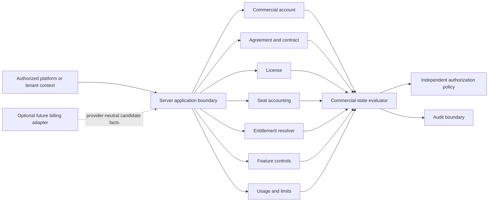
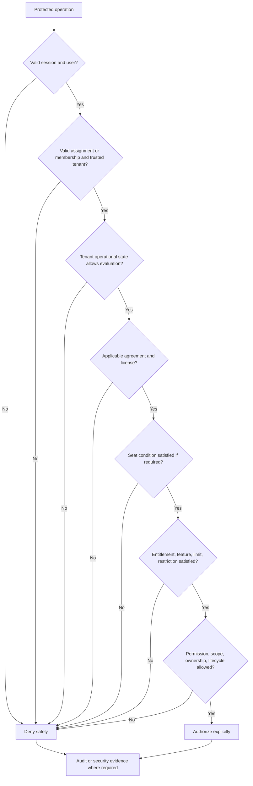
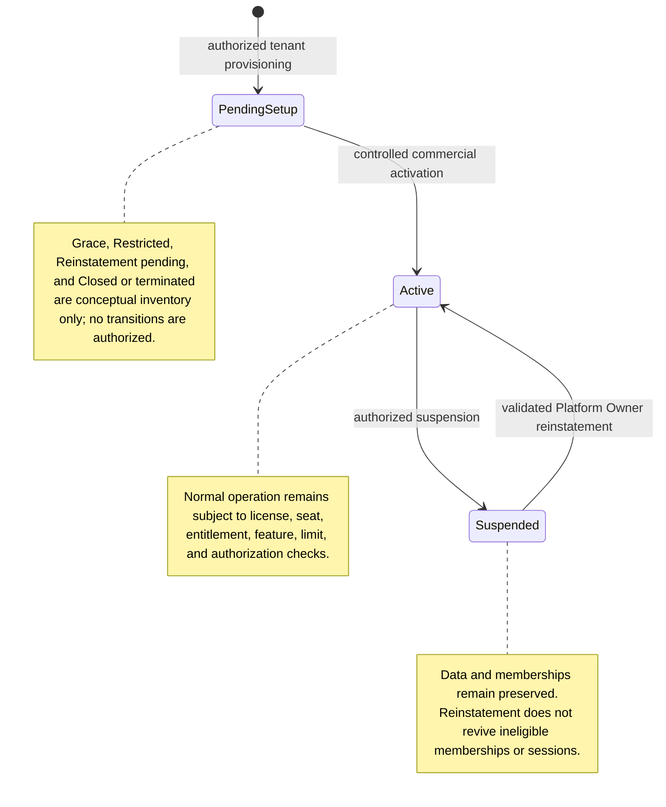

# Foundation V1 Licensing and Entitlements Architecture

## 1. Document status

| Item | Status |
|---|---|
| Document type | Technical-discovery document |
| Implementation | **NOT AUTHORIZED** |
| Source branch | `rebuild/foundation-v1` |
| Analysis date | 23 July 2026 |
| Current application | Legacy prototype, not a production commercial-control system |
| Authority | Product Owner Decisions 1–10 in [`OWNER_DECISIONS_FOUNDATION_V1.md`](./OWNER_DECISIONS_FOUNDATION_V1.md) are authoritative |
| Provider selection | No payment, subscription, billing, database, identity, email, hosting, or policy provider is selected |
| Commercial definition | No plan catalog, price, tax rule, payment method, contract template, or automatic renewal is finalized |
| Production release | Not authorized |

Source precedence is: approved Product Owner decisions; verified repository facts; approved audit findings; architectural proposals; unresolved business and technical decisions. This document is the licensing and entitlement discovery output assigned by [`FOUNDATION_V1_DISCOVERY_BASELINE.md`](./FOUNDATION_V1_DISCOVERY_BASELINE.md), sections 7 and 8. It does not authorize implementation.

## 2. Scope

This document defines the provider-neutral architecture for SaaS Operator commercial control, the tenant commercial relationship, tenant contracts, plans, licenses, seat capacity and consumption, feature entitlements, quantitative limits, custom restrictions and agreements, suspension, reinstatement, possible future grace and restricted operation, manual payment evidence, future subscription compatibility, server-side enforcement, authorization integration, document and job implications, audit, reconciliation, and testing.

The following details are delegated:

| Concern | Canonical document |
|---|---|
| Authentication, sessions, invitations | `FOUNDATION_V1_IDENTITY_AND_ACCESS.md` |
| Memberships, roles, permissions, scopes, tenant isolation | `FOUNDATION_V1_TENANCY_AUTHORIZATION.md` |
| Exact schema, persistence, constraints, transactions | `FOUNDATION_V1_DATA_MODEL.md` |
| Document lifecycle | `FOUNDATION_V1_DOCUMENT_LIFECYCLE.md` |
| Storage capacity and private binary handling | `FOUNDATION_V1_DOCUMENT_STORAGE.md` |
| Audit persistence and retention | `FOUNDATION_V1_AUDIT_RETENTION.md` |
| Providers, regions, environments, adapters | `FOUNDATION_V1_ENVIRONMENTS_PROVIDERS.md` |
| Testing and controlled releases | `FOUNDATION_V1_TESTING_RELEASE.md` |
| Observability and security monitoring | `FOUNDATION_V1_OBSERVABILITY_SECURITY.md` |
| Implementation order and authorization gates | `FOUNDATION_V1_IMPLEMENTATION_ROADMAP.md` |

## 3. Non-goals

This document does not authorize or finalize source-code changes, database creation, schema migration, payment-provider integration, automatic checkout, automatic subscription collection, invoice generation, tax or accounting treatment, banking integration, payment-link generation, a price catalog, discounts, promotions, commissions, reseller billing, automatic renewals, dunning, debt collection, final grace-period rules, final restricted-state rules, final seat-reservation timing, final overage behavior, a final entitlement cache, a final contract-signing process, final legal contract wording, real tenant activation, or real payment evidence.

Nothing below is executable pseudocode, a selected technical mechanism, a legal or financial conclusion, or permission to process real commercial data.

## 4. Verified current state

- **VERIFIED FACT:** No tenant plan, contract, license, seat, entitlement, commercial-state, payment, subscription, usage-metering, or reconciliation model is visible in `app/`, `package.json`, or `package-lock.json`.
- **VERIFIED FACT:** No database or commercial-state persistence adapter is declared.
- **VERIFIED FACT:** No server-side commercial enforcement use case, protected Route Handler, Server Action policy boundary, or commercial middleware is visible.
- **VERIFIED FACT:** No payment collection, checkout, invoice, subscription, billing, banking, accounting, or external commercial-service integration is declared.
- **VERIFIED FACT:** No commercial reconciliation job, scheduler, queue, durable audit event, or commercial test is visible in the repository tree.
- **VERIFIED FACT:** [`app/page.tsx`](./app/page.tsx) is a client component whose bill and CTE prototype behavior is held in React state; it contains hardcoded and in-memory behavior rather than durable commercial controls.
- **VERIFIED FACT:** [`package.json`](./package.json) declares only the current web framework/runtime and development dependencies; it declares no commercial provider SDK.
- **VERIFIED FACT:** [`next.config.ts`](./next.config.ts) contains no verified provider or commercial configuration.
- **INFERENCE:** Current client state cannot authoritatively establish a tenant agreement, payment status, license, seat, entitlement, usage, or commercial authorization.
- **PROPOSAL:** Introduce central provider-neutral commercial policies and ports only after separate architecture and implementation authorization.
- **UNKNOWN:** External Vercel, GitHub, payment, billing, accounting, banking, or other service configuration outside the repository cannot be verified and is not assumed.

These findings align with [`PROJECT_AUDIT.md`](./PROJECT_AUDIT.md), sections 3, 5, 8, and 9, and [`FOUNDATION_V1_DISCOVERY_BASELINE.md`](./FOUNDATION_V1_DISCOVERY_BASELINE.md), section 3.

## 5. Approved commercial operating model

This baseline derives from [`OWNER_DECISIONS_FOUNDATION_V1.md`](./OWNER_DECISIONS_FOUNDATION_V1.md), Decision 2 (SaaS commercial model and manual payment foundations), Decision 3 (role responsibilities), and Decision 4 (controlled access, license checks, deactivation, suspension, and reinstatement).

### Platform Owner / SaaS operator

**APPROVED BASELINE:** The Platform Owner may create and manage tenant companies and their commercial relationships; assign plans, limits, enabled features, contracts, licenses, and seat limits; manage start and expiry dates, extensions, commercial restrictions, custom agreements, suspension, reinstatement, progressive feature activation, and safe temporary feature disabling. The Platform Owner may block normal tenant access because of payment, subscription, contract, or commercial status only through explicit server-side policy with required audit. This authority is not an unaudited tenant-data bypass.

### Tenant

**APPROVED BASELINE:** A tenant may operate only within its active commercial relationship, assigned plan or custom agreement, available seats, enabled features, quantitative limits, tenant state, and independently enforced role, permission, scope, ownership, and lifecycle boundaries.

### Initial payment model

**APPROVED BASELINE:** Initial payment handling may be manual. Payment evidence and commercial activation are controlled by the Platform Owner. No automatic payment, checkout, collection, or payment-triggered activation workflow is approved.

### Future compatibility

**ARCHITECTURAL CONSEQUENCE:** The foundations must remain compatible with later subscriptions, recurring licenses, seat-based contracts, feature bundles, quantitative limits, custom agreements, suspension and reinstatement, possible grace or restricted states, provider replacement, and provider exit without assuming a provider or approving those workflows.

## 6. Commercial concepts and boundaries

| Concept | Meaning | Explicit boundary |
|---|---|---|
| Tenant | Isolated customer-company operational boundary | Not a commercial agreement |
| Tenant commercial account | Commercial control context for one tenant | Not identity or membership |
| Commercial agreement | Approved business arrangement and effective terms | Not necessarily a legal-document implementation |
| Contract | Versioned agreement evidence and applicability period | Not client-asserted state |
| Plan | Commercial packaging of capacity, entitlements, and limits | Not a permission |
| License | Tenant right to use defined capability under an agreement | Not a role |
| Subscription | Possible future recurring commercial relationship | Not approved automation |
| Seat capacity | Maximum qualifying concurrent consumption under policy | Not authentication |
| Seat assignment | Relationship between a qualifying subject and capacity | Not resource authorization |
| Seat consumption | Counted active use of capacity | Not permission |
| Entitlement | Server-resolved commercial prerequisite for a capability | Not resource authorization |
| Feature flag/control | Operational availability switch | Not an entitlement |
| Quantitative limit | Measured commercial or operational ceiling | Not role scope |
| Usage | Trusted measured quantity | Not an invoice |
| Commercial restriction | Tenant-specific commercial limitation | Cannot weaken security |
| Custom agreement | Explicit tenant-specific commercial terms | Not a hidden override |
| Payment evidence | Evidence offered for controlled review | Not confirmed payment |
| Payment status | Reviewed commercial fact under approved policy | Not identity status |
| Tenant operational state | Whether normal tenant use is available | Not membership state |
| Authorization decision | Server result from all applicable facts | Cannot be granted by one commercial signal |

A plan is not a permission; a license is not a role; an entitlement is not resource authorization; a feature flag is not an entitlement; seat availability is not authentication; payment status is not identity status; suspension is not deletion; and contract expiry is not document deletion. Commercial state must not overwrite membership, identity, session, ownership, or document-lifecycle state.

## 7. Provider-neutral commercial architecture

| Port or boundary | Responsibility | Trusted inputs | Outputs | Failure behavior | Audit requirement | Provider-neutral substitute |
|---|---|---|---|---|---|---|
| Commercial-account management | Resolve and administer tenant commercial context | Authorized actor, tenant, approved commands | Account facts or typed failure | Fail closed; no partial change | Create/change/status | In-memory account repository |
| Plan catalog | Resolve versioned packaging | Trusted plan/version reference and effective time | Plan facts or unavailable | No invented default | Version/assignment changes | Fixed plan fixture |
| Contract management | Resolve agreement applicability | Tenant, agreement reference, trusted time | Applicable contract facts | Ambiguous or absent is explicit | Create/amend/expire | Contract fixture |
| License management | Resolve commercial right | Tenant, agreement, license reference, time | License eligibility | Inactive/unknown denies prerequisite | Lifecycle changes | License fake |
| Seat accounting | Evaluate and mutate capacity use | Tenant, license, membership, idempotency facts | Capacity/consumption result | Conflict or indeterminate denies mutation | Every mutation/reconciliation | Concurrency-aware seat fake |
| Entitlement resolution | Resolve commercial capability prerequisite | Tenant, agreement, plan/custom terms, time | Entitled/not entitled/indeterminate | Indeterminate denies | Grant/remove/evaluation as required | Entitlement fixture |
| Feature-control resolution | Resolve operational feature availability | Environment, tenant/segment, feature, trusted control | Enabled/disabled/indeterminate | Indeterminate safely unavailable | Every privileged change | Deterministic control fake |
| Usage and limit evaluation | Measure and compare trusted usage | Tenant, category, quantity, period, limit version | Within/at/exceeded/unknown | Unknown does not become zero | Limit changes and accountable denials | Meter/limit fake |
| Payment-evidence recording | Record minimized evidence for review | Authorized actor, tenant, safe evidence metadata | Recorded/rejected | Never activates automatically | Record/review/outcome | Metadata-only evidence sink |
| Commercial-state evaluation | Compose agreement, license, restriction, suspension | Trusted commercial facts | Allowed commercial prerequisite or typed deny | Deny ambiguity | State changes and required decisions | State evaluator |
| Suspension and reinstatement | Apply controlled tenant state action | Authorized Platform Owner, current facts, reason | Changed/no-op/failure | Atomic or safely unchanged | Attempt and result | State-machine fake |
| Reconciliation | Detect drift among authoritative facts | Tenant-scoped snapshots, system actor, correlation | Reconciled/drift/failure | No silent correction | Run, drift, correction | Deterministic reconciler |
| Audit-event recording | Preserve accountable evidence | Actor, tenant, target, prior/new facts, result | Recorded/failure | Accountable change fails safely if evidence required | Intrinsic | Capturing audit sink |
| Future external billing adapter | Normalize later provider facts | Verified adapter event/reference | Normalized candidate facts | Provider failure cannot grant access | Receipt, validation, mapping | Contract-test adapter |

No external provider, SDK, API, database, queue, cron service, cache, or policy engine is selected.

## 8. Commercial evaluation pipeline

Every protected operation follows this server-side sequence:

1. validate the session and internal user;
2. validate tenant membership or platform assignment;
3. resolve the tenant from trusted context;
4. resolve tenant operational state;
5. resolve the current commercial agreement;
6. validate contract or license applicability;
7. validate seat requirements where relevant;
8. resolve feature entitlement;
9. resolve quantitative limits;
10. resolve custom restrictions;
11. validate role, permission, scope, ownership, and lifecycle state;
12. authorize or deny explicitly;
13. record required audit and security events.

Commercial checks do not replace authorization checks, and authorization checks do not replace commercial checks. No step relies solely on client-provided plan, license, seat, feature, usage, payment, or subscription claims.

## 9. Tenant commercial states

These are conceptual inventory labels, not database enums.

| State | Meaning | Allowed entry | Allowed exit | Tenant-access effect | Membership effect | Seat effect | Entitlement effect | Job effect | Document and retention effect | Audit | Terminal? | Pending decisions |
|---|---|---|---|---|---|---|---|---|---|---|---|---|
| Pending commercial setup | Tenant exists but approved commercial prerequisites are incomplete | Authorized tenant provisioning | Active after controlled commercial activation | No normal access | Preserved/pending; no activation by implication | No consumption except later-approved reservation | Not operational | Setup-only authorized work | Preserved; no lifecycle inference | Setup events | No | Activation evidence and actor workflow |
| Active | Approved normal commercial state subject to every other check | Controlled activation or validated reinstatement | Suspended; other exits pending | Eligible for normal policy evaluation | Independently evaluated | Enforced under license | Resolved normally | Run only when independently eligible | No automatic lifecycle change; retention continues | Activation/reinstatement and changes | No | Exact commercial prerequisites |
| Suspended | Normal use blocked by controlled tenant action | Authorized Platform Owner suspension | Active through validated reinstatement | Normal access blocked | Preserved; otherwise-active memberships blocked | History preserved; exact accounting pending | Normal operational use blocked | Evaluated by security/retention policy | Data preserved; approved retention/deletion continues | Suspension and enforcement | No | Triggers and exact seat/session handling |
| Reinstatement pending | Conceptual review state before completed reinstatement | **PENDING PRODUCT OWNER DECISION** | No operational transition defined | No automatic access | No automatic reactivation | Reconciliation pending | No automatic restoration | Only specifically authorized review/reconciliation | Preserved; retention continues | Attempt/review | No | Whether state exists and workflow |
| Closed or terminated | Conceptual ended relationship | **PENDING PRODUCT OWNER DECISION** | No operational transition defined | Exact behavior unresolved; never grants access | Preserved unless later rule | Pending | Pending | Only approved retention/security work | No automatic deletion; retention applies | Closure/termination if approved | Pending | Meaning, reversibility, access, retention |
| Grace | Possible time-limited commercial accommodation | **PENDING PRODUCT OWNER DECISION** | No operational transition defined | Undefined | Unchanged by concept alone | Undefined | Undefined | Undefined | No automatic deletion | Required if approved | No | Duration, entry, exit, capabilities |
| Restricted | Possible partial-operation commercial condition | **PENDING PRODUCT OWNER DECISION** | No operational transition defined | Undefined | Unchanged by concept alone | Undefined | Undefined | Undefined | No automatic deletion | Required if approved | No | Allowed operations and precedence |

**APPROVED BASELINE:** Active and Suspended are approved concepts, and reinstatement is an approved controlled action. **PENDING PRODUCT OWNER DECISION:** Grace and Restricted have no approved operational semantics; Reinstatement pending and Closed or terminated are conceptual proposals whose exact existence and behavior remain unresolved. No state automatically deletes data.

## 10. Suspension

**APPROVED BASELINE:** Under Decisions 2, 4, 5, and 6 in [`OWNER_DECISIONS_FOUNDATION_V1.md`](./OWNER_DECISIONS_FOUNDATION_V1.md), suspension is a tenant-level commercial and authorization control. It blocks normal tenant access; requires current-session re-evaluation; has no client bypass; preserves memberships, users, customers, ownership, documents, audit, and historical state; and does not itself archive or delete data.

Approved retention continues. Scheduled deletion continues according to approved document-lifecycle rules unless a later approved legal-hold or exception policy intervenes. Unsafe destructive operations are blocked; security, retention, and deletion operations are evaluated separately. Platform Owner administrative control remains policy-bound and audited. Ordinary tenant actors cannot reinstate the tenant. A safe reason is recorded without unnecessarily exposing payment or contract detail.

Suspension is distinct from user deactivation, membership deactivation, entitlement loss, feature disabling, document archival, and contract termination.

## 11. Reinstatement

**APPROVED BASELINE:** Reinstatement is a controlled Platform Owner action, not an automatic consequence of payment or data change.

It requires current commercial-state validation; agreement or contract validation; payment-evidence validation where applicable; license validation; entitlement and seat reconciliation; user and membership-state re-evaluation; audit; idempotency; safe retry; and post-action verification. A later implementation must update the server-side authorization version under its approved session design.

Reinstatement cannot reactivate deactivated or revoked users or memberships, cannot restore conceptual Replaced memberships, and cannot revive stale sessions automatically. It does not authorize membership reactivation or commercial-block restoration workflows that remain pending in [`FOUNDATION_V1_TENANCY_AUTHORIZATION.md`](./FOUNDATION_V1_TENANCY_AUTHORIZATION.md), section 19.

**PENDING PRODUCT OWNER DECISION:** Exact actor hierarchy, approval workflow, session mechanism, commercial evidence, seat behavior, and transaction design. Automatic reinstatement and automatic payment-triggered reinstatement are not approved.

## 12. Grace and restricted states

Grace and Restricted are separate **PENDING PRODUCT OWNER DECISIONS**.

| Candidate state | Possible purpose, not approval | Primary risks | Questions requiring approval | Potentially affected surfaces | Implementation blockers |
|---|---|---|---|---|---|
| Grace | Allow limited time to resolve a commercial issue | Accidental continued access, inconsistent enforcement, stale sessions, unclear retention | Eligibility, duration, actor, entry/exit, renewal, notification, evidence, seat and entitlement treatment | Sign-in, reads, uploads, downloads, archive, scheduled deletion, tenant administration, invitations, jobs, reports, future simulations, audit, support | Complete Product Owner policy and security/technical review |
| Restricted | Permit a defined subset of operations | Hidden read-only assumptions, data exposure, destructive inconsistency, support bypass | Allowed operations, denied operations, precedence, actor, duration, recovery, messages, auditing | Sign-in, reads, uploads, downloads, archive, scheduled deletion, tenant administration, invitations, jobs, reports, future simulations, audit, support | Capability matrix, lifecycle interactions, tests, Product Owner approval |

No duration, automatic entry, automatic exit, read-only behavior, partial feature availability, overdue threshold, or notification cadence is assumed. No operational transition enters or leaves either state in this document.

## 13. Plans

A plan is a commercial packaging concept. A future plan may describe a plan identifier, display label, commercial version, seat capacity, enabled entitlement set, quantitative limits, later-approved document-storage limits, later-approved support tier, effective date, retirement status, migration behavior, tenant eligibility, and custom-override capability.

**PENDING PRODUCT OWNER DECISION:** No plan names, prices, currency, tax treatment, public catalog, default capacity, or migration behavior is finalized. Historical contracts must preserve the commercial version that applied; plan changes must not silently rewrite historical evidence.

## 14. Contracts and commercial agreements

A conceptual contract or agreement may identify the tenant party, SaaS Operator party, effective and optional expiry dates, renewal status, assigned plan, custom terms, seat capacity, feature entitlements, quantitative limits, suspension rights, termination status, minimized manual-payment evidence, audit, version, and historical provenance.

Contract state comes from trusted server-side facts, never client input. Exact legal wording and digital-signature process are outside scope. Contract-expiry behavior requires explicit Product Owner rules. Termination does not automatically delete tenant data; retention and deletion remain controlled by `FOUNDATION_V1_DOCUMENT_LIFECYCLE.md` and `FOUNDATION_V1_AUDIT_RETENTION.md`.

## 15. Licenses

A license is the tenant's authorized commercial right to use a defined product capability during an applicable agreement state or period. Conceptually it has tenant, agreement, plan or custom-agreement binding; effective period; status; seat capacity; feature entitlements; quantitative limits; suspension and expiry effects; replacement or amendment provenance; and audit.

**PENDING PRODUCT OWNER DECISION:** Identifier format, perpetual versus term rules, automatic renewal, amendment mechanics, exact expiry transitions, and exact restoration behavior. A license never supplies role, permission, scope, ownership, or resource-lifecycle authorization.

## 16. Seats

| Seat concept | Meaning |
|---|---|
| Seat capacity | Maximum qualifying consumption under a license/agreement |
| Available seat | Capacity currently eligible for allocation |
| Reserved seat | Possible temporary hold under a later-approved rule |
| Consumed seat | Capacity counted by a qualifying active membership |
| Released seat | Former consumption no longer active |
| Blocked seat | Conceptual capacity unavailable under a commercial condition |
| Historical seat assignment | Preserved attribution of past allocation |

Seat behavior is server-controlled. Invitation issuance and acceptance, membership activation, membership or user deactivation, tenant suspension and reinstatement, later-approved membership replacement/reactivation, contract or plan changes, retries, concurrency, reconciliation, and audit must be evaluated explicitly.

**APPROVED BASELINE:** Deactivation releases a seat where applicable; invitation acceptance rechecks availability; no duplicate seat consumption is allowed; client counts are never authoritative; entitlement or permission does not create a seat; tenant suspension does not erase seat history.

**PENDING PRODUCT OWNER DECISION:** Whether invitation issuance reserves a seat; reservation expiry/transfer; over-capacity and temporary overage behavior; Platform Owner treatment; inactive-user and pending-activation treatment; multi-tenant membership accounting; replacement seat transfer; reactivation seat allocation; and exact suspension/reinstatement behavior.

## 17. Seat-accounting invariants

Mandatory conceptual invariants:

1. Capacity cannot be negative.
2. Consumption cannot be negative.
3. Active consumption cannot exceed capacity unless an explicit later-approved exception exists.
4. One qualifying membership cannot consume more than one equivalent seat for the same tenant and license.
5. One seat cannot be silently counted for two active memberships.
6. Terminal invitation records cannot retain hidden active reservations.
7. Deactivation and release are idempotent.
8. Retries cannot double-consume or double-release.
9. Trusted tenant context is mandatory.
10. Every seat mutation is auditable.
11. Historical assignment remains attributable.
12. Reconciliation detects drift.
13. Client counters are never authoritative.

Allocation, acceptance, activation, release, replacement, reactivation, plan changes, and reconciliation require concurrency control. Conflicts fail safely; uniqueness, version, locking, or transactional mechanisms remain delegated to `FOUNDATION_V1_DATA_MODEL.md` and are not selected here.

## 18. Entitlements

An entitlement is a server-resolved commercial prerequisite for a product capability.

| Conceptual category | Foundation V1 treatment |
|---|---|
| Document upload | Foundation capability subject to authorization and limits |
| Bill document management | Foundation capability subject to document lifecycle |
| CTE document management | Foundation capability subject to document lifecycle |
| Archive access | Granular authorization remains required |
| Future simulation | Outside Foundation V1 implementation |
| Future comparison | Outside Foundation V1 implementation |
| Future report | Outside Foundation V1 implementation |
| Administrative feature controls | Platform policy boundary, not tenant permission |
| Storage capacity | Later-approved quantitative prerequisite |
| User-seat capacity | Commercial capacity, not membership authorization |
| Future AI-assisted capability | Outside Foundation V1 implementation |

Each entitlement conceptually has tenant binding, source, effective period, state, optional quantitative limit, custom restriction, suspension effect, audit, cache considerations, and safe fallback behavior.

No entitlement grants access without role, permission, scope, ownership, tenant state, and resource-state validation. Missing or indeterminate entitlement blocks the protected capability. There is no default-to-enabled behavior, and no client-supplied entitlement is trusted.

## 19. Feature controls versus entitlements

### Entitlement

The commercial right assigned to a tenant under an agreement.

### Platform feature control

An operational switch controlled by the Platform Owner for staged rollout, maintenance, incident response, safe temporary disabling, protected pilot, or environment-specific enablement.

Feature enabled plus no entitlement is denied. Entitlement present plus feature disabled is denied or safely unavailable. A feature control does not change the commercial agreement, and temporary disabling does not silently revoke historical entitlement. Privileged control changes require audit. Client feature flags are not authoritative. Final precedence details and error messages remain pending implementation design.

## 20. Quantitative limits

No numeric value is finalized.

| Limit category | Unit | Scope/source | Reset period | Behavior | Suspension/audit/reconciliation | Pending decision |
|---|---|---|---|---|---|---|
| Seat count | Seats | Tenant/license; seat ledger | Not normally periodic | Hard unless later exception | State-aware; every mutation audited/reconciled | Capacity and overage |
| Active-user count | Qualifying users | Tenant membership facts | None | Pending | Suspension treatment pending | Definition |
| Invitation count | Invitations | Tenant invitation records | Possible period | Pending | Audit/reconcile active records | Limit and reset |
| Document count | Documents | Tenant document metadata | Possible period/current total | Pending | No destructive enforcement | Types and lifecycle |
| Document-storage capacity | Bytes | Trusted storage metadata | Current total | Pending | Preserve ownership; reconcile | Included objects and value |
| Upload size | Bytes per object/request | Trusted server/storage facts | Per operation | Hard proposal | Safe denial/audit as required | Value and exceptions |
| Processing jobs | Jobs/period/concurrency | Trusted job records | Pending | Pending | Tenant-isolated reconciliation | Unit and reset |
| Exports | Exports/records/bytes | Trusted export records | Pending | Pending | Authorization and audit required | Limits |
| Audit exports | Exports/records/bytes | Audit domain | Pending | Pending | Sensitive, separately authorized | Limits and roles |
| Future simulations | Runs/period | Future trusted usage | Pending | Outside V1 | No implementation | Future rule |
| Future reports | Reports/period | Future trusted usage | Pending | Outside V1 | No implementation | Future rule |
| Future AI usage | Requests/units | Future trusted usage | Pending | Outside V1 | No implementation | Future rule |
| API/operational rate | Requests/time | Trusted server telemetry | Defined window later | Operational/commercial distinction pending | Security controls independent | Applicability |

Every category requires a defined unit, trusted tenant scope, measurement source, optional reset period, hard/soft behavior, warning behavior, suspension interaction, audit, reconciliation, and Product Owner decision before implementation.

## 21. Usage metering boundary

Conceptual metering requires trusted server-generated events, tenant context, actor context where applicable, operation category, quantity and unit, effective time, idempotency, correction provenance, audit linkage, aggregation rules, reconciliation, retention, and privacy minimization.

Usage events are not billing invoices. Client counters are not authoritative. Missing usage cannot silently become zero. Disputed, duplicated, late, or incomplete usage requires controlled reconciliation. Exact metering persistence, aggregation, correction, and provider integration remain pending.

## 22. Custom agreements and overrides

Possible tenant-specific configuration includes custom seat capacity, feature entitlement, quantitative limit, contract restriction, effective period, temporary approved exception, suspension condition, and a later-approved support arrangement.

Every override requires explicit Platform Owner authority, tenant binding, reason, effective period, precedence, audit, and expiry. There is no hidden permanent override. An override cannot weaken tenant isolation, security, role, permission, ownership, retention, legal-hold, or document-lifecycle requirements. Exact override precedence remains a **PENDING PRODUCT OWNER DECISION**.

## 23. Manual payment evidence

Decision 2 and Decision 4 in [`OWNER_DECISIONS_FOUNDATION_V1.md`](./OWNER_DECISIONS_FOUNDATION_V1.md) permit initial payment collection and contractual activation to be managed manually. The provider-neutral foundation may distinguish: payment expected, evidence received, evidence reviewed, payment confirmed, payment rejected, payment disputed, evidence superseded, commercial action pending, and a separate suspension or reinstatement decision. These are conceptual review facts, not an approved automated payment state machine.

Payment evidence is not automatically trusted. Uploading or recording evidence does not activate or reinstate a tenant. Only an authorized Platform Owner action changes tenant commercial state. Bank, card, invoice, tax, and accounting integrations are not selected. Sensitive payment information must be minimized; full payment-card data must not be stored; payment credentials must not appear in logs or audit. Exact evidence-storage and review policies remain pending. Real payment evidence is prohibited during ordinary discovery and Preview work.

## 24. Future subscription boundary

A possible future provider-neutral adapter may normalize a customer reference, subscription reference, product or price reference, subscription status, billing period, renewal, cancellation, payment event, webhook or scheduled reconciliation, dispute, provider outage, and provider-exit facts.

No provider is selected. Provider status is not directly trusted without verification. External events require authenticity checks under a later design, idempotency, replay defense, mapping, and audit. External identifiers remain adapter-layer data. Internal commercial state remains authoritative under approved policy. Webhook automation is not authorized, and exact provider-to-domain mapping remains pending.

## 25. Commercial-state precedence

The conceptual decision inputs are tenant suspension/active state, contract status, license status, entitlement, seat, custom restriction, feature control, role and permission, resource scope, and resource lifecycle.

- Suspension blocks normal operational use.
- Missing permission denies regardless of entitlement.
- Missing entitlement denies regardless of permission.
- Missing seat denies seat-requiring activation.
- Feature disablement safely blocks the feature.
- Resource lifecycle may deny an otherwise authorized operation.
- Custom restrictions cannot broaden authority.
- No one signal alone grants access.

This is a precedence boundary, not a finalized implementation order beyond the approved server pipeline in section 8.

## 26. Commercial changes and effective dating

Future-effective and immediate plan changes, capacity changes, entitlement additions/removals, restriction changes, suspension, reinstatement, contract/license amendments, termination, and corrections require explicit effective time, actor, reason, prior value, new value, tenant scope, audit, concurrency control, idempotency, and rollback or compensating action. Historical facts must never be silently rewritten.

Proration, refunds, billing credits, financial adjustments, and accounting treatment are outside scope.

## 27. Downgrade and limit-reduction boundary

Risks arise when capacity falls below consumption, entitlement is removed while resources exist, storage use exceeds a new limit, a document feature becomes unavailable, a tenant exceeds a new limit, or a future simulation/report entitlement is removed.

**REQUIRED BOUNDARY:** No automatic destructive deletion, silent data loss, or cross-tenant effect. Restrictions require an explicit Product Owner policy and audit. Retention continues; existing documents remain tenant-owned; exact read/write behavior remains pending. This document does not choose grandfathering, overage, forced deactivation, or read-only behavior.

## 28. Contract expiry and termination boundary

Upcoming expiry, expired contract, non-renewal, manual termination, disputed termination, superseded agreement, reinstatement, and new agreement require distinct, auditable handling.

Expiry and termination do not automatically delete tenant data. Normal-access behavior requires Product Owner approval. Retention continues; archived-document purge remains governed by approved lifecycle and retention rules; legal hold remains pending; ownership and audit remain. Automatic renewal is not approved. The exact transition to suspension, restriction, closure, or another state remains pending.

## 29. Background reconciliation jobs

Provider-neutral reconciliation may compare seat counts, active memberships, entitlement assignments, contract effective periods, license status, plan versions, custom overrides, payment-evidence review status, suspension state, usage totals, and later-integrated external subscription status.

Every run requires trusted tenant context, a system actor, idempotency, audit correlation, retry safety, drift detection, tenant-isolated work units, no client authority, no silent correction without evidence, and safe failure. Cross-tenant payload mixing is prohibited. Alerting requirements are delegated to `FOUNDATION_V1_OBSERVABILITY_SECURITY.md`. No job or scheduler is implemented or selected.

## 30. Audit events

Required conceptual event categories are:

1. tenant commercial account creation;
2. plan assignment;
3. plan change;
4. contract creation;
5. contract amendment;
6. license activation;
7. license suspension;
8. license expiry;
9. seat-capacity change;
10. seat consumption;
11. seat release;
12. seat reconciliation;
13. entitlement grant;
14. entitlement removal;
15. custom restriction;
16. custom agreement;
17. feature activation;
18. feature disabling;
19. payment-evidence recording;
20. payment confirmation or rejection;
21. tenant suspension;
22. tenant reinstatement;
23. commercial-state correction;
24. failed or denied commercial action.

Each event category requires trusted tenant, actor, target, prior state, new state, reason, result, correlation, redaction, time, and provenance as applicable. This document does not finalize event fields, schema, storage, retention, or visibility.

## 31. Failure model

Safe failure categories include no commercial account, no active agreement, missing plan, inactive license, expired license, suspended tenant, missing entitlement, disabled feature, exhausted seat capacity, quantitative limit reached, custom restriction, ambiguous commercial state, reconciliation drift, pending manual-payment review, invalid payment evidence, later external-provider unavailability, internal persistence failure, concurrency conflict, and stale commercial version.

Protected capabilities deny by default. Responses do not enumerate tenants or disclose sensitive contract/payment details. Failures use user-safe messages, redacted logs, a correlation identifier, required audit, security events for suspicious tampering, and retry only where safe.

## 32. Threats and mitigations

| Threat | Cause | Consequence | Preventive boundary | Detection | Implementation gate | Related canonical document |
|---|---|---|---|---|---|---|
| Client plan tampering | Client plan claim trusted | Unlicensed capability | Server plan resolution | Claim mismatch | Tamper tests | `FOUNDATION_V1_TENANCY_AUTHORIZATION.md` |
| Client entitlement tampering | Client capability claim trusted | Feature escalation | Server entitlement resolution | Denied mismatch | Negative entitlement tests | `FOUNDATION_V1_TENANCY_AUTHORIZATION.md` |
| Seat-count tampering | Client count trusted | Capacity bypass | Authoritative seat ledger | Reconciliation drift | Count tamper tests | `FOUNDATION_V1_DATA_MODEL.md` |
| Duplicate seat consumption | Non-atomic activation | Capacity exceeded | Idempotent concurrent allocation | Duplicate detection | Concurrency suite | `FOUNDATION_V1_DATA_MODEL.md` |
| Seat-release race | Concurrent release/change | Double release or wrong capacity | Versioned idempotent release | Ledger reconciliation | Release race tests | `FOUNDATION_V1_DATA_MODEL.md` |
| Invitation acceptance race | Concurrent acceptance | Duplicate membership/seat | Recheck and atomic result | Conflict events | Acceptance concurrency tests | `FOUNDATION_V1_IDENTITY_AND_ACCESS.md` |
| Membership replacement race | Unapproved/concurrent replacement | Overlap or duplicate seat | No workflow until approved; atomic later rule | Membership/seat reconciliation | Future replacement tests | `FOUNDATION_V1_TENANCY_AUTHORIZATION.md` |
| Membership reactivation race | Concurrent future reactivation | Unauthorized access/capacity | Pending workflow; complete revalidation | Attempt events | Future reactivation tests | `FOUNDATION_V1_TENANCY_AUTHORIZATION.md` |
| Stale entitlement cache | Missing invalidation/version | Continued or wrongful denial | Versioned revalidation | Stale-context events | Cache tests | `FOUNDATION_V1_DATA_MODEL.md` |
| Stale license cache | Obsolete license state | Continued use | Current license version | Reconciliation | Expiry/change tests | `FOUNDATION_V1_DATA_MODEL.md` |
| Stale session after suspension | Tenant state embedded | Suspended access | Entry-point re-evaluation | Post-suspension attempts | Suspension session tests | `FOUNDATION_V1_IDENTITY_AND_ACCESS.md` |
| Stale session after entitlement loss | Authority embedded | Continued feature use | Re-evaluate commercial facts | Stale-session events | Entitlement-loss tests | `FOUNDATION_V1_IDENTITY_AND_ACCESS.md` |
| Tenant reinstatement bypass | Client or weak workflow | Unauthorized restoration | Platform policy, complete validation | Reinstatement attempts | Reinstatement negative suite | `FOUNDATION_V1_TENANCY_AUTHORIZATION.md` |
| Platform Owner commercial-control abuse | Excess or unaudited power | Tenant harm | Explicit policy, least scope, audit | Privileged monitoring | Admin-control tests | `FOUNDATION_V1_OBSERVABILITY_SECURITY.md` |
| Unaudited custom override | Hidden exception | Persistent bypass | Required reason/effective period/audit | Override inventory | Override coverage gate | `FOUNDATION_V1_AUDIT_RETENTION.md` |
| Expired contract still grants access | Missing effective-date check | Unauthorized use | Trusted time and applicability | Expiry reconciliation | Boundary-time tests | `FOUNDATION_V1_DATA_MODEL.md` |
| Missing contract blocks valid access | Inconsistent facts | Availability failure | Explicit ambiguity handling/reconciliation | Denial monitoring | Valid-agreement tests | `FOUNDATION_V1_OBSERVABILITY_SECURITY.md` |
| External-provider status spoofing | Unverified future event | False commercial change | Adapter verification and mapping | Invalid-event events | Adapter contract tests | `FOUNDATION_V1_ENVIRONMENTS_PROVIDERS.md` |
| Replayed external billing event | Missing idempotency | Duplicate state change | Event identity and replay defense | Duplicate-event metrics | Replay tests | `FOUNDATION_V1_DATA_MODEL.md` |
| Cross-tenant reconciliation | Mixed workset/context | State corruption/leakage | One trusted tenant per unit | Isolation telemetry | Job isolation tests | `FOUNDATION_V1_TESTING_RELEASE.md` |
| Usage-meter manipulation | Client quantity trusted | Limit/billing distortion | Server-generated usage | Aggregate reconciliation | Meter tamper tests | `FOUNDATION_V1_AUDIT_RETENTION.md` |
| Limit-reset manipulation | Client clock or reset trusted | Capacity bypass | Trusted time/version | Reset anomalies | Time-boundary tests | `FOUNDATION_V1_DATA_MODEL.md` |
| Manual-payment evidence fraud | Evidence treated as payment | False activation | Human-controlled review and separate action | Review/audit trail | Evidence negative tests | `FOUNDATION_V1_OBSERVABILITY_SECURITY.md` |
| Sensitive payment-data exposure | Excess evidence/logging | Privacy/security harm | Minimization/redaction; no credentials | Scanning/monitoring | Redaction tests | `FOUNDATION_V1_OBSERVABILITY_SECURITY.md` |
| Automatic destructive downgrade | Limit change triggers deletion | Data loss | Explicit no-delete boundary | Lifecycle reconciliation | Downgrade tests | `FOUNDATION_V1_DOCUMENT_LIFECYCLE.md` |
| Entitlement confused with authorization | Commercial fact grants resource access | Privilege escalation | Independent authorization pipeline | Policy decision evidence | Matrix tests | `FOUNDATION_V1_TENANCY_AUTHORIZATION.md` |
| Feature flag confused with entitlement | Operational switch grants right | Commercial bypass | Separate resolvers | Mismatch metrics | Combination tests | `FOUNDATION_V1_TENANCY_AUTHORIZATION.md` |
| Audit suppression | Change bypasses evidence | Unaccountable action | Required event contract | Reconciliation | Audit coverage gate | `FOUNDATION_V1_AUDIT_RETENTION.md` |
| Historical commercial-state rewriting | In-place mutation without version | Lost provenance/dispute | Effective-dated versions | History checks | Immutability tests | `FOUNDATION_V1_DATA_MODEL.md` |
| Time-zone/effective-date errors | Ambiguous time boundary | Early/late access | Canonical trusted time semantics later | Boundary telemetry | Time-zone tests | `FOUNDATION_V1_DATA_MODEL.md` |

## 33. Testing strategy

Provider-independent tests must cover:

1. no commercial account denial;
2. active tenant eligibility;
3. suspended tenant denial;
4. controlled reinstatement;
5. deactivated membership remains deactivated after reinstatement;
6. revoked membership remains revoked after reinstatement;
7. missing license denial;
8. expired license denial;
9. missing entitlement denial;
10. disabled feature denial;
11. feature enabled without entitlement denial;
12. entitlement present without permission denial;
13. permission present without entitlement denial;
14. seat availability;
15. seat exhaustion;
16. concurrent invitation acceptance;
17. concurrent seat consumption;
18. duplicate release idempotency;
19. deactivation seat release;
20. future replacement seat safeguards if approved;
21. future reactivation seat safeguards if approved;
22. quantitative-limit enforcement;
23. custom restriction;
24. future-effective change boundary;
25. downgrade without deletion;
26. contract-expiry behavior remains safely controlled;
27. manual payment evidence does not auto-activate;
28. Platform Owner controlled suspension;
29. Platform Owner controlled reinstatement;
30. required audit generation;
31. reconciliation drift;
32. stale commercial caches;
33. stale sessions;
34. cross-tenant commercial access denial;
35. client plan, license, entitlement, and seat tampering;
36. future provider-adapter contracts;
37. negative and property-based seat, tenant, and decision invariants.

Core tests run with deterministic substitutes and without a real payment, subscription, identity, database, queue, scheduler, cache, or policy provider.

## 34. Conceptual policy interfaces

These are conceptual contracts, not code or selected APIs.

| Interface | Input categories | Output categories | Failure behavior | Audit behavior | Idempotency | Provider-neutral substitute |
|---|---|---|---|---|---|---|
| Resolve commercial account | Tenant, trusted time | Account facts/not found | Explicit deny prerequisite | Read evidence as required | Read-stable | Account fixture |
| Resolve active agreement | Tenant, agreement, time | Applicable/none/ambiguous | None/ambiguous denies | Decision evidence | Read-stable | Agreement fixture |
| Resolve plan | Agreement, plan version, time | Plan facts/unavailable | No default plan | Assignment/version audit | Read-stable | Plan fixture |
| Resolve license | Tenant, agreement, license, time | Valid/invalid/unknown | Unknown denies | Lifecycle/decision audit | Read-stable | License fake |
| Resolve seat availability | Tenant, license, membership facts | Available/exhausted/unknown | Unknown denies activation | Decision evidence | Read-stable | Seat ledger fake |
| Reserve seat if later approved | Tenant, invitation, license, idempotency key | Reserved/conflict/denied | No reservation by default | Attempt/result | Required | Reservation fake |
| Consume seat | Tenant, membership, license, idempotency key | Consumed/already/conflict | No partial consumption | Mutation audit | Required | Concurrent seat fake |
| Release seat | Tenant, assignment, reason, idempotency key | Released/already/conflict | Safe unchanged state | Mutation audit | Required | Seat fake |
| Reconcile seats | Tenant, authoritative memberships/license | Matched/drift/correction pending | No silent correction | Run/drift/correction | Required per run | Reconciler |
| Resolve entitlement | Tenant, capability, time | Present/missing/unknown | Missing/unknown deny | Grant/remove/decision as required | Read-stable | Entitlement fixture |
| Evaluate feature control | Environment, feature, tenant/segment | Enabled/disabled/unknown | Unknown safely unavailable | Privileged change | Read-stable | Control fake |
| Evaluate quantitative limit | Tenant, category, usage, limit version | Within/exceeded/unknown | Unknown denies protected consumption | Denial/change as required | Read-stable | Limit fake |
| Evaluate custom restriction | Tenant, operation, time | Applicable/not/ambiguous | Ambiguous denies | Override/change | Read-stable | Restriction fixture |
| Evaluate tenant commercial state | Account, agreement, suspension facts | Eligible/blocked/unknown | Unknown blocks | Decision/change | Read-stable | State evaluator |
| Suspend tenant | Actor, tenant, current state, reason, command id | Suspended/already/failure | Atomic or unchanged | Attempt/result | Required | State-machine fake |
| Reinstate tenant | Actor, tenant, validated facts, command id | Reinstated/already/denied | No partial restoration | Attempt/result | Required | Reinstatement fake |
| Record manual payment evidence | Actor, tenant, minimized metadata, command id | Recorded/rejected | Never activates | Record/review trail | Required | Metadata sink |
| Reconcile future subscription | Tenant, verified adapter facts, run id | Matched/drift/pending | Provider failure cannot grant | Receipt/run/result | Required | Adapter fixture |
| Record commercial audit event | Actor, tenant, target, change/result | Recorded/failure | Accountable change fails safely | Intrinsic | Event identity required | Capturing sink |
| Invalidate commercial cache | Tenant/version/affected facts | Invalidated/failure | Fail closed for stale privilege | Operational event | Repeated-safe | Cache fake |

## 35. Data requirements delegated to the data model

Conceptual data requirements include tenant commercial account, commercial agreement, contract, contract version, plan, plan version, license, license status, seat capacity, seat assignment, seat event, entitlement, entitlement assignment, feature control, quantitative limit, usage event, custom restriction, custom agreement, payment evidence, payment-review result, suspension event, reinstatement event, reconciliation run, later-approved external-provider reference, effective date, expiry date, commercial version, actor, tenant, provenance, audit event, and security event.

Exact tables, fields, enums, constraints, indexes, identifiers, relationships, timestamps, concurrency mechanisms, and transactions remain delegated to `FOUNDATION_V1_DATA_MODEL.md`.

## 36. Dependencies and delegated decisions

| Canonical document | Questions delegated | Inputs supplied here | Decisions still pending | Implementation status |
|---|---|---|---|---|
| `FOUNDATION_V1_IDENTITY_AND_ACCESS.md` | Sessions, invitations, identity re-evaluation | Commercial prerequisites and invalidation triggers | Session mechanism and invitation seat integration | **NOT AUTHORIZED** |
| `FOUNDATION_V1_TENANCY_AUTHORIZATION.md` | Roles, permissions, scopes, lifecycle authorization | Independent commercial decision inputs | Commercial-block restoration and membership seat workflows | **NOT AUTHORIZED** |
| `FOUNDATION_V1_DATA_MODEL.md` | Records, constraints, versions, transactions | Conceptual entities and invariants | Exact schema, persistence, concurrency | **NOT AUTHORIZED** |
| `FOUNDATION_V1_DOCUMENT_STORAGE.md` | Private binaries and storage measurement | Storage entitlement/limit boundary | Provider, units, counting, evidence storage | **NOT AUTHORIZED** |
| `FOUNDATION_V1_DOCUMENT_LIFECYCLE.md` | Archive, expiry, deletion, restoration | Suspension/downgrade non-deletion rules | Expiry/restoration/legal hold | **NOT AUTHORIZED** |
| `FOUNDATION_V1_AUDIT_RETENTION.md` | Event persistence, retention, job evidence | Commercial event inventory | Retention, visibility, consistency | **NOT AUTHORIZED** |
| `FOUNDATION_V1_ENVIRONMENTS_PROVIDERS.md` | Provider, region, adapter, exit assessment | Required provider-neutral capabilities | All providers and external integration | **NOT AUTHORIZED** |
| `FOUNDATION_V1_TESTING_RELEASE.md` | Tools, CI, fixtures, release gates | Test and threat requirements | Exact tooling and mandatory gates | **NOT AUTHORIZED** |
| `FOUNDATION_V1_OBSERVABILITY_SECURITY.md` | Monitoring, redaction, alerting, incidents | Failures, threats, reconciliation drift | Provider, alerts, evidence handling | **NOT AUTHORIZED** |
| `FOUNDATION_V1_FUTURE_BOUNDARIES.md` | Future simulations, reports, AI, market data | Future entitlement and limit isolation | Every future module rule | **NOT AUTHORIZED** |
| `FOUNDATION_V1_IMPLEMENTATION_ROADMAP.md` | Sequence, commits, approval gates | Blocking decisions and acceptance criteria | Implementation authorization and order | **NOT AUTHORIZED** |

## 37. Open licensing and entitlement decisions

All items remain unresolved.

| Decision | Why it matters | Decide by | Blocks discovery? | Blocks implementation? | Required approver |
|---|---|---|---|---|---|
| Plan catalog | Defines packaging boundary | Before plan implementation | No | Yes | Product Owner |
| Plan naming | Defines product-facing vocabulary | Before product UI/contracts | No | Yes | Product Owner |
| Pricing | Defines commercial amounts | Before commercial launch | No | Yes | Product Owner |
| Currency | Controls monetary representation | Before pricing | No | Yes | Product Owner + qualified financial review |
| Tax treatment | Affects legal/accounting behavior | Before invoicing/payment work | No | Yes | Product Owner + qualified tax/accounting review |
| Contract templates | Defines agreement evidence | Before real contracts | No | Yes | Product Owner + legal review |
| Contract duration | Controls applicability | Before contract implementation | No | Yes | Product Owner |
| Renewal | Controls continuation | Before renewal design | No | Yes if included | Product Owner |
| Termination effects | Controls access and preservation | Before termination workflow | No | Yes | Product Owner + legal/privacy review |
| Contract-expiry operational state | Determines access after expiry | Before expiry enforcement | No | Yes | Product Owner |
| License duration | Defines license applicability | Before license model | No | Yes | Product Owner |
| License amendment | Controls version changes | Before amendment workflow | No | Yes | Product Owner |
| Automatic renewal | High-impact automation | Before any renewal automation | No | Yes if included | Product Owner |
| Seat model | Defines qualifying consumption | Before seat schema/policy | No | Yes | Product Owner |
| Seat reservation timing | Controls concurrency/capacity | Before reservation design | No | Yes if reserving | Product Owner + technical review |
| Invitation seat reservation | Determines whether issuance holds capacity | Before invitation-seat integration | No | Yes | Product Owner |
| Reservation expiry | Prevents stale capacity | Before reservation design | No | Yes if reserving | Product Owner |
| Temporary overage | Allows capacity exception | Before overage behavior | No | Yes if included | Product Owner |
| Over-capacity behavior | Determines response to reduced capacity | Before downgrade enforcement | No | Yes | Product Owner |
| Platform Owner seat treatment | Separates platform accounts | Before seat counting | No | Yes | Product Owner |
| Pending-user seat treatment | Defines pre-activation count | Before activation flow | No | Yes | Product Owner |
| Multi-tenant-membership seat treatment | Changes per-tenant counting | Before multi-tenant support | No | Yes if included | Product Owner |
| Membership replacement seat transfer | Prevents overlap/double count | Before replacement design | No | Yes if included | Product Owner + technical review |
| Membership reactivation seat allocation | Controls future re-entry | Before reactivation design | No | Yes if included | Product Owner + technical/security review |
| Grace state | Determines whether grace exists | Before state model | No | Yes if included | Product Owner |
| Restricted state | Determines whether restriction exists | Before state model | No | Yes if included | Product Owner |
| Grace duration | Controls continued access window | Before grace behavior | No | Yes if included | Product Owner |
| Restricted capabilities | Defines partial access | Before restriction policy | No | Yes if included | Product Owner + security review |
| Suspension triggers | Determines when access blocks | Before suspension automation/policy | No | Yes | Product Owner |
| Reinstatement approval | Determines evidence and authority | Before reinstatement implementation | No | Yes | Product Owner |
| Payment-evidence requirements | Defines acceptable minimized proof | Before real evidence | No | Yes | Product Owner + qualified legal/privacy/accounting review |
| Payment-review authority | Controls confirmation | Before manual payment workflow | No | Yes | Product Owner |
| External payment provider | Determines adapter/assessment | Before integration | No | Yes if included | Product Owner + technical/security/privacy review |
| Future subscription provider | Determines recurring integration | Before subscription work | No | Yes if included | Product Owner + technical/security/privacy review |
| Automatic payment | Determines collection automation | Before payment automation | No | Yes if included | Product Owner |
| Dunning | Controls overdue workflow | Before dunning design | No | Yes if included | Product Owner + legal review |
| Refunds | Controls money reversal | Before refund workflow | No | Yes if included | Product Owner + accounting review |
| Credits | Controls commercial adjustments | Before credit workflow | No | Yes if included | Product Owner + accounting review |
| Plan upgrades | Controls effective changes | Before upgrade workflow | No | Yes | Product Owner |
| Plan downgrades | Controls limits and data safety | Before downgrade workflow | No | Yes | Product Owner |
| Proration | Controls financial allocation | Before mid-period changes | No | Yes if included | Product Owner + accounting review |
| Entitlement catalog | Defines commercial capability vocabulary | Before entitlement implementation | No | Yes | Product Owner |
| Entitlement effective dating | Controls time-bound rights | Before entitlement model | No | Yes | Product Owner |
| Entitlement cache | Controls freshness and failure | Before caching | No | Yes if caching | Technical reviewer |
| Feature-control precedence | Resolves control/entitlement conflict | Before feature enforcement | No | Yes | Product Owner + technical review |
| Quantitative limit catalog | Defines measured ceilings | Before limit implementation | No | Yes | Product Owner |
| Hard versus soft limits | Determines denial/warning | Before enforcement | No | Yes | Product Owner |
| Usage reset periods | Controls aggregation windows | Before metering | No | Yes if metered | Product Owner |
| Storage limits | Controls capacity behavior | Before storage enforcement | No | Yes if included | Product Owner |
| Document-count limits | Controls document capacity | Before count enforcement | No | Yes if included | Product Owner |
| Export limits | Controls bulk exposure | Before export implementation | No | Yes if included | Product Owner + security/privacy review |
| Future simulation limits | Future commercial capacity | Before simulation module | No | Yes for future module | Product Owner |
| Future AI usage limits | Future commercial capacity | Before AI module | No | Yes for future module | Product Owner |
| Custom override precedence | Resolves plan/custom conflicts | Before override policy | No | Yes | Product Owner |
| Override expiry | Prevents hidden permanent exception | Before override implementation | No | Yes | Product Owner |
| Audit visibility | Controls commercial evidence access | Before audit UI/API | No | Yes | Product Owner + security/privacy review |
| Reconciliation frequency | Controls drift exposure | Before jobs | No | Yes | Technical reviewer |
| Provider-event mapping | Maps external to internal facts | Before adapter implementation | No | Yes if integrated | Product Owner + technical review |
| Provider outage behavior | Controls safe failure | Before provider integration | No | Yes if integrated | Product Owner + technical/operations review |
| Provider exit strategy | Preserves portability | Before provider approval | No | Yes if integrated | Product Owner + technical/security/privacy review |
| Manual-to-automatic subscription migration | Controls continuity and evidence | Before automation migration | No | Yes if included | Product Owner + technical/accounting review |

## 38. Acceptance criteria

This document is ready for architecture approval only when:

1. commercial accounts, agreements, plans, licenses, seats, entitlements, controls, limits, usage, and authorization remain distinct;
2. every commercial prerequisite is server-resolved and deny-by-default;
3. suspension blocks normal use while preserving tenant data, membership history, documents, and audit;
4. reinstatement is controlled, audited, idempotent, and cannot revive ineligible memberships or stale sessions;
5. plan and contract versions preserve historical evidence;
6. license applicability is explicit and time-aware;
7. all thirteen seat invariants are testable under concurrency and retry;
8. entitlements never replace permission, scope, ownership, or lifecycle checks;
9. feature controls remain distinct from commercial entitlements;
10. quantitative limits have trusted units, scope, sources, and unresolved values;
11. custom agreements are tenant-bound, effective-dated, audited, and cannot weaken security;
12. manual payment evidence never auto-activates or auto-reinstates;
13. future subscription integration remains provider-neutral and unapproved;
14. commercial changes are effective-dated and never silently rewrite history;
15. downgrade, expiry, and termination never cause automatic destructive deletion;
16. reconciliation is tenant-isolated, idempotent, auditable, and safe on drift;
17. all required commercial event categories have accountable evidence requirements;
18. safe failures conceal sensitive commercial and payment detail;
19. all listed threats have prevention, detection, implementation gates, and canonical owners;
20. core tests run without real providers or real commercial data;
21. every unresolved business or technical choice remains visible in section 37;
22. no provider, library, database, schema, queue, scheduler, cache, identifier format, price, tax rule, or payment workflow is selected;
23. implementation remains explicitly **NOT AUTHORIZED**.

## 39. Explicit non-authorizations

This document does not authorize source-code changes, dependency installation, database creation, schema migration, provider selection, payment-provider integration, subscription-provider integration, automatic checkout, automatic billing, automatic payment collection, invoice generation, tax processing, accounting integration, bank integration, automatic renewal, refunds, credits, dunning, real payment evidence, real tenant commercial activation, pricing publication, final plans, final permissions, real-user onboarding, real-document access, Pull Request creation, merge into `main`, Production deployment, GitHub configuration, or Vercel configuration.

No implementation action was performed while creating this document. Separate architecture review, Product Owner approval of blocking rules, qualified review where applicable, and explicit implementation authorization remain required under Decisions 9 and 10.
