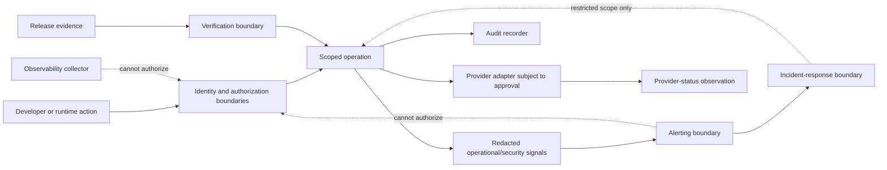
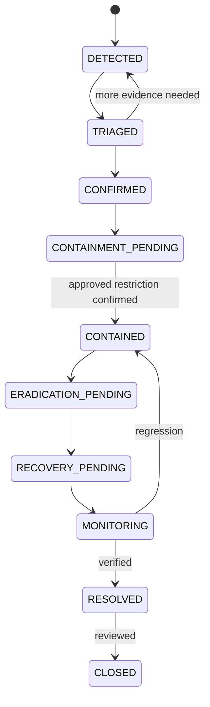

# Foundation V1 Observability and Operational Security Architecture

## 1. Document status

| Field | Value |
|---|---|
| Title | Foundation V1 Observability and Operational Security Architecture |
| Analysis date | 24 July 2026 |
| Branch | `rebuild/foundation-v1` |
| HEAD | `9e1fc38797af0cfce824e149a439f43c50024e33` |
| Upstream | **VERIFIED FACT:** `origin/rebuild/foundation-v1`, behind 0/ahead 0 at analysis time |
| Status | Technical discovery and conceptual architecture |
| Neutrality | Provider-neutral and implementation-neutral |
| Implementation neutrality | Framework, SDK, protocol, collector, agent, database, schema, queue, scheduler, workflow, and provider remain unselected |
| Authorization | **NOT AUTHORIZED:** implementation, Production, real data, real providers, security controls, or observability controls |
| Claims | No completeness, certification, compliance, contractual suitability, provider suitability, incident readiness, or operational-readiness claim |
| Authority | Approved Product Owner Decisions 1–10 are authoritative |

## 2. Scope

**PROPOSAL:** Define signal, evidence, attribution, redaction, alert, incident, containment, access, security, release-observation, and retention boundaries for Foundation V1 foundations and non-interpretive document lifecycle only.

## 3. Non-goals

Implementation, provider/framework/SDK selection, OCR, AI, CTE extraction, PUN import, simulations, commercial reports, real-data operation, Production operation, configuration, and security certification are outside this document. Documentation completion is not readiness.

## 4. Verified current repository state

| Subject | Classification | Repository evidence | Current result | Architectural significance | Unresolved question |
|---|---|---|---|---|---|
| Application runtime | VERIFIED FACT | `package.json`, `app/page.tsx` | Next.js 16.2.4, React 19.2.4, client page | Prototype runtime only | Future runtime boundary **PENDING** |
| Scripts | VERIFIED FACT | `package.json` | `dev`, `build`, `start`, `lint`; no test/observability script | No operational entry point proved | Script policy **PENDING; NOT AUTHORIZED** |
| CI and workflow configuration | VERIFIED FACT for repository-visible evidence; UNKNOWN for hidden platform settings | Complete current repository tree and repository-visible configuration files | No committed CI configuration, GitHub Actions workflow, or other repository-visible workflow file was found | No repository-visible automated test, telemetry, security, release, deployment, or quality gate is proved to exist | CI provider, workflow design, required checks, branch protection, hidden GitHub settings, hidden Vercel settings, permissions, and operational policy remain **PENDING** or **UNKNOWN** as appropriate |
| Dependencies | VERIFIED FACT | `package.json`, lockfile | Next/React plus TypeScript, Tailwind, ESLint development dependencies | Dependency graph is not a security platform | Scanning and update policy **PENDING** |
| Lockfile | VERIFIED FACT | `package-lock.json` | Lockfile version 3 | Reproducibility input only | Verification policy **PENDING** |
| Next configuration | VERIFIED FACT | `next.config.ts` | Typed empty configuration object | No repository-visible headers, middleware, or telemetry controls | Configuration **PENDING** |
| TypeScript configuration | VERIFIED FACT | `tsconfig.json` | Strict, no-emit, bundler resolution, Next plugin | Static typing is not runtime security | Runtime validation **PENDING** |
| ESLint configuration | VERIFIED FACT | `eslint.config.mjs` | Next Core Web Vitals and TypeScript configs | Static quality only | Security rules **PENDING** |
| Application structure | VERIFIED FACT | `app/layout.tsx`, `app/page.tsx`, `app/globals.css` | App Router shell and large client component | No server authority is established | Boundary refactor **PENDING; NOT AUTHORIZED** |
| Console logging | VERIFIED FACT | `app/page.tsx` extraction catch | `console.error` is used for extraction failure | Console output is not structured or durable evidence | Redacted logging **PENDING** |
| Error handling | VERIFIED FACT | `app/page.tsx` | Errors may resolve to empty text and defaults | False success and information loss are possible | Typed error policy **PENDING** |
| PDF.js loading | VERIFIED FACT | `app/page.tsx` | PDF.js 3.11.174 and worker fetched from cdnjs | External browser script boundary is unassessed | Dependency/integrity decision **PENDING** |
| Browser FileReader | VERIFIED FACT | `app/page.tsx` | Selected files read in browser | No approved server ingestion boundary | Upload/security design **PENDING; NOT AUTHORIZED** |
| Browser-memory state | VERIFIED FACT | `app/page.tsx` React `useState` | State exists only in browser memory | No durable or tenant-safe evidence | Persistence and attribution **PENDING** |
| Hardcoded/simulated data | VERIFIED FACT | `app/page.tsx`, `PROJECT_AUDIT.md` | Operational/customer-like values and behavior are locally constructed | Not authoritative business or customer data | Provenance **PENDING** |
| Client deletion | VERIFIED FACT | `app/page.tsx` `filter` handler | In-memory array mutation | No lifecycle, storage, provider, purge, or audit proof | Deletion evidence **PENDING** |
| Server routes/services | VERIFIED FACT | Complete repository tree | No repository-visible backend route/service | No server-side authorization or telemetry sink | Future boundary **PENDING** |
| Persistence | VERIFIED FACT | Complete repository tree, `PROJECT_AUDIT.md` | No database, object store, audit store, or telemetry store | No durable evidence | Persistence/provider decision **PENDING** |
| Authentication | VERIFIED FACT | Complete repository tree | No authentication integration | Identity events cannot be authoritative | Identity boundary **PENDING** |
| Authorization | VERIFIED FACT | Complete repository tree | No server authorization integration | Client outcomes cannot be trusted | Authorization boundary **PENDING** |
| Tenant isolation | VERIFIED FACT | Complete repository tree | No durable tenant isolation | Telemetry attribution cannot be proved | Tenant enforcement **PENDING** |
| Private storage | VERIFIED FACT | Complete repository tree | No private document storage | No private-delivery observation | Storage boundary **PENDING** |
| Audit persistence | VERIFIED FACT | Complete repository tree | No durable AuditEvent persistence | Console/UI state is not audit evidence | Audit store **PENDING** |
| Security-event persistence | VERIFIED FACT | Complete repository tree | No SecurityEvent store | Security evidence is absent | Taxonomy/store **PENDING** |
| Lifecycle-event persistence | VERIFIED FACT | Complete repository tree | No LifecycleEvent store | Lifecycle evidence is absent | Lifecycle evidence **PENDING** |
| Structured logs | VERIFIED FACT | Complete repository tree | No structured logging implementation | No stable event contract | Logging mechanism **PENDING** |
| Metrics | VERIFIED FACT | Complete repository tree | No metrics implementation | No SLI/SLO evidence | Metrics mechanism **PENDING** |
| Traces/correlation | VERIFIED FACT | Complete repository tree | No trace or correlation implementation | No causation chain | Trace model **PENDING** |
| Error tracking | VERIFIED FACT | Complete repository tree | No error-tracking integration | Errors are not durable or redacted by policy | Error capture **PENDING** |
| Health/readiness/liveness | VERIFIED FACT | Complete repository tree | No endpoints or signals found | No readiness authority | Signal policy **PENDING** |
| Environment validation | VERIFIED FACT | Complete repository tree | No repository-visible validation | Environment identity is not proved | Configuration policy **PENDING** |
| Secrets validation | VERIFIED FACT | Complete repository tree | No secrets validation | Secret safety is not implemented | Secret policy **PENDING** |
| Security headers/CSP | UNKNOWN | No committed header or middleware evidence | Framework/provider defaults cannot be established | Defaults cannot be assumed | Header policy **UNKNOWN; PENDING** |
| Middleware | VERIFIED FACT | Complete repository tree | No middleware file found | No repository-visible edge policy | Boundary **PENDING** |
| Rate limiting/abuse | VERIFIED FACT | Complete repository tree | No implementation found | No abuse control is proved | Policy/provider **PENDING** |
| Malware scanning | VERIFIED FACT | Complete repository tree | No scanner or quarantine implementation | Content safety remains conceptual | Scan policy **PENDING; NOT AUTHORIZED** |
| Vulnerability/dependency scanning | VERIFIED FACT | Package files/tree | No configured scanner found | Supply-chain readiness not proved | Tool/policy **PENDING** |
| Secret scanning | VERIFIED FACT | Complete repository tree | No configured scanner found | Leakage detection not proved | Tool/policy **PENDING** |
| Alerting/incident management | VERIFIED FACT | Complete repository tree | No alert, incident, or runbook integration | No incident readiness | Authority/process **PENDING** |
| Dashboards/SLI/SLO | VERIFIED FACT | Complete repository tree | No dashboard or SLI/SLO definitions | No operational objective | Definitions **PENDING** |
| Support/emergency access | VERIFIED FACT | Complete repository tree | No controls or runbooks found | No access evidence | Process **PENDING** |
| Telemetry retention/purge | VERIFIED FACT | Complete repository tree | No telemetry store or purge evidence | No duration/origin may be inferred | Retention/purge **PENDING** |
| Release/rollback observation | VERIFIED FACT | Complete repository tree | No release observation or rollback automation | Deployment safety not proved | Future release boundary **PENDING** |

## 5. Observability and operational-security principles

**APPROVED OWNER BASELINE:** Local, CI, and ordinary Preview are synthetic-only; Production deployment and real-data activation are **NOT AUTHORIZED**; no real document enters an unapproved provider; document content, credentials, tokens, cookies, authorization headers, secrets, and private-delivery material are excluded from ordinary telemetry and audit evidence. Authentication, authorization, tenant, permission, entitlement, licence, feature, environment, provider, release, incident, support, and emergency authorities remain distinct. Operational telemetry is not automatically AuditEvent. Missing, stale, sampled, delayed, ambiguous, or conflicting telemetry cannot create business, lifecycle, deletion, provider, release, or security success. Observability, alerting, incident response, and support access cannot authorize operations. Retention and purge origins/durations remain **PENDING**. Implementation remains **NOT AUTHORIZED**.

Normative discovery boundaries: **Production deployment remains NOT AUTHORIZED. Production real-data activation remains NOT AUTHORIZED. No document content may be written to ordinary logs, traces, metrics, alerts, or audit evidence. Credentials, tokens, cookies, authorization headers, secrets, and private-delivery material must not appear in telemetry. Observability cannot authorize an operation. Alerting cannot authorize an operation. Incident response grants no unrestricted access.** The release sequence remains `branch → push → Pull Request → Preview → checks → approval → merge → Production → verification`. No provider, framework, SDK, protocol, agent, collector, database, queue, scheduler, workflow, or implementation mechanism is selected; no current provider is assigned `APPROVED` status.

## 6. Terminology

| Term | Meaning |
|---|---|
| Operational telemetry | Logs, metrics, traces, health, and error signals for operation; not automatically audit |
| Security evidence | Attributable security outcome with purpose and scope |
| Correlation | Shared operation relationship |
| Causation | Predecessor-to-successor relationship |
| Redaction | Removal or minimization of prohibited content |
| Alert | Governed notification candidate, not authorization |
| Incident | Classified operational/security condition, not unrestricted access |
| Health | Limited signal about service condition |
| Readiness | Whether a target may receive traffic under future policy |
| Liveness | Whether a process responds without proving business success |
| Purge | Governed deletion request/confirmation boundary |
| Production | Conceptual target; deployment and real data remain **NOT AUTHORIZED** |

## 7. Environment observability and security matrix

| Environment | Purpose | Permitted data | Prohibited data | Actors | Identity | Secrets | Provider | Logs | Metrics | Traces | Errors | Health | Security events | Alerts | Incidents | Persistence | Evidence | Teardown | Status |
|---|---|---|---|---|---|---|---|---|---|---|---|---|---|---|---|---|---|---|---|
| Local | Developer feedback | Marked synthetic only | Real documents/customer data | Developer, local runner | Synthetic, server policy later | No Production secrets | Substitutes only | Redacted local diagnostics | Synthetic aggregate only | Synthetic context only | Visible safe failures | No authority | Synthetic security cases | Informative only | No unrestricted access | Ephemeral | Local attributable evidence | Destroy fixtures/references | NOT AUTHORIZED |
| CI | Repeatable checks | Marked synthetic only | Real data, credentials, providers | CI actor, test runner | Trusted CI identity later | Ephemeral references only | Provider-neutral substitutes | Redacted, bounded | Commit-bound synthetic | Commit-bound synthetic | Failure evidence | No release authority | Negative cases | Candidate gate signals | No incident authority | Isolated ephemeral | Commit/config/fixture bound | Deterministic cleanup | NOT AUTHORIZED |
| Preview | Commit-bound review | Marked synthetic only | Production data/resources/secrets | Reviewer, stakeholder, automated actor | Separate Preview identity | Preview-only references | Approved substitutes only | Restricted/redacted | Synthetic aggregate | Commit-bound | Safe failure | No Production authority | Synthetic security events | Review signal | Restricted incident boundary | Temporary only | Commit/artifact/access evidence | Teardown and revoke | NOT AUTHORIZED |
| Production | Conceptual controlled target | No real data authorized here | Unapproved or unclassified data | Future approved operators/runtime | Future server identity | Production-only future references | Future approved inventory | Future approved redacted signals | Future policy | Future policy | Future policy | Future policy | Future policy | Future policy | Future policy | Future durable store | Release evidence | Governed retirement | NOT AUTHORIZED |

No fifth approved environment exists. Environment identity is server-authoritative; a client or environment name grants no authority.

## 8. Authority boundaries

| # | Actor/boundary | Responsibility | Trusted inputs | Allowed influence | Prohibited influence | Approval authority | Data-access boundary | Safe failure | Evidence |
|---:|---|---|---|---|---|---|---|---|---|
| 1 | developer | Propose code/document changes | Repository and assigned scope | Request checks/review | Production, real data, telemetry authority | None alone | No protected data | Stop and surface | Commit/action evidence |
| 2 | reviewer | Review scoped evidence | Current commit and signals | Accept/reject review | Stale or universal approval | Scoped review only | Review evidence only | Withhold | Review record |
| 3 | Product Owner | Decide product scope/risk | Decisions and reviews | Approve policy decisions | Replace Legal/Privacy/Security | Product scope only | Purpose-bound | Keep pending | Decision evidence |
| 4 | Platform Owner | Govern platform within policy | Platform scope/purpose | Request scoped administration | Unrestricted tenant/content/secret access | None by status alone | Platform scope only | Deny/audit | Privileged event |
| 5 | Tenant Admin | Administer own tenant | Membership and tenant scope | Tenant-scoped action | Platform telemetry/secrets/Production | Tenant scope only | Own tenant only | Deny cross-scope | Tenant event |
| 6 | approved release operator | Operate approved release | Approved artifact/gates | Execute bounded action | Change policy or data eligibility | Execution only | Release scope | Refuse incomplete | Deployment evidence |
| 7 | application runtime | Enforce runtime policy | Server-derived identity/context | Perform authorized use case | Self-approve or rewrite evidence | None | Tenant/purpose scope | Fail closed | Security/audit evidence |
| 8 | identity boundary | Establish identity/session | Trusted identity evidence | Create/revoke identity context | Select authorization or tenant | Identity policy only | Identity metadata | Deny ambiguity | Identity event |
| 9 | authorization boundary | Decide server-side permission | Identity, membership, tenant, policy | Allow/deny request | Client-selected outcome | Authorization policy | Authorized scope | Deny | Decision evidence |
| 10 | provider adapter | Translate approved bounded call | Server request/provider state | Return bounded result | Decide business/lifecycle/retention/incident authority | None | Minimum data | Explicit failure/ambiguity | Provider observation |
| 11 | observability collector | Collect/redact signals | Trusted event/context | Emit signals/alerts | Authorize or invent success | None | Minimized scope | Preserve uncertainty | Signal evidence |
| 12 | audit recorder | Record governed evidence | Trusted event/context | Append/correlate/redact | Authorize or rewrite history | None | Evidence scope | Fail protected operation if required | Audit-of-audit |
| 13 | alerting boundary | Notify governed recipients | Signal and severity policy | Notify/escalate | Authorize or resolve silently | None | Redacted scope | Preserve alert | Alert evidence |
| 14 | incident-response boundary | Contain approved scope | Classified incident/authority | Restrict environment/provider | Unrestricted access or silent rewrite | Emergency scope pending | Minimum incident scope | Least-scope containment | Incident evidence |
| 15 | support-access boundary | Provide approved support | Request/purpose/tenant approval | View minimum telemetry | View secrets/content by default | Separate approval pending | Named scope/time | Deny unapproved | Access evidence |
| 16 | secrets-management boundary | Govern references/rotation | Environment/purpose/actor | Issue/rotate/revoke later | Expose values or authorize release | None | Reference metadata | Deny invalid secret | Secret evidence |

The diagram is provider-neutral and grants no direct Production, real-data, observability, alerting, incident, Platform Owner, or provider authority.

## 9. Data classification, minimization, and redaction

| # | Data class | Purpose | Sensitivity | Permitted signal types | Prohibited signal types | Redaction | Aggregation | Tenant scope | Access | Retention | Purge | Status |
|---:|---|---|---|---|---|---|---|---|---|---|---|---|
| 1 | public operational metadata | Public service description | Low/contextual | Minimized health/metric labels | Secrets/content/customer data | Remove identifiers | Aggregate | Platform | Public only if approved | PENDING | PENDING | NOT AUTHORIZED |
| 2 | internal operational metadata | Runtime condition | Internal | Logs/metrics/health | Document content/credentials | Field allowlist | Aggregate | Platform/environment | Role-scoped | PENDING | PENDING | NOT AUTHORIZED |
| 3 | tenant identifiers | Scope attribution | Sensitive | Scoped security/audit references | Uncontrolled metric cardinality | Tokenize/reference | Bounded | Tenant | Purpose-bound | PENDING | PENDING | NOT AUTHORIZED |
| 4 | user and actor identifiers | Attribution | Sensitive | Security/audit/support evidence | Public telemetry | Minimize | Group where possible | Tenant/platform | Purpose-bound | PENDING | PENDING | NOT AUTHORIZED |
| 5 | authentication and session metadata | Security analysis | Highly sensitive | SecurityEvent | Credentials/tokens/cookies | Remove material | Aggregate | Tenant/platform | Security scope | PENDING | PENDING | NOT AUTHORIZED |
| 6 | authorization-decision metadata | Denial/accountability | Sensitive | Security/AuditEvent | Policy secrets/content | Minimize policy detail | Aggregate | Tenant | Authorization scope | PENDING | PENDING | NOT AUTHORIZED |
| 7 | document metadata | Lifecycle/provenance | Sensitive | Lifecycle/Audit reference | Filename/content/address/POD/PDR/tax data | Reference only | Aggregate | Tenant | Lifecycle scope | PENDING | PENDING | NOT AUTHORIZED |
| 8 | document content | Business document | Highly sensitive | None in ordinary telemetry | Logs/metrics/traces/alerts/audit | Exclude | Never | Tenant | Private scope | Approved policy pending | Approved purge pending | NOT AUTHORIZED |
| 9 | credentials, tokens, cookies, and secrets | Authentication/control | Critical | None | All telemetry/audit | Never collect | Never | Environment | Secrets boundary | PENDING | PENDING | NOT AUTHORIZED |
| 10 | licensing and commercial metadata | Commercial decisions | Sensitive | Security/Audit references | Payment payloads or identifiers | Minimize | Aggregate | Tenant | Commercial scope | PENDING | PENDING | NOT AUTHORIZED |
| 11 | audit, security, lifecycle, and release evidence | Accountability | Sensitive | Audit/Security/Lifecycle/Release | Content/secrets | Redact | Limited | Tenant/platform | Authority-scoped | Approved policy pending | Approved purge pending | NOT AUTHORIZED |
| 12 | provider, region, environment, and configuration metadata | Governance | Sensitive | Provider/Release/Health signals | Secret values/location assumptions | Minimize | Aggregate | Platform | Governance scope | PENDING | PENDING | NOT AUTHORIZED |

Document content, credentials, tokens, cookies, authorization headers, secrets, and private-delivery material are prohibited from ordinary telemetry and audit content. Pseudonymization does not make real data synthetic. No retention duration or origin is invented.

## 10. Observability and security signal taxonomy

| # | Signal | Purpose | Authority | Attribution | Timestamps | Tenant | Environment | Correlation | Causation | Permitted content | Prohibited content | Retention | Safe failure | Status |
|---:|---|---|---|---|---|---|---|---|---|---|---|---|---|---|
| 1 | OperationalLogEvent | Operational diagnosis | None | Actor/context where trusted | Event/ingest | Scoped | Required | Optional required | Optional | Minimized fields | Content/secrets | PENDING | Preserve uncertainty | NOT AUTHORIZED |
| 2 | SecurityEvent | Security outcome | None | Actor/tenant/policy | Event/ingest | Required where applicable | Required | Required where available | Required where causal | Denial/anomaly metadata | Credentials/content | PENDING | Fail protected action | NOT AUTHORIZED |
| 3 | AuditEvent | Accountability | None | Trusted actor/subject | Event/effective/ingest | Required | Required | Required | Required | References/outcome | Content/secrets | Approved policy pending | Missing evidence not success | NOT AUTHORIZED |
| 4 | LifecycleEvent | State/lifecycle evidence | None | Trusted actor/document ref | Event/effective/ingest | Required | Required | Required | Required | State/reference | Content/secrets | Document/audit policy pending | Preserve prior state | NOT AUTHORIZED |
| 5 | MetricObservation | Aggregate measurement | None | Environment/release/provider | Observation/ingest | Bounded | Required | Optional | Optional | Aggregate values | Customer/content/cardinality | PENDING | Mark missing/stale | NOT AUTHORIZED |
| 6 | TraceObservation | Operation path | None | Trusted context | Start/end/ingest | Minimized | Required | Required | Required | Span metadata | Content/secrets | PENDING | Mark incomplete | NOT AUTHORIZED |
| 7 | HealthObservation | Health signal | None | Runtime/dependency | Observation/ingest | Platform | Required | Optional | Optional | Status/category | Sensitive internals | PENDING | Unknown/degraded | NOT AUTHORIZED |
| 8 | ErrorEvent | Failure capture | None | Operation/actor/context | Error/ingest | Scoped | Required | Required | Required | Category/redacted detail | Payloads/secrets | PENDING | No false fallback | NOT AUTHORIZED |
| 9 | ReleaseObservation | Release verification | None | Artifact/config/actor | Event/verification | Platform | Required | Required | Required | Identity/status | Content/secrets | PENDING | Block ambiguity | NOT AUTHORIZED |
| 10 | ProviderStatusObservation | Provider governance state | None | Provider record/context | Event/ingest | Platform/tenant scope | Required | Required | Required | State/result/location status | Provider secrets | PENDING | Block unknown | NOT AUTHORIZED |
| 11 | AlertEvent | Notification candidate | None | Signal/policy | Created/updated | Scoped | Required | Required | Required | Redacted condition | Content/secrets | PENDING | Keep visible | NOT AUTHORIZED |
| 12 | IncidentEvent | Incident lifecycle | None | Incident/actor | State/action/ingest | Scoped | Required | Required | Required | Redacted incident facts | Content/secrets | PENDING | Preserve ambiguity | NOT AUTHORIZED |

No signal category grants authority by itself.

## 11. Operational logging architecture

**Objective:** define structured, minimized operational events. **Trusted source:** server-authoritative operation/context; browser and provider claims are untrusted. **Required fields:** stable event name, level, event time, ingest time, environment, operation identity, outcome, correlation, causation, actor/tenant scope where applicable, and redaction status. **Optional fields:** release, commit, provider category, bounded duration, retry identity. **Prohibited fields:** document content, filenames where unnecessary, credentials, tokens, cookies, authorization headers, complete external payloads, addresses, POD/PDR, tax codes, and secret values. **Attribution:** server-derived tenant/actor/environment only. **Correlation/causation:** preserve when known, mark missing otherwise. **Redaction:** before persistence/export. **Cardinality:** bounded and policy-approved; no uncontrolled tenant labels. **Sampling:** pending and never for required security evidence without policy. **Loss:** mark loss/unknown; never invent success. **Duplicate/order:** retain identity and ordering ambiguity. **Evidence:** redacted event with provenance. **Unresolved decisions:** level taxonomy, mechanism, transport, collector, retention, and purge **PENDING; NOT AUTHORIZED**.

## 12. Security logging architecture

**Objective:** record authentication, sessions, invitations, memberships, authorization denials, cross-tenant attempts, escalation, licensing/storage/provider violations, support/emergency access, secrets/configuration anomalies, rate limits, abuse, and evidence-integrity outcomes. **Trusted source:** identity/authorization/security boundaries. **Required fields:** event family, policy decision, actor, tenant, environment, time, correlation, causation, redaction, and evidence status. **Optional fields:** risk category, bounded source context, release/provider reference. **Prohibited fields:** credentials, verifier material, tokens, cookies, document content, full payloads, and unnecessary IP/device detail. **Severity and response:** policy-defined and pending. **Minimum privilege/purpose:** mandatory. **Loss/duplicate/order:** explicit uncertainty and reconciliation. **Evidence:** SecurityEvent and audit reference, never authority. **Unresolved mechanisms:** **PENDING; NOT AUTHORIZED**.

**Cardinality:** Security-event names and categories use bounded vocabularies. Uncontrolled tenant, actor, document, customer, email, POD, PDR, filename, token, payload, provider-response, or request-content values must not become uncontrolled labels or dimensions. Tenant and actor attribution may exist only through approved bounded or otherwise controlled representations. Exact cardinality mechanism and limits remain **PENDING**; no technology or provider is selected.

**Sampling:** Sampling policy remains **PENDING**. Security evidence required for authorization denial, cross-tenant attempts, privilege escalation, invitation replay, session misuse, support access, emergency access, provider-policy violations, secret anomalies, and evidence-integrity failures must not be silently sampled away. A sampled, missing, partial, stale, or dropped security signal cannot be treated as proof that the security event did not occur. Sampling cannot alter, suppress, or convert the authoritative result of an operation. No sampler, collector, SDK, provider, or mechanism is selected; implementation remains **NOT AUTHORIZED**.

## 13. Metrics architecture

**Objective:** define safe counters, gauges, and conceptual distributions. **Trusted source:** server outcomes and bounded aggregation. **Required attribution:** environment, release where approved, provider category where approved, and bounded operation. **Prohibited dimensions:** document/customer content, email, POD, PDR, tax code, address, filename, token, secret, or uncontrolled tenant cardinality. **Tenant safety:** aggregate or purpose-bound references only. **Success/failure:** distinct; missing, stale, delayed, duplicate, reset, or ambiguous values are not success. **Provider/environment/release:** explicit only when trusted. **Cardinality and sampling:** thresholds and mechanism **PENDING**. **Evidence:** redacted observation and aggregation provenance. **Implementation:** **NOT AUTHORIZED**; no metrics technology selected.

## 14. Tracing, correlation, and causation

**Objective:** preserve operation relationships without content leakage. **Trusted source:** server-generated context. **Required:** trace, span/operation, correlation, causation, parent, environment, actor/tenant scope where allowed, commit/release, provider-call and background-operation boundaries, retry identity. **Optional:** bounded timing/status. **Prohibited:** raw document content, secrets, tokens, client-selected authoritative context, full payloads. **Propagation:** missing or conflicting context is marked and cannot authorize. **Cross-tenant propagation:** rejected or isolated. **Redaction/cardinality/sampling:** pending policy. **Duplicate/loss:** preserve identity and uncertainty. **Evidence:** redacted trace relationship. **Implementation:** **NOT AUTHORIZED**.

## 15. Error-capture architecture

**Objective:** distinguish handled/unhandled, validation, authorization, provider, timeout, ambiguous external, storage, lifecycle, deletion, audit, telemetry, configuration, secret, release, and rollback errors. **Trusted source:** operation boundary and error policy. **Fields:** category, operation, status, actor/tenant/environment scope, correlation, causation, timestamps, redaction status. **Stack boundary:** minimized and policy-controlled. **User-facing error:** distinct from diagnostic detail. **Prohibited:** sensitive payload, content, credentials, tokens, invented fallback. **Loss/duplicate/order:** explicit and reconciled. **Evidence:** ErrorEvent plus protected audit/security evidence where required. **Unresolved:** mechanism, retention, export, and alerting **PENDING; NOT AUTHORIZED**.

**Cardinality:** Error categories, operation identifiers, environment identifiers, release identifiers, and approved correlation fields must remain bounded or controlled. Uncontrolled tenant, actor, document, customer, filename, payload, stack value, provider response, request value, token, secret, or external identifier must not become uncontrolled dimensions. Raw error messages must not create unbounded labels. Exact cardinality mechanism and limits remain **PENDING**; no technology or provider is selected.

**Sampling:** Sampling policy remains **PENDING**. Errors relevant to authorization, tenant isolation, security, audit recording, lifecycle, deletion, provider ambiguity, configuration, secrets, release, rollback, and evidence integrity must not be silently sampled away. A sampled, missing, partial, stale, or dropped error signal cannot become successful evidence. Sampling cannot replace required AuditEvent, SecurityEvent, LifecycleEvent, deletion confirmation, provider confirmation, release evidence, or incident evidence. Retries and sampling must preserve prior failure history. No sampler, SDK, error-tracking provider, collector, or mechanism is selected; implementation remains **NOT AUTHORIZED**.

## 16. Security-event taxonomy

| # | Event family | Trigger | Source | Severity boundary | Tenant | Actor | Content | Response | Evidence | Safe failure | Status |
|---:|---|---|---|---|---|---|---|---|---|---|---|
| 1 | authentication success | Valid authentication | Identity boundary | Policy pending | Scoped | Required | Metadata only | Record | Security/audit ref | No success without trusted source | NOT AUTHORIZED |
| 2 | authentication failure | Invalid attempt | Identity boundary | Policy pending | If known | Minimized | No verifier | Rate/alert pending | Event | Deny | NOT AUTHORIZED |
| 3 | session creation, refresh, or anomaly | Session state | Session boundary | Policy pending | Required | Required | No token | Review/deny | Event | Fail closed | NOT AUTHORIZED |
| 4 | session revocation or use-after-revocation | Revoked use | Session boundary | High-risk pending | Required | Required | No material | Revoke/alert | Event | Deny | NOT AUTHORIZED |
| 5 | invitation issuance or acceptance anomaly | Invitation state | Identity boundary | Policy pending | Required | Required | No verifier | Review/deny | Event | Deny | NOT AUTHORIZED |
| 6 | invitation replay, stale verifier, or superseded verifier | Replay/stale use | Identity boundary | High-risk pending | Required | Required | No verifier | Deny/alert | Event | Deny | NOT AUTHORIZED |
| 7 | membership activation, deactivation, revocation, or conflict | Membership change | Membership boundary | Policy pending | Required | Required | Metadata | Reconcile | Event | Preserve prior | NOT AUTHORIZED |
| 8 | tenant mismatch or cross-tenant attempt | Scope mismatch | Authorization boundary | High-risk pending | Both if safe | Actor | No content | Deny/alert | SecurityEvent | Deny | NOT AUTHORIZED |
| 9 | role or permission escalation attempt | Unauthorized privilege | Authorization boundary | High-risk pending | Required | Required | Policy ref | Deny/alert | Event | Deny | NOT AUTHORIZED |
| 10 | licence, entitlement, seat, or feature denial | Commercial denial | Commercial boundary | Policy pending | Required | Required | Metadata | Deny/reconcile | Event | Deny | NOT AUTHORIZED |
| 11 | Platform Owner purpose violation | Scope breach | Authorization boundary | Critical pending | Platform | Actor | Purpose ref | Restrict/alert | Event | Deny | NOT AUTHORIZED |
| 12 | Tenant Admin overreach | Platform action | Authorization boundary | High-risk pending | Required | Required | Metadata | Deny | Event | Deny | NOT AUTHORIZED |
| 13 | document upload or storage denial | Storage policy failure | Storage boundary | Policy pending | Required | Required | No content | Deny | Event | Deny | NOT AUTHORIZED |
| 14 | private-delivery misuse | Unauthorized delivery | Storage boundary | High-risk pending | Required | Required | No token | Deny/revoke | Event | Deny | NOT AUTHORIZED |
| 15 | lifecycle, retention, deletion, or purge failure | Layer mismatch/failure | Lifecycle/audit | High-risk pending | Required | Required | Reference only | Reconcile | Event | Not confirmed | NOT AUTHORIZED |
| 16 | provider-state, location, or policy violation | Provider boundary breach | Provider adapter | High-risk pending | Platform | Actor/context | No secret | Restrict/suspend | Provider event | Deny | NOT AUTHORIZED |
| 17 | secret or configuration anomaly | Invalid/drift/expiry | Secret/config boundary | Critical pending | Environment | Actor | Reference only | Revoke/restrict | Event | Deny | NOT AUTHORIZED |
| 18 | rate-limit, abuse, or misuse event | Threshold/bypass | Abuse boundary | Policy pending | Scoped | Minimized | No payload | Throttle/alert | Event | Deny | NOT AUTHORIZED |
| 19 | support, emergency, or incident-access event | Access action | Access boundary | High-risk pending | Required | Required | Scope only | Review/revoke | Event | Deny | NOT AUTHORIZED |
| 20 | audit, security-evidence, or telemetry-integrity failure | Missing/tampered evidence | Evidence boundary | Critical pending | Scope | Actor/system | No content | Protect/reconcile | Event | No success | NOT AUTHORIZED |

## 17. Identity and session security observation

**Objective:** observe authentication success/failure, session creation/refresh/revocation, use-after-revocation, replay, obsolete material, suspicious sessions, email verification/change, identity mismatch, linking rejection, tenant suspension, and commercial block. **Normal event:** trusted state transition. **Denial event:** invalid identity, membership, verifier, or session. **Suspicious event:** replay, impossible sequence, or conflict. **Trusted authority:** identity and authorization boundaries. **Tenant/actor:** server-derived and minimized. **Redaction:** never record credentials, verifiers, tokens, cookies, or headers. **Alert/incident:** thresholds and response **PENDING**. **Evidence:** SecurityEvent plus audit reference where required. **Safe failure:** deny and preserve uncertainty. **No identity provider is selected; implementation is NOT AUTHORIZED.**

## 18. Tenancy and authorization security observation

**Objective:** observe trusted tenant derivation, cross-tenant read/write/delete/export/storage/audit/telemetry attempts, mixed batches, shared-cache risk, background scope, provider scope, Platform Owner purpose limits, Tenant Admin limits, client tenant rejection, and server-side denial. **Normal:** authorized same-tenant operation. **Denial/suspicious:** mismatch, overreach, or client-selected tenant. **Authority:** server authorization. **Redaction:** references only. **Alert/incident:** policy pending. **Evidence:** decision, tenant, actor, environment, correlation. **Safe failure:** deny; no telemetry creates access. **Implementation:** **NOT AUTHORIZED**.

## 19. Invitations and memberships

**Objective:** observe invitation issuance, delivery failure, acceptance, expiry, revocation, replay, verifier replay, supersession, replacement, prior-verifier invalidation, concurrent acceptance, membership activation/deactivation/revocation/conflict, tenant block, and suspicious invitation activity. **Trusted authority:** identity/membership boundary. **Events:** normal, denial, anomaly separately. **Redaction:** no verifier or token. **Alert/incident:** pending. **Evidence:** state transition and correlation. **Safe failure:** only current valid verifier may succeed; stale, replayed, superseded, revoked, or expired material fails closed. **Implementation:** **NOT AUTHORIZED**.

## 20. Licensing and entitlements

**Objective:** observe manual payment (approved initial baseline), payment ambiguity, licence activation/block/suspension/expiry, seats, entitlements, features, quantitative limits, grace, reinstatement, and duplicate evidence. **Authority:** separate server-side commercial decisions. **Payment evidence alone never activates, reinstates, unblocks, grants, allocates, or enables rights.** Client, provider response, test runner, and telemetry cannot activate rights. **Redaction:** no payment payloads. **Alert/incident:** pending. **Evidence:** decision chain. **Safe failure:** ambiguous/conflicting evidence blocks and reconciles; duplicates have no duplicate effect. **No payment provider is selected; implementation is NOT AUTHORIZED.**

## 21. Document upload and storage security

**Objective:** observe UploadIntent issuance/denial/expiry, validation, integrity/type/size mismatch, storage-limit/entitlement/permission denial, quarantine, transfer/finalization failure, object mismatch/wrong tenant, private delivery/token misuse, public URL prohibition, deletion ambiguity, and no content telemetry. **Authority:** server storage policy. **Redaction:** no document content, token, secret, or full payload. **Alert/incident:** pending. **Evidence:** intent/reference/outcome only. **Safe failure:** deny or remain ambiguous; no storage provider is selected. **Implementation:** **NOT AUTHORIZED**.

## 22. Lifecycle, retention, deletion, and purge security

**Objective:** observe lifecycle/invalid/archive transitions, Bill deletion eligibility only after 60 calendar days have elapsed from `archived_at`, CTE deletion eligibility only after 12 calendar months have elapsed from `archived_at`, reliable and approved CTE contractual expiry, application/storage/provider/subprocessor/backup deletion layers, audit-retention independence, audit purge, telemetry purge, missing retention origin/duration, legal hold/investigation pending, ambiguity, and resurrection prevention. **Authority:** separate lifecycle, storage, provider, audit, and telemetry policies. **Evidence:** each layer independently. **Safe failure:** missing, ambiguous, conflicting, or untrusted `archived_at` fails closed and cannot create deletion eligibility; partial, ambiguous, or stale result fails closed; document deletion does not authorize audit or telemetry purge; request is not confirmation. **Calendar days** and **calendar months** remain explicit. The eligibility origin is `archived_at`, not upload time, creation time, modification time, provider timestamp, contractual start date, or another inferred timestamp. Reliable and approved contractual expiry may support the separately governed CTE transition to Expired and Archived, but it does not replace the `archived_at` origin for the 12-calendar-month deletion-eligibility rule. A deletion-eligibility calculation does not authorize or confirm deletion. Legal hold and investigation-preservation rules remain **PENDING**. No retention origin or duration other than the approved Bill and CTE rules is introduced; no physical-erasure guarantee is claimed. Implementation remains **NOT AUTHORIZED**.

## 23. Provider security

| State | Observation rule | Unknown/location | Retention/deletion | Human/training use | Outage/ambiguity | Safe failure | Status |
|---|---|---|---|---|---|---|---|
| UNASSESSED | Deny operational data | Deny unknown | No evidence | Deny | Isolate | Block | NOT AUTHORIZED |
| DISCOVERY_ONLY | Discovery metadata only | Must remain unknown/assessed | No real data | Deny | Isolate | Block | NOT AUTHORIZED |
| ASSESSMENT_IN_PROGRESS | No real document | Require evidence | Pending | No use | Isolate | Block | NOT AUTHORIZED |
| CONDITIONALLY_APPROVED | Only stated conditions | Enforce location | Evidence required | Explicit approval only | Restrict | Block unmet condition | NOT AUTHORIZED |
| APPROVED | Conceptual future state only | Approved evidence required | Approved policy required | Approved policy required | Governed | Fail closed | NOT AUTHORIZED |
| RESTRICTED | Allowed subset only | Recheck | Restrict deletion/use | Restrict support/training | Contain | Deny disallowed | NOT AUTHORIZED |
| SUSPENDED | No new disallowed activity | Reassessment | Preserve evidence | Revoke access | Contain | Deny | NOT AUTHORIZED |
| REJECTED | No operational use | Prohibited | Exit evidence pending | Prohibited | Isolate | Deny | NOT AUTHORIZED |
| EXITING | Migration/exit only under approval | Track all locations | Deletion confirmation not implied | No new use | Reconcile | Block ambiguity | NOT AUTHORIZED |

State is not self-approved; no current provider is assigned APPROVED. No-training, model-improvement, human-review, support, migration, outage, and ambiguous-result boundaries remain pending.

**Objective:** Define observation of provider state, policy, location, subprocessors, support access, retention, deletion evidence, no-training, model-improvement, human-review, outage, restriction, suspension, rejection, and exit conditions without granting provider authority.

**Normal event:** A normal provider-governance observation is a trusted, attributable, redacted observation consistent with the provider’s current authoritative state and approved scope. It does not approve a provider, grant real-data eligibility, authorize Production, or authorize an operation.

**Denial event:** Denial observations cover UNASSESSED use; DISCOVERY_ONLY use outside discovery; ASSESSMENT_IN_PROGRESS operational use; unknown or mismatched location; unapproved subprocessors; unapproved support access; unapproved human review; retention-policy conflict; deletion-evidence failure; no-training or model-improvement conflict; and RESTRICTED, SUSPENDED, REJECTED, or EXITING use outside authoritative allowed scope.

**Suspicious event:** Suspicious observations cover unexpected provider-state change, state drift, location drift, subprocessor change, support-access anomaly, training or model-improvement anomaly, human-review anomaly, deletion-evidence anomaly, retention anomaly, outage concealment, ambiguous provider result, provider identity mismatch, and provider restriction during an operation.

**Trusted authority:** The authoritative provider-governance boundary determines provider state and permitted scope. A provider response, adapter, client, developer, observability collector, alert, incident record, Platform Owner status, or Tenant Admin status cannot self-approve provider use. Evidence recording is distinct from approval.

**Tenant scope:** Provider observations preserve tenant isolation where tenant-related. Platform-level provider observations must not disclose one tenant’s information to another. Provider state may be platform-scoped while individual operations remain tenant-scoped. Missing or conflicting tenant attribution fails closed where tenant attribution is required.

**Actor scope:** Human and system actor attribution is recorded where applicable. Provider-supplied actor identity is not automatically authoritative. Support, incident, Platform Owner, Tenant Admin, application-runtime, and provider-adapter actions remain separately attributable. Missing or conflicting actor attribution cannot create confirmed success.

**Redaction:** No document content, customer payload, credentials, tokens, cookies, authorization headers, signed or private-delivery material, complete provider request or response payload, or uncontrolled customer identifier may enter the observation.

**Alert boundary:** Alerts may be proposed for provider-state, location, subprocessor, retention, deletion, support, training, model-improvement, human-review, outage, identity, or ambiguity anomalies. Alert creation or resolution does not authorize provider use. Alert mechanism and thresholds remain **PENDING**.

**Incident boundary:** Qualifying provider anomalies may enter the governed incident lifecycle. Incident creation, confirmation, containment, or resolution does not approve the provider. Incident responders receive no unrestricted provider, tenant, document, secret, Production, or real-data access. Incident mechanism remains **PENDING; NOT AUTHORIZED**.

**Safe failure:** Unknown, conflicting, stale, missing, ambiguous, restricted, suspended, rejected, or unauthorized provider evidence fails closed. Ambiguous external completion is not confirmed success. Missing provider telemetry is not evidence of provider safety. No automatic fallback to another provider or Production path is permitted.

**Evidence:** Conceptual evidence includes provider identity, provider state, authoritative state version, environment, tenant where applicable, actor where applicable, correlation, causation, location, subprocessors, applicable restrictions, result, timestamp, redaction, and related alert or incident where applicable. Evidence does not independently authorize provider use.

**Unresolved mechanism:** Provider registry persistence, state enforcement, provider observation, provider-health collection, location verification, subprocessor-change detection, retention verification, deletion-evidence verification, no-training verification, model-improvement verification, human-review verification, support-access verification, alerting, incident handling, reconciliation, and migration or exit handling remain **PENDING**.

**Implementation status:** **NOT AUTHORIZED**.

## 24. Secrets and configuration security

Observe configuration identity/provenance/scope/validation/drift/missing/invalid/conflict, no silent fallback/default Production, secret references without values, rotation/revocation/expiry/use-after-revocation, non-restoration on rollback, no Production-secret reuse, and no client-selected configuration. Trusted server policy and evidence are required. Missing or conflicting values fail closed. No secrets-management provider is selected; implementation **NOT AUTHORIZED**.

## 25. Application, network, and perimeter boundaries

Conceptually cover trusted request, transport, origin/host, proxy/header trust, request size/method/content type, cross-origin/browser, public endpoint and health minimization, denial, and network failure. Framework/provider defaults remain **UNKNOWN**. No WAF, CDN, proxy, hosting, or network provider or header implementation is selected. Evidence is redacted and cannot authorize.

## 26. Rate limiting, abuse, and misuse detection

Observe identity, tenant, IP/network, endpoint, upload, authentication, invitation, private-delivery, and support-access limits; false positives/negatives; retry-after; distributed enforcement; bypass; client-selected limit rejection; alerts and evidence. Thresholds, distribution, and provider remain **PENDING**. Deny or degrade safely; no rate-limit provider is selected and implementation is **NOT AUTHORIZED**.

## 27. Malware and document-content safety boundary

Document interpretation remains outside Foundation V1. OCR and AI remain **NOT AUTHORIZED**. Antimalware decision/blocking policy, engine, and provider are pending; scanning is not implemented. Conditional document quarantine is conceptual and distinct from test quarantine. Absent, failed, stale, ambiguous, or incomplete scan is not PASS; scan result grants no document authorization. Real documents are not used for discovery testing and content does not enter ordinary telemetry.

## 28. Audit, security evidence, and telemetry distinctions

| Signal | Distinct purpose | Not equivalent to | Authority rule | Missing behavior | Retention |
|---|---|---|---|---|---|
| AuditEvent | Accountability | Operational telemetry | Records, does not authorize | Cannot be replaced by telemetry | Audit policy pending |
| SecurityEvent | Security outcome | Incident or audit automatically | Records, does not authorize | Fail protected decision | Security policy pending |
| LifecycleEvent | State transition | Storage/provider deletion | Records layer only | Preserve prior state | Lifecycle policy pending |
| OperationalLogEvent | Diagnosis | Audit evidence | No authority | Mark loss | Telemetry pending |
| MetricObservation | Aggregate measurement | Proof of success | No authority | Mark stale/missing | Telemetry pending |
| TraceObservation | Path/correlation | Audit trail | No authority | Mark incomplete | Telemetry pending |
| ErrorEvent | Failure detail | Successful fallback | No authority | Preserve error | Telemetry pending |
| AlertEvent | Notification | Incident automatically | No authority | Keep visible | Alert policy pending |
| IncidentEvent | Incident state | Legal/privacy/security completion | No authority | Preserve ambiguity | Incident policy pending |
| ReleaseObservation | Release signal | Approval/real-data decision | No authority | Block verification | Release policy pending |

Telemetry is not automatically audit; audit is not ordinary telemetry; alerts and incidents do not grant access; approval evidence does not grant approval; retention decisions remain separate.

## 29. Alert lifecycle and governance

| # | State | Meaning | Entry prerequisites | Allowed actions | Prohibited interpretation | Evidence | Authority | Safe failure | Status |
|---:|---|---|---|---|---|---|---|---|---|
| 1 | NEW | Created alert candidate | Signal/policy | Triage/acknowledge | Not incident or success | Source signal | Alert authority | Keep visible | NOT AUTHORIZED |
| 2 | ACKNOWLEDGED | Recipient accepted | New evidence | Investigate/escalate | Not resolved | Actor/time | Alert authority | Preserve | NOT AUTHORIZED |
| 3 | INVESTIGATING | Review in progress | Acknowledged | Classify/contain request | Not safe | Actions/evidence | Incident authority pending | Preserve | NOT AUTHORIZED |
| 4 | SUPPRESSED_WITH_APPROVAL | Governed suppression | Explicit approval/reason/expiry | Monitor/review | Not resolution | Approval/expiry | Separate authority | Do not hide | NOT AUTHORIZED |
| 5 | RESOLVED | Signal condition addressed | Evidence | Review/close | Not legal/privacy completion | Verification | Incident authority | Keep open if ambiguous | NOT AUTHORIZED |
| 6 | CLOSED | Reviewed final state | Resolution and review | Archive per policy | Not permanent erasure | Closure evidence | Incident authority | Reopen if conflict | NOT AUTHORIZED |
| 7 | DUPLICATE | Correlated duplicate | Evidence | Link and retain | Not automatic underlying closure | Link evidence | Alert authority | Preserve root | NOT AUTHORIZED |
| 8 | INVALIDATED | Invalid signal/evidence | Invalidation reason | Preserve/review | Cannot satisfy gate | Reason/audit | Governance pending | Block | NOT AUTHORIZED |

Suppression is not resolution; duplicate is not automatic closure; missing alert is not safety; alert state grants no authority.

## 30. Severity and incident classification

| # | Severity | Meaning/impact | Tenant/data/service scope | Escalation | Containment | Evidence | Prohibited interpretation | Status |
|---:|---|---|---|---|---|---|---|---|
| 1 | CRITICAL | Potential systemic/security harm | Multi-tenant or critical | Immediate policy pending | Immediate least-scope | Incident/security evidence | No unrestricted access | NOT AUTHORIZED |
| 2 | HIGH | Significant tenant/security/service harm | Tenant or service | Expedited pending | Restrict as approved | Evidence required | Not legal completion | NOT AUTHORIZED |
| 3 | MEDIUM | Material bounded harm | Scoped | Governed | Scoped | Evidence | Not success | NOT AUTHORIZED |
| 4 | LOW | Limited impact | Narrow | Normal policy | Minimal | Evidence | Not ignored | NOT AUTHORIZED |
| 5 | INFORMATIONAL | Context/no harm asserted | Platform/scoped | Record | None unless changed | Signal | Not approval | NOT AUTHORIZED |

Client and provider cannot select authoritative severity. Thresholds remain **PENDING** and severity grants no unrestricted access.

## 31. Incident lifecycle

| # | State | Meaning | Entry prerequisites | Authority | Allowed actions | Prohibited actions | Evidence | Safe failure | Status |
|---:|---|---|---|---|---|---|---|---|---|
| 1 | DETECTED | Signal indicates possible incident | Signal | Incident authority pending | Triage | Unrestricted access | Detection | Preserve | NOT AUTHORIZED |
| 2 | TRIAGED | Scope/severity reviewed | Detection | Incident authority | Confirm/dismiss pending | Rewrite signal | Triage | Keep open | NOT AUTHORIZED |
| 3 | CONFIRMED | Incident supported by evidence | Triage evidence | Incident authority | Contain | Declare completion | Evidence | Preserve | NOT AUTHORIZED |
| 4 | CONTAINMENT_PENDING | Containment requested | Confirmed | Containment authority | Prepare restriction | Execute unapproved | Request | Deny unsafe | NOT AUTHORIZED |
| 5 | CONTAINED | Scope restricted | Approved action/result | Containment authority | Investigate/recover | Expand access | Result | Preserve ambiguity | NOT AUTHORIZED |
| 6 | ERADICATION_PENDING | Remediation planned | Contained evidence | Security/technical pending | Remediate later | Claim eradication | Plan | Keep contained | NOT AUTHORIZED |
| 7 | RECOVERY_PENDING | Recovery planned | Remediation evidence | Operations pending | Verify recovery | Restore blindly | Plan/evidence | Hold | NOT AUTHORIZED |
| 8 | MONITORING | Post-recovery observation | Recovery evidence | Incident authority | Observe/reopen | Close early | Monitoring | Reopen | NOT AUTHORIZED |
| 9 | RESOLVED | Condition addressed | Verification | Incident authority | Review/close | Claim compliance | Verification | Reopen | NOT AUTHORIZED |
| 10 | CLOSED | Evidence-reviewed closure | Resolved review | Approved authority | Record | Delete evidence | Closure | Preserve | NOT AUTHORIZED |

States are conceptual; no incident platform is selected. CLOSED requires evidence and review, resolution is not legal/privacy/security completion, and no state grants unrestricted access or Production action.

## 32. Containment and operational restriction

Cover request, authority, scope, tenant/provider/environment/feature/session/invitation/licence/storage/private-delivery/release/secret restrictions, evidence preservation, confirmation, partial/ambiguous results, reversal authority, no client selection, and no unrestricted access. Each restriction is independently recorded; ambiguity fails closed. Mechanisms remain **PENDING; NOT AUTHORIZED**.

## 33. Evidence preservation and investigation boundary

Preserve request, authority, purpose, scope, tenant, actor, incident, correlation, append-only/immutable expectation, correction event, redaction, minimization, default document-content and credential prohibition, pending legal hold/investigation preservation, access/export pending, retention/purge pending, chain-of-custody mechanism pending, and no forensic-provider selection. Preservation records evidence; it does not authorize access.

## 34. Support and administrative access

Support requires a request, requester, purpose, tenant authorization, Platform Owner/Tenant Admin limitation, least privilege, time/scope limits, document-content restriction, telemetry/audit scope, secret prohibition, pending impersonation, approval, revocation, evidence, and review. No standing unrestricted access is allowed; process and provider remain **PENDING; NOT AUTHORIZED**.

## 35. Emergency-access boundary

Break-glass is conceptual only: emergency condition, authority, approval, minimum privilege, time/tenant/environment scope, secret/document/session restrictions, evidence, alert, review, revocation, post-event review, no self-approval, no permanent privilege, and pending mechanism. Emergency access grants no general Production or real-data authority; implementation is **NOT AUTHORIZED**.

## 36. Vulnerability, dependency, and supply-chain governance

Observe direct/transitive dependencies, lockfile, source origin, integrity, advisories, vulnerability classification, exploitability (pending), updates/emergency updates, unsupported dependencies, browser CDN/PDF.js risk, secret/dependency/static scanning, source review, build/artifact provenance, remediation, exceptions, and expiry. No scanner, vendor, or provider is selected; implementation **NOT AUTHORIZED**.

## 37. Browser and application security controls

Conceptually cover CSP/script source, external script risk, frame/content-type/referrer/permissions/transport policies, cookies, cross-site/cross-origin/injection/unsafe HTML boundaries, client-bundle secrets, source maps, error disclosure, cache control, and private-document caching prohibition. Framework defaults are **UNKNOWN** unless verified. No headers or control implementation is authorized.

## 38. Privacy, minimization, and purpose limitation

Apply purpose limitation and minimum collection to user/customer identifiers, document metadata/content, email, IP/network, device/browser, location, commercial and provider data. Define redaction, aggregation, pseudonymization boundary, access, retention, purge, tenant isolation, and pending Legal/Privacy review. No compliance claim; no real data or implementation authorized.

## 39. Data location, subprocessors, and provider boundaries

Observe provider identity/category, environment/data class, primary/backup/processing/support locations, subprocessors, unknown/location changes, cross-border boundary, contractual/technical evidence, restriction/suspension/exit. No location, jurisdiction, provider, or suitability is selected or inferred; implementation **NOT AUTHORIZED**.

## 40. Backup and recovery security boundary

Backup existence is **UNKNOWN** unless verified. Cover scope, tenant/environment, encryption, access, provider/location, secret/document handling, retention/deletion, restore request/authorization/verification, deleted-document and purged-evidence resurrection prevention, revoked-secret non-restoration, RPO/RTO pending, and no backup/recovery implementation or provider selection.

## 41. Health, readiness, and liveness

Distinguish health, readiness, liveness, dependency/provider/configuration/secrets/migration/storage/audit-write/telemetry-write checks, degraded/unavailable/stale/cached results, public disclosure minimization, sensitive-detail prohibition, and missing-check failure. No health result grants release, real-data, or provider authority; implementation **NOT AUTHORIZED**.

## 42. Observability quality, gaps, and uncertainty

Cover missing, delayed, duplicate, out-of-order, malformed, stale, partial, ambiguous, conflicting, dropped, sampled, clock-skewed, cardinality-overflow, aggregated, tenant/actor/environment/provider-attribution-failed signals; correction, reconciliation, and no false certainty. Evidence must preserve uncertainty and cannot authorize.

## 43. Service indicators, objectives, and error-budget boundary

| # | Indicator family | Purpose | Numerator | Denominator | Dimensions | Prohibited dimensions | Environment | Evidence | Ambiguity | Threshold | Status |
|---:|---|---|---|---|---|---|---|---|---|---|---|
| 1 | application availability | Service response | Available observations | Eligible observations | Environment | Content/tenant uncontrolled | Future policy | Redacted | Mark missing | PENDING | NOT AUTHORIZED |
| 2 | request error rate | Request failures | Error requests | Total requests | Operation/status | Content | Future policy | Aggregate | Mark stale | PENDING | NOT AUTHORIZED |
| 3 | request latency | Timing | Requests over boundary | Eligible requests | Operation/environment | Identifier/content | Future policy | Distribution | Clock ambiguity | PENDING | NOT AUTHORIZED |
| 4 | authentication success and failure | Identity health | Outcomes | Attempts | Outcome/environment | Credentials | Future policy | Security ref | Missing not success | PENDING | NOT AUTHORIZED |
| 5 | authorization denial | Policy enforcement | Denials | Decisions | Policy category | Content | Future policy | Security ref | Unknown blocked | PENDING | NOT AUTHORIZED |
| 6 | cross-tenant attempt | Isolation signal | Attempts | Requests | Scope category | Tenant uncontrolled | Future policy | Security ref | Attribution pending | PENDING | NOT AUTHORIZED |
| 7 | upload success and failure | Storage flow | Outcomes | Intents | Type/outcome | Filename/content | Future policy | Aggregate | Ambiguous separate | PENDING | NOT AUTHORIZED |
| 8 | private-delivery success and failure | Delivery security | Outcomes | Authorized attempts | Outcome | Token/content | Future policy | Security ref | Missing blocked | PENDING | NOT AUTHORIZED |
| 9 | lifecycle-transition success and failure | State integrity | Valid transitions | Transition attempts | State category | Document content | Future policy | Lifecycle ref | Conflict blocked | PENDING | NOT AUTHORIZED |
| 10 | deletion-confirmation latency and failure | Deletion control | Confirmed outcomes/time | Requests | Layer | Document identity | Future policy | Layer evidence | Request not confirmation | PENDING | NOT AUTHORIZED |
| 11 | audit and security-evidence append success | Evidence health | Appends | Required events | Event family | Content/secrets | Future policy | Audit ref | Missing blocks | PENDING | NOT AUTHORIZED |
| 12 | provider error and timeout | Provider boundary | Errors/timeouts | Calls | Provider category/state | Provider secret | Future policy | Provider ref | Ambiguous separate | PENDING | NOT AUTHORIZED |
| 13 | configuration-drift detection | Configuration safety | Drift detections | Checks | Environment/version | Secret values | Future policy | Config ref | Unknown blocks | PENDING | NOT AUTHORIZED |
| 14 | release-verification success and failure | Release safety | Verified outcomes | Verification attempts | Artifact/environment | Content | Future policy | Release ref | Ambiguous blocks | PENDING | NOT AUTHORIZED |
| 15 | alert and incident-response latency | Response timeliness | Within boundary | Eligible events | Severity | Content | Future policy | Incident ref | Clock pending | PENDING | NOT AUTHORIZED |
| 16 | telemetry completeness and freshness | Signal quality | Present/fresh signals | Expected signals | Signal family | Tenant uncontrolled | Future policy | Quality evidence | Missing not success | PENDING | NOT AUTHORIZED |

No SLI/SLO/SLA, target, threshold, or error budget is approved; no Production measurement is authorized.

## 44. Operational dashboards and views

Define audience-specific Platform Owner, Tenant Admin, release-operator, incident-response, and support views with tenant/platform scope, least privilege, aggregation, drill-down limits, no document content/secrets, stale-data indications, export/sharing boundaries, and no dashboard-provider selection. Visibility grants no underlying data or operational authority.

## 45. Notification and escalation boundary

Define alert source, recipient, purpose, severity, tenant/platform scope, acknowledgement, escalation, delay/failure/duplicate behavior, redaction, no content/credentials, support/incident boundary, pending Legal/Privacy/Security escalation, pending channel provider, and no authorization by notification.

## 46. Release observability

Observe branch, commit/parent, PR/check evidence, artifact, configuration, environment, provider inventory, deployment request/start/result, verification, error rate, health, rollback decision, correlation, actor, and audit relationship. Signals do not authorize deployment or real data; no deployment action is authorized.

## 47. Rollback and hotfix observation

Observe request/authority, target/current artifact/config, compatibility, start/result/confirmation/ambiguity, secret revocation, provider restriction, lifecycle safety, deleted-document/purged-evidence resurrection prevention, verification, incident relationship, hotfix reason, and expedited-but-non-bypassed evidence. Rollback/hotfix execution is **NOT AUTHORIZED**.

## 48. Telemetry retention, deletion, and purge

Distinguish retention origin/duration, event/ingestion/correction timestamps, eligibility, request, confirmation, partial purge, provider/subprocessor/backup/dependent copies, legal hold/investigation pending, tenant/document relationships, audit independence, reconciliation, and resurrection prevention. No origin/duration is approved; missing values fail closed; telemetry purge does not prove audit purge; audit purge does not prove telemetry purge; request is not confirmation.

## 49. Observability and security invariants

| # | Invariant | Violation | Safe failure | Evidence | Gate |
|---:|---|---|---|---|---|
| 1 | trusted environment identity | Client/asserted environment | Deny/unknown | Server evidence | Security |
| 2 | trusted tenant attribution | Missing/wrong tenant | Deny | Attribution event | Isolation |
| 3 | trusted actor attribution | Spoofed actor | Deny | Identity evidence | Security |
| 4 | trusted commit and release attribution | Mismatch | Block | Provenance | Release |
| 5 | no document content in ordinary telemetry | Content emitted | Drop/block | Redaction evidence | Privacy |
| 6 | no credentials, tokens, cookies, or secrets in telemetry | Secret emitted | Block/rotate | Security event | Secret |
| 7 | synthetic-only Local | Real data | Stop/quarantine | Data-policy evidence | Environment |
| 8 | synthetic-only CI | Real data | Stop | CI evidence | Environment |
| 9 | synthetic-only ordinary Preview | Real data | Stop/teardown | Preview evidence | Environment |
| 10 | no Production or real-data authorization | Missing gates | Deny | Gate evidence | Activation |
| 11 | observability cannot authorize | Signal used as authority | Deny | Authority evidence | Authorization |
| 12 | alerting cannot authorize | Alert used as authority | Deny | Alert/audit | Incident |
| 13 | incident response grants no unrestricted access | Scope exceeded | Deny/revoke | Access evidence | Incident |
| 14 | missing evidence is not success | Signal absent | Block/unknown | Gap evidence | All |
| 15 | telemetry and audit remain distinct | Categories collapsed | Reject | Classification | Evidence |
| 16 | deletion and purge layers remain distinct | False equivalence | Reconcile | Layer evidence | Lifecycle |
| 17 | redaction failure fails safely | Sensitive field remains | Block/drop | Redaction result | Privacy |
| 18 | ambiguous/conflicting security evidence is not success | Conflict | Block/reconcile | Conflict record | Security |

## 50. Idempotent operations

| # | Operation | Identity | Scope | Duplicate | Conflict | Result reuse | Evidence | Gate |
|---:|---|---|---|---|---|---|---|---|
| 1 | append operational log event | Event identity | Operation | No duplicate append | Preserve conflict | Same event | Append/redaction | Logging |
| 2 | append security event | Security identity | Tenant/actor | Reuse | Reconcile | Same event | Security/audit | Security |
| 3 | record metric observation | Observation identity | Series/window | Reuse/aggregate | Mark conflict | Same observation | Aggregation | Metrics |
| 4 | create trace or correlation context | Context identity | Operation | Reuse | Reject mismatch | Same context | Context evidence | Trace |
| 5 | record error event | Error identity | Operation | Reuse | Preserve prior | Same event | Error evidence | Error |
| 6 | record health observation | Check/time identity | Environment | Reuse | Mark stale/conflict | Same | Health evidence | Health |
| 7 | create alert | Signal/policy identity | Scope | Reuse/dedup | Reconcile | Same alert | Alert evidence | Alert |
| 8 | acknowledge alert | Alert/action identity | Alert | Reuse | Reject actor conflict | Same | Action evidence | Alert |
| 9 | classify incident | Incident/version identity | Incident | Reuse | Preserve competing | Same version | Incident evidence | Incident |
| 10 | append incident action | Incident/action identity | Incident | Reuse | Reconcile | Same | Action evidence | Incident |
| 11 | request containment | Incident/request identity | Scope | Reuse | Reject scope conflict | Same request | Request evidence | Containment |
| 12 | record containment result | Request/result identity | Scope | Reuse | Preserve ambiguity | Same result | Result evidence | Containment |
| 13 | preserve evidence | Incident/evidence identity | Scope | Reuse | Reconcile | Same preservation | Chain evidence | Preservation |
| 14 | request telemetry purge | Purge/layer identity | Scope | Reuse | Block conflict | Same request | Request/confirmation | Retention |

## 51. Concurrency and race conditions

| # | Race | Risk | Invariant | Safe failure | Evidence | Gate |
|---:|---|---|---|---|---|---|
| 1 | duplicate log emission | Double evidence | Event identity | Deduplicate | Event chain | Logging |
| 2 | duplicate SecurityEvent | Misleading severity | Security identity | Reconcile | Security audit | Security |
| 3 | metric update during aggregation | Wrong value | Aggregate provenance | Mark conflict | Window evidence | Metrics |
| 4 | trace completion after timeout | False success | Incomplete trace | Mark incomplete | Trace chain | Trace |
| 5 | retry while original completes | Duplicate work | Idempotency | Reuse/ambiguity | Attempt chain | All |
| 6 | alert during deduplication | Hidden event | Alert identity | Preserve source | Alert links | Alert |
| 7 | acknowledgement during invalidation | Wrong state | State evidence | Reject stale | Actor/time | Alert |
| 8 | suppression during escalation | Missed response | Approval | Keep visible | Approval chain | Alert |
| 9 | two incident classifications | Conflicting scope | Authority | Preserve both/review | Versioned record | Incident |
| 10 | confirmation during dismissal | Lost incident | Evidence | Reopen | Source evidence | Incident |
| 11 | containment during deployment | Mixed state | Release restriction | Block/reconcile | Deployment link | Release |
| 12 | containment reversal during investigation | Exposure | Reversal authority | Hold restriction | Action chain | Incident |
| 13 | session revocation during request | Use after revoke | Server auth | Deny | Session event | Identity |
| 14 | secret rotation during provider call | Old secret use | Secret non-restoration | Fail/retry policy | Secret/provider evidence | Secret |
| 15 | configuration change during release | Drift | Config identity | Block | Version evidence | Release |
| 16 | provider restriction during operation | Unapproved continuation | Provider state | Stop/ambiguity | Provider event | Provider |
| 17 | tenant suspension during operation | Scope breach | Tenant isolation | Deny/stop | Tenant event | Tenancy |
| 18 | support revocation during session | Over-access | Access scope | Revoke | Access audit | Support |
| 19 | emergency expiry during use | Privilege persistence | Time limit | Revoke | Emergency audit | Emergency |
| 20 | preservation during purge | Evidence loss | Purge restriction | Block purge | Preservation link | Evidence |
| 21 | telemetry purge during investigation | Missing evidence | Preservation | Block/reconcile | Purge chain | Retention |
| 22 | rollback during incident monitoring | Conflicting state | Release identity | Hold/reconcile | Rollback link | Release |
| 23 | health stale during verification | False readiness | Freshness | Block | Health timestamps | Release |

Locks, transactions, queues, schedulers, workflow engines, and coordination technologies remain unselected.

## 52. Coordinated operation boundaries

| # | Boundary | Authority | Trusted inputs | Preconditions | Operation | Result | Failure | Idempotency | Concurrency | Evidence | Mechanism |
|---:|---|---|---|---|---|---|---|---|---|---|---|
| 1 | action and operational logging | Runtime | Outcome/context | Redaction | Append | Event/unknown | Protect/mark | Event identity | Duplicate safe | Log evidence | PENDING |
| 2 | authentication and security evidence | Identity | Decision | Trusted identity | Record | Event | Deny | Security identity | Revoke race | Security evidence | PENDING |
| 3 | authorization and audit evidence | Authorization | Decision | Policy | Record | Event | Deny if required | Decision identity | Policy race | Audit evidence | PENDING |
| 4 | upload/storage and security observation | Storage | Intent/result | Scope | Observe | Result | Ambiguous | Intent identity | Object race | Storage event | PENDING |
| 5 | lifecycle and lifecycle evidence | Lifecycle | State/version | Valid transition | Record | Transition | Preserve prior | Transition identity | State race | Lifecycle event | PENDING |
| 6 | provider call and status observation | Adapter | Approved request/state | Provider conditions | Call/observe | Result | Unknown | Call identity | Restriction race | Provider evidence | PENDING |
| 7 | metric aggregation and cardinality | Metrics | Observations | Policy | Aggregate | Metric | Mark loss | Window identity | Update race | Aggregate evidence | PENDING |
| 8 | trace propagation and redaction | Trace | Trusted context | Scope | Propagate | Context | Mark missing | Context identity | Retry race | Trace evidence | PENDING |
| 9 | error capture and sensitive exclusion | Error | Error/context | Redaction | Capture | Error | Block leak | Error identity | Duplicate race | Error evidence | PENDING |
| 10 | detection and alert creation | Alert | Signal/policy | Threshold pending | Create | Alert | Preserve signal | Alert identity | Dedup race | Alert evidence | PENDING |
| 11 | alert and incident creation | Incident | Alert/evidence | Classification | Create/link | Incident | Keep alert | Incident identity | Competing actors | Incident evidence | PENDING |
| 12 | incident and containment | Containment | Incident/authority | Confirmed | Request | Restriction | Deny/partial | Request identity | Scope race | Containment evidence | PENDING |
| 13 | containment and release restriction | Release | Restriction/artifact | Authority | Restrict | Status | Block | Restriction identity | Deploy race | Release evidence | PENDING |
| 14 | support access and evidence | Support | Request/approval | Purpose/scope | Access/record | Evidence | Deny | Access identity | Revoke race | Access audit | PENDING |
| 15 | emergency access and revocation | Emergency | Emergency/approval | Minimum scope | Grant/revoke | Result | Deny/expire | Access identity | Expiry race | Emergency audit | PENDING |
| 16 | telemetry purge and audit independence | Retention | Policy/evidence | Preservation check | Request/confirm | Layer result | Ambiguous | Purge identity | Investigation race | Purge evidence | PENDING |

No cross-provider atomicity is claimed.

## 53. Conceptual interfaces

| # | Interface | Responsibility | Scope | Trusted inputs | Outputs | Invariants | Idempotency | Concurrency | Failure | Redaction/security | Substitute |
|---:|---|---|---|---|---|---|---|---|---|---|---|
| 1 | OperationalLoggingPort | Log event | Runtime | Outcome/context | Redacted event | No content/secrets | Event identity | Duplicate safe | Mark loss | Redact | In-memory sink |
| 2 | SecurityEventPort | Security event | Tenant/platform | Decision | Event | Server authority | Security identity | Reconcile | Deny | Minimize | Fake recorder |
| 3 | MetricObservationPort | Metric | Environment | Aggregate | Observation | Bounded cardinality | Window | Aggregate race | Mark stale | Minimize | Counter fake |
| 4 | TraceObservationPort | Trace | Operation | Context | Trace | No content | Context | Propagation | Incomplete | Redact | Trace fake |
| 5 | CorrelationContextPort | Correlation | Operation | Server context | ID | Trusted identity | Context | Collision safe | Reject | Minimize | Context fake |
| 6 | ErrorCapturePort | Error | Runtime | Error/context | Event | No fallback | Error identity | Duplicate | Preserve | Redact | Error sink |
| 7 | HealthObservationPort | Health | Environment | Check result | Health | Missing not success | Check/time | Stale | Unknown | Minimize | Health fake |
| 8 | ReadinessPolicyPort | Readiness | Environment | Health/config | Decision | No authority alone | Check identity | Drift safe | Block | Minimize | Policy fake |
| 9 | RedactionPolicyPort | Redact | Platform | Classification | Decision/output | Secrets excluded | Content hash/reference | Rule race | Block | Security | Rule evaluator |
| 10 | DataClassificationPort | Classify | Platform/tenant | Data context | Class | No automatic approval | Context identity | Conflict safe | Unknown | Minimize | Classifier fake |
| 11 | TenantAttributionPort | Attribute tenant | Server | Trusted context | Scope | No client authority | Context identity | Mismatch deny | Block | Minimize | Tenant fake |
| 12 | ActorAttributionPort | Attribute actor | Server | Identity evidence | Actor | No spoofing | Context identity | Revocation safe | Block | Minimize | Actor fake |
| 13 | SecurityDetectionPort | Detect | Platform | Security events | Detection | No authorization | Detection identity | Dedup | Preserve | Redact | Rule fake |
| 14 | AlertPolicyPort | Govern alert | Platform | Detection/policy | Alert decision | No action authority | Alert identity | Suppression governed | Preserve | Minimize | Policy fake |
| 15 | AlertEvidencePort | Record alert | Platform | Alert/context | Evidence | Missing not safe | Alert identity | State race | Preserve | Redact | Recorder fake |
| 16 | IncidentClassificationPort | Classify incident | Platform/tenant | Alert/evidence | State/severity | No unrestricted access | Incident version | Competing actors | Keep open | Minimize | Classifier fake |
| 17 | IncidentCoordinationPort | Coordinate | Incident | State/authority | Action record | Scope limited | Action identity | State race | Deny | Redact | Coordinator fake |
| 18 | ContainmentPolicyPort | Restrict | Tenant/platform | Incident/authority | Decision | No client choice | Request identity | Reversal safe | Deny | Minimize | Policy fake |
| 19 | EvidencePreservationPort | Preserve | Incident | Request/purpose | Preservation | No content default | Evidence identity | Purge race | Block | Redact | Store fake |
| 20 | SupportAccessPolicyPort | Support policy | Tenant/platform | Request/approval | Access decision | Least privilege | Access identity | Revocation | Deny | Audit | Policy fake |
| 21 | EmergencyAccessPolicyPort | Emergency policy | Environment/tenant | Emergency/approval | Access decision | No self-approval | Access identity | Expiry safe | Deny | Audit | Policy fake |
| 22 | ProviderSecurityObservationPort | Observe provider | Platform | Provider state/result | Observation | No provider authority | Call identity | Restriction race | Ambiguous | Minimize | Adapter fake |
| 23 | ConfigurationDriftPort | Detect drift | Environment | Config identity | Drift result | No secret values | Check identity | Change race | Block | Redact | Comparator fake |
| 24 | ReleaseObservationPort | Observe release | Platform | Commit/artifact/config | Observation | No deployment authority | Release identity | Rollback race | Block | Redact | Release fake |
| 25 | TelemetryRetentionPort | Govern telemetry | Platform/tenant | Policy/evidence | Retention/purge result | No invented duration | Purge identity | Investigation race | Ambiguous | Minimize | Retention fake |
| 26 | ObservabilityAuditBoundaryPort | Separate evidence | Platform | Signal/audit context | Relationship | Categories distinct | Relationship identity | Append race | Preserve | Redact | Boundary fake |

No output grants authority by itself; no interface selects a provider or technology.

## 54. Threat model

| ID | Cause/threat | Consequence | Preventive boundary | Detection | Gate | Canonical document |
|---|---|---|---|---|---|---|
| T01 | Document content in logs | Privacy breach | Redaction/content exclusion | Content detector | Privacy | Audit retention |
| T02 | Document content in traces | Exposure | Trace redaction | Trace scan | Privacy | Document storage |
| T03 | Secret in logs | Credential compromise | Secret exclusion | Secret scan | Security | Environments/providers |
| T04 | Token in traces | Session compromise | Token exclusion | Pattern detection | Security | Identity/access |
| T05 | Cookie/header exposure | Authentication breach | Field denylist | Redaction check | Security | Identity/access |
| T06 | Customer data in metric dimensions | Leakage/cardinality | Dimension policy | Dimension audit | Privacy | Data model |
| T07 | Uncontrolled tenant cardinality | Cost/isolation risk | Bounded aggregation | Cardinality monitor | Metrics | Tenancy |
| T08 | Cross-tenant telemetry access | Tenant breach | Scope policy | Access event | Isolation | Tenancy |
| T09 | Missing tenant attribution | Wrong evidence | Fail closed | Attribution gap | Security | Tenancy |
| T10 | Spoofed actor | False accountability | Trusted identity | Identity mismatch | Security | Identity/access |
| T11 | Spoofed environment | Policy bypass | Server identity | Context check | Environment | Environments/providers |
| T12 | Spoofed commit/release | Artifact confusion | Provenance | Binding check | Release | Testing/release |
| T13 | Spoofed provider identity | Unapproved data path | Provider register | State check | Provider | Environments/providers |
| T14 | Client-selected success | Authorization bypass | Server authority | Negative test | Authorization | Tenancy |
| T15 | Client-selected severity | Under-response | Policy severity | Classification audit | Incident | This document |
| T16 | Client-selected correlation | Evidence collision | Server context | Collision check | Trace | This document |
| T17 | Log tampering | Loss of trust | Append-only evidence | Integrity review | Audit | Audit retention |
| T18 | Evidence deletion | Investigation loss | Preservation boundary | Purge audit | Evidence | Audit retention |
| T19 | Correction overwrites history | False history | Correction event | Chain audit | Audit | Audit retention |
| T20 | Alert flooding | Missed signal | Rate/dedup policy | Volume anomaly | Alert | This document |
| T21 | Alert suppression abuse | Hidden incident | Governed suppression | Suppression audit | Alert | This document |
| T22 | Deduplication hides event | Missed threat | Retain source | Link audit | Alert | This document |
| T23 | False-positive overload | Fatigue | Classification policy | Quality review | Incident | This document |
| T24 | False-negative detection | Undetected harm | Coverage review | Gap analysis | Security | This document |
| T25 | Missing telemetry treated as success | False assurance | Missing-not-success | Gap signal | All | Audit retention |
| T26 | Stale health treated as success | Unsafe release | Freshness boundary | Timestamp check | Release | Testing/release |
| T27 | Audit/telemetry confusion | Evidence error | Category separation | Classification check | Audit | Audit retention |
| T28 | Observability grants authority | Policy bypass | Authority separation | Negative test | Authorization | This document |
| T29 | Support overreach | Privacy breach | Least privilege | Access audit | Support | This document |
| T30 | Emergency overreach | Privilege breach | Break-glass scope | Review | Emergency | This document |
| T31 | Platform Owner overreach | Cross-tenant access | Purpose boundary | Security event | Tenancy | Tenancy |
| T32 | Tenant Admin overreach | Platform breach | Tenant scope | Denial event | Authorization | Tenancy |
| T33 | Incident responder unrestricted | Evidence/privacy breach | Scoped access | Access audit | Incident | This document |
| T34 | Clock skew | Wrong ordering | Time distinctions | Clock check | Evidence | Data model |
| T35 | Correlation collision | Mixed operations | Identity uniqueness | Collision detection | Trace | Data model |
| T36 | Causation spoofing | False chain | Server causation | Chain audit | Trace | This document |
| T37 | Provider outage hidden | Data loss/false success | Provider observation | Timeout signal | Provider | Environments/providers |
| T38 | Unknown provider location | Residency risk | Location denial | Location audit | Provider | Environments/providers |
| T39 | Subprocessor event loss | Incomplete evidence | Subprocessor evidence | Reconciliation | Provider | Environments/providers |
| T40 | No-training violation | Unapproved use | Contract/policy gate | Assessment | Provider | Environments/providers |
| T41 | Model-improvement violation | Secondary use | Approval boundary | Assessment | Provider | Environments/providers |
| T42 | Unapproved human review | Content exposure | Support boundary | Access evidence | Provider | Environments/providers |
| T43 | Secret rotation not observed | Old credential use | Secret events | Rotation audit | Secret | Environments/providers |
| T44 | Revoked secret restored | Compromise | Non-restoration invariant | Restore check | Secret | Environments/providers |
| T45 | Configuration drift | Unsafe behavior | Provenance/drift | Drift signal | Config | Environments/providers |
| T46 | Preview fallback to Production | Data exposure | Environment isolation | Resource check | Preview | Environments/providers |
| T47 | Rate-limit bypass | Abuse | Server limit | Anomaly detection | Abuse | This document |
| T48 | Abuse evasion | Resource harm | Detection policy | Pattern analysis | Abuse | This document |
| T49 | Public health disclosure | Reconnaissance | Health minimization | Exposure scan | Security | This document |
| T50 | Browser security defaults assumed | XSS/data exposure | Explicit policy pending | Header review | Security | This document |
| T51 | Ambiguous malware result treated PASS | Unsafe document | Fail-closed scan boundary | Result check | Storage | Document storage |
| T52 | Document/test quarantine confusion | Wrong release decision | Separate taxonomies | State check | Testing | Testing/release |
| T53 | Deleted document resurrection | Policy breach | Restore reconciliation | Lifecycle audit | Lifecycle | Document lifecycle |
| T54 | Purged evidence resurrection | Retention breach | Purge reconciliation | Restore audit | Audit | Audit retention |
| T55 | Backup disclosure | Privacy breach | Backup scope/access | Access evidence | Backup | Environments/providers |
| T56 | Release without observation | Unsafe deployment | Release signals | Verification | Release | Testing/release |
| T57 | Rollback artifact mismatch | Wrong code | Provenance binding | Artifact check | Release | Testing/release |
| T58 | Incident closure without verification | Hidden harm | Closure evidence | Review | Incident | This document |
| T59 | Telemetry retention overrun | Privacy/cost | Retention policy | Retention audit | Retention | Audit retention |
| T60 | Telemetry purge false success | Evidence loss | Request/confirmation | Reconciliation | Retention | Environments/providers |

No mitigation selects a framework, provider, tool, mechanism, or real data.

## 55. Conceptual data requirements

| # | Record | Scope | Authority | Lifecycle | Tenant | Actor | Environment | Correlation | Audit | Retention | Redaction | Schema decisions | Status |
|---:|---|---|---|---|---|---|---|---|---|---|---|---|---|
| 1 | OperationalLogEvent record | Platform/tenant | Runtime policy | Appended/corrected | Optional trusted | Optional | Required | Optional | Reference | PENDING | Required | PENDING | NOT AUTHORIZED |
| 2 | SecurityEvent record | Platform/tenant | Security boundary | Appended/reconciled | Required | Required | Required | Required | Linked | PENDING | Required | PENDING | NOT AUTHORIZED |
| 3 | AuditReference record | Platform/tenant | Audit policy | Linked/corrected | Required | Required | Required | Required | Core | Approved policy pending | Required | PENDING | NOT AUTHORIZED |
| 4 | LifecycleSignal record | Tenant/document ref | Lifecycle policy | Transitioned/reconciled | Required | Required | Required | Required | Linked | Document/audit pending | Required | PENDING | NOT AUTHORIZED |
| 5 | MetricObservation record | Platform | Metric policy | Observed/aggregated | Bounded | Optional | Required | Optional | Reference | PENDING | Required | PENDING | NOT AUTHORIZED |
| 6 | TraceContext record | Operation | Trace policy | Created/completed | Minimized | Optional | Required | Core | Reference | PENDING | Required | PENDING | NOT AUTHORIZED |
| 7 | ErrorEvent record | Operation | Error policy | Captured/reconciled | Scoped | Optional | Required | Required | Reference | PENDING | Required | PENDING | NOT AUTHORIZED |
| 8 | HealthObservation record | Environment | Health policy | Observed/stale | Platform | None/actor | Required | Optional | Reference | PENDING | Required | PENDING | NOT AUTHORIZED |
| 9 | ProviderStatusObservation record | Platform | Provider policy | Observed/invalidated | Optional | System | Required | Required | Linked | PENDING | Required | PENDING | NOT AUTHORIZED |
| 10 | Alert record | Platform/tenant | Alert authority | New/ack/resolved/etc. | Scoped | Recipient | Required | Required | Linked | PENDING | Required | PENDING | NOT AUTHORIZED |
| 11 | AlertAction record | Alert | Alert authority | Appended | Scoped | Required | Required | Required | Linked | PENDING | Required | PENDING | NOT AUTHORIZED |
| 12 | Incident record | Platform/tenant | Incident authority | Detected/closed | Required | Required | Required | Required | Core | PENDING | Required | PENDING | NOT AUTHORIZED |
| 13 | IncidentAction record | Incident | Incident authority | Appended/reviewed | Required | Required | Required | Required | Linked | PENDING | Required | PENDING | NOT AUTHORIZED |
| 14 | ContainmentDecision record | Incident/scope | Containment authority | Requested/confirmed | Required | Required | Required | Required | Linked | PENDING | Required | PENDING | NOT AUTHORIZED |
| 15 | EvidencePreservation record | Incident/scope | Preservation authority | Requested/active/released | Required | Required | Required | Required | Core | PENDING | Required | PENDING | NOT AUTHORIZED |
| 16 | SupportAccess record | Tenant/platform | Support authority | Requested/approved/revoked | Required | Required | Required | Required | Core | PENDING | Required | PENDING | NOT AUTHORIZED |
| 17 | EmergencyAccess record | Environment/tenant | Emergency authority | Requested/active/expired | Required | Required | Required | Required | Core | PENDING | Required | PENDING | NOT AUTHORIZED |
| 18 | ConfigurationObservation record | Environment | Config authority | Observed/drifted/resolved | Platform | Actor/system | Required | Required | Linked | PENDING | Required | PENDING | NOT AUTHORIZED |
| 19 | ReleaseObservation record | Release/platform | Release authority | Requested/observed/invalidated | Platform | Required | Required | Required | Core | PENDING | Required | PENDING | NOT AUTHORIZED |
| 20 | TelemetryPurge record | Scope/layer | Retention authority | Requested/confirmed/ambiguous | Required | Required | Required | Required | Core | PENDING | Required | PENDING | NOT AUTHORIZED |

No schema, table, ORM, SQL, migration, storage definition, duration, or origin is created.

## 56. Exact 64 conceptual test categories

| # | Category | Objective | Levels | Environment | Fixtures | Expected result | Blocking significance | Evidence | Status |
|---:|---|---|---|---|---|---|---|---|---|
| 1 | environment identity | Verify trusted environment | Unit/integration/security | All synthetic | Context | Server identity | Blocks | Context | NOT AUTHORIZED |
| 2 | Local synthetic-only enforcement | Reject real data | Security/e2e | Local | Synthetic | Deny | Blocks | Policy | NOT AUTHORIZED |
| 3 | CI synthetic-only enforcement | Reject real data | Integration/release | CI | Synthetic | Deny | Blocks | Run | NOT AUTHORIZED |
| 4 | Preview synthetic-only enforcement | Reject real data | E2E/release | Preview | Synthetic | Deny | Blocks | Preview | NOT AUTHORIZED |
| 5 | Production observation non-authorization | Signals cannot authorize | Security/release | Production future | Synthetic | No authority | Blocks | Authority | NOT AUTHORIZED |
| 6 | structured logging schema | Stable fields | Unit/integration | Local/CI | Synthetic | Valid/redacted | Gate | Log | NOT AUTHORIZED |
| 7 | log redaction | Remove sensitive data | Security/property | All | Synthetic | Redacted | Blocks | Redaction | NOT AUTHORIZED |
| 8 | secret exclusion | No secret signal | Security | All | Synthetic | Rejected | Blocks | Secret scan | NOT AUTHORIZED |
| 9 | document-content exclusion | No content telemetry | Security | All | Synthetic markers | Rejected | Blocks | Content scan | NOT AUTHORIZED |
| 10 | PII minimization | Minimize identifiers | Security/property | All | Synthetic | Minimized | Gate | Review | NOT AUTHORIZED |
| 11 | tenant attribution | Trusted scope | Security/integration | All | Multi-tenant synthetic | Correct | Blocks | Attribution | NOT AUTHORIZED |
| 12 | actor attribution | Trusted actor | Security | All | Identity fixtures | Correct | Blocks | Identity | NOT AUTHORIZED |
| 13 | correlation identity | Preserve context | Integration/property | All | Synthetic ops | Unique | Gate | Trace | NOT AUTHORIZED |
| 14 | causation identity | Preserve chain | Integration | All | Synthetic events | Linked | Gate | Chain | NOT AUTHORIZED |
| 15 | timestamp integrity | Distinguish times | Unit/property | All | Clock fixtures | Valid | Gate | Timestamps | NOT AUTHORIZED |
| 16 | log-level classification | Correct severity | Unit | Local/CI | Synthetic | Classified | Gate | Log | NOT AUTHORIZED |
| 17 | metric dimensions | Safe dimensions | Unit/property | CI/Preview | Synthetic | Allowed | Blocks | Metric | NOT AUTHORIZED |
| 18 | metric cardinality | Bound cardinality | Property/performance | CI/Preview | Synthetic | Bounded | Blocks | Aggregate | NOT AUTHORIZED |
| 19 | trace propagation | Propagate safely | Integration | CI/Preview | Synthetic | Linked | Gate | Trace | NOT AUTHORIZED |
| 20 | trace redaction | Remove content | Security | CI/Preview | Synthetic | Redacted | Blocks | Trace | NOT AUTHORIZED |
| 21 | error capture | Preserve failure | Unit/integration | All | Fault fixtures | Explicit | Blocks | Error | NOT AUTHORIZED |
| 22 | health-response minimization | Avoid disclosure | Security/e2e | Preview/future | Synthetic | Minimized | Gate | Health | NOT AUTHORIZED |
| 23 | readiness distinction | Separate readiness | Integration | CI/Preview | Synthetic | Distinct | Gate | Health | NOT AUTHORIZED |
| 24 | liveness distinction | Separate liveness | Integration | CI/Preview | Synthetic | Distinct | Gate | Health | NOT AUTHORIZED |
| 25 | authentication-success event | Record outcome | Security | CI/Preview | Identity | Attributed | Gate | Security | NOT AUTHORIZED |
| 26 | authentication-failure event | Record denial | Security | CI/Preview | Identity | Denied | Blocks | Security | NOT AUTHORIZED |
| 27 | session anomaly | Detect replay/use-after-revoke | Security | CI/Preview | Sessions | Alert candidate | Blocks | Security | NOT AUTHORIZED |
| 28 | invitation replay and stale verifier | Detect replay | Security | CI/Preview | Invitations | Denied | Blocks | Security | NOT AUTHORIZED |
| 29 | membership change | Record state | Integration/security | CI/Preview | Membership | Attributed | Gate | Security | NOT AUTHORIZED |
| 30 | cross-tenant attempt | Detect isolation breach | Security | CI/Preview | Tenants | Denied | Blocks | Security | NOT AUTHORIZED |
| 31 | privilege escalation | Deny overreach | Security | CI/Preview | Roles | Denied | Blocks | Security | NOT AUTHORIZED |
| 32 | licence, entitlement, seat, or feature denial | Preserve commercial boundary | Security/integration | CI/Preview | Commercial | Denied | Blocks | Security | NOT AUTHORIZED |
| 33 | document-upload security | Observe safe upload | Integration/security | CI/Preview | Upload | Safe result | Blocks | Storage | NOT AUTHORIZED |
| 34 | private-delivery security | Prevent misuse | Security/e2e | Preview | Delivery | Deny misuse | Blocks | Security | NOT AUTHORIZED |
| 35 | lifecycle failure | Preserve state | Integration/property | CI/Preview | Lifecycle | Fail closed | Blocks | Lifecycle | NOT AUTHORIZED |
| 36 | deletion reconciliation | Separate layers | Integration/security | CI/Preview | Deletion | Reconcile | Blocks | Evidence | NOT AUTHORIZED |
| 37 | provider-state violation | Enforce state | Contract/security | CI/Preview | States | Deny | Blocks | Provider | NOT AUTHORIZED |
| 38 | provider-location violation | Enforce location | Contract/security | CI/Preview | Locations | Deny | Blocks | Provider | NOT AUTHORIZED |
| 39 | no-training and no-unapproved-human-review violation | Block secondary use | Security/contract | CI/Preview | Policy | Deny | Blocks | Provider | NOT AUTHORIZED |
| 40 | secret rotation and revocation | Observe lifecycle | Security | CI/Preview | Secrets refs | Revoke | Blocks | Secret | NOT AUTHORIZED |
| 41 | configuration drift | Detect drift | Integration/release | CI/Preview | Config | Block | Blocks | Config | NOT AUTHORIZED |
| 42 | rate-limit enforcement | Bound abuse | Security/performance | CI/Preview | Abuse | Deny/throttle | Gate | Abuse | NOT AUTHORIZED |
| 43 | abuse detection | Detect misuse | Security | CI/Preview | Abuse | Alert candidate | Gate | Security | NOT AUTHORIZED |
| 44 | malware-scanning boundary | Handle ambiguity | Security/integration | CI/Preview | Synthetic scan states | Not PASS | Blocks | Scan | NOT AUTHORIZED |
| 45 | audit and telemetry distinction | Keep categories separate | Property/security | All | Signals | Distinct | Blocks | Classification | NOT AUTHORIZED |
| 46 | alert generation | Create alert | Integration | CI/Preview | Signals | Attributed | Gate | Alert | NOT AUTHORIZED |
| 47 | alert deduplication | Preserve root | Property | CI/Preview | Alerts | Linked | Gate | Alert | NOT AUTHORIZED |
| 48 | alert-suppression governance | Require approval | Security | CI/Preview | Alerts | Visible | Blocks | Approval | NOT AUTHORIZED |
| 49 | severity classification | Apply policy | Security | CI/Preview | Incidents | Scoped | Gate | Incident | NOT AUTHORIZED |
| 50 | incident-state transitions | Enforce lifecycle | Integration/property | CI/Preview | Incidents | Valid | Blocks | Incident | NOT AUTHORIZED |
| 51 | containment authorization | Restrict safely | Security/integration | CI/Preview | Incidents | Scoped | Blocks | Containment | NOT AUTHORIZED |
| 52 | evidence preservation | Preserve scope | Security/integration | CI/Preview | Evidence | Protected | Blocks | Preservation | NOT AUTHORIZED |
| 53 | support-access restriction | Least privilege | Security | CI/Preview | Access | Denied/limited | Blocks | Access | NOT AUTHORIZED |
| 54 | emergency-access restriction | Break-glass limits | Security | CI/Preview | Access | Expiring | Blocks | Access | NOT AUTHORIZED |
| 55 | vulnerability and dependency evidence | Supply-chain trace | Security/release | CI | Dependencies | Attributed | Gate | Provenance | NOT AUTHORIZED |
| 56 | browser and security-header verification | Boundary evidence | Security/e2e | Preview | Synthetic | Explicit/unknown | Gate | Header | NOT AUTHORIZED |
| 57 | privacy and minimization | Limit data | Security/property | All | Synthetic | Minimized | Blocks | Privacy | NOT AUTHORIZED |
| 58 | backup and recovery security | Prevent resurrection | Security/integration | CI/Preview | Synthetic | Protected | Blocks | Recovery | NOT AUTHORIZED |
| 59 | service-indicator calculation | Safe numerator/denominator | Unit/property | CI/Preview | Synthetic | Reproducible | Gate | SLI | NOT AUTHORIZED |
| 60 | service-objective decision boundary | Keep thresholds pending | Governance | CI/Preview | Synthetic | No approval | Gate | Decision | NOT AUTHORIZED |
| 61 | release observability | Bind release evidence | Integration/release | CI/Preview | Artifact | Attributed | Blocks | Release | NOT AUTHORIZED |
| 62 | rollback verification | Verify target | Integration/release | CI/Preview | Artifacts | Safe/ambiguous | Blocks | Rollback | NOT AUTHORIZED |
| 63 | idempotency and race safety | Preserve identity | Property/concurrency | CI/Preview | Faults | Safe | Blocks | Race | NOT AUTHORIZED |
| 64 | provider-neutral substitutes | Avoid real providers | Contract/integration | Local/CI/Preview | Fakes | No external side effect | Blocks | Substitute | NOT AUTHORIZED |

## 57. Evidence and retention relationships

| # | Relationship | Purpose | Authority | Tenant | Timestamps | Retention origin | Duration | Deletion interaction | Purge interaction | Ambiguity | Status |
|---:|---|---|---|---|---|---|---|---|---|---|---|
| 1 | operational log to tenant | Scope diagnosis | Runtime policy | Trusted/minimized | Event/ingest | PENDING | PENDING | Separate | Separate | Reconcile | NOT AUTHORIZED |
| 2 | operational log to actor | Accountability context | Runtime policy | Scoped | Event/ingest | PENDING | PENDING | Separate | Separate | Reconcile | NOT AUTHORIZED |
| 3 | security event to tenant | Security scope | Security boundary | Required | Event/ingest | PENDING | PENDING | Separate | Separate | Block | NOT AUTHORIZED |
| 4 | security event to actor | Actor attribution | Identity boundary | Required | Event/ingest | PENDING | PENDING | Separate | Separate | Block | NOT AUTHORIZED |
| 5 | security event to audit evidence | Accountability link | Audit policy | Required | Event/effective | Approved policy pending | PENDING | Separate | Separate | Reconcile | NOT AUTHORIZED |
| 6 | lifecycle signal to document metadata | State reference | Lifecycle policy | Required | Event/effective | Document policy pending | PENDING | Layered | Separate | Reconcile | NOT AUTHORIZED |
| 7 | metric to environment | Aggregate scope | Metrics policy | Platform | Observation/ingest | PENDING | PENDING | Separate | Separate | Mark stale | NOT AUTHORIZED |
| 8 | metric to release | Release context | Release policy | Platform | Observation/release | PENDING | PENDING | Separate | Separate | Block | NOT AUTHORIZED |
| 9 | trace to correlation | Path linkage | Trace policy | Minimized | Start/end/ingest | PENDING | PENDING | Separate | Separate | Mark incomplete | NOT AUTHORIZED |
| 10 | trace to causation | Causal chain | Trace policy | Minimized | Start/end/ingest | PENDING | PENDING | Separate | Separate | Reconcile | NOT AUTHORIZED |
| 11 | error event to operation | Failure context | Error policy | Scoped | Error/ingest | PENDING | PENDING | Separate | Separate | Preserve | NOT AUTHORIZED |
| 12 | provider observation to provider record | Governance status | Provider policy | Platform | Event/ingest | PENDING | PENDING | Separate | Separate | Block unknown | NOT AUTHORIZED |
| 13 | alert to originating signal | Notification cause | Alert policy | Scoped | Created/source | PENDING | PENDING | Separate | Separate | Preserve link | NOT AUTHORIZED |
| 14 | incident to alert | Incident origin | Incident policy | Scoped | State/action | PENDING | PENDING | Separate | Separate | Keep open | NOT AUTHORIZED |
| 15 | incident to evidence | Investigation scope | Incident authority | Required | State/action | PENDING | PENDING | Preserve | Restrict | Reconcile | NOT AUTHORIZED |
| 16 | containment to incident | Restriction rationale | Containment authority | Required | Request/result | PENDING | PENDING | Preserve | Restrict | Partial | NOT AUTHORIZED |
| 17 | support access to authorization evidence | Access accountability | Support policy | Required | Request/review | PENDING | PENDING | Revoke | Restrict | Block | NOT AUTHORIZED |
| 18 | emergency access to review evidence | Break-glass review | Emergency policy | Required | Grant/revoke/review | PENDING | PENDING | Revoke | Restrict | Block | NOT AUTHORIZED |
| 19 | release observation to artifact/configuration | Deployment provenance | Release policy | Platform | Deployment/verify | PENDING | PENDING | Separate | Separate | Block | NOT AUTHORIZED |
| 20 | telemetry purge to retention decision and confirmation | Purge accountability | Retention policy | Required | Request/confirm | PENDING | PENDING | Layer-specific | Layer-specific | Not success | NOT AUTHORIZED |

No retention value or origin is invented.

## 58. Canonical dependency mapping

| # | Document | Questions delegated | Inputs supplied | Inputs consumed | Pending decisions | Status |
|---:|---|---|---|---|---|---|
| 1 | FOUNDATION_V1_TARGET_ARCHITECTURE.md | Layers/ports | Signal boundaries | Trust direction | Implementation structure | NOT AUTHORIZED |
| 2 | FOUNDATION_V1_IDENTITY_AND_ACCESS.md | Identity/session | Security observations | Identity states | Provider/session details | NOT AUTHORIZED |
| 3 | FOUNDATION_V1_TENANCY_AUTHORIZATION.md | Tenant/authorization | Attribution/denial | Scope policy | Enforcement | NOT AUTHORIZED |
| 4 | FOUNDATION_V1_LICENSING_ENTITLEMENTS.md | Commercial | Commercial events | Licence/feature | Workflow/provider | NOT AUTHORIZED |
| 5 | FOUNDATION_V1_DATA_MODEL.md | Integrity | Evidence relationships | Identity/version | Database/schema | NOT AUTHORIZED |
| 6 | FOUNDATION_V1_DOCUMENT_STORAGE.md | Storage/security | Upload signals | Intent/reference | Provider/scanning | NOT AUTHORIZED |
| 7 | FOUNDATION_V1_DOCUMENT_LIFECYCLE.md | Lifecycle | Deletion/purge observation | States/timing | Jobs/holds | NOT AUTHORIZED |
| 8 | FOUNDATION_V1_AUDIT_RETENTION.md | Audit/retention | Distinctions/evidence | Taxonomy/policy | Store/origin/export | NOT AUTHORIZED |
| 9 | FOUNDATION_V1_ENVIRONMENTS_PROVIDERS.md | Environment/providers | Provider security | States/gates | Providers/locations | NOT AUTHORIZED |
| 10 | FOUNDATION_V1_TESTING_RELEASE.md | Testing/release | Test categories/evidence | Release boundaries | Tools/checks | NOT AUTHORIZED |
| 11 | FOUNDATION_V1_FUTURE_BOUNDARIES.md | Future capabilities | Non-authorization | OCR/AI boundaries | Future policy | NOT AUTHORIZED |
| 12 | FOUNDATION_V1_IMPLEMENTATION_ROADMAP.md | Later sequence | Prerequisites | Approved designs | Implementation approval | NOT AUTHORIZED |

## 59. Open observability and security decisions

| # | Decision | Why it matters | When | Discovery blocking | Implementation blocking | Approver |
|---:|---|---|---|---|---|---|
| 1 | structured logging mechanism | Stable events | Before logging | No | Yes | Product/Security/Technical |
| 2 | logging provider | Data/control | Before provider use | No | Yes | Product/Privacy/Security |
| 3 | metrics mechanism | Measurements | Before metrics | No | Yes | Technical/Security |
| 4 | metrics provider | Data/location | Before provider use | No | Yes | Product/Privacy/Security |
| 5 | tracing mechanism | Correlation | Before tracing | No | Yes | Technical/Security |
| 6 | tracing provider | Exposure | Before provider use | No | Yes | Privacy/Security |
| 7 | correlation format | Identity | Before interfaces | No | Yes | Technical/Security |
| 8 | causation format | Causal evidence | Before interfaces | No | Yes | Technical/Security |
| 9 | error-tracking provider | Sensitive failures | Before errors | No | Yes | Security/Privacy |
| 10 | telemetry collector | Collection boundary | Before operation | No | Yes | Security/Operations |
| 11 | telemetry transport | Egress/security | Before operation | No | Yes | Security |
| 12 | telemetry buffering | Loss/availability | Before operation | No | Yes | Technical/Security |
| 13 | telemetry loss policy | Missing evidence | Before operation | No | Yes | Product/Security |
| 14 | sampling | Completeness/privacy | Before operation | No | Yes | Product/Privacy/Security |
| 15 | metric cardinality | Cost/isolation | Before metrics | No | Yes | Technical/Security |
| 16 | redaction mechanism | Sensitive-data safety | Before signals | No | Yes | Security/Privacy |
| 17 | data classification approval | Purpose/control | Before signals | No | Yes | Product/Privacy |
| 18 | tenant attribution | Isolation | Before signals | No | Yes | Security/Technical |
| 19 | actor attribution | Accountability | Before signals | No | Yes | Security |
| 20 | release attribution | Provenance | Before release | No | Yes | Product/Technical |
| 21 | health endpoint | Disclosure | Before release | No | Yes | Security/Operations |
| 22 | readiness policy | Traffic authority | Before release | No | Yes | Product/Operations |
| 23 | liveness policy | Runtime signal | Before release | No | Yes | Technical/Operations |
| 24 | public health disclosure | Reconnaissance | Before exposure | No | Yes | Security/Privacy |
| 25 | authentication event policy | Identity evidence | Before auth | No | Yes | Security |
| 26 | authorization-denial event policy | Negative evidence | Before auth | No | Yes | Security |
| 27 | security-event severity | Response | Before monitoring | No | Yes | Security/Product |
| 28 | alert provider | Notification | Before alerting | No | Yes | Product/Security |
| 29 | alert states | Governance | Before alerting | No | Yes | Product/Security |
| 30 | alert deduplication | Visibility | Before alerting | No | Yes | Technical/Security |
| 31 | alert suppression | Risk | Before suppression | No | Yes | Product/Security |
| 32 | escalation | Response | Before operations | No | Yes | Product/Security |
| 33 | notification channels | Disclosure | Before operations | No | Yes | Product/Privacy/Security |
| 34 | incident-management provider | Evidence/access | Before incidents | No | Yes | Product/Legal/Privacy/Security |
| 35 | incident authority | Scope | Before incidents | No | Yes | Product/Security |
| 36 | containment authority | Restriction | Before incidents | No | Yes | Product/Security |
| 37 | support access | Privilege | Before support | No | Yes | Product/Privacy/Security |
| 38 | emergency access | Break-glass | Before operations | No | Yes | Product/Legal/Privacy/Security |
| 39 | evidence preservation | Investigation | Before incidents | No | Yes | Product/Legal/Privacy/Security |
| 40 | investigation preservation | Retention | Before incidents | No | Yes | Legal/Privacy/Security |
| 41 | legal hold | Legal duty | Before data use | No | Yes | Legal |
| 42 | forensic provider | Access/location | Before investigation | No | Yes | Legal/Privacy/Security |
| 43 | rate limiting | Abuse | Before exposure | No | Yes | Security/Technical |
| 44 | abuse detection | Misuse | Before exposure | No | Yes | Security |
| 45 | WAF/perimeter protection | Network risk | Before exposure | No | Yes | Security/Operations |
| 46 | browser security headers | Browser risk | Before UI release | No | Yes | Security/Technical |
| 47 | Content Security Policy | Script control | Before UI release | No | Yes | Security |
| 48 | antimalware | Content safety | Before documents | No | Yes | Security/Privacy |
| 49 | quarantine policy | Unsafe content | Before documents | No | Yes | Product/Security |
| 50 | vulnerability scanner | Supply chain | Before release | No | Yes | Security |
| 51 | dependency scanner | Dependencies | Before release | No | Yes | Security/Technical |
| 52 | secret scanner | Secret leakage | Before release | No | Yes | Security |
| 53 | supply-chain verification | Provenance | Before release | No | Yes | Security/Technical |
| 54 | configuration-drift detection | Drift | Before release | No | Yes | Security/Operations |
| 55 | secrets provider | Credential control | Before protected operation | No | Yes | Security/Product |
| 56 | dashboards | Access/views | Before operations | No | Yes | Product/Privacy/Security |
| 57 | SLI definitions | Measurement | Before operations | No | Yes | Product/Operations |
| 58 | SLO thresholds | Objectives | Before operations | No | Yes | Product/Operations/Security |
| 59 | error budgets | Tradeoffs | Before operations | No | Yes | Product/Operations |
| 60 | Production observation | Real-data boundary | Before Production | No | Yes | Product/Legal/Privacy/Security |
| 61 | release verification signals | Release safety | Before release | No | Yes | Product/Security/Operations |
| 62 | rollback observation | Recovery | Before release | No | Yes | Product/Security/Operations |
| 63 | telemetry retention origin | Governance | Before persistence | No | Yes | Legal/Privacy/Product |
| 64 | telemetry retention duration | Governance | Before persistence | No | Yes | Legal/Privacy/Product |
| 65 | telemetry purge | Deletion | Before persistence | No | Yes | Legal/Privacy/Security |
| 66 | backup observation | Recovery/privacy | Before backup | No | Yes | Product/Privacy/Security |
| 67 | RPO | Recovery impact | Before recovery | No | Yes | Product/Operations |
| 68 | RTO | Recovery impact | Before recovery | No | Yes | Product/Operations |
| 69 | provider locations | Residency | Before provider use | No | Yes | Legal/Privacy/Security |
| 70 | subprocessor events | Evidence completeness | Before provider use | No | Yes | Privacy/Security |
| 71 | Legal review | Legal risk | Before protected use | No | Yes | Legal |
| 72 | Privacy review | Privacy risk | Before protected use | No | Yes | Privacy |
| 73 | Security review | Security risk | Before protected use | No | Yes | Security |
| 74 | Product Owner approval | Product authority | Before activation | No | Yes | Product Owner |

All decisions remain pending; current tooling, framework defaults, GitHub/Vercel linkage, and provider use do not resolve them.

## 60. Acceptance criteria

Acceptance requires exactly 62 sections; 4 environments; 16 authority boundaries; 12 data classes; 12 signal categories; 20 security-event families; 8 alert states; 5 severities; 10 incident states; 16 indicator families; 18 invariants; 14 idempotent operations; at least 20 races; 16 coordinated boundaries; 26 interfaces; at least 50 threats; 20 conceptual records; exactly 64 test categories; 20 evidence/retention relationships; 12 dependency mappings; at least 50 open decisions; and exactly two balanced Mermaid diagrams. It also requires synthetic-only Local/CI/ordinary Preview, no real data/content/secrets in telemetry, no provider/framework/SDK selection, no invented retention values, no GitHub/Vercel configuration, no Production or implementation authorization, and Git cleanliness. Documentation completion proves none of testing, security, compliance, provider, incident, disaster-recovery, operational, or Production readiness.

## 61. Implementation sequencing boundary

Conceptual prerequisites are approved providers/data classes/redaction, identity and tenant attribution, secrets handling, security-event taxonomy, alert/incident authority, support/emergency access, retention, Legal/Privacy/Security/Product decisions, synthetic test plan, release gates, rollback safety, and provider substitutes. This is not an implementation roadmap; `FOUNDATION_V1_IMPLEMENTATION_ROADMAP.md` owns later sequencing. No sequence authorizes code changes. Implementation remains **NOT AUTHORIZED**.

## 62. Explicit non-authorizations

This document does **NOT AUTHORIZE** source changes; dependency/package-script/environment-variable changes; secrets creation; logging, metrics, tracing, error tracking, telemetry collection/export, dashboards, alerting, notifications, incident tooling, SIEM, support, emergency access, impersonation, security headers, CSP, rate limiting, WAF, CDN, network changes, antimalware, scanning, quarantine, vulnerability/dependency/secret scanning, database, ORM, SQL, schema, migrations, storage, identity, payment, observability, logging, tracing, metrics, alert, incident, secrets, or backup providers; queue, scheduler, worker, workflow, GitHub Actions/configuration, branch protection, required checks, Vercel configuration, Preview, Pull Request, review, merge, Production deployment, rollback, hotfix, real providers/documents/tenant/customer data/Production data, OCR, AI, external document processing, provider migration, export, legal hold, investigation, support, incident access, or implementation work. No framework, SDK, protocol, agent, collector, region, jurisdiction, retention origin/duration, or implementation mechanism is selected. **Implementation remains NOT AUTHORIZED.**
