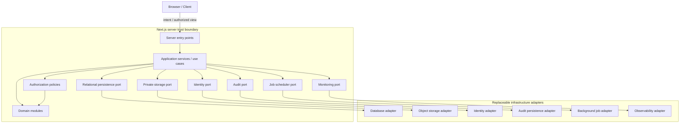
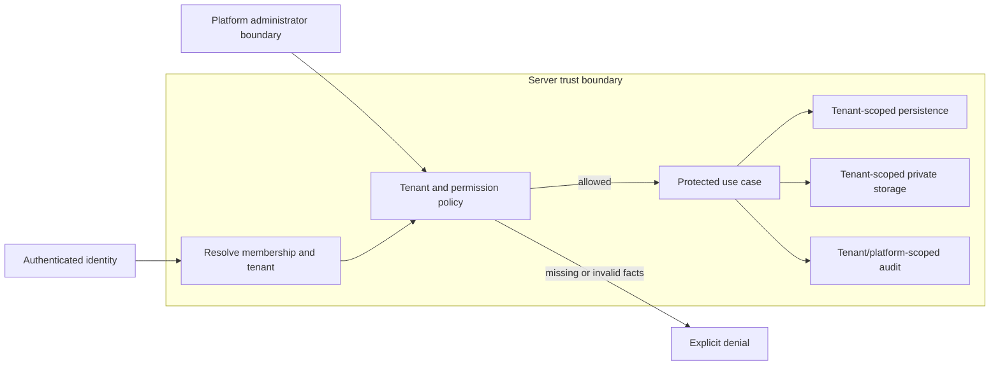

# Foundation V1 Target Architecture

## 1. Document status

| Item | Status |
|---|---|
| Document type | Technical-discovery architecture document |
| Implementation | **NOT AUTHORIZED** |
| Source branch | `rebuild/foundation-v1` |
| Analysis date | 22 July 2026 |
| Current application | Legacy prototype, not a production system |
| Product Owner decisions | Decisions 1–10 in [`OWNER_DECISIONS_FOUNDATION_V1.md`](./OWNER_DECISIONS_FOUNDATION_V1.md) are authoritative |
| Provider selection | No provider has been selected or approved |
| Production release | Not authorized |

This document is the first detailed architecture output indexed by [`FOUNDATION_V1_DISCOVERY_BASELINE.md`](./FOUNDATION_V1_DISCOVERY_BASELINE.md), sections 7, 8, and 12. It defines provider-neutral boundaries only. It does not authorize implementation.

## 2. Architecture objectives

| Objective | Measurable architectural outcome |
|---|---|
| Modularity | Each protected operation enters through an application use case; domain modules do not import UI or provider SDKs. |
| Maintainability | Dependency direction is documented and enforceable; module ownership and public contracts are explicit. |
| Tenant isolation | Every tenant-bound operation requires a server-resolved tenant context and has negative cross-tenant tests. |
| Server-side authorization | No protected state change or read depends only on client checks; deny is the default. |
| Private document handling | Binary objects are private, have tenant ownership and metadata, and never require permanent public URLs. |
| Auditability | Required privileged and lifecycle operations produce structured, redacted audit events linked to actor, tenant, and resource. |
| Controlled retention | Approved lifecycle transitions and deletion deadlines are deterministic, auditable, idempotent, and retryable. |
| Provider replaceability | Domain and application layers depend on narrow ports; provider-specific types remain inside adapters. |
| Environment separation | Local, CI, Preview, protected pilot, and Production have explicit resource and credential boundaries. |
| Testability | Domain rules and application policies run without external providers; every adapter has a contract-test boundary. |
| Operational safety | Failures are explicit, correlated, redacted, observable, and recoverable without silent data mutation. |
| Future extensibility | Future OCR, AI, PUN, and simulation modules can attach through provenance-preserving interfaces without entering V1 scope. |
| Avoidance of dead ends | Ownership, provenance, immutable identifiers, units, versions, and event boundaries can support later approved modules. |

Architecture approval requires evidence that these outcomes are represented in the subsequent canonical discovery documents. It does not require or permit implementation at this stage.

## 3. Non-goals

Foundation V1 does not implement:

- OCR extraction;
- generative-AI document interpretation;
- CTE commercial-condition extraction;
- GME PUN acquisition;
- electricity simulations;
- gas simulations;
- offer comparisons;
- rankings;
- final reports.

Future modules influence interfaces only: document provenance must remain traceable, market data must be versionable, and calculation inputs must be verifiable. These boundary considerations do not authorize the future business logic, providers, jobs, user interfaces, or operational processing. This scope follows Decision 1 and the baseline, section 6.

## 4. Verified architectural constraints

- **VERIFIED FACT:** `package.json` declares Next.js `16.2.4`, React/React DOM `19.2.4`, TypeScript `^5`, and Tailwind CSS `^4`; the repository uses the `app/` convention.
- **VERIFIED FACT:** [`app/page.tsx`](./app/page.tsx) is a 715-line client component combining UI navigation, file reading, CTE text parsing, in-memory state, hardcoded PUN display, and calculations.
- **VERIFIED FACT:** Current bill data and the CTE archive exist only in React state. No persistence layer is visible.
- **VERIFIED FACT:** CTE PDFs are read in the browser using `FileReader`; PDF.js and its worker are loaded at runtime from a public CDN. The binary is not placed in repository-visible private storage.
- **VERIFIED FACT:** Bill “OCR” returns a fixed object after a timer and does not read the selected file. CTE handling extracts an existing text layer and applies regular expressions with silent defaults.
- **VERIFIED FACT:** No authentication, session, invitation, membership, role-enforcement, or server authorization implementation is visible.
- **VERIFIED FACT:** No database schema, migration, query/repository layer, or direct database dependency is visible.
- **VERIFIED FACT:** No private object-storage adapter or persisted document metadata model is visible.
- **VERIFIED FACT:** No test files, `test` script, or repository-visible CI workflow is present; `package.json` exposes only `dev`, `build`, `start`, and `lint`.
- **VERIFIED FACT:** [`next.config.ts`](./next.config.ts) is minimal. No tracked `vercel.json` or `.vercel/` configuration is visible. [`README.md`](./README.md) is generic Create Next App guidance that mentions Vercel deployment.
- **VERIFIED FACT:** [`tsconfig.json`](./tsconfig.json) enables strict mode and the Next.js plugin; [`eslint.config.mjs`](./eslint.config.mjs) uses Next.js Core Web Vitals and TypeScript rules.
- **INFERENCE:** The existing stack can host the target boundaries, but the exact Next.js APIs and runtime choices must be checked against `node_modules/next/dist/docs/` before any later code change, as required by [`AGENTS.md`](./AGENTS.md).
- **PROPOSAL:** Retain Next.js, React, TypeScript, and the visual prototype as architectural starting points while isolating all legacy business behavior.
- **UNKNOWN:** External Vercel settings, GitHub branch controls, linked services, environment variables, and untracked infrastructure are not established by this repository.
- **UNKNOWN:** Final providers, regions, deployment runtime, database access technology, identity mechanism, storage mechanism, and scheduler remain pending.

These statements reconcile [`PROJECT_AUDIT.md`](./PROJECT_AUDIT.md), sections 3–10, and [`FOUNDATION_V1_PLAN.md`](./FOUNDATION_V1_PLAN.md), baseline and sections 4–7, under the precedence defined by the discovery baseline, section 2.

## 5. Architecture principles

1. **Server-side trust boundary.** Protected facts and decisions are established on the server.
2. **Deny by default.** Missing identity, membership, tenant, permission, entitlement, or resource ownership results in denial.
3. **Tenant context is mandatory.** Every protected tenant operation receives a server-resolved context.
4. **Ownership is explicit.** Operational records and documents identify their owning tenant; platform records have an explicit platform scope.
5. **Documents are private by default.** Access is mediated and temporary; permanent public URLs are prohibited.
6. **Audit is append-oriented.** Audit evidence is not silently rewritten by ordinary business operations.
7. **Lifecycle transitions are deterministic.** Valid source state, target state, actor, reason, timestamp, and policy are explicit.
8. **No silent defaults.** Missing, unreadable, invalid, or unverified data produces a failure or review state, not an invented value.
9. **No generative-AI authority.** Generative AI cannot decide authorization, tenancy, integrity, lifecycle, retention, or deletion.
10. **Ports and adapters.** Provider-specific behavior remains behind narrow, replaceable contracts.
11. **Validated configuration.** Required configuration is validated before serving protected operations or starting jobs.
12. **Environment-specific secrets.** Credentials and secrets are isolated and never inferred from client input.
13. **Idempotent background operations.** Repetition must not duplicate transitions, deletions, or audit effects.
14. **Explicit failure states.** Errors have stable categories, safe messages, and operational correlation.
15. **Least privilege.** Users, services, jobs, and adapters receive only required capabilities.
16. **Product rules are infrastructure-independent.** Tenant, licensing, lifecycle, and authorization rules do not depend on provider SDKs.

## 6. Logical architecture overview

| Layer | Responsibilities | Allowed dependencies | Prohibited dependencies | Tenant context | Test boundary |
|---|---|---|---|---|---|
| Presentation | Render authorized state, collect intentions, show safe errors. | Application contracts and presentation models. | Database/storage SDKs; authoritative policy decisions. | Carries opaque route/resource intent; never establishes tenant truth. | Component and E2E tests with application substitutes. |
| Application/use-case | Coordinate commands, transactions, policies, ports, events, and outcomes. | Domain, policy layer, ports. | UI framework details; provider SDKs. | Required for tenant-bound use cases. | Use-case tests with in-memory/fake ports. |
| Domain | Model approved invariants, states, commands, and domain events. | Domain-owned types only. | Next.js, network, persistence, identity, logging SDKs. | Tenant ownership is an invariant where applicable. | Pure unit and state-transition tests. |
| Authorization and policy | Evaluate identity, membership, role/permission, ownership, tenant status, seat/license, and entitlement facts. | Domain facts and read ports through application orchestration. | Client claims as authority; provider-specific role models. | Mandatory input for tenant policy. | Policy matrices and negative cross-tenant tests. |
| Persistence ports | Define transactional reads/writes and uniqueness semantics. | Domain/application-neutral data contracts. | Concrete driver/ORM types in callers. | Tenant scope required for operational repositories. | Contract tests across fake and selected adapter later. |
| Storage ports | Define private put/get/grant/delete and integrity metadata capabilities. | Stable document identifiers and storage contracts. | Public URL assumptions; provider object types. | Tenant/document authorization precedes calls. | Storage contract tests with isolated substitute. |
| Identity ports | Resolve authenticated identity/session and controlled invitation capabilities. | Minimal identity contracts. | Tenant authorization decisions inside provider adapter. | Identity is mapped to membership by application policy. | Identity/session contract tests. |
| Audit ports | Append and query authorized audit evidence. | Structured audit event contracts. | Full binaries, extracted content, uncontrolled personal data. | Tenant/platform ownership explicit per event. | Event-schema and required-event tests. |
| Background-job ports | Enqueue/schedule, claim, retry, and mark operations. | Stable job commands and identifiers. | Business decisions hidden in scheduler configuration. | Tenant context included where the job is tenant-bound. | Idempotency, retry, and concurrency tests. |
| Observability ports | Record redacted telemetry, errors, metrics, and correlation. | Safe operational event contracts. | Authorization/audit substitution; document content. | Tenant identifiers are controlled and minimized. | Redaction and failure-classification tests. |
| Infrastructure adapters | Implement ports using approved technologies and environment configuration. | Ports, configuration, provider SDKs. | Provider types leaking into domain/application layers. | Enforce scoped credentials and adapter-level safeguards. | Provider contract and integration tests. |

## 7. Provider-neutral architecture diagram



All adapter boxes are generic capability categories. The diagram selects no provider, product, region, SDK, or deployment mechanism.

## 8. Proposed domain modules

| Module | Purpose and owned data | Accepted commands | Emitted events | Dependencies | Prohibited responsibilities | Future extension points |
|---|---|---|---|---|---|---|
| Platform administration | Platform-scoped tenant records, status, plan assignment, contract dates, limits, restrictions. | Create, activate, suspend, block, reactivate tenant; assign approved commercial facts. | TenantCreated, TenantStatusChanged, ContractFactsChanged. | Authorization, tenancy persistence, audit. | Customer document interpretation; provider administration hidden in domain. | Future billing integration through separate approved adapter. |
| Tenant administration | Tenant profile and internal administration settings. | Update allowed tenant settings; request user administration. | TenantSettingsChanged. | Memberships, policies, audit. | Changing platform plans or contract limits. | Additional tenant settings after approval. |
| Identity and invitations | Invitation state, hashed/token reference, role intent, expiry, revocation, acceptance. | Issue, resend, revoke, accept, expire invitation. | InvitationIssued, Revoked, Accepted, Expired. | Identity port, membership policy, seats, audit. | Public registration; autonomous tenant selection. | Future onboarding methods preserving controlled access. |
| Memberships | Identity-to-tenant relationship, status, assigned role references. | Activate, deactivate, replace, change authorized assignment. | MembershipActivated, Deactivated, AssignmentChanged. | Tenant state, roles, seats, audit. | Authentication credential storage; cross-tenant access assumptions. | Future multi-tenant membership after approval. |
| Roles and permissions | Approved roles and granular permission vocabulary/assignments. | Assign/revoke allowed permissions within policy. | RoleAssigned, PermissionChanged. | Memberships, authorization policies. | Treating role labels as complete authorization. | Additional roles/permissions without tenancy redesign. |
| Licensing and seats | Licensed maximum, active-seat usage, reservation/release semantics. | Check/reserve/release seat; update approved limit. | SeatReserved, SeatReleased, LimitChanged. | Tenant status, memberships, plan facts. | Payment collection; invented plan rules. | Automated subscription integration later. |
| Entitlements and feature controls | Plan and custom feature grants/restrictions. | Evaluate grant; apply approved entitlement change. | EntitlementChanged, FeatureAccessDenied. | Tenant/contract facts, policies, audit. | Client-only feature security; uncontrolled flags. | Future module activation when separately approved. |
| Tenant suspension and reinstatement | Suspension/grace facts and access effect. | Suspend, reinstate, inspect authorized state. | TenantSuspended, TenantReinstated. | Platform administration, authorization, audit. | Automatic document deletion. | Future payment-driven triggers after approval. |
| Customer/account ownership foundation | Tenant-owned customer/account identifiers and assignments needed for later protected resources. | Create/update minimal account ownership; assign authorized users. | AccountCreated, OwnershipAssigned. | Tenant, membership, authorization. | Bill interpretation, sales CRM behavior, unapproved customer fields. | Later customer and sales workflows. |
| Documents | Tenant-owned document metadata, binary reference, checksum/integrity facts, category, provenance. | Initiate/complete upload, authorize access/download, replace, classify category. | DocumentUploaded, Accessed, Downloaded, Replaced. | Storage port, authorization, audit. | OCR, extraction, public permanent links. | Provenance anchors for future extraction. |
| Bill lifecycle | Bill state and lifecycle timestamps. | Activate, archive, schedule deletion, confirm deletion. | BillActivated, Archived, DeletionScheduled, Deleted. | Documents, retention, policies, audit. | OCR or simulation inputs. | Future verified extracted artifacts. |
| CTE lifecycle | CTE state, contractual expiry, archive/deletion timestamps, operational visibility. | Activate, expire/archive, schedule deletion, confirm deletion. | CTEActivated, Expired, Archived, DeletionScheduled, Deleted. | Documents, retention, jobs, audit. | Commercial-condition extraction or offer eligibility calculation. | Later verified CTE interpretation. |
| Audit | Append-oriented security, administrative, lifecycle, and release evidence. | Record required event; query with authorization. | AuditEventRecorded. | Audit port, authorization. | Operational debugging payloads; full document content. | Future extraction/calculation evidence links. |
| Retention | Approved deadlines, eligibility evaluation, deletion coordination state. | Evaluate due item, request/cancel where approved, reconcile deletion. | RetentionDue, DeletionRequested, DeletionFailed, DeletionConfirmed. | Lifecycle modules, jobs, storage, persistence, audit. | Inventing legal holds or exception rules. | Other document categories after approval. |
| Background jobs | Job identity, status, attempts, lease/checkpoint, failure category. | Schedule, claim, complete, retry, fail. | JobScheduled, Started, Retried, Completed, Failed. | Job port, target application use case, observability. | Owning hidden business rules. | Future PUN/provider synchronization jobs. |
| Configuration | Typed configuration requirements and environment classification. | Validate startup/job configuration; expose safe capability settings. | ConfigurationRejected, EnvironmentClassified. | Configuration/secrets port. | Secret values in domain, logs, or client bundles. | Provider-specific adapters after approval. |
| Release and operational controls | Release record, approval evidence, maintenance/feature-disable state. | Record release, enter/exit maintenance, disable/restore authorized feature. | ReleaseRecorded, MaintenanceChanged, FeatureControlChanged. | Authorization, audit, configuration. | Bypassing PR/release controls or tenancy. | Additional safe rollout mechanisms. |

## 9. Server and client boundaries

### Server-only authority

The server must perform and enforce:

- authentication/session checks;
- invitation validation, expiry, revocation, and acceptance;
- membership and tenant resolution;
- authorization and resource-ownership checks;
- seat-limit enforcement and active-seat accounting;
- entitlement and feature checks;
- document-upload authorization and metadata creation;
- private-document access grants and downloads;
- lifecycle transitions, archival, and deletion eligibility;
- audit recording for required events;
- scheduled deletion and retry coordination;
- tenant suspension and reinstatement enforcement;
- configuration validation before protected operation.

### Client capabilities

The client may render authorized state, submit user intentions, display validated results and safe errors, and manage non-authoritative interface state such as open panels or draft form values.

Client-provided tenant IDs, role claims, prices, lifecycle states, entitlements, ownership claims, or permissions are never trusted without server resolution and validation. Hiding a control is a usability behavior, not an authorization control.

## 10. Tenant-isolation boundary

- Tenant-bound operational records carry explicit tenant ownership.
- Access requires an authenticated identity mapped to an active membership for the resolved tenant.
- Platform Owner actions use a distinct platform-administration policy and explicit target tenant; platform scope is not an implicit bypass.
- Suspension blocks normal tenant use while preserving data and authorized Platform Owner administration.
- User deactivation blocks access and releases a seat where applicable, but preserves audit history, ownership references, documents, and historical data.
- Cross-tenant reads, writes, object access, cache hits, job execution, and audit queries are denied.
- Every document metadata record and binary storage reference belongs to one tenant.
- Audit events identify tenant or platform scope and are queried only through authorized boundaries.
- Tenant-bound jobs carry immutable tenant/resource identifiers and re-resolve authorization/state before mutation where required.
- Caches include tenant and policy-relevant scope in keys; shared cache entries cannot expose protected tenant data.
- Storage keys are opaque, tenant-partitioned by architecture, and never treated as sufficient authorization.
- Tests include negative cross-tenant cases for every protected repository, use case, storage operation, and administrative path.



## 11. Authorization architecture

Authentication establishes identity; it does not grant tenant access. Authorization combines:

1. authenticated identity and valid session;
2. platform scope or active tenant membership;
3. tenant status and suspension state;
4. role-derived granular permissions;
5. resource ownership or assignment;
6. license/seat state where applicable;
7. entitlement and custom restriction facts;
8. explicit server-side policy for the requested action.

Platform roles and tenant roles have separate policy namespaces. Platform Owner / Super Admin operations require explicit platform permission and target scope. Tenant Admin, Sales Manager / Coordinator, and Agent / Sales Operator operate only within tenant and assignment boundaries approved by Decisions 3 and 4.

Every policy returns an explicit allow or denial category. Privileged changes, denied sensitive operations where required, role/permission changes, tenant status changes, invitations, and document lifecycle actions produce audit evidence.

The exact permission vocabulary, role-permission matrix, ownership rules, audit visibility, delegation rules, and assignment rules remain delegated to `FOUNDATION_V1_TENANCY_AUTHORIZATION.md`. They require Product Owner approval where they change product behavior; no matrix is finalized here.

## 12. Document architecture

Foundation V1 supports non-interpretive bills and CTE documents only.

### Separation and provenance

- Structured metadata and binary objects are separate architectural resources linked by stable internal identifiers.
- Metadata includes tenant, category, lifecycle state/timestamps, integrity facts, storage reference, original filename as controlled metadata, and provenance to the uploaded source.
- Binary objects are private and cannot be retrieved through permanent public URLs.
- An access use case authorizes the actor and resource before issuing or performing temporary access.
- Logs never contain complete binaries, extracted content, or uncontrolled personal/commercial data.
- Upload, access, download, replacement, archival, scheduling, cancellation where approved, and deletion are auditable.

### Lifecycle and retention

- Bills follow Uploaded → Active → Archived → Scheduled for deletion → Deleted.
- Archived bills become eligible for permanent deletion 60 calendar days after `archived_at`.
- CTEs follow Active → Expired → Archived → Scheduled for deletion → Deleted.
- A CTE reaching contractual expiry transitions server-side to Expired and Archived; `archived_at` records that transition.
- Archived CTEs become eligible for permanent deletion 12 calendar months after `archived_at`.
- CTE operational lists show active documents by default; expired/archived CTEs are not eligible for future new simulations.
- User deactivation or tenant suspension does not automatically archive or delete documents.
- Deletion coordinates binary, operational metadata/derived data, temporary copies, caches, and obsolete storage references, while retaining only approved minimum non-sensitive audit evidence.
- Deletion failures remain explicit and retryable; deleted content cannot be silently recreated from caches or temporary copies.

Extraction, interpretation, OCR, AI, PUN matching, and simulation behavior are not designed or implemented here. Detailed storage and lifecycle contracts are delegated to `FOUNDATION_V1_DOCUMENT_STORAGE.md` and `FOUNDATION_V1_DOCUMENT_LIFECYCLE.md`.

## 13. Data and persistence boundary

Provider-neutral persistence must support records for tenants, identities/users, memberships, roles, permissions, invitations, plans, licenses, seat limits/usage, entitlements, documents, lifecycle timestamps, audit events, scheduled operations, release records, and provider decision/assessment records.

The exact schema is not finalized. `FOUNDATION_V1_DATA_MODEL.md` owns entity definitions, relations, indexes, migration artifacts, and physical naming.

Architectural requirements:

- use-case transaction boundaries cover business invariants that must change atomically;
- uniqueness prevents duplicate active memberships where prohibited, invitation reuse, seat double-reservation, duplicate lifecycle transitions, and duplicate scheduled work;
- tenant-scoped repositories require tenant context and do not expose unscoped operational query methods;
- referential integrity preserves ownership and historical references without retaining deleted document content;
- migration design documents ordering, backward compatibility, application/database version overlap, validation, and roll-forward/rollback posture;
- deletion coordination records durable progress across metadata, storage, cache, and audit boundaries;
- concurrent invitation acceptance, seat allocation, archival, and deletion are serialized or resolved through explicit concurrency controls;
- commands and jobs use idempotency identities so retries do not duplicate effects;
- destructive or irreversible migrations require the additional review mandated by Decision 9.

## 14. Ports and adapters strategy

| Port | Capability and domain-facing contract | Adapter responsibilities | Prohibited leakage | Portability requirement | Testing substitute |
|---|---|---|---|---|---|
| Identity | Resolve identity/session; provision controlled invitations where approved. | Translate provider session/token facts into minimal identity results. | Provider claims as tenant authorization; SDK types. | Identity provider can change without domain redesign. | Deterministic fake identity/session adapter. |
| Relational persistence | Transactional repositories, uniqueness, concurrency, migrations boundary. | Map records, transactions, errors, and health. | ORM/driver models outside adapter. | Exportable data and replaceable access layer. | In-memory contract fake plus isolated relational test adapter later. |
| Private object storage | Private put/read/grant/delete, integrity and metadata capabilities. | Enforce private objects, safe keys, temporary access, deletion results. | Public URL assumptions; provider object identifiers in domain. | Object export/reconciliation and provider replacement. | Isolated fake with contract semantics. |
| Audit persistence | Append required audit events and authorized queries. | Durable write, integrity, indexing, access restriction. | Full payloads/binaries or mutable business records as audit. | Exportable evidence and replaceable store. | Append-only in-memory audit sink. |
| Scheduled jobs | Schedule/claim/retry/complete operations. | Delivery, leases, timing, retry/dead-letter state. | Business policy in scheduler-specific configuration. | Scheduler can change without changing job commands. | Deterministic job harness/clock. |
| Email delivery | Deliver invitation and operational messages from safe templates. | Address delivery, provider response, retry classification. | Invitation authorization or raw secret/token logging. | Provider replacement and delivery audit abstraction. | Capturing fake mailbox. |
| Monitoring | Metrics, traces, alerts, correlation. | Redaction, batching, environment/tenant-safe dimensions. | Business audit substitution; sensitive payloads. | Exportable telemetry and replaceable backend. | Capturing redaction-aware sink. |
| Error reporting | Record categorized failures and safe context. | Scrub, group, correlate, notify. | Complete documents, tokens, secrets, uncontrolled personal data. | Replaceable reporting backend. | Capturing error reporter. |
| Feature controls | Evaluate approved feature/maintenance state. | Retrieve configured state and fail safely. | Authorization replacement; client-only enforcement. | Internal or external mechanism can be replaced. | Deterministic feature-control fake. |
| Configuration and secrets | Provide validated, typed, environment-scoped settings. | Resolve values, validate presence/format, restrict exposure. | Secret values in domain, UI, logs, or audit. | Secret/config backend can change behind contract. | Synthetic configuration fixture. |

No provider, dependency, pricing model, endpoint, or region is selected by this strategy.

## 15. Background operations architecture

Background operation categories are:

- invitation expiry;
- CTE contractual-expiry transition;
- scheduled bill and CTE deletion;
- retry and reconciliation of failed deletion;
- audit reconciliation where a documented transactional strategy requires it;
- future PUN imports, outside Foundation V1 implementation;
- future provider synchronization, only after separate approval.

Every operation requires a stable operation identifier, idempotent handler, retry-safe side effects, locking/lease or equivalent concurrency control, explicit tenant context where applicable, redacted failure reporting, required audit events, measurable completion criteria, and durable failed/dead-letter handling. Jobs must distinguish retryable failure, permanent validation failure, cancellation, and completion.

The scheduling mechanism is pending. Future PUN acquisition is neither designed as a V1 business process nor implemented; only a generic verified-data/job boundary is preserved.

## 16. Environment architecture

| Environment | Data rule | Isolation and authorization boundary |
|---|---|---|
| Local | Synthetic data and synthetic PDFs only. | Local-only credentials/configuration; no Production resources or real documents. |
| CI/Test | Synthetic fixtures only. | Ephemeral or isolated test resources; secrets minimized; artifacts/logs contain no real data. |
| Ordinary Preview | Synthetic documents by default; real documents prohibited. | Isolated credentials, database/schema as required, storage, auth configuration, webhooks, jobs, monitoring, and service configuration. |
| Protected pilot | Real documents only after explicit operational authorization and verification of Decision 5 controls. | Classified protected environment with approved providers, access, retention, deletion, audit, incident, and rollback safeguards. |
| Production | Intended for real documents only after all acceptance and operational authorization gates pass. | Production-only credentials/resources, controlled release, monitoring, jobs, and post-deployment verification. |

Production secrets must not be exposed to Local, CI, or ordinary Preview. Database, storage, identity, webhook, scheduler, monitoring, and third-party configuration must be separate or appropriately isolated. Production data cannot be copied into Preview without a separately approved, controlled, minimized, and documented process.

The detailed matrix, configuration categories, provider register, regions, and operational assessment records belong to `FOUNDATION_V1_ENVIRONMENTS_PROVIDERS.md`. No Vercel setting or external environment is configured here.

## 17. Error and observability architecture

- **Domain errors** represent invalid state transitions or violated business invariants.
- **Authorization errors** are explicit denials without disclosing protected resource existence unnecessarily.
- **Validation errors** identify rejected fields/files/commands through user-safe details.
- **Infrastructure errors** identify unavailable or failed adapters without leaking provider internals.
- **Retryable errors** carry an explicit retry classification for controlled orchestration.
- User-facing messages are stable, localized later, and contain no secrets or internal traces.
- Correlation identifiers connect request, use case, audit event, and background operation without embedding sensitive content.
- Redaction removes credentials, tokens, authorization headers, cookies, document content, extracted data, and uncontrolled personal data.
- Audit events prove accountable business/security actions; operational logs diagnose systems. Neither substitutes for the other.
- Monitoring uses controlled tenant/environment dimensions and restricts privileged event visibility.
- Incident investigation follows authorized access boundaries; support tooling does not bypass tenancy.

`FOUNDATION_V1_OBSERVABILITY_SECURITY.md` owns the detailed taxonomy, threat model, redaction rules, monitoring boundaries, and incident dependencies. No monitoring provider is selected.

## 18. Testing architecture

Required layers are:

1. domain unit tests for invariants and state transitions;
2. application/use-case tests with fake ports;
3. authorization-policy tests for allow and deny matrices;
4. tenant-isolation tests for every protected resource path;
5. persistence-contract tests for scoping, transactions, uniqueness, and concurrency;
6. storage-contract tests for privacy, integrity, access, and deletion;
7. invitation-flow tests for expiry, revocation, reuse, membership, and seats;
8. lifecycle-state tests for bills and CTEs;
9. scheduled-job idempotency, retry, concurrency, and failure tests;
10. migration apply/compatibility/validation tests;
11. integration tests across approved adapters in isolated environments;
12. end-to-end tests for controlled access and non-interpretive document lifecycle;
13. Preview verification for build, UI, authorization, isolation, configuration, migration, storage, audit, accessibility, and regression;
14. Production smoke verification that is controlled and non-destructive.

Domain, application, authorization, lifecycle, job, redaction, and configuration boundaries must run without external providers. Adapter contract tests may use approved isolated substitutes or environments later. `FOUNDATION_V1_TESTING_RELEASE.md` owns tools, fixtures, CI gates, release evidence, and rollback verification.

## 19. Legacy containment and migration strategy

The current four-tab prototype may remain temporarily visible only as a clearly identified legacy reference. Its UI concepts may inform later presentation design. Its bill fixture, CTE regex results, CDN PDF loading, PUN table, in-memory archive, calculations, ranking, “best offer” label, and client-side deletion must not be reused as authoritative logic.

The new server architecture must be reachable only through protected server entry points. New modules cannot import legacy parsing/calculation functions or accept legacy React state as trusted data. Routing and feature controls must prevent legacy client behavior from invoking protected persistence or storage directly.

Incremental migration sequence:

1. **IMPLEMENTATION NOT AUTHORIZED** — establish module boundaries and an inert authenticated shell after later approval.
2. **IMPLEMENTATION NOT AUTHORIZED** — add identity, membership, tenant, authorization, and licensing foundations.
3. **IMPLEMENTATION NOT AUTHORIZED** — add provider-neutral persistence and migration boundaries.
4. **IMPLEMENTATION NOT AUTHORIZED** — add private non-interpretive document lifecycle behind server authorization.
5. **IMPLEMENTATION NOT AUTHORIZED** — add audit, retention, jobs, observability, tests, and release gates.
6. **IMPLEMENTATION NOT AUTHORIZED** — remove or disable misleading legacy paths only after replacement acceptance and explicit authorization.

## 20. Repository modularization proposal

The following tree is conceptual and does not exist yet:

```text
app/                         presentation routes and server entry points
modules/
  platform-administration/  platform-scoped application/domain boundary
  tenancy/                  tenant and membership boundary
  identity-access/          invitations and identity coordination
  authorization/            policies and permission vocabulary
  licensing/                seats, limits, entitlements
  documents/                metadata and private-document use cases
  lifecycle/                bill and CTE state transitions
  audit-retention/          audit evidence and deletion orchestration
domain/                      shared value objects and invariant primitives
application/                 cross-module use-case orchestration
policies/                    server-side policy contracts
ports/                       provider-neutral capability contracts
infrastructure/              replaceable adapters selected later
configuration/               validated environment configuration
tests/
  contract/                  port/adapter contracts
  integration/               isolated boundary tests
  e2e/                       authorized Foundation flows
documentation/               ADRs, runbooks, and decision records
```

Dependency direction is presentation → application/policies → domain/ports, with infrastructure implementing ports. Shared folders must not become a dumping ground; module-owned rules remain within their module. No directory is created by this proposal.

## 21. Architectural decision records

| Proposed ADR | Decision to be made | Alternatives to compare | Decision owner | Blocking effect | Related canonical document |
|---|---|---|---|---|---|
| Identity architecture | Session/identity and controlled invitation integration model. | Provider-neutral hosted, self-managed, or framework-compatible patterns. | Product Owner approves provider/workflow; technical reviewer approves fit. | Blocks identity implementation. | `FOUNDATION_V1_IDENTITY_AND_ACCESS.md` |
| Database architecture | Relational capability, region, access/query and migration approach. | Managed relational service categories and query-layer patterns. | Product Owner approves provider/region; technical reviewer recommends stack. | Blocks persistence implementation. | `FOUNDATION_V1_DATA_MODEL.md` |
| Storage architecture | Private object capability, access, integrity, region, deletion behavior. | Object-storage categories and mediated-access patterns. | Product Owner with technical/security review. | Blocks document implementation/pilot. | `FOUNDATION_V1_DOCUMENT_STORAGE.md` |
| Tenant-context enforcement | How server entry points and repositories require tenant scope. | Request-scoped context, explicit use-case parameter, scoped repository patterns. | Product Owner approves behavior; technical reviewer approves design. | Blocks protected operations. | `FOUNDATION_V1_TENANCY_AUTHORIZATION.md` |
| Authorization-policy model | Permission vocabulary and policy composition. | Central policy service, module policies, declarative policy patterns. | Product Owner and technical reviewer. | Blocks authorization implementation. | `FOUNDATION_V1_TENANCY_AUTHORIZATION.md` |
| Background-job mechanism | Scheduling, delivery, leases, retries, and failed-work handling. | Platform scheduler, queue, database-backed scheduler categories. | Product Owner approves provider if external; technical reviewer. | Blocks automated expiry/deletion. | `FOUNDATION_V1_AUDIT_RETENTION.md` |
| Audit persistence | Durable append/query/integrity strategy. | Relational append table, dedicated audit store category, event/outbox patterns. | Product Owner with technical/security review. | Blocks auditable operations. | `FOUNDATION_V1_AUDIT_RETENTION.md` |
| Environment isolation | Resource separation and validated configuration model. | Separate resources, isolated schemas/buckets, environment-account patterns. | Product Owner and technical/operations reviewer. | Blocks first code PR and operational environments. | `FOUNDATION_V1_ENVIRONMENTS_PROVIDERS.md` |
| Migration strategy | Compatibility, deployment ordering, rollback/roll-forward policy. | Expand/contract, feature-gated change, staged data-migration patterns. | Technical reviewer; Product Owner for downtime/risk acceptance. | Blocks schema-changing release. | `FOUNDATION_V1_TESTING_RELEASE.md` |
| Provider exit and replacement | Export, portability, adapter replacement, verified deletion. | Standard export, dual-run/migration, staged replacement patterns. | Product Owner with technical/security/privacy review. | Blocks provider operational approval. | `FOUNDATION_V1_ENVIRONMENTS_PROVIDERS.md` |

No ADR is decided by this document.

## 22. Open architecture decisions

| Question | Why it matters | Responsible discovery document | Blocks further discovery? | Blocks implementation? | Required approver |
|---|---|---|---|---|---|
| What exact target architecture and repository restructuring are approved? | Determines physical module boundaries and migration scope. | This document; `FOUNDATION_V1_IMPLEMENTATION_ROADMAP.md` | No | Yes | Product Owner with technical review |
| Which identity architecture/provider and session model are approved? | Controls sessions, invitations, recovery, and threat boundary. | `FOUNDATION_V1_IDENTITY_AND_ACCESS.md` | No | Yes | Product Owner with technical/security review |
| What is the exact authorization matrix and assignment model? | Defines allowed product behavior and tests. | `FOUNDATION_V1_TENANCY_AUTHORIZATION.md` | Partly | Yes | Product Owner |
| Which plan, grace, seat, entitlement, and suspension details apply? | Completes enforceable commercial policy. | `FOUNDATION_V1_LICENSING_ENTITLEMENTS.md` | Partly | Yes | Product Owner |
| Which database provider/region, access layer, and migration tool are approved? | Determines persistence operations and deployment compatibility. | `FOUNDATION_V1_DATA_MODEL.md` | No | Yes | Product Owner/provider; technical reviewer/stack |
| Which storage provider/region and access/integrity controls are approved? | Required for private documents and pilot authorization. | `FOUNDATION_V1_DOCUMENT_STORAGE.md` | No | Yes | Product Owner with technical/security review |
| What are restoration, legal-hold, exceptional retention, and backup-purge rules? | Completes deletion behavior beyond approved base durations. | `FOUNDATION_V1_DOCUMENT_LIFECYCLE.md`; `FOUNDATION_V1_AUDIT_RETENTION.md` | Partly | Yes for deletion automation/real data | Product Owner with qualified review |
| Which audit retention/access and persistence strategy is approved? | Controls evidence, privacy, and operations. | `FOUNDATION_V1_AUDIT_RETENTION.md` | No | Yes | Product Owner with technical/security review |
| Which scheduler/job mechanism is approved? | Required for expiry and deletion automation. | `FOUNDATION_V1_AUDIT_RETENTION.md` | No | Yes | Product Owner if provider; technical reviewer |
| What environment resources, regions, assessments, and pilot authorization apply? | Required before provider integration or real data. | `FOUNDATION_V1_ENVIRONMENTS_PROVIDERS.md` | No | Yes | Product Owner with security/privacy/operations review |
| What exact tests, checks, reviewers, merge, and deployment controls are mandatory? | Converts Decision 9 into enforceable gates. | `FOUNDATION_V1_TESTING_RELEASE.md` | No | Yes | Product Owner and technical reviewer |
| Which monitoring/error provider and incident boundaries are approved? | Determines telemetry handling and response. | `FOUNDATION_V1_OBSERVABILITY_SECURITY.md` | No | Yes for operational release | Product Owner with technical/security review |
| What future provenance/market-data contracts are sufficient? | Prevents V1 dead ends without implementing excluded modules. | `FOUNDATION_V1_FUTURE_BOUNDARIES.md` | No | No for core V1; yes for future modules | Product Owner with technical review |
| Is the first phase, sequence, PR scope, and code change authorized? | Decision 10 withholds implementation. | `FOUNDATION_V1_IMPLEMENTATION_ROADMAP.md` | No | Yes | Product Owner |

No provider or dependency is selected here.

## 23. Architecture risks

| Risk | Architecture cause | Preventive boundary | Detection mechanism | Implementation gate | Related future document |
|---|---|---|---|---|---|
| Cross-tenant leakage | Missing tenant scope or unsafe shared query/cache. | Mandatory server tenant context and scoped ports. | Negative cross-tenant tests and access telemetry. | All protected paths pass isolation suite. | `FOUNDATION_V1_TENANCY_AUTHORIZATION.md` |
| Client authorization bypass | UI state treated as authority. | Server-only policy evaluation and trusted context resolution. | Policy/E2E denial tests. | No protected mutation without server policy. | `FOUNDATION_V1_IDENTITY_AND_ACCESS.md` |
| Unsafe document access | Public URLs or storage-key authorization. | Private port and mediated temporary access. | Storage contract and URL exposure tests. | Private-access suite passes. | `FOUNDATION_V1_DOCUMENT_STORAGE.md` |
| Partial deletion | Binary, metadata, cache, or derivative omitted. | Durable deletion orchestration and reconciliation. | Retry/reconciliation tests and metrics. | End-to-end deletion evidence passes. | `FOUNDATION_V1_AUDIT_RETENTION.md` |
| Audit inconsistency | Business change and audit write diverge. | Documented transaction/outbox boundary. | Required-event coverage and reconciliation. | Audit consistency tests pass. | `FOUNDATION_V1_AUDIT_RETENTION.md` |
| Background-job duplication | At-least-once delivery or concurrent claims. | Idempotency identity and concurrency control. | Duplicate/retry fault tests. | Job idempotency suite passes. | `FOUNDATION_V1_AUDIT_RETENTION.md` |
| Destructive migration | Incompatible or irreversible change. | Compatibility design, rehearsal, extra review. | Migration validation and version-overlap tests. | Migration review/rehearsal passes. | `FOUNDATION_V1_TESTING_RELEASE.md` |
| Provider coupling | SDK types and behavior leak into domain. | Ports/adapters and contract tests. | Dependency-boundary checks. | Architecture rule and exit plan approved. | `FOUNDATION_V1_ENVIRONMENTS_PROVIDERS.md` |
| Environment contamination | Shared secrets/resources/jobs. | Explicit environment matrix and fail-fast configuration. | Isolation checks and deployment verification. | Preview/Production isolation passes. | `FOUNDATION_V1_ENVIRONMENTS_PROVIDERS.md` |
| Secret leakage | Client bundle, logs, CI, or errors expose secrets. | Server-only secret port and redaction. | Secret scanning and redaction tests. | No-secret gates pass. | `FOUNDATION_V1_OBSERVABILITY_SECURITY.md` |
| Legacy bypass | Existing client logic reaches new resources directly. | Legacy isolation and server-only entry points. | Dependency/E2E access tests. | No legacy-to-infrastructure path. | `FOUNDATION_V1_IMPLEMENTATION_ROADMAP.md` |
| Future OCR provenance loss | Derived values lack source/evidence/version. | Stable document provenance and derived-artifact boundary. | Future contract review/tests. | Future module blocked without provenance. | `FOUNDATION_V1_FUTURE_BOUNDARIES.md` |
| Future PUN integrity failure | Wrong source/month/unit/version used. | Immutable verified market-index boundary and explicit matching inputs. | Future uniqueness, unit, provenance tests. | Future definitive simulation blocked on invalid data. | `FOUNDATION_V1_FUTURE_BOUNDARIES.md` |

## 24. Acceptance criteria

This architecture is ready for Product Owner review when:

1. all 26 mandatory sections are complete and internally consistent;
2. every repository assertion is evidence-linked and marked fact, inference, proposal, unknown, or pending as appropriate;
3. provider categories remain generic and no provider/dependency/region is selected;
4. Decisions 1–10 map to modules, trust boundaries, ports, risks, and delegated documents;
5. layer responsibilities and dependency direction are explicit;
6. the server trust boundary covers every protected operation listed in section 9;
7. tenant isolation covers data, documents, audit, caches, storage keys, jobs, suspension, and tests;
8. document architecture preserves privacy, provenance, approved states, and 60-day/12-month retention rules;
9. domain/application/policy behavior can be tested without external providers;
10. every environment has explicit real/synthetic data and resource-isolation rules;
11. legacy behavior is classified as non-authoritative and cannot bypass new server controls;
12. every unresolved choice has a responsible canonical document, blocking status, and approver;
13. every material architecture risk has prevention, detection, gate, and delegated owner document;
14. the document contains no implementation code or executable pseudocode;
15. implementation remains explicitly **NOT AUTHORIZED**.

Meeting these criteria supports review only; it does not approve the architecture or authorize implementation.

## 25. Dependencies on subsequent discovery documents

| Canonical output | Architecture questions delegated | Inputs supplied by this document | Decisions still pending | Implementation status |
|---|---|---|---|---|
| `FOUNDATION_V1_IDENTITY_AND_ACCESS.md` | Session, invitation, recovery, identity adapter details. | Trust boundary, identity port, controlled-access invariants. | Provider, expiry/resend, recovery. | **NOT AUTHORIZED** |
| `FOUNDATION_V1_TENANCY_AUTHORIZATION.md` | Permission vocabulary/matrix, ownership, policy composition. | Tenant boundary, policy inputs, role separation. | Exact matrix and assignments. | **NOT AUTHORIZED** |
| `FOUNDATION_V1_LICENSING_ENTITLEMENTS.md` | Seat concurrency, plan/contract states, entitlement evaluation. | Licensing modules and server enforcement points. | Commercial rules and defaults. | **NOT AUTHORIZED** |
| `FOUNDATION_V1_DATA_MODEL.md` | Entities, constraints, indexes, migration detail. | Owned-data inventory, transactions, tenancy and idempotency requirements. | Provider, region, query/migration layer, exact schema. | **NOT AUTHORIZED** |
| `FOUNDATION_V1_DOCUMENT_STORAGE.md` | Upload/access/integrity/storage contracts. | Private-storage port, ownership, provenance, deletion boundary. | Provider/region, limits, scanning, keys. | **NOT AUTHORIZED** |
| `FOUNDATION_V1_DOCUMENT_LIFECYCLE.md` | Formal state machines and transition permissions. | Approved states, retention dates, server transition rules. | Restore/cancel/exception rules. | **NOT AUTHORIZED** |
| `FOUNDATION_V1_AUDIT_RETENTION.md` | Audit taxonomy, consistency, jobs, deletion reconciliation. | Audit/job ports, required events, idempotency and retry boundaries. | Persistence, scheduler, audit retention, legal hold/backups. | **NOT AUTHORIZED** |
| `FOUNDATION_V1_ENVIRONMENTS_PROVIDERS.md` | Environment matrix detail, provider register/assessment/exit. | Isolation principles, adapter categories, configuration boundary. | Providers, regions, transfer and operational approvals. | **NOT AUTHORIZED** |
| `FOUNDATION_V1_TESTING_RELEASE.md` | Tools, fixtures, CI gates, migrations, release/rollback evidence. | Test boundaries, risks, release-control modules. | Exact checks, reviewers, merge/deploy mechanism. | **NOT AUTHORIZED** |
| `FOUNDATION_V1_OBSERVABILITY_SECURITY.md` | Threat model, redaction, telemetry, incidents. | Error taxonomy, observability ports, trust boundaries, risks. | Provider, retention, incident procedures. | **NOT AUTHORIZED** |
| `FOUNDATION_V1_FUTURE_BOUNDARIES.md` | Provenance and contracts for excluded future modules. | Stable document/market/job extension points and non-goals. | All future module workflows/providers/approvals. | **NOT AUTHORIZED** |
| `FOUNDATION_V1_IMPLEMENTATION_ROADMAP.md` | Phases, commits, acceptance gates, first PR scope. | Approved architecture candidate, dependencies, ADRs, risks. | Architecture approval and implementation authorization. | **NOT AUTHORIZED** |

## 26. Explicit non-authorizations

This document does not authorize:

- source-code changes;
- dependency installation or updates;
- repository restructuring or directory creation;
- database creation;
- schema migration;
- provider selection;
- provider account creation;
- authentication activation;
- real-document processing;
- OCR or AI activation;
- GME acquisition;
- simulation implementation;
- Pull Request creation;
- merge into `main`;
- Production deployment or Production use;
- GitHub or Vercel configuration changes.

No implementation action was performed while creating this document. Any implementation requires the separate authorization defined by Decision 10 after technical review, Product Owner review, resolution or explicit deferral of blocking decisions, approval of the first implementation phase, and confirmation of branch and release controls.
