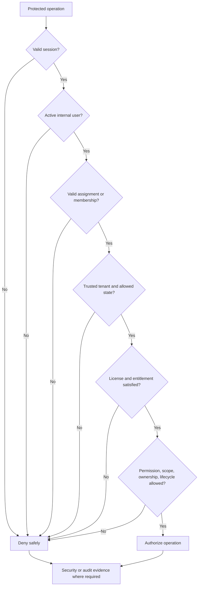
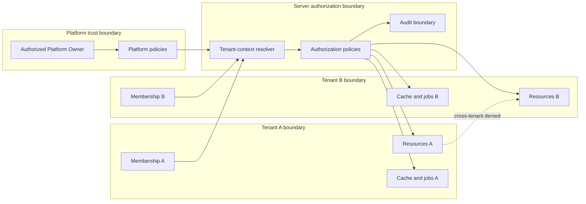
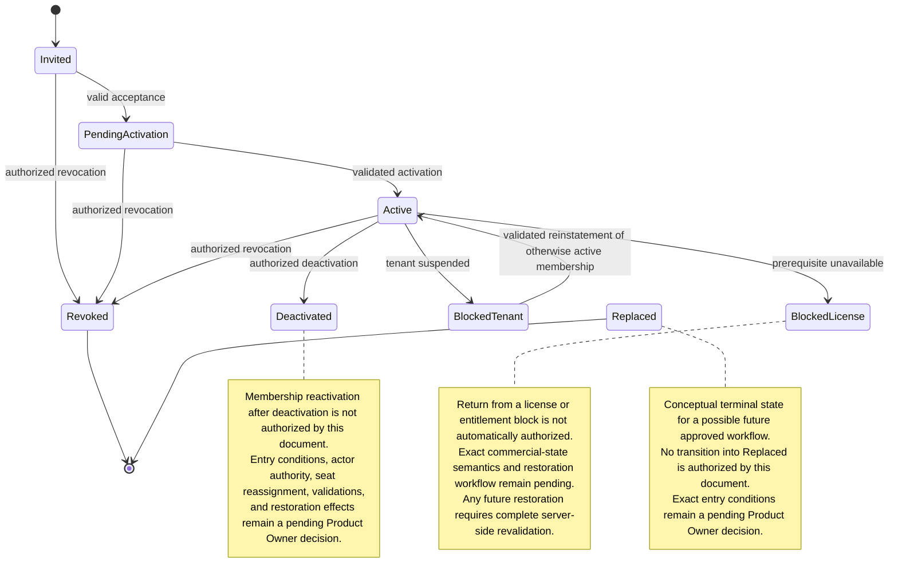

# Foundation V1 Tenancy and Authorization Architecture

## 1. Document status

| Item | Status |
|---|---|
| Document type | Technical-discovery document |
| Implementation | **NOT AUTHORIZED** |
| Source branch | `rebuild/foundation-v1` |
| Analysis date | 22 July 2026 |
| Current application | Legacy prototype, not a production authorization system |
| Authority | Product Owner Decisions 1–10 in [`OWNER_DECISIONS_FOUNDATION_V1.md`](./OWNER_DECISIONS_FOUNDATION_V1.md) are authoritative |
| Provider selection | No provider, database, policy library, or dependency is selected or approved |
| Permission matrix | The detailed matrix remains subject to Product Owner approval |
| Production release | Not authorized |

Source precedence is: approved Product Owner decisions; verified repository facts; approved audit findings; planning assumptions and proposals. This document refines the provider-neutral boundary established in [`FOUNDATION_V1_TARGET_ARCHITECTURE.md`](./FOUNDATION_V1_TARGET_ARCHITECTURE.md), especially sections 5–11 and 21–25. It does not authorize implementation.

## 2. Scope

This document defines the proposed architecture for the SaaS platform scope, customer-company tenant scope, tenant membership, platform assignments, tenant roles, permissions, resource ownership, assigned-network scope, assigned-customer scope, document scope, tenant isolation, server-side authorization, suspension enforcement, user and membership deactivation, privileged operations, audit requirements, background-job authorization context, and authorization tests.

The following details are delegated:

| Concern | Canonical document |
|---|---|
| Authentication, sessions, controlled invitations | `FOUNDATION_V1_IDENTITY_AND_ACCESS.md` |
| Plans, licenses, seats, entitlements, contract states, commercial restrictions | `FOUNDATION_V1_LICENSING_ENTITLEMENTS.md` |
| Exact entities, fields, constraints, indexes, migrations | `FOUNDATION_V1_DATA_MODEL.md` |
| Providers, regions, environments, adapter assessment | `FOUNDATION_V1_ENVIRONMENTS_PROVIDERS.md` |
| Audit persistence and retention | `FOUNDATION_V1_AUDIT_RETENTION.md` |
| Security monitoring, redaction, incident boundaries | `FOUNDATION_V1_OBSERVABILITY_SECURITY.md` |
| Implementation phases and authorization gates | `FOUNDATION_V1_IMPLEMENTATION_ROADMAP.md` |

## 3. Non-goals

This document does not authorize or finalize application-code changes, provider selection, authorization-library selection, database schema, identity-provider claims as permissions, public registration, autonomous tenant creation, automatic subscription payment, support impersonation, invisible administrative bypass, direct cross-tenant data access, final emergency access, exact middleware, cache implementation, policy syntax, customer-assignment workflow, or multi-tenant user-membership policy.

No proposal below is an implementation identifier or approved business rule unless explicitly labeled **APPROVED BASELINE**.

## 4. Verified current state

- **VERIFIED FACT:** No tenant, membership, role, permission, platform-assignment, customer-assignment, or resource-ownership model is visible in `app/`, `package.json`, or `package-lock.json`.
- **VERIFIED FACT:** No server-side authorization use case, protected Route Handler, Server Action policy boundary, or access middleware is visible.
- **VERIFIED FACT:** No database or tenant-scoped persistence adapter is declared or implemented.
- **VERIFIED FACT:** No protected document store or protected persistent resource exists in the repository.
- **VERIFIED FACT:** No tenant-isolation or authorization tests and no CI workflow are visible in the repository tree.
- **VERIFIED FACT:** [`app/page.tsx`](./app/page.tsx) is a single client component using React state for bill data and the CTE archive.
- **VERIFIED FACT:** No required authorization audit event is enforced by current application code.
- **INFERENCE:** Current client state cannot establish tenant, membership, role, permission, ownership, or server authority.
- **PROPOSAL:** Introduce central application policies and tenant-scoped ports only after separate implementation authorization.
- **UNKNOWN:** External deployment controls, untracked services, and settings outside the repository cannot be verified.

These facts align with [`PROJECT_AUDIT.md`](./PROJECT_AUDIT.md), sections 3, 5, 8, and 9, and [`FOUNDATION_V1_DISCOVERY_BASELINE.md`](./FOUNDATION_V1_DISCOVERY_BASELINE.md), section 3. No hidden infrastructure is assumed.

## 5. Approved organizational model

### Platform Owner / SaaS Operator

**APPROVED BASELINE:** The Platform Owner creates and manages customer companies; controls plans, limits, features, contracts, suspension, grace foundations, and custom commercial restrictions; manages platform controls, release notes, maintenance communications, progressive feature activation, safe feature disabling, and authorized platform audit. Platform status is distinct from tenant membership and does not create an invisible or unaudited bypass into tenant customer data.

### Customer Company / Tenant

**APPROVED BASELINE:** A tenant has a logically isolated workspace for its authorized users, sales network, customers, documents, enabled features, limits, and tenant-specific operational controls. It cannot exceed platform-established commercial limits or access other tenants.

### Tenant membership

**APPROVED BASELINE:** Tenant access requires an explicit active membership. Architecturally, a membership relates one internal user, one tenant, one tenant role, one membership status, and one authorized resource scope. Whether one user may hold memberships in multiple tenants remains a **PENDING PRODUCT OWNER DECISION** and is not approved here.

## 6. Approved initial roles

### Platform Owner / Super Admin

**APPROVED BASELINE:** Tenant creation/administration; plan, contract, license, feature, suspension, and reinstatement controls; platform configuration boundaries; authorized platform audit; release notes; maintenance communications; progressive activation; controlled feature disabling. Tenant customer-data access is not automatically included.

### Tenant Admin

**APPROVED BASELINE:** Invite, activate, deactivate, replace, and manage tenant users; assign permitted tenant roles; manage the tenant sales network, authorized tenant data, and internal restrictions within licensed limits and enabled features.

**PROHIBITED:** Platform-wide settings, SaaS Operator commercial rules, tenant-isolation bypass, platform-suspension override, and other-tenant access.

### Sales Manager / Coordinator

**APPROVED BASELINE:** Manage assigned agents; monitor the assigned network; access authorized customers, documents, and future operational functions within assigned scope.

**PROHIBITED:** Subscriptions, licenses, contractual limits, platform controls, general tenant settings, unrelated tenant resources, and user invitation/creation unless approved later.

### Agent / Sales Operator

**APPROVED BASELINE:** Access assigned or explicitly authorized customers and documents; upload permitted documents; use enabled functions; use future simulations and proposals only after those modules and permissions are approved.

**PROHIBITED:** Unrelated agents' data, tenant/user/role/license/entitlement administration, permanent document deletion, and platform administration.

## 7. Authentication, membership, and authorization distinction

| Concept | Meaning | Insufficient by itself for |
|---|---|---|
| External identity | Authenticated subject at the identity boundary | Application or tenant access |
| Internal user | Stable application subject | Tenant access without membership |
| Platform assignment | Approved platform responsibility | Unrestricted tenant customer-data access |
| Tenant membership | User-to-tenant relationship and status | Operations outside its role/scope |
| Tenant context | Trusted tenant resolved for an operation | Authorization without remaining checks |
| Role | Approved responsibility baseline | Unlimited tenant access |
| Permission | Candidate operation capability | Access outside resource scope |
| Resource scope | Boundary such as assigned network/customer | Operations not otherwise permitted |
| Ownership | Tenant and assignment relationship | Bypassing lifecycle or tenant state |
| Entitlement/license | Commercial availability prerequisite | Resource authorization |
| Tenant state | Operational/commercial access condition | Permission by itself |
| Authorization decision | Explicit server result from all applicable facts | Client-side override |

Authentication alone, role alone, and client claims grant no protected access. Every protected operation requires an explicit server-side authorization decision.

## 8. Authorization decision pipeline

The mandatory server sequence is:

1. validate the authenticated session;
2. resolve the internal user;
3. verify user status;
4. resolve platform assignment or tenant membership;
5. verify membership status;
6. resolve the tenant from the protected resource or trusted server context;
7. verify tenant state;
8. verify license and entitlement prerequisites;
9. verify role and permission;
10. verify resource scope;
11. verify ownership or assignment;
12. verify lifecycle state;
13. verify operation-specific restrictions;
14. authorize or deny explicitly;
15. record required audit and security events.

No step relies solely on client identifiers or claims.

## 9. Tenant-context resolution

Trusted tenant context may originate from protected-resource ownership, an active membership selected through a server-validated action, trusted route/operation configuration, a background-job reference resolved from persistence, or an audited Platform Owner target-selection action.

Arbitrary client tenant IDs, hidden fields, query parameters without validation, local storage, role claims, permission lists, and unsigned/unvalidated metadata are never authoritative. If tenant switching is later approved, the server must revalidate identity, membership, tenant state, session context, and requested operation; multi-tenant membership remains pending.

## 10. Tenant-isolation invariants

1. Every tenant-owned operational record carries explicit tenant ownership.
2. Every tenant query is tenant-scoped.
3. Every mutation validates tenant ownership.
4. Document metadata and private binary objects are tenant-bound and isolated.
5. Audit events carry appropriate trusted tenant context.
6. Background operations resolve tenant context from trusted persistence.
7. Tenant-data cache keys include trusted tenant scope.
8. Search, export, batch, and future report foundations remain tenant-scoped.
9. Cross-tenant access is denied by default.
10. Platform Owner actions remain policy-controlled, attributable, and audited.
11. Suspension does not change ownership.
12. Deactivation does not erase ownership history.

## 11. Authorization scopes

All scope definitions below are conceptual; sharing and delegation require explicit approval.

| Scope | Meaning | Trusted source | Applicable roles | Prohibited expansion | Audit expectation | Pending decision |
|---|---|---|---|---|---|---|
| Platform | Platform configuration and tenant administration | Platform assignment/policy | Platform Owner | Customer data by implication | Privileged actions | Exact customer-data policy |
| Tenant | Authorized resources of one tenant | Membership/resource owner | Tenant Admin; scoped others | Other tenants | Administrative changes | Admin document visibility |
| Assigned network | Manager's validated network subtree | Assignment records | Sales Manager; Tenant Admin | Unassigned networks | Assignment/change/access as required | Hierarchy depth |
| Assigned team | Explicit team assignment | Assignment records | Sales Manager; members | Other teams | Sharing/change | Team model |
| Assigned agent | One or more explicitly assigned agents | Manager-agent relation | Sales Manager | Unassigned agents | Sensitive access | Multiple managers |
| Assigned customer/account | Explicit customer assignment | Customer assignment | Agent; Manager; Tenant Admin | Unassigned customers | Reassignment/access as required | Shared customers |
| Owned document | Document related to authorized tenant/customer/actor scope | Document metadata | Scoped tenant roles | Other owners/tenants | Protected accesses and lifecycle |
| Authorized shared resource | Explicit approved sharing grant | Server-side grant | Pending roles | Implicit sharing | Grant/use/revoke | Sharing not approved |
| Self | User's own safe profile/session data | Internal user/session | All authenticated users | Other users | Sensitive changes | Exact self-service actions |
| Public/unauthenticated | Intentionally public non-tenant content | Route configuration | Anyone | Protected data | Security events as needed | Exact public surface |

## 12. Resource ownership model

| Resource | Primary owner | Tenant owner | Assignment | Deactivation effect | Suspension effect | Deletion effect | Audit requirement |
|---|---|---|---|---|---|---|---|
| Tenant | SaaS Operator governance | Self | Platform administration | None | Access state changes | Separate approved process | All status/admin changes |
| Membership | Internal user/tenant relation | Tenant | Role and scope | Preserved, inactive | Blocked, preserved | Pending retention | Lifecycle events |
| Customer/account | Tenant; assignee pending | Tenant | Agent/network | Reassign; never orphan | Preserved/inaccessible normally | Pending | Create/change/reassign |
| Sales network | Tenant | Tenant | Manager/agent relations | Reassign responsibilities | Preserved | Pending | Structure changes |
| Manager-agent relationship | Tenant | Tenant | Explicit relation | Close/reassign | Preserved | Historical attribution remains | All changes |
| Document | Tenant; customer/assignment scope | Tenant | Explicit metadata relation | Ownership preserved | Preserved | Approved lifecycle only | Upload/access/lifecycle/delete |
| Bill | Tenant/customer | Tenant | Document rules | Preserved | Preserved | Decision 6 retention | Required lifecycle evidence |
| CTE | Tenant | Tenant | Eligibility/visibility rules | Preserved | Preserved | Decision 6 retention | Required lifecycle evidence |
| Audit event | Audit domain | Tenant/platform context | Actor/target | Immutable attribution | Preserved | Separate audit retention | Append-only evidence |
| Invitation | Tenant or platform provisioning context | One tenant | Inviter/intended role | Immutable history | Acceptance blocked | Pending retention | Full lifecycle |
| Scheduled operation | Target resource/domain | Tenant where applicable | System and initiating actor | Continues only by policy | Re-evaluate by type | Result controls target | Attempt/result/retry |
| Export | Requesting authorized context | Tenant | Requester/scope | Retrieval rechecked | Access blocked | Expire/delete safely | Generate/retrieve/delete |
| Future simulation | Future approved ownership model | Tenant | Customer/document provenance | Preserve attribution | Normal access blocked | Future rule | Future required evidence |
| Future report | Future approved ownership model | Tenant | Simulation/customer relation | Preserve attribution | Normal access blocked | Future rule | Future required evidence |

This model does not design simulation or reporting logic. Reassignment never rewrites historical actor attribution.

## 13. Proposed permission taxonomy

**PROPOSAL — PENDING PRODUCT OWNER APPROVAL:** These labels are conceptual capabilities, not final implementation identifiers.

### Platform administration (9)

`tenant:create`, `tenant:view`, `tenant:update`, `tenant:suspend`, `tenant:reinstate`, `platform:audit:view`, `platform:release:manage`, `platform:maintenance:manage`, `platform:feature-control:manage`.

### Tenant administration (10)

`tenant-settings:view`, `tenant-settings:update`, `membership:invite`, `membership:view`, `membership:update`, `membership:deactivate`, `membership:replace`, `role:assign`, `network:manage`, and proposed `tenant-audit:view` are conceptually ten distinct capabilities. The requested baseline list contains ten items; the exact grouping and identifiers remain pending.

### Customer and network operations (7)

`network:view`, `assigned-agent:view`, `customer:create`, `customer:view`, `customer:update`, `customer:reassign`, `customer:archive`.

### Document operations (8)

`document:upload`, `document:view`, `document:download`, `document:archive`, proposed `document:restore`, `document:request-deletion`, `document:permanent-delete`, `document:audit:view`. Restoration remains unapproved.

### Operational controls (6)

`entitlement:view`, `seat-usage:view`, `tenant-status:view`, `feature-status:view`, `job-status:view`, proposed `job:retry`. Retry authority remains pending.

The proposed catalog therefore contains 40 conceptual permissions across five groups. Product Owner approval is required before identifiers or assignments become authoritative.

## 14. Proposed role-to-permission matrix

**PROPOSAL — PENDING PRODUCT OWNER APPROVAL:** Each classification cell contains exactly one controlled label. Capability, scope, conditions, and audit are separate. The table does not replace Decision 3 or make the conceptual permission identifiers implementation constants.

| Permission group | Role | Classification | Capability | Resource scope | Additional conditions | Audit requirement |
|---|---|---|---|---|---|---|
| Platform administration | Platform Owner / Super Admin | **APPROVED BASELINE** | Approved tenant, commercial, release, maintenance, and feature-control duties | Platform and explicitly targeted tenant administration | Does not include automatic tenant customer-data access | Required for every privileged change |
| Platform administration | Tenant Admin | **PROHIBITED** | No platform administration | None | Cannot change platform-wide or SaaS Operator controls | Denied privileged attempt recorded where required |
| Platform administration | Sales Manager / Coordinator | **PROHIBITED** | No platform administration | None | Cannot manage platform settings or releases | Denied privileged attempt recorded where required |
| Platform administration | Agent / Sales Operator | **PROHIBITED** | No platform administration | None | Cannot manage platform settings or releases | Denied privileged attempt recorded where required |
| Tenant administration | Platform Owner / Super Admin | **PENDING PRODUCT OWNER DECISION** | Tenant-user operations beyond provisioning the first Tenant Admin | Explicitly targeted tenant | Operator tenant controls remain approved; ordinary tenant-user administration scope is unresolved | Required if later approved |
| Tenant administration | Tenant Admin | **APPROVED BASELINE** | User, membership, permitted-role, network, and internal-restriction administration | Own tenant only | Active tenant; license, seat, entitlement, and platform limits apply | Required for membership, role, network, and settings changes |
| Tenant administration | Sales Manager / Coordinator | **PROHIBITED** | No user, role, license, platform, or general tenant-settings administration | None | User invitation remains unavailable unless separately approved | Denied privileged attempt recorded where required |
| Tenant administration | Agent / Sales Operator | **PROHIBITED** | No user, role, license, entitlement, or tenant-settings administration | None | No administrative elevation | Denied privileged attempt recorded where required |
| Customer/network operations | Platform Owner / Super Admin | **PENDING PRODUCT OWNER DECISION** | Tenant customer/network data access | Explicitly approved tenant and resource only | Requires purpose, authorization, scope, and audit; no invisible bypass | Required if later approved |
| Customer/network operations | Tenant Admin | **PROPOSED** | Granular customer create, view, update, reassign, and archive capabilities | Own tenant | Broader sales-network management is approved; exact customer operations remain pending | Required for reassignment and sensitive changes |
| Customer/network operations | Sales Manager / Coordinator | **APPROVED BASELINE** | Assigned-network oversight and authorized customer access | Assigned network, agents, and customers | Does not grant user management, role management, or unrestricted mutations | Sensitive access and changes audited where required |
| Customer/network operations | Agent / Sales Operator | **APPROVED BASELINE** | Assigned or explicitly authorized customer access | Assigned customers only | Customer mutation and reassignment require separate approval | Sensitive access and changes audited where required |
| Document operations | Platform Owner / Super Admin | **PENDING PRODUCT OWNER DECISION** | Tenant document-content access | Explicitly approved tenant/document only | Requires purpose, authorization, scope, and audit | Required if later approved |
| Document operations | Tenant Admin | **PENDING PRODUCT OWNER DECISION** | Unrestricted tenant-document visibility and granular lifecycle authority | Own tenant, subject to future scope rule | Restore and permanent deletion remain separately pending | Required for protected access and lifecycle actions |
| Document operations | Sales Manager / Coordinator | **APPROVED BASELINE** | Access to authorized documents | Assigned network/customer/document scope | Archive, restore, deletion request, and permanent deletion remain ungranted unless separately approved | Protected access audited where required |
| Document operations | Agent / Sales Operator | **APPROVED BASELINE** | Permitted upload and access to assigned or explicitly authorized documents | Assigned customer/document scope | Permanent deletion is prohibited; other lifecycle authority remains pending | Upload and protected access audited where required |
| Document permanent deletion | Platform Owner / Super Admin | **PENDING PRODUCT OWNER DECISION** | Permanent deletion authority | Explicit target only | Must comply with approved lifecycle, retention, and separate authorization rules | Always required |
| Document permanent deletion | Tenant Admin | **PENDING PRODUCT OWNER DECISION** | Permanent deletion authority | Own tenant only if later approved | Cannot be inferred from tenant administration | Always required |
| Document permanent deletion | Sales Manager / Coordinator | **PROHIBITED** | No permanent deletion | None | May not be inferred from document access | Denied attempt recorded where required |
| Document permanent deletion | Agent / Sales Operator | **PROHIBITED** | No permanent deletion | None | Explicitly excluded by approved baseline | Denied attempt recorded where required |
| Document restore | Platform Owner / Super Admin | **PENDING PRODUCT OWNER DECISION** | Restore authority | Explicit target only | Restoration workflow itself remains pending | Always required if approved |
| Document restore | Tenant Admin | **PENDING PRODUCT OWNER DECISION** | Restore authority | Own tenant only if later approved | Restoration workflow itself remains pending | Always required if approved |
| Document restore | Sales Manager / Coordinator | **PENDING PRODUCT OWNER DECISION** | Restore authority | Assigned scope only if later approved | No authority granted now | Always required if approved |
| Document restore | Agent / Sales Operator | **PENDING PRODUCT OWNER DECISION** | Restore authority | Assigned scope only if later approved | No authority granted now | Always required if approved |
| Operational controls | Platform Owner / Super Admin | **APPROVED BASELINE** | Commercial, tenant-status, feature, release, and maintenance controls | Platform and targeted tenant | Does not include job retry authority | Required for changes |
| Operational controls | Tenant Admin | **APPROVED BASELINE** | View available and consumed user licenses and permitted tenant status | Own tenant | Cannot modify platform commercial controls | Sensitive administrative access audited where required |
| Operational controls | Sales Manager / Coordinator | **PROPOSED** | Read relevant enabled-feature or status information | Assigned operational scope | Read-only proposal; no license or tenant-setting management | Access audited where required |
| Operational controls | Agent / Sales Operator | **PROPOSED** | View minimal enabled-feature status needed for authorized work | Self and assigned operational scope | Does not grant feature or resource authorization | Access audited where required |
| Job retry | Platform Owner / Super Admin | **PENDING PRODUCT OWNER DECISION** | Retry an authorized failed operation | Trusted tenant/resource context | Limited to eligible failures; revalidates current policy and lifecycle | Always required |
| Job retry | Tenant Admin | **PENDING PRODUCT OWNER DECISION** | Retry an authorized failed tenant operation | Own tenant only if later approved | Cannot bypass lifecycle, suspension, or entitlement | Always required |
| Job retry | Sales Manager / Coordinator | **PENDING PRODUCT OWNER DECISION** | Retry authority | Assigned scope only if later approved | No authority granted now | Always required if approved |
| Job retry | Agent / Sales Operator | **PENDING PRODUCT OWNER DECISION** | Retry authority | Assigned scope only if later approved | No authority granted now | Always required if approved |

Customer sharing, temporary delegation, protected-pilot administration, technical-support access, impersonation, emergency access, and audit export remain outside this matrix as explicit open decisions; their omission grants no capability.

## 15. Platform Owner boundary

The Platform Owner may administer tenants, commercial controls, suspension/reinstatement, features, releases, maintenance, authorized platform audit, and incident controls. It does not receive automatic unrestricted tenant customer-document access.

Customer-data access requires an explicit approved policy, legitimate operational purpose, authorization, narrow tenant/resource scope, and audit event. Impersonation and invisible bypass remain **PROHIBITED**. Tenant actions remain attributable to their actual actor.

**PENDING PRODUCT OWNER DECISION:** allowed support/incident purposes; approval chain; read versus mutation; tenant notification; emergency access; duration; reauthentication; document-content access; revocation and review.

## 16. Tenant Admin boundary

**APPROVED BASELINE:** tenant-scoped user/membership management, approved role assignment, internal network management, authorized tenant data, and internal restrictions. License/entitlement limits apply; Platform Owner controls and suspension cannot be overridden.

Document administration and tenant audit visibility require granular authorization. Permanent deletion and unrestricted visibility across all tenant documents are not assumed.

**PENDING PRODUCT OWNER DECISION:** document visibility model; customer scope; archive/request-delete/restore/permanent-delete capabilities; tenant-audit fields/export; role-change safeguards; bulk operations.

## 17. Sales Manager / Coordinator boundary

The approved boundary is assigned-network/agent oversight and access to authorized customers, documents, and later operational capabilities. Reassignment may be requested only through a future approved workflow.

**PROHIBITED:** unrelated networks, invitations unless later approved, role/license/platform/general-tenant settings, and permanent deletion unless later approved.

**PENDING PRODUCT OWNER DECISION:** hierarchy depth, descendant visibility, multiple managers, shared customers, reassignment approval, document lifecycle permissions, audit visibility, temporary delegation.

## 18. Agent / Sales Operator boundary

The approved boundary is assigned or explicitly authorized customers/documents, permitted upload, enabled functions, and later approved simulation/report access. Safe self-profile operations are proposed.

**PROHIBITED:** other agents' resources without explicit authorization, unapproved reassignment, user/role/tenant/license management, permanent deletion, audit administration, and platform functions. View/download and lifecycle-request details remain pending.

## 19. Membership lifecycle

These are conceptual states, not database enums. Membership state remains distinct from user, tenant, external identity, and session states.

| State | Allowed entry | Allowed exit | Access effect | Seat effect | Audit event | Restoration/reactivation | Terminal? | Pending decision |
|---|---|---|---|---|---|---|---|---|
| Invited | Valid controlled invitation | Pending activation, Revoked | No tenant access | Reservation pending policy | MembershipInvited | Accept through identity flow | No | Whether membership exists before acceptance |
| Pending activation | Accepted invitation awaiting completion | Active, Revoked | No normal access | Reservation pending policy | MembershipPending | Complete validated activation | No | Exact activation boundary |
| Active | Validated initial activation; any reactivation entry remains pending and is not authorized by this document | Deactivated, Revoked, blocked states | Authorized subject to policy | Consumes seat where applicable | MembershipActivated | N/A | No | Exact role/scope changes; replacement and reactivation are not authorized transitions |
| Deactivated | Authorized deactivation | None currently authorized | Access blocked | Releases seat where applicable | MembershipDeactivated; historical audit, ownership, documents, attribution, and operational history preserved | Possible future reactivation requires a separate Product Owner decision and later discovery/implementation authorization | Restoration status unresolved; no outgoing operational transition, but not classified as permanently terminal | Initiator; Tenant Admin/Platform Owner authority; invitation/acceptance; retained role/scope; seat reassignment; session requirements; security verification; time limit; audit/approval; persistence/transaction behavior |
| Revoked | Authorized permanent membership revocation | None unless separately approved new membership | Denied | Released | MembershipRevoked | New controlled membership only | Proposed terminal | Revocation semantics |
| Blocked by tenant suspension | An otherwise Active membership is blocked when its tenant becomes suspended | Active only after validated tenant reinstatement of that otherwise still-active membership | Normal access denied | Commercial handling delegated | MembershipBlockedByTenant and required reinstatement audit | Revalidate active user, unchanged active membership, no deactivation/revocation/replacement, license, entitlement, seat, authorization, and session | No | Session/seat detail and exact reinstatement transaction |
| Blocked by license or entitlement | A required commercial prerequisite becomes unavailable | None currently authorized | No normal operational access | Delegated; no automatic allocation or reuse | MembershipBlockedByLicense and required attempted/completed restoration audit if later approved | A possible future workflow requires active user, valid identity where applicable, valid membership, active unsuspended tenant, no deactivation/revocation/replacement, valid role/scope/license/entitlement, seat availability or valid assignment, current authorization version, session re-evaluation, and complete server authorization | Restoration status unresolved; no outgoing operational transition | Destination state, authorizing actor, seat allocation, session behavior, exact license/entitlement semantics, persistence/transaction behavior |
| Replaced (conceptual) | **PENDING PRODUCT OWNER DECISION**; no entry transition is authorized by this document | None | Denied | Transfer, release, or reassignment only through a later-approved atomic rule; never consume a seat twice | Future MembershipReplaced event if approved | Restoration remains pending and is prohibited unless later approved | Yes, conceptual terminal | Whether this state/workflow exists; initiator, acceptance, role/scope changes, entry state, seat timing, restoration |

`Replaced` is retained only as a conceptual terminal inventory state. No operational replacement transition exists unless separately approved. Any future approved workflow must use distinct conceptual prior and replacement membership records; preserve the prior record for attribution and audit; independently validate the replacement; prevent overlapping active authorization for the intended replacement relationship; prevent duplicate seat consumption; and atomically transfer, release, or reassign the seat under a later-approved transactional rule. It must preserve provenance and repeat tenant, user, role, scope, license, entitlement, and tenant-state checks. The replacement inherits no authorization merely because the prior membership existed.

The future decision must determine whether a replacement begins as Invited, Pending activation, or Active; who initiates it; whether acceptance is required; whether role or scope may change; exact seat timing; and whether restoration is ever permitted. Exact fields, relationships, constraints, enums, and transaction design remain delegated to `FOUNDATION_V1_DATA_MODEL.md`.

Deactivated membership reactivation is a separate **PENDING PRODUCT OWNER DECISION**. No operational exit from Deactivated exists now. User reactivation, membership reactivation, external-identity re-enablement, and tenant reinstatement are distinct. A future workflow must decide actor authority, invitation or acceptance, retained role/scope, seat allocation, session invalidation and renewal, additional verification, time limits, audit/approval, and persistence/transaction rules.

Return from Blocked by license or entitlement is also a separate **PENDING PRODUCT OWNER DECISION**. Restoring a commercial prerequisite alone grants no access and revives no session. The validation list in the table is an architectural minimum for a possible future workflow, not an approved restoration flow. Its destination state, authorizing actor, seat handling, session behavior, and exact persistence remain unresolved. Commercial semantics stay delegated to `FOUNDATION_V1_LICENSING_ENTITLEMENTS.md`; persistence and transactions stay delegated to `FOUNDATION_V1_DATA_MODEL.md`.

## 20. User deactivation and membership deactivation

**APPROVED BASELINE:** Deactivation blocks access and releases an active seat where applicable while preserving audit evidence, ownership references, documents, and operational history. It does not archive or delete documents.

- Internal-user deactivation blocks all application access and triggers session invalidation.
- Membership deactivation blocks only that tenant relation, subject to the still-pending multi-tenant model.
- External identity disablement prevents authentication but does not rewrite application ownership.
- Role removal changes authorization and requires session/policy re-evaluation.
- Tenant suspension blocks normal tenant access without destroying users or memberships.

Tenant reinstatement re-evaluates only memberships eligible before suspension; it never reactivates a Deactivated, Revoked, or conceptual Replaced membership.

No user, membership, identity, or session restoration is inferred from another state change. Existing sessions remain revoked or invalid until a separately authorized flow establishes a new valid session after complete server-side checks.

Customer, network, and responsibility reassignment after deactivation remains a controlled **PENDING PRODUCT OWNER DECISION**; records must not become unowned and historical attribution remains immutable.

## 21. Tenant suspension and reinstatement

Only suspension and reinstatement are approved states. Active is the normal operational concept; grace and restricted semantics are **PROPOSALS** delegated to `FOUNDATION_V1_LICENSING_ENTITLEMENTS.md`.

For suspension: normal tenant access is blocked; active sessions are re-evaluated; background operations are evaluated by type; destructive work is prevented unless specifically required by approved security/retention rules; data, users, memberships, and audit remain; approved retention continues; Platform Owner administrative control remains policy-controlled and audited; no client bypass exists. `BlockedTenant` may return to Active only after validated tenant reinstatement when the underlying membership was otherwise still Active, the internal user remains active, no deactivation/revocation/replacement occurred, license/entitlement and seat requirements are satisfied, server-side authorization succeeds, the session is re-evaluated, and required audit is recorded.

## 22. License, seat, and entitlement authorization boundary

Role permission, seat availability, license status, plan limit, feature entitlement, tenant state, and resource scope are independent inputs. Permission does not override entitlement; entitlement does not override permission; a seat does not grant authorization; an enabled feature does not grant resource access; suspension overrides normal operational entitlement. Platform commercial control remains separate from tenant authorization. Pricing, plan definitions, payment automation, and billing providers are outside this document.

Any future membership replacement must reconcile seat state atomically and cannot create overlapping active authorization or duplicate seat consumption.

Commercial-prerequisite restoration alone never grants access. Any future exit from Blocked by license or entitlement requires the complete server validation described in section 19; stale sessions remain invalid. Exact status and restoration semantics remain delegated to `FOUNDATION_V1_LICENSING_ENTITLEMENTS.md`.

## 23. Customer and sales-network assignment

Conceptually, Tenant Admin assigns managers; managers supervise assigned agents; agents own or are assigned customers; documents inherit or reference tenant and customer ownership; access follows validated assignment and permission; reassignment is audited; deactivation does not orphan records; historical actor attribution is immutable. Responsibility reassignment neither reactivates a membership nor resumes a stale session.

**PENDING PRODUCT OWNER DECISION:** hierarchy depth, multiple managers per agent, shared customers, joint ownership, temporary delegation, reassignment approval, bulk reassignment, visibility after reassignment, former-owner access, and manager access to descendants.

## 24. Document authorization

Every upload, metadata view, binary view, download, archive, proposed restore, deletion request, scheduled deletion, permanent deletion, audit-history view, and provenance view is server-authorized. Checks include session, user, membership, tenant, role, permission, assignment, ownership, document type, lifecycle, tenant state, relevant entitlement, and later-approved retention/legal-hold status.

Agents cannot permanently delete. Permanent public URLs are prohibited. Temporary/signed access does not replace authorization; storage identifiers are not authorization tokens; every protected access is rechecked. Restore, legal hold, and exact deletion authorities remain pending and are delegated to the document/audit discovery documents.

## 25. Audit authorization

- Required audit creation is automatic and cannot be disabled by the acting user.
- Ordinary product flows cannot edit or delete audit evidence.
- Tenant-audit, platform-audit, document-audit, export, and privileged-investigation views require distinct authorization.
- Tenant audit does not imply platform-audit access.
- Platform audit does not imply unrestricted document-content access.
- Sensitive fields are redacted.
- System/application use cases generate events; authorized roles view or export only under approved scope.

Audit storage and retention are delegated to `FOUNDATION_V1_AUDIT_RETENTION.md`. Exact Tenant Admin, Platform Owner, investigator, and export rights remain pending.

## 26. Background-job authorization context

A scheduled/asynchronous operation receives a trusted persisted tenant identifier, operation type, system actor, initiating actor where applicable, resource ownership, current tenant state, lifecycle eligibility, relevant entitlement, idempotency key, audit correlation, retry authority, and explicit failure state.

Client-supplied job authority, unscoped platform batches, mixed-tenant payloads, hidden customer-data access, and retries bypassing current authorization/lifecycle rules are prohibited. Retry revalidates current policy. Future PUN import remains outside Foundation V1 implementation.

## 27. Cache, search, export, and batch isolation

Cache keys, search indexes, exports, bulk actions, future report foundations, pagination, background batches, temporary files, and download bundles require trusted tenant scope, authorization before generation and retrieval, tenant-isolated storage, bounded expiration, redaction, audit, cross-tenant enumeration prevention, and safe cleanup/failure behavior. Cache invalidation follows permission, membership, assignment, and tenant-state changes. Reporting and simulation are not implemented or authorized.

## 28. Route and operation authorization categories

| Category | Session | Membership | Tenant state | Permission | Resource scope | Entitlement | Audit | Safe denial |
|---|---|---|---|---|---|---|---|---|
| Public | No | No | N/A | Explicit public configuration | Public only | No | Security as needed | Generic unavailable/not found |
| Authentication | Flow-specific | No | N/A | Identity boundary | Self | No | Security events | Non-enumerating |
| Invitation | Flow-specific | Not before acceptance | Invitation tenant rechecked | Invitation capability/token facts | One tenant/role | Seat/license rechecked | Lifecycle events | Non-enumerating invalid flow |
| Authenticated self-service | Yes | Not always | Relevant context | Self capability | Self | Usually no | Sensitive changes | Generic denial |
| Tenant-protected | Yes | Active | Allowed | Required | Tenant | Where relevant | Material actions | Conceal foreign resources |
| Assigned-resource | Yes | Active | Allowed | Required | Assignment/ownership | Where relevant | Sensitive actions | Conceal out-of-scope resources |
| Tenant administration | Yes | Active | Allowed | Admin permission | One tenant | Limits apply | Required | Explicit safe policy denial |
| Platform administration | Yes | Platform assignment | Target state checked | Platform permission | Approved target | Commercial policy | Required | No tenant existence leakage |
| Internal background operation | Trusted machine boundary | Resolved context | Rechecked | Job capability | Persisted target | Rechecked | Attempt/result | Explicit failed operation |
| Protected pilot administration | Yes, stronger controls pending | Approved assignment | Pilot authorization | Explicit pilot permission | Approved pilot only | Operational approval | Required | Deny and alert |

This categorization is conceptual and selects no middleware.

## 29. Authorization failure model

Safe denial categories are: unauthenticated, inactive user, missing platform assignment, missing tenant membership, inactive membership, suspended tenant, blocked license, missing entitlement, seat violation, permission denied, outside resource scope, ownership mismatch, lifecycle conflict, cross-tenant attempt, privileged approval required, intentionally concealed/not found, and infrastructure failure.

Every failure denies by default, avoids tenant/resource/permission enumeration, carries a correlation identifier, returns a user-safe message, retains operational detail only in redacted logs, creates security events for suspicious denial patterns, and creates audit evidence for accountable privileged denials where required.

## 30. Authorization threats and mitigations

| Threat | Cause | Consequence | Preventive boundary | Detection | Implementation gate | Related document |
|---|---|---|---|---|---|---|
| Cross-tenant record leakage | Missing tenant predicate | Confidentiality breach | Mandatory trusted tenant scope | Isolation telemetry/tests | Negative suite passes | `FOUNDATION_V1_DATA_MODEL.md` |
| Insecure direct object reference | Object ID treated as authority | Foreign-resource access | Ownership/scope recheck | Denied-object events | IDOR suite passes | `FOUNDATION_V1_TESTING_RELEASE.md` |
| Client role tampering | Client claim trusted | Privilege escalation | Server-resolved role/permission | Tamper events | Negative policy tests | `FOUNDATION_V1_IDENTITY_AND_ACCESS.md` |
| Client tenant substitution | Tenant parameter trusted | Cross-tenant access | Trusted context resolution | Cross-tenant alerts | Isolation suite | `FOUNDATION_V1_TESTING_RELEASE.md` |
| Stale permission cache | Missing invalidation/version | Continued privilege | Versioned/revalidated decisions | Stale-context denial | Cache invalidation tests | `FOUNDATION_V1_DATA_MODEL.md` |
| Stale session after role, membership, or commercial-state change | Session embeds obsolete authority | Excess access or unauthorized restoration | Session re-evaluation; no automatic reuse after deactivation or commercial blocking | Stale-session and attempted-restoration events | Demotion, deactivation, and commercial-block tests | `FOUNDATION_V1_IDENTITY_AND_ACCESS.md` |
| Access after membership deactivation | Status not checked | Unauthorized access | Status check/revocation | Post-deactivation attempts | Deactivation suite | `FOUNDATION_V1_TESTING_RELEASE.md` |
| Access after tenant suspension | Cached tenant state | Suspended operations | Tenant-state recheck | TenantAccessBlocked | Suspension suite | `FOUNDATION_V1_LICENSING_ENTITLEMENTS.md` |
| Manager hierarchy overreach | Ambiguous descendants | Excess customer access | Explicit assignment graph | Scope-denial metrics | Hierarchy tests | `FOUNDATION_V1_DATA_MODEL.md` |
| Agent unrelated-customer access | Broad tenant role | Privacy/confidentiality breach | Customer assignment scope | Denied access | Agent negative tests | `FOUNDATION_V1_TESTING_RELEASE.md` |
| Document-link sharing | URL treated as authorization | Document exposure | Private objects and access recheck | Link misuse telemetry | Storage-access tests | `FOUNDATION_V1_DOCUMENT_STORAGE.md` |
| Storage-key guessing | Predictable key/public access | Document exposure | Non-authoritative keys/private storage | Failed access monitoring | Storage contract passes | `FOUNDATION_V1_DOCUMENT_STORAGE.md` |
| Batch cross-contamination | Mixed tenant workset | Multi-record leakage/change | One trusted tenant per work unit | Batch reconciliation | Batch isolation tests | `FOUNDATION_V1_TESTING_RELEASE.md` |
| Export leakage | Scope lost during generation/retrieval | Bulk disclosure | Scope snapshot and retrieval recheck | Export audit | Export negative tests | `FOUNDATION_V1_AUDIT_RETENTION.md` |
| Platform Owner bypass | Admin role bypasses policy | Invisible customer-data access | Explicit purpose/scope policy | Privileged monitoring | Admin denial tests | `FOUNDATION_V1_OBSERVABILITY_SECURITY.md` |
| Audit suppression | Optional/bypassable event path | Untraceable action | Required application event contract | Reconciliation | Audit coverage gate | `FOUNDATION_V1_AUDIT_RETENTION.md` |
| Background-job scope confusion | Missing tenant/system actor | Cross-tenant mutation | Persisted tenant/resource context | Job correlation | Job isolation tests | `FOUNDATION_V1_AUDIT_RETENTION.md` |
| Entitlement bypass | Permission treated as entitlement | Unlicensed feature use | Independent checks | Policy outcome metrics | Entitlement suite | `FOUNDATION_V1_LICENSING_ENTITLEMENTS.md` |
| Seat-limit or replacement race | Concurrent activation or future replacement | Limit exceeded, overlapping memberships, or duplicate seat consumption | Transactional allocation; at most one active replacement relationship | Seat and membership reconciliation | Activation and future replacement concurrency tests | `FOUNDATION_V1_LICENSING_ENTITLEMENTS.md` |
| Reassignment race | Concurrent ownership changes | Lost/duplicated access | Versioned transactional reassignment | Conflict events | Race tests | `FOUNDATION_V1_DATA_MODEL.md` |
| Orphaned ownership | Deactivation deletes relation | Inaccessible/unattributed records | Preserve owner history; controlled reassignment | Orphan checks | Integrity tests | `FOUNDATION_V1_DATA_MODEL.md` |
| Confused deputy | Trusted service acts outside request scope | Unauthorized operation | Explicit actor/target/capability | Decision audit | Deputy tests | `FOUNDATION_V1_OBSERVABILITY_SECURITY.md` |
| Provider-claim escalation | External groups mapped directly | Excess privilege | Normalize identity; internal policy only | Claim mismatch events | Adapter contract tests | `FOUNDATION_V1_IDENTITY_AND_ACCESS.md` |

## 31. Authorization testing strategy

Required tests cover unauthenticated access; authentication without membership; inactive user/membership; suspended tenant; cross-tenant read/write; client tenant/role tampering; ownership mismatch; manager outside network; agent outside customers; role promotion/demotion; stale sessions/caches; user and membership deactivation; suspension/reinstatement; seat/entitlement enforcement; document upload/view/download/archive/deletion; audited Platform Owner actions; denied Platform Owner customer-data access without policy; job, batch, and export isolation; audit generation; safe denials; property-based tenant-isolation checks; and negative authorization cases. If membership replacement is later approved, tests must prove independent validation, provenance, historical preservation, no overlapping active replacement memberships, no duplicate seat consumption, atomic seat reconciliation, repeated authorization checks, and no reactivation of Deactivated, Revoked, or Replaced memberships through tenant reinstatement.

Future lifecycle tests must prove that a Deactivated membership cannot access; tenant reinstatement cannot reactivate Deactivated, Revoked, or Replaced memberships; restored license/entitlement facts do not automatically authorize access; stale sessions remain invalid after deactivation and during commercial blocking; any future restoration performs complete server-side revalidation; seats cannot duplicate; attempted/completed restoration emits required audit evidence where later approved; and client claims cannot force restoration. These safeguards do not authorize either restoration workflow.

Core policies, scopes, ownership, and denial tests must run with deterministic substitutes and no real external provider.

## 32. Conceptual policy interfaces

These are conceptual contracts, not code or selected policy-engine APIs.

| Interface | Input categories | Output categories | Failure behavior | Audit behavior | Testing substitute |
|---|---|---|---|---|---|
| Authorize operation | Actor, context, operation, resource facts | Allow or typed deny | Deny default | Decision evidence by policy | Deterministic policy evaluator |
| Resolve tenant context | Actor, resource/configuration reference | Trusted tenant or failure | Conceal invalid/foreign | Suspicious mismatch | Fixture resolver |
| Resolve resource scope | Membership, assignments, target | Scope facts | No implicit expansion | Scope changes/denials | In-memory scope graph |
| Evaluate ownership | Resource and tenant/assignment facts | Match/mismatch | Deny mismatch | Sensitive mismatch | Ownership fixture |
| Evaluate membership | User, tenant, membership state | Eligible/ineligible | Deny missing/inactive | Lifecycle-relevant denial | Membership fake |
| Evaluate tenant state | Tenant state and operation type | Allowed/blocked | Suspension blocks normal use | Status enforcement | State matrix |
| Evaluate permission | Role assignments and permission facts | Allowed/denied | No role shortcut | Privileged result | Permission matrix fixture |
| Evaluate entitlement prerequisite | Feature/license facts | Satisfied/missing | Does not grant permission | Commercial denial as required | Entitlement fake |
| Record authorization decision | Actor, target, outcome, correlation | Recorded/failure | Accountable operation fails safely if evidence required | Central evidence | Capturing audit sink |
| Invalidate authorization cache | User/membership/tenant/version | Invalidated/failure | Fail closed for stale privilege | Operational event | Fake cache |
| Reevaluate session | Session and changed authorization facts | Continue/revoke/refresh only under an approved flow | Deny stale session; never resume automatically after deactivation or commercial restoration | Security and required audit event | Session-policy fake |

## 33. Data requirements delegated to the data model

Conceptual requirements include tenant, internal user, membership, role, permission, role-permission association, platform assignment, network, manager-agent assignment, customer assignment, resource ownership, document ownership, entitlement reference, license reference, tenant state, authorization version, deactivation timestamp, reassignment history, audit event, security event, job actor/tenant context, and—only if later approved—membership-replacement provenance and atomic uniqueness/seat invariants. Possible future membership-reactivation and commercial-block-restoration workflows additionally require explicit state provenance, authorization-version/session invalidation, seat concurrency, and audit facts without finalizing fields or transactions.

Exact fields, tables, constraints, indexes, enums, and transactions remain delegated to `FOUNDATION_V1_DATA_MODEL.md`.

## 34. Dependencies and delegated decisions

| Canonical document | Questions delegated | Inputs supplied here | Decisions still pending | Implementation status |
|---|---|---|---|---|
| `FOUNDATION_V1_IDENTITY_AND_ACCESS.md` | Authentication/session/invitation enforcement | Membership and policy inputs | Multi-tenant membership, session re-evaluation detail | **NOT AUTHORIZED** |
| `FOUNDATION_V1_LICENSING_ENTITLEMENTS.md` | Seats, contracts, commercial states, entitlements | Independent authorization checkpoints | Grace/restriction semantics, allocation | **NOT AUTHORIZED** |
| `FOUNDATION_V1_DATA_MODEL.md` | Exact tenancy/role/assignment/ownership records | Invariants, conceptual entities, concurrency needs | Schema and persistence choices | **NOT AUTHORIZED** |
| `FOUNDATION_V1_DOCUMENT_STORAGE.md` | Private object access and tenant key isolation | Document checks and scope requirements | Storage/provider/access mechanism | **NOT AUTHORIZED** |
| `FOUNDATION_V1_DOCUMENT_LIFECYCLE.md` | State transitions and granular lifecycle permissions | Role/scope checks and approved prohibitions | Restore/cancel/delete authority | **NOT AUTHORIZED** |
| `FOUNDATION_V1_AUDIT_RETENTION.md` | Evidence model, retention, job authorization | Required decision/event boundaries | Audit visibility/export/retention | **NOT AUTHORIZED** |
| `FOUNDATION_V1_ENVIRONMENTS_PROVIDERS.md` | Provider/region/environment isolation | Provider-neutral policy boundary | Providers and operational authorization | **NOT AUTHORIZED** |
| `FOUNDATION_V1_TESTING_RELEASE.md` | Tools, fixtures, CI/release gates | Required authorization test inventory | Exact tools and mandatory gates | **NOT AUTHORIZED** |
| `FOUNDATION_V1_OBSERVABILITY_SECURITY.md` | Monitoring, redaction, incidents | Denials, threats, privileged events | Provider, alerts, incident detail | **NOT AUTHORIZED** |
| `FOUNDATION_V1_IMPLEMENTATION_ROADMAP.md` | Phases, commits, approval gates | Blocking decisions and acceptance criteria | Implementation authorization and order | **NOT AUTHORIZED** |

## 35. Open tenancy and authorization decisions

All items remain unresolved.

| Decision | Why it matters | Decide by | Blocks discovery? | Blocks implementation? | Required approver |
|---|---|---|---|---|---|
| Granular permission catalog | Defines enforceable vocabulary | Before matrix approval | No | Yes | Product Owner + technical review |
| Role-to-permission matrix | Defines role authority | Before policy implementation | No | Yes | Product Owner |
| Platform Owner customer-data access | Prevents invisible bypass | Before protected data access | No | Yes | Product Owner + security/privacy review |
| Tenant Admin document visibility | Defines tenant-wide versus scoped access | Before document authorization | No | Yes | Product Owner |
| Manager hierarchy depth | Determines resource scope | Before assignment model | No | Yes | Product Owner |
| Manager descendant access | Controls network visibility | Before policies | No | Yes | Product Owner |
| Multiple managers per agent | Changes assignment cardinality | Before data model | No | Yes | Product Owner |
| Multi-tenant user membership | Changes identity/membership model | Before schema/policy | No | Yes | Product Owner |
| Shared customers | Changes ownership and privacy boundary | Before customer model | No | Yes | Product Owner |
| Joint customer ownership | Changes write/conflict rules | Before customer model | No | Yes | Product Owner |
| Temporary delegation | Adds time-bounded access | Before delegation design | No | Yes if included | Product Owner |
| Reassignment approval | Controls ownership transfer | Before reassignment flow | No | Yes | Product Owner |
| Bulk reassignment | Raises batch/race risk | Before bulk capability | No | Yes if included | Product Owner |
| Access after reassignment | Defines former/new actor visibility | Before policy tests | No | Yes | Product Owner |
| Customer ownership on deactivation | Prevents orphaning | Before deactivation implementation | No | Yes | Product Owner |
| Document ownership reassignment | Controls document continuity | Before document policies | No | Yes | Product Owner |
| Restore permission | Decision 6 leaves restore pending | Before restore capability | No | Yes if included | Product Owner |
| Permanent-delete permission | Sensitive irreversible authority | Before deletion implementation | No | Yes | Product Owner + security/privacy review |
| Tenant audit visibility | Defines accountable evidence access | Before audit UI/API | No | Yes | Product Owner |
| Audit export | Bulk sensitive evidence risk | Before export design | No | Yes if included | Product Owner + security/privacy review |
| Protected-pilot administrative roles | Controls real-document pilot | Before pilot authorization | No | Yes for pilot | Product Owner + security/privacy review |
| Emergency access | Defines exceptional authority | Before emergency workflow | No | Yes for workflow | Product Owner + security review |
| Technical-support access | Controls support visibility | Before support access | No | Yes if included | Product Owner |
| Impersonation | High-risk actor substitution | Before any design | No | Yes if included | Product Owner; currently unapproved |
| Delegated administration | Extends role assignment authority | Before delegation model | No | Yes if included | Product Owner |
| Authorization-cache strategy | Controls stale decisions | Before caching | No | Yes if caching | Technical reviewer |
| Policy-enforcement mechanism | Determines integration boundary | Before code | No | Yes | Technical reviewer |
| Background-job authority | Defines system actor capabilities | Before jobs | No | Yes | Product Owner + technical review |
| Batch and export limits | Limits bulk exposure/operations | Before capabilities | No | Yes if included | Product Owner |
| Membership replacement workflow | Determines whether replacement exists, initiation, acceptance, entry state, role/scope changes, provenance, seat timing, restoration, and concurrency | Before any replacement design or schema | No | Yes if included | Product Owner with technical review |
| Membership reactivation after deactivation | Determines whether reactivation exists, actor authority, invitation/acceptance, retained role/scope, seat allocation, session/security checks, time limits, and audit | Before any reactivation design or schema | No | Yes if included | Product Owner with technical/security review |
| License or entitlement block restoration workflow | Determines destination state, authorizing actor, complete revalidation, seat handling, session behavior, audit, and commercial-state semantics | Before any commercial-block restoration design or schema | No | Yes if included | Product Owner with technical review |

## 36. Acceptance criteria

This document is ready for architecture approval only when:

1. every protected operation is assigned to server-side authorization and deny-by-default behavior;
2. tenant context is resolved from trusted sources and negative cross-tenant cases are specified;
3. role, permission, scope, ownership, entitlement, and tenant state remain distinct inputs;
4. all four approved roles retain their approved boundaries;
5. Platform Owner has no implicit customer-data bypass;
6. Tenant Admin, manager, and agent boundaries identify every pending capability;
7. deactivation and suspension preserve data/history while blocking applicable access;
8. document and audit authorization cover access, lifecycle, visibility, and denial;
9. jobs, caches, searches, exports, batches, and temporary artifacts are tenant-isolated;
10. safe denial categories prevent enumeration and require redacted evidence;
11. all listed threats have prevention, detection, test gates, and delegated documents;
12. policies can be tested without external providers;
13. negative authorization and property-based isolation tests are mandatory;
14. no provider, policy library, schema, dependency, or exact identifier is selected;
15. every open Product Owner decision remains visibly pending;
16. membership replacement remains conceptual and unimplemented unless separately approved, with no overlap or duplicate seat consumption;
17. membership reactivation and commercial-block restoration remain separate pending decisions with no current outgoing operational transitions;
18. tenant reinstatement and commercial changes cannot revive ineligible memberships or stale sessions;
19. implementation remains explicitly **NOT AUTHORIZED**.

## 37. Explicit non-authorizations

This document does not authorize source-code changes, dependency installation, policy-library selection, provider selection, database creation, schema migration, final permission identifiers, a final permission matrix, multi-tenant membership, customer sharing, temporary delegation, support access, impersonation, emergency bypass, permanent deletion authority, real-user onboarding, real-document access, Pull Request creation, merge into `main`, Production deployment, or GitHub/Vercel configuration changes.

No implementation action was performed while creating this document. Separate architecture review, Product Owner approval of blocking business rules, and explicit implementation authorization remain required under Decisions 9 and 10.
