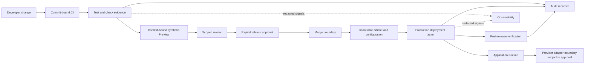
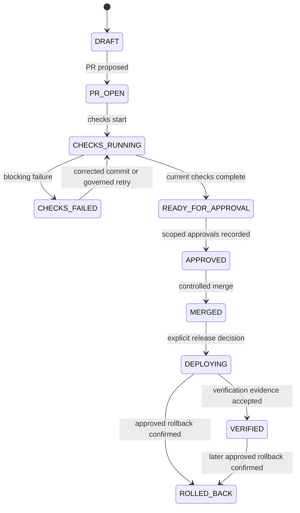

# Foundation V1 Testing and Controlled Release Architecture

## 1. Document status

| Field | Value |
|---|---|
| Title | Foundation V1 Testing and Controlled Release Architecture |
| Analysis date | 24 July 2026 |
| Branch | `rebuild/foundation-v1` |
| HEAD SHA | `604610571ab03f4b155388aedc58770bd2285463` |
| Upstream synchronization | **VERIFIED FACT:** behind 0, ahead 0 relative to `origin/rebuild/foundation-v1` at analysis time |
| Status | Technical discovery and conceptual architecture |
| Neutrality | Provider-neutral and implementation-neutral |
| Implementation | **NOT AUTHORIZED** |
| Selections | No test framework, CI provider, or release provider selected |
| Authorization | No Pull Request, merge, Production deployment, or real-data use authorized |
| Claims | No testing-completeness, quality, security, legal, privacy, provider-suitability, operational-readiness, disaster-recovery-readiness, or Production-readiness claim |
| Authority | Approved Product Owner Decisions 1–10 are authoritative |

## 2. Scope

**PROPOSAL:** This document defines conceptual testing, synthetic-data governance, evidence, execution identity, result handling, controlled release, provenance, failure, retry, concurrency, rollback, hotfix, and later observability/incident boundaries for Foundation V1 foundations and non-interpretive document lifecycle only.

## 3. Non-goals

Test implementation, framework or provider selection, account configuration, interpretive energy features, OCR, AI, real-data testing, release execution, and Production activation are outside scope. Documentation is not certification, approval, or operational readiness.

## 4. Verified current repository state

| Subject | Classification | Repository evidence | Current result | Architectural significance | Unresolved question |
|---|---|---|---|---|---|
| Application stack | VERIFIED FACT | `package.json`; `package-lock.json` | Next.js 16.2.4, React/React DOM 19.2.4, TypeScript 5-compatible dependency, Tailwind 4-compatible dependency | Current implementation baseline only | Future supported versions and upgrade policy **PENDING** |
| Scripts | VERIFIED FACT | `package.json` | `dev`, `build`, `start`, `lint`; no test or coverage script | No repository-visible automated test entry point | Script design **PENDING; NOT AUTHORIZED** |
| Dependencies and lock | VERIFIED FACT | `package.json`; lockfile version 3 in `package-lock.json` | Direct runtime dependencies are Next.js, React, React DOM; lockfile present | Reproducibility input, not release proof | Dependency policy **PENDING** |
| Application structure | VERIFIED FACT | `app/layout.tsx`; `app/page.tsx`; `app/globals.css` | App Router shell with one large client page component | Prototype, not server-authoritative architecture | Refactoring **PENDING; NOT AUTHORIZED** |
| Next.js configuration | VERIFIED FACT | `next.config.ts` | Empty typed configuration object apart from comment | No repository-visible deployment/security controls | Exact configuration **PENDING** |
| TypeScript configuration | VERIFIED FACT | `tsconfig.json` | Strict, no-emit, bundler resolution, Next plugin | Static-analysis input only | Type-check gate **PENDING** |
| Lint configuration | VERIFIED FACT | `eslint.config.mjs`; `package.json` | Next core-web-vitals and TypeScript ESLint config; lint script exists | Only repository-visible quality configuration | Gate status **PENDING** |
| Formatter configuration | VERIFIED FACT | Complete repository tree | No formatter configuration or script found | Formatting automation is absent from visible repository | Tool and policy **PENDING** |
| Test files and directories | VERIFIED FACT | Complete repository tree | No repository-owned test file or test directory found | No implemented suite is proved | Test layout **PENDING; NOT AUTHORIZED** |
| Test frameworks | VERIFIED FACT | `package.json`; repository tree | No declared unit, component, integration, contract, E2E, browser/device, accessibility, performance, or coverage tool | Lockfile transitive/optional references do not establish configured tooling | Frameworks **PENDING** |
| CI and GitHub workflows | VERIFIED FACT | Complete repository tree | No committed CI file or `.github/workflows` file found | No repository-visible automated gate | CI provider and workflow **PENDING** |
| Deployment, Preview and Production configuration | VERIFIED FACT | Complete repository tree; `next.config.ts` | No committed deployment, Preview, or Production-specific configuration found | No repository-visible deployment target, protection, release, or environment policy is proved | All hidden deployment/account settings **UNKNOWN**; future architecture **PENDING** |
| Scanners | VERIFIED FACT | `package.json`; repository tree | No configured security, dependency, or secret scanner found | Scanner readiness is not proved | Tools and gates **PENDING** |
| Test/result evidence | VERIFIED FACT | Complete repository tree | No durable test-result, release-evidence, or coverage persistence found | Builds or manual results cannot be treated as durable release evidence | Evidence store and retention **PENDING** |
| Git remote | VERIFIED FACT | `git remote` configuration | GitHub-hosted `origin` is configured | Existing hosting is tooling, not Foundation V1 approval | Hidden organization/account policy **UNKNOWN** |
| Vercel evidence | VERIFIED FACT | `public/vercel.svg`; README template text; no committed deployment config | Template references only; no repository-visible project/control proof | Does not establish hosting, Preview, or Production approval | All account/project settings **UNKNOWN** |
| Protection and approvals | UNKNOWN | No repository-visible branch/required-check/Preview/deployment protection configuration | Hidden GitHub/Vercel settings cannot be established | Clean Git state does not prove release control | Branch, checks, access, billing, regions, logs, secrets, support and approvals **UNKNOWN** |
| Rollback and hotfix | VERIFIED FACT | Complete repository tree | No rollback automation or hotfix process found | Recovery/release paths are not operationally proved | Policies and mechanisms **PENDING** |
| Migration and feature controls | VERIFIED FACT | `package.json`; repository tree | No database migration tooling or feature-flag implementation found | No schema or staged-activation implementation exists | Future mechanisms **PENDING** |
| Audit and observability | VERIFIED FACT | `package.json`; repository tree | No durable audit persistence or configured observability integration found | Console output or UI state is not durable evidence | Providers and controls **PENDING** |
| Browser `FileReader` | VERIFIED FACT | `app/page.tsx:85-115` | Uploaded files are read with browser `FileReader` | Reading occurs inside the client boundary, not approved server ingestion | Controlled upload, validation, private storage and server processing **PENDING; NOT AUTHORIZED** |
| React-only state | VERIFIED FACT | `app/page.tsx:61-67,77-81` | Operational state is React component state in browser memory | No durability, tenant-safe persistence, server authority, transaction guarantee, or cross-session continuity | Persistence, tenancy, authorization, retention, audit and recovery **PENDING; NOT AUTHORIZED** |
| Simulated values | VERIFIED FACT | `app/page.tsx:119-234`; `PROJECT_AUDIT.md:12-14,134-152,280-283` | Hardcoded or simulated operational/customer-like data and locally constructed behavior exist | Values are not authoritative customer, billing, contractual, OCR, provider, or business data | Sourcing, validation, provenance, provider assessment and Production activation **PENDING; NOT AUTHORIZED** |
| Client deletion | VERIFIED FACT | `app/page.tsx:77-81` | An item is removed by filtering an in-memory client array | UI-memory mutation proves no storage/lifecycle/provider/backup deletion, purge, retention, audit, or confirmation | Server lifecycle, orchestration, confirmation, reconciliation and evidence **PENDING; NOT AUTHORIZED** |
| Browser PDF.js | VERIFIED FACT | `app/page.tsx:69-75,84-115`; `PROJECT_AUDIT.md:101,152` | PDF.js 3.11.174 is loaded from cdnjs and extracts browser-visible text; it is not a declared direct dependency | This is neither approved provider use nor OCR | Dependency, integrity and processing design **PENDING** |
| Server foundations | VERIFIED FACT | Repository tree; `PROJECT_AUDIT.md:12` | No authentication, durable tenant isolation, private document storage, server-authoritative persistence, or durable audit evidence is implemented | Prototype outcomes cannot establish protected operation success | All Foundation implementation **NOT AUTHORIZED** |

## 5. Testing and release principles

**APPROVED OWNER BASELINE:** Local, CI, and ordinary Preview are synthetic-only; authorization and tenant isolation are server-side; real documents cannot enter unapproved providers; no permanent public document URL is permitted; and the release sequence is `branch → push → Pull Request → Preview → checks → approval → merge → Production → verification`. Permission, membership, entitlement, licence, feature, environment, and provider approval are distinct. Document deletion, provider deletion, backup deletion, audit purge, and lifecycle transitions are distinct. Missing, stale, ambiguous, skipped, or untrusted evidence never becomes success. Direct Production change and force-based bypass are prohibited.

## 6. Terminology

| Term | Meaning |
|---|---|
| Test | Controlled evaluation against explicit expected results |
| Check | Gate evaluation backed by attributable evidence |
| Fixture | Synthetic, versioned test input |
| Artifact | Commit-bound build output |
| Preview | Commit-bound synthetic-only review environment |
| Approval | Scoped human decision; never inferred from technical success |
| Release | Controlled promotion of one artifact/configuration identity |
| Verification | Post-deployment evaluation; not real-data approval |
| Quarantine | Test-governance status, not document quarantine |
| Production | Conceptual target; deployment and real data remain **NOT AUTHORIZED** |

## 7. Environment testing matrix

| Environment | Purpose | Permitted data | Prohibited data | Execution authority | Actors | Authentication | Tenant | Secrets | Network | Providers | Persistence | Evidence | Teardown | Release significance | Status |
|---|---|---|---|---|---|---|---|---|---|---|---|---|---|---|---|
| Local | Developer feedback | Marked synthetic only | Real documents/customer/tenant data | Authorized developer within policy | Developer, local runner | Synthetic identities; no Production session | Synthetic tenant fixtures | Local least-privilege test references; no Production secret | Restricted to approved development needs | Substitutes only unless separately assessed | Ephemeral/local synthetic | Attributable local evidence where required | Destroy fixtures and credentials safely | Informative; cannot approve release | NOT AUTHORIZED |
| CI | Repeatable automated checks | Marked synthetic only | Real documents/customer/tenant data | Trusted CI actor under future policy | CI actor, test runner | Synthetic service/user identities | Isolated synthetic tenants | Scoped ephemeral CI references; no Production secret | Deny unknown egress | Provider-neutral substitutes | Ephemeral isolated workspace | Commit/config/fixture-bound results | Deterministic cleanup | Candidate required checks only | NOT AUTHORIZED |
| Preview | Commit-bound review and validation | Marked synthetic only | Real documents/customer/tenant data | Approved Preview actor | Reviewer, stakeholder, automated actor | Separate Preview identities/sessions | Isolated synthetic tenants | Preview-only references; no Production secret | Restricted and observable conceptually | Approved substitutes; no Production resources | Temporary, no Production persistence | Commit/artifact/config/access evidence | Time-bound teardown and revocation | Supports review; cannot approve real data | NOT AUTHORIZED |
| Production | Controlled release target | No real data authorized by this document; future approved data only after separate gates | Any data lacking explicit approval | Approved release authority after gates | Approved operator and runtime | Future approved server authentication | Future server-enforced tenant isolation | Production-only least privilege | Future approved egress | Future approved provider inventory only | Future durable controlled persistence | Release and verification evidence | Governed retirement, not casual teardown | Requires all applicable gates; distinct from real-data activation | NOT AUTHORIZED |

Environment identity is server-authoritative; no client-selected environment or fifth approved runtime environment exists.

## 8. Testing and release authority boundaries

| # | Actor/boundary | Responsibility | Trusted inputs | Allowed influence | Prohibited influence | Approval authority | Prohibited assumptions | Safe failure | Evidence |
|---:|---|---|---|---|---|---|---|---|---|
| 1 | developer | Propose change and tests | Repository and assigned scope | Commit to branch; request review | Direct Production, self-certification | None alone | Local success equals approval | Stop and surface failure | Commit/test attribution |
| 2 | reviewer | Review scope and evidence | Current commit and results | Approve/reject within role | Approve stale evidence or all governance | Scoped review only | Technical review replaces others | Withhold approval | Review identity/reason |
| 3 | approved release operator | Request controlled release | Approved artifact/config/gates | Operate approved release/rollback | Change code, bypass gates | Release operation only | Deployment authorizes real data | Refuse incomplete release | Request/result |
| 4 | Product Owner | Decide product scope/risk | Decision record and reviews | Approve product/release decisions | Replace Legal/Privacy/Security | Product scope as defined | Product approval is universal | Keep decision pending | Decision evidence |
| 5 | Platform Owner | Govern platform within policy | Trusted platform scope/purpose | Request scoped administration | Unrestricted tenant/data access | None by status alone | Role bypasses policy | Deny and audit | Privileged attempt |
| 6 | Tenant Admin | Administer own tenant | Trusted membership/tenant | Tenant-scoped actions | Approve providers or Production | Tenant scope only | Tenant role selects platform policy | Deny cross-scope | Decision evidence |
| 7 | CI system actor | Execute configured checks | Trusted commit/config/fixtures | Produce attributable results | Approve Production alone | None | A pass grants business authority | Fail closed | Run/result |
| 8 | test-execution actor | Run scoped tests | Execution identity and plan | Emit results | Select success or real data | None | Runner output is self-authorizing | Mark invalid/inconclusive | Execution chain |
| 9 | Preview deployment actor | Create/teardown Preview | Approved commit/artifact/config | Manage Preview lifecycle | Use Production data/resources | None | Preview approves real data | Reject unsafe creation | Preview evidence |
| 10 | Production deployment actor | Execute approved deployment | Release decision and immutable artifact | Deploy exact approved target | Choose policy/provider/data | None beyond execution | Deployment is verification | Fail and preserve ambiguity | Deployment evidence |
| 11 | application runtime | Enforce runtime policy | Server-derived identity/tenant/environment | Perform authorized use cases | Grant its own release/provider approval | None | Client claims are trusted | Deny safely | Audit/security evidence |
| 12 | provider adapter | Translate approved operations | Server-authorized request and provider state | Invoke bounded capability | Decide authorization/release/lifecycle | None | Provider success equals business success | Return explicit ambiguity | Correlated result |
| 13 | audit recorder | Append required evidence | Trusted event/context | Record/redact/correlate | Authorize action or rewrite history | None | Log equals AuditEvent | Fail protected operation where required | Audit-of-audit |
| 14 | observability boundary | Emit redacted signals | Correlation and outcomes | Detect and alert | Authorize or create success | None | Missing telemetry means success | Preserve failure | Redacted signal |
| 15 | incident-response boundary | Contain within approved scope | Classified incident and authority | Restrict environment/provider | Unrestricted access or silent rewrite | Emergency scope pending | Incident grants universal access | Least-scope containment | Incident evidence |
| 16 | secret-management boundary | Govern secret references | Environment/actor/purpose | Issue/rotate/revoke later | Expose values or authorize release | None | Secret availability grants access | Deny unavailable/invalid secret | Secret-operation evidence |

The diagram grants no direct developer-to-Production, CI-only approval, Preview real-data approval, observability authorization, client selection, or unrestricted Platform Owner path.

## 9. Test-data policy

Local, CI, and ordinary Preview are synthetic-only. Real Production data is **NOT AUTHORIZED**. Copied, transformed, sampled, disguised, or pseudonymized real customer documents are not synthetic and are prohibited absent a separately approved controlled boundary. Real credentials, tokens, customer email addresses, source-control data, reports, screenshots, logs, snapshots, failure/coverage artifacts, and calls to unapproved providers are prohibited. Ordinary audit evidence contains no document content.

**PENDING AND NON-OPERATIONAL CONTROLLED-EXCEPTION BOUNDARY:** No controlled exception process is currently approved. Its authority, scope, evidence, Legal review, Privacy review, Security review, data handling, environment, provider, retention, and revocation rules remain pending. A developer, user, tenant, Tenant Admin, Platform Owner, test runner, CI actor, or provider cannot invoke an exception. It does not authorize real data in Local, CI, or ordinary Preview. **Implementation is NOT AUTHORIZED.**

## 10. Synthetic fixtures

Fixture sets require visible synthetic identifiers, deterministic generation where useful, reproducible seeds for randomness, tenant-scoped and cross-tenant adversarial data, and versions for identity, invitation, membership, seat, licence, entitlement, Bill, CTE, storage, lifecycle, archive, deletion, audit, retention, purge, provider state, release, malformed, and boundary-value cases. Creation, review, refresh, storage, and teardown are controlled; fixtures cannot resemble real customers deceptively. No real provider or document is required.

## 11. Test-level taxonomy

| # | Level | Purpose | Isolation | Dependencies | Substitute | Permitted data | Prohibited data | Environments | Evidence | Failure significance | Release significance | Status |
|---:|---|---|---|---|---|---|---|---|---|---|---|---|
| 1 | unit | Validate one rule | Pure module | Explicit collaborators | In-memory deterministic fake | Synthetic | Real data | Local, CI | Case/result/version | Rule failure | Blocks relevant gate | NOT AUTHORIZED |
| 2 | component | Validate bounded UI/server component | Component boundary | Stubbed ports | Provider-neutral component harness | Synthetic | Real data | Local, CI, Preview | Render/action/result | Component failure | Blocks relevant gate | NOT AUTHORIZED |
| 3 | integration | Validate internal boundaries | Multiple modules | Controlled adapters | In-memory/ephemeral substitute | Synthetic | Real data/providers | Local, CI, Preview | Correlated interaction | Integration failure | Blocks relevant gate | NOT AUTHORIZED |
| 4 | contract | Validate port semantics | Consumer/provider contract | Contract fixtures | Adapter simulator | Synthetic | Unapproved provider/data | Local, CI | Contract/version/result | Compatibility failure | Blocks adapter release | NOT AUTHORIZED |
| 5 | end-to-end | Validate approved flow | Whole conceptual application | Isolated substitutes | Synthetic environment harness | Synthetic | Real data | CI, Preview | Commit/artifact flow | Journey failure | Blocks release | NOT AUTHORIZED |
| 6 | security and negative authorization | Prove denials | Trust boundary | Malicious/adversarial fixtures | Policy and adapter fakes | Synthetic adversarial | Real credentials/data | Local, CI, Preview | Denial/security evidence | Security boundary failure | Mandatory blocker | NOT AUTHORIZED |
| 7 | property-based and invariant | Explore state/input space | Rule/state machine | Reproducible generator | Deterministic model | Synthetic generated | Real data | Local, CI | Seed/counterexample | Invariant breach | Mandatory blocker | NOT AUTHORIZED |
| 8 | release verification | Verify exact deployed identity | Release target | Approved signals/substitutes | Provider-neutral verification probe | Synthetic unless separately authorized later | Real customer data by this document | Preview; Production NOT AUTHORIZED | Artifact/config/result | Ambiguous deployment | Blocks verification | NOT AUTHORIZED |

## 12. Unit testing

**Objective:** isolated domain/application rules. **Trusted setup:** versioned rule and fixtures. **Synthetic fixtures:** boundary values and state histories. **Positive cases:** permitted outcomes. **Negative cases:** invalid inputs and denials. **Boundary cases:** time, quantity, empty and maximum. **Authorization cases:** policy inputs never client authority. **Tenant-isolation cases:** tenant keys cannot cross. **Idempotency cases:** duplicate identity. **Concurrency cases:** model competing versions. **Expected evidence:** case, seed, version, result. **Safe failure:** explicit failure. **Release significance:** blocks affected rules. **Provider-neutral substitute:** pure fakes. **Unresolved implementation decisions:** framework/tooling **PENDING; NOT AUTHORIZED**.

## 13. Component testing

**Objective:** bounded presentation and service components. **Trusted setup:** explicit props/context. **Synthetic fixtures:** accessible UI and service fixtures. **Positive cases:** valid interaction. **Negative cases:** denied and failed states. **Boundary cases:** empty/large/responsive states. **Authorization cases:** UI never grants authority. **Tenant-isolation cases:** scope not leaked. **Idempotency cases:** repeated actions safe. **Concurrency cases:** stale response ordering. **Expected evidence:** rendered state/action/result. **Safe failure:** no false success. **Release significance:** blocks affected component. **Provider-neutral substitute:** harness and fakes. **Unresolved implementation decisions:** component framework **PENDING; NOT AUTHORIZED**.

## 14. Integration testing

**Objective:** module/port collaboration. **Trusted setup:** server-derived context. **Synthetic fixtures:** tenants, documents, policies. **Positive cases:** authorized orchestration. **Negative cases:** dependency failure/denial. **Boundary cases:** missing/ambiguous results. **Authorization cases:** revalidated at use case. **Tenant-isolation cases:** all reads/writes scoped. **Idempotency cases:** repeated commands. **Concurrency cases:** version conflict. **Expected evidence:** correlation and outcomes. **Safe failure:** deny/retain ambiguity. **Release significance:** blocks affected integration. **Provider-neutral substitute:** ephemeral/in-memory adapters. **Unresolved implementation decisions:** tooling/topology **PENDING; NOT AUTHORIZED**.

## 15. Contract testing

**Objective:** verify conceptual port contracts. **Trusted setup:** versioned contract. **Synthetic fixtures:** valid/invalid payloads. **Positive cases:** accepted semantics. **Negative cases:** malformed/unauthorized response. **Boundary cases:** timeouts and partials. **Authorization cases:** output grants no authority. **Tenant-isolation cases:** tenant echoed only from trusted scope. **Idempotency cases:** duplicate request semantics. **Concurrency cases:** out-of-order responses. **Expected evidence:** contract/version/result. **Safe failure:** incompatible contract blocks. **Release significance:** blocks adapter promotion. **Provider-neutral substitute:** contract simulator. **Unresolved implementation decisions:** framework **PENDING; NOT AUTHORIZED**.

## 16. End-to-end testing

**Objective:** synthetic user/system journeys. **Trusted setup:** isolated environment and approved fixture set. **Synthetic fixtures:** identities, tenants, Bills, CTEs. **Positive cases:** permitted foundation/lifecycle journeys. **Negative cases:** denials and failures. **Boundary cases:** stale sessions, expiry and ambiguity. **Authorization cases:** server decisions. **Tenant-isolation cases:** adversarial cross-tenant journeys. **Idempotency cases:** repeated submissions. **Concurrency cases:** competing actors. **Expected evidence:** commit/artifact/config journey. **Safe failure:** no false completion. **Release significance:** mandatory where applicable. **Provider-neutral substitute:** full fake boundary. **Unresolved implementation decisions:** E2E tool **PENDING; NOT AUTHORIZED**.

## 17. Security and negative-authorization testing

**Objective:** prove fail-closed trust boundaries. **Trusted setup:** server-derived identities, tenant scope, authorization policy, environment, provider state, and expected result. **Synthetic fixtures:** independently marked cases for unauthenticated access; invalid identity; invalid membership; tenant mismatch; session replay; invitation replay; revoked invitation; expired invitation; revoked session; suspended tenant; blocked licence; and missing feature. **Positive cases:** an authorized control case proves the denial suite is not indiscriminately rejecting all operations. **Negative cases:** cross-tenant read; cross-tenant write; mixed-tenant batch; Platform Owner overreach; Tenant Admin overreach; role escalation; permission escalation; entitlement escalation; environment spoofing; provider spoofing; client-selected authorization or test outcome; storage-authorization denial; private-delivery denial; audit-access overreach; support-access overreach; and incident-response overreach. **Boundary cases:** stale, replayed, revoked, expired, mismatched, and ambiguous authority material remain separate cases. **Authorization cases:** every protected use case uses the applicable server authority; the test runner cannot choose its own expected result. **Tenant-isolation cases:** cross-tenant read, write, delete, export, audit, and delivery attempts are independently denied. **Idempotency cases:** retry and replay preserve the original denial and never create access. **Concurrency cases:** revocation, suspension, membership change, or provider restriction during an operation fails closed. **Expected evidence:** each case records the trusted authority, attempted scope, distinct expected denial, actual denial, correlation, and redacted audit or security evidence. **Safe failure:** denial remains denial; the client cannot turn denial into success, CI cannot reinterpret a failed negative-authorization case as PASS, and observability cannot authorize the denied operation. **Release significance:** every listed case is release-blocking when its expected denial is absent, ambiguous, or bypassed. **Provider-neutral substitute:** deterministic identity, authorization, storage, provider, audit, and observability fakes using synthetic data only. **Unresolved implementation decisions:** scanner, harness, policy implementation, and evidence mechanism remain **PENDING; implementation NOT AUTHORIZED**.

## 18. Tenant-isolation testing

**Objective:** prove independent tenant enforcement. **Trusted setup:** trusted tenant derivation. **Synthetic fixtures:** multiple tenants and mixed batches. **Positive cases:** own-tenant access. **Negative cases:** cross-tenant read/write/delete/export/audit/storage delivery and cache contamination. **Boundary cases:** suspended tenant/deactivated membership. **Authorization cases:** Platform Owner purpose and Tenant Admin scope. **Tenant-isolation cases:** background and adapter scope. **Idempotency cases:** duplicate tenant-scoped operation. **Concurrency cases:** competing tenants/shared fixture risk. **Expected evidence:** tenant-attributed decisions. **Safe failure:** deny entire unsafe batch. **Release significance:** mandatory blocker. **Provider-neutral substitute:** tenant-aware fakes. **Unresolved implementation decisions:** enforcement technology **PENDING; NOT AUTHORIZED**.

## 19. Identity, invitation, membership, and session testing

**Objective:** preserve canonical identity, invitation, membership, and session distinctions. **Trusted setup:** trusted verifier, session, account, membership, tenant, and effective-state context. **Synthetic fixtures:** invitation issuance; delivery failure; acceptance; expiry; revocation; invitation replay; one-use invitation enforcement; invitation-verifier replay; superseded invitation; separately created replacement invitation; invalid invitation; account activation; account deactivation; reactivation attempt; authentication success; authentication failure; session creation; material refresh; session revocation; all-session revocation; membership activation; membership deactivation; membership revocation; membership state conflict; tenant block; commercial block; email verification; email change; identity mismatch; linking rejection; and suspicious session behavior. **Positive cases:** only the currently valid invitation verifier may succeed, and only under the current trusted invitation, membership, tenant, and account rules. **Negative cases:** reject an earlier verifier after supersession or replacement; reject invalidated prior verifier material; reject replay, stale verifier, superseded verifier, revoked verifier, expired verifier, acceptance after revocation, acceptance after expiry, acceptance after replacement, session-material replay, session refresh with obsolete material, identity mismatch, linking conflict, and membership state conflict. **Boundary cases:** exact invitation expiry, replacement/supersession ordering, verifier invalidation, concurrent acceptance attempts, session refresh/revocation ordering, and membership version boundaries are independently tested. **Authorization cases:** authentication, account activation, invitation acceptance, membership activation, and tenant access remain separate server-authoritative decisions. **Tenant-isolation cases:** invitation, membership, session, and account actions remain bound to their trusted tenant; no verifier transfers authority across tenants. **Idempotency cases:** one-use enforcement is stable; retry does not restore invalidated verifier material or create another acceptance. **Concurrency cases:** concurrent acceptance attempts permit at most the single policy-valid result; acceptance racing revocation, expiry, supersession, or replacement fails safely and preserves authoritative ordering. **Expected evidence:** distinct redacted canonical events for issue, delivery failure, acceptance, expiry, revocation, replay, supersession, replacement creation, invalid verifier, session replay/refresh/revocation, membership conflict, and every denial; no raw verifier, token, or credential. **Safe failure:** successful or authoritative supersession/replacement invalidates earlier verifier material, and replay or ambiguous material fails closed without identity or session leakage. **Release significance:** missing one-use, verifier-invalidation, replay, session, or membership-conflict coverage blocks the applicable identity gate. **Provider-neutral substitute:** deterministic invitation, verifier, session, membership, and identity fakes using synthetic identities only. **Unresolved implementation decisions:** no authentication or identity provider is selected; verifier representation, delivery mechanism, session mechanism, and implementation remain **PENDING; NOT AUTHORIZED**.

## 20. Licensing, entitlement, seat, and feature testing

**Objective:** preserve commercial, licence, entitlement, seat, feature, payment-evidence, and decision distinctions. **Trusted setup:** trusted tenant commercial account, plan, contract, licence, entitlement, seat, feature, payment-review, actor, and version facts. **Synthetic fixtures:** tenant commercial account; plan assignment/change; contract creation/amendment; licence grant/activation/block/suspension/expiry/future restoration boundary; seat capacity/allocation/consumption/release/denial/reconciliation; entitlement grant/removal; feature enable/disable; quantitative-limit change; grace; payment-evidence recording/review/rejection; manual payment decision; manual payment block/application/removal; tenant suspension; reinstatement; correction; and denied commercial decision. **Positive cases:** separately authorized server-side decisions may change the applicable licence, reinstatement, commercial-block, entitlement, seat, or feature state when all distinct prerequisites pass. **Negative cases:** payment evidence alone does not automatically activate a licence, reinstate a tenant, remove a commercial block, grant an entitlement or seat, or enable a feature; absent permission, licence, entitlement, capacity, feature, or trusted commercial decision remains denied. **Boundary cases:** capacity, quantitative limits, effective time, expiry, grace, suspension, payment-review ambiguity, and conflicting evidence are independent boundaries. **Authorization cases:** manual payment is the approved initial commercial baseline, but payment evidence, a provider response, the client, test runner, or CI cannot directly activate commercial rights; licence activation, reinstatement, commercial unblock, entitlement change, seat change, and feature activation require separately authorized server-side decisions. **Tenant-isolation cases:** payment evidence and every commercial state remain tenant-bound and cannot affect another tenant. **Idempotency cases:** duplicate payment evidence does not duplicate licences, seats, entitlements, commercial unblock, reinstatement, or feature activation; duplicate authorized commands preserve one attributable outcome. **Concurrency cases:** last-seat allocation, concurrent evidence review, suspension/reinstatement, block removal, and feature/entitlement change preserve versions and fail on conflict. **Expected evidence:** distinguish payment evidence, manual payment decision, licence state, entitlement state, seat state, feature state, tenant suspension, commercial block, reinstatement, correction, denial, and reconciliation without unnecessary payment data. **Safe failure:** ambiguous or conflicting payment evidence fails closed and requires reconciliation; no evidence upload or provider outcome implies success. **Release significance:** any automatic activation, cross-tenant, duplicate-right, or state-collapsing result blocks the commercial gate. **Provider-neutral substitute:** deterministic commercial, payment-evidence, licence, entitlement, seat, and feature policy fakes. **Unresolved implementation decisions:** no automated payment provider is selected; payment review, persistence, reconciliation, and implementation remain **PENDING; NOT AUTHORIZED**.

## 21. Data-model and integrity testing

**Objective:** validate conceptual identities, tenant ownership, relationships, versions, temporal rules, evidence, deletion, retention, lifecycle, and audit integrity without selecting persistence technology. **Trusted setup:** canonical conceptual model and version, trusted tenant ownership, trusted entity identifiers, server-authoritative identifier derivation where required, trusted actor, policy, and time. **Synthetic fixtures:** valid and invalid aggregate graphs covering uniqueness, referential integrity, required relationships, prohibited relationships, state consistency, version consistency, immutable evidence, append-only correction, temporal validity, effective-date boundaries, expiry boundaries, deletion relationships, retention relationships, lifecycle relationships, and audit relationships. **Positive cases:** valid tenant-owned entities, trusted identifiers, required references, compatible states/versions, valid effective/expiry ordering, and attributable append-only corrections are accepted conceptually. **Negative cases:** duplicate uniqueness keys; missing references; prohibited or cross-tenant relationships; inconsistent state/version; client-selected tenant identifier; client-selected authoritative identity; mutation of immutable evidence; history rewrite; invalid time order; invalid deletion/retention/lifecycle relationship; and incomplete persistence result are rejected. **Boundary cases:** exact effective date, expiry, version, deletion, retention, lifecycle, uniqueness, and tenant-transfer boundaries are independently evaluated. **Authorization cases:** client-provided identifiers do not create authority; authoritative identifiers and mutation authority are derived or verified server-side. **Tenant-isolation cases:** every tenant-owned relationship resolves to one trusted tenant; no cross-tenant relationship or client-selected tenant identifier is accepted. **Idempotency cases:** every command uses an idempotency identity; exact duplicates reuse the attributable outcome, while conflicting duplicate commands fail and remain visible. **Concurrency cases:** concurrency conflicts and stale version writes are rejected or reconciled without hidden overwrite; no transaction or locking mechanism is selected. **Expected evidence:** distinct evidence for ownership, identifier provenance, uniqueness, reference validation, state/version decision, temporal validation, correction, conflict, deletion/retention/lifecycle relationship, audit relationship, ambiguous result, and reconciliation. **Safe failure:** incomplete, stale, cross-tenant, inconsistent, temporally invalid, or ambiguous persistence results fail closed; safe reconciliation preserves original evidence and requires separate correction authority. **Release significance:** any ownership, identifier, relationship, temporal, evidence, deletion, retention, lifecycle, or version invariant failure blocks the applicable data-integrity gate. **Provider-neutral substitute:** an in-memory conceptual model with deterministic identifiers, versions, clocks, conflicts, and reconciliation findings. **Unresolved implementation decisions:** TypeScript typing alone does not prove runtime integrity; the schema boundary remains conceptual only, and no schema, table, database, ORM, SQL, migration, transaction mechanism, locking mechanism, or implementation is selected or authorized.

## 22. Document-upload and storage testing

**Objective:** validate controlled private upload, storage, delivery, archive evidence, deletion evidence, and reconciliation without authorizing storage or lifecycle implementation. **Trusted setup:** server-authorized tenant, actor, permission, entitlement, UploadIntent, StorageReference, policy, and provider-state context. **Synthetic fixtures:** independently identifiable UploadIntent creation; UploadIntent denial; UploadIntent expiry; transfer start; transfer completion; finalization request; finalization success; finalization failure; validation failure; integrity mismatch; MIME/type mismatch; size mismatch; conditional quarantine; StorageReference creation; future StorageReference replacement; private-delivery authorization; private-delivery denial; tokenized-delivery success; tokenized-delivery expiry; tokenized-delivery misuse; missing object; object/reference mismatch; wrong-tenant object; storage-archive evidence; storage-limit denial; storage-entitlement denial; document-permission denial; deletion request; ambiguous deletion result; deletion confirmation; deletion failure; reconciliation; conditional migration; permanent-public-URL prohibition; secret redaction; and token redaction. **Positive cases:** only a server-authorized, tenant-matched, permission- and entitlement-valid, independently validated operation produces its narrowly scoped storage result. **Negative cases:** integrity mismatch, MIME/type mismatch, size mismatch, wrong tenant, missing object, object/reference mismatch, expired or misused delivery, storage-limit denial, storage-entitlement denial, document-permission denial, permanent public URL, and secret/token exposure are independently rejected. **Boundary cases:** UploadIntent expiry, transfer completion, finalization timing, tokenized-delivery expiry, size limit, object/reference state, deletion ambiguity, and conditional quarantine/migration boundaries remain distinct. **Authorization cases:** storage-limit denial differs from storage-entitlement denial, which differs from document-permission denial; storage evidence and storage deletion do not authorize or complete a lifecycle transition. **Tenant-isolation cases:** wrong-tenant object, reference, delivery, finalization, archive, deletion, and reconciliation operations fail closed. **Idempotency cases:** intent, finalization, delivery issuance, deletion request, deletion confirmation, and reconciliation identities preserve one attributable outcome without converting ambiguity into confirmation. **Concurrency cases:** transfer/finalization, replacement/access, archive/delete, deletion/delivery, and deletion/migration races preserve tenant, version, and confirmation invariants. **Expected evidence:** distinct redacted evidence for every listed creation, denial, expiry, start, completion, request, success, failure, mismatch, authorization, delivery, archive, deletion, reconciliation, quarantine, and migration boundary; no binary, secret, raw token, signed URL, or avoidable provider path. **Safe failure:** integrity mismatch is distinct from MIME/type mismatch and size mismatch; missing object is distinct from object/reference mismatch; deletion request is not deletion confirmation; deletion failure is distinct from ambiguous result; ambiguity never becomes success. **Release significance:** any public exposure, cross-tenant result, mismatch collapse, authorization bypass, false deletion confirmation, or missing redaction blocks the private-storage gate. **Provider-neutral substitute:** deterministic UploadIntent, object, reference, private-delivery, deletion, and reconciliation fakes using synthetic non-document payloads. **Unresolved implementation decisions:** no real document, provider, public URL, storage implementation, scanning implementation, quarantine implementation, migration, or other implementation is authorized; all mechanisms remain **PENDING; NOT AUTHORIZED**.

## 23. Document-lifecycle, retention, deletion, and purge testing

**Objective:** validate canonical Bill/CTE lifecycle, archive, application deletion, storage deletion, provider deletion, backup/subprocessor evidence, audit-retention continuation, audit purge, reconciliation, and resurrection prevention as separate authorities and results. **Trusted setup:** trusted actor, tenant, document ownership, lifecycle state/version, policy/version, approved document-retention origin, trusted clock, and separately approved audit-retention policy where one later exists. **Synthetic fixtures:** Bill and CTE lifecycle-state transitions; invalid transitions; archive transition and authority; Bill deletion eligibility 60 calendar days from `archived_at`; CTE deletion eligibility 12 calendar months from `archived_at`; CTE contractual-expiry transition only where reliable and approved; application deletion request; storage deletion request; storage deletion confirmation; provider deletion request; provider deletion confirmation; subprocessor deletion evidence; backup deletion evidence; application deletion completion; audit-retention continuation; audit purge eligibility; audit purge request; audit purge confirmation; dependent-copy reconciliation; resurrection prevention; missing audit-retention origin; missing audit-retention duration; pending legal hold; pending investigation preservation; and partial or ambiguous outcomes. **Positive cases:** each authorized transition or confirmation succeeds only for its own layer after its own prerequisites and evidence pass. **Negative cases:** early, cross-tenant, wrong-state, stale-version, missing-origin, missing-duration, held, investigation-blocked, partial, ambiguous, or falsely correlated deletion/purge operations are denied or remain unconfirmed. **Boundary cases:** exact Bill and CTE calendar boundaries, reliable contractual expiry, archive time, deletion due time, provider/subprocessor/backup evidence, audit-retention eligibility, and restore/resurrection boundaries are independently tested. **Authorization cases:** lifecycle-state transition, archive transition, application deletion, storage deletion, provider deletion, backup treatment, and audit purge use separate server-side authorities; document deletion does not authorize audit purge, and audit purge does not authorize or prove document, storage, or provider deletion. **Tenant-isolation cases:** destructive batches cannot mix tenants, and all lifecycle, deletion, purge, backup, subprocessor, and reconciliation evidence preserves trusted tenant attribution. **Idempotency cases:** application, storage, provider, and audit-purge requests and confirmations retain distinct identities; retry never converts request, failure, partial result, or ambiguity into confirmation. **Concurrency cases:** archive/delete, lifecycle/storage, provider/subprocessor, backup/purge, hold/investigation, purge/restore, and reconciliation races fail safely and preserve prior evidence. **Expected evidence:** separately attributable evidence for lifecycle-state transition, archive transition, application deletion request/completion, storage deletion request/confirmation/failure, provider deletion request/confirmation, subprocessor result, backup result, audit-retention continuation, audit-purge eligibility/request/confirmation, dependent-copy reconciliation, and resurrection prevention. **Safe failure:** storage deletion does not prove lifecycle completion; lifecycle deletion does not prove storage deletion; application deletion does not prove provider deletion; provider deletion does not prove backup deletion; primary-provider confirmation does not prove subprocessor deletion; deletion request is not confirmation; partial or ambiguous deletion is not success; missing audit-retention origin or duration fails closed; no immediate physical erasure is claimed. **Release significance:** any premature transition, collapsed authority, false confirmation, invented audit-retention fact, incomplete dependent-copy accounting, or resurrection blocks the lifecycle/audit-retention gate. **Provider-neutral substitute:** deterministic lifecycle clocks, application/storage/provider/subprocessor/backup stores, audit-policy evaluators, purge coordinators, and reconciliation fakes. **Unresolved implementation decisions:** legal hold and investigation preservation remain pending; no audit-retention origin or duration is invented; jobs, providers, backups, purge, physical erasure, and implementation remain **PENDING; NOT AUTHORIZED**.

## 24. Provider-adapter and provider-governance testing

**Objective:** enforce provider state and restrictions. **Trusted setup:** approved conceptual ProviderRecord/policy. **Synthetic fixtures:** UNASSESSED, DISCOVERY_ONLY, ASSESSMENT_IN_PROGRESS, CONDITIONALLY_APPROVED, APPROVED, RESTRICTED, SUSPENDED, REJECTED, EXITING; locations, subprocessors, retention/deletion evidence. **Positive cases:** condition-bound permitted operation. **Negative cases:** unapproved/unknown-location/training/model-improvement/human-review/support misuse. **Boundary cases:** state change during operation. **Authorization cases:** adapter never approves itself. **Tenant-isolation cases:** provider scope. **Idempotency cases:** retry/ambiguous result. **Concurrency cases:** suspension/migration/outage. **Expected evidence:** provider-state decision. **Safe failure:** deny or remain ambiguous. **Release significance:** provider gate. **Provider-neutral substitute:** adapter simulator. **Unresolved implementation decisions:** all providers **PENDING; NOT AUTHORIZED**.

## 25. Audit, security-evidence, and observability testing

**Objective:** trustworthy minimized evidence. **Trusted setup:** authoritative actor/tenant/time/correlation. **Synthetic fixtures:** AuditEvent, SecurityEvent, LifecycleEvent, causation, corrections, time distinctions, access/export-pending, retention-origin missing and purge reconciliation. **Positive cases:** append-only attributable evidence. **Negative cases:** rewriting, content/token/credential inclusion, over-access. **Boundary cases:** delayed/duplicate events. **Authorization cases:** audit access purpose-bound; observability cannot authorize. **Tenant-isolation cases:** cross-tenant evidence denial. **Idempotency cases:** event identity. **Concurrency cases:** operation/evidence divergence. **Expected evidence:** audit-of-audit and redacted telemetry. **Safe failure:** missing telemetry never creates success. **Release significance:** audit gate. **Provider-neutral substitute:** capturing recorder/sink. **Unresolved implementation decisions:** stores, export, retention origin **PENDING; NOT AUTHORIZED**.

## 26. Accessibility testing

**Objective:** validate accessible foundation interactions without claiming compliance or selecting tooling. **Trusted setup:** declared semantics, interaction purpose, focus behavior, status behavior, and synthetic user flows. **Synthetic fixtures:** keyboard-only navigation; logical focus order; visible focus; focus restoration; modal or dialog focus containment where applicable; accessible names; form labels; error association; semantic landmarks; heading hierarchy; button and link semantics; status announcements; loading-state announcements; error-state announcements; screen reader reading order; screen reader control names; screen reader state changes; contrast; zoom and text resizing; reduced-motion boundary where applicable; no information conveyed only through colour; and accessible denial and failure states. **Positive cases:** every applicable flow remains operable, perceivable, understandable, and explicitly labelled through the tested interaction modes. **Negative cases:** missing accessible names, unassociated errors, broken hierarchy, focus loss/trap, silent dynamic state, colour-only meaning, inaccessible denial, and inaccessible loading or failure state are distinct failures. **Boundary cases:** zoom, text resize, long labels, dynamic content, dialog transitions, reduced motion, repeated errors, and loading/denial transitions. **Authorization cases:** accessibility tooling, results, or assistive-technology simulation grants no application, tenant, release, or real-data authority. **Tenant-isolation cases:** accessible names, status messages, errors, focus targets, and announcements expose no other tenant or sensitive data. **Idempotency cases:** repeated navigation, validation, dialog open/close, loading, denial, and error recovery preserve focus and announcements. **Concurrency cases:** dynamic updates cannot reorder focus, headings, announcements, or control state into an inaccessible or misleading result. **Expected evidence:** case identity, semantic expectation, interaction mode, observed focus/announcement/contrast/result, reviewer where required, and redacted failure evidence. **Safe failure:** missing or ambiguous accessibility evidence blocks the applicable conceptual check without claiming certification. **Release significance:** an applicable accessibility failure blocks its future approved gate. **Provider-neutral substitute:** conceptual DOM, focus, semantic-tree, announcement, contrast, zoom, and motion evaluators using synthetic content. **Unresolved implementation decisions:** exact accessibility standard, acceptance thresholds, accessibility framework, scanner, assistive-technology matrix, and tooling remain **PENDING; implementation NOT AUTHORIZED**; passing a conceptual accessibility test does not certify compliance.

## 27. Browser, device, and responsive testing

**Objective:** validate browser, device, mobile, orientation, responsive, input, network-interruption, and client-storage behavior without selecting tooling. **Trusted setup:** supported-browser decision **PENDING**, trusted environment, synthetic fixtures, viewport/orientation, input mode, and future support matrix version. **Synthetic fixtures:** supported and unsupported browser cases; desktop viewport; tablet viewport; mobile viewport; portrait orientation; landscape orientation; responsive navigation; responsive tables and dense data; touch-target behavior; keyboard behavior; virtual-keyboard interaction; scroll containment; zoom behavior; mobile upload interaction; mobile private-delivery interaction; loading states; error states; offline or interrupted-network boundary; browser storage; and browser-specific PDF behavior using synthetic non-customer inputs only. **Positive cases:** future-supported combinations preserve navigation, layout, controls, private-flow boundaries, status, and recoverable interruption behavior. **Negative cases:** unsupported browsers fail safely; broken navigation/table layout, undersized touch targets, keyboard obstruction, scroll traps, hidden status, unsafe browser storage, failed upload/delivery handling, and browser-specific PDF ambiguity are distinct failures. **Boundary cases:** smallest/largest supported viewport, portrait/landscape change, zoom, long dense data, virtual keyboard, interrupted request, reload, and browser-version edge. **Authorization cases:** browser state, storage, device identity, environment labels, and client outcomes are never authoritative for tenant, upload, delivery, release, or real-data decisions. **Tenant-isolation cases:** browser caches, storage, sessions, tabs, mobile uploads, and private-delivery state cannot cross tenant or environment. **Idempotency cases:** reload, retry, orientation change, navigation collapse/expand, upload request, and delivery request do not duplicate authoritative operations. **Concurrency cases:** multi-tab, orientation, interrupted-network, upload/delivery, and stale-browser-state races fail safely. **Expected evidence:** browser/version, device class, viewport, orientation, input mode, synthetic fixture, network condition, expected result, actual result, and redacted evidence. **Safe failure:** unsupported or ambiguous behavior produces an explicit safe state and no false success. **Release significance:** failures in a future approved support matrix block that matrix; Production testing remains unauthorized. **Provider-neutral substitute:** abstract browser/device/responsive/network harness with synthetic fixtures and no real provider. **Unresolved implementation decisions:** supported browsers, devices, automation tooling, device-testing provider, PDF support, thresholds, and implementation remain **PENDING; NOT AUTHORIZED**.

## 28. Performance, capacity, and reliability testing

**Objective:** validate conceptual latency, capacity, resource, reliability, saturation, and recovery boundaries without Production load testing. **Trusted setup:** versioned synthetic workload, environment, tenant-fixture scope, operation mix, and capacity/latency/reliability/resource thresholds, all thresholds **PENDING**. **Synthetic fixtures:** latency and response-time cases; throughput; concurrent users; concurrent tenant operations; file-size boundary; document-count boundary; pagination boundary; memory usage; CPU usage; network usage; storage usage; client resource usage; server resource usage; provider-resource usage through a substitute; timeout; saturation; backpressure boundary; capacity denial; graceful degradation; error-rate evidence; retry amplification; duplicate-work prevention; recovery; and reliability over repeated runs. **Positive cases:** operations within future approved thresholds complete with tenant isolation, bounded resources, attributable measurements, and no duplicate work. **Negative cases:** excessive latency, timeout, saturation, unsafe resource growth, backpressure failure, missing capacity denial, retry amplification, duplicate work, noisy-neighbour effect, failed recovery, and excessive error rate are distinct failures. **Boundary cases:** exact file/document/page/concurrency/capacity/timeout/resource thresholds and repeated-run reliability boundaries. **Authorization cases:** load, capacity availability, provider response, or performance result cannot bypass authentication, authorization, entitlement, feature, environment, provider, or release policy. **Tenant-isolation cases:** concurrent users and tenant operations preserve isolation under load and prevent one tenant from consuming or exposing another tenant's resources or evidence. **Idempotency cases:** retries under load reuse operation identity and prevent duplicate work or duplicate evidence. **Concurrency cases:** simultaneous users, tenants, uploads, lifecycle operations, deletions, audits, and release signals preserve their invariants under synthetic load. **Expected evidence:** redacted latency, response-time, throughput, concurrency, file/document/page counts, client/server/provider resource usage, timeout, saturation, capacity denial, degradation, error rate, retry amplification, recovery, and repeated-run reliability measurements. **Safe failure:** deny, shed, degrade, or stop safely without false success, cross-tenant impact, secret/content exposure, or invented capacity. **Release significance:** a future approved threshold breach blocks its applicable check; this document authorizes no Production load test. **Provider-neutral substitute:** deterministic synthetic load, clock, resource-meter, backpressure, timeout, and provider-resource simulators. **Unresolved implementation decisions:** capacity, latency, reliability and resource thresholds; performance tool; monitoring provider; hosting provider; load-testing provider; and implementation remain **PENDING; synthetic-only; NOT AUTHORIZED**.

## 29. Failure-injection and resilience testing

**Objective:** validate safe failure, evidence preservation, reconciliation, and recovery across independently identifiable external, application, storage, lifecycle, audit, configuration, secret, deployment, verification, and rollback failures. **Trusted setup:** synthetic fault plan, trusted environment/tenant/actor/operation identity, expected failure, evidence requirements, and approved conceptual recovery policy. **Synthetic fixtures:** provider timeout; provider unavailable; dependency unavailable; partial failure represented separately as partial provider failure and partial application failure; ambiguous external result; retry; duplicate execution; delayed confirmation; confirmation lost after success; storage failure; private-delivery failure; lifecycle-transition failure; retention-job failure; deletion failure; purge failure; audit-recording failure; security-evidence failure; observability failure; configuration drift; invalid configuration; secret expiry; secret revocation; provider restriction during operation; tenant suspension during operation; deployment failure; verification failure; rollback request failure; rollback execution failure; rollback confirmation ambiguity; network interruption; stale evidence; and evidence-persistence failure. **Positive cases:** only an explicitly reconciled or confirmed recovery under future approved policy produces its narrowly scoped result while preserving every prior attempt and failure. **Negative cases:** false success, hidden partial completion, missing failure evidence, unauthorized fallback, retry-based rewriting, stale-evidence acceptance, unconfirmed rollback, and cross-tenant propagation are independently rejected. **Boundary cases:** failure before operation, after external success but before confirmation, between state change and audit, during deletion/purge, during provider/tenant restriction, during deployment/verification, and during rollback request/execution/confirmation. **Authorization cases:** fallback, recovery, provider response, retry, observability, and incident handling never grant operation, tenant, provider, release, or real-data authority. **Tenant-isolation cases:** every injected failure remains tenant-scoped; shared provider, evidence, retry, deployment, and rollback faults cannot mix tenant effects. **Idempotency cases:** retry cannot erase prior failure; duplicate execution reuses identity; confirmation lost after success remains ambiguous until reconciliation; no duplicate state change or evidence is invented. **Concurrency cases:** original completion versus retry, restriction/suspension versus operation, audit/security/telemetry failure versus state change, deployment versus verification, and rollback request/execution/confirmation races preserve authoritative ordering. **Expected evidence:** distinct redacted evidence for every injected fault, attempt, partial result, ambiguity, denial, recovery, reconciliation, and final confirmed or unconfirmed outcome. **Safe failure:** missing audit or telemetry evidence cannot create success; ambiguous external completion cannot be recorded as confirmed success; no false success is permitted; evidence is preserved and reconciliation is required. **Release significance:** any hidden partial result, false confirmation, lost prior failure, cross-tenant effect, unreconciled ambiguity, or unsafe recovery blocks the applicable reliability/release gate. **Provider-neutral substitute:** deterministic fault-injecting provider, dependency, storage, delivery, lifecycle, job, deletion, purge, audit, security-evidence, observability, configuration, secret, deployment, verification, rollback, network, and evidence-store fakes. **Unresolved implementation decisions:** no chaos framework, retry library, queue, scheduler, workflow engine, circuit breaker, transaction mechanism, failover provider, threshold, or implementation is selected; all remain **PENDING; NOT AUTHORIZED**.

### Consolidated conceptual test-category inventory

| # | Category | Objective | Levels | Environment | Fixtures | Expected result | Blocking significance | Evidence | Status |
|---:|---|---|---|---|---|---|---|---|---|
| 1 | environment identity | Reject spoofing | Unit, integration, security | Local/CI/Preview | Environment contexts | Trusted identity used | Mandatory | Decision/result | NOT AUTHORIZED |
| 2 | Local synthetic-only | Reject real data | Security, invariant | Local | Classified inputs | Synthetic accepted; real denied | Mandatory | Classification result | NOT AUTHORIZED |
| 3 | CI synthetic-only | Reject real data | Integration, security | CI | Classified inputs | Synthetic accepted; real denied | Mandatory | Run/result | NOT AUTHORIZED |
| 4 | Preview synthetic-only | Reject real data | E2E, security | Preview | Classified inputs | Synthetic accepted; real denied | Mandatory | Preview result | NOT AUTHORIZED |
| 5 | real-data rejection | Enforce prohibition | Security, invariant | Local/CI/Preview | Adversarial data | Denied | Mandatory | Security evidence | NOT AUTHORIZED |
| 6 | authentication success | Validate valid proof | Unit, integration | Local/CI | Synthetic identity | Authenticated identity | Identity gate | Audit result | NOT AUTHORIZED |
| 7 | authentication failure | Safe denial | Security | Local/CI | Invalid identity | Denied without leakage | Mandatory | Security evidence | NOT AUTHORIZED |
| 8 | session creation | Bind trusted session | Integration | CI | Synthetic user | Scoped session | Identity gate | Audit result | NOT AUTHORIZED |
| 9 | session refresh | Preserve material distinction | Integration | CI | Expiring session | Valid refresh or denial | Identity gate | Audit result | NOT AUTHORIZED |
| 10 | session revocation | End access | Security | CI | Revoked session | Denied | Mandatory | Audit/security | NOT AUTHORIZED |
| 11 | invitation one-use enforcement | Prevent reuse | Property, security | CI | Invitation verifier | Second use denied | Mandatory | Invitation evidence | NOT AUTHORIZED |
| 12 | invitation expiry, revocation, and replay | Distinguish outcomes | Unit, security | CI | Invitation states | Correct separate denial | Mandatory | Security evidence | NOT AUTHORIZED |
| 13 | membership activation and deactivation | Enforce state | Integration | CI | Membership history | Access tracks state | Authorization gate | Audit result | NOT AUTHORIZED |
| 14 | client tenant-selection rejection | Reject client scope | Security | CI/Preview | Forged tenant | Denied | Mandatory | Authorization evidence | NOT AUTHORIZED |
| 15 | cross-tenant read denial | Isolate reads | Security | CI | Two tenants | Denied | Mandatory | Denial evidence | NOT AUTHORIZED |
| 16 | cross-tenant write denial | Isolate writes | Security | CI | Two tenants | Denied | Mandatory | Denial evidence | NOT AUTHORIZED |
| 17 | mixed-tenant batch denial | Prevent destructive mixing | Security | CI | Mixed batch | Entire unsafe batch denied | Mandatory | Denial evidence | NOT AUTHORIZED |
| 18 | purpose-bound Platform Owner access | Limit privilege | Security | CI | Purpose/scope | Only explicit scope allowed | Mandatory | Audit-of-access | NOT AUTHORIZED |
| 19 | Tenant Admin boundary | Limit tenant admin | Security | CI | Tenant admin | Platform actions denied | Mandatory | Denial evidence | NOT AUTHORIZED |
| 20 | permission denial | Enforce permission | Unit, security | CI | Missing permission | Denied | Mandatory | Decision evidence | NOT AUTHORIZED |
| 21 | entitlement grant and denial | Separate entitlement | Unit, integration | CI | Entitlement states | Correct grant/deny | Commercial gate | Decision evidence | NOT AUTHORIZED |
| 22 | seat-capacity enforcement | Bound seats | Property, concurrency | CI | Capacity edges | Over-capacity denied | Commercial gate | Reconciliation evidence | NOT AUTHORIZED |
| 23 | feature activation | Server-authoritative feature | Integration | CI | Feature states | Correct enable/deny | Feature gate | Decision evidence | NOT AUTHORIZED |
| 24 | grace, suspension, and manual-payment blocking | Preserve distinctions | Unit, integration | CI | Commercial states | Correct independent effects | Commercial gate | Audit result | NOT AUTHORIZED |
| 25 | data-model integrity | Enforce invariants | Unit, property | Local/CI | Model graphs | Invalid rejected | Persistence gate | Invariant evidence | NOT AUTHORIZED |
| 26 | tenant-scoped persistence boundary | Scope storage conceptually | Integration, security | CI | Tenant records | No cross-scope access | Mandatory | Access evidence | NOT AUTHORIZED |
| 27 | idempotency identity | Stable duplicates | Property, integration | CI | Duplicate commands | Same result/no duplicate effect | Mandatory | Operation chain | NOT AUTHORIZED |
| 28 | UploadIntent creation, denial, and expiry | Distinguish intent outcomes | Integration | CI | Intent states | Correct outcome | Storage gate | Storage evidence | NOT AUTHORIZED |
| 29 | finalization and validation | Distinguish stages | Integration | CI | Upload states | Independent results | Storage gate | Storage evidence | NOT AUTHORIZED |
| 30 | integrity, type, and size mismatch | Distinguish mismatches | Unit, security | CI | Malformed files | Correct mismatch denial | Storage gate | Validation evidence | NOT AUTHORIZED |
| 31 | private document delivery | Enforce private access | Security, E2E | CI/Preview | Storage fake | Authorized delivery only | Mandatory | Access evidence | NOT AUTHORIZED |
| 32 | permanent public URL prohibition | Prevent exposure | Security | CI/Preview | Delivery results | No permanent public URL | Mandatory | Scan/result | NOT AUTHORIZED |
| 33 | document-lifecycle transitions | Enforce state graph | Unit, property | CI | Bill/CTE states | Only valid transitions | Lifecycle gate | Lifecycle evidence | NOT AUTHORIZED |
| 34 | archive authority and timing | Validate archive | Unit, integration | CI | Actors/times | Authorized archive only | Lifecycle gate | Audit evidence | NOT AUTHORIZED |
| 35 | Bill 60-day deletion eligibility | Exact calendar rule | Unit, property | CI | Boundary clock | Correct eligibility | Mandatory | Policy/version/result | NOT AUTHORIZED |
| 36 | CTE 12-month deletion eligibility | Exact calendar rule | Unit, property | CI | Boundary clock | Correct eligibility | Mandatory | Policy/version/result | NOT AUTHORIZED |
| 37 | CTE contractual-expiry transition | Conditional transition | Unit, integration | CI | Reliable/pending facts | Only approved reliable transition | Lifecycle gate | Decision evidence | NOT AUTHORIZED |
| 38 | deletion request, confirmation, and reconciliation | Distinguish evidence | Integration, resilience | CI | Ambiguous deletes | No false success | Mandatory | Deletion evidence | NOT AUTHORIZED |
| 39 | append-only audit evidence | Prevent rewrite | Property, integration | CI | Event history | Append only | Audit gate | Audit-of-audit | NOT AUTHORIZED |
| 40 | attributable audit correction | Correct through event | Unit, integration | CI | Incorrect event | New attributed correction | Audit gate | Correlation evidence | NOT AUTHORIZED |
| 41 | audit access, redaction, and minimization | Limit evidence access | Security | CI | Roles/payloads | Scoped redacted result | Mandatory | Access audit | NOT AUTHORIZED |
| 42 | missing audit-retention origin safe failure | Avoid invented origin | Property | CI | Missing policy | Retention/purge blocked | Mandatory | Policy evidence | NOT AUTHORIZED |
| 43 | purge eligibility and dependent-copy accounting | Verify purge | Integration, resilience | CI | Stores/backups fakes | Confirm only complete evidence | Mandatory | Purge/reconciliation | NOT AUTHORIZED |
| 44 | provider-state enforcement | Enforce lifecycle state | Contract, security | CI | Nine states | Only permitted operation | Provider gate | Provider decision | NOT AUTHORIZED |
| 45 | unapproved-provider denial | Prevent access | Security | CI | Unapproved adapter | Denied | Mandatory | Security evidence | NOT AUTHORIZED |
| 46 | unknown data-location denial | Fail unknown location | Contract, security | CI | Unknown location | Real-data ineligible | Mandatory | Provider evidence | NOT AUTHORIZED |
| 47 | subprocessor restriction | Enforce chain | Contract | CI | Provider chain | Unapproved downstream denied | Provider gate | Assessment evidence | NOT AUTHORIZED |
| 48 | no-training and no-unapproved-human-review enforcement | Protect content/metadata | Contract, security | CI | Policy responses | Prohibited use denied | Mandatory | Contract evidence | NOT AUTHORIZED |
| 49 | environment secret isolation | Prevent cross-environment use | Security | CI | Secret references | Wrong environment denied | Mandatory | Security evidence | NOT AUTHORIZED |
| 50 | no secret in client, log, audit, or test evidence | Enforce redaction | Security | CI | Canary secrets | No exposure | Mandatory | Scan/result | NOT AUTHORIZED |
| 51 | configuration provenance and drift | Bind config | Integration, release | CI/Preview | Versions | Drift blocks | Release gate | Config evidence | NOT AUTHORIZED |
| 52 | Preview access restriction | Control Preview | Security, E2E | Preview | Access roles | Unauthorized denied | Mandatory | Access evidence | NOT AUTHORIZED |
| 53 | commit and artifact binding | Prevent substitution | Release verification | CI/Preview | Commit/artifact | Exact binding | Mandatory | Provenance evidence | NOT AUTHORIZED |
| 54 | required-check failure blocks release | Enforce checks | Release verification | CI | Failed check | Release blocked | Mandatory | CheckResult | NOT AUTHORIZED |
| 55 | approval separation | Preserve authorities | Security, release | CI | Review types | No substituted approval | Mandatory | Approval evidence | NOT AUTHORIZED |
| 56 | direct Production denial | Enforce flow | Security, release | Conceptual Production | Direct request | Denied | Mandatory | Security evidence | NOT AUTHORIZED |
| 57 | rollback target identity | Prevent wrong target | Release verification | CI substitute | Artifact/config | Exact target required | Mandatory | Rollback evidence | NOT AUTHORIZED |
| 58 | deleted-document and purged-evidence resurrection prevention | Protect deletion | Resilience, property | CI | Backup/restore fake | Resurrection blocked/reconciled | Mandatory | Restore evidence | NOT AUTHORIZED |
| 59 | post-release verification | Verify exact release | Release verification | Preview; Production unauthorized | Artifact/config | Explicit verified/failed | Release gate | VerificationEvidence | NOT AUTHORIZED |
| 60 | incident-response restriction | Bound response | Security | CI | Incident roles | Least-scope action | Mandatory | Incident evidence | NOT AUTHORIZED |
| 61 | negative authorization | Prove denials | Security | Local/CI/Preview | Adversarial fixtures | Denied safely | Mandatory | Security evidence | NOT AUTHORIZED |
| 62 | property-based architecture invariants | Explore state space | Property | Local/CI | Generators/seeds | No invariant breach | Mandatory | Seed/counterexample | NOT AUTHORIZED |
| 63 | concurrency and race safety | Preserve invariants | Integration, property | CI | Interleavings | Safe failure/one outcome | Mandatory | Correlated evidence | NOT AUTHORIZED |
| 64 | provider-neutral test substitutes | Avoid real providers | All applicable | Local/CI/Preview | Fakes/simulators | No external dependency | Mandatory | Substitute version | NOT AUTHORIZED |

## 30. Test-evidence model

| # | Category | Purpose | Scope | Trusted identifiers | Actor | Environment | Commit/artifact | Configuration | Tenant-data restriction | Result | Timestamps | Audit relationship | Retention relationship | Redaction | Status |
|---:|---|---|---|---|---|---|---|---|---|---|---|---|---|---|---|
| 1 | TestPlan | Define intended suite | Platform/release | Plan/version | Author/reviewer | Applicable set | Target commit class | Required config class | Synthetic only | Approved/pending plan | Created/effective | Approval evidence | PENDING policy | No secrets/content | NOT AUTHORIZED |
| 2 | TestCase | Define one expectation | Test/domain | Case/version | Author | Applicable | Optional binding | Fixture/config needs | Synthetic only | Expected outcome | Created/updated | Change audit | PENDING policy | Minimized | NOT AUTHORIZED |
| 3 | FixtureSet | Define synthetic inputs | Tenant-fixture/platform | Fixture/version/seed | Author/reviewer | Allowed envs | Optional commit | Generator version | No real data | Valid/invalid set | Created/refreshed | Review evidence | PENDING policy | Visibly synthetic | NOT AUTHORIZED |
| 4 | TestRun | Record execution | Environment/commit | Run/correlation | Human/CI runner | Exact | Exact commit/artifact | Exact version | Synthetic only | Running/final state | Start/end | Correlates results | PENDING policy | No sensitive payload | NOT AUTHORIZED |
| 5 | TestResult | Record case outcome | Run/case | Result/run/case | Runner | Exact | Exact binding | Exact version | Synthetic only | One result state | Recorded/effective | Append evidence | PENDING policy | Minimized | NOT AUTHORIZED |
| 6 | TestFailure | Explain failure | Run/case | Failure/result | Runner/reviewer | Exact | Exact binding | Exact version | Synthetic only | Classified failure | Occurred/recorded | Never erased | PENDING policy | Redacted diagnostics | NOT AUTHORIZED |
| 7 | FlakinessRecord | Govern instability | Test/version | Record/test | Authorized reviewer | Applicable | Affected bindings | Relevant version | Synthetic only | Pending/approved/expired | Effective/recorded | Audit classification | PENDING policy | No sensitive artifacts | NOT AUTHORIZED |
| 8 | CheckResult | Evaluate a gate | Commit/release | Check/run | CI/policy actor | Exact | Exact binding | Exact version | Synthetic only | Pass/fail/block | Evaluated/recorded | Release evidence | PENDING policy | Minimized | NOT AUTHORIZED |
| 9 | ReviewApproval | Record scoped review | PR/commit | Approval/review | Reviewer | Preview/repository | Exact current commit | Reviewed version | No real data | Approved/rejected/revoked | Given/recorded | Audit approval | PENDING policy | Reason redacted | NOT AUTHORIZED |
| 10 | ReleaseDecision | Record release authority | Platform/release | Decision/release | Approved authority | Target | Exact artifact | Exact approved config | No real data authority | Approved/denied | Effective/recorded | Core release audit | PENDING policy | No secrets | NOT AUTHORIZED |
| 11 | DeploymentEvidence | Record deployment result | Environment | Request/result | Deployment actor | Exact target | Exact artifact | Exact config | No real data authority | Success/failure/ambiguous | Started/recorded | Correlated release evidence | PENDING policy | Redacted | NOT AUTHORIZED |
| 12 | VerificationEvidence | Record post-release checks | Environment/release | Verification/release | Verification actor | Exact target | Deployed artifact | Deployed config | Synthetic by this document | Verified/failed/inconclusive | Observed/recorded | Release audit | PENDING policy | No content/secrets | NOT AUTHORIZED |

## 31. Test-execution identity and scope

Every execution binds human or CI actor, test runner identity/version, trusted environment, commit, artifact where applicable, configuration, fixture version, tenant-fixture scope, provider-substitute version, retry identity, correlation, causation, effective and recorded timestamps, and result attribution. A client or runner cannot select success.

**TRUSTED EXECUTION-IDENTITY RULE:** Actor identity, environment identity, commit identity, artifact identity, configuration identity, fixture version, and provider-substitute version must be derived from or verified against trusted evidence. None is accepted merely because it is self-asserted by the client, test runner, CI input, deployment request, provider response, or a human-supplied label. An unverified, stale, mismatched, or conflicting identity fails closed and cannot produce an authoritative PASS, approval, release decision, or real-data decision.

## 32. Test-result classification

| # | State | Meaning | Permitted transition | Prohibited interpretation | Release significance | Evidence | Safe failure | Status |
|---:|---|---|---|---|---|---|---|---|
| 1 | NOT_RUN | No valid execution | RUNNING | Pass or skip | Cannot satisfy gate | Planned scope | Block | NOT AUTHORIZED |
| 2 | RUNNING | Execution active | PASSED/FAILED/BLOCKED/INCONCLUSIVE/INVALIDATED | Success | Cannot satisfy gate | Start identity | Remain non-pass | NOT AUTHORIZED |
| 3 | PASSED | Expected result proved for exact binding | INVALIDATED after staleness | Universal approval | May satisfy only scoped gate | Complete trusted result | Invalidate on drift | NOT AUTHORIZED |
| 4 | FAILED | Expectation not met | New linked retry; INVALIDATED only for invalid run | Erased by retry | Blocks applicable gate | Failure evidence | Preserve failure | NOT AUTHORIZED |
| 5 | BLOCKED | Prerequisite unavailable | New run when resolved | Pass | Blocks applicable gate | Blocking reason | Remain blocked | NOT AUTHORIZED |
| 6 | SKIPPED_WITH_APPROVAL | Scoped approved omission | INVALIDATED/new run | Unapproved skip or pass | Cannot satisfy mandatory gate unless future policy explicitly permits | Authority/reason/expiry | Block ambiguity | NOT AUTHORIZED |
| 7 | INCONCLUSIVE | Evidence cannot decide | New linked run/INVALIDATED | Pass | Blocks applicable gate | Ambiguity evidence | Fail closed | NOT AUTHORIZED |
| 8 | INVALIDATED | Result no longer applicable/trusted | New run only | Gate satisfaction | Cannot satisfy gate | Invalidation cause | Re-run | NOT AUTHORIZED |

Missing and stale results are not PASS; retry never erases prior evidence.

## 33. Flaky-test and quarantine boundary

Test quarantine is not document quarantine. Flakiness cannot convert failure to success. A quarantined test does not satisfy a mandatory gate unless future explicit governance permits it. Reason, owner, scope, expiry, evidence, and review are required; automatic permanent quarantine is prohibited; skips remain visible. Policy is **PENDING; NOT AUTHORIZED**.

## 34. Retry and rerun boundary

Every chain preserves original run, retry/rerun request, actor, reason, idempotency identity, environment, commit, artifact, configuration, fixture version, all results, and prior failure. Maximum attempts and transient-success policy are **PENDING**. No retry rewrites evidence or creates automatic PASS.

## 35. Controlled release lifecycle

| # | State | Meaning | Entry prerequisites | Allowed actions | Prohibited actions | Required evidence | Authority | Safe failure | Status |
|---:|---|---|---|---|---|---|---|---|---|
| 1 | DRAFT | Change not submitted | Branch/commit identity | Edit/test/propose PR | Release/merge | Commit evidence | Developer | Remain draft | NOT AUTHORIZED |
| 2 | PR_OPEN | Review requested | PR identity/current commit | Review/check/Preview | Production | PR evidence | Repository governance pending | Block stale scope | NOT AUTHORIZED |
| 3 | CHECKS_RUNNING | Checks executing | Bound commit/config | Record results | Approval as complete | Run evidence | CI actor | Non-pass | NOT AUTHORIZED |
| 4 | CHECKS_FAILED | Blocking check failed | Valid failure | Fix/new commit/retry by policy | Approve/merge/release | Failure chain | Developer/reviewer | Block | NOT AUTHORIZED |
| 5 | READY_FOR_APPROVAL | Required evidence complete | Current checks/Preview | Scoped review | Self-approval/bypass | Evidence bundle | Review authorities | Revert to running/failed | NOT AUTHORIZED |
| 6 | APPROVED | Scoped release approval recorded | Current evidence and authorities | Merge under policy | Real-data activation | Approval evidence | Approved authorities | Invalidate on change | NOT AUTHORIZED |
| 7 | MERGED | Approved commit integrated | Merge evidence | Select exact artifact | Assume deployment | Merge/commit evidence | Merge authority pending | Block ambiguity | NOT AUTHORIZED |
| 8 | DEPLOYING | Approved artifact requested | Release decision/gates | Deploy/observe | Claim success early | Request/artifact/config | Release operator | Failure/ambiguous | NOT AUTHORIZED |
| 9 | VERIFIED | Exact deployment verified | Deployment and post-check evidence | Close release/monitor | Infer real-data approval | Verification evidence | Verification/release authority | Inconclusive blocks | NOT AUTHORIZED |
| 10 | ROLLED_BACK | Approved rollback confirmed | Rollback request/result | Verify target | Treat as data restoration | Rollback evidence | Rollback authority pending | Ambiguous not success | NOT AUTHORIZED |

States are conceptual. No GitHub/Vercel control is implied; APPROVED and VERIFIED do not authorize real data; MERGED is not deployment; DEPLOYING is not success; ROLLED_BACK is not restoration.

## 36. Branch and commit boundary

Release evidence binds source branch, commit SHA, parent SHA, repository and upstream status, author, artifact and tag handling. Signature/verification and branch policy are **PENDING**. Force push is prohibited for release bypass; a branch name grants no authority.

## 37. Pull Request boundary

A conceptual PR binds identity, source/target, commit set, reviewer, scoped approval, change scope, tests, Preview, automated checks, provider/dependency/documentation changes, conflicts, stale approval, and branch updates. Updates invalidate stale evidence as policy requires. PR creation is **NOT AUTHORIZED**.

## 38. Preview creation and validation

Preview binds commit and artifact, uses synthetic-only data and provider-neutral substitutes, restricts access, and has teardown/staleness/log/evidence controls. It uses no Production credential, session, database, storage, persistence, or real document and cannot approve Production real data.

## 39. Required checks

| # | Family | Purpose | Inputs | Result | Blocking behavior | Evidence | Retry | Status |
|---:|---|---|---|---|---|---|---|---|
| 1 | repository-state check | Verify intended scope/cleanliness | Git facts | Pass/fail | Unexpected state blocks | Status/scope | Re-evaluate exact state | NOT AUTHORIZED |
| 2 | commit and branch identity check | Bind source | Branch/SHAs | Pass/fail | Mismatch blocks | Identity evidence | New evaluation | NOT AUTHORIZED |
| 3 | dependency and lockfile consistency check | Detect drift | Manifests/lock | Pass/fail | Inconsistency blocks | Diff/result | After correction | NOT AUTHORIZED |
| 4 | build check | Validate build concept | Commit/config | Pass/fail | Failure blocks | Build result | Governed rerun | NOT AUTHORIZED |
| 5 | type-safety check | Validate types | Source/config | Pass/fail | Failure blocks | Type result | Governed rerun | NOT AUTHORIZED |
| 6 | lint or static-quality check where later selected | Validate static policy | Source/rules | Pass/fail | Required failure blocks | Rule result | Governed rerun | NOT AUTHORIZED |
| 7 | unit-test check | Validate rules | Unit suite | Pass/fail | Failure blocks scope | Test evidence | Linked retry | NOT AUTHORIZED |
| 8 | component-test check | Validate components | Component suite | Pass/fail | Failure blocks scope | Test evidence | Linked retry | NOT AUTHORIZED |
| 9 | integration-test check | Validate boundaries | Integration suite | Pass/fail | Failure blocks scope | Test evidence | Linked retry | NOT AUTHORIZED |
| 10 | contract-test check | Validate contracts | Contract versions | Pass/fail | Failure blocks adapter | Contract evidence | Linked retry | NOT AUTHORIZED |
| 11 | end-to-end synthetic check | Validate journeys | Synthetic suite | Pass/fail | Failure blocks | Journey evidence | Linked retry | NOT AUTHORIZED |
| 12 | negative-authorization check | Prove denials | Adversarial suite | Pass/fail | Failure blocks | Security evidence | Linked retry | NOT AUTHORIZED |
| 13 | tenant-isolation check | Prove isolation | Multi-tenant fixtures | Pass/fail | Failure blocks | Isolation evidence | Linked retry | NOT AUTHORIZED |
| 14 | secrets-exposure check | Prevent leaks | Source/artifacts | Pass/fail | Exposure blocks | Redacted scan result | After remediation | NOT AUTHORIZED |
| 15 | real-data-policy check | Enforce synthetic-only | Data/artifacts | Pass/fail | Violation blocks/incident | Classification evidence | After containment | NOT AUTHORIZED |
| 16 | document-storage and lifecycle check | Validate document boundaries | Storage/lifecycle suite | Pass/fail | Failure blocks | Domain evidence | Linked retry | NOT AUTHORIZED |
| 17 | audit, retention, deletion, and purge check | Validate evidence/deletion | Audit/policy suite | Pass/fail | Failure blocks | Audit/reconciliation | Linked retry | NOT AUTHORIZED |
| 18 | provider-governance check | Enforce provider state | Provider fixtures | Pass/fail | Failure blocks | Provider evidence | Linked retry | NOT AUTHORIZED |
| 19 | accessibility, browser, and reliability check | Validate future quality matrix | Suites/targets | Pass/fail/block | Applicable failure blocks | Quality evidence | Governed rerun | NOT AUTHORIZED |
| 20 | release-evidence completeness check | Ensure current bundle | All gate evidence | Complete/incomplete | Incomplete blocks | Evidence manifest | Re-evaluate | NOT AUTHORIZED |

No check is asserted to exist currently.

## 40. Review and approval boundary

Code, architecture, Security, Privacy, Legal, Product Owner, release-operator, provider, and real-data activation reviews are distinct. No single review replaces all others; technical success is not business approval; release approval is neither provider nor real-data approval; Product Owner approval does not replace Legal/Privacy/Security where required; stale evidence cannot be approved.

## 41. Merge boundary

A merge requires current scoped approvals, required-check evidence, target/source identity, resolved conflicts, exact commit set, and future governance. Merge does not prove artifact creation, deployment, verification, provider approval, or real-data authorization. Merge execution is **NOT AUTHORIZED**.

## 42. Production deployment boundary

| # | Gate | Required evidence | Approver | Blocking condition | Safe failure | Status |
|---:|---|---|---|---|---|---|
| 1 | approved source branch | Branch-policy evidence | Repository/release authority pending | Unapproved/unknown branch | Block | NOT AUTHORIZED |
| 2 | approved commit | Exact SHA and approval | Reviewer/release authority | Mismatch/stale commit | Block | NOT AUTHORIZED |
| 3 | Pull Request evidence | PR scope/history | Repository governance pending | Missing/stale PR | Block | NOT AUTHORIZED |
| 4 | current review approval | Current scoped approvals | Required reviewers pending | Missing/stale approval | Block | NOT AUTHORIZED |
| 5 | required checks complete | Current CheckResults | Release authority | Missing/non-pass | Block | NOT AUTHORIZED |
| 6 | no unresolved blocking failure | Failure register | Release authority | Open/ambiguous failure | Block | NOT AUTHORIZED |
| 7 | synthetic-only evidence | Data-policy results | Security/Privacy as required | Real/unknown data | Block and contain | NOT AUTHORIZED |
| 8 | real-data-policy evidence | Classification/gate evidence | Product Owner/Legal/Privacy/Security as required | Missing/violation | Block | NOT AUTHORIZED |
| 9 | dependency and lockfile review | Diff/consistency evidence | Technical reviewer | Unreviewed drift | Block | NOT AUTHORIZED |
| 10 | immutable artifact identity | Commit-bound digest/identity concept | Technical/release authority | Missing/mismatch | Block | NOT AUTHORIZED |
| 11 | approved configuration identity | Version/provenance/approval | Release/Security as required | Missing/drift | Block | NOT AUTHORIZED |
| 12 | secrets-readiness evidence | Scoped readiness decision | Security/Operations pending | Unknown/exposed/revoked | Block | NOT AUTHORIZED |
| 13 | approved provider inventory | Approved ProviderRecords | Required provider authorities | Missing/unapproved provider | Block | NOT AUTHORIZED |
| 14 | authentication readiness | Approved evidence | Security/Technical/Product as required | Missing/failing | Block | NOT AUTHORIZED |
| 15 | authorization readiness | Negative/positive evidence | Security/Technical/Product as required | Missing/failing | Block | NOT AUTHORIZED |
| 16 | tenant-isolation readiness | Isolation evidence | Security/Technical/Product as required | Missing/failing | Block | NOT AUTHORIZED |
| 17 | licensing and entitlement readiness | Commercial-policy evidence | Product Owner/Technical | Missing/failing | Block | NOT AUTHORIZED |
| 18 | private-storage readiness | Storage/security evidence | Security/Privacy/Technical as required | Missing/failing | Block | NOT AUTHORIZED |
| 19 | lifecycle and retention readiness | Policy/test evidence | Product Owner/Legal/Privacy/Security as required | Missing/pending | Block | NOT AUTHORIZED |
| 20 | audit and security-evidence readiness | Audit coverage/access evidence | Security/Privacy/Technical | Missing/failing | Block | NOT AUTHORIZED |
| 21 | observability and incident-readiness decision | Approved decision/evidence | Security/Privacy/Operations/Product as required | Pending/ambiguous | Block | NOT AUTHORIZED |
| 22 | migration and compatibility readiness where later applicable | Compatibility/migration evidence | Technical/data authority pending | Missing/unsafe | Block | NOT AUTHORIZED |
| 23 | rollback readiness | Target/authority/verification evidence | Release/incident authority pending | Missing/unsafe | Block | NOT AUTHORIZED |
| 24 | explicit Production release decision | Attributable decision for exact artifact/config | Approved release authority | Missing/ambiguous | Block | NOT AUTHORIZED |

This document satisfies no gate. All applicable gates must pass; missing or ambiguous evidence blocks release. Production deployment remains **NOT AUTHORIZED**, and release gates do not authorize real data.

## 43. Post-release verification

Verification binds deployed artifact, configuration, environment and provider identities and checks health, authentication, authorization, tenant isolation, feature activation, storage, lifecycle, audit, observability, error rate and rollback decision. Evidence is explicit; ambiguity is not success. No real customer data is required or authorized.

## 44. Rollback boundary

Rollback distinguishes request, authority, current/target artifact and configuration, compatibility, database forward-fix versus rollback (**PENDING**), provider compatibility, secret non-restoration, tenant scope, lifecycle safety, audit evidence, confirmation and ambiguity. It cannot resurrect deleted documents or purged evidence and is not restore.

## 45. Hotfix boundary

Hotfix never permits direct Production change, review/check/evidence bypass, or force push. Emergency reason, least scope, authority, expedited but sufficient checks, verification, retrospective review and audit are required. Policy and implementation are **PENDING; NOT AUTHORIZED**.

## 46. Artifact and provenance boundary

Provenance binds source and parent commits, build/artifact identities, dependency lock, configuration, build environment, test evidence, deployment and rollback. Signer/verification mechanism is **PENDING**; substitution must be detectable; the client cannot select an artifact.

## 47. Configuration and secrets boundary

Configuration is environment-specific, versioned, attributable, approved, validated and drift-detectable, with no silent fallback or Production default. Evidence stores references, never secret values. Rotation, revocation and expiry are distinct; rollback cannot restore revoked secrets; Production secrets are not reused elsewhere. Mechanism is **PENDING**.

## 48. Schema and migration release boundary

No database, schema, ORM, SQL, or migration implementation is selected. Future compatibility, forward compatibility, rollback/forward-fix, tenant scope, integrity, idempotency, concurrency, backup/deletion/retention interaction, evidence and gates remain **PENDING**. No migration is authorized.

## 49. Feature, entitlement, and staged-activation boundary

Feature identity, tenant scope, plan, licence, entitlement, permission, release and staged activation remain distinct. Features default disabled until authorized; rollback, suspension and commercial blocks preserve evidence. Neither client, environment name nor deployment activates features automatically. Mechanism is **PENDING**.

## 50. Release audit trail

Append-only evidence correlates branch, commit, PR, review, checks, approvals, artifact, configuration, deployment request/result, verification, rollback, hotfix, actor, tenant/platform scope, effective/recorded timestamps and corrections. It is redacted, contains no secret/document content, and has **PENDING** retention.

**RELEASE-AUDIT AUTHORITY RULE:** Release audit evidence records what occurred; it does not independently authorize review, approval, merge, deployment, rollback, hotfix, provider use, feature activation, or real-data activation. Recording an approval is not the same as granting that approval. Missing or malformed audit evidence cannot be replaced by assumed success. Authorization remains with the separately defined authority boundary.

## 51. Release observability and incident boundary

Conceptual signals cover deployment/failure, configuration drift, artifact mismatch, provider failure, authentication failure, authorization denial, cross-tenant attempt, lifecycle/audit failure and rollback. Incident classification, least-scope containment, provider/environment restriction and evidence preservation are required. Observability cannot authorize; incident access is not unrestricted; process is **PENDING**.

## 52. Testing and release invariants

| # | Invariant | Violation | Safe failure | Evidence | Gate |
|---:|---|---|---|---|---|
| 1 | trusted environment identity | Client/spoofed environment | Deny/invalidate | Context evidence | Environment gate |
| 2 | trusted commit identity | Unknown/mismatched commit | Block | Git/provenance evidence | Source gate |
| 3 | trusted artifact identity | Substitution/missing binding | Block | Artifact evidence | Artifact gate |
| 4 | trusted configuration identity | Drift/unknown config | Block | Config evidence | Configuration gate |
| 5 | synthetic-only Local | Real/unknown data | Reject/contain | Classification evidence | Data gate |
| 6 | synthetic-only CI | Real/unknown data | Reject/contain | Run evidence | Data gate |
| 7 | synthetic-only ordinary Preview | Real/unknown data | Reject/teardown | Preview evidence | Data gate |
| 8 | no Production real-data authorization | Attempted activation | Deny | Activation evidence | Separate real-data gates |
| 9 | tenant isolation | Cross-tenant access | Deny entire unsafe operation | Authorization evidence | Isolation gate |
| 10 | server-side authorization | Client-selected outcome | Deny | Decision evidence | Authorization gate |
| 11 | no client-selected success | Client success claim | Ignore/deny | Server result | Result gate |
| 12 | no missing-result PASS | Missing evidence | Block | Completeness result | Check gate |
| 13 | no stale-evidence approval | Changed binding | Invalidate approval | Change/evidence chain | Approval gate |
| 14 | no direct Production change | Direct request | Reject | Security/release evidence | Release gate |
| 15 | no force-based bypass | Force attempt | Reject/escalate | Repository evidence | Release gate |
| 16 | auditable release | Missing correlation/actor | Block | Release audit | Evidence gate |
| 17 | rollback does not equal restoration | Rollback claims restored data | Reject claim/reconcile | Rollback/restore evidence | Recovery gate |
| 18 | failed or ambiguous verification is not success | Partial/unknown result | Fail/inconclusive | Verification evidence | Verification gate |

## 53. Idempotent testing and release operations

| # | Operation | Identity | Scope | Duplicate behavior | Conflict behavior | Result reuse | Evidence behavior | Gate |
|---:|---|---|---|---|---|---|---|---|
| 1 | fixture-set registration | Fixture/version | Platform/test | Return same registration | Reject differing content | Reuse exact record | Append attempt if required | PENDING |
| 2 | test-run creation | Run request/commit/config | Environment | Return existing run | Reject identity mismatch | Reuse binding, not fabricated result | Preserve attempts | PENDING |
| 3 | test-result append | Run/case/attempt | Case | Return same event | Reject changed outcome | Reuse exact event | Append-only | PENDING |
| 4 | test retry request | Original run/retry number | Run | Return same request | Reject differing reason/scope | Reuse request | Preserve original failure | PENDING |
| 5 | flaky-test classification request | Test/version/request | Test | Return same request | Reject conflicting classification | Reuse decision | Audit changes | PENDING |
| 6 | required-check evaluation | Check/commit/config/evidence set | Check | Return same evaluation | Invalidate on changed inputs | Reuse only exact binding | Preserve reevaluation | PENDING |
| 7 | Preview creation | Commit/artifact/config | Preview | Return existing Preview | Reject mismatched target | Reuse exact identity | Audit create/access | PENDING |
| 8 | Preview teardown | Preview/teardown request | Preview | Confirm existing terminal result | Reconcile ambiguity | Reuse confirmed result | Preserve request/result | PENDING |
| 9 | review-approval recording | Review/commit/reviewer | PR/commit | Return same approval | Reject changed scope | Reuse only current approval | Append/revoke, never rewrite | PENDING |
| 10 | release-decision recording | Release/artifact/config | Release | Return same decision | Reject different target/outcome | Reuse exact decision | Append-only correction | PENDING |
| 11 | deployment request | Release/environment/artifact | Environment | Return same request/status | Reject different artifact/config | Reuse confirmed status only | Preserve ambiguity | PENDING |
| 12 | deployment-result recording | Request/result identity | Deployment | Return same result | Reconcile conflicting result | Reuse exact confirmed result | Append evidence | PENDING |
| 13 | rollback request | Environment/current/target | Release | Return same request | Reject changed target | Reuse request/status | Preserve request/confirmation | PENDING |
| 14 | post-release-verification recording | Release/check/version | Verification | Return same result | Invalidate conflicting/stale evidence | Reuse exact result | Append; preserve failures | PENDING |

All implementation gates are **NOT AUTHORIZED**.

## 54. Concurrency and race conditions

| # | Race | Risk | Invariant | Safe failure | Evidence | Gate |
|---:|---|---|---|---|---|---|
| 1 | Two test runs for one commit | Conflicting status | Each run attributable | Keep separate; no aggregate PASS | Run chain | PENDING |
| 2 | Retry while original completes | Failure erased | Original preserved | Link both; policy evaluates | Retry chain | PENDING |
| 3 | Test invalidated during approval | Stale approval | Current evidence only | Invalidate/block | Invalidation/approval | PENDING |
| 4 | Fixture update during execution | Non-reproducible result | Fixture version fixed | Invalidate mismatched run | Fixture/run binding | PENDING |
| 5 | Branch update after tests | Stale result | Commit binding | Re-run/block | Commit/result | PENDING |
| 6 | Branch update after approval | Stale approval | Commit binding | Revoke/invalidate | Change/approval | PENDING |
| 7 | Two Preview deployments | Wrong Preview | Commit/artifact identity | Keep distinct or reject conflict | Preview evidence | PENDING |
| 8 | Preview teardown during review | Review of absent target | Preview lifecycle | Block review | Teardown/access | PENDING |
| 9 | Two approvals | Conflicting scope | Independent authority | Preserve both; resolve policy | Approval evidence | PENDING |
| 10 | Approval and revocation | Stale authority | Latest effective evidence | Block ambiguity | Causation/time | PENDING |
| 11 | Two merges | Unintended commit set | Exact commit set | Reject stale/conflict | Merge evidence | PENDING |
| 12 | Two Production deployments | Wrong active artifact | One accepted target state | Block/reconcile | Deployment chain | PENDING |
| 13 | Deployment during rollback | State conflict | Explicit operation state | Restrict both/reconcile | Release evidence | PENDING |
| 14 | Configuration change during deployment | Unbound config | Exact config identity | Abort/invalidate | Config/deploy | PENDING |
| 15 | Secret rotation during deployment | Invalid/restored secret | Revocation wins | Fail and retry safely | Secret/deploy | PENDING |
| 16 | Provider restriction during deployment | Unapproved invocation | Current provider state | Block/contain | Provider/deploy | PENDING |
| 17 | Migration during deployment | Incompatibility/data loss | Compatibility gate | Block one/both | Migration/release | PENDING |
| 18 | Verification delayed or duplicated | False/stale success | Verification identity/time | Deduplicate or mark inconclusive | Verification chain | PENDING |
| 19 | Rollback during verification | Wrong final claim | Current artifact explicit | Stop/re-evaluate | Rollback/verify | PENDING |
| 20 | Hotfix during incident response | Bypass/competing change | Incident restriction and controlled flow | Block unless explicitly governed | Incident/hotfix | PENDING |

No lock, transaction, queue, scheduler, or workflow technology is selected.

## 55. Coordinated operation boundaries

| # | Boundary | Authority | Trusted inputs | Preconditions | Operation | Result | Failure | Idempotency | Concurrency | Evidence | Mechanism |
|---:|---|---|---|---|---|---|---|---|---|---|---|
| 1 | fixture definition and test execution | Test authority pending | Fixture/run scope | Reviewed synthetic set | Start bound run | Run identity | Block invalid fixture | Fixture/run identities | Version fixed | Fixture/run evidence | PENDING |
| 2 | test execution and evidence append | Runner/evidence authority | Run/case/outcome | Trusted execution | Append result | Attributable result | No missing-result pass | Result identity | Preserve ordering | Test evidence | PENDING |
| 3 | failure and retry | Retry policy authority | Failure/reason | Failure preserved | Request retry | Linked attempt | No erasure | Retry identity | Original may complete | Retry chain | PENDING |
| 4 | flakiness classification and gate evaluation | Reviewer/policy | History/scope/expiry | Complete evidence | Classify and evaluate | Visible gate outcome | Block ambiguity | Request identity | Concurrent results preserved | Flakiness/check | PENDING |
| 5 | branch commit and CI execution | CI policy | Branch/commit/config | Trusted commit | Execute checks | Run bundle | Block mismatch | Run identity | Branch updates invalidate | CI evidence | PENDING |
| 6 | commit and Preview creation | Preview authority | Commit/artifact/config | Eligible synthetic target | Create Preview | Preview identity | No partial success | Preview identity | Duplicate/conflict safe | Preview evidence | PENDING |
| 7 | Preview access and teardown | Preview/access authority | Preview/user/purpose | Active Preview | Authorize access/teardown | Access or terminal result | Deny/retain ambiguity | Request identity | Active review handled | Access/teardown | PENDING |
| 8 | check completion and review approval | Reviewer | Current checks/commit | Complete nonblocking evidence | Record approval | Scoped decision | Withhold | Approval identity | Results may invalidate | Approval evidence | PENDING |
| 9 | branch update and approval invalidation | Repository policy | Old/new commit/approval | Detected change | Invalidate stale approval | Current status | Block unknown | Change identity | Concurrent review safe | Change/invalidation | PENDING |
| 10 | merge and artifact selection | Merge/release authority | Approved commit/merge/artifact | Current approvals | Merge/select exact artifact | Bound artifact | Block mismatch | Commit/artifact identity | Competing merge handled | Merge/provenance | PENDING |
| 11 | release decision and deployment request | Release authority | Gates/artifact/config | All applicable gates | Record decision/request | Request identity | No request on ambiguity | Release identity | Competing decision blocked | Decision/request | PENDING |
| 12 | deployment result and verification | Deployment/verification actors | Request/result/probes | Exact target | Record result and verify | Confirmed/inconclusive | No false success | Result identities | Delayed/duplicate safe | Deployment/verification | PENDING |
| 13 | verification failure and rollback request | Rollback authority | Failure/current/target | Failure preserved | Request rollback | Rollback request | No automatic restoration | Request identity | Deployment race handled | Failure/rollback | PENDING |
| 14 | rollback request and rollback confirmation | Rollback authority | Request/current/target | Approved compatible target | Execute/confirm | Confirmed/failed/ambiguous | Reconcile ambiguity | Rollback identity | Competing release blocked | Rollback evidence | PENDING |
| 15 | hotfix approval and controlled release | Emergency authorities pending | Incident/scope/commit | No bypass; scoped evidence | Expedited controlled flow | Decision/release | Block incomplete | Hotfix identity | Incident race handled | Hotfix evidence | PENDING |
| 16 | incident response and release restriction | Incident authority pending | Classified incident/scope | Least privilege | Restrict release/environment | Attributable restriction | No unrestricted access | Incident action identity | Concurrent release blocked | Incident/security | PENDING |

No cross-provider atomicity is claimed. Transaction, compensation, queue, scheduler, lock, and workflow mechanisms remain **PENDING; NOT AUTHORIZED**.

## 56. Conceptual interfaces

| # | Interface | Responsibility | Scope | Trusted inputs | Outputs | Invariants | Idempotency | Concurrency | Failure | Audit/security | Substitute |
|---:|---|---|---|---|---|---|---|---|---|---|---|
| 1 | TestDataPolicyPort | Classify test data | Environment/platform | Data metadata/policy | Allow/deny/reason | No real data outside approval | Evaluation identity | Policy version fixed | Deny unknown | Classification evidence | In-memory classifier |
| 2 | FixtureRegistryPort | Register fixtures | Platform/test | Synthetic set/version | Fixture reference | Visible synthetic provenance | Fixture/version | Version conflicts rejected | Reject ambiguity | Registration audit | In-memory registry |
| 3 | TestExecutionContextPort | Supply trusted run context | Environment/run | Actor/commit/config/fixture | Context | No client authority | Run identity | Immutable binding | Fail missing input | Context evidence | Fixed context fake |
| 4 | TestAuthorizationPort | Authorize test operation | Platform/tenant fixture | Actor/scope/policy | Decision | Separate from result | Decision identity | Revalidate changes | Deny | Decision evidence | Policy fake |
| 5 | UnitTestBoundaryPort | Execute unit boundary | Local/CI | Case/fixture/version | Result | Pure synthetic | Case/attempt | Isolated | Explicit failure | Test evidence | Deterministic fake |
| 6 | ComponentTestBoundaryPort | Execute component boundary | Local/CI/Preview | Component/context | Result | No authority grant | Case/attempt | Stale response safe | Explicit failure | Test evidence | Component harness |
| 7 | IntegrationTestBoundaryPort | Execute integration boundary | Local/CI/Preview | Use case/adapters | Result | Tenant/server context | Run/operation | Conflict visible | No false success | Correlated evidence | In-memory adapters |
| 8 | ContractTestBoundaryPort | Evaluate contract | Local/CI | Contract/version/payload | Compatibility result | Output grants no authority | Contract/case | Version fixed | Incompatible blocks | Contract evidence | Simulator |
| 9 | EndToEndTestBoundaryPort | Execute synthetic journey | CI/Preview | Journey/artifact/config | Result | Synthetic only | Journey/run | Isolated runs | Explicit failure | Journey evidence | Full fake environment |
| 10 | SecurityTestBoundaryPort | Execute adversarial tests | Local/CI/Preview | Threat/case/context | Pass/fail | Denial required | Case/run | Revocation races visible | Fail closed | Security evidence | Policy harness |
| 11 | TenantIsolationTestPort | Test tenant isolation | Tenant fixtures | Trusted tenant pairs | Isolation result | No mixed scope | Case/run | Concurrent tenants isolated | Deny | Tenant evidence | Tenant-aware fake |
| 12 | ProviderTestSubstitutePort | Simulate provider | Test environment | Scenario/provider state | Controlled response | No real provider | Scenario/request | Delays/duplicates modelled | Explicit ambiguity | Interaction evidence | Scripted simulator |
| 13 | TestEvidencePort | Append test evidence | Platform/run | Trusted event/context | Evidence reference | Append-only/redacted | Event identity | Ordering attributable | Protected failure | Audit-of-test | Capturing recorder |
| 14 | TestResultPolicyPort | Classify results | Platform/check | Trusted evidence/policy | Result state | Missing not pass | Evaluation identity | Invalidation safe | Block ambiguity | Policy evidence | Deterministic policy |
| 15 | FlakinessPolicyPort | Govern flaky status | Platform/test | History/request/authority | Decision | Failure not success | Request identity | Concurrent runs preserved | Block unknown | Classification audit | Policy fake |
| 16 | RetryPolicyPort | Govern retry | Platform/run | Failure/reason/attempt | Allow/deny | Prior evidence preserved | Retry identity | Original completion handled | Deny ambiguity | Retry chain | Policy fake |
| 17 | RequiredCheckPolicyPort | Evaluate check family | Commit/release | Current results/config | CheckResult | Exact binding | Check/evidence identity | Drift invalidates | Non-pass | Check audit | In-memory evaluator |
| 18 | PullRequestEvidencePort | Read/record PR evidence | Repository/commit | PR/commit/review facts | Evidence | No authority by output | Evidence identity | Branch updates invalidate | Unknown blocks | Review audit | Repository fake |
| 19 | PreviewValidationPort | Validate Preview | Preview | Commit/artifact/config/access | Validation result | Synthetic/no Production resources | Preview/check identity | Teardown race safe | Inconclusive blocks | Preview evidence | Preview simulator |
| 20 | ReleaseApprovalPort | Record scoped approval | Platform/release | Authorities/current gates | Decision reference | Not provider/real-data approval | Approval identity | Changes invalidate | Withhold | Approval audit | Approval fake |
| 21 | ArtifactProvenancePort | Resolve provenance | Build/release | Commit/lock/config/build | Provenance result | Exact immutable binding | Artifact identity | Substitution detected | Mismatch blocks | Provenance evidence | Manifest fake |
| 22 | ProductionReleasePolicyPort | Evaluate release gates | Production target | Gates/artifact/config/authority | Allow/deny recommendation | Output alone grants no authority | Evaluation identity | Revalidate at execution | Deny ambiguity | Release decision evidence | Policy evaluator |
| 23 | PostReleaseVerificationPort | Verify deployment | Target environment | Deployment/artifact/config/probes | Verification state | No silent success | Verification identity | Duplicate/delay safe | Inconclusive | Verification evidence | Probe fake |
| 24 | RollbackPolicyPort | Evaluate rollback | Release/environment | Current/target/compatibility | Decision | Not restoration | Request identity | Deployment race safe | Deny unsafe | Rollback evidence | Policy fake |
| 25 | ReleaseAuditPort | Append release evidence | Platform/release | Trusted release events | Evidence reference | Append-only/no secrets | Event identity | Ordering attributable | Protected failure | Audit-of-audit | Capturing recorder |
| 26 | ReleaseObservabilityPort | Emit redacted signals | Environment/release | Correlation/outcome | Signal result | Cannot authorize | Signal identity | Duplicate tolerant | Missing signal not success | Redacted telemetry | In-memory sink |

All interfaces are conceptual, provider-neutral and **NOT AUTHORIZED**; substitutes use no real provider or customer data, and no output grants authority by itself.

## 57. Threat model

| ID | Cause or threat | Consequence | Preventive boundary | Detection | Gate | Canonical document |
|---|---|---|---|---|---|---|
| T01 | Real data in Local | Exposure | Test-data policy | Classification check | Data gate | This document |
| T02 | Real data in CI | Exposure | Synthetic-only CI | Artifact scan | Data gate | This document |
| T03 | Real data in Preview | Exposure | Preview policy | Preview scan | Data gate | Environments/providers |
| T04 | Copied customer fixture | Unauthorized processing | Fixture review | Provenance scan | Data gate | This document |
| T05 | Transformed customer fixture | Disguised real data | Classification rule | Review | Data gate | This document |
| T06 | Secret in test artifact | Credential compromise | Redaction/secrets boundary | Secret check | Security gate | Environments/providers |
| T07 | Secret in client bundle | Credential compromise | Server-only secrets | Bundle check | Security gate | Target architecture |
| T08 | Test uses Production credentials | Cross-environment access | Secret isolation | Access anomaly | Security gate | Environments/providers |
| T09 | Preview uses Production persistence | Real-data impact | Environment isolation | Resource identity check | Preview gate | Environments/providers |
| T10 | Cross-tenant fixture leakage | False isolation/exposure | Fixture tenant scope | Isolation tests | Tenant gate | Tenancy authorization |
| T11 | Cross-tenant test access | Unauthorized access | Server authorization | Denial audit | Tenant gate | Tenancy authorization |
| T12 | False PASS | Unsafe release | Result policy | Evidence completeness | Check gate | This document |
| T13 | Missing-result PASS | Unsafe release | Invariant 12 | Missing-result check | Check gate | This document |
| T14 | Stale-result approval | Wrong commit released | Binding/invalidation | Drift detection | Approval gate | This document |
| T15 | Skipped mandatory test | Coverage bypass | Skip policy | Check inventory | Check gate | This document |
| T16 | Hidden quarantined test | Concealed failure | Visible quarantine | Quarantine review | Check gate | This document |
| T17 | Retry erases failure | Misleading evidence | Append-only chain | Reconciliation | Evidence gate | Audit retention |
| T18 | Flaky test treated as PASS | Unsafe release | Flakiness policy | Classification review | Check gate | This document |
| T19 | Fixture drift | Non-reproducible result | Fixture versioning | Binding check | Test gate | This document |
| T20 | Artifact substitution | Unreviewed code | Provenance | Identity verification | Artifact gate | This document |
| T21 | Configuration substitution | Unsafe deployment | Config provenance | Drift detection | Config gate | Environments/providers |
| T22 | Branch update after tests | Stale evidence | Commit binding | SHA mismatch | Check gate | This document |
| T23 | Branch update after approval | Stale authority | Approval invalidation | Change detection | Approval gate | This document |
| T24 | Direct Production deployment | Control bypass | Release policy | Deployment audit | Release gate | Environments/providers |
| T25 | Force-based bypass | History/control loss | Prohibition | Git evidence | Release gate | This document |
| T26 | Unapproved provider in test | Data/provider risk | Provider policy | Provider call evidence | Provider gate | Environments/providers |
| T27 | Real provider called by synthetic test | External side effect | Substitute boundary | Egress detection | Provider gate | Environments/providers |
| T28 | Provider-state bypass | Unapproved operation | State enforcement | Provider audit | Provider gate | Environments/providers |
| T29 | Unknown data location | Residency risk | Unknown-location denial | Assessment check | Provider gate | Environments/providers |
| T30 | No-training violation | Unapproved secondary use | Contract/policy boundary | Assessment evidence | Provider gate | Environments/providers |
| T31 | Provider human review | Unauthorized access | Explicit approval boundary | Support/access evidence | Provider gate | Environments/providers |
| T32 | Public Preview exposure | Data/control exposure | Preview access policy | Exposure signal | Preview gate | Environments/providers |
| T33 | Stale Preview | Expanded attack surface | Teardown policy | Age inventory | Preview gate | Environments/providers |
| T34 | Abandoned Preview secret | Credential abuse | Revocation | Secret inventory | Security gate | Environments/providers |
| T35 | CI compromise | Result/artifact tampering | Trusted actor/provenance | Anomaly/evidence verification | CI gate | Observability/security |
| T36 | Review overreach | Invalid approval | Scoped authority | Approval audit | Approval gate | This document |
| T37 | Platform Owner overreach | Unrestricted access | Purpose policy | Privileged audit | Authorization gate | Tenancy authorization |
| T38 | Tenant Admin overreach | Platform control bypass | Tenant scope | Denial audit | Authorization gate | Tenancy authorization |
| T39 | False deployment success | Unsafe verification | Request/result distinction | Verification | Release gate | This document |
| T40 | Ambiguous verification | Unsafe closure | Inconclusive state | Reconciliation | Verification gate | This document |
| T41 | Rollback target mismatch | Wrong code/config | Target identity | Provenance check | Rollback gate | This document |
| T42 | Revoked-secret restoration | Credential compromise | Non-restoration invariant | Secret audit | Security gate | Environments/providers |
| T43 | Deleted-document resurrection | Policy breach | Restore reconciliation | Lifecycle audit | Recovery gate | Document lifecycle |
| T44 | Purged-evidence resurrection | Retention breach | Restore reconciliation | Audit reconciliation | Recovery gate | Audit retention |
| T45 | Audit evidence loss | Untraceable release | Required append | Coverage/reconciliation | Evidence gate | Audit retention |
| T46 | Observability authorizes | Policy bypass | Authority separation | Negative tests | Authorization gate | Observability/security |
| T47 | Hotfix bypass | Unreviewed Production change | Controlled hotfix | Release audit | Release gate | This document |
| T48 | Hidden Production real-data activation | Unauthorized processing | Separate 26-gate activation | Activation audit | Real-data gate | Environments/providers |

No mitigation selects technology or a provider.

## 58. Conceptual data requirements

| # | Record | Scope | Authority | Lifecycle | Commit/artifact relationship | Audit relationship | Retention relationship | Redaction | Pending schema decisions | Status |
|---:|---|---|---|---|---|---|---|---|---|---|
| 1 | TestPlan record | Platform/test | Test governance | Draft/reviewed/superseded | Defines target classes | Approval/change audit | PENDING owner/origin/duration | No sensitive data | Representation/identity **PENDING** | NOT AUTHORIZED |
| 2 | TestCase record | Platform/domain | Test governance | Draft/active/superseded | Optional version binding | Change audit | PENDING owner/origin/duration | Minimize fixtures | Representation **PENDING** | NOT AUTHORIZED |
| 3 | FixtureSet record | Platform/tenant-fixture | Fixture governance | Created/reviewed/refreshed/destroyed | Generator/optional commit | Registration/review audit | PENDING owner/origin/duration | Synthetic markers | Representation/seed **PENDING** | NOT AUTHORIZED |
| 4 | TestRun record | Environment/tenant-fixture | Execution actor | Created/running/terminal/invalidated | Exact commit/artifact | Correlates results | PENDING owner/origin/duration | No real data | Representation/status **PENDING** | NOT AUTHORIZED |
| 5 | TestResult record | Run/case | Trusted runner/policy | Appended/invalidated | Exact run binding | Append-only evidence | PENDING audit/test policy | Redacted result | State/identity **PENDING** | NOT AUTHORIZED |
| 6 | TestFailure record | Run/case | Trusted runner/reviewer | Appended/classified/resolved by later run | Exact binding | Failure preserved | PENDING audit/test policy | Redacted diagnostics | Taxonomy **PENDING** | NOT AUTHORIZED |
| 7 | FlakinessRecord | Platform/test | Approved governance | Requested/approved/expired/revoked | Affected versions | Classification audit | PENDING policy | No sensitive artifacts | State/expiry **PENDING** | NOT AUTHORIZED |
| 8 | CheckResult record | Commit/release | Check policy actor | Evaluated/invalidated/superseded | Exact commit/artifact | Release audit input | PENDING audit policy | Minimized | State/inputs **PENDING** | NOT AUTHORIZED |
| 9 | ReviewApproval record | PR/commit | Scoped reviewer | Proposed/approved/revoked/invalidated | Exact current commit | Approval audit | PENDING audit policy | Redacted reason | Authority/state **PENDING** | NOT AUTHORIZED |
| 10 | PullRequestEvidence record | Repository/commit | Repository evidence boundary | Open/updated/merged/closed | Commit set | Release audit input | PENDING audit policy | No secrets/content | Identity/state **PENDING** | NOT AUTHORIZED |
| 11 | PreviewValidation record | Preview | Validation actor | Requested/running/terminal/invalidated | Exact artifact/commit | Preview audit | PENDING audit/test policy | Synthetic only | State/checks **PENDING** | NOT AUTHORIZED |
| 12 | ReleaseDecision record | Platform/release | Approved release authority | Requested/approved/denied/superseded | Exact artifact/config | Core release audit | PENDING audit policy | No secrets | Authority/state **PENDING** | NOT AUTHORIZED |
| 13 | ArtifactProvenance record | Build/release | Build/provenance boundary | Created/verified/invalidated | Source/parent/artifact/lock | Provenance audit | PENDING audit policy | No secret values | Identity/mechanism **PENDING** | NOT AUTHORIZED |
| 14 | ConfigurationVersion record | Environment/platform | Configuration authority | Draft/approved/active/superseded/revoked | Release binding | Change/deploy audit | PENDING configuration/audit policy | References only | Representation **PENDING** | NOT AUTHORIZED |
| 15 | DeploymentRequest record | Environment/release | Release operator after decision | Requested/accepted/rejected/terminal | Exact artifact/config | Deployment audit | PENDING audit policy | No secrets | Identity/status **PENDING** | NOT AUTHORIZED |
| 16 | DeploymentResult record | Environment/release | Deployment actor/evidence boundary | Appended/reconciled | Request/artifact/config | Deployment audit | PENDING audit policy | Redacted provider detail | State/evidence **PENDING** | NOT AUTHORIZED |
| 17 | VerificationEvidence record | Environment/release | Verification actor/policy | Running/verified/failed/inconclusive/invalidated | Deployed artifact/config | Verification audit | PENDING audit policy | Synthetic/no content | State/checks **PENDING** | NOT AUTHORIZED |
| 18 | RollbackRequest record | Environment/release | Rollback authority | Requested/approved/denied/executed | Current/target artifact/config | Rollback audit | PENDING audit policy | No secrets | Authority/state **PENDING** | NOT AUTHORIZED |
| 19 | RollbackResult record | Environment/release | Rollback actor/evidence boundary | Appended/reconciled | Target/current binding | Rollback audit | PENDING audit policy | Redacted | State/evidence **PENDING** | NOT AUTHORIZED |
| 20 | HotfixDecision record | Platform/release | Emergency authorities pending | Proposed/approved/denied/verified/superseded | Exact hotfix commit/artifact | Hotfix audit | PENDING audit policy | Reason minimized | Authority/state **PENDING** | NOT AUTHORIZED |

These are conceptual records only; no schema, table, ORM, SQL, migration, database, retention duration, or retention origin is created.

## 59. Canonical dependency mapping

| # | Document | Questions delegated | Inputs supplied | Inputs consumed | Pending decisions | Status |
|---:|---|---|---|---|---|---|
| 1 | FOUNDATION_V1_TARGET_ARCHITECTURE.md | Layer/port architecture | Test/release gates | Trust/layer boundaries | Implementation structure | NOT AUTHORIZED |
| 2 | FOUNDATION_V1_IDENTITY_AND_ACCESS.md | Identity mechanisms | Canonical test coverage | Identity events/invariants | Provider/session details | NOT AUTHORIZED |
| 3 | FOUNDATION_V1_TENANCY_AUTHORIZATION.md | Authorization policy | Negative/isolation coverage | Scope/actor rules | Enforcement mechanism | NOT AUTHORIZED |
| 4 | FOUNDATION_V1_LICENSING_ENTITLEMENTS.md | Commercial policy | Commercial test coverage | Licence/seat/feature rules | Provider/workflows | NOT AUTHORIZED |
| 5 | FOUNDATION_V1_DATA_MODEL.md | Persistence/schema evolution | Integrity/migration gates | Conceptual identities | Database/schema | NOT AUTHORIZED |
| 6 | FOUNDATION_V1_DOCUMENT_STORAGE.md | Storage implementation | Storage test coverage | Intent/reference/deletion rules | Provider/scanning | NOT AUTHORIZED |
| 7 | FOUNDATION_V1_DOCUMENT_LIFECYCLE.md | Lifecycle mechanisms | Lifecycle/retention tests | States/timing/authority | Jobs/holds | NOT AUTHORIZED |
| 8 | FOUNDATION_V1_AUDIT_RETENTION.md | Audit/retention mechanisms | Evidence/reconciliation tests | Taxonomy/policies | Store/origin/export | NOT AUTHORIZED |
| 9 | FOUNDATION_V1_ENVIRONMENTS_PROVIDERS.md | Environment/provider governance | Test/release evidence needs | Environments/gates/provider states | Providers/regions | NOT AUTHORIZED |
| 10 | FOUNDATION_V1_OBSERVABILITY_SECURITY.md | Signals/incidents/security detail | Required release signals/threats | Future taxonomy/controls | Provider/thresholds/process | NOT AUTHORIZED |
| 11 | FOUNDATION_V1_FUTURE_BOUNDARIES.md | OCR/AI/PUN future scope | Non-authorization/test isolation | Future separation | All future capabilities | NOT AUTHORIZED |
| 12 | FOUNDATION_V1_IMPLEMENTATION_ROADMAP.md | Sequencing/authorization | Measurable prerequisites | Future approved designs | Implementation approval | NOT AUTHORIZED |

## 60. Open testing and release decisions

| # | Decision | Why it matters | When | Discovery blocking | Implementation blocking | Required approver |
|---:|---|---|---|---|---|---|
| 1 | Test framework | Execution model | Before tests | No | Yes | Technical Architecture |
| 2 | Component-test framework | UI boundary | Before component tests | No | Yes | Technical Architecture |
| 3 | Integration-test framework | Boundary validation | Before integration tests | No | Yes | Technical Architecture |
| 4 | End-to-end framework | Journey automation | Before E2E | No | Yes | Technical/Security |
| 5 | Contract-test framework | Adapter compatibility | Before adapters | No | Yes | Technical Architecture |
| 6 | Browser/device tooling | Support evidence | Before client gate | No | Yes | Product/Technical |
| 7 | Accessibility tooling | Accessibility evidence | Before accessibility gate | No | Yes | Product/Technical |
| 8 | Performance tooling | Capacity evidence | Before performance gate | No | Yes | Operations/Technical |
| 9 | Security scanner | Vulnerability evidence | Before security gate | No | Yes | Security |
| 10 | Dependency scanner | Supply-chain evidence | Before dependency gate | No | Yes | Security/Technical |
| 11 | Secret scanner | Leakage detection | Before security gate | No | Yes | Security |
| 12 | Coverage tooling | Coverage evidence | Before coverage policy | No | Yes | Technical |
| 13 | Coverage thresholds | Gate meaning | Before mandatory gate | No | Yes | Technical/Product |
| 14 | Linting policy | Static quality | Before lint gate | No | Yes | Technical |
| 15 | Formatting policy | Consistency | Before format gate | No | Yes | Technical |
| 16 | CI provider | Execution boundary | Before CI | No | Yes | Product/Security/Privacy/Technical |
| 17 | Required checks | Release blocking | Before PR control | No | Yes | Product/Technical/Security |
| 18 | Branch protection | Prevent bypass | Before controlled merge | No | Yes | Repository governance |
| 19 | Review requirements | Approval sufficiency | Before PR | No | Yes | Product/Technical/Security as required |
| 20 | Code-owner policy | Required expertise | Before PR | No | Yes | Product/Technical |
| 21 | Preview access | Exposure control | Before Preview | No | Yes | Product/Security/Privacy |
| 22 | Preview lifetime | Attack/cost control | Before Preview | No | Yes | Operations/Security |
| 23 | Preview teardown | Cleanup/revocation | Before Preview | No | Yes | Operations/Security |
| 24 | Preview logs | Data/evidence risk | Before Preview | No | Yes | Security/Privacy/Operations |
| 25 | Test-result retention | Evidence/privacy | Before persistence | No | Yes | Product/Legal/Privacy/Security |
| 26 | Release-evidence retention | Auditability/privacy | Before persistence | No | Yes | Product/Legal/Privacy/Security |
| 27 | Flaky-test policy | Gate integrity | Before quarantine | No | Yes | Product/Technical |
| 28 | Retry policy | False-pass risk | Before retries | No | Yes | Technical/Security |
| 29 | Skipped-test policy | Coverage integrity | Before skips | No | Yes | Product/Technical/Security |
| 30 | Test-quarantine policy | Visible risk | Before quarantine | No | Yes | Product/Technical/Security |
| 31 | Artifact verification | Substitution prevention | Before release | No | Yes | Security/Technical |
| 32 | Commit signing | Source assurance | Before mandated signing | No | Yes | Security/Repository governance |
| 33 | Deployment protection | Production control | Before deployment | No | Yes | Product/Security/Operations |
| 34 | Release approvers | Authority | Before release | No | Yes | Product Owner |
| 35 | Production release authority | Accountability | Before Production | No | Yes | Product Owner/Security/Operations |
| 36 | Rollback authority | Emergency safety | Before Production | No | Yes | Product Owner/Operations/Security |
| 37 | Hotfix policy | Emergency control | Before hotfix | No | Yes | Product Owner/Security/Technical |
| 38 | Migration policy | Data compatibility | Before schema change | No | Yes | Product/Technical/Security |
| 39 | Feature-activation strategy | Controlled exposure | Before features | No | Yes | Product/Technical |
| 40 | Staged rollout | Blast-radius control | Before rollout | No | Yes | Product/Operations/Security |
| 41 | Provider contract testing | Adapter assurance | Before provider use | No | Yes | Technical/Security/Privacy |
| 42 | Production verification | Release acceptance | Before Production | No | Yes | Product/Operations/Security |
| 43 | Incident restriction | Containment authority | Before operations | No | Yes | Product/Legal/Privacy/Security/Operations |
| 44 | Observability | Failure detection | Before operational release | No | Yes | Product/Security/Privacy/Operations |
| 45 | Audit integration | Release evidence | Before controlled release | No | Yes | Product/Security/Privacy/Technical |
| 46 | Legal review | Legal obligations | Before applicable activation | No | Yes | Legal |
| 47 | Privacy review | Data protection | Before real data/provider use | No | Yes | Privacy |
| 48 | Security review | Security risk | Before protected operation | No | Yes | Security |
| 49 | Product Owner approval | Product authority | Before release/activation as applicable | No | Yes | Product Owner |

All decisions remain pending; hidden settings and current tooling do not resolve them.

## 61. Acceptance criteria

Acceptance for rigorous review requires: exactly 62 major sections; four complete environment rows; 16 complete authority rows; eight complete test levels; 12 complete evidence categories; eight result states; ten release states; 20 required-check families; 24 release gates; 18 invariants; 14 idempotent operations; at least 20 complete races; 16 complete coordinated boundaries; 26 complete conceptual interfaces; at least 48 complete threats; exactly 64 complete conceptual test categories; 20 complete conceptual records; 12 complete dependency mappings; exactly two balanced Mermaid diagrams; synthetic-only Local, CI and ordinary Preview; no real-data testing; no provider/framework selection; no GitHub/Vercel configuration; no Production or implementation authorization; and a Git state in which only this new document is untracked.

Meeting documentation criteria does not prove testing completeness, provider approval, legal/privacy/security compliance, Production/operational/disaster-recovery readiness, or real-data eligibility.

## 62. Explicit non-authorizations

This document does **NOT AUTHORIZE** source-code changes; test implementation; any test framework; dependency installation; package-script, lint, or formatter changes; unit, component, integration, contract, end-to-end, browser/device, accessibility, performance, security, dependency, secret, or coverage tooling; a CI provider or GitHub Actions; GitHub configuration, branch protection, or required checks; Vercel configuration; Preview creation; Pull Request creation; review approval; merge into `main`; Production deployment; rollback or hotfix execution; database, ORM, SQL, schema, or migration; identity, storage, payment, queue, scheduler, worker, SIEM, observability, secrets, or backup provider; OCR, AI, or external content processing; real providers, documents, tenant data, customer data, or Production data; provider migration; data export; support or incident access; or any implementation work.

The document selects no hosting, deployment, testing, identity, database, storage, audit, observability, security, backup, OCR, AI, queue, scheduler, or release provider. A successful build, test, Preview, deployment, or verification never authorizes Production real data. **Implementation remains NOT AUTHORIZED.**
